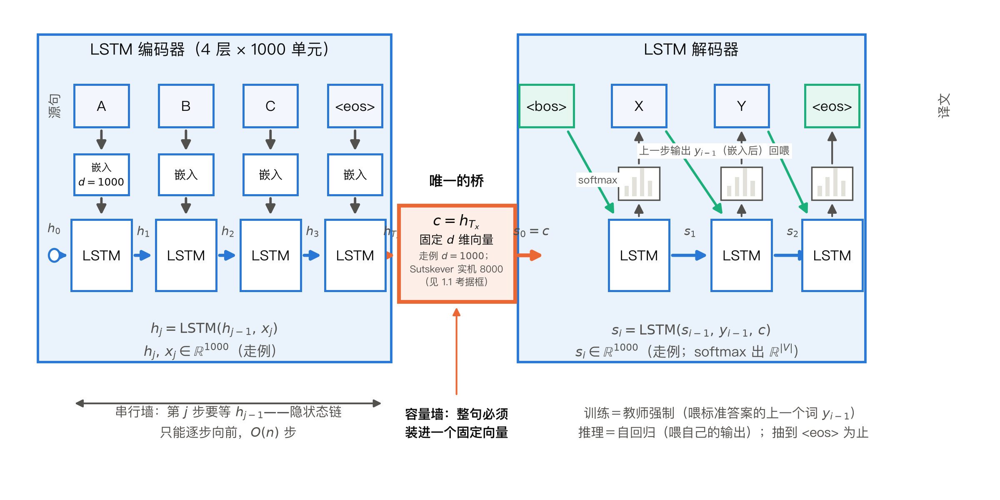
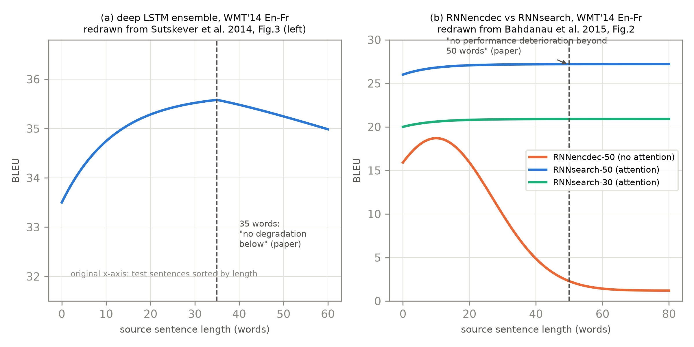
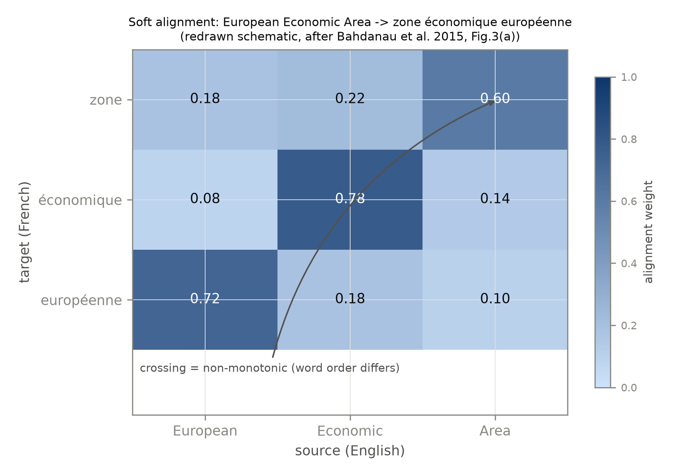
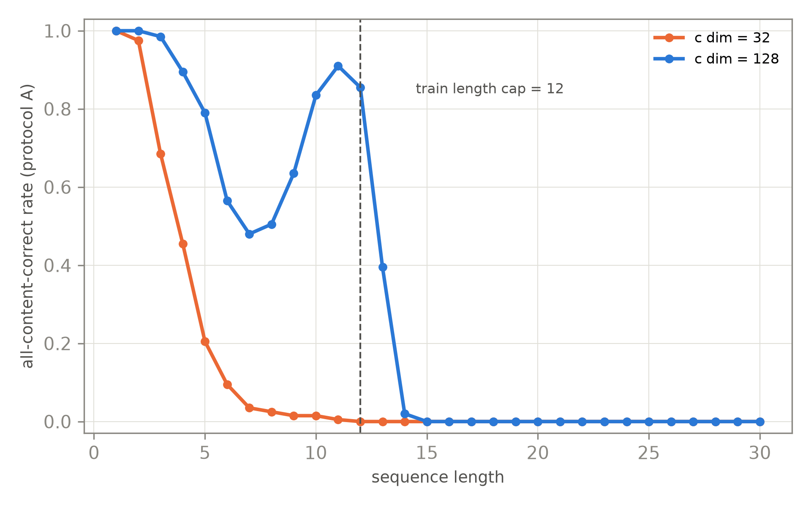

# 第 1 章 前史动机：seq2seq 瓶颈与 Bahdanau 注意力

## 1.0 开篇：从全书到这里

导览结尾我们把时间拨回 2014 年，说那里站着一台叫 seq2seq 的旧机器——「它有一个致命的行李箱」，面前立着两堵墙：容量墙与串行墙。先在整机前定位：导览 0.3 节立过「一台翻译机的两拍」——先整句读完（编码），再逐词写出（解码）；本章拆的 seq2seq 就是这副两拍骨架的 2014 年原版（2017 年的新机器原样继承，1.1 节末尾点名），它与导览那句「并行读完」的差别——只能一拍一拍串行地读——正是本章要看清的串行墙。但导览只报了墙的名字；要理解一堵墙为什么是**结构性**的、堆算力也拆不掉，得先画出被墙挡住的那台机器。本章就做这件事，不假设你读过任何 seq2seq 材料——1.1 节结束时，你应当能**凭记忆画出完整架构图**。

本章回答三个问题。其一，这台 2014 年的机器完整长什么样？1.1 节从任务形式化出发，把编码器、那只固定向量、解码器、两种运转模式逐个搭起来。其二，两个缺陷分别长在架构的哪个部位？——容量墙长在两塔之间的独木桥上（1.2 节，正反证据并置），串行墙长在塔内的隐状态链上（1.4 节）。其三，2014—2017 年的人拆墙拆到了哪一步？——Bahdanau 注意力拆掉半堵（1.3 节），GNMT 与 ConvS2S 从两个方向突围（1.5 节），1.6 节再把容量墙压缩成几分钟可复现的微实验。

本章结束时你手里会有：一张能默画的架构图、两堵墙的原文证据、一条自己跑出来的「墙位曲线」——以及一份对新机器的需求清单：既无循环、又让任意两个词一步可达。带着它，第 2 章起我们开始造零件。

> **最小背景栏**（读懂本章所需的全部前置）
> - **词嵌入（word embedding）**：神经网络吃不了文字符号，只认数字。做法是给词表里每个词发一个固定的 $d$ 维实数向量，全体向量构成一张可学习的查找表，用到哪个词就查哪一行。用人话说：每个词领到一张长度固定的「数字身份证」，证件号由训练学出来，语义相近的词证件号也相近。本章 $d=1000$【证据等级：Sutskever et al. 2014 §3.4】。
> - **循环单元（RNN→LSTM/GRU 的直觉版）**：一个内部带记忆的小盒子，每吃进一个输入向量，就把自己的记忆更新一次。最朴素的 RNN 有个毛病：新输入一来，旧记忆容易被整个冲刷掉，句子一长，开头的信息就存不住。LSTM（及其简化版 GRU）的解法是给记忆装阀门——一条传送带式的**记忆单元**，外加几道可学习的**门**：写入门管「新信息写入多少」，保留门管「旧记忆留下多少」，读出门管「此刻吐出多少」，开关状态本身是学出来的。本章把循环单元当黑盒用，你只需要「传送带＋阀门」这张图；门的精确公式与实现留到第 9 章 9.5 节。
> - **BLEU**：机器翻译自动评分，对机器译文与参考译文的重叠 n-gram 精确率取几何平均，再乘一个惩罚过短译文的因子（Papineni et al., 2002）。取值 0—100，越高越好。它是本章与前史诸论文通用的「质量」刻度；正式公式、实现与口径陷阱留到第 9、10 章。

## 1.1 机器翻译与 seq2seq：把一台完整的机器搭起来

开篇立了次序：先画机器，再找墙。翻译这件事，到底要机器算什么？

**翻译是「变长序列到变长序列」。** 源句是英语词序列 $x_1,\dots,x_{T_x}$，译文是法语词序列 $y_1,\dots,y_{T_y}$：句与句、源文与译文的长度都不同。2014 年之前的深度网络有个朴素限制：输入输出维度必须固定，做不了这种变长映射（Sutskever et al., arXiv:1409.3215, §1）。seq2seq（sequence to sequence，序列到序列）的破法，是把它改写成条件概率的学习——模型学分布 $p_\theta(y\mid x)$，按链式法则展开：

$$p_\theta(y_1,\dots,y_{T_y}\mid x_1,\dots,x_{T_x})=\prod_{t=1}^{T_y}p_\theta\!\left(y_t\mid y_1,\dots,y_{t-1},\,x_1,\dots,x_{T_x}\right)$$

用人话说：整句译文的概率被拆成一场逐词的连续抽签——每一步桌上摆着整句原文与已抽出的译文，模型给词表每个词发一个概率，抽中一个就摆上桌再抽下一个，抽到终止符为止，译长不必事先约定。训练目标就是最大化正确译文的 $\log p_\theta(y\mid x)$（Cho et al., arXiv:1406.1078, §2.2）。什么网络算得起这个连乘？答案分两半——**编码器**把变长源句读成固定长度向量，**解码器**从它出发逐词展开：两塔结构。

**编码器：逐词读入，攒一份不断更新的快照。** 它是一部循环网络，全部工作只有一句：

$$h_j = \mathrm{RNN}(h_{j-1},\,x_j)$$

用人话说：机器里备着一份「快照」$h$（隐状态，hidden state）；每读一个新词，就把旧快照与新词嵌入送进循环单元——最小背景栏那个「传送带＋阀门」的黑盒——揉出新快照：$(1000,)+(1000,)$ 进、$(1000,)$ 出，装着「到目前为止读到的一切」。

拿 3 词句 A B C 走一遍（嵌入与快照均 1000 维）：查表得 A 的向量，连同初始快照 $h_0$（置零）送入单元，得 $h_1$；读 B 得 $h_2$；读 C 得 $h_3$；再读句末标记 `<eos>` 得 $h_4$。四步，一条从左到右的依赖链 $h_0\to h_1\to h_2\to h_3\to h_4$——这条**隐状态链**就是编码塔的骨架，图 1.1 左塔画的正是它。读完全句，最后一份快照充当整句摘要：$c=h_{T_x}$（$T_x$ 记含 `<eos>` 的读入步数——本例 $T_x=4$，过桥的就是 $h_4$；Cho et al. 称之为「对整个输入序列的摘要 $c$」，§2.1）。

**c 是两塔之间唯一的桥。** 请在这里停一拍记牢：**从解码器的视角看，源句的一切——词义、词序、句长、语气——只能经过 $c$ 这一个固定长度的向量过桥；除它之外，解码器与源句之间再无任何信息通道。** Sutskever et al. 说得更直白：「用 8000 个实数表示一个句子」（§3.4）【证据等级：官方论文】。桥的宽度在造塔时就焊死了：源句 3 个词，过桥的是它；40 个词，过桥的还是它。1.2 节的容量墙就从这里长出来——先把桥画进图里。

> **【考据框】** 8000 怎么数出来的？Sutskever 的编码器是 4 层 LSTM、每层 1000 单元；只算隐状态，末步是 $4\times1000=4000$ 个数；论文口径的 8000 把每层的**记忆单元**也计入——每层内部本有两份千维向量：对外吐出的**隐状态**，与最小背景栏那条传送带（**记忆单元**），本章黑盒口径统称「快照」，于是 $8000=4\text{ 层}\times(1000+1000)$。本书统一按论文口径引用 8000。（跳过不影响主线。）

**解码器：逐步生成，上一步的输出回喂。** 桥那头的解码器也是循环网络，但它的循环里多两样东西：桥上传来的 $c$，和**它自己上一步吐出的词**（Cho et al., §2.2）：

$$s_i = f(s_{i-1},\,y_{i-1},\,c)$$

用人话说：解码器也有自己的快照 $s$；每写一个词之前，手里三样东西——上一刻的自己（$s_{i-1}$）、上一个吐出的词（$y_{i-1}$）、桥上传来的整句摘要（$c$）——揉成新快照 $s_i\in\mathbb{R}^{1000}$，再对它做一次线性变换加 softmax，得到词表上一份 $\mathbb{R}^{|V|}$ 的分布（Sutskever 目标端 $|V|=80{,}000$）——链式分解里那一次「抽签」。抽出的词接着回喂进下一步：**自回归**（autoregressive）。



图 1.1　seq2seq 完整架构：编码塔逐词读入（嵌入 → 循环单元 → 隐状态链），整句压进固定向量 $c$——**两塔之间唯一的桥**（橙色）；解码塔以 $c$ 为初始状态、回喂上一步输出逐词生成，直到 `<eos>`；底部标注两堵墙的位置与两种运转模式；塔底公式旁与 $c$ 框内标注走例形状（$h_j\in\mathbb{R}^{1000}$、嵌入 $d{=}1000$，$c$ 框内 1000/8000 两口径），全流程形状流转见表 1.1（自绘；机制要素对应 Sutskever et al. 2014 v3 Fig.1 与 Cho et al. 2014 v3 Fig.1，训练/推理模式标注为本书补充）

对着图 1.1 右塔走一遍：$c$ 成为解码器初始状态 $s_0$；第 1 步没有上一个词可回喂，就喂一个与 `<eos>` 对称的固定起始符 `<bos>`——抽中 X，X 的嵌入沿青色回路回喂；第 2 步抽中 Y，Y 回喂；第 3 步抽中终止符 `<eos>`，生成到此为止——译文多长，机器自己说了算。

把这次走例的形状流转钉成一张表——全章的「现场图」，两堵墙各卡哪一行一看便知：

| 步骤 | 运算 | 输入形状 | 输出形状 | 说明 |
|---|---|---|---|---|
| 编码第 $j$ 步 | 查嵌入表 | 词 id（标量） | $(1000,)$ | 每词一张「数字身份证」 |
| 编码第 $j$ 步 | $h_j=\mathrm{RNN}(h_{j-1},x_j)$ | $(1000,)+(1000,)$ | $(1000,)$ | 旧快照＋新词嵌入揉成新快照 |
| 编码全句 | 沿 $j=1,\dots,T_x$ 重复 | — | $h_1,\dots,h_{T_x}$ 各 $(1000,)$ | 串行：$h_j$ 必须等 $h_{j-1}$（串行墙，1.4 节） |
| 过桥 | $c=h_{T_x}$ | $(1000,)$ | $(1000,)$ | 两塔唯一通道，宽度造塔时焊死（容量墙，1.2 节；Sutskever 实机 8000 个实数，见考据框） |
| 解码第 $i$ 步 | $s_i=f(s_{i-1},y_{i-1})$，首步 $s_0=c$ | $(1000,)+(1000,)$ | $(1000,)$ | 上一刻自己＋上一步词的嵌入；Cho 接法 $c$ 每步到场，输入多一份 $(1000,)$ |
| 解码第 $i$ 步 | 线性＋softmax | $(1000,)$ | $(|V|,)$ | 词表上的分布，抽中回喂（自回归） |

表 1.1　seq2seq 走例的形状流转（自排；3 词句＋`<eos>`，$d=1000$；单句走例省去批维，真实训练把 $B$ 句拼成一批，所有形状前面多一维 $B$）

1.6 节的微实验把这张表原样缩小——1000 维缩到 32/128、词表缩到 13 个符号——桥还是第 4 行那座桥。

**桥的两种接法。** $c$ 进解码器，开山两篇接法不同：Sutskever 把它整个当作初始状态（$s_0=c$，此后每步只靠 $s_{i-1}$ 与回喂的 $y_{i-1}$ 推进）；Cho 的更新式则让 $c$ 参与每一步。本书记 Cho 的公式、图 1.1 按 Sutskever 画——两种接法只是「过桥的时间」不同，桥的唯一性等价。1.2 节的反方证据与 1.6 节的微实验（[`code/ch01/bottleneck_demo.py`](code/ch01/bottleneck_demo.py) 的 `EncDec.forward()` 与 `EncDec.greedy()`）都按 $s_0=c$ 走。

**两种运转模式：训练与推理。** 两种喂法，必须分开记。**训练用教师强制（teacher forcing）**：回喂的不是模型自己的猜测，而是标准答案里的上一个词 $y_{i-1}$——好处有二：每步输入已知，整句一次前向铺开批改；模型不会因前一步的错词被步步带偏，梯度信号干净。**推理用自回归循环**：真翻译时没有标准答案可喂，只能回喂自己上一步的输出直到 `<eos>`——一步走错，后面的输入就整个错了。这是「生成必须串行」的第一层体验（1.4 节还有更硬的一层：连「读」都是串行的）；两种模式第 9 章亲手实现。

**这台机器的真实规格。** 概念图之外，看一眼真实配置。Sutskever et al. 用 4 层 LSTM 做编码器、4 层做解码器，每层 1000 单元，源端词表 160,000、目标端 80,000，整个模型 384M 参数（其中循环连接 64M）【证据等级：官方论文 §3.4】。训练有个流传至今的技巧——**源句逆转**（reversal of the source sentence）：把 $a,b,c$ 改读成 $c,b,a$、目标句不动，以缩短两端的最小时间滞差——测试困惑度 5.8→4.7、BLEU 25.9→30.6【证据等级：官方论文 §3.3】。连词序都要靠反转迁就，本身就是「长程依赖难学」的自供状——直觉在第 2 章（路径长度）与第 5 章（位置编码）正式回收。算力上：单机 8 GPU，4 块按深度切分、另 4 块并行算 softmax，吞吐从约 1,700 词/秒提到 6,300 词/秒，整个训练约 10 天【证据等级：官方论文 §3.4–3.5】——第 11 章 11.1 节「并行化四锚点」的第一个锚点。成绩：WMT'14 英→法 ntst14 上，5 个逆转 LSTM 的集成以束搜索（beam search）宽度 12 拿到 34.81 BLEU，超过统计系统 Moses 的 33.30，再配 1000-best 重打分到 36.5（原文顺带报告 beam=2 已拿走大部分收益——第 8 章 8.5 节还会回来）【证据等级：官方论文 Table 1/2】——神经机器翻译第一次在真实基准上打平生产级系统。

与 Sutskever 同年的 Cho et al.（arXiv:1406.1078）独立给出了同一框架的概率表述（上文的链式分解与更新式出自 §2.1–2.2），循环单元后来以 GRU 之名通行于世。先记一个数字对比：Cho 的 $c$ 是 1000 维（§4.4），Sutskever 的末步状态是 8000 个实数——「用多少个实数装一个句子」，开山两篇答案不同，正是下一节的主角。Cho 这台模型当时只打算给统计翻译当打分特征：Moses 基线 33.30，加入 CSLM 与神经特征后 34.64【证据等级：官方论文 Table 1】。

> **【考据框】** 「GRU」这个名字：Cho et al. 原文只写了「带重置门与更新门的门控循环单元（a gated recurrent unit with a reset gate and an update gate）」，通篇不用「GRU」缩写——缩写是后续社区的约定，如今反而成了标准名。（跳过不影响主线。）

最后放回全书图景：「编码塔 → 压缩过桥 → 解码塔逐词展开直到 `<eos>`」这个双塔骨架，2017 年的 Transformer **原样继承，一处没改**，要换掉的只是塔内的信息通道——你刚画下的这张图，就是全书要改造的对象。

## 1.2 固定向量瓶颈：8000 个实数装一整句

上一节机器搭完了；现在对图 1.1 上那座橙色的桥做压力测试——把整句塞进一只固定大小的箱子。

**瓶颈是什么。** Sutskever 模型的解码器初始隐状态就是那个向量（§2, Eq.1）：源句的全部信息都必须经此一个向量转运【证据等级：官方论文】。把这只箱子想象成整句唯一的行李舱：10 个词的短句或许装得下；当句子有 40 个词、每个词都可能是 16 万词表中的任何一个时，这 8000 个实数就是全部舱位——句子再长，舱位也只有这么多。2014—2015 年，关于「这只箱子够不够」，两派证据针锋相对。

**正方证据：箱子不够。** Cho et al. 2014b（arXiv:1409.1259）做了专门的实证分析：RNN 编码器-解码器「在不含未登录词的短句上表现良好，但随着句子变长、未登录词变多，性能迅速退化」（摘要）；其 Fig.4(a) 画出了 BLEU 随句长的下降曲线，Fig.5 则显示 Moses 恰恰在长句上拿分。数字上：全集 BLEU 只有 13.92，对照 Moses 的 33.30；剥掉未登录词影响（无 UNK 句）也只有 23.45 对 35.63；在最干净的 10—20 词无 UNK 句上，27.81 仍输 Moses 的 33.08【证据等级：官方论文 Table 1】。他们给出的假设后来被整代论文引用：固定长度向量「没有足够的容量去编码一个具有复杂结构与含义的长句」（§5.1）。Bahdanau et al. 2015（arXiv:1409.0473）§1 正是沿着这条引文链提出自己的动机；其 Fig.2 复现了同一现象并加上对照组：不带注意力的 RNNencdec-50 的 BLEU 随句长急剧下降，而带注意力的 RNNsearch-50「对 50 词以上的长句也无性能恶化」【证据等级：官方论文 v7 Fig.2】。

**反方证据：箱子也许够。** Sutskever et al. 自己在 §3.7 报告过长句表现（Fig.3 左）：在按长度排序的测试句上，「少于 35 词的句子无退化，最长句只有轻微退化」【证据等级：官方论文 Fig.3 左】。读图注意一个细节：该图横轴是按长度排序后的测试句序号，并非句长本身。4 层深 LSTM、大词表、大数据——在这套配置下，容量墙至少被推到了 35 词之外。

图 1.2 把两条证据并置。



图 1.2　长句衰减双证对照（趋势示意重制）：(a) 改绘自 Sutskever et al. 2014 v3 Fig.3 左（反方证据）；(b) 改绘自 Bahdanau et al. 2015 v7 Fig.2（正方证据）。曲线为示意重绘、非逐值数据提取【证据等级：官方论文图（重制示意）】；(b) 所载论断的最早出处是 Cho et al. 2014b 的 Fig.4/Table 1（本书已补读核销，经 Bahdanau §1 转引的链条见正文）

**怎么读这场争论。** 三点。其一，两组实验的容器差 8 倍：Cho 系的 1000 维摘要（Cho14 §4.4）对 Sutskever 的 8000 个实数，训练数据规模也不同——**墙的位置随容量与数据移动**，这恰是「墙存在」的更细粒度说法，而不是谁做错了实验。其二，Sutskever 的「无退化」说的是集成模型，且依赖逆转输入这类补偿技巧。其三，2015 年的社区判断最终倒向正方：Bahdanau15 摘要以猜想口吻把固定长度向量称作基本编码器-解码器架构性能提升的瓶颈，并动手拆掉了它。1.6 节的微实验会把这场争论压缩成一个容量可调的最小实验——墙随 $c$ 的维度移动，眼见为实。

> **【考据框】** Cho14b（arXiv:1409.1259）是这条证据链上最常被跳读的一环：多数材料只引 Bahdanau15 的 Fig.2，而那张图的最早出处是 Cho14b 的 Fig.4/Table 1。本书写作期补读了原文并核销（前置任务批一 #2），正文数字因此直接锚定 Cho14b。（跳过不影响主线。）

## 1.3 Bahdanau 注意力：软对齐

墙的根子在架构图上看得清清楚楚——就是那座唯一的桥。于是补丁的思路也直截了当：既然一个向量装不下整句，那就别让它装。

让解码器在生成每个目标词时，回头在源句的**全部位置**里「自取」相关信息。Bahdanau、Cho 与 Bengio 给解码器的每一步 $i$ 配一个专属上下文向量 $c_i$，它由源句各位置的表示加权求和而成——权重刻画的就是「软对齐（soft alignment）」。

先把这套机制写成公式。以下三式编号沿用本书章.序；其中式 (1.2)(1.3) 即原文 Eq.(6)(5)，打分式 (1.1) 原文未编号（其单隐层 MLP 参数化见原文附录 A.1.2）：

$$e_{ij} = a(s_{i-1}, h_j) \tag{1.1}$$

用人话说：解码器举起自己上一刻的状态当「问询牌」，去和源句每个位置的表示挨个比一比——「我要写第 $i$ 个词了，你们谁与我相关？」$e_{ij}$ 就是第 $j$ 个位置交上来的相关度打分。

$$\alpha_{ij} = \frac{\exp(e_{ij})}{\sum_{k=1}^{T_x}\exp(e_{ik})} \tag{1.2}$$

用人话说：把一行打分过 softmax 变成百分比——总量 100% 的注意力摊给全部源位置，谁相关谁多分，但谁也不会被彻底排除；「软」就软在这里（硬对齐是只挑一个）。

$$c_i = \sum_{j=1}^{T_x}\alpha_{ij}h_j \tag{1.3}$$

用人话说：按摊好的百分比把源句每个位置的表示混合成这一步**专属**的上下文——第 $i$ 步要什么，现挑现混，不再用一只箱子装全句。

符号表（按 RNNsearch-50 配置，官方论文 §4.2）：

| 符号 | 含义 | 形状 |
|---|---|---|
| $s_{i-1}$ | 解码器生成第 $i$ 个词之前的隐状态（问询方） | $\mathbb{R}^{1000}$ |
| $h_j$ | 编码器在源位置 $j$ 的标注，双向拼接 $[\overrightarrow{h}_j;\overleftarrow{h}_j]$ | $\mathbb{R}^{2000}$（前向/后向各 1000） |
| $a(\cdot)$ | 打分函数：单隐层 MLP，$v_a^{\top}\tanh(W_a s_{i-1} + U_a h_j)$（附录 A.1.2） | 标量输出（吃两个向量） |
| $e_{ij}$ | 对齐打分 | 标量 |
| $\alpha_{ij}$ | 对齐权重（对 $j$ 归一化，和为 1） | 标量 |
| $c_i$ | 第 $i$ 步专属上下文向量 | $\mathbb{R}^{2000}$ |
| $T_x$ | 源句长度 | 标量 |

三式都立起来了，下面逐个部件读。打分（式 (1.1)）：那个小型前馈网络把两路状态先各自线性变换、相加、过 $\tanh$ 再投影——因为走「加法」路线，后世称之为加性注意力（additive attention）。三式的形状连成一条线：式 (1.1) 吃 $s_{i-1}\in\mathbb{R}^{1000}$ 与 $h_j\in\mathbb{R}^{2000}$、吐出标量 $e_{ij}$；把 $j=1,\dots,T_x$ 并列，一步就攒出一行打分 $\in\mathbb{R}^{T_x}$；式 (1.2) 对这一行做 softmax，形状不变；式 (1.3) 拿这行权重去乘按行摞好的标注矩阵 $H\in\mathbb{R}^{T_x\times2000}$（$H$ 是本书为看清形状起的记号：把 $h_1,\dots,h_{T_x}$ 逐行摞起来）——$(1,T_x)\times(T_x,2000)\to(1,2000)$，得 $c_i\in\mathbb{R}^{2000}$。解码共 $T_y$ 步、每步一行，行摞起来就是一张 $\alpha\in\mathbb{R}^{T_y\times T_x}$ 的对齐矩阵；「摞起来一次乘」这个动作，第 2 章会把它升格为正式的矩阵写法。加权（式 (1.2)(1.3)）：$c_i$ 是源句表示的凸组合，**每一步重算一份**；解码器状态更新为 $s_i = f(s_{i-1}, y_{i-1}, c_i)$——1.1 节 Cho14 框架里那个常量 $c$ 在这里被「逐步化」了。

结构上还有一处选择值得停一下：编码器是**双向**的——前向网络从左读到右、后向从右读到左，每个源位置的标注是两个方向隐状态的拼接 $h_j=[\overrightarrow{h}_j;\overleftarrow{h}_j]$（§3.2），于是每个源位置既知道左边又知道右边。2017 年 Transformer 的编码器用自注意力一步到位地双向，而解码器必须保持单向（因果性）——双塔的种子在此埋下，第 4 章 4.1-4.2 节展开。

机制交代到这里，成绩与副产品一并交账。训练口径：词表每语言 30,000，嵌入 620 维，WMT'14 英法 850M 词过滤至 348M，Adadelta，每模型约 5 天（108—113 GPU 时）【证据等级：官方论文 §4.2/Table 2】。成绩（Table 1）：同为 30 词上限训练，RNNencdec-30 得 13.93 BLEU，RNNsearch-30 得 21.50；50 词上限下 17.82 对 26.75；加长训练的 RNNsearch-50⋆ 达 28.45；在不含未登录词的句子上，RNNsearch-50⋆ 的 36.15 已经追平 Moses 的 35.63【证据等级：官方论文 Table 1】。两个细节值得记住：其一，§5.1 观察到 RNNsearch-30（21.50）反超 RNNencdec-50（17.82）——带注意力的「浅」模型打赢了不带注意力的「深」模型，容量的账比深度的账更值钱；其二，$\alpha_{ij}$ 是免费的副产品，训练完把权重直接画出来就是一张对齐矩阵。顺带一个口径提醒：这几篇论文里 Moses 的 33.30（全集）与 35.63（无 UNK 句）是同一系基线在不同口径下的复用，跨论文比数字永远要先对口径（第 10 章 10.1 节的引用对照纪律由此起）。



图 1.3　软对齐热图：European Economic Area → zone économique européenne 的非单调对齐（示意重制，改绘自 Bahdanau et al. 2015 v7 Fig.3(a)；格内数值为示意、非提取值）【证据等级：官方论文图（形态示意重制）】

图 1.3 重制了原文 Fig.3(a) 的名场面：三个英语词译成三个法语词时词序交叉，「zone」主要看向「Area」、「européenne」主要看向「European」，对角线被翻转——这种非单调对齐正是传统短语表要靠人工对齐语料硬编码、而软对齐自动学出来的东西。看图时顺手把形状也对上：整张热图就是 $\alpha$ 全矩阵 $(T_y,T_x)$（本例 $3\times 3$），每格一个 $\alpha_{ij}$、每行和为 1——它既是语义证据，也是式 (1.2) 逐行归一化的可视化。

式 (1.1)—(1.3) 与第 2 章式 (2.1) 的缩放点积注意力（scaled dot-product attention）在结构上同构：打分、softmax、加权求和三步不增不减。差别集中在打分函数（加性 MLP 对缩放点积）与注入位置（每步一次对每层一次）。把零件放回整机图景看一眼：此刻的注意力仍是循环机器上的一个**配件**——它给解码器配了望远镜，让每步看得见全句，但两座塔本身还是循环塔。2017 年那篇论文的标题攻击的正是这一点——注意力不该是配件，而该是全部。

## 1.4 缓解但不痊愈：注意力仍嵌在 RNN 里

容量墙拆了一半。现在站到第二堵墙跟前——但要讲清它，得回到 1.1 节画的那两条隐状态链，回答一个机制问题：**为什么循环网络必须一步步算？并行性到底被什么挡住了？**

**串行性写在下标里。** 再看编码器的更新式 $h_j=\mathrm{RNN}(h_{j-1},x_j)$：右端**包含** $h_{j-1}$——第 $j$ 步的输入之一，恰是第 $j-1$ 步的输出。这条数据依赖边意味着：$h_{j-1}$ 不存在，$h_j$ 就无从算起；GPU 能同时做一千个互不相干的乘法，却不能「预支」一个还不存在的数。教师强制可以让所有输入词的嵌入提前备好（第 1 步要的词、第 100 步要的词同时查表），但隐状态链本身仍要逐格传递：$h_1$ 出来才有 $h_2$，$h_2$ 出来才有 $h_3$……前向走 $n$ 步，反向传播沿同一条链原路走回，同一层内没有可摊开的大矩阵可算。顺带拆掉一个常见的 API 错觉：PyTorch 里 `nn.LSTM` 一次调用看似整句进、整句出，内核仍按时间步逐步展开——API 的封装不改变写在下标里的依赖。$n$ 个 token 就是 $O(n)$ 次串行操作——这不是实现不够努力，是循环定义本身的天性（该口径的正式表述是第 2 章 2.4 节 Table 1 的 Recurrent 行）。

**链还有第二重代价：路径长度。** 位置 1 的信息要影响位置 40 的输出，必须沿链被搬运 39 次——每经一次循环单元，就有一次被冲刷、被稀释的风险（最小背景栏里 LSTM 的门，正是为缓解它而生）。Sutskever 的源句逆转，本质就是给这条搬运路线减负：让源端与目标端的位置尽量对齐。1.1 节那句「连词序都要靠反转来迁就」，此刻有了机制层面的解释。

**注意力的账：早就存在，只是摊着付。** 1.3 节的公式是怎么被执行的？打分用的 $s_{i-1}$ 来自解码器的循环状态，$h_j$ 来自编码器的循环状态，两条循环网络仍要按时间步依序展开。把这件事算成一笔账更能看清要害：Bahdanau 的解码器共 $T_y$ 步，每步对全部 $T_x$ 个源位置打分——注意力计算总量本来就是 $O(T_y \cdot T_x)$（$T_y$ 行、$T_x$ 列，恰是 1.3 节那张 $\alpha\in\mathbb{R}^{T_y\times T_x}$ 对齐矩阵的格子数），二次方的账其实已经在了，只是被摊在 $n$ 次串行小步里逐笔支付；GPU 擅长的是把一个大矩阵乘一次算完，而不是把 $n$ 个小矩阵乘排成队。2017 年的关键动作之一，正是把这笔已经存在的账合并成一次可并行的大矩阵乘（第 2 章 2.2 节）。换句话说：Transformer 后来付出的 $O(n^2)$ 不是新加的税，是把旧税改成能刷卡的缴法。

这堵墙在工程上有多真实，GNMT 的推理速度表是一份残酷的样本：6003 句开发集解码，88 核 CPU 用时 1,322 秒，K80 GPU 反而要 3,028 秒，TPU 384 秒【证据等级：官方论文 1609.08144 Table 1】。GPU 输给自家 CPU 2.3 倍——不是 GPU 弱，是循环模型解码的步与步之间没有可摊开的大批量并行。Google 的应对是把堆算力推到极限：96 块 K80、约 6 天（另加强化学习精调约 3 天），这已是循环架构工业化训练的天花板量级。「能并行，才敢谈规模化」——这个判断在第 11 章以四锚点谱系收束，此处先按下。

## 1.5 前史竞速的两条突围

到 2016 年，两堵墙都已被点名，社区从两个方向同时逼近「去掉循环」。

**GNMT：把循环堆到工业极限。** Wu et al.（arXiv:1609.08144）的答案是更深：8 层编码器 + 8 层解码器 LSTM，每层 1024 单元，编码器第一层双向。深度立刻带来训练崩溃——他们的消融写得直白：无残差连接的堆叠 LSTM「4 层尚可，6 层勉强，8 层及以上训不动」（梯度爆炸/消失）；加残差连接（residual connection，自底向上第 3 层起）后 8+8 层可训且更深更好【证据等级：官方论文 §3.1】。残差是深度的许可证，第 6 章 6.2 节会把这条证据正式接入 Transformer 的子层包裹设计。注意力只设一处（解码器最底层接编码器最顶层，为保解码主体可并行）。训练成本：96 块 K80、约 6 天（另加 RL 精调约 3 天）。成绩：WMT'14 En-De 24.61、En-Fr 38.95（单模型，32K wordpiece 词表）；解码配 beam 8—12、长度惩罚 $\alpha=0.2$、覆盖惩罚 $\beta=0.2$——第 8 章 8.5 节长度惩罚公式的直系血统。

**ConvS2S：干脆换掉循环。** FAIR 的 Gehring et al.（arXiv:1705.03122）用卷积替换循环：15+15 层卷积块，核宽 3，每块输出过门控线性单元（gated linear units, GLU）$v([A\ B]) = A \otimes \sigma(B)$，残差分支乘 $\sqrt{0.5}$ 控制方差（§3.2）。位置信息不再由读入顺序隐式承载，而是显式的学习式位置嵌入：词嵌入与位置嵌入逐元素相加 $e_j = w_j + p_j$（两者同为 $d$ 维、形状相同才能逐元素相加），编码、解码两侧都加（§3.1）——这是 Transformer 论文 §3.5 里「learned positional embedding [9]」的引用先例，第 5 章 5.4 节的消融对照 (E) 行由此而来。注意力也升级为每层一个独立模块（multi-step attention）：每个解码层各自算一份点积注意力，条件输入加的是「编码器输出＋输入嵌入」$c^l_i = \sum_j a^l_{ij}(z^j_u + e_j)$，作者自比键值记忆网络（§3.3）；实测 5 层全注意只比单层注意慢 4%（§5.5）。去掉循环后速度立竿见影：K40 上比 GNMT 的 K80 快 9.3 倍且 BLEU 反高 2.25【证据等级：官方论文 Table 3】。成绩：En-De 25.16（超 GNMT 0.5）、En-Fr 40.46（版本口径见本章考据框）。

但卷积有自己的税：固定核宽意味着有限感受野（receptive field），En-Fr 大模型的有效感受野只有 25 词（§5.1 原文自曝）；要让相距 $n$ 的两个词相互作用，连续核要堆 $O(n/k)$ 层（空洞卷积才降到 $O(\log_k n)$，Table 1 取后者口径）。表 1.2 把三条路线放进一张表。

| | Sutskever et al. 2014 | Wu et al. 2016（GNMT） | Gehring et al. 2017（ConvS2S） |
|---|---|---|---|
| 架构 | 4+4 层深 LSTM | 8+8 层 LSTM＋残差（自第 3 层） | 15+15 层卷积块（核宽 3）＋GLU |
| 源句信息的载体 | 固定向量（末步隐状态） | 固定向量＋一处注意力 | 每层独立注意力（multi-step） |
| 位置信息 | 读入顺序（源句逆转技巧） | 读入顺序 | 学习式位置嵌入 $w_j + p_j$ |
| WMT'14 BLEU | En-Fr 34.81（5 集成 beam 12） | En-De 24.61 / En-Fr 38.95（单模型） | En-De 25.16 / En-Fr 40.46（单模型，v2 口径） |
| 训练成本 | 8 GPU × 约 10 天 | 96×K80 × 约 6 天（＋RL 3 天） | En-De 单 GPU 18.5 天；En-Fr 8 GPU 约 37 天 |
| 串行操作数 | $O(n)$ | $O(n)$ | $O(1)$（路径长度 $O(\log_k n)$） |
| 留给 2017 年的遗产 | encoder-decoder 骨架与「瓶颈」问题本身 | 残差连接；长度/覆盖惩罚解码配方 | 每层注意力、位置嵌入先例、Table 2 直接对手 |

**表 1.2　前史三篇与两条突围路线对比（自排）**

表注：串行操作数与路径长度按 Transformer 论文 v7 §4 Table 1 口径，其中 ConvS2S 路径长度 $O(\log_k n)$ 为空洞卷积口径（连续核要堆 $O(n/k)$ 层，见本节正文）；BLEU 各论文分词与词表口径不同（word/wordpiece/BPE），只在趋势层对照，第 10 章展开口径警示。【证据等级：官方论文（papers/02 前史链调研已核）】

**还缺什么。** 循环路线串行 $O(n)$，深度与并行性互相锁死；卷积路线拿到了 $O(1)$ 串行操作，但路径长度 $O(\log_k n)$、感受野受限。2017 年 6 月的答卷要同时拿走两块蛋糕：注意力直连任意两个位置（路径 $O(1)$），且没有循环可展开（层内全并行）——代价是每层 $O(n^2 d)$ 的计算量。这笔交易在第 2 章 2.4 节逐项算账。

> **【考据框】** 两处易错：其一，GNMT 的低精度训练用的是 8-bit 定点权重加 16-bit 定点累加器，不是常被误传的 float16；量化只损失 0.0072 log-PPL、BLEU 无损（§6）。其二，ConvS2S 的 En-Fr 40.46 是 arXiv v2 版数字——Transformer 论文 Table 2 引的正是这个口径，v3 已改 40.51；「引用必须锚定版本」的第一课，第 10 章 10.1 节还会正式开讲。（跳过不影响主线。）

## 1.6 微实验：把「8000 个实数」搬进笔记本

前文的容量墙证据来自 2014—2015 年的论文，模型、数据、词表各不相同，「双证并置」终究是各说各话。本节把这件事压缩成一个容量可调、几分钟可复现的最小实验（图 1.4 的全部数字来自本机实跑）。

合成「随机符号序列的变换映射」任务：源序列由 10 种符号（1—10）随机组成，目标序列是源序列逐位经过一个固定随机置换、保持词序。任务不含任何语言结构，对模型的全部要求是「从上下文向量 $c$ 中按位置读出整条源序列」——内容与顺序都要装进 $c$，与翻译任务的本质压力同构，而变量只剩容量。

模型就取一对最小的循环塔：一层 GRU 编码器（GRU 即最小背景栏里那个「传送带＋阀门」黑盒，门公式见第 9 章 9.5 节）读入源序列与句末 `<eos>`，末步隐状态即 $c$——图 1.1 那座桥的缩小版；一层 GRU 解码器以 $c$ 为初始隐状态逐词生成。解码输入序列在标准答案前冠一个起始符 `<bos>`——即 1.1 节那个与 `<eos>` 对称的符号（代码里记作大写常量 `BOS`/`EOS`）：教师强制喂的是右移一位的标准答案（`[<BOS>, y_1, …]`，代码里的 `y_in` 正是这么拼的），推理时则由模型自己的输出顶上。训练长度 1—12 均匀采样，教师强制（teacher forcing，1.1 节的训练模式），Adam（$10^{-3}$，后段降至 $3\times10^{-4}$），batch 64，共 12,000 步。两个容量档：$c \in \mathbb{R}^{32}$ 与 $c \in \mathbb{R}^{128}$。

```python
# [`code/ch01/bottleneck_demo.py`](code/ch01/bottleneck_demo.py) 的 EncDec 节选
class EncDec(nn.Module):
    """无注意力 GRU encoder-decoder：整句压进编码器末步隐状态 c（「8000 个实数」的缩小版）；
    解码器以 c 为初始隐状态逐词展开（Sutskever §2 的 v 即此设计）。
    I/O 形状：x (B,Lx) 词 id、y_in (B,Ly) 词 id → logits (B,Ly,VOCAB)。"""

    def __init__(self, hidden: int):
        super().__init__()
        self.emb = nn.Embedding(VOCAB, 32, padding_idx=PAD)
        self.enc = nn.GRU(32, hidden, batch_first=True)
        self.dec = nn.GRU(32, hidden, batch_first=True)
        self.out = nn.Linear(hidden, VOCAB)

    def forward(self, x, y_in):
        _, h = self.enc(self.emb(x))               # (B,Lx)→(B,Lx,32)，末步 h [1,B,hidden] = 固定上下文向量 c
        logits, _ = self.dec(self.emb(y_in), h)    # (B,Ly,32)＋c 作初始状态 → (B,Ly,hidden)：逐词展开
        return self.out(logits)                    # (B,Ly,hidden)→(B,Ly,VOCAB)
```

这套形状流转与表 1.1 完全同构——查表得 $(B,L,32)$、编码器末步隐状态即 $c\in\mathbb{R}^{B\times\mathrm{hidden}}$、线性层出 $(B,L,13)$——只是把 1000 维的走例缩到 32/128 维、词表缩到 13 个符号（10 个内容符号＋`<bos>`/`<eos>`/PAD），桥还是那座桥。

评测协议这样设计——长度 1—30 逐桶评测（每长度 200 个新鲜样本，贪心解码），用两个协议把「读对内容」与「停对位置」解耦：

- 协议 A（内容召回）：长度由参考侧给定——与 BLEU 对着参考译文计分同理——解码时屏蔽终止符与填充符的 logits，逐位在 10 个内容符号中取 argmax；指标为逐位准确率与「整句内容全对率」；
- 协议 B（整句精确）：自由贪心解码，模型须自行产出全部符号并在恰好正确的位置产出 `<eos>`。



图 1.4　固定向量的容量墙：整句内容全对率（协议 A）随序列长度衰减；虚线为训练长度上限 12（自产，本书实验）【证据等级：本书实验（M5 Pro/CPU，2026-10）】

把图 1.4 背后的数字摆出来【证据等级：本书实验（M5 Pro/CPU，2026-10）】。整句内容全对率（协议 A）：

- $c \in \mathbb{R}^{32}$：训练约 25 秒，末段损失 0.3042。1—5 词桶平均 0.664，6—10 词桶崩到 0.037，11 词以上归零——墙落在训练范围之内；
- $c \in \mathbb{R}^{128}$：训练约 60 秒，末段损失 0.0078。训练范围内基本装下（1—3 词 0.99—1.00，11、12 词仍有 0.910 与 0.855），上限之外悬崖式崩塌：13 词 0.395，14 词 0.020，15 词起 0.000；远端 26—30 词桶逐位准确率仍残留 0.295（瞎猜为 0.1），说明崩塌是「装不下」而非「什么都没学到」；
- 协议 B（整句精确率）几乎全线为零，唯一显著例外在 $c=128$ 档的 11、12 词处（0.300 与 0.850；13 词尚残留 0.075）。解码样例显示内容大多读对、但停不准：模型倾向「跑满约 12 步再停」（恰为训练长度上限），而不是「读尽即停」。数不清自己读了多少，是循环解码器独立于容量的另一桩病理；
- 两档末段损失 0.3042 对 0.0078：小容量模型连训练分布本身都拟合不动（欠拟合），不是评测太苛刻。

**解读与边界。** 容量翻 4 倍，墙右移约一个倍频程（约 6 词到 13—14 词），但两个容量档都在 30 词内崩到零——与 1.2 节双证的读法一致：墙的位置随容量移动，墙的存在不随容量消失。Sutskever 的 8000 个实数、深得多的网络与大得多的数据把墙推到 35 词之外，是同一根轴上的远端。边界声明：合成任务没有语言结构；单种子；$c=128$ 档曲线在 6—8 词处有一处浅谷（非严格单调，如实呈现）；结论只主张趋势级。第 9 章 9.5 节将在真实数据（Multi30K）上复活 GRU 双 baseline（无注意力对有注意力），把本节的玩具观察升级为容量墙的活体展示。

## 1.7 本章小结

开篇问了三个问题，现在逐一交卷。机器长什么样：1.1 节把 seq2seq 从任务形式化搭到完整双塔——编码器逐词攒快照，末快照 $c$ 是两塔唯一的桥，解码器回喂上一步输出逐词生成直到 `<eos>`，训练用教师强制、推理走自回归。墙长在哪里：容量墙长在桥上——8000 个实数装整句，Cho14b 与 Bahdanau15 给出正方证据，Sutskever 的深 LSTM 给出反方证据，微实验把争论变成可复现的容量-墙位实验（1.2、1.6 节）；串行墙长在链上——$h_j$ 依赖 $h_{j-1}$，$O(n)$ 步依序计算写在定义的下标里（1.4 节）。人拆到了哪一步：Bahdanau 注意力用软对齐（式 (1.1)—(1.3)）让解码器每步自取信息，质量在无未登录词句上追平统计系统，但塔还是循环塔——容量墙缓解，串行墙未动（1.3、1.4 节）；GNMT 把循环堆到 96×K80 的工业极限，留下残差连接与解码配方两份遗产；ConvS2S 换卷积拿到并行与学习式位置嵌入，却受困于感受野（1.5 节）。

**带走的心智**：如果忘掉本章的所有数字，请留下三幅画。**第一幅，唯一的桥：两塔之间所有信息只经一个固定长度的向量。** 以后无论看到什么架构，先找它的「桥」——谁把全部信息挤进一个固定容器，谁身边就立着一堵容量墙；本章之后你遇到的注意力、外推、上下文长度之争，全是这座桥的现代变奏。**第二幅，两堵墙：装不下、快不了。** 而且要记得它们是结构性的——墙位随容量移动，墙的存在不随容量消失；并行性被数据依赖挡住，堆再多卡也翻不过。**第三幅，箱子装不下整句：** 固定容量对上变长信息，长句必然先崩——「墙位随容量移动」这个判断力，1.6 节的两条曲线就是它的最小标本。

出发段到此走完：我们看清了为什么需要新机器，手里攥着需求清单——既要任意两词一步可达（拆路径长度），又要层内没有依赖链可展开（拿回并行），还舍不得 1.3 节那套软寻址。零件铺从下一章开始：第 2 章把注意力从「RNN 的配件」升格为可单独定义、分析、实现的运算——缩放点积注意力，全书的第一块零件。

> **【欠账】F3 并行化红利：** 能并行，才敢谈规模化。2017 年这台翻译机最被低估的遗产不是 BLEU，而是「可以在一千张卡上训练」的资格——预训练革命的物质基础。本册第 11 章收束时以四锚点谱系重讲，正式回收在下一册开场。→ Book2 第 1 章
>
> **【欠账】F10 固定容量焦虑：** 注意力的发明本来就是为了打破容量的墙；七年后墙换成了上下文长度，武器换成了外推与压缩，但战斗是同一场。本册只解决「一句译文」的容量，现代变形留给主线。→ Book2 第 12 章（收束），线索贯穿 Book3 第 7 章、Book5 第 8 章

## 1.8 动手验证

**入口命令**

- 实验与图 1.4：`source env.sh && python [`code/ch01/bottleneck_demo.py`](code/ch01/bottleneck_demo.py#L129)（入口 `main()`；模型与双协议贪心解码见 `EncDec` 与 `EncDec.greedy()`；CPU 约 90 秒）
- 图 1.1—1.3：`source env.sh && python [`code/ch01/make_figures.py`](code/ch01/make_figures.py#L43)（`fig_1_1()`/`fig_1_2()`/`fig_1_3()`；秒级）

**预期产出**（本机 M5 Pro / CPU 实测）

- 训练日志：`[hidden=32] 训练 ~25s × 12000 步，末段损失 0.3042` 与 `[hidden=128] 训练 ~60s × 12000 步，末段损失 0.0078`（秒数随机器浮动，损失与分桶数字在固定种子下不变）；
- 分桶表首行（句长 1—5）：句内容全对(A) / 逐位准确(A) / 整句精确(B) 两档依次为 0.664 / 0.867 / 0.000 与 0.934 / 0.980 / 0.000；
- 产物：`figures/fig-1-4-capacity-wall-curve.png` 与 `log/Book1-ch01/bottleneck_results.json`（逐长度全量数字）；
- 固定种子（2017）下本机逐次运行结果一致；跨机器可能有微小数值差异，趋势（墙位随容量右移、训练上限外崩塌）不变。

**验收点**

1. 不看书画出图 1.1 的完整数据流：源句 → 词嵌入 → 编码器隐状态链 $h_1\to h_2\to\cdots\to h_{T_x}$ → $c$（两塔唯一的桥）→ 解码器初始状态 $s_0=c$ → 逐词生成、上一步输出回喂 → `<eos>` 停止；并说出训练（教师强制）与推理（自回归）两种模式回喂的东西有何不同，且每步的形状对得上表 1.1；
2. 能说出容量墙的正反两方证据（Cho14b 的 Table 1 数字、Bahdanau15 Fig.2 对 Sutskever Fig.3 左）与「墙位随容量移动」的读法；
3. 能从机制上解释注意力为什么「缓解但不痊愈」：信息不必再挤一个向量，但 $h_j$ 依赖 $h_{j-1}$ 的串行链未除；
4. 复跑本节实验，在图 1.4 上核对两个现象：$c=32$ 的墙落在训练范围内、$c=128$ 在训练上限外悬崖崩塌。
