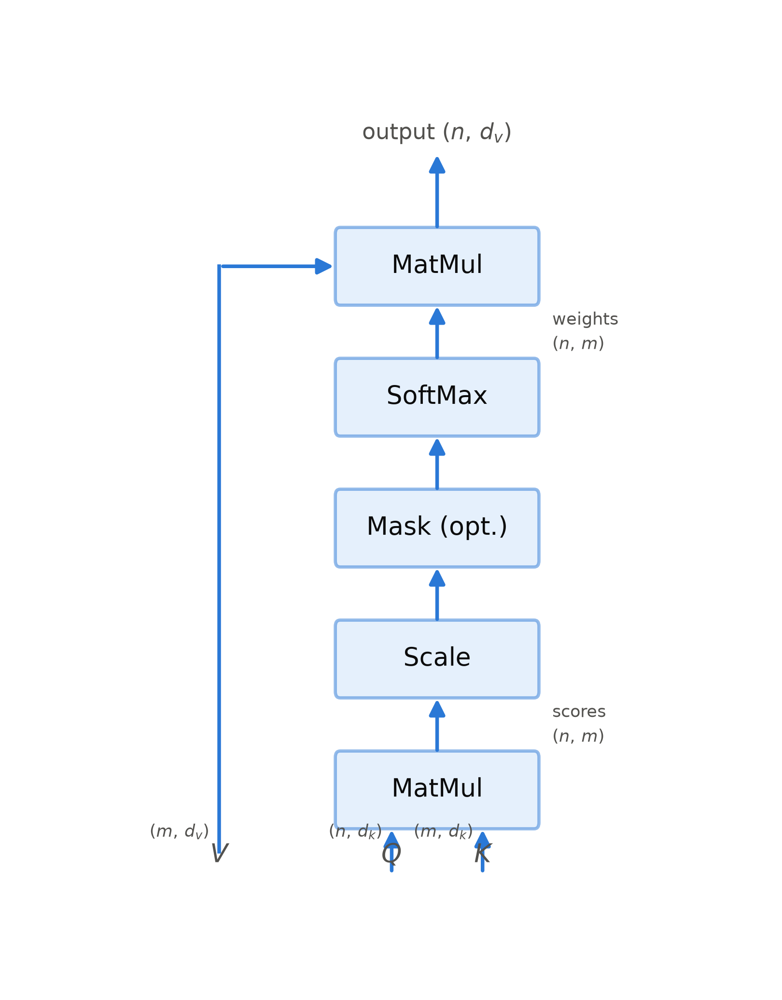
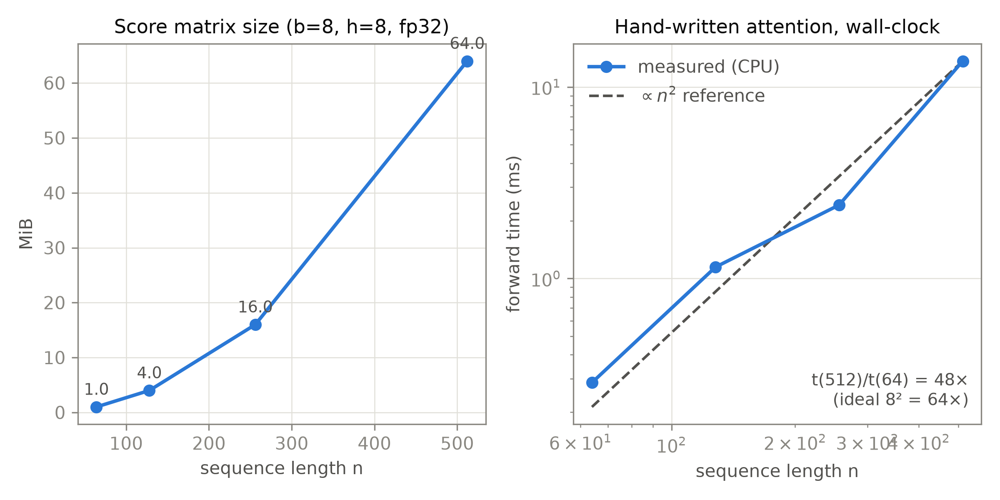
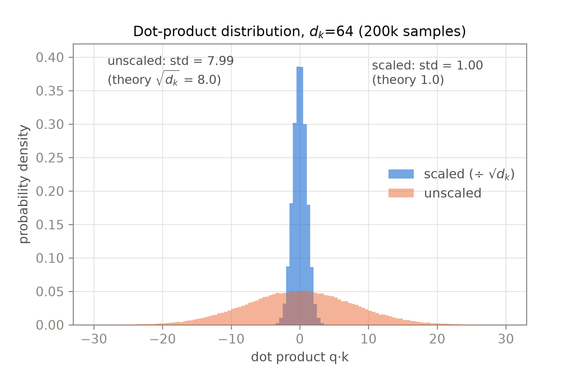

# 第 2 章 缩放点积注意力

## 2.0 开篇：从全书到这里

上一章结束时，我们站在 2017 年 6 月的门口。回头看：seq2seq 把整句压进一个固定向量，Bahdanau 注意力用软对齐三式（第 1 章式 (1.1)—(1.3)）给了解药——解码器每生成一个词，回头在源句里「自取」相关信息。但那副药只治了一半：注意力还挂在循环网络的解码循环上，一步一算；第 1 章 1.4 节算过这笔账——$O(T_y\cdot T_x)$ 的注意力量本来就在，只是被摊在 $n$ 次串行小步里逐笔支付，串行墙原封未动。GNMT 把循环堆到 96×K80 的天花板，ConvS2S 换卷积拿到并行却受困于感受野。章末的局面一句话：**需要一种既无循环、又保 $O(1)$ 路径长度的机制**。从本章起，我们离开「出发」段，进入旅程地图的「零件铺」——自己动手造它。动手前先在整机上定个位：整机粗图见导览 0.3 节，零件的安装位置以第 4 章图 4.1 为准——本章要造的缩放点积注意力，装的是图 4.1 双塔里每一个「Multi-Head Attention」子层框内的公共内核；先造内核，多头外壳与三种岗位的接线分别是第 3、4 章的事。

本章回答的问题是：如果把注意力从「循环网络的配件」升格为一个**独立运算**——自己定义、自己分析、自己实现——它应该长什么样？这就是论文标题《Attention Is All You Need》在结构上的落点。我们将拿到整台机器的第一个零件：缩放点积注意力（scaled dot-product attention）；同时开始记导览里说好的「一本账」——$O(n^2)$ 这笔贯穿全丛书的账，从本章第一次算起，另一个数 $\sqrt{d_k}$ 也从本章开始陪伴我们。

结束时我们会到达哪里？一个四行核心代码、能与 PyTorch 官方算子逐位对拍的注意力实现，一笔能手算到字节的账本。但新问题也会立刻冒出来：这个运算一次只产出**一份**注意力分布——句法、指代、相邻、语义，所有关系挤在同一口锅里被平均。拆这口锅，是第 3 章多头注意力的任务。

> **最小背景栏**（读懂本章所需的全部前置）
> - **softmax 与它的梯度**：给定向量 $z\in\mathbb{R}^{m}$，
>   $$\mathrm{softmax}(z)_i=\frac{e^{z_i}}{\sum_{j=1}^{m}e^{z_j}}$$
>   用人话说：把一组任意大小、可正可负的分数，折成一份总和恰为 1 的百分比表——分高的拿大头，但人人有份、谁也不为零。它对输入的雅可比矩阵为 $J_{ij}=p_i(\delta_{ij}-p_j)$（$p=\mathrm{softmax}(z)$，$\delta$ 为克罗内克记号）。用人话说：分布越是一边倒，这组导数整体越小——前向越笃定，反向越学不动。当某个 $p_i$ 趋近 1、分布「饱和」成近似 one-hot 时，$J$ 的所有元素同时趋近 0——这就是本章反复用到的梯度消失机制。
> - **矩阵乘法复杂度**：$(n\times d)$ 与 $(d\times m)$ 的矩阵相乘需要 $2nmd$ 次浮点运算（乘加各计一次），记 $O(n\cdot m\cdot d)$。用人话说：一次矩阵乘的价钱由三个维度连乘决定——本章与后续所有复杂度记账，都从这条乘法口诀出发。矩阵乘法是数值计算几十年工程积累最深的算子，这一点本身就是本章结论的一部分。

## 2.1 从加性到点积：兼容性函数之争

要升格为独立运算，第一件事是把注意力身上最「配件气」的部件换掉——打分函数。它凭什么最「配件气」？第 1 章 1.3 节的软对齐三式里，打分函数 $e_{ij}=a(s_{i-1},h_j)$ 是一个抽象符号 $a(\cdot,\cdot)$——Bahdanau 论文只实现了一种：单隐层前馈网络 $e_{ij}=v_a^{\top}\tanh(W_a s_{i-1}+U_a h_j)$。用人话说：把两路状态各自线性改写、加在一起，塞进一个窄窄的非线性网络，压出一个分数——因为是「先相加、再过网络」的兼容性度量，后世称之为加性注意力（additive attention）。Luong 等人在 2015 年指出的正是这一点：此前的注意力研究基本只沿着 Bahdanau 的 concat 一种打分展开，没人把 $a(\cdot,\cdot)$ 本身当成设计空间【证据等级：Luong et al. 2015（arXiv:1508.04025 v5）§1/§3.1】。他们的论文就是第一次系统消融：打分函数族见表 2.1，另有 global（对全部源位置算权重）与 local（先预测一个窗口，只看窗口内）两种注意力范围、以及 input feeding（把上一步注意力输出拼回下一步输入，让模型记得先前对齐过什么）的对照。

| 打分函数 | 公式 | BLEU | 备注 |
|---|---|---|---|
| dot | $\mathrm{score}(h_t,\bar h_s)=h_t^{\top}\bar h_s$ | 20.5 | 无参数，纯内积 |
| general | $\mathrm{score}=h_t^{\top}W_a\bar h_s$ | 19.1 | 内积中间插一个可学习矩阵 |
| concat | $\mathrm{score}=v_a^{\top}\tanh(W_a[h_t;\bar h_s])$ | — | 即 Bahdanau 加性形式，Luong 未重测 |
| location | $a_t=\mathrm{softmax}(W_a h_t)$ | 19.3 | 不看源端内容，只看位置偏好 |

表 2.1 Luong 打分函数族（重排自 Luong et al. 2015 §3.1；BLEU 为 WMT14 英德 newstest2014、unk replace 后，global 注意、4 层 LSTM）

这场对照实验的赢家信息很清楚——在 global 注意力里，零参数的 dot 打赢了带参数的 general 与 location（20.5 对 19.1/19.3）【证据等级：Luong et al. 2015，Table 4】。你可能会问：dot 连一个参数都没有，凭什么赢？先看它做的事：一次内积 $h_t^{\top}\bar h_s$ 就是在问「这两个向量指向有多一致」——一次乘加循环问完，参数为零不是寒酸，而是把「怎么比对」完全交给表示本身去学。整场最优其实是 local-p(general) 的 20.9，但那是「只看一个窗口」的注意力范围选择，不是打分函数本身的胜利。打分不需要复杂的网络，一次内积就够了。local 这一支也值得记住：用窗口换算力是省 $O(n^2)$ 的老思路，2017 年论文 Table 1 里那行 restricted attention（2.4 节）与它一脉相承——局部化从来不是新发明，新的是 2017 年敢于先付全款买全局。

两年后，2017 年论文在 §3.2.1 直接把宝押在点积上，并给出两条理由。第一，与加性注意力「只差一个缩放因子 $1/\sqrt{d_k}$」，且「二者理论复杂度相近，但点积注意力在实践中**更快、更省空间**，因为它可以用高度优化的矩阵乘法代码实现」（"much faster and more space-efficient in practice, since it can be implemented using highly optimized matrix multiplication code"）【证据等级：官方论文 v7 §3.2.1】。这句话是工程判断而非数学定理：逐对看，加性打分每对要做两次线性变换（各约 $d\cdot d_a$ 次乘加，$d_a$ 为对齐层宽度）再加非线性，点积只要 $d$ 次乘加，「理论复杂度相近」；逐批看，差距是形态性的——加性把 $n\times m$ 个位置对的打分散成 $n\cdot m$ 次小网络前向，形状碎；点积把整个批次折叠成两次大矩阵乘（$QK^{\top}$ 与权重乘 $V$），形状规整，正好落在硬件与数值库打磨了几十年的路径上。「空间高效」同理：规整的大矩阵可以整块分配与复用，碎片化的中间量不行。第二，论文如实引述了前人观察：$d_k$ 小时两种机制表现相当，$d_k$ 大时**不缩放**的点积不如加性【证据等级：官方论文 v7 §3.2.1】——这句话埋下了 2.3 节整节的伏笔。

到此可以盘点这条演化线：从 Bahdanau 的 concat 到 Luong 的 dot，再到 Transformer 的 $QK^{\top}/\sqrt{d_k}$，兼容性函数一路简化，只剩一次内积加一个除法。general 形式里的 $W_a$ 并没有消失——它变成了多头机制里的投影矩阵 $W^Q$、$W^K$，这一步留到第 3 章。

## 2.2 Q/K/V 三元语义与核心公式

上一节把打分函数收敛到了点积；这一节把整个注意力写成矩阵语言——先立定义，再看画面，最后写公式。

论文 §3.2 开头给注意力下了一个与具体打分函数无关的定义：注意力是「将一个 query 与一组 key-value 对映射到输出」的函数，「输出是 values 的加权和，分配给每个 value 的权重由 query 与对应 key 的兼容性函数计算」【证据等级：官方论文 v7 §3.2】。

**直觉：一场全员参加的招标会。** 你要理解自己这个词，缺信息，于是发出一份招标书——这就是 query；会场里每个词都来应标，各自亮出两样东西：一张资质标签（key，供你比对）、一份可交付的货（value，真正会被取走的内容）。招标书与每张标签逐一比对得到分数；softmax 把分数折成份额——分高的多拿、分低的少拿，但份额总和恰为 100%：没有出局者，也没有独中者。最后你到手的，是全场货物按份额的混合。这个画面请先记住三个要点：①**比对用标签、取货用货**——「谁能被看见」与「看见之后取回什么」是两件分开的事；②这里没有硬查找——数据库检索是赢者通吃，注意力是**软寻址**（soft addressing）：所有位置按兼容性同时参与、各分一份权重，全程可微，所以能被梯度下降训练；③每个词都既是招标方又是应标方——既发 query，也亮自己的 key、备自己的 value。第 1 章式 (1.1)—(1.3) 就是这场招标在旧机器上的特例：招标书是解码器状态 $s_{i-1}$，标签与货是同一个 $h_j$，而且每生成一个词只招一次标。

把 $n$ 个 query、$m$ 个 key-value 对分别打包成矩阵，注意力就写成论文的编号式 (1)，本书统一编号为：

$$\mathrm{Attention}(Q,K,V)=\mathrm{softmax}\!\left(\frac{QK^{\top}}{\sqrt{d_k}}\right)V \tag{2.1}$$

用人话说：每个词发一份查询，去和所有词的键做匹配，匹配度决定它从谁的值里取多少货——一场全句参与的软寻址。符号与形状逐一标注如表 2.2。

| 符号 | 含义 | 张量形状 |
|---|---|---|
| $Q$ | $n$ 个 query 打包 | $\mathbb{R}^{n\times d_k}$ |
| $K$ | $m$ 个 key 打包 | $\mathbb{R}^{m\times d_k}$ |
| $V$ | $m$ 个 value 打包 | $\mathbb{R}^{m\times d_v}$ |
| $QK^{\top}$ | 打分矩阵（兼容性函数逐对取值） | $\mathbb{R}^{n\times m}$ |
| $\mathrm{softmax}(\cdot)$ | 按行（对 $m$ 个 key）归一化 | $\mathbb{R}^{n\times m}$ |
| 输出 | values 的加权求和 | $\mathbb{R}^{n\times d_v}$ |
| $d_k$ / $d_v$ | query/key 与 value 的维度 | 标量（base 均 64） |

表 2.2 式 (2.1) 符号表（自排；形状按 base 配置 $d_k=d_v=64$）

式 (2.1) 值得从右往左逐块细读，一共三步，每步把形状推一格。第一步 $QK^{\top}$：$(n,d_k)\times(m,d_k)\to(n,m)$——$K$ 先转置成 $(d_k,m)$ 与 $Q$ 的第二维对齐，每个 query 对每个 key 算一次内积，得到 $n\times m$ 打分矩阵（score matrix），「谁和谁相关」的全部判断在这一步完成。第二步除以 $\sqrt{d_k}$ 再按行 softmax：$(n,m)\to(n,m)$，形状不变、只重铸数值——**行**是关键，第 $i$ 行是第 $i$ 个 query 对全部 $m$ 个 key 的打分，归一化后权重非负、和为 1，与第 1 章 $\sum_j\alpha_{ij}=1$ 的口径一一对应。第三步乘 $V$：$(n,m)\times(m,d_v)\to(n,d_v)$，每个 query 的输出是 $m$ 个 value 向量的加权平均。这里藏着一个值得停一拍的几何事实：因为权重非负且和为 1，注意力每行的输出永远落在 value 向量的**凸组合**（convex combination）范围内——招标会的货再怎么混合，调出来的也只会是会场里已有货物的配比，调不出新货。softmax 给注意力上了一道「不出格」的保险，它做插值，不做外推。第二、三步之间还能读出 Q/K/V 分工的深层含义：K 决定「谁能被看见」（打分用的索引），V 决定「看见之后取回什么」（内容本身）——招标画面里的「比对标签、按份额取货」在矩阵语言里就是这两步。匹配与取值解耦，是这套记号最有弹性的一处——自注意力里 Q、K、V 同源于一个序列，交叉注意力（cross-attention）里 K=V 换成编码器输出，运算一字不改（分工见第 4 章）。

**与第 1 章的对照**：把式 (2.1) 逐块对回 1.3 节的软对齐三式——$QK^{\top}$ 的第 $(i,j)$ 元就是 $e_{ij}=a(s_{i-1},h_j)$ 换成点积后的取值；softmax 的第 $i$ 行就是 $\alpha_{ij}$；输出第 $i$ 行就是 $c_i=\sum_j\alpha_{ij}h_j$。结构完全同构，变化有两处：其一，打分函数从加性换成点积（2.1 节的结论）；其二，**形态**从「解码器第 $i$ 步算一行」变成「整个序列一次算完全部 $n$ 行」——$n$ 个 query 打包进 $Q$，一个矩阵乘同时完成所有位置的打分，第 1 章埋下的并行化议题（F3，见第 1 章欠账框）在这里第一次兑现为具体的算子形态。另有一处差别本章按下不表：Bahdanau 的打分用上一步解码状态 $s_{i-1}$ 充当「查询」，而式 (2.1) 的 $Q$ 来自谁，取决于注意力被放在哪个岗位上——这是第 4 章的主题。

计算流程如图 2.1 所示：$Q$ 与 $K$ 先做矩阵乘（MatMul）得到打分，除以 $\sqrt{d_k}$（Scale），可选地做掩码（Mask (opt.)，在 softmax **之前**屏蔽非法连接，工程细节见第 7 章），过 softmax 变成权重，再与 $V$ 矩阵乘得到输出。一个形状说明：式 (2.1) 的二维记法是单句单头的数学视图；实现中张量通常带 (batch, 头) 前缀成为四维（下文代码注释里的 $(b,h,n,d_k)$ 即此），第 3 章讲多头时这个前缀会正式登场；一次完整调用从子层输入到子层输出的四维形状流，本节末表 2.3 逐行列出。



图 2.1 缩放点积注意力的计算流程（自绘重制，改绘自 Vaswani et al. 2017 Fig.2 左；框内标签已对照 v7 原图逐字核对，Q/K/V/output 文字标注与图中形状标注均为本书补充——原图为无标注箭头）。形状按式 (2.1) 的二维数学视图标注，三步链为：$Q\,(n,d_k)$ 与 $K\,(m,d_k)$ 经 MatMul 得打分 $(n,m)$，Scale 与 SoftMax 保持 $(n,m)$ 不变，再与 $V\,(m,d_v)$ MatMul 得输出 $(n,d_v)$；实现中张量带 (batch, 头) 前缀成四维，完整调用链见表 2.3

式 (2.1) 加上图 2.1 的五个框，就是本丛书往后所有「注意力」的公因子。这个零件装在机器哪里？第 4 章图 4.1 的双塔整机图上，每一个注意力子层——base 配置共 18 处（2.4 节算账）——跑的都是这同一个式子：第 3 章把它复制 $h$ 份并联，第 4 章把它放到三种岗位上，第 7 章组装整机时它原样出现。手写实现只需四行核心代码（`attention()`），与式 (2.1) 逐词对应：

```python
# [`code/ch02/scaled_dot_product.py`](code/ch02/scaled_dot_product.py#L45)（节选）
def attention(q, k, v, mask=None):
    """式 (2.1)：Attention(Q,K,V)=softmax(QK^T/√d_k)V。
    q:(b,h,n,d_k)  k:(b,h,m,d_k)  v:(b,h,m,d_v)  ->  (b,h,n,d_v)"""
    scores = q @ k.transpose(-2, -1) / math.sqrt(q.size(-1))
    # (b,h,n,d_k)×(b,h,d_k,m) -> (b,h,n,m) 打分矩阵 QK^T/√d_k
    if mask is not None:  # 可选屏蔽发生在 SoftMax 之前（对应图 2.1 的 Mask (opt.)）
        scores = scores.masked_fill(mask, float("-inf"))  # (b,h,n,m) 形状不变
    w = torch.softmax(scores, dim=-1)  # (b,h,n,m) 每行归一化成对 m 个 value 的权重
    return w @ v  # (b,h,n,m)×(b,h,m,d_v) -> (b,h,n,d_v)
```

这四行是单头数学视图的直接落地。再把镜头拉到子层边界，看一次完整调用的形状流转：注意力从不裸着上机——它总装在子层里，入口是 $(B,n,512)$ 的 token 表示，出口又回到 $(B,n,512)$，式 (2.1) 本体运行在中间的四维低维空间。表 2.3 按 base 配置把这条链逐行列出，其中投影与拼装的多头机制属于第 3 章（式 (3.1)(3.2)），这里先把形状主干走到位——第 2、6 两步只是这台内核的安装边界，第 3-5 步就是上面那四行代码。

| 步骤 | 运算 | 输入形状 | 输出形状 | 说明 |
|---|---|---|---|---|
| 1 | 子层输入 | — | $(B,n,512)$ | 一批 token 的表示，子层对外的接口 |
| 2 | $Q/K/V$ 线性投影，按头重塑 | $(B,n,512)$ | $(B,h,n,64)$ ×3 | $512=8\times64$，三份投影各拆进 8 个头（机制见第 3 章式 (3.2)） |
| 3 | 打分 $QK^{\top}$ | $(B,h,n,64)\times(B,h,n,64)$ | $(B,h,n,n)$ | 式 (2.1) 第一步；2.4 节账本的主角 |
| 4 | ÷$\sqrt{d_k}$、可选掩码、按行 softmax | $(B,h,n,n)$ | $(B,h,n,n)$ | 式 (2.1) 第二步，形状不变；掩码工程见第 7 章 |
| 5 | 权重乘 $V$ | $(B,h,n,n)\times(B,h,n,64)$ | $(B,h,n,64)$ | 式 (2.1) 第三步，凸组合在此发生 |
| 6 | 拼回 + 输出投影 $W^O$ | $(B,h,n,64)$ | $(B,n,512)$ | 头维并回 $d_{model}$（见第 3 章式 (3.1)） |

表 2.3 单次注意力子层调用的形状流转（自排；base 配置：$d_{model}=512$、$h=8$、$d_k=d_v=64$；$B$ 为批大小、$n$ 为句长；自注意力 $m=n$，交叉注意力键值端换长 $m$——见第 4 章）

这张表有两读。粗读：除首尾外，主干在 $(B,h,n,64)$ 与 $(B,h,n,n)$ 两种形状之间往返——低维的「货」与平方的「账」；细读：第 3 步的 $(B,h,n,n)$ 正是 2.4 节要逐字节算账的那张打分表，批大小与头数只是它的两个前缀，平方律住在 $n$ 自己身上。第 3 章 3.2 节会用一次真实前向把同一条链逐行打印出来。

## 2.3 为什么除以 $\sqrt{d_k}$：三层证据

式 (2.1) 的三块——打分、归一化、加权取值——来历都交代了，只剩分母上那个 $\sqrt{d_k}$ 还没着落。这一节是全书「证据等级制度」的第一课：同一个技术决定，论文里其实叠了三层证据，三层的时间戳和确凿程度都不同。但在读论文之前，先自己看一眼现象。

**直觉先行：点积会随维度长大。** 取 20 万对独立的 64 维标准正态随机向量 $q,k$，逐对算点积：不缩放时，这 20 万个点积的标准差是 7.995——不是 1，也不是 64，而恰好贴着 $\sqrt{64}=8$；除以 $\sqrt{d_k}$ 后，标准差回落到 0.999【证据等级：本书实验（M5 Pro/CPU，2026-10）；完整协议与分布直方图见 2.5 节实验一、图 2.3】。现象先记下来：**随机向量的点积，量级随维度按 $\sqrt{d_k}$ 长大**。为什么是 $\sqrt{\ }$ 而不是 $d_k$？把点积拆开看：$q\cdot k=\sum_{i=1}^{d_k}q_ik_i$ 是 $d_k$ 次随机乘积的**求和**。每个乘积 $q_ik_i$ 均值 0、幅度约 ±1、正负随机；求和时它们不会同向堆积，而像抛硬币定前退的一维随机游走（random walk）——每一步随机向前或向后，走 64 步之后离起点的典型距离是 $\sqrt{64}=8$ 步，不是 64 步。维度越高、游走步数越多，点积就摊得越开。有了这个画面，再看论文的三层证据——它们回答的正是同一个现象的「为什么」。

**第一层：正文动机句（suspect 级）**。论文 §3.2.1 正文写道：「我们猜测，对于较大的 $d_k$ 值，点积的量级会变大，把 softmax 推进梯度极小的区域；为抵消这一效应，我们用 $1/\sqrt{d_k}$ 缩放点积」（"We suspect that for large values of $d_k$, the dot products grow large in magnitude, pushing the softmax function into regions where it has extremely small gradients. To counteract this effect, we scale the dot products by $1/\sqrt{d_k}$."）【证据等级：官方论文 v7 §3.2.1】。注意措辞是 **suspect（猜测）**——动机句给的是猜想，不是证明；上一段我们亲眼看到的现象，正是这句猜想说的事。

> **【考据框】$\sqrt{d_k}$ 的版本故事（跳过不影响主线）** 这句动机句本身有一部小历史。v1（2017-06-12）里它以另一种措辞存在（"We suspect this to be caused by…"），**没有**任何方差推导；v2（2017-06-19）才改写成上面的通行措辞，并同时补入脚注 4【证据等级：官方论文·多版本比对（v1/v2 PDF 直读）】。也就是说，「为什么除以 $\sqrt{d_k}$」在论文发布一周后才第一次有了算术支撑——决定先行、理由后补，这在经典论文里并不罕见，也是「引用必须锚定版本」的一个活标本（版本时间线全貌见第 11 章）。

**第二层：脚注 4 的方差论证（v2 起）**。脚注 4 原文：「为说明点积为何变大，假设 $q$ 与 $k$ 的分量是均值 0、方差 1 的独立随机变量，则其点积 $q\cdot k=\sum_{i=1}^{d_k}q_ik_i$ 的均值为 0、方差为 $d_k$」【证据等级：官方论文 v7，§3.2.1 脚注 4；v2 起有】。这是一个理想化模型（真实训练中的 $q$、$k$ 未必独立同分布），但它把「量级会变大」精确成了「方差随 $d_k$ 线性增长」——上一节的随机游走画面，在这里被写成了可检验的数学命题。

**第三层：完整推导（由脚注 4 直接展开，最后一步为本书补写）**。均值显然为零：$E[q\cdot k]=\sum_i E[q_i]E[k_i]=0$（独立性）。方差看二阶矩：

$$E\bigl[(q\cdot k)^2\bigr]=\sum_{i=1}^{d_k}\sum_{j=1}^{d_k}E[q_i k_i q_j k_j]$$

交叉项 $i\ne j$ 时，独立与零均值给出 $E[q_iq_j]E[k_ik_j]=0$；对角项 $i=j$ 时，$E[q_i^2]E[k_i^2]=1$。于是 $E[(q\cdot k)^2]=d_k$，方差为 $d_k$——**到这里为止是脚注 4 的内容**（用人话说：$d_k$ 次各自 ±1 量级的随机贡献加在一起，和的典型幅度是 $\sqrt{d_k}$——正是随机游走的步幅公式）。除以 $\sqrt{d_k}$ 后：

$$\mathrm{Var}\!\left(\frac{q\cdot k}{\sqrt{d_k}}\right)=\frac{1}{d_k}\,\mathrm{Var}(q\cdot k)=\frac{d_k}{d_k}=1 \tag{2.2}$$

**式 (2.2) 这最后一步原文没有写出，为本书补写**。用人话说：除以 $\sqrt{d_k}$ 之后，不管向量是 64 维还是 512 维，打分的抖动幅度都被拉回标准差 1 的同一刻度——softmax 面前的世界不再随维度变形。

三层读毕，值得退后一步看方法论。同一页纸上叠着三个时间层：2017 年 6 月 12 日的直觉（suspect 级动机句）、6 月 19 日的半步算术（脚注 4 的方差结论）、以及本书补完的最后一步（式 (2.2)）。确凿度依次上升，但**没有一层是训练级的证据**——脚注 4 的「独立、均值 0、方差 1」本身就是理想化设定：真实训练中的 $q$、$k$ 要先经过投影矩阵与多层复合，分量相关性与尺度都随训练演化，谁也不保证它们是独立同分布。这正是它只配待在脚注里的原因，也是 2.5 节的实验只敢称为「前向统计」、第 10 章的消融才敢称为「训练级验证」的原因。先问时间戳，再问数学，最后问实验条件——这个三板斧是本书处理所有原文断言的样板。

**把三层接回 softmax**：base 配置 $d_k=64$，不缩放的打分标准差是 $\sqrt{64}=8$。一行 30 个 logit、标准差 8，意味着最大与次大之间动辄拉开好几个单位，而 softmax 对差的敏感是指数级的——两个 logit 每差 1 个单位，权重比就拉开 $e\approx2.7$ 倍；差 5 个单位即约 148 倍，足以把 $p_{\max}$ 推过 0.99，权重塌向 one-hot。此时梯度 $p_i(\delta_{ij}-p_j)$ 里每个因子都带着一个趋近 0 或趋近 1 的 $p$，雅可比矩阵整体趋零：前向「过度自信」，反向「无话可说」。除以 8 之后，logit 回到标准差 1 量级，softmax 输出平缓可微。换个形象的说法：$\sqrt{d_k}$ 是 softmax 的一根**温度旋钮**（temperature）——分数除得越大，分布越「热」越平缓；不缩放的 $d_k=64$ 等于把旋钮拧到深冷，输出冻成 one-hot。缩放不是删除信息，是把温度调回可微的区间。这个链条的每一环都可以实测，2.5 节逐一兑现（分布对照见图 2.3）；训练级的「去掉缩放会怎样」则留给第 10 章的消融网格。

## 2.4 复杂度、显存与路径长度：Table 1 全景

公式齐了，接下来问一个工程师必问的问题：这个运算要付多少钱？论文 §4 的 Table 1 给出了原文的答法。先把表里最容易被当成抽象记号跳过的一列变成画面。

**直觉先行：路径长度就是信息要跳几步。** 「最大路径长度」数的是：一段信息从句子里一个位置影响到另一个位置，最少要经过几次转手。想象传话游戏：循环网络里，第 1 个词的信息要进入第 $n$ 个词的表示，必须沿隐状态链一站一站接力——$n$ 个位置，最长要传 $n-1$ 棒，每一棒都是一次有损压缩（隐状态维度固定），梯度回家也走同一条接力道。第 1 章那个「源句逆转」技巧之所以有效，正是因为它缩短了源端与目标端之间的接力棒数——为架构的一笔债手工打了个补丁；1.1 节许诺这个直觉在第 2 章（路径长度）与第 5 章（位置编码）被正式回收，路径长度的一半就在这里兑现（另一半由第 5 章的位置编码接走）。自注意力换成一张圆桌：任何两个词直接对话，一棒都不用接力，最长路径 $O(1)$，信号与梯度一步直达。Table 1 就是把「圆桌对传话」写成三列账。

论文 §4 的 Table 1 把自注意力放进与循环、卷积的对照表里，这是理解「$O(n^2)$ 是刻意付出之代价」的原文依据。重排为表 2.4（$n$ 为序列长度，$d$ 为表示维度，$k$ 为卷积核宽，$r$ 为受限注意力的邻域大小）。

| 层类型 | 每层复杂度 | 串行操作数 | 最大路径长度 |
|---|---|---|---|
| Self-Attention | $O(n^2\cdot d)$ | $O(1)$ | $O(1)$ |
| Recurrent | $O(n\cdot d^2)$ | $O(n)$ | $O(n)$ |
| Convolutional | $O(k\cdot n\cdot d^2)$ | $O(1)$ | $O(\log_k n)$ |
| Self-Attention (restricted) | $O(r\cdot n\cdot d)$ | $O(1)$ | $O(n/r)$ |

表 2.4 每层复杂度、串行操作数与最大路径长度（重排自 Vaswani et al. 2017 Table 1，§4）

这笔交易怎么读？先看懂三行的来历。Recurrent 行的 $O(n\cdot d^2)$：循环层每步更新隐状态都要做一次 $d\times d$ 的矩阵乘，共 $n$ 步，且这 $n$ 步必须依序——这是第 1 章串行墙的复杂度写法，同时任意两位置之间的信号要走 $O(n)$ 步（最大路径长度 $O(n)$，反向梯度同价）。Convolutional 行的 $O(k\cdot n\cdot d^2)$：每个位置看 $k$ 邻域，全位置可并行（串行操作 $O(1)$），但单层连不全所有位置对——连续核要堆 $O(n/k)$ 层、空洞卷积要 $O(\log_k n)$ 层，长程依赖要靠堆层「接力」。Self-Attention 行是全场唯一的「$O(1)$ 串行操作 + $O(1)$ 路径长度」：所有位置对在同一次矩阵乘里直接对话，任意两位置一步直达，信号与梯度都不再随距离衰减——第 1 章的长程依赖问题在这里得到的是结构性解法，不是缓解。代价写在第一列：每层 $O(n^2\cdot d)$。

论文自己的账是：**当 $n<d$ 时自注意力比循环层更快**，而机器翻译用 BPE/word-piece 表示时 $n<d$ 最为常见（原文只作此断言，未给平均句长数字）【证据等级：官方论文 v7 §4】。代入算一遍（依 Table 1 公式的本书算例）：$n=30$、$d=512$ 时，自注意力每层 $n^2\cdot d=460{,}800$，循环层 $n\cdot d^2=7{,}864{,}320$——自注意力便宜约 17 倍。但两条曲线的交叉点就在 $n=d$：句长一旦越过表示维度，账单反转，自注意力反超循环层且差距继续拉大。翻译机时代 $n\approx30\ll512$，这是一笔占便宜的交易；长序列时代 $n$ 以千计，同样的公式变成催命账——章末欠账框（2.6 节）由此而来。论文还顺手指出一个漂亮的收口：当 $k=n$ 时，可分离卷积的复杂度恰好等于「自注意力 + 逐点前馈网络」的组合——本文架构在复杂度意义上就是卷积路线的自然终点【证据等级：官方论文 v7 §4】。

第四行 restricted attention 原文只用一句话带过：序列很长时可只对以输出位置为中心、大小 $r$ 的邻域做注意力，复杂度降到 $O(r\cdot n\cdot d)$，代价是路径长度从 $O(1)$ 涨到 $O(n/r)$——远距位置又要经过 $\lceil n/r\rceil$ 层才能对话，等于把刚才的交易反过来做了一半：退回传话游戏，但每棒多传几个人。论文对它的全部承诺是一句 future work：「我们计划在未来工作中进一步研究这一方向」（"We plan to investigate this approach further in future work."）【证据等级：官方论文 v7 §4；§7 结论节再次点名要把它用于图像音频视频等长输入输出】。这行 2017 年的占位在后世的长上下文模型里成了定式配置（→ Book5 第 2 章）。

复杂度记号要落到字节和浮点运算上才算真懂——把 $O(n^2)$ 记成一笔可手算的账。取论文 base 配置（$h=8$，$d_k=d_v=64$）、batch=64 句、句长 $n=30$，分四步手算打分矩阵的字节数（`ledger()` 可逐项复核）：单头单句一张 $(30,30)$ 矩阵有 $900$ 个元素；乘 8 个头得 $7{,}200$；再乘 64 句得 $460{,}800$；fp32 每元素 4 字节，共 $1{,}843{,}200$ 字节 $\approx 1.76$ MiB——**仅打分矩阵这一项**，形状 $(64, 8, 30, 30)$（表 2.3 第 3 步的输出代入 batch=64、$n=30$）。一台 $N=6$ 的整机有 18 处注意力（编码器自注意力 6 + 解码器掩码自注意力 6 + 编码器-解码器交叉注意力 6），打分矩阵本体合计 $\approx 31.6$ MiB；softmax 输出与形、反向传播的梯度还要在此之上排队【证据等级：本书实验（M5 Pro/CPU，2026-10）】。计算量同理：每处注意力两个矩阵乘（$QK^{\top}$：$(64,8,30,64)\times(64,8,64,30)\to(64,8,30,30)$；权重乘 $V$：$(64,8,30,30)\times(64,8,30,64)\to(64,8,30,64)$）各 $2\cdot b\cdot h\cdot n\cdot m\cdot d_k\approx 59.0$ MFLOPs，合计 $\approx118$ MFLOPs，18 处 $\approx 2.12$ GFLOPs 每批前向；若按论文每批 25000+25000 token 的口径线性放大（粗外推，仅作量级感），仅注意力矩阵乘就再乘约 13 倍（每侧 $25000/1920\approx13$）。8 个头各 $n^2\cdot 64$ 相加正好回到 $O(n^2\cdot d_{model})$——Table 1 的记号与这份账本逐项吻合（头数拆分见第 3 章）。

最后让二次增长眼见为实：把 $n$ 从 64 扫到 512（batch=8、$h=8$、$d_k=64$，`wallclock()` 对每档 $(8,8,n,64)$ 的 $Q,K,V$ 跑手写注意力前向，CPU 中位耗时）：打分矩阵从 1.00 MiB 涨到 64.0 MiB——整整 64 倍，无一处偏差；耗时从 0.320 ms 涨到 18.172 ms，约 57 倍（纯二次律预期 64 倍）【证据等级：本书实验（M5 Pro/CPU，2026-10）】。从 64 到 512 是 8 倍长度：显存严格 $8^2=64$ 倍，因为字节数本身就是 $n^2$ 的线性函数；耗时 57 倍、贴着但不等于 64 倍——「不等于」的部分是缓存层次与线程调度留下的签名，$n$ 小时派发开销占大头、$n$ 大时工作集溢出缓存，实测曲线因此在参考线两侧轻微弯折。图 2.2 左是显存的严格二次曲线，右是实测耗时与 $\propto n^2$ 参考线的叠放，量级紧紧咬住二次律。顺带一句本书的写法立场：我们坚持手写 matmul+softmax、把整张 $n\times m$ 打分表铺开在内存里，正是为了看清这张表的形状与代价；工业界后来的推理引擎为这张表重写了算法（不再整个铺开），那是后续册的主线之一（→ Book6 第 8 章）。



图 2.2 注意力打分矩阵显存（左，理论值）与前向耗时（右，实测）随序列长度的二次增长（自产，本书实验；b=8、h=8、d_k=64、fp32）

## 2.5 数值实验：分布、饱和与梯度

直觉、推导、账本都已就位；证据等级制度的最后一环是让数字说话。2.3 节的三层证据里，第一层是原文直引、第二层是原文半步推导、第三层是本书补写——现在用三个实验把链条逐环实测（脚本 [`code/ch02/scaled_dot_product.py`](code/ch02/scaled_dot_product.py#L74)：实验一 `exp_dot_distribution()`、实验二/三 `exp_softmax_saturation()`；固定种子 1706，fp32，CPU）。

**实验一：去缩放的点积分布**。2.3 节开头我们先记下了它的头条数字（标准差 7.995 对 0.999），这里给出完整协议：取 200,000 对 $q,k\sim\mathcal{N}(0,I)^{64}$（打包成 $(200000,64)$ 的两张矩阵，逐对点积得 $(200000,)$；样本量大到直方图抖动肉眼不可辨，且均值的标准误约 $8/\sqrt{200{,}000}\approx0.018$，可与实测偏差互核）：不缩放时均值 $-0.028$、标准差 $7.995$（理论 $\sqrt{64}=8$）；除以 $\sqrt{d_k}$ 后均值 $-0.004$、标准差 $0.999$（理论 1）【证据等级：本书实验（M5 Pro/CPU，2026-10）】。脚注 4 的理想化模型在这个样本量下与实测吻合到千分位，均值偏离理论 0 不到两倍标准误——在抽样噪声之内。见图 2.3：橙色（不缩放）铺开在 $\pm 30$，蓝色（缩放后）收拢在 $\pm 4$，同一批样本只差一个除法——2.3 节那场 64 步随机游走的眼见为实。



图 2.3 有/无缩放的点积分布（自产，本书实验；$d_k=64$，20 万样本）

**实验二与三：softmax 饱和与梯度消失**。每个样本取一个 query 与 $m=30$ 个随机 key 打分（$q$ 打包为 $(10000,d_k)$、$K$ 为 $(10000,30,d_k)$，一次 einsum 得打分 $(10000,30)$），过 softmax 后统计 $p_{\max}$、熵与雅可比范数 $\lVert J\rVert_F$（背景栏里 $J_{ij}=p_i(\delta_{ij}-p_j)$ 的 Frobenius 范数，衡量这一行打分的梯度整体大小）；10,000 行取中位数——饱和统计严重右偏（多数行饱和、偶有平局行），均值会被拉偏，中位数更稳——并对 $d_k\in\{16,64,256\}$ 扫描，结果见表 2.5【证据等级：本书实验（M5 Pro/CPU，2026-10）】。

| $d_k$ | 不缩放 $p_{\max}$ | 缩放后 $p_{\max}$ | 不缩放熵 (nat) | 缩放后熵 (nat) | 不缩放 $\lVert J\rVert_F$ | 缩放后 $\lVert J\rVert_F$ | 梯度范数比 |
|---|---|---|---|---|---|---|---|
| 16 | 0.621 | 0.148 | 1.14 | 3.00 | 0.336 | 0.241 | 0.7 倍 |
| 64 | 0.896 | 0.153 | 0.40 | 2.99 | 0.157 | 0.243 | 1.5 倍 |
| 256 | 0.993 | 0.155 | 0.04 | 2.98 | 0.013 | 0.244 | 19.3 倍 |

表 2.5 去缩放的 softmax 饱和与梯度扫描（自产，本书实验；$m=30$ 个 key，10,000 行中位数）

表 2.5 三行读出三件事。其一，$d_k$ 越大越饱和：$p_{\max}$ 从 0.62 爬到 0.99，熵从 1.14 nat 塌到 0.04 nat（均匀分布上限 $\ln 30\approx3.40$ nat）——「for large values of $d_k$」的「large」有了刻度。其二，雅可比范数在缩放后稳定在 0.24，不缩放时随 $d_k$ 增大坍缩到 0.013，$d_k=256$ 时两者差 19.3 倍。其三，诚实的另一面：$d_k=16$ 时缩放反而让梯度范数略降（0.7 倍）、$d_k=64$ 时只有 1.5 倍——与论文「$d_k$ 小时两种机制表现相当」的引述一致；$\sqrt{d_k}$ 不是无害的免费操作，而是「大 $d_k$ 场景下的必要手术」。最后必须再强调一次边界：这些是**前向统计**——固定随机权重下量出来的现象，与训练动态不是一回事。训练中 $W^Q$、$W^K$ 会共同进化，打分分布本身被学习重塑，饱和既可能被放大也可能被自愈；「去掉缩放训练整个模型会怎样」只有训练级实验能回答，见第 10 章消融网格（届时会看到小模型上它未必发散——猜想、推导与训练动态之间的缝隙，正是证据等级制度要标注的东西）。

> **【实现对照框】**（非原论文内容）PyTorch 提供 `F.scaled_dot_product_attention`（SDPA），数学定义即式 (2.1)：默认 `scale` 取 $1/\sqrt{q}$ 末维，与论文一致。对拍协议（`compare_sdpa()`）：fp32、固定种子、5 组随机输入、锁 `SDPBackend.MATH` 后端、`rtol=0, atol=10^{-5}`——手写实现与 SDPA 输出 `allclose=True`，最大绝对差 $5.96\times10^{-7}$【证据等级：本书实验（M5 Pro/CPU，2026-10）】。锁 MATH 的原因：SDPA 默认在多个后端间自动挑选，不同后端的归约顺序不同、数值有微差；MATH 后端是逐字展开式 (2.1) 的参考实现，对拍才有了公正的裁判。两个工程注意点：其一，SDPA 的 `dropout_p` 参数不看模块训练状态、传多少用多少，对拍时必须显式传 0；其二，`nn.MultiheadAttention` 的慢路径把缩放实现为对 $q$ 预乘 $\sqrt{1/d_k}$，与除在打分矩阵上数学等价、数值微差，属实现自由度。还有一条掩码语义的实测警示：`nn.MultiheadAttention` 系的 bool `attn_mask` 语义是 True=屏蔽，而 `F.scaled_dot_product_attention` 是 True=参与——两套官方 API 互为镜像，迁移时掩码必须取反（本机实测记录见调研 sources/01 §4.5）；第 3 章陷阱清单与第 7 章 mask 全景将再次用到它。SDPA 的其余后端与生态留给后续册。

## 2.6 本章小结

开篇我们问：把注意力从循环网络的配件升格为独立运算，它该长什么样？本章的回答是一个三行矩阵运算。打分收敛到一次内积——零参数的 dot 在 Luong 的对照里打赢带参数的对手，形状规整到能吃满矩阵乘法几十年的工程积累（2.1 节）；Q/K/V 把招标会写成式 (2.1)，手写四行 `attention()` 与官方算子对拍逐位一致（2.2 节）；分母的 $\sqrt{d_k}$ 背后是「猜想—半步算术—补完推导」的三层证据，先看现象、再上推导、最后实测到千分位（2.3、2.5 节）；Table 1 的交易用每层 $O(n^2\cdot d)$ 换 $O(1)$ 路径长度，交叉点在 $n=d$，账算到字节——batch=64、$n=30$ 仅打分矩阵就 1.76 MiB，显存随 $n$ 严格二次（2.4 节）。合上书自测四问：能否默写式 (2.1) 并说出每个符号的形状；能否复述三层证据的时间戳与确凿级别；能否手算 1.76 MiB；能否说清 Table 1 四行各自用什么换了什么。

**带走的心智**——细节都会忘，请把这三幅画留下。**第一，注意力是一场软寻址**：每个词发招标书（query）、亮资质标签（key）、交付货物（value），softmax 把匹配分折成总和为 1 的份额，按份额取货；输出永远是已有 value 的凸组合——做插值，不做外推。往后遇到任何「注意力」变体，先找它的 Q、K、V 各自从哪来，你就找到了理解它的把手。**第二，$\sqrt{d_k}$ 是一根温度旋钮**：维度一高，随机点积按 $\sqrt{d_k}$ 摊开，把 softmax 冻成 one-hot——前向过度自信、反向无话可说；除以它不是删信息，是把温度调回可微的区间。日后你见到的各种缩放与温度技巧，背后都是同一笔方差账。**第三，平方账从第一张表就开始记**：$O(n^2)$ 不是 Transformer 新添的税，而是第 1 章 $T_y\cdot T_x$ 的旧税改成的并行缴法；判断一个模型用不用得起，先问它每层要铺多大的矩阵、字节落在谁头上。

零件铺的第一块零件到手了：装在整机上，base 配置的 18 个注意力子层跑的都是这同一个式子。但式 (2.1) 一次只产出一份分布——「上个词是谁」「动词在哪」「指代指到哪」所有关系挤在同一口锅里被平均，一份权重只能是一份折中。下一章把这一刀切下去：多头注意力，让模型同时戴多副眼镜。

> **【欠账】** $O(n^2)$：二次方不是 bug，是 2017 年用复杂度换 $O(1)$ 路径长度的成交价。句长 30 的翻译机付得起；长序列时代这笔账要重谈——稀疏与线性注意力从数学侧还（restricted attention 那行 future work 是原始借据），系统侧则从显存与 kernel 还。→ Book5 第 1 章（三条突围路线总览）、Book6 第 3 章（推理显存的偿付）

## 2.7 动手验证

- **入口命令**：`source env.sh && python [`code/ch02/scaled_dot_product.py`](code/ch02/scaled_dot_product.py#L57)（CPU，秒级-分钟级；种子固定为 1706，除计时项外全部数字可逐位复现）。
- **预期产出**：stdout 依次打印对拍结果（`compare_sdpa()`）、分布统计（`exp_dot_distribution()`：std $\approx$ 8 与 $\approx$ 1）、饱和/梯度扫描（`exp_softmax_saturation()`：表 2.5 数字）、账本（`ledger()`：460,800 元素 / 1,843,200 字节 / 1.76 MiB）、四档计时（`wallclock()`）与 57 倍比值；三张图由 `fig_flow()`（图 2.1）、`fig_growth()`（图 2.2）、`fig_hist()`（图 2.3）写入 `figures/`（fig-2-1 / 2-2 / 2-3）。绝对耗时随机器浮动，比值应稳定在同一量级。
- **验收点**：① 对拍 `allclose=True`；② 不缩放 std $\approx\sqrt{d_k}$、缩放后 $\approx1$；③ $d_k=256$ 档梯度范数比 $\geq10$ 倍；④ 打分矩阵字节数与手算 1.76 MiB 一致；⑤ 计时比值与理想 64 倍同量级（受缓存效应影响允许偏离）。
