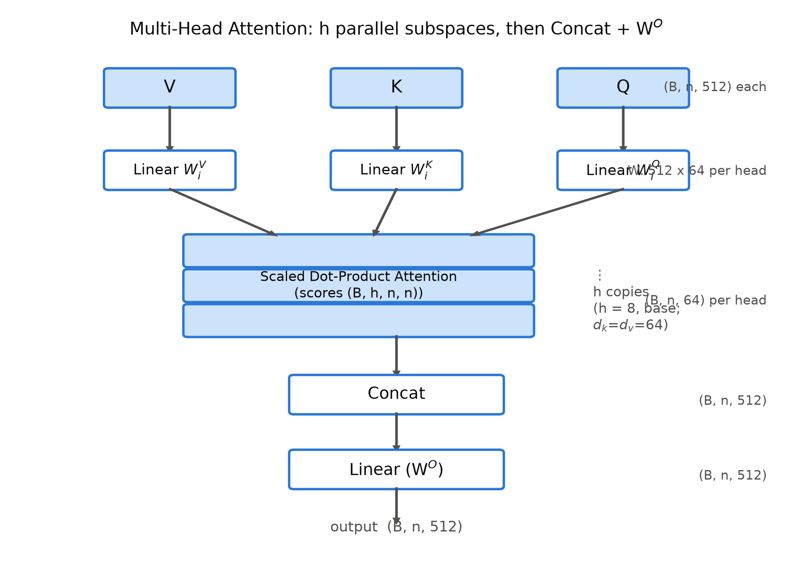
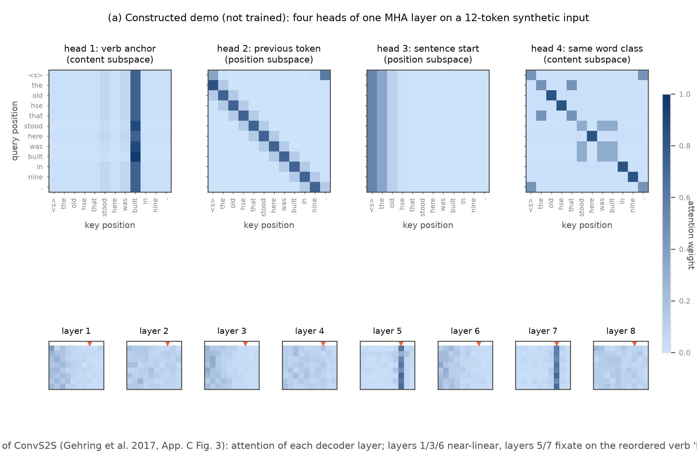

# 第 3 章 多头注意力

## 3.0 开篇：从全书到这里

上一章结束时，我们手里有了一件新工具：式 (2.1) 把注意力从「RNN 的配件」升格为独立运算——一条 $n\times m$ 的打分矩阵加一行 softmax，任何位置都能自选相关信息，整批一次算完；我们还替它记了第一笔账（batch=64、句长 30，仅打分矩阵就约 1.76 MiB），并把 $O(n^2)$ 写进了欠账框。但「会算」不等于「够用」：式 (2.1) 的每个位置只产出一行权重、一份分布，而一个词在句中同时活在好几种关系里——句法依存、指代、相邻位置、语义相似——它们全得挤进同一行权重里彼此折中。这不是我们的读后感，原论文 §2 在架构综述里就把这笔代价明明白白写了出来：*"In the Transformer this is reduced to a constant number of operations, albeit at the cost of reduced effective resolution due to averaging attention-weighted positions, an effect we counteract with Multi-Head Attention as described in section 3.2."*（操作数固然降为常数，代价却是「因对注意力加权位置取平均而降低的有效分辨率」；而对策，就是本章的多头注意力。）【证据等级：官方论文 v7 §2】

本章是零件铺的第二站，动手前照例在整机上定个位：整机粗图见导览 0.3 节，零件的安装位置以第 4 章图 4.1 为准——本章造的多头注意力，装的是图 4.1 双塔里每一个标着 Multi-Head Attention 的子层框，base 配置下这样的框共 18 个（编码器每层 1 个、解码器每层 2 个）；第 2 章造好的内核在这里被复制 $h$ 份并联成完整组件，18 个岗位装的都是它。本章要回答的问题一句话可以说完：**一份权重不够用，怎么把它变成 $h$ 份——而且几乎不多花一分钱？**答案是多头注意力（multi-head attention）：把投影做 $h$ 遍而不是一遍，让 $h$ 个低维子空间各自打分、各自取货，最后拼回一体。本章将产出三样东西：一个手写的多头组件（并与 PyTorch 官方实现逐位对拍）、一条能默画的张量形状流、一份「几个头才合适」的消融读表能力。

到本章结束，多头机制会在动机、结构、实现、证据四个层面立住；同时留下一个接口：式 (3.1) 的三个输入 $Q,K,V$ 地位对等、来源却可以不同——同一个零件将因此装进三种岗位，那是第 4 章的入口。还有一句话现在就说破：「几乎不多花一分钱」只在训练侧成立，它的反面是章末欠账框里的一颗种子。

> **最小背景栏**（读懂本章所需的全部前置）
> ① 第 2 章式 (2.1)（缩放点积注意力 $\mathrm{Attention}(Q,K,V)=\mathrm{softmax}(QK^{\top}/\sqrt{d_k})V$）及其形状约定——本章每个「头」内部跑的都是它；
> ② 线性投影 $y=xW$：用可学习矩阵 $W$ 把向量从一种维度换成另一种维度（整批一起算：$(n,d)\times(d,d')\to(n,d')$）。它值得先画出来：左边画 $d$ 个输入格，右边画 $d'$ 个输出格，每个输出格向全部输入格各拉一根线、线上挂一个可学权重，输出格的取值就是各输入的加权和——$W$ 的第 $j$ 列就是第 $j$ 个输出格的「配方」。本章一切「切分」都由它完成；
> ③ 「表示子空间」（representation subspaces）一词：指 $d_{model}$ 维表示空间经投影矩阵映入的 $d_k$ 维低维空间——严格说是「低维投影空间」，论文用词如此，本书沿用。

## 3.1 为什么需要多个头：平均的代价与子空间分工假说

开篇点出的病根是「平均」。动手术之前，先把这个病灶画成一幅画。

**单头是一场全班大会。**想象教室里坐着一句 30 个词，任何一个词想「理解自己」时，都要面向全场分配自己仅有的一份注意力：它想弄清「我左邻是谁」（相邻），想找到「这句的动词在哪」（句法），还想认出「谁和我同类」（词类与语义）——三件事共用同一行权重，最终的分布只能是几份意见的平均折中。**多头是分小组讨论再汇总：全班照旧在场——切的不是人，是看问题的角度——若干小组各用一套自己的标准打分**，这一组专盯相邻，那一组专找动词；每组交一份纪要，最后由汇总人合成全班的结论。

**$h$ 份预算怎么分？**关键是预算总量不变：$d_{model}=512$ 维不是变成 $h$ 份 512 维，而是切成 $h$ 份窄的——不是给每个小组追加经费，而是同一笔经费换个花法：可以请一位什么都能问的全科大教授（$1$ 个 512 维的头），也可以请 8 位各管一科的专科大夫（$8$ 个 64 维的头）。哪种花法划算，本章最后用论文的数字回答。

原论文 §3.2.2 的动机句与这幅画严丝合缝：*"Multi-head attention allows the model to jointly attend to information from different representation subspaces at different positions. With a single attention head, averaging inhibits this."*（多头允许模型联合关注不同位置上、来自不同表示子空间的信息；单头的平均会抑制这一点。）【证据等级：官方论文 v7 §3.2.2】注意措辞：这是**分工假说**，不是定理——论文没有证明单头必然学不出分工，只论证了「平均抑制分工」，定量证据要等到 3.5 节的 Table 3 (A) 行。

单头的问题还可以说得更硬一点：设想一个头必须同时回答「上个词是什么」和「这句话的动词在哪」。两个问题的最优打分函数完全不同，但 softmax 只有行内一个自由度可供分配——一份权重只能是一份折中。

多头的做法，一句话：把投影做 $h$ 遍而不是一遍。每个头 $i$ 配自己的三个投影矩阵 $W_i^Q,W_i^K,W_i^V$，把 $d_{model}$ 维输入投到低得多的 $d_k=d_v=d_{model}/h$ 维子空间里（$x\,(n,512)$ 右乘 $W_i^{Q}\,(512\times64)$：$(n,512)\times(512,64)\to(n,64)$，$W_i^{K},W_i^{V}$ 同），各自独立做一次第 2 章式 (2.1) 的缩放点积注意力，最后把 $h$ 份结果拼起来过输出投影 $W^O$。

值得追问一句：为什么要「投影」到子空间，而不是把 512 维直接切成 8 段 64 维分给各头？切块是固定分配——第 $i$ 头永远只能看第 $i$ 段坐标，没有可学的东西；投影是可学习的自由组合——$W_i^{Q}$ 的每一列都可以从 512 个维度里任意取材，等于每个头自己决定「我关心输入的哪种线性组合」。3.5 节的构造演示正是利用这一点：动词锚点头只从内容维度取信号、位置头只从位置编码维度取信号，靠的就是投影的选择性。换句话说，「多头」的精髓不在切分而在选择——每个头是一副可学习的眼镜。第 2 章 2.1 节埋下的那句预告也在这里兑现：Luong general 打分里插在中间的 $W_a$，升格为每头的 $W_i^{Q}$、$W_i^{K}$——比对矩阵从打分函数的配件，变成了进子空间的门票。

关键算术在维度分配上。base 模型 $d_{model}=512$、$h=8$，于是 $d_k=d_v=512/8=64$：每个头的 query/key/value 都只有 64 维。8 个头的 $W_i^Q$（各 $512\times 64$）拼起来恰好等于一个 $512\times 512$ 的满秩投影——原论文 §3.2.2 明说这正是设计意图：*"Due to the reduced dimension of each head, the total computational cost is similar to that of single-head attention with full dimensionality."*（因每头维度缩小，总计算成本与全维度单头注意力相当。）【证据等级：官方论文 v7 §3.2.2】

这个「相当」可以被精确验证。我们在本书实验里对 $h\in\{1,4,8,16,32\}$ 逐一数出单个 MHA 子层的参数量（[`code/ch03/mha.py`](code/ch03/mha.py#L151) 的 `projection_arithmetic()`；四个投影加偏置）：**五个配置完全相同，都是 1,050,624**【证据等级：本书实验（M5 Pro/CPU，2026-10）】。原因是一条恒等式：只要 $d_k=d_v=d_{model}/h$，就有 $h\cdot d_k=h\cdot d_v=d_{model}$，四个投影的总参数量 $4d_{model}^2+4d_{model}$ 与 $h$ 无关。用人话说：总账只认 $d_{model}$ 一家——512 的盘子定了，切成几份、每份多宽，总开销纹丝不动。也就是说，**头数是一个不花参数的多样性旋钮**——同样的预算，你可以买一个 512 维的大头，也可以买 8 个 64 维的小头。big 模型（$d_{model}=1024$）把 $h$ 提到 16，$d_k$ 仍是 64：加宽模型时增加的是头数，不是头维【证据等级：官方论文 v7 Table 3 big 行】。

但「不花参数」不等于「不花质量」：头越多每头越窄，$h=32$ 时每头只剩 16 维。这笔账什么时候开始亏，正是 3.5 节消融表要回答的问题。

## 3.2 公式与完整形状流

画面与账目都有了，这一节把它们落成公式——公式只是把「分小组讨论再汇总」的流程写在纸上。原论文 §3.2.2 给出的定义（原文未编号，本书编为式 (3.1)(3.2)）：

$$\mathrm{MultiHead}(Q, K, V) = \mathrm{Concat}(\mathrm{head}_1, \dots, \mathrm{head}_h)\,W^{O} \tag{3.1}$$

$$\mathrm{head}_i = \mathrm{Attention}(QW_i^{Q},\; KW_i^{K},\; VW_i^{V}) \tag{3.2}$$

用人话说式 (3.1)：$h$ 个组各交一份 64 维纪要，按组并排装订成 512 维，再由 $W^O$ 这位汇总人把 $h$ 份纪要合成一篇全文——头与头之间真正的信息交换，只发生在汇总人桌上。

用人话说式 (3.2)：第 $i$ 个头先戴上自己的三副滤镜（$W_i^{Q},W_i^{K},W_i^{V}$）把输入重新调色，再在这层色调下做一次第 2 章式 (2.1) 的缩放点积注意力——滤镜不同，能看见的关系就不同。

其中式 (3.2) 里的 $\mathrm{Attention}$ 即第 2 章式 (2.1)——每个头内部调用的正是上一章那个算子，只是输入已被换成 64 维投影。符号与形状如下（base 配置；式 (3.1)(3.2) 是省略批维的单句数学视图，整批带头的四维口径见本节末的表 3.1）：

| 符号 | 含义 | 形状 |
|---|---|---|
| $Q,K,V$ | MHA 的输入；自注意力时三者同为子层输入 | $\mathbb{R}^{n\times d_{model}}$（$n\times 512$） |
| $W_i^{Q}, W_i^{K}$ | 第 $i$ 头的 query/key 投影 | $\mathbb{R}^{d_{model}\times d_k}$（$512\times 64$） |
| $W_i^{V}$ | 第 $i$ 头的 value 投影 | $\mathbb{R}^{d_{model}\times d_v}$（$512\times 64$） |
| $W^{O}$ | 输出投影 | $\mathbb{R}^{h d_v\times d_{model}}$（$512\times 512$） |
| $\mathrm{head}_i$ | 第 $i$ 头的输出 | $\mathbb{R}^{n\times d_v}$ |
| $\mathrm{Concat}$ | 沿特征维并排 $h$ 个头 | $\mathbb{R}^{n\times h d_v}$（$n\times 512$） |
| $h$ | 头数 | 8 |
| $d_k=d_v$ | 每头维度 $=d_{model}/h$ | 64 |

初学者最容易在这里踩的第一个坑：**式 (2.1) 的输入是 $d_k$ 维，式 (3.1) 的输入是 $d_{model}$ 维**。单头算子 $\mathrm{Attention}$ 吃的 $Q,K$ 是 64 维向量；而 MHA 对外的接口是 512 维——从 512 到 64 的落差完全由 $W_i^{Q},W_i^{K},W_i^{V}$ 三个投影补上。所以说「多头注意力」这个名字描述的是包裹关系：$h$ 个独立的第 2 章算子，外面包一层投影与拼接。整条数据流见图 3.1。

还有一个容易漏看的细节：式 (2.1) 里的缩放因子 $\sqrt{d_k}$ 在多头语境下取的是**每头维度**——base 下是 $\sqrt{64}=8$，而不是 $\sqrt{512}$。第 2 章的方差论证（点积方差随维度增长）在 64 维子空间里照常成立：多头不改变缩放逻辑，只是把它搬进了更小的房间。

第二个容易看漏的角色是 $W^O$。$\mathrm{Concat}$ 只是把 $h$ 份 64 维结果**并排**放好（不是求和、也不是融合），真正的头间信息交换发生在 $W^O$ 这一步：它把并排的 512 维线性组合回 $d_{model}$ 维（$(n,h\,d_v)\times(h\,d_v,d_{model})$，即 $(n,512)\times(512,512)\to(n,512)$），每个输出维度都可以同时取用多个头的结果。删掉 $W^O$，各头就彻底老死不相往来——小组讨论得再热闹，没人汇总纪要，全班的结论就出不来。

整条形状流跑出来什么样？以 batch=2、句长 $n=10$、base 配置跑一遍本书实现（`mha.py` 的 `shape_flow()`），逐步骤列出输入输出形状【证据等级：本书实验（M5 Pro/CPU，2026-10）】——第 2 章表 2.3 把投影当成子层的安装边界一笔带过，表 3.1 把投影与切头拆开到多头机制自己的颗粒度；三种角色共用这条骨架的推广版在第 4 章表 4.4。

| 步骤 | 运算 | 输入形状 | 输出形状 | 说明 |
|---|---|---|---|---|
| 1 | 子层输入 $Q{=}K{=}V{=}x$ | — | $(2,10,512)$ | 自注意力三路同源（本章实验口径） |
| 2 | 打包投影 $xW^{Q}$（$W^{K},W^{V}$ 同） | $(2,10,512)\times(512,512)$ | $(2,10,512)$ | 8 个头的 $W_i^{Q}\,(512\times64)$ 沿输出维首尾相接成一块——工程打包，见 3.3/3.4 节 |
| 3 | 切头 view+transpose | $(2,10,512)$ | $(2,8,10,64)$ | view 零拷贝重排成 $(2,10,8,64)$，transpose 把头维提到批维之后 |
| 4 | 打分 $QK^{\top}/\sqrt{d_k}$ | $(2,8,10,64)\times(2,8,64,10)$ | $(2,8,10,10)$ | 式 (2.1) 搬进每头；缩放取每头维度 $\sqrt{64}$ |
| 5 | softmax（逐行） | $(2,8,10,10)$ | $(2,8,10,10)$ | 行和 1，形状不变 |
| 6 | 取货 $\mathrm{attn}\cdot V$ | $(2,8,10,10)\times(2,8,10,64)$ | $(2,8,10,64)$ | 按头加权求和——每头内部的式 (2.1) 至此走完 |
| 7 | 拼回 transpose+reshape | $(2,8,10,64)$ | $(2,10,512)$ | 头维并回特征维（式 (3.1) 的 $\mathrm{Concat}$） |
| 8 | 输出投影 $W^{O}$ | $(2,10,512)\times(512,512)$ | $(2,10,512)$ | 头间信息交换在此发生 |

表 3.1 多头注意力子层的形状流转表（自排；base 配置：$d_{model}=512$、$h=8$、$d_k=d_v=64$、$B=2$、$n=10$）

值得逐行看的是第 3 行：`view` 把投影输出的最后一维 512 重排成 $(8, 64)$——**不搬运任何数据，只换一种切分解释**；`transpose(1, 2)` 再把头维提到前面，得到 $(2, 8, 10, 64)$，即「8 个各含 10 个 64 维向量的头」。此后 `scores` 的形状 $(2, 8, 10, 10)$ 说明全部 16 个（batch×头）注意力矩阵是在**同一次**矩阵乘里算出的——这是多头在工程上真正讨喜的地方：它不引入任何循环或分支，只是给张量多加了一个维度。

顺手把镜头拉远半格，看看这个零件装在机器哪里：base 整机共有 18 个注意力岗位（编码器每层 1 个、解码器每层 2 个，6 层合计 18；分工见第 4 章表 4.2），每个岗位里流淌的都是表 3.1 这条形状流——本章造的是全部岗位共用的那个内核。

最后预告一个本章按下不表的事实：式 (3.1) 的 $Q,K,V$ 三个输入地位对等但来源可以不同——自注意力时三者是同一个张量（上面的形状流即此情形）；当 $Q$ 来自解码器、$K=V$ 来自编码器输出时，同一个公式就变成双塔间的交叉注意力。三种角色的分野留待第 4 章展开，本章所有实验都在 $Q=K=V$ 的自注意力设定下进行。



图 3.1 多头注意力机制（自绘重制，改绘自 Vaswani et al. 2017 Fig.2 右半；$h$ 与维度取 base 配置）。右侧形状标注为本书补充（原图无标注），按整批口径：三路输入与输出各 $(B,n,512)$，每个 Linear 的投影矩阵 $W_i\,(512\times64)$，每头输入输出 $(B,n,64)$，Concat 把 $h$ 份并回 $(B,n,h\cdot d_v){=}(B,n,512)$；各头内部的打分与权重矩阵 $(B,h,n,n)$ 标在注意力框内，对应表 3.1 第 4-5 行

## 3.3 从零实现：投影、切头、按头 bmm、拼回

公式在纸上、形状流在表里，现在把它造成能跑的零件。实现只用 PyTorch 基础算子（matmul/softmax/线性层），不用 `nn.MultiheadAttention`，注意力部分沿用第 2 章的手写路径。核心前向不足二十行：

```python
# [`code/ch03/mha.py`](code/ch03/mha.py) 的 MyMultiHeadAttention.forward()（节选）
def forward(self, q, k, v, mask=None):
    bs, nq, _ = q.shape
    nk = k.shape[1]
    # 投影后切头：(bs,n,512) -> (bs,n,h,64) -> (bs,h,n,64)
    Q = self.w_q(q).view(bs, nq, self.h, self.d_k).transpose(1, 2)
    K = self.w_k(k).view(bs, nk, self.h, self.d_k).transpose(1, 2)
    V = self.w_v(v).view(bs, nk, self.h, self.d_k).transpose(1, 2)
    scores = Q @ K.transpose(-2, -1) / math.sqrt(self.d_k)  # (bs,h,nq,nk)
    if mask is not None:                # bool 掩码：True=屏蔽，与官方语义一致
        scores = scores.masked_fill(mask, float("-inf"))    # (bs,h,nq,nk) 形状不变
    attn = F.softmax(scores, dim=-1)    # (bs,h,nq,nk)：逐行归一，行和为 1
    head_out = attn @ V                 # (bs,h,nq,64)：按头加权求和
    concat = head_out.transpose(1, 2).reshape(bs, nq, self.h * self.d_k)  # (bs,n,512)
    return self.w_o(concat), attn       # (bs,nq,512)
```

几个实现决策值得说明。**投影一次做完**：`w_q` 是一个 $512\times 512$ 的 `nn.Linear`，一次算出全部 8 个头的 query——数学上等价于每头各乘一个 $512\times 64$ 矩阵（3.4 节会证明这个等价并实测），工程上则把 8 次小矩阵乘合并成 1 次大矩阵乘，对 GPU 友好。**按头 bmm**：`(bs, h, n, 64) @ (bs, h, 64, n)` 让批量维和头维一起广播，16 套打分矩阵一次算完。**拼回**先 `transpose` 回 `(bs, n, h, d_k)` 再 `reshape`，顺序不能反——`reshape` 只对「头维在特征维内部」的排布才能正确并排。

零件造好，照例与官方对拍（`mha.py` 的 `compare_weight_transfer()`）：把官方 `nn.MultiheadAttention`（batch_first=True 显式传入、eval 模式、固定种子、`need_weights=True` 走 bmm+softmax 慢路径）的 `in_proj_weight/bias` 按 `chunk(3)` 整块搬入本书 `w_q/w_k/w_v`、`out_proj` 搬入 `w_o`，同输入 $(2,10,512)$ 比前向：输出 `allclose(atol=1e-6) = True`，实测最大逐元素差 $\mathtt{max}|\Delta| = 0$，逐位一致【证据等级：本书实验（M5 Pro/CPU，2026-10）】。逐位一致的成因值得写进注记：官方慢路径是把缩放因子预先乘在 $q$ 上（$q\cdot\sqrt{1/d_k}$）再 matmul，本书实现是 matmul 后再除 $\sqrt{d_k}$，两者数学等价；而 $d_k=64$ 时 $\sqrt{1/64}=0.125$ 是二进制精确值，预缩放不引入任何舍入，加上两边同走 CPU 的 bmm+softmax 路径，于是浮点上也不差一位。若改走融合注意力核或 GPU，通常会出现 $10^{-6}$ 量级的差异——这正是对拍规范要求锁设备、锁路径、锁后端的原因。

本书实现还把 `attn` 一并返回，且保留 $(bs,h,n,n)$ 全量——图 3.2(a) 的逐头热图正由此而来。它与官方 API 的两处行为差异，收进对照框：

> **【实现对照框】**（非原论文内容）① **权重返回口径**：官方 `nn.MultiheadAttention` 的第二返回值（`need_weights=True` 时）会把 $h$ 个头的权重**沿头维取平均**后返回 $(N, L, S)$（本书实测确认），本书实现保留 $(bs,h,n,n)$ 全量。② **dropout 布点**：官方 MHA 把 dropout 打在 **softmax 之后的注意力权重**上，而原论文 §5.4 只记载两处 dropout（子层输出加回残差前、嵌入与位置编码之和），并未提及注意力权重上的 dropout【证据等级：官方论文 v7 §5.4 + torch 2.13 源码】。这一处属实现自由度（承 tensor2tensor 惯例），本书手写组件相应省略——对拍在 eval 模式下进行，dropout 本就归零，不影响一致性。

## 3.4 in_proj 之谜：官方实现把三个投影打成了一个大矩阵

3.3 节对拍时我们说「把官方权重整块搬入」——但官方为什么把权重存成整块？这一节拆开这个谜。

> **【实现对照框】** 以下为 PyTorch 官方实现对照（非原论文内容）。原论文只定义了 $W_i^{Q},W_i^{K},W_i^{V},W^{O}$ 的数学；`in_proj_weight` 的打包方式是 torch 的工程选择。

打开 `nn.MultiheadAttention` 的参数表，你会发现找不到 `w_q`、`w_k`、`w_v`，只有一个 `(1536, 512)` 的大矩阵 `in_proj_weight`（512 的三倍）。源码文档写明：*"Weights are packed along dimension 0, in q, k, v order."*——$W^{Q},W^{K},W^{V}$ **沿第 0 维首尾相接**打包成一个矩阵，$Q$ 投影占第 0～511 行，$K$ 占 512～1023，$V$ 占 1024～1535。先给它一幅画：把三块 $512\times 512$ 的板子沿长边**焊成一块** $1536\times 512$ 的大板子——输入 $x$ 从右侧 512 个接口进去，左侧出来 1536 根线，第 0～511 根是 query、第 512～1023 根是 key、第 1024～1535 根是 value；一刀三段切开，三份投影一次到手。落在运算上：$x\,(n,512)\cdot W_{in}\,(512,1536)\to(n,1536)$，再沿最后一维切三段、各得 $(n,512)$。

为什么偏偏这样打包？自注意力时 `q`、`k`、`v` 是同一个张量，一次 $(1536, 512)$ 的大矩阵乘可以把三份投影合并完成——把三次小矩阵乘合并成一次大矩阵乘，减少 kernel 启动与访存次数，对 GPU 明显更友好；源码的自注意力快路径干脆先做一次打包投影、再切开用。但要理解它、对拍它，必须先处理一个约定差：torch 的 `Linear` 计算 $y = xW^{\top}+b$、权重按 (out, in) 存放，而论文记法是 $y = xW$、$W\in\mathbb{R}^{in\times out}$——**论文的 $W$ 等于 torch 权重矩阵的转置**。两套记法对照如下：

| 原论文符号 | 论文形状 | torch 载体（E=512） | 取法 |
|---|---|---|---|
| $W_i^{Q}$ | $\mathbb{R}^{512\times 64}$ | `in_proj_weight` 行块 0:512 | 转置后取第 $i$ 个 64 列块 |
| $W_i^{K}$ | $\mathbb{R}^{512\times 64}$ | 行块 512:1023 | 同上 |
| $W_i^{V}$ | $\mathbb{R}^{512\times 64}$ | 行块 1024:1536 | 同上 |
| $W^{O}$ | $\mathbb{R}^{512\times 512}$ | `out_proj.weight` | 整体使用 |

于是「第 $i$ 个头」在 torch 侧对应的是各 512 行块的**第 $i$ 个 64 列列块**（转置意义下）。这里还藏着一个漂亮的代数事实——**整头等价性**：官方实现先做满秩投影（$(n,512)\times(512,512)\to(n,512)$）、再用 `view` 按列块切头（$(n,512)\to(n,8,64)$），而「每头直接用 64 列投影」（$(n,512)\times(512,64)\to(n,64)$）之所以等价，是因为对任意矩阵乘有 $(xW)[:, \text{cols}] = x\,W[:, \text{cols}]$——大投影的输出列块只依赖权重矩阵的对应列块，各头互不干扰。用人话说：大板子出的第 $j$ 根线，只由配方表的第 $j$ 列决定——各列各算各的，谁也不牵连谁，所以「先大投影再切列」与「直接小投影」一字不差。

拆包对拍由此可行（`mha.py` 的 `compare_with_torch()`）：把 `in_proj_weight.chunk(3, dim=0)` 拆出三段、各转置回论文记法，逐头取 64 列块做 $xW_i^{Q}$ 等小投影（$(n,512)\times(512,64)\to(n,64)$，共 $h$ 份），手写 `softmax(QK^{\top}/\sqrt{d_k})V`（每头 $(n,64)\to(n,n)\to(n,64)$），拼回 $(n,512)$ 后过 `out_proj`——与官方 `mha(x, x, x)` 输出对拍，`allclose(atol=1e-6) = True`，`max|Δ| = 0`，逐位一致【证据等级：本书实验（M5 Pro/CPU，2026-10）】。这条对拍的意义比 3.3 节更进一步：它验证的不只是「我们的实现等于官方」，而是**「论文的逐头公式 ⟷ 官方的打包实现」这整条翻译链没有走样**。

使用官方 MHA 的陷阱清单（本书调研源码所得，第 7 章整机组装时还会用到）：

1. **`batch_first` 默认 `False`**：输入布局是 (序列, 批, 特征)，与现代代码普遍的 (批, 序列, 特征) 相反——本节对拍显式传 `True`，否则形状对得上、语义全错位。
2. **`need_weights` 默认 `True`**：走 bmm+softmax 慢路径（行为最贴论文公式，本书对拍用它）；设 `False` 才走融合注意力快速路径。
3. **bool 掩码语义 `True`=屏蔽**，与融合注意力算子的 `True`=参与恰好相反（第 2 章实现对照框已实测）。
4. **3D 掩码形状必须是 $(N\cdot h,\, L,\, S)$**：传 $(N, L, L)$ 会直接 RuntimeError。
5. **`embed_dim % num_heads != 0` 立即断言报错**——$d_k=d_{model}/h$ 必须整除，3.1 节的算术在这里被写成了硬约束。
6. `kdim`/`vdim` 与 `embed_dim` 不同时，改走三个独立投影参数 `q_proj_weight`/`k_proj_weight`/`v_proj_weight` 的路径（本书整机的双塔同为 512 维、全程用不到该路径；异维双塔属后世自定义架构，此处仅存目）。
7. `in_proj_weight` 的初始化是对整个 $(3E, E)$ 矩阵一次 xavier，**不是**逐头或逐段初始化；原论文并无初始化方案记载，xavier 属实现惯例（第 7 章展开）。
8. 构造函数里还有 `add_bias_kv`、`add_zero_attn` 等后世扩展参数（给 K/V 拼可学习偏置向量、在键值序列尾部追加一个零槽），原论文均无，本书对照时全部忽略。

## 3.5 消融证据：几个头才合适

至此，多头在结构（3.1-3.2）与实现（3.3-3.4）两面都立住了；但「多头更好」还只是动机句，3.1 节还悬着一笔账——同预算之下，全科大教授与 8 位专科大夫到底谁划算。原论文 §6.2 用 Table 3 的 (A)(B) 两行给出了定量回答。表 3.2 是重排版（指标为 newstest2013 开发集，不用 checkpoint 平均）。

| 行 | $h$ | $d_k$ | $d_v$ | PPL | BLEU | 参数量 |
|---|---|---|---|---|---|---|
| base | 8 | 64 | 64 | 4.92 | 25.8 | 65M |
| (A) | 1 | 512 | 512 | 5.29 | 24.9 | — |
| (A) | 4 | 128 | 128 | 5.00 | 25.5 | — |
| (A) | 16 | 32 | 32 | 4.91 | 25.8 | — |
| (A) | 32 | 16 | 16 | 5.01 | 25.4 | — |
| (B) | 8 | 32 | 64 | 5.01 | 25.4 | 60M |
| (B) | 8 | 16 | 64 | 5.16 | 25.1 | 58M |

表 3.2 头数扫描 (A) 与缩 $d_k$ (B) 消融（重排自 v7 Table 3；未列出项同 base；(A) 行 $d_k=d_v=d_{model}/h$，参数量不变故原表为空——3.1 节已证其恒等；PPL 为 per-wordpiece 口径）【证据等级：官方论文 v7 §6.2】

**(A) 行——头数扫描**。曲线形状是「爬升—平台—回落」：$h=1$ 时 24.9，$h=4$ 时 25.5，$h=8$ 与 $h=16$ 并列最佳 25.8，$h=32$ 回落到 25.4。原文结论句两头都点了：*"While single-head attention is 0.9 BLEU worse than the best setting, quality also drops off with too many heads."*（单头比最佳差 0.9 BLEU；头太多质量也会降。）【证据等级：官方论文 v7 §6.2】单头的 0.9 BLEU 差距，就是 3.1 节「平均抑制分工」假说的定量代价——同样 1,050,624 个参数，一个 512 维大头比 8 个 64 维小头差近 1 个 BLEU。另一端，$h=32$ 时每头只剩 $d_k=16$ 维，打分空间过窄，质量回落——**头数与头维之间存在一个甜点区（8~16），不是越多越好**。顺带一提 $h=16$ 的 PPL（4.91）甚至比 base（4.92）低 0.01，属于训练噪声量级，不必过度解读。

把 (A)(B) 两行合读，甜点区的成因浮现出来：(B) 行说明打分维度 $d_k$ 从 64 缩到 32 就掉 0.4 BLEU、缩到 16 掉 0.7——「判定两个向量兼容」在 32 维以下开始吃亏；而 (A) 行的 $h=16$（$d_k=32$）不降分，说明只要打分维度够用，头数翻倍是中性的。甜点区就是「$d_k$ 不低于 32、$h$ 尽量多」的窗口，base 取 $h=8$、big 取 $h=16$ 都落在窗内。

一行读表注记：为什么必须两行合读才下得了结论？(A) 行沿 $d_k=d_{model}/h$ 这条约束同时改动 $h$ 与 $d_k$，头数效应与头维效应绑在一起，单看它无法回答「变差该记在谁头上」；(B) 行固定 $h=8$ 只缩 $d_k$，正是解开这个绑定的对照行——$d_k$ 单独从 64 缩到 32 就掉 0.4 BLEU，而 (A) 行 $h$ 从 8 加到 16（$d_k$ 同步降到 32）不降分，两证合夹才把瓶颈定位到「打分维度够不够」而非「头数多不多」。(A) 的 $h{=}1$ 行则是另一端的锚点：$d_k=512$ 全维单头，参数一粒不少，却差 0.9 BLEU——这排除了「容量不足」的解释，坐实「多样性不足」。甜点区的读法也预示了加宽方向的选择：big 的 $d_{model}=1024$ 把 $h$ 提到 16 而 $d_k$ 守住 64，正是「头维保底、头数随宽度加」的窗口内动作。

**(B) 行——缩 $d_k$**。固定 $h=8$、只把 $d_k$ 从 64 缩到 32/16（$d_v$ 不动）：BLEU 25.8 → 25.4 → 25.1，**单调变差**。原文：*"reducing the attention key size $d_k$ hurts model quality. This suggests that determining compatibility is not easy and that a more sophisticated compatibility function than dot product may be beneficial."*【证据等级：官方论文 v7 §6.2】注意后半句——论文自己给「点积这个兼容性函数可能不够强」留了口子，这个口子后世被多种注意力变体接走，本书冻结在 2017 不展开（集中清算见第 11 章）。

参数量一列可以现场核验。(B) 行只有 $W^{Q},W^{K}$ 随 $d_k$ 变瘦（$W^{V},W^{O}$ 由 $d_v,h$ 决定，不动）：单个 MHA 子层从 1,050,624 降到 787,968（$d_k{=}32$）与 656,640（$d_k{=}16$）；base 全机共 18 个注意力子层（编码器每层 1 个 + 解码器每层 2 个，见第 4 章），逐层扣减得 $65\mathrm{M}-4.73\mathrm{M}=60.3\mathrm{M}$ 与 $65\mathrm{M}-7.09\mathrm{M}=57.9\mathrm{M}$，与论文表中的 60M/58M 吻合【证据等级：本书实验（M5 Pro/CPU，2026-10）；对照值为官方论文 v7 §6.2】。

这两行消融（ablation）在第 10 章还会回来：本书的小型翻译实验将重跑 $h=1$ 必做行与 $h\in\{4,16\}$ 锚点行，在玩具尺度上检验「单头显著差、$h\ge 8$ 进平台」能否复现，判据与口径见第 10 章。

还有一个读表时容易放过细节：**(A) 的 $h{=}32$ 行与 (B) 的 $d_k{=}16$ 行 $d_k$ 同为 16**，前者 $d_v=16$、后者 $d_v=64$，BLEU 分别是 25.4 与 25.1。可见「补回 value 维度」救不回「打分维度不足」的损失；反过来 $h=16$（$d_k=32$）能到 25.8，说明 32 维打分空间已够用。消融表的每一行只动了少数几列，**其余列的隐含联动**（(A) 行 $d_v$ 跟着 $d_k$ 走）必须一并看，否则会得出错误的因果归因。

**分工假说看得见吗**——三级证据。第一级是原论文自己的可视化：附录 Fig 3/4/5 展示第 5/6 层的不同头分别追踪 *"making...more difficult"* 的长距离依赖（Fig 3，不同颜色即不同头）、做指代消解（Fig 4，*its* 的注意力尖锐地指向 *Law* 与 *application*）、表现出「**似乎**与句法结构相关」的行为（Fig 5 原文措辞是 "seems related"，谨慎级别，不宜夸大为「学会了句法」）【证据等级：官方论文 v7 附录 Fig 3/4/5】。第二级来自前史：ConvS2S 的 multi-step attention 已把「多个注意力模块各自分工」证明为可行——它给每个解码层各配一个独立注意力、实测 5 层全注意只慢 4%，其附录 C Figure 3 更是「同一模型内多套注意力各自分工」的可视化孤本（8 个解码层的注意力热图；机制与数字见第 1 章 1.5、第 4 章 4.3，图 3.2(b) 即据其重制的示意）【证据等级：官方论文 ConvS2S arXiv:1705.03122 v3 §3.3/§5.5/附录 C】。这一级证明的分工发生在**层间**（每层一套注意力），Transformer 把这种分工搬进了**单层内的头间**。第三级才是本书的构造演示（图 3.2(a)，`mha.py` 的 `build_demo()` 构造、`run_demo()` 打印）：在 12 个词的合成输入 $x\,(12,64)$ 上，按缩微配置（$d_{model}{=}64$、$h{=}4$、$d_k{=}16$）为 4 个头手工构造 $W^{Q},W^{K}$（各 $(4,64,16)$，即每头 $W_i\,(64\times16)$）——动词锚点头从内容维度取信号、前一词头与句首锚点头从正弦位置编码维度取信号、同词类头从词类维度取信号，得到的注意力权重为 $(1,4,12,12)$。实测四个头的注意力质量分别为：落在动词 *built* 上 0.784、落在前一词上 0.742、落在句首位置上 0.543、落在同类词上 0.889；行熵 0.95/0.79/0.99/1.07，全部显著低于均匀分布的 $\ln 12 = 2.485$【证据等级：本书实验（M5 Pro/CPU，2026-10）】。必须如实说明：这是**构造演示而非训练所得**——它只证明「投影矩阵完全有能力造出这种分工」（不同头选用输入的不同维度子集即可），不证明训练必然学到同样的分工；训练所学分工的证据，仍然只有第一、二级那种可视化级别的间接支持。



图 3.2 多头分工的两类可视化。(a) 本书构造演示：同一层 4 个头在同一合成句上的注意力热图（自产，本书实验，构造演示非训练所得）；(b) ConvS2S 各解码层注意力分工示意（自绘示意重制，改绘自 Gehring et al. 2017 arXiv:1705.03122 v3 附录 C Figure 3，凭调研文字记录重制，非数据级复刻；橙色标记为动词 *built* 位置）

## 3.6 本章小结

开篇我们带着一个问题进场：一份权重要服务所有关系，「平均」把分辨率吃掉了，怎么办？本章的答案是**把投影做 $h$ 遍**：$h$ 个 64 维子空间各自打分、各自取货，$W^O$ 汇总成文。动机有原文两句直引（§2 的代价句、§3.2.2 的分工假说）；结构上 $h\cdot d_k=d_{model}$ 的算术让这一切几乎免费（$h\in\{1,4,8,16,32\}$ 的参数量恒为 1,050,624）；实现上手写组件与官方 `in_proj` 打包拆包对拍两次 `max|Δ|=0`；证据上消融表给出甜点区——$h=8$ 与 $h=16$ 并列最佳、单头差 0.9 BLEU、$h=32$ 回落、缩 $d_k$ 单调变差，且 60M/58M 的扣减账与我们的算术吻合。

**带走的心智**——忘掉本章所有数字之后，请留下两件事。**其一，多头 = 分小组讨论再汇总。**单头是一场全班大会：每个位置只有一份注意力预算，所有关系挤在同一行权重里折中，这就是「平均降低有效分辨率」。多头把同一份预算（$d_{model}$ 维）切成 $h$ 副窄眼镜，每副只看输入的一种线性组合——分工来自投影的选择性（每副眼镜自己决定看哪些维度、怎么组合），融合只发生在 $W^O$。以后看到任何「多头」设计，先问两句：它分组切的是什么？汇总人在哪里？**其二，「头数免费」是训练侧的账本。**$h\cdot d_k=d_{model}$ 让头数成为不花参数的多样性旋钮——但免费的只是参数那一页；推理时要为每个 token 存 $h$ 份 K、$h$ 份 V，这份账随序列长度翻着涨，终会反超参数量。账本意识提醒你：每一句「免费」，都要问一句在谁的账上免费。

回到导览的地图：我们在造一台翻译机，第 2 章造出了发动机（注意力运算），本章把它从单缸改成了八缸——但发动机还得装进底盘的不同位置才能做功。下一章把同一个多头零件装上三种岗位：编码器里双向看全句，解码器里因果只看过去，双塔之间由解码器发问、编码器作答。运算与多头机制从此不再变化，变的只是「它为谁服务」；数据流的双塔全景，也随之在眼前展开。

> **【欠账】F16 · 每头一份 K/V 的账本，在推理时代翻转：** 多头把 $K/V$ 投影切成 $h$ 份独立参数，2017 年这只是参数怎么记账的小事；但推理时要为每个 token 缓存 $h$ 份 K、$h$ 份 V（即 KV cache），序列一长，这份账本就反超参数量、成为显存主项——3.1 节「头数免费」的算术只在训练侧成立，推理侧要整本重算。→ Book3 第 6 章（推理显存账本）；Book4 第 6 章（工程视角）

## 3.7 动手验证

**代码**：[`code/ch03/mha.py`](code/ch03/mha.py)（手写 MHA + 官方权重搬入对拍 + in_proj 拆包对拍 + 构造演示）、[`code/ch03/figures.py`](code/ch03/figures.py#L38)（`fig_3_1()`/`fig_3_2()`）。CPU 秒级跑完。

```bash
source env.sh && python [`code/ch03/mha.py`](code/ch03/mha.py#L56)
```

预期产出与验收点：

1. **形状流**（`shape_flow()`）：8 行形状打印，与表 3.1 的 8 个步骤逐行对应（验收：`(2, 8, 10, 64)` 与 `(2, 8, 10, 10)` 两行必须出现）。
2. **权重搬入对拍（3.3 节，`compare_weight_transfer()`）**：官方 `in_proj_weight/bias` 按 `chunk(3)` 整块搬入手写 `w_q/w_k/w_v`、`out_proj` 搬入 `w_o`，同输入前向 `allclose(atol=1e-6) = True`、`max|Δ| = 0`；官方 `need_weights=True` 第二返回值形状 `(2, 10, 10)`（即沿头维平均的 $(N,L,S)$）（验收：allclose 为 True、返回形状为 (2,10,10)）。
3. **in_proj 拆包对拍**（`compare_with_torch()`）：`allclose(atol=1e-6) = True`、`max|Δ| = 0`（验收：allclose 为 True；若在你机器上非零，应仍在 1e-6 量级并检查是否误走了快速路径）。
4. **参数量算术**（`projection_arithmetic()`）：(A) 扫描五行全部等于 1,050,624；(B) 行扣减后 60.3M/57.9M 与论文 60M/58M 对上（验收：两处吻合）。
5. **构造演示**（`run_demo()`）：四个头的关注质量（0.784/0.742/0.543/0.889）与行熵（0.953/0.787/0.986/1.068），全部行熵低于 $\ln 12=2.485$（验收：任一头熵显著低于均匀熵）。

```bash
source env.sh && python [`code/ch03/figures.py`](code/ch03/figures.py)
```

产出 `figures/fig-3-1-mha-mechanism.png` 与 `fig-3-2-head-diversity.png`；固定种子，重跑图不变。
