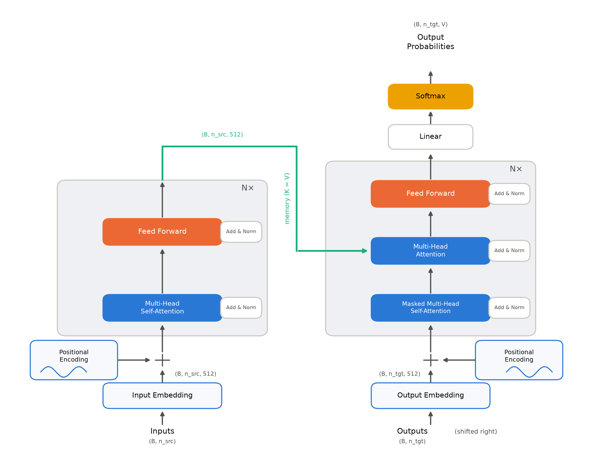
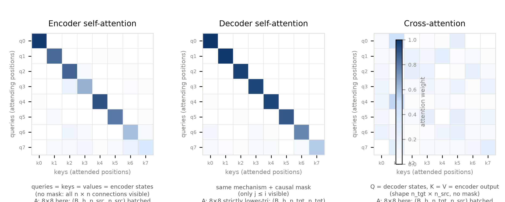
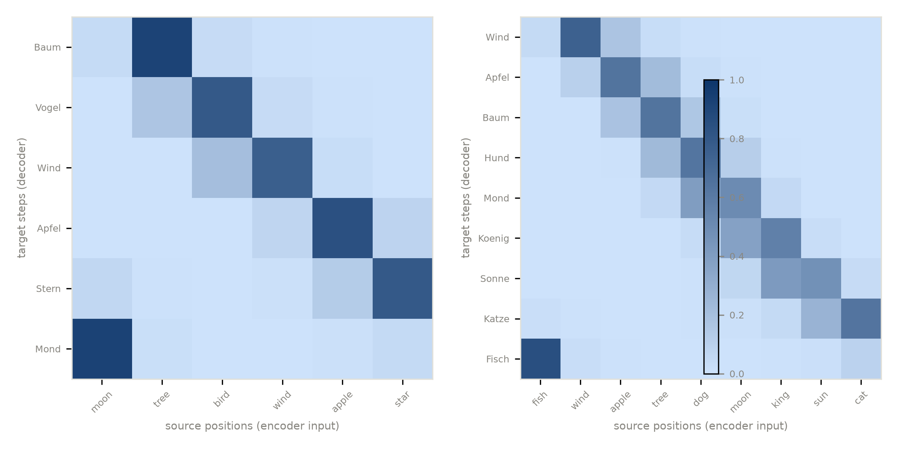

# 第 4 章 三种注意力角色与双塔协作

## 4.0 开篇：从全书到这里

上一章结束时，零件铺的柜台上躺着我们最好的作品：多头注意力——$h$ 个 64 维子空间里并行的第 2 章算子（式 (3.1)），$h\cdot d_k=d_{model}$ 的算术让它几乎不多花一个参数，拆包对拍与官方实现逐位一致。但第 3 章末留了一个没兑现的预告：**式 (3.1) 的三个输入 $Q,K,V$ 地位对等、来源却可以不同**——来源一换，同一个公式立刻换一副面孔。零件造好了，我们却还没看过它被装在机器的哪个位置。

本章是零件铺的第三站：不造新零件，而是把手里最好的零件往双塔骨架上试装一次——正式组装仍留第 7 章。全书的整机粗图也在本章挂上墙：导览 0.3 节出发前先看的那眼整台机器——两座塔、一条恒宽的河、三种注意力岗位——配的正是 4.4 节的图 4.1（示意级重绘）；图上三个 Multi-Head Attention 框就是第 2、3 章造的零件在整机的工位，第 5、6 章的零件将分别认领 Positional Encoding 与 Feed Forward/Add & Norm 框。此后每讲一个零件，都先回这张图认位置。第 1 章那台 seq2seq 旧机器是两座塔：编码器把源句读进去，解码器逐词展开译文；Transformer 仍是这两座塔，只是塔内的循环网络换成了注意力。于是本章要回答的问题是：**同一个「$Q$ 查 $K$、按匹配度取 $V$」的运算，在这台双塔机器里被装在哪三个位置、各司什么职？每个位置「能看见谁」？** 本章结束时你手里会多三样东西：三种角色的机制与公式（式 (4.1)–(4.3)）、一张从源 token 到输出概率的完整形状清单（表 4.3）、以及本书第一张亲手训出来的对齐热图（图 4.3）。

先把底牌亮出来：三种角色没有任何新的数学，全部是第 2、3 章那台机器的不同**接线方式**。但走通它们之后，一个新问题会自己冒出来：整台机器从嵌入到注意力，没有一个零件认识「词序」——打乱输入，它毫无察觉。这是第 5 章的入场券。

> **最小背景栏**：需要第 2 章式 (2.1)（缩放点积注意力）与第 3 章多头机制（投影、按头切分、$W^O$ 拼回）。另补一个数据库类比（克制使用）：注意力像一次「软检索」——$Q$ 是检索请求，$K$ 是每条记录的索引键，$V$ 是记录内容；数据库精确命中一条记录，注意力则按 $Q$ 与每个 $K$ 的匹配度对所有 $V$ 加权混合。这个类比 4.3 节会派上大用场；除此之外后文一律用张量与形状说话。

## 4.1 encoder 自注意力：双向可见

开篇把问题立好了：三种用法、各自能看见谁。逐个走近之前，先把总画面钉在墙上——**同一个运算的三份工种**。

把第 2 章那场软寻址想象成**同一位查询员**：拿着问题（$Q$）逐一去试索引（$K$），按匹配度把内容（$V$）各取一点抱走。整台 Transformer 里只有这一位查询员，它被安排在三个窗口坐班：

| 窗口 | 坐班位置 | 谁来提问（$Q$） | 摊开什么（$K/V$） | 能看见谁 |
|---|---|---|---|---|
| encoder 自注意 | 编码塔内 | 源句各位置 | 本塔上一层的全部位置 | 全句，含「未来」 |
| decoder 因果自注意 | 解码塔内 | 已写下的译句各位置 | 本塔上一层的全部位置 | 只有自己与过去 |
| 交叉注意力 | 两塔之间 | 已写下的译句各位置 | 编码塔的最终输出 | 整句源文 |

这张「谁能看见谁」的直觉速查表刻意不编号——4.4 节的表 4.2 是它的精确版（Q/K/V 来源、掩码、Q/K/V 形状与权重形状诸列齐全），两表正好对照着读。三行的差别只有两处：**Q 从哪来、K/V 摊开的是谁**，运算本身一次没换。「为什么恰好三种」在这里也有了答案：一台双塔翻译机里，可看的信息一共只有三类——源句内部、已写下的译句内部、以及译句对源句的检索；一类对应一种角色，不多不少。现在走近第一个窗口。

**为什么 encoder 可以「看全句」。** 编码器面对的是一句**完整已知的源句**：没有要保守的秘密，没有还没发生的未来。既然如此，理解每个词时没有理由只看半句。这是三种角色中最自由的一种——每个位置都可以直接看见全部位置，术语叫**双向**（bidirectional）。

这个自由在 RNN 时代是要付出代价的。循环网络按时间步单向推进，想让第 $j$ 个位置的表示同时包含上文与下文，只能训练两个方向各读一遍再拼接：Bahdanau 的编码器正是双向 GRU，标注取 $h_j=[\overrightarrow{h}_j;\overleftarrow{h}_j]$【证据等级：官方论文 1409.0473 v7 §3.2】；GNMT 八层编码器中只有最底层做成双向，其余七层仍是单向【证据等级：官方论文 1609.08144 v2 §3.2】。双向是奢侈品，按层省着用。Transformer 的自注意力把这个奢侈变成了标配：任意两个位置的交互路径长度为 $O(1)$（见第 2 章表 2.4，重排自 v7 §4 Table 1），每层 encoder 自注意力天然双向，深度方向上「双向化」免费。

**它长什么样。** 先给一个直觉画面：编码器是一间**圆桌会议室**——源句的每个词都是与会者；每轮讨论里，轮到某个词更新自己的发言，而桌上摊着**所有人**上一轮的发言稿，它想细看谁、略过谁，全凭内容匹配自己决定。没有座次造成的视野死角，也没有「还没轮到」的后来者。把这幅画面写下来，就是三份输入同源、不加掩码的一次式 (2.1)。原文 §3.2.3 第二条（原文列举顺序见 4.3 节）这样规定 encoder 自注意：在一个自注意层里，所有的 keys、values 和 queries **来自同一个地方**——encoder 上一层的输出；encoder 的每个位置可以注意上一层的所有位置【证据等级：官方论文 v7 §3.2.3，直译】。用第 2 章式 (2.1) 的语言：

$$Q = XW^{Q},\quad K = XW^{K},\quad V = XW^{V},\qquad A = \mathrm{softmax}\!\left(\frac{QK^{\top}}{\sqrt{d_k}}\right) \tag{4.1}$$

（式 (4.1) 为单头、集中投影的简化记法；逐头的严格式见第 3 章式 (3.2)，$\sqrt{d_k}$ 取每头维度 64。）

| 符号 | 含义 | 形状 |
|---|---|---|
| $X$ | 编码器上一层的输出（投影前的子层输入） | $\mathbb{R}^{n_{src}\times d_{model}}$ |
| $W^{Q},W^{K},W^{V}$ | 单头简化记法下的三路投影 | $\mathbb{R}^{d_{model}\times d_k}$（$512\times64$） |
| $A$ | 自注意权重矩阵，第 $i$ 行 = 位置 $i$ 的注意力分布 | $\mathbb{R}^{n_{src}\times n_{src}}$ |
| $d_k$ | 每头键维（base=64，见第 3 章） | 标量 |

用人话说：每个源词拿全句（含自己）的表示做一次加权调和——谁的键与自己最匹配，就多拿谁的内容；出来的每一行，是一个「已经看过整句」的词。把批与头两维也接上（$B$=批大小、$h=8$ 头）：$X$ 为 $(B,n_{src},512)$，三路投影后每头 $(B,n_{src},64)$、叠放成 $Q,K,V\in(B,8,n_{src},64)$；$QK^{\top}$：$(B,8,n_{src},64)\times(B,8,n_{src},64)\to(B,8,n_{src},n_{src})$，softmax 后左乘 $V$ 收回 $(B,8,n_{src},64)$，拼头过 $W^O$ 回到 $(B,n_{src},512)$——这七步逐运算的形状流转表见 4.4 节表 4.4。它装在机器里的位置：编码塔的每一层（$N=6$）里各坐一场，是塔内唯一的横向信息通道。

三个输入同源，无掩码。权重矩阵 $A$ 的第 $i$ 行是位置 $i$ 对全句的注意力分布——**没有零元**。我们在随机初始化的单头演示（[`code/ch04/roles_demo.py`](code/ch04/roles_demo.py#L48) 的 `demo_roles()`，$n=8$、$d=16$、seed 42）里实测：8×8 权重矩阵最小元 $5.355\times10^{-4}$，所有位置两两互见；每一行求和恰为 1【证据等级：本书实验（CPU，2026-10）】。「全句互见」不是修辞，是矩阵里 64 个全部非零的格子（图 4.2 左）。顺带记一个马上要用到的事实：**行和为 1，列和不必**——每个位置独立地把自己的 1 分出去，某个源位置被大家合起来盯了 3 份、另一个只分到 0.1 份，完全合法。注意力是软检索不是硬分配，这是它与「一一对应」的根本区别，也是 4.5 节读热图时的度量基础。

**双向为什么对翻译是刚需。** 一个常被略过的深层理由：目标语的语序往往不等于源语。德语常把动词放到句末——译句前部的词，信息可能在源句的尾部。编码阶段若看不见「未来」，这些信息就只能指望在单向隐状态里艰难存活到被读取的那一刻。第 1 章的重排技巧（源句逆转输入）正是对这种痛苦的补丁；而双向编码直接给出解法。4.5 节的合成任务会把「首词后置」设为唯一语序规则，届时可以眼见注意力如何搬运这块语序差。

**代价早已记账。** 双向全连通的账单是 $O(n^2\cdot d)$ 的打分开销与 $O(n^2)$ 的权重存储——第 2 章 2.4 节已经手算过，这是 2017 年用复杂度换路径长度的成交价，本章不再重算。

## 4.2 decoder 因果自注意：掩码首次登场

第一个窗口的自由是有前提的——源句是**已经写完**的句子。换到解码塔，同样的运算立刻要接受一条铁律：译句是一个词一个词**正在写**的，写作过程中不许看后文。

**为什么 decoder 必须遮住未来。** 解码器是一个自回归的语言模型：它逐个生成目标词，第 $i$ 个词的预测只允许依赖已经生成的第 $1,\dots,i-1$ 个词。先看一个极端场景，体会这条铁律为什么是生死攸关的事。训练采用教师强制（teacher forcing，第 1 章 1.1 节）：整句标准答案一次性喂进解码器。假如此时不设任何遮罩，位置 $i$ 的打分行会对**整句**的键打分——包括位置 $i+1$，那里躺着标准答案 $y_{i+1}$。于是「预测下一个词」退化成「从隔壁桌抄答案」：损失趋近于零，模型什么也不必学；可推理时隔壁桌是空的——没有答案可抄，模型当场现形。原论文把这条纪律写得毫不含糊：

> "This masking, combined with the fact that the output embeddings are offset by one position, ensures that the predictions for position $i$ can depend only on the known outputs at positions less than $i$.【证据等级：官方论文 v7 §3.1，直引】"

**掩码（mask）第一次成为主角**（原文措辞是 "prevent leftward information flow"，后世通称因果掩码 causal mask）。

**掩码怎么做。** §3.2.3 第三条给出了实现位置，注意它精确到 softmax 的**输入**：

> "We implement this inside of scaled dot-product attention by masking out (setting to $-\infty$) all values in the input of the softmax which correspond to illegal connections.【证据等级：官方论文 v7 §3.2.3，直引】"

写成公式，就是给打分矩阵逐元素加一个禁区函数：

$$\tilde{s}_{ij} = \frac{q_i k_j^{\top}}{\sqrt{d_k}} + M_{ij},\qquad
A_{ij} = \frac{\exp(\tilde{s}_{ij})}{\sum_{j'}\exp(\tilde{s}_{ij'})},\qquad
M_{ij} = \begin{cases} 0, & j \le i \\ -\infty, & j > i \end{cases} \tag{4.2}$$

| 符号 | 含义 | 形状 |
|---|---|---|
| $q_i,\,k_j$ | 解码器上一层的第 $i$ / 第 $j$ 个位置的表示 | $\mathbb{R}^{d_k}$（单头） |
| $\tilde{s}_{ij}$ | 带掩码的打分 | 标量；整阵 $\mathbb{R}^{n_{tgt}\times n_{tgt}}$ |
| $M_{ij}$ | 因果掩码：$j>i$（未来）置 $-\infty$ | $\mathbb{R}^{n_{tgt}\times n_{tgt}}$ |
| $A_{ij}$ | 位置 $i$ 分给位置 $j$ 的权重，行和为 1 | $\mathbb{R}^{n_{tgt}\times n_{tgt}}$ |

用人话说：先给打分矩阵盖一张禁区表——未来格子的得分被改写成 $-\infty$，softmax 之后这些格子分到的权重**精确为零**，等于从未在场；每一行只在自己与过去之间分配自己的那 1 份。形状上这一步零增减：带掩码打分 $\tilde{s}$ 整阵 $(n_{tgt},n_{tgt})$（整批多头口径 $(B,h,n_{tgt},n_{tgt})$），禁区表 $M$ 与它同形、全批全头共用一张，沿前两维广播即可——掩码写在 softmax 的输入上，不惊动任何一站的尺寸。

注意机制细节：$-\infty$ 经过 softmax 后权重**精确为零**，未来位置不是「被降低权重」，而是被开除出局。与此同时每行仍保留 $j\le i$ 的合法位置，行和依旧是 1——首行最极端，只剩自己一格可见，权重必为 1；越往后可见集越大，注意力的「视野」随位置逐渐张开。这个渐张的视野在图 4.2 的中面板一眼可见：下三角从左上角的单格逐步展宽成整行。

掩码为什么放在 softmax 的**输入**端而不是事后把权重乘零？事后清零再重新归一化在数学上等价（等价于只在合法子集上做 softmax），但若只清零不重归一，行和小于 1，输出整体被稀释；在输入端置 $-\infty$ 则一步到位——打分矩阵一次 `masked_fill` 即完成。论文图 2 左侧的机制流程把 Mask 方框明确画在 Scale 与 SoftMax 之间【证据等级：官方论文 v7 Fig.2，图注核对】，与 §3.2.3 的文字互证：这是同一件事的两处记载。

```python
# [`code/ch04/roles_demo.py`](code/ch04/roles_demo.py) 节选（attention()）
scores = Q @ K.transpose(-2, -1) / math.sqrt(d_k)   # (...,n,dk)×(...,dk,m) -> (...,n,m)
if causal:
    nosee = torch.triu(torch.ones(n, n, dtype=torch.bool), diagonal=1)  # (n,m) 禁区表，j>i 为真
    scores = scores.masked_fill(nosee, float("-inf"))  # 掩码沿 B/h 维广播，未来格置 -inf
A = torch.softmax(scores, dim=-1)                    # 逐行 softmax，行和 1
```

实测（与 4.1 节同一套随机数据、同一套投影，唯一差别是加掩码）：8×8 因果权重矩阵的上三角（未来位）元素之和为 0——精确为零（打印值 0.000e+00）；矩阵呈严格下三角（图 4.2 中）【证据等级：本书实验（CPU，2026-10）】。「能看见谁」自此成为一个可以逐格验证的问题：encoder 的答案是「全部」，decoder 自注意的答案是「自己与过去」。

**右移一位：掩码之外还有一颗螺丝。** 掩码封住了「方向」，还差另一颗螺丝——**对齐**。目标序列作为 decoder 输入前，要整体**右移一位（shifted right）**，首位补起始符。为什么非要挪这一格？把不挪的两种后果摆出来就透了（输入位置从 0 编号）。

后果一：若把 $y_1,\dots,y_n$ 原样喂进去、要求每个位置预测**自己**（$y_i$）——可见集 $j\le i$ 恒含位置 $i$ 本人，答案就坐在题目里，而掩码只撕「未来」的页，管不住「现在」这一格，训练沦为抄写。后果二：若改成要求位置 $i$ 预测 $y_{i+1}$（标准语言模型的「预测下一词」，信息上合法）——位置 0 站的就是 $y_1$，**第一个词从此没有输入位可站**：推理时解码器必须从「什么都没有」起步，可模型从未学过如何起步。右移一位，两个问题一次解决：起始符占住位置 0，给生成腾出「从零起步」的槽；每个位置站着的从此都是「上一个词」，要答的题是「下一个词」——题号与答案号恰好错开一格。拿一个三词目标句看监督的错位结构（表 4.1）：

| decoder 输入（右移后） | `<bos>` | $y_1$ | $y_2$ |
|---|---|---|---|
| 监督目标 | $y_1$ | $y_2$ | $y_3$ |

表 4.1 目标序列右移一位后的输入-监督错位结构（自排）

第 $i$ 个输入位的任务是预测 $y_{i+1}$，而它的可见集是 $j\le i$——恰好不含 $y_{i+1}$。用人话说：右移让每个位置背后站着的都是「上一个词」、要交的都是「下一个词」——答案永远落在视野外一格。掩码管方向（未来出局），右移管对齐（题与答案错开一格），两者合起来才是原文那句 "predictions for position $i$ can depend only on the known outputs at positions less than $i$" 的完整实现。

**两个容易混淆的点。** 其一，因果掩码**不妨碍训练并行**：训练时目标句已知（教师强制），整句一次前向即可同时算出所有位置的损失，掩码约束的是信息流方向而非计算顺序。其二，推理时逐 token 生成的串行性来自自回归解码协议（第 7 章展开），而不是掩码本身——同一张下三角表，训练时是「并行的宪法」，推理时是「串行的宿命」。mask 的 bool/float 两种形态、与填充掩码的组合及全屏蔽行陷阱，是第 7 章的主菜，此处按住不表。

## 4.3 交叉注意力：解码器发问，编码器作答

塔内的两条纪律都立好了——编码塔看全句、解码塔看过去——第三个窗口开在两塔之间：交叉注意力（cross-attention）的窗口，也是两塔之间唯一的桥。

**先给画面：拿着问题去书架查资料。** 最小背景栏里那个「软检索」类比，到这里才真正兑现。解码器每译一步，手里攥着一个问题（$Q$：「我正要写的这个词，源句里跟谁有关？」），走到编码器摆好的书架前——架上每个源位置立着一张索引卡（$K$：这个位置「讲的是什么」）和一份内容（$V$：这个位置的表示本身）。它拿问题逐一比对索引卡，按匹配度把各份内容各取一点、加权抱走。第 2 章讲式 (2.1) 时说过这是一场「全句参与的软寻址」——这里的新意只有一条：提问的人与书架**分属两座塔**。

**原文的第一条用法。** §3.2.3 列举三种用法时，头一个讲的其实是跨塔这种（本书按数据流顺序后置到本节，原文顺序如实记录）：

> "In 'encoder-decoder attention' layers, the queries come from the previous decoder layer, and the memory keys and values come from the output of the encoder. This allows every position in the decoder to attend over all positions in the input sequence.【证据等级：官方论文 v7 §3.2.3，直引】"

三个输入第一次**不同源**：

$$A^{cross}_{ij} = \mathrm{softmax}\!\left(\frac{q^{dec}_i\, (k^{enc}_j)^{\top}}{\sqrt{d_k}}\right),\qquad q^{dec}_i \in \mathbb{R}^{d_k},\; k^{enc}_j = v^{enc}_j \in \mathbb{R}^{d_k} \tag{4.3}$$

| 符号 | 含义 | 形状 |
|---|---|---|
| $q^{dec}_i$ | 第 $i$ 个目标位置的查询，来自解码器上一层输出 | $\mathbb{R}^{d_k}$ |
| $k^{enc}_j,\,v^{enc}_j$ | 第 $j$ 个源位置的键与值，**同源于编码器最终输出（memory）** | $\mathbb{R}^{d_k}$ |
| $A^{cross}$ | 对齐矩阵：行=目标步，列=源位 | $\mathbb{R}^{n_{tgt}\times n_{src}}$ |

用人话说：解码器把「我要译什么」这个问题带到源句书架前，逐一试过每张索引卡，按匹配度把各格内容掺成一份答案抱回解码塔——书架不动，问题一来一回，源句的信息就过了桥。

三个要点。第一，**Q 与 K/V 分属两塔**：解码器拿「我现在译到哪、要找什么」当查询，编码器输出的每个源位置既当索引键又当内容值——解码器发问，编码器作答。第二，**无因果掩码**：源句是编码器的既成事实，没有未来需要遮掩；约束方向恰好只施加在塔内（式 (4.2)），不施加于塔间。第三，**权重矩阵是 $n_{tgt}\times n_{src}$**：两个长度可以不同，每生成一个目标词，对整句源位置各分一份权重（图 4.2 右）；整批多头口径下 $Q^{dec}$ 为 $(B,h,n_{tgt},d_k)$、$K^{enc}=V^{enc}$ 为 $(B,h,n_{src},d_k)$，打分 $Q^{dec}(K^{enc})^{\top}$：$(B,h,n_{tgt},d_k)\times(B,h,n_{src},d_k)\to(B,h,n_{tgt},n_{src})$。

这张 $(n_{tgt}\times n_{src})$ 的矩阵就是**对齐矩阵**——第 1 章图 1.3 里 Bahdanau 那张热图的 $\alpha_{ij}$，在式 (4.3) 里换了身衣服重新登场。

> **【考据框】** 原论文自己画过交叉注意力的热图吗？——一张也没有。v7 附录的三张注意力可视化（Fig 3-5）展示的全是 **encoder 自注意**：长距离依赖、指代消解、句法结构【证据等级：官方论文 v7 Fig.3/4/5 图注核对】；交叉注意力的对齐热图反而缺席。译码端对齐热图作为分析工具，是从 Bahdanau 的习惯延续下来的社区传统，本书 4.5 节与第 9 章沿用的正是这支传统。（图注考证，跳过不影响主线。）

**从 Bahdanau 打分到 Q/K/V：同一思想的两次书写。** 把式 (4.3) 与第 1 章 1.3 节的软对齐并排放着看，血缘一目了然。Bahdanau 的打分以**上一步解码状态** $s_{i-1}$ 查询**编码器标注** $h_j$：

$$e_{ij} = v_a^{\top}\tanh\!\left(W_a\, s_{i-1} + U_a\, h_j\right) \tag{4.4}$$

（第 1 章写作抽象形式 $e_{ij}=a(s_{i-1},h_j)$；上式即原文附录 A.1.2 给出的那个单隐层前馈网络【证据等级：官方论文 1409.0473 v7 附录 A.1.2】。）用人话说：老式打分器——把「解码器的问题」和「源位置的标注」各自过一个小网络，放进同一个 tanh 房间里对质，再由打分员 $v_a$ 报出一个匹配分。

| 符号 | 含义 | 形状 |
|---|---|---|
| $s_{i-1}$ | 上一步解码器状态（「查询」） | $\mathbb{R}^{d_s}$（本章实验 $d_s=96$） |
| $h_j$ | 编码器标注（「键=值」，双向拼接） | $\mathbb{R}^{d_h}$（$2\times48=96$） |
| $W_a,\,U_a$ | 两路各自先过的线性改写 | $\mathbb{R}^{p\times d_s}$、$\mathbb{R}^{p\times d_h}$（实验 $p=96$） |
| $v_a$ | 打分员：把隐层压回一个匹配分 | $\mathbb{R}^{p}$ |
| $e_{ij}$ | 第 $i$ 步对源位 $j$ 的打分 | 标量；整阵 $\mathbb{R}^{n_{tgt}\times n_{src}}$ |

对照表如下：

| 成分 | Bahdanau（1409.0473） | Transformer（v7 §3.2） |
|---|---|---|
| 「查询」 | 上一步解码状态 $s_{i-1}$ | 解码器上一层的 $Q=W^Q x$ |
| 「键=值」 | 编码器标注 $h_j$（键值不分家） | 编码器输出的 $K=W^K\cdot$、$V=W^V\cdot$（投影后仍同源） |
| 打分函数 | 加性 MLP（式 (4.4)） | 缩放点积 $QK^\top/\sqrt{d_k}$（第 2 章式 (2.1)） |
| 注意频率 | 每个目标步一次 | 每个 decoder 层每步一次（$N=6$ 次） |

语义没有变——「解码器状态检索源句」；变的是三处书写方式：查询与键值各自先过线性投影（多头的入场券，第 3 章）、打分函数换成点积（第 2 章 2.1 节，论证彼处已展开）、注意从每步一次加密到每层一次。顺带一句，K 与 V 在 2017 年仍然同源同体（投影前是同一个张量），「地址」与「内容」被彻底拆开各自缓存，是推理时代才开立的账——见本章欠账框。

**每层一次，是 2016-2017 年争出来的配置。** 注意力放几处，前史给过三个答案。GNMT 的答案最保守：注意力只连**一处**——解码器最底层与编码器最顶层之间，打分函数是一个 1024 节点的单隐层前馈网络；这样布局是为了让解码器主体可以按层并行【证据等级：官方论文 1609.08144 v2 §1/§3.3/§8】。ConvS2S 的答案是**每层一处**（multi-step attention）：每个解码层配独立注意力模块，层数多即「多跳」检索；实测代价——5 层全注意相对单层注意，吞吐仅从 3772 降到 3624 词/秒，慢约 4%【证据等级：官方论文 1705.03122 v3 §3.3/§5.5 Table 5】。Transformer 站到了 ConvS2S 一侧：每个 decoder 层都有一场交叉注意力（论文 §3.1：解码器层「插入」的第三个子层，正是 "multi-head attention over the output of the encoder stack"【证据等级：官方论文 v7 §3.1】）。另外，RNN 时代为了让解码器「记得自己先前对齐过哪里」，Luong 需要把注意力输出回灌进下一步输入——输入回喂（input feeding）；Transformer 的 decoder 自注意天然携带全部历史决策，这一件行李可以扔了【证据等级：官方论文 1508.04025 v5 §3.3，对照性转述】。

双塔协作的接口至此完整：encoder 每层双向自注意加工源句，decoder 每层先因果自注意整理已知输出、再经交叉注意力向源句取材。这个「条件生成」接口的生命力比双塔本身更长——decoder-only 浪潮后来把交叉注意力折叠进单塔，怎么折、为什么能折，是 Book2 第 4 章「原典到 GPT-2 差异清单」的第一项，此处按下。

## 4.4 双塔数据流全景：一张形状清单

三个窗口都看过了，现在把它们装回 Fig 1 的双塔里，沿数据流走一遍，逐站记录张量形状——这一节是全章的整机图景：每种角色装在机器的哪一层哪一站，一览无余。图 4.1 是论文 Fig 1 的自绘重制（图内全部标签已对照 v7 原始 PDF 逐区放大核对，核对记录见考据框；灰/青小字形状标注为本书叠加层，原图所无）。

> **【考据框】** 图 4.1 保真度核对记录：图内标签 Inputs、Outputs (shifted right)、Input/Output Embedding、Positional Encoding、三种子层名（Multi-Head Attention ×3 处）、Add & Norm、$N\times$、Linear、Softmax、Output Probabilities，已逐一对照 v7 原始 PDF 第 3 页放大核过，与原版 Fig 1 一致；灰/青形状小标不在核对范围——那是本书叠加的标注层，非原图内容。（制图考据，跳过不影响主线。）



图 4.1 Transformer 整体架构：左塔 encoder（2 个子层），右塔 decoder（3 个子层），青色线为编码器输出送入交叉注意力（自绘重制·示意级，改绘自 Vaswani et al. 2017 Fig.1）；灰/青小字为形状标注（本书叠加）：$B$=批、$n_{src}/n_{tgt}$=两塔句长、$V$=词表——整机粗图即导览 0.3 节所指的这张。

三种角色的差别，浓缩成一张对照表：

| 角色 | Q 来源 | K/V 来源 | 掩码 | Q/K/V 形状（整批多头） | 权重形状（单头） |
|---|---|---|---|---|---|
| encoder 自注意 | 编码器上一层输出 | 同 Q（同源） | 无 | $Q{=}K{=}V$：$(B,h,n_{src},d_k)$ | $(n_{src},\,n_{src})$，全非零 |
| decoder 因果自注意 | 解码器上一层输出 | 同 Q（同源） | 因果：$j>i$ 置 $-\infty$ | $Q{=}K{=}V$：$(B,h,n_{tgt},d_k)$ | $(n_{tgt},\,n_{tgt})$，严格下三角 |
| 交叉注意力 | 解码器上一层输出 | 编码器最终输出（memory） | 无 | $Q$：$(B,h,n_{tgt},d_k)$；$K{=}V$：$(B,h,n_{src},d_k)$ | $(n_{tgt},\,n_{src})$ |

表 4.2 三种注意力角色对照（自排；排序按本章讲解顺序；v7 §3.2.3 原文列举顺序为 cross→encoder→decoder）

表 4.2 就是 4.1 节那张直觉速查表的精确版——「能看见谁」三列（Q 来源、K/V 来源、掩码）现在有了公式级的出处；新增的形状列把三份 Q/K/V 的维度差异摆进同一行——前两种角色只有句长一把尺子，cross 的行、列两把尺子在 K/V 一格里就分了家。取 base 配置一个具体样本（batch $B=1$、$n_{src}=10$、$n_{tgt}=10$、$d_{model}=512$、$h=8$、$d_k=d_v=64$、$d_{ff}=2048$、$N=6$），从源 token 到输出概率的形状清单如下。本章只追踪与注意力有关的形状流；Add & Norm 与 FFN 的内部账本留待第 6 章逐站展开。

| 站 | 张量 / 操作 | 形状 | 说明 |
|---|---|---|---|
| 1 | 源 token 序列 | $(1,10)$ | 整数 id |
| 2 | 源嵌入 + 位置编码 | $(1,10,512)$ | 嵌入与 PE 相加（论文 §3.4/§3.5，细节见第 5、7 章） |
| 3 | encoder 自注意打分 $QK^\top/\sqrt{d_k}$ | $(1,8,10,10)$ | 无掩码，每头一张 $10\times10$、全格参与 |
| 4 | softmax 权重 | $(1,8,10,10)$ | 逐行归一，行和 1（图 4.2 左） |
| 5 | 单头输出→拼回 | $(1,8,10,64)$ → $(1,10,512)$ | 每头 $(1,10,64)$，concat 后过 $W^O$（第 3 章 3.2 节） |
| 6 | Add & Norm → FFN | $(1,10,512)\to(1,10,2048)\to(1,10,512)$ | 第 6 章 |
| 7 | 重复 $N=6$ 次 → **memory** | $(1,10,512)$ | 编码器最终输出 |
| 8 | 目标 token（右移一位） | $(1,10)$ | 起始符打头，见表 4.1 与式 (4.2) |
| 9 | 目标嵌入 + 位置编码 | $(1,10,512)$ | |
| 10 | decoder 因果自注意权重 | $(1,8,10,10)$，下三角 | 式 (4.2)（图 4.2 中） |
| 11 | cross 打分 $QK^\top/\sqrt{d_k}$ | $(1,8,10,10)$ | $Q$：$(1,10,512)$（解码器）$\times$ $K{=}V$：$(1,10,512)$（memory），切头后打分；行来自解码器、列来自 memory，$n_{tgt}\times n_{src}$（图 4.2 右） |
| 12 | Add & Norm → FFN，重复 $N=6$ | $(1,10,512)$ | |
| 13 | 输出线性 + softmax | $(1,10,V)$，$V\approx37000$ | $V$=共享 BPE 词表（论文 §5.1）；三处权重共享见第 7 章 |

表 4.3 双塔数据流：张量形状清单（自排；base 配置，$B=1$、$n_{src}=n_{tgt}=10$）



图 4.2 三种注意力角色的权重矩阵对照：同一套随机数据与投影，encoder 无掩码全互见、decoder 因果严格下三角、cross 为 $n_{tgt}\times n_{src}$ 全幅矩阵（自产，本书实验：单头、$n=8$、$d=16$、seed 42 的真实注意力权重）；各面板末行为形状标注——整批多头口径下三张权重分别为 $(B,h,n_{src},n_{src})$、$(B,h,n_{tgt},n_{tgt})$（严格下三角）与 $(B,h,n_{tgt},n_{src})$

清单里最值得停留的是第 3、10、11 三站：**同样的打分公式，三种喂法，三张形状与禁区都不同的矩阵**。这就是「三种角色」的全部机制内容——没有新运算，只有新用法。4.1 节的总画面在这里落成了账面事实：查询员没换，换的只是窗口。既然三站共用同一套运算，把它单独放大到逐运算的颗粒度看一遍——表 4.4 就是三种角色共用的那条形状流转（记法：$n_q$=查询句长、$n_{kv}$=键值句长，三种角色只是给这两个字母代入不同的尺子）。

| 步骤 | 运算 | 输入形状 | 输出形状 | 说明 |
|---|---|---|---|---|
| 1 | 三路投影 $W^Q/W^K/W^V$ | $(B,n,d_{model})$ | 各 $(B,n,d_{model})$ | 自注意两角色三路同源（$n=n_{src}$ 或 $n_{tgt}$）；cross 的 $Q$ 路作用在解码器输入 $(B,n_{tgt},d_{model})$、K/V 路作用在 memory $(B,n_{src},d_{model})$ |
| 2 | 按头切分（reshape） | $(B,n,d_{model})$ | $(B,h,n,d_k)$ | $h\cdot d_k=d_{model}$（第 3 章 3.2 节） |
| 3 | 打分 $QK^{\top}/\sqrt{d_k}$ | $(B,h,n_q,d_k)\times(B,h,n_{kv},d_k)$ | $(B,h,n_q,n_{kv})$ | 行=查询句长、列=键值句长；三种角色同一行算式 |
| 4 | 加掩码 $+M$（仅 decoder 因果自注意） | $(B,h,n_{tgt},n_{tgt})$ | 同形 | $M$ 只含 $0/-\infty$（式 (4.2)），全批全头共用一张 |
| 5 | softmax（逐行） | $(B,h,n_q,n_{kv})$ | $(B,h,n_q,n_{kv})$ | 行和 1；因果角色的未来格精确为 0 |
| 6 | 取货 $AV$ | $(B,h,n_q,n_{kv})\times(B,h,n_{kv},d_v)$ | $(B,h,n_q,d_v)$ | 按权重混合各键值内容 |
| 7 | 拼头 + 输出投影 $W^O$ | $(B,h,n_q,d_v)$ | $(B,n_q,d_{model})$ | concat 回 $d_{model}$ 宽，交给残差与 LN（第 6 章） |

表 4.4 多头注意力子层形状流转表（自排；三种角色共用的骨架，差异只在第 1 步的喂法与第 4 步的掩码）

三处补充说明。其一，表 4.3 为对称起见取了 $n_{src}=n_{tgt}=10$，但这两个长度**完全独立**：译成德语的英语句往往更长或更短，第 11 站的形状永远是 $(n_{tgt}, n_{src})$——行、列各用一把尺子，这是交叉注意力与两种自注意（方阵）在形状上的身份区别。其二，第 7 站的 memory 在第 11 站被读 $N=6$ 次——每个 decoder 层各有一套自己的 $W^K$、$W^V$ 投影，等于六把不同的检索器对同一份源句表示反复发问、逐层精炼查询。这笔开销与塔内自注意同阶（每层 $n_{tgt}\cdot n_{src}\cdot d$ 对 $n^2\cdot d$，复杂度视角见第 2 章表 2.4），并非模型的多数账——ConvS2S 那条「每层注意仅慢 4%」的实测正说明这一阶开销在整模型预算里不占大头，「每层一次」买得起。其三，批与头的读法：表 4.3 全表按 $B=1$ 写死，换任意 $B$ 只需给每站最前加一维批维；表中打分、权重与单头输出三站的 $(1,8,\cdot,\cdot)$ 是头维叠放后的整块四维张量——8 张「每头矩阵」一次 `reshape` 成型（第 3 章 3.2 节），表 4.4 的第 2 步正是这一下。

> **【实现对照框】**（以下为 PyTorch 官方 API 对照，非原论文内容）三种角色在 `nn.MultiheadAttention` 里就是三种调用姿势：encoder 自注意 `mha(x, x, x)`；decoder 因果自注意 `mha(y, y, y, attn_mask=causal)`（掩码以 float $-\infty$ 上三角阵传入，注意该系 API 的 bool 掩码语义是 True=屏蔽，与直觉相反）；交叉注意力 `mha(y, x, x)`——第二个参数是 key、第三个是 value，Q 与 K/V 不同源正是 cross 的调用特征（三姿势的实测见 `roles_demo.py` 的 `demo_api_postures()`）。实测三种姿势返回的权重均为 $(8,8)$，因果姿势的上三角和精确为 0（打印值 0.000e+00）【证据等级：本书实验（CPU，2026-10），torch 2.13.0】。整机组装层面的 `nn.TransformerEncoderLayer/DecoderLayer` 对拍见第 7 章。

## 4.5 对齐矩阵可视化：亲手训出第一张热图

上一节的形状清单走通了双塔，但清单里的注意力矩阵还只是随机权重下的形状演示——位置对了，内容还没有意义。注意力真的能学会「该看谁」吗？本节亲手训一个给你看。

**为什么做这个实验。** 原论文把注意力可视化当副产品：附录 Fig 3-5 展示了 encoder 自注意追踪长距离依赖、指代消解与句法结构的行为（第 1 章图 1.3 是 Bahdanau 对齐热图的自绘重制）。但**读别人的热图**与**自己训出一张**是两种置信度。本节在合成任务上短训一个小型 GRU+Bahdanau 模型，看 $\alpha_{ij}$ 矩阵如何从随机噪声变成干净的对齐——用 RNN 注意力而非 Transformer，是有意安排的教学阶梯：GRU 是第 1 章背景，注意力的 softmax 加权公式与架构无关（式 (4.3) 与式 (4.4) 的同构正是本节要眼见为实的东西），而完整 Transformer 的热图在第 9 章图 9.2 用真翻译模型升级重演。

任务这样设计：一部 12 词的英德小词典（apple→Apfel、bird→Vogel……），源句从 12 词中**不重复**地随机抽取 $L\in[6,9]$ 个；目标是逐词直译，外加一条语序规则：**源句首词后置到目标句末**（模拟德语动词后置的味道）。无重复抽样保证对齐真值无歧义；首词后置则刻意制造一块非单调对齐——这正是 Bahdanau Fig 3(a) 里 [European Economic Area]→[zone économique européenne] 那种「块内倒序」的合成版【证据等级：官方论文 1409.0473 v7 Fig.3(a)，对照性引用】。

模型与训练配置如下：编码器为双向 GRU（每向 48 维，标注拼接为 96 维，即第 1 章的 $h_j=[\overrightarrow{h}_j;\overleftarrow{h}_j]$）；解码器为 96 维 GRU，每步先按式 (4.4) 算加性打分、softmax 得 $\alpha_i$、加权求和得上下文 $c_i$，再以 $[y_{i-1}$ 嵌入 $;\,c_i]$ 更新状态；教师强制训练，Adam（$lr=10^{-3}$），batch 64，固定种子 42。形状流（单头、逐步，无头维）：标注 $h$ 整批 $(B,L,96)$；每个解码步算一行打分 $e_i$：$(B,96)\times(B,L,96)\to(B,L)$，softmax 得 $\alpha_i$ $(B,L)$，加权求和 $c_i=\sum_j\alpha_{ij}h_j$ 得 $(B,96)$——与式 (4.3) 的交叉注意力逐步同构，只是把「多头并行的整批四维」退化成「单头逐步的二维」。

```python
# [`code/ch04/roles_demo.py`](code/ch04/roles_demo.py) 节选（BahdanauAttention 类）
class BahdanauAttention(nn.Module):
    """加性打分 e_ij = v_a^T tanh(W_a s_{i-1} + U_a h_j)（1409.0473 附录 A.1.2）。

    输入 s (B, hid)、h (B, L, hid)、src_mask (B, L) → 输出 α_i (B, L)（行和 1）。"""

    def __init__(self, hid):
        super().__init__()
        self.W = nn.Linear(hid, hid, bias=False)       # 作用于解码状态 s
        self.U = nn.Linear(hid, hid, bias=False)       # 作用于编码标注 h
        self.v = nn.Linear(hid, 1, bias=False)

    def forward(self, s, h, src_mask):                 # s:(B,hid) h:(B,L,hid)
        e = self.v(torch.tanh(self.W(s).unsqueeze(1) + self.U(h))).squeeze(-1)
        # 形状：s (B,hid)->(B,1,hid) 与 h (B,L,hid) 广播相加 -> tanh -> v 压维 -> e (B,L)
        e = e.masked_fill(~src_mask, float("-inf"))    # 填充位打分置 -inf，softmax 后为 0
        return torch.softmax(e, dim=-1)                # α_i: (B, L)
```

全部数字来自本机实际运行【证据等级：本书实验（CPU，2026-10）】：模型共 109,422 参数；3000 步训练，损失从 step 500 的 0.0075 降到 step 3000 的 0.0004；held-out 1024 句上——句级精确匹配率 **100.0%**，对齐 argmax 命中率（每个目标内容步的注意力峰值是否落在真值源位上）**100.0%**，对齐位平均权重 **0.749**；含热图导出在内全程约 37 秒，CPU 单卡。

两个数字值得多说两句。其一，**为什么要看对齐命中率而不满足于精确匹配**：句级匹配只证明行为正确，不证明正确的来路——一个小模型完全可能靠解码器隐状态自己数位置、记词典，把注意力晾在一边也能译对。对齐命中率把黑盒打开：每个目标步的检索峰值都落在真值源位上，才说明「查词典」这件事确实经由 $\alpha_{ij}$ 这条路完成。其二，**收敛速度**：step 500 时损失已降到 0.0075——12 个词的映射加一条语序规则，对这个 10 万参数的小模型是数百步就吃透的简单任务。这并不意外：注意力式读取让每个目标步直接检索任意源位，句长 6 到 9 的词典任务根本没有给「固定向量瓶颈」出场的机会；第 1 章那种长句衰减，要到真语料的真实容量压力下才会显形（第 9、10 章）。



图 4.3 训练所得对齐热图（自产，本书实验）：左 $L=6$、右 $L=9$；行=目标解码步，列=源位置，色深=注意力权重；两图均为「右移一格的对角带 + 左下角亮点」，即首词后置规则留下的非单调痕迹

热图（图 4.3）值得逐格读。左图源句 `[moon, tree, bird, wind, apple, star]`、目标 `[Baum, Vogel, Wind, Apfel, Stern, Mond]`：主对角带整体右移一格——第 $i$ 个目标步盯住第 $i+1$ 个源位（因为首词搬走了，直译部分整体前移一位）；左下角那一颗亮点是画龙点睛处——**最后一个目标步 Mond 回头盯住源句第 0 位 moon**，首词后置规则被注意力原原本本地学成了检索行为。右图 $L=9$ 同构。与 Bahdanau Fig 3(a) 对照：那张著名的英法热图里，非单调出现在名家名词短语的块内倒序；我们这张出现在首词后置——**语言现象不同，对齐矩阵的「块」语法相同**。0.749 的对齐位平均权重说明对齐相当锐利但不独断：每个目标步把约四分之三的预算花在真值源位，剩余洒向上下文（大多是其邻居），这与 Bahdanau 原文热图中对角带周围的浅色晕染形态一致。

边界诚实条款：本任务是**无重复词、规则语序**的合成映射，「对齐」的因果解释（是检索行为还是巧合的相关性）只在受控任务里可以如此断言；真翻译里词有多义、重复与省略，热图解释需谨慎——原论文 Fig 5 的措辞也只是 "seems related" 级别【证据等级：官方论文 v7 Fig.5 caption】。真模型、真语料的热图见第 9 章图 9.2。

## 4.6 本章小结

开篇立的问题至此可以交卷：同一个注意力运算，在双塔机器里被装进三个窗口，全部差别只在「Q 从哪来、K/V 摊开谁、遮不遮未来」。encoder 自注意以全句互见换取 $O(1)$ 路径的双向理解（式 (4.1)）；decoder 因果自注意用一张 $-\infty$ 禁区表保住自回归纪律（式 (4.2)），右移一位把「题」与「答案」错开一格；交叉注意力让解码器的查询检索编码器的记忆（式 (4.3)），那张 $(n_{tgt},n_{src})$ 权重矩阵就是从 Bahdanau 一脉相承的对齐矩阵——我们在合成任务上把它从随机训成了锐利的非单调对齐（图 4.3）。表 4.3 的形状清单则把这一切落成账面：从源 token 到输出概率，十三站，每站可验证；表 4.4 再把三站共用的子层拆成七步逐运算的形状流转——零件一次没换，换的只是接线与禁区。

**带走的心智**（如果忘掉本章所有细节，只允许留下两样东西，请留下这两条）。**其一：三种角色 = 同一个运算的三份工。** Transformer 里没有三种注意力，只有一种注意力装在三个槽位上——判断任何一个注意力子层是什么角色，不必翻代码，只问两个问题：Q 从哪来？K/V 摊开的是谁？两问答完，「能看见谁」自动揭晓。**其二：因果掩码 = 「只许看过去」。** 未来不是被调低权重，而是被 $-\infty$ 开除出局、精确为零；右移一位则保证每个位置要答的题（下一个词）恰好落在自己视野外一格。这两条合起来，你能对这台机器里任何一个位置回答「它能看见谁」——这是读一切 Transformer 架构图的地板技能，也是第 7 章组装整机时的验收标准之一。

放回导览的旅程地图：我们仍在「零件铺」一段，但本章之后，柜台上不再只有散件——注意力运算、多头、三种角色已经拼成了双塔的骨架，装配视角第一次打开。而骨架立起的同时，新债也记上了：整台机器从嵌入到三种子层，没有任何表示携带顺序信息（掩码只裁决可见性、不注入顺序——第 5 章 5.1 会看到它连等变性都破坏）——「猫追狗」与「狗追猫」在它眼里是同一个集合。第 5 章补上这最后一味输入：位置信息。

> **【欠账】** **K/V 的「读取」语义**——2017 年 K 与 V 同源同体，只是一次矩阵乘的两位配角；但「地址」与「内容」既然在公式里已经分成两半，推理时代就有人让它们分开存放、逐层复用，由此长出一本随序列长度线性增长的账。这本账怎么记、为什么决定显存与延迟的下限——→ Book3 第 6 章。

## 4.7 动手验证（本章代码与实验清单）

- 入口命令：`source env.sh && python "[`code/ch04/roles_demo.py`](code/ch04/roles_demo.py)"`（CPU，约 40 秒）
- 图 4.1/4.2 复现：`source env.sh && python [`code/ch04/figures.py`](code/ch04/figures.py#L35)（秒级，即 `make_fig_4_1()` 与 `make_fig_4_2()`）——产出 `drafts/.../figures/fig-4-1-transformer-architecture.png`（2400×1860）与 `fig-4-2-three-roles.png`（2400×960）；两图的形状标注层（图 4.1 主干五站灰/青小标、图 4.2 面板末行）由脚本一并绘出；图 4.2 权重来自固定种子 42 下与 `roles_demo.py` 同源的手写 attention（真实计算非示意），本机重跑与书内两图逐字节一致
- 预期产出：① 三种角色权重矩阵的形状与断言输出（行和=1；因果上三角和=0.000e+00；encoder 全非零，最小元 5.355e-04）；② API 三姿势权重形状 (8,8)；③ 训练日志（loss 0.0075@500 → 0.0004@3000）与评测行（109,422 参数；精确匹配 100.0%；对齐命中率 100.0%；对齐位平均权重 0.749）；④ 图 4.3 热图（同时落 `drafts/.../figures/` 与 `log/ch04/`）
- 验收点：能否不看书画出表 4.2（Q/K/V 来源与掩码列）与表 4.4 的七步形状流（投影→切头→打分→掩码→softmax→取货→拼回）；能否说清右移一位与因果掩码各管哪件事（右移管对齐、掩码管方向）；能否解释式 (4.2) 中 $-\infty$ 为什么放在 softmax 的输入而不是输出；图 4.3 左下角那颗亮点对应任务的哪条规则（首词后置）
- 变式实验：把 `roles_demo.py` 中 `make_pair` 的首词后置行删掉重训，热图应收敛为纯对角——对照读出「语序规则→对齐形状」的因果
