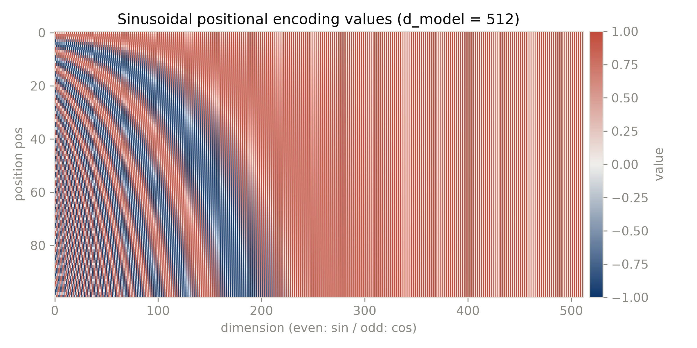
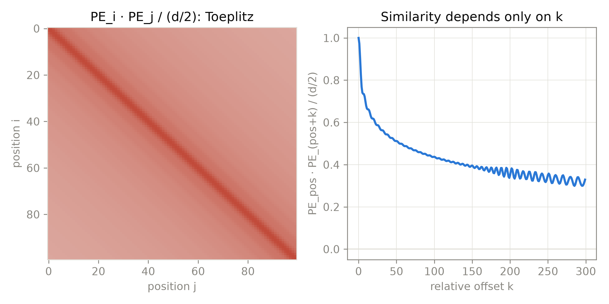

# 第 5 章 正弦位置编码

## 5.0 开篇：从全书到这里

第 4 章结束时，三份注意力工种全部就位：encoder 双向自注意看全句（式 (4.1)）、decoder 因果自注意只看过去（式 (4.2)）、交叉注意力让解码器检索编码器的记忆（式 (4.3)）——双塔的数据流已经走通，表 4.2 你已经可以默画。但整套机器还差一味输入。回看第 2 章式 (2.1)：$\mathrm{softmax}(QK^{\top}/\sqrt{d_k})V$ 从头到尾只问「谁与谁相配」，从未问过「谁在前、谁在后」。第 1 章的 RNN 靠逐词读入的次序天然记得顺序，卷积靠邻域天然带着局部次序；把循环与卷积都拆掉的注意力，是一台**对顺序天生失明的机器**——5.1 节的实验会让你亲眼看到这种「色盲」。而第 1 章 1.1 那个靠源句逆转迁就的长程依赖，将在此换成根治的解法：顺序不再由读入次序隐式背负，而是显式写进输入。

本章这一站要回答的问题是：**顺序信息从哪里注入、以什么形式注入？** 我们将产出三样东西：一个零参数的零件——正弦位置编码（sinusoidal positional encoding）；它的一页数学性质（这页里要学着分清「论文的假设」与「本书的补写」）；以及一个 2017 年只值半句话、至今仍在兑现的承诺——长度外推。顺带地，本章也是全书证据等级制度的集中演练场：同一章里会齐「论文直引的假设句、本书补写的推导、本书实测的数字、第三方实现的口径」四层证据。

本章结束时，零件铺（第 2-6 章）只剩最后一批「纵向」零件——每个位置自身的加工，与让六层堆叠仍可训练的两件配件，那是第 6 章的主题；届时一条 token 将从词元 id 一路走到 logits，而本章的位置编码正是那条数据流在**源头的注入点**——整机粗图见导览 0.3 节，本章的零件就装在第 4 章图 4.1 双塔底部的「Positional Encoding」小框里：嵌入查表之后、一切子层之前，编码器与解码器各一枚。此外我们会留下一笔只能由第 9、10 章偿还的账：外推到底行不行，得等一台训好的机器来回答。

> **最小背景栏**
> ① **置换等变与置换不变**：设 $P$ 是作用在序列位置上的置换矩阵（$n\times n$，左乘 $X\in\mathbb{R}^{n\times d}$ 即把 $n$ 个位置向量重新排序）。函数 $f$ **置换不变**（permutation invariant）指 $f(PX)=f(X)$（输出完全不变）；**置换等变**（permutation equivariant）指 $f(PX)=P\,f(X)$（输出随输入同步重排）。用人话说：把输入序列打乱，等变的函数只是把输出同步换了个座位，内容一个比特不变——顺序对它就像不存在。自注意力（见第 2 章式 (2.1)）属于后者——严格措辞是「等变」而非「不变」，5.1 节会看到这个区分并不 pedantic。② **和角公式**：$\sin(\alpha+\delta)=\sin\alpha\cos\delta+\cos\alpha\sin\delta$，$\cos(\alpha+\delta)=\cos\alpha\cos\delta-\sin\alpha\sin\delta$。把 $(\cos\alpha,\sin\alpha)$ 看成单位圆上的点，和角公式说的正是「平面旋转」：给角度加 $\delta$，等于把向量乘一个旋转矩阵。本章全部推导只用到这一页高中三角恒等式。

## 5.1 为什么需要位置信息：自注意力是置换等变的

先把开篇那句「对顺序失明」从断言变成你能在自己电脑上亲眼看到的事实。本节的走法：先看画面，再写成命题，最后跑实验。

**直觉：把句子打乱，机器毫无察觉。** 想象「猫、追、狗」三个词已经各自换成嵌入向量，交给自注意力，得到三行输出。现在把顺序洗成「狗、追、猫」再交一次。注意力的每个输出行是全部输入行的加权和，权重只由「谁与谁配对」决定——词还是那三个词，配对关系一个没变，于是三行输出只是跟着各自的词**搬了家**，内容一个比特都没变。机器眼里的「猫追狗」与「狗追猫」是同一堆向量换种摆法：主语与宾语、肯定与否定，统统无法区分。注意，机器不是「看错了顺序」，而是**根本看不见顺序**：式 (2.1) 的每一步运算都只消费向量内容，位置编号从未登场。给这个现象一个名字，就是背景栏里的「置换等变」。

把直觉写严。回到第 2 章式 (2.1)：$\mathrm{Attention}(Q,K,V)=\mathrm{softmax}(QK^{\top}/\sqrt{d_k})V$（单头、无 batch 的视角：$Q,K,V\in\mathbb{R}^{n\times d}$，打分 $QK^{\top}$：$(n,d)\times(d,n)\to(n,n)$，加权求和 $(n,n)\times(n,d)\to(n,d)$——每一行就是一个位置）。逐行看这个运算：输出的第 $i$ 行，是 $V$ 的所有行按 $\mathrm{softmax}$ 权重的加权平均，权重只依赖 $(Q_i, K_j)$ 的配对。**位置编号 $i,j$ 本身从未参与运算**。把这句话写严：设 $P$ 为任意位置置换矩阵（$n\times n$），无位置信息、无 mask 的自注意力满足 $\mathrm{Attn}(PX)=P\,\mathrm{Attn}(X)$，论证只有三步：① 投影逐位置进行，$(PX)W=P(XW)$；② 打分矩阵 $(PXW^Q)(PXW^K)^{\top}=P\,(XW^Q)(XW^K)^{\top}P^{\top}$——行、列同步换序，而 softmax 逐行归一化对行内元素的次序不敏感，权重矩阵恰好左右各乘一个 $P$；③ 加权求和 $(P\,\Alpha P^{\top})(XW^V)=P\,(\Alpha XW^V)$（$\Alpha$ 即 softmax 后的 $(n,n)$ 权重矩阵）。三步合起来：输出的行只是原输出的行按 $P$ 重排——这就是置换等变性；作为「集合」的输出一个比特都没变。

再把命题交给一个最小实验：用 [`code/ch05/pe.py`](code/ch05/pe.py#L69) 的 `attn_forward()`——第 2 章那套手写单头注意力（matmul + softmax，随机固定权重，不加任何位置信息），输入 12 个 64 维随机向量（$X\in\mathbb{R}^{12\times64}$，输出同形），取固定随机置换 $\pi$。检查式就是等变定义本身：$\max_i\bigl|\,\mathrm{Attn}(X)[\pi(i)]-\mathrm{Attn}(X_\pi)[i]\,\bigr|$，其中 $X_\pi=X[\pi]$ 为打乱后的输入【证据等级：本书实验（M5 Pro/CPU，2026-10）】。用人话说：把打乱前输出的第 $\pi(i)$ 行，与打乱后输入算出的第 $i$ 行逐位对——若每位都对上，机器就被当场抓包：它对洗牌毫无察觉。结果：

- 无位置信息、双向注意：两者最大逐位差 $4.77\times 10^{-7}$（float32 噪声级）——**等变精确成立**；
- 同一检查加入正弦位置编码后：最大差 $1.476$——等变被打破，模型感知到了顺序；
- 无位置信息、因果掩码（见第 4 章 4.2）：最大差 $2.690$——**连等变都不成立**。

第三行值得停下看一眼。因果掩码让位置 $i$ 只能看见 $j\le i$，而打乱序列后位置 $\pi(i)$ 看见的是「排在 $\pi(i)$ 之前的那些 token」，一般不再等于「原来排在 $i$ 之前的 token」。也就是说：**同一个无位置信息的注意力，在双向场景是等变的、在因果场景连等变都不是**——mask 依赖位置编号，这与「运算不含位置信息」形成了结构性的矛盾。这恰好从反面反衬了位置编码的必要性：解码器那一半不走「输出同步重排」的退路，顺序信息必须在输入端注入。

对翻译任务，等变性的语义代价可以说得更白：把「我不爱」打成「不爱我」，无位置编码的编码器给出的表示逐位对应、作为集合完全相同——任何只消费这组表示的下游模块都无法区分肯定与否定、主语与宾语。同时也要看到，「等变而非不变」这个措辞不是洁癖：它把问题从笼统的「输出对顺序不敏感」精确为「输出与输入共享同一个置换」——因此只要在输入端混入任何**不随置换同步**的信号，对称性即被打破。PE 正是这样一种信号（实验第二行的 $1.476$ 就是打破后的样子）。顺带一句容易验证的事实：残差连接、逐位置的 FFN（第 6 章 6.1）与按位置归一化的 LayerNorm（第 6 章 6.3）都是逐位置操作，所以等变性会贯穿**整个**不带位置编码的 encoder 栈——无位置编码的编码器是一个精致的「词袋」（bag of words）。原论文 §3.5 的第一句话说得很直白：模型不含循环与卷积，「must inject some information about the relative or absolute position of the tokens」【证据等级：官方论文 v7 §3.5】。

## 5.2 公式设计：512 维里塞进 256 个频率

对称性必须在输入端打破，而且按 5.1 节的结论，打破它不需要大动干戈——只要在输入端混入任何不随置换同步的信号即可。现在的问题是：这个信号长什么样？

**直觉：一只 256 根指针的仪表盘。** 先在脑中搭这样一幅画：给每个位置发一只仪表盘，盘面上 256 根指针都在匀速转动，但快慢不同——最快的每走约 6 个位置转完一圈，最慢的要六万个位置才转完一圈，中间的对数均匀铺开。位置每前进一格，所有指针各自多转一小段；**某一刻 256 根指针读数的组合，就是这个位置的指纹**：相邻位置只差一小格，指纹很像；相距很远的两个位置，快指针早已面目全非，指纹大不相同。于是「指纹」同时给了我们两样东西——每个位置独一无二的绝对身份，与随距离衰减的相似度（相对距离的雏形）。原论文的公式，就是把这只仪表盘逐字写下来。

原论文的解法是给每个位置 $pos$ 造一个与词嵌入同维的固定向量，偶数维取 $\sin$、奇数维取 $\cos$：

$$PE_{(pos,\,2i)}=\sin\!\left(pos/10000^{2i/d_{model}}\right) \tag{5.1}$$

$$PE_{(pos,\,2i+1)}=\cos\!\left(pos/10000^{2i/d_{model}}\right) \tag{5.2}$$

用人话说：每个位置抄一次表——第 $i$ 根指针的 $\sin$ 读数抄进偶数维、配对的 $\cos$ 读数抄进奇数维；抄下来的这 512 个数的组合，就是该位置的指纹。

| 符号 | 含义 | 形状 / 取值 |
|---|---|---|
| $pos$ | token 在序列中的位置 | 标量；$0,1,\dots,L-1$ |
| $i$ | 维度对索引 | 标量；$0,1,\dots,d_{model}/2-1$ |
| $PE_{(pos,\cdot)}$ | 位置 $pos$ 的编码向量 | $(d_{model},)$，base 为 512 维 |
| $PE$ | 全部位置的编码按行堆叠 | $(L,d_{model})$，base 为 $(L,512)$；按需现算，无预设长度上限 |
| $10000^{2i/d_{model}}$ | 第 $i$ 对维度的「周期长度」$\tau_i$ | 标量；从 $1$ 到约 $10^4$ 的等比数列 |

画面在手，两个设计选择就都读得动了。**你可能会问：每根指针为什么要抄两个读数——$\sin$ 与 $\cos$ 为什么成对出现？** 只用 $\sin$ 一条曲线是不够的：$\sin(\alpha+\delta)=\sin\alpha\cos\delta+\cos\alpha\sin\delta$ 的右边需要 $\cos\alpha$ 才能凑成「原向量的线性组合」——$\cos$ 分量正是那个必须补上的第二坐标。信号处理里同一频率的 $\sin/\cos$ 是一对正交分量，合在一起才完整确定相位；5.3 节会看到，正是这对分量把「平移」变成「旋转」。**你又可能问：指针的快慢为什么要等比铺开、而不是一样快？** 句子里的依赖既有相邻词（距离 1–2）也有跨整句的长程（距离几十），单一尺度照顾不全：高频维分辨近处偏移，低频维给远处提供缓慢变化的粗定位。等比分布让每个尺度分到对数均匀的「带宽」——与设计滤波器组的动机同型。把 512 维看成 256 对二维信号，每一对是一个频率固定的正弦波，其波长为

$$\lambda_i = 2\pi\cdot 10000^{2i/d_{model}},\qquad i=0,\dots,d_{model}/2-1 \tag{5.3}$$

用人话说：$\lambda_i$ 是第 $i$ 根指针转完一整圈要花的位置数——波长越短，指针转得越欢、对「近处挪了一格」越敏感；波长越长，指针越像纹丝不动、只负责标出「大致在句子的哪一段」。

原文说波长「form a geometric progression from $2\pi$ to $10000\cdot 2\pi$」【证据等级：官方论文 v7 §3.5】。式 (5.3) 的等比数列每相邻维度对的周期比为 $10000^{2/512}\approx 1.0366$。以 $d_{model}=512$ 实算式 (5.3)，实算见表 5.1（图 5.1 即这个矩阵的前 100 行）【证据等级：本书实验（M5 Pro/CPU，2026-10）】：

| 维度对 $i$ | 0 | 64 | 128 | 192 | 255 |
|---|---|---|---|---|---|
| $\tau_i$ | 1 | 10 | 100 | 1000 | 9646.6 |
| $\lambda_i=2\pi\tau_i$ | 6.28 | 62.83 | 628.32 | 6283.19 | 60611.48 |

表 5.1 式 (5.3) 波长实算（$d_{model}=512$，256 个维度对取 5 个采样点；自产，本书实验）

把仪表盘的两端用一句「钟表话」记牢：最低维每移动一个位置转过 $1$ 弧度（$\sin(pos)$、$\cos(pos)$，可解析断言），约 $6.28$ 个位置走完一个周期；最高维要约六万个位置才走完一个周期——在训练句长的尺度上几乎是常数偏置。用一个 25 个位置的序列把两端算清楚：最低维在句内已经转过约 $25/6.28\approx 4$ 个完整周期，最高维只走了 $25/60611\approx 0.04\%$ 个周期。一头是「秒针」，一头是「日针」，中间对数均匀地布满 254 根指针。还有两个可解析验证的副产品【证据等级：本书实验（M5 Pro/CPU，2026-10）】：$PE_{0}=(0,1,0,1,\dots)$ 交替；任意位置的范数恒为 $\|PE_{pos}\|=\sqrt{d_{model}/2}=16$（float64 实测偏差 $7.1\times10^{-15}$），因为每一对维度贡献 $\sin^2+\cos^2=1$。范数恒定还有个安静的工程好处：PE 加进残差流时不会随位置系统性地放大或缩小信号——每个位置注入的能量一样多。本节的波长表、解析断言与两图全部出自 [`code/ch05/pe.py`](code/ch05/pe.py#L22) 的 `sinusoidal_pe()`：输入句长 $L$ 与 $d_{model}$，输出 $(L,d_{model})$ 的编码矩阵——函数全文如下。

```python
# [`code/ch05/pe.py`](code/ch05/pe.py#L22)
def sinusoidal_pe(length, d_model, dtype=torch.float64):
    """论文式正弦位置编码（v7 §3.5）：偶维 sin、奇维 cos（interleave 排布）。
    频率口径：第 i 对维度的角频率为 10000^{-2i/d_model}（指数分母是 d_model）。
    形状：输入标量 length(=L) 与 d_model(=d)；返回 pe (L, d)——第 pos 行即位置 pos 的编码向量。"""
    pos = torch.arange(length, dtype=dtype).unsqueeze(1)            # (L,1)
    pair = torch.arange(d_model // 2, dtype=dtype)                  # (d/2,)，i = 0..d/2-1
    inv_tau = 10000.0 ** (-2.0 * pair / d_model)                    # (d/2,)，1/τ_i
    pe = torch.zeros(length, d_model, dtype=dtype)                  # (L,d)
    pe[:, 0::2] = torch.sin(pos * inv_tau)                          # (L,1)×(d/2,) 广播 -> (L,d/2)，写入偶维列
    pe[:, 1::2] = torch.cos(pos * inv_tau)                          # 同上，写入奇维列
    return pe                                                       # (L,d)
```



图 5.1 正弦位置编码取值热图（$PE$ 矩阵前 100 行，形状 $(100,512)$：行=位置、列=维度；蓝为负、红为正）（自产，本书实验）。横轴左端波长 $6.28$、右端约 $6.1\times10^4$：低维高频振荡，高维近乎常数。左半放大可见偶维/奇维的 $\sin/\cos$ 交替条纹。

图 5.1 就是仪表盘的俯拍照：左端条纹密（秒针在句内转了好几圈），右端大片近乎纯色（日针几乎没动）。这套编码的「工程性格」也值得记一笔：它是**确定性**的纯函数——零参数、无随机性、与句长解耦，要多长的序列就现算多长，不像查表方案必须在训练前预设最大长度（5.5 节会回到这一点）。也因零参数，它在第 7 章 7.4 的 65M 参数账本里不占一格——账本上看不见，作用却真实存在。

**相加而非拼接**。公式之外还有一道注入方式的选择。论文对它的全部说明只有一句：「The positional encodings have the same dimension $d_{model}$ as the embeddings, so that the two can be summed」【证据等级：官方论文 v7 §3.5】。相加的好处直接写在从句里：维度不变，下游所有子层的参数与计算量都不增长。形状上，这次相加是一次广播：一个 batch 的词嵌入 $(B,n,512)$ 与跟 batch 无关的编码矩阵 $(n,512)$ 逐位置相加（后者自动复制到每个样本），$(B,n,512)+(n,512)\to(B,n,512)$——位置信息进来了，维度一个没动。拼接的代价算得出来：若把 512 维词嵌入与 512 维 PE 沿维度方向拼成 $(B,n,1024)$，每个子层输入侧的投影矩阵参数立刻翻倍（第 7 章 7.4 将逐项数出的 65M 账本里，投影矩阵本就占可观份额），残差相加也要求两路同维（第 6 章 6.2）——除非再垫一层 $1024\times 512$ 的投影把宽度压回 512（$(B,n,1024)\times(1024,512)\to(B,n,512)$），白付一次矩阵乘。而 5.4 节的消融表明，位置信号的注入方式并不值得花这个预算。**这个零件装在机器的哪里**：注入点在编码器与解码器两栈的底部、各注入一次——嵌入查表之后、一切子层之前（第 6 章 6.4 的数据流全景里，它就是源头的注入点）；原论文的 dropout 也有一处布点在「embedding 与 PE 之和」上（第 8 章 8.3）。

一笔本书的算术注记：论文 §3.4 说 embedding 权重要乘 $\sqrt{d_{model}}$，但**未解释原因**；后世通行的解释是「让 embedding 与 PE 尺度相当」——这属于后世分析，非原论文内容【证据等级：官方论文 v7 §3.4 + 后世通行解释（标注为后世分析）】。按 $N(0,1)$ 初始化算，乘 $\sqrt{512}\approx 22.63$ 后 embedding 每维典型幅值约 $22.6$，而 PE 幅值不超过 $1$，两者并不「相当」；尺度匹配的说法要成立，前提是初始化方差远小于 1（后世实现常取 $0.02$ 量级，乘后约 $0.45$，才与 PE 同量级）。原论文只是做了、没有说为什么——引用时把这句话的归属讲清楚，本身就是证据等级制度的一课。

> **【考据框】**（实现对照与版本口径考据，非原论文内容；服务好奇者，跳过不影响主线——动手验证第 6 组数字出自这里）PyTorch 官方至今**没有**正弦位置编码模块（`torch.nn` 无对应类，本卷调研已确认）。第三方实现与论文式有两处口径差异，必须先核对再对拍：① **排布**：tensor2tensor 的 `get_timing_signal_1d` 把 $\sin$ 半段与 $\cos$ 半段沿通道维 **concat**（前 256 维全 $\sin$、后 256 维全 $\cos$），而论文式 (5.1)(5.2) 是偶奇 **interleave**——t2t 源码自己注释了 "this slightly differs from the published paper"（GitHub PR #177 的讨论）；② **频率端点**：t2t 的等比数列分母是 $d/2-1=255$，端点精确落在 $10^4$，论文式的指数 $2i/d_{model}$ 端点只到 $10000^{510/512}\approx 9646.6$。本书按 Apache-2.0 许可（Copyright The Tensor2tensor Authors）将 t2t 函数逐算子移植为 torch（即 [`code/ch05/pe.py`](code/ch05/pe.py#L35) 的 `t2t_timing_signal_1d()`）并对拍【证据等级：本书实验（M5 Pro/CPU，2026-10）】：把论文式重排成 concat 布局后，两者在 $pos=1023$、第 29 对维度处差到 $1.3383$（正弦值域不过 $[-1,1]$——纯口径差异就能把值差打满）；而本文移植版与 HuggingFace（fairseq 系）`SinusoidalPositionalEmbedding.get_embedding` 完全一致（`allclose=True`，最大差 $0$），HF 的文档串同样自注 "matches the implementation in tensor2tensor, but differs slightly from the description in Section 3.5"。**结论：你跑过的实现 ≠ 论文公式，两套主流实现彼此一致、但都与纸面公式不同。**

## 5.3 相对位移性质：一句假设与一页补写推导

上一节把公式立起来了，但还欠一个说法：原文选正弦函数的「理由」，押在一种性质上——先给画面，再读原文措辞，最后补上论文没写的推导。

**直觉：平移 = 集体旋转一下。** 回到仪表盘。把序列往后挪 $k$ 个位置，等价于每根指针**再多转一个固定角度**——第 $i$ 根转 $k/\tau_i$。关键在于：每根转多少只由 $k$ 决定，与它此刻指向哪里（也就是绝对位置）无关。钟表类比：时针从 3 点走到 5 点，与从 9 点走到 11 点，转过的都是同一个角度。「往后挪」不重画表盘、只把指针集体拧过一个角度——而旋转是线性变换。「平移成为旋转」，这就是原文那句「线性函数」的几何原型。

先把命题的出处摆正。§3.5 选正弦函数的理由，原文完整句子是：

> "We chose this function because we hypothesized it would allow the model to easily learn to attend by relative positions, since for any fixed offset $k$, $PE_{pos+k}$ can be represented as a linear function of $PE_{pos}$."【证据等级：官方论文 v7 §3.5】

细读措辞：主句动词是 **hypothesized**（我们猜想）——作者自己把它定位为设计动机，而非已证性质；「easily learn to attend by relative positions」是目的，线性表示是手段。v7 全文没有给这个命题的证明。所以本节的分工是：**命题与措辞归原论文，下面的推导为本书补写**（后世教科书亦有同型推导，本书标注为补写性质）。

开篇的画面用一行和角公式就能写成矩阵。对第 $i$ 对维度——式 (5.1) 的 $\sin$ 与式 (5.2) 的 $\cos$——记 $\alpha=pos/\tau_i$、$\delta_i=k/\tau_i$（$\tau_i=10000^{2i/d_{model}}$）。由和角公式：

$$\begin{aligned} PE_{(pos+k,\,2i)}&=\sin(\alpha+\delta_i)=\cos\delta_i\cdot\sin\alpha+\sin\delta_i\cdot\cos\alpha\\ PE_{(pos+k,\,2i+1)}&=\cos(\alpha+\delta_i)=-\sin\delta_i\cdot\sin\alpha+\cos\delta_i\cdot\cos\alpha \end{aligned}$$

每个二维块上是同一个 $2\times2$ 旋转矩阵 $R(\delta_i)=\begin{pmatrix}\cos\delta_i & \sin\delta_i\\ -\sin\delta_i & \cos\delta_i\end{pmatrix}$ 作用在 $(PE_{(pos,2i)},\,PE_{(pos,2i+1)})$ 上。把 256 个块堆成块对角矩阵，就得到原文说的那个「linear function」的显式形态：

$$PE_{pos+k}=M(k)\cdot PE_{pos},\qquad M(k)=\bigoplus_{i=0}^{d_{model}/2-1} R\!\left(k/10000^{2i/d_{model}}\right) \tag{5.4}$$

用人话说：把位置往后挪 $k$ 格，不用重算编码——256 根指针各自再转一个只由 $k$ 决定的固定角度；从哪挪起（绝对位置）与挪多远（相对距离），从此互不相干。

| 符号 | 含义 | 形状/性质 |
|---|---|---|
| $M(k)$ | 偏移 $k$ 对应的线性变换 | $d_{model}\times d_{model}$，块对角 |
| $R(\delta_i)$ | 第 $i$ 对维度上的平面旋转 | $2\times2$，正交 |
| $\delta_i=k/\tau_i$ | 第 $i$ 块的旋转角 | 只依赖 $k$ 与 $i$，**与 $pos$ 无关** |

式 (5.4) 附带三个可数值验证的性质：$M(k)$ 与 $pos$ 无关（同一个 $M(k)$ 平移任何位置都成立）；$M(k)^\top M(k)=I$（正交，不改变向量范数）；$M(k_1)M(k_2)=M(k_1+k_2)$（旋转可加）。实测（$M(k)$ 由 [`code/ch05/pe.py`](code/ch05/pe.py#L56) 的 `rotation_m()` 构造，逐位置左乘：$(512,512)\times(512,)\to(512,)$）【证据等级：本书实验（M5 Pro/CPU，2026-10）】：$k\in\{1,7,137\}$、$pos\in[0,400)$ 上 $\max|PE_{pos+k}-M(k)PE_{pos}|$ 在 float64 下 $\le 5.7\times10^{-14}$（float32 下约 $3\times10^{-5}$，纯舍入）；$\max|M(3)M(5)-M(8)|=4.4\times10^{-16}$。

推导兑现了开篇的画面，也给出了它的精确说法：256 根指针的转角互不相同，但每根的转角只由 $k$ 决定，与指针当前指向（即绝对位置）无关——「绝对位置」与「相对位移」就此解耦：任何两个相距 $k$ 的位置，编码向量之间永远隔着同一个线性变换 $M(k)$。这就是 5.2 节「$\sin/\cos$ 成对」的回报：正交分量让平移成为旋转，旋转让距离成为不变量。

**第二个推论（本书补写）**。同样的恒等式还能把「点积只依赖相对距离」一步推出来：对第 $i$ 对维度，$\sin\alpha\sin\beta+\cos\alpha\cos\beta=\cos(\alpha-\beta)$，于是

$$PE_{pos}\cdot PE_{pos+k}=\sum_{i=0}^{d_{model}/2-1}\cos\!\left(k/10000^{2i/d_{model}}\right) \tag{5.5}$$

用人话说：两个位置编码做点积，答案只取决于「你们相距多远」，不取决于「你们是谁、从哪里出发」。

右边**只含 $k$，不含 $pos$**——任意两个相距 $k$ 的位置编码，内积完全相同。实测：点积与式 (5.5) 右端的最大偏差 $4.0\times10^{-13}$，不同起点 $S(pos,k)$ 之间的最大散布 $4.8\times10^{-13}$【证据等级：本书实验（M5 Pro/CPU，2026-10）】。图 5.2 左侧内积矩阵（前 100 行自乘：$(100,512)\times(512,100)\to(100,100)$）沿反对角线恒定（Toeplitz 结构），右侧是式 (5.5) 的曲线：相似度随 $k$ 从 1 衰减并振荡，在几十个位置后进入低位缓变区——指纹的「相似度随距离衰减」在此有了精确形状。这个推论对注意力的意义是直接的：query 与 key 的打分是点积（第 2 章 2.1 的选择），若投影近似保留这种结构，打分中由 PE 贡献的部分就天然只依赖相对距离——「按相对位置注意」不需要模型重新发明距离度量，PE 已经把距离折叠进内积，等距即等价。



图 5.2 位置编码内积的相对性（$d_{model}=512$，按恒定范数 $\sqrt{d/2}=16$ 归一）（自产，本书实验）。左：内积矩阵 $PE\,PE^{\top}$ 取 $PE$ 前 100 行算得，形状 $(100,100)$，沿反对角线取常值（Toeplitz）；右：相似度仅随相对偏移 $k$ 变化，与绝对起点 $pos$ 无关。

一句克制的话收尾：式 (5.4)(5.5) 是 **PE 自身**的性质。PE 与词嵌入相加之后，残差流里的信号只是「携带」了这个归纳偏置，模型的 $W^Q,W^K$ 投影还会混合各维——「线性可表示」不等于「模型必然学到」。原论文没有声称后者，我们也不替它声称。

> **【实现对照框】**（后世工程化，非 2017 原论文内容）这个「旋转即相对位置」的性质后来被系统性使用：Transformer-XL（arXiv:1901.02860）§3.3 直接把正弦编码矩阵当作**无参数**相对位置编码 $R_{i-j}$ 使用，原文明确写 "R is a sinusoid encoding matrix (Vaswani et al. 2017) without learnable parameters"，并依赖这一归纳偏置实现超出训练长度的外推【证据等级：官方论文 Transformer-XL §3.3】。沿着「把旋转做进注意力」继续工程化的后世谱系，见本章末欠账框。

## 5.4 消融证据：(E) 行的「几乎一致」

上一节末我们特意收了一句：性质是编码自身的，模型买不买账，推导说了不算——要看实验，而第一个该看的就是论文自己的实验。

第一个证据来自论文自己的消融。位置编码还有另一条技术路线：**学习式位置嵌入**（learned positional embedding），像词嵌入一样给每个位置学一个向量——ConvS2S（第 1 章 1.5）就是这么做的（词嵌入 $w_j$ 与学习式绝对位置嵌入 $p_j$ 逐元素相加，§3.1），原论文把它引作 [9]。Table 3 的 (E) 行把两条路线摆在了一起（表 5.2）：

| 行 | 位置编码 | PPL(dev) | BLEU(dev) |
|---|---|---|---|
| base | 正弦（固定，0 参数） | 4.92 | 25.8 |
| (E) | 学习式位置嵌入 [9] | 4.92 | 25.7 |

表 5.2 Table 3 (E) 行：学习式位置嵌入替代正弦编码（newstest2013 开发集；PPL 为 per-wordpiece 口径；beam 同论文 §3.5 但**不做** checkpoint 平均；未列超参均同 base——表 3 的省略约定）（改排自 Vaswani et al. 2017 v7 Table 3）

原文的结论只有半句："the two versions produced **nearly identical results**"【证据等级：官方论文 v7 §6.2 Table 3 (E)】——0.1 BLEU 的差距在开发集上与噪声同量级。读这行数字先过两道口径闸门：PPL 按 per-wordpiece 计（表 3 表题专门警告不可与 per-word 困惑度对比）；论文未对 (E) 行做多种子重复，0.1 的差距没有方差可对——按本册第 10 章的判据 $\max(2\sigma_{seed},\,0.5)$，这属于「无差异」档。另有一条协议注记：Table 3 各行的 beam 设置同论文 §3.5（beam=4、$\alpha=0.6$），但**不做** checkpoint 平均——消融行追求横向可比，不在绝对分上做文章。再有两条：① 版本纪律——(E) 行的入表时间有自己的讲究（v1 里并没有这行，见下方考据框）；② (E) 行未列参数量，学习式路线要多付一张 $L_{\max}\times d_{model}$ 的嵌入表（如 $1024\times512\approx 0.5$M 参数——本书算术注记），正弦路线为 0。

> **【考据框】** (E) 行是 v2 起才补入的（v1 无此行），引用时锚定版本【证据等级：官方论文版本时间线，调研已核】。（跳过不影响主线。）

**读数字的判断力：什么时候细节差异不重要**。「几乎一致」这半句话，值得展开成一套可以带走的读数习惯，三问依次过：**第一问，差距比噪声地板（noise floor）高吗？** 没有多种子重复就没有方差可对，0.1 BLEU 只是一个落在噪声量级里的数——低于测量分辨率的差异，不构成「谁更好」的证据（反过来说，若有一天你看到有人拿 0.1 的单次差距宣布胜负，就知道那超出了证据能承担的重量）。**第二问，口径对齐了吗？** PPL 的 per-wordpiece、beam 不做 checkpoint 平均——任何一处口径不同，都足以制造 0.1 量级的假差异；先核口径，再谈数字（本章考据框里 t2t/HF 的教训是同一件事的数值版）。**第三问，这个差异会改变决策吗？** 当两条路线在现有证据下不可区分，「几乎一致」不等于「随便选」——它只是把选择权交给了**别的判据**：这里就是预算（0 参数 vs 约 0.5M 参数）与下一节的外推潜力。细节差异不重要的时候，恰恰是它可以被更结构性的理由接管的时候。

这半句「几乎一致」该怎么理解？一个克制的不意外解释：在 newstest2013 的句长量级上，两种编码提供的都是「每个位置一个可区分的向量」这一绝对位置信号，模型足以在训练长度内自行差分出相对关系；两条路线的真正分歧要到**训练长度之外**才暴露——这正好把我们推向下节。旁证来自前史：ConvS2S 自己的消融（Table 4）显示把源端与目标端两张位置嵌入表整个去掉只掉 0.5 BLEU（21.7→21.2），甚至输出长度仍然校得准【证据等级：官方论文 ConvS2S v2/v3 PDF 直读】。把两份证据拼成一张粗略的二维图——「有没有位置信号」×「位置信号怎么给」：ConvS2S 的消融覆盖前一维（有 vs 无，learned 式），(E) 行覆盖后一维（learned vs 正弦，都有）——2017 年的证据只够说「位置信号怎么给不敏感」，还不够说「位置信号不重要」。缺的那一格（无 PE 的 Transformer 会怎样）没有 Table 3 对应行，要等本册第 10 章的消融网格用教学行补上。既然 learned ≈ sinusoid，论文为什么仍选正弦？它给的理由就是下一节那句假设。

## 5.5 外推：一个 2017 年只值半句话的承诺

上一节把「选哪个」交给了更结构性的理由——零参数已经摆在明处，剩下的那条理由，就是这里要正面直视的一句话。

那句话的原文与证据等级先摆出来。选正弦而非学习式的理由，v7 §3.5 原文：

> "We chose the sinusoidal version because it may allow the model to extrapolate to sequence lengths longer than the ones encountered during training."【证据等级：官方论文 v7 §3.5】

又是 **may**——与 5.3 节的 hypothesized 同一级别：这是设计意图，**论文没有任何外推实验支撑它**。但两条路线在这里有一处结构性的不对称，不依赖实验就能看出。学习式是一张训练前就定死的有限查表：$L_{\max}$ 跟着训练句长与算力预算走，$pos\ge L_{\max}$ 的位置根本没有向量可用，外推在结构上就被排除了。正弦编码没有这张表，$pos=20$ 与 $pos=2000$ 走的是同一条闭合公式。但「有定义」不等于「训练后仍有效」。超出训练长度后，各维度的处境并不相同：高频维在训练长度内早就转完许多周期、各种相位都路过；低频维还在第一个周期的百分之一量级内缓慢爬坡，$pos$ 越大，它们才第一次进入从未训练过的相位区间。模型是否仍按同一套距离规则对待「更远」，是泛化问题，不是定义问题。所以这句 may allow 的诚实读法是：正弦编码把外推从「结构上不可能」放宽为「经验上待检验」。

这个承诺值得实测，而实测要等一台训好的机器：本册第 9 章将在小型翻译实验上做**外推实测**——同一个已训模型（不重训），在训练 max_len 的 1.5 倍与 2 倍长度的测试集上评 loss 与 BLEU，正弦与学习式并排对比（见第 9 章图 9.3）；第 10 章的消融协议里也保留 learned PE 一行。本章先把假设句立此存照，数字到那里见。

## 5.6 本章小结

开篇我们问：顺序从哪里注入、以什么形式注入？本章四步作答。先证明病症：无位置信息的自注意力是置换等变的——「猫追狗」与「狗追猫」在它眼里是同一堆向量（实验三行：双向逐位差 $4.77\times10^{-7}$ 等变精确成立、加 PE 后 $1.476$ 对称性被打破、因果场景 $2.690$ 连等变都不成立）。再开药方：256 对波长从 $2\pi$ 到 $10^4\cdot 2\pi$ 等比铺开的正弦波（式 (5.1)(5.2)），与词嵌入**相加**、两塔底部各注入一次、零参数。然后验证药性：$PE_{pos+k}=M(k)\cdot PE_{pos}$——正交、可加、与 $pos$ 无关——以及内积只依赖 $k$（式 (5.4)(5.5)）；这两条在论文里只是一句 hypothesized 的假设，本章补写了推导并数值验证到 $10^{-13}$ 量级。最后看病历：消融 (E) 行 learned ≈ sinusoid（25.7 vs 25.8），论文选正弦的全部理由是那句无实验支撑的「may allow … extrapolate」。本章也是证据等级制度的集中演练场：同一章里出现过「论文直引的假设句」「本书补写的推导」「本书实测的数字」「第三方实现的口径」四层——每层的出处与可靠度都不相同，混着写就会把假设读成定理。另记实现层教训一则：t2t/HF 的主流实现与纸面公式有两处口径差异，先核口径再对拍，是复现工作的基本功。

**带走的心智**：细节全部还回去之后，请留下这两样。**其一，位置指纹**——每个位置是一只 256 根指针的仪表盘读数：指针匀速转圈、快慢从 $2\pi$ 到 $10^4\cdot2\pi$ 等比铺开，相邻位置读数相近、相远位置面目全非，而距离不必单独学——它已经被折叠进编码的内积里。今后在任何模型里见到「位置怎么表示」，先问三件事：它怎么让相邻位置指纹相近？怎么让远处指纹有别？距离信息藏在哪种运算里？**其二，「可外推」在 2017 只是一个假设**——结构上可能（闭合公式、无查表上限）与经验上有效（训练后仍好用）之间隔着一次实验，而论文没做那次实验。读论文先读动词：hypothesized、may 与「我们证明了」隔着整个世界——把动机句当结论句念，是读文献最常见的翻车点。

回到全书旅程：到这一章为止，零件铺（第 2-6 章）**横向**的零件全部到齐——注意力运算、多头、三种角色、顺序注入；「让每个词看见所有词」的最后一块前提已经铺好。只剩**纵向**的另一半：每个位置自身的加工（FFN），与让六层堆叠仍可训练的两件配件（残差、post-LN）。下一章补齐它们，并把全零件串成一条 token 从词元 id 到 logits 的完整数据流——你会看到本章的 PE 正是那条数据流源头的注入点；同时它将揭晓全书最重要的一次保真度澄清：你抄到的第一版流行实现，并不是 2017 年论文的结构。

> **【欠账】** F6（位置编码外推）：「可能外推到更长序列」——2017 年这句话没有证据，只有直觉。本册第 9 章（图 9.3）与第 10 章将以实测兑现（训练长度的 1.5–2 倍上正弦 vs learned 并排）；该承诺的完整工程化后世谱系——旋转式位置编码（RoPE）对这一性质的直接继承，以及 $2\text{k}\!\to\!32\text{k}$ 长上下文战场上 PI/NTK/YaRN 的挣扎——是 **Book3 第 7 章**的主线剧。→ Book3 第 7 章（另 Book3 第 4 章深剖其原理）

## 5.7 动手验证

- **入口**：`source env.sh && python [`code/ch05/pe.py`](code/ch05/pe.py#L22)（CPU 秒级，固定种子 5）。
- **产出**：终端六组数字 + `figures/fig-5-1-sinusoidal-pe-values.png`、`fig-5-2-relative-position-similarity.png`。
- **验收点**：
  1. 波长表（`sinusoidal_pe()` 的频率组）：$\lambda$ 从 6.28 到 60611.48 成等比（$i=255$ 端点 $\tau=9646.6$，印证 5.2 节端点注记）；
  2. 解析断言全过：$PE_0=(0,1,\dots)$、首对维度恰为 $\sin/\cos$、$\|PE\|\equiv 16$；
  3. 式 (5.4) 数值成立（`rotation_m()`）：float64 误差 $\le 5.7\times10^{-14}$，且 $M(3)M(5)=M(8)$、$M(7)$ 正交；
  4. 式 (5.5) 数值成立：点积对 $(pos,k)$ 的双变量偏差均在 $10^{-13}$ 量级；
  5. 置换实验（`attn_forward()`）：无 PE 双向 $\sim10^{-7}$、加 PE $1.476$、无 PE 因果 $2.690$；
  6. 对拍（`t2t_timing_signal_1d()`）：论文式 vs t2t 移植（排布对齐后）max diff $1.3383$；t2t 移植 vs HF `allclose=True`（max diff $0$）。
- **复算提示**：① 改 `d_model` 为 1024（big 档）重跑，波长端点随之变为 $10000^{1022/1024}$——等比设计的维度无关性可以一眼验证。② 把 t2t 口径（concat + 端点 $10^4$）的信号拿去重画图 5.2：Toeplitz 结构与「只依赖 $k$」的曲线不变——式 (5.4)(5.5) 的推导对**任意**频率的 $\sin/\cos$ 配对都成立，$10000$ 只是论文选的端点。这正是「性质属于编码族、参数属于实现」的直接体验。
