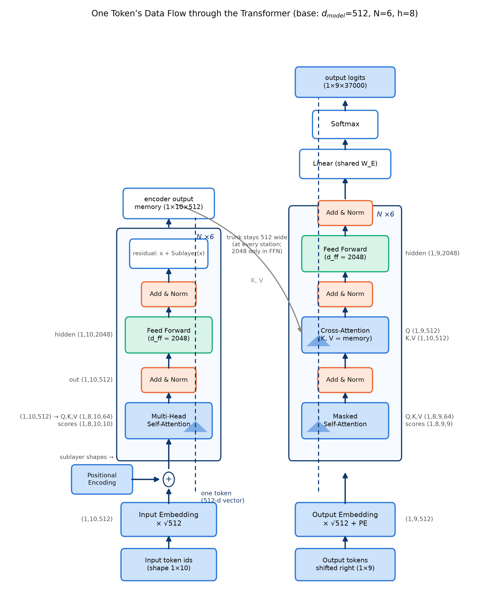

# 第 6 章 FFN、残差与 post-LN：一条 token 的数据流

## 6.0 开篇：从全书到这里

零件铺的柜台到第 5 章已经摆出大半：缩放点积注意力（第 2 章式 (2.1)）管跨位置取料，多头机制（第 3 章）把取料分成八路并行，三种角色（第 4 章）把取料安排进双塔，正弦位置编码（第 5 章）给每个位置挂上门牌、在两栈底部各注入一次。但回看第 4 章那张双塔数据流清单（表 4.3），有一站我们当时有意绕开：第 6 站只写着「Add & Norm → FFN——第 6 章」，一跃而过。在整机上先把位置钉死：整机粗图见导览 0.3 节；本章的零件装在第 4 章图 4.1 双塔的每一层——每层注意力的正下游一间「Feed Forward」车间、每个子层出口一枚「Add & Norm」芯片，表 4.3 的第 6 站在此展开。留着的正是最后一批零件，也是本章要回答的三个问题：**其一，注意力把别的位置的信息取回来了，这些货在每个位置内部由谁加工？其二，六层双塔、三十个子层堆起来，信息凭什么走完全程不散架、尺度不失准？其三，零件齐了之后，你怎么一眼鉴别一份实现抄的是不是 2017 年的原版结构？**

本章补齐注意力之外的三件零件——逐位置前馈网络（唯一的「纵向加工」部件）、残差连接（深度的许可证）、LayerNorm（尺度的守门人）——并第一次把全书零件串成一条 token 从词元 id 到 logits 的完整旅程。产出两件：一张全书中轴图（图 6.1），此后任何一层的讨论都回到这张图上定位；一份「一眼鉴别清单」，帮你省掉未来无数次照抄错版本的坑。

本章结束，「零件铺」（第 2-6 章）就打烊了，下一章上装配线：组装整机、把 mask 的语义与陷阱一次讲透、与官方实现逐项对拍、把 65M 参数一个一个数出来。不过合上本章之前，开篇第三问的答案必须先交出来——它就是 6.5 节那句保真度警告：流行教程里最著名的那份实现，第一行就与论文不同。

> **最小背景栏**
> - **残差学习（residual learning）**：He 等（arXiv:1512.03385，CVPR 2016）提出，与其让堆叠层去拟合目标 $H(x)$，不如让它们拟合残差 $F(x)=H(x)-x$，于是前向变为 $y=F(x,\{W_i\})+x$——恒等捷径让深层网络的梯度可以直通浅层，ImageNet 上 152 层可训并夺 ILSVRC 2015 冠军。Transformer 论文将其引作参考文献 [11]。
> - **层归一化（layer normalization，LN）**：Ba 等（arXiv:1607.06450）把 batch normalization「转置」：统计量不在 batch 维、而在**单个样本的一层全部维度**上计算，训练与推理行为一致，天然适配变长序列。Transformer 论文将其引作参考文献 [1]。公式见本章式 (6.3)。
> - 已有知识：注意力与 $\sqrt{d_k}$（第 2 章式 (2.1)）、多头拆装（第 3 章）、双塔三种注意力角色（第 4 章）、正弦位置编码（第 5 章 5.2 节）。

## 6.1 逐位置前馈网络：注意力的另一半

先答开篇第一问：取回来的货，由谁加工。答案不看公式也能讲清——先看画面。

把一层的处理想成一条传送带，每个位置是一格。注意力子层是**取货窗口**：第 $i$ 格伸手到全句每一格抓料，按相关度配比混进自己（第 2-4 章的全部内容）。FFN 则是**加工车间**：传送带的每一格独立驶入同一间车间，车间里只有三道工序——先把 512 维的箱子整个倒出来、摊在 2048 维的大工作台上（升维）；逐项过一道是非闸门，不达标的直接归零（ReLU 裁一刀）；再把留下的装回 512 维的箱子送走（降维）。原论文 §3.3 把这个部件命名为逐位置前馈网络（position-wise feed-forward networks），并对「逐位置」给出明确表述：**对每个位置独立且相同地施加**（applied to each position separately and identically）——每格进同一间车间、用同一套工具，且加工时互不看一眼。所以注意力子层是序列内横向的算子，FFN 是每个位置纵向的算子；**一个 Transformer 层 = 一次横向混合 + 一次纵向加工**，这间车间就装在每层注意力的正下游。

**为什么先摊开到四倍宽**。4:1 的扩展率有一个值得带走的直觉：**在高维空间里做更细的判断**。512 维里一个维度往往身兼数职——同一个数既参与「这个词是名词吗」又参与「它跟前文搭不搭」；各种判断挤在同一组维度上，就切不干净。摊到 2048 维，每种判断可以有自己的专属方向，ReLU 再沿这些方向各开一刀。一团揉皱的线在火柴盒里解不开，摊到桌面上就能一根根分拣——「先升维、再线性切」是机器学习里常用的老套路，FFN 是它的朴素版本：升维是给判断腾地方。你可能会问：那为什么不干脆把主干造宽点、直接用 2048？——不行，账在 6.2 节：残差相加要求同形状，主干宽度被 $d_{model}=512$ 钉死，车间只能在自己屋里「鼓包」。

**形式化**。原论文式 (2)——本书编号为式 (6.1)：

$$
\mathrm{FFN}(x)=\max(0,\;xW_1+b_1)\,W_2+b_2
\tag{6.1}
$$

| 符号 | 含义 | 张量形状（base） |
|---|---|---|
| $x$ | 单个位置的表示向量 | $\mathbb{R}^{d_{model}}$（512） |
| $W_1,\,b_1$ | 升维线性变换 | $\mathbb{R}^{512\times 2048}$、$\mathbb{R}^{2048}$ |
| $W_2,\,b_2$ | 降维线性变换 | $\mathbb{R}^{2048\times 512}$、$\mathbb{R}^{512}$ |
| $\max(0,\cdot)$ | ReLU 非线性（逐元素） | $\mathbb{R}^{2048}\to\mathbb{R}^{2048}$，形状不变 |

用人话说：每个位置各自关进同一间车间——箱子摊开到 2048 维的大工作台，逐项过一道是非闸门（ReLU），留下的装回 512 维送走；全程不看别的位置一眼。

输入输出都是 $d_{model}=512$，中间层扩到 $d_{ff}=2048$——**4:1 的扩展率**是原论文的事实比率（big 模型 4096/1024 同为 4:1）【证据等级：官方论文 v7 §3.3、Table 3】。原文还给了等价描述：「这可以看作两个 kernel size 为 1 的卷积」（two convolutions with kernel size 1）【证据等级：官方论文 v7 §3.3 原文】——卷积核宽 1 意味着没有跨位置交互，与「逐位置」的表述互为表里。写成整句张量，这一站是 $(b,s,512)\xrightarrow{\,W_1+b_1\,}(b,s,2048)\xrightarrow{\;\mathrm{ReLU}\;}(b,s,2048)\xrightarrow{\,W_2+b_2\,}(b,s,512)$——`nn.Linear` 只作用于最后一维，batch 与句长两个维度原样穿过，这正是「逐位置」的张量面目。

> **【考据框】** $d_{ff}=2048$ 这个数字有自己的版本故事：v1 的 Table 3 曾把它误印为 1024，与正文矛盾，v2 起修正为 2048【证据等级：官方论文·多版本比对】。引用这个数字请锚定 v7——「连原论文自己都在版本间改数字」是全书引用纪律的活例之一，版本时间线总账在第 11 章。（服务好奇者，跳过不影响主线。）

**账本一：这个部件多大（参数占比）**。用公式直接数参数：一个注意力子层（$W^Q,W^K,W^V,W^O$ 四个 $512\times 512$ 矩阵加偏置）是 $4d^2+4d=1{,}050{,}624$；一个 FFN 子层是 $2d\cdot d_{ff}+d+d_{ff}=2{,}099{,}712$——**单个 FFN 子层的参数约是注意力子层的两倍**。把整台 base 模型数完（编码器层×6、解码器层×6、三处共享的词嵌入，词表取论文 §5.1 的 37000），得到表 6.1【证据等级：本书复算（公式，2026-10）；脚本见本章动手验证节】。

| 部件 | 参数量公式 | base 实算 | 家族占比 |
|---|---|---|---|
| 注意力子层（$W^Q,W^K,W^V,W^O$+偏置） | $4d^2+4d$ | 1,050,624 | 家族合计 30.0% |
| FFN 子层（$W_1,b_1,W_2,b_2$） | $2d\,d_{ff}+d+d_{ff}$ | 2,099,712 | 家族合计 **39.9%** |
| LayerNorm（$\gamma+\beta$） | $2d$ | 1,024 | 家族合计 0.049% |
| 编码器层小计（1 注意力+1 FFN+2 LN） | — | 3,152,384 ×6 = 18,914,304 | — |
| 解码器层小计（2 注意力+1 FFN+3 LN） | — | 4,204,032 ×6 = 25,224,192 | — |
| 词嵌入（三处共享，§3.4） | $V\cdot d$ | 18,944,000 | 30.0% |
| **复算合计** | — | **63,082,496 ≈ 63.1M** | — |
| Table 3 官方总数 | — | 65M | 差 1.9M（≈3%） |

表 6.1 各部件参数占比（自排，公式复算；65M 锚定 v7 Table 3）

这里必须诚实处理一个差额：复算合计 63.1M，Table 3 报 65M，差约 1.9M（3%）。论文没有给出参数量构成明细，37k 词表本身是「约数」口径（词表每增加 1000，参数增加 51 万），此外是否计入某些偏置、softmax 层口径等都是可能的差异来源。本书按「构成预估」处理：**各家族的相对占比（FFN 39.9% > 注意力 30.0% ≈ 嵌入 30.0% ≫ LN 0.049%）是可信的，绝对总数以 Table 3 的 65M 为准**。这个结论值得记住：最不出风头的 FFN，是 base 模型里参数最多的部件家族；LN 几乎不占参数，却是 6.5 节一切争论的源头。

**账本二：它算得多吗（计算量）**。参数多不等于算得慢——还得看乘加次数。逐层数：FFN 每位置两次矩阵乘，共 $2\,d\,d_{ff}=8d^2$ 次乘加；注意力每位置四组投影 $4d^2$ 次乘加，外加对全句的 scores 与加权求和 $2nd$ 次（$n$ 为句长）。于是每层的乘加比为

$$
\frac{\text{FFN}}{\text{注意力}}=\frac{8nd^{2}}{4nd^{2}+2n^{2}d}=\frac{4d}{2d+n}
$$

用人话说：每层的计算量里 FFN 与注意力谁多谁少，只由「句长 $n$ 相对宽度 $d$ 有多长」决定——句越短，FFN 越接近注意力的两倍。

在论文的句长口径下（几十个词，$n\ll d$）FFN 稳稳是每层计算量的两倍左右——本书按 $n=10$ 复算：每层 FFN 约 2097 万次乘加、注意力约 1059 万次，比值 1.98【证据等级：本书复算（公式，2026-10）】。这个比值随句长缩小，$n=2d=1024$ 时两者打平、之后注意力反超——与论文 §4 Table 1「$n<d$ 时自注意力更便宜」的论证同一语境：**2017 年的翻译句长下，这台机器每层算力的一半以上花在 FFN 上**——它是参数与计算的双重大户，也是后世动手术最积极的部件（去哪两刀，见下一段末的地址）。

**前史的另一条路（对照）**。FFN 这个「位置内部的门」并非只有 ReLU 一种开法。同期直接对手 ConvS2S 在相同位置上用的是门控线性单元（gated linear unit，GLU，公式见第 1 章 1.5）：用 $\sigma(B)$ 门控 $A$ 的通过量【证据等级：官方论文 1705.03122 §3.2】。门控与残差是这一对部件的两种对照解法——门控是「乘性调制」，靠分支相乘压住幅度；残差是「加性旁路」，靠恒等相加让梯度直通。2016-2017 年这两条路线平行竞速，Transformer 选择了「残差 + 缩放点积」而不是门控。FFN 后续还会挨两刀——先换激活、再连整体结构一起换，门控思想在 GLU 里已经冒头——账记在 Book3 与 Book4，此处只留一个地址，不展开机制。

实现只有一行（完整文件见 [`code/ch06/blocks.py`](code/ch06/blocks.py) 的 `PositionwiseFFN`）：

```python
# [`code/ch06/blocks.py`](code/ch06/blocks.py) 节选
class PositionwiseFFN(nn.Module):
    """式 (6.1)：(b,s,d_model) -> (b,s,d_ff) -> (b,s,d_model)，逐位置独立。"""
    def __init__(self, d_model=D_MODEL, d_ff=D_FF):
        super().__init__()
        self.w1 = nn.Linear(d_model, d_ff)   # 升维 W1：512 → 2048（4:1 扩展率）
        self.w2 = nn.Linear(d_ff, d_model)   # 降维 W2：2048 → 512
    def forward(self, x):                    # x: (b, s, d_model)；Linear 只作用于最后一维＝逐位置独立
        return self.w2(F.relu(self.w1(x)))   # (b,s,512) -> (b,s,2048) -> (b,s,512)
```

注意 `nn.Linear` 只作用于张量最后一维——这正是「逐位置独立、全位置共享参数」的算子语义；而「层与层之间参数不共享」由每个层各持有一个 `PositionwiseFFN` 实例保证。

## 6.2 残差连接：深度的许可证

车间造好了，但把它装进流水线之前，开篇第二问先冒出来：六层双塔、三十个子层堆起来，凭什么训得动？答案的画面是一条河。

把整台机器的主干想成**一条恒定宽度 512 的河**：从嵌入层发源，流向 logits。每个子层是一条**支流的入河口**——支流不产出新河水，只往主干里掺一份**修正量**，掺多少由学习决定；掺零，这条支流就等于没开工。这就是残差连接（residual connection）：主河道是那条永远在流的恒等通路，支流是子层学到的增量修正。这个画面给出深度的安全边际：**哪怕某个子层学坏到输出近零，河照流**——信息跳过它，顺主干直达下游。堆三十个子层，最坏情况是一批支流白建，主干不断流。深，因此变得可训。

这个画面不是事后美化，是踩过坑之后的发明。「训不动」在视觉侧被记录得更早也更清楚：He 等发现 56 层的普通卷积网训练误差反而高于 20 层版——不是过拟合（训练误差也更高），是深层普通结构**退化**（degradation），加层连「学成恒等映射」都做不到【证据等级：官方论文 1512.03385 §1、Fig.1】。残差学习正是对这个现象的回答：既然深的难点是拟合恒等，那就把恒等显式写进结构（式 (6.2) 的 $+x$），让堆叠层只需学增量修正——「学增量」比「学全量」容易，「跳过」比「学成恒等映射」容易。NMT 侧的同型经验来自 GNMT（arXiv:1609.08144），写得非常具体【证据等级：官方论文 1609.08144 §3.1，经验性陈述】：

> 「在大规模翻译任务中，简单堆叠的 LSTM 层最多 4 层工作良好（work well up to 4 layers），6 层勉强（barely with 6 layers），超过 8 层非常差（and very poorly beyond 8 layers）。」——GNMT §3.1

而 GNMT 自己的解法就是残差连接，并且给出了机制表述：「残差连接显著改善了反向传播中的梯度流动，使我们能训练非常深的编码器与解码器网络」（原文直译）。加上残差后，8 层编码器 + 8 层解码器可训，且「更深更好」【证据等级：官方论文 1609.08144 §3.1、Figure 1 题注（残差自第 3 层起）】。重排如表 6.2。

| 配置 | 深度 | 可训性（§3.1 措辞） |
|---|---|---|
| 无残差，堆叠 LSTM | ≤ 4 层 | 训练良好（work well） |
| 无残差，堆叠 LSTM | 6 层 | 勉强（barely） |
| 无残差，堆叠 LSTM | ≥ 8 层 | 非常差（very poorly） |
| 残差连接（自第 3 层起） | 8 + 8 层 | 可训，更深更好 |

表 6.2 GNMT 残差消融重排（引 Wu et al. 2016 §3.1；注意这是经验性陈述，不是 BLEU 消融表）

**机制（形式化）**。He 等（arXiv:1512.03385）的残差学习把前向写成式 (6.2)：

$$
y = F(x,\{W_i\}) + x
\tag{6.2}
$$

用人话说：子层不直接决定「这一站的河水变成什么样」，只往主干里掺一份「这一站要修正多少」；加法保证原来的河水一定在场，一滴不少。

对输入求导得 $\partial y/\partial x = \partial F/\partial x + 1$——那个「+1」是恒等项，让梯度不经任何变换直通浅层，深层网络的梯度消失问题被结构性缓解【据 He et al. 1512.03385 §2 的论证展开】。GNMT 的「梯度流动改善」说的就是这件事。

Transformer 把残差用得比 GNMT 更彻底：**每一个子层**（编码器层 2 个、解码器层 3 个）都各自包裹一条残差捷径，而非 GNMT 的「自第 3 层起、层间连接」【证据等级：官方论文 v7 §3.1】。原文还给出了一个容易被忽略的工程动机：**为方便这些残差连接，模型中所有子层与嵌入层都输出 $d_{model}=512$ 维**。这就是为什么式 (6.1) 的 FFN 必须 2048→512 降回原维度、多头注意力的 $W^O$ 必须把 512 拼回 512（第 3 章）——不是巧合，是残差连接的硬约束：**相加的两个张量必须同形状**——落到张量上，$x+\mathrm{Sublayer}(x)$ 就是 $(b,s,512)+(b,s,512)\to(b,s,512)$ 的逐元素相加。上一节车间只能「屋里鼓包」、图 6.1 上那条 512 宽的主干，来历都在这里。

本节开头那一问至此有了答案：6 层双塔、共 30 条残差捷径（编码器 6×2 + 解码器 6×3，每子层一条）的 base 模型稳定可训（训练配方的证据在第 8、9 章展开）。残差还带来一个数据流层面的事实：**每层输入形状进、同形状出**——残差捷径保证了一条从嵌入到输出的恒等通路，任何一个子层学坏到输出近零，信息仍可近似「跳过它」直达上层（在 post-LN 结构里，这条捷径的尺度还会被随后的 LN 归一，方向保留、大小重置——精确的恒等只在残差求和那一步成立）。

## 6.3 LayerNorm：把每个位置拉回同一尺度

支流一条条汇入，河是深了，可水位没了准头：这条支流猛、下条细，主干水位的整体幅度逐站漂移——下游每间车间面对的输入尺度忽大忽小。第三件零件管这个。

它的画面一句话：**每经过一站，就把水量校回标准**。全机 30 座计量站，每站出口装一台校准器：把当前这一格的 512 个数调成均值 0、方差 1，再交给两个可学习的旋钮（增益 $\gamma$、偏置 $\beta$）微调，然后放行。校准只看这一格自己——句子长短、batch 大小都影响不到它，这就是「按位置归一化」。

为什么是 layer norm 而不是 batch norm？He 的原始 ResNet 用的是 batch normalization，而 NMT 的 batch 里句子长短不一、还要双向拼接过——Ba 等（arXiv:1607.06450）正是为此把归一化的统计维从 batch 维搬到层内维度。一句话对比：**batch norm 对「同一样本同一特征、跨 batch」归一化，layer norm 对「单样本、单层全部维度」归一化**——后者不依赖 batch 统计，训练/推理行为一致【证据等级：官方论文 1607.06450】。原论文全文未解释为什么选 LN 而不是 BN，这个选择对变长、带填充的序列工程上是显然的（本书注记）。

**形式化**。原论文没有给出 LN 自身的公式（只写了组合结构），LN 的规范出处是 Ba 等，即式 (6.3)：

$$
\mu=\frac{1}{d}\sum_{j=1}^{d}x_j,\qquad
\sigma^2=\frac{1}{d}\sum_{j=1}^{d}(x_j-\mu)^2,\qquad
\mathrm{LN}(x)=\frac{x-\mu}{\sqrt{\sigma^2+\epsilon}}\odot\gamma+\beta
\tag{6.3}
$$

| 符号 | 含义 | 形状 |
|---|---|---|
| $x_j$ | 单个位置表示的第 $j$ 维 | 标量 |
| $\mu,\sigma^2$ | 该位置 512 维上的均值/方差 | 标量 |
| $\epsilon$ | 数值稳定项（论文未给值，PyTorch 默认 $10^{-5}$，属实现自由度） | — |
| $\gamma,\beta$ | 可学习的增益与偏置 | 各 $\mathbb{R}^{512}$ |
| $\odot$ | 逐元素乘 | $\mathbb{R}^{512}\times\mathbb{R}^{512}\to\mathbb{R}^{512}$ |

用人话说：对每个位置自己那 512 个数，就地算一份均值和方差，减一减、除一除，拉回标准刻度再交给 $\gamma,\beta$ 微调——别的位置、别的样本都不掺和。

注意统计量的计算范围是**单个位置向量内部**——这正是「按位置归一化」：句子长一个词、batch 多一句，都不影响任何一个位置的 $\mu,\sigma^2$。落到整句张量上，LN 沿最后一维作用：$(b,s,512)\to(b,s,512)$，形状不变，每个格子各算出一对 $\mu,\sigma^2$（全句共 $(b,s)$ 对）。

手算一个最小例子建立手感（取 $\gamma=1,\beta=0,\epsilon\approx 0$）：设某位置的 4 维表示 $x=(1,2,3,4)$，则 $\mu=2.5$、$\sigma^2=1.25$、$\sigma\approx 1.118$，减均值除标准差得

$$
\mathrm{LN}(x)\approx(-1.342,\;-0.447,\;0.447,\;1.342)
$$

四个数均值严格为 0、方差严格为 1（读者可当场验算）；真实模型里只是把「4 维」换成「512 维」，计算完全同构。

**post-LN：式 (6.4)，本书的主角**。原论文 §3.1 用一句话定义了整个结构，这句话值得逐字读【证据等级：官方论文 v7 §3.1 原文直引】：

> 「我们在两个子层各采用一条残差连接，随后进行层归一化。也就是说，**每个子层的输出是 LayerNorm(x + Sublayer(x))**。」（"We employ a residual connection around each of the two sub-layers, followed by layer normalization. That is, the output of each sub-layer is LayerNorm(x + Sublayer(x))…"）

$$
\mathrm{Output}=\mathrm{LayerNorm}\bigl(x+\mathrm{Sublayer}(x)\bigr)
\tag{6.4}
$$

用人话说：先掺支流、再校准——子层输出加进主干之后，出口立刻被拉回零均值、单位方差；三十站站站如此，主干的尺度永不漂移。形状上，这一站是 $(b,s,512)+(b,s,512)\xrightarrow{\text{相加}}(b,s,512)\xrightarrow{\text{LN}}(b,s,512)$——相加与归一化都不改形状，LN 改的是每一格的刻度。

LN 压在**残差求和之后**——这种摆位后来被命名为「post-LN」。要紧的提醒：**「post-LN」这个名字是后世起的**（原论文只写公式、没起名）；与它相对的另一种摆位为什么重要、牵出什么公案，留到 6.5 节集中澄清。此外论文 §5.4 规定了 dropout 的位置：施加在**子层输出上、加残差并归一化之前**——即 $\mathrm{LN}(x+\mathrm{Dropout}(\mathrm{Sublayer}(x)))$【证据等级：官方论文 v7 §5.4 原文】。

把式 (6.4) 连同 dropout 位置翻译成代码（`PostLNSublayer`：残差、post-LN、dropout 三者的顺序一图定案）：

```python
# [`code/ch06/blocks.py`](code/ch06/blocks.py) 节选
class PostLNSublayer(nn.Module):
    """式 (6.4)：§5.4 的 dropout 施加在子层输出上、加残差并归一化之前。
    输入 x: (b,s,d_model)；sublayer: (b,s,d_model)->(b,s,d_model)；输出: (b,s,d_model)。"""
    def __init__(self, d_model=D_MODEL, p_drop=0.0):
        super().__init__()
        self.norm = nn.LayerNorm(d_model)    # Ba et al. 式 (6.3)，γ/β 可学习；逐位置作用，形状不变
        self.dropout = nn.Dropout(p_drop)
    def forward(self, x, sublayer):
        return self.norm(x + self.dropout(sublayer(x)))  # (b,s,512)+(b,s,512) -> (b,s,512)，式 (6.4)
```

本书实测（固定种子，CPU）：随机输入过一层完整编码器层（两个子层）后，各位置输出的均值绝对值最大为 $2.24\times 10^{-8}$、标准差落在 $[1.0000, 1.0000]$【证据等级：本书实验（CPU，2026-10）】——式 (6.3) 的「拉回零均值、单位方差」在数值上眼见为实。这同时解释了 post-LN 数据流的另一个性质：**每个子层的输出尺度是被 LN 钉死的**，下一层总能在确定的尺度上工作，残差累加带来的漂移在每次求和后被立即清算。代价是什么，6.5 节与章末欠账给出线索。

这台校准器放回整机图景：它就是图 6.1 上的 30 枚「Add & Norm」芯片——参数只占全模型的 0.049%（表 6.1），却站在每一站的出口。

> **【实现对照框】**（非原论文内容）PyTorch 官方 `nn.TransformerEncoderLayer`（torch 2.13.0，`torch/nn/modules/transformer.py`）默认 `norm_first=False`，即按式 (6.4) 的 post-LN 摆位实现；本书按全书对拍规范（eval 模式 + 固定种子 + 锁 SDPA 的 MATH 后端）做了两级对拍：①手排官方子块 `norm1(x + self._sa_block(x))` → `norm2(y + self._ff_block(y))` 与整层前向 `el(x)`，`allclose=True`（atol=1e-6）；②本书手写 `EncoderLayerPostLN` 权重搬运进官方层后同输入前向，`allclose=True`（atol=1e-5）【证据等级：本书实验（CPU，2026-10）+ torch 2.13.0 源码】。已知一处数据流差异：官方 FFN 在 ReLU 之后、$W_2$ 之前多插了一个 dropout（论文 FFN 内部无此项），影响与处理留第 7 章对照表；另有后世参数 `norm_first` 可切换归一化摆位，其含义见 6.5 的澄清——本册正文实现一律不使用。

## 6.4 一条 token 的完整数据流

三件零件集齐，兑现开篇的承诺：把它们串成一条完整的河。视角回到第 4 章那条双塔传送带——base 模型、源句 10 个词元、目标句 9 个词元、batch=1。图 6.1 是全书的中轴图——此后任何一层的讨论，都可以回到这张图上定位。

**入口：嵌入与位置编码**。词元 id $(1,10)$ 查表得 embedding $(1,10,512)$；论文 §3.4 规定嵌入层要**乘 $\sqrt{d_{model}}$**（"we multiply those weights by $\sqrt{d_{model}}$"【证据等级：官方论文 v7 §3.4 原文】）。原论文没有解释为什么——这一步值得停下来讲透，因为它在河的源头，定下的是两种信号的配比。

入口要做一次加法：词的身份信号（查表所得）与位置信号（PE）。相加之前，必须先回答**配比**问题：谁主谁次？设想不做任何缩放：查表所得每维 std≈1，PE 每维幅值不超过 1——两个信号真的同量级，位置要占到近三分之一的能量，「这个词在哪」会搅掉「这个词是谁」的一大块地盘。论文 §3.4 的做法是乘 $\sqrt{512}\approx 22.6$。本书实测给出可供你自行判断的数字：嵌入初始 std≈1.0，乘 $\sqrt{512}$ 后 std=22.62，而正弦 PE 每维幅值不超过 1【证据等级：本书实验（CPU，2026-10）；解释口径属后世分析，非原论文】——乘过之后两者并非同量级，更贴合数字的读法是：**词义信号主导、位置信号作 2%-4% 量级的调制**。所以「让嵌入与 PE 同量级」这句流传很广的解释，问对了问题（入口加法的本质确实是两个信号的量级关系），但按字面对不上数字：按 $N(0,1)$ 初始化，不乘就已经同量级，乘完反而差出一个数量级。真正被这一步定下的是**相对配比**——至于绝对大小，下游第一枚 LN 芯片马上会把它清算回标准刻度（6.3 实测的 std=1.0000），绝对尺度留不住，相对配比才是这个乘法留下的东西（本书注记）。随后加正弦 PE（第 5 章 5.2 节），形状不变。

**编码器：六层，每层两个子层**。第 1 层内部：$Q,K,V$ 投影 $(1,10,512)$，按头 reshape 成 $(1,8,10,64)$，注意力 scores $(1,8,10,10)$——8 个头各一张 $10\times 10$ 的全句可见矩阵（因果掩码只存在于解码器侧，第 4 章）；softmax 按行归一后对 $V$ 加权求和得 ctx $(1,8,10,64)$，拼回头维、经 $W^O$ 回到 $(1,10,512)$，加残差、post-LN，形状不变。FFN 子层把它逐位置升到 $(1,10,2048)$ 再降回 $(1,10,512)$，再一次残差 + post-LN。六层之后得到编码器输出——习惯称 **memory**，$(1,10,512)$：**每层进出形状不变，这是 6.2 节残差的维度约束的直接体现**。

**解码器：六层，每层三个子层**。目标句（右移一位，第 4 章）同样「查表 ×√512 + PE」得 $(1,9,512)$；每层依次是掩码自注意力（scores $(1,8,9,9)$，因果下三角）、以 memory 为 $K,V$ 的交叉注意力（$Q$ 为 $(1,9,512)$、$K,V$ 为 $(1,10,512)$——查询来自解码器、键值来自编码器，第 4 章三种角色的第三种）、FFN（隐藏层 $(1,9,2048)$）。

**出口：共享的线性与 softmax**。解码器输出 $(1,9,512)$ 右乘**转置的词嵌入矩阵**得 logits $(1,9,37000)$，softmax 后即下一词元概率分布——论文 §3.4 的三处权重共享（输入嵌入、输出嵌入、pre-softmax 线性共用一个矩阵；原文以「similar to [30]」的口径引了先例——[30] 即 Press & Wolf《Using the Output Embedding to Improve Language Models》的输入/输出嵌入绑定，v7 著录其 arXiv:1608.05859 预印本、正式发表于 EACL 2017，对应关系第 7 章核账）【证据等级：官方论文 v7 §3.4】。全形状表见表 6.3。

| 站点 | 张量形状 | 说明 |
|---|---|---|
| src 词元 id | (1, 10) | 整数索引 |
| 查表 embedding | (1, 10, 512) | std≈1.0（初始） |
| × √512 | (1, 10, 512) | std=22.62（实测） |
| + 正弦 PE | (1, 10, 512) | PE 幅值 ≤1（← 第 5 章的零件在此装机） |
| 编码器第 1 层 Q/K/V（拼接前） | (1, 10, 512) | $W^Q W^K W^V$ 打包投影 |
| 按头 reshape | (1, 8, 10, 64) | $h=8$，$d_k=64$ |
| 注意力打分矩阵（代码名 scores） | (1, 8, 10, 10) | 双向可见 |
| softmax 加权求和（代码名 ctx） | (1, 8, 10, 64) | 每行权重对全句 $V$ 加权平均 |
| 拼回头维 + $W^O$ 投影 | (1, 10, 512) | 8×64 拼回 512（第 3 章），子层出口 |
| 残差相加 + post-LN（Add & Norm） | (1, 10, 512) | 式 (6.4)，层内第 1 枚 |
| FFN 升维 $xW_1+b_1$（隐藏层） | (1, 10, 2048) | 4:1 扩展；ReLU 逐元素裁剪、形状不变 |
| FFN 降维 $\cdot\,W_2+b_2$ | (1, 10, 512) | 收回主干宽度 |
| 残差相加 + post-LN（Add & Norm） | (1, 10, 512) | 式 (6.4)，层内第 2 枚，第 1 层完成 |
| 编码器输出 memory | (1, 10, 512) | 六层后（栈顶） |
| tgt embedding ×√512 + PE | (1, 9, 512) | 右移一位 |
| 解码器输出 | (1, 9, 512) | 每层三子层后（栈顶）；层内各站同编码器侧、句长换 9——交叉注意力 $Q$ 为 $(1,9,512)$、$K,V$ 为 $(1,10,512)$，scores $(1,8,9,10)$ |
| logits（共享 pre-softmax 线性） | (1, 9, 37000) | 右乘 $E^{\top}$ |

表 6.3 一条 token 的全形状表（自产，本书实验：`blocks.py` 的 `main()` 实验四生成；base 配置，src=10、tgt=9）



图 6.1 一条 token 的数据流全景（自绘重制，改绘自 Vaswani et al. 2017 Fig.1，并叠加本书实测形状标注与「单 token 通路」虚线：注意力子层处的三角扇出表示该位置在此处可见全句，FFN 处收回逐位置独立；两塔之间的小注标出河宽不变量——主干每站末维恒为 512，2048 只在 FFN 车间内鼓包）

看图的三个要点。其一，**虚线是「一条 token」的通路**：它在 FFN 处始终是一根 512 维的纵向线（逐位置独立），在每个注意力子层处扇出成对全句的可见（三角标记）——「混合」与「加工」的分工在图上一目了然。其二，**橙色的 Add & Norm 芯片共 30 枚**（编码器 6×2 + 解码器 6×3），每枚执行一次式 (6.4)。其三，memory 从编码器塔顶横向供给解码器每层的交叉注意力（灰色 $K,V$ 箭头）——双塔之间唯一的信息通道。

把形状表读薄，可以提炼成三个**数据流不变量**，它们比具体数字更值得记住。**不变量一（宽度恒定）**：除 logits 外，主干上每个站点的最后一维都是 512——残差连接的维度约束（6.2 节）决定了整条主干等宽，2048 只在 FFN 车间内部「鼓包」后立刻收回；用本章的河来说，**河宽从头到尾不变，车间只能屋里鼓包**（图 6.1 两塔之间的小注即此不变量）。**不变量二（scores 的行列语义）**：任何注意力 scores 矩阵都是「行数=查询句长、列数=键值句长」——编码器自注意 $10\times 10$、解码器自注意 $9\times 9$、cross $9\times 10$，因果掩码只是把下三角以外的格子置 $-\infty$（第 4 章）。**不变量三（逐位置算子不碰形状）**：LN、FFN、ReLU、dropout 都只作用于最后一维，形状永不改变——debugging 时若形状错了，嫌疑犯只在注意力（reshape/transpose）与嵌入查表（词表维度）两处。至此，读者应能在白纸上默画这张图并给每个站点标出形状；参数量则按表 6.1 数出——「能默画完整数据流、能数出 65M 构成」是本章的验收线，整机 mask 细节与权重共享账本在第 7 章收口。

## 6.5 保真度澄清：你抄到的第一版实现是 pre-norm

主线走完，交开篇第三问的答案。这是本书与流行教程最重要的一个分岔点，请务必读完。

流行教程中最著名的 The Annotated Transformer（Harvard NLP）在讲解论文 §3.1 时，页面上白纸黑字引着原论文的句子「每个子层的输出是 $\mathrm{LayerNorm}(x+\mathrm{Sublayer}(x))$」，紧接着给出的实现代码却是：

```python
# The Annotated Transformer 的 SublayerConnection（第三方源码直读，2026-10-02 核对）
def forward(self, x, sublayer):
    "Apply residual connection to any sublayer with the same size."
    return x + self.dropout(sublayer(self.norm(x)))   # ← norm 在子层之前
```

`self.norm(x)` 在**子层内部**先做归一化，残差加法在外面兜底——顺序与式 (6.4) 恰好相反。这种「LN 放进残差分支内」的摆位叫 **pre-norm（pre-LN）**。

三点结论。**第一，两者不是同一模型的两种写法**：post-LN 与 pre-norm 的计算图不同，前向数值不等价，训练动力学也不同——不是记号之争，是两个结构。**第二，这是一个系统性偏移**：以 Annotated 为源头的复现与教程在社区广泛流传，相当一部分「Transformer 实现」教学实际教的是 pre-norm；照抄它学「2017 原架构」，第一行就抄错了行。**第三，教程的选择有其道理**——pre-norm 的梯度性质对训练更友好（这正是它可以「为代码简洁」顺手换掉 post-LN 的底气），但这个道理属于后世：post-LN 为什么难训、为什么原论文的配方必须配 warmup，其规范分析是 Xiong 等的《On Layer Normalization in the Transformer Architecture》（arXiv:2002.04745，ICML 2020）——**后世分析，非原论文内容**【证据等级：官方论文 2002.04745】。本书不在本章展开其结论，只把它作为欠账挂起（见章末）。

配套的还有第二处偏离：Annotated 在编码器、解码器**栈的末尾各补了一个 LayerNorm**——而原论文的两座 $N\times$ 塔出口直接输出，并无此项；PyTorch 的 `nn.Transformer` 同样带栈顶 LN，属实现族谱的又一差异（第 7 章对照表统一盘点）。两处偏离的源码级考证收在下框，主线记住结论即可。

> **【考据框】** 两段考证，服务好奇者，跳过不影响主线。① Annotated 的作者自己知道偏离：源码注释写明「**Note for code simplicity the norm is first as opposed to last**」（为代码简洁起见，norm 在前而非在后）【证据等级：第三方源码直读（nlp.seas.harvard.edu/annotated-transformer，2026-10-02）】。② 栈顶 LN 的论文侧核对：原论文 Fig 1（v7 第 3 页）的两座 $N\times$ 塔出口直接输出，**没有**栈顶 LayerNorm，正文也无此记载【证据等级：官方论文 v7 Fig 1 本书直读核对（2026-10-02，对缓存 PDF 逐页比对）】。

本册的立场由零魔改纪律直接给出：全书实现忠于式 (6.4) 的 post-LN——包括第 7 章整机与第 9 章的训练实验；PyTorch 官方层的 `norm_first=False` 默认恰好同此摆位（见 6.3 实现对照框）。给读者留一份**一眼鉴别清单**，读任何 Transformer 实现时先看两处：①子层出口——若代码写成 `norm(x + sublayer(x))`，是论文结构；若写成 `x + sublayer(norm(x))`，归一化已被挪进残差分支（本节所述的 pre-norm）。②栈顶——若 N 层循环结束后又补了一次 LayerNorm，这是论文 Fig 1 里没有的添加。两处都对上，才谈得上「复现 2017」。

## 6.6 本章小结

开篇三问，本章逐一作答。**货谁来加工？**——FFN：每个位置独立进同一间车间，512 摊到 2048 细判再收回（4:1 扩展率；参数家族占比 39.9%、全模型最大，2017 句长下计算量也约是注意力的两倍）。**三十个子层凭什么训得动？**——残差把主干变成恒等通路，子层只掺修正量（GNMT：无残差 8 层训不动；He：$+1$ 恒等项直通梯度），并强加「所有子层输出 512 维」的统一约束；post-LN 每站把尺度钉回零均值单位方差（实测 std=1.0000），代价埋在训练动力学里。**怎么鉴别原版？**——读实现先看 LN 的位置（6.5 节）。一条 token 的完整旅程也就此走通：id → 查表 ×√512 → +PE → 六层「混合 + 加工」→（解码侧再经交叉注意力读 memory）→ 共享线性 → logits，全程形状见表 6.3、全景见图 6.1；参数按表 6.1 数出约 63.1M，对 Table 3 的 65M 留 3% 构成预估口径。

**带走的心智**：如果本章的公式与数字都还回去，只许留下几幅画，那就留下这些。**第一，数据流是一条恒定宽度的河**——从嵌入到 logits，主干永远 512 维宽；注意力与 FFN 都只是汇入的支流，一个横向混合、一个纵向加工，2048 只在车间里鼓包、出门就收回；往后你 debug 任何 Transformer 的形状问题，先沿河检查两处渡口：注意力（reshape/transpose）与查表（词表维度）。**第二，每站校准**——三十枚 Add & Norm 芯片站站把关，支流再猛，出口尺度总被拉回零均值单位方差；宽度不变、尺度不漂，是这条河的两条物理定律。**第三，参数大头在车间**——最不出风头的 FFN 是全模型最大的参数家族（39.9%，对注意力的 30.0%）：这台机器「思考」的大头在逐位置加工，不在跨位置取料。另带一条护身符：读任何实现，先看 LN 在加法里面还是外面——那是在鉴定它属于 2017 年还是后世。

到这里，「零件铺」五站全部走完：注意力运算（第 2 章）→ 多头（第 3 章）→ 三种角色（第 4 章）→ 位置编码（第 5 章）→ 残差与归一化（本章）。造机器的料齐了，但一堆零件还不是机器：组装时 mask 怎么落笔、权重共享的账怎么算、官方实现与论文还差在哪两处，是第 7 章的活；点火要的配方——为什么 post-LN 必须配 warmup，正是本章欠账的病根——第 8 章开。下一章，上装配线。

> **【欠账】** post-LN 的训练不稳：LN 压在残差求和之外，使靠近输出层的参数在初始化时梯度期望偏大、大学习率下训练发散——这是第 8 章 warmup=4000 步「止痛药」的病根（后世分析锚 Xiong et al. 2020，非原论文内容）。把 LN 挪进残差分支内（pre-LN）可以「停药」——这个手术 **Book2 第 4 章**做（原典→GPT-2 差异清单第一项），pre/post 之争的谱系考证在 **Book3 第 2 章**。记住提醒：你跟最著名教程抄到的第一版实现，用的已经是 pre-norm，不是 2017 年论文。→ Book2 第 4 章 / Book3 第 2 章

## 6.7 动手验证

- **入口命令**：
  ```bash
  source env.sh && python "[`code/ch06/blocks.py`](code/ch06/blocks.py)"
  ```
  CPU 秒级完成，五组输出对应本章全部自测数字。
- **预期产出**（固定种子 2017，可逐字复现）：①两级对拍均 `allclose=True`（atol=1e-6 / 1e-5）；②post-LN 输出逐位置 |均值| 最大 2.24e-08、标准差 [1.0000, 1.0000]；③嵌入 std 0.9997 → ×√512 后 22.62；④形状表 17 行（与表 6.3 一致，logits 为 (1, 9, 37000)）；⑤参数账本：编码器层 3,152,384 ×6、解码器层 4,204,032 ×6、嵌入 18,944,000、合计 63,082,496≈63.1M（对 Table 3 的 65M 差 1.9M）。
- **验收点**：能把 `PostLNSublayer.forward` 改成 6.5 节 Annotated 的摆位（`x + self.dropout(sublayer(self.norm(x)))`）并观察对拍 2 由 True 变 False——亲手验证 6.5 节「两种摆位不是同一计算图」；能解释 FFN 参数为何约为注意力子层的两倍；能把表 6.1 的参数公式默写到白板上。
- **图 6.1 复现**：`source env.sh && python "[`code/ch06/make_fig_6_1.py`](code/ch06/make_fig_6_1.py)"`，输出 `figures/fig-6-1-token-dataflow.png`（300 dpi）。
