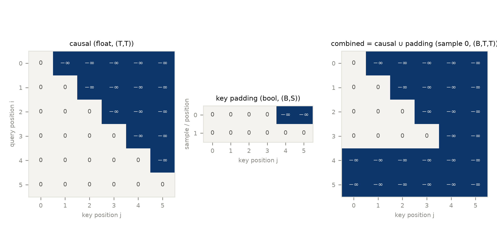
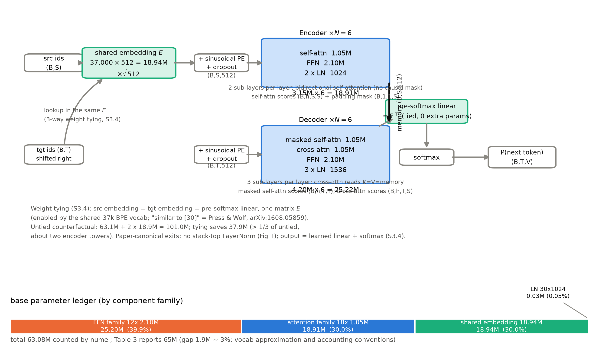

# 第 7 章 整机组装与 mask 全景

## 7.0 开篇：从全书到这里

零件铺在上一章打了烊：柜台上摆着五件零件——缩放点积注意力（第 2 章式 (2.1)）、多头拆装（第 3 章）、三种角色的双塔接线（第 4 章）、正弦位置编码（第 5 章）、FFN 与残差 + post-LN（第 6 章式 (6.1)、(6.4)）。第 6 章末尾我们往账上记了三件活：组装时 mask 怎么落笔、三处权重共享的账怎么算、官方实现与论文还差在哪两处。现在人站在装配线前，料是齐的，图纸却还差最后一张——原论文里真正规定「整机怎么装」的，不是那三大节结构描述，而是 §3.4 里短短一段话。

本章把这张图纸读透、照图装出一台完整的 Transformer，然后做三件事。整机粗图见导览 0.3 节、旅程地图位置见导览 0.4 节；本章装出的实物，就是第 4 章图 4.1 那张双塔——装完后，图上每个箭头都能落到一行代码。先组装（7.1 节）：入口的查表嵌入、出口的共享线性 + softmax、三处权重共享的巧思，全部按 §3.4 的原文口径落进代码——原则是「组件零重写」，第 2-6 章的零件一个螺丝不动。再把 mask 一次讲透（7.2 节）：整机的 forward 从此多出两个掩码参数，第 4 章一直当口头规则用的「谁能看见谁」，这里要落成张量、进公式，连同它的两种形态、三条陷阱与一类未定义行为。最后验收（7.3、7.4 节）：与 PyTorch 官方 `nn.Transformer` 同权重对拍、逐项对照超参，再把 Table 3 报的 65M 参数一个一个数出来。

本章结束时你到达的位置是：手里有一台每个螺丝都亲手拧过的机器，读任何 2017 口径的 Transformer 实现都能逐行对号。但同时会看见一笔新账——这台机器训练时有多并行，推理时就有多串行：每生成一个词元都要把整段前缀重过一遍解码器。这笔账本章先开出数额，偿还的方案记在章末欠账框。机器装好还不能开机，点火要配方——那是第 8 章的事。

> **最小背景栏**
> - 已有知识：第 2-6 章全部组件（本章不再重复推导）；第 6 章 6.5 节的保真度澄清（论文 Fig 1 两塔出口**无栈顶 LayerNorm**——本章 7.3 节要把这条口径变成三档实验）；第 4 章表 4.2 的「谁能看见谁」三列（本章把它工程化）。
> - 本章无新增外部文献背景；涉及的两篇引文（Press & Wolf 的嵌入绑定；ConvS2S 的填充手法）在正文就地给出最小信息。

## 7.1 整机组装：§3.4 定下的入口与出口

装配线第一件事不是拧螺丝，是读图纸。堆完 6+6 层双塔，其实只完成了 §3.1-§3.3 规定的层内结构；整机怎么进、怎么出，答案在 §3.4「Embeddings and Softmax」——总共四句话，值得逐句直读（v7 原文）：

> 「与其它序列转换模型一样，我们使用学习的嵌入把输入与输出词元转换为 $d_{model}$ 维向量。我们也使用通常的学习线性变换（learned linear transformation）与 softmax 函数把解码器输出转换为下一词元的预测概率。在我们的模型中，两个嵌入层与 pre-softmax 线性变换共享同一个权重矩阵，做法类似 [30]。在嵌入层里，我们把那些权重乘以 $\sqrt{d_{model}}$。」【证据等级：官方论文 v7 §3.4 逐句直读】

这段话定下四件事。其一，两侧入口都是查表嵌入，输出维度统一为 $d_{model}=512$——这是第 6 章 6.2 节残差维度约束的延伸：嵌入层也被拉到与主干同宽。其二，出口是「学习线性变换 + softmax」两步——tensor2tensor 与 The Annotated Transformer 习惯把这两步打包成一个模块并起名 generator（生成器），这是后世实现的俗称，论文本身没有这个名字【证据等级：第三方源码直读（tensor2tensor / Annotated Transformer，2026-10 核对）】。其三，三处权重共享。其四，嵌入乘 $\sqrt{d_{model}}$——第四件最轻，第 6 章 6.4 节已给过实测（初始 std≈1 的嵌入乘 $\sqrt{512}$ 后 std=22.62，而正弦 PE 各维幅值不超过 1；「与 PE 尺度匹配」属后世解释），此处不再展开。真正的重头戏是第三件，值得单独拆开。

三个使用者，一张矩阵。编码器查它（src 词元 → 向量），解码器查它（tgt 词元 → 向量），出口的线性变换还要用它的转置（向量 → 词表打分）。共享的意思就是这三份活由**同一个**矩阵 $E\in\mathbb{R}^{V\times d_{model}}$ 承担，于是整机的出口写成式 (7.1)：

$$
\mathrm{logits}=H\,E^{\top},\qquad P(\text{next token})=\mathrm{softmax}(\mathrm{logits})
\tag{7.1}
$$

| 符号 | 含义 | 张量形状（base） |
|---|---|---|
| $H$ | 解码器塔顶输出 | $\mathbb{R}^{B\times T\times 512}$ |
| $E$ | 三处共享的嵌入矩阵 | $\mathbb{R}^{37000\times 512}$ |
| $\mathrm{logits}$ | 下一词元打分 | $\mathbb{R}^{B\times T\times 37000}$ |

用人话说：出口不另造新参数，而是把那张「词 → 向量」的查表表倒过来用——塔顶输出与每个词的嵌入向量做内积，谁与它方向越合，谁得分越高；softmax 把分数变成「下一个词元」的概率分布。一张词典，正向查是编码，反向查是解码。

「做法类似 [30]」的 [30] 是谁、凭什么类似，第 6 章 6.4 节留了账，此处核销：

> **【考据框】** v7 参考文献页直读核对：**[30] = Ofir Press & Lior Wolf, *Using the output embedding to improve language models*, arXiv:1608.05859**【证据等级：官方论文 v7 参考文献页直读（本书核对，2026-10）】。内容一句话：语言模型顶部的输出矩阵本身就是有效的词嵌入，**建议把输入与输出嵌入绑定（tying）**，且使用 BPE 子词时绑定收益更大、模型体积显著缩小（摘要级核对）【证据等级：官方论文 1608.05859（正式发表为 EACL 2017；v7 著录的是 2016 年 arXiv 预印本，二手资料写「Press & Wolf 2017」指会议版）】。这与 Transformer 的用法严丝合缝：§5.1 的 37k 共享 BPE 词表（source-target 同一张表）正是「能共享」的前提，而 Press & Wolf 恰好证明 BPE 场景共享收益最大。三个版本注记：① v1（2017-06-12）初稿的 §3.4 连出处都没标，「similar to [30]」是 v2（06-19）补入的引证；② v2 引入时它的编号是 [29]；v5 新增 [23] Luong et al.（multi-task，插于其前）使其顺移为 v7 的 [30]（同批新增的 Sukhbaatar 加在 [34]、Press & Wolf 之后，不影响编号）——跨版本查编号一律以 v7 的 40 篇为准；③ 排除性事实：直接对手 ConvS2S 的 v2/v3 全文（含附录）没有任何嵌入共享或 softmax 绑定的章节，权重共享的先例不可能是它【证据等级：官方论文 1705.03122 双版直读】。（版本考古，跳过不影响主线。）

图纸读完，动手装配。原则一句话：**组件零重写**——多头注意力直接 `import` 第 3 章的 `MyMultiHeadAttention`，正弦位置编码用第 5 章的 `sinusoidal_pe`（interleave 排布，论文口径），FFN 与残差 + post-LN 包装用第 6 章的 `PositionwiseFFN` 与 `PostLNSublayer`。新写的只有三样：共享嵌入与 $\sqrt{d_{model}}$ 缩放的入口、层栈循环、式 (7.1) 的出口。

```python
# [`code/ch07/transformer.py`](code/ch07/transformer.py) 的 TransformerMT 节选（完整代码以文件为准；跨章 import 见文件头说明）
class TransformerMT(nn.Module):
    def __init__(self, vocab=37000, n_layer=6, d_model=512, h=8, d_ff=2048,
                 p_drop=0.1, stack_top_ln=False, max_pe=5120):
        super().__init__()
        self.d_model = d_model
        self.embed = nn.Embedding(vocab, d_model)               # 三处共享的同一个矩阵（§3.4）
        self.emb_dropout = nn.Dropout(p_drop)                   # §5.4：embedding 与 PE 之和
        self.enc_layers = nn.ModuleList(EncoderLayer(d_model, h, d_ff, p_drop) for _ in range(n_layer))
        self.dec_layers = nn.ModuleList(DecoderLayer(d_model, h, d_ff, p_drop) for _ in range(n_layer))
        self.top_norm_enc = nn.LayerNorm(d_model) if stack_top_ln else None  # 论文默认无栈顶 LN
        self.top_norm_dec = nn.LayerNorm(d_model) if stack_top_ln else None
        pe = sinusoidal_pe(max_pe, d_model, dtype=torch.float32)
        self.register_buffer("pe_table", pe, persistent=False)  # 第 5 章正弦 PE 预生成查表

    def embed_tokens(self, ids):
        """入口（§3.4/§3.5/§5.4）：查表 ×√d_model，加正弦 PE，再过 dropout。ids (B,L) int → (B,L,512)。"""
        x = self.embed(ids) * math.sqrt(self.d_model)           # (B,L) -> (B,L,512)：§3.4 的 ×√d_model
        x = x + self.pe_table[: ids.size(1)]                    # (B,L,512) + (L,512) 逐位置广播，形状不变
        return self.emb_dropout(x)                              # (B,L,512)
```

层栈循环是六个编码器层、六个解码器层的两次 `for`（掩码口径见 7.2 节），出口只有一行：`dec_out @ self.embed.weight.t()`——$(B,T,512)$ 右乘 $(512,37000)$ 得 $(B,T,37000)$，式 (7.1) 的 $E^{\top}$ 逐字符落进代码（三步都在 `TransformerMT` 的 `forward()` 里）。

这段代码里有三个口径要点。第一，`stack_top_ln=False` 是默认：论文 Fig 1 两塔出口直接输出、正文无栈顶 LN 记载（第 6 章 6.5 节已澄清的 canonical 口径），这个开关专为 7.3 节与官方对拍而设。第二，dropout 布点两处：每个子层输出（第 6 章 `PostLNSublayer` 内置）与「embedding 与 PE 之和」（§5.4 原文），后者就是 `embed_tokens` 末尾那行。第三，权重共享在代码里不是三份拷贝，而是**同一个 `nn.Embedding` 实例被用了三次**：正向查表两次（src/tgt）、反向转置乘一次——PyTorch 的参数系统对同一张量只数一份，7.4 节的账本靠它兑现。还有一处与第 4 章的对位要再点一次：解码器的输入是**右移一位**的目标序列（`<bos>` 打头，第 4 章表 4.1 的错位结构），`forward(src, tgt_in)` 返回的 logits 与监督序列 `tgt_out`（去掉 `<bos>`、补 `<eos>`）逐位对齐——整机的输入输出契约，就是 $(B,S)$、$(B,T)$ 两个整数 id 张量，加 $(B,S)$、$(B,T)$ 两张 bool 填充掩码。

整机装配完成，顺手称一次重，看看共享到底值多少钱。以词表 37000 实例化整机、逐张量数参数（`transformer.py` 的 `exp_ledger()`，numel 实数）：不共享的反事实需要三份独立矩阵，合计 $63.1\mathrm{M}+2\times 18.9\mathrm{M}=101.0\mathrm{M}$；共享后 $63.1\mathrm{M}$——**一份 18.9M 的矩阵省了两份，砍掉不共享版的 37.5%（超过三分之一），省下的 37.9M 约等于两座完整的编码器塔（18.9M × 2）**【证据等级：本书实验（CPU，2026-10，numel 实数）】。对 2017 年的 base 而言这不是小钱。Press & Wolf 的动机（省参数 + BPE 下不掉点）在 Transformer 这里被全额继承。

## 7.2 mask 全景：一句话规则书与它的三种贴法

整机的 `forward` 签名里还剩两个参数没讲透：`src_pad` 与 `tgt_pad`，连同解码器内部那张下三角禁区表，合起来是同一件东西——mask。第 4 章我们一直把「谁能看见谁」当口头规则用（表 4.2 的掩码列），装配线上它必须落成张量、进公式。而原论文对它的全部着墨只有两处：§3.2.3 的操作定义——「把 softmax 输入中对应非法连接的值全部置为 $-\infty$」（masking out (setting to $-\infty$) all values in the input of the softmax which correspond to illegal connections）【证据等级：官方论文 v7 §3.2.3】，以及 Fig 2 左图流程里 softmax 之前那个标注「Mask (opt.)」的可选框（第 2 章图 2.1 已按原图标签自绘）。把这句话写成公式，就是所有掩码的统一数学形式，式 (7.2)：

$$
\mathrm{Attention}(Q,K,V;M)=\mathrm{softmax}\!\left(\frac{QK^{\top}}{\sqrt{d_k}}+M\right)V,
\qquad M_{ij}\in\{0,\,-\infty\}
\tag{7.2}
$$

| 符号 | 含义 | 张量形状 |
|---|---|---|
| $M$ | 掩码偏置矩阵：$M_{ij}=-\infty$ 表示第 $i$ 个 query 不许看第 $j$ 个 key | $\mathbb{R}^{L\times S}$（可广播到 $(B,h,L,S)$） |
| $L,S$ | query 序列长 / key 序列长 | 标量 |
| 其余符号 | 同第 2 章式 (2.1) | $Q$：$(B,h,L,d_k)$、$K$：$(B,h,S,d_k)$、$V$：$(B,h,S,d_v)$（整批口径；式 (2.1) 的 $n,m$ 即此处 $L,S$） |

用人话说：掩码是往打分表上叠的一张「禁区条」——格子填 0，照常参与比分配；格子填 $-\infty$，softmax 之后权重精确为 0，出局。「置 $-\infty$」与「禁止注意」因此是同一件事的两种说法。

掩码不是 Transformer 的发明，而是「双塔 + 逐词生成」结构的固有需求，两个来源各自逼出一张禁区表。来源一是**生成方向**：训练用教师强制（第 1 章 1.1 节），整句译文一次前向并行算完——这正是并行化红利的兑现——但生成第 $i$ 个词时，标准答案里第 $i$ 个之后的位置已经「在场」，必须把未来撕掉（第 4 章式 (4.2) 的因果下三角）。来源二是**批处理方向**：一个 batch 里长短句码进同一矩形，短句右端补 padding，这些补丁谁都不许看。顺带一个前史对照：前一年的直接对手 ConvS2S 面对同一个泄漏问题，在卷积解码器里用**不对称填充**（一侧补 $k-1$ 再从末尾去掉 $k$）解决——同一个问题的卷积版解法【证据等级：官方论文 1705.03122 §3.2】。收拢成全景，就是三类掩码（表 7.1、图 7.1）。

| 掩码 | 谁用 | 语义 | 形状（bool 形态） |
|---|---|---|---|
| 因果掩码（causal mask） | 解码器自注意力 | 第 $i$ 位只许看 $j\le i$：挡未来 | $(T,T)$，上三角为 True |
| 填充掩码（padding mask） | 编码器自注意力 / 交叉注意力 / 解码器自注意力 | 句子右端的 padding 位谁都不许看 | $(B,S)$，padding 位为 True |
| 组合掩码 | 训练时解码器自注意力 | 因果 $\cup$ 填充：既挡未来又挡填充 | $(B,1,T,T)$，两者按位或 |

表 7.1 三类掩码全景（自排；语义按 v7 §3.2.3 与 Fig 2 归纳）



图 7.1 掩码三态热图（自产，本书实验）：左=因果掩码（float 形态 $(T,T)$，$0/-\infty$）；中=填充掩码（bool 形态 $(B,S)$，两个样本、长度 4 与 6）；右=样本 0 的组合掩码（逐样本 $(T,T)$，因果 $\cup$ 填充；批量化即表 7.1 的 $(B,1,T,T)$）。深色格=$-\infty$（屏蔽），浅色格=0（可见）。注意右图中查询位 4、5 虽自身是 padding，仍能看见前 4 列——右填充 + 因果的组合不会产生全屏蔽行；左填充或空句才会（见本节末）

组合规则值得单独盯一眼，因为它有两种写法。bool 形态下合并是**按位或**，float 形态下合并是**相加**——两者数学等价，因为 $-\infty+(-\infty)=-\infty$、$0+0=0$，加法合并不产生新值。这不是理论推断（[`code/ch07/masks.py`](code/ch07/masks.py#L82) 的 `exp_combine()`）：把 float 因果与 float 填充手工合并成 $(B\cdot h,T,T)$ 传入 `nn.MultiheadAttention`，与「分开传 `attn_mask` + `key_padding_mask`」让官方内部自行合并相比，输出 `allclose=True`（max|Δ|=0.00e+00）；换成全 bool 分开传亦一致（max|Δ|=1.19e-07）【证据等级：本书实验（CPU，2026-10）】——官方内部的合并动作就是「统一转 float 后相加」，与式 (7.2) 的加法口径吻合。工程小注：分开传时两种掩码 dtype 不一致会触发一条弃用警告（实测复现），行为不受影响，但新代码建议统一成同一形态。

同一张掩码有两种写法：bool（True=屏蔽）与 float（屏蔽位 $-\infty$、其余 0）。在 `nn.MultiheadAttention` 一系（MHA、`nn.Transformer` 各层）里两者等价、True=屏蔽；但在 `F.scaled_dot_product_attention`（SDPA，第 2 章对照面）里 bool 的语义**相反**：True=参与，迁移时必须取反——本书实测 `~bool` 与 float 形态 `allclose=True`【证据等级：本书实验（CPU，2026-10）+ torch 2.13.0 源码 docstring】。更隐蔽的是三维掩码的形状语义：MHA 严格要求 $(B\cdot h,\,L,\,S)$，传 $(B,L,L)$ 或 $(B,h,L,S)$ 都会 RuntimeError；而 SDPA 的 3D 掩码按 $(B,h,L,S)$ 的子维解释——把 MHA 的 $(B\cdot h,L,S)$ 直接喂给 SDPA，会因形状无法广播而报错（`exp_all_masked()` 末段实测复现）。跨 API 搬掩码，形状和极性都要对表。

比语义反转更阴险的，是一个不报错的陷阱。构造 float 掩码的自然写法是 `masked_fill`，但若图省事在 bool 张量上直接 `masked_fill(mask, float("-inf"))`——bool 容器装不下 $-\infty$，它会被**静默替换为 True**；随后这张「bool 伪 float」参与加法时，True 被类型提升为 $1.0$——本应 $-\infty$ 的位置变成了 **+1.0 的加分项**：掩码不但失效，还反过来给禁区加分，全程无任何报错。本书实测（合并偏置 $(B,T,T)$ 里，查询位 4 看 padding 位 3：因果放行、填充应屏蔽）：正确写法在该格是 $-\infty$（屏蔽生效），陷阱写法是 $+1.0$【证据等级：本书实验（CPU，2026-10）】。正确写法是先开一个 float 容器再填：

```python
# [`code/ch07/masks.py`](code/ch07/masks.py) 的 exp_trap() 节选
kpm = padding_mask([3, 5], 5)                                  # (B,L)=(2,5) bool，True=padding
wrong = torch.zeros_like(kpm).masked_fill(kpm, float("-inf"))   # 陷阱写法：zeros_like 继承 bool dtype，(2,5) 仍 bool
right = torch.zeros(kpm.shape, dtype=torch.float32).masked_fill(kpm, float("-inf"))  # (2,5) float：-inf 存得住
```

> **【实现对照框】**（非原论文内容）torch 2.13.0 的两条工程事实，写作期实测。①**`F.generate_square_subsequent_mask` 已被移除**：`hasattr` 检查为 False，只剩 `nn.Transformer.generate_square_subsequent_mask` 静态方法——2018-2022 年间的大量教程代码（`F.generate_square_subsequent_mask(sz)`）在 2.13 上直接 AttributeError。本书自写因果掩码，一行即是论文口径：
> ```python
> def causal_mask(sz):    # §3.2.3：上三角（不含对角线）为 -inf，其余 0；返回 (sz,sz) float
>     return torch.triu(torch.full((sz, sz), float("-inf")), diagonal=1)
> ```
> 与仅存的静态方法对拍 `allclose=True`【证据等级：本书实验 + torch 2.13.0 源码】。②本节五路径实验均为本机 CPU/MPS 的 fp32 实测；CUDA 与 fp16 场景下后世融合注意力内核（机制在 Book6 展开）对全屏蔽行的行为本机无 CUDA 未测，属实现定义，引用以 PyTorch 官方数值精度文档为准。

最后一类行为最扎手：一个 query 在合并掩码后**一个可见位置都没有**（全屏蔽行）。先补一个前置概念——「实现定义行为」（implementation-defined）：softmax 对全 $-\infty$ 行是 $0/0$，数学上未定义；每条实现路径于是自行决定怎么算这个 $0/0$，于是同一份数学可以有多种合法输出。本书在 CPU 与 MPS 双设备实测五条路径（`exp_all_masked()`），结果见表 7.2。

| 路径（同一输入：样本 0 全部 key 被屏蔽） | CPU | MPS |
|---|---|---|
| `softmax` 对全 $-\infty$ 行（数学真相） | NaN | NaN |
| 手写 matmul+softmax（本书实现口径） | NaN | NaN |
| MHA `need_weights=True`（bmm 路径） | NaN | NaN |
| MHA `need_weights=False`（内部走 SDPA） | NaN | 0 向量 |
| 直接 SDPA（4D float 掩码，触发融合核） | 0 向量 | 0 向量 |

表 7.2 全屏蔽注意力行的五路径 × 双设备实测（自产，本书实验；M5 Pro，torch 2.13.0，fp32，2026-10）

同一份式 (7.2)、五条实现路径、三种输出（NaN / 0 向量 / 依路径而定）——「实现定义行为」的准确含义就是这个表。还有更扎手的：同一模型、同一数据、同一掩码，仅输入布局不同——`batch_first=True` 走原生融合路径（CPU 实测 NaN）、`batch_first=False` 走 functional+SDPA（CPU 实测 0 向量）——连张量内存布局都能改变结果【证据等级：本书实验（CPU，2026-10）】。工程结论是防御性的：**保证每个 query 至少一个可见位置**。右填充 + 因果的组合天然满足（图 7.1 右：padding 查询位仍看得见句首），左填充或空句则不然；训练时对 `need_weights=True` 返回的权重矩阵做 NaN 检查是廉价保险。

把三类掩码放回整机图景收个尾：图 4.1 的双塔里，编码器塔内只贴填充掩码（双向可见是它的本性，第 4 章 4.1 节）；解码器自注意力贴组合掩码（因果 $\cup$ 填充）；交叉注意力只贴源侧填充掩码（源句是既成事实，没有未来可挡）。一张规则书，三种贴法——这就是 mask 的全部家当。

三类掩码贴好，整机就到了总检阅的时刻：把一个真实训练 batch 的完整旅程从头到尾走一遍。设 batch 为 64 个句对，批内最长源句 16 个词元、最长目标句 17 个词元（含句末 `<eos>`）——短句右端补 PAD、长短句码进同一矩形，右移后 `tgt_in` 与监督序列 `tgt_out` 都是 17 位。全程形状见表 7.3。与第 6 章表 6.3 的分工正在于此：那张表走的是 batch=1、无填充的单 token 通路（src=10、tgt=9）；这张表是整 batch 旅程，多出的两个维度恰是本节的两个主角——batch 维与 padding 维。

| 步骤 | 运算 | 输入形状 | 输出形状 | 说明 |
|---|---|---|---|---|
| 1 | 源批查表 ×√512 | (64,16) | (64,16,512) | int id 查共享 $E$（§3.4）；16=批内最长源句 |
| 2 | + 正弦 PE、dropout | (64,16,512) | (64,16,512) | PE (16,512) 逐位置广播相加 |
| 3 | 编码器自注意力（×6 层） | (64,16,512) | (64,16,512) | 按头 reshape (64,8,16,64)→scores (64,8,16,16)；贴填充掩码 (64,16)→(64,1,1,16) |
| 4 | 编码器 FFN（×6 层） | (64,16,512) | (64,16,512) | 车间内鼓包 (64,16,2048) 后收回（第 6 章式 (6.1)） |
| 5 | 六层后：memory | (64,16,512) | (64,16,512) | 双向可见；供每层交叉注意力作 $K,V$ |
| 6 | 目标批右移查表 ×√512、+PE | (64,17) | (64,17,512) | `tgt_in`=`<bos>` 打头（第 4 章表 4.1 的错位结构） |
| 7 | 解码器掩码自注意力（×6 层） | (64,17,512) | (64,17,512) | scores (64,8,17,17)；组合掩码 causal (17,17)∪`tgt_pad`→(64,1,17,17) |
| 8 | 交叉注意力（×6 层） | Q (64,17,512)、$K,V$ (64,16,512) | (64,17,512) | scores (64,8,17,16)：行=目标位、列=源位；贴 `src_pad` |
| 9 | 解码器 FFN（×6 层） | (64,17,512) | (64,17,512) | 鼓包 (64,17,2048) 后收回 |
| 10 | 六层后：解码器输出 | (64,17,512) | (64,17,512) | 每层三子层各套残差 + post-LN（第 6 章式 (6.4)） |
| 11 | pre-softmax 线性 | (64,17,512)×(512,37000) | (64,17,37000) | 式 (7.1)：右乘 $E^{\top}$，零新参数 |
| 12 | softmax（逐最后一维） | (64,17,37000) | (64,17,37000) | 17 个位置各一份下一词元分布 |
| 13 | 训练：对 `tgt_out` 算损失 | (64,17,37000)、(64,17) | 标量 | 逐位交叉熵；padding 位被损失掩码 (64,17) 掩掉 |

表 7.3 整机前向的整 batch 形状流转表（自排；base 配置，B=64、批内最长源句 16 / 最长目标句 17 词元；与第 6 章表 6.3 分工：彼为 batch=1 单 token 通路，此为整 batch 旅程——多出 batch 维、填充掩码与损失掩码）

把表 7.3 读薄：第 6 章的三个数据流不变量在整 batch 下原样成立——主干宽度恒为 512；scores 一律「行=查询句长 × 列=键句长」（编码 $16\times16$、解码自注意 $17\times17$、cross $17\times16$）；逐位置算子不碰形状。新增的形状规则只有两条：batch 维 64 在每个站点的第一维原样保持，两张填充掩码各贴各的句长（源侧 16、目标侧 17）；主干唯一一次变宽发生在出口（512→37000）。

## 7.3 官方对照：默认超参竟与 base 完全一致

机器装好、掩码就位，到了验收时刻。整机的验收标准动作按全书对拍规范执行：与官方实现**同权重、同输入、同掩码**，比前向输出。对照对象 `torch.nn.Transformer`——PyTorch 在它的 docstring 里明说这是「按原论文实现的参考实现」【证据等级：torch 2.13.0 源码（torch/nn/modules/transformer.py）】。动手搬权重之前先做静态对照，把官方的出厂设定与论文 base 逐项并排放（`exp_default_hyperparams()`），结果是个小小的惊喜：`nn.Transformer()` 全默认构造与 base 的对照断言共八项——编码层数 6、解码层数 6、$d_{model}=512$、头数 8、$d_{ff}=2048$、dropout 0.1、ReLU、post-LN（`norm_first=False`）——**逐项一致，八项全中**【证据等级：本书实验（torch 2.13.0 实测打印）+ 官方论文 v7 Table 3 base 行】。表 7.4 同时如实记下两处**数据流差异**、三项「论文无记载、实现自行决定」的自由度，以及一处模块边界。

| 项 | 论文 base（v7 Table 3/§3） | `nn.Transformer()` 默认 | 判定 |
|---|---|---|---|
| 层数 N（编码/解码） | 6 / 6 | 6 / 6 | 一致 |
| $d_{model}$ | 512 | 512 | 一致 |
| 头数 h（$d_k=d_v=64$） | 8 | 8 | 一致 |
| $d_{ff}$ | 2048 | 2048 | 一致 |
| dropout | 0.1 | 0.1 | 一致 |
| FFN 激活 | ReLU | ReLU | 一致 |
| 归一化摆位 | post-LN（式 (6.4)） | `norm_first=False` | 一致 |
| FFN 内部（ReLU 后、$W_2$ 前） | 无 dropout | 多一个 dropout | **差异 ①** |
| 栈顶 LayerNorm | **无**（Fig 1 两塔出口直出） | 有（encoder/decoder 各一） | **差异 ②** |
| 参数初始化 | 全文无记载 | xavier_uniform（dim>1 参数） | 论文未规定（注记） |
| LayerNorm $\epsilon$ | 未给值 | $10^{-5}$ | 论文未规定 |
| Q/K/V/O 偏置 | 未写记号（FFN 明确有 $b_1,b_2$） | `bias=True` | 论文未规定 |
| 词嵌入 / PE / 输出层 / 权重共享 | §3.4-§3.5 规定 | **不在模块内**（外围自理） | 缺失（外围补） |

表 7.4 官方默认超参 vs 论文 base 逐项对照（自排；torch 2.13.0 源码 + 实测 vs v7；一致七行〔层数按编码/解码各算一项断言，共八项〕、两处差异、三项自由度、一处边界）

静态对照之后是整机对拍。协议照全书规范：双侧 `eval()`（所有 dropout 变恒等——差异 ① 在 eval 下数值不可见，对拍不受影响）、固定种子、关闭 MHA 原生 fast path、SDPA 锁 MATH 后端。两处结构差异里的差异 ②（栈顶 LN）用开关对齐：给 `TransformerMT` 置 `stack_top_ln=True` 作为对拍档，把全部权重按第 3 章的 `in_proj` 打包规则搬进 `nn.Transformer`（编码器层 8 个、解码器层 11 个子模块，逐块对应），同输入（`exp_parity()` 里从嵌入之后喂的连续张量 `h_src`/`h_tgt`，$(B,S,512)$ 与 $(B,T,512)$，含 src/tgt 填充掩码与因果掩码）比输出，再分三档读数：

- **对拍档（本书 + 栈顶 LN vs 官方）**：max|Δ| = 2.56e-06，`allclose=True`（atol=1e-5）【证据等级：本书实验（CPU，2026-10）】——整机合龙，验收通过。
- **论文档（本书无栈顶 LN vs 官方）**：max|Δ| = 2.68e-06。咦，与对拍档几乎一样小？原因值得写透：post-LN 塔的最后一层输出**已经被 LayerNorm 归一化到逐位置零均值、单位方差**（第 6 章 6.3 节的实测），此时再做一次 $\gamma=1,\beta=0$ 的 LN 几乎是恒等变换——差异被 $\epsilon$ 与方差口径压在 $10^{-6}$ 量级。这不是「差异不存在」，而是「差异在初始化时恰好隐形」。
- **把官方栈顶 LN 的 $\gamma/\beta$ 设为偏离初始值**（模拟训练后的漂移，$\gamma\in[0.5,1.5)$、$\beta\in[-0.5,0.5)$）：max|Δ| 立刻跳到 **2.11**【证据等级：本书实验（CPU，2026-10）】——仿射参数一旦离开 1/0，栈顶 LN 就是一处实打实的结构差异：每塔多 $2\times512$ 个参数与一次归一化，输出几何随之改变。

三条放在一起读，第 6 章 6.5 节那句 canonical 口径在这里变成了三档实验：**「论文 Fig 1 无栈顶 LN」是 canonical，torch 的栈顶 LN 属实现族谱差异**——恰好因为初始化时近似恒等，这个差异在社区里长期不显眼；训练之后它是真的。同理，差异 ①（FFN 内 ReLU 后的 dropout）在 eval 下隐形，但训练时的数据流确实与论文不同——本书整机遵循论文口径不设此项，官方层的存在如实记入表 7.4。初始化的注记也在此一并交代：**论文全文没有任何初始化方案记载**（已核查 v7），xavier 是 PyTorch/社区承自 tensor2tensor 的惯例而非论文要求——复现报告里写「按论文用 xavier 初始化」是不严谨的，应写「按 torch 惯例」【证据等级：官方论文 v7（无记载）+ torch 2.13.0 源码 + 二手转述（t2t 承继关系）】。

至此对照的结论可以收成一句话：**`nn.Transformer` 是一个忠实的 base 参考实现，忠实到八项超参逐项一致；但它不是论文的等价物**——两处数据流差异与模块边界（嵌入、PE、输出层、权重共享全在外围）决定了「用它」与「复现它」是两回事。第 9 章的训练实验将用本书整机（论文口径）执行，官方层仅作本节的对照面。

## 7.4 参数量账本：把 65M 一个一个数出来

验收通过，交机前最后一道工序是把账数清。第 6 章表 6.1 用公式预估过参数构成；整机组装完成后，可以换成**实例化后逐张量 `numel` 实数**——方法本身就是 7.1 节权重共享自证的延续：同一张量三处引用，numel 只数到一份。两口径互相印证，数字完全一致（表 7.5）。

数的过程值得亲手走一遍。单个注意力子层（$W^Q,W^K,W^V,W^O$ 四个 $512\times512$ 加偏置）1,050,624；单个 FFN 子层（$512\times2048$、$2048\times512$ 加偏置）2,099,712——FFN 是注意力的整整两倍（第 6 章 6.1 节点破过的事实，这里数出实数）；每枚 LayerNorm 只有 $\gamma+\beta=1{,}024$。编码器层小计 3,152,384、解码器层小计 4,204,032（多一个注意力子层与一枚 LN），各乘 6；再加三处共享的单份嵌入 $37000\times512=18{,}944{,}000$。**合计 63,082,496 ≈ 63.1M**，对 Table 3 的 65M 差 1.9M（约 3%）——论文未给构成明细，37k 词表本身是约数口径（词表每加 1000，参数加 51 万），本书沿用第 6 章的处理：**家族占比可信，总数以 Table 3 为准**【证据等级：本书实验（CPU，2026-10，numel 实数）+ 官方论文 v7 Table 3】。

| 部件 | numel 实数 | 家族合计（占比） |
|---|---|---|
| 注意力子层 ×18（编码 6 + 解码自 6 + cross 6） | 1,050,624 / 个 | 18,911,232（30.0%） |
| FFN 子层 ×12（每层 1 个） | 2,099,712 / 个 | 25,196,544（**39.9%**） |
| LayerNorm ×30（每子层一枚） | 1,024 / 枚 | 30,720（0.049%） |
| 词嵌入（三处共享一份） | 18,944,000 | 18,944,000（30.0%） |
| **合计** | — | **63,082,496 ≈ 63.1M**（Table 3：65M） |

表 7.5 base 参数账本（自产，本书实验：整机实例化后 `numel` 逐项实数；与第 6 章表 6.1 公式口径互证一致；注意力账本的运行时侧见第 2 章图 2.2）



图 7.2 整机数据流与参数流（自绘，组装 + 账本视角）：上方为 §3.4 组装口径——src/tgt 查同一张 $E$、pre-softmax 线性即 $E^{\top}$（三处权重共享）、memory 供解码器每层交叉注意力、Fig 1 口径两塔出口无栈顶 LN；下方为按家族的参数账本堆叠条（numel 实数）。图中标注主干关键站点的形状：src $(B,S)$ → 查表+PE 后 $(B,S,512)$ → memory $(B,S,512)$ → 解码器 $(B,T,512)$ → $P$ $(B,T,V)$；两塔旁注记各自打分矩阵的形状（编码自注意 $(B,h,S,S)$、解码自注意 $(B,h,T,T)$、cross $(B,h,T,S)$）（逐站明细见表 7.3）。与第 4 章图 4.1（架构机制视角）、第 6 章图 6.1（单 token 通路视角）互为三面

读图 7.2 的账本条，三个家族三分天下但不对等：**FFN 家族 39.9% 最大、注意力家族与嵌入各占 30.0%、LN 家族 0.049% 几乎不可见**。最不出风头的 FFN 是参数第一大户；而注意力家族的 18.9M 里不含任何「运行时账」——那是第 2 章图 2.2 的领地：batch=64、句长 30 时仅打分矩阵就 1.76 MiB，18 处注意力合计约 31.6 MiB，且随句长平方增长。**参数是静态的账，注意力还有一本随句长平方增长的动态账**——两本账加起来才是这台机器的全价；到推理时代还会开立第三本（章末欠账框），账本意识从本章起要随身带。

数完 63.1M 只是静态半场，动态半场从式 (7.1) 的出口就已经开始。自回归生成时，每个新词元都要把**整段前缀**重过一遍解码器——`decode_step()` 每步都是 ys $(B,t)$ 进、下一词元分布 $(B,V)$ 出，不缓存任何中间量；以 $T=9$ 为例逐 token 解码，累计前向位置数 $1+2+\dots+9=45$，是一次整段前向（9 个位置）的 **5 倍**；$T$ 个词元的生成累计 $\tfrac{T(T+1)}{2}$ 个位置的计算，冗余比随 $T$ 线性增长【证据等级：本书复算（形状算术，2026-10）】。「每生成一个词元要重算什么、哪些又能缓存不重算」——这本账在推理时代比参数账本更重要；2017 年的 K 与 V 还同源同体，拆开存放、按需缓存是后话，这本账到 Book3 第 6 章正式开立（本册第 9 章解码时会先撞见它的影子）。

## 7.5 本章小结

开篇记下的三件活，本章逐一交卷。组装：§3.4 的四件事（两侧查表嵌入、学习线性 + softmax 出口、三处权重共享、$\times\sqrt{d_{model}}$）把第 2-6 章的组件零重写地装成整机，[30] 的身份已从 v7 参考文献页核实为 Press & Wolf（arXiv:1608.05859，EACL 2017 会议版），共享省下 37.9M（不共享版 101.0M 的超过三分之一）。mask：收拢为式 (7.2) 的加法口径——因果、填充、组合三类，bool/float 两态，组合即「bool 按位或 = float 相加」；官方 API 的 True 语义反转、`masked_fill` 静默 +1.0 陷阱、全屏蔽行的五路径三输出（NaN / 0 / 依路径）与 helper 移除都已实测落表；一个 64 句对 batch 从 $(64,16)$ 到 $(64,17,37000)$ 的完整形状旅程收进表 7.3。对照：官方默认超参八项断言逐项一致、两处数据流差异与三项自由度如实入表 7.4，整机对拍 `allclose=True`（max|Δ|=2.56e-06），栈顶 LN 的 canonical 口径以三档实验证形（2.56e-06 / 2.68e-06 / 2.11）。账本：65M 以 numel 实数数到 63.1M（差 3% 为构成口径），FFN 家族 39.9% 居首，动态账（打分矩阵 31.6 MiB 起步、随句长平方涨）与重算账（$T=9$ 时 5 倍冗余）双双开出数额。

**带走的心智**：细节都还回去之后，请留下三件东西。**其一，整机没有新零件——同一套零件的三份装配。** 6+6 层双塔里的 18 个注意力子层是同一个类的 18 次实例化，三种角色只差「Q/K/V 从哪来、贴哪张掩码」（第 4 章表 4.2）；读任何 Transformer 实现，先找它的装配表，而不是找新零件——本章新写的代码只有入口、层栈循环、出口三样，其余全是 import。**其二，mask 是「谁能看见谁」的规则书，内容只有 0 与 $-\infty$ 两行。** 谁写掩码谁定义可见性：因果挡未来、填充挡补丁、组合按位或；bool 还是 float、True 是屏蔽还是参与，都只是这本规则书的翻译问题——数学上只有一件事：往打分表上加 $-\infty$。**其三，账本从参数扩到激活。** 参数是静态的账（63.1M，数得清、数得死）；打分矩阵是随句长平方长的动态账；自回归重算是逐词元累积的第三本——工程师看任何机器，永远同时数三本账。

到这里，组装段的第一站完成：机器立在桌上，每个螺丝都对得上 2017 年的图纸。但还不能开机——点火要燃料与配方：学习率为什么要先热身再衰减（第 6 章欠账的病根在这里还），label smoothing 为什么伤困惑度却利 BLEU，beam search 怎么在「多看几步」与「偏爱短句」之间找平衡。第 8 章把论文 §5 的训练配方逐项讲到「知道为什么」，第 9 章给这台机器接上数据、点火训练。

> **【欠账】** **F2 · 自回归串行**——因果掩码的另一面：训练时教师强制让全部位置并行（第 1 章埋的并行化红利在此兑现），推理时同一枚掩码却把生成锁死为逐词元串行，且每步重算整段前缀（$T=9$ 时 5 倍冗余）。论文作者自己把这条写进了 future work：「Making generation less sequential is another research goals of ours」（§7，原文语法瑕疵保留）。两阶段调度与「先猜后验」的并行化解码在 Book6 展开。→ Book6 第 1 章 / Book6 第 10 章
>
> **【欠账】F15 · 权重共享（tied embeddings）**——三处共享省 37.9M（超过不共享版的三分之一），但共享也把「输入表示、输出分类、对侧语言」三件事钉进同一个几何。绑不绑、为什么绑、何时解开，这个小开关在 GPT-2 与 LLaMA 两代模型之间被拨来拨去，账在两册的差异清单里。→ Book2 第 4 章 / Book3 第 5 章

## 7.6 动手验证

- **入口命令**：
  ```bash
  source env.sh && python "[`code/ch07/masks.py`](code/ch07/masks.py)"        # 实验一至四 + 图 7.1
  source env.sh && python "[`code/ch07/transformer.py`](code/ch07/transformer.py)"  # 超参对照 + 整机对拍 + 账本
  source env.sh && python "[`code/ch07/make_fig_7_2.py`](code/ch07/make_fig_7_2.py)" # 图 7.2
  ```
- **预期产出**（固定种子，可逐字复现）：①`masks.py`：自写 `causal_mask()` 与 `nn.Transformer.generate_square_subsequent_mask` `allclose=True`、`hasattr(F,...)=False`；陷阱实验（`exp_trap()`）$-\infty$ vs $+1.0$；组合等价 `allclose=True`（0.00e+00 / 1.19e-07）；全屏蔽行五路径 × CPU/MPS 双设备表（表 7.2 原始输出）与 `batch_first` 布局加测（True→NaN、False→0 向量）。②`transformer.py`：超参逐项断言 8 一致 + 栈顶 LN 1 差异；对拍档 `allclose=True`（max|Δ|=2.56e-06）、论文档 2.68e-06、$\gamma/\beta$ 漂移档 2.11；账本：1,050,624 / 2,099,712 / 1,024，编码器层 3,152,384×6=18,914,304 + 解码器层 4,204,032×6=25,224,192 + 嵌入 18,944,000 = 63,082,496，反事实 101.0M（省 37.9M），重算账 45 vs 9（5 倍）。③两图写入 `figures/`（fig-7-1、fig-7-2，300 dpi）。
- **验收点**：能把表 7.3 的每一行指到 `TransformerMT` 的 `forward()` 及其调用的对应代码行（入口 `embed_tokens()`、层栈 `run_encoder()`/`run_decoder()`、出口那一行转置乘）；能把 `masks.py` 的 `padding_mask` 改为左填充，并观察表 7.2 的 NaN 行成批出现（全屏蔽行从无害变致命）；能把 `TransformerMT` 的 `stack_top_ln` 在 True/False 间切换并复述三档 max|Δ|（2.56e-06 / 2.68e-06 / 2.11）各自的含义；能在白板上默写表 7.5 的五行账；能解释为什么 `batch_first` 默认 False 是官方 API 的最大易错点（7.2 节布局加测）。
- **复现注意**：MPS 段需 Apple Silicon（无 MPS 自动跳过，仅 CPU 列）；对拍必须在 `eval()` 下执行（`train()` 下 dropout 随机性使 allclose 必然失败——这本身就是差异 ① 存在的证据）。
