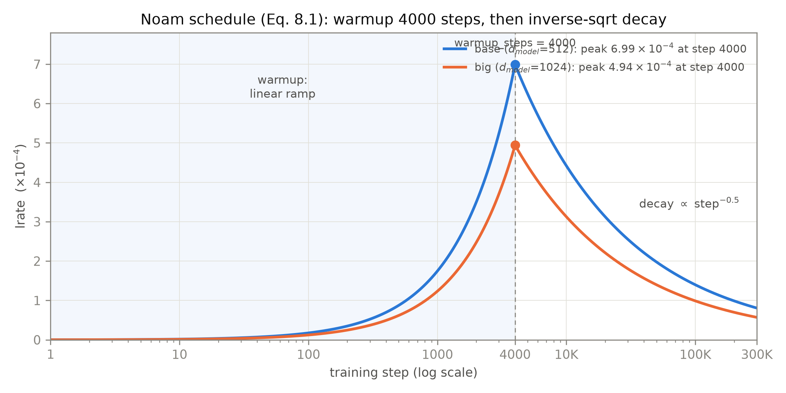

# 第 8 章 原论文训练配方：点火前的最后准备

## 8.0 开篇：从全书到这里

第 7 章结束时，整机立在库房里（整机粗图见导览 0.3 节与第 4 章图 4.1 的双塔——本章的一切都围着这台机器转，只是不进它的机身）：三十个子层按图纸接好线，三类掩码有了统一的加法口径（第 7 章式 (7.2)），63.1M 参数一张张量数清（表 7.5），与官方 `nn.Transformer` 对拍 `allclose` 通过。但它此刻只是一台昂贵的随机数发生器——权重按 torch 惯例初始化，喂进去一句英语，出来的是一锅均匀的噪声。会「前向」不等于会「翻译」：从零件到机器，中间还差最后一道工序——**点火**。第 6 章章末我们特意留了一句话：「点火要的配方——为什么 post-LN 必须配 warmup（预热），正是本章欠账的病根——第 8 章开」。现在兑现。

本章拆解原论文 §5（Training Setup）与 §6.1 的训练配方，把它从一份超参表还原成一串有因果的决策：优化器与学习率怎么走（8.1）、训练目标算什么损失（8.2）、怎么防过拟合（8.3）、数据按什么口径切词组批（8.4）、训完怎么把译文取出来（8.5）。每一项都追问到「知道为什么」为止——论文没给理由的地方，如实标出，并给本书的解释口径。顺手交付三个可复用组件：Noam 学习率调度器、label smoothing 损失、带长度惩罚的束搜索——第 9 章点火时，它们就是训练循环上的三块仪表。8.6 节回头看一眼谱系：这套配方没有一项凭空而来，连「不用什么」都是对前史的回应。

到本章结束，第 0 章旅程地图的「组装」段（第 7-8 章）走完：机身与点火程序都备齐。但先泼一盆冷水：配方里每个数字都是 8 张 P100、450 万句对的尺度上调出来的——缩到一台笔记本电脑，它们还灵不灵？这个疑问第 9 章先在缩尺寸上原样执行（式 (8.1) 的宽度自适应是第一重保险），第 10 章再以趋势级判据复检各项设计的贡献；下一章先干正事：装弹、点火。

> **最小背景栏**（读懂本章所需的全部前置）
> - **交叉熵与困惑度**：语言模型每步输出词表上的分布 $p$，对真实的下一个词 $y$ 记负对数似然 $\mathrm{NLL}=-\log p(y)$，全语料平均即交叉熵损失。**困惑度（perplexity，PPL）** $=\exp(\text{平均 NLL})$，可粗读为「模型每一步平均在多少个候选词之间犹豫」。口径警示：论文 Table 3 的 PPL 是 per-wordpiece（按子词计）口径，表题专门注明勿与 per-word 口径比较——第 9 章报数沿用此口径。
> - **Adam 优化器**：Kingma & Ba（arXiv:1412.6980，ICLR 2015；原论文引作 [20]）。给每个参数维护梯度一阶矩、二阶矩的指数滑动平均（$\beta_1$、$\beta_2$ 是两个平均的衰减率），用它们逐参数缩放步长；$\epsilon$ 是防除零的小常数。库的缺省 $\beta_2=0.999$、$\epsilon=10^{-8}$——记住这组缺省，马上会看到论文两处都改了。
> - 已有知识：第 6 章 6.5 节 post-LN 的训练不稳（warmup 的病根）、第 7 章整机组装与 65M 账本、第 1 章最小背景栏的 BLEU 速览、第 7 章 7.1 节共享嵌入（37k 共享词表正是它能共享的前提）。

## 8.1 优化器与 Noam 调度：热机、冲峰、收油

整机要学的参数有 65M（big 档 213M），第一件事是选优化器。论文用 Adam，三个参数 $\beta_1=0.9$、$\beta_2=0.98$、$\epsilon=10^{-9}$（§5.3）——后两处偏离库缺省的 0.999 与 $10^{-8}$，是复现时最常被忽略的两颗螺丝【证据等级：官方论文 v7 §5.3】。为什么改？论文只给数字、不给理由——这是配方文档的常态，我们的纪律是照抄并如实标注。顺带记一笔「没有」：现代配方常客 weight decay，论文通篇未提（t2t 复现口径取 0.0）——复现报告写「按论文加了 weight decay」是不严谨的【证据等级：官方论文（未提及）+ config/源码（t2t）】。

真正的主角是学习率，固定值对这台机器行不通。行不通的原因第 6 章已经埋下：post-LN 把 LayerNorm 压在残差求和之外，初始化时靠近输出层的参数梯度期望偏大，学习率一大训练就发散；可一旦训练步入正轨，大学习率又碍事——后期需要越来越细的步子。论文的解法是一条两段式曲线（§5.3 公式 (3)，本书编号 (8.1)）：

$$
lrate = d_{model}^{-0.5}\cdot\min\!\left(step\_num^{-0.5},\; step\_num\cdot warmup\_steps^{-1.5}\right)
\tag{8.1}
$$

| 符号 | 含义 | 形状·取值（base） |
|---|---|---|
| $lrate$ | 当前步的学习率 | 标量 |
| $d_{model}$ | 模型宽度——它出现在公式里 | 标量，512（big 1024） |
| $step\_num$ | 当前训练步，从 1 起数 | 标量，$1\sim10^{5}$ |
| $warmup\_steps$ | 升温步数 | 标量，4000（base/big 同值） |

用人话说：前 4000 步学习率从近零**线性爬升**——像冷车起步先小油门热机；第 4000 步之后自动换挡，按步数平方根的倒数**单调下降**——步数翻四倍、学习率减半，越走越保守。两段的交点恰在 $step\_num=warmup\_steps$ 处，$\min$ 只是切换开关。公式里值得多看一眼的细节是 $d_{model}^{-0.5}$：**模型越宽，学习率越低**——配方因此天然适配缩尺寸复现，第 9 章 $d_{model}=256$ 时峰值自动变为 $9.9\times10^{-4}$。这条曲线今天通称「Noam 调度」，名字的来历是一桩小考据，见本节末的框。



图 8.1 Noam 学习率调度曲线（自产，本书实验：式 (8.1) 在 base/big 两档的取值，横轴为对数步轴、全程画到 big 的 30 万步）。浅色竖带是 warmup 段（前 4000 步线性升温），第 4000 步达峰后按 $step\_num^{-0.5}$ 收油；圆点标出两档峰值——base $6.99\times10^{-4}$、big $4.94\times10^{-4}$（本书复算，论文未给峰值数值）。数值与 [`code/ch08/recipe.py`](code/ch08/recipe.py#L28) 的 `noam_lr()` 同源

曲线看图 8.1 比看公式快，但数字要自己跑一遍才算到手（[`code/ch08/recipe.py`](code/ch08/recipe.py#L28) 的 `noam_lr()`，固定种子可复现）：$lrate(1)=1.75\times10^{-7}$，$lrate(1000)=1.75\times10^{-4}$，峰值 $lrate(4000)=6.99\times10^{-4}$（$512^{-0.5}\cdot4000^{-0.5}$，本书复算），$lrate(10^{5})=1.40\times10^{-4}$【证据等级：本书实验（CPU，2026-10）】。两段各自的「形状指纹」也验了：线性段 $lrate(800)/lrate(400)=2.0000$，严格翻倍；衰减段 $lrate(4\times10^{4})/lrate(10^{4})=0.5000$，严格减半——一条曲线、两段各有各的数学，$\min$ 在 4000 步无缝换挡。再带走一个量级感：warmup 只占 base 全程的 4.0%（4000/100000）、big 的 1.3%——用 4% 的步数买下其余 96% 的安全，这笔比例后面还会出现。

**warmup 为什么必须存在**，论文只字未提。本书采纳的解释在第 6 章 6.5 节已经铺好：病根在 LayerNorm 的位置，warmup 是「止痛药」——前 4000 步用小学习率让三十个子层的激活尺度先稳定下来，再逐步加码。这个解释有后世规范分析背书（Xiong et al.《On Layer Normalization in the Transformer Architecture》，arXiv:2002.04745，ICML 2020——**后世分析，非原论文内容**）【证据等级：官方论文 2002.04745】，它还顺带给出一个可检验的预言：病根不除、药不能停——后来把 LN 挪进残差分支内的架构，确实可以大幅缩短甚至取消 warmup。那条手术线挂在欠账地图上（→ Book2 第 4 章）。2017 年此刻只需记住一条事实：post-LN 配方里，这 4000 步升温是训练不发散的必要条件。

> **【考据框】「Noam 调度」的名字从哪来。** 论文通篇没有 "Noam" 一词——§5.3 只有公式 (3)。名字的书面证据只有两条字符串事实：其一，tensor2tensor 源码把这套调度编码为 `learning_rate_decay_scheme = "noam"`（`transformer_base_v1` 起）；其二，The Annotated Transformer（Harvard NLP，2018-04-03）把封装类命名为 `NoamOpt`。社区通行说法「以一作 Noam Shazeer 命名」，在 t2t 源码注释与 Annotated 行文里都找不到直接陈述——本书只陈述上面两条字符串事实，归因存疑处如实存疑【证据等级：config/源码 + 第三方源码直读（2026-10 核对）】。顺带两颗钉子：Annotated 2018 版 `NoamOpt` 的缺省是 factor=2、warmup=4000——**不是**论文口径（论文等效 factor=1）；其 2022 重写版连类名都删了，改用裸函数、缺省 warmup=400。引用一份实现的「默认超参」之前，先问它锚的哪一年、哪一版。

名字之外还有一笔系数账，通向 8.4 的主题。Google 自家的开源复现库 tensor2tensor 把这套调度写成 $5000\cdot d^{-0.5}\min(\cdots)\times0.002\times0.1$——三个系数相乘恰等于 1.0：t2t 最早一档配置（`transformer_base_v1`）与论文式 (8.1) **系数完全一致**，残余差异只来自源码的 $step\_num{+}1$ 起步保护——step 1 处两版差一倍、step 100 处差 1%、step 4000 处只差 0.0125%（`recipe.py` 的 `demo_noam()` 实测打印 5000×0.002×0.1=1.0 及各步点比值）【证据等级：config/源码（t2t `learning_rate.py`）+ 本书实验】。但 t2t 后来的版本就不这么忠实了——warmup、$\beta_2$、系数逐档漂移，全表留到 8.4 的表 8.3。

本章组件一：`NoamLR`。教学版就是上面的纯函数 `noam_lr()`；第 9 章 [`code/ch09/train.py`](code/ch09/train.py) 的 `NoamLR` 类是绑定优化器的应用版（每步在 `NoamLR.step()` 里先改 `param_groups` 的 lr、再 `opt.step()`）。两版在九个步点逐点全等（对拍实测通过）——同一条式 (8.1)、两种封装，第 9 章上机的是后者。

## 8.2 label smoothing：对错误答案留一点概率

学习率定了，下一个问题：损失算什么。最自然的选择是交叉熵——每步把全部概率质量押在参考译文的下一个词上。论文却在交叉熵里掺了一勺东西：**label smoothing（标签平滑）**，$\epsilon_{ls}=0.1$。出处要引准：§5.4 的正文段落（粗体小节标题 Label Smoothing 之下，不是表注、不是脚注），Table 3 base 行同值，引文 [36] = Szegedy et al.《Rethinking the Inception Architecture for Computer Vision》（arXiv:1512.00567）【证据等级：官方论文 v7 §5.4 + 参考文献页】。

先建立直觉：故意对错误答案留一点概率，为什么反而有帮助？关键在两件事实的错位。**其一，翻译没有唯一正确答案**。同一句源文有多种合理译法，训练集却只把其中一种采样出来写成参考；要求模型对每条训练句都押 100% 概率，等于要它把「翻译的固有歧义」背成「唯一的真理」——概率被推向极端，模型容量花在复述训练集的偶然采样上。**其二，评分指标根本不看概率有多尖**。BLEU（第 1 章速览过）只数译文中实际出现的 n-gram 与参考的重叠；解码时只取每步概率最高的候选（8.5 节的束搜索）——分布是不是 one-hot，BLEU 毫不关心，它只关心选出的词在不在点子上。两件事合起来：把「学会更不确定」写进训练目标，伤的是模型不需要的尖锐度，省下的容量换成选词的泛化。论文自己的话说得直白：「这伤害困惑度，因为模型学会更不确定（the model learns to be more unsure），但提升了准确率与 BLEU 分数」【证据等级：官方论文 v7 §5.4 直引】。

形式化只要两步。第一步，把目标分布本身改写（Szegedy 的构造，式 (8.2)）；第二步，对新目标算交叉熵——它恰好分解成两份旧损失的加权（式 (8.3)）：

$$
q'(k) = (1-\epsilon_{ls})\,\delta_{k,y} + \frac{\epsilon_{ls}}{K}
\tag{8.2}
$$

| 符号 | 含义 | 形状·取值 |
|---|---|---|
| $q'(k)$ | 平滑后类别 $k$ 的目标概率 | 标量（$\sum_k q'(k)=1$）；整张分布 $(K,)$、训练批形态 $(B,L,K)$（$K$ 即词表维，代码里记 $V$） |
| $\delta_{k,y}$ | 示性函数：$k=y$ 时取 1，否则 0 | 标量（0/1） |
| $K$ | 词表大小（全部类别，含目标词自己） | 标量，EN-DE 约 37000 |
| $\epsilon_{ls}$ | 平滑强度 | 标量，0.1 |

$$
H(q',p) = (1-\epsilon_{ls})\cdot \mathrm{NLL}(y) \;+\; \epsilon_{ls}\cdot\Big(-\frac{1}{K}\sum_{k}\log p_k\Big)
\tag{8.3}
$$

用人话说：式 (8.2) 把「全部押 $y$」改成「九成押 $y$、一成平分给所有人」——目标类拿到 $(1-\epsilon_{ls})+\epsilon_{ls}/K$（$K=10$ 的教学例实测 0.9100），其余各类各得 $\epsilon_{ls}/K$（实测 0.0100），总和恰为 1；这支平滑后的目标分布本身是一支 $(K,)$ 向量（教学例即 `smoothed_target()` 返回的 $(10,)$）。式 (8.3) 说明这个新目标等于「九成普通交叉熵 + 一成对均匀分布的交叉熵」——后一项逼着模型不许把任何词的概率压到零。实现三行就是这三行：

```python
# [`code/ch08/recipe.py`](code/ch08/recipe.py#L62) 节选（式 (8.3) 的直接翻译：label_smoothing_loss()）
def label_smoothing_loss(logits, target, eps=EPS_LS, ignore_index=None):
    logp = F.log_softmax(logits.float(), dim=-1)               # (B,L,V) -> (B,L,V)：softmax 在词表维上
    nll = -logp.gather(-1, target.unsqueeze(-1)).squeeze(-1)   # 索引 (B,L)->(B,L,1) 挑真值列 -> (B,L)
    loss = (1 - eps) * nll + eps * (-logp.mean(-1))            # 两个 (B,L) 逐位加权 -> (B,L)
    ...                                                        # pad 掩蔽（布尔 (B,L)）挑有效位，均值 -> 标量
```

这三行的形状账值得单独走一遍（表 8.1）。教师强制喂进整批句子，机器吐出的 logits 是 $(B,L,V)$——批内 $B$ 句、每句 $L$ 个位置、每个位置一份全词表得分（$V$ 即式 (8.2) 的 $K$）；两份中间损失都是逐位置的 $(B,L)$，pad 掩蔽是一张同形的布尔 $(B,L)$，最后收成一个标量去反传。顺带一个实现洞察：**平滑目标 $q'$ 从头到尾没有被实体化**——式 (8.3) 的分解让 $(B,L,K)$ 的目标分布无需构造，gather 挑一列、mean 摊一列就抵了整张表的账；若真把 $q'$ 显式造出来，白花的是一份 $(B,L,K)$ 的显存。

| 步骤 | 运算 | 输入形状 | 输出形状 | 说明 |
|---|---|---|---|---|
| 1 | $\log\mathrm{softmax}$（最后一维） | $(B,L,V)$ | $(B,L,V)$ | logits 变 log 概率；softmax 永远在词表维上做 |
| 2 | gather 挑真值列 | logp $(B,L,V)$；索引 $(B,L)\!\to\!(B,L,1)$ | $(B,L)$ | 式 (8.3) 左项 $\mathrm{NLL}(y)$：逐位置取出参考词那一列 |
| 3 | $\mathrm{mean}(-1)$ | $(B,L,V)$ | $(B,L)$ | 右项 $-\frac{1}{K}\sum_k\log p_k$：对均匀分布的交叉熵 |
| 4 | $(1-\epsilon_{ls})\times$第 2 步 $+\,\epsilon_{ls}\times$第 3 步 | 两个 $(B,L)$ | $(B,L)$ | 式 (8.3) 逐位落地 |
| 5 | pad 掩蔽（布尔索引） | 掩码 $(B,L)$；损失 $(B,L)$ | $(n_{valid},)$ | 填充位不计损失——掩码与损失同形，逐位挑选（第 9 章应用版补此步） |
| 6 | 均值 | $(n_{valid},)$ | 标量 | 反传用的损失值 |

表 8.1 label smoothing 损失的形状流转表（自排，对应 `recipe.py` 的 `label_smoothing_loss()`）。批形态以训练实况 $(B,L,V)$ 记——第 9 章 $V=8000$；无句结构的玩具任务是二维退化形态 $(N,V)=(2048,16)$，对拍里本章教学版吃三维 $(64,50,11)$、ch09 应用版先展平成 $(3200,11)$——全部运算沿最后一维，流转同理

验证分两半，恰好对应双指标。**「伤 PPL」是结构性代价，可以闭式算出来**：构造一个真值本身含噪的合成任务（$y=x{+}1$ 概率 0.7、$y=x{+}2$ 概率 0.3，词表 16），$\epsilon_{ls}=0$ 的理论最优 NLL 就是贝叶斯风险 0.6109 nats（PPL 1.842）；掺入 0.1 平滑后最优解变成 $p^{*}=0.9\,p+0.1/K$，NLL 必然抬到 0.7024（PPL 2.019）——0.0916 nats 的差距与训练好坏、实现优劣都无关，是目标函数自己写下的【证据等级：本书实验（CPU，2026-10，含闭式推导）】。实测 500 步小训练：$\epsilon_{ls}=0$ 得 eval NLL 0.6245、$\epsilon_{ls}=0.1$ 得 0.7107，双双贴着各自的理论下沿（理论锚点与 500 步训练都在 `recipe.py` 的 `demo_label_smoothing()`）。而**「利 BLEU」的一半，玩具尺度诚实地复现不出来**——合成任务的选词准确率两组同为 69.3%：平稳的抽签任务上 argmax 本来就选得对，平滑帮不上、也不需要帮。真证据在论文自己的消融里：Table 3 (D) 行，$\epsilon_{ls}=0$ 时 PPL **4.67，优于 base 的 4.92**（(D) 组最佳；消融行中仅 (C) 的 $d_{model}=1024$ 行 4.66 更低）、BLEU 25.3 反而更差；$\epsilon_{ls}=0.1$（base）PPL 升到 4.92、BLEU 升到 25.8；$\epsilon_{ls}=0.2$ 则 5.47 对 25.7——两个指标当场分道扬镳【证据等级：官方论文 v7 Table 3 (D)】。第 10 章的消融网格将设 $\epsilon_{ls}=0$ 行，在真模型上复检这条「双指标反向」。

> **【考据框】两笔引用勘误。** 其一，label smoothing 的出处论文是 Szegedy et al.《Rethinking the Inception Architecture for Computer Vision》，**arXiv:1512.00567**；外部资料常见的「Szegedy 1506.02672」系误引——arXiv:1506.02672 是一篇凝聚态物理论文（自旋冰材料 Ho₂Ti₂O₇ 的单离子各向异性），与 label smoothing 毫无关系，禁用【证据等级：arXiv 编目直核】。其二，Transformer 论文只给了 $\epsilon_{ls}=0.1$ 这一个数，**没写平滑分布怎么构造**——构造出自 Szegedy §7：$q'(k)=(1-\epsilon)\delta_{k,y}+\epsilon/K$，均匀质量撒在**含目标类在内的全部** $K$ 类上（「非目标类均分 $\epsilon/(V-1)$」是排除目标类的变体，不是 Szegedy 原文）。本书写作前已下载该 PDF 逐字复核（log/Book1-ch08/）。顺带一个细节：Szegedy 在 ImageNet（$K{=}1000$）上用的也是 $\epsilon=0.1$——Transformer 连数值一起搬了过来。

本章组件二：`label_smoothing_loss()`。教学版就是上面的三行、形状流转见表 8.1；第 9 章 `train.py` 的 `label_smoothing_loss()` 应用版多了 pad 位掩蔽（填充不计损失，表 8.1 第 5 步）。随机 logits 上两版 `allclose`（对拍实测通过）——同一条式 (8.3)、两种封装，第 9 章上机的是后者。

## 8.3 dropout 布点：两处开关、三档数值与一段被删的正文

损失的两端都定了，第三味正则管「别把训练集背下来」。65M 参数对 4.5M 句对，过拟合是真实风险；论文的答案是 dropout（Srivastava et al. 2014，引作 [33]）：训练态每步随机把一部分激活置零、其余按 $1/(1-p)$ 放大，期望不变——相当于每步训练一个随机子网，测试时全网平均上线。机制先机检一次再往下讲（`recipe.py` 的 `demo_dropout()`）：`Dropout(0.1)` 作用在 20 万个 1 上，置零比例实测 0.1012、存活值恰为 1.1111（$=1/0.9$）、总均值 0.9987【证据等级：本书实验（CPU，2026-10）】——「置零 + 逆缩放」两件事都在，期望守恒。形状上它还是全书最安分的算子：逐元素作用，$(B,L,512)$ 进、$(B,L,512)$ 出——第 6 章的不变量三（逐位置算子不碰形状）在此又添一员，机检里那 20 万个 1 就是一张拍平了的激活张量。

布点在哪，论文写得精确：**恰好两处**（§5.4）。其一，每个子层的输出、在加回残差与 LayerNorm **之前**——第 6 章 `PostLNSublayer` 内置的就是它，整机共 30 个子层 30 个开关；其二，embedding 与位置编码**之和**上，编码解码两栈都有——第 5 章 5.2 节预告、第 7 章 `embed_tokens` 末尾落地的正是它。除这两处，定稿配方里再无 dropout：注意力权重上没有，FFN 内部也没有（第 7 章表 7.4 的差异①——官方实现 FFN 内 ReLU 后多一个 dropout，属实现族谱差异）。数值三档：base $P_{drop}=0.1$（§5.4）；big $P_{drop}=0.3$（出处是 Table 3 **big 表体行**，不是表注）；**例外**：EN-FR 的 big 用 0.1 而非 0.3（§6.1 原文明言 instead of 0:3）【证据等级：官方论文 v7 §5.4/Table 3/§6.1】。为什么 EN-FR 反而调轻？论文没说。一个与数据规模自洽的推测是：EN-FR 有 36M 句对（EN-DE 的 8 倍），数据越大过拟合压力越小、正则就该越轻——推测不代论文背书，如实标注。

> **【考据框】被删掉的第三小节：Attention Dropout 段存废史。** v7 §5.4 的首句是「我们在训练中采用三种正则化（three types of regularization）」，可正文数来数去只有两个粗体小节（Residual Dropout、Label Smoothing）。多出来的「第三种」是一段被删的正文：v1–v4 的 §5.4 原有第三小节 **Attention Dropout**——大意是「查询到键的注意力在结构上类似前馈网络里隐层到隐层的权重，softmax 输出的注意力权重恰似隐层激活；自然的推广是对注意力权重本身做 dropout（把 dropout 包在式 (2.1) 的权重矩阵外层）……注意力 dropout 对我们的句法分析实验有益」。v5（2017-12-06）起该段被整体删除，却留下两处化石：§5.4 首句的 "three types" 没改成 "two"；§6.3 仍写着「注意力与残差 dropout（both attention and residual, section 5.4）」，指向已删的段落。NeurIPS 会议版同样删段、同样留着 "three types"【证据等级：官方论文·八版全文 diff（2026-10-02，本书调研 notes/06）】。两点读法：其一，定稿的机器翻译配方**不含**注意力 dropout（t2t v2+ 的 `attention_dropout=0.1` 与被删段精神相通，但那不是论文定稿口径）；其二，「连原论文都会在定稿前删掉一味配置、又忘了清理引用」——版本考古的必要性，这是又一件物证。

版本漂移在配方这里值得一张总表。表 8.2 把八个版本（v1–v7 加 NeurIPS 会议版）与训练相关的主要差异收拢：41.x 的逐版矩阵、被删的段落、误印的表格、重排的引文，一表在册。

| 差异项 | v1（06-12） | v2（06-19） | v3（06-20） | v4（06-30） | v5–v7（12-06→） | NeurIPS 版 |
|---|---|---|---|---|---|---|
| §5.4 Attention Dropout 段 | 有 | 有 | 有 | 有 | **删**（留两处化石） | 无（"three types" 残留） |
| EN-FR big BLEU（摘要／§6.1 句／Table 2） | 41.0/41.0/41.0 | **41.2/41.17/41.0** | 41.0/41.17/41.0 | 41.0/41.0/41.0 | **41.8/41.0/41.8** | 41.0（三处一致） |
| §6.1 EN-FR big 特殊配置 | 无此句 | 不共享嵌入、$d_{ff}$=8192、$P_{drop}$=0.1 | 同 v2 | 只留 $P_{drop}$=0.1 | 同 v4 | 同 v4 |
| 脚注 4（$\sqrt{d_k}$ 方差论证，见第 2 章） | 无 | **新增** | 有 | 有 | 有 | 有 |
| Table 3 base $d_{ff}$（见第 6 章） | 误印 1024 | **修正 2048** | 2048 | 2048 | 2048 | 2048 |
| Table 3 (E) 行（见第 5 章） | 无 | **新增** | 有 | 有 | 有 | 有（与 v2+ 各版一致） |
| 引文编号（Adam／label smoothing／GNMT） | [18]/[32]/[34] | 逐版重排 | 逐版重排 | 逐版重排 | [20]/[36]/[38] | 自成一套（32 篇） |
| 配方数字（warmup、$\beta_2$、$\epsilon_{ls}$、$P_{drop}$、词表、beam、$\alpha$、checkpoint 平均） | 一致 | 一致 | 一致 | 一致 | 一致 | 一致 |

表 8.2 训练配方视角的版本差异对照（自排；【证据等级：官方论文·八版 PDF 全文 diff（2026-10-02，本书调研 notes/06）】）。表注三点：v6≡v7（文本层零差异，v7 仅元数据再提交）；引 41.8 须标「v5 起」，并注明 §6.1 正文句遗留 41.0——第 10 章 10.1 节展开；NeurIPS 版真正缺的是 §6.3/Table 4/Fig 3-5（成分句法分析整体删节），Table 3 本身与 v7 逐词一致

表 8.2 的最后一行单独点出：**训练配方的数字本身，v1 到 v7 一步未改**——warmup 4000、$\beta_2$ 0.98、$\epsilon_{ls}$ 0.1、$P_{drop}$ 两档、37k/32k 词表、beam 4、$\alpha$ 0.6、checkpoint 平均，七个版本加会议版全部一致。漂移的都在配方之外：结果数字、被删的段落、误印的表格、重排的参考文献。这给复现者一个好消息（照抄 v7 的配方，不怕版本坑）和一个提醒（照抄 v7 的**结果数字**之前，先查表 8.2）。

## 8.4 BPE 数据口径：37k 词表与「论文口径 vs 复现口径」第一课

优化器、损失、正则齐了，还差燃料本身：数据按什么口径切成词元。伏笔第 1 章埋得很深：Sutskever 的源端词表 160,000、目标端 80,000，表外的词只能记 UNK；Cho14b 的证据链里，「未登录词变多」与「句长变长」并列是性能退化的两大主因（1.2 节）。词级词表是个两难：词表小，UNK 满天飞；词表大，每步训练的 softmax——$(B,L,V)$ 张量的最后一维——要在几十万类上逐位重算，稀有词照样吃不饱训练量。

子词（subword）是出路，直觉一句话：**高频词整存，低频词切碎**。「the」这样的高频词值得独占一行词表；几年遇不上一次的「Nähe」（德语「附近」）拆成 N/ähe 也不委屈它——拼回来就行。德语尤其受益于这套切法：名词复合与词形变体海量，第 9 章自训 8k 词表的实测切分里，Nähe→▁/N/ähe、Büsche（灌木丛）→▁Bü/sche，词表只有 8000 就把 unk 率压到约 1.9%【证据等级：本书实验（第 9 章底座，2026-10）】。方法出处是 Sennrich et al.《Neural Machine Translation of Rare Words with Subword Units》（arXiv:1508.07909，ACL 2016）：把文本压缩领域的字节对编码（byte-pair encoding，BPE）改造成子词切分——从字符起步、反复合并语料里最高频的相邻对、攒到目标词表为止。切分器怎么训练，本书当黑盒用，拆解欠账在章末。

论文自己的口径（§5.1 逐句）：EN-DE 用 WMT 2014 英德语料约 450 万句对，**shared BPE 约 37000 词元**——源语言与目标语言共享同一张词表；EN-FR 用大得多的 3600 万句对，切成 32000 word-piece 词表（GNMT 的 WPM 口径，引 [38]）。批也在这里规定：按近似句长分桶，每批约 25000 个源词元加 25000 个目标词元——按**词元数**而非句数组批，长短句混批时梯度供给更均匀（第 9 章缩尺寸后用 batch 64 句的简化口径，差异届时声明）。37k 共享词表还有一层结构含义，第 7 章 7.1 节点过：三处权重共享的前提，正是两侧本来就用同一张表。

> **【考据框】§5.1 的 [3] 引错了人？** 论文写道「句子用字节对编码 [3] 编码，共享约 37000 词元的源-目标词表」——而 v7 参考文献 [3] 是 Britz et al.《Massive Exploration of Neural Machine Translation Architectures》（arXiv:1703.03906），一篇 NMT 超参的实验综述，不是 BPE 方法论文。BPE 的方法出处 Sennrich 论文其实引了——在 §4，被引作 [31]。这个 [3] 在 v1、NeurIPS、v7 三个版本里一致存在：要么是编号笔误（想引 [31] 写成 [3]），要么是有意引 Britz 的实验设置——论文内部无法判定，本书如实记为「疑似笔误」【证据等级：官方论文·多版本参考文献页直读】。教训与 8.2 的 1506.02672 一脉相承：**引文编号与引文内容要对账**，经典论文也有笔误。

把 §5.1 的 37k 记牢，再看 Google 自家开源库 t2t 的复现配置，本章的第二课就来了：t2t 的 WMT EN-DE 标准问题名叫 `translate_ende_wmt32k`——**约 32k 子词，用的还是 t2t 自研的 SubwordTextEncoder，不是 Sennrich 的 BPE**；README 自报「8 GPU 训 300k 步，BLEU 约 28」，是这个口径下的复现值【证据等级：config/源码（t2t README 直读）】。37k 对 32k 差得不大，但漂移不止词表一处：表 8.3 把论文配方与 t2t 四代配置并排——warmup 4000→8000→10000，$\beta_2$ 0.98→0.997，调度系数 1.0→2.0，优化器 Adam→Adafactor。没有哪一代「错了」——复现库在持续做工程演进；但「按论文复现」与「跑通官方库」是两件事，报数时必须声明用的哪套。第 9 章自训 8k 词表、第 10 章报消融，都按这条纪律来。

| 配置 | warmup | $\beta_2$ | 学习率调度（有效系数） | 词表口径 |
|---|---|---|---|---|
| **论文 §5（base）** | 4000 | 0.98 | 式 (8.1)，系数 1.0 | 37k 共享 BPE（Sennrich 系） |
| t2t `transformer_base_v1` | 4000 | 0.98 | legacy+noam：5000×0.002×0.1=1.0 | ~32k 子词（SubwordTextEncoder，自研） |
| t2t `transformer_base_v2` | 8000 | 0.98 | 同上（系数 1.0） | 同上（dropout 拆三处各 0.1） |
| t2t `transformer_base`（v3，master 缺省） | 8000 | **0.997** | constant×linear_warmup×rsqrt 衰减，系数 **2.0** | 同上 |
| t2t TPU 版 | 10000 | — | Adafactor＋rsqrt 衰减 | 同上 |

表 8.3 论文口径 vs t2t 复现口径漂移表（自排；【证据等级：config/源码（t2t `transformer.py`／`learning_rate.py`／README 直读）】）。读法：论文数字只保证第一行；向下逐档，warmup 翻倍、二阶矩衰减放慢、系数翻倍、优化器换人——每一档都是工程演进，但都不再是式 (8.1) 的原样

## 8.5 束搜索与长度惩罚：留四条路走迷宫，别偏爱短句

训练配方到 8.4 全部就位。但 §6.1 还藏着配方的最后一段：模型训完，译文怎么「取」出来？解码不是训练的附属品——同一台训好的机器，解码规程不同，BLEU 可以差出一格；这一段里还有第 1 章预告过的那条直系血统。

先把前置概念搭完整：**束搜索（beam search）是什么**。想象走迷宫：入口是句首，每一步要在一块写着全词表（约 37000 个词）的路牌上选一个词往下走。最省事的走法是贪心——每步挑当前概率最大的出口一路走到黑；它目光短浅：第一步的局部最优可能通向越走越窄的死路，而当时只差一点的一条岔路其实通向坦途。束搜索的改法是**永远同时保留 $k$ 条路**（束宽 beam size，论文取 4）：每步把 $k$ 条活路各扩展一步、得 $k\times V$ 个候选，按**累积对数概率**留前 $k$ 条；某条路走到终止符 `<eos>` 就「定稿」放进成品区；最后在成品区挑总分最高的一条当译文。这幅图你可以默画出来：一棵不断加宽又不断剪枝的树，树腰上任何时刻挂着 4 张写着累计分的路条。落到张量上，这棵树每步只活两层：$k$ 条活路就是 $k$ 条已生成 $\le t$ 个词元的前缀——直觉上是一张 $(k,\le t)$ 的参差整数表（批量实现里右对齐 PAD 补齐，即得规则张量）；一步扩展是给 $k$ 个前缀各取一份全词表分布 $(k,V)$（第 9 章 `decode.py` 的 `beam_search()` 批量版按 $b$ 句并成 $(b,k,V)$），$k\times V$ 个累积分排一次序、前 $k$ 条幸存——「束」就是那道把 $V$ 收窄成 $k$ 的闸门。贪心就是 $k=1$ 的特例（第 9 章 `decode.py` 的 `greedy_decode()` 正是这么复用的）。

紧接着第二个前置问题：**累积对数概率怎么比才公平**。概率是连乘：句长每多一个词，总分就乘上一个小于 1 的数，对数分就往下掉一截——条件相同，**短句永远占便宜**，哪怕模型「觉得」长句更对，算分也输。GNMT 的解法（Wu et al. 2016，arXiv:1609.08144，§7 公式 (14)；本书写作前已下载 PDF、解压文本层逐字复核，本书编号 (8.4)）：

$$
s(Y,X)=\frac{\log P(Y\mid X)}{lp(Y)}+cp(X;Y),\qquad
lp(Y)=\frac{(5+|Y|)^{\alpha}}{(5+1)^{\alpha}}
\tag{8.4}
$$

| 符号 | 含义 | 形状·取值 |
|---|---|---|
| $s(Y,X)$ | 候选译文 $Y$ 对源句 $X$ 的最终得分 | 标量，越高越好 |
| $lp(Y)$ | 长度惩罚因子，随 $|Y|$ 单调增 | 标量 |
| $\alpha$ | 惩罚强度：$\alpha=0$ 即不惩罚 | 标量，Transformer 0.6；GNMT 自用 0.2 |
| $cp(X;Y)$ | 覆盖惩罚：按注意力盖住源句的程度加分 | 标量；Transformer **未采用** |

用人话说：给长句的负分发一个随长度增长的折扣——每多走一步，就多赦免一点连乘攒下的罚金。除数恰在 $|Y|=1$ 处取 1——一个词的输出免罚；分子里的 $+5$ 让折扣随长度平缓爬升：到 6 词，除数也只爬到约 1.44。$+5$ 是 GNMT 软化短句惩罚的平滑项（其 §7 的演化：先除长度、再除 $\mathrm{length}^{\alpha}$、最后到 eq(14)）。$lp$ 的数值手感（`recipe.py` 的 `length_penalty()` 实测）：$lp(1)=1.00$、$lp(7)=1.52$、$lp(10)=1.73$、$lp(20)=2.35$、$lp(50)=3.78$【证据等级：本书实验（CPU，2026-10）】。Transformer 论文在 §6.1 只写了一行——束宽 4、长度惩罚 $\alpha=0.6$，引 [38]——公式本体在 GNMT，而且只搬了 $lp$ 这半壁（$cp$ 需要注意力概率做输入，论文未提），$\alpha$ 也是自家的值。

短句偏置不是吓唬人，手造一个打分器就能让它现形（`recipe.py` 的 `short_bias_demo()`）：场景设定——第 1 步直接出 `<eos>` 的概率 0.35，一条 7 词长路全程概率 $0.55\times0.9^{6}=0.292$。纯对数分：短句 $\log 0.35=-1.0498$ 胜、长句 $-1.2300$ 败；换 $\alpha=0.6$：长句得 $-1.2300/1.5157=-0.8114$，翻盘【证据等级：本书实验（CPU，2026-10）】。这里有个实现洞察值得单独点出：束搜索进行中，所有活路长度同步增长，步内 $lp$ 人人相同——**按原始 logP 剪枝与按惩罚分剪枝完全等价，长度惩罚只需在候选定稿时参与排序**。这正是 $lp$ 可以「事后施加」的原因；第 9 章的批量张量实现（打分 $(b,k,V)$、活路 $(b\cdot k,\le t)$、每句累积分 $(b,k)$），用的也是这个性质。

```python
# [`code/ch08/recipe.py`](code/ch08/recipe.py) 节选（式 (8.4) 与定稿打分：length_penalty()；定稿发生在 beam_search() 内）
def length_penalty(length, alpha=ALPHA):
    return (5.0 + length) ** alpha / 6.0 ** alpha      # lp(Y)：标量 |Y| -> 标量；α=0 时恒为 1（纯 logP）

# beam_search() 内部：EOS 候选以「累计 logP / lp(自身长度)」的得分定稿入成品区——(k,V) 打分、标量定稿
```

**血统与调参的谱系**（兑现第 1 章的两处预告）。GNMT 自用参数：束宽 8–12、$\alpha=0.2$、覆盖惩罚 $\beta=0.2$，实测把单模型 En-Fr 从纯概率解码的 30.3 BLEU 提到 31.4（+1.1）【证据等级：官方论文 1609.08144 §7/Table 2（本书 PDF 复核）】。更早的 Sutskever 就报告过「beam=1 已不错、beam=2 拿走大部分收益」（第 1 章 1.1 节埋的钩子）【证据等级：官方论文 1409.3215 §3.2】；GNMT 也自述束宽收到 4 或 2 只有轻微负效应【证据等级：官方论文 1609.08144 §7（本书 PDF 复核）】。Transformer 取 beam=4，站在两代前人的经验之上，再在自家 dev set（newstest2013）上把 $\alpha$ 调到 0.6（§6.1 明言这组超参是 dev 上实验选定的）【证据等级：官方论文 v7 §6.1】。一条数字卫生提醒：GNMT 文中「$\alpha\in[0.6,0.7]$ 通常最好」说的是**早期**「除以 $\text{length}^{\alpha}$」启发式的调参区间，不是 eq(14) 的最优区间——Transformer 的 0.6 恰落旧区间纯属数值巧合，两者机制上两码事（PDF 复核新增的口径）。

最后一小项：**checkpoint 平均（checkpoint averaging）**。base 取最后 5 个 checkpoint（每 10 分钟一存）做**参数平均**，big 取最后 20【证据等级：官方论文 v7 §6.1】。注意它不是 ensemble：ensemble 平均的是各模型的**输出**，这里平均的是**权重本身**——同一组形状的参数张量逐个取算术平均（每个权重的形状都不变，变的是取值），训练后期的模型在损失面的同一个谷底附近游走，几个点取质心往往比任何单点更稳，近乎免费地涨一点分。两个口径注记：Table 3 的消融实验**不做** checkpoint 平均（表题写明），第 10 章沿用此口径；推理最大输出长度设为输入长度 +50、能提前终止就提前终止（§6.1）。

本章组件三：束搜索本体。教学版（`beam_search()`，逐句 Python 循环）与第 9 章 `decode.py` 的 `beam_search()` 批量张量版同协议对拍：确定性打分器上 3 句构造任务，两版最优假设逐句相同、且都等于构造正解（实测三项全过）【证据等级：本书实验（CPU，2026-10）】；该批量版此前另与朴素参考实现 200/200 句一致（第 9 章底座实测）。同一算法、两种工程形态，第 9 章上机的是后者。至此三块仪表齐了——它们不装在机身上，挂在点火台上：下一章的训练循环会把 `NoamLR`、`label_smoothing_loss`、`beam_search` 逐件装上，每一行都能回到本章找到出处。

## 8.6 前史配方对照：2017 年的配方站在什么之上

至此 §5 与 §6.1 的配方逐项拆完。合上看，它不是一份凭空的天才菜单——把四代训练配方并排放（表 8.4），谱系一目了然。

| 配方项 | Sutskever 2014 | GNMT 2016 | ConvS2S 2017 | Transformer 2017 |
|---|---|---|---|---|
| 优化器 | SGD，无动量 | Downpour SGD（异步 12 副本，batch 128；Adam 起步转 SGD） | Nesterov 动量 0.99 | Adam（$\beta_2$=0.98、$\epsilon$=$10^{-9}$） |
| 学习率策略 | 0.7 起步，第 5 个 epoch 后每半 epoch 减半 | （未逐项披露） | 0.25；验证集不降则每 epoch 降一个数量级 | 式 (8.1)（warmup 4000＋平方根倒数衰减） |
| 梯度防护 | 范数裁剪（阈值 5） | — | 范数 >0.1 即重归一化 | 论文未记载 |
| 特殊技巧 | **源句逆转** | **RL 精调**（GLEU 奖励；En-Fr 38.95→39.92，En-De 略降；未上生产） | — | label smoothing 0.1＋dropout 两处 |
| 数值精度 | fp32 | **8-bit 定点＋16-bit 累加**（非 fp16；仅损 0.0072 log-ppl） | fp32 | fp32（P100） |
| 解码 | beam 12（beam=1 已不错、beam=2 拿走大半收益） | beam 8–12、$\alpha$=0.2、$\beta$=0.2（eq(14)，+1.1 BLEU） | beam 5＋长度归一化 | beam 4、$\alpha$=0.6＋checkpoint 平均 |

表 8.4 四代训练配方对照（自排；均为各论文自报口径，「论文未记载」指通篇无提及，「—」指调研未录得该项记载、不作「没有」解【证据等级：官方论文 1409.3215／1609.08144／1705.03122／1706.03762v7，调研 papers/02、papers/03 已核】）

读表的三个观察。**其一，继承是主流**：束搜索加长度惩罚直承 GNMT——连「$\alpha$ 在 dev set 上调」的做法都一样；label smoothing 承自计算机视觉（Szegedy 在 ImageNet 上 $K=1000$ 也用 $\epsilon=0.1$，Transformer 连数值一起搬）；Adam 承自 Kingma & Ba；BPE 承自 Sennrich；输入输出嵌入共享承自 Press & Wolf（第 7 章 7.1）。**其二，2017 年真正的新货是 Noam 调度**：warmup 加平方根倒数衰减的极简两段式，配 post-LN 恰好构成「训得深、收敛稳」的最小方案——它背后还有一条更深的判断：与其在训练技巧上堆猛药，不如让结构自己站稳。**其三，它同样拒绝了前史的两味猛药**：GNMT 用强化学习按评测精调（GLEU 奖励，En-Fr 38.95→39.92，但 En-De 略降、人工评测几乎不变，最终未上生产），又用 8-bit 定点量化换吞吐（第 1 章考据框辨析过：定点 8-bit 权重加 16-bit 累加器，不是常被误传的 fp16；仅损 0.0072 log-ppl）；ConvS2S 用 Nesterov 动量配精细的梯度范数控制。Transformer 论文一概不碰——纯极大似然、全 fp32。历史的后话：被 2017 年拒绝的两条路后来都成了大生意——低精度从训练侧一路传到推理侧（→ Book4 第 7 章、Book6 第 11 章），「按评测指标直接精调模型」也以别的形态归来。先记在案，后话在后册。

## 8.7 本章小结

开篇我们站在装好的整机前问：这台机器用什么点火、怎么点？本章把论文 §5 与 §6.1 的配方还原成一串有因果的决策，并交付了三块仪表。学习率：Adam 配式 (8.1) 的两段曲线——前 4000 步线性升温到 $6.99\times10^{-4}$（base，本书复算），再按步数平方根倒数收油；warmup 不是玄学，是 post-LN 病根的止痛药（8.1）。训练目标：交叉熵掺一成均匀——label smoothing 以结构性的 PPL 代价（玩具任务闭式 0.0916 nats；论文 4.67→4.92）换选词的泛化（BLEU 25.3→25.8），双指标分道扬镳（8.2；损失张量从 $(B,L,V)$ 收窄到标量的全程见表 8.1）。正则：dropout 恰好两处布点（30 个子层输出＋两侧嵌入与 PE 之和）、三档数值，外加一段被 v5 删掉的第三小节与两处化石——而配方数字本身七个版本一步未改（8.3、表 8.2）。数据：37k 共享 BPE 的论文口径对着 t2t 32k 子词的复现口径，「论文口径 vs 复现口径」的第一课（8.4、表 8.3）。解码：束宽 4 留四条路走迷宫，GNMT eq(14) 的长度惩罚矫正连乘的短句偏置，checkpoint 平均在权重空间取质心（8.5）。三块仪表——`NoamLR`、`label_smoothing_loss`、`beam_search`——都与第 9 章的应用版逐项对拍一致。

**带走的心智**：细节都还回去之后，请把这三幅画留下。**第一，学习率曲线是一条点火程序**——热机、冲峰、收油；见到任何 warmup，先别背数字，先问「这台机器哪里需要热机」——2017 年的答案是 LayerNorm 的位置，药与病在同一张图上对号。**第二，训练目标与评价指标是两回事**——PPL 奖励诚实的概率，BLEU 只看选出的词；两者打架时想清楚你为谁服务：label smoothing 用一点 PPL 换 0.5 BLEU，是这种错位最干净的一笔交易。日后你面对任何「为指标而设的损失」——包括后世按人类偏好调模型的时代——先问同一个问题。**第三，解码是「留四条路的走迷宫」加「别偏爱短句」**——连乘天然欺长，$lp$ 是矫正；这套 2017 年为翻译机设计的解码哲学，到开放生成的年代怎么改写，欠账框里有地址。

到这里，旅程地图的「组装」段（第 7-8 章）收官：机身（第 7 章的整机、掩码与 65M 账本）与点火程序（本章的五件事与一条谱系）都已在手。第 6 章末欠账的另一半也在 8.1 兑现：warmup 这味药与 post-LN 这个病根对上了号，手术本身留在欠账地图上（→ Book2 第 4 章）。下一章点火：数据管道（Multi30K、自训 BPE-8k）、训练循环（三块仪表上机）、GRU 双 baseline、束搜索解码与按句长分桶的评测——第 1 章预言的容量墙，将在那些句长桶里第一次等到数值的回声。

> **【欠账】** **BPE 黑盒（F7）**——本章与第 9 章把分词器当黑盒用了三次（口径辨析、自训调用、切分演示）：BPE 词表怎么从语料里「长」出来、压缩率与 unk 率的账怎么算，开箱拆齿轮在下一册——届时回收第 9 章的「约 3.7 字符/piece、unk 约 1.9%」当验证算例。→ Book2 第 2 章
>
> **【欠账】束搜索与长度惩罚（F8）**——beam 是为翻译机设计的解码器：小词表、封闭输出、长度可控。开放生成时代它让位于采样全家福（temperature、top-p、各种惩罚项），但长度惩罚的账还挂着；而「一次验证多条候选」把 beam 的思想借尸还魂成投机解码。→ Book6 第 9 章 / Book6 第 10 章

## 8.8 动手验证

- **入口命令**：
  ```bash
  source env.sh && python "[`code/ch08/recipe.py`](code/ch08/recipe.py)"        # 五组自测 + 与 ch09 对拍（CPU 秒级）
  source env.sh && python "[`code/ch08/make_fig_8_1.py`](code/ch08/make_fig_8_1.py)"  # 图 8.1（300 dpi）
  ```
- **预期产出**（固定种子 2017/8，可逐字复现）：①Noam：九个步点 lr 表（$1.75\times10^{-7}\to$ 峰值 $6.9877\times10^{-4}\to1.40\times10^{-4}$）、两段自检 2.0000／0.5000、warmup 占比 4.0%／1.3%、t2t 系数还原 5000×0.002×0.1=1.0 及五个步点比值（2.0／1.1／1.01／0.999875／0.999995）。②label smoothing：目标分布 0.9100／0.0100（$\Sigma=1$）、理论 NLL 0.6109（PPL 1.842）对 0.7024（2.019）、实测 0.6245 对 0.7107（选词准确率均 69.3%）。③dropout 机检：0.1012／1.1111／0.9987。④束搜索：lp 数值表、短偏置翻盘（$\alpha=0$ 选 1 词短句、$\alpha=0.6$ 选 7 词长句）。⑤对拍三行全 True：Noam 九步点全等、LS 损失 `allclose=True`（2.821495 对 2.821495）、beam 三句「教学版＝应用版＝构造正解」。图 8.1 写入 `figures/`。
- **验收点**：能把 `warmup` 改成 8000 并先笔算再跑验证峰值变化（$512^{-0.5}\cdot8000^{-0.5}=4.94\times10^{-4}$——恰等于 big 档峰值，因为 $d_{model}$ 与 $warmup$ 在式 (8.1) 里地位对称）；能把 `eps` 改成 0.2 复跑并解释「PPL 更差、BLEU 不再变好」的预期；能把 `short_bias_demo()` 里长路的每步概率从 0.9 调低，观察翻盘所需 $\alpha$ 变大；能向同伴解释「为什么束搜索进行中按 logP 剪枝与按惩罚分剪枝等价」；能对同伴报出表 8.1 每一步的输入输出形状（不看表）。
- **复现注意**：CPU 即可（秒级）。`recipe.py` 会把 ch09 目录注入 `sys.path` 以导入对拍对象（仅 import，不触发数据下载）；两次运行间不重置种子的话玩具实验数字会有微小漂移，脚本内已固定。
