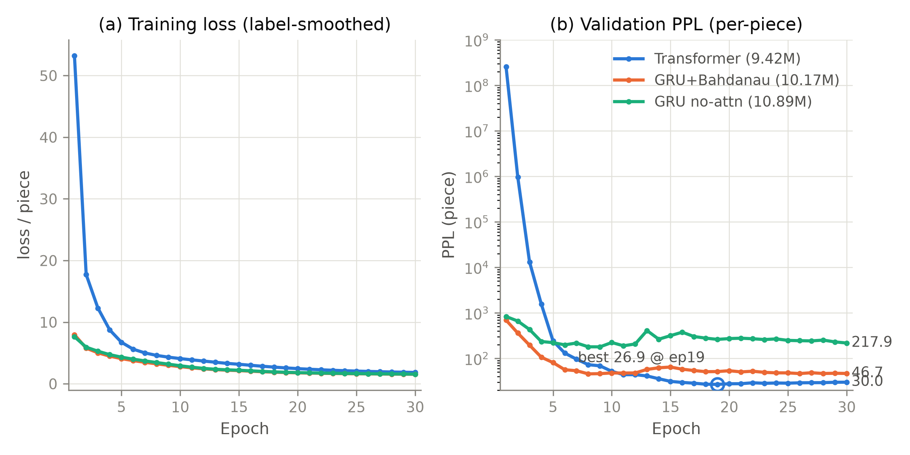
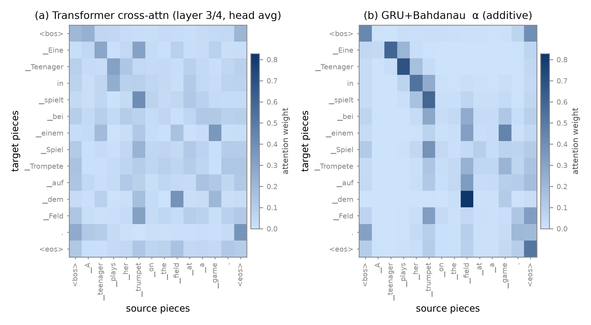
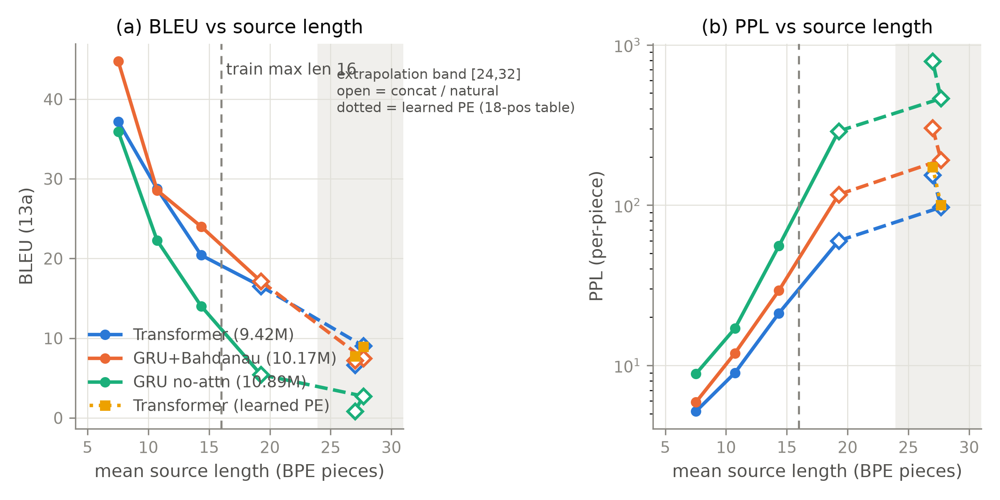

# 第 9 章 从零实现与小型翻译实验

## 9.0 开篇：从全书到这里

第 8 章收官时，机身与点火程序都已在手：第 7 章装好的整机立在桌上（63.1M 参数、三类掩码、与官方对拍 `allclose`），第 8 章把论文 §5 的配方还原成三块仪表——`NoamLR`、`label_smoothing_loss`、`beam_search`——并对它们说过一句话：「下一章的训练循环会把它们逐件装上」。但那一章开篇也泼了一盆冷水：配方里每个数字都是 8 张 P100、450 万句对的尺度上调出来的，缩到一台笔记本电脑上还灵不灵？现在到验货的时刻了。本章点火，让全书从「图纸与零件」翻页到「机器在转」。

旅程地图的「点火」段由此开始，本章要一口气走完 2017 年工作流的全流程：数据进来（Multi30K 小型英德语料、自训 BPE 词表）、机器缩尺寸上线（第 7 章整机的四个旋钮拧小）、三块仪表逐件装配、双对手同台（两个 GRU baseline——第 1 章那台旧机器在真实数据上的复活）、最后束搜索解码、按句长分桶评测、外推实测。三个预告先立此存照：其一，你会看到一条**可插拔的管线**——数据、模型、训练、解码四段首尾相接，第 10 章的消融实验只换其中一段；其二，GRU 双 baseline 会把第 1 章的容量墙从教科书预言变成自家曲线上的数字回声；其三，结果里有意外——小数据短句域上 2014 年的冠军组合反超了 2017 年的缩微新星，而评测过程中踩到的一个坑，会逼我们把「组批方式」也当成实验口径的一部分。

到本章结束，第 0 章承诺的「一台你自己造的翻译机」就真正跑起来了：从英语句子里进，德语译文里出，三个模型全流程在一台普通笔记本的 GPU 上约 20 分钟。随之冒出的新问题也有两串：这台机器的每个设计到底贡献了几分（第 10 章消融网格），以及「能跑」与「能比」之间隔着多少口径（本章表 9.3 先把账立起来）。

> **最小背景栏**（读懂本章所需的全部前置）
> - **已有知识**：第 2-6 章全部零件、第 7 章整机与掩码（式 (7.2) 的加法口径）、第 8 章三块仪表（式 (8.1)(8.3)(8.4)）与 BPE 直觉（8.4 节「高频词整存，低频词切碎」）、第 1 章的 seq2seq 架构与 BLEU 速览、第 4 章式 (4.3)(4.4) 的对齐矩阵。本章不再重复推导。
> - **工具即借用**：sentencepiece（自训分词器）、datasets（语料加载）、sacreBLEU（评测）三个工具当黑盒用，只讲 API 与口径，算法拆解全部留给下一册（9.1 节借用框）。
> - **Multi30K**：Flickr 图像英文描述及其人工德译构成的平行语料，本书用 bentrevett 镜像加载，train/validation/test = 29000/1014/1000 句对【证据等级：官方数据集（bentrevett/multi30k 镜像直读）】。
> - GRU 的门公式本章首次需要精确版（第 1 章只给了「传送带＋阀门」黑盒图），9.5 节就地补全。

## 9.1 工具链与数据合规：三只黑盒和一条红线

点火之前先备燃料，燃料分两半：语料与切词器。这两样本书都不从零造——2017 年的工程师也是站在现成工具上工作的，论文 §5.1 自己就写着「句子用字节对编码 [3] 编码」：BPE 是别人的发明，他们是使用者。本书同样只做使用者，三个工具各给一张使用说明，算法债记在章末欠账框。

> **【借用框】** 三个工具的「会用即可」说明（算法拆解 → Book2 第 2 章）：
> - **sentencepiece**（自训分词器）：三步走——`SentencePieceTrainer.train(input=语料文件, vocab_size=8000, model_type="bpe")` 训出 `.model`；`sp.encode(句子)` 得子词序列（`out_type=int` 给 id）；`sp.decode`/`id_to_piece` 反向还原。特殊符号的 id 在训练时显式指定（本书 PAD/UNK/SOS/EOS = 0/1/2/3，句首标记在代码里记作 `SOS`，与第 1 章的 `<bos>` 同义）。
> - **datasets**（语料加载）：`load_dataset("bentrevett/multi30k")` 一行拉下三个切分，jsonl 原生、无加载脚本。
> - **sacreBLEU**（评测）：`corpus_bleu(假设列表, [参考列表], tokenize="13a")` 返回 0—100 的语料级 BLEU；`tokenize` 是它的口径旋钮——"13a" 与 "none" 的区别 9.6 节会亲手量出来。
> 三个 API 之外一概不用；本章绝不深入它们的内部。

第二件事是一条合规红线，写进书里是为了让复现路径可信。Multi30K 的许可是 CC BY-NC-SA（署名-非商业-相同方式共享）：语料本身、自训出的 BPE 词表、训好的 checkpoint，全部属于它的衍生产物。本书的处理分三条：数据与一切产物只落工作区 `log/` 目录、不入 git 仓库；不分发 checkpoint——丛书规范里「提供 checkpoint 下载」的条款，本书以「完整训练 ≤10 分钟（MPS，一台笔记本）」替代，任何人都能从原始语料出发、按固定种子复现出同口径的模型与数字，这比下载一个二进制文件更符合这本书的立场（显式取舍，记录在案）；正文引用的语料数字（29000/1014/1000）只到统计层面，不摘录原文内容。顺带一句工具链层面的诚实声明：本书用 bentrevett 镜像而非官方渠道下载数据，复现时若镜像变动，任何一份同内容的 Multi30K 副本都等效——词表与数字可能因下载切分微差而漂移，属可接受口径。

## 9.2 数据管道：把两万九千句对喂进机器

语料到手只是第一步，机器吃不了字符串——从原始句对到可训练的张量批次，中间隔着一段常被教程略过的管道工程。本节把这段管道走一遍，它有两个决定后文一切的口径选择（词表与长度上限），也有两处只有亲手跑过才遇得到的坑。

先看切词。第 8 章 8.4 节讲过 BPE 的直觉——「高频词整存，低频词切碎」，并预告过本书的实测切分；现在兑现。用 sentencepiece 在 Multi30K 训练集上自训一张 **shared BPE-8k 词表**：英德两种语言的全部句子（训练集 29000 对的 58000 行）写进同一份语料文件、训出**一张**两语言共用的表——这是论文 §5.1 的 37k 共享词表（源与目标同表）的缩小版，也是第 7 章 7.1 节三处权重共享能成立的前提（两侧查同一张表，输出投影才能转置同一张表）。训练只要 0.2 秒【证据等级：本书实验（CPU，2026-10，[`code/ch09/data.py`](code/ch09/data.py) 复跑）】。切出来的样子，两个真实的词最有说服力：

- `Nähe`（附近）→ `▁ / N / ähe`——低频词切成三片，拼回来原样；
- `Büsche`（灌木丛）→ `▁Bü / sche`——稍常见的词切两片。

`▁` 是 sentencepiece 的空格记号（词首标记），还原时替换回空格即可。8k 的词表把未登录率压到什么程度？训练集口径：unk 率约 1.9%，平均约 3.7 个字符挤在一个 piece 里【证据等级：本书实验（2026-10，README 参考数字；复跑以 `data.py` 为准）】——第 8 章那句「词表只有 8000 就把 unk 率压到约 1.9%」的伏笔在此落账。对比第 1 章前史：Sutskever 的源端词表 160,000 也免不了 UNK 进账，Cho 框架 30,000 词表；子词用 8k 换来了更低的未登录率，这就是「切碎高频存整」的收益。词表大小本身是口径：论文 37k、t2t 复现 32k、本书 8k——三家的 BLEU 绝对值从源头就不可比（表 9.3 收拢）。

第二个口径选择更关键：**训练句长上限 $L=16$ 个 piece**。做法是**双侧内容过滤**（源句与参考译文的 piece 数都 ≤16 才保留），不是截断——截断会教机器学「翻译半句话」，过滤保证每对都是完整句。29000 对留下 17555 对（60.5%），被滤掉的四成是长句【证据等级：本书实验（`data.py` 复跑）】。为什么砍掉四成数据？两个理由都光明正大：其一，小模型配小算力，$L\le16$ 让一个 epoch 稳定在 7.5 秒（MPS），完整训练 10 分钟内跑完，读者的复现门槛降到「一杯咖啡」；其二，这个 $L$ 同时是第 5 章外推承诺的基准线——训练最大长度 16，外推实验就在它的 1.5—2 倍（24—32 piece）上做（9.6 节）。代价也如实记下：过滤后的训练分布比原始 Multi30K 更偏短句，模型对长句的经验全部来自这 60.5% 里相对较长的尾巴。

然后是批处理，两处踩坑实录都发生在这里。变长句要拼成矩形张量，就得**动态填充**（dynamic padding）：每批 64 句补齐到批内最长句，批与批长度不同。`data.py` 的 `batches()` 是这一步的落点：它取批内**两侧**最长的 id 序列长度 $m$ 作统一宽度（$m\le 18$ = 内容 $\le 16$ + SOS/EOS），产出源批 `src` $(64,m)$ 与目标批 `tgt` $(64,m)$ 两个同宽矩形——训练循环随后从 $(64,m)$ 的 `tgt` 上错位切出输入侧 `tgt[:, :-1]` $(64,m{-}1)$ 与标签侧 `tgt[:, 1:]` $(64,m{-}1)$（9.4 节，表 9.1 第 2 行）。第一坑：补 pad 必须在 list 层做完再 `torch.tensor` 一次性成张——如果先把长短句各自 tensor 化、再试图在张量层补宽，会触发设备间的拷贝与形状报错；正确姿势是 Python 列表先拼齐（`batches()` 内 `pad()` 的 `row + [PAD] * (m - len(row))`），一步成型。第二坑藏在损失函数里：`tgt[:, 1:]` 这类切片拿到的张量不保证内存连续，`.view` 展平会报错，必须用 `.reshape`（[`code/ch09/train.py`](code/ch09/train.py#L42) 的 `label_smoothing_loss()` 里那行展平）。两坑都不深奥，但都是「跑起来才知道」的工程现实——教程里的优雅代码与能跑的代码之间，隔着一层张量内存布局。

批的构造还有一个论文口径的偏离，先挂账。论文 §5.1 的批按**词元数**计（约 25000 源词元 + 25000 目标词元），并且**按近似句长分桶**组批；本书用「batch 64 句、随机混批、动态填充」的简化口径——差距看似只是工程细节，9.6 节会看到它对一个模型是 11.5 BLEU 的深渊。此处先把事实立住：本书每批约 744 个源 piece（64 句 × 平均 11.62 piece），论文每批约 25000 源词元，相差三十多倍——小账本再次提醒我们，照抄配方与照抄尺度是两回事。

## 9.3 组装与缩尺寸：代码线在此合龙

燃料备好，轮到机器。第 7 章装好的整机（整机粗图见导览 0.3 节，双塔结构见第 4 章图 4.1）在 [`code/ch07/transformer.py`](code/ch07/transformer.py)；本章的 [`code/ch09/model.py`](code/ch09/model.py) 是它在点火台上的就位版本——结构上一处未改，只把四个尺寸旋钮拧小。先核对「一处未改」的清单，这台缩微机是不是原汁原味，读者应当能逐项打勾：post-LN 摆位（残差求和后归一化，式 (6.4)）✓；正弦位置编码（式 (5.1)(5.2)，按需生成、零参数）✓；双塔三注意力（编码器双向自注意、解码器因果自注意 + 交叉注意力）✓；FFN = ReLU 两层（式 (6.1)）✓；dropout 恰好两处布点（子层输出 + embedding 与 PE 之和，§5.4）✓；三处权重共享（编码器输入、解码器输入、pre-softmax 输出共用一张嵌入表，式 (7.1)）✓；注意力手写 matmul + softmax（式 (2.1)，掩码按式 (7.2) 的加法口径叠加）✓。清单之外，唯一的新代码是解码接口：`encode()` 把源句 id 批 $(B,S)$ 压成 memory $(B,S,256)$ 与填充掩码 $(B,1,1,S)$，`decode_step(state, ys)` 给定整段前缀 $(B,t)$ 返回最后一步的 logits $(B,8000)$——贪心与束搜索共用这一条路（GRU 双 baseline 也实现同一接口，9.5 节的两个模型因此能插进同一条管线）。

尺寸旋钮拧了四个：层数 $N$ 6→4、宽度 $d_{model}$ 512→256、FFN 宽度 $d_{ff}$ 2048→1024、词表 37k→8k；头数 $h=8$ 保持不变，于是每头维度 $d_k$ 从 64 顺带到 32——缩的是宽度，不是拓扑：批 64 的前向里打分矩阵仍是 $(64,8,n,m)$ 的同构形状（第 2 章那笔 $O(n^2)$ 账只是换了刻度），FFN 的扩展率保持 4:1（$256\to1024\to256$）。配方侧一个数字都不动：warmup 4000、$\epsilon_{ls}=0.1$、$P_{drop}=0.1$、beam 4、$\alpha=0.6$ 照抄 §5——第 8 章留的悬念「缩到笔记本尺度还灵不灵」，答案的第一重保险就藏在式 (8.1)：峰值学习率 $\propto d_{model}^{-0.5}$，宽度减半自动把峰值从 $6.99\times10^{-4}$ 抬到 $9.9\times10^{-4}$，第 8 章 8.1 节的预告在此兑现，配方自己适配了缩尺寸。

拧完旋钮称一次重，账本习惯（第 7 章 7.4 节）不能丢。逐张量 `numel` 实数【证据等级：本书实验（`model.py` 复跑）】：注意力家族 12 个子层（编码 4 + 解码自注意 4 + 交叉 4）每个 263,168，合计 3.16M（占非嵌入 42.9%）；FFN 家族 8 个每个 525,568，合计 4.20M（57.0%）；LayerNorm 20 枚合计仅 10,240（0.14%）；非嵌入主体共 **7.37M**。三处共享的嵌入表 8000×256 = 2.05M 只数一份，整机 **9.42M**——是 base 63.1M 的约 1/6.7。家族占比与 base 有意差：FFN 依旧第一大户，但嵌入份额从 30.0% 缩到 21.7%——词表砍得比宽度狠，嵌入账本的缩水更快。把零件放回整机图景说一句：此刻在第 2-6 章亲手造的每一个零件——缩放点积、多头拆装、正弦编码、残差与 post-LN——正同时在同一块 GPU 上转动，这台 9.42M 的机器与那台 63.1M 的机器是**同一张图纸的两个尺度**。

## 9.4 训练循环：三块仪表上机

机器、燃料就位，训练循环只剩「把第 8 章的三块仪表装上去」。`train.py` 的 `run_epoch()` 骨架一个 epoch 只有一句话：教师强制喂入（`src` $(64,m)$ 与右移一位的 `tgt[:, :-1]` $(64,m{-}1)$ 进机器，logits $(64,m{-}1,8000)$ 对 `tgt[:, 1:]` $(64,m{-}1)$ 计损失——第 1 章 1.1 节的两种运转模式之一，第 7 章 7.1 节的整机输入契约在此执行）→ `label_smoothing_loss`（式 (8.3) 的应用版，多一层 pad 位掩蔽：填充不计损失）→ 反传 → `NoamLR.step()`（式 (8.1) 的应用版：先改 `param_groups` 的学习率、再 `opt.step()`，与第 8 章教学版九个步点逐点全等，对拍记录在 8.1 节）→ Adam（$\beta_2=0.98$、$\epsilon=10^{-9}$，§5.3 的两颗偏离库缺省的螺丝，照拧）。因果掩码与填充掩码的组合在机器内部按式 (7.2) 叠加，循环本身无需知道掩码的存在——装配线把脏活干在了前面。

骨架念完，把这一步训练的形状从头到尾走一遍。第 6 章表 6.3 用 base 配置走了 batch=1 的一条 token，第 7 章核了整机前向与掩码的形状口径；表 9.1 把口径换成真实训练管线——batch 64、动态填充的 $m$、shared BPE-8k——并往两头延伸：前头是批构造，后头是损失（pad 掩蔽到标量）与解码接口（推理侧的束状态），端到端一张表：

| 步骤 | 运算 | 输入形状 | 输出形状 | 说明 |
|---|---|---|---|---|
| 1 批构造 | `batches()` 批内动态填充 | 64 个变长 id 序列 | src $(64,m)$、tgt $(64,m)$ | $m$ = 批内最长 id 长（含 SOS/EOS），$m\le18$，批与批不同 |
| 2 教师强制切片 | `tgt[:, :-1]` / `tgt[:, 1:]` | tgt $(64,m)$ | tgt_in $(64,m{-}1)$、tgt_out $(64,m{-}1)$ | 同一句错位切出输入侧与标签侧 |
| 3 源端嵌入 | 查表 ×√256、+正弦 PE、dropout | src $(64,m)$ | $(64,m,256)$ | 三处共享的嵌入表（式 (7.1)） |
| 4 编码器 ×4 | 双向自注意 + FFN，各层同构 | $(64,m,256)$ | memory $(64,m,256)$ | scores $(64,8,m,m)$、FFN 鼓包 $(64,m,1024)$；填充掩码 $(64,1,1,m)$；每层进出同形 |
| 5 目标端嵌入 | 查表 ×√256、+PE | tgt_in $(64,m{-}1)$ | $(64,m{-}1,256)$ | 右移一位的前缀（SOS 起头） |
| 6 掩码自注意 ×4 | $QK^{\top}$：$(64,8,m{-}1,32)\times(64,8,m{-}1,32)$ | Q/K/V $(64,8,m{-}1,32)$ | scores $(64,8,m{-}1,m{-}1)$ → 子层出 $(64,m{-}1,256)$ | 因果 ∪ 填充组合掩码（式 (7.2)） |
| 7 交叉注意 ×4 | $QK^{\top}$ 再乘 $V$ | Q $(64,8,m{-}1,32)$；K/V $(64,8,m,32)$（自 memory） | scores $(64,8,m{-}1,m)$ → 子层出 $(64,m{-}1,256)$ | 查询来自解码器、键值来自编码器 |
| 8 FFN ×4 | $256\to1024\to256$ | $(64,m{-}1,256)$ | $(64,m{-}1,1024)\to(64,m{-}1,256)$ | 逐位置鼓包收回（式 (6.1)） |
| 9 输出投影 | 右乘共享嵌入转置 $E^{\top}$ | $(64,m{-}1,256)$ | logits $(64,m{-}1,8000)$ | $m{-}1\le17$；式 (7.1) 的第三处共享 |
| 10 损失 | `label_smoothing_loss` + pad 掩蔽 | logits $(64,m{-}1,8000)$、tgt_out $(64,m{-}1)$ | 每位损失 $(64,m{-}1)$ → 标量 | 填充位不计；展平用 `.reshape`（9.2 节第二坑） |
| 11 解码接口（推理侧） | `decode_step` 整段重算取末位 | ys $(B',t)$ | $(B',8000)$ | 贪心 $B'{=}64$；beam $B'{=}64\times4$；无缓存 |
| 12 束状态 | `beam_search` 沿 batch 复制 k=4 份 | memory $(64,S,256)$、掩码 $(64,1,1,S)$ | memory $(256,S,256)$；活路 ys $(256,t)$、累积 logP $(64,4)$ | 每句 4 束共用同一源；束内长度同步增长 |

表 9.1 一步训练（含解码接口）的形状流转表（自排；口径：batch 64、动态填充 $m$、shared BPE-8k、缩微配置 $d_{model}{=}256$/$h{=}8$/$d_k{=}32$/$N{=}4$；与第 6 章表 6.3 的 base/单句口径互为印证，代码对应 `data.py` 的 `batches()`、`model.py` 的 `forward()`/`decode_step()`、`train.py` 的 `label_smoothing_loss()`、`decode.py` 的 `beam_search()`）

读这张表，第 6 章立下的三条数据流不变量在缩微机上原样成立：主干等宽（除 logits 外末维恒 256）、scores 行=查询长/列=键值长（第 6、7 两行的 $(m{-}1)\times(m{-}1)$ 与 $(m{-}1)\times m$）、逐位置算子不碰形状。真正的新变量只有两个：入口的 $m$ 随批浮动（第 1 行——动态填充的全部含义），出口的 8000 是词表而非宽度（第 9 行）。而第 10 行往下，是训练侧与推理侧的分岔：训练吃 $(64,m{-}1)$ 的整句、一次前向出全部位置；推理每步只要末位 $(B',8000)$、每出一个词元重算整段前缀——同一台机器的两种运转模式（第 1 章 1.1 节），形状表上看得见分岔点。

数字到手。30 epochs = 8250 步（17555 对 ÷ batch 64 = 275 步/epoch），MPS 上 7.5 秒/epoch、总 **224.6 秒**【证据等级：本书实验（M5 Pro/MPS，2026-10；复跑以 `log/Book1-ch09/transformer_log.json` 为准）】。折算 27 毫秒/步——与写作期探针的 43.5 毫秒/步（11.76M 档、未过滤语料）的差异是口径差异：本管线模型更小（9.42M）且句子更短（$L\le16$），两个口径都对，引用时须注明【证据等级：本书实验 + notes/01 探针】。验证曲线（图 9.1 右）：PPL(piece) 从第 1 epoch 的 $2.6\times10^{8}$ 一路俯冲，epoch 19 到最优 **26.9**，之后轻度过拟合、末 epoch 回到 30.0——17,555 句对喂 9.42M 参数，过拟合是诚实的物理，论文尺度（450 万句对）没有这个烦恼；本书不做 checkpoint 挑选、不做参数平均，主表一律取末 epoch（Table 3 消融同款口径，表 9.3 收拢）。



图 9.1 三模型训练曲线（自产，本书实验）：(a) 训练损失（label-smoothed、每 piece）与 (b) 验证 PPL（per-piece 口径、对数轴），均 30 epochs。蓝色 Transformer 的「高开—俯冲」是 warmup 的签名（第 1 epoch 末学习率才 $6.8\times10^{-5}$，前 4000 步占全部 8250 步的近半）；空心圆标出其最优验证点（epoch 19，PPL 26.9）。数字与 `log/Book1-ch09/*_log.json` 同源

与论文的算力对照值得摆一次。论文 base：8×P100、每步 0.4 秒、10 万步、共 12 小时（论文 §5.2）【证据等级：官方论文 v7 §5.2】；本书：单块笔记本 GPU、27 毫秒/步、8250 步、共 224.6 秒。每步快 15 倍不等于效率高 15 倍——论文每步约 5 万个词元的预算，本书每步约 1500 个 piece，差三十多倍；总训练词元量差约 400 倍，数据差 256 倍（450 万对 17,555 对），模型差 6.7 倍。这本账的读法是：**缩微复现验证的是「结构与配方在低配尺度上仍然成立」，不是「我们用更少算力逼近了 28.4 BLEU」**——绝对值不可比，可比的只有方向与结构（第 10 章的判据将建立在这一点上）。

## 9.5 GRU 双 baseline：旧机器复活，公平对照

新机器有了，还缺对照组。第 1 章 1.6 节许诺过：要在真实数据上复活 GRU 双 baseline，把玩具实验里的容量墙升级为活体展示。两个 baseline 一负一正：无注意力的 RNN 编码器-解码器（第 1 章那台旧机器本体，瓶颈活体）与 Bahdanau 加性注意力版（1.3 节的补丁，缓解活体）。动工前先还一笔旧账——第 1 章把循环单元当「传送带＋阀门」黑盒用了全章，门公式欠到现在。

GRU 的精确机制只需三行式。设第 $t$ 步输入为 $x_t$（当前词的嵌入等外部信号），上一刻记忆为 $h_{t-1}$：

$$
\begin{aligned}
z_t &= \sigma\!\left(W_z x_t + U_z h_{t-1}\right) & &\text{更新门}\\
r_t &= \sigma\!\left(W_r x_t + U_r h_{t-1}\right) & &\text{重置门}\\
\tilde{h}_t &= \tanh\!\left(W x_t + U\left(r_t \odot h_{t-1}\right)\right) & &\text{候选记忆}\\
h_t &= (1-z_t)\odot h_{t-1} + z_t\odot \tilde{h}_t & &\text{记忆更新}
\end{aligned}
\tag{9.1}
$$

| 符号 | 含义 | 形状 |
|---|---|---|
| $x_t$ | 该步外部输入（本书实现：目标词嵌入，或与上下文向量拼接，见本节两版结构） | $\mathbb{R}^{d_x}$（批式 $(B,d_x)$） |
| $h_{t-1}$ | 上一刻记忆（隐状态） | $\mathbb{R}^{d_h}$（批式 $(B,d_h)$） |
| $z_t, r_t$ | 更新门 / 重置门，$\sigma$ 输出 $(0,1)$ | $\mathbb{R}^{d_h}$ |
| $\tilde{h}_t$ | 候选记忆（新内容） | $\mathbb{R}^{d_h}$ |
| $h_t$ | 该步后的记忆（隐状态） | $\mathbb{R}^{d_h}$ |
| $W_\bullet, U_\bullet$ | 各式的输入权重 / 记忆权重（候选式一行的 $W,U$ 无下标） | $W\in\mathbb{R}^{d_h\times d_x}$、$U\in\mathbb{R}^{d_h\times d_h}$ |
| $\odot$ | 逐元素乘 | — |

用人话说：传送带上驮着旧记忆 $h_{t-1}$。重置门 $r_t$ 决定「写新内容时参考多少旧记忆」（凑近 0 就当旧记忆不存在，等于清空重来）；更新门 $z_t$ 是传送带的速度计——$z_t$ 大就大步换新货 $\tilde{h}_t$，小就几乎原地不动。两道门的开度都是学出来的，信号既看新输入也看旧记忆。式 (9.1) 与第 1 章的「传送带＋阀门」逐一对上：$r$ 是写入门、$z$ 是保留门（LSTM 三门里省掉了独立的读出门）【证据等级：官方论文 Cho et al., arXiv:1406.1078】。（记法注：各式含偏置项，从简略略去。）

两个 baseline 的结构照第 1 章的图搭建。**无注意力版**：单向 GRU 编码器读完全句，末步隐状态 $h_{T_x}$（隐宽 $d_h{=}896$，批式 $(64,896)$）就是那只箱子 $c$——它既当解码器的初始状态（$s_0=c$，Sutskever 接法），又拼进解码器每一步的输入（$[\,y_{t-1}$ 嵌入 $(64,256)\,;\,c\,]$ 拼成 $(64,1152)$，Cho 接法）：第 1 章 1.1 节说好的「桥的两种接法」在实现里叠加使用，桥的唯一性不变。**Bahdanau 版**：双向 GRU 编码器（每向隐宽 576，每个源位置的标注 $h_j$ 是前向与后向隐状态的拼接，$(64,S,1152)$，1.3 节），解码每步按式 (4.4) 的加性打分算 $\alpha_{ij}$（打分表 $(64,S)$——注意它没有 $(B,h,n,m)$ 那样的头维，全模型只有一个注意力「头」）、按式 (1.3) 加权出这一步专属的 $c_i$（$(64,1152)$）——打分、softmax、加权三步与式 (4.3) 的缩放点积完全同构，只是打分器换了加性 MLP。两版都挂三处权重共享的输出投影（经一层适配对齐到 256 维嵌入，每步 $(64,896)$ 或 $(64,576)\to(64,256)\to$ logits $(64,8000)$），都吃 label smoothing 与 Noam 调度——它们不是稻草人，是「同一条流水线上换掉机器主体」的对照。

公平协议五条，一条不能少，否则对照就是自欺：① 同一张 shared BPE-8k 词表、同一嵌入维度 256；② 同一训练数据（17555 对）、同 batch 64、同 30 epochs——同 token 预算；③ 同优化器与调度（Adam $\beta_2{=}0.98$ + 式 (8.1)，$d$ 取 256）；④ 非嵌入参数对齐到同量级——无注意力版隐宽 896（非嵌入 8.84M）、Bahdanau 版双向 576（非嵌入 8.12M），对 Transformer 的 7.37M，三者同处 7—9M 档；⑤ 同推理协议（beam=4、$\alpha$=0.6，与 Transformer 走同一份 [`code/ch09/decode.py`](code/ch09/decode.py) 代码）。训练账【证据等级：本书实验（MPS，2026-10，[`code/ch09/gru_baseline.py`](code/ch09/gru_baseline.py) 复跑）】：无注意力版 8.4 秒/epoch、总 255.4 秒，末验证 PPL 217.9；Bahdanau 版 17.9 秒/epoch、总 537.4 秒，末验证 PPL 46.7。Bahdanau 慢 2.4 倍不是 bug，是第 1 章串行墙的账单：解码器逐步 attend 再转移，Python 循环一步一算，而 Transformer 的整个 epoch 是一摞大矩阵乘——墙没拆掉的时候，税就得照交。（一个诚实的口径注记：两个 GRU 的验证损失在混批下计算，批内填充对本节的末态 PPL 也有轻微影响，机理见 9.6 节的组批实录。）

三个模型都训完了，它们的注意力长什么样？图 9.2 把带注意力的两台真模型放进同一张对齐热图里——这是第 4 章 4.5 节合成任务热图预告过的「真模型升级」。例句选 test 集第 21 句：英语 "A teenager plays her trumpet on the field at a game"，德语参考把名词 Trompete（小号）甩到句中偏后、把 bei einem Spiel（在一场比赛）提前——非单调对齐，正是第 1 章图 1.3 那种「块内换位」的真语料版。



图 9.2 真翻译模型的对齐热图（自产，本书实验，test[21]；教师强制、目标侧取参考译文的 piece 序列）：(a) Transformer 第 3/4 解码层的交叉注意力（8 头平均）；(b) GRU+Bahdanau 的 $\alpha_{ij}$。两面板同一色标（0 到 Bahdanau 峰值），行=目标 piece、列=源 piece——两块矩阵同形 $(T,S)$（目标 piece 数 × 源 piece 数，每行 softmax 和为 1），蓝色越深权重越高。数字由 [`code/ch09/make_figures.py`](code/ch09/make_figures.py) 导出（`cross_attention_weights` / `attention_weights`）

两张热图对照着读，先看共性：两台模型都把「该看谁」学出来了——(b) 里 ▁dem ← ▁field（权重 0.83）、▁spielt ← ▁trumpet 一带的检索峰值清晰落在语义对应的源词上，Trompete 一行的换位结构肉眼可见；(a) 里同样能看到 ▁dem ← ▁field、▁bei ← ▁game 的对应。差异更有教学价值：**Bahdanau 的 $\alpha$ 尖锐（行峰值 0.5—0.8），Transformer 头平均后的交叉注意力明显摊平（峰值 0.15—0.44）**。摊平不是病，是两种书写的结构差异：Bahdanau 全模型只有这一个注意力，检索必须全部经由它，一张矩阵就得扛起全部对齐；Transformer 有 4 层 × 8 头共 32 场交叉注意力，对齐信息摊在各头各层里（第 3 章的「子空间分工」在真模型上的回声），「8 头平均」只是可视化的妥协，必然抹掉分工。读热图的两条纪律（第 4 章末立过）在此重申：头平均≠模型平均，注意力权重是相关不是因果。

## 9.6 解码与评测：束搜索、BLEU 口径与句长分桶

模型们训完，到了交卷时刻——但「交卷」本身也是一台机器：解码规程与评测口径。本节四步走：取译文（束搜索）、定义「译得好」（BLEU 正式公式与口径自证）、按句长分桶对读容量墙预言、实测外推承诺；中间会踩到本次实验最大的坑。

**解码。** beam=4、$\alpha=0.6$，第 8 章式 (8.4) 的长度惩罚原样上机（论文 §6.1 的解码配置）。`decode.py` 的 `beam_search()` 是批量张量版，束状态自带一小套形状账：`encode()` 的 state 先沿 batch 维复制 $k$ 份（memory $(64,S,256)\to(256,S,256)$，即 64 句 × 4 束装进同一个批）；活路序列 ys $(256,t)$ 步进增长，累积 logP 记在 $(64,4)$，每步在展平成 $(64,4\times8000)$ 的候选分里取 top-$2k$——「批」从训练侧的 64 句换成推理侧的 64 句 × 4 束（表 9.1 第 11—12 行）。实现要点只有一个，且第 8 章已证明过它：步内 $lp$ 人人相同，按原始 logP 剪枝与按惩罚分剪枝等价——长度惩罚只在候选定稿时参与排序。它与第 8 章教学版（3 句构造任务）及朴素逐句参考实现（200/200）的双重对拍均一致【证据等级：本书实验（CPU，2026-10）】。贪心即 $k=1$ 的同一条路（`greedy_decode()`）。每个新词元都重算整段前缀（`decode_step`：$(B',t)\to(B',8000)$，无缓存——第 7 章 7.4 节那笔重算账的活体），全 test 1000 句 beam 解码：Transformer 约 25 秒、GRU 无注意力约 15 秒（译文短、步数少）、Bahdanau 约 31 秒（逐步 Python 循环）【证据等级：本书实验（MPS，2026-10；README 25.7/14.9/31.0，复跑 25.6/14.7/31.2，机器浮动属正常）】。

**BLEU 的正式账。** 第 1 章只速览了 BLEU，正式公式欠到今天：

$$
\mathrm{BLEU}=\mathrm{BP}\cdot\exp\!\left(\frac{1}{4}\sum_{n=1}^{4}\log p_n\right),\qquad
\mathrm{BP}=\begin{cases}1, & c>r\\[2pt] e^{\,1-r/c}, & c\le r\end{cases}
\tag{9.2}
$$

| 符号 | 含义 | 形状 / 口径 |
|---|---|---|
| $p_n$ | 截断 n-gram 精确率：全部假设译文里 n-gram 的总命中数（同一参考 n-gram 至多匹配其出现次数——「截断」防复读机刷分）÷ n-gram 总数 | 标量 $\in(0,1]$；语料级累加，非逐句平均 |
| $c, r$ | 假设译文总长度 / 参考译文总长度 | 标量（整数）；词或 piece 数 |
| BP | 简短惩罚：译得比参考短就指数打折 | 标量；$c\ge r$ 时免罚 |

用人话说：拿 1-gram 到 4-gram 四把尺子量「译出来的片段有多少在参考里出现过」，四个精确率取几何平均（错一个就整体塌方，逼着四个尺度都及格），再乘一个防偷懒因子——译得越短越占便宜，BP 就是把这份便宜按长度差收回来。公式出自 Papineni et al. 2002【证据等级：官方论文（Papineni et al., ACL 2002）】。本书按式 (9.2) 手写了一份朴素实现（[`code/ch09/eval.py`](code/ch09/eval.py#L29) 的 `naive_corpus_bleu()` 里二十来行），与 sacreBLEU 的 `tokenize="none"` 口径对拍：**三模型逐位一致，差 0.0**【证据等级：本书实验（2026-10，`eval.py` 复跑）】——「会写 BLEU」的自证完成。而 "13a"（sacreBLEU 缺省，按国际惯例先切标点与转义再计）与 "none"（原样按空格切）的差：三模型分别 +1.19、+1.06、+1.50 BLEU——标点怎么切，值 1 个多 BLEU；「先核口径再谈数字」的第一课在此有了自家数字。

**三方对照，表 9.2 交卷**（beam=4、$\alpha$=0.6、全 test 1000 句、13a、按参考句词数分桶）：

| 模型 | 参数量 | BLEU(13a) | 桶 ≤7 词 (n=172) | 桶 8-13 词 (n=620) | 桶 ≥14 词 (n=208) | 贪心 BLEU | beam 解码 |
|---|---|---|---|---|---|---|---|
| Transformer | 9.42M | 21.87 | 23.73 | 24.38 | 14.79 | 20.63（+1.24） | ~25 s |
| GRU 无注意力† | 10.89M | 6.52† | 7.75† | 6.89† | 4.34† | 6.58（≈0） | ~15 s |
| GRU+Bahdanau | 10.17M | **23.56** | 23.92 | **26.71** | 15.40 | 22.22（+1.34） | ~31 s |

表 9.2 三方 BLEU 与解码时延对照，含按参考句词数的分桶（自产，本书实验：M5 Pro/MPS，2026-10；混批评测口径，†号见下文组批实录——该行数字含组批税，干净口径 18.03）。桶口径与第 1 章图 1.2 对读；贪心列为 beam 增益参照。数字与 `log/Book1-ch09/eval_*.json` 同源

表里第一眼的就是那个意外：**GRU+Bahdanau 23.56，反超 Transformer 1.69**。第 8 章末预告的容量墙回声就要在句长桶里等到数值了，但先得拆掉无注意力行那颗 † 号的雷。

**组批实录：6.52 是怎么来的。** 表 9.2 评测按数据集顺序混批解码（batch 64、批内动态填充）。复盘无注意力版的译文发现异常：平均译长只有 6.4 词（参考 10.9），满篇短胡言——与第 1 章玩具实验的「塌缩」形似而**机制对不上**：玩具里是装不下，这里的箱子（896 维）绰绰有余。真正的原因在批的形状里：填充掩码是注意力的特权（第 7 章式 (7.2) 往打分表上叠 $-\infty$，循环末态没有打分表可叠），无注意力 GRU 的末步隐状态 $h_{T_x}$ 是**吃完真实词元再吃一串 PAD 之后**的状态——训练侧 $L\le16$ 最多吃约 13 步 PAD、模型学会了容忍，混批评测侧批内最长句可达 50 piece，短句的箱子被三四十步 PAD 反复冲刷，早出训练分布。验证方式干脆利落：换成**按源句长排序组批**（批内填充最小化）重新解码全 test——这正是论文 §5.1 自己的组批口径（「按近似句长分桶」，2017 年的工程师早就踩过并绕开了这个坑）。同一模型、同一 beam、同一 1000 句，只换组批方式【证据等级：本书实验（MPS，2026-10，`log/Book1-ch09/batching_protocol_check.json`）】：Transformer 21.87 → 21.87、GRU+Bahdanau 23.56 → 23.56（两台带掩码，对批的形状免疫）；GRU 无注意力 6.52 → **18.03**——末态无掩码可贴，它在混批口径下付了 **11.5 BLEU 的「组批税」**；逐句变化数与译长明细（1/813/990 句、译长 6.39 → 9.94）见 9.8 动手验证。

这段实录留下三条。工程上，**组批方式是评测口径的一部分**——数字必须连同「怎么组批」一起报；架构上，掩码注意力「天生就有」（打分表可叠 $-\infty$）而循环结构「想贴没处贴」，贴不了的模型会被自己的批处理反噬；诚实条款上，表 9.2 的 † 行保留混批口径原值（官方参考数），但**后续讨论一律以干净口径 18.03 为准**——无注意力 GRU 的真实水平是 18.03，不是 6.52。

现在回到主问题：三台机器到底谁强。干净口径下的完整版图要用**按源句 piece 长度分桶**看——图 9.3 的六个桶（四个域内桶 + 两个外推桶），全部按长度同质组批解码（组批实录已验：组批方式动不了带掩码两台的语料结果；对无注意力版，这恰是干净口径）：



图 9.3 外推长度—BLEU/PPL 曲线（自产，本书实验，`make_figures.py`；分桶数字 `log/Book1-ch09/fig_9_3_data.json`）：横轴为各集源句平均 piece 长度（四条实线=域内天然句分桶 (1,8]/(8,12]/(12,16]/(16,24]，空心点=外推两口径：拼接对 286 对与天然长句 43 句，均值约 27.6 piece）；竖虚线=训练长度上限 $L=16$，灰带=外推带 [24,32]；黄色点线=学习式位置编码（ch10 网格 learned PE 行，18 位查表、超长截位）的同协议外推两点（9.6 节）。BLEU 用 13a，PPL 为 per-piece 口径（教师强制）

图 9.3 与第 1 章图 1.2 的双证对读，容量墙的回声在这张图上分三段。**短句段（桶 1）**：三台都体面——Bahdanau 44.75 领先，无注意力 GRU 35.93、Transformer 37.17 紧随。896 维的箱子装 7 个 piece 毫无压力——第 1 章 1.2 节反方证据（Sutskever「少于 35 词无退化」）的领域：**墙位随容量移动**，短句域把墙推到了视野之外。**中段（桶 2—4）**：无注意力版从 22.26 一路掉到 5.43，两台带注意力的机器还稳在 16—17 一线——差距在长度轴上稳步拉开，第 1 章的正方证据在此显形。**外推段（拼接/天然）**：三台都大滑坡，但形态不同——无注意力版崩到 2.73/0.83（译短胡言），两台注意力机腰斩但仍成句。PPL 面板是同一走势的另一只眼：教师强制下无注意力版的外推 PPL 飙到 463/790，Transformer 97/155，Bahdanau 191/304。

**反超的机理，与「什么时候该用哪个」。** 干净口径下的排序是：Bahdanau 23.56 > Transformer 21.87 > 无注意力 18.03（域内短句域 Bahdanau 几乎每个桶都小胜，图 9.3 首桶 +7.6 差距最大；超出训练长度后拼接口径 Transformer 反超回来，9.03 对 7.46，而 PPL 全线 Transformer 最低）。这不是复现失败，是一堂参数效率课。三角如下：**其一，归纳偏置与样本效率**——循环结构「沿时间传递、逐步压缩」的先验，天然匹配「短句、17,555 对」的低数据环境；Transformer 拆掉的正是这个先验（第 0 章「结构让位于数据」），代价是要用更多数据把先验学回来。**其二，数据量**——论文 Transformer 的战绩（EN-DE 27.3/28.4，论文 Table 2）站在 450 万句对上；数据缩 256 倍，先验贵的模型掉队更快。**其三，尺度与并行**——串行墙的税单就贴在本节：Bahdanau 训练慢 2.4 倍、解码最慢；数据再涨两个数量级，能并行的结构与能堆卡的算力才会合流（→ Book2 第 1 章）。所以判断力收成一句：**小数据、短序列、快速原型，RNN＋注意力仍是体面的起点；大数据、长序列、可并行、可规模化，Transformer**。反超 +1.69 的显著性（单种子）留到第 10 章多种子网格再正式裁定——本节的结论只主张「在本域、本协议下成立」。

**外推实测：正弦 PE 的承诺，半兑现。** 第 5 章 5.5 节立此存照的那句 "may allow the model to extrapolate"——结构上可能（闭合公式无查表上限），经验上待检验。检验设计：训练 $L{=}16$ 的模型**不重训**，在 1.5L—2L 的 band=[24,32] piece 上评测；Multi30K 天然句长够不到 2L（p99≈22 piece），外推主体用**拼接对**构造（测试集不相交两两拼接，286 对），另收 43 句天然长句分开口径报数。结果【证据等级：本书实验（MPS，2026-10，`extrap_transformer.json`）】：域内测试 PPL 25.4 → 外推拼接 97.0；BLEU 21.87 → **9.03**（拼接）/ 6.62（天然，n=43 小样本）。两半都真：**「能前向」兑现了**——正弦 PE 零新参数，同一台机器直接吃下 2 倍长度的输入、译出成句的德语（「腰斩但成句」）；**「译得好」没有白送**——BLEU 腰斩，PPL 翻近 4 倍，训练长度外的低频维相位是模型没见过的世界（第 5 章 5.5 节的低频维爬坡分析在此落地）。对照组让结论更立体：无注意力 GRU 塌成短胡言——箱子在长句上彻底失守；Bahdanau 意外地稳（7.46/7.19），逐步检索的 RNN 在长输入上没有位置编码的外推负担。第 5 章预告的「正弦 vs 学习式并排」在此收口：正弦侧 9.03/6.62（半兑现）；学习式同协议补测 **8.92/7.73**、PPL 100/173【证据等级：本书实验（MPS，2026-10，`log/Book1-ch10/learnedpe_extrap.json`）】——它的 18 位查表在超长输入上只能截位复用末位向量（外推集里 39% 的位置共享同一个位置指纹），崩法与正弦不同源（机理见第 10 章 10.4）；但在这个 1.5—2 倍的小带上，两者伤得一样重（图 9.3 黄点线）——真正的长任务分歧仍挂 F6（→ Book3 第 7 章）。

最后把所有口径差异收进表 9.3 的声明清单——这是本章与论文数字之间的「不可比性清单」，也是第 10 章报消融前的立规：

| 项 | 论文 base | 本书缩微版 | 影响 |
|---|---|---|---|
| 训练数据 | WMT'14 EN-DE 约 450 万句对 | Multi30K 17555 对（L≤16 过滤） | 256 倍数据差；短句域偏置 |
| 词表 | 37k shared BPE | 8k shared BPE（自训） | 嵌入与 softmax 规模、unk 率口径 |
| 批构造 | ~25000+25000 词元/批，按句长分桶 | batch 64 句、随机混批、动态填充 | 每步预算差 30 余倍；组批口径对无掩码 RNN 敏感（上文组批实录） |
| 训练量 | 10 万步 / 12 h / 8×P100（0.4 s/步） | 8250 步 / 224.6 s / 单 GPU（27 ms/步） | 总词元预算差约 400 倍 |
| checkpoint | base 推理用 last-5 平均 | 一律末 epoch，不平均不挑选 | Table 3 消融同款口径 |
| 评测 | newstest2014（BLEU 28.4） | Multi30K test 1000 句 | 数据域不同，绝对值不可比 |
| PPL 口径 | per-wordpiece | per-wordpiece（同） | 勿与 per-word 混比（Table 3 表题警示） |

表 9.3 本书缩微实验与论文 base 的口径差异声明（自排；论文侧【证据等级：官方论文 v7 §5.1/§5.2/Table 2/§6.1】）。结论一句：两套数字只有结构与方向可比——第 10 章的判据（方向级、$\max(2\sigma, 0.5)$）建立在这张表上

## 9.7 本章小结

开篇立的三件事，逐一交卷。管线：数据（Multi30K、shared BPE-8k、L=16 过滤、动态填充）→ 模型（9.42M 缩微整机，结构零改动清单逐项打勾）→ 训练（三块仪表上机，8250 步 224.6 秒，PPL 最优 26.9）→ 解码评测（beam=4/α=0.6，BLEU 三口径自证，句长分桶，外推实测）——四段首尾相接、各自可插拔，第 10 章的消融网格将只替换「模型」段反复跑这条线。双 baseline：公平协议五条下的对照干净落地，无注意力版的「塌缩」在复盘后拆成了两半——11.5 BLEU 是组批税（循环末态吃 PAD、无掩码可贴），剩下的才是容量墙本尊（图 9.3 的长度轴上从 35.93 掉到 2.73）。意外结果：Bahdanau 反超 +1.69 且协议稳健（两种组批都 23.56），机理归于小数据短句域的归纳偏置优势；正弦 PE 的外推承诺半兑现——零新参数前向 2 倍长度、成句但腰斩（9.03）。

**带走的心智**：数字全部还回去之后，请把这三件留下。**第一，管线思维**：任何序列生成实验都是「数据—模型—训练—解码」四段插头的组合，出了问题先定位段落，再查口径——本章最大的一个数字反转（6.52 对 18.03）不是发生在模型或训练里，而是发生在最不起眼的「怎么组批」里；从此你报任何评测数字，都会条件反射地附上协议。**第二，公平对照是一门手艺**：同词表、同预算、同调度、参数对齐、同解码——五条缺一，胜负就无效；而对照的目的不是排名，是归因——「反超」教给我们的不是 GRU 更好，而是「先验、数据量、尺度」三股力量怎么在不同地形上换位。**第三，承诺要拿实验收口**：正弦 PE 那句 may allow，第 5 章立此存照，本章实测半兑现——结构上「能前向」与经验上「译得好」是两个命题，论文里一个 may 字隔着的世界，我们亲手量过了。

点火段的第一站完成：机器转起来了，第 1 章的两堵墙都有了真实数据上的形状（容量墙在长度轴上显形，串行墙在 Bahdanau 的 2.4 倍训练税与解码重算账里显形）。但「跑通」还不等于「证毕」：三块仪表的每个配方项、每个结构件，各自贡献了几分 BLEU？现在这台机器成了一台测量仪器——下一章换着零件跑网格，把第 2-8 章的每个设计选择逐一送进消融实验，用 $\max(2\sigma, 0.5)$ 的判据与论文 Table 3 对表。

> **【欠账】** **BPE 黑盒的算例（F7 强化）**——本章把切分器当黑盒用了第三次（调用、切分演示、unk 率口径），攒下的数字可以当下一册的开箱算例：0.2 秒训出 8k 词表、压缩率约 3.7 字符/piece、unk 率约 1.9%、`Nähe→▁/N/ähe` 的切分路径——BPE 词表怎么从语料里「长」出来、这些数怎么算，→ Book2 第 2 章
>
> **【欠账】推理时 K/V 的账（F4 预热）**——本章解码全程「每个新词元重算整段前缀」：1000 句 beam 解码约 25 秒里，大头是把同样的前缀算了一遍又一遍。哪些计算其实可以缓存不重算、这笔账在推理时代怎么反超参数账本成为显存主项——2017 年的 K 与 V 还同源同体，拆开存放是后话。→ Book3 第 6 章

## 9.8 动手验证

- **入口命令**（先 `source env.sh`；Multi30K 首次运行需联网下载，产物落 `log/Book1-ch09/`）：
  ```bash
  source env.sh
  python "[`code/ch09/data.py`](code/ch09/data.py)"                                    # 数据冒烟（BPE/分布/过滤/一批形状，约 1 分钟）
  python "[`code/ch09/train.py`](code/ch09/train.py)" --device mps --epochs 10          # fast 档：约 2-3 min，出曲线与小样例
  python "[`code/ch09/train.py`](code/ch09/train.py)" --device mps --epochs 30          # full 档：约 10 min（CPU 约 6 倍）
  python "[`code/ch09/gru_baseline.py`](code/ch09/gru_baseline.py)" --variant both --device mps --epochs 30   # 双 baseline 约 13 min
  python "[`code/ch09/decode.py`](code/ch09/decode.py)" --ckpt transformer --n 5          # 解码冒烟：贪心 vs beam 对照
  python "[`code/ch09/eval.py`](code/ch09/eval.py)" --compare --greedy                 # 三方对照（表 9.2）
  python "[`code/ch09/eval.py`](code/ch09/eval.py)" --ckpt transformer --extrap        # 外推实测（另两 tag 同法）
  python "[`code/ch09/eval.py`](code/ch09/eval.py)" --ckpt gru_noattn --sort-by-len    # 组批对照（9.6 组批税实录，约 30 s）
  python "[`code/ch10/ablation.py`](code/ch10/ablation.py)" --extrap-learnedpe             # 学习式 PE 外推补测（图 9.3 黄点线，约 1 min）
  python "[`code/ch09/make_figures.py`](code/ch09/make_figures.py)" --figs 1,2,3               # 图 9.1/9.2/9.3（图 9.3 约 2 min）
  ```
- **预期产出**（固定种子 2017；M5 Pro/MPS 实测，秒数随机器浮动）：①数据：句对 29000/1014/1000，BPE-8k 训练 0.2 s，L=16 保留 17555（60.5%）；②训练：Transformer 9.42M / 7.5 s/epoch / 总 224.6 s，val PPL 最优 26.9（ep19）末 30.0；GRU 双 baseline 8.4 与 17.9 s/epoch（255.4/537.4 s），末 PPL 217.9/46.7；③评测：BLEU(13a) 21.87 / 6.52 / 23.56，桶 ≤7/8-13/≥14 见表 9.2，手写朴素 BLEU 与 sacreBLEU(none) 三模型差 0.0，贪心 20.63/6.58/22.22；④外推：拼接 9.03/2.73/7.46、天然 6.62/0.83/7.19，PPL 97.0/462.6/191.1；学习式 PE 同协议补测（`log/Book1-ch10/learnedpe_extrap.json`，图 9.3 黄点线）拼接 8.92、天然 7.73，PPL 100.0/172.9；⑤组批对照（9.6 节实录；入口 `eval.py --ckpt <tag> --sort-by-len`，结果落各 `eval_<tag>.json` 的 `sorted_by_len` 块，总表 `log/Book1-ch09/batching_protocol_check.json`）：21.87→21.87（1 句变化）、23.56→23.56（813 句）、6.52→18.03（990 句，译长 6.39→9.94）。以上数字与 `log/Book1-ch09/*.json`、`log/Book1-ch10/learnedpe_extrap.json` 逐项对应，复跑一致。
- **验收点**：能把 `MAX_TRAIN_PIECES` 改成 12 重跑，先笔算保留率会降（更偏短句）、外推带将变为 [18,24]，再跑验证预测；能把无注意力版的隐宽从 896 改成 512，预测非嵌入参数量与公平协议第 ④ 条的破坏方式；能向同伴解释 6.52 与 18.03 的两个口径各来自哪段代码路径（`batches()` 的组批 vs RNN 末态无掩码）；能把 `beam` 改成 1 复跑评测，验证贪心列；能解释为什么图 9.3 的外推点要用空心标记、两个外推口径（拼接/天然）差在哪。
- **复现注意**：评测与外推默认 MPS（`--device cpu` 约 6 倍时长）；`make_figures.py --figs 3` 需三个 checkpoint 齐备（另加载 ch10 的 `grid_learnedpe_s0.pt` 画学习式外推两点）；混批与按源句长组批两种口径的对照（9.6 节实录）已入管线 CLI——`eval.py --ckpt <tag> --sort-by-len`，结果落 `eval_<tag>.json` 的 `sorted_by_len` 块（`batching_protocol_check.json` 的「运行」字段为三模型通用命令）。
