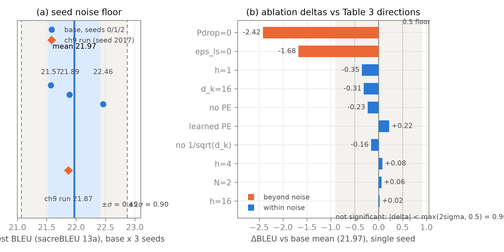

# 第 10 章 效果实证：趋势级复现与引用对照

## 10.0 开篇：从全书到这里

上一章，机器跑起来了。第 9 章结束时我们手里有：一台 9.42M 参数的 mini Transformer（第 7 章整机的缩尺寸版——整机粗图见导览 0.3 节，双塔结构见第 4 章图 4.1，结构零改动），在 Multi30K 上训完 30 个 epoch、束搜索解码拿到 21.87 BLEU；同预算的两位 GRU 对照（无注意力版混批口径 6.52、组批税后干净口径 18.03，见 9.6；Bahdanau 版 23.56 反超）；按句长分桶的评测与超出训练长度 1.5–2 倍的外推实测（半兑现：能前向、译不好）。机器会跑了——但它是作为**一台整机**跑起来的。第 2 到第 6 章装上去的每个零件，八份投影的多头、零参数的正弦位置编码、那一次除以 $\sqrt{d_k}$、0.1 的 dropout、0.1 的 label smoothing，到底各值多少分？我们此前引用的都是论文的成绩单（第 3 章表 3.2 的 (A)(B) 行、第 5 章的 (E) 行、第 8 章的 (D) 行）——那是 450 万句对的 WMT14、65M 参数、8 张 P100 上的数字。我们这台机器在数据、参数、算力三个维度各小了一到三个数量级，零件的贡献还是那些吗？

本章要回答的就是这个验货问题，分两条线走。第一条线向上读：论文的结果表（Table 2/3/4）本身就是一门「怎么读表」的手艺——数字怎么核口径、成本列怎么自检、连论文自己都在版本间改数字的坑怎么避。第二条线向内测：把自己的消融（ablation）网格跑完——13 个配置、7 条方向判据、一张命中表——把全书从第 0 章就立的证据等级制度完整演练一遍。结束时我们会到达「点火」段的终点：机器的每个零件都有了自己的分数；同时会冒出一批新问题——预测「该崩」的没崩、预测「该差」的不差，这些「意外」恰恰是下一章欠账地图的原料。

三个看点先挂出来：论文数字怎么读（41.8 与 41.0 的双口径、ConvS2S 的版本漂移）；我们的网格与命中表（三条命中、四条未命中——未命中才是本章灵魂）；以及两个意外（无位置编码竟然不崩、去掉 $\sqrt{d_k}$ 竟然无差）教会我们的事：自测与论文猜想分歧时怎么思考。

> **最小背景**：本章只假设第 9 章的管线在手（数据、训练、解码、评测四件套）。唯一的新前置——随机种子方差与显著性阈值——在 10.2 节现场教，不需要统计基础。

## 10.1 引用对照全景：论文的三张结果表怎么读

读表的手艺，第 2 章已经开过一次头：Table 1 的三列账（每层复杂度、串行操作数、路径长度，重排为表 2.4）我们逐列拆过。到了结果章节，表更密，但读法同源，把它压成三问：**每一行动了什么旋钮？口径是什么？差距比噪声高吗？**——三问过完，一张表才算读完。现在用这三问过论文 §6 的三张表。

**Table 2（§6.1）：质量与成本的两轴账。**这张主结果表把「翻译质量（BLEU）」和「训练成本（FLOPs）」放在同一张表里，读它要两轴同看，只看一轴都会读歪。质量轴上：base 27.3（EN-DE）超过表内全部已发表模型**含集成**（此前最好的 ConvS2S 集成 26.36）；big 28.4 比此前最好成绩（含集成）高 2.0+，EN-FR big 单模型新 SOTA【证据等级：官方论文 v7 §6.1 Table 2】。成本轴上才是真正的宣言：base 的 $3.3\times10^{18}$ FLOPs，对 ConvS2S 单模型的 $9.6\times10^{18}$、GNMT+RL 的 $2.3\times10^{19}$——用几分之一的成本打赢。成本列可以现场自检，因为论文给了口径：训练成本 = 训练时长 × GPU 数 × 每卡持续单精度浮点性能估计（K80 取 2.8、P100 取 9.5 TFLOPS，Table 2 脚注）【证据等级：官方论文 v7 §6.1 Table 2 脚注】。代入两行：base 是 12 小时 × 8 卡 × 9.5 TFLOPS $\approx 3.3\times10^{18}$；big 是 3.5 天 × 8 卡 × 9.5 TFLOPS $\approx 2.3\times10^{19}$——与表中两格都对上。顺带一个读表细节：连成本列本身也是**估算口径**（持续性能是估计值），不是电表读数。

这张表同时埋着本册反复演练的引用纪律的两枚地雷。**其一，41.8 与 41.0 的双口径**：v7 的摘要与 Table 2 写 EN-FR big = 41.8，但 §6.1 正文那句 "achieves a BLEU score of 41.0" 从 v5 改表起就没跟着改——论文内部不一致；NeurIPS 会议版反而全文一致地是 41.0。本册按全书约定引 41.8（锚定 v7 表值）并加注沿革【证据等级：官方论文版本时间线，调研已核，见第 8 章表 8.2】。**其二，被引论文自己的版本漂移**：Table 2 引的 ConvS2S 数字（单模型 25.16/40.46、集成 26.36/41.29）是 ConvS2S arXiv v2 的口径，其 v3 已把 EN-FR 改为 40.51/41.44——引用对照系统数字时，「转引自 Transformer Table 2」与「ConvS2S 原文 v3」是两个不同的锚【证据等级：官方论文 ConvS2S v2/v3 与 Transformer v7 Table 2，调研已核】。跨论文对照的完整底稿重排为表 10.1，三条口径警示随表。

| 系统（年） | En-De | En-Fr | 出处（版本 + 表号） |
|---|---|---|---|
| Sutskever14 单模型（逆转 + beam12） | — | 30.59 | Sutskever v3 Table 1（ntst14） |
| Sutskever14 5-LSTM 集成 | — | 34.81 | 同上 |
| Bahdanau15 RNNsearch-50 | — | 28.45 | Bahdanau v7 Table 1 |
| Luong15 8 模型集成 | 23.0 | — | Luong v5 Table 1（newstest2014） |
| GNMT+RL 单模型 | 24.6 | 39.92 | 转引自 Transformer v7 Table 2（GNMT 原文自报 24.61/38.95） |
| GNMT+RL 集成 | 26.30 | 41.16 | 同上转引 |
| ConvS2S 单模型 | 25.16 | 40.46 | 转引自 Transformer v7 Table 2（按 ConvS2S v2；v3 为 40.51） |
| ConvS2S 集成 | 26.36 | 41.29 | 同上（v3 为 41.44） |
| **Transformer base** | **27.3** | **38.1** | v7 Table 2 |
| **Transformer big** | **28.4** | **41.8（表）/ 41.0（§6.1 文）** | v7 Table 2 + §6.1（NeurIPS 版全 41.0） |

表 10.1 WMT14 跨论文 BLEU 对照（重排自各论文原文，底稿为调研 papers/02 §8）

警示三条：①各系统分词与词表互不相同（word/BPE/wordpiece），跨行比较只在 Transformer Table 2 已做的框架内成立，本表不新增任何跨行结论；②被引论文自身会改版（ConvS2S v2/v3 之差），引用要锚被引论文的版本；③本表刻意不含本书 mini 实验的 21.87——域、词表、算力全面不可比，硬塞进同一张表正是本章要教的反面操作（成本账见 10.6 节）。

**Table 3（§6.2）：消融表四问。**这是为我们的网格供货的那张表（base 行 PPL 4.92 / BLEU 25.8 / 65M——65M：第 7 章 7.4 节逐张数出 63.1M，差约 3% 为词表约数口径——占比可信、总数以 Table 3 为准）。读它比读 Table 2 多问两问。第一问**联动**：每行只动了哪几列？表头写明「未列出项同 base」，但 (A) 行沿 $d_k=d_{model}/h$ 的约束同时改 $h$ 与 $d_k$——头数效应与头维效应绑在一起，必须配 (B) 行（固定 $h=8$ 只缩 $d_k$）才能解绑，这个读法第 3 章 3.5 节已经演练过。第二问**口径**：全部指标在 newstest2013 **开发集**上；PPL 是 per-wordpiece 口径（表题原文专门警告不可与 per-word 比较）；束搜索同主实验但**不做 checkpoint 平均**——消融行求横向可比，不在绝对分上做文章。第三问**噪声**：论文没有报告任何种子方差，于是 0.1 量级的行差没有 $\sigma$ 可对——第 5 章读 (E) 行（25.7 对 25.8 的「几乎一致」）时我们正是这么处理的。第四问**预算**：连 train steps 一列也是口径——base 100K 步、big 300K 步，行间比较只在大部行内成立。一张 20 个数据行的表，四问各过一遍，五分钟，但跳过任何一问都可能读出原文没说的结论。

**Table 4（§6.3）：泛化的第一份证据。**4 层、$d_{model}=1024$ 的 Transformer 拿去做英语成分句法分析：只用 WSJ 约 4 万句训练，F1 = 91.3；半监督（约 1700 万句）92.7；推理 beam=21、$\alpha=0.3$、最大输出长度输入 + 300；调参只动了 dropout、学习率与 beam 三样，其余全部沿用翻译 base【证据等级：官方论文 v7 §6.3 Table 4】。论文的结论句：*"despite the lack of task-specific tuning our model performs surprisingly well, yielding better results than all previously reported models with the exception of the Recurrent Neural Network Grammar"*——无任务特定调优仍超过除 RNNG 外所有已报告模型（表内高于它的两行 93.0/93.3 分别是 multi-task 与 generative 设置，另当别论），且仅用 4 万句就超过了 BerkeleyParser——论文特意强调，这是 RNN seq2seq 在小数据上做不到的事。对本书而言，这张表的分量在主张而不在数字：**架构是任务无关的**。翻译之外第一次拿到正分，「一个架构打天下」的叙事从这里起步——它也悄悄为第 11 章的遗产盘点备下了一行。还有一条版本纪律随行：NeurIPS 会议版整节删去了 §6.3 与 Table 4——引这行 91.3/92.7 必须锚 arXiv v7（版本矩阵见第 8 章表 8.2）。

三张表读完，向上读的这一线收工：2017 年的成绩单，质量、消融、泛化三面，每面都能核、都能算、都能锚定版本。接下来把镜头转向自己的机器——同样的三问（动了什么、什么口径、差距超不超噪声），只是这次被审的数字是我们自己跑出来的。

## 10.2 趋势级复现协议：判据、阈值与诚实条款

先说清楚我们**不**做什么。数值级对齐（复现 25.8 或 28.4 那个数字）需要 WMT14 的 450 万句对与 GPU·天量级的算力，在一台笔记本上既不可行也不必要。可行且有价值的是**趋势级复现**：在缩小但受控的尺度上，检验每个设计的**贡献方向**是否与 Table 3 一致。为什么方向值得比？因为如果一个设计的作用是结构性的（dropout 防过拟合、缩放稳定打分），它应该在两个尺度上都留下同向的指纹；如果只在某个尺度上出现，那它本来就是「尺度的性质」而非「设计的性质」——分清这两者，正是本章想教的手艺。差距摆在明处：数据 450 万句对对 1.76 万句对（1/256），参数 65M 对 9.42M（约 1/7），算力差三个数量级（账在 10.6 节细算）——绝对值不可比是结构性的，写进协议的诚实条款。

趋势怎么判「成立」？这需要一个统计口径，现场搭一遍。同一个配置，只换随机种子（random seed——参数初始化、数据洗牌、dropout 掩码的骰子）再训一遍，分数会漂：我们的 base 三种子分别是 22.46、21.89、21.57【证据等级：本书实验（MPS，2026-10，log/Book1-ch10/grid_results.json）】。三个数对它们均值 21.97 的偏离，用样本标准差（sample standard deviation，$\sigma$，分母取 $n-1$）概括：$\sigma_{seed}=0.45$。用人话说：换一次骰子，这台机器的考分平均晃 0.45 分。于是一条消融行的成绩变化（$\Delta$BLEU）若不超过这个晃动的两倍，就无法与「运气」区分。判据写成：

$$
|\Delta \mathrm{BLEU}| \;\ge\; \max\!\left(2\,\sigma_{seed},\; 0.5\right)
\tag{10.1}
$$

| 符号 | 含义 | 张量形状 | 本实验取值 |
|---|---|---|---|
| $\Delta\mathrm{BLEU}$ | 消融行（单种子）BLEU 减 base 三种子均值 | 标量（本章判据无新张量结构） | 各行见表 10.2 |
| $\sigma_{seed}$ | base 配置跨种子的样本标准差 | 标量 | 0.451（3 种子） |
| $0.5$ | 经验下限 | 标量 | 来自 Table 3 相邻行距的量级 |

用人话说：一个差距要先赢过「换骰子的运气」（$2\sigma=0.90$），还要赢过一条 0.5 分的经验线——那条线防的是另一种极端：三个种子若恰好挤在一起，$\sigma$ 会被低估、判据放宽到不可信，0.5 兜底（0.5 这个量级取自 Table 3 中相邻行距——论文里一次有意义的超参改动通常值零点几个 BLEU）。协议的预算分配也要交代：base 跑 3 个种子（$\sigma$ 估一次、十行共享），消融行各跑 1 个种子——把重复实验的钱花在锚点上；代价是每行的 $\Delta$ 里含种子噪声，所以结论只宣称方向、不宣称幅度，此为第二条诚实条款。

第三块拼图是**固定 token 预算的公平协议**（与第 9 章 GRU 对照同款五条）：同 BPE-8k 词表（直接加载第 9 章训好的分词器）；同数据（L=16 双侧过滤后 17,555 对、batch 64、30 epochs = 8,250 步——每行看到完全相同的 token 流）；同优化调度（Noam warmup 4000、factor 1.0，所有行 $d_{model}=256$，故学习率逐 step 相同）；checkpoint 取**末 epoch**（对齐 Table 3 口径：不做平均、不挑验证集最优）；同推理评测（beam=4、$\alpha=0.6$、全 test 1000 句、sacreBLEU 13a、按参考句长分桶）。一处口径差如实注记：论文消融在开发集 newstest2013 上评测，我们在 test 上评（1014 句的 validation 留作逐 epoch 监控）——评测域不同，但同一网格内部自洽，横向可比。

最后把判据本身立起来——七条方向判据加一条信息行，与 Table 3 的行一一对应：**①** $h=1$ 显著差（论文 (A)：24.9 对 25.8）；**②** 缩 $d_k$ 变差（(B)：64→16 掉 0.7）；**③** $N$ 减半变差（(C)：23.7 对 25.8；注意我们只测 $N{=}2$ 单点，是单边证据）；**④** $P_{drop}=0$ 变差至少 1 BLEU（(D)：24.6）；**⑤** $\epsilon_{ls}=0$ 双指标反向——论文里 PPL 反而变好（4.67）但 BLEU 变差（25.3）；**⑥** learned PE 与正弦打平（(E)：差小于 $\sigma_{seed}$）；**⑦** 无 PE 崩溃——这条要特别标注：**Table 3 没有对应行**，它是本书的教学性消融，预期来自第 5 章的置换实验直觉（位置信息没了，机器应该乱套）；**⑧** 去掉 $\sqrt{d_k}$——同样无论文对应行，第 2 章脚注 4 猜想的训练级验证，不设判定，如实呈现。八条里，②④⑤⑥ 的预期端看论文，⑦⑧ 的预期端看本书前九章——两类预期，同一张网格检验。

## 10.3 网格执行：13 个配置与读者口径

协议在手，把它排成网格。13 个配置分三组：base × 3 种子（估 $\sigma_{seed}$，判据的分母）；必做三行（$h=1$、无 PE、去 $\sqrt{d_k}$——后两行分别是第 5 章与第 2 章欠下的教学消融）；论文锚点七行（$h\in\{4,16\}$、$d_k$ 减半、$N$ 减半、$P_{drop}=0$、$\epsilon_{ls}=0$、learned PE）。完整清单连同全部结果见表 10.2。

工程上值得交代三招，因为「消融怎么做」本身就是可复用的手艺。第一招：**第 9 章的模型与数据段一行不改**，全部变体以包装解决——无 PE 与 learned PE 用子类（`NoPETransformer`/`LearnedPETransformer`）覆盖 `_add_pe`，两者的输入输出都是 $(B,n,256)$、与 base 逐张量同形：无 PE 只是把位置项这个加数去掉，learned PE 则是一张 18×256 的位置查表（`pos` 下标 $(n,)$ 查得 $(n,256)$，广播相加，初始化取正弦值；超长输入截位复用最后一个位置向量，正是第 5 章说的「学习式结构上无法外推」的诚实处理）；去 $\sqrt{d_k}$ 与 $d_k$ 缩减用注意力子类（`NoScaleMHA`/`ReducedDKMHA`）替换分数行/收缩投影——前者只改打分的数值尺度，打分矩阵仍是 $(B,h,n,m)$；后者把每头 Q/K/V 从 $(B,h,n,32)$ 收到 $(B,h,n,16)$（打分矩阵形状同样不变）；两种换装由 `_swap_attn()` 逐层原位完成，子层对外保持 $(B,n,256)\to(B,n,256)$（训练循环的唯一例外见第二招）。第二招：第 9 章的训练循环把 $\epsilon_{ls}$ 与洗牌种子硬编码在函数体里，无法传参——按原实现逐行复刻一份参数化版本（`run_epoch_ls`/`validate_ls`，机制完全一致，只是可传参）。第三招：长跑护栏——13 个变体启动前先做自检（`variant_selftest()`：构建 + 前向 + 反传一步 + 解码接口逐一通过，前向契约 $(B,S)+(B,T)\to(B,T,V)$ 在此断言）；每个配置完成即原子落盘（`save_results()`），断点续跑按 run_id 跳过已完成行；单行崩溃只记录不拖垮整网格。

本机实跑：13/13 配置全部完成，总耗时 52.4 分钟（MPS；2026-10-02，`log/Book1-ch10/grid_results.json`）【证据等级：本书实验（MPS，2026-10）】。读者口径按写作约定从紧：必做三行 + base 单种子，约 17 分钟即可亲手验完本章的主线结论；其余行给脚本，作者侧全跑成书——这是「读者复现配额」与「成书数据完整性」之间的显式取舍，记录在案。

跑出来的第一份数据不在消融表里，而在 base 自己身上。图 10.1(a)：三种子 22.46、21.89、21.57，均值 21.97，$\pm\sigma$ 带与 $\pm2\sigma$ 阈值带一望即知。这里还有一个顺手的交叉核验：第 9 章那台 base 用的固定种子 2017、独立管线，考分 21.87——落在本章 $\pm\sigma$ 带内，与三种子均值只差 0.10【证据等级：本书实验（MPS，2026-10，log/Book1-ch09/eval_transformer.json）】。两条管线、两套种子协议、同一台机器，得到同一个数：网格的地基是平的。

图 10.1 消融网格的两张速写（自产，本书实验，数据为 log/Book1-ch10/grid_results.json）。(a) base 三种子的考分与噪声地板：蓝色圆点为种子 0/1/2，橙菱形为第 9 章管线（种子 2017）的交叉核验点，浅蓝带为 $\pm\sigma=0.45$，灰带延伸至 $\pm2\sigma=0.90$（判据阈值）；(b) 十行消融的 $\Delta$BLEU（对 base 均值 21.97），按 $|\Delta|$ 排序，灰带为「未超噪声」区（$|\Delta|<0.902$），点线为 0.5 经验下限——只有 $P_{drop}=0$ 与 $\epsilon_{ls}=0$ 两行的条形伸出灰带。

## 10.4 结果与叙事分支：逐判据验货

全部结果并排摆开——表 10.2 是本章的成绩单，图 10.1(b) 是它的速写：十根条形里只有两根伸出灰带。判据计数：**命中 3 条（②④⑥），未命中 4 条（①③⑤⑦），信息行 1 条（⑧）**。命中的怎么读，未命中的怎么读——后者是本章真正的教学内容，先从命中的说起。

| 消融行 | 本书变体口径 | Table 3 锚点（dev BLEU） | 自测 BLEU | $\Delta$BLEU | $\Delta$PPL | 判据与判定 |
|---|---|---|---|---|---|---|
| $h=1$ | 单头，$d_k=d_v=256$，参数同 base | (A) 24.9（−0.9） | 21.62 | −0.35 | −7.46 | ① 未命中（未超阈） |
| $h=4$ | 四头，$d_k=d_v=64$ | (A) 25.5 | 22.05 | +0.08 | −3.32 | ① 平台锚（噪声内） |
| $h=16$ | 十六头，$d_k=d_v=16$ | (A) 25.8 | 21.99 | +0.02 | +1.16 | ① 平台锚（噪声内） |
| $d_k=16$ | 每头 $d_k$ 与 $d_v$ 同减半到 16（论文 (B) 只缩 $d_k$，$d_v$ 不动） | (B) 25.1 | 21.66 | −0.31 | −2.24 | ② 方向命中，未超阈 |
| $N=2$ | 层数 4→2，参数 9.42M→5.73M | (C) 23.7 | 22.03 | +0.06 | −5.49 | ③ 未命中 |
| $P_{drop}=0$ | 两处 dropout 全关 | (D) 24.6 | 19.55 | **−2.42** | +20.14 | ④ **命中** |
| $\epsilon_{ls}=0$ | label smoothing 关闭 | (D) 25.3（PPL 4.67 反而变好） | 20.29 | **−1.68** | +55.84 | ⑤ 半命中（见正文） |
| learned PE | 18×256 查表（超长截位） | (E) 25.7（≈base） | 22.19 | +0.22 | −1.39 | ⑥ **命中**（$|\Delta|<\sigma$） |
| 无 PE | 位置编码置零（教学行） | 无对应行 | 21.74 | −0.23 | −0.86 | ⑦ 未命中（未崩） |
| 去 $\sqrt{d_k}$ | 打分不除 $\sqrt{d_k}$（信息行） | 无对应行 | 21.81 | −0.16 | −3.98 | ⑧ 信息行（无差） |

表 10.2 自测消融网格与 Table 3 并排对照（自产 + 引 v7 §6.2；自测为 Multi30K test 1000 句、beam=4/$\alpha$=0.6、sacreBLEU 13a、末 epoch checkpoint、单种子 seed 0；base 三种子 22.46/21.89/21.57，均值 21.97、$\sigma_{seed}$=0.451、阈值 0.902；PPL 为 per-wordpiece 口径。**两列绝对值不可比**（数据/算力/评测域不同），仅行内方向可比）

【证据等级：Table 3 列为官方论文 v7 §6.2；自测列为本书实验（MPS，2026-10）】

**命中的三条：一份读法。**最重的一刀来自 $P_{drop}=0$：−2.42，全场唯一「重创」级差距（论文里这行是 −1.2，我们掉得更多），判据④命中。机制在两个尺度上同构——过拟合，而且证据链三环俱全：训练损失 1.53，压过 base 的 1.84（题背得更熟）；验证 PPL 从 43.6 的谷底回升到 51.1（base 三种子稳在 26–32）；句长桶拆解最说明问题——同种子对比，≥14 词的长句桶掉 3.08（10.82 对 13.90），≤7 词的短句桶只掉 0.94：**长句最需要泛化，最先把失血暴露出来**。第 1 章的容量墙、第 9 章的句长桶叙事，在这里第三次回响。判据⑥是干净利落的另一款命中：learned PE +0.22，小于 $\sigma_{seed}$，与论文 (E) 行 25.7 对 25.8 的 "nearly identical" 完全同款【证据等级：本书实验（MPS，2026-10）】。这行还有个值得咀嚼的细节：我们的 learned PE 只有 18 个位置向量，超长的测试句只能截位复用最后一个（第 5 章说过的「查表结构上排除外推」），**带着这个枷锁仍然打平**——在 Multi30K 的考场上，正弦编码「可能外推」的优势换不来分数（≥14 词桶 13.66 对同种子 base 13.90，噪声内）。外推的真正考场在第 9 章 band 实测：超出训练长度后连正弦版自己也腰斩（拼接 BLEU 9.03、PPL 97）；本章网格的 learned PE 行在同一协议下补测为 8.92/7.73、PPL 100/173【证据等级：本书实验（MPS，2026-10，log/Book1-ch10/learnedpe_extrap.json）】——崩法不同源（正弦是低频维爬进未训练相位，学习式是截位把长出查表的位置抹平成共享指纹），但在这个小带上两者伤得一样重。「有 PE」不等于「长度的免疫力」，两种位置编码的真正分歧，要更长、更挑语序的任务才会暴露。判据②是轻量命中：缩 $d_k$ 方向变差（−0.31）但未超阈，PPL 反而略好——方向与论文一致，幅度在玩具上无从分辨，如实记「方向命中、未超噪声」。

**半命中的⑤：一味药的两副面孔。**$\epsilon_{ls}=0$ 这行最值得慢读。BLEU 侧 −1.68、超阈，与论文同向（25.8→25.3 对 21.97→20.29）；PPL 侧却背道而驰：论文里 PPL **变好**（4.67，优于 base 的 4.92——(D) 组最佳，消融行中仅 (C) 的 $d_{model}=1024$ 行 4.66 更低），我们的 PPL **大崩**（30.98→86.82，$\Delta$+55.8）。同一行，半个命中半个反转，原因第 8 章 8.2 节其实已经备好：label smoothing 有两面——「伤 PPL」的代价面（不许把概率押到极端）与「防过拟合」的收益面（不许背题）。在 450 万句对上，模型本来就不缺数据，收益面饱和，代价面独显——于是去掉它 PPL 变好、BLEU 变差，论文的双指标反向；在 1.76 万句对上，收益面主导——去掉它，验证 PPL 在第 16 个 epoch 触底 33.4 后一路爬到 86.8，训练损失掉到 0.49（全网格最低），教科书式过拟合，代价面被淹没。同一味药，剂量（数据量级）不同，主副作用互换。判据⑤没有全现——但这个「没有全现」本身就是一把量尺：它量出了我们从论文尺度到玩具尺度之间，究竟跨过了什么。

**未命中的①③：容量与数据的错位。**$h=1$ 只差 −0.35，未超阈；更扎眼的是 PPL 反而大幅变好（23.5 对 31.0）。第 3 章那个问题——「八位专科大夫对一位全科教授」——在我们的尺度上分不出胜负，机制上说得通：其一，我们的单头是 256 维全宽打分——逐头张量从 $(B,8,n,32)$ 变成 $(B,1,n,256)$，打分矩阵相应从 $(B,8,n,m)$ 变成 $(B,1,n,m)$（论文的单头是 512 维对八个 64 维头，同参数不同形状），在 ≤16 个 piece 的短句上，「子空间分工」要服务的长距离、多线索关系本来就稀缺——分工假说没有需求方；其二，9.42M 参数对 1.76 万句对本已过参数化（base 自己的验证 PPL 也在第 18-19 个 epoch 触底转为缓升——三种子最优分别落在 ep18/19/19，与第 9 章固定种子 2017 的 ep19 同款），砍掉「多头」这份有效自由度，反倒给 PPL 止了血。定性证据先于定量判决出现：$h=1$ 的样本里能撞见 "front front front front …" 式的复读机症状（长句桶 13.37 对 13.90）——BLEU 还没判出显著，译文已经露出病容。诚实的结论是：**分工假说没有被证伪，只是在这个尺度上检验不出**——功效不足的实验只能宣布「没检出来」，不能宣布「不存在」。$h=4$ 与 $h=16$ 都钉在噪声里（+0.08/+0.02），论文的「甜点区 8–16」在玩具上退化成「全体平坦」。$N=2$ 是同一家故事的另一页：+0.06 未超阈、PPL −5.49，参数省下 39%（9.42M→5.73M）、每个 epoch 还快三分之一（150 秒对 227 秒）。论文 (C) 行的 "as expected, bigger models are better" 在 450 万句对上是真理，在 1.76 万句对上，「大」只剩「贵」——小数据的第一定律是匹配：4 层已把这 1.7 万句的规律吃干，再深两层只能开始背题。（这行判据本就只是单点单边证据，见 10.2。）

**未命中的⑦：教学金矿——无 PE 竟然不崩。**预期「崩」，实测 −0.23，噪声内；PPL 也几乎没动。这行是必做三行里最出人意料的，而机制其实埋在第 5 章 5.1 节的实验里。主角是**因果掩码自己在泄露位置**：解码器第 $i$ 个位置能看见的前缀集合恰有 $i$ 个词——「我能看见几个词」本身就是「我是第几个词」的信号。第 5 章量过这笔账：无 PE、双向自注意力时，输出随输入同步置换，逐位差 $4.77\times10^{-7}$——纯词袋，置换等变精确成立；无 PE、因果掩码时差 2.690——**掩码自己打破了等变性**。所以我们的「无 PE」行实际上是「编码器退化成词袋 + 解码器自带免费计数器」的混合体，位置信息并没有归零，只是从「每层显式注入」退化成「解码侧的掩码垫付」。配角机制是任务本身：Multi30K 的描述性短句，信息量大半装在词袋里——旁证来自前史：ConvS2S 把两张位置嵌入表整个拆掉也只掉 0.5 BLEU（21.7→21.2，第 5 章引过），我们的 −0.23 与之同款量级。至此，第 5 章说的「2017 年证据矩阵缺的那一格」（无 PE 的 Transformer 会怎样）有了玩具版答案：在此尺度，「位置信号怎么给」不敏感，连「有没有」都不太敏感。结论的边界必须钉死：这是 ≤16 piece、因果泄露在场、词袋友好任务上的答案；它**不能**推广成「位置编码没用」——换长句、换语序敏感的任务、换双向编码器承担的重活，这笔垫付是要还的。

**信息行⑧：自测与论文猜想并列的样板。**去掉 $\sqrt{d_k}$：−0.16，噪声内；PPL 27.0，还略好于 base 的 31.0。脚注 4 的猜想（第 2 章的三层证据）在训练级没有发作——但第 2 章表 2.5 早就把边界划好了：前向统计里，$d_k$=16/64 时不缩放的梯度范数只差 0.7/1.5 倍，$d_k$=256 才拉开 19.3 倍。我们的 $d_k=32$，效应**本来就不该发作**。再补一层训练级机制：$\sqrt{d_k}$ 管的是**初始化时刻**的打分幅度（随机投影下点积标准差 $\sqrt{d_k}$，第 2 章的随机游走）；训练一旦开始，$W^Q$、$W^K$ 的整体尺度就是可学参数——配着 warmup 前 4000 步的小步护航，模型完全有能力自己把温度调回来。于是「自测与猜想分歧」的正确读法是三步：**核前提**（$d_k=32$ 对猜想针对的大 $d_k$）、**核证据等级**（脚注是理想化模型的前向论证；本行是训练系统的实测——两者描述的对象不同）、**找边界实验**（把单头与去缩放组合，得到 $d_k=256$ 的无缩放配置——那才是猜想该发作的格子，见 10.8 的复算提示）。发散没有出现，不是脚注错了，而是它的适用域被量出来了。

八条过完，退一步看整张网格说了什么。dropout 的价值在两个尺度都在（正则化是普适需求）；多头的价值、深度的价值、位置编码的价值，都要等数据量与任务复杂度到场才兑现。**消融结论是尺度的函数**——这七个字是本章所有未命中共用的注脚，也是「为什么复现论文消融常常对不上」的标准答案：多数时候不是谁错了，是两台机器不在同一个尺度上。论文的每一行数字都带着它的戳（450 万句对、65M 参数、newstest2013、无种子方差报告），我们的每一行也带着自己的戳（1.76 万句对、9.42M、test 1000 句、单种子加 base 方差代理）——戳对戳，方向才可比。

## 10.5 GRU 对照与并行化：把第 9 章的三方数字放回判据下

第 9 章留下的三方对照（GRU 无注意力混批 6.52、GRU+Bahdanau 23.56、Transformer 21.87），按写作约定把「是否显著」挂到本章的判据上——现在兑现。GRU+Bahdanau 对 Transformer：+1.69，超过式 (10.1) 的阈值 0.902——**「反超」成立，超出种子噪声**；GRU 无注意力 18.03 对 21.97 落后 3.94、远超 0.902 阈值（长度轴上的衰减才是容量墙本尊，图 9.3；混批 6.52 系 11.5 分「组批税」伪影，见 9.6）【证据等级：本书实验（MPS，2026-10，log/Book1-ch09/eval_*.json）】。一条附注：两方各自单种子（第 9 章用固定种子 2017），$\sigma$ 借 base 的作代理——跨模型族的方差只会更大，这里的 +1.69 ≥ 0.902 已是保守读法。

但质量只是半张账单，把吞吐并排列出：训练端，Transformer 7.5 秒/epoch（全程 224.6 秒），GRU 无注意力 8.4 秒/epoch（255.4 秒），GRU+Bahdanau 17.9 秒/epoch（537.4 秒）；解码端（全 test 束搜索），三者 25.6、14.7、31.2 秒（与 `eval_*.json` 同源；README 档 25.7/14.9/31.0，机器浮动属正常）【证据等级：本书实验（MPS，2026-10）】。注意参数量级几乎相同（9.42M 对 10.89M/10.17M）——**并行架构反而最快**。教师强制让 Transformer 整句一次前向；RNN 必须逐步循环，再加上 Bahdanau 每步对全源句打分，每个 epoch 慢 2.4 倍。第 1 章立的串行墙，在 wall-clock 上现形了。这正是「并行化红利」（第 1 章埋下的种子）的玩具版：小数据上 GRU+注意力赢质量；可数据一旦堆上去，只有把 epoch 做便宜的那个吃得起——2017 年真正的卖点从来不是这零点几分 BLEU，是「可以规模化」的资格。这条红利的完整谱系（Sutskever 的 10 天 8 卡、GNMT 的 96 块 K80、ConvS2S 的卷积并行、Transformer 的全并行）留给第 11 章的盘点。

## 10.6 成本账本：「复现」的语义边界

最后算总账——用论文自己的口径。训练成本（FLOPs）= 时长 × 卡数 × 每卡 TFLOPS：我们的网格 3,142.5 秒 × 1 卡，即便按 P100 的 9.5 TFLOPS **高估**代入（本机 MPS 实际更低），也只有约 $3\times10^{16}$——对 big 的 $2.3\times10^{19}$ 差约 770 倍；按单配置对单次训练算（约 4 分钟对 12 小时 × 8 卡），约 1,400 倍【证据等级：本书实验（MPS，2026-10）；算力按上界估计】。三个数量级，再叠上数据的 1/256 与参数的 1/7——三个维度同时缩，这就是「绝对值不可比」的解剖图，也是 10.1 节表 10.1 不放 21.87 的原因。

于是「复现」一词要分级使用。**数值级**：同数据、同配置、同分（差在噪声内）——需要 WMT14 与 GPU·天量级，本书不做；**趋势级**：方向与显著性——本章所为；**定性级**：现象存在与否——第 2 至 5 章的数值实验多是这一级。宣称哪一级，就得挂哪一级的证据等级标签：本章每一个「命中」与「未命中」都只宣称趋势级，且带着单种子加方差代理的注脚。这不是谦虚，是让读者能精确知道这些结论能搬到哪里、不能搬到哪里。

到这里，全书的代码线闭环了：第 2 章的打分矩阵、第 3 章的八份投影、第 4 章的三种角色、第 5 章的正弦、第 6 章的残差与归一化、第 7 章的整机与掩码、第 8 章的配方、第 9 章的管线——本章的 13 个配置，就是在同一台机器上一次拧松一颗螺丝、再拧回去。验货完毕：每个零件有编号、有账单、有成绩单。

## 10.7 本章小结

开篇问的是：机器跑起来了，每个零件到底值多少分？本章分两层作答。向上读，论文的三张结果表给了一套读表的手艺——三问（动了什么旋钮、什么口径、差距超不超噪声）过 Table 2/3/4，成本列自检对上，版本地雷（41.8/41.0 双口径、ConvS2S v2 数字）逐一排掉；向内测，13 配置的消融网格把七条判据逐条兑现——命中 3（$P_{drop}$ 最重 −2.42、learned PE 干净打平、缩 $d_k$ 方向一致），未命中 4（单头、深层、无 PE、双指标反向各缺一味），信息行 1（去 $\sqrt{d_k}$ 无差）。四个未命中没有一个是坏消息：每一个都被拆成了机制——因果掩码垫付位置、小数据奖赏参数效率、正则化的收益面随数据量级换位、猜想的适用域被量出。

**带走的心智**：如果细节全部还回去，留这两件。**其一，读任何数字先读它的戳**——数据多大、模型多大、算力几许、口径哪套、噪声地板多高；消融结论是尺度的函数，不带戳的数字不能迁移到你的机器上。**其二，自测与论文（或任何权威）分歧时，分歧本身是数据**：先核前提条件，再核双方的证据等级，最后设计一个边界实验把分歧的坐标量出来——而不是在「我复现错了」与「论文错了」之间二选一。这两条合起来，就是本书从第 0 章承诺的证据等级制度的最终形态：不是给数字贴标签的仪式，而是遇到矛盾时的思考路线。

回到全书旅程：五段旅程的「点火」段（第 9–10 章）就此收官——机器造出来了、点着了、验过货了。下一步自然是清点：这台机器留下了什么遗产（并行化红利如何点燃后来的一切），欠下什么债（$O(n^2)$、自回归串行、容量焦虑）。本章的四个未命中已经为那张地图备好了两枚图钉：头数与头维的甜点区是数据规模的函数，每头一份 K/V 的账本在推理时代还要重算；而注意力矩阵这张随句长平方膨胀的表，从第 2 章背到现在，也该交还给系统侧了。下一章，地图展开。

> **【欠账】** **F16 强化 · 甜点区是尺度的函数**：本章量出「单头差不差、$d_k$ 小不小气」都随数据规模换挡——450 万句对上的甜点区（$h$=8–16、$d_k\geq32$）到推理时代又叠加一本新账：每个 token 要为每个头缓存一份 K、一份 V（KV cache），头越多账越厚，甜点区再次搬家。这笔账在系统侧重算。→ Book3 第 6 章
>
> **【欠账】F1 强化 · $O(n^2)$ 交还给系统侧**：本章 13 个配置里，打分矩阵依旧是账本上最贵的单项；玩具句长 ≤18 个 piece，二次律没有发作的舞台。真实句长与真实批次下，这张表怎么在显存与 kernel 两侧偿付，是推理引擎叙事的地基。→ Book6 第 3 章

## 10.8 动手验证（本章代码与实验清单）

- **网格编排器**：[`code/ch10/ablation.py`](code/ch10/ablation.py)
  - 冒烟（约 1 分钟，验证全链；结果落 `log/Book1-ch10/grid_smoke.json`，不触碰 `grid_results.json`）：`source env.sh && python "[`code/ch10/ablation.py`](code/ch10/ablation.py)" --smoke`
  - 全网格（MPS 约 1 小时；CPU 约 6 倍不推荐）：`source env.sh && nohup python "[`code/ch10/ablation.py`](code/ch10/ablation.py#L385)" > log/Book1-ch10/grid.log 2>&1 &`
  - learned PE 外推补测（入口 `evaluate_extrap_learnedpe()`，约 1 分钟，评已训 `grid_learnedpe_s0.pt`，ch9 外推同协议，落 `log/Book1-ch10/learnedpe_extrap.json`，即图 9.3 黄点线）：`source env.sh && python "[`code/ch10/ablation.py`](code/ch10/ablation.py#L385)" --extrap-learnedpe`
  - 读者最小口径：冒烟通过后，只跑 `GRID` 的 `base_s0` 与必做三行（在 `main()` 里筛出这四行，约 17 分钟；配额说明见 10.3）。
  - 验收点：① 13/13 配置在档，`log/Book1-ch10/grid_results.json` 含 protocol 与 summary；② summary 的方向判据表与表 10.2 逐条一致（命中 ②④⑥、未命中 ①③⑤⑦、信息行 ⑧）；③ base 三种子 22.46/21.89/21.57，$\sigma_{seed}$=0.451，阈值 0.902；④ $P_{drop}=0$ 行 $\Delta$=−2.42 为全场最重；⑤ learned PE 外推补测：拼接 8.92、天然 7.73，PPL 100.0/172.9（对正弦侧 9.03/6.62、97.0/154.6——小带内伤得一样重，崩法不同源）。
- **出图**：`source env.sh && python "[`code/ch10/make_figures.py`](code/ch10/make_figures.py)"` → `figures/fig-10-1-ablation-delta-bleu.png`（验收：左面板三种子点 + $\pm\sigma$/$\pm2\sigma$ 带与 ch9 交叉核验点 21.87；右面板十行条形按 $|\Delta|$ 排序、灰带 0.902、只有两根条形出带）。
- **数据引用**：本章全部自测数字来自 `log/Book1-ch10/grid_results.json`（网格）、`log/Book1-ch10/learnedpe_extrap.json`（learned PE 外推补测）与 `log/Book1-ch09/eval_*.json`、`extrap_*.json`（三方对照与外推），均为本机 MPS 实测（2026-10），未做任何人工修饰。
- **复算提示**：① 边界实验——把单头与去缩放组合（`heads=1` 且 `scale=False`，$d_k$=256）：脚注 4 预言最该发作的格子，看它是否终于发散；② 把 `--epochs` 降到 10 复跑 base 三种子，观察 $\sigma_{seed}$ 随训练长度的变化；③ 把 `--device cpu` 跑一行，核对 MPS/CPU 的数值一致性（对拍口径见全书约定）。

---

*下一章：第 11 章 三大遗产与欠账：全系列地图——我们会把整台机器拆回概念，清点它改变了什么、留下了什么，并把 18 条伏笔钉成一张通往后续七册的地图。*
