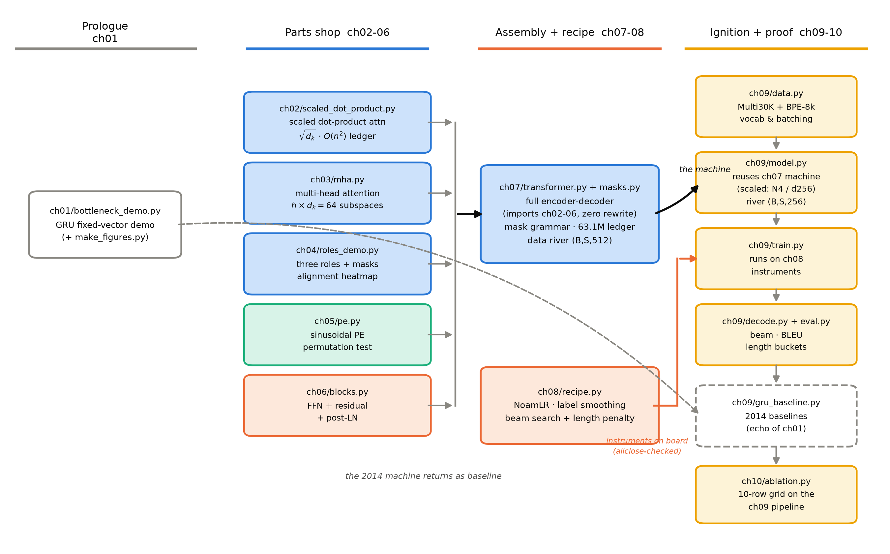

# 第 11 章 三大遗产与欠账：全系列地图

## 11.0 开篇：从全书到这里

第 10 章我们做完了最后一道工序：论文 Table 2、Table 3、Table 4 的数字逐条对表，自家的消融网格逐行跑完，方向判据的命中情况如实报告，自家算力与 2017 年差三个数量级的口径也写进了声明——验货完毕。到此，导览 0.4 那张五段旅程图的前四段全部走完：出发（看清两堵墙）、零件铺（五个零件）、组装（整机与配方）、点火（训练、解码、评测）。机器造完了，也开过、验过了。

一台验完货的机器，值得在交付之前做一次清点。导览 0.1 承诺过，合上这本书时你会有三样东西：一台你自己造的翻译机、一条能解释每个设计选择的推理链、一张欠账地图。前两样在前面十章里已经陆续交到你手上；第三样，就是本章的交付时刻。所以这一章不造新零件——它回答两个收束性的问题：**这台 2017 年的机器到底改变了什么？又留下了什么没解决？**前半问盘点遗产，后半问清算欠账，最后把全部欠账登记成一张通往后续七册的地图。

还有一件小事要在本章了结。全书从头到尾我们都在说「引用锚定 v7」「证据等级」，却一直没告诉你为什么这本书对版本号如此紧张。11.3 节会把原因摊开：连原论文自己都在七个版本间改数字、删段落、修表格——你会亲手花十分钟核查一个数字，从此对「论文上说」这四个字多一分警觉。本章结束时，你手里是一张地图和一个路口：下一站 Book2 第 1 章，已经标好。

## 11.1 遗产盘点：一台机器，和一张并行化的门票

清点从最近处开始——你自己手里这台机器。图 11.1 是全书的代码资产总览：第 2 到 6 章交付的五个零件（手写缩放点积注意力、多头、三种角色与掩码、正弦位置编码、FFN 与残差归一化块），第 7 章零重写地把它们装成整机，第 8 章配齐点火的三块仪表，第 9 章接上数据与训练管线，第 10 章的消融网格直接复用同一条管线。看图的要害在一条暗线：[`code/ch09/model.py`](code/ch09/model.py) 的 `Transformer` 类里没有一行新的架构代码——它只是把 [`code/ch07/transformer.py`](code/ch07/transformer.py) 的整机 `TransformerMT` 缩了尺寸（$N$ 6→4、$d_{model}$ 512→256）再实例化。零件怎么一步步变成整机，就是架构怎么一步步长出来的镜像；合上书之后如果你只保留一个目录，保留这个：它同时是源码地图，任何一个零件忘了怎么造，沿图回到那一章就能重建。



图 11.1 全书代码资产总览（自绘，兼作源码地图）：左起四列对应导览 0.4 的旅程段——前史（ch01）、零件铺（ch02-06）、组装与配方（ch07-08）、点火与验证（ch09-10）；蓝=注意力系零件、青=位置编码、橙=FFN 与配方、黄=点火与实验；虚线是 2014 年那台 GRU 机器在第 9 章以双 baseline 身份归来；ch07 整机框与 ch09 model 框内各标数据河主形状——$(B,S,512)$ 与缩尺寸后的 $(B,S,256)$

但这是**你**的遗产。2017 年那篇论文留给世界的遗产是什么？最容易脱口而出的答案是 BLEU：28.4、41.8，两项新纪录。这个答案不算错，但它抓的是结果，不是改变。要看见真正的改变，得回到第 1 章 1.5 节那场前史竞速，把四个时间戳摆成一列——它们构成一条「并行化」的谱系，每一站都是下一站的动机。

**第一站，2014 年，Sutskever 的 4+4 层 LSTM。**它是真实工业规格的机器：384M 参数、8 块 GPU——但请注意算力花在哪里：4 块按深度切分（每卡放一层）、4 块并行算 softmax，把吞吐从约 1,700 词/秒抬到 6,300 词/秒，整个训练约 10 天【证据等级：官方论文 Sutskever et al. 2014 §3.4–3.5】。并行发生在**机器与层之间**；序列内部依然一个词一个词依序算——第 100 个词等前 99 个，这是定义写死的。

**第二站，2016 年，GNMT 把这条路走到了天花板。**8+8 层残差 LSTM，12 份副本数据并行、单机 8 块 GPU 模型并行，最终 **96 块 K80、约 6 天**（强化学习精调再加约 3 天）【证据等级：官方论文 GNMT 2016 §8.3】。96 块卡堆上去，串行墙还在原地。最硬的证据是一张速度表：解码 6003 句开发集，88 核 CPU 用 1,322 秒，K80 GPU 反而要 3,028 秒——**GPU 比 CPU 慢 2.3 倍**【证据等级：官方论文 GNMT 2016 Table 1】。循环模型的时间步依赖让 GPU 的数千个核心无事可做；算力堆得越多，闲置的比例越大。这是结构性的天花板，不是工程优化能填的坑。

**第三站，2017 年 6 月前的 ConvS2S 换了材料。**卷积替换循环，训练时全位置同时算——ConvS2S 用的 K40 上解码比 GNMT 的 K80 还快 9.3 倍，BLEU 高 2.25【证据等级：官方论文 ConvS2S 2017 Table 3】（K40 比 K80 还旧一代——赢的不是硬件，是结构）。层内并行第一次回到序列身上。但卷积有自己的税：单层看不远，远距信息要靠堆层传递，路径长度 $O(\log_k n)$（论文 §4 Table 1 第三行），大模型的**有效感受野只有约 25 词**——第 25 个词之外，看不见。

**第四站，Transformer。**Table 1 第一行（第 2 章表 2.4 的重排）给了决定性的三个数：每层复杂度 $O(n^2\cdot d)$，串行操作数 $O(1)$，最大路径长度 $O(1)$。$O(1)$ 串行操作的意思是：一层之内没有必须依序完成的子步骤，整句的计算可以摊满整块 GPU。训练账立刻兑现——base 模型 8×P100 十二小时（每步 0.4 秒、10 万步），big 模型 3.5 天（每步 1.0 秒、30 万步）【证据等级：官方论文 v7 §5.2】；再看 Table 2 的成本列：En-De 上 base 用 $3.3\times10^{18}$ FLOPs 拿到 27.3，ConvS2S 用 $9.6\times10^{18}$ 拿到 25.16——**三分之一的算力，多 2.14 的 BLEU**；En-Fr 上 big 用 $2.3\times10^{19}$ 拿到 41.8，GNMT+RL 用 $1.4\times10^{20}$ 拿到 39.92——**六分之一的算力，还多 1.9**【证据等级：官方论文 v7 Table 2】。

把四站连起来读，比 BLEU 更重要的遗产就显形了：**「可以规模化」**。$O(1)$ 串行操作意味着算力可以近乎线性地兑换成训练速度，训练速度兑换成数据量，数据量兑换成质量——「可以在一千张卡上训练」的资格，是后面一切故事的物质基础（第 1 章欠账框里 F3 的原话）。BLEU 纪录一年后就被刷新，「可规模化」这条属性至今没有过期。

顺着这条线，回头清点导览 0.5 的两堵墙，账目就清楚了。**容量墙**：拆得很彻底——两塔之间那只固定箱子没有了，每个词通过打分矩阵按需取信息，任意两个位置一步可达；第 1 章需求清单的三条（任意两词一步可达、层内无依赖链、保留软寻址）在 2017 年的架构里全部兑现，第 9 章的按句长分桶评测则把「长句先崩」的预言送进了数值。**串行墙**：只拆了一半——训练侧，教师强制让全部位置并行前进，第 1 章埋的并行化红利在这里兑现；解码侧，生成本质上还是一次一个词，一枚因果掩码把串行性原封不动锁在了推理里。导览 0.3 出发前立的三条粗心智，在此逐条验对收拢：一条河（恒宽 $d_{model}=512$ 的数据流从嵌入一路流到 logits）与三种注意力岗位（双向、因果、交叉各就各位）都坐实了，「一台翻译机的两拍」的第一拍（整句并行读完）兑现成红利，第二拍（逐词写出）却还是第 1 章旧机器的命。拆不干净的墙就是欠账——这正是下一节的主角。

> **【实现对照框】**（实现对照，非原论文内容）你在第 2 章手写的那份 matmul+softmax，在今天的 PyTorch 里长成了一整个生态：`torch/nn/attention/` 目录下，`flex_attention.py` 支持任意掩码模式的一次编译、`varlen.py` 处理变长批的 packing、`_fa3.py/_fa4.py` 绑定第三代四代 FlashAttention kernel。值得看一眼的是：式 (2.1) 的数学在这八年里一个字没改——改的只是那张 $(B,h,n,n)$ 打分表**怎么铺**（每头每样本一张 $n\times n$：不铺开、分块、在线重算）。这张表的铺法革命，记在 F17 的账上，Book6 第 8 章从零推导。

## 11.2 三大欠账集中清算：每条债都有借据和还址

上一节清点了进项，现在摊开负债表。全书各章的欠账框是零散记的账，本节把三笔大账集中过一遍——每一笔都按同样的格式清偿登记：2017 年的原话（借据）、它为什么是结构性的（病根）、后来由谁接手（还址）。

**第一笔：$O(n^2)$。**借据写在论文 §4，紧跟着 Table 1 的第四行（restricted attention，复杂度 $O(r\cdot n\cdot d)$、路径 $O(n/r)$）：*"We plan to investigate this approach further in future work."*（我们计划在未来工作中进一步研究这一方向。）【证据等级：官方论文 v7 §4，直引】。病根不需要新论证，第 2 章已经实测过：$n$ 从 64 扫到 512，打分矩阵（每头每样本一张 $n\times n$）从 1.00 MiB 涨到 64.0 MiB，整整 64 倍——句长 30 的翻译机付得起这笔账（batch=64、8 头并算的 $(B,h,n,n)$ 也才 1.76 MiB），可这笔账是**平方律**：当「句长」变成「上下文长度」，32k 个位置的张表在进入计算之前就先淹死显存。结构性在于：二次方不是 bug，是「让每个词看见所有词」的成交价（第 2 章的交易复盘）——只要全可见的架构目标在，表的面积就是 $n^2$。所以还账只有两条路：要么改数学（少看一些位置还能不丢信息），要么改铺法（表还是那张表，换个不淹死显存的算法）。前者是 Book5 第 1 章的突围总览、第 2 章的滑窗与 sink、第 3 章的可学习稀疏、第 5 章的线性注意力——restricted attention 那行 future work 是全部稀疏路线的原始借据（F11）；后者是 Book6 第 3 章的 KV 压缩与第 8 章的注意力 kernel。另有一张小额借据顺路登记：论文 §6.2 (B) 行的讨论留过一句 *"a more sophisticated compatibility function than dot product may be beneficial"*（比点积更精巧的兼容性函数可能有益）——这是给整个注意力变体领域发的通行证（F12），Book5 全册都在兑现它。

**第二笔：自回归串行。**借据在论文 §7 的结论里，作者自己写的：*"Making generation less sequential is another research goals of ours."*（让生成更不串行，是我们的另一个研究目标——原文语法瑕疵照录）【证据等级：官方论文 v7 §7，直引】。病根在因果掩码的另一面，第 7 章已经把账算到数：训练时教师强制让全部位置并行，推理时同一枚掩码却把生成锁死为逐词元串行，且每生成一个词元要把整段前缀重过一遍——每步是一次 $(B,t)$ 进、下一词元分布 $(B,V)$ 出的完整解码器前向（`TransformerMT.decode_step()` 的形状，$t$ 为已生成长度）——$T=9$ 的句子累计算 $1+2+\dots+9=45$ 个位置，是一次整段前向的 5 倍，冗余比 $\tfrac{T(T+1)}{2}$ 随长度线性涨。结构性在于：这不是实现偷懒，而是「训练可并行」与「生成自回归」共用同一枚因果掩码的必然代价——想拆它，就得动「逐词生成」这个范式本身。还址分三处：Book6 第 1 章把一次请求拆成 prefill 与 decode 两阶段（串行的 decode 段是内存带宽瓶颈，不是算力瓶颈——推理物理学的第一课）；Book6 第 10 章的投机解码「先猜后验」，把串行的猜变成并行的验；Book4 第 8 章则从训练侧出手（MTP：多词元预测的训练目标，转身成为推理资产）。顺带一笔：第 8 章的束搜索在这个故事里有戏份——「一次验证多条候选」正是它思想的借尸还魂（F8）。

**第三笔：容量焦虑。**这笔账最老，借据也最含蓄。论文 §3.5 的原话：*"We chose the sinusoidal version because it may allow the model to extrapolate to sequence lengths longer than the ones encountered during training."*（我们选正弦版本，是因为它**可能**让模型外推到训练中未见过的更长序列。）【证据等级：官方论文 v7 §3.5，直引】——一句 hypothesized 级的假设，第 5 章 5.5 节已细读过它的措辞分量。病根要沿第 1 章的谱系看：2014 年的焦虑是「8000 个实数装不下整句」，注意力把这只箱子拆了，每个词按需取信息；但拆墙没有消灭墙，只是把「固定容量」从一只向量挪到了一处长度上限——训练时的 max_len 之外，模型一寸也看不见。翻译机一句话够用，这笔账不疼；等到模型要读文档、记对话、看代码库，「一段上下文装不下长文档」就是 2014 年那堵墙的原样重现（F10——同一场战斗，2026 年的变形）。本册已经做过一次小规模清偿：第 5 章的外推承诺，第 9 章在训练长度的 1.5–2 倍上把两种编码并排收口——正弦侧 9.03/6.62（半兑现：能前向、译不好），学习式同协议补测 8.92/7.73（18 位查表、超长截位复用末位向量）——崩法与正弦不同源（正弦是低频维爬进未训练相位，学习式是截位把长出查表的位置抹平），但在小带内伤得一样重；真正的长任务分歧仍挂 F6。大规模清偿的地址：Book3 第 7 章是 $2\text{k}\to32\text{k}$ 的工程主线剧（旋转式位置编码对这条性质的直接继承在 Book3 第 4 章深剖），Book5 第 8 章收到 1M 上下文并给出「外推 vs 压缩」两条哲学的收束论；Book2 卷末（第 12 章）会先把它登记为预训练时代的遗留。

论文 §7 那段 future work 其实写了三件事，除上面两笔外还有第一句：把 Transformer 推向文本之外的模态——图像、音频、视频（*"We plan to extend the Transformer to problems involving input and output modalities other than text…"*）【证据等级：官方论文 v7 §7，直引】。这条不多展开，登记为 F13，回收在 Book5 第 10 章的多模态三步曲。你看，连「欠账清单」都是作者亲笔写的——欠账不是缺陷，是种子；2017 年写下这三行的人，等于是替 2018 到 2026 年的整个领域画了路线图。

## 11.3 版本考古一课：连原论文都在漂移

现在了结开篇许下的那件事。这本书每一处引用都带着「论文 §x.x」和一个版本号，每章末尾的动手验证都标注「本机实测」——这套看起来学究气的纪律，底气来自一个事实：**《Attention Is All You Need》自己就没有一个稳定的文本**。它在 arXiv 上从 v1（2017-06-12）到 v7（2023-08-02）共七个版本、跨度六年，外加一个 NeurIPS 会议版；表 11.1 是八份文本的时间线账本。

| 版本 | 日期 | 关键变动 | 对引用者的提醒 |
|---|---|---|---|
| v1 | 2017-06-12 | 初稿：无脚注 4、无 (E) 行、多头公式缺 $W^O$、Table 3 的 base $d_{ff}$ 误印 1024、附录含「FFN=参数上的注意力」一节、代码未放出 | 任何引 v1 截图的资料都可能拿错公式与配置 |
| v2 | 2017-06-19 | 改动最大：脚注 4 方差论证、$\sqrt{d_k}$ 动机句重写、$W^O$ 补入、$d_{ff}$ 改 2048、(E) 行新增、ResNet 与 Press & Wolf 引文补入、代码 URL 上线；41.x 三处互异（41.2/41.17/41.0） | 你熟悉的许多「论文原句」其实是 v2 才有的 |
| v3 | 06-20 | 摘要数字回调 41.2→41.0 | 一天之内数字又变了 |
| v4 | 06-30 | 删「FFN=注意力」附录、全文统一 41.0、撤回 EN-FR big 特殊条款、新增致谢 | NIPS 投稿版，自洽但非终稿 |
| v5 | 2017-12-06 | camera-ready：摘要与 Table 2 升 41.8（§6.1 正文句漏改，遗留 41.0）、删 Attention Dropout 段、首页分工长注、引文 40 篇 | 内容定稿=v5；v5/v6/v7 互相等价 |
| v6 | 2023-07-24 | 新增 Google 表格转载许可声明；仅重排版 | 本书图规的许可依据在 v6 起 |
| v7 | 2023-08-02 | 对 v6 **零改动**，仅元数据再提交 | 全书锚点；内容与 v6 逐词相同 |
| NeurIPS | 2017-12 | **独立删节分支**：无 §6.3/Table 4/图 3–5、引文仅 32 篇、三处 41.0 | 引句法分析必须引 arXiv v5+，会议版页码给不出 |

表 11.1 八版时间线（自排，据 notes/06 版本全文 diff：pypdf 提取八份 PDF 文本层、词级 diff 逐对比对，v6≡v7 零差异已 checksum 验证）【证据等级：官方论文·多版本 PDF 直读（2026-10 复核）】

挑三个化石级的案例细看。**化石一：一个数字的七年漂流。**EN-FR big 的 BLEU：v1 三处一致 41.0；v2 突然三处互异（摘要 41.2、正文 41.17、表 41.0）；v4 回到一致 41.0；v5 起摘要与 Table 2 升为 41.8——**但 §6.1 那句正文漏改，41.0 一直留到今天**。也就是说，你今天下载 v7，同一份 PDF 里有两个「官方数字」并存。**化石二：你以为的公式是后来补的。**$\sqrt{d_k}$ 的方差论证（脚注 4）、多头公式里的 $W^O$、(E) 行、$d_{ff}=2048$——全部是 v2 才加入的；v1 的 Table 3 里 base 的 $d_{ff}$ 印着 1024，与正文 2048 自相矛盾。**化石三：被删的段落留下残句。**Attention Dropout 一节 v1–v4 都在、v5 删除，但 §5.4 首句 "three types of regularization"（第三种已被删）与 §6.3 的 "both attention and residual" 两处引用成了化石——第 8 章表 8.2 已经从配方侧看过它们，这里补全故事：删除不是修订疏漏，是作者撤掉了一个「发现对解析实验有益但主结果不需要」的正则化项。

> **【考据框】** v2/v3 的附录里曾经有一节 "Two Feed-Forward Layers = Attention over Parameters"：作者认真考虑过「FFN 也是注意力的一种」并做了实验（把 FFN 换成「参数上的多头注意力」，25.5/25.9 BLEU，与 base 相近），v4 整节撤稿。今天的通用共识「注意力与 FFN 是两种不同的算子」，在 2017 年 6 月曾是一个悬而未决的实验问题。引用此实验必须标注「v2/v3 独有，v4 撤」。

那你我作为普通读者，怎么防止被漂移的版本坑到？答案是：核查一个数字只要十分钟，材料只需要几份 PDF。操作演示如下——从 arXiv 下载各版存进 `log/`，用 pypdf 提取全文，正则数一遍所有 "41.x" 形态的数字：

```python
# 十分钟核查一个数字（完整命令见本章 11.6 动手验证）
# 输入：log/ 下的 1706.03762v1.pdf … v7.pdf 与 nips2017-attention.pdf
v1     41.x 计数: {'41.0': 3, '41.16': 1, '41.29': 1}
v2     41.x 计数: {'41.2': 1, '41.17': 1, '41.0': 1, '41.16': 1, '41.29': 1}
v5/6/7 41.x 计数: {'41.8': 2, '41.0': 1, '41.16': 1, '41.29': 1}
NeurIPS 41.x 计数: {'41.0': 3, '41.16': 1, '41.29': 1}
```

【证据等级：本书实验（pypdf 6.19 文本层提取，M5 Pro，2026-10-02 实跑）】四行输出读出三件事：v1 干净一致；v2 三处互异当场现形；v5 之后 41.8 出现两次而 41.0 仍剩一次——「论文自身不一致」不是传闻，是你自己数出来的。顺带一个方法论提醒：输出里的 41.16 与 41.29 是 Table 2 的**对照行**（GNMT 集成、ConvS2S 集成的成绩），每个版本都有——正则不认识语境，数完计数还要落到节号定位，这是「核查」与「搜索」的区别。

这一课的心智只有一句话：**连原论文都在漂移，你读到的任何二手转述都锚在某个你看不见的版本上。**所以这本书坚持每个数字带证据等级、每次直引带节号与版本、第 5 章教你读动词（hypothesized 与「我们证明了」隔着整个世界）——它们是同一门课的不同课时。

## 11.4 八册一页地图：你现在在哪，下一站去哪

三笔大账之外，还有散在各章的小额借据。表 11.2 是全书十八笔伏笔的总账（F1–F18，编号与各章欠账框一致），每笔一行：钩子是什么、埋在哪一章、由哪一册的哪一章回收。

| # | 钩子（一句话） | 埋设章 | 回收地址 |
|---|---|---|---|
| F1 | $O(n^2)$：全可见的成交价 | ch2/10 | Book5 第 1/2/3/5 章；Book6 第 3/8 章 |
| F2 | 自回归串行：因果掩码的另一面 | ch7 | Book6 第 1/10 章；Book4 第 8 章 |
| F3 | 并行化红利：可以规模化的资格 | ch1 | Book2 第 1 章（开场回收）/8/10–11 章 |
| F4 | K/V 的读取语义：推理账本的开端 | ch4/7/9 | Book3 第 6 章；Book6 第 3/5/7 章；Book7 第 6 章 |
| F5 | post-LN 训练不稳：warmup 的病根 | ch6/8 | Book2 第 4 章；Book3 第 2 章 |
| F6 | 位置编码外推：2017 年的半句话承诺 | ch5 | Book3 第 4/7 章；Book5 第 8 章 |
| F7 | BPE 黑盒：借用了三次的工具 | ch8/9 | Book2 第 2 章 |
| F8 | 束搜索与长度惩罚：翻译机的解码器 | ch8 | Book6 第 9/10 章；Book7 第 11 章 |
| F9 | 交叉注意力的后世折叠：双塔会消失吗 | ch4 | Book2 第 3/4/5 章；Book5 第 10 章 |
| F10 | 固定容量→上下文长度：同一焦虑两次变形 | ch1 | Book2 第 12 章；Book3 第 7 章；Book5 第 8 章；Book6 第 6 章 |
| F11 | restricted attention：稀疏路线的原始借据 | ch2 | Book5 第 2 章 |
| F12 | 兼容性函数的口子：比点积更好？ | ch3 | Book5 第 1–5 章 |
| F13 | 多模态：文本之外的模态 | §7（本章） | Book5 第 10 章；Book4 第 10 章 |
| F14 | FFN 的两刀：换激活、换专家 | ch6 | Book3 第 3 章；Book4 第 2–5 章 |
| F15 | 权重共享：绑与解的小开关 | ch7 | Book2 第 4 章；Book3 第 5 章 |
| F16 | 头数与 $d_k$ 的账本：推理时代翻转 | ch3/10 | Book3 第 6 章；Book4 第 6 章 |
| F17 | 手写打分表的命运：不铺表的算法 | ch2 | Book6 第 8 章；Book7 第 9 章 |
| F18 | 低精度：从 GNMT 定点 8-bit 到今天 | ch8 | Book4 第 7 章；Book6 第 11 章；Book8 第 8 章 |

表 11.2 全书伏笔总账（自排，源自各章欠账框与卷级伏笔登记表；回收章号按丛书总览 v1.1 的章级粗纲，后续各册开工若调整章序须回表改版）

这张表怎么读？它是八册之间的**契约**：每一行都显式指名「谁、在哪一章接手」，不用「后续会讲」这类无地址的许诺——因为一份没有地址的欠账清单，最后总会长成一篇谁也不欠谁的综述。反过来，它也是这套书的组织原则：Book2《预训练革命》接走并行化红利的兑现（F3 开场回收）与 BPE（F7）、pre-LN 手术（F5）、双塔折叠（F9）、tied embeddings（F15）；Book3《现代开源骨架》接走 KV cache 账本（F4）、外推工程线（F6）、FFN 第一刀（F14）；Book4《规模与效率》与 Book5《前沿混合架构》分别接走效率悖论与注意力本体手术（F12/F14/F16/F1 的大头）；Book6《LLM 推理系统导论》整册经营推理侧的三笔账（F1 系统侧/F2/F8/F17/F18）；Book7/8 两册 vLLM 源码剖析把以上全部落到一个真实引擎的模块上（F4/F8/F17/F18 的工程端点）。架构册教你**机器是什么**，推理册教你**机器怎么被服务**，源码册教你**服务怎么被写出来**——欠账的去向，就是这条因果链。

所以「你现在在哪」的答案可以说得很大：你站在整套旅程的起点，手里是一台每个螺丝都亲手拧过的 2017 年机器。也可以说得很小：你站在下一个路口。导览 0.7 说过，本册交付的欠账地图「就是从『架构』通往『系统』的桥」——桥现在铺好了，第一块桥板是 Book2 第 1 章：算力既然可以兑现（本章 11.1 的四锚点），下一步自然是问**数据在哪里**——预训练范式把「造一台翻译机」改写成「喂饱一台通用机器」，而那台机器的骨架，你已经会造了。

## 11.5 结束语

导览开篇只带了一个问题：**这台机器为什么长成这个样子？**十一章走完，你现在可以从 2014 年的两堵墙出发，把这个问题的每一层推出来——为什么打分要用点积还要除以 $\sqrt{d_k}$，为什么切八个头几乎免费，为什么同一运算要装三种角色，为什么顺序要靠正弦波注入、归一化要压在残差外面，为什么 warmup 是 post-LN 的止痛药；也能从四个时间戳推出它为什么属于 2017。导览承诺的三样东西逐一交割：机器在第 7 章立起来、第 9 章点火；推理链分布在每一章的「问题—方案—验证」里；欠账地图就是 11.4 的表 11.2。至于第四样说不成「东西」的东西——心智——现在做最后一次清点。**带走的心智**（全书级）：如果整本书只允许你带走三件，请带这三件：

**第一，三笔账随身走：参数、显存、重算。**看见任何模型先数三件事——静态的家底有多少参数（63.1M 是怎么数出来的）；运行时要多大的表（打分表 $(B,h,n,n)$ 随 $n$ 平方涨，1.76 MiB 只是句长 30 的首付）；生成一个词元要重算什么（$T(T+1)/2$ 的冗余账）。这三本账是后七册的通用货币，推理时代的每一个工程决策——为什么要压缩 KV、为什么要分页、为什么投机解码能赢——都是这三本账上的一笔进出。**第二，欠账=种子。**读任何论文、任何架构，先别急着背它的结论，去问它留下了什么没解决的问题——2017 年那三行 future work 长成了 2018 到 2026 年的整个领域。你手里的表 11.2 就是这个阅读姿势的成品：一张欠账清单读好了，就是一张路线图。**第三，引用锚定版本。**数字会漂（41.0 到 41.8 走了半年）、段落会删（Attention Dropout）、表格会印错（$d_{ff}$ 的 1024）——「论文上说」永远不如「论文 v7 §6.1 说、本机实测复现」值钱。带着这三件东西，细节忘了就忘了，它们会替你把细节重新长出来。

合上这本书，2017 年的机器还停在 2017 年，但你已经不停在原地了。下一册《预训练革命》：架构几乎不动，训练范式天翻地覆——那台你以为只用来翻译的机器，将被灌进整个互联网的文本，学会在千万词的语境里接话、摘要、答题。深呼吸。我们把时间拨到 2018 年。

## 11.6 动手验证（本章代码与实验清单）

- **图 11.1（全书代码资产总览）**：
  ```bash
  source env.sh && python "[`code/ch11/make_fig_11_1.py`](code/ch11/make_fig_11_1.py)"
  ```
  预期产出：`figures/fig-11-1-code-asset-map.png`（300 dpi，2700×1680；框内标注集中在脚本的 `parts`/`pipe` 框常量与 ch07 整机框）；验收点：四列对应四段旅程；`ch09/model.py` 框内标注 reuses ch07 machine；ch07 整机框与 ch09 model 框标有数据河主形状 (B,S,512)/(B,S,256)；ch01 与 `ch09/gru_baseline.py` 之间为虚线（2014 机器归来）；图内全部英文、无中文（印刷规格）。
- **十分钟核查一个数字（11.3 节操作演示）**：从 arXiv 下载 `1706.03762v1.pdf`、`v5.pdf`（及可选 v2–v7、NeurIPS 会议版）存入 `log/`，然后运行计数脚本（不新建文件，直接跑）：
  ```bash
  source env.sh && python - <<'EOF'
  import re
  from collections import Counter
  from pypdf import PdfReader
  for tag, path in [("v1", "log/1706.03762v1.pdf"), ("v2", "log/1706.03762v2.pdf"),
                    ("v5", "log/1706.03762v5.pdf"), ("v7", "log/1706.03762v7.pdf"),
                    ("NeurIPS", "log/nips2017-attention.pdf")]:
      txt = "\n".join(p.extract_text() or "" for p in PdfReader(path).pages)
      print(tag, dict(Counter(re.findall(r"41\.\d+", re.sub(r"\s+", " ", txt)))))
  EOF
  ```
  预期产出（本机 M5 Pro / pypdf 6.19 实测，2026-10-02）：v1 为 41.0×3；v2 为 41.2/41.17/41.0 三处互异；v5 与 v7 均为 41.8×2＋41.0×1（41.0 即 §6.1 遗留句）；NeurIPS 版为 41.0×3；各版均另有 41.16/41.29 各一次（Table 2 的 GNMT/ConvS2S 集成对照行）。
  验收点：①能否指出 v7 里 41.8 与 41.0 各自所在的节（摘要与 Table 2 对 §6.1 正文句）；②能否解释为什么数完还要落到节号（正则不识语境）；③换一个数字（如 $d_{ff}$ 或 warmup）重走流程，体会「配方数字七版未变、结果数字半年三变」的差别。
- **复述自测（本章验收标准）**：①合上书能否复述三大遗产（一台可复现的机器、一条推理链、可以规模化的资格）与三条主欠账的回收地址；②能否说出并行化四锚点各自的数字（10 天 8 GPU→96×K80 6 天→快 9.3 倍→3.5 天 8×P100）与其中哪两站是串行天花板；③能否向同事演示「锚定版本」的核查操作。

---

## 附录 全书术语表（册末附录）

汇总 ch00–ch10 各术语首现处的中英对照（首现章按术语获得中英对照与定义处登记；「本书用语」为本册自创、无通行英译；第 9–10 章条目按卷级大纲 v1.2 的口径登记，与成稿同步校订）。按首现章排序。

| 术语 | 英文 | 首现 | 一句话定义 |
|---|---|---|---|
| 容量墙 | （本书用语） | 导览 | 固定长度容器装不下变长信息而立起的结构性瓶颈 |
| 串行墙 | （本书用语） | 导览 | 时间步依序依赖挡住并行、堆算力无效的结构性瓶颈 |
| 欠账地图 | （本书用语） | 导览 | 全书遗留问题的登记表，同时是后续七册的入口 |
| 循环网络 | RNN, recurrent neural network | 导览 | 按时间步依序处理序列、用隐状态携带记忆的网络家族 |
| seq2seq | sequence to sequence | 第 1 章 | 编码器读入变长输入、解码器逐词展开变长输出的框架 |
| 编码器 | encoder | 第 1 章 | 把源序列逐位加工为表示的那座塔 |
| 解码器 | decoder | 第 1 章 | 逐词生成目标序列的那座塔 |
| 隐状态 | hidden state | 第 1 章 | 循环单元的记忆快照，随每个时间步更新 |
| 上下文向量 | context vector | 第 1 章 | seq2seq 两塔之间唯一的固定长度信息桥 |
| 词嵌入 | word embedding | 第 1 章 | 每个词元一张可学习的固定维「数字身份证」查找表 |
| 教师强制 | teacher forcing | 第 1 章 | 训练时喂标准答案的上一步、使全部位置可并行 |
| 自回归 | autoregressive | 第 1 章 | 每步以自己已生成的输出为下一步输入的生成方式 |
| 束搜索 | beam search | 第 1 章 | 每步保留最优的若干候选句、走到底再取最优的解码 |
| BLEU | BLEU | 第 1 章 | n-gram 精确率几何平均乘短句惩罚的自动评分（0–100） |
| 软对齐 | soft alignment | 第 1 章 | 用 0–1 权重把目标词对到多个源词的加权对应 |
| 加性注意力 | additive attention | 第 1 章 | 打分函数为一个前馈网络的注意力（Bahdanau 路线） |
| 门控循环单元 | GRU, gated recurrent unit | 第 1 章 | 带重置门/更新门的简化 LSTM |
| 长短期记忆 | LSTM, long short-term memory | 第 1 章 | 用记忆单元与读写门抗遗忘的循环单元 |
| 感受野 | receptive field | 第 1 章 | 一层能「看见」的输入范围 |
| 源句逆转 | reversal of the source sentence | 第 1 章 | 读入源句时倒序以缩短最小依赖的 2014 技巧 |
| 学习式位置嵌入 | learned positional embedding | 第 1 章 | 位置信号用可学习查表注入（ConvS2S 先例） |
| 门控线性单元 | GLU, gated linear unit | 第 1 章 | $A\otimes\sigma(B)$ 形式的门控支路 |
| 多步注意力 | multi-step attention | 第 1 章 | ConvS2S 每个解码层各配一个独立注意力模块 |
| 词片 | wordpiece | 第 1 章 | GNMT 系的子词切分口径 |
| 缩放点积注意力 | scaled dot-product attention | 第 2 章 | 打分取内积再除 $\sqrt{d_k}$ 的注意力运算（式 (2.1)） |
| 查询 | query | 第 2 章 | 发出的「招标书」：当前位要找什么 |
| 键 | key | 第 2 章 | 亮出的「资质标签」：可被比对什么 |
| 值 | value | 第 2 章 | 交付的「货物」：匹配后被取走什么 |
| 打分矩阵 | score matrix | 第 2 章 | 全部查询对全部键的兼容性得分表，复杂度 $O(n^2 d)$ 的本体 |
| 软寻址 | soft addressing | 第 2 章 | 按权重混合取货的寻址方式，输出是值的凸组合 |
| 凸组合 | convex combination | 第 2 章 | 权重非负和为一的加权平均——只插值、不外推 |
| 随机游走 | random walk | 第 2 章 | 独立项求和的方差直觉模型（$\sqrt{d_k}$ 论证用） |
| 温度 | temperature | 第 2 章 | softmax 前对得分的缩放旋钮，$\sqrt{d_k}$ 即其一 |
| 兼容性函数 | compatibility function | 第 2 章 | 打分函数的论文称呼（点积/加性皆为其实例） |
| 交叉注意力 | cross-attention | 第 2 章 | 查询与键值来自不同序列的注意力（双塔之桥） |
| 多头注意力 | multi-head attention | 第 3 章 | 把投影切 $h$ 份并行打分、拼回再投影的机制 |
| 表示子空间 | representation subspaces | 第 3 章 | 多头各自工作的线性子空间（分工假说的对象） |
| 消融 | ablation | 第 3 章 | 逐项关闭/替换单一设计以度量其贡献的实验法 |
| 掩码 | mask | 第 4 章 | 谁能看见谁的规则表，内容只有 0 与 $-\infty$ |
| 因果掩码 | causal mask | 第 4 章 | 只许看过去的下三角禁区（式 (4.2) 的 $M$） |
| 双向 | bidirectional | 第 4 章 | 编码器每个位置直接看见全部位置 |
| 右移一位 | shifted right | 第 4 章 | 解码输入以 `<bos>` 打头、与监督错开一格 |
| 记忆 | memory | 第 4 章 | 编码器最终输出，供每层交叉注意力读取 |
| 输入回喂 | input feeding | 第 4 章 | 注意力输出回灌进下一步输入的做法（对照项） |
| 对齐矩阵 | alignment matrix | 第 4 章 | 交叉注意力权重矩阵，软对齐的可视化本体 |
| 正弦位置编码 | sinusoidal positional encoding | 第 5 章 | 闭合正弦公式生成的零参数位置信号（式 (5.1)(5.2)） |
| 置换等变 | permutation equivariant | 第 5 章 | 输入打乱、输出同步打乱的对称性（无 PE 的病症） |
| 置换不变 | permutation invariant | 第 5 章 | 输入打乱、输出不变的对称性（词袋性质） |
| 词袋 | bag of words | 第 5 章 | 丢失全部顺序信息的表示（无 PE 的编码器栈） |
| 外推 | extrapolation | 第 5 章 | 用在短序列上学到的规律直接服务更长序列 |
| 噪声地板 | noise floor | 第 5 章 | 种子方差划出的不可分辨区（第 10 章式 (10.1) 形式化为 $\max(2\sigma, 0.5)$），低于它的差距与运气同量 |
| 逐位置前馈网络 | position-wise FFN | 第 6 章 | 对每个位置独立且相同施加的升维-非线性-降维 |
| 层归一化 | layer normalization, LN | 第 6 章 | 按位置把向量拉回零均值单位方差的归一化 |
| post-LN | post-LN | 第 6 章 | LN 压在残差求和之外的 2017 原版摆位 |
| 残差学习 | residual learning | 第 6 章 | 子层只学修正量、恒等通路直通梯度的设计 |
| 退化 | degradation | 第 6 章 | 深层普通网络训练误差反而更高的现象（He et al.） |
| 权重共享 | tied embeddings | 第 7 章 | 输入/输出/对侧嵌入共用一张矩阵（省 37.9M） |
| 填充掩码 | padding mask | 第 7 章 | 屏蔽批处理补丁位的规则表（与因果同式叠加） |
| 实现定义行为 | implementation-defined | 第 7 章 | 规范不规定、由实现决定的输出行为（全屏蔽行） |
| 生成器 | generator | 第 7 章 | t2t 俗称的输出线性加 softmax 层（论文无此名） |
| 字节对编码 | byte-pair encoding, BPE | 第 8 章 | 从高频字节对迭代合并长出词表的子词算法 |
| 子词 | subword | 第 8 章 | 词与字符之间的切分单元 |
| 困惑度 | perplexity, PPL | 第 8 章 | 交叉熵的指数，概率模型的「等效选项数」 |
| 标签平滑 | label smoothing | 第 8 章 | 目标分布掺一成均匀，伤 PPL 换 BLEU 泛化 |
| 交叉熵 | cross-entropy | 第 8 章 | 预测分布对目标分布的平均负对数似然 |
| 长度惩罚 | length penalty | 第 8 章 | 矫正连乘短句偏置的打分项（GNMT eq(14) 血统） |
| 检查点平均 | checkpoint averaging | 第 8 章 | 末期若干检查点在权重空间取质心（非 ensemble） |
| 预热 | warmup | 第 8 章 | 前 4000 步线性升温的学习率段（post-LN 止痛药） |
| Noam 调度 | Noam schedule | 第 8 章 | warmup 后按步数平方根倒数衰减的两段式（式 (8.1)） |
| 分词器 | tokenizer | 第 9 章 | 文本与词元序列互转的工具（sentencepiece 借用框） |
| 动态填充 | dynamic padding | 第 9 章 | 按批内最长句补齐、批间长度浮动的批处理法 |
| 按句长分桶 | length bucketing | 第 9 章 | 评测按句长分组报告，容量墙的数值探针 |
| 组批税 | （本书用语） | 第 9 章 | 无填充掩码的循环末态在混批评测下被尾部 PAD 污染而虚付的 BLEU（6.52 对干净口径 18.03） |
| sacreBLEU | sacreBLEU | 第 9 章 | 固定口径实现的 BLEU 库（分词口径不同可差 1 个多 BLEU；本书三模型实测 1.06–1.50） |
| 趋势级复现 | （本书用语） | 第 10 章 | 只复现方向与相对效应、不声称绝对数值的复现观 |
| 种子方差 | seed variance | 第 10 章 | 固定协议下换随机种子的结果波动，显著性标尺 |

（术语表完。全书正文至此收束；下一册《预训练革命》从本表停下的地方继续扩表。）
