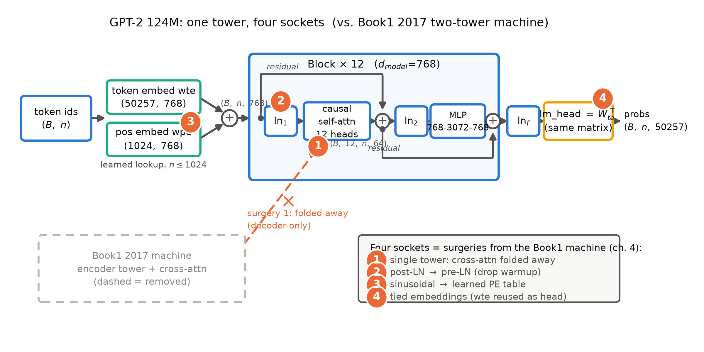

# 导览：把互联网灌进这台机器

> 本章无代码、无数值引注——每个硬数字（124M、175B、40GB……）都会在后续章节带证据等级重新登场，此处只当路标。带着一个问题读：**把整个互联网的文本灌进一台 2017 年的机器，会发生什么？**后面十二章都是它的展开。

上一册收束时留下了两句重话（分别在其 11.4 末与 11.5 结束语）：「桥现在铺好了，第一块桥板是 Book2 第 1 章」——以及那句「深呼吸。我们把时间拨到 2018 年」。现在你就站在 2018 年。桥的那头是什么？Book1 结尾已经剧透过一半：**架构几乎不动，训练范式天翻地覆**。你亲手造的那台翻译机零件九成完好，要变的只有三件事：喂什么数据、用什么目标函数训练、训完怎么用——变完，「专用翻译机」就成了「通用机器」，而它的骨架你已经会造。

这就是本册书名的含义：**预训练（pre-training）革命**。先灌互联网，再谈任务；数据不再由人工标注，而是整座互联网本身。BERT、GPT、T5、Scaling Laws——这册书讲的就是这场革命的全过程，终点是你亲手把一台 GPT-2 124M 从零造出来、喂真数据、训出真曲线。

在八册地图上，这是第二站。Book1 教你**机器是什么**；本册教你**机器怎么被喂饱**（数据、目标、配方、定律）；至于喂饱之后**机器怎么被服务**，是推理册与源码册的事。本册结束时你站在 2022 年——手里那台 124M 的每个部件都做成了「插槽」（slot），下一册《现代开源骨架》会把它们逐个拔下来换新：这一册造的机器，是按「可改装」的方式造的。

## 0.1 读完这本书，你会拥有什么

先说清楚目的地。合上这本书的时候，你会有三样东西：

**第一，一台你自己造的 GPT-2 124M。**不是「看懂了别人的实现」，而是第 4 章在 Book1 那台翻译机上动四刀手术、第 10 章从零写成代码——参数逐位对上官方发布的 124,439,808 个，第 11 章加载官方权重逐项对拍。全程只靠 PyTorch 基础算子和一台普通笔记本电脑。

**第二，一条你自己训出来的损失-算力曲线。** Scaling Laws（规模定律）是这册书的定量灵魂：花更多算力，到底能买回多少损失？别人引论文图，我们要在自己机器上训一族小模型、拟合一条自己的幂律曲线，把每一个点画进论文的坐标系——定律在你的笔记本上显形。顺带学会这套书最值钱的一门手艺：曲线怎么读、口径怎么对、外推何时骗人。

**第三，一张范式判决的判断力地图。**2018 到 2020 年，理解侧（BERT）、生成侧（GPT）、统一接口（T5）三种范式同台竞技，最后 decoder-only 成为默认底座。为什么？第 12 章会给一份带边界条件的判决书。带走的不是结论，而是读任何「范式之争」的判断力：证据链、边界条件、口径有没有被偷换。

还有一样说不成「东西」的东西：**心智**。半年后你多半记不清 BERT 的词表是 30522 还是 50257，但会留下几个甩不掉的画面——比如「预训练是把互联网压进参数的压缩」。每章小结都会回答同一个问题：**如果只允许你记住一件事，是什么？**

## 0.2 卷间契约：从 Book1 出发

丛书八册，册与册之间立契约：上一册交出什么、本册新增什么、对已有架构改什么。表 0.1 是本册与 Book1 的完整契约——迷路时回来看一眼。

| 契约栏 | 明细 | 地址 |
|---|---|---|
| **已知基础**（Book1 已教，直接指回、不再重教） | 多头注意力与三种注意力角色 | Book1 第 3-4 章 |
| | 因果掩码与整机组装 | Book1 第 7 章 |
| | post-LN 结构与 warmup 止痛药 | Book1 第 6/8 章 |
| | 训练配方（Adam/标签平滑/调度） | Book1 第 8 章 |
| | BLEU 与「口径自觉」课 | Book1 第 9-10 章 |
| **本册新增** | 分词器：BPE 家族从零讲透 | 第 2 章 |
| | 预训练目标：掩码语言模型（MLM）/因果语言模型（causal LM）/span corruption（跨度损坏） | 第 3/4/5 章 |
| | 微调（fine-tuning）配方与上下文学习（in-context learning, ICL） | 第 6/7 章 |
| | Scaling Laws 与涌现之争 | 第 7/8 章 |
| | 预训练工程账本：显存/算力/不稳定性 | 第 9 章 |
| **架构修改**（四项手术，逐一动刀） | 手术①：单塔折叠——撤掉编码塔与交叉注意力岗位 | 第 4 章 |
| | 手术②：post-LN 改 pre-LN | 第 4 章 |
| | 手术③：正弦位置编码改学习式查表 | 第 4 章 |
| | 手术④：输出层与输入嵌入绑定（tied embeddings） | 第 4 章 |

表 0.1 卷间契约三栏（自排）

三栏各有一句话。已知基础一栏的含义是**本册不重教**：遇到多头注意力、因果掩码，直接指回 Book1 的具体章节；新增一栏是本册的正文主体——其中大部分不是「架构」而是「训练」（目标、数据、配方、定律）；修改一栏只有四项，正好对应第 4 章的四台手术——本册最像「改装车间」的一章。

## 0.3 先看一眼我们要造的机器

出发前先看一眼目的地。图 0.1 是 GPT-2 124M 的整机粗图（自绘示意级框线图，细节到第 4 章逐格拆开）。先别管框内，只看第一眼，与 Book1 那台翻译机（编码塔读源文、解码塔写译文、交叉注意力在两塔间递备忘）对比：**塔少了一座。**编码塔整座被撤掉，连同解码塔里「查编码器备忘」的交叉注意力岗位——只剩一座解码塔，塔内只有因果自注意力（只许看过去）和前馈网络，摞十二层。这就是手术①。

图 0.1 GPT-2 124M 整机粗图：一条 $(B,n,768)$ 的恒宽数据河穿过 12 层 Block，橙色标记①-④是相对 Book1 2017 机器的四项修改（手术位置）；底部虚影是 Book1 已拆除的编码塔（自绘示意级，结构依据 GPT-2 论文 §2.3 与官方开源实现，组件细节见第 4 章）

沿着数据河从左到右走一遍，把四项插座的位置记熟——第 4 章的每一台手术都会回到这张图前报到：

- **插座③在河的入口**：token 查表 $w_{te}$ 之上，多了一张 1024 行的位置查表 $w_{pe}$——正弦公式换成学习式参数，这是手术③；
- **插座②在每层楼里**：每层 Block 的归一化从「压在残差外面」（post-LN）挪到「残差分支入口处」（pre-LN），塔顶再补一个 $ln_f$ 收尾——Book1 里那颗 warmup 止痛药，就是为了 post-LN 的病；这是手术②，第 4 章有一场专门的「停药实验」；
- **插座④在河的出口**：输出层不再另造矩阵，而是把输入嵌入 $w_{te}$ 转置了直接当输出层用（tied embeddings）——同一张矩阵两用，账本上省下一大笔；这是手术④；
- **插座①就是消失的那座塔**：没有了编码器，「翻译」这个任务定义也消失了——任务的接口从「源文进、译文出」改成「上文进、下文出」，输出永远是下一个 token 的概率分布 $(B,n,50257)$。

最后这一处值得多看一眼，因为它是四项手术里唯一动到「任务定义」的一处。Book1 的机器有两拍——先并行读完源文，再逐词写译文；GPT-2 只剩一拍——永远在接话。翻译、问答、摘要，全被折叠成同一件事：给上文，续下文。GPT-2 论文还为这个接口押了个更激进的注：任务说明本身也可以用自然语言写成上文——这是第 4 章 zero-shot（零样本）的伏笔，也是三年后一切的种子。

除了这四处，其余零件——多头注意力、前馈网络、残差河、嵌入查表——**原封不动**。所以本册的造机姿势不是重造，而是改装：Book1 的机器是底座，第 10 章的代码将从 Book1 的实现一路改过来。

## 0.4 旅程地图：四段旅程，每段一站

整册书是一条旅程，分四段。迷路的时候，回到这张地图：

| 段 | 章 | 我们在做什么 | 一句话 |
|---|---|---|---|
| 范式为什么 | 第 1 章 | 标注数据的瓶颈 → 前史五环（word2vec→GloVe→ELMo→ULMFiT）走到预训练门口 | 为什么必须预训练 |
| 范式三物种 | 第 2-6 章 | 分词器 → BERT（双向理解）→ GPT-1/2（单塔因果+四项手术）→ T5（双塔存续）→ RoBERTa（配方 ≥ 架构） | 三种范式怎么长出来、怎么分胜负 |
| 规模化 | 第 7-9 章 | GPT-3 与涌现之争 → Scaling Laws → 工程账本 | 钱怎么换智能、账怎么算 |
| 造机与收束 | 第 10-12 章 | 从零实现 GPT-2 124M → 数据/权重/损失-算力曲线 → 范式判决书与欠账登记 | 亲手兑现，合账离场 |

注意这段路线的用意：先讲清**为什么**（第 1 章），再造**范式**（第 2-6 章配齐数据、目标、架构、配方四块拼图），再谈**规模**（第 7-9 章把「花更多钱」变成科学），最后**造机**（第 10-12 章落到代码与曲线）。每章开头都有一节「从全书到这里」：上一章走到哪、本章回答什么、结束时到达哪——它是地图上的定位点，迷路时读它。

## 0.5 三条贯穿线索

旅程里有三条线一直陪着你。盯住它们，十三章会从「十三章的文章」读成「一个故事」。

**一条代码线。**第 2 章自写 BPE 分词器（tokenizer），第 3 章微调 BERT，第 4 章在 Book1 的机器上动四刀手术、顺手把块实现写成参数可配的，第 8 章拿它当工厂训一族 scaling 小模型，第 10 章从零定版 GPT-2 124M，第 11 章复用定版机器喂真数据、画真曲线——这不是各章私搭的脚本，而是**单轨演化**：模型代码从 Book1 一路改装而来，一处定版、处处复用。读完全书，你拥有的是一条「一台机器逐步长成」的代码史。这条线的依赖方向永远单向：后面的章只引用前面的章——第 8 章的族训练直接 import 第 4 章参数化的块实现，第 11 章的权重对拍复用第 10 章的定版模型、训练产线则回到第 4 章的工厂。因此旅程停在任何一站，你手里都是一台当下完整、能跑的机器。

**一条伏笔线。**Book1 离场时留下十八笔欠账总表，本册接走七笔（F3/F5/F6/F7/F9/F10/F15）：六笔在第 1、2、4、12 章还清，F9 横跨第 3-5 章三个触点；本册再埋七笔新钩（N1-N7）交后册。表 0.2 是这张台账的全景预览——**每笔都有显式地址**，「后续会讲」这种无地址的许诺在这套书里不存在。

| # | 钩子（一句话） | 本册动作 | 后续去向 |
|---|---|---|---|
| F3 | 并行化红利的第一次兑现 | 第 1 章开场回收 | — |
| F7 | BPE 黑盒开箱，四个数字亲手复算 | 第 2 章全量回收 | — |
| F9 | 交叉注意力的折叠：半塔→单塔→双塔存续 | 第 3/4/5 章三触点 | Book5 第 10 章 |
| F5 | warmup 的病根：pre-LN 手术+停药实验 | 第 4 章 | Book3 第 2 章 |
| F6 | 位置编码外推：1024 位口径小回收 | 第 4 章 | Book3 第 4/7 章；Book5 第 8 章 |
| F15 | 权重共享：绑与解的账 | 第 4 章 | Book3 第 5 章 |
| F10 | 上下文长度：预训练时代的出厂设定 | 第 12 章登记 | Book3 第 7 章等 |
| N1 | 归一化这件零件自身的演化史 | 第 4 章末埋设 | Book3 第 2 章 |
| N2 | 学习式位置编码的 1024 位之墙 | 第 4 章末埋设 | Book3 第 4/7 章 |
| N3 | 「绑与解」在下一代被反悔 | 第 4 章末埋设 | Book3 第 5 章 |
| N4 | 「更少参数、更多数据」的开源第一单 | 第 8 章末埋设 | Book3 第 1 章 |
| N5 | 低精度与训练稳定化的处方 | 第 9 章末埋设 | Book4 第 7 章 |
| N6 | few-shot（少样本）现象的能力侧与系统侧 | 第 11 章末埋设 | Book5 第 10 章；Book6 第 6 章 |
| N7 | 上下文长度主线（F10 的接力棒） | 第 12 章埋设 | Book3 第 6/7 章；Book5 第 4/8 章；Book6 第 3/6 章 |

表 0.2 伏笔台账预览（自排；F=Book1 留下本册回收，N=本册埋设交后册；完整欠账框见各章末）

**一本账。**参数、算力、数据三本账从第 4 章起反复手算：参数从 Book1 的 63.1M 到本册逐位对账的 124M、再到第 7 章的 175B；数据从几百万句对到第 4 章的 40GB WebText；算力从「一张卡能跑」到以 PF-days 记账——而第 7 章只靠一句口诀（每参数、每 token、前向加反向共六次浮点运算，乘起来就是总价）就能手算。账本意识是 Book1 传下来的通用货币，第 9 章集中清算一次——你会发现预训练首先是工程，其次才是科学。

## 0.6 这本书的纪律与约定

四条纪律，读之前说清楚。

**时间冻结在 2022。**本书只讲 GPT-3/Chinchilla 时代及以前的知识。后世的概念——旋转位置编码（RoPE）、RMSNorm、分组查询注意力（GQA）、混合专家（MoE）、KV cache、FlashAttention、投机解码这一类——是 Book3 及以后各册的主菜，在本册正文**一律不出现、不解释**，只允许在每章末尾的欠账框和第 4 章差异清单的预告句里以「点名+去向」的方式露一面。代价是看不到「最新版」，收益与 Book1 的零魔改纪律相同：你能看清**每个设计在它自己的时代为什么非如此不可**——2018 年的人不知道 2023 年的答案，我们陪他们重新决策一遍。这条纪律也顺手挡掉一类提问——「为什么不用更新的 X？」：凡 X 生在 2022 年之后，答案一律是「它在下一册的欠账框里，带显式地址」。

**四个框，各司其职。**借用框（工具当黑盒用，算法另拆）、实现对照框（HF transformers 等现代实现对照，非论文内容）、考据框（版本考古、引文勘误——Book1 抓过论文 v1 与 v2 改数字的现行，本册会再抓几次）、欠账框（通往后续册的钩子）。框内是支线，主线永远在正文。

**每个数字都有出处等级。**官方论文、官方报告、源码、第三方复测、厂商自报——从严到宽随行标注；本书实验数字全部来自本机真实运行（一台 MacBook，MPS/CPU 口径），命令附在各章「动手验证」。引论文数字一律锚定版本号与节/表号——BERT 的 v1 与 v2 改过 GLUE 榜单数字，这个案例本身就是一课。

**环境与先修。**先修只要一本 Book1（会手写 2017 年 Transformer 即可）；一台普通笔记本可复现全部实验，大项目分 fast/full 两档（分钟级到过夜级）。随书仓库零数据零权重：语料与权重一律运行时下载、缓存落本地 log 目录——红线贯穿全书。

---

所以，回到开篇的问题：把整个互联网灌进这台机器，会发生什么？本册的答案是分三步给出的——先说清**为什么非灌不可**（标注数据不够了），再说清**灌法**（三种范式各有其目标和配方），最后**亲手灌一次**（124M、真数据、真曲线）。第一站从还一笔最老的欠账开始：Book1 第 1 章埋下、第 11 章再次点名的 F3——能并行，才敢谈规模化。从 2013 年 word2vec 的小额定金，到第 8 章把红利写成可计算的定律。兑现，从下一章开始。

现在，深呼吸。时间已经在 2018 年了——监督数据，不够了。

---

*下一章：第 1 章 范式转移——从 word2vec 的「每小时数十亿词」出发，沿前史五环走到 BERT 与 GPT 的门口：为什么无标注文本成了主角，而架构反而成了配角。*
