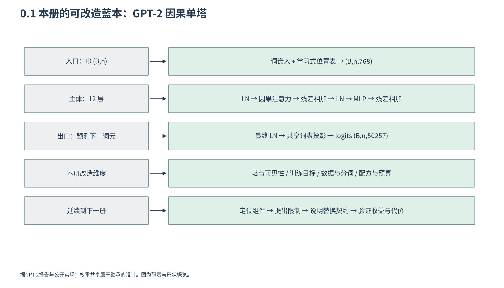

# 导览：从任务模型走向预训练模型

Book1 已经搭建了一台完整的 Transformer：编码器读取源句，解码器结合源句和已有译文预测后继词。本册从这台机器出发，探讨更大规模的学习问题和不同的使用方式。**如果希望同一份模型参数也能用于翻译之外的任务，应该先让模型学习什么，又怎样将所学用于具体任务？** 这就是预训练研究要回答的问题。

2018年，BERT与GPT给出了两条重要路线：前者用双向编码器，通过遮盖预测学习表示；后者用因果单塔，通过后继预测学习生成。2019年提出的T5继续使用编码器—解码器，把不同任务组织为文本输入和文本输出。它们继承了大量 Transformer 组件，却改变了数据可见性、训练目标和任务接口。在这段研究进程中，RoBERTa检验训练配方的作用，之后GPT-3探索上下文示例，Scaling Laws 则把参数、数据与计算预算之间的关系变成可测量的问题。

我们将沿着这些变化，最终实现 GPT-2 124M，加载官方权重核对计算；书中也保留了真实语料训练和小模型族实验的完整内容。这些模型在历史上并非必然依次替代：理解任务、生成任务、条件生成任务各有不同要求。本册希望帮助读者判断每项设计的适用范围。

## 0.1 读完这本书，你会拥有什么

**第一，一台你能解释其原理、检查其实现的 GPT-2 124M。** 第4章对照原 Transformer、GPT-1 和 GPT-2，逐项解释结构、归一化、位置表示和权重共享。第10章实现完整计算，第11章加载官方权重，检查分词、参数映射、隐状态和输出。目标参数总数为124,439,808；这个数既用于核对参数，也能帮助发现漏层、重复参数或词表口径错误。

实现不以“输出了一段像文字的内容”作为正确标准。随机网络也能输出合法 token，错误的权重转置有时也不会触发形状报错。我们会把结构验证、数值对拍和训练表现分开：先核对结构与代表性输入上的数值，再讨论训练表现。有限测试能发现许多实现错误，但不能证明所有输入下都没有错误。

**第二，一套解读损失—计算曲线的方法，以及完整的小模型族实践。** 第8章介绍 Kaplan、Chinchilla 的研究方法和已有的小模型族实验，解释预算约束如何改变模型选择。第11章进一步联系数据处理、训练过程和曲线分析。读者不仅要会拟合幂律，还要知道数据重复、模型欠训、学习率和验证集噪声怎样干扰判断。小模型的几个实验点能检验当前设置下的规律，却不能直接作为向大模型可靠外推的依据。

**第三，一套结合架构、目标、数据和使用方式作出判断的方法。** 为什么 BERT 可以在每层看见两侧上下文，却不能直接沿用普通后继预测？为什么 T5 保留两座塔？为什么 RoBERTa 的提升不能只归功于去掉一个目标？第12章回到这些问题，用前面的结构分析与实验作判断依据。

实践分为两个层次：短代码和手算帮助理解局部机制，完整工程覆盖数据、权重、训练和评测流程。二者相互支撑。是否运行长训练，取决于硬件、数据下载和时间预算；读懂核心论证不要求先完成一次长训练。

## 0.2 从 Book1 继承什么，本册改变什么

本册默认读者已经理解 Book1 的多头注意力、因果遮罩、前馈网络、残差、LayerNorm、交叉熵和编码器—解码器。多头与注意力角色分别见Book1第3、4章，残差和归一化见第6章，掩码与整机见第7章，损失和优化见第8章。用到时只作简短回顾；涉及新的性质和推理步骤时，会在本册补齐。

| 类别 | 已有基础或本册内容 | 本册落点 |
|---|---|---|
| 继承的计算组件 | 自注意力、交叉注意力、FFN、残差、嵌入与词表读出 | 第3–5章重新组合，第10章实现 |
| 继承的训练基础 | 输入与目标错开一位、teacher forcing、交叉熵、Adam、warmup、验证集 | 第3–9章按新的目标与规模展开 |
| 输入接口 | BPE、WordPiece、Unigram、字节级 BPE | 第2章；后续各模型沿用对应词表 |
| 学习目标 | MLM、因果语言模型、跨度损坏 | 第3、4、5章 |
| 迁移与使用 | 特征提取、微调、零样本、上下文学习 | 第1、3–7章 |
| 训练与预算 | 数据配方、规模定律、显存与计算成本 | 第6、8、9章 |
| 结构改动 | 双塔改为因果单塔；post-LN 改 pre-LN；位置公式改学习式查表 | 第4章，原始版本与后续版本分别说明 |
| 重要继承 | 输入嵌入与输出读出的权重共享 | 第4章重新推导与核算；不是 GPT-2 首创 |

从这张表可以看到，模型演进不限于更换网络层。有时改变的是模型“能看什么”，有时是“被要求预测什么”，有时只是数据组织与训练预算。后面介绍每项技术时，都会先指出它改变了哪个环节，再解释为什么值得这样改。

## 0.3 先看目的地：GPT-2 的完整计算

GPT-2接收一段token编号，先输出每个位置上后继token的分数（logits），再经softmax转成概率。它没有单独的源句编码器，也没有读取源句表示的交叉注意力；已有文本直接作为因果单塔的上下文。图0.1把这条计算路径放在整机中。

读图时先沿主路径走：输入编号 → token 与位置嵌入相加 → 12个 Transformer Block → 末端归一化 → 词表读出。批大小记为 $B$，上下文长度为 $n$；GPT-2 small各Block入口与出口的表示均为 $(B,n,768)$，最后词表读出的分数为 $(B,n,50257)$；注意力拆头与前馈中间层有各自的内部形状。这两个形状区分了“每个位置的内部表示”与“对下一 token 的评分”。

再看四个设计位置：

- **塔的组织**：因果单塔承担上下文建模，不再接收另一座编码器的输出。这改变了条件信息进入模型的方式，翻译等任务需要用前缀指定源文与输出格式。
- **Block 内的归一化**：GPT-2 将归一化放在残差分支入口，并增加末端归一化。第4章会解释梯度路径以及它与训练配方的关系，不把位置调整当成一劳永逸的稳定保证。
- **入口的位置表示**：学习式位置表为1024个位置各保存一个向量。原实现不扩展这张表时，只能查询已有表项；但有表项不等于相应长度都经过了充分训练，也不保证把表扩长后仍能保持效果。
- **出口的参数复用**：输入 token 嵌入与输出读出共用矩阵。共享减少参数，也让同一矩阵同时接收来自两条路径的梯度。这是从原架构继承并沿用的设计。

多头注意力、前馈网络和残差等基本构件继续存在，但激活函数、初始化和具体规格也需要核对，不能据此说“其余完全不变”。第4章负责结构与理由，第10章负责把这些选择写成完整的张量计算。

## 0.4 全册路线：问题、方案、规模与实践

| 阶段 | 章节 | 承担的问题 | 读完后的能力 |
|---|---|---|---|
| 预训练的动机 | 第1章 | 无标注文本能提供什么？词向量、上下文表示与微调怎样衔接？ | 区分表示学习与整机迁移 |
| 输入与三类路线 | 第2–6章 | 如何编码文本？BERT/GPT/T5各自学习什么？训练配方如何改变结果？ | 从结构和目标解释任务接口 |
| 扩展规模 | 第7–9章 | 上下文示例怎样起作用？如何分配预算？显存和数值约束是什么？ | 读评测、算预算、识别证据边界 |
| 实现与回顾 | 第10–12章 | 如何实现、核对、训练并比较？哪些问题交给后续各册？ | 从配置走到计算，从曲线回到设计 |

章序按知识的依赖关系安排，不严格遵循发表日期。例如 GPT-1 早于 BERT，第3章先讲 BERT，是为了先把双向表示与目标泄漏的问题讲清。每章开头会说明当前修改的位置；推导小节先概括结论及其在模型中的用途，再展开数学推导。读者可以先连读这些首段，把握论述脉络，然后回到公式细读。

## 0.5 贯穿全书的三条线

**第一条是组件逐步演进的实践线。** 第2章实现分词器，第3章通过 BERT 微调认识迁移，第4章建立参数可配的因果模型工厂，第8章用它训练模型族，第10章给出 GPT-2 定版实现，第11章加载官方权重并组织训练实验。

这里要区分教学蓝本与实际代码依赖。第8章族训练、第9章部分探针和第11章部分训练复用第4章工厂；第11章官方权重对拍复用第10章模型。它们沿用同一套主要组件思路，具体规模与实现选择还须分别核对，并非所有实验都导入同一个类。阅读各章入口时，我们会明确具体使用哪个实现，避免“同一架构”被误读为“同一个文件”。

**第二条是贯穿全书、逐步得到解答的设计问题。** 下表直接列出问题及其对应章节，方便阅读时查找。

| 设计问题 | 本册回答 | 留给后续的部分 |
|---|---|---|
| 计算变便宜怎样支持更多数据？ | 第1章历史、第8章预算 | Book3 的现代训练选择 |
| 文本怎样变成可计算的序列？ | 第2章分词与覆盖、压缩率 | 多语言与长上下文成本 |
| 交叉注意力什么时候需要？ | 第3–5章三种结构 | Book5 的多模态等条件输入 |
| 归一化怎样影响训练？ | 第4章 pre/post-LN 与实验 | Book3 的归一化组件 |
| 位置表为何限制长度？ | 第4章学习式位置、第12章预算 | Book3 的旋转位置与扩展方法 |
| 共享输入输出矩阵得失是什么？ | 第4章参数与梯度、第10章实现 | Book3 的词表和权重选择 |
| 有限预算怎样分给参数和数据？ | 第8章三种研究方法与推导 | Book3 的开源模型案例 |
| 精度、显存和稳定性如何相互影响？ | 第9章工程账本 | Book4 的低精度与优化方法 |
| 上下文示例的能力与成本怎样区分？ | 第7、11、12章 | Book5 的上下文能力、Book6 的推理成本 |

这张总览按主题指明去向，具体的后续章节入口在各章末尾列出。

**第三条是对参数、数据与计算成本的核算。** 从 GPT-2 的124M到 GPT-3 的175B，从文本字节到训练 token，从单步计算到总训练 FLOPs，本册始终要求明确统计口径。第8章推导常用近似 $C\approx6ND$ 的来历和条件，第9章补上激活、优化器状态和实现开销。不同的核算回答不同的问题：参数量不是训练显存，训练 FLOPs 也不是墙钟时间。

## 0.6 阅读、证据与实践约定

**历史主线截至 GPT-3 与 Chinchilla 时代。** 后来出现的批评可以帮助检验早先的判断，例如第7章纳入2023年的涌现指标讨论。现代位置编码、共享 KV 头、混合专家和推理引擎等内容，只在引出后续问题时简要提及；具体讲解留给后续各册。

**数学服务设计，但不省略关键推导。** 公式之前说明要解决什么问题，定义符号和形状；重要等号解释依据，拟合关系说明条件。直觉帮助记忆，不能代替论证。例如“预训练把语料规律存进参数”只是功能描述，不表示模型保存了文本数据库，也不保证精确检索或可靠推理。

**论文、实现行为、构造例与实验结果分别支持不同结论。** 本册MPS/CPU训练数字主要为2026年10月的历史记录，部分原始日志未保留，不能视为当前设备上的重新测量；短CPU数学练习用于检查代数与数值关系。不同硬件、词表、数据和预算下的结果不能直接拼成速度或能力排名。

**完整项目继续保留。** 代码与配置可以独立检查，数据和权重在运行时下载到工作区缓存；不随书分发受限语料。历史运行时间是当时设备的观察，不保证当前机器照样耗时。正文代码块给出实际命令，不把 Markdown 链接混入 shell 路径；长训练与局部检查分别说明。

下一章先回到预训练之前：当任务标签不够，而无标注文本充足时，早期词向量怎样利用这些文本？从这里出发，我们才能看清后来每一次扩展究竟增加了什么。
