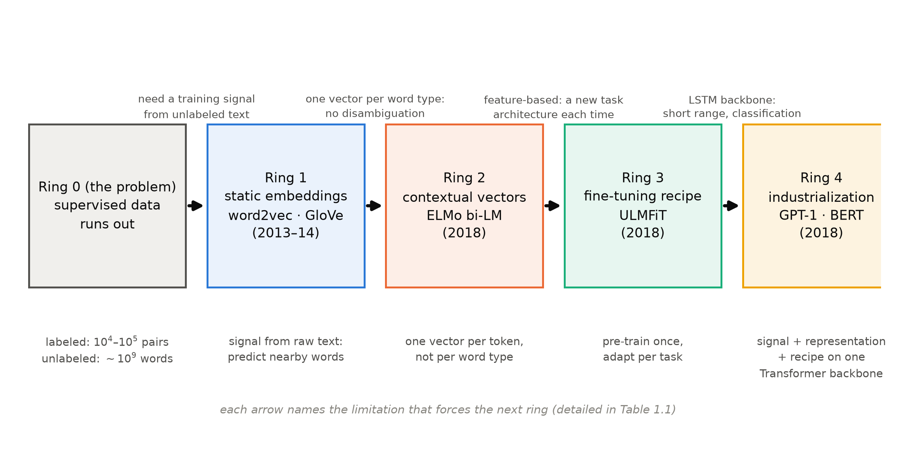
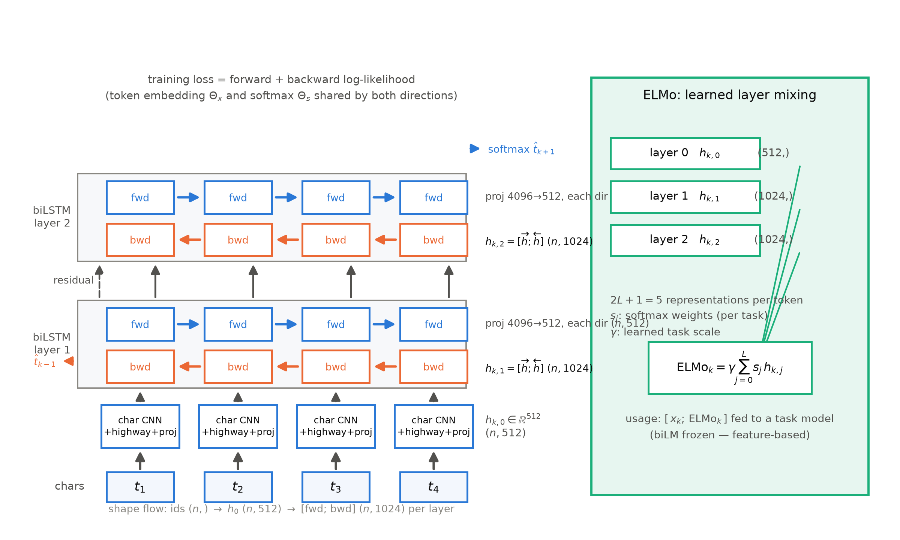

# 第 1 章 范式转移：监督数据不够了

## 1.0 开篇：从全书到这里

导览（第 0 章）的旅程地图把全书切成四段，第一段叫「范式为什么」。本册要用十三章造出一台 GPT-2 124M，但在动手拧螺丝之前必须先回答一个更根本的问题：**2018 年，整个领域为什么突然放弃了「每个任务从零训练一台专用模型」，集体转向「先在海量无标注文本上预训练（pre-training），再在少量标注数据上微调（fine-tuning）」？**这不是一次普通的算法迭代——工程习惯、数据预算、评测口径全部随之改写，学界叫它范式转移（paradigm shift）。本章就是这声发令枪的来历。它没有代码也没有实验：我们要做的是把 2013 到 2018 年的五步棋摆成一串因果链，让你以后看到任何「预训练 + 微调」的新变体，都能立刻指出它站在这条链的哪一环。出发前先立路标：本章结束时我们会走到 GPT-1 与 BERT 的门口，手里攥着三样东西——一个免费的训练信号、一套上下文表示、一份微调配方；同时会发现还缺最后一块基石，而它正是下一章的主角。导览 0.5 的三条线索有两条从本章起步：伏笔线的第一笔欠账（F3）1.1 节回收，账本线从 GloVe 的 85 分钟记到第 9 章。

> **最小背景栏**：本章不需要 Book1 之外的任何前置知识。softmax 与交叉熵损失在 Book1 第 8 章的训练配方里已经用透，此处直接复用；「语言模型」在本册首次正式定义（1.2 节），不假设你读过任何文献。你只需要带上 Book1 留下的一笔欠账——它就写在下一节开头。

## 1.1 回收 F3：并行化红利的第一次兑现

「**能并行，才敢谈规模化。**2017 年这台翻译机最被低估的遗产不是 BLEU，而是『可以在一千张卡上训练』的资格——预训练革命的物质基础。」这是 Book1 第 1 章欠账框的原话。那一册的第 11 章用四个时间戳把这句话铺成了一条谱系：2014 年 Sutskever 的 4+4 层 LSTM 用 8 块 GPU 训了约 10 天，并行只发生在机器与层之间；2016 年 GNMT 把循环路线堆到 96 块 K80、约 6 天，串行墙原封不动；2017 年前夜的 ConvS2S 换卷积拿回层内并行，解码快 9.3 倍；2017 年 Transformer 以每层 $O(1)$ 的串行操作数把「算力换训练速度」的兑换率拉满，big 模型 8×P100 三天半【证据等级：官方论文，四站出处与数字见 Book1 第 11 章 11.1 节】。现在按欠账框的承诺，正式回收 F3——先看它的第一次兑现。

兑现来得比 Transformer 还早四年。2013 年的 word2vec 论文里有一笔对照账：早期循环语言模型「在单个 CPU 上训练大约要 8 周」【证据等级：官方论文 1301.3781 §4.3】；而 word2vec 在 16 亿词的语料上训练，单机 CPU 不到一天【证据等级：官方论文 1301.3781 摘要】，新实现的处理速度达到「每小时数十亿词」的量级【证据等级：官方论文 1301.3781 §7】，谷歌内部的 DistBelief 集群版更直接吞下 60 亿词、100 万词表的语料【证据等级：官方论文 1301.3781 §4.2】。注意这里的因果方向：word2vec 的便宜并不主要来自硬件并行——它便宜，是因为把结构削到了极简，不再训练一个完整的语言模型，只训练一个「看窗口猜词」的小任务。但它在 2013 年就证明了 F3 的下位命题：**训练成本决定数据规模，数据规模决定表示质量**。结构上每一次「变便宜」，最终都会兑换成语料规模——2017 年 Transformer 把「便宜」的来源换成真正可并行的架构之后，这条兑换曲线才能一路画到 33 亿词的 BERT（第 3 章）与 40GB 语料的 GPT-2（第 4 章），再往后是第 8 章把它写成定律的幂律，以及第 10、11 章你在自己机器上的亲手兑现。

不过 word2vec 当年买到的只是「词」的表示，离「整台模型」还差五年。这五年里发生了什么，就是本章剩余部分的故事。

## 1.2 监督数据不够了：标注瓶颈与无标注海洋

红利在手，下一个问题是拿它训练什么。2018 年以前的标准答案很朴素：一个任务、一个数据集、一台从零训练的判别模型。这个答案撑了很多年，直到两边的体量差再也藏不住——GPT-1 论文的摘要把这笔账一句话钉死：

> "Although large unlabeled text corpora are abundant, labeled data for learning these specific tasks is scarce, making it challenging for discriminatively trained models to perform adequately."（无标注文本语料浩如烟海，而学习这些具体任务所需的标注数据却很稀缺，判别式训练的模型难以有良好表现。）【证据等级：官方论文 GPT-1（OpenAI PDF）摘要，直引】

「稀缺」到什么程度？拿本册第 3 章将要亲手微调的两个数据集当样本：SST-2 情感分类约 6.7 万句，MRPC 句对判定只有 3,668 对【证据等级：config/源码（HF datasets 统计，第 3 章实测口径）】；而无标注那一侧，BooksCorpus 加维基百科合计约 33 亿词【证据等级：官方论文 1810.04805 v2 §3.1】——万级对十亿级，四个数量级的落差。更要命的是标注数据不光少，还脆：在阅读理解数据集 SQuAD 的训练集里掺入一小批人工构造的干扰句，当时最好的模型 F1 从 88.8 直坠 36.4，一半分数蒸发【证据等级：官方论文（转引）——Jia & Liang 2017，转引自 ULMFiT §2】。ULMFiT 论文补上另一面：小数据集上从零训练深层模型，14 个测试里 13 个过拟合【证据等级：官方论文 1801.06146 摘要】。数据不够、数据脆、模型记不住——三条证据一起指向同一个结论：**逐任务从零训练这条路，到头了。**

那造一台「通用语言机器」下一步需要什么？需要一个不依赖人工标注的训练目标。候选一直摆在那里：

$$\mathcal{L}_{\mathrm{LM}} = -\sum_{k=1}^{N} \log\, p\!\left(t_k \mid t_1, \dots, t_{k-1}\right) \tag{1.1}$$

这就是语言模型（language model, LM）的目标：给定前文，预测下一个词。用人话说：把语料里每个词的「下一个词」当考题，答案就抄原文——**标签免费，题量等于语料量**。今天我们叫它自监督（self-supervised）：监督信号不是没有，而是从数据里自己造出来的；2018 年的论文口径统一叫「无监督预训练」（unsupervised pre-training），指的只是「无人工标注」——读文献时要知道这两个词说的是同一件事。有了免费的目标，「预训练 + 微调」两阶段的构造逻辑就自然立起来了：第一阶段在大语料上用式 (1.1) 或其变体训一台通用模型，贵，但训一次到处用；第二阶段在每个任务的小标注集上给这台模型加一个小输出头继续训练，便宜，每个任务都付得起。几个月后 BERT 把这套两阶段写成标准件——「预训练与微调两个步骤、跨任务统一架构」【证据等级：官方论文 1810.04805 v2 §3，直引大意】。GPT-1 的引言还老实交代了当时悬而未决的两件事：用什么无监督目标最有效、学到的表示如何迁移到目标任务【证据等级：官方论文 GPT-1 §1】——前者由第 3、4 章的目标函数创新回答，后者的答案正是 1.5 节的微调配方。计算机视觉的迁移学习（transfer learning）在那几年恰好演示过这套剧本的成功版本，于是有了一个流传极广的类比——「NLP 的 ImageNet 时刻」。这个类比的出处值得单独开一个考据框，因为它的三层来历经常被讲混。

> **【考据框】「NLP 的 ImageNet 时刻」出处考**
> ① **GPT-1 原文没有这句话**。全文检索（含引言）只命中一处泛泛的 "image classification"，且引的 CV 文献是 2006–2010 年无监督预训练的老前史，结论是「预训练起到了正则化的作用」【证据等级：官方论文 GPT-1 §2；负结论已全文核】。② 论文级的「ImageNet 微调配方」原句在 BERT：*"Computer vision research has also demonstrated the importance of transfer learning from large pre-trained models… an effective recipe is to fine-tune models pre-trained with ImageNet"*【证据等级：官方论文 1810.04805 v2 §2.3，直引】。③ 「NLP's ImageNet moment」这个口号出自 Sebastian Ruder 2018 年 7 月 12 日的博客（作者本人是 ULMFiT 共同作者）：这些工作「可能对 NLP 产生与 ImageNet 预训练模型对计算机视觉同样广泛的影响」，并预言一年内从业者将「下载预训练语言模型，而不是预训练词向量」【证据等级：厂商自报（个人博客 ruder.io/nlp-imagenet，2018-07-12）——事后看预言命中，但引用必须标明博客等级】。

本章接下来的路线，就是把这个「为什么」拆成五环论证链，一环一环走到 GPT/BERT 门口——图 1.1 是全程地图：环 0 是问题，环 1–4 是四步解答，每支箭头上标着「上一环留下的局限」，正是它逼出下一环。

图 1.1 五环论证链（自绘，示意级）：环 0 是问题（监督数据不够），环 1–4 是四步解答；箭头上的短语为上一环被击破的局限，与表 1.1 最后一列对应

## 1.3 静态词向量：word2vec 的窗口-预测机制

先看环 1 要回答的问题：从无标注文本里「白嫖」训练信号，究竟可不可行？2013 年的答案是可以——只是当时学到的不是整台模型，而是每个词的一个向量：词向量（word vectors），术语也叫词嵌入（word embeddings）。

直觉先于公式。完形填空你从小就会：「The cat sits on the ___」，你能填出 mat，说明上下文里确实藏着关于空格的信息。word2vec 把这个直觉推到底：**一个词的含义，由它周围经常出现哪些词决定**——拿预测任务当榨汁机，把语料里的搭配统计榨进向量。榨法有两种、方向相反：CBOW（continuous bag-of-words，连续词袋）拿上下文猜中心词，skip-gram（跳字模型）拿中心词猜上下文——论文原图注的原话是 "The CBOW architecture predicts the current word based on the context, and the Skip-gram predicts surrounding words given the current word."【证据等级：官方论文 1301.3781 Figure 1 图注，直引】。以 skip-gram 走一遍机制：句子 "the cat sits on the mat"，取中心词 sits、窗口半径 2，得到四个训练对 (sits, the)、(sits, cat)、(sits, on)、(sits, the)；语料的每个位置都这样切一遍，16 亿词就变成了几十亿道微型选择题（窗口放到更大尺寸时题量更多——按本例的算法，半径 5 即每词 10 个上下文对，16 亿词约 160 亿道，上百亿）——这就是 1.2 节说的「自造监督信号」在 2013 年的样子。每个词配两份向量：当中心词时查输入向量 $v_w$，当被预测词时用输出向量 $v'_w$，两份都要学。

机制图画出来了，还有个工程问题挡路：词表 $V$ 有十万到百万级，每道选择题的答案本该对全词表做 softmax——这才是真正的计算瓶颈。word2vec 的第一把刀是层次 softmax（hierarchical softmax），把「在全词表里挑一个」变成「沿 Huffman 树走 $\log_2 V$ 步」，百万词表约提速两倍【证据等级：官方论文 1301.3781 §2.1】；一年后的续作换上第二把更狠的刀——负采样（negative sampling），训练目标变成：

$$\log \sigma\!\left({v'_{w_O}}^{\top} v_{w_I}\right) + \sum_{i=1}^{k} \mathbb{E}_{w_i \sim P_n(w)} \log \sigma\!\left(-{v'_{w_i}}^{\top} v_{w_I}\right) \tag{1.2}$$

| 符号 | 含义 | 形状 / 取值 |
|---|---|---|
| $v_{w_I}$ | 中心词的输入向量 | $\mathbb{R}^{d}$，实验 $d{=}300$ |
| $v'_{w_O}$ | 窗口词（正例）的输出向量 | $\mathbb{R}^{d}$ |
| $v'_{w_i}$ | 噪声词（负例）的输出向量 | $\mathbb{R}^{d}$，每步采 $k$ 个 |
| $P_n(w)$ | 噪声分布：unigram 频率的 $3/4$ 次幂 | $U(w)^{3/4}/Z$ |
| $k$ | 负例个数 | 小数据 5–20，大数据 2–5 |

【证据等级：官方论文 1310.4546 Eq.4 与 §2——注意负采样属续作，1301.3781 只有层次 softmax】用人话说：式 (1.2) 把每道「全词表选择题」偷换成 $k+1$ 道「是非题」——正例（真邻居）把内积推高，负例（随机词）把内积压低，每个训练步只碰 $k+1$ 个词而不是整张十万词表；噪声分布取频率的 $3/4$ 次幂，是给低频词留一点出场机会。配套还有第三把小刀：高频词子采样（subsampling），"the" 这类词按 $1-\sqrt{t/f(w)}$ 的概率直接丢弃（$t\approx 10^{-5}$），训练再快 2–10 倍，低频词的表示反而更好【证据等级：官方论文 1310.4546 §2.3】。

效果兑现了 1.1 节的预言——便宜换规模，规模换质量。同一份 7.83 亿词语料、同为 300 维的对照里，skip-gram 语义类比准确率 50.0%、CBOW 只有 15.5%【证据等级：官方论文 1301.3781 Table 4】；换一组架构对照（Table 3，640 维、LDC（语言数据联盟）语料 3.2 亿词/8.2 万词表——与已发表的 NNLM/RNNLM 结果同数据同列），语义类比上 skip-gram 55%、CBOW 24%，而训练贵一个量级的 NNLM 23%、RNNLM 9%【证据等级：官方论文 1301.3781 Table 3 与 §4.3】。负采样对层次 softmax 的胜利同口径：10 亿词语料、300 维，负采样（15 负例）类比总精度 61%、层次 softmax 47%，开子采样后 36 分钟就训完【证据等级：官方论文 1310.4546 Table 1】。

学出来的向量在空间里排出了可解释的几何：big 到 biggest 的位移方向，与 small 到 smaller 的几乎平行；Paris − France + Italy 的最近邻是 Rome【证据等级：官方论文 1301.3781 Table 8】。「语义 = 空间中的方向」这个心智模型，是词向量时代留给后世最重要的遗产。但那个家喻户晓的 king − man + woman ≈ queen，出处常被讲错——

> **【考据框】king − man + woman ≈ queen 的真出处**
> 这个等式最早不是出现在 word2vec 论文里，而是 Mikolov、Yih、Zweig 的 NAACL 2013 短文（编号 N13-1090），且实验用的向量**是 RNNLM（Mikolov 2012）输入投影矩阵的列向量**——3.2 亿词的 Broadcast News 语料、8.2 万词表——压根不是 word2vec【证据等级：官方论文 N13-1090 §3】。这篇短文的句法类比测试（7 类 × 1000 题）给出 RNN 向量 39.6% 对 LSA 的 11.3%，并强调「三题能对一题以上，而瞎猜只有千分之几」【证据等级：官方论文 N13-1090 Table 2】。word2vec 主论文只是以引用方式重述了 king/queen 例子（§1.1，定性、无数字）；它自己给出的诚实口径在 §5：按严格精确匹配计，示例表里的关系只「约 60%」正确【证据等级：官方论文 1301.3781 §5】。流传的「百发百中」从来不存在于任何原文——引用向量算术时，60% 与 39.6% 这两个数字才是论文级的。

窗口法很快有了对照组。GloVe 指出窗口模型只用局部统计，而全局的共现计数（co-occurrence statistics：语料里词 $i$ 与词 $j$ 在窗口内同现的次数）同样躺在那里；它直接让词向量的内积去回归共现计数的对数，$\sum_{i,j} f(X_{ij})\left(w_i^{\top}\tilde{w}_j + b_i + \tilde{b}_j - \log X_{ij}\right)^2$，加权函数 $f$ 压住高频词的发言权【证据等级：官方论文 D14-1162 §3–4.2】。为什么回归「计数的对数」？论文给了一个能手算的动机例：拿 ice 与 steam 当两个磁极，探针词 solid 与 ice 同现的概率是与 steam 的 **8.9 倍**（强判别信号），gas 反向差到 $8.5\times10^{-2}$（也是强信号），water 两边都沾（比值 1.36，无判别力），fashion 两边都不沾（0.96）——原始概率噪声大，**比值才是信号**【证据等级：官方论文 D14-1162 §1 Table 1】。结果却是一场合流：60 亿词语料上，GloVe 词类比总精度 71.7%、word2vec skip-gram 69.1%——同量级【证据等级：官方论文 D14-1162 Table 2】；论文的收束句是两类方法「在根本层面上并无 dramatic 的不同，因为它们探测的都是底层的共现统计」【证据等级：官方论文 D14-1162，直引大意】。顺带记两笔账：GloVe 还画出了类比精度随向量维度、随语料规模的增长曲线【证据等级：官方论文 D14-1162 §4.4–4.5 Figure 2/3】——那是 scaling 曲线在词向量时代的雏形，第 8 章 Kaplan 幂律的远祖；而 60 亿词语料、40 万词表的共现矩阵，光填出来单线程就要 85 分钟、300 维一次迭代 32 核 14 分钟【证据等级：官方论文 D14-1162 §4.2】——预训练时代的第一笔工程账，欠账框登记、第 9 章回收。

word2vec 与 GloVe 一起证明了环 1，也一起撞上同一堵墙：**静态**。每个词型（word type，词典里的一个词条）无论出现在什么句子里，永远是同一个向量；向量再好，也只是「放进模型第一层的一个特征」。词该带着上下文走——这是环 2 的入场券。

## 1.4 上下文向量：ELMo 的双向语言模型

上一节结尾那堵墙有个具体的名字：play。Broadway 的 play（戏剧）与棒球解说里的 play（防守动作），GloVe 给出的最近邻几乎全是体育义——一个向量伺候不了两个意思【证据等级：官方论文 1802.05365 Table 4】。病根在粒度：静态向量是词型级的，消歧需要词例（word token，一次具体出现）级——每个词例的表示应当是「整句话的函数」。这是 ELMo 论文的原话："each token is assigned a representation that is a function of the entire input sentence"【证据等级：官方论文 1802.05365 §1，直引】。

要造这个函数，原料还是 1.2 节的语言模型——只是两个方向各造一台：

$$p(t_1, \dots, t_N) = \prod_{k=1}^{N} p\left(t_k \mid t_1, \dots, t_{k-1}\right) \tag{1.3}$$

$$p(t_1, \dots, t_N) = \prod_{k=1}^{N} p\left(t_k \mid t_{k+1}, \dots, t_{N}\right) \tag{1.4}$$

式 (1.3) 从左往右读、猜下一个词；式 (1.4) 从右往左读、猜上一个词。双向语言模型（bidirectional language model, bi-LM）就是这两台的联合：训练目标是两个方向对数似然**相加**，token 嵌入与输出 softmax 双向共享，LSTM 参数按方向各自独立【证据等级：官方论文 1802.05365 §3.1】。用人话说：两台「独眼」阅读器，一只只看左半边、一只只看右半边，各自把句子的统计规律吃进去。注意一个要害：这是**两个单向模型的拼接，不是深层双向**——任何一层里，每个方向都看不见另一半句子。「为什么不干脆让模型一层同时看两边？」这个问题牵涉训练目标的深层困难，第 3 章 BERT 的掩码语言模型会正面回答，此处按下。

整机结构如图 1.2：底座是 $L=2$ 层双向 LSTM。最底层是 token 层——字符级 CNN（2048 个卷积核）加两层 highway 再投影到 512 维，词表外的拼写也能编出向量；其上每方向每层 4096 个单元、投影回 512 维，前后向拼接成 1024 维；第一层到第二层带残差连接【证据等级：官方论文 1802.05365 §3.4】。预训练语料是十亿词级的 1B Word Benchmark，训 10 个 epoch【证据等级：官方论文 1802.05365 §3.4】——到此为止，仍是「无标注语料 + 预测目标」的旧配方。ELMo 的真正发明在下一步：**怎么取用这台机器**。

图 1.2 ELMo bi-LM 与任务可学的层加权（自绘重制，引 1802.05365 Fig.3 风格；原图许可未核到，按全书图规自绘示意级，结构要素据其 §3.1–3.4）【证据等级：官方论文 1802.05365 §3】

LSTM 是逐层精炼的：每个 token 在这台机器里同时拥有 $2L+1$ 份表示——token 层一份 $h_{k,0}$，每个 biLSTM 层各一份 $h_{k,1}, h_{k,2}$。ELMo 不做选择题，而是让每个下游任务自己学一份加权：

$$\mathrm{ELMo}_k^{\,\mathrm{task}} = \gamma^{\,\mathrm{task}} \sum_{j=0}^{L} s_j^{\,\mathrm{task}}\, h_{k,j}^{\,\mathrm{LM}} \tag{1.5}$$

| 符号 | 含义 | 形状（单 token / 整句 $n$ 个） |
|---|---|---|
| $h_{k,0}$ | token 层表示 | $\mathbb{R}^{512}$ / $(n, 512)$ |
| $h_{k,j},\, j\ge 1$ | 第 $j$ 层前向 $\oplus$ 后向拼接表示 | $\mathbb{R}^{1024}$ / $(n, 1024)$ |
| $s_j^{\,\mathrm{task}}$ | 任务可学的层权重（softmax 归一） | 标量 $\times\,(L{+}1)$ 个 |
| $\gamma^{\,\mathrm{task}}$ | 任务可学的整体缩放 | 标量 |
| $\mathrm{ELMo}_k$ | 第 $k$ 个 token 的最终向量 | 随任务模型输入而定 |

【证据等级：官方论文 1802.05365 Eq.1（§3.2）】用人话说：不是只拿最顶层，而是把「句法取几成、语义取几成」做成两个可学旋钮，交给任务自己拧。「层与层分工不同」有实证：全词词义消解上层更好（第二层 F1 69.0 对第一层 67.4），词性标注却下层更好（第一层 97.3 对第二层 96.8）——低层管句法、高层管语义【证据等级：官方论文 1802.05365 Table 5/6】；SQuAD 上只用末层 84.7、按式 (1.5) 全层加权 85.2——加权确实在挣钱【证据等级：官方论文 1802.05365 Table 2】。

用法上，ELMo 是特征法（feature-based）的代表：biLM 预训练完就冻结（论文原话 "we first freeze the weights of the biLM"），把 $[\,x_k;\, \mathrm{ELMo}_k\,]$ 拼进每个任务自己的模型【证据等级：官方论文 1802.05365 §3.3，直引】。效果横扫六个任务：SQuAD F1 81.1→85.8（相对误差降 24.9%）、NER 90.15→92.22（21.0%）、SRL 17.2%、SNLI 5.8%、指代消解（coreference）9.8%、SST-5 6.8%；论文 §4 的保守口径是 6–20%（引言写 up to 20%），Table 1 的 24.9% 是单模型基线口径，引用时注意分口径【证据等级：官方论文 1802.05365 Table 1 与 §4】。对「数据不够」更致命的一击是小样本效率：SRL 任务上 ELMo 用 1% 的标注数据就追平了基线用 10% 数据的效果【证据等级：官方论文 1802.05365 Figure 1】——预训练的本质是**买标注效率**，这个心智从环 2 就立起来了。

但特征法的天花板也在这里：每个下游任务仍要设计自己的结构，ELMo 只是把更好的向量喂进去——GPT-1 论文的批评是它需要「为每个单独的目标任务新增大量参数」【证据等级：官方论文 GPT-1 §1，直引大意】。加上 LSTM 长程记忆弱、双向只是浅拼接，三个局限一起把问题递给下一环：**既然预训练的 LM 这么有用，能不能不借它的向量，而是把整台机器直接微调？**

## 1.5 微调配方：ULMFiT 三阶段与四件套

把 LM 当特征提取器用，多少有些浪费——预训练出来的是一台参数齐全的模型，为什么只取它的中间向量？直接在下游任务上继续训练整台机器，听起来更自然，但 2018 年以前大家都清楚这条路的地雷：深层网络在小数据集上一顿猛调，会把预训练攒下的通用知识冲掉，术语叫灾难性遗忘（catastrophic forgetting）。ULMFiT 的贡献是证明：**微调可行，但要按配方来**。（时间线诚实声明：ULMFiT 与 ELMo 同在 2018 年上半年面世，本章按论证链而非日历顺序讲。）

它的流程分三阶段【证据等级：官方论文 1801.06146 §3，Figure 1】：一、**通用 LM 预训练**，在 WikiText-103（28,595 篇维基文章、1.03 亿词）上训练语言模型——贵，但训一次到处用；二、**目标任务 LM 微调**，在目标任务自己的无标注文本上继续训 LM，把领域词的分布也吃进去；三、**目标任务分类器微调**，在 LM 顶端加一个小分类头（两个线性块），解冻整台机器微调。特别值得玩味的是底座：AWD-LSTM，论文原话是「一个常规的 LSTM——没有注意力、没有捷径连接、没有任何精巧的添加」【证据等级：官方论文 1801.06146 §3，直引大意】，嵌入 400 维、3 层、每层 1150 单元。底座如此平平无奇，恰好构成论点的控制变量：增益全部来自训练与微调的配方。**「配方 ≥ 架构」这条谱系，起点就在这里**——第 6 章 RoBERTa 将用一次不动架构、只改配方的复跑把这个命题做成大实验，此处先把旗立上。

配方是四件套。一、**判别式分层学习率**（discriminative fine-tuning）：越靠底层学习率越小——底层装的是最通用的知识，该走小步；论文取下层学习率为上一层的 $1/2.6$。二、**斜三角学习率调度**（slanted triangular LR）：先短促升温、再长尾降温——升温段只占前 10%，最低学习率压到峰值的 $1/32$；论文强调与常规三角调度的区别就在「短升长降」，这是好性能的关键。三、**逐步解冻**（gradual unfreezing）：先冻住全网只解冻最后一层训 1 个 epoch，再逐层向下放开——论文原话点破理由：最后一层装着「通用性最少的知识」，最该先动。四、BPT3C 加拼接池化：长文档切成定长段、前段末状态初始化后段，最终句表示取 $[\,h_T;\, \mathrm{maxpool}(H);\, \mathrm{meanpool}(H)\,]$，缓解 RNN 只记得结尾的毛病【证据等级：官方论文 1801.06146 §3.2–3.3】。四件套拧在一起，直觉就一句话：预训练模型像一摞从通用到特化的积木，微调最怕一巴掌把整摞拍歪——于是从上往下逐层放开、下层小步上层大步、总步幅先热身后退火。

数字把这套配方的价值标得很清楚。同一架构（AWD-LSTM）在 IMDb 影评分类上从零训练错误率 10.31，按三阶段走完是 4.60——架构一字不改，相对降 55.4%【证据等级：官方论文 1801.06146 §4.1】。数据效率更是直接回应 1.2 节的标注瓶颈：摘要句是「只用 100 个标注样本，即可匹敌从零训练用 100 倍数据的效果」【证据等级：官方论文 1801.06146 摘要，直引大意】；正文拆解——纯 100 例错误率 7.75，已与从零用 10 倍数据（7.67）几乎持平；再在第二阶段借 4.2 万条领域内无标注文本做 LM 微调，错误率 4.55，反超从零用 100 倍数据（4.60）【证据等级：官方论文 1801.06146 §5】。无标注文本换标注数据的「汇率」，第一次被明码标出。消融同样干净：IMDb 上 LM 微调后 6.99，加判别式学习率 5.55，再加斜三角调度 5.00——每件配方都在挣饭吃【证据等级：官方论文 1801.06146 Table 6】。

到这一环，2018 年初的局面是：信号（1.2 节）、表示（1.4 节）、配方（本节）全部就绪，只差一台配得上的底座。GPT-1 论文给前驱们的定位就是这句：Dai 等人与 Howard、Ruder 沿语言模型预训练改进了文本分类，但「他们对 LSTM 的使用把预测能力限制在了短程；相比之下，我们选择 Transformer 网络，得以捕捉更长程的语言结构」【证据等级：官方论文 GPT-1 §2，直引大意】。

## 1.6 局限链收口：三重局限逼出「Transformer + 预训练」

五环走完，表 1.1 把前史四篇的账并排摊开——每一行的「关键局限」列，就是图 1.1 里那几支箭头。

表 1.1 前史四篇对比（自排；各行数字与出处的证据等级见正文各节标注）

| 篇目（年份） | 学到什么 | 怎么用 | 关键局限 | 逼出谁 |
|---|---|---|---|---|
| word2vec（2013–14，含负采样续作） | 词型级静态向量 | 查表当第一层特征 | 静态：一词一向量，无法消歧；知识只进第一层 | ELMo |
| GloVe（2014） | 同上（全局共现拟合法） | 同上 | 同上——与窗口法合流，天花板相同 | ELMo |
| ELMo（2018） | 词例级上下文向量（bi-LM 内部状态的加权） | 冻结 biLM、特征拼接 | 特征法：每任务仍要建结构；LSTM 长程弱；浅双向 | ULMFiT（配方）+ GPT-1（底座） |
| ULMFiT（2018） | 微调整台 LM 的配方 | 预训练 → 目标域 LM 微调 → 分类微调 | 底座是 LSTM；主战场是分类 | GPT-1 |

门后就是环 4。GPT-1 把式 (1.1) 的语言模型目标搬到 12 层 Transformer 解码器上，BooksCorpus 的 7,000 多本书喂进去，12 个任务里 9 个刷新纪录【证据等级：官方论文 GPT-1 摘要与 §4】；几个月后 BERT 换一个预训练目标（第 3 章详述），在 33 亿词语料上把 GLUE 成绩抬到 80.5、绝对提升 7.7 个百分点【证据等级：官方论文 1810.04805 v2 摘要】。硬件账值得与 1.1 节并排看：BERT 的 LARGE 档用 64 块 TPU 芯片训 4 天、在 33 亿词语料上过了 40 遍【证据等级：官方论文 1810.04805 v2 附录 A.2】——当年 96 块 K80 只能把循环网络推到 GNMT 的天花板，两年后同一量级的卡数喂出的已是一台通用语言机器。F3 的红利在这里完成第一笔大规模兑付。

回头看，环 1 到环 4 每一步都不是灵感，是被逼的：静态逼出上下文，特征拼接逼出微调，LSTM 逼出 Transformer——三重局限链的尽头，站着「Transformer + 预训练」这对组合。收拢成一句话：**word2vec 给了信号，ELMo 给了表示，ULMFiT 给了配方，GPT/BERT 把三者焊上同一台 Transformer 底座、再给足语料——预训练从此不是「特征工程的外挂」，而是「模型的出厂设置」。**但在本册进入第二段旅程「范式三物种」（第 2-6 章，三物种的主体在第 3-6 章）之前，还欠最后一块基石：范式的原料是无标注文本，而机器只认整数 id——任何文本进机器前，必须先变成「词表内的编号序列」。词表选大，每个词分到的数据被摊薄；词表选小，大量词直接变成查无此词的 unk。word2vec 的 100 万词表、BERT 的 3 万、GPT-2 的 50,257——这些数字是怎么从语料里「长」出来的？下一章，开箱分词器。

## 1.7 本章小结

开篇问的是：2018 年，整个领域为什么转向「预训练 + 微调」？本章用五环论证链回答了它。环 0 盯住病根：标注数据稀缺、脆、贵，而无标注文本的海洋就摆在那里。环 1（word2vec/GloVe）证明免费的训练信号可以自造，静态向量是第一份红利；环 2（ELMo）用双向语言模型把表示升级到词例级，顺手证明了预训练买的是标注效率；环 3（ULMFiT）交付微调配方，把「预训练的 LM 可以整体微调」从禁忌变成工程；环 4（GPT-1/BERT）把三者焊上 Transformer 底座，完成工业兑现。1.1 节还回收了 Book1 的 F3：word2vec 在 2013 年就预演了「训练成本换数据规模」的交易，Transformer 把交易汇率拉满，BERT 的 4 天 64 芯片是第一笔大额兑付。

**带走的心智**：如果细节都要还回去，请留下两句。第一句：**监督信号可以从语料里自造——把文本的一部分当考题、另一部分当答案；预训练的全部魔法起点只是这个「免费的考题」，它兑现出的货币是标注效率**（100 例追平 100 倍数据，就是汇率的标价）。第二句：**范式史的每一步都是被局限逼出来的，不是被灵感领出来的**——往后看到任何新模型，先找它上一代的「关键局限」那一列，你就能大致预言它必须长什么样。

离「造出这台机器」还差三块基石：原料（分词，第 2 章）、三种范式的架构与目标（第 3-6 章）、规模化的定律（第 7-9 章），然后动手（第 10-11 章）。下一章先补原料：范式的原料是无标注文本，但机器只认 id——词表的边界，就是模型的词世界。

> **【欠账】** GloVe 的共现矩阵是预训练时代的第一笔工程账：60 亿词语料、40 万词表，矩阵填充单线程 85 分钟、300 维一次迭代 32 核 14 分钟——词表与语料再涨两个数量级之后，这笔账怎么算得动？第 9 章的显存与算力账本回收。→ Book2 第 9 章
