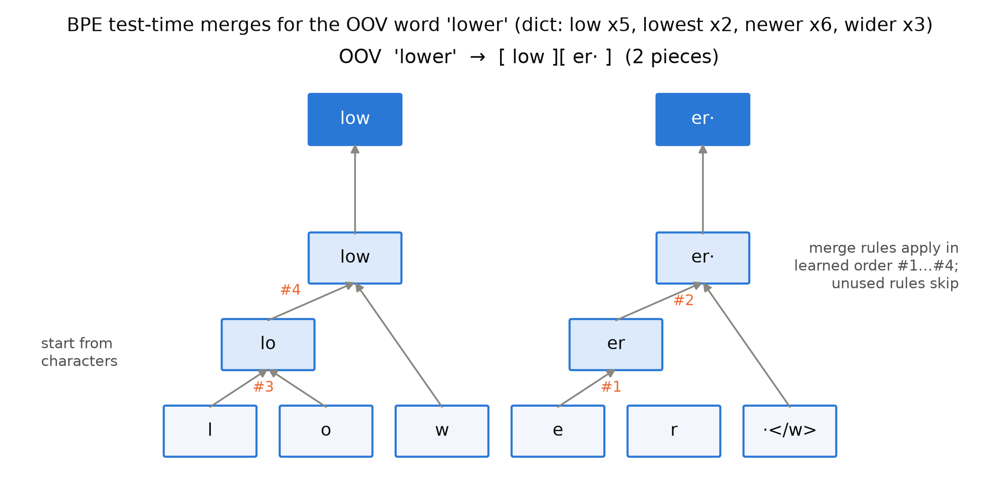
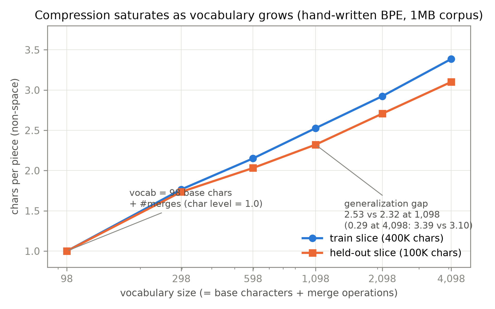

# 第 2 章 分词器：BPE 从零讲透

## 2.0 开篇：从全书到这里

上一章我们把 2013 到 2018 的前史走成了五环论证链：静态词向量打破了一词一向量的旧梦，上下文向量救回了多义词，微调配方证明了「怎么训」至少和「是什么架构」一样重要——链的尽头是那个共同的瓶颈：标注数据不够了，而无标注文本是海洋。但要在海洋上训练，还差最后一块基石：机器吃的是整数 id，不是字符。一段任意文本进来，谁把它变成一列 id？第 1 章结尾我们把它显式留给了本章。

这块基石在 Book1 里已经当过三次黑盒。第 8 章辨析 37k 词表口径、第 9 章自训 8k 词表并展示切分，欠账框都记着同一笔账。本章的问题清单就是那张欠条本身，四张：**BPE 词表怎么从语料统计里「长」出来？0.2 秒训一张 8k 词表，快在哪？「约 3.7 字符/piece、unk 约 1.9%」这两个数是怎么算出来的？为什么 `Nähe` 会被切成 `▁/N/ähe` 三片？** 我们用三幕回答：第一幕把欠条原文摆上桌（2.1）；第二幕手写一个 mini-BPE，把每个数字亲手复算钉死（2.3-2.4）；第三幕把字符级与字节级并排对照，让「unk 为什么存在」闭环（2.6）。中途顺手把整个分词器家族——WordPiece、Unigram、SentencePiece、byte-level BPE——的谱系一次讲清（2.5），因为 BERT 和 GPT-2 的词表分属这个家族的两支，后面各章都要回来对表。

章末你会得到一件正式资产：[`code/ch02/bpe.py`](code/ch02/bpe.py) 里一个 200 余行、可独立运行的 BPE 实现，以及一张被它实测数字填满的账。而新的问题也会同时冒出来：词 id 就绪之后，理解侧的物种（BERT）拿什么目标函数去吃它们——那是下一章的入口。

> **最小背景栏**（本章唯一需要的册外知识）：
> - **词频统计与哈希表**：把文本切成「词 → 出现次数」的对照表，就是一张哈希表；BPE 全程只在这张表上做算术。
> - **UTF-8 与字节**：任何文本在计算机里都是字节序列。UTF-8 是变长编码——ASCII 字符占 1 字节，`ä`、`é` 等带变音符的拉丁字母占 2 字节，一个汉字占 3 字节，emoji 占 4 字节。用人话说：**字符串只是字节序列的一层皮**，这一点是 2.6 节 byte-level 方案的全部地基。
> - 词、词表、OOV（未登录词，out-of-vocabulary）、piece/词元（token）：Book1 第 1 章、第 8 章 8.4 节已建立，此处直接沿用。

## 2.1 第一幕·还欠条：四个数字当问题清单

先把欠条原文摆上桌。Book1 第 8 章 8.4 节在辨析「37k 共享 BPE」的论文口径时写道：「切分器怎么训练，本书当黑盒用，拆解欠账在章末」，欠账框登记的是：「BPE 词表怎么从语料里『长』出来、压缩率与 unk 率的账怎么算，开箱拆齿轮在下一册——届时回收第 9 章的『约 3.7 字符/piece、unk 约 1.9%』当验证算例」。第 9 章 9.1 节的借用框给得更具体——sentencepiece「三个 API 之外一概不用；本章绝不深入它们的内部」，算法债记账；随后 9.2 节把这些数字用满：「训练只要 0.2 秒」（CPU 实测）、「训练集口径：unk 率约 1.9%，平均约 3.7 个字符挤在一个 piece 里」、以及两个真实的切分——「`Nähe`（附近）→ `▁ / N / ähe`——低频词切成三片，拼回来原样」「`Büsche`（灌木丛）→ `▁Bü / sche`——稍常见的词切两片」【证据等级：本书实验（Book1 第 9 章，2026-10）】。

四个数字——**0.2 秒、3.7、1.9%、`▁/N/ähe`**——就是本章的问题清单。它们分属三种性质：0.2 秒是**效率**问题（在什么数据结构上做统计，决定了快慢）；3.7 和 1.9% 是**口径**问题（分子分母各算什么，稍换一种算法就不可比）；`▁/N/ähe` 是**机制**问题（词表里到底存了什么，切分时发生了什么）。这三种性质也正好是本章的行进方向：先建直觉（2.2-2.3），再开箱（2.4），最后并排对照（2.6）。开箱之前，还要交代一条沿用自 Book1 第 9 章的合规红线：Multi30K 语料为 CC BY-NC-SA，一切衍生产物（本章的自训词表、复算结果）只落工作区 `log/` 目录、不入书仓不分发；本章新引入的德文语料取自古登堡计划（Project Gutenberg）的公版书，GPT-2 官方词表文件从 OpenAI 公开存储下载，同样只落 `log/`。

## 2.2 为什么需要子词：两端都走不通

要理解 BPE 在解决什么，先看它两边的邻居怎么失败。整词（word-level）是词表的原始形态：一句话按空格切开，每个词占词表一行。它的第一笔账 Book1 第 1 章见过——Sutskever 2014 的序列到序列模型源端词表 160,000，照样吃 UNK。Sennrich 等人 2016 年在 WMT15 英德数据上的统计把这笔账算到了极端：按词切分，100m token（m=百万，即 1 亿词元）的语料有 **1,750,000 种词形**，测试集 newstest2013 上 **1,079 个 UNK**【证据等级：官方论文 1508.07909（ACL P16-1162）Table 1】。词表装不下是一半；另一半更隐蔽——语料里词频排名 50,000 开外的词出现不足 60 次，排名 500,000 开外的只出现 2 次（同文 §5.1），这些低频词即使进了词表，训练信号也稀得学不出好表示。**开放词表与表示稀疏，是整词方案的两笔结构性欠账。**

往另一个极端走，字符（char-level）把词表压到 3,000 种字符、UNK 归零，但代价写在这张表的第二行：同样的语料膨胀成 550m 个字符——**序列长度 5.5 倍**（Table 1）。序列一长，Book1 从第 2 章敲到第 11 章的那笔账立刻回来：自注意力的计算量随长度平方涨，循环网络则是串行步数线性涨。信息没有变多，账单却翻了五倍半——这是「序列税」。

BPE 的位置就在这两端的中间。同一张 Table 1 里它的行是：59,500 次合并之后，token 数 112m——只比词级长 12%；词表 63,000——从 175 万压到 6.3 万；UNK **0**。用一句话说：**高频词整存，低频词切碎**。「the」这样的高频词值得独占一行；几年遇不上一次的「Nähe」拆成 N/ähe 也不委屈它——拼回来就行。直觉先立住，账要能算。整词与子词之争，归根到底是在「词表大小 ↔ 序列长度」这条权衡轴上取点，而取点的好坏要用**压缩率**（compression ratio）来度量：

$$\text{压缩率}=\frac{\text{文本量}}{\text{piece 数}} \tag{2.1}$$

用人话说：平均每个 piece 装了多少文本。分子取什么「文本量」，就是口径问题——本章全程使用三种口径：**口径 A**（非空白字符数 ÷ piece 数）、**口径 B**（全字符含空格 ÷ piece 数）、**口径 C**（UTF-8 字节数 ÷ piece 数）。三者的关系一句话可记：空格通常贡献约 15% 的字符、非 ASCII 字符在口径 C 下按 2-4 字节计。Book1 的「约 3.7」是口径 A——这句口径声明 2.4 节要用实测兑现。数据管道各量的形状与口径收进表 2.1，它是本章的「尺寸流转表」：分词器没有 batch 与头数维，它的「形状」就是序列长度本身，而这正是后续一切 token 预算的源头。

表 2.1 分词数据管道的形状流转（口径取 Book1 自训 BPE-8k 在 Multi30K 上的实测，见 2.4 节表 2.2）

| 步骤 | 量（符号） | 形状 / 计量口径 | 说明 |
|---|---|---|---|
| 原文 | 字符序列 $L_c$ | 58000 行，平均每行 55.3 非空白字符 | 口径 A 的分子 |
| 预分词（pre-tokenization） | 词序列 $N_w$ | $N_w=667{,}403$，平均 4.81 非空白字符/词 | 英文按空格；SentencePiece 用 ▁（2.5 节） |
| 子词切分 | piece 序列 $L_p$ | $L_p=863{,}481$（$N_w$ 的 1.294 倍） | 平均每词 1.294 片——「多数词整存」的刻度 |
| 查词表 | id 序列 | $(L_p,)$，整数 ∈ $[0, 8000)$ | 每片一个词表行号 |
| 组批进模型 | 张量 | $(B, L_p)$ | Book1 第 9 章即 $(64, \le 16)$ |

## 2.3 BPE 算法：词表是从语料里「长」出来的

两端的失败摆清了，现在造机器。BPE（byte-pair encoding，字节对编码）不是为 NLP 发明的：Gage 1994 年用它做数据压缩，「迭代地用序列中最高频字节对替换成一个单一字节」（原文强调替换符必须是**未使用的**字节）【证据等级：官方论文转述（Gage 1994，C Users Journal 12(2)，经 Sennrich §3.2 与参考文献页转述）】。Sennrich 等人的改造只有一句话：**不合字节，合并字符或字符序列**——于是每个新符号不再是一个冷冰冰的替换码，而是一段可解释的子词，网络能借它泛化去翻译没见过的词（这是他们与 Huffman 编码对照时的核心论点）。算法本体（§3.2 + Algorithm 1）可以写成五行：

1. **初始化**：符号词表 = 语料字符集；每个词表示为「字符序列 + 词尾符 `</w>`」，词尾符保证切分能无损还原词边界；
2. **统计**：数所有相邻符号对的出现次数——**在「词 → 词频」的词典上数，每个词按语料频率加权**；
3. **合并**：取最高频对 $(a,b)$，把每一处出现替换为新符号 $ab$；
4. **迭代**：重复统计-合并，直到达到指定合并次数；
5. **推理**：测试时把新词拆成字符，再按学到的合并表依序合并到不能再并。

其中第 2 步是效率的关键一笔：合并不跨词边界，所以不必扫语料本身（token 级），只需扫词典（type 级）——Book1 那 0.2 秒的第一份功劳就在这里。合并的准则形式化为一行：

$$(a^*,b^*)=\arg\max_{(a,b)\in \text{词典相邻对}} \mathrm{freq}(a,b) \tag{2.2}$$

用人话说：每一轮都把「挨得最勤」的一对符号粘成一个新符号，粘多少轮由你定——**合并次数是算法唯一的超参数**，且词表大小 = 初始字符集大小 + 合并次数（§3.2 明言）。这条等式 2.4 节要实测验证。

上小数字例子，全程手算。用论文图 1 的词典：`low`×5、`lowest`×2、`newer`×6、`wider`×3（写作 `l o w </w>` 等，字符加词尾符）。第一轮统计：`(e,r)` 在 newer 里 6 次、wider 里 3 次，共 9 次；`(r,</w>)` 同样 9 次；`(l,o)` 与 `(o,w)` 各 7 次（low 与 lowest 贡献）；其余更少。最高频 9 次的并列里（`(e,r)` 与 `(r,</w>)` 打平，平票的裁决见下文考据框），`(e,r)` 按词典插入序胜出（论文代码 `max()` 的语义）——**第一条合并规则：`e r → er`**，newer 变成 `n e w er </w>`，wider 变成 `w i d er </w>`。第二轮重数：`(er,</w>)` 现在恰有 9 次，登顶——**第二条：`er </w> → er·`**（论文用 · 缩写 `</w>` 粘连形态）。第三、四轮：`(l,o)`、随后 `(lo,w)` 以 7 次连下两城——**`l o → lo`、`lo w → low`**。再往后是 `n e → ne`、`ne w → new`、`new er· → newer·`、`low </w> → low·`……每轮只做一件事：找到当下最勤的邻居，把它们 weld 成一个新词表条目。测试时遇到训练中没见过的 `lower`：拆成 `l o w e r </w>`，按学到的规则序依次套用——规则 1 命中 `e r`，规则 2 随即把 `er` 与词尾符粘成 `er·`，规则 3、4 命中左侧——得到 **`low er·`**，两片，拼回来分毫不差。这个推导画成图 2.1：合并规则像语法一样把字符「长」成子词，树的高度就是规则的序号。



图 2.1 OOV 词 `lower` 的测试时合并推导（自绘，示意级）。底层是字符加词尾符；橙色编号 ①-④ 是训练学到的合并规则的先后序（词典 `low`×5、`lowest`×2、`newer`×6、`wider`×3 手算所得，与 Sennrich 2016 图 1 的词典一致；首条合并的平票裁决与论文图取序不同，见 2.3 节考据框）；顶层蓝框即最终两片 `low`+`er·`【证据等级：本书实验（CPU，2026-10，`sennrich_toy` 逐轮复算）】

这个例子还顺带回答了「BPE 为什么不会 unk」：切分从字符起步、合并表只把符号往上「升级」，所以只要测试词的**每个字符**都在基础字符集里，它必然能被切成已知符号序列——固定词表下的开放词表网络。但论文脚注 3 给了精确边界：测试时唯一可能未知的，是 (a) 训练语料没见过的**字符**，或 (b) 所有出现都被并入更大符号的符号（例：裸 `safeguar` 因每次出现都被并进 `safeguard` 而不在词表）。(a) 正是 2.6 节 byte-level 要消灭的东西，先立此存照。

> **【考据框】byte 是压缩遗产，Sennrich 操作的其实是字符。** BPE 名字里的 byte 出自 Gage 1994 的压缩场景（替换符还必须是「未用字节」）；Sennrich 改造后实际操作的是 Unicode 字符，「字节对编码」在 NLP 语境里有名无实——直到 GPT-2 把 byte 这个词变回字面意思（2.5 节）。另一处顺手抓的现行：论文 Algorithm 1 代码块的词典是 `{low, lower, newest, widest}`，而图 1 图注写的是 `{low, lowest, newer, wider}`——正文「OOV 的 lower 切成 low er·」与图注词典自洽、与代码词典矛盾（代码里 lower 出现 2 次，不是 OOV）。两套词典我们都在 `sennrich_toy` 里逐轮复算过（代码词典的首条合并是 `e s → es`，图注词典的是 `e r → er`），正文采用图注词典。图注词典还有一处平票要说破：`(e,r)` 与 `(r,</w>)` 并列 9 次，论文图 1 自列的规则序首条实为 `r </w> → r·`（其后是 `lo`、`low`、`er·`）；我们的实现按 Algorithm 1 代码 `max()` 的词典插入序取 `(e,r)`——平票裁决是实现细节，两条路线都能把 OOV 的 `lower` 切成 `low er·`。【证据等级：官方论文 1508.07909 PDF 直读（Algorithm 1 代码块与 Figure 1 图注并读）】

## 2.4 第二幕·开箱复算：自写 mini-BPE，四个数字亲手算

手算例通了，现在把齿轮装进机器。[`code/ch02/bpe.py`](code/ch02/bpe.py) 里的 `MiniBPE` 类是 Sennrich Algorithm 1 的工程化翻版，两处升级都来自论文自己的效率提示（「实践中我们对所有对建索引、增量更新数据结构」）：一是在**词频表**上训练（type 级），二是为每个符号对建**倒排索引**（pair → 含该对的词集合），每次合并只重算受影响的词，不重扫全表。`fit` 训练、`encode_word` 按规则序切词、`encode/decode` 走整段、`compression` 一次报三口径——接口就这么几个，全部可在 CPU 秒级跑通。

拿 1MB 教学语料（tiny shakespeare 截断 1MB，掺入五种非 ASCII 样句各 40 遍）喂它，1000 次合并：**训练 0.7 秒上下（四次复跑 0.67-0.76 秒），词表恰为 1098 = 98 个基础字符 + 1000 条合并**——式 (2.2) 背后那条「词表 = 字符集 + 合并数」的等式逐位兑现；学到的合并序列前几名是 `th、ou、er、in、an、or、the、is、ar、en……`——先双字母、后高频整词，`the` 排到第 7 名，「高频词整存」的次序肉眼可见；从 held-out 切片抽 200 词做 round-trip 验证，`encode → 拼接 == 原词` 全部无损【证据等级：本书实验（CPU，2026-10，`bpe.py` 复跑）】。压缩率用式 (2.1) 的三口径量，给出两条曲线（图 2.2）：词表从 98（纯字符）涨到 4098，训练切片的口径 A 压缩率从 1.0 升到 3.39——收益在递减，曲线在弯腰；而 held-out 曲线全程贴着训练曲线之下，在 1098 词表处是 2.32 对 2.53——**换一片没见过的同分布文本，压缩率要打约九折**。这张图同时预告了两件事：词表不是越大越好（每行词表都是模型的参数与内存，第 9 章的账本会给数值），以及任何压缩率数字都必须附带「在什么文本上测的」。



图 2.2 词表大小-压缩率曲线（自产）。自写 mini-BPE 在 1MB 语料上扫描合并次数 {0, 200, 500, 1000, 2000, 4000}，口径 A（非空白字符/piece）：蓝=训练切片、橙=held-out 切片。压缩率随词表增长而饱和；两条曲线的间距是泛化损失（1098 词表处 2.53 对 2.32）【证据等级：本书实验（CPU，2026-10，`bpe.py` sweep）】

mini-BPE 是教学件，复算欠条要用原装管道：Book1 的 `bpe_8k.model` 与同源 Multi30K 语料（58000 行）。逐项复算的结果收进表 2.2——四张欠条，全部兑付。

表 2.2 Book1 欠条四数字的复算对照（同模型 + 同语料全量 58000 行编码统计）

| Book1 欠条 | 本章复算值 | 口径裁定 | 证据等级 |
|---|---|---|---|
| 训练 0.2 秒 | **约 0.2 秒**（同规格重训实测 0.19-0.23 秒），重训词表与原模型 8000 条**逐条相同** | 同语料 + 固定行序 + `shuffle_input_sentence=False` → 确定性复现 | 本书实验（CPU，2026-10） |
| unk 率约 1.9% | **1.89%**（16,294 个 unk piece / 863,481 piece） | **piece 级**：unk piece 数 ÷ 总 piece 数；另有「unk 字符占比」口径不等价 | 同上 |
| 约 3.7 字符/piece | **3.717**（3,209,752 非空白字符 / 863,481 piece） | **口径 A**；口径 B 为 4.423、口径 C 为 4.463——三个数字同一现实 | 同上 |
| `Nähe → ▁/N/ähe` | `['▁','N','ähe']`（3 片）；`Büsche → ▁Bü/sche` | 与欠条逐字一致 | 同上 |

表里最值得停下来的是那组 3.717 / 4.423 / 4.463——同一个分词器、同一段语料，换一个分子就是另一个数。Book1 报「约 3.7」时若顺手把空格计入就是 4.4，若按字节算就是 4.5。这不是谁错了，而是**压缩率天生多口径，引用前先对分子分母**——它与 Book1 第 9-10 章「BLEU 的 13a 与 none 差 1 分多（三模型 +1.06～+1.50，标点怎么切，值 1 个多 BLEU）」是同一门课在分词器上的重演。另一个新派生刻度也一并钉死：pieces/word = **1.294**（表 2.1 已用），与 Sennrich Table 1 的 112m/100m = 1.12 同型可比——8k 词表下英语德语文本平均每个空格词切 1.29 片，「多数词整存」有了数字。

还有一笔账要算清：unk 的 1.89% 从哪来？BPE 不是「字符兜底、永不 unk」吗？答案藏在训练参数里——Book1 训这张表时 `character_coverage=0.995`，即**主动放弃**了语料里最稀有的 0.5% 字符（它们不在基础字符集里，切到就成 unk）。也就是说，unk 不是 BPE 的宿命，而是「基础符号集盖不住输入」的配置问题。这个判断 2.6 节要用实验钉死，但在离开本节之前，先看它最漂亮的一个推论：**切分路径是语料频率的函数**。同一个词、同样的算法、同样的词表大小与覆盖率，换个语料，切法就变。取古登堡的公版德文书（歌德《浮士德》第一部，187,758 字符），用与 Book1 **完全相同**的规格（BPE、8k、coverage 0.995）再训一张表：`Nähe → ▁Nähe`——整词一片【证据等级：本书实验（CPU，2026-10）】。对照摆开：Multi30K（英德混编、口语短句）里 `Nähe` 频次低，只长得出 `▁/N/ähe`；浮士德（纯德语文学文本）里 `Nähe` 及其邻近字符对的统计强度足够，整词入了表。更有说服力的是 `Büsche`：两张表都切成 `▁Bü/sche`——**切法不是「哪张表更德语」的整体属性，而是逐词的频率属性**。词表不是词典，是语料统计的快照；这句话在本章还会以更强的形式回来（2.6 节「一词三切」）。

## 2.5 家族谱系：同一个问题的四种答法

复算钉死了 BPE，但 BPE 只是家族里最常被点名的一员。选合并对的准则、词边界的记号、基础符号集的取法——在这三个旋钮上各转一格，就得到家族的另一员。表 2.3 先给全景，随后每员一段：直觉加一个关键差异。

表 2.3 分词器家族谱系对照（自排；准则与记号均注出处）

| 成员 | 选合并/切分准则 | 词边界处理 | 代表模型（词表口径） |
|---|---|---|---|
| word-level | 不合并（整词） | 空格预分词 | Sutskever 2014（160k，仍进 UNK） |
| char-level | 不合并（单字） | 无需 | 早期字符 NMT；序列 5.5× 税 |
| **BPE**（Sennrich 2016） | **频率最高**的相邻对（式 2.2） | 预分词后按词处理；`</w>` 词尾符或 `@@` 续接符 | Transformer（37k joint）；Book1（8k 自训） |
| **WordPiece**（Schuster & Nakajima 2012） | **似然增益**最大的对（非频率） | 预分词；`##` 续接前缀 | BERT（30,000【证据等级：官方论文 1810.04805 §3】；HF bert-base-uncased 实为 30,522【证据等级：config/源码】） |
| **Unigram LM**（Kudo 2018） | 不增量合并：大词表按损失**剪枝** + 概率模型 | 可无预分词 | T5（SentencePiece 32,000；官方 checkpoint 实测为 UNIGRAM 模型【证据等级：config/源码，本书实验 2026-10】） |
| **SentencePiece**（Kudo & Richardson 2018） | 工具框架（内含 BPE 与 Unigram 两算法） | **空格即普通字符**，转写为 ▁（U+2581） | T5 / mT5 / XLNet / ALBERT 系 |
| **byte-level BPE**（GPT-2，2019） | 频率（同 BPE），但基础词表 = **256 字节** | 预分词 regex + 字节重映射 | GPT-2（50,257）；RoBERTa（50k 级） |

**WordPiece：把「频率」换成「似然」。** 它的出生地就带着词边界问题——Google 为日韩语**语音搜索**的分段而造（2012），经 GNMT 论文转述进入大众视野：「wordpiece 模型以数据驱动的方式生成，以最大化训练数据的语言模型似然」（GNMT §4.1）；BERT 引用的正是 GNMT，引用链是 2012 会议 → 2016 GNMT → 2018 BERT【证据等级：官方论文转述（Schuster & Nakajima 2012 原文未获取，经 GNMT arXiv:1609.08144 §4.1 转述）】。与 BPE 的机制差异一句话：BPE 问「谁最常相邻」，WordPiece 问「把这一对合并，语料似然涨多少」。HF 的 LLM 课程把它转写成一个打分公式 $score=\mathrm{freq}(a,b)/\left(\mathrm{freq}(a)\cdot\mathrm{freq}(b)\right)$——用人话说：分母惩罚「零件各自都很常见」的对，偏好「几乎只在彼此相邻时出现」的对；但**Google 从未公开官方训练实现，此式系第三方从文献推断**【证据等级：第三方教程（HF LLM Course）】。词边界记号也从词尾符换成续接前缀：GNMT 的示例句 `Jet makers feud over seat width with big orders at stake` 切成 `_J et _makers _fe ud _over _seat _width …`（`_` 是词首符，`feud → fe + ud` 两片）；BERT 系改用 `##` 标记续接件（`##ud` 这类形态，词首件无标记）。推理侧的差异更有教学味：WordPiece 只存最终词表不存合并表，切词用**最长前缀匹配**（greedy longest-match-first），某位置匹配失败则**整词变 [UNK]**——不会像 BPE 那样字符兜底逐对合并。它时代的 unk 是常态设计：GNMT 明言西文基础字符预算约 500、其余映射为 unk——这正是 2.6 节对照实验的绝佳参照系。第 3 章讲 BERT 时这张 30k 的表会正式上机，此处先把机制立住。

**Unigram LM：反过来，从大词表往下剪。** Kudo 2018 把方向掉转：先启发式造一张大种子词表（字符 ∪ 高频子串），假设每个子词独立发生（一元语言模型，unigram LM），$P(x)=\prod_i p(x_i)$；给定词表用 EM 估每片概率，最优切分用 Viterbi 解码取 $\arg\max P(x)$；然后**算每一片被删掉的似然损失、按损失排序剪掉末 20%、单字符永远保留**，循环到目标大小。用人话说：BPE 是「从字符往上盖楼」，Unigram 是「从顶楼往下拆，留下拆不起的」。副产品有两件：其一，切分带概率分布，训练时可对同一句话**采样不同切分**当噪声（子词正则化，subword regularization，$P(x\mid X)\propto P(x)^\alpha$——α 越大越接近确定性 Viterbi 切分），WMT14 英德 24.53 → 25.04 BLEU 的增益就来自它；其二，Kudo 自己给的压缩视角极精彩：**BPE 是字典编码器（最小化符号总数），Unigram 是熵编码器（最优码长 $-\log p$）**——同一句「压缩」，两个学科的意思【证据等级：官方论文 1804.10959 §3.2-3.4】。T5 是它的最大用户：论文只说「用 SentencePiece 编码为 32,000 wordpiece」（§3.1.3），实测官方 checkpoint 的模型 proto 标着 `model_type=UNIGRAM`——又一处「论文口径 vs 产物口径」的对表。

**SentencePiece：空格也是字符。** 严格说它不是第三种算法，而是把 BPE 与 Unigram 装进同一个**端到端工具**的框架（我们的 `bpe_8k.model` 就是它训的）。它的关键一招：先把空格转写为元符号 ▁（U+2581），此后文本就只是「Unicode 字符序列」，训练、切分、还原都不再依赖语言规则——性质 $\mathrm{Decode}(\mathrm{Encode}(\mathrm{Normalize}(t)))=\mathrm{Normalize}(t)$，号称**无损分词**（lossless tokenization）【证据等级：官方论文 1808.06226 §1-3】。为什么值得单独一招？看反例：常规管道把 `Hello world.` 切成 `[Hello][world][.]`，「world 与句点之间没有空格」这条信息丢了，还原要靠「欧洲语言补空格、中日不补」的语言相关规则；subword-nmt 的 `@@` 续接符甚至无法编码连续空格。更根本的是预分词的依赖：Sennrich BPE 与 WordPiece 都先按空格切词——这在英文里免费，在中日韩里「词」根本不是先验单位，预分词本身就要另造工具（中文分词器）。SentencePiece 不要求预分词、从原始句子直接训（「我们不能总是假设预分词可用」），两大工具的来历都与无空格语言纠缠，这不是巧合而是谱系。它的 `▁` 从此贯穿本章：`▁the` 就是「 the」，Book1 的 `▁Bü/sche` 里 ▁ 也是它。

**byte-level BPE：GPT-2 把 byte 变回字面意思。** 通用语言模型该能对**任意字符串**算概率，而 lower-casing、OOV、词表截断都在收缩可建模的字符串空间；UTF-8 字节序列天然无死角，但纯字节/字符模型在 WebText 上不敌词级（GPT-2 §2.2 引 Al-Rfou 2018 的前史）。GPT-2 的答案是 BPE 的「实用中间地带」加一个关键观察：**参考实现名义上叫 byte-pair，操作的却是 Unicode 码点——要覆盖全部字符，基础词表得超过 130,000**，在 32k-64k 的惯用词表面前不可接受；**而字节级的基础词表只要 256**【证据等级：官方论文（OpenAI PDF §2.2）】。代价是新麻烦：直接在字节上跑 BPE，「贪心频率启发式」会产出劣质合并——`dog.`、`dog!`、`dog?` 这类跨类别的变体各自占用词表槽位。对策是**禁止跨字符类别合并、只对空格开例外**：先把文本用一个预分词正则切成片段（缩写后缀 → 可选空格开头的字母串 → 数字串 → 符号串 → 空白），BPE 合并被关在片段内。这个正则还留下一处著名的历史痕迹——缩写分支只匹配小写，源码注释自己招认（连 "Should haved added" 的笔误都原样保留）：实测 `don't → don + 't`（2 token），`DON'T → DON + ' + T`（3 token）【证据等级：官方代码 openai/gpt-2 encoder.py 源码直读 + 本书实验】。另一个源码级观察：数字串在预分词阶段整段成一片、片段内再按已学合并切——实测 `123456789 → 123/45/67/89`，数字没有独立结构，这是「语言模型做算术吃亏」的一处源码级根源（只作行为观察，结论留给后续册）。基础词表 256 还需要一层化妆：词表文件里不想出现控制符与空格，于是把 188 个可打印字节映射为自身（33-126 的 94 个 + 161-172 的 12 个 + 174-255 的 82 个，$94+12+82=188$，恰余 68 个）、其余 68 个（空格、换行、DEL……）平移到 256 起的空闲码位——空格 0x20 的替身就是 `Ġ`，你在任何工具里看到的 `Ġthe` 即「 the」。这套映射可逆，且让词表 JSON 里每个 token 都是可见字符。最后是那张著名的算术，收进表 2.4：

表 2.4 GPT-2 词表 50,257 的分解（论文只给总数「expanded to 50,257」§2.3；分解由官方词表产物程序化验证）

| 分量 | 数目 | 验证方式 |
|---|---|---|
| 基础字节词表 | **256** | encoder.json 中恰有 256 个单字符 token，覆盖 bytes_to_unicode 全域 |
| 合并产物 | **50,000** | vocab.bpe 去掉版本头后非空行数恰 50,000 |
| 特殊 token | **1** | `<\|endoftext\|>` = id 50256 |
| 合计 | **50,257** | 与 tiktoken `n_vocab`、HF `vocab_size` 三方一致 |

【证据等级：config/源码（官方 encoder.json/vocab.bpe 逐项计数，本书实验 2026-10 复验）】头三条合并是 `Ġt`、`Ġa`、`he`——第一优先合并不是字母对而是「空格+t」「空格+a」：英语里 ` the`、` a` 这类**带前导空格的词形**才是最高频单位；配套实测：`'the'` 的 id 是 1169，`' the'` 的 id 是 262——两个都在表里，后者才是常用形态。词表统计的颗粒度，从来不是「词」，而是「字符串片段」。

> **【实现对照框】** HF transformers 5.18.0 的 GPT-2 分词器已是纯 Rust 后端（`Tokenizer(BPE(...)) + pre_tokenizers.ByteLevel()`）：`GPT2TokenizerFast` 类已删除（v4 教程的 import 在 v5 直接报错），`AutoTokenizer` 恒走 fast 实现；纯 Python 参考实现（bytes_to_unicode、bpe 循环）已移出模型目录——**canonical 参考实现只剩 OpenAI 官方 encoder.py**，本章的 regex/映射/合并循环均以它为准（工具行为口径，非知识引用；标注版本 tiktoken 0.14.0 / transformers 5.18.0 / sentencepiece 0.2.2）。

## 2.6 第三幕·并排对照与非 ASCII 闭环：unk 从哪来，到哪去

家族看全了，回到本章立下的判断：**unk 不是算法的宿命，是基础符号集盖不住输入的配置问题**。这个判断现在用受控实验闭环。设计很简单：模拟「只见英文的预训练」——取 Multi30K 里的纯 ASCII 行前 20,000 行当训练语料，用 SentencePiece 训两张同规格（BPE、4k、coverage 1.0）的表：一张**字符级**（基础符号 = 语料字符，byte_fallback 关闭），一张**字节级兜底**（byte_fallback 开启：未知字符降解为 `<0xXX>` 字节 piece——工具功能，非论文内容）；再拉 GPT-2 的 tiktoken 当第三方字节级参照。测试集三份：留出的 ASCII 行 200 句、含变音符的德语行 200 句、CJK/中文探针 3 句。结果收进表 2.5。

表 2.5 非 ASCII 对照实验（自产实测；unk 率为 piece 级口径，压缩率为口径 B 含空格字符/piece）

| 测试集 | 字符级 unk 率 | byte 兜底 unk 率 | tiktoken | 字符级 字符/piece | byte 兜底 字符/piece | tiktoken 字符/piece |
|---|---|---|---|---|---|---|
| ASCII 200 句 | 0.00% | 0.00% | 0（无此概念） | 4.09 | 4.04 | 3.88 |
| 德语 200 句（变音符） | **7.56%** | 0.00% | 0 | 3.33 | 3.07 | 2.55 |
| 中文探针 3 句 | **44.44%** | 0.00% | 0 | 4.89† | **0.34** | 0.47 |

【证据等级：本书实验（CPU，2026-10，`bpe.py` 非 ASCII 模块）】†字符级方案把**连续一段未知字符合并成单个 unk piece**（实测 `北京欢迎你，世界！ → ▁/<unk>/,/<unk>/!`、`Nähe → ▁N/<unk>/he`），piece 数被折叠压低，压缩率虚高且文本已毁，不可比——这也是 unk 率必须声明 piece 级口径的又一实证。另注：调研期的旧探针集（CJK/emoji 混合）在同一套对照设置下得 29.03%/0.81/1.10，与本表 44.44%/0.34/0.47 的差异系测试集更换（本表为中文探针 3 句）所致，引用一律以本表口径为准。

三行数字各自讲一件事。第一行：纯 ASCII 世界里三家 unk 全零——**对手戏消失**；只在英文里打转的人，永远看不出 byte-level 存在的理由（这个「没有对照组就看不出设计动机」的教训，值得带去读任何论文）。第二行：引入德语，字符级方案的 unk 跳到 7.56%——`ä`、`ö`、`ü`、`ß` 不在它的基础符号集里；而两个字节级方案全零，因为任何 UTF-8 字符都由字节组成、256 个字节盖住一切。Sennrich 脚注 3 里那个「未知字符」的例外，被 GPT-2 从根上消灭了；Book1 那 1.89% 与这里的 7.56% 同源——coverage 参数主动留的门缝。第三行是**代价显形**：unk 归零不等于免费。中文在两个字节方案下的压缩率跌到 0.34 与 0.47 字符/piece——用人话说：byte 兜底方案里一个汉字（3 字节、无合并可用）要占 3 片；tiktoken 在它的英文为主语料上学到过一些汉字字节合并，好一点，也要约 2 片。**碎片化税**——GPT-2 §2.2 的「空格例外」正是为碎片化止血的工程一笔，而中文世界的完整账在第 12 章的上下文预算里还要再算一次。单独测几个词把税额定死：`北京` 2 字 → 4 token、`北京清华大学` 6 字 → 12 token，整句 2.0-2.33 token/字——**GPT-2 词表下每个汉字约 2 个 token**【证据等级：本书实验（tiktoken，2026-10）】。顺带一个细节：这些 token 单独解码出来是 `�`——半个汉字的字节本来就不是合法字符，GPT-2 的解码器必须整段还原、失败处 `errors='replace'`，这与 WordPiece「整词 [UNK]、不混拼」是两种哲学。

至此可以让同一个词受一次全家审判——`Nähe`，Book1 用过、本章反复用的老演员：Book1 自训 8k（英德混编语料）切 `▁/N/ähe` 三片；t5-base 的 SentencePiece Unigram 32k（含德语的多语混合语料）**整词一片** `▁Nähe`；GPT-2 byte-level 50257（英文为主）切 `N/ä/he` 三片——其中 `ä` 这片是两个 UTF-8 字节在英文语料统计里碰巧粘成的一个「字节件」（词表里的字节形态记作 `ä`），对 GPT-2 而言它不是德语字母，只是「常见的一对字节」。一词三切，三种命运，全部合法。**词表不是字典，是语料统计的快照**——同一个词长成什么样，由「谁的统计、多大的词表、什么基础符号集」三个变量共同决定，三者缺一声明，切分就不可复现。

## 2.7 工具对拍与叙事线收口

自家齿轮转得对不对，最后的验收是**交叉验证**：让两个独立实现的工具在同样的输入上互相当裁判。B 级对拍承诺三项一致——压缩率、round-trip 无损、受控样例切分；实测我们在 11 个边缘样例（缩写大小写、CJK、emoji、变音符、连续空格、邮箱、数字式）加 Multi30K 真实语料前 2000 行（英德混排）上跑 tiktoken 对 HF transformers：**id 序列全等 0 失配、round-trip 全部无损**【证据等级：本书实验（CPU，2026-10；覆盖范围内全等，罕见 Unicode 未穷尽测试）】。同一定义词表（encoder.json + vocab.bpe）的两种 Rust 实现（tiktoken 与 tokenizers）互为镜子——这正是「自证分词器写对了」的通用思路：实现对照的意义不在工具，在**两个独立代码库对同一规格给出同一答案**这件事本身。

> **【借用框】** tiktoken（OpenAI，0.14.0，本书首次借用）：纯推理库，无训练 API。三个入口够用全书：`tiktoken.get_encoding("gpt2")` 装配预置编码；`enc.encode(文本)` 得 id 列表（缺省**拒绝**特殊 token——`encode("<|endoftext|>")` 会抛 ValueError，须 `allowed_special="all"`，防语料文本意外激活特殊位）；`enc.decode(ids)` 无损还原。训练侧我们永远用 sentencepiece 或自写实现。

对拍通过，本章的账就可以合上了——但合上之前，把**分词器的全书叙事线**立起来，后面每一章都挂在这条线上。Book1 自训 8k（本章钉死了它的每一个数字，scaling 族继续用它——第 8、11 章的小模型若背 50257 的词表，嵌入矩阵会把模型本体淹没，此其所以自训）；下一章 BERT 带着 WordPiece 的 30,522 上场（机制本章 2.5 已教，到时只剩生态问题：`[CLS]`/`[SEP]` 怎么拼、`##` 记号怎么读）；第 4、10 章 GPT-2 的 50,257 从本章的分解式直接生长出去；第 12 章收束时，「每汉字约 2 token」这颗钉子要钉进上下文长度的预算表。一张词表的演化史，就是「怎么把文本变成数字」这个问题在 2016-2019 间被反复重答的历史——而你现在已经能从零写出其中每一种的骨架。

## 2.8 本章小结

开篇立下的四张欠条，全部兑付：0.2 秒来自 type 级词频表上的统计与倒排索引（本章自写版 0.7 秒上下训 1098 词表、同规格重训 Book1 版约 0.2 秒且词表逐条复现）；「约 3.7」钉死为口径 A 的 3.717（同机同料，口径 B/C 另有 4.423/4.463）；「约 1.9%」钉死为 piece 级的 1.89%（16,294/863,481）；`▁/N/ähe` 逐字复现，并在浮士德语料上变出 `▁Nähe` 的对照切法。算法本身只占一页纸——字符起步、式 (2.2) 的贪心合并、合并次数作唯一超参数——其余全是口径、工程与家族史。

**带走的心智**：忘掉数字之后，请留下三幅画。**第一，词表不是字典，是语料统计的快照**——同一个 `Nähe` 在三张表里有三种命运，切分路径是「谁的统计、多大词表、什么基础符号集」三个变量的函数；从此你看到任何分词结果，第一反应是问它的语料与口径，而不是问它「对不对」。**第二，一切子词方案都活在「词表大小 ↔ 序列长度」的权衡轴上**——word-level 的 175 万词形与 char-level 的 5.5 倍序列税是两端的账单，BPE 用「高频整存、低频切碎」在中间取点，压缩率（以及它必须声明的分子口径）是这条轴上的刻度尺。**第三，unk 不是算法的宿命，是基础符号集的配置问题**——ASCII 世界里人人零 unk，非 ASCII 一来字符级方案立刻漏成筛子，而字节级方案用「任何文本都是字节序列」换 unk=0、用碎片化税付账；见到 unk，先问基础符号集盖没盖住输入，再谈别的。

到这里，「把互联网灌进这台机器」的进料阀装好了：任意文本进、整数 id 出、无损可逆、账目清晰。但机器还不知道拿这些 id 做什么——无标注的海洋要用什么目标函数才能榨出「理解」？下一章，范式三物种的第一个登场：BERT 把 Book1 的 encoder 半塔拿出来单独用，用「挖空填空」的掩码语言模型在双向注意力上预训练，再拿一张 30,522 的 WordPiece 表把本章的谱系接下去。词 id 就绪，看理解侧的物种怎么吃下它们。

## 2.9 动手验证

- **入口命令**（先 `source env.sh`；全部 CPU 可跑、分钟内完成；产物落 `log/book2-ch02/`，语料衍生物不入库）：
  ```bash
  source env.sh && python "[`code/ch02/bpe.py`](code/ch02/bpe.py)"        # 七组实验，总时长 < 1 分钟
  source env.sh && python "[`code/ch02/make_figs.py`](code/ch02/make_figs.py)"  # 图 2.1 / 图 2.2（300 dpi）
  ```
- **预期产出**（固定种子 20261003，计时随机器浮动；首次运行自动下载浮士德语料与 GPT-2 官方词表若 `log/` 缓存缺失）：①手算例：图注词典合并序 `er → er· → lo → low → …`，OOV `lower → low/er`；②mini-BPE：fit ≈0.7 s、词表 1098、round-trip 200 词无损、压缩率 train 2.53 / held-out 2.32（口径 A）；③Book1 复算四数字如表 2.2（unk 1.89%、3.717、1.294 片/词、`▁/N/ähe`），重训 ≈0.2 s 词表逐条相同；④两语料对照：浮士德 8k `Nähe → ▁Nähe`；⑤非 ASCII 表 2.5 三行全数字；⑥50,257 = 256+50,000+1 分解与 don't/DON'T、CJK 各样例；⑦tiktoken≡HF：2,011 条输入 0 失配。汇总 JSON：`log/book2-ch02/bpe_report.json`。
