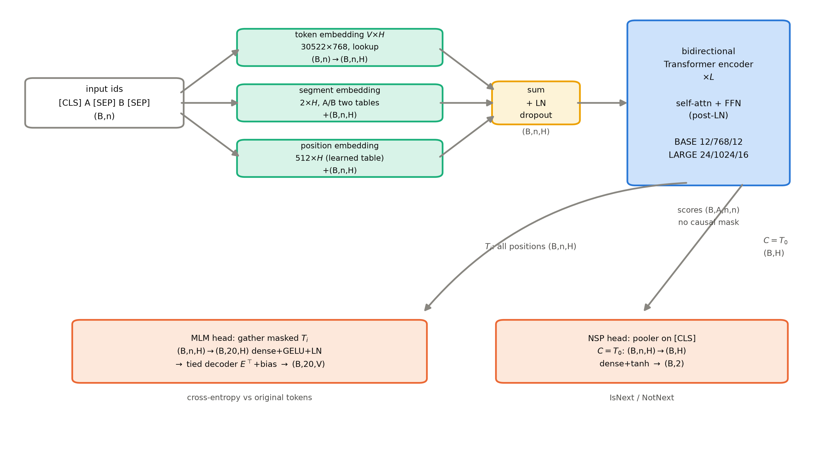
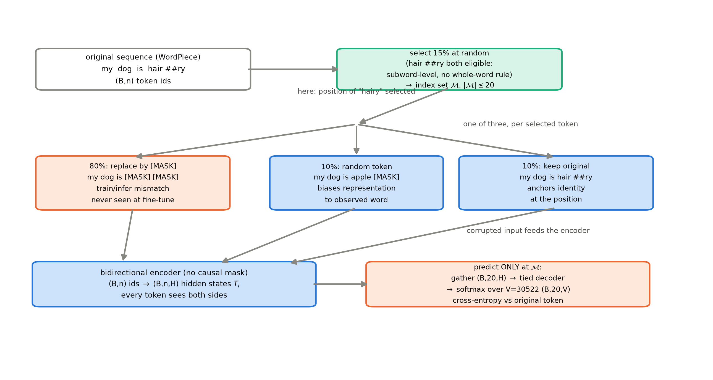
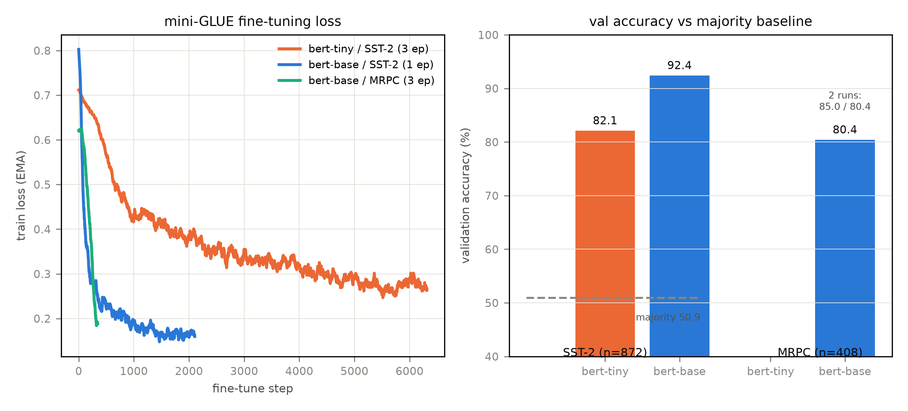

# 第 3 章 BERT：双向理解与微调生态

## 3.0 开篇：从全书到这里

上一章我们给机器装上了分词器——BPE 的词表是从语料统计里一个字一个字「长」出来的，WordPiece、Unigram 这些亲族的差异也摆上了台面。但词表只解决「文本怎么变成 id 序列」；从这一章起，我们进入范式革命真正的核心问题：**拿这些 id 序列做什么，才能让模型从无标注文本里学到东西？**第 1 章的前史把问题逼到了墙角：静态向量上下文无关、ELMo 只能拼浅层特征、ULMFiT 绑在循环架构上。三重局限的交汇处站着同一个等式——**Transformer 骨架 + 预训练目标**。第一个把这个等式写成完整答案的，就是 2018 年 10 月的 BERT。

本章要回答三问：这台机器与 Book1 那台双塔翻译机是什么关系（答案短得惊人：半塔）；预训练目标为什么是「遮词填空 + 判断句对」这两个怪任务；「预训练一次、微调 N 次」的生态在理解侧长什么样。我们会亲手把一台预训练好的 BERT 在两个 GLUE 任务上微调出真实成绩——这是全书第一次接触「别人的预训练权重」，也是第 11 章对拍官方 GPT-2 权重的预演。

到本章结束，理解侧的范式故事闭环。但另一半还没讲：BERT 只会「读」不会「写」，生成侧的另一半塔如何独立成塔、如何在没有微调的世界里生存，是下一章 GPT 的主场；本章还埋下一个悬疑——BERT 的第二个预训练任务，后来竟然被「翻案」了。

> **最小背景栏**
> - **Book1 已学**：编码器自注意力与三种注意力角色（Book1 第 4 章表 4.2——Q/K/V 来源与掩码列）；mask 全景表（Book1 第 7 章表 7.1：编码器自注意力只贴填充掩码，因果掩码只属于解码器）；post-LN 与训练配方（Book1 第 6、8 章）。本章一律指回，不再重教。
> - **本册已学**：ELMo 的特征拼接用法与 ULMFiT 的微调配方（第 1 章）；WordPiece 子词与 `##` 记号（第 2 章 2.5 节）。
> - **本章新增的最小背景**：GLUE（General Language Understanding Evaluation，通用语言理解评测基准）——八项自然语言理解任务的合集（Wang et al., ICLR 2019），各任务规模从 2.5k 到 392k 训练样本不等，是「理解侧」模型的标准考场【证据等级：官方论文 Wang et al. 2019】。

## 3.1 F9 第一触点：BERT 是双塔的 encoder 半塔

先回答第一问，而且答案会让你愣一下：**BERT 与 Book1 那台翻译机的全部关系，就是把双塔拆开、只留编码器那一塔。**论文的架构一节只有一段话："BERT's model architecture is a multi-layer bidirectional Transformer encoder based on the original implementation described in Vaswani et al. (2017)"——基于 2017 原典（tensor2tensor 实现）的多层双向 Transformer 编码器【证据等级：官方论文 1810.04805v2 §3】。组件零魔改：多头注意力、FFN、post-LN、残差，全是 Book1 第 2 到 6 章亲手造过的零件。所谓「多层」，就是把这个塔堆 $L$ 层。

那「双向」（bidirectional）是什么新机制吗？不是。回看 Book1 第 7 章的 mask 全景表：编码器自注意力**只有填充掩码、没有因果掩码**——每个位置天然看见全句。BERT 的「双向」恰恰是什么都不做：不把 Book1 第 4 章那张下三角禁区表贴进来；反倒是 GPT 的「单向」需要新贴一张因果掩码表。论文 §3 原话挑明了这点："the BERT Transformer uses bidirectional self-attention, while the GPT Transformer uses constrained self-attention where every token can only attend to context to its left"——同一副骨架，差别只在一张掩码表【证据等级：官方论文 1810.04805v2 §3】。论文还在 §3 脚注里正式化了这套叫法：双向版在文献里就叫 **Transformer encoder**（编码器），只看左上下文的版本叫 **Transformer decoder**（解码器，「因为它能用于文本生成」）——今天「encoder-only / decoder-only」的物种分界线，原始出处就在这个脚注【证据等级：官方论文 1810.04805v2 §3 脚注】。

这就是 Book1 欠账表里 F9（交叉注意力的后世折叠）的**第一触点**：2017 年那台机器有 encoder、decoder 两座塔，中间架着交叉注意力这座桥；2018 年，BERT 先把 decoder 塔和桥整个拆掉，只留 encoder 半塔独立成楼。桥去哪了？本章 3.5 节会看到它被「拼进一个序列的自注意力」吸收了；下一章 GPT 从生成侧完成第二触点（单塔自折叠）；第 5 章 T5 证明双塔并未死亡。三触点的全谱系，本册内收拢。

「双向」值得这么兴师动众吗？值得，这正是 BERT 对第 1 章 ELMo 的核心批判点。ELMo 想要双向，只能前向、后向各跑一遍语言模型、再拼浅层特征——论文 §5.1 给了三条理由说这种「浅层拼接」严格弱于深层双向：开销双倍；右到左的方向在问答里无法以问题为条件；拼接表示的表达力上限低于真正的深层交互【证据等级：官方论文 1810.04805v2 §5.1】。直觉版：让「bank」知道自己是河岸还是银行，需要前文与后文在**每一层**都交谈，而不是两个各看一半的人最后对笔记。

整机长什么样，先看粗图（图 3.1）：一段文本（或句对）切成 WordPiece 词元序列进三路嵌入，相加后过 $L$ 层双向编码器，出口分两个头——每个位置的隐向量 $T_i$ 接「遮词填空」头，首个位置 [CLS] 的隐向量接「句对判断」头。两个头分别对应两个预训练目标，就是接下来两节的主角。

**图 3.1** BERT 整机架构与两处预训练头（自绘重制，架构引 arXiv:1810.04805v2 Fig.1/Fig.2 的框线结构；形状标注为本书叠加层；示意级）。输入是句对拼包 `[CLS] A [SEP] B [SEP]`（单句时 B 段缺省）；三路嵌入逐位置相加得 $(B,n,H)$；$L$ 层编码器的注意力图 $(B,A,n,n)$ 不贴因果掩码；出口两路——全部位置的 $T_i$ 供 MLM 头 gather 出 $(B,20,H)$、[CLS] 位置的 $C=T_0$ 供 NSP 头。【证据等级：官方论文 1810.04805v2 §3 + 官方源码 google-research/bert】

## 3.2 MLM：遮词填空，15% 与 80-10-10

整机在手，第一个要造的零件是预训练目标。直觉从 ELMo 那里继承：我们想要**双向**的上下文表示。你可能会问：直接把语言模型目标搬进编码器——每个位置据上下文预测下一个词——不行吗？不行，败因很有教育意义：双向条件下每个词能「间接看见自己」，预测第 $i$ 个词时它就坐在输入里，多层网络只要学会「把输入原样传到输出」就能零成本作弊。论文原话：双向条件会 "allow each word to indirectly 'see itself'"（让每个词间接看见自己）【证据等级：官方论文 1810.04805v2 §3.1】。这就是语言模型天生只能单向的原因：因果掩码挡住「未来」，挡住的名单里也包括目标词自己。

解法于是自然浮出：**把要预测的词从输入里挖掉再预测**。随机遮住序列里的一部分词元，模型只预测被遮住的那些——论文称之为掩码语言模型（masked Language Model，MLM），并注明文献里常叫完形填空（Cloze）任务【证据等级：官方论文 1810.04805v2 §3.1】。与去噪自编码器的区别：只重建被遮的位置，不重建整个输入。挖掉多少？论文定死 **15%**："In all of our experiments, we mask 15% of all WordPiece tokens in each sequence at random"【证据等级：官方论文 1810.04805v2 §3.1】。注意两个口径细节：15% 是在 **WordPiece 分词之后**、按子词词元均匀抽取——`hairy` 若被切成 `hair ##ry`，两个片段各自独立有机会被选中，原版对「半个词」不做特殊处理（附录 A.2 明言 "no special consideration given to partial word pieces"）；官方数据生成脚本同时设了每序列最多 20 个预测位的上限（`max_predictions_per_seq=20`）【证据等级：官方源码 google-research/bert，create_pretraining_data.py】。词元从哪来：第 2 章 2.5 节讲过的 WordPiece，词表 30,000（checkpoint 实际 30,522——见 3.4 节考据框）。

真正的设计精髓在选中之后的**三段式替换**。对每个被选中的位置，掷一枚不均匀的骰子：80% 换成特殊词元 `[MASK]`；10% 换成词表里随机的词；10% 保持原词不动。论文自己的例子：`my dog is hairy`，若 `hairy` 被选中，它有八成变成 `my dog is [MASK]`，一成变成 `my dog is apple`，一成原样保留【证据等级：官方论文 1810.04805v2 §3.1】。为什么不干脆 100% 换 `[MASK]`？因为 `[MASK]` 有一个致命的属性：**微调时它永远不会出现**。预训练天天见 `[MASK]`、下游任务一次不见，这就是训练-推理失配（预训练/微调分布不一致）。论文附录 A.1 的机制解释值得逐字读：编码器「不知道哪些词会被要求预测、哪些被换成了随机词，所以它被迫为每一个输入词元维持分布式的上下文表示」，而 10% 保留原词的目的，是「把表示往实际观测到的词上偏置」【证据等级：官方论文 1810.04805v2 A.1，直引】。随机替换的代价论文也算过账：只占全部词元的 $15\%\times10\%=1.5\%$，「似乎不损害语言理解能力」。

这个设计到底值不值？附录 C.2 的 Table 8 给了控制变量实证：把三段式换成六种极端配方（100% 全 `[MASK]`、20% 随机、20% 保留、纯随机等），在 MNLI 微调、NER 微调、NER 取特征三种用法上对比——**微调用法对掩码策略惊人地鲁棒**（MNLI 84.2 对 84.3，几乎不动）；唯一明显掉点的是「取特征 + 100% `[MASK]`」：94.0 对 94.9【证据等级：官方论文 1810.04805v2 Table 8】。道理一想就通：微调时模型有机会重新适应输入分布，保险额度用不满；而取特征的用法冻结编码器、从不微调，`[MASK]` 世界的表示直接拿去用，才见真章。三段式是一份「为不出 `[MASK]` 的世界」买的保险。

把上面的一切写成公式与形状。输入表示是三路嵌入的逐位置相加：

$$X = E_{\text{tok}}(x) + E_{\text{seg}}(s) + E_{\text{pos}}(p) \tag{3.1}$$

用人话说：查三张表（词元表、段表、位置表）各得一个向量，同位置相加。段嵌入 $s$ 标记「这个词元属于句 A 还是句 B」（NSP 的配套，3.3 节展开）；位置嵌入是**学习式**查表、512 行（这里先按下，3.4 节交代它的一笔账）。MLM 的训练目标是（符号与形状见表 3.1）：

$$\mathcal{L}_{\text{MLM}} = -\,\frac{1}{|\mathcal{M}|}\sum_{i\in\mathcal{M}} \log p(x_i \mid \tilde{X}),\qquad p(x_i)=\mathrm{softmax}\!\left(E_{\text{tok}}\, g(T_i) + b\right) \tag{3.2}$$

**表 3.1 式 (3.2) 符号表**

| 符号 | 含义 | 形状 |
|---|---|---|
| $\mathcal{M}$ | 被选中预测的位置集合（每序列 ≤20） | 每序列 $\le 20$ 个标量下标 |
| $\tilde{X}$ | 三段式替换后的输入经式 (3.1) 与 $L$ 层编码器 | $(B,n,H)$ |
| $T_i$ | 第 $i$ 个位置的最终隐向量 | $(B,H)$ |
| $g(\cdot)$ | MLM 头的变换：dense $H{\times}H$ + GELU + LN | $(B,H)\to(B,H)$ |
| $E_{\text{tok}}$ | 输入词元嵌入矩阵（与输出共享，见 3.5 节） | $(H,V)$，$V{=}30522$ |

用人话说式 (3.2)：被选位置的隐向量先过一层小变换，再乘上**输入侧那张嵌入矩阵的转置**得到对全部词表的打分，softmax 后与原词元算交叉熵——只对被选的 ≤20 个位置计损失，其余 85% 的位置不参与。逐站形状流转见表 3.2（对照图 3.2 走一遍数据流）。

**图 3.2** MLM 的选词-替换-预测流程（自绘；示例句与三段式比例引 arXiv:1810.04805v2 §3.1/A.1；示意级）。选词在 WordPiece 分词之后按子词均匀 15%；替换三选一；编码后仅在被选位置 gather 出 $(B,20,H)$、经绑定词嵌入的解码得 $(B,20,V)$。【证据等级：官方论文 1810.04805v2 §3.1 + 官方源码 google-research/bert】

**表 3.2 MLM 头的形状流转表**（BASE 档；$B$=批、$n$=序列长、$H$=768、$V$=30522）

| 步骤 | 运算 | 输入形状 | 输出形状 | 说明 |
|---|---|---|---|---|
| 1 | 三路嵌入相加 + LN + dropout（式 3.1） | ids $(B,n)$ / 段 $(B,n)$ / 位置 $(B,n)$ | $(B,n,H)$ | 逐位置查表相加 |
| 2 | $L$ 层双向编码器 | $(B,n,H)$ | $(B,n,H)$ | 注意力图 $(B,A,n,n)$，无因果掩码 |
| 3 | gather 被选位置 $\mathcal{M}$ | $(B,n,H)$ + 下标 $(B,20)$ | $(B,20,H)$ | 每序列最多 20 个预测位 |
| 4 | 变换 $g$：dense + GELU + LN | $(B,20,H)$ | $(B,20,H)$ | 官方源码注明：预训练后即弃 |
| 5 | 绑定解码 $E_{\text{tok}}{}^{\top}$ + 偏置 | $(B,20,H)\cdot(H,V)$ | $(B,20,V)$ | 输出权重=输入嵌入矩阵 + 每词元独立偏置 |
| 6 | 交叉熵（vs 原词元） | $(B,20,V)$ vs $(B,20)$ | 标量 | 式 (3.2) |

出处：步骤 4-5 的结构与绑定关系【证据等级：官方源码 google-research/bert，run_pretraining.py 注释直引："The output weights are the same as the input embeddings, but there is an output-only bias for each token"】。

MLM 不是没有代价：每批只有 15% 的位置产生学习信号（语言模型是 100%），收敛要更多步。附录 C.1 的 Figure 3 把 MLM 与左到右语言模型（LTR）同预算对比：3 万步时 LTR 领先，10 万步附近 MLM 反超，100 万步时 84.4 对 82.2，差距单调拉大【证据等级：官方论文 1810.04805v2 Appendix C.1, Figure 3】。用人话说：每步学得少，但每步学的是**真双向**的表示——先慢后快，深度双向的红利要靠步数买。这条「步数换深度」的曲线，是第 8 章损失-算力叙事的最早雏形。

## 3.3 NSP：句对判断，以及它的两枚冷水脚注

遮词填空让模型学会了「看上下文补洞」，但第 1 章埋下的问题还剩一半：问答、蕴含这些下游任务的核心是理解**两段文本的关系**，而逐词预测类目标并不直接锻炼这种能力。BERT 的第二个预训练目标就是为此定制的：下一句预测（Next Sentence Prediction，NSP）。训练样本的构造一句话讲完：取两个文本段 A 和 B，一半概率 B 真的是 A 的后继（标签 IsNext），一半概率 B 是从语料里随机抽的（标签 NotNext），模型判断是哪种【证据等级：官方论文 1810.04805v2 §3.1】。

到源码里看这个构造会更踏实。官方数据生成脚本里，每个训练实例带一个布尔字段 `is_random_next`——B 段是否被随机句换过，训练标签就由它直接映射（`next_sentence_label = 1 if instance.is_random_next else 0`）；脚本还有一个细节参数 `short_seq_prob=0.1`：一成概率故意生成更短的序列，防止模型靠「长度线索」作弊【证据等级：官方源码 google-research/bert，create_pretraining_data.py】。这里有一个二手资料最常见的以讹传讹要当场纠偏：论文里所有的「sentence」**不是语言学句子**，而是「任意连续文本跨度」——通常远长于一个单句，也可能更短，只要求 A、B 两段合计不超过 512 词元【证据等级：官方论文 1810.04805v2 §3.2 与 A.2】。NSP 判断的是「段对」关系，不是「相邻两句」关系。论文 A.1 的示例可以直接当小算例：正例 `[CLS] the man went to [MASK] store [SEP] he bought a gallon [MASK] milk [SEP]` 标 IsNext；负例把 B 段换成 `penguin [MASK] are flight ##less birds`，标 NotNext——顺带展示了 WordPiece 的 `##less` 续接记号（第 2 章 2.5 节的伏笔在此对上）。

输入怎么打包、输出从哪读，图 3.1 已经画了：A、B 拼成一条序列 `[CLS] A [SEP] B [SEP]`，段嵌入（式 3.1 的 $E_{\text{seg}}$，A 段全 0、B 段全 1）告诉模型界线在哪；序列首位恒为 `[CLS]`，它的最终隐向量 $C$ 就是整条序列的聚合表示。NSP 的头是一个 pooler：$C$ 过一层 dense 加 tanh 再接二分类，写作

$$C = \tanh(W_p\, T_0 + b_p),\qquad \mathcal{L}_{\text{NSP}} = -\log q(y \mid C),\quad y\in\{\text{IsNext},\text{NotNext}\} \tag{3.3}$$

用人话说：把 [CLS] 位置的隐向量 $(B,H)$ 压成一个「句子级摘要」，再从这个摘要二选一。总损失是两个目标的平均负对数似然**之和**：$\mathcal{L}=\mathcal{L}_{\text{MLM}}+\mathcal{L}_{\text{NSP}}$【证据等级：官方论文 1810.04805v2 A.2】。

NSP 有多有效？论文 Table 5 的消融说：去掉它，QNLI 从 88.4 掉到 84.9，MNLI、SQuAD 也明显受伤【证据等级：官方论文 1810.04805v2 Table 5】——2018 年的证据板上钉钉：NSP 有益。但同一篇论文里就埋着两枚冷水脚注，原样抄在这儿（它们将在第 6 章变成主角）：其一，最终模型在 NSP 上的准确率达 **97%–98%**——任务近乎被自己解决，一个饱和的训练目标还能提供多少信号，值得打问号【证据等级：官方论文 1810.04805v2 §3.1 脚注】；其二，论文直言「$C$ 在未微调时不是一个有意义的句子表示，因为它是在 NSP 上训练的」【证据等级：官方论文 1810.04805v2 §3.1 脚注，直引】——预训练好的 [CLS] 不能直接当句向量。到 2019 年，一组严格的控制变量实验重评 NSP：同架构同数据复跑，去掉 NSP 不仅不掉点、部分任务反而略升——「有益的也许不是 NSP 目标，而是段对取自同一文档的打包方式」。翻案现场第 6 章整章伺候，此处先登记案卷编号。

## 3.4 整机与账本：两档、参数复算与语料

零件齐了，回到整机收拢。论文对外只发布两档配置，记号 $L$（层数）、$H$（隐层宽度）、$A$（头数）：BERT$_{\text{BASE}}$ = $L$12/$H$768/$A$12，BERT$_{\text{LARGE}}$ = $L$24/$H$1024/$A$16，FFN 宽度恒为 $4H$（脚注明文）【证据等级：官方论文 1810.04805v2 §3】。注意是**两档**——你日后在 HF 上看到的 tiny/mini/small/medium 是 Google 2019 年另发的缩小版家族（本章借用一档，见 3.6 节），与原论文无关。两档都保持每头 64 维（$H/A=64$），与 2017 原典的 $d_k=64$ 一致——这是观察到的设计惯例，不是论文写下的规则。BASE 为什么是这个尺寸？论文说得直白："BERT$_{\text{BASE}}$ was chosen to have the same model size as OpenAI GPT for comparison purposes"——**刻意与 GPT 同尺寸**，好让「双向 vs 单向」成为干净的对照变量【证据等级：官方论文 1810.04805v2 §3】。

参数量论文自报 110M/340M。沿用 Book1 第 7 章的手艺逐张量复算（表 3.3）。单层的账你应当已经很熟：QKVO 四个投影各 $H^2+H$、FFN $4H^2+4H+H$、两枚 LN——BASE 每层 7,087,872。这个数字请留个心：下一章 GPT-2 124M 的每个块**一字不差也是 7,087,872**——两物种的分家不在块内，在嵌入生态与训练目标，这是第 4 章差异清单的悬念。

**表 3.3 两档参数逐张量复算**（复算基于 HF bert-{base,large}-uncased 的 config；vocab=30522、位置表 512、段表 2）【证据等级：config/源码 + 本书算术复算，2026-10】

| 分项 | BASE (12×768) | LARGE (24×1024) |
|---|---|---|
| 词嵌入 $30522\times H$ | 23,440,896 | 31,254,528 |
| 位置嵌入 $512\times H$ | 393,216 | 524,288 |
| 段嵌入 $2\times H$ + 嵌入层 LN | 3,072 | 4,096 |
| 单层（QKVO + FFN + 两枚 LN） | 7,087,872 | 12,596,224 |
| 全部 $L$ 层 | 85,054,464 | 302,309,376 |
| pooler（NSP 头前半） | 590,592 | 1,049,600 |
| **复算合计** | **109,482,240 ≈ 109.5M** | **335,141,888 ≈ 335.1M** |
| 论文自报 | 110M | 340M |

BASE 侧 109.5M 对 110M，四舍五入完全自洽；LARGE 侧复算 335.1M 对自报 340M，差约 5M——这笔对不齐的账收进考据框。我们 3.6 节实验加载的 HF 权重恰好逐位复现 109,482,240 这个数，等于给表 3.3 做了一次免费对账。

> **【考据框】340M 之谜与 30,000 词表**
> LARGE 的 340M 从何而来？把预训练 MLM 头（变换 $H{\times}H$ + LN + 绑定的解码矩阵 + 每词元偏置）也算进去，LARGE 约 336.2M、BASE 约 110.1M——仍到不了 340M。社区（含 HF）普遍按 335M 报。结论：340M 更接近申报口径的圆整，引用时双口径并列（「340M（论文自报）；按 config 逐张量复算 335.1M」）【证据等级：config/源码复算 vs 官方论文自报】。同款口径差还有一处：论文正文写「30,000 token vocabulary」，checkpoint 实际 vocab_size=30522【证据等级：官方论文 §3.2 vs config/源码】。

机器造出来了，喂什么？语料账：BooksCorpus（8 亿词，小说语料）+ 英文 Wikipedia（25 亿词，只抽正文段落、忽略列表表格标题），合计约 33 亿词【证据等级：官方论文 1810.04805v2 §3.1】。一处选择很见功力：必须用**文档级**语料而非打乱句序的句子级语料（点名反例 Billion Word Benchmark），因为 NSP 的段对与 MLM 的长「句子」都依赖文档连续结构——第 6 章翻案案的伏线之一在这里。两处注记：BooksCorpus 有版权争议史，一句带过；GPT 当年只用 BooksCorpus 8 亿词，BERT 的语料约是它的 4 倍——这处少被注意的对照变量【证据等级：官方论文 1810.04805v2 A.4】。

训练配方的账单：批 256 条 × 512 词元 = 每批 128,000 词元，100 万步——33 亿词语料上约 40 遍；Adam 学习率 1e-4、前 1 万步线性 warmup 后线性衰减，全层 dropout 0.1，GELU（Gaussian Error Linear Unit）激活；架构上原样沿用原典 post-LN——Book1 第 8 章那颗「warmup 止痛药」BERT 原封不动继续吃，手术等下一章 GPT-2【证据等级：官方论文 1810.04805v2 A.2】。配方里还藏着省钱技巧，顺手把位置嵌入的账结了：注意力开销随 $n$ 平方涨，所以 **90% 的步用 128 长度训练、只在最后 10% 切到 512**，让位置嵌入表的后 384 行有机会被训到【证据等级：官方论文 1810.04805v2 A.2】。深意点一句：BERT 的位置表示是**学习式 512 行查表**——训练多长就只会多长，外推承诺为零；Book1 第 5 章那句「正弦可能允许外推」的半句话承诺在此被明确放弃（Book1 第 9 章实测过 18 位查表外推 8.92/7.73 的崩法，与正弦同量级不同崩法）。生成侧的 GPT-2 会把这张表加宽到 1024 行（下一章）；这条「位置表示之争」的账本主线记在 Book1 欠账表（F6），本册只登记不展开。

最后是算力账，也是 Book1 第 1 章那句「能并行，才敢谈规模化」（F3）在这里的兑现样本：BASE 用 4 台 Cloud TPU（共 16 块芯片）、LARGE 用 16 台（共 64 块），**每个模型的预训练 4 天完成**【证据等级：官方论文 1810.04805v2 A.2】。放回第 1 章的谱系：从 RNNLM 的 8 周到 word2vec 的「每小时十亿词」、再到 Transformer 的「一千张卡」资格，2018 年第一次兑换成「33 亿词 × 40 遍」的通用理解机。而下游便宜得不成比例：论文全部微调实验**单块 Cloud TPU 至多 1 小时**（GPU 数小时），SQuAD 约 30 分钟到 dev F1 91.0【证据等级：官方论文 1810.04805v2 §3.3】。预训练贵一次、微调便宜 N 次——两阶段经济学的全部秘密就这两个数字。顺带一笔：论文的尺寸消融（Table 6）从 $L$3 加到 $L$24、困惑度（perplexity，PPL）与下游精度同向改善，自称「首个令人信服地证明 scaling 到极端规模在小数据任务上也带来大收益的工作」【证据等级：官方论文 1810.04805v2 §5.2】——「更大更强」这行字，第 7、8 章将把它写成定律。

## 3.5 用法生态：换头的四种接法与不换头的第五种

预训练好的 BERT 是一台「理解机器」，但 GLUE 里的任务五花八门——单句情感、句对释义、问答抽取、多选常识。逐个改架构吗？恰恰相反，论文的关键论断是**机身零改动，只换两头**："Fine-tuning is straightforward since the self-attention mechanism in the Transformer allows BERT to model many downstream tasks—whether they involve single text or text pairs—by swapping out the appropriate inputs and outputs."（自注意力让 BERT 只靠更换输入输出的接法就能建模几乎任何下游任务）【证据等级：官方论文 1810.04805v2 §3.2，直引】。输入侧预训练时已「彩排」过——句对任务直接用 NSP 的段对拼包 `[CLS] A [SEP] B [SEP]`，单句退化为 B 段缺省的「text-∅ 对」。输出侧四种接法，每种新增参数都少得近乎寒酸：

**接法一：[CLS] 分类头。**单句/句对分类（GLUE 全家）取 $C$ 接一个新矩阵 $W\in\mathbb{R}^{K\times H}$（$K$=标签数；式 (3.4) 里连偏置都没有——BASE 二分类即 1,536 个新参数），用标准交叉熵：

$$\log\left(\mathrm{softmax}(CW^{\top})\right)_r \tag{3.4}$$

用人话说：从 [CLS] 摘要向量 $(B,H)$ 到 $K$ 个标签打分 $(B,K)$，一层线性层的事。**接法二：起止向量。**抽取式问答（SQuAD）把问题放 A 段、文章放 B 段，只新增两个向量 $S,E\in\mathbb{R}^H$：词元 $i$ 作为答案起点的概率是

$$P_i = \frac{e^{S\cdot T_i}}{\sum_{j} e^{S\cdot T_j}} \tag{3.5}$$

（终点同理；候选片段得分 $S\cdot T_i + E\cdot T_j$，取 $j\ge i$ 的最大者）【证据等级：官方论文 1810.04805v2 §4.2】。用人话说：学两个「探针」向量，一个问「答案从这开始吗」、一个问「到这结束吗」。SQuAD 2.0 的无答案问题则把 `[CLS]` 当「起止重合的空片段」参与比较——同一个接口容纳了「答不了」。**接法三：多选打分。**SWAG 四选一：四个选项各拼一条序列，新向量 $V$ 与各序列的 $C_i$ 点积后四选一 softmax【证据等级：官方论文 1810.04805v2 §4.4】。**接法四：逐词元标注。**命名实体识别（NER）给每个词（取 WordPiece 切分后的**首个子词**的 $T_i$）接分类层——预测发生在每个位置上，与 MLM 头的位置布局同构【证据等级：官方论文 1810.04805v2 §5.3】。

这里要停下来看一句论文里分量最重的架构论断。传统句对模型（BiDAF、DecompAtt 那一代）是「分别编码两段、再接双向交叉注意力」的双塔+桥；BERT 的做法是把两段拼进**一个**序列、让自注意力全互见——"encoding a concatenated text pair with self-attention effectively includes bidirectional cross attention between two sentences"（用自注意力编码拼接的句对，事实上已包含两句之间的双向交叉注意力）【证据等级：官方论文 1810.04805v2 §3.2，直引】。这正是 F9「折叠」命题在理解侧的完整表述：**桥没有消失，桥被摊平进了塔内的注意力图**。

> **【考据框】被删掉的段落说得更透**
> v2 论文源码里有一段被 `\eat` 命令注释掉的文字：BERT「不区分序列内 self-attention 与序列间 cross-attention」，问答微调时问题段与文章段要在 12 层里**迭代交叉注意 12 次**，且这些「交叉」参数全都是预训练过的。成稿只留了上面那句 "effectively includes"；源码注释佐证「折叠」不是修辞，是字面的逐层折叠【证据等级：官方源码注释（LaTeX 源），非成稿正文】。

第五种用法干脆不换头——**基于特征**（feature-based），ELMo 式用法（第 1 章 1.4 节）：冻结整个 BERT，抽某几层激活当固定特征，外面接随机初始化的两层 BiLSTM 加分类层。论文的理由很现实：有些任务没法直接表达成 encoder 架构；特征可**预计算一次**、在其上跑大量便宜实验【证据等级：官方论文 1810.04805v2 §5.3】。CoNLL NER 成绩单（Table 7）：微调 96.6 F1，末四层拼接特征 96.1——只差 0.5（论文正文原句写 "only 0.3 F1 behind"，与其 Table 7 的 96.6−96.1=0.5 自不一致，本书按表算）；只用词嵌入层 91.0；最反直觉的是**最后一层不是最好的特征层**（94.9 < 倒数第二层 95.6 < 末四层拼接 96.1），因为它过拟合了 MLM/NSP 目标【证据等级：官方论文 1810.04805v2 Table 7】。「微调与取特征都有效」同时安抚两个范式：BERT 不背叛 ELMo 的遗产，只是把「特征」升级成「可继续训练的初始化」。顺带落地 F15 的钩子一句：微调换头时，预训练 MLM 头整个拆掉——绑定输入嵌入的解码矩阵与变换 $g$ 都不再使用（官方源码注明 "not used after pre-training"）【证据等级：官方源码 google-research/bert，run_pretraining.py】。原典三处权重共享（Book1 第 7 章，省 37.9M 那笔账）到 BERT 收敛为「MLM 输出绑输入嵌入」一处；下一章 GPT-2 把「绑定嵌入」升格为生成模型的主体结构——绑与解的账本第 4 章开算。

生态讲完，读成绩单的口径课当场开讲——这是 Book1 第 9、10 章 BLEU 口径课的直接续篇。最常被引的「GLUE 82.1」有三个口径机关：**其一**，82.1 是 Table 1 的 BERT$_{\text{LARGE}}$ **测试集**平均，且**剔除了 WNLI**——所有已提交系统的 WNLI 都打不过「恒预测多数类 65.1」的基线，BERT 干脆对 WNLI 恒预测多数类「以示对 GPT 公平」，论文平均因此与官方 GLUE 分数口径不同【证据等级：官方论文 1810.04805v2 Table 1 caption 与 Appendix B】。**其二**，官方排行榜（含 WNLI）上 BERT$_{\text{LARGE}}$ 是 80.5——两个「总分」差 1.6，引哪个先说清是哪口锅。**其三**，Table 1 是「每个模型只做一次评测服务器提交」的成绩（脚注原话），对照行的 GPT 数字取自排行榜与 OpenAI 博客。指标口径也杂：QQP/MRPC 报 F1、STS-B 报 Spearman、其余报 accuracy。表 3.4 重排成绩单并注明口径。

**表 3.4 GLUE 测试集成绩重排**（引 arXiv:1810.04805v2 Table 1；平均为剔 WNLI 口径；评测服务器打分、每模型单次提交）【证据等级：官方论文 1810.04805v2 Table 1】

| 系统 | MNLI-m/mm | QNLI | SST-2 | MRPC | RTE | 平均（剔 WNLI） |
|---|---|---|---|---|---|---|
| 训练样本量 | 392k | 108k | 67k | 3.5k | 2.5k | — |
| Pre-OpenAI SOTA | 80.6/80.1 | 82.3 | 93.2 | 86.0 | 61.7 | 74.0 |
| BiLSTM+ELMo+Attn | 76.4/76.1 | 79.8 | 90.4 | 84.9 | 56.8 | 71.0 |
| OpenAI GPT | 82.1/81.4 | 87.4 | 91.3 | 82.3 | 56.0 | 75.1 |
| **BERT$_{\text{BASE}}$** | 84.6/83.4 | 90.5 | 93.5 | 88.9 | 66.4 | **79.6** |
| **BERT$_{\text{LARGE}}$** | **86.7/85.9** | **92.7** | **94.9** | **89.3** | **70.1** | **82.1** |

读表两件事。第一，BASE 对 GPT 的同尺寸对照：MNLI-m +2.5、QNLI +3.1、RTE +10.4——同骨架同尺寸，双向与目标函数的差别兑换成平均 4.5 个点。第二，看训练量那一行：MRPC 只有 3.5k、RTE 2.5k——预训练带来的「通用理解」恰恰在小数据任务上兑换率最高（RTE 上 LARGE 对 ELMo +13.3），这个现象后面每一章都会回来。另注一处论文的口径瑕疵：MRPC 实际训练集精确为 3,668 条，论文写 3.5k 属保守圆整——我们的实验（3.6 节）用精确数。

## 3.6 mini-GLUE 实验：亲手微调一次

原理讲完，轮到我们的手。实验只有一个野心：把 3.5 节的「换头微调」在自己机器上完整走一遍，并立一条及格线——**模型必须显著超过多数类基线**，否则一切精度都是假象。两个任务：SST-2（单句情感二分类，训练 67,349 条、验证 872 条）与 MRPC（句对释义二分类，3,668/408 条）【证据等级：config/源码，HF datasets-server 2026-10 查询】。多数类基线先钉在墙上：SST-2 训练集正类 55.8%（验证集 50.9%），MRPC 等同类 67.4%（验证集 68.4%）——MRPC「全猜等价」就有 68.4，及格线比 SST-2 陡得多。

> **【借用框】datasets 与 GLUE 的加载和引用**
> 工具当黑盒：`load_dataset("nyu-mll/glue", "sst2")`（datasets 5.0.1；旧名 `"glue"` 重定向同仓库）。两条纪律随借用生效：①**许可**——GLUE 无统一许可（HF 卡片 license 标 "other"，条款随子任务原始数据集而异），按全书合规约定：数据落 `log/` 不入库不分发；②**引用**——卡片明文要求「用了 GLUE 请引用所用到的每个子任务数据集」，本书照办：SST-2 引 Socher et al. 2013，MRPC 引 Dolan & Brockett 2005，GLUE 引 Wang et al. 2019【证据等级：HF 数据集卡片 nyu-mll/glue，2026-10 查证】。算法拆解不在此展开，分词已在第 2 章讲透。

两个模型档：`bert-base-uncased`（109,482,240 编码器参数 + 新初始化分类头 1,538 个——加载后逐位复现表 3.3 的复算值，顺带对账一次）与 `bert-tiny`（$L$2/$H$128/$A$2，4.39M——Google 2019 年缩小版家族的教学生态档，**不是论文的第三档**，本章借它当快档）。协议对齐论文 §4.1 的 GLUE 配方：batch 32、学习率 2e-5（论文搜索集 {5e-5, 4e-5, 3e-5, 2e-5} 的常用值）、3 epochs、AdamW、截断 128、固定种子。代码在 [`code/ch03/glue_finetune.py`](code/ch03/glue_finetune.py#L83)（入口 `main()`，逐 epoch 评测在 `evaluate()`）。

**表 3.5 mini-GLUE 微调实测**（MPS，2026-10；协议见上文；本机口径）

| 格 | 任务 | 步数 | sec/步 | loss（首10→末10） | 内存峰值 | 验证准确率（逐 epoch，%） |
|---|---|---|---|---|---|---|
| fast | bert-tiny / SST-2 | 6,315 | 0.0087 | 0.702→0.257 | 171 MiB | 80.5 / 81.2 / **82.1** |
| fast | bert-tiny / MRPC | 345 | 0.011 | 0.674→0.574 | 171 MiB | 68.6 / 69.9 / **70.3** |
| full | bert-base / MRPC | 345 | 0.449 | 0.630→0.191 | 7.08 GiB | 四次同种子运行终点 **80.4 / 80.1 / 83.8 / 81.9**（逐 epoch 见正文） |
| full | bert-base / SST-2 | 2,105 | 0.44（无并发口径） | 0.692→0.146 | 7.08 GiB | **92.4**（1 epoch） |

【证据等级：本书实验（MPS，2026-10，log/book2-ch03/finetune_*.json）】——四格的准确率、loss 曲线与内存峰值均出自本书实跑，复现命令见本章末动手验证。两处口径注记：bert-base SST-2 的 sec/步引自无并发口径（调研探针实测 0.436；成书运行与其他实验并发，实测 0.53，准确率不受影响）；bert-base MRPC 的四个终点是**同种子四次运行**（`finetune_base_mrpc{,_run1,_run2,_run3}.json`，输出文件名加 `--run-tag` 防覆盖、数字全部有工件在案）——差异来自 MPS 算子的非确定性被 408 条的小验证集放大，正是下文的方差课。

先读快档。bert-tiny 在 SST-2 上三 epoch 共 6,315 步、每步 8.7 毫秒（与调研探针互证【证据等级：本书实验（MPS，2026-10）】），约 55 秒跑完：loss 从 0.702 降到 0.257，验证准确率 80.5→82.1——一台 4.4M 的小机器，1 分钟站到多数类基线（50.9）头上 31 个点：预训练的红利连 tiny 机器都吃得到。再看 MRPC 上的 bert-tiny：70.3 对基线 68.4，只高 2 个点——**及格线边缘**，3,668 条数据救不回太小的机器。

full 档两格把「方差」这件事从脚注变成了主角。bert-base 的 SST-2：单 epoch 共 2,105 步、无并发口径每步约 0.44 秒（约 15 分钟），loss 从 0.692 压到 0.146，验证准确率 **92.4**——与论文 Table 5 的 BASE 档 dev 口径 92.7 几乎重合【证据等级：官方论文 1810.04805v2 Table 5】，一个 epoch 就到。而 bert-base 的 MRPC，我们**同种子跑了四次**：76.7/80.6/80.4、76.0/82.1/80.1、76.0/80.6/83.8、76.2/80.9/81.9——终点 80.1 到 83.8，最好最差差 3.7 个点。种子没变、协议没变、代码没变，四次运行的首 10 步 loss 甚至逐位相同（0.630），变的只是 MPS 算子内部的非确定性随训练累加，被 408 条的验证集放大成 3.7 个点（一条样本 0.245 点，≈15 条样本翻脸）。这恰好从自家机器上复现了论文的处置：BERT$_{\text{LARGE}}$ 在小数据集上「有时不稳定」，官方对策就是**多次随机重启选 dev 最优**【证据等级：官方论文 1810.04805v2 §4.1 与 A.3】；「训练不稳定」这条线索第 9 章接走。两格合读的结论比任何论述都硬：**小任务上，单次运行的个位数精度差异可能全是噪声**——先立基线、再看方差、最后才谈「提升了几个点」。

MRPC 这格还有一层身份：它是**句对拼包**任务，输入格式与 NSP 段对一字不差（脚本 `tokenize()` 对句对自动编码成 `[CLS] A [SEP] B [SEP]`）——第 6 章重评 NSP 要用的「句对 vs 单句」对照，从这格出发改两行就能做，选做批注登记在此。另一处工程细节：我们的微调走 HF 默认路径，[CLS] 先过 NSP 预训练留下的 pooler 再接分类头，与论文原式（本书式 3.4）直取 $C$ 略有差异，实测影响在小数点后（见实现对照框）。

> **【实现对照框】HF transformers 5.18.0 的 BERT 微调路径（非论文内容）**
> `AutoModelForSequenceClassification.from_pretrained(..., num_labels=2)` 组装的头是：BertModel（含 pooler）→ dropout(0.1) → `nn.Linear(768, 2)`；pooler 输出即 NSP 预训练头的 dense+tanh 前半，被默认保留复用。工程上常有人直接取 [CLS] 末态隐状态绕过 pooler，两种口径差在零点几个点以内【证据等级：config/源码，modeling_bert.py；口径对照为本机实测】。另注意 v5 与 v4 教程的两处 API 换血：`AutoModelWithLMHead` 已移除（改用各任务 Auto 类）、`BertTokenizerFast` 类已删除（`AutoTokenizer` 即 Rust 后端）【证据等级：config/源码，transformers 5.18.0 迁移指南】。

**图 3.3** mini-GLUE 微调实测：左=训练 loss 曲线（EMA 平滑，$\alpha=0.02$）；右=验证准确率对多数类基线（虚线；bert-base/MRPC 柱取基准运行，四次同种子运行的终点散布 80.1-83.8 见正文）。数据出自本书实跑（MPS，2026-10，log/book2-ch03/finetune_*.json）；基线为各任务验证集多数类占比。【证据等级：本书实验（MPS，2026-10）】

把四格并排收拢（表 3.5 与图 3.3 右）：同一份预训练配方，bert-base 在 67k 样本的 SST-2 上把基线甩开 41.5 个点、一个 epoch 就到论文 dev 水平；在 3.7k 的 MRPC 上甩开 12~15 个点（四次运行终点 80.1-83.8），tiny 档则只勉强及格——**数据量越小，预训练红利占比越大；但验证集也越小，单次成绩的噪声越大，小模型越容易不及格**。红利与噪声同源，这就是微调生态的全部张力，也是「报告成绩必须交代方差」的原因。

## 3.7 版本考据：v1→v2，GLUE 的数字曾经不一样

本章引用的每个 BERT 数字都锚定 v2（2019-05-24），这不是仪式感，是被逼的谨慎：v1（2018-10-11）到 v2 有**实质性数字与结构改动**——GLUE 成绩更新过（LARGE 平均 81.9→**82.1**、QNLI 91.1→92.7，GPT 对照行也随之变动）、独立 NER 节被整体删除（两版都自称「11 个任务」但构成不同）、措辞软化（"extremely large drops"→"large drops"）、Table 1 图注的 GPT 配置声明转入源码注释【证据等级：官方论文 1810.04805 v1/v2 LaTeX 源码逐字比对】。你在别处读到「BERT 平均 81.9」不是错，是 v1——但与 82.1 不可混用。这是 Book1 第 11 章「版本考古一课」（原论文七版本改数字删段落）的续篇，而 BERT 的改动恰好发生在**成绩单**上：连「模型考了多少分」都是版本敏感的。完整清单见考据框；引用纪律一句话：**凡引 GLUE/SQuAD 数字一律锚 v2，并引 v1 须双版本标注。**

> **【考据框】v1→v2 已实证差异清单**（LaTeX 源码逐文件比对；全部 {官方论文} 级）
> ① GLUE Table 1 数字更新（QNLI 与平均分，含 GPT 对照行）；② v1 §4.3 NER 节删除，成绩并入 v2 Table 7，「11 任务」构成改变；③ SQuAD Table 2 的 leaderboard 快照从 2018-10-08 换成 2018-12-10 并裁行；④ Table 7 行名修正（"Sum Last Four"→"**Weighted** Sum Last Four"，v2 才是加权）；⑤ 措辞软化与括号注释删除（微调不稳定现象两版都承认）；⑥ Table 1 caption 的 GPT 配置声明转入源码注释（引 GPT 配置须引 v2 正文 §3 或 v1 caption）。

## 3.8 本章小结

开篇的三问现在可以逐一销账。BERT 与双塔翻译机的关系：**只取 encoder 半塔，「双向」不过是「不贴因果掩码」**——与 GPT 同骨架同尺寸，差一张掩码表加一个目标函数，GLUE 上兑换出 4.5 个点。预训练目标为什么古怪：MLM 用「遮 15%、三段式替换」绕开「词看见自己」的作弊漏洞，80-10-10 是为微调世界（`[MASK]` 永不出现）买的保险；NSP 教模型读句对，但它 97-98% 的近乎饱和与后来的翻案实验提醒我们，训练目标本身也要过证据关。微调生态：机身零改动、只换两头，新增参数最少 1,538 个；feature-based 的对照用法证明「特征」与「初始化」两条路都通。mini-GLUE 四格实测把及格线与方差课一起立了起来：82.1% 与 92.4% 分别站在 50.9% 的多数类基线之上，而同种子四次 MRPC 运行终点散布 3.7 个点、tiny 档只在基线上 2 个点——小任务上，「提升几个点」必须连同方差一起报告才算数。

**带走的心智**：如果细节都忘了，请留下这一幅图景——**「预训练贵一次、微调便宜 N 次」的两阶段经济学，和「架构几乎不动、目标函数换了灵魂」的范式分工**。2017 年的骨架在 2018 年原封不动，换掉的只是「模型从文本里学什么」：一张掩码表决定看哪个方向，一个损失函数决定练什么能力；而下游世界只需付两头的钱。以后你见到任何「预训练 + 微调」的新物种，第一件事就是问它的掩码表和目标函数——其余都是工程。

回到全书的旅程：理解侧的故事至此闭环，范式三物种的第一个物种（encoder-only）已完整到手。但 3.1 节拆塔时留下的另一半还悬着：**decoder 半塔如何独立成塔？**只会「从左往右看」的单塔，凭什么不靠微调也活得下去？下一章 GPT-1/GPT-2 回答这个问题，并顺手完成 F9 的第二触点（单塔自折叠）——同时我们一直记账的「warmup 止痛药」也将停药动手术。至于本章那两枚冷水脚注之一的 NSP，它的翻案法庭设在第 6 章，届时你已读过 GPT-2，会看得更清楚。

> **【欠账】F9 交叉注意力的折叠（谱系预告）**——本章是第一触点：理解侧拆掉 decoder 塔与桥、半塔独立成楼，句对任务的桥被「拼包 + 自注意力」摊平吸收。第二触点在下一章：生成侧的 decoder 单塔如何把桥折叠进自身（GPT-2 手术①）；第三触点在第 5 章：T5 证明双塔架构在 2020 年仍是冠军，「折叠不是进化的必然方向」。三点谱系在本册第 12 章的范式判决书里合龙，折叠思想的更远后世（检索与注意力本体）记在 Book5 第 10 章。

## 3.9 动手验证（本章代码与实验清单）

- 入口命令（fast 档，约 1 分钟）：`cd 工作区根目录 && source env.sh && python "[`code/ch03/glue_finetune.py`](code/ch03/glue_finetune.py)" --model tiny --task sst2 --epochs 3`
- full 档：`--model base --task mrpc --epochs 3`（约 2.5 分钟）、`--model base --task sst2 --epochs 1`（约 15 分钟）；图表复现：`python "[`code/ch03/make_figs.py`](code/ch03/make_figs.py)"`（秒级，图 3.3 读 `log/book2-ch03/finetune_*.json`）
- 方差复跑：同一命令加 `--run-tag runN`（文件名带后缀防覆盖），同种子再跑几次 MRPC 亲眼看终点漂移——表 3.5 四个终点即此法所得
- 预期产出：四格 JSON（含逐步 loss 曲线、逐 epoch 准确率、内存峰值）落在 `log/book2-ch03/`；准确率与多数类基线的对照打印在 stdout；图 3.1–3.3 落 `figures/`
- 验收点：能否不看书画出图 3.2 的流程并说出 80-10-10 各自防什么；能否解释「双向 = 无因果掩码」与 F9 第一触点；微调成绩是否显著超多数类基线（SST-2 两档应超 80%，MRPC base 档超 80%、tiny 档贴地属预期）；能否说出 82.1 与 80.5 各是哪口锅的平均
- 变式实验（选做，第 6 章预演）：改 `glue_finetune.py` 的 `tokenize()`，把 MRPC 的句对拼包改为两句拼接的单句编码（segment 全 0），观察句对信息被打掉后掉几个点——NSP 翻案案的第一个自家数据点
