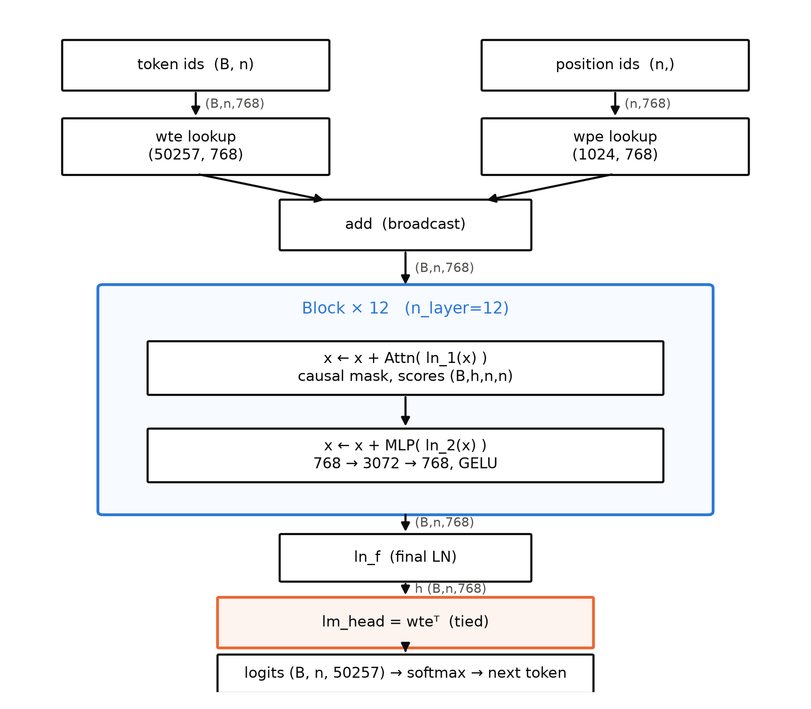
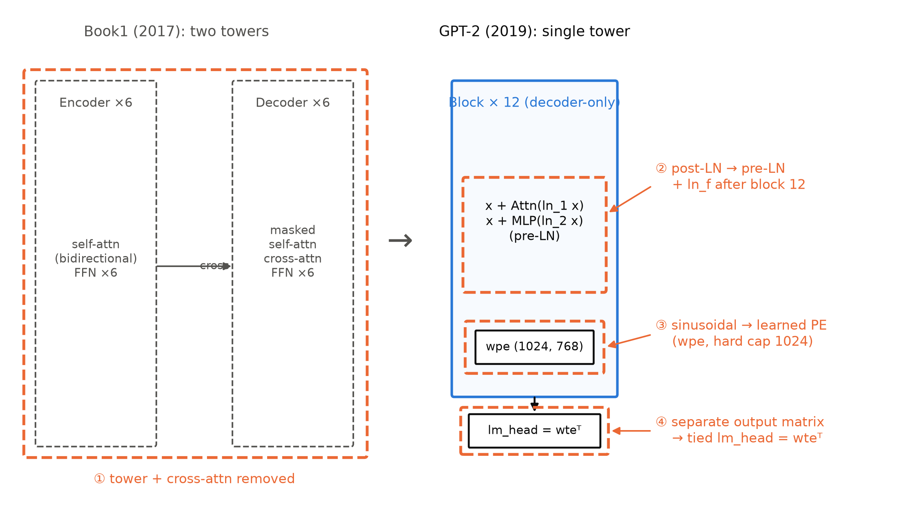
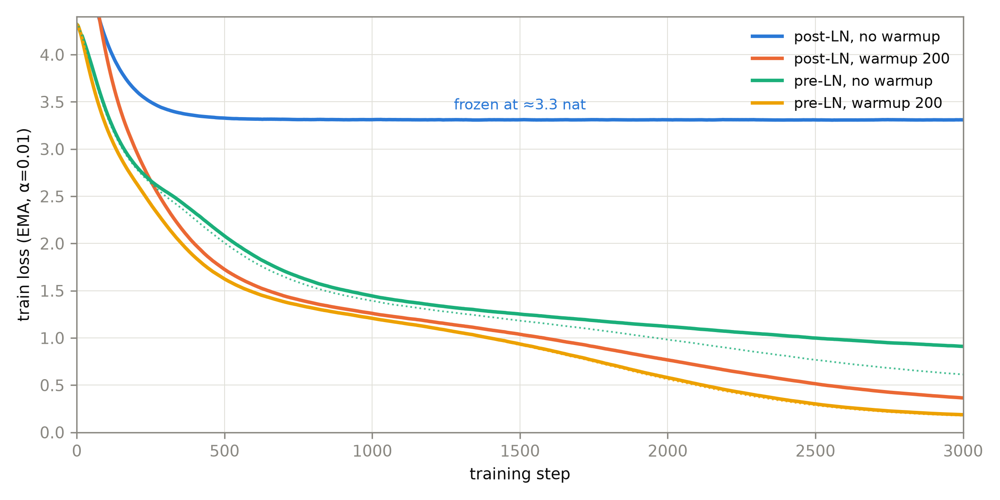

# 第 4 章 GPT-1/2：单塔、因果与架构差异清单

## 4.0 开篇：从全书到这里

上一章结束时，理解侧的半塔已经独立门户：BERT 把 Book1 双塔翻译机的 encoder 单独拎出来，用掩码语言建模（MLM）喂无标注语料，再用 [CLS] 分类头把微调生态铺满十几项任务——「理解物种」就此成型。但章末留了一个指向：双塔里还有另一半。decoder 半塔天生带因果掩码、只能从左往右看，做理解的姿势别扭，做**生成**却是本行——这半塔离家独立会怎样，就是本章的故事。

这是范式三物种的第二物种，要回答的问题只有一个，但很大：**从 Book1 那台 2017 年的翻译机到 2019 年的 GPT-2，架构到底动了哪几刀？每一刀为什么非动不可、怎么动、动完怎么验收？**先沿时间线走两站（GPT-1 确立两阶段、GPT-2 押注 zero-shot（零样本）），再回到装配线上，把「原典→GPT-2」的差异收拢成一份四项手术清单逐刀拆解；其中第二刀（LayerNorm 挪位）将触发本章的招牌实验——给 post-LN 机器「停药」，看它是不是真的离不开 warmup。

本章结束时，你手里会多出三样东西：一张能把任何新模型对到 GPT-2 谱系上的差异清单、一条自家实验跑出来的「停药」曲线、一份 124M 参数的逐项账本。同时会冒出三个新问题——归一化零件本身的演化、位置查表的 1024 之墙、词表绑定与解绑的账——它们都指向 Book3。

> **最小背景栏**：本章默认你已读过 Book1 的三种子层角色（第 4 章：自注意力/交叉注意力/FFN 三种角色）、post-LN 数据流（第 6 章：LN 在残差求和之外）、mask 全景（第 7 章：因果掩码只属于解码器）与参数账本（第 7 章：三处权重共享省 37.9M）；warmup 配方与「止痛药」解释在第 8 章。本册已备：ULMFiT 微调配方（第 1 章）、WordPiece 与 BPE 家族（第 2 章）、BERT 的 MLM 与微调生态（第 3 章）。**训练循环依赖声明**：本章实验沿用 Book1 第 9 章训练循环的改写与开工探针底座；正式定版的 `model.py`/`train.py` 要到第 10 章才落——本章的块实现是参数化的（`Block`/`GPT` 定义于 `warmup_ablation.py`、层数/宽度/头数可配，`surgery.py` 与停药实验共用同一实现），它将直接充当第 8 章 scaling 族实验的模型工厂，这是全书单轨代码线的约定。

## 4.1 GPT-1：生成式预训练，判别式微调

理解侧的剧本既然已经跑通，生成侧的第一站自然要问同一个问题：decoder 半塔拿什么目标函数从无标注文本里学到东西？GPT-1 的答案朴素得近乎无聊——**就用语言模型本身**。给定无标注语料 $\mathcal{C}=\{u_1,\dots,u_n\}$，训练一个标准的自回归语言模型【证据等级：官方论文（GPT-1，§3 式 1，OpenAI PDF canonical、本册引文自大学镜像核对）】：

$$
\mathcal{L}_1(\mathcal{C}) = \sum_i \log P\!\left(u_i \mid u_{i-k},\dots,u_{i-1};\Theta\right)
\tag{4.1}
$$

| 符号 | 含义 | 形状/取值 |
|---|---|---|
| $\mathcal{C}$ | 无标注语料（token 序列） | BooksCorpus，7000+ 本未出版书籍 |
| $u_i$ | 第 $i$ 个 token（BPE 子词） | 官方口径 40,000 merges【官方论文 §4.1】 |
| $k$ | 上下文窗口 | 512 |
| $\Theta$ | 全部可学参数 | 12 层 decoder，约 117M（口径考据见 4.2 考据框） |

用人话说：每个 token 的概率只由它前面 $k$ 个 token 决定，模型的任务是把「接下来该是谁」猜得越来越准——这正是 Book1 第 4 章解码器一直在做的事，一点新机制都没有。新东西在第二阶段：微调时把最后一位隐状态接上一个新买的线性层 $W_y$ 做分类，同时**保留语言模型目标当辅助损失**：

$$
\mathcal{L}_3(\mathcal{C}) = \mathcal{L}_2(\mathcal{C}) + \lambda \cdot \mathcal{L}_1(\mathcal{C})
\tag{4.2}
$$

（$\lambda=0.5$）预训练目标在微调期继续「陪跑」【证据等级：官方论文（GPT-1）§3.3/§4.1】。架构侧的总结只有一句话，值得逐字读：「我们训练了一个 **12 层 decoder-only Transformer**，带掩码自注意力头（768 维状态、12 头）」【证据等级：官方论文（GPT-1）§4.1】——词面上一切组件都是 Book1 的旧零件，唯一的新闻是「decoder-only」这半句，4.4 节再拆。

真正体现工程想象力的是**接口**：NLP 任务五颜六色（句对、多选、文档+问题），怎么喂给一台只会「从左往右读」的机器？GPT-1 把一切结构化输入**折成连续 token 序列**——蕴含任务把 premise 与 hypothesis 用分隔符拼成 $[p;\$;h]$；相似度任务两种顺序各走一遍、末层表示逐元素相加；多选任务对每个候选各拼一条序列、softmax 归一化后选答案【证据等级：官方论文（GPT-1）§3.3】。这套「遍历式变换」看着笨拙，却正是 4.2 节自然语言 prompt 的前身——「序列即一切」路线的第一块砖。

成绩单见表 4.1：12 个数据集里 9 个 SOTA【证据等级：官方论文（GPT-1）摘要】。表中 SciTail 行的「此前最优」83.3 取自同表 CAFE 单模型行——镜像文本抽取曾把该行四个数字（78.7/77.9/88.5/83.3）的列对位读串，本册已对 canonical PDF 做图像级复核钉死：对位为 MNLI-m/MNLI-mm/SNLI/SciTail，QNLI/RTE 为空；GPT-1 正文自述「SciTail 上绝对提升 5%」恰为 $88.3-83.3$，互为印证【证据等级：官方论文（GPT-1）Table 2 与 §4.2，PDF 图像复核 2026-10】。

**表 4.1** GPT-1 微调成绩精简版（12 数据集 + GLUE 汇总；重排自 GPT-1 论文 Tables 2/3/4，{官方论文}）

| 任务（指标） | GPT-1 | 此前最优（方法） |
|---|---|---|
| MNLI-m（acc） | **82.1** | 80.6（Stochastic Answer Networks） |
| SNLI（acc） | **89.9** | 89.3（ESIM + ELMo） |
| SciTail（acc） | **88.3** | 83.3（CAFE，单模型，同表） |
| QNLI（acc） | **88.1** | 82.3（GenSen） |
| RTE（acc） | 56.0 | 61.7（BiLSTM+Attn） |
| Story Cloze（acc） | **86.5** | 77.6（Hidden Coherence） |
| RACE（acc） | **59.0** | 53.3（BiAttention MRU） |
| CoLA（Matthews） | **45.4** | 35.0（BiLSTM+ELMo+Attn） |
| SST-2（acc） | 91.3 | 91.6（多任务 BiLSTM+ELMo） |
| MRPC（F1） | 82.3 | 83.5（多任务 BiLSTM+ELMo） |
| STS-B（Pearson） | **82.0** | 72.8（多任务 BiLSTM+ELMo） |
| QQP（F1） | **70.3** | 66.1（BiLSTM+ELMo+Attn） |
| GLUE（汇总） | **72.8** | 68.9（多任务 BiLSTM+ELMo） |

两行点评。第一行：对 ELMo 系的优势在大指标上明确——SNLI 上 89.9 对 89.3，GLUE 汇总 72.8 对 68.9，且消融显示**拆掉预训练**平均分从 74.7 掉到 59.9（-14.8），换回 LSTM 掉到 69.1【证据等级：官方论文（GPT-1）Table 5】——增益大头来自「Transformer 预训练」这个组合；微调配方本身（lr 6.25e-5、batch 32、3 epochs、线性衰减加 0.2% 步数的 warmup【证据等级：官方论文（GPT-1）§4.1】）与第 1 章讲过的 ULMFiT 谱系一脉相承，指回不重展开。第二行是诚实的边角：小数据集 RTE 只有 56.0、反而输给 BiLSTM 的 61.7，MRPC 与 SST-2 也微弱于多任务 ELMo 系（82.3 对 83.5、91.3 对 91.6），论文自己承认小数据集上多任务训练可救【证据等级：官方论文（GPT-1）§4.2】；辅助 LM 目标在消融里平均分 75.0 对完整版 74.7——平均反而略降，原文解释「大数据集受益、小数据集不受益」。胜利叙事之下的这些毛边，正是 GPT-2 想连微调一起扔掉的动机之一。

## 4.2 GPT-2：zero-shot、互联网语料与一次诚实的缺场

微调路线的成绩单虽漂亮，账却不难算：每换一个任务就要一份标注数据、一次微调、一套超参——第 1 章讲过的「标注瓶颈」只是被推后到了第二阶段。GPT-2 的赌注是把第二阶段整个删掉。它的理论出发点值得完整写出：一个通用系统对同一输入应能给出不同输出，所以条件里不该只有输入，还得有任务本身【证据等级：官方论文（GPT-2，OpenAI canonical PDF）§2】：

$$
p(\text{output} \mid \text{input}, \text{task})
\tag{4.3}
$$

用人话说：模型要学的不是「这句话的下文」，而是「**在这项任务里**这句话该接什么」。实现上 GPT-2 不加任何架构级的任务开关，而是让**自然语言本身当接口**：翻译示例写成 `(translate to french, english text, french text)`，阅读理解写成 `(answer the question, document, question, answer)`——上一节那套笨拙的遍历式变换，被压缩成一句人人会写的指令。为什么可能行得通？论文论证：无监督目标的全局最优解也是监督目标的全局最优解（后者只是前者在子序列上的求值），于是容量足够大的语言模型「会开始学会推断并执行自然语言序列里演示的任务，以便更好地预测它们」——作者称之为**无监督多任务学习**（unsupervised multitask learning）【证据等级：官方论文（GPT-2）§2】。注意这条论证链每一环都是有条件的信念而非证明：容量要够、语料要真的覆盖任务演示——它们分别引出本节剩下的两件事。

语料叫 **WebText**：抓取 Reddit 上 karma ≥ 3 的全部外链（4500 万条），抽正文、去重清洗后得「略多于 800 万份文档、共 40GB 文本」，并**移除全部 Wikipedia 文档**以防与评测集重叠；karma 门槛的理由是它是「其他用户是否觉得这条链接有趣、有教育意义或只是好笑」的启发式指标，曾评估的 Common Crawl 则因质量太差被弃用【证据等级：官方论文（GPT-2）§2.1】。两个诚实口径必须交代：其一，WebText **从未公开**——官方博客原话「作为负责任披露的实验……我们不发布数据集、训练代码与 GPT-2 模型权重」【证据等级：官方渠道（OpenAI 博客 2019-02-14）】；其二，社区复刻的 OpenWebText 复现的是**抓取管道与 URL 集，不是逐字节同一数据**【证据等级：第三方复刻（HF Skylion007/openwebtext README）】——第 11 章大项目用它，届时再次申明。分词沿第 2 章已拆解的 byte-level BPE（字节级 BPE），词表扩到 50,257（$256+50000+1$ 的构成见第 2 章）。

zero-shot 成绩单：8 个语言建模数据集上 7 个 zero-shot SOTA【证据等级：官方论文（GPT-2）摘要与 Table 3】。挑几行看量级——LAMBADA 困惑度从 SOTA 的 99.8 到 8.63（1.5B 档）、WikiText2 从 39.14 到 18.34、PTB 从 46.54 到 35.76；1BW 是诚实的例外，42.16 仍输 21.8，论文归因句子级打乱破坏长程结构——与 GPT-1 弃用 1B Word Benchmark 同一个理由【证据等级：官方论文（GPT-2）§3.1】。任务侧：Winograd 70.70%（+7）；CoQA 55 F1（不靠 127,000+ 训练样本）；摘要给 `TL;DR:` 提示拿 ROUGE-1 29.34、去掉提示掉 6.4 分——「自然语言调用任务」最直接的证据；法译英 11.5 BLEU 超当年无监督基线【证据等级：官方论文（GPT-2）§3.2-3.5】。摘要里还有一句措辞要原样引：性能随容量「以 log-linear（对数线性）的方式」跨任务改善——这是 GPT-2 摘要的原文口径，第 7 章 GPT-3 用的是另一套说法（smooth/strong gains），届时再对表。

容量从哪来？四档模型，见表 4.2。

**表 4.2** GPT-2 四档 config：论文口径 vs 实发口径（自排；论文列引 Table 2 {官方论文}，实发列引 openai/gpt-2 官方仓库 README 更正 {官方代码仓库}；全部档位共享 ctx 1024、词表 50257、batch 512 tokens）

| 档位名 | 参数（论文） | 层数 | $d_{model}$ | 参数（实发 checkpoint） |
|---|---|---|---|---|
| small | 117M | 12 | 768 | **124M** |
| medium | 345M | 24 | 1024 | 355M |
| large | 762M | 36 | 1280 | 774M |
| XL | 1542M | 48 | 1600 | 1.5B（1,557,611,200） |

论文自己点了两处血统：最小档「与原 GPT 等价」，次小档「与 BERT 最大模型尺寸相当」【证据等级：官方论文（GPT-2）§3】。也就是说：small 档就是上一节那台 GPT-1 的同构机（12 层/768 维），第 10 章我们要从零造的正是它。同一张表为什么有两套数、且官方亲口承认论文那套是错的——这不是排版事故，其算术复原相当漂亮，压进考据框。

> **【考据框】117M 还是 124M？——三重证据链与一次算术复原。** ①论文 Table 2 与 zero-shot Table 3 全用 117M/345M/762M/1542M {官方论文}；②openai/gpt-2 官方仓库 README 更正：「注意，我们最初的参数计数因一个错误而错了（在此前的博客与论文中）。所以你可能见过 small 被称作 117M、medium 被称作 345M」{官方代码仓库}；③仓库更名史两端：2019-03-04 的 `download_model.sh` 示例还是 `117M`，现在的 `download_model.py` 已是 `124M` {官方代码仓库}。错在哪？本书用 `surgery.py` 的账本函数复算（§4.7）：若按 **GPT-1 口径**（词表 40,478、上下文 512）数同形模型，得 116,536,320 ≈ 117M——与论文口径严丝合缝；换成 GPT-2 实际词表与上下文，差值恰为词表差 $7{,}510{,}272$ 加上下文差 $393{,}216$、合计 $7{,}903{,}488$，$116.5\mathrm{M}+7.9\mathrm{M}=124.4\mathrm{M}$。medium 档同法复核：GPT-1 口径 344.3M 对「345M」、实发 354.8M，同样吻合【证据等级：本书算术（`surgery.py` meta 实例化对拍，CPU，2026-10）】。解读（社区推断级、算术自洽）：论文 §2.3 明写词表扩到 50,257、上下文扩到 1024，Table 2 的计数大概率沿用了 GPT-1 的旧口径脚本。本册此后一律用 124M 报数。

尾段是这场发布最不像论文的部分：OpenAI 没有一口气放出 1.5B，而是搞了**分阶段发布**（staged release）——2019-02-14 只发 124M（数据、训练代码与更大模型的权重皆不发），2019 年 4-5 月发 355M（官方博客正文写 5 月、附表写 4 月，自相矛盾，如实注明），08-20 发 774M，11-05 才发 1.5B，理由是「给研究界与公众更多时间建立对滥用潜力的经验与直觉」【证据等级：官方渠道（OpenAI 博客「6 个月跟进」）】。代码与权重按 Modified MIT 发布（近乎 MIT，仅附三条生成内容条款：不主张对生成内容的所有权；请求负责任使用并注明内容出自 GPT-2；版权声明不随生成内容附带）——第 11 章拿官方权重对拍的法律基础就在这里。第一次，「模型规模」本身成了公共议题。

## 4.3 差异清单总览：整机先看一眼，再数四刀

时间线上两篇论文读完，现在回到装配线：手里是 Book1 那台翻译机（双塔 + 交叉注意力桥），面前是 GPT-2 的 config 与源码结构——从旧机到新机的改动可收拢成**四项手术**。动刀之前先把整机看一眼：图 4.1 的 GPT-2 整机示意与 Book1 图 7.1 那台双塔并排，第一眼差异就是**塔少了一座**。



图 4.1 GPT-2 整机架构（自绘示意级：框线与形状主干依 GPT-2 论文 §2.3 与 openai/gpt-2 `model.py` 结构重制；组件定义全部承 Book1 第 3/6 章）。数据流自上而下：token id $(B,n)$ 查 `wte` 得 $(B,n,768)$，位置号 $(n,)$ 查 `wpe` 得 $(n,768)$ 广播相加；进 12 个同构 Block（内部两行即 pre-LN 公式，因果掩码下注意力分数为 $(B,h,n,n)$）；出塔过 `ln_f`，最后 `lm_head = wteᵀ`（绑定，橙色）输出 logits $(B,n,50257)$【证据等级：官方论文（GPT-2）§2.3 + 官方源码 `model.py`】

逐格读这张图，主干形状一遍走完：$(B,n)\xrightarrow{\text{wte/wpe 查表相加}}(B,n,768)\xrightarrow{\text{Block}\times 12}(B,n,768)\xrightarrow{\text{ln\_f}}(B,n,768)\xrightarrow{\times\,wte^{\top}}(B,n,50257)$。注意两个马上要动刀的位置：块内 LN 挂在哪、出口矩阵是不是新买的。图 4.2 把四刀在整机上的落点一次标清——这就是本章的地图，后四节每一节开头你都会被拉回这张图报一次位置。



图 4.2 差异四格高亮：Book1 双塔 → GPT-2 单塔的四项手术（自绘；左侧双塔剪影依 Book1 第 7 章整机，灰色虚线=被删除部分；手术落点依 GPT-2 §2.3）。① 删 encoder 塔与 cross-attention；② post-LN → pre-LN 并补 ln_f；③ 正弦位置编码 → 1024 位学习式查表；④ 独立输出矩阵 → 绑定 lm_head【证据等级：官方论文（GPT-2）§2.3 + 官方源码 `model.py`】

四刀的完整对照见表 4.3。读它先分清两层史实：**「原典→GPT-1」已动了不少**（学习式位置嵌入、GELU、$N(0,0.02)$、不再乘 $\sqrt{d_{model}}$、BPE、换语料），**GPT-1→GPT-2 的真正架构增量**集中在手术②与上下文/词表的放大——混在一起谈，会误以为改动都是 GPT-2 一次做完的。

**表 4.3** 「原典 → GPT-2」差异清单总表（手术①③④三项在 GPT-1 已定型、GPT-2 放大参数；②是 GPT-2 的独有结构改动；{官方论文 + 官方源码}）

| 手术 | 原典（2017） | GPT-1（2018） | GPT-2（2019） | 整机落点（图 4.2） |
|---|---|---|---|---|
| ① 单塔折叠 | encoder + decoder 双塔，cross-attention 桥接 | **decoder-only**（12 层、因果掩码） | 同左，堆到 48 层 | 删整座 encoder 塔与每层 cross 子层 |
| ② LN 位置 | post-LN（每站归一） | **post-LN**（+2000 步 warmup） | **pre-LN + ln_f + $1/\sqrt{N}$ 初始化** | 块内两个 LN 挪到子层入口，塔顶补一枚 |
| ③ 位置编码 | 正弦闭合公式（0 参数） | **学习式查表**（512 位） | 同型放大（**1024 位**） | 入口 `wpe` 查表 |
| ④ 输出投影 | 三处共享嵌入（乘 $\sqrt{d_{model}}$） | **共享** $W_e^\top$（不再乘 $\sqrt{d_{model}}$） | 同左（`wte` 一表两用） | 出口 `lm_head = wteᵀ` |

清单之外还有一撮不改数据流拓扑的小差异（GELU 激活、$N(0,0.02)$ 初始化、嵌入不再乘 $\sqrt{d_{model}}$、三处 dropout 0.1），收进考据框备查、不占手术清单。另有一条预告放在这里（按本册纪律只报名字与去向）：归一化零件本身在 GPT-2 之后还有一部「更简变体」的演化史、位置编码还有旋转式的后来者——都归 **Book3** 逐章展开。

> **【考据框】清单外小差异速查。** ① 激活：GPT-1 §4.1 改用 GELU（Hendrycks & Gimpel, arXiv:1606.08415），GPT-2 沿用；官方 TF 代码与 HF config 的 `gelu_new` 是 tanh 近似版（对拍精度坑，第 10/11 章会再踩一次）{官方论文 + config/源码}。② 初始化：GPT-1 用 $N(0,0.02)$；GPT-2 在此之上把**残差层出口权重再乘 $1/\sqrt{N}$**（$N$=残差层数；官方实现按「每块两条残差路径」落成 $0.02/\sqrt{2\times 12}$，与手术②配套，见 4.5 节）{官方论文（GPT-2）§2.3}。③ 嵌入缩放：原典乘 $\sqrt{d_{model}}$（Book1 第 6 章实测 std 从 1 变 22.62 那一笔），GPT-1/2 式 $h_0=UW_e+W_p$ 不乘——尺度控制改由初始化与 LN 体系接管。④ dropout：residual/embedding/attention 三处 0.1（GPT-1 §4.1；HF config 同值）。⑤ 上下文 512→1024、批量放大（GPT-2 §2.3 原文 "increase the context size from 512 to 1024" 与 "larger batchsize of 512"）。

## 4.4 手术①单塔折叠：拆掉一座塔与一座桥

回到图 4.2 的第一刀。Book1 第 4 章讲过解码器块里的三个子层：掩码自注意力、**交叉注意力**（query 来自解码侧、key/value 来自 encoder 输出，形状上表现为注意力分数多出一个来自源句的维度 $m$：$(B,h,n,d_k)\cdot(B,h,m,d_k)\to(B,h,n,m)$）、FFN。GPT-1/2 的解码块只剩两个子层——cross 子层连同它对岸的整座 encoder 塔一起消失了。

这里有一条**措辞纪律**要先立：两篇论文里**没有一句「我们删除了 cross-attention」的宣言**。GPT-1 §4.1 说「基本遵循原 Transformer 工作，训练了一个 12 层 decoder-only transformer」，§3.1 说「使用多层 Transformer 解码器……多头自注意力，后接逐位置前馈层」；GPT-2 §2.3 说「大体遵循 OpenAI GPT 的细节，做了少量修改」【证据等级：官方论文（GPT-1 §3.1/§4.1；GPT-2 §2.3）】。折叠是以「只用 decoder 堆」的**陈述方式**完成的，不是以「删除」的动词——写史要「用而不论」，别替作者说他们没说的话。为什么可以这么从容？因为语言模型目标（式 4.1）本来就只需要单向上下文：训练时每个位置的监督信号都来自它右边的真实 token，「encoder 看全句」这个需求从头就不存在。对翻译任务是必需品的 cross 桥，对「预测下一个 token」是纯冗余。

折叠不是白拆的，它省下的是真金白银。`surgery.py` 手术①段把 cross 子层按官方接口装回缩微块（$q$ 投影 + $k/v$ 投影 + 输出投影 + LN），实测：缩微档（384 维）每块多付 592,128 参数、占 GPT 块的 33.4%；换算到 124M 档（768 维、12 层），cross 接口共 $2{,}363{,}904\times 12\approx 28.4\mathrm{M}$ 参数（同一算式 $4C^2+6C$：四份投影权重 + $4C$ 偏置 + $2C$ LN，与缩微档实测同式）、约为总量的 23%【证据等级：本书算术（`surgery.py`，CPU，2026-10）】——买回来只为在**自有目标里已经用不上**的桥。删。而拆桥的「配套接口」正是 4.1/4.2 节那条线：GPT-1 的遍历式输入变换 → GPT-2 的自然语言 prompt——塔内不再有「读对岸」的通道后，一切任务信息只能从**序列本身**进来，「序列即一切」不是口号，是折叠后的必然。

这也是 F9 伏笔（cross-attention 的生死簿）的**第二触点**：第 3 章是理解侧折叠（BERT=encoder 半塔，双向即「无因果掩码」），本章是生成侧折叠（decoder 半塔，因果掩码就是它的全部掩码）；第三触点在下一章——2020 年的 T5 仍用原典双塔拿冠军，双塔当时没死，判决到本册第 12 章才宣读。

拆完塔，我们第一次走进块内看细部。表 4.4 是 GPT-2 单个 Block 的形状流转表（与 `surgery.py` 末段的打印逐行对应；三插槽的块组织——LN/注意力/FFN 各占一格——是第 10 章定版模型与 Book3 改装的契约，此处先见其形）。

**表 4.4** GPT-2 单个 Block（pre-LN）形状流转表（$B$=批、$n$=序列长、$C{=}768$、$h{=}12$、$d_k{=}64$；124M 口径）

| 步骤 | 运算 | 输入形状 | 输出形状 | 说明 |
|---|---|---|---|---|
| 1 | `ln_1` 归一 | $(B,n,C)$ | $(B,n,C)$ | pre-LN：先进 LN 再进子层 |
| 2 | `c_attn` 投影 | $(B,n,C)$ | $(B,n,3C)$ | Q/K/V 合并一次投影（Q‖K‖V 序） |
| 3 | 切分 | $(B,n,3C)$ | 各 $(B,n,C)$ | 三段等宽 |
| 4 | 分头 | $(B,n,C)$ | $(B,h,n,d_k)$ | `view`+`transpose` |
| 5 | 分数 $qk^{\top}/\sqrt{d_k}$ | $(B,h,n,d_k)$ | $(B,h,n,n)$ | **无 $m$ 维**——手术①后注意力只看本序列 |
| 6 | 因果掩码 + softmax | $(B,h,n,n)$ | $(B,h,n,n)$ | 下三角掩码，Book1 第 7 章 |
| 7 | 加权 $v$ | $(B,h,n,n)$ | $(B,h,n,d_k)$ | |
| 8 | 并头 + `c_proj` | $(B,h,n,d_k)$ | $(B,n,C)$ | |
| 9 | 残差相加 $x+$ | $(B,n,C)$ | $(B,n,C)$ | 主干上的干净加法 |
| 10 | `ln_2` → MLP → 残差 | $(B,n,C)$ | $(B,n,C)$ | $C\to 4C\to C$，GELU |

> **【考据框】HF 源码里的 cross 残留。** 你若翻 HF transformers 5.18.0 的 `modeling_gpt2.py`，会发现 `GPT2Attention` 仍带着 `is_cross_attention` 分支、`GPT2Block` 有 `crossattention`/`ln_cross_attn` 成员——别困惑，这不是 GPT-2 的一部分：开关 `add_cross_attention` **默认 False**，官方 checkpoint 的 160 个权重键里没有任何 cross 权重，该分支的实际用途是让你把 GPT-2 当 decoder 与外部 encoder 组装 seq2seq 实验（cross 权重需随机初始化重训）{证据等级：config/源码（HF v5.18.0 静态精读）}。同一仓库里 `models/openai/modeling_openai.py` 的 GPT-1 `Block.forward` 则是 **post-LN**（`n = ln_1(x + a)`）——一个仓库两个文件，diff 即架构史，这正好是下一节的入口。

## 4.5 手术②post→pre-LN：病根、手术与停药实验

图 4.2 第二刀，也是四刀里唯一动了**训练动力学**的一刀。先把病根按原样端回来——Book1 第 6 章的欠账句：

> 【欠账】post-LN 的训练不稳：LN 压在残差求和之外，使靠近输出层的参数在初始化时梯度期望偏大、大学习率下训练发散——这是第 8 章 warmup=4000 步「止痛药」的病根（后世分析锚 Xiong et al. 2020，非原论文内容）。把 LN 挪进残差分支内（pre-LN）可以「停药」——这个手术 **Book2 第 4 章**做（原典→GPT-2 差异清单第一项），pre/post 之争的谱系考证在 **Book3 第 2 章**。记住提醒：你跟最著名教程抄到的第一版实现，用的已经是 pre-norm，不是 2017 年论文。（Book1 第 6 章章末欠账，原文直引；「第一项」为彼时预告的编号，本章清单里折叠居首、本刀次之，编号以图 4.2 为准）

第 8 章当时补的判词也一并回放：「病根在 LayerNorm 的位置，warmup 是『止痛药』……病根不除、药不能停——后来把 LN 挪进残差分支内的架构，确实可以大幅缩短甚至取消 warmup。那条手术线挂在欠账地图上（→ Book2 第 4 章）」（Book1 第 8 章 8.1 节，原文直引）。两句话立好了完整的因果链：病根（LN 在外）→ 药（warmup）→ 手术（LN 挪进去）→ 预言（术后可停药）。现在轮到本章兑现预言——但兑现前还差一环中间证据：**2018 年的 GPT-1 还在吃药吗？**

在。GPT-1 的训练配方白纸黑字：Adam、峰值学习率 $2.5\times 10^{-4}$、**前 2000 步线性 warmup 后余弦退火到 0**【证据等级：官方论文（GPT-1）§4.1】。也就是说 GPT-1 沿用原典 post-LN 机体，warmup 从原典的 4000 步缩到 2000 步——剂量减半，药没停；真正的换结构发生在 GPT-2 §2.3，原文一句话说完了本刀的全部内容：「LayerNorm 被移到每个子块的**输入**侧，类似预激活残差网络（He et al., 2016），并在最后一个自注意力块之后**额外加了一层归一化**」【证据等级：官方论文（GPT-2）§2.3】。两半手术配一套新初始化：残差层权重在初始化时按 $1/\sqrt{N}$ 缩放（$N$ 为残差层数；官方实现按每块两条残差路径落地为 $0.02/\sqrt{2\times 12}$，第 10 章写代码时逐行复现）。公式对照（Nguyen & Salazar 的记号，$F_l$ 为第 $l$ 个子层）：

$$
\text{POSTNORM: }\; x_{l+1}=\mathrm{LN}\!\left(x_l + F_l(x_l)\right)
\qquad
\text{PRENORM: }\; x_{l+1}=x_l + F_l\!\left(\mathrm{LN}(x_l)\right)
\tag{4.4}
$$

| 符号 | 含义 | 形状 |
|---|---|---|
| $x_l$ | 第 $l$ 个子层入口的主干激活 | $(B,n,C)$ |
| $F_l$ | 子层（注意力或 MLP） | $(B,n,C)\to(B,n,C)$ |
| $\mathrm{LN}$ | 层归一化（Book1 第 6 章） | 逐位置 $(C,)\to(C,)$ |

用人话说：post-LN 是「先混合、后盖章」——每站出口都被 LN 钉回标准尺度，代价是梯度必须从最远的损失出发、逐枚穿过 LN 的双口进出每个子层；pre-LN 是「先盖章、后混合」——残差主干变成一条**没有归一化的干净加法通路**，LN 只管子层入口的伙食，代价是主干尺度无人看管、逐层漂移，所以塔顶必须补那枚 `ln_f` 一次性收口（GPT-2 §2.3 的「两半」缺一不可）。这一步可以在本机眼见为实：`surgery.py` 手术②段用**同一初始化流**（参数形状同构、随机数逐位一致）搭两台 6 层缩微塔，输入标准正态激活逐层过——post-LN 每站出口 std 恒为 1.0000，pre-LN 主干 std 从 1.02 逐层长到 1.14，末尾 `ln_f` 一收，回到 1.0000【证据等级：本书实验（CPU，2026-10，`surgery.py` 固定种子 20261002）】。手术在数值上就是你看到的这两条曲线的差别。

**停药实验**。手术的验收不能只看 std——Book1 的预言是「术后可停药」，那就把药停了试试。设计 2×2 四格：机体 {post-LN（Book1/GPT-1 式）， pre-LN（GPT-2 式，带 ln_f）} × 用药 {warmup 0 步（直取峰值）， warmup 200 步}；其余一切同配方（AdamW $\beta{=}(0.9,0.95)$、wd 0.1、grad clip 1.0、峰值 lr $10^{-3}$ 余弦降到 0.1 倍；6 层/384 维/6 头，非嵌入参数 10.65M；char 级 tiny shakespeare，batch 64×block 256；总 3000 步）。两条口径先交代：其一，warmup 取 200 步（nanoGPT 同型的现代短训配方，工具对拍口径、非知识引用）而非 GPT-1 的 2000——2000 步会吃掉总步数的三分之二，「同配方下有药无药之差」这个判据就没了意义；其二，**每格独立重置同一颗种子**（20261002），初始权重与批序逐位一致，唯一差异变量即 LN 接法 × warmup——且四格同用 GPT-2 口径初始化（$N(0,0.02)$ + 残差 $1/\sqrt{2N}$ 缩放），它对 post-LN 反而略友好，6 层上仍自伤则结论只会更稳。判据预注册为**二居其一**：「绝对发散」（loss 非有限或冲破 100）或「相对自伤」（同配置停药比吃药差逾 0.05 nat）；皆不成立则「本档可停药」本身也是可报告的结果（见下文 N&S 一致性）。全量四格 3000 步、MPS 实测约 0.30 秒/步、合计约 60 分钟【证据等级：本书实验（MPS，2026-10，`warmup_ablation.py`，`log/book2-ch04/warmup_full.json`）】。结果见表 4.5 与图 4.3。

**表 4.5** 停药实验四格结果（末段均值=最后 300 步 train loss 均值；val=固定种子 20 批均值；同种子同批序；{本书实验（MPS，2026-10）}）

| 格 | 末段均值 train loss | 最小 train loss | 末点 val loss | 首 200 步最大 $\lvert g\rvert$ | 形态 |
|---|---|---|---|---|---|
| post-LN，停药（w0） | **3.3098** | 3.2501 | 3.3458 | 4.66 | 冻结高原，全程不降 |
| post-LN，吃药（w200） | 0.3753 | 0.3277 | 2.6884 | 5.52 | 正常下降 |
| pre-LN，停药（w0） | 0.9182 | 0.8648 | 1.7457 | 34.35 | 正常下降 |
| pre-LN，吃药（w200） | **0.1922** | 0.1661 | 3.3136 | 17.19 | 正常下降 |



图 4.3 停药实验训练曲线（自产，EMA 平滑 $\alpha{=}0.01$；实线=种子 20261002 四格，点线=pre 两格的第二种子 20261003 复核；post-LN 停药格全程冻结在 ≈3.3 nat 高原）。数据源 `log/book2-ch04/warmup_full__*.csv`【证据等级：本书实验（MPS，2026-10）】

判据命中**相对自伤**，且随训练加深：post-LN 停药与吃药的末段差距 $3.3098-0.3753=2.93$ nat（500 步冒烟档——冒烟测试（smoke test）的短步数档位——为 1.71，3000 步全量拉开到 2.93）——远超 0.05 的预注册阈值；「绝对发散」未命中，但形态比发散更有教学味：停药格首 50 步从初始 5.57 降到 3.3 后**冻结**，剩余 2950 步纹丝不动，余弦调度尾段学习率再小也救不回来（同种子下 pre-LN 初始 loss 为 4.31，贴近 $\ln 65\approx 4.17$ 的理论起点；post-LN 的 5.57 则源于块输出过 LN 后直接进绑定输出头的初始 logit 几何差异——机理在 4.7 节的绑定账本处展开）；全程梯度范数平稳在 0.2 上下（首步尖峰仅 4.66）——**自伤不是梯度爆炸，是大学习率的第一脚把它踹进了出不去的盆地**。一句话：药不是防它炸，是防它瘫。四个末段排名还能读出三层：药能治病症（post 两格差 2.93）；手术能治病根（pre 停药不再瘫痪，0.92 对 3.31）；小档上「药+手术」最好、「旧机体+药」仍强于「新机体裸跑」（0.38 对 0.92）——**手术的直接收益是「不吃药也不死」，不是小规模最优点**。

两个诚实的补充。其一（意外发现）：warmup 对 pre-LN 也有可观收益——本种子 0.73 nat，第二颗种子（20261003）复核方向不变、幅度 0.44 nat，报告为 **0.4~0.7 nat（双种子）**【证据等级：本书实验（MPS，2026-10，`warmup_full_seed2.json`）】。所以 Xiong 那句「pre-LN 对 warmup 不敏感」要读准：数据支持「**不依赖**」（无 warmup 不瘫痪），不支持「无收益」——候选机制同样是早步大梯度（pre 停药格首步 $\lvert g\rvert$ 实测 17.2）。其二（val 反转警示）：char 语料仅约 1.0M 训练字符，3000 步 × 16,384 字符/步 ≈ **47 遍重复**，训得越足的格 train 越低、val 反越高（pre+吃药格 val 3.31 与瘫痪格 3.35 同档）——记忆化而非泛化，故图 4.3 只画 train、表 4.5 的 val 列只作警示；第 10/11 章正式实验换 OpenWebText「一次通过」语料正是同一教训。

文献链补全（GPT-2 论文在此处沉默，见考据框）：术后可停药的依据来自两条独立线索——Xiong et al.（arXiv:2002.04745，Book1 第 8 章已锚）的梯度分析证明 post-LN 初始化时梯度期望在深层偏大、pre-LN 不随深度增长；Nguyen & Salazar《Transformers without Tears》（**arXiv:1910.05895**）摘要明言「pre-norm 残差连接与更小的初始化使得免 warmup、基于验证集早停、大学习率的训练成为可能」，对 post-LN 为何需要 warmup 的猜想正是 Book1 采纳的那句（「warmup 是为了让 LayerNorm 在训练早期安全地调整尺度」），并明确要求「必须在 encoder 与 decoder 之后追加一层归一化，使输出尺度合适」——与 `ln_f` 严丝合缝【证据等级：官方论文 1910.05895】。但 N&S 也留下两面记录：其一，他们在 **6 层 post-LN** 上用另一套配方（验证集早停调度）就实现了免 warmup——「post-LN 必瘫」不是一般结论，我们的 2.93 nat 是「lr 直入 + 余弦」这一具体配方下的现象；其二，高资源的 WMT'14 英德翻译上 PRENORM **掉点**——pre-LN 买的是训练稳定性与免调参，不是任何设定下的最优精度。我们的四格与两条都相容：手术治病根（不依赖药），但「旧机体+足量药」小档仍能打——这是把本刀放进「清单」而非「信仰」的理由。

> **【考据框】GPT-2 论文没讨论过 warmup——张冠李戴辟谣。** 常见转述说「GPT-2 用 pre-LN 因而无须 warmup」：前半句对，后半句论文只字未提——canonical PDF 全文 grep 「warm」零命中；§2.3 的 pre-LN 引文引的是 **He et al. 2016**（预激活 ResNet），参考文献表里没有 N&S 条目，「免 warmup」的证据链是 Xiong 与 N&S 两条后世/同期独立线索拼起来的{官方论文（人工核读 2026-10）}。顺带两颗钉子：① N&S 的正确 arXiv ID 是 **1910.05895**；1902.02792 是一篇天体物理论文，引用前先查 ID（本册调研期实测踩过）。② GPT-2 的训练算力、卡时论文均未披露——第 9 章账本若要给 GPT-2 立账，只能按 $6ND$ 自估并标「估算」。

## 4.6 手术③学习式位置编码：查表取代公式

图 4.2 第三刀动在入口。原典用一组零参数的正弦闭合公式生成位置编码（Book1 第 5 章：$pos=20$ 与 $pos=2000$ 走同一条公式）；GPT-1 一句话换了路线：「我们使用学习式的位置嵌入，而非原工作提出的正弦版本」【证据等级：官方论文（GPT-1）§4.1 原句】；GPT-2 沿用并放大——`wpe` 是一张 $1024\times 768$ 的查表（官方 `model.py`：`tf.get_variable('wpe', [n_ctx, n_embd], stddev=0.01)`）【证据等级：官方源码】。形状上一目了然：位置号 $(n,)\xrightarrow{\text{wpe 查表}}(n,768)$，与词嵌入 $(B,n,768)$ 广播相加；那 $1024$ 个位置向量是 1024 行可训练参数，与 $n_{ctx}=1024$ 一一对应（第 3 章的 BERT 同为学习式，512 位——两物种在这件事上殊途同归）。

两条边界要划清。第一，**口径不可混**：Book1 第 9 章的外推实验是 **18 位查表**（缩微翻译机）对正弦公式的对比——外推带上正弦 9.03/6.62 对学习式 8.92/7.73（BLEU），学习式的崩法是超长输入截位复用末位向量（39% 的位置共享同一个位置指纹）；GPT-2 是 **1024 位查表**，两者不可直接并比，Book1 的数字只作「同量级、不同崩法」的参照——18 位是「查得太少、被迫复用」，1024 位是「压根没有第 1025 行」。第二，**结构代价是硬的**：`surgery.py` 手术③段实测，位置号 1024 送进 `wpe` 直接 `IndexError`，正弦公式同一函数却能算到 4096——「结构上可算」与「训练后好用」是两回事（Book1 第 5 章的教训），但「查表根本没有向量可用」是比「算出来可能不好」更强的限制【证据等级：本书实验（CPU，2026-10）】。这条 1024 的硬上限就是 Book1 伏笔 F10（固定容量）在生成侧的具体形态——长任务的账到本册第 12 章统一登记，「既相对又可外推」的后来做法归 Book3。

## 4.7 手术④tied embeddings：一表两用与 31% 的账

图 4.2 的第四刀在出口，也是把全章账本合拢的地方。原典的输出投影与输入嵌入共享同一张表（权重绑定，weight tying；Book1 第 7 章：三处共享省下 37.9M，砍掉不共享版的 37.5%）；GPT-1 在公式层面原样继承——预训练目标里那句输出层定义

$$
P(u) = \mathrm{softmax}\!\left(h_n\, W_e^{\top}\right)
\tag{4.5}
$$

用人话说：最后一位隐状态乘的 $W_e^{\top}$ **就是输入那张嵌入矩阵转过来**，输出层不另买矩阵【证据等级：官方论文（GPT-1）§3.1 式 2】。GPT-2 同一招落到源码就是一行 `logits = tf.matmul(h_flat, wte, transpose_b=True)`——同一 `wte`，入口处当查表用（$(B,n)$ 的 id 行取出 $(B,n,768)$）、出口处转置当评分表用（$(B,n,768)\cdot(50257,768)^{\top}\to(B,n,50257)$）【证据等级：官方源码（openai/gpt-2 `model.py`）】。理解侧对此也不陌生：第 3 章 BERT 的 MLM 头同样把输出投影绑在输入嵌入上（官方预训练源码注释直引：「输出权重与输入嵌入相同，只是每个 token 多一个仅输出用的偏置」）——两物种在「一表两用」上同构，差异只在 BERT 加了个输出偏置、且那张 transform 矩阵预训练完就扔。

这笔账在 124M 档值多少钱，表 4.6 逐项数清（`surgery.py` 手术④段同款算术，并用 meta 设备实例化对拍逐位一致）。

**表 4.6** GPT-2 124M 参数逐项账与解绑代价（自排算术；与官方 checkpoint 一致【证据等级：config/源码级推算 + 本书算术（`surgery.py`，CPU，2026-10）】）

| 项 | 算式 | 参数量 | 备注 |
|---|---|---|---|
| `wte` | $50257\times 768$ | 38,597,376 | **全模型最大单张量**；一表两用 |
| `wpe` | $1024\times 768$ | 786,432 | 手术③的查表 |
| 12 × Block | 每块 $7{,}087{,}872\times 12$ | 85,054,464 | 68.4%；每块构成见表 4.4 |
| `ln_f` | $2\times 768$ | 1,536 | 手术②的「另一半」 |
| **合计（tied）** | | **124,439,808** | `lm_head` 复用 `wte`，零新增 |
| 若解绑 | 另买一张 $(768,50257)$ | 163,037,184 | 多付 38,597,376（$31.0\%$） |

两个读数：绑定省的 38.6M 占总量 31%——2019 年的显卡上这是「再买小半台模型」的钱；嵌入两项合计占 31.6%——近三分之一参数不在「思考」的块里而在「查表」里（第 8 章 scaling 族按**非嵌入口径**报数正是同一自觉，124M 档非嵌入 85.06M）。绑定也有代价：一张表伺候「好查」与「好评分」两个主人，输出分布被输入表示的几何绑死——停药实验里那笔悬账在此兑付：post-LN 机体每站出口都被 LN 钉回标准尺度，塔顶激活经绑定 $wte^{\top}$ 打分的初始 logit 几何与 pre-LN 不同，初始 loss 因此偏离 $\ln V\approx4.17$（4.5 节两个初值 5.57 与 4.31 的来历就在这里）；这笔「绑与解」的权衡账本册先记下，下一代的反悔留给 Book3。

> **【实现对照框】** HF transformers 5.18.0 侧的 tied 机制：`GPT2LMHeadModel._tied_weights_keys = {"lm_head.weight": "transformer.wte.weight"}`——v5 起是显式的 dict（目标键→源键；v4 时代是 list 加钩子函数），生效条件 `config.tie_word_embeddings=True`；官方 safetensors checkpoint 里**根本没有 `lm_head` 这个键**（只存 `wte` 一份，加载时靠映射补绑）。手写实现里绑定就是一行 Python 引用共享：`self.head.weight = self.wte.weight`，参数计数器自然只数一份{证据等级：config/源码（HF v5.18.0 静态精读）}。第 11 章加载官方权重时，「checkpoint 缺 lm_head 键」是三个高危坑之一，此处先立牌。

> **【考据框】顺带一刀：不再乘 $\sqrt{d_{model}}$。** 原典把嵌入乘 $\sqrt{512}$ 再加位置编码（Book1 第 6 章实测：std≈1 的嵌入放大到 22.62，与幅值不超过 1 的正弦 PE 尺度匹配——「尺度匹配」属后世解释）；GPT-1/2 的 $h_0 = UW_e + W_p$ 无此缩放。尺度控制改由初始化（$N(0,0.02)$，见 4.3 节考据框）与 LN 体系接管。小差异，但它是「原典→GPT-1」这半程改动的一部分，读旧代码时常见人困惑于此。

## 4.8 本章小结

开篇的问题交卷：从 Book1 翻译机到 GPT-2 动了四刀——拆掉 encoder 塔与 cross 桥（省 ≈28.4M 接口税，接口改由序列自身承担）、LN 挪进子层入口并补 `ln_f`（停药实验以 2.93 nat 的自差坐实「药治病症、手术治病根」）、位置编码换 1024 位查表（硬上限立此存照）、输出投影绑定输入嵌入（省 31%，一表两用）。只有第二刀动了训练动力学、配得上一场实验，其余三刀是拓扑与账本层面的干净手术——所以差异清单要按「动的是整机哪一格」来读。

**带走的心智**：读一台新机器，先找它与上一台的**差异清单**，再逐项问三件事——这一刀为什么非动不可（病根）、动的是整机哪一格（拓扑）、账怎么变（参数与稳定性）。架构演化不是天才的灵光，是一张手术记录单：GPT-2 的大多数「新东西」其实是把 Book1 已有的共享/查表/残差直觉推到更彻底，真正的结构创新只有 pre-LN 一处，而它换来的是「不再依赖止痛药」的训练自由，不是小规模的最优点。往后再读到任何「XX 架构碾压 YY」的断言，先用这张单子核一遍：比的是拓扑、配方、还是账本？

把镜头拉回全书：范式三物种已见其二——BERT 与 GPT 各据半塔，目标函数分道扬镳（掩码重建 vs 因果预测），但两家的接口都别扭：BERT 每任务一个头、GPT-1 每任务一套输入变换，GPT-2 免了微调、成绩却离微调还有肉眼可见的距离（摘要 ROUGE 29.34 对专用系统、1BW 仍输基线）。接口统一的呼声在 2019 年底汇成下一章的主角 T5——双塔存续的证明与消融的方法学，都在下一章。

> **【欠账】** ① pre-LN 之后：LN 挪进残差解决了「停药」，但归一化零件本身没再动过——更简的归一化变体谱系与 pre/post 之争的考证（Book1 第 6 章预告的「Book3 第 2 章」）→ **Book3 第 2 章**。② 两张查表的墙与开关：位置查表把上下文钉死在 1024（Book1 F6 外推主线的接续——既相对又可外推的旋转式做法、以及超长上下文的工程挣扎在 Book3 第 4/7 章）；输入输出绑定省 31% 的选择在下一代被反悔——解绑的账与理由 → **Book3 第 4、7 章（位置）与第 5 章（绑定）**。

## 4.9 动手验证

- **四项手术对照**（CPU 秒级；本章表 4.4-4.6 与 4.4/4.5/4.7 节全部自测数字的来源）：
  ```bash
  cd 工作区根目录 && source env.sh && \
    python [`code/ch04/surgery.py`](code/ch04/surgery.py)
  ```
- **停药实验**（冒烟 8 min；全量四格 ≈60 min，MPS，0.30 s/step；表 4.5/图 4.3 数据源）：
  ```bash
  cd 工作区根目录 && source env.sh && \
    python [`code/ch04/warmup_ablation.py`](code/ch04/warmup_ablation.py) --steps 500 \
      --cells post_ln__w0,pre_ln__w0,post_ln__w200 --out-name warmup_smoke
  python [`code/ch04/warmup_ablation.py`](code/ch04/warmup_ablation.py) --steps 3000 --cells all --out-name warmup_full
  # 第二种子复核（pre 两格，≈31 min）：--cells pre_ln__w0,pre_ln__w200 --seed 20261003 --out-name warmup_full_seed2
  # 规模变量扩展（本轮未跑，脚本已备参数）：--depth 12（≈2 h）或 --lr 3e-3（≈1 h）
  ```
- **复画图 4.1-4.3**（秒级；曲线数据读 `log/book2-ch04/warmup_full__*.csv` 的 `ema` 列）：
  ```bash
  cd 工作区根目录 && source env.sh && \
    python [`code/ch04/make_figures.py`](code/ch04/make_figures.py)
  ```
