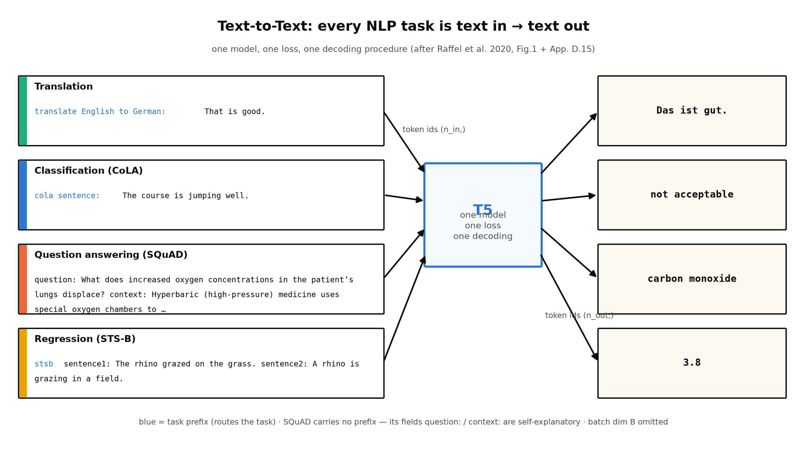
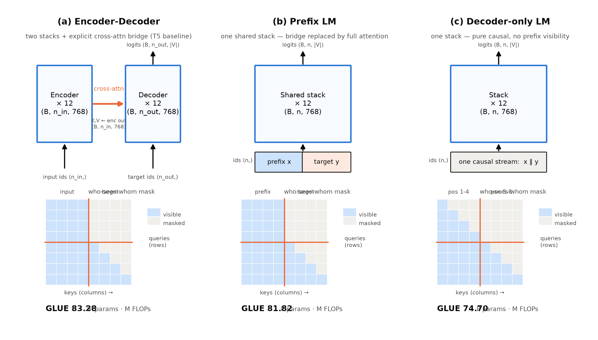

# 第 5 章 T5：text-to-text 与系统性消融

## 5.0 开篇：从全书到这里

上一章离场时留下一句「接口统一的呼声」：BERT 机身不动、每个任务换一个头（分类头、起止向量、句对各配各的损失），GPT-1 每个任务一套遍历式输入变换，GPT-2 用自然语言当接口免了微调、成绩却离微调范式还有肉眼可见的距离。三家三种接法，比麻烦更要命的是没法比——你说你的模型好，可你换的是任务头、我换的是输入格式，差异究竟该记在架构账上还是接口账上？2019 年 10 月，Google 的 Raffel 等人把这个问题连同「预训练配方里哪些成分真正在起作用」一起摆上手术台，答卷就是 T5（Text-to-Text Transfer Transformer，文本到文本迁移 Transformer）——范式三物种的第三种，也是一次回环：它绕回 Book1 那台双塔翻译机，用它拿下 24 个基准任务中的 18 项 SOTA。

本章要回答四个问题：接口能不能统一到只剩一种（5.1 节）；互联网语料怎么从沼泽滤成饮用水（5.2 节）；怎么把「我的方法更好」变成「好在这一个变量」（5.3 节，全章方法论主轴）；以及 F9 伏笔等了三章的第三触点——双塔到底死没死（5.4 节）。之后看算力的三种花法（5.5 节，第 8 章的前奏），再回望一个反直觉的事实：2020 年的冠军架构就是 2017 年的原典（5.6 节）。本章是原理章，没有新代码——消融方法论将在第 8 章的 scaling 族实验与第 11 章的 iso-FLOP 网格里被我们亲手继承，这是全书的显式约定。

> **最小背景栏**：本章默认你已读过 Book1 第 4 章（encoder/decoder 双塔与交叉注意力的三种角色）、第 6 章（LayerNorm 与残差路径），以及本册第 3 章（MLM 与微调生态）、第 4 章（GPT-2 的因果语言模型、四项手术、式 (4.3) 的任务条件化）。跨度损坏（span corruption）与 C4 的概念本章自建；分词三方案（WordPiece / byte-level BPE / SentencePiece）的第 2 章叙事线在此收一笔。

## 5.1 接口之统一：一切任务皆「文本进、文本出」

先把接口之痛量出来。BERT 的每个下游任务都要量身定做一个出口：句子分类用 [CLS] 加线性层，SQuAD 用起止位置两个向量，句对相似度还要把两种顺序各跑一遍——第 3 章数过，最省的分类头新增 1,538 个参数，每种接法各配各的损失函数。GPT-1 把结构折进序列，代价是五类任务五套变换规则。GPT-2 免掉微调，但那是一个信念级的赌注（式 (4.3) 的任务条件化要从语料里隐式学会）。工程上这是 N 份胶水代码；科学上这断了归因的路：接口不统一，变体之间就不存在公平比较。

T5 的方案一句话可以说完：**把每个文本问题都写成「输入一段文本，生成一段目标文本」**——翻译如此，打分也如此。四个算例逐字如下（图 5.1）【证据等级：官方论文 1910.10683 v4 Figure 1（p.3）与附录 D.15，直引】：

```text
翻译   translate English to German: That is good.                →  Das ist gut.
分类   cola sentence: The course is jumping well.                 →  not acceptable
问答   question: What does increased oxygen concentrations in the patient's
       lungs displace? context: Hyperbaric (high-pressure) medicine uses special
       oxygen chambers to increase the partial pressure of O 2 …   →  carbon monoxide
回归   stsb sentence1: The rhino grazed on the grass. sentence2: A rhino is
       grazing in a field.                                        →  3.8
```



**图 5.1** text-to-text 统一接口的四算例（自绘。翻译、分类、回归三例逐字取自 v4 Figure 1（p.3），问答例逐字取自 v4 附录 D.15 的 SQuAD 条目、context 截断；T5 论文为 JMLR 版 CC BY 4.0、属全书唯二可署名复用例外之一，本书仍按统一口径自绘重制。蓝色标出任务前缀；SQuAD 无任务前缀，由 question:/context: 字段自明。任务类型色条自上而下：翻译/分类/问答/回归）【证据等级：官方论文 1910.10683 v4 Figure 1、附录 D.15】

四个算例各藏着一个小诀窍。翻译例开头的 `translate English to German:` 是**任务前缀**（task prefix）——同一段正文换个前缀就是另一道题，模型对前缀学会「路由」到不同行为；这是「指令」这种接口形态在 2019 年的雏形（第 7 章 GPT-3 的 few-shot prompt 会与它重逢），也是 GPT-2 式 (4.3) 的显式实现：GPT-2 赌模型能从语料里自己学会任务条件化，T5 把 task 直接写进输入串。分类例输出的是字符串标签（`not acceptable`）；若模型生成了合法标签集之外的词（比如 `hamburger`）直接记错——作者报告说实测从未发生【证据等级：官方论文 1910.10683 v4 §2.4】。问答例取自论文附录 D.15（正文 Figure 1 的第三例原是摘要任务，此处换成问答以凑齐「生成/标签/抽取/数值」四种输出形态——出处即图注）；输出 `carbon monoxide` 是 context 里的原文 span，抽取即生成。回归例最出格：STS-B 给两句话的相似度打 1 到 5 分，T5 直接让模型生成数字字符串，训练时把分数四舍五入到最近的 0.2 再渲染成字符串（相当于 21 类分类），`3.8` 就是一个合法「标签」【证据等级：官方论文 1910.10683 v4 §2.4】。

于是训练目标只剩一种：对目标串的逐 token 交叉熵——

$$
\mathcal{L}(\Theta) \;=\; -\frac{1}{|\boldsymbol{y}|}\sum_{t=1}^{|\boldsymbol{y}|} \log P\!\left(y_t \mid y_{<t},\, \boldsymbol{x};\, \Theta\right)
\tag{5.1}
$$

| 符号 | 含义 | 形状/取值 |
|---|---|---|
| $\boldsymbol{x}$ | 输入串（含任务前缀）的 token id 序列 | $(n_{\text{in}},)$，预训练序列长 512 |
| $\boldsymbol{y}$ | 目标串的 token id 序列 | $(n_{\text{out}},)$ |
| $y_t$ | 目标串第 $t$ 个 token | 标量，词表 32,000 |
| $P(\cdot)$ | softmax 评分：$\boldsymbol{h}\,(B,n_{\text{out}},768)\cdot W_e^{\top}(768,32000)\to(B,n_{\text{out}},32000)$ | — |
| $\Theta$ | 全部可学参数 | 基线约 220M |

用人话说：不管题目是翻译、判语法还是打相似度分，模型训练时都在做同一件事——看着输入串和已生成的目标串前缀，猜目标串的下一个 token，猜错就罚。推理也一样：同一套自回归解码器逐 token 生成，直到吐出结束符。同一个模型、同一个损失、同一套超参、同一个解码过程横跨所有任务【证据等级：官方论文 1910.10683 v4 Figure 1 图注】——「T5」的名字就是 Text-to-Text Transfer Transformer 的缩写。接口统一的最大受益者不是用户而是科学：从这一刻起，「换一个变体」不再牵动接口，5.3 节的消融才有地基。

## 5.2 C4：把互联网沼泽滤成饮用水

接口立起来，下一个问题是原料。第 3 章 BERT 用 BooksCorpus 加 Wikipedia 共 33 亿词，第 4 章 GPT-2 的 WebText 是 40GB；T5 基线的预训练账本却是每步 128 条长 512 的序列（65,536 token）乘 $2^{19}=524{,}288$ 步、约 340 亿 token【证据等级：官方论文 1910.10683 v4 §3.1.3】——书和百科喂不满。唯一够大的来源是 Common Crawl：这个非营利项目每月抓取约 20TB 网页正文【证据等级：官方论文 1910.10683 v4 §1/§2.2，两处口径一致】。但 GPT-2 评估过它并因质量弃用（第 4 章 4.2 节）。T5 的回答不是换源，而是上清洗工程：取 2019 年 4 月快照，用十条启发式规则过滤【证据等级：官方论文 1910.10683 v4 §2.2，逐条】——

1. 只保留以句号、感叹号、问号或结束引号结尾的行；
2. 丢弃少于 3 个句子的页面；只保留至少 5 个词的行；
3. 删除含脏词表（LDNOOBW 清单）词汇的页面；
4. 删除含 "Javascript" 的行（大量「请启用 Javascript」警告页）；
5. 删除含 "lorem ipsum" 占位文本的页面；
6. 删除含花括号 `{` 的页面（源代码页的代理特征）；
7. 移除维基百科来源页的引用标记（如 `[1]`、`[citation needed]`）；
8. 删除含「terms of use」「privacy policy」「uses cookies」等样板句的行；
9. 去重：任何出现多于一次的三句跨度只保留一份；
10. 语言过滤：langdetect 判为英文的概率 ≥ 0.99 才保留。

二十 TB 的沼泽滤出「约 750GB」正文可入口的英文文本；表格里登记的是 745GB（750 是行文取整，引用时注明双口径）【证据等级：官方论文 1910.10683 v4 §2.2 与 Table 8】。这套规则里的每一条都在对抗一种具体的网络淤泥——警告页、占位符、代码、样板法律声明、重复抓取；第 9 条的三句去重与第 10 条的语言门，是后面所有「互联网语料」工作的标配雏形。

清洗值得吗？T5 把它做成了受控实验（5.3 节的方法论在此先预演一次）：同一基线，只换预训练语料。不清洗的 C4 unfiltered 有 6.1TB——八倍于清洗版的数据量，GLUE/SQuAD/SuperGLUE 三项 81.46/78.78/68.04，对比 C4 745GB 的 83.28/80.88/71.36 全面更差【证据等级：官方论文 1910.10683 v4 Table 8】。数据不是越多越好，是**干净**数据越多越好。同一张表还有第二层读数：17GB 的 WebText-like 把 GLUE 推到 84.03、20GB 的 Wikipedia+TBC 把 SQuAD 推到 82.08——小而对口的语料能在个别任务反超大而杂的 C4（SQuAD 的语料本就出自维基）【证据等级：官方论文 1910.10683 v4 Table 8】。T5 为通用能力选了 C4；而小语料在长训练里被迫重复使用会有害（截断 C4 后训练损失反而更低——记忆化的迹象，原文 Figure 6）【证据等级：官方论文 1910.10683 v4 §3.4.2/Figure 6】。这组对照在第 6 章 RoBERTa 的「数据 10 倍」与第 8 章 scaling 的数据轴里都会回声。

词表是第 2 章叙事线的第三块拼图：BERT 用 WordPiece 30k，GPT-2 用 byte-level BPE 50,257，T5 用 SentencePiece 训出的 32,000 词表——因为要兼顾翻译微调，词表在 10 份英文 C4 加德、法、罗马尼亚语 Common Crawl 各一份的混合语料上训练，输入输出共享同一张表【证据等级：官方论文 1910.10683 v4 §2.2】。

## 5.3 系统性消融：把综述做成受控实验

原料与接口就绪，T5 做的最有价值的事却不是拿冠军，而是**立方法**。2019 年的困境是：新模型月更，每个都自称更好，但架构、目标、数据、训练时长常常多变量同改——你永远不知道赢在哪一刀。T5 的设计朴素得像教科书：固定一个基线，**每次只动一个变量块**，五块分别是架构、预训练目标、数据、迁移策略、规模；text-to-text 接口保证所有变体在完全相同的任务、损失与解码下受审。这等于把一篇文献综述做成了一场受控实验——「系统性消融」（ablation，逐次拆掉部件看成绩变化）四个字，从此可以是方法而不是口号。

基线先立（它是所有比较的参照系）：**原典编码器-解码器**——论文原话「我们使用 Vaswani 等人提出的标准编码器-解码器 Transformer」【证据等级：官方论文 1910.10683 v4 §2.1，直引大意】。encoder 与 decoder 各 12 层，$d_{model}=768$、$d_{ff}=3072$（ReLU）、$d_{kv}=64$、12 头——单塔规格与 BERT-BASE 相同，双塔合计约 220M 参数（约为 BERT-BASE 的两倍）。对 Book1 原典只有三处小偏离：LayerNorm 去掉偏置；**LayerNorm 移到残差路径之外**（pre-LN 式布局——与第 4 章 GPT-2 的手术②同期平行，两家在 2019 年殊途同归）；位置编码换成简化版相对位置（32 个共享嵌入桶、桶宽对数增长，超过偏移 128 后所有相对位置共用一个嵌入）。输出 softmax 权重照例与输入嵌入共享（第 4 章手术④的同款账）。训练用 AdaFactor、逆平方根学习率（前一万步常数 0.01 后衰减）【证据等级：官方论文 1910.10683 v4 §2.1/§3.1】。预训练的增益地板也先钉死：同一模型不预训练、从零学每个任务，GLUE 从 83.28 掉到 66.22、SQuAD 从 80.88 掉到 50.31（唯一例外 EnFr 翻译 39.77 对 39.82——高资源任务上预训练增益本就边际）【证据等级：官方论文 1910.10683 v4 Table 1】。

**第一块：架构三选一。**候选只有三种，区别全在「谁看见谁」——图 5.2。编码器-解码器（图 5.2a）：输入段由 encoder 全互见地编码成记忆，decoder 因果地生成目标、每层经交叉注意力桥取用记忆；前缀语言模型（prefix LM，图 5.2b）：单塔，序列切成前缀加目标两段，前缀段全互见、目标段因果且看得见全部前缀；decoder-only 语言模型（图 5.2c）：单塔纯因果，前缀也只能从左往右看。注意 (a) 与 (b) 的「谁看见谁」矩阵完全相同——差别只在塔的排布与参数是否共享，这正是 5.4 节的伏笔。成绩见表 5.1。



**图 5.2** 三种预训练架构对照：塔的排布与「谁看见谁」的 mask（自绘示意级。上行塔排布、下行 8×8 可见性矩阵：行=查询位、列=被看见位，蓝格=可见、灰格=遮挡，橙色线为输入/目标分界；(a) 与 (b) 的可见性矩阵相同、差异仅在双塔+显式桥 vs 单座共享塔；形状标注 $B$ 为批维、$n$ 为序列长、$|V|=32000$。GLUE 成绩与参数/算力记号引 v4 Table 2 去噪目标行：$P$=12 层单塔参数量、$M$=编码器-解码器处理一个序列的 FLOPs）【证据等级：官方论文 1910.10683 v4 §3.2.1、Table 2】

**表 5.1** 架构 × 目标消融（重排自 v4 Table 2；此处留 GLUE/SQuAD/SGLUE 三列，原表七列全任务。五变体 × 两目标共十行全录）

| 架构变体 | 目标 | 参数 | 算力 | GLUE | SQuAD | SGLUE |
|---|---|---|---|---|---|---|
| ★编码器-解码器 | 去噪 | 2P | M | **83.28** | **80.88** | **71.36** |
| 编码器-解码器（共享参数） | 去噪 | P | M | 82.81 | 80.63 | 70.73 |
| 编码器-解码器（各 6 层） | 去噪 | P | M/2 | 80.88 | 77.59 | 68.42 |
| 语言模型（decoder-only） | 去噪 | P | M | 74.70 | 61.14 | 55.02 |
| 前缀语言模型 | 去噪 | P | M | 81.82 | 78.94 | 68.11 |
| 编码器-解码器 | 语言建模 | 2P | M | 79.56 | 76.02 | 64.29 |
| 编码器-解码器（共享参数） | 语言建模 | P | M | 79.60 | 76.35 | 63.50 |
| 编码器-解码器（各 6 层） | 语言建模 | P | M/2 | 78.67 | 75.32 | 64.06 |
| 语言模型（decoder-only） | 语言建模 | P | M | 73.78 | 53.81 | 56.51 |
| 前缀语言模型 | 语言建模 | P | M | 79.68 | 76.87 | 64.86 |

（数据：【证据等级：官方论文 1910.10683 v4 Table 2】；$P$、$M$ 记号同图 5.2。「去噪」指损坏-重建式预训练目标（BERT 式 MLM 的族名，本节第二块详解），「语言建模」指因果预测全序列。）

读表之前先交代这张表的**公平口径**——这是消融设计里最贵的一课。编码器-解码器（24 层）参数是单塔（12 层）的两倍，但单塔要处理整条「输入+目标」拼接序列，算力反而相当：参数与算力**只能对齐一个**。作者的取舍是全表按算力对齐（同耗 M），基线以 2P 参数买这份算力；「共享参数」变体恰好把参数也对齐到 P——与同属 P/M 的前缀语言模型、纯语言模型构成参数、算力双对齐的干净三角（「各 6 层」变体则是 P/M/2，用来单独检验层数）。三个读数：其一，编码器-解码器加去噪全面最优；共享参数版省一半参数只掉约半分，「近免费」；各 6 层版层数减半伤得更深——深度不能随便砍。其二，前缀语言模型 81.82 紧咬最优，纯因果的 74.70 崩塌式垫底（SQuAD 61.14）——光是允许前缀「全互见」就值约 7 分。其三，把每行与下面对应行比：**去噪目标对全部五种架构一律优于语言建模目标**（原文用了 "always"）【证据等级：官方论文 1910.10683 v4 §3.2.2】。架构与目标两个变量块在此正交拆开。

**第二块：目标三选一。**预训练目标怎么造题？先看论文的手算例（十词句逐字，`<M>` 是共享掩码符、`<X>/<Y>/<Z>` 是各自唯一的哨兵 token（sentinel token））【证据等级：官方论文 1910.10683 v4 Table 3，直引】：

```text
原句      Thank you for inviting me to your party last week .
BERT式    输入  Thank you <M> <M> me to your party apple week .
          目标  （重建全文）
乱序复原  输入  party me for your to . last fun you inviting week Thank
          目标  （复原全文）
哨兵替换  输入  Thank you <X> me to your party<Y> week .
          目标  <X> for inviting <Y> last <Z>
```

基线目标的机制一眼可见（论文 Table 3 行名「I.i.d. noise, replace spans」：逐词独立掷骰子损坏 15% 的词，连续被损坏的词自然连成段）：每个连续损坏段换成一个哨兵，目标串只需生成「损坏了什么」——`<X> for inviting <Y> last <Z>`，哨兵当定界符、末尾补 `<Z>` 收尾；而 BERT 式的解码器要重建**全文**，连没坏的九成也要逐字吐出。成绩分两层看。大类（Table 4）：BERT 式 82.96 最好，前缀语言建模目标 80.69 次之（翻译任务上两者接近），乱序复原（deshuffling）73.17 明显最差——把词序打乱再复原，学到的全局排序知识换不来细粒度的语言建模能力。族内（Table 5）：哨兵替换式 i.i.d. 基线（行名 Replace corrupted spans，Table 7 又记作 Baseline (i.i.d.)）83.28 对 BERT 式 82.96——**族内差异不超过 1 分**；表面最高的是「丢词式」（drop corrupted tokens：输入删去损坏词、不留哨兵，目标仍是生成那些词）84.44，但拆开看是 CoLA 单项暴涨驱动（60.04 对基线 53.84）——「找出被删的词」恰好就是语法可接受度检测，机制上讨了巧，SuperGLUE 反而更差（68.67）【证据等级：官方论文 1910.10683 v4 Tables 4-5 及 §3.3.2】。所以 T5 最终在去噪族里选中这一支、再精化为「平均段长 3」的理由必须精确表述：不是它碾压 BERT 式 MLM，而是它「性能略优（marginally better）且目标序列更短、训练稍快」——配方的原话【证据等级：官方论文 1910.10683 v4 §3.3.4，直引大意】。配套两个小消融：损坏比例 15% 沿用 BERT（25% 无差、50% 才明显受伤）；平均段长 3（真·跨度损坏：连续采样长约 3 的损坏段）略优于基线的逐词独立损坏（83.49/81.84/72.53 对 83.28/80.88/71.36），最终取「15%、平均段长 3」【证据等级：官方论文 1910.10683 v4 Tables 6-7】。论文自己的反思值得抄下来：去噪族内继续打磨同类目标「未必带来显著收益」，应按计算成本选目标【证据等级：官方论文 1910.10683 v4 §3.3.5，直引大意】。

**其余两块各一笔。**迁移策略（Tables 10-12）：全参数微调（83.28）最优——这正是第 1 章 1.5 节 ULMFiT「整台微调、按配方来」的谱系在 Transformer 上的重演（那面「配方 ≥ 架构」的旗将在第 6 章定量验收）；在每个 FFN 后插小 adapter 层只微调它（容量 d=32 到 2048，80.52 到 81.54）是参数效率的折中；**任何多任务混合训练都低于预训练加逐任务微调**——等比例混合灾难性地掉到 76.13，调温度的最好版本 81.90 也仍输；多任务预训练加微调 83.11 打平、纯监督多任务预训练 79.93 显著变差【证据等级：官方论文 1910.10683 v4 Tables 10-12】。规模块是 5.5 节的主角。数据块（Table 8）5.2 节已拆。

方法论的骨架到此完整：**统一接口保住可比性，一次一个变量保住归因，等价基准的口径显式写在表注里**。第 8 章我们要在自己 1M 到 20M 的小模型族上拟合幂律、第 11 章要铺 iso-FLOP 网格——用的正是同一套设计，只是把「架构/目标」换成了「参数量/数据量」。读论文时先找它的消融表、再看它对齐的是参数还是算力，是本章送你的第一件工具。

## 5.4 F9 第三触点：双塔没死，桥还在挣饭吃

表 5.1 里藏着的，正是 F9（交叉注意力的生死簿）等了三章的第三触点。先回顾谱系：第 3 章第一触点，BERT 拆掉 decoder 塔与桥、encoder 半塔独立成楼，句对任务的桥被「拼包加自注意力」摊平吸收；第 4 章第二触点，GPT-2 反向拆掉 encoder 塔，decoder 单塔把桥折叠进自身。两次折叠之后，一个自然的问题是：双塔是不是已被历史淘汰？T5 在 2019 到 2020 年的时点上给出三重证据说**没有**。

证据一，形态存续：T5 的机身就是 Book1 那台翻译机——§2.1 原话用的是「Vaswani 等人提出的**标准**编码器-解码器」，decoder 每层三个子层（因果自注意力、对 encoder 输出的交叉注意力、FFN）原样保留，双塔合计 220M 参数。2017 年出厂的整机结构，在 2020 年的 SOTA 模型里一件不少。证据二，受控对照——桥还在挣饭吃：表 5.1 里参数、算力双对齐（P、M）的干净三角给出排序：共享参数双塔 82.81 > 前缀语言模型 81.82 > 纯因果语言模型 74.70。前缀语言模型与共享双塔的差别**只有一处**：前者的塔内注意力直接覆盖输入与目标全序列（把桥摊平），后者保留显式桥。就这一处，值约 1 分——论文的结论句值得逐字引用：共享参数编码器-解码器胜过 decoder-only 前缀语言模型，「这提示显式编码器-解码器注意力的加入是有益的」（"suggesting that the addition of an explicit encoder-decoder attention is beneficial"）【证据等级：官方论文 1910.10683 v4 §3.2.2，直引】。证据三，存续的代价（这笔账 2022 年才有人算清）：BigScience 的 Wang 等人（作者名单里有 T5 的 Roberts 与 Raffel 两位——写桥的人回头验自己的桥）重跑架构对照时发现，「由于交叉注意力层，编码器-解码器模型运行起来约贵 10%」（approximately ∼10% more computationally expensive to run）；为对齐预训练算力，编码器-解码器档不得不堆两倍层数——11.0B 参数对 decoder-only 的 4.8B，同算力下参数与内存翻倍【证据等级：官方论文 2204.05832 §3.1 与 Table 1 图注，直引】。桥要收税：约 10% 的每序列计算税，加上同算力下翻倍的参数账。存续是真的，免费也是假的。

再把整机数据流走一遍，确认这台机器你能画出来：输入 $\boldsymbol{x}$（$(B,n_{\text{in}})$ 的 id）经嵌入查表成 $(B,n_{\text{in}},768)$，过 12 层 encoder 得记忆 $\boldsymbol{m}$（$(B,n_{\text{in}},768)$）；目标 $\boldsymbol{y}$ 右移一位（$(B,n_{\text{out}})$）经同一词表查表成 $(B,n_{\text{out}},768)$，过 12 层 decoder——每层先因果自注意力（分数矩阵 $(B,h,n_{\text{out}},n_{\text{out}})$ 下三角），再交叉注意力（query 来自目标侧、$K,V$ 来自 $\boldsymbol{m}$，逐头投到 64 维后相乘：$(B,h,n_{\text{out}},64)\cdot(B,h,64,n_{\text{in}})\to(B,h,n_{\text{out}},n_{\text{in}})$，无掩码全可见），后接 FFN（$768\to3072\to768$）——出口经共享嵌入转置得 logits $(B,n_{\text{out}},32000)$ 喂给式 (5.1)。除三处小修与相对位置桶外，与 Book1 第 4 章的翻译机逐件同构。

于是可以宣读折叠的**机械蓝图**了。论文对前缀语言模型的定义句逐字是：这个架构「类似于一个编码器与解码器**共享参数**、并把编码器-解码器注意力**替换为跨输入与目标序列的全序列注意力**的编码器-解码器模型」【证据等级：官方论文 1910.10683 v4 §3.2.3，直引】。用人话说：折叠的全部操作就是「共享两塔的参数，把桥换成一张更大的可见性矩阵」——不添不删任何零件，只改「谁看见谁」。图 5.2 的 (a)(b) 两格用同一张 mask 直观呈现了这件事。至此 F9 三触点谱系收拢：2017 年双塔出厂 → 2018 年两次半塔拆分（BERT 留 encoder、GPT 留 decoder）→ 2019 年折叠蓝图写定（前缀语言模型定义句）→ 2020 年双塔存续证明（T5 冠军）。注意这个时点的证据方向：受控实验说桥有益、账本说桥收税——判决尚未到期。2022 年的终审显示纯 zero-shot 设定下天平翻向单塔，那份带边界条件的判决书在第 12 章宣读；本章先把谱系立在此处。

> **【考据框】T5 的版本史与引用口径。**arXiv 上 1910.10683 共四版：v1（2019-10-23）、v2（次日）、v3（2020-07-28）、v4（2023-09-19 上传）——v4 即 JMLR 21 (2020) 1-67 刊出版（该刊页脚明示 CC BY 4.0，也是全书唯二可复用图源的例外之一）的对齐上传。本书引用一律锚定 v4/JMLR 版的节号与表号；本章全部数字已对 v4 全文逐表核对（2026-10，本地缓存解析）。

## 5.5 三条路线的排序与算力的三种花法

五块消融还剩规模——T5 用一个问句给这一节开场，值得逐字：「你刚拿到 4 倍算力，怎么花？」（"You were just given 4× more compute. How should you use it?"）【证据等级：官方论文 1910.10683 v4 §3.6，直引】。背景是 Sutton 的「苦涩教训」（bitter lesson）：能吃下算力的通用方法终将赢过精巧的人类先验——所以问题不是要不要 scale，而是 scale 什么。表 5.2 是答案。

**表 5.2** 规模三花法：4 倍算力的六种花法（重排自 v4 Table 13，均用去噪目标与基线同任务评测；「大小」指参数量、「训练时长」指预训练与微调的步数）

| 花法 | GLUE | SQuAD | SGLUE |
|---|---|---|---|
| 基线（1× 大小，1× 步数） | 83.28 | 80.88 | 71.36 |
| 1× 大小，4× 步数 | 85.33 | 82.45 | 74.72 |
| 1× 大小，4× 批量 | 84.60 | 82.52 | 74.64 |
| **2× 大小，2× 步数** | **86.18** | **84.18** | 77.18 |
| 4× 大小，1× 步数 | 85.91 | 83.86 | **78.04** |
| 4× 独立模型集成 | 84.77 | 83.09 | 71.74 |

（数据：【证据等级：官方论文 1910.10683 v4 Table 13】。）

三个读数。其一，加时长（85.33）与加批量（84.60）都有益、彼此接近——没有明确赢家。其二，**加大模型在这两者之上再叠一档增益**：2× 大小配 2× 步数 86.18 全面最高，4× 大小单倍步数也到 85.91——大小与时长互补（2×/2× 与 4×/1× 相当），但纯堆大小或纯堆时长都到不了顶。其三，四模型集成（ensemble，84.77）是正交手段，翻译类任务上反而最强，但推理成本是四台模型——论文提醒：集成 N 台的花费约等于一台 N 倍算力的模型【证据等级：官方论文 1910.10683 v4 §3.6】。「怎么花算力」这个问句没有到此为止：大小对应参数量、时长对应数据量，**这两者之间的预算分配正是第 8 章 Scaling Laws 的母题**——Kaplan 把它写成幂律与「大模型优先」，Chinchilla 修正为等比扩张；届时我们会用自己的小模型族亲手拟合一条真曲线，本章先立此存照。

把五块消融的杠杆排序（论文证据链的归纳）：**第一是规模**——表 5.2 里 4 倍算力换 2 到 3 分，§3.7 的判断是「把模型规模放大到 110 亿参数是（拿 SOTA 的）最重要的成分」（直引大意）；**第二是目标函数的大类**——去噪对语言建模约 4 分（表 5.1），但族内变体彼此不超过 1 分、继续打磨收益甚微；**第三（负结果）是多任务**——任何混合策略都不如预训练加逐任务微调。排序不等于全部：归因表（Table 15）里，基线 83.28 拉长到 1T token 训练后到 84.80，而叠加全部配方改动（换跨度损坏、多任务预训练混合、逐任务微调等）的 T5-Base 到 85.97——等量数据上非规模因素再贡献 1 分以上，论文的收束句是「规模不是唯一的因素」（"scale is not the only factor"）【证据等级：官方论文 1910.10683 v4 Table 15 与 §3.7，直引】。

最终战报一笔带过：最终配方以「15% 腐蚀、平均段长 3」的跨度损坏预训练 1M 步、每步 $2^{11}$ 条 512 序列、约 1T token（基线的 32 倍），模型从 60M 到 11B 五档——11B 档刻意放大 $d_{ff}$ 而非 $d_{model}$，因为 TPU 对 FFN 大矩阵乘最高效。24 个任务里 18 个 SOTA：GLUE 平均 90.3、SuperGLUE 88.9（此前 SOTA 84.6、人类 89.8，已几近打平）；诚实的边界也白纸黑字——WMT 三项翻译全部未拿下 SOTA（英文单语预训练、无回译增强的短板），SQuAD 的 91.26/96.22 系 validation 集口径（测试服务器算力不够跑 11B，引用必须注明）【证据等级：官方论文 1910.10683 v4 §3.7/Table 14】。

## 5.6 回环：2017 年的架构，2020 年的冠军

现在退后一步看全章最反直觉的事实：T5 的机身就是 Book1 第 4 章那台双塔翻译机。三年预训练革命的终点冠军，是起点架构——第 3 章拆半塔、第 4 章折叠单塔，拆与折都被 2020 年的受控证据判了「尚未胜诉」。拿第 4 章的差异清单三问来核它：这一刀为什么非动不可？动的是哪一格？账怎么变？答案是 T5 对原典只有三处小修（LN 去偏置、LN 移出残差路径、简化相对位置）加一处继承（绑定嵌入）——每一处都是第 4 章已在 GPT-2 身上见过的手法，**没有一处结构创新**。真正的革命发生在架构之外：目标函数（跨度损坏）、数据工程（C4 与十条规则）、规模（11B/1T token）、接口（text-to-text）。

为什么架构反而稳定？因为预训练范式要的是「能被无监督目标驱动的高容量通用机体」，而 text-to-text 的两端（读入一段、写出一段）恰好对齐双塔的两端（encoder 读、decoder 写）——架构不是瓶颈时，最先进的架构就是已经验证过的架构。但要给这个判断立上边界：它成立于**微调范式**（预训练加逐任务微调）。三年后纯 zero-shot 设定下的同题对照会给出不同排序——那是第 12 章判决书的内容，本章先把「证据随设定翻转」这个意识种下。

## 5.7 本章小结

开篇的四问交卷。接口能统一吗：能——text-to-text 把翻译、分类、问答、回归全部压成「文本进、文本出」，任务前缀路由行为，一个模型、一个损失（式 (5.1)）、一套解码；统一的最大受益者是可比性。语料从哪来：Common Crawl 的 20TB 沼泽经十条规则滤成 745GB 饮用水，受控对照证明干净比多更重要，小而对口可在单任务反超。怎么科学地比：固定基线、一次一个变量块、公平口径（对齐参数还是算力）写进表注——五块消融给出杠杆排序：规模 > 目标大类 > （负结果）多任务。双塔死了吗：没有——形态存续、受控对照（桥值约 1 分）、10% 计算税三重证据；折叠的机械蓝图（共享参数加换 mask）也已写定，判决留到第 12 章。

**带走的心智**：忘掉数字后请留下两条。第一条：**可比性是实验科学的生命线——统一接口让变体可比，一次一个变量让归因可读；读任何「X 比 Y 好」的断言，先问它对齐的是什么口径（参数？算力？数据？），再问它一次动了几个变量。**第二条：**架构的存亡不由时尚投票、由受控证据裁决——2020 年的冠军还是 2017 年的双塔，那三年真正的引擎是目标、数据与规模；所以看一个时代的模型，先看它的「没变处」，再看它的「变了处」。**

范式三物种至此集齐：理解半塔（BERT）、生成单塔（GPT）、双塔回环（T5）。但 T5 的账本里有一块暗流值得单独开庭：它证明清洗与规模值钱的同时，也留下一个问题——**不动架构、只改训练配方**，能走多远？下一章 RoBERTa 用一台「复读机」（原样复跑 BERT）回答，顺手回收第 3 章埋下的 NSP 疑云；它与本章「一次一个变量」的方法论恰成对照——RoBERTa 的招牌消融恰恰是多个变量捆绑同改，怎么读那种表，正是第 6 章的课。另：本章的跨度损坏与第 10 章自训 GPT-2 用的因果语言建模是预训练目标的范式两端，第 10 章实现目标函数时会回指此处。

> **【欠账】** 本章不新增跨册欠账。F9（交叉注意力的折叠）三触点谱系在此收拢，与终局判决（2022 年受控对照的完整边界条件、10% 桥税的推理侧含义）一起在第 12 章合龙 → Book2 第 12 章。

## 5.8 动手验证（本章图表与手算清单）

- 复现图 5.1/5.2（秒级；全部数字与字符串引 v4 Table 2/Figure 1/附录 D.15，脚本内注明出处）：
  ```bash
  cd 工作区根目录 && source env.sh && \
    python [`code/ch05/make_figures.py`](code/ch05/make_figures.py)
  ```
- 手算两笔账（纸笔 30 秒）：基线预训练量 $2^{19}$ 步 × 128 序列 × 512 token = $2^{35}$ ≈ 34B token；最终配方 $10^6$ 步 × $2^{11}$ × 512 ≈ 1.05T token ≈ 基线的 32 倍【证据等级：官方论文 1910.10683 v4 §3.1.3/§3.7】。
- 验收点：能否不看书画出图 5.2 三种架构的塔排布与可见性矩阵、并说出 (a)(b) 的 mask 为何相同；能否复述双塔存续的三重证据与 10% 税的精确口径（每序列计算、非参数）；能否说出 T5 选哨兵替换式基线并精化为「平均段长 3 跨度损坏」的真实理由（族内 ≤1 分、胜在目标序列短）；能否解释表 5.1 的 P/M 公平口径。
