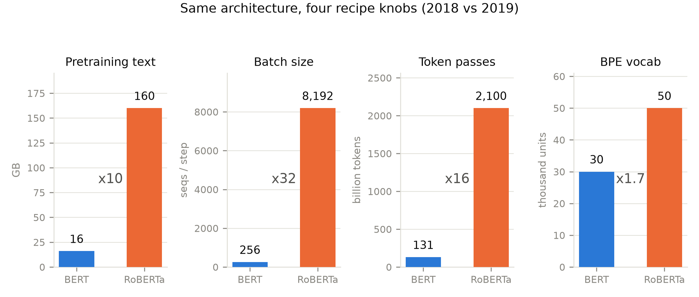

# 第 6 章 RoBERTa：配方 ≥ 架构

## 6.0 开篇：从全书到这里

上一章 T5 把「一次只改一个变量、其余全部冻结」的系统性消融立成了方法论，也用受控证据为双塔正了名：2020 年的冠军架构，就是 2017 年那台原典。但 T5 每格实验比较的都是「架构与目标」；回头看 BERT 那场大捷，还有一种更不舒服的解释从未被排除——默认赢了是架构好、目标妙，可万一 BERT 赢在别处呢？2019 年上半场还在强化这种默认：XLNet 改造目标函数与训练顺序反超 BERT-Large（RTE 83.8 对 70.4）【证据等级：官方论文 1907.11692 Table 5，转引 Yang et al. 2019】，「架构决定论」加速。2019 年 7 月，Facebook AI 的一篇论文提出相反的假设，摘要里的结论句毫不客气：*"We find that BERT was significantly undertrained, and can match or exceed the performance of every model published after it."*（我们发现 BERT 被严重地训练不足；把它训足之后，它能追平或超过此后发表的每一个模型）【证据等级：官方论文 1907.11692 摘要，逐字】。

这就是本章的主角 RoBERTa（Robustly Optimized BERT Approach，稳健优化的 BERT 方法——名字本身就是论点）。它是「范式三物种」旅程（第 2-6 章）的最后一站，要回答两个问题：**架构一字不动、只改训练配方，能把 BERT 推多远？**以及第 3 章埋下、悬了两章的旧案——**NSP 到底是有功之臣还是冤案？**产出有三样：一张配方差异全清单、一次翻案庭审、一条从第 1 章 ULMFiT 立旗到本章定量闭环的谱系。

> **最小背景栏**：本章全部前置都已备好——MLM 与 NSP 的机制、输入打包与两枚「冷水脚注」见第 3 章 3.2-3.3 节（式 (3.1)-(3.3)）；ULMFiT 的微调配方四件套见第 1 章 1.5 节；WordPiece 与 byte-level BPE 的家族谱系见第 2 章 2.5 节（表 2.3、表 2.4）；「一次一个变量」的消融方法论见第 5 章 5.3 节。静态/动态的概念本章自含。另有一件事先说破：**这一章自始至终不碰机器内部**——RoBERTa 没有新算子、没有新形状，数据流与第 3 章的 BERT 逐位相同，所以我们一次也不需要画新的形状流转表；这正是它教学价值的一部分。

## 6.1 归因问题，与一台「复读机」的设计

把开篇的疑问写成一个可以动手检验的形式。一台预训练模型的成绩 $R$，粗略地是三族变量的函数：$R = f(\text{架构},\ \text{目标},\ \text{配方})$——架构是机身、目标是损失（第 3 章的 MLM+NSP）、配方是其余一切（数据、步数、批量、掩码采样、分词器）。BERT 之后的领域叙事把增量几乎全记在架构与目标两本账上；XLNet 的反超又添了新证据。要检验这个记账对不对，思路其实只有一条：**把架构与目标钉死，把配方拧到头，看成绩动不动**。动了，说明配方里藏着被低估的变量；不动，「架构决定论」就坐实了。

RoBERTa 论文的自我定位不是「提出新模型」，而是一项复现研究（replication study）——我们把这类工作叫「复读机实验」：把 BERT 的论文当实验记录，原样复读一遍，复读过程中只许改配方。它的设计有三个值得学的细节。其一，架构全程冻结，论文在消融章节开篇明言 *"We keep the model architecture fixed"*（我们保持模型架构不变），脚注另声明架构改动留作未来工作【证据等级：官方论文 1907.11692 §4 及脚注 7，逐字】——先把最容易混淆的变量钉死。其二，先复现、再动手：Table 1 里有一行「我们的复现（静态掩码）」与 BERT 发表值并排（SQuAD 2.0 F1 78.3 对 76.3、MNLI-m 84.3 对 84.3、SST-2 92.5 对 92.8）【证据等级：官方论文 1907.11692 Table 1；BERT 发表值转引自 Yang et al. 2019】——复跑对不上原版，后面的一切差异就说不清归属，这一行是整篇论文的信用地基。其三，分块拆解、终局合体：第 4 节把配方切成掩码、NSP 与输入格式、批量、分词四块，每块单独消融（用 BERT-Base 规格，$L{=}12/H{=}768/A{=}12$）；第 5 节把胜出改动全部叠加，用 BERT-Large 规格（$L{=}24/H{=}1024/A{=}16$，355M 参数）训出终局模型并起名 RoBERTa——「先归因、后合体」的两段式，与第 5 章 T5 的方法论同宗，只是 T5 拆的是架构与目标，这里拆的全是配方。

同一台平平无奇的底座、增益全来自训练方法——这正是第 1 章 1.5 节 ULMFiT 命题「配方 ≥ 架构」的又一次登场，只是那次底座是 LSTM。旗子能不能插到 Transformer 时代，6.4 节定量验收；先把十项配方差异摆全。

## 6.2 配方十项差异：全清单与四个重点

表 6.1 是两文训练配方的全清单，第 0 行特意放「架构：完全相同」——整章论证的地基。图 6.1 把四个量级变化最大的旋钮画在一起：数据 10 倍、批量 32 倍、token 通过量约 16 倍、词表 1.7 倍，而机身一颗螺丝没换。

**表 6.1 BERT → RoBERTa 训练配方十项差异全清单**（自排；各行证据见注）

| # | 维度 | BERT（1810.04805v2 A.2/§3） | RoBERTa（1907.11692） |
|---|---|---|---|
| 0 | 架构 | BERT-Base/Large | **完全相同**（§4 脚注 7） |
| 1 | 掩码采样 | 静态：预处理一次生成，数据复制 10 份 | **动态**：每次喂入时重采样（§4.1） |
| 2 | NSP 损失 | 保留 | **去掉**（§4.2） |
| 3 | 输入格式 | 段对（SEGMENT-PAIR，≤512） | **全句打包**（FULL-SENTENCES，可跨文档） |
| 4 | 批量 | 256 序列 | **8K 序列**（§4.3） |
| 5 | 预训练数据 | BookCorpus+Wikipedia，16GB【1907.11692 §3.2 复测口径】 | **五份语料 >160GB**（§3.2） |
| 6 | 训练时长 | 1M 步 @256 | **500K 步 @8K**，逐步累积（§5 Table 4） |
| 7 | 分词 | WordPiece 30K（char-BPE 30K，启发式预分词） | **byte-level BPE 50K**，无预分词（§4.4） |
| 8 | 优化细节 | Adam $\beta_2{=}0.999$；90% 步用 128 长序列 | $\beta_2{=}0.98$；**只用全长 512**；峰值 lr/warmup 随设置调 |
| 9 | 精度/硬件 | —— | 混合精度（mixed precision）；终局 1024 块 V100 训约 1 天（首个 100K 步） |

注：第 0-7 行均【证据等级：官方论文 1907.11692】；BERT 侧口径【证据等级：官方论文 1810.04805v2 A.2/§3】（第 7 行 BERT 侧为 RoBERTa 对 BERT 的描述原文；第 5 行的 16GB 是 RoBERTa §3.2 的复测口径——BERT 原文只报词数、无 16GB 之数）。



**图 6.1** 同一架机器的四个配方旋钮：BERT（蓝）与 RoBERTa（橙）的量级对照（自绘）。数据取自两文官方口径：数据量 16GB→>160GB【1907.11692 §3.2】、批量 256→8,192【§4.3】、词表 30K→50K【§4.4】（BERT 侧 1810.04805v2 A.2/§3）；token 通过量按式 (6.1) 换算（本书计算，非论文原数）。【证据等级：官方论文（数据/批量/词表三格）+ 本书换算（token 通过量一格）】

十项不必逐项等权重——四个焦点值得停下来把机制讲透，其余由表承载。

焦点一，掩码何时采样。BERT 的掩码是**预处理时一次性生成**的：数据复制 10 份、每份打一种掩码，掩码在数据管道里是静态的（static）【证据等级：官方论文 1907.11692 §4.1（对 BERT 实现的复述）】。RoBERTa 把采样挪到运行时：序列每次进模型，现场重新掷骰子——动态掩码（dynamic masking）。受控对照（BERT-Base 规格复跑，5 种子中位）：SQuAD 2.0 F1 78.3→78.7、MNLI-m 84.3→84.0、SST-2 92.5→92.9——论文自评「相当或略好」【证据等级：官方论文 1907.11692 §4.1 Table 1】。单项差距很小；选它的理由一半在工程（免掉 10 倍数据复制），一半在一句前瞻：*"This becomes crucial when pretraining for more steps or with larger datasets"*（当训练步数更多、数据更大时，这就变得关键）——训得越久、数据越大，同一序列重复见到同一掩码的浪费越大。配方的改变常常不是为了今天这一点分，而是为了它随之放开的长训练与大数据这两个旋钮。

焦点二，批量。Table 3 的设计很讲究：三种批量各配各的学习率，**epoch 数与总算力都对齐**（256×1M、2K×125K、8K×31K 步走过同样的数据遍数）【证据等级：官方论文 1907.11692 §4.3 Table 3】。结果：掩码语言模型在留出集上的困惑度 3.99→3.68→3.77，MNLI-m 84.7→85.2→84.6。注意它**不是单调的**（8K 两项都不是最高），但结论仍成立：大批量改善 MLM 困惑度与端任务表现、更易并行——没有大集群时用梯度累积（gradient accumulation，小批梯度攒够再更新一步）也能达到同等效果【证据等级：官方论文 1907.11692 §4.3 及脚注 8】。批量是「吞吐换优化质量」的旋钮，不是越大越好的信仰（第 9 章回收）。

焦点三其实是同一条账的两半：数据与时长。数据侧，RoBERTa 把语料从 16GB 扩到五份语料合计**超过 160GB**：BookCorpus 与 English Wikipedia（原班人马，合计 16GB）、CC-NEWS 76GB（CommonCrawl 新闻的英文部分，6300 万篇，2016-09 至 2019-02）、OPENWEBTEXT 38GB、STORIES 31GB【证据等级：官方论文 1907.11692 §3.2】。其中 OpenWebText 是第 4 章 4.2 节的旧识——WebText 从未公开，社区按同口径（Reddit 上获至少 3 赞的链接）复刻了它；复刻品在这里第一次进入主流预训练配方。时长侧，Table 4 是一张累积阶梯：先在 16GB 上以 8K 批量训 100K 步，然后「+数据」（160GB、仍 100K 步），再「+时长」（300K 步、500K 步），每行只叠加一项——MNLI-m 从 89.0 爬到 89.3、90.0、90.2，SST-2 从 95.3 爬到 96.4，SQuAD v1.1/v2.0 F1 从 93.6/87.3 到 94.6/89.4；对照行 BERT-Large（13GB、256 批量、1M 步）只停在 MNLI-m 86.6、SST-2 93.7、SQuAD 1.1/2.0 90.9/81.8【证据等级：官方论文 1907.11692 §5 Table 4】。这行对照的 13GB 与上文 16GB 是同一份语料两种账：16GB 是 RoBERTa 复测的未清洗口径，13GB 是 Table 4 对照行的清洗后口径，读表先对账。训到 500K 步时论文补了一句关键观察：模型「看起来并未过拟合，很可能还能从更多训练中受益」【证据等级：官方论文 1907.11692 §5，直引大意】——油门远没踩到底。这笔账换个算法更直观。定义**token 通过量**：

$$T_{\text{pass}} = B_{\text{seq}} \times n \times S \tag{6.1}$$

**式 (6.1) 符号表**

| 符号 | 含义 | 单位/形状 |
|---|---|---|
| $B_{\text{seq}}$ | 每步喂入的序列数（批量） | 序列/步（标量） |
| $n$ | 每序列长度（两文均按 512 口径） | 词元/序列（标量） |
| $S$ | 总训练步数 | 步（标量） |
| $T_{\text{pass}}$ | 训练全程流经模型的词元总数 | 词元（标量） |

用人话说：这台机器整个训练生涯里，一共让多少词元从眼前流过。代入两家的配方：BERT 是 $256\times512\times10^6\approx 1.3\times10^{11}$（约 1300 亿），RoBERTa 是 $8192\times512\times5\times10^5\approx 2.1\times10^{12}$（约 2.1 万亿）——**约 16 倍**【证据等级：本书换算（按两文配方参数计算，非论文原数）】。而且这还是保守下界：BERT 实际 90% 的步用 128 长序列（表 6.1 第 8 行），真实通过量更小；RoBERTa 则全程 512。

> **【考据框】**「RoBERTa 多用了 77% 的数据」是一个流传颇广的说法——**论文全文不存在 77% 这个数字**（本地全文检索可核）。原文口径是 16GB → 超过 160GB，约 **10 倍**【证据等级：官方论文 1907.11692 §3.2；负结论已全文核】。讹传的来源不可考，但它是个好标本：一个顺手记错的百分比，会把「一个数量级的投入差」缩成「一次小改进」，而这篇论文的全部戏剧性恰恰在那一个数量级上。

焦点四，分词器，也是与前面各章勾连最深的一项。RoBERTa 论文对两家的描述值得对照原文：BERT 原实现用「一个 3 万规模的字符级 BPE 词表，先经过启发式分词规则预处理」；RoBERTa 改用「一个更大的 5 万词元的 byte-level BPE 词表，**不做任何额外的输入预处理**」【证据等级：官方论文 1907.11692 §4.4，直引大意】。这句「无预分词」要与第 2 章表 2.3 对齐着读：它指不做 BERT 式启发式预处理（拼词、切分那类规则），而 byte-level 家族在 GPT-2 形态里自带 regex 预分词（表 2.3）——两处「预分词」不是同一件事，RoBERTa 的「无」是相对 BERT 的启发式而言。顺带交代称呼：BERT 自己叫它 WordPiece（第 2 章 2.5 节的家族表按此收录），RoBERTa 的转述叫字符级 BPE——同一件东西的两家叫法，读文献时别当成两件事。第 2 章 2.5 节的家族谱系表（表 2.3）里这两支已经并排站过：WordPiece 靠预分词加 `##` 续接记号、匹配失败整词变 [UNK]；byte-level BPE 以 256 字节兜底、永不产生 UNK（表 2.4 的 50,257 分解式正是它的 GPT-2 形态）。现在两条线合流了：byte-level 的发明在 decoder 阵营（GPT-2，第 4 章），被 encoder 阵营追认采用——**架构之争与分词之争是两条独立演化的线**，读史时不要把它们缠在一起。代价也标得很清楚：50K 词表给 Base/Large 分别多带来约 1500 万/2000 万参数【证据等级：官方论文 1907.11692 §4.4】；且论文自报早期实验中 byte-level 在「部分任务上略差」，但仍选它，理由是「通用编码方案的优点胜过这点性能损失」【证据等级：官方论文 1907.11692 §4.4，直引大意】——零 UNK 的通用性是用参数和零点几分买来的。这笔「明知略差仍采用」的账，6.5 节还要回来对。

其余几项由表 6.1 承载，只提一句第 8 行的「只用全长 512」：BERT 的 90% 短序列是为二次注意力的算力省钱（第 3 章 3.4 节的账），RoBERTa 用满 512 等于把「上下文长度」这个配方旋钮也拧到了表的尽头。至此十个旋钮全部过目，图 6.1 的四根橙条说明同一件事：这是一次**投入量级**的跃迁，不是技巧的修补。

## 6.3 NSP 翻案现场：两枚冷水脚注的兑现

配方清单的第 2、3 行（去 NSP、换输入格式）合在一起，就是第 3 章末尾登记的那桩旧案。先把案卷调出来。第 3 章 3.3 节抄过 BERT 论文自己埋的两枚冷水脚注：其一，最终模型在 NSP 上的准确率达 97%–98%——饱和的目标还能提供多少信号？其二，论文直言 [CLS] 的向量「在未微调时不是一个有意义的句子表示，因为它是在 NSP 上训练的」。但另一边，BERT Table 5 的消融证据同样板上钉钉：去掉 NSP，QNLI 从 88.4 掉到 84.9，MNLI、SQuAD 同步受伤【证据等级：官方论文 1810.04805v2 Table 5】。一边是疑点、一边是实证——第 3 章留下的判词是：「有益的也许不是 NSP 目标，而是段对取自同一文档的打包方式」。法庭现在开庭。

RoBERTa §4.2 的手术刀法，是把两个历来**捆绑在一起**的变量拆开：**输入怎么打包**（一段一段的段对，还是连续长跨度）与**要不要 NSP 损失**。四格对照见表 6.2，全部在 BERT-Base 规格、原 16GB 语料、1M 步 @256 批量下复跑、5 种子取中位——与 BERT 原始训练条件对齐【证据等级：官方论文 1907.11692 §4.2 Table 2 及表注】。

**表 6.2 NSP 案重审：输入格式 × NSP 损失四格式对照**（RoBERTa §4.2 Table 2 四行全录，附 BERT 发表参照行；顶部横行为 BERT 原始消融的并排摘录）

| 输入格式与损失 | SQuAD 1.1/2.0（F1） | MNLI-m | SST-2 | RACE |
|---|---|---|---|---|
| **BERT 原始消融**（1810.04805v2 Table 5，完整 → 去 NSP，QNLI 88.4→**84.9**、MNLI-m 84.4→83.9、SQuAD 88.5→87.9） | | | | |
| SEGMENT-PAIR + NSP（复现 BERT） | 90.4/78.7 | 84.0 | 92.9 | 64.2 |
| SENTENCE-PAIR + NSP（真·单句对，仍保 NSP） | 88.7/76.2 | 82.9 | 92.1 | 63.0 |
| FULL-SENTENCES，无 NSP（全句打包，可跨文档） | 90.4/**79.1** | **84.7** | 92.5 | 64.8 |
| DOC-SENTENCES，无 NSP（全句打包，不跨文档） | **90.6/79.7** | **84.7** | 92.7 | **65.6** |
| （参照：BERT-Base 发表值） | 88.5/76.3 | 84.3 | 92.8 | 64.3 |

【证据等级：官方论文 1907.11692 §4.2 Table 2；参照行转引自 Yang et al. 2019】

这张表要按三步读，每一步都是一次受控比较。**第一步**，只动打包、不动损失：把段对（可含多个自然句的跨度）换成货真价实的语言学单句对，NSP 保留——全线掉分（SQuAD 90.4/78.7 对 88.7/76.2，MNLI-m 84.0 对 82.9）。这一格证明：**短输入本身是有害的**，论文的假设是「模型学不到长程依赖」【证据等级：官方论文 1907.11692 §4.2，直引大意】。**第二步**，反过来只动损失、打包同步换长：FULL-SENTENCES 无 NSP 对 SEGMENT-PAIR+NSP——SQuAD 2.0 还涨 0.4，MNLI-m 涨 0.7，SST-2 持平略降，RACE 涨 0.6。去掉 NSP **不掉点，部分任务反而略升**，论文特意注明这「与 Devlin et al. (2019) 的观察相反」【证据等级：官方论文 1907.11692 §4.2】。**第三步**看最好的那格：DOC-SENTENCES（不跨文档）四列里三列最优，但因批尺寸可变不利于对照实验，作者选了 FULL-SENTENCES——「最好」与「可用」不同格时，工程可复现性胜出。

改判的理由此刻已经完整：2018 年消融里消失的那部分成绩，罪名一直记在「去掉 NSP」头上；四格对照显示它更可能记在**输入变短**名下——而「段对来自同一文档、天然连续」这个打包属性，才是真正在挣分的成分。第 3 章 3.4 节的伏线在此兑现：BERT 坚持用文档级语料（点名拒绝打乱句序的 Billion Word Benchmark），为的就是 NSP 段对与 MLM 长跨度都依赖文档连续结构——回头一看，那份谨慎保护的恰恰是「连续性」这个真变量，NSP 只是它表面的名字。至于两次消融为何得出相反结论，RoBERTa 给了一个自己也很克制的猜想，原文照录：*"It is possible that the original BERT implementation may only have removed the loss term while still retaining the SEGMENT-PAIR input format."*（有可能原始 BERT 实现只是去掉了损失项、却仍保留着段对输入格式）【证据等级：官方论文 1907.11692 §4.2，逐字】。

> **【考据框】**读消融要读到口径层。BERT Table 5 的「No NSP」行：去掉的是损失、还是连输入打包一起换？论文未写明；RoBERTa 的四格对照里，恰好也**缺了「SEGMENT-PAIR 而无 NSP」这一格**。于是 2018 与 2019 两个相反的结论，各自都在自己的口径内成立，而两个口径都没写清。案子翻过来了，但「NSP 损失单独贡献几何」至今没有一张完全体 2×2 表格的答案——读论文时，消融行的「手术范围」与正文措辞一样重要。

顺带三笔。其一，弃 NSP 并非 RoBERTa 独唱：论文转述当时已有数项工作质疑其必要性（Lample & Conneau、Yang 等的 XLNet、Joshi 等的 SpanBERT）【证据等级：官方论文 1907.11692 §4.2 转述】——RoBERTa 的贡献是把它做成了受控对照。其二，第 3 章 3.9 节的选做实验正是这桩案子的自家数据点：把 `glue_finetune.py` 的句对拼包改成单句编码，看 MRPC 掉几分——跑过的读者此刻已有一手体感。其三，把表 6.2 与第 5 章 T5 的消融对照着看：T5 的架构三选一是真·一次一个变量；RoBERTa 的 NSP 消融是「两变量捆绑的拆解」——它拆得干净吗？留到 6.5 算账。

## 6.4 「配方 ≥ 架构」三站闭环：从旗子到定量

配方拧完了，总成绩兑现本章的命题。先走一遍谱系，这是第 1 章 1.5 节那面旗子的验收。**第一站，2018 年 1 月的 ULMFiT**：底座是一台论文自嘲「常规 LSTM——没有注意力、没有捷径连接、没有任何精巧添加」的机器，增益全部来自三阶段流程与微调四件套，IMDb 错误率从零训练的 10.31 降到走完配方的 4.60——「配方 ≥ 架构」在 LSTM 时代立旗，却几乎没人当真：同年 10 月 BERT 横空出世，聚光灯全打在「双向 encoder+MLM」的架构故事上，配方退进附录 A.2 的表格。**第二站，2019 年上半年的架构竞赛**：XLNet 们继续在架构与目标上做文章，反超 BERT——「架构决定论」的顶峰。**第三站，2019 年 7 月的 RoBERTa**：架构与目标原封不动（§4 脚注 7），只动配方——ULMFiT 命题在 Transformer 时代的重演，而且这次有九个数作证。

表 6.3 是 GLUE 九任务的开发集、单任务微调对照（同一口径：24 层 Large 规格，各任务只用本任务训练数据，5 种子中位）【证据等级：官方论文 1907.11692 §5.1 Table 5；BERT-Large 与 XLNet-Large 行分别转引自 Devlin et al. 2019 与 Yang et al. 2019】。

**表 6.3 GLUE 九任务对照（dev，单任务微调）**

| 任务 | BERT-Large | XLNet-Large | RoBERTa | 对 BERT 增量 |
|---|---|---|---|---|
| MNLI (m/mm) | 86.6/– | 89.8/– | **90.2/90.2** | +3.6 |
| QNLI | 92.3 | 93.9 | **94.7** | +2.4 |
| QQP | 91.3 | 91.8 | **92.2** | +0.9 |
| RTE | 70.4 | 83.8 | **86.6** | **+16.2** |
| SST-2 | 93.2 | 95.6 | **96.4** | +3.2 |
| MRPC | 88.0 | 89.2 | **90.9** | +2.9 |
| CoLA | 60.6 | 63.6 | **68.0** | +7.4 |
| STS-B | 90.0 | 91.8 | **92.4** | +2.4 |
| WNLI | – | – | 91.3 | 口径特殊（注） |

注：WNLI 行 RoBERTa 用特殊的重排版式与 margin ranking 损失（论文脚注 10），不与其余行并比。指标随 GLUE 惯例（QQP/MRPC 报 F1、STS-B 报 Spearman、其余报 accuracy）。

九个任务全部刷新（论文口径的 9/9 dev SOTA；其中与 BERT 直接可比的八列全部领先，WNLI 因口径特殊不并比，见注）。增量最大的三项各有讲头：RTE 的 +16.2 一半要归功于它只有约 2500 个训练样本——小任务对预训练质量最敏感、也最容易大起大落（第 3 章 3.6 节 MRPC 四次运行的 3.7 点方差是同一门课）；CoLA +7.4 说明「吃足语料」养出的语法直觉最扎实；MNLI 的 +3.6 发生在 GLUE 最大的任务上，而 BERT 论文自己的附录就观察到大数据集对微调技巧最不敏感【证据等级：官方论文 1810.04805v2 A.3】——大任务上的增量，最干净地记在预训练质量名下。理解侧的另一张主考场 SQuAD 同样兑现：v2.0 开发集 EM 79.0→86.5（+7.5），v1.1 F1 90.9→94.6，且 RoBERTa 不用任何外部 QA 数据增强【证据等级：官方论文 1907.11692 §5.2 Table 6】。测试集与排行榜上（集成口径），RoBERTa 平均 88.5 对 XLNet 88.4，9 项中 4 项刷新——优势收窄：排行榜另一侧允许多任务技巧，RoBERTa 只用单任务微调【证据等级：官方论文 1907.11692 §5.1】。

把九个数与十项清单放回同一张桌上，论文写下了本章的章眼，原文逐字：

> *"Crucially, RoBERTa uses the same masked language modeling pretraining objective and architecture as BERT-Large, yet consistently outperforms both BERT-Large and XLNet-Large. This raises questions about the relative importance of model architecture and pre-training objective, compared to more mundane details like dataset size and training time."*
>
> （关键在于，RoBERTa 用的是与 BERT-Large 完全相同的掩码语言模型预训练目标与架构，却稳定地胜过 BERT-Large 与 XLNet-Large。这就对「模型架构与预训练目标的相对重要性，对比数据规模与训练时长这类平凡细节」提出了疑问。）【证据等级：官方论文 1907.11692 §5.1，逐字】

妙在 "mundane details"（平凡细节）这个词的自嘲：数据规模与训练时长，恰恰是当时论文最不爱写的部分。这句疑问不是孤响——第 5 章 5.5 节 T5 的归因表已经从另一个方向得出「规模之外，目标与配方的改动在等量数据上仍贡献一分以上」（Table 15 的 "scale is not the only factor"）；T5 与 RoBERTa 一家从架构消融、一家从配方复跑，共同把「配方」抬回一等公民。放回范式的图景里：理解侧这个物种从 BERT 到 RoBERTa，发动机一颗螺丝没换，换的是燃油标号与行驶里程——而第 1 章那面「配方 ≥ 架构」的旗，至此三站闭环。

## 6.5 批判性阅读：多变量同改的账单

按第 5 章立下的方法论标准（一次一个变量），RoBERTa 是一份「归因债」很重的论文：终局成绩归给「配方」，但配方有十项、终局模型十项一起改，单项归因全靠第 4 节分块消融，而每个分块内部仍有捆绑。最大的一笔是论文自己先招的：脚注 9 原文逐字——*"Our experiments conflate increases in data size and diversity. We leave a more careful analysis of these two dimensions to future work."*（我们的实验把数据规模与多样性的增加混在一起；对这两个维度更仔细的分析留给未来工作）【证据等级：官方论文 1907.11692 §5 脚注 9，逐字】。160GB 不是「16GB 的十倍同样的东西」，是新闻、网页、故事三种新域的加入——「量」与「域」两个变量共用一根轴。

第二笔在 NSP 块：6.3 的考据框已登记，四格对照缺了「SEGMENT-PAIR 而无 NSP」那一格，而 BERT 原始消融的手术范围又不明——所以严格说，「NSP 损失单独贡献为零」这个强命题从未被直接测过，被证实的是「换打包方式后可以不要 NSP」。第三笔在分词块：byte-level 与「词表从 30K 涨到 50K」捆绑在一起换，且作者自报它在部分任务上「略差」——被换上的这一项自己在早期对照里就没挣分，选它是为通用性付的保险费，但保险费具体几个点，论文没拆。第四笔在评测口径：终局模型的每个 GLUE 成绩，是在「每任务超参扫描（批量 {16,32}×学习率 {1e-5, 2e-5, 3e-5}）、10 epoch 加早停、5 种子取中位」的微调预算下拿到的【证据等级：官方论文 1907.11692 §5.1】——与 BERT 当年「batch 32、3 epoch、少数几档学习率」的微调口径并不对等；测试集一侧还叠加了 5-7 个模型的集成、QNLI 换成 pairwise ranking 形式（论文自认与 BERT「不可直接比」）、RTE/STS-B/MRPC 从 MNLI 微调模型出发（中间任务迁移，intermediate task transfer）【证据等级：官方论文 1907.11692 §5.1】。这些都不是作弊——当年榜单人人如此——但意味着 88.5 这个数不能全部记在预训练配方头上。还有一处对照要诚实交代：在 Base 规格的四格表（表 6.2）里，同期 XLNet-Base 在 MNLI-m（85.8 对 84.7）与 RACE（66.1 对 65.6）上仍然领先【证据等级：官方论文 1907.11692 §4.2 Table 2】——「同架构配方胜出」的干净结论，是在 Large 规格的 dev 单任务口径下成立的。

这篇论文为什么仍然伟大？因为它的目标本来就不是干净的因果归因，而是**一组更好的配方**；而且它把混淆变量一条条写在了明处——把债记在账上不赖账，这本身就是科学诚实。归因的债由后来者偿还：数据与时长这两个旋钮，RoBERTa 只朝「更多」这一个方向拧到了头，还留下一句「没过拟合、还能再训」；但「预算固定时，模型该多大、数据该喂多少、步数该走多远」这个三元分配问题，单向拧旋钮回答不了。下一站开始的 Scaling Laws 正是为此而来——而在读那些曲线之前，本章是最好的预习：**看到一条曲线、一张对照表，先问三个问题——改了几个变量？哪些口径没写？哪些数字是自报的？**

## 6.6 本章小结

开篇的两问现在都可以销案。架构还是配方的归因：RoBERTa 用一台架构与目标完全冻结的「复读机」证明，BERT 的成功里被低估的成分大得惊人——十项配方合起来，把 GLUE 九个任务推上 dev SOTA（与 BERT 直接可比的八列全部领先，RTE +16.2、CoLA +7.4），SQuAD 2.0 抬升 7.5 EM；第 1 章 ULMFiT 立起的「配方 ≥ 架构」经三站闭环成为定量结论。NSP 旧案：四格对照改判——去掉 NSP 不掉点，真正挣分的是「更长、更连续的上下文」这个打包属性；2018 与 2019 两个相反结论各自成立于各自未写明的消融口径。

**带走的心智**：**看到「新架构碾压旧架构」，先别急着找架构解释——先查三件事：配方吃足了吗（数据、步数、批量对齐吗）？消融改了几个变量（手术范围写清了吗）？口径对齐了吗（指标、微调预算、集成与否）？**架构是图纸，配方是施工；图纸之间的胜负，常常只是施工进度之差。这台机器本身教给我们的东西不多——它没换机器——它教的是**怎么读别人造机器的报告**。

回到全书旅程：「范式三物种」一段（第 2-6 章）至此走完，而 RoBERTa 顺手留下一个巨大的悬念：配方旋钮单向拧到头还有余量，说明这个游戏里还藏着一个更粗暴的变量——规模本身。下一章 GPT-3 把三个物种的争论直接推到 1750 亿参数，decoder-only 阵营一口气把「架构与配方之争」变成「预算之争」；同时，一个更神秘的现象也将随规模显形——「涌现」。读 scaling 曲线之前，你已经握着本章的三问。

## 6.7 动手验证（本章图表与换算清单）

- 复现图 6.1（秒级；数据/批量/词表三格引两文官方口径，token 通过量一格为本书按式 (6.1) 的换算，脚本内注明出处）：
  ```bash
  cd 工作区根目录 && source env.sh && \
    python "[`code/ch06/make_figures.py`](code/ch06/make_figures.py)"
  ```
- 验收点：能否纸笔复算约 16 倍 token 通过量（式 (6.1)，$256\times512\times10^6$ 对 $8192\times512\times5\times10^5$）；能否不看书画出 NSP 四格对照并说出三步读法各分离了哪个变量；能否复述三站谱系与 77% 讹传的正确口径（16GB→>160GB，约 10 倍）。
