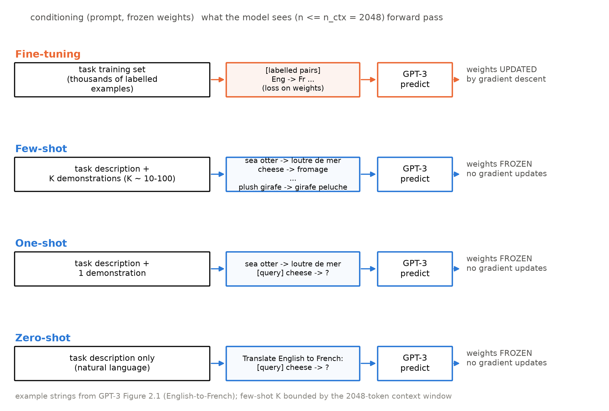
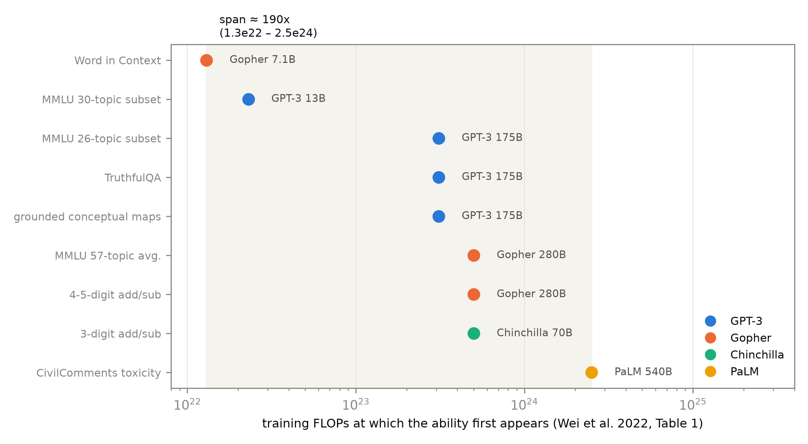
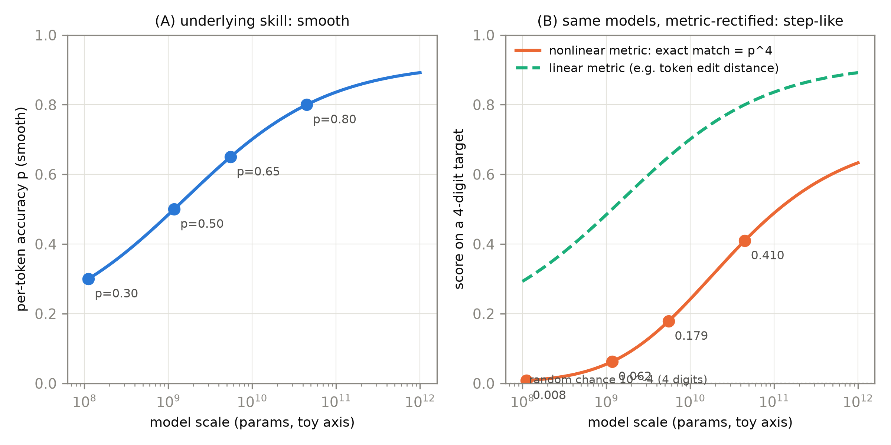

# 第 7 章 GPT-3 与涌现之争

## 7.0 开篇：从全书到这里

上一章 RoBERTa 交出了一份漂亮的复读机实验：架构一台没动，只改训练配方——去掉 NSP、动态掩码、8K 批量、500K 步、数据加到十倍——GLUE 九个任务全线刷新，证明了「配方是与架构平起平坐的一等公民」。但把那份配方清单逐项拧到头之后，一个事实浮出水面：到 2020 年为止，架构（第 4 章的四台手术）、目标函数（第 3-5 章三物种）、训练配方（第 6 章）都已被反复调校，坐标里只剩一个从来没有人单独拧到头的旋钮——**规模本身**。导览 0.5 的那本账也走到此处：参数从 Book1 的 63.1M、第 4 章逐位对账的 124M、第 5 章 T5 的 11B，一路记到本章的 175B。现在是规模化段（第 7-9 章）的第一站。

本章要回答两个问题。第一个：**把规模单独拧两个数量级，能买回什么？**GPT-3 的答案分两层——一台 175B 参数的机器（7.1 节，附一套三行式就能手算的算力账），和一个前所未见的现象：不更新任何权重、只在提示里塞几道例题，模型就「学会」了新任务（7.2 节，上下文学习）。第二个问题由第一个直接引出：**规模买回的能力里，有没有「小模型完全没有、大模型突然有了」的那种质变？**这就是 2022 年之后吵翻整个领域的涌现（emergence）之争（7.3-7.6 节）——我们将把 Wei 与 Schaeffer 两篇论文正面对垒，也会把 Book1 第 9-10 章教过的「口径自觉」从评测细节升维成读文献的方法论。本章结束时，涌现之争谁对谁错不会有终审判决——裁决它需要把「花更多钱买多少智能」写成定量定律，那是下一章 Scaling Laws 的正题。

> **最小背景栏**：本章需要三样前置。① GPT-2 的 zero-shot 思想（自然语言当任务接口、$p(\text{output}|\text{input},\text{task})$）——第 4 章 4.2 节已教，直接指回；few-shot 是它的近亲，7.2 节自建。② BLEU 的口径课（同一模型换个分词口径差一个多 BLEU、换组批方式差 11.5）——Book1 第 9 章 9.6 节已亲手量过，7.6 节回收，不重教。③ 读图纪律：本章两张图的横轴是训练算力或参数量的**对数轴**（科学计数法，$10^{22}$ 到 $10^{24}$ 之间差一百倍）——对数坐标的正式课在第 8 章，这里只需记住「等距=等倍数」。

## 7.1 GPT-3：175B 的机器与它的账

要单独研究规模，第一步反而是**冻结其他一切变量**——这是第 5 章 T5 教过的消融逻辑在更大尺度上的重演。先钉引用口径：本章 GPT-3 一律锚定 arXiv:2005.14165 **v4**（2020-07-22 终版），全部证据标签同此版本。敢这么做还有一个经验前提：GPT-2 已经给出了「更大更好」的初步证据，而且当时已有的定量线索（Kaplan 等 2020）显示验证损失随规模平滑改善——GPT-3 论文自己的引述是 "there is evidence suggesting that log loss, which correlates well with many downstream tasks, follows a smooth trend of improvement with scale"，损失口径的平滑与下游能力的相关性一起，把赌注押在了「容量换能力」上【证据等级：官方论文 2005.14165 v4 §1】。于是架构冻结：论文交代 "We use the same model and architecture as GPT-2 [RWC+19], including the modified initialization, pre-normalization, and reversible tokenization described therein"——第 4 章我们在 Book1 翻译机上动过的四刀（单塔、pre-LN、学习式位置查表、绑定嵌入）原样继承，唯一例外是注意力层改为交替的稠密与局部带状稀疏模式（论文引 Sparse Transformer；其机制不影响本章任何结论，不展开）【证据等级：官方论文 2005.14165 v4 §2.1】。「更大」从此成为唯一的实验变量，而变量怎么取值，写在表 7.1 的八档里。

**表 7.1** GPT-3 八档模型规格（引 2005.14165 v4 §2 Table 2.1；全部模型训练 300B tokens、上下文 $n_{ctx}=2048$、FFN 内层 $4\times d_{model}$）

| 模型 | $n_{params}$ | $n_{layers}$ | $d_{model}$ | $n_{heads}$ | $d_{head}$ | 批量（tokens） | 峰值学习率 |
|---|---|---|---|---|---|---|---|
| GPT-3 Small | 125M | 12 | 768 | 12 | 64 | 0.5M | $6.0\times10^{-4}$ |
| GPT-3 Medium | 350M | 24 | 1024 | 16 | 64 | 0.5M | $3.0\times10^{-4}$ |
| GPT-3 Large | 760M | 24 | 1536 | 16 | 96 | 0.5M | $2.5\times10^{-4}$ |
| GPT-3 XL | 1.3B | 24 | 2048 | 24 | 128 | 1M | $2.0\times10^{-4}$ |
| GPT-3 2.7B | 2.7B | 32 | 2560 | 32 | 80 | 1M | $1.6\times10^{-4}$ |
| GPT-3 6.7B | 6.7B | 32 | 4096 | 32 | 128 | 2M | $1.2\times10^{-4}$ |
| GPT-3 13B | 13.0B | 40 | 5140 | 40 | 128 | 2M | $1.0\times10^{-4}$ |
| GPT-3 175B | 175.0B | 96 | 12288 | 96 | 128 | 3.2M | $0.6\times10^{-4}$ |

【证据等级：官方论文·表格 2005.14165 v4 Table 2.1】

表里有两处值得停一秒。其一，最小档 125M 是 12 层、768 维、12 头——与我们第 4 章逐位数过的 GPT-2 124M 同一形制：GPT-3 家族的最小号就是那台机器的等身对照组，这让八档之间「只有规模不同」的声明有了可靠的锚点。其二，最大档的三个数各是一个整数倍：$12288 = 16\times768$、$96 = 8\times12$、参数 $1403\times$（$174{,}600\text{M}/124{,}439{,}808$）；顺手还能验算头维：$96\text{ 头}\times128\text{ 维} = 12288 = d_{model}$，一条 $(B,n,12288)$ 的恒宽数据河穿过 96 层，96 份 $(B,96,n,128)$ 的头张量刚好铺满河面——Book1 立的形状纪律在 175B 上一个数都不差【证据等级：本书算术（[`code/ch07/handcalc.py`](code/ch07/handcalc.py)，CPU，2026-10）】。喂给这八台机器的是同一份勾兑语料：过滤后的 Common Crawl 410B tokens 占 60%、WebText2 19B 占 22%、两份书籍语料 55B+12B 占 16%、维基百科 3B 占 3%；训练 300B tokens 意味着有的部分被看 3.4 遍、有的不到半遍——「把互联网按比例勾兑」从此成为一门手艺【证据等级：官方论文 2005.14165 v4 §2.2 Table 2.2】。

机器有多大，账就得先算清——这是导览 0.5 承诺的那句口诀的兑现处。直觉只有三句话：模型里**每个参数**，看**每个 token** 时要做一次乘法和一次加法，前向共 2 次浮点运算；训练还要反向传播，而反向要算两种梯度（对参数的、对中间激活的），每一种都跟前向花差不多的力气，所以反向约是前向的 2 倍、4 次运算；合计每个参数看每个 token 花 6 次。写成公式：

$$
C \;\approx\; 6\,N\,D
\tag{7.1}
$$

| 符号 | 含义 | 取值 / 口径 |
|---|---|---|
| $C$ | 训练总浮点运算量 | 标量，单位 FLOPs |
| $N$ | 参数个数 | GPT-3 175B 行为 $174{,}600\text{M}$（**全参数口径**，含嵌入） |
| $D$ | 训练 token 总数 | $300\text{B}=3\times10^{11}$ |
| $6$ | 每参数每 token 的浮点运算数 | 前向 2 + 反向 4 |

用人话说：**参数个数乘上「每个参数看每个 token 的 6 次」，再乘 token 总数，就是这台机器的训练总价**。现在手算 GPT-3：$6\times174{,}600\times10^{6}\times3\times10^{11} = 31{,}428\times10^{19}\approx3.14\times10^{23}$ FLOPs。对照官方：附录 Table D.1 的 175B 行写着 3.14E+23（两位有效数字，与手算值差 0.09%）——三行乘法对上了一篇论文的附录【证据等级：官方论文 2005.14165 v4 附录 Table D.1；本书算术 `handcalc.py`】。同一个表还给了第二种单位：petaflop/s-day（PF-days，$10^{15}$ FLOP/s 跑满一天 $=8.64\times10^{19}$ FLOPs），$3.14\times10^{23}/8.64\times10^{19}\approx3.64\times10^{3}$ PF-days——也和 Table D.1 的 3.64E+03 对上。这套「6ND 口诀」（式 (7.1)）从此进入我们的账本：第 8 章会细化它的两个口径细节（Kaplan 的 $C\approx6NBS$ 记号与「非嵌入参数」口径——GPT-3 的 174,600M 是含嵌入的全参数，两文并排时要注脚），第 9 章的换算盒再用它把自家 124M 的训练点画进论文坐标系。另按论文表注如实声明：此近似「ignoring attention」，注意力分数项不计入——这个省略将来也会回来找我们（第 9 章显存账里它是主角之一）。

## 7.2 few-shot 与上下文学习：不更新权重的「学习」

机器造好了，怎么用它？第 4 章 GPT-2 的答案是无微调的 zero-shot——用自然语言写任务说明，离微调模型还有肉眼可见的距离。GPT-3 在零样本（zero-shot，0S）与微调（fine-tuning，FT）之间插进了两档新的用法，凑成四设定（图 7.1）：**微调**用任务的标注集更新权重；**少样本**（few-shot，FS）不更新权重，只在提示里给「塞得进上下文窗口的尽可能多的示范」（typically 10 to 100 个）；**单样本**（one-shot，1S）给一个示范；**零样本**只有自然语言指令【证据等级：官方论文 2005.14165 v4 §2，四设定图示见其 Figure 2.1】。论文特地为这种用法强调："these 'learning' curves involve no gradient updates or fine-tuning, just increasing numbers of demonstrations given as conditioning"——所谓「学习曲线」，升的是示范条数，不是梯度步数【证据等级：官方论文 2005.14165 v4 §1】。



**图 7.1** 四设定示意（自绘，示意级；例句取自 GPT-3 论文 v4 Figure 2.1 的英法翻译例）：橙色行更新权重，蓝色三行权重全程冻结、只靠提示里的条件信息；few-shot 的 K 不受算法限制，受的是 $n_{ctx}=2048$ 除以每条示范长度——「塞得下多少给多少」【证据等级：官方论文 2005.14165 v4 Figure 2.1（例句）+ 本书自绘（示意级）】

这套用法的量纲也值得用 Book1 的形状纪律量一下。一条 few-shot 提示就是一条普通序列：token id 进入 $(1,n_{\text{prompt}})$，查嵌入与位置表相加成 $(1,n_{\text{prompt}},12288)$，穿过 96 层恒宽数据河，出口经绑定的嵌入转置投影成 $(1,n_{\text{prompt}},50257)$ 的逐位分布——与第 4 章那台 124M 的数据河**同一条河道，只是河面宽了 16 倍、长了 8 倍**。唯一的硬约束在入口：$n_{\text{prompt}}\le n_{ctx}=2048$。K 条示范每条几十个 token，所以「10 到 100」不是拍脑袋，是被 2048 除出来的。评测操作也有章法：示范从该任务的训练集随机抽取、以一两个换行分隔，无训练集的任务退而从开发集抽【证据等级：官方论文 2005.14165 v4 §2.4】。

四设定的直觉可以先立起来：这像一场不发教材的考试——微调是把考生送回教室重上一门课（改权重），few-shot 是考前只允许带几张例题卡片进考场（改输入），zero-shot 则只有一句口头考试说明。论文强调四者不是竞争关系，而是「性能与样本效率之间的不同取舍」——few-shot 用几十条无标注示范逼近微调的成绩，标注预算紧的任务里这笔交易极其划算【证据等级：官方论文 2005.14165 v4 §2】。模型在**一次前向传播里**现场从卡片中认出「这原来是道什么题」的现象，论文起了名字：上下文学习（in-context learning, ICL），定义值得逐字读："We use the term 'in-context learning' to describe the inner loop of this process, which occurs within the forward-pass upon each sequence."——「内循环发生在每条序列的前向传播之内」【证据等级：官方论文 2005.14165 v4 Figure 1.1 图注】。脚注还诚实交代了命名困难：zero-shot 这个词容易误导（「零」指无梯度更新，不指无示范），所以他们借了元学习（meta-learning）的 inner/outer loop 框架来措辞——预训练是慢的外循环（更新权重），ICL 是快的内循环（只算前向）【证据等级：官方论文 2005.14165 v4 §1 脚注 1】。

现象有多真，看两个任务的三个设定。LAMBADA（给一段话补最后一个词，考长程一致性）：GPT-3 175B 的 zero-shot 76.2、one-shot 72.5、few-shot **86.4**（困惑率 1.92）——zero-shot 已比先前最优（Turing-NLG 17B 的 68.0）高 8 个点，few-shot 高 18 个点，连 2.7B 档的 few-shot 都超过了 17B 的旧 SOTA【证据等级：官方论文 2005.14165 v4 §3.1.2 Table 3.2 与 Figure 3.2 图注】。TriviaQA（闭卷百科问答）：64.3 / 68.0 / **71.2**——而**微调过**的 T5-11B 只有 50.1、带检索的 RAG 68.0；zero-shot 就超 T5-11B 14.2 分【证据等级：官方论文 2005.14165 v4 §3.2 Table 3.3】。不更新一个权重、只加几十条例题，就把「预训练+微调+检索」的整套系统甩在身后——这是范式图景里真正的地震：第 4 章的手术把接口折叠进序列，GPT-3 证明这个序列接口连同任务知识一起被吃进了参数。

LAMBADA 还额外送了一堂「格式课」。这个数据集的答案永远是段落最后一个词，但一台标准语言模型并不知道这个约定——它会给所有合理续写都分概率；过去的修补是加停用词过滤器（GPT-2 的做法），而 few-shot 提供了新解法：用「上文 →（空）→ 词」的示范把任务**框**成完形填空，模型从示范里自己推断出「只要最后一个词」。代价也记在账上：这套填空格式对 one-shot 反而不友好——one-shot 72.5 低于 zero-shot 76.2，论文自己解释是补空格式 "is not effective one-shot"；同节的对照还显示，这套格式让最小档掉近 20 个点——**格式即任务的一部分**，示范少到不足以教会格式时，示范反而是噪声【证据等级：官方论文 2005.14165 v4 §3.1.2】。

至于「规模与 few-shot 的关系」，论文的汇总图（42 个 accuracy 指标聚合）给出的措辞是 "zero-shot performance improves steadily with model size, few-shot performance increases more rapidly"——零样本随规模稳升，少样本升得更快，**规模放大了 ICL 的斜率**【证据等级：官方论文 2005.14165 v4 Figure 1.3 图注】。这句话的口径要抠严：GPT-3 全文形容规模-性能关系用的是 smooth、strong gains 一类措辞（如 §3.2 闭卷问答的 "performance scales very smoothly with model size"，见 7.3 节开头），**从不使用「对数线性」一词**——那是 GPT-2 摘要的说法（第 4 章 4.2 节引过），两篇论文的口径不能串用。

> **【考据框】「log-linear」归属考。**「increasing it improves performance in a log-linear fashion across tasks」出自 **GPT-2 摘要**（容量与 zero-shot 成绩的关系，本册第 4 章已按此口径引用）；GPT-3 论文全文检索「log-linear」零命中，取而代之的是 smooth/strong gains 与对 Kaplan 定律的引用（"log loss … follows a smooth trend of improvement with scale"，§1）。把「对数线性」安到 GPT-3 头上是二手叙述最常见的口径串线之一——本册引用时一律按各论文原措辞。【证据等级：官方论文（GPT-2 摘要直引；GPT-3 全文检索零命中，负结论已核）】

GPT-3 还改了另一件事：**它没有被发布**。权重从未公开，2020 年 6 月 11 日起以私有 API 内测的形式提供服务——官方博客原文："we are launching today in a private beta rather than general availability"，模型是 "models with weights from the GPT-3 family"；FAQ 里甚至专门回答了「为什么不开源」，理由包括太大太贵、滥用风险与商业考虑【证据等级：官方渠道（openai.com《OpenAI API》，2020-06-11 发布、页注 2020-09-18 更新，本次直读核验）】。「论文+权重」的复现传统从此变成「围着 API 做实验」——记住这一点，7.5 节的争论双方拿的都是同一批 API 模型。还有一笔账先记下：全家族八档统一训了 300B tokens，对 175B 档而言只有每参数 1.7 个 token——**这个 1.7 下一章要被重新审判**。而 few-shot 把「读长上文」变成了推理时的主要开销，K 条示范的前缀在同一段对话里被一遍遍重算——这笔服务侧的经济学（前缀复用）是推理册的正题（Book6 第 6 章），本册第 11 章做完 ICL 探针后会把这条线正式移交。

## 7.3 涌现：定义与证据

上一节的两张成绩单都随规模平滑上升——TriviaQA 所在的闭卷问答一节，原文评语是 "performance scales very smoothly with model size"，作者把它解读为「容量直接兑换成参数里吸收的知识」【证据等级：官方论文 2005.14165 v4 §3.2】。但同一篇论文的另一些任务完全是另一副面孔：多位数算术、单词重排、IPA 音标转写——小模型上成绩贴着随机线，某个规模之后突然蹿到远超随机。两类曲线的分裂，就是涌现之争的全部起点。

把它定义成可讨论命题的，是 Wei 等 2022 年的涌现能力（emergent abilities）论文《Emergent Abilities of Large Language Models》（arXiv:2206.07682，锚定 v2 终版）。定义只有一句："An ability is emergent if it is not present in smaller models but is present in larger models."（一项能力，若小模型没有、大模型有，即为涌现）【证据等级：官方论文 2206.07682 v2 §2】。定义句配着两条等价的刻画：其一，"Emergent abilities would not have been directly predicted by extrapolating a scaling law (i.e. consistent performance improvements) from small-scale models"——从小模型的 scaling 曲线外推，**预测不到**它；其二，画在「横轴规模、纵轴成绩」的图上，"performance is near-random until a certain critical threshold of scale is reached, after which performance increases to substantially above random"——随机水平一直躺平，越过某个临界阈值后跳到远超随机，论文还补了一句 "This qualitative change is also known as a phase transition"（相变）【证据等级：官方论文 2206.07682 v2 §2】。后来争论的对方（Schaeffer 等）把这两条提炼成涌现的两条定义性质：**突发性**（sharpness，"transitioning seemingly instantaneously from not present to present"）与**不可预测性**（unpredictability，"transitioning at seemingly unforeseeable model scales"）——这个两分法双方都接受，是争论共享的骨架【证据等级：官方论文 2304.15004 v2 摘要（对 Wei 等定义的转述提炼）】。

证据是论文的表 1：一张「能力—首次涌现规模」的清单。抽几行看量级（图 7.2 是全表重排）：3 位数加减法在 GPT-3 13B、训练算力 $2.3\times10^{22}$ FLOPs 处冒头（正文描述其图像：GPT-3 系与 LaMDA 系在多个数量级上贴地，"performance jumps to sharply above random at $2\cdot10^{22}$ training FLOPs (13B parameters) for GPT-3"）；4-5 位数加减要等到 175B、$3.1\times10^{23}$；MMLU 57 学科均值同样 $3.1\times10^{23}$/175B；毒性分类（CivilComments）在 Gopher 7.1B、$1.3\times10^{22}$；TruthfulQA 要到 Gopher 280B、$5.0\times10^{23}$；词境判定（Word in Context）居然要到 PaLM 540B、$2.5\times10^{24}$——全表阈值从 $1.3\times10^{22}$ 铺到 $2.5\times10^{24}$，**跨了两个数量级**，且不同能力的「坎」互相对不上号【证据等级：官方论文·表格 2206.07682 v2 Table 1（few-shot panel）】。这正是「不可预测」的实义：没有一条统一的定律告诉你下一项能力在第几档出现。



**图 7.2** 涌现阈值重排（数据引 Wei 2206.07682 v2 Table 1 few-shot panel 自绘；横轴为各能力首次涌现的训练 FLOPs，对数轴）：阈值散布在 $1.3\times10^{22}$–$2.5\times10^{24}$ 之间、跨约两个数量级，四色为四个模型家族【证据等级：官方论文·表格（数据）+ 本书重绘】

表 1 还有第二个板块，对应论文的第二类框架：**增强提示**（augmented prompting）的涌现。定义同样一句话："If a technique shows no improvement or is harmful when compared to the baseline of not using the technique until applied to a model of a large-enough scale, we also consider the technique an emergent ability."——一项**技法**（指令微调、思维链、草稿纸……）若在小模型上无益甚至有害、只在大模型上见效，技法本身就是涌现的【证据等级：官方论文 2206.07682 v2 §4】。清单里：指令微调（instruction fine-tuning，FLAN）在 68B、$1.3\times10^{23}$；思维链（chain-of-thought）做数学应用题在 LaMDA 68B 同档；PaLM 62B 上思维链才对 StrategyQA 转正；zero-shot 思维链要到 GPT-3 175B【证据等级：官方论文·表格 2206.07682 v2 Table 1（augmented panel）】。换句话说，涌现的不只「能力」，还有「让能力释放出来的用法」——这一点后文争论里双方都默认成立。

「不可预测」四个字在当时是有分量的现实约束，不只是修辞。图 2/3 的题注补充了曲线细节：MMLU 在约 $10^{22}$ FLOPs（约 10B 参数）以下全部贴随机，70B-280B 才陆续过线；思维链类数学任务约 $10^{23}$（约 100B）才由负转正【证据等级：官方论文 2206.07682 v2 §3 图 2/3 题注】。如果涌现阈值真的不可外推，那么「再加十倍算力会不会解锁某个关键能力」就没有先验答案——预算表写不出来，能力上线的节奏也无法预告；论文 §5.6 还给了一个数据与规模**双条件**的例子（波斯语问答要 PaLM 的训练数据**加上** 62B 规模缺一不可）【证据等级：官方论文 2206.07682 v2 §5.6】。这场争论的赌注由此而来：若涌现为真，堆规模就是开盲盒；若涌现是指标假象，那被误导的是整个领域的投资判断。

> **【考据框】表 1 的空格子：官方 PDF 目验记录。**调研阶段发现 ar5iv 渲染的表 1 里，4-5 位加减、TruthfulQA、MMLU 26 学科三行的 Model/Reference 列是空白，疑为渲染缺陷。本次写作前将官方 v2 PDF 下载至 `log/research-cache/wei_2206.07682v2.pdf` 逐格目验：**官方 PDF 同样空着**——这是论文原表的「承上省略」写法（如 4-5 位加减行承接上一行的 GPT-3/Brown et al.），不是渲染丢字。凡引用这几行，模型归属按承上行补齐并加本注。同一批核验还确认两条负结论：全文无 "beyond the scale of existing models" 短语（转述涌现定义一律用上面引的原句），也无 "cross-task" 一词（本文的两类框架如上引）。【证据等级：官方论文 v2 PDF 逐格目验（2026-10）】

## 7.4 Wei 自己埋下的口径让步

读到这里你可能以为争论是外人挑起的——其实弹药的一半来自 Wei 原文自己。§5.1 有一段主动的让步："using exact string match as the evaluation metric for long-sequence targets **may disguise compounding incremental improvements as emergence**"——对长序列目标用精确串匹配打分，**可能把逐步累积的改进伪装成涌现**；多步推理任务只给最终答案记分、不给部分分，同理【证据等级：官方论文 2206.07682 v2 §5.1】。附录 A 更进一步，对六个「涌现」的 BIG-bench 任务查了交叉熵损失：全部落入「结果 2」——小模型上下游指标（exact match、BLEU、accuracy）贴随机时，**交叉熵损失其实一直在改善**，结论原话是 "improvements in the log-likelihood of the target sequence can be masked by such downstream metrics"——底层似然的平滑进步，会被下游指标**遮蔽**【证据等级：官方论文 2206.07682 v2 §5.1 与附录 A】。

但 Wei 同时守住了阵地，两句都要引全：其一，"using evaluation metrics that do not give partial credit are at best an incomplete explanation"——「不连续指标」解释不了分类任务的涌现（分类不需要长串匹配）；其二，紧接着上面那句「遮蔽」，"this analysis does not explain why downstream metrics are emergent or enable us to predict the scale at which emergence occurs"——似然平滑**不等于**下游能力平滑，跳变为什么发生、阈值在哪里，指标分析没有回答【证据等级：官方论文 2206.07682 v2 §5.1】。一年后，对面来了一篇论文，把前半个让步做成了整套理论。

## 7.5 Schaeffer：指标整流器

对面的论文题为《Are Emergent Abilities of Large Language Models a Mirage?》（涌现能力是海市蜃楼吗？Schaeffer 等，arXiv:2304.15004，锚定 v2）。先做纪律声明：本册知识冻结在 2022，此篇是卷级大纲明列的白名单文献（2023 年发表），唯一用途就是本节的涌现之争【纪律声明：冻结点外白名单】。它的核心论点一句话可以说完：涌现的长相是**指标**造出来的。"nonlinear or discontinuous metrics produce apparent emergent abilities, whereas linear or continuous metrics produce smooth, continuous, predictable changes in model performance"；所谓涌现会 "evaporate with different metrics or with better statistics"——换个指标或加好统计，涌现就蒸发【证据等级：官方论文 2304.15004 v2 摘要】。

机制图像值得起一个名字：**指标整流器**（本书心智模型命名，非论文原词）。整流器的本职是把交流电的平滑正弦波剪成单向的方波——非线性或不连续的指标对模型成绩干的是同一件事。用小数字例走一遍（表 7.2，其中 $p$ 是「逐 token 正确率」，四个档位平滑地一档涨 0.15；目标是一个 4 位数字的答案）：

**表 7.2** 指标整流器小数字例：同一批模型、同一份平滑的 $p$，三种读数（自排，教学设定值，非论文数据；算术见 [`code/ch07/handcalc.py`](code/ch07/handcalc.py)）

| 规模档位 | 逐 token 正确率 $p$ | 精确匹配 $p^4$ | 线性指标读数（如编辑距离归一） |
|---|---|---|---|
| 1 | 0.30 | 0.0081 | 0.30 |
| 2 | 0.50 | 0.0625 | 0.50 |
| 3 | 0.65 | 0.1785 | 0.65 |
| 4 | 0.80 | 0.4096 | 0.80 |

【证据等级：本书算术（`handcalc.py`）】写成公式：设模型对目标串第 $i$ 个 token 的正确率为 $p_i$，则精确串匹配（exact string match，全对才记 1 分）的期望得分为

$$
\mathrm{EM}(s) \;=\; \prod_{i=1}^{L} p_i(s) \;\approx\; p(s)^{L}
\tag{7.2}
$$

| 符号 | 含义 | 取值 / 口径 |
|---|---|---|
| $\mathrm{EM}$ | 精确匹配的期望得分 | $[0,1]$，标量 |
| $p_i(s)$ | 规模 $s$ 下第 $i$ 个 token 的正确率 | 平滑、随 $s$ 单调缓升 |
| $L$ | 目标串 token 长度 | 4-5 位数字答案时 $L=4\sim5$ |

用人话说：**底层的进步是平滑的乘法账，但「全对才给分」把 $L$ 份平滑连乘，乘出一条陡得像跳变的曲线**——$p$ 从 0.30 平滑涨到 0.80 的同一批模型，EM 读数却是 0.008→0.063→0.179→0.410，前两档「看起来完全不会」，第四档「突然会了」，而四位数字瞎猜全对的随机底线是 $10^{-4}$。图 7.3 把这对曲线并排画出：左图是平滑的底层技能，右图同一横轴上，橙色的非线性指标把它整流成阶跃，青色的线性指标（如词元编辑距离，Token Edit Distance——数答案里错了几个 token）则原样保留平滑。要如实声明的是独立假设：式 (7.2) 把各 token 当相互独立才约等于 $p^L$，Schaeffer 论文自己脚注也写明 "the independence assumption is not true"，但近似 "yields results qualitatively matching the observed emergence claims"——假设不真，定性结论成立【证据等级：官方论文 2304.15004 v2 脚注 1】。



**图 7.3** 指标整流器（自绘，示意级，数值为教学算例非论文数据；曲线形状与 Schaeffer 2304.15004 v2 Figure 2/3 的数学模型同型）：(A) 底层逐 token 正确率随规模平滑上升；(B) 同一批模型，橙色=精确匹配 $p^4$（被整流成阶跃状），青色虚线=线性指标（保留平滑）——「同一模型、同一输出，换指标即换剧本」【证据等级：本书算术（教学算例，`handcalc.py`）+ 本书自绘（示意级）】

光有机制图像还不够，Schaeffer 用三组检验把它钉死。**检验一：换指标。**经 OpenAI API 取 GPT-3 系四个尺寸（350M、1.3B、6.7B、175B）在两个算术任务（2-shot 两位数乘法与 2-shot 四位数加法）上的输出：accuracy 口径下，"the GPT family displays emergent abilities if the target has 4 or 5 digits"；**同一批输出**改用线性的 Token Edit Distance 打分，"the family's performance smoothly, continuously and predictably"地改善——涌现消失【证据等级：官方论文 2304.15004 v2 §3（模型尺寸见其脚注 3）】。**检验二：更好的统计。**生成更多测试题把测量分辨率提上去：算术任务上 "all models in the InstructGPT/GPT-3 family achieve above-chance accuracy"——小模型不是零分，是分数低到普通规模的测试集量不出来；顺带验证了目标越长 accuracy 近似几何下降、编辑距离近似拟线性【证据等级：官方论文 2304.15004 v2 §3】。**检验三：元分析与人造涌现。**对 BIG-bench 的涌现声明做普查：39 个常用指标中**至多 5 个**（人工精标口径 4/39）能显出涌现，而 ">92%" 的涌现声明集中在两个指标上——不连续的多选评分（Multiple Choice Grade）与非线性的精确串匹配；LaMDA 家族在多选评分下的涌现，换成连续的 Brier 分数（Brier Score，按预测概率的均方误差计分）重新打分后 "disappeared"【证据等级：官方论文 2304.15004 v2 §4 与 Figure 5/6】。反手一击更绝：故意给小型视觉模型挑尖锐指标——CIFAR100 自编码器用「重建误差低于阈值才算合格」、Omniglot 自回归 Transformer 用「整批全对才算对」——几百万参数的小网络也「涌现」了【证据等级：官方论文 2304.15004 v2 §5 与附录 B】。值得一提的是这场争论的谱系并非凭空而起：BIG-bench 原作者（Srivastava 等）就观察到 accuracy 可突跳而交叉熵不突跳，并 "hypothesized that emergent abilities may be partially attributed to the metric"；Schaeffer 的工作是 "converts their discussion into precise predictions, then quantitatively tests"——把猜想变成可检验的预测【证据等级：官方论文 2304.15004 v2 §6】。

最后必须原样钉上作者自己的护栏，否则这一节就成了单边叙事："We emphasize that nothing in this paper should be interpreted as claiming that large language models cannot display emergent abilities; rather, our message is that previously claimed emergent abilities … might likely be a mirage induced by researcher analyses."——本文不主张大模型**不能**涌现；只主张**已被报告的**涌现案例，大概率是研究者分析方式的产物【证据等级：官方论文 2304.15004 v2 §7】。

## 7.6 双向公道与口径自觉的暗线

两篇论文对完阵，各自守住了什么？表 7.3 收拢。

**表 7.3** 涌现之争双方阵地对照（自排；引文出处见 7.3-7.5 节各证据标签）

| 争论点 | Wei 等（2206.07682 v2，2022） | Schaeffer 等（2304.15004 v2，2023） |
|---|---|---|
| 定义起点 | 能力小模型无、大模型有；不可由小模型 scaling 外推 | 接受同一定义，提炼为突发性+不可预测性 |
| 指标的角色 | 自让：不连续指标「可能伪装渐进改进」（§5.1），但换平滑指标对涌现 "at best an incomplete explanation"——分类任务无需长串匹配仍涌现；附录 A.2 三个生成任务换用含 BLEU/ROUGE 在内的全部指标，涌现仍在 | 主攻：非线性/不连续指标**制造**表观涌现；>92% 声明落在两个此类指标；同批输出换线性/连续指标即平滑；小模型可被人工「涌现」 |
| 保留的阵地 | 下游指标的跳变是事实；似然平滑 ≠ 下游能力平滑，指标分析「解释不了跳变、也预测不了阈值」 | 护栏句：不主张大模型不能涌现；只主张已报告案例是分析产物 |

需要说明的是，争论并未止于这两篇的攻防：Schaeffer §6 同时点名了「涌现为真」一侧的同期理论工作（如以分段幂律解释涌现的 Caballero 等、给涌现建量化模型的 Michaud 等——此处仅经转引点名，不展开），Wei 方则至今没有对本文的正式回应论文，争论延续在社区讨论里【证据等级：官方论文 2304.15004 v2 §6（点名）；负结论：Wei 侧无正式回应，调研已检索】。

这场争论没有判决书，但有一条双方都签字的方法论：**引用任何能力断言之前，先声明指标口径**。能力从来不是「模型」的内禀属性，而是「任务 × 指标 × 模型家族」三元组的读数——换掉三元组里的任何一格，剧本就换一份。而这门课你在 Book1 已经上过一遍。第 9 章 9.6 节量过：同一台翻译机，评测分词从 "none" 换到 "13a"，BLEU 各 +1.06 到 +1.50——「标点怎么切，值 1 个多 BLEU」；组批方式从随机混批换成按句长分桶，无注意力 GRU 从 6.52 跳到 18.03——11.5 分的「组批税」，口径一换结论反转【证据等级：本书实验（Book1 第 9 章，MPS，2026-10）】。那是 Book1 的口径自觉在**评测实现层**的课；今天这节是它在**文献阅读层**的同一门课：exact match 对 Token Edit Distance、多选评分对 Brier 分数，与 13a 对 none 是同一个数学事实——**口径决定你看见什么**。

但口径自觉不等于指标虚无主义——不能因为指标可以制造跳变，就把一切能力断言都打成假象。界桩恰恰是双方罕见一致的地方：Wei 附录 A.2 把单词重排（word unscramble）与重复拷贝两个任务**排除**在似然分析之外，理由原文 "exact match is the only most sensible evaluation metric for those tasks, which measure the ability to manipulate words in the input"——这些任务的语义本身就是「把输入的词摆对」，摆不对就没有部分分可言，不连续指标在此**不可替换**【证据等级：官方论文 2206.07682 v2 附录 A.2】。所以正确的姿势是分诊而非弃疗：先问「这个任务的语义允许连续指标吗」，再问「换指标后结论变不变」——两次都过，能力断言才立得住。至此，规模化段的第一站交卷：175B 的账算得动了（6ND），few-shot 的现象看见了（ICL），涌现的断言学会了带口径读（整流器）。但「花更多钱到底买多少智能」这个真正的定量问题，一篇都没回答——把它写成定律，是下一章 Kaplan 与 Chinchilla 的正题；GPT-3 那 1.7 token/参数的旧账，也将同庭再审。

## 7.7 本章小结

开篇的两个问题至此都有了着落。规模单独拧两个数量级买回了什么？一台架构与 GPT-2 全同、参数 1403 倍的机器，训练总价 $6ND\approx3.14\times10^{23}$ FLOPs 三行手算即可复现；以及一个范式级现象——上下文学习：不更新权重、几十条示范塞进 2048 个 token，LAMBADA 86.4、TriviaQA 71.2，few-shot 越大越快，「接口」彻底折叠进序列。涌现之争呢？Wei 的定义与两性质立起了「小模型没有、大模型突然有、外推不可预测」的现象学，表 1 的阈值散布两个数量级；Schaeffer 用指标整流器给出了另一种解释——平滑的底层进步被非线性/不连续指标整流成阶跃，同批输出换指标即平滑、加统计即现分、小模型可人造；Wei 侧的自让与阵地（似然平滑≠能力平滑、分类任务仍涌现）和 word unscramble 的例外一起，把结论逼到了「任务×指标×模型家族」三元组的口径纪律上。

**带走的心智**：忘掉数字后请留下两件。第一件是一幅图：**指标是台整流器**——底层进步是平滑的交流电，「全对才给分」的指标把它剪成方波；往后读到任何「突然会了」「一夜觉醒」的能力断言，先问三句：什么指标？多长的目标串？换连续指标还跳吗？第二件是一句口诀：**$C\approx6ND$——每参数每 token 六次浮点运算，乘起来就是训练总价**；从 124M 到 175B 再到将来的任何模型，这台账你都能随时验算，而算力口径（含不含嵌入、计不计注意力）是下一章随处可见的暗礁。

镜头拉回全书：四段旅程的第三段「规模化」走了第一站，手里多了三样东西——175B 的账本、ICL 的现象、读能力断言的口径纪律。但本章反复出现的「平滑」「阈值」「外推不可预测」全都是形容词，下一章要把它们换成有指数、有常数、可计算的形式：Scaling Laws——花更多钱买多少智能的定量定律，以及 GPT-3 的 300B tokens 为什么在两年后被判「显著欠训练」。

> **【欠账】** 本章只立现象不开庭：few-shot「无梯度更新却像学了一样」的机制解释与涌现之争的后续都不在本册正题——第 11 章先在官方权重上做 ICL 现象探针（7.2 节已预告），这条线的谱系登记与跨册交接由该章章末的欠账框统一完成，此处不重复埋设。


## 7.8 动手验证（本章手算与图表清单）

- 手算对拍（秒级；§7.1 的 6ND 账与 PF-days 换算、§7.2 的 1.7 token/参数、§7.5 整流器四档小数字例与随机底线 $10^{-4}$，均出自此脚本的 `log/book2-ch07/handcalc.txt`）：
  ```bash
  cd 工作区根目录 && source env.sh && \
    python "[`code/ch07/handcalc.py`](code/ch07/handcalc.py)"
  ```
- 复现图 7.1/7.2/7.3（秒级；图 7.2 数据引 Wei v2 Table 1，图 7.1/7.3 为示意与教学算例，脚本内注明出处）：
  ```bash
  cd 工作区根目录 && source env.sh && \
    python "[`code/ch07/make_figures.py`](code/ch07/make_figures.py)"
  ```
- 验收点：能否纸笔复算 $6\times174{,}600\times10^{6}\times3\times10^{11}\approx3.14\times10^{23}$ FLOPs 并换算成 PF-days；能否用 $p\to p^4$ 的四档小数字例向别人讲清「指标整流器」；能否说出 Wei 表 1 阈值跨度（$1.3\times10^{22}$ 到 $2.5\times10^{24}$）与涌现的两条定义性质。
