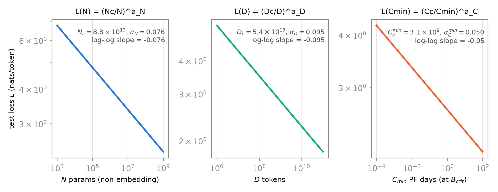
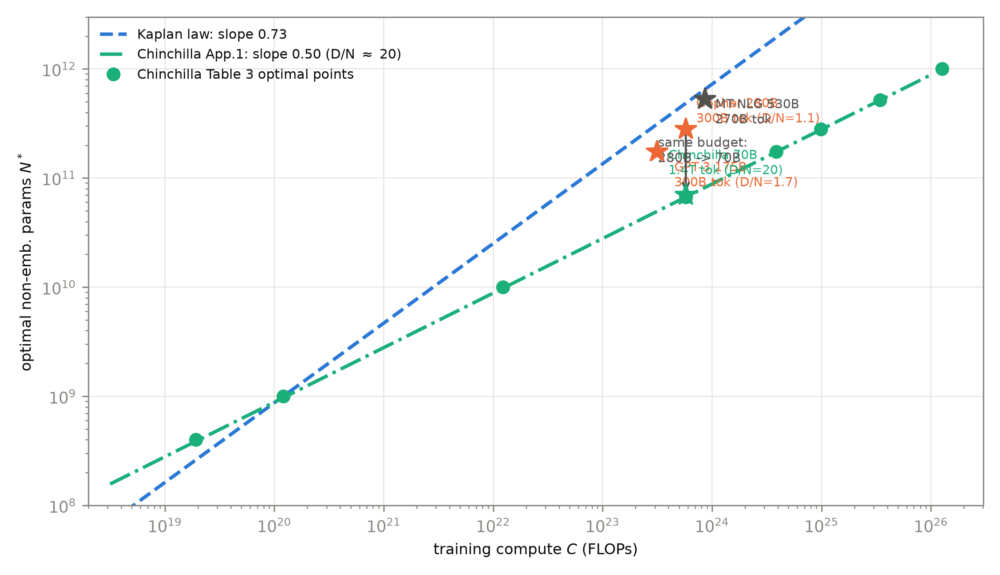
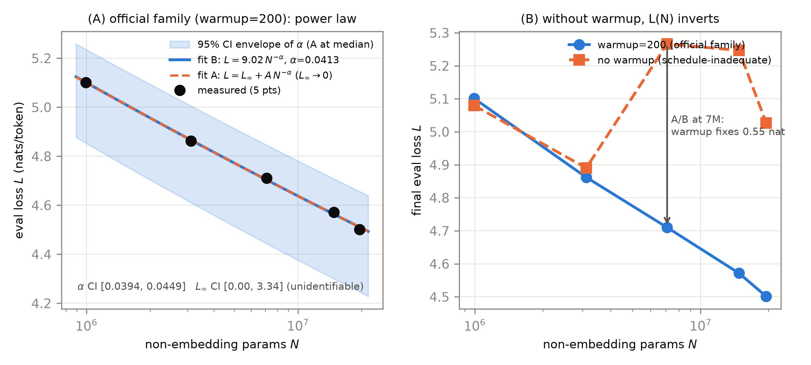

# 第 8 章 Scaling Laws：从幂律到等比

## 8.0 开篇：从全书到这里

上一章我们带着三样东西离开 GPT-3：一条口诀（$C\approx 6ND$，三行手算对上了 $3.14\times10^{23}$ FLOPs）、一个现象（上下文学习）、一门读文献的纪律（指标口径）。但两笔账还挂着。旧账一笔：GPT-3 全家族统一训 300B tokens，对 175B 档而言只有每参数 1.7 个 token——上一章明说这个 1.7 要被重新审判。新账一笔：涌现之争里反复出现的「平滑」「阈值」「外推不可预测」全都是形容词——Wei 与 Schaeffer 争的虽然是涌现，争论的赌注却押在「规模与性能的关系能不能外推」上，而把「花更多钱到底买多少智能」写成有指数、有常数、可计算的式子，正是把那些形容词换成算术的正路。

本章就写这个式子。它是规模化段（第 7-9 章）的第二站，只回答一个问题：**给定一笔训练预算，参数 $N$ 与数据 $D$ 该各买多少，损失 $L$ 会降到哪？**这是第 5 章末尾 T5 那句「你刚拿到 4 倍算力，怎么花」的定量版，也是第 6 章 RoBERTa 留下的「模型多大、数据多少、步数多远」三元分配问题的正式解法。产出三件：Kaplan 的幂律预算表（8.2 节）、Chinchilla 的等比修正与三种独立方法（8.3 节）、一次分歧归因的审判（8.4 节）——然后在 8.5 节，用我们自己机器上五个小模型，亲手拟合一条真的 scaling 曲线。到章末你会发现：GPT-3 那个 1.7 被判了什么刑、判决书凭什么、以及为什么连「读一条曲线」本身都需要纪律。

> **最小背景栏**：三样前置。①幂律与对数坐标：形如 $y=Ax^{-\alpha}$ 的关系叫幂律（power law），两边取对数得 $\log y=\log A-\alpha\log x$——在双对数（log-log）坐标上是一条直线，斜率 $-\alpha$；「等距=等倍数」的读图纪律第 7 章已叮嘱，8.6 节正式展开。②交叉熵损失 $L$：单位 nats/token，Book1 第 8 章已教，第 7 章的 6ND 口诀里它就是「被预测的那个数」。③PF-days：$10^{15}$ FLOP/s 跑满一天，第 7 章 7.1 节已见过一眼，本章 8.2 节的换算盒正式建账。

## 8.1 训练前的预算表：幂律为什么值钱

先想清楚我们要的东西为什么值钱。训练一个大模型是一次近乎不可逆的烧钱决策：几百张加速卡跑几个月，中途发现「数据喂少了」几乎无法补救。所以在按下启动键之前，你想要一张预算表——横轴是钱，纵轴是能买到的损失，最好再给两列：这笔钱里多少该买参数、多少该买数据。第 5 章的 T5 用消融表回答过一小块（表 5.2：4 倍算力怎么花，2× 大小配 2× 步数得分最高 86.18），但消融答不了外推——四个点的表告诉你 4 倍算力怎么花，告诉不了你 100 倍怎么花。要外推，需要的是定律，不是表格。

定律长什么样？Kaplan 等 2020 年的《Scaling Laws for Neural Language Models》（arXiv:2001.08361，仅此一版）给出的答案是幂律：损失随规模按幂衰减。它的直觉价值一眼可见——每投入十倍，损失按**固定比例**下降。可预测、可计划、可画在一张图上。还有一层选择值得点破：预算表的纵轴为什么是损失而不是「能力」？因为损失是训练直接优化的量——连续、平滑、四十万 token 就能测到千分位（8.5 节的 eval 协议会把这句话变成数字）；能力指标则是损失的下游读数，第 7 章已经教过它多么容易被指标口径整流。把预算表建在 $L$ 上、再借「损失与下游任务相关」外推，是这一整套方法论一半的智慧、一半的妥协——8.6 节第四问会回到这个裂缝。这条曲线的远祖你在第 1 章见过：GloVe 的图 2/3 画过类比精度随向量维度、随语料规模的增长【证据等级：官方论文 D14-1162 §4.4-4.5 Figure 2/3】；差别在于词向量时代纵轴是「某个探针任务的精度」，Kaplan 把主角换成了预训练损失本身——正是第 7 章 GPT-3 引以壮胆的那个 "$\log$ loss … follows a smooth trend of improvement with scale"。平行地说，这也是 F3 红利的定量化：第 1 章说并行化把「训练成本换数据规模」的汇率拉满，本章把汇率写成公式。

主线由此铺开：先学 Kaplan 的预算表（8.2），再看 Chinchilla 怎么用三种独立方法把其中一行改写（8.3），然后审判分歧（8.4），最后自己动手（8.5）。

## 8.2 Kaplan：幂律三组，与大模型优先

Kaplan 团队做的事情朴素而暴力：训练一大批只有规模不同的 Transformer，把损失画出来。主网格的模型从 768 到 15 亿非嵌入参数，加上探索性小模型，覆盖 $10^3$ 到 $10^9$ 共六个数量级；摘要宣称部分趋势「跨过七个数量级以上」仍然成形【证据等级：官方论文 2001.08361 v1 §3、摘要与 Figure 2 题注】。控制变量分三组做——只变参数、只变数据、只变（最优分配下的）算力——第 5 章 T5 立下的「一次一个变量」消融纪律，在这里被推到第三个数量级，得到三条单变量幂律，以参数组为例：

$$
L(N) \;=\; \left(\frac{N_c}{N}\right)^{\alpha_N}
\tag{8.1}
$$

| 符号 | 含义 | 取值 / 口径 |
|---|---|---|
| $L$ | 测试集交叉熵损失 | 标量，nats/token |
| $N$ | **非嵌入**参数个数 | 六个数量级 $10^3\sim10^9$ |
| $\alpha_N$ | 参数指数 | $\sim 0.076$ |
| $N_c$ | 锚点常数 | $\sim 8.8\times10^{13}$（$N=N_c$ 时 $L=1$ 的假想锚） |

用人话说：**参数每涨十倍，损失按固定比例（约 $1-10^{-0.076}\approx16\%$）下降**；$N_c$ 大得离谱（88 万亿，88 trillion——GPT-3 的 1750 亿全参数也只有它的约 $1/500$）不是笔误——它是「损失降到 1 nat」所需的假想规模，真实模型永远到不了那里，它只是让斜率可计算的数学锚点。三组规律连同常数（Table 4 逐字）：$L(D)$ 的 $\alpha_D\sim0.095$（$D_c\sim5.4\times10^{13}$ tokens）、算力最优路径下 $L(C_{\min})$ 的 $\alpha_C^{\min}\sim0.050$（$C_c^{\min}\sim3.1\times10^8$ PF-days；对照固定批次的朴素拟合 $\alpha_C=0.057$）【证据等级：官方论文 2001.08361 v1 §1.2 式 (1.1)-(1.3)、Table 4】。图 8.1 把三条律按原文常数重绘——双对数坐标下三条直线，斜率各是 $-\alpha$。

图 8.1 Kaplan 幂律三组重绘（按 2001.08361 v1 Table 4 拟合常数绘制的曲线族，非原文散点；三图均为 log-log，直线斜率=$-\alpha$）：左 $L(N)$、中 $L(D)$、右 $L(C_{\min})$——三条律共享「每十倍投入、固定比例回报」的形状【证据等级：官方论文·表格（常数）+ 本书重绘】

抄公式之前，两个口径必须先钉死——它们是上一章预告的暗礁，也是后文分歧的种子。**口径一：$N$ 不含嵌入。**Kaplan 用 $N\approx 2\,d_{model}\,n_{layer}\,(2d_{attn}+d_{ff})=12\,n_{layer}d_{model}^2$ 近似非嵌入参数（non-embedding parameters；原文声明 "we have excluded biases and other sub-leading terms"），词嵌入与位置嵌入一律不计，理由原话："we do not include these when discussing the 'model size' $N$; … this produces significantly cleaner scaling laws"——若改用含嵌入的总参数，"the trend is somewhat obscured"，且 "This suggests that the embedding matrix can be made smaller without impacting performance"【证据等级：官方论文 2001.08361 v1 §2.1 式 2.1、§3.2】。这正是全书从第 4 章 124M→85.06M 沿用的 6ND 口径。**口径二：算力记号是 $C\approx 6NBS$**，不是 $C=6ND$——$B$ 是批次（tokens）、$S$ 是训练步数，$D=B\cdot S$，所以它就是第 7 章式 (7.1) 的每参数每 token 六次运算，原文补一句 "the factor of 6 accounts for the forward and backward passes"；且这个估计 "did not include contributions proportional to $n_{ctx}$"——注意力分数项不计入，附录 C 自认长上下文时该近似会偏（这项省略第 9 章显存账里会回来当主角）【证据等级：官方论文 2001.08361 v1 §1.3、§3.3、附录 C】。

> **【换算盒】PF-days。**Kaplan 全文的算力单位是 petaflop/s-day：$1\ \text{PF-day}=10^{15}\ \text{FLOP/s}\times86400\ \text{s}=8.64\times10^{19}$ FLOPs。手算示例：GPT-3 的 $3.14\times10^{23}$ FLOPs $=3.64\times10^3$ PF-days（第 7 章 7.1 节已验）。**初学者最容易犯的错是把「PF-days 数」当「FLOPs 数」读**——两者差 $8.64\times10^{19}$ 倍；下文表 8.1 里两篇论文一个用 PF-days、一个用 FLOPs，对表时先过这个盒。

单变量规律之上是联合式：把 $L(N)$ 与 $L(D)$ 缝在一起，

$$
L(N,D) \;=\; \left[ \left(\frac{N_c}{N}\right)^{\alpha_N/\alpha_D} + \frac{D_c}{D} \right]^{\alpha_D}
\tag{8.2}
$$

用人话说：**参数不足与数据不足各贡献一份「损失税」，加起来再整体取幂**。联合拟合的常数与单变量略有差别（$\alpha_N=0.076$、$\alpha_D=0.103$、$N_c=6.4\times10^{13}$、$D_c=1.8\times10^{13}$——拟合对象不同，属正常）【证据等级：官方论文·表格 2001.08361 v1 Table 2】。由式 (8.2) 能读出一条过拟合边界：数据要躲开惩罚，需 $D\gtrsim 5\times10^3\,N^{0.74}$，原文的翻译是 "every time we increase the model size 8x, we only need to increase the data by roughly 5x"——模型每大 8 倍，数据只需大 5 倍，**大模型对数据的胃口增长得慢**，这句我们 8.5 节要用自家数字回头检验【证据等级：官方论文 2001.08361 v1 §4.2】。

于是到了全文最实用的一行：给定算力 $C_{\min}$，最优的参数与数据各按什么速度长？

$$
N_{opt} \propto C_{\min}^{0.73}, \qquad D_{opt} \propto C_{\min}^{0.27}
\tag{8.3}
$$

这组指数在原文三处自洽出现（摘要的 $D\sim C^{0.27}$、§6.1 式 6.1、Table 5 的 $p_N=0.73$/$p_D=0.27$），且 $p_N+p_B+p_S=0.73+0.24+0.03=1$ 闭合（最优路径上批次与步数也在长，只是慢）；式 (8.1) 与式 (8.2) 的常数之间也有 $0.076/0.103=0.74$ 的互相咬合【证据等级：官方论文 2001.08361 v1 摘要、§6.1、Table 5；校验为本书算术】。翻译成预算语言：**算力涨十倍，模型该涨 5.5 倍（$10^{0.73}$），数据只涨 1.8 倍（$10^{0.27}$）**。三个推论顺流而下。其一，Discussion 的名言——"Big models may be more important than big data."（大模型可能比大数据更重要）【证据等级：官方论文 2001.08361 v1 Discussion】。其二，最优路径上的模型不必训到收敛：算力高效的姿势是 "training very large models and stopping significantly short of convergence"——大模型 + 早停，而且训练曲线本身可外推："By extrapolating the early part of a training curve, we can roughly predict the loss"（第 11 章损失-算力曲线的合法性来源）【证据等级：官方论文 2001.08361 v1 §1.1】。其三，批次也有个规模律：临界批次（critical batch size）$B_{crit}(L)\approx B_*/L^{1/\alpha_B}$，$B_*\approx2\times10^8$、$\alpha_B\approx0.21$，到最大模型的收敛点约 1-2M tokens【证据等级：官方论文 2001.08361 v1 §5.1 式 5.3、摘要】。这个式子的直觉值得一句话：训练越深（损失越低），梯度噪声相对越小，批次才能放心加大——**最优批次随损失下降而增大**，所以固定小批次在小损失区间浪费算力，而「最优路径」上 $B$ 也要按 $C^{0.24}$ 慢慢长（Table 5 的第三个指数）。这个式子马上还能再用一次：8.5 节我们自己的批次选得对不对，拿它一算便知。

预算表齐了：形状是幂律，花钱方向是「大模型优先」。但请把它的两个口径（固定日程、小模型拟合）先记在账上——两年后正是这两行小字被翻出来重审。

## 8.3 Chinchilla：三种独立方法与等比法则

重审的时代背景写在 Chinchilla（Hoffmann 等，arXiv:2203.15556，仅此一版）的开篇表里：GPT-3 175B/300B tokens、Jurassic-1 178B/300B、Gopher 280B/300B、MT-NLG 530B/270B——换算成每参数 token 数依次是 1.7、1.7、1.1、0.5，**模型一个比一个大，训练数据齐刷刷停在 300B tokens 附近**。"模型长大、数据不动"是这一代的共同姿势，而它恰好是 Kaplan 式 (8.3) 的忠实执行：数据只涨 $C^{0.27}$，涨得慢，索性不涨【证据等级：官方论文·表格 2203.15556 v1 Table 1；比值为本算术】。DeepMind 团队问的问题很朴素：这个姿势对吗？他们训了 400 多个模型，70M 到 16B+ 参数、5 到 500B tokens（摘要口径；正文另一处作 5B 到 400B+——原文两处不一致，引用时注明），用**三种彼此独立的方法**交叉验证同一个问题——给定 FLOPs，最优的 $(N, D)$ 在哪【证据等级：官方论文 2203.15556 v1 摘要与 §1】。

方法一（§3.1，固定模型变步数）：固定一族模型（70M 到 10B+ 参数），每个尺寸训四条不同训练长度的曲线（训练跨度最大最小相差 16 倍，学习率在各自跨度内衰减 10 倍），对每个 FLOPs 档取全部曲线中损失最低者，再对 $(N^*, C)$ 拟幂律——得 $N^*\propto C^{0.50}$、$D^*\propto C^{0.50}$。方法二（§3.2，iso-FLOP 轮廓，iso-FLOP profiles）：反过来固定九档总 FLOPs，每档内扫描不同 $N$（$D=C/6N$ 随之定），对每条等算力曲线找损失谷底——得 $0.49/0.51$；谷底连线的斜率就是答案，这正是第 11 章我们要自制的同型实验。方法三（§3.3，参数化拟合，parametric fit）：把全部终点损失拟合成一个显式函数，

$$
\hat L(N,D) \;=\; E + \frac{A}{N^{\alpha}} + \frac{B}{D^{\beta}}
\tag{8.4}
$$

用人话说：**损失 = 一块谁也降不掉的地板 $E$，加上参数不足的税与数据不足的税**。Huber 损失（$\delta=10^{-3}$）加 L-BFGS 多组初始化，拟合值为 $\hat L=E+A/N^{0.34}+B/D^{0.28}$，$E=1.69$、$A=406.4$、$B=410.7$；由此推的指数是 $N^*\propto C^{0.46}$、$D^*\propto C^{0.54}$（自洽校验：$0.34/(0.34+0.28)=0.548\approx0.54$）【证据等级：官方论文·表格 2203.15556 v1 Table 2、附录 D.2 式 10；校验为本书算术】。

三方法各有盲区——方法一依赖对训练曲线做插值、方法二只看终点、方法三押注一个参数化形式——正因彼此独立，殊途同归才有分量。结论由原文一句钉死："All three approaches suggest that as compute budget increases, model size and the amount of training data should be increased in approximately equal proportions"——**等比**：模型与数据同速长，摘要的版本是 "for every doubling of model size the number of training tokens should also be doubled"【证据等级：官方论文 2203.15556 v1 §3.4、摘要】。每参数该配多少 token？**精确表述要照表抄**：方法一的最优点表（Table 3）给出 400M 配 8.0B（比值 20）、10B 配 205.1B（20.5）、175B 配 3.7T（21）、280B 配 5.9T（21）；参数化拟合外推到 175B 档是 $4.41\times10^{24}$ FLOPs 与超过 4.2T tokens（$\approx24$）【证据等级：官方论文·表格 2203.15556 v1 Table 3、§3.4】。要紧的写作纪律：**原文从头到尾没有「20 tokens per parameter」这句话**——「20」是社区对表 3 比值的概括，引用时只能按上表口径说「所测范围 20-21、外推约 24」。同一节还有句保守的边界声明："a 1 trillion parameter model is unlikely to be the optimal model to train"（除非算力过 $10^{26}$ FLOPs）——定律知道自己的适用边界【证据等级：官方论文 2203.15556 v1 §3.4】。

处方准不准，同预算对撞一次就知道。Chinchilla 本体就是这场对撞：与 Gopher 同一笔算力（图 2 题注口径 $5.76\times10^{23}$ FLOPs；附录 F 的更精确算法给 $6.3\times10^{23}$——同一模型两种口径差 9%，引用时须知 FLOPs 数字自带浮动），参数缩到 70B、数据放到 1.4T（"$4\times$ more data"）。成绩：MMLU 5-shot 平均 **67.6**，对照 Gopher 60.0、GPT-3 43.9；任务级对比 51/57 胜、2 平、4 负；总括句 "uniformly and significantly outperforms Gopher (280B), GPT-3 (175B), Jurassic-1 (178B), and Megatron-Turing NLG (530B)"——同预算的小模型把四个更大的模型全部打穿【证据等级：官方论文 2203.15556 v1 Table 6、Figure 6 题注、摘要】。

现在可以开庭审上一章的旧账了。GPT-3 的实配是每参数 $300\text{B}/175\text{B}\approx1.7$ 个 token；等比处方说该配 20-21。300B 只相当于 175B 档处方（3.7T）的 8%——**差 12 倍**；Gopher 的 1.1 更极端，只及处方（5.9T）的 5%。Chinchilla 摘要的判词 "current large language models are significantly undertrained"（当前大模型显著欠训练），定量含义就是这 12 倍与 20 倍：不是「差一点」，是差一个数量级的数据。图 8.2 把这场审判画进一张图：GPT-3、Gopher、MT-NLG 三颗星全部落在 Chinchilla 最优线的**上方**——同一笔算力下「模型太大」，而 Kaplan 线（斜率 0.73）又指向更上方，替这代模型的行为作了辩护。两文的全对照收进表 8.1。

图 8.2 Kaplan vs Chinchilla 最优线对照（自绘）：青色圆点=Chinchilla Table 3 八个最优点、青色点划线=其 0.50 拟合；蓝色虚线=Kaplan 律（斜率 0.73，锚点取 Chinchilla 附录 D.4 按其律算出的 4.68B@$10^{21}$ FLOPs——原文 Table 6 的 $C_{\min}$ 口径与 FLOPs 口径差一临界批次换算，故用 D.4 锚）；星标=实配模型（GPT-3 引 2005.14165 v4 Table D.1，Gopher/Chinchilla 引 2203.15556 v1 Table 1/图 2 题注，MT-NLG 引 Table 1 参数/tokens 后按 $6ND$ 自算）——三颗灰橙星全在等比线上方：同预算下模型太大、数据太少【证据等级：官方论文·表格（数据）+ 本书算术（MT-NLG）+ 本书重绘】

**表 8.1** Kaplan 与 Chinchilla 对照总表（自排；指数行出处见 8.2/8.3 各证据标签）

| 口径 / 结论 | Kaplan 2001.08361 v1 | Chinchilla 2203.15556 v1 |
|---|---|---|
| $N^*(C)$ | $\propto C^{0.73}$（摘要/§6.1/Table 5） | $\propto C^{0.50}$（①）/ 0.49（②）/ 0.46（③）（Table 2） |
| $D^*(C)$ | $\propto C^{0.27}$ | $\propto C^{0.50}$/0.51/0.54 |
| tokens/参数走向 | 随 $C$ 递减（「数据慢涨」） | ≈常数：所测 20-21（Table 3）、外推 ≈24 |
| 10× 算力怎么花 | 模型 ×5.5，数据 ×1.8 | 模型 ×3.2，数据 ×3.2（等比） |
| 算力记法 | $C\approx6NBS$，$N$=非嵌入，单位 PF-days | $\mathrm{FLOPs}\approx6ND$（嵌入口径未显式声明，见下注） |
| 依据 | 联合幂律拟合+外推；模型多数 <100M | 三种独立方法交叉验证；模型至 16B、tokens 至 500B |
| 学习率日程 | 全模型共用固定日程（3000 步 warmup+cosine→0，§2.2） | 日程长度匹配实际训练 tokens（§2） |
| 名言 | "Big models may be more important than big data." | "current large language models are significantly undertrained" |

> 注：Chinchilla 写 $\mathrm{FLOPs}(N,D)\approx6ND$ 但未像 Kaplan 那样显式声明 $N$ 排除嵌入；两文并排时此口径差存在（大模型嵌入参数占比小，不改变等比结论），本文对照沿用各自口径并在此注脚定稿。

回头看还有一层意思：等比结论其实是第 5 章 T5 消融表的远房回声——表 5.2 里 2× 大小配 2× 步数（86.18）压过 4× 大小单倍步数（85.91），「等比」2019 年就在消融表里冒过头，只是没有人把它外推成定律。Chinchilla 做的事，是把消融表里的一个读数升级为跨数量级的处方。

## 8.4 分歧归因：口径自觉的又一次上演

两篇论文给出了两种花钱法，至少有一份预算表错了。错的怎么错的？Chinchilla §2 对 Kaplan 结论差异的归因**只有两条**，一条一条看。

第一条，**固定日程对日程匹配**。Kaplan 的所有训练共用同一条日程——"a 3000 step linear warmup followed by a cosine decay to zero"，不随各模型各自的训练长度调整【证据等级：官方论文 2001.08361 v1 §2.2】。后果的机制值得用一句话想透：余弦衰减走完才有最优损失，而固定日程下多数 run 没走完日程就被采样了「终点」——这些中间损失是**被系统性高估的**。高估的不对称性才是要害：偏小的模型本可用较少数据就训到不错的损失，但它的「较少数据」恰恰意味着日程更没走完、被高估得更多。Chinchilla 的原话："Using these intermediate losses results in underestimating the effectiveness of training models on less data than 130B tokens, and eventually contributes to the conclusion that model size should increase faster than training data size"；他们的对照发现 "setting the learning rate schedule to approximately match the number of training tokens results in the best final loss regardless of model size"【证据等级：官方论文 2203.15556 v1 §2】。用人话说：日程没走完时，「小模型少数据」的方案被冤枉了，于是天平倒向「大模型」。有个反直觉的注脚：Kaplan 自己试过多种日程**形状**——§2.2 写 "results at convergence were largely independent of learning rate schedule"，附录 D.6 的结论是 "the choice of learning rate schedule is mostly irrelevant, as long as the total summed learning rate is sufficiently large, and the schedule includes a warmup period and a final decay to near-vanishing learning rate"——形状不重要，但**「最终衰减要走到」是他们自己写明的成立条件**，而固定日程恰恰让多数 run 没走到【证据等级：官方论文 2001.08361 v1 §2.2、附录 D.6】。第二条，**拟合范围**："we include models with up to 16B parameters, as we observe that there is slight curvature in the FLOP-loss frontier"——Kaplan 的训练多数在 1 亿参数以下，纯幂律从这么小的模型外推到数千亿，在更大尺度上偏了【证据等级：官方论文 2203.15556 v1 §2】。

一条写作红线必须立在此处：社区流传的「Chinchilla 归因于 Kaplan 没用 warmup、优化器 $\beta$ 不同」一类说法**不在 Chinchilla 正文里**——AdamW 与 Adam 的对照是它与自己训的 Gopher 的训练配置差异，不是对 Kaplan 的归因；对 Kaplan 的归因只有上述两条。引用争论时把归因清单抄错，与第 7 章把「log-linear」安到 GPT-3 头上是同一类口径事故。

那 Kaplan 错了吗？在它声明的口径内没有。固定日程是它自带的实验设计（这个设计还让「各模型同一日程、单变量=规模」的对照更干净），小模型是 2020 年的算力现实；拟合在那个口径里是诚实的。要害在于**把口径内的结论带出口径之外**——从 <100M 外推到数千亿，从「固定日程下的最优」说成「普遍最优」。第 6 章 6.5 节给 RoBERTa 立的三问（改了几个变量？哪些口径没写？哪些数字是自报的？）在这里原样适用，而这门课你在 Book1 就上过初级班：BERT v1→v2 改过 GLUE 数字、GPT-2 的 117M/124M 是两套口径——**口径自觉**从版本考据起就是本丛书的方法论主线，今天它在实验方法学上重演。

分歧还可以做实验了断。Chinchilla 附录 D.4 安排了一场判决性对撞：$10^{21}$ FLOPs 预算下，按 Kaplan 律算，最优是 46.8 亿参数；按自家方法一算，最优是 28.6 亿。两个都训（4.74B 与 2.80B，同深宽比、同 0.5M 批次、同 $1.5\times10^{-4}$ 学习率衰 10 倍），结果 "our predicted model outperforms the model predicted by Kaplan et al. (2020)"、"results in a more performant model at the end of training"——同预算、同日程，两条律各自照方抓药，等比的一侧赢【证据等级：官方论文 2203.15556 v1 附录 D.4 Figure A4】。

读到这里，「日程能扭曲 $L(N)$ 读数」已从文献知识变成了你亲历过的机制。下一节我们自己拟合 $L(N)$ 时，会在同一个坑上真实地滑一跤——然后你会明白为什么实验设计书里把日程写成了第一行。

## 8.5 亲手拟合一条幂律：缩小版的 Kaplan 单曲线

轮到我们了。目标照抄 8.2 的式 (8.1)，做一个 Kaplan 式单变量实验的缩小版：**固定 $D$、只变 $N$，五个点，拟合 $L(N)$**。全部代码三件套在 `code/ch08/`（`data_prep.py` 数据制备、`run_family.py` 族训练、`fit_scaling.py` 拟合），全部数字出自 `log/book2-ch08/` 的实测工件【证据等级：本书实验（MPS bf16 训练/fp32 eval，Apple M5 Pro，2026-10）】。

先备数据。语料取 OpenWebText 子采样 1.15GB（CC0 包装层，原文各自版权，232,920 篇），用自训 sp-8k 分词器（第 2 章叙事线的 8k 小词表——避免 50257 大词表淹没小模型本体；只在 29MB 独立分片上训练，与 LM 语料互斥）编码成 **307,317,199 tokens**（3.82 B/token，byte_fallback 使 unk 恒为 0），流尾部留出 120 万 token 作 eval 池。训练侧的形状流转与全书同一条河：一步吃 $(B,T)=(32,256)$ 的 token id，查嵌入加位置成 $(32,256,C)$，穿过 $L$ 个 pre-LN 块（块内头张量 $(B,h,T,64)$，$h=C/64$ 全族统一头维），末层 ln_f 后经绑定头投影回 $(32,256,8192)$，与左移一格的目标算交叉熵得标量 $L$——块实现就是第 4 章 4.5 节参数化的那个 GPT 工厂：`run_family.py` 直接 `from warmup_ablation import GPT, Block` 复用 ch04 的定义（与该章 surgery.py 同型导入），本节五档配置只是它的五个入参。

实验设计的四条硬约束，每条都有来历。**一次通过**（single pass）：第 $k$ 步消费 token 流首部的第 $(k{-}1)\times8192$ 起连续 8193 个 token（前 8192 作输入、左移一格作目标），五点共用同一段流——构造上零重复（冒烟档在 28 万 token 上跑 32 个 epoch、拟合 $r^2$ 只有 0.43 的教训，换来这条铁律）。**固定 $D=40\text{M}$**：实际 39,993,344 token（4,882 步 ×8192，名义的 99.98%），五点同一 $D$，单变量=$N$。**eval 协议**：先跑 tok_std 探针（1M 模型 500 步后在 eval 池测逐 token loss 的标准差）得 2.50，于是 401,408 个 eval token 的标准误 $\mathrm{se}=2.50/\sqrt{401{,}408}=0.0039<0.005$——「每次 eval 至少 40 万 token」的协议在本语料上成立（反推只需 25 万，留有裕量）；eval 用 fp32 前向，每 500 步一次。**统一日程**：lr $10^{-3}$ 余弦降至 $10^{-4}$、warmup 200 步、AdamW(0.9, 0.95)+裁剪 1.0，各规模同一日程——Kaplan「固定日程跨规模」口径的缩小版。顺带用 8.2 节的临界批次式自查一下批次：族内终点损失约 4.6，$B_{crit}=B_*/L^{1/\alpha_B}=2.1\times10^8/4.6^{1/0.21}\approx1.5\times10^5$ token，我们每步 8192 token，远在小批次区——牺牲一点算力效率，换取逐步可比的曲线与显存余量；五点共用同一批次，对「只比同一 $(N,D)$ 下 $L$」的单曲线拟合不构成口径污染（Kaplan 附录 C 自己提醒 $B_{crit}(L)$ 外推出已探损失区间要谨慎，这里只作量级自查）【B_crit 常数：官方论文 2001.08361 v1 Table 4（$B^*=2.1\times10^8$；$B_*\approx2\times10^8$ 的约值亦见论文 §5.1 公式 (5.3) 语境与摘要）；代换与判断：本书算术】。

但这个 warmup 200 是踩了坑才加上的，坑本身值得如实入书。按任务原始口径（无 warmup）先跑全族，$L(N)$ **倒挂**了：五点终点 5.080 / **4.890** / 5.266 / 5.247 / 5.027——3M 点最优，三个更深的点（9L/12L/11L）反而劣化 0.14-0.38 nat，且与深度没有干净的单调关系。注意各点自身曲线全程平滑下降、无一发散：它们不是训崩了，是收敛到了更差的盆地——无 warmup 叠加 $10^{-3}$ 的学习率让早期优化不稳，深度越大受累越多、且带随机性。A/B 实验钉死归因：7M 点**只**把日程换成 warmup 200，其余全同，终点 5.266→**4.715**，修复 0.55 nat，且整条 eval 轨迹从第 500 步起全程更优——这正是第 4 章停药实验「warmup 对 pre-LN 亦有益（0.4-0.73 nat，双种子）」在更大语料、更深家族上的放大复现。处置：正式族统一 warmup 200（仍是各规模同一日程，Kaplan 口径内成立），无 warmup 族全套数字保留作对照。这个负结果是 8.4 节的最佳教具：**日程不充分时，$L(N)$ 根本读不出来**——差点把「优化假象」当成「规模饱和」写进正文。

正式族的五点结果与拟合收进表 8.2、表 8.3，图 8.3 是全景。

**表 8.2** 自家五点实测（$D=39{,}993{,}344$ token 一次通过、统一日程 warmup 200；$N$=非嵌入参数实数；末位分辨率 ±0.005 nat，MPS bf16 两次同配置运行差 0.004 nat）【证据等级：本书实验（MPS bf16/fp32，2026-10，log/book2-ch08/family_fast.json）】

| 点 | (层数,维度,头数) | $N$ 非嵌入实数 | eval 终值 $L$ | sec/step | wall |
|---|---|---|---|---|---|
| 1m | 5L×128d×2h | 991,616 | 5.101 | 0.039 | 3.4 min |
| 3m | 7L×192d×3h | 3,114,432 | 4.862 | 0.068 | 5.9 min |
| 7m | 9L×256d×4h | 7,108,352 | 4.710 | 0.098 | 8.5 min |
| 15m | 12L×320d×5h | 14,796,160 | 4.571 | 0.160 | 13.8 min |
| 20m | 11L×384d×6h | 19,519,872 | 4.501 | 0.184 | 15.9 min |

五点严格单调（5.101→4.501，全族含 eval 共 47.4 分钟），初始 loss 9.04-9.08≈$\ln 8192=9.01$——初始化自检通过（第 4 章的教学警示点在此复现为全族的健康证明）。复现性也有旁证：7M 点在 A/B 与正式族两次独立运行，终点 4.715 对 4.710，差 0.004 nat，与 eval 协议的 se=0.0039 同级——所以表 8.2 的末位只报到千分位；设计书要求的「代表点 2-3 种子」本批压缩为单种子加这次双跑，全种子复跑列入选做。相邻点的局部 log-log 斜率 $-0.042/-0.038/-0.041/-0.056$：前四段极稳，末段反而变陡——20M 点还没到收益递减的弯头，这句后面要用。

**表 8.3** 双拟合参数（拟合对象=每点 eval 终值；$r^2$ 在 $L$ 尺度；bootstrap=case 重采样 500 次）【证据等级：本书实验（同上，log/book2-ch08/fit_kaplan.json）】

| 拟合 | $L_\infty$ | $A$ | $\alpha$ | $r^2$ | bootstrap 95% CI |
|---|---|---|---|---|---|
| A：$L_\infty$ 自由 | 压至下界 0.000 | 9.016 | 0.0412 | 0.9990 | $\alpha$ [0.0395, 0.1273]（321/455 有效抽取贴参数边界）；$L_\infty$ [0.00, 3.34] |
| B：固定 $L_\infty=0$ | 0（设定） | 9.021 | **0.0413** | 0.9990 | $\alpha$ **[0.0394, 0.0449]**；$A$ [8.76, 9.56] |

拟合式即

$$
L(N) \;=\; L_\infty + A\,N^{-\alpha}
\tag{8.5}
$$

用人话说：**损失 = 地板 + 幂律税**；拟合 B 假设没有地板（$L_\infty=0$，纯幂律），拟合 A 让数据自己决定地板在哪。两份结果合起来讲了一个比「复现幂律」更有教学价值的故事。第一，纯幂律拟合质量惊人：$r^2=0.9990$，$\alpha=0.0413$、CI [0.0394, 0.0449]——**同型的幂律关系在我们这张缩小版的数据上成立**。第二，地板 $L_\infty$ 在这个动态范围（dynamic range，数据覆盖的跨度）里**不可辨识**：自由拟合自己把 $L_\infty$ 压到下界 0，与固定 0 的拟合逐点残差几乎相同（$\Delta r^2\approx5.7\times10^{-7}$，$\alpha$ 只挪了 $3\times10^{-5}$），而 bootstrap 给 $L_\infty$ 的 CI 宽达 [0.00, 3.34]——比整条曲线的降幅（0.60 nat）还宽 5.6 倍。想从数据里分辨地板，幂律项必须衰减到与地板同一量级；我们的 $N$ 只跨 1.3 个数量级、$\alpha$ 又小，幂律项全程只衰减了约 12%——地板在 0 还是 3，这条曲线根本感觉不到。Chinchilla 能把 $E$ 定在 1.69，靠的是 (N, D) 跨得更远、损失降得更深；Kaplan 的式 (8.1) 干脆不含地板项。**同一批数据，含不含 $L_\infty$ 的两种参数化都能拟合，外推行为却天差地别**——这是「拟合需要足够大的支撑域」最便宜的一堂现场课。

最后一个数字必须按纪律说。我们的 $\alpha=0.041$ 对 Kaplan 的 $\alpha_N=0.076$——同为非嵌入 $N$ 口径，能说「复现了 Kaplan」吗？**不能**，差距有明确的机制候选。其一，$D$ 的口径不同：Kaplan 的 $L(N)$ 是数据近乎无限的极限（22B WebText2 当 $D=\infty$），我们是 $D=40\text{M}$ 的固定切片——用 Kaplan 自己的过拟合条件 $D\gtrsim5\times10^3N^{0.74}$ 算一下：20M 点「不挨罚」需要 $D\gtrsim1.2\times10^9$ token，我们只喂了 $4\times10^7$，**差 30 倍**——全族都在「数据偏少」区，大模型吃不满，曲线自然更平、$\alpha$ 自然更小；而 Kaplan 附录 C 恰好自认 "We did not thoroughly investigate the small data regime, and our fits for $L(N,D)$ were poor for the smallest values of $D$"——我们全家就住在这个他们没仔细探过的区里【证据等级：官方论文 2001.08361 v1 §4.2、附录 C；代换：本书算术】。其二，动态范围 1.3 对 6 个数量级。其三，日程短、未充分收敛（末段局部斜率还在变陡）。加上语料与词表口径（OWT/sp-8k 对 WebText2/50257），正确表述是：**缩小版复现——同型幂律关系成立 + 地板不可辨识的教学点 + 指数偏小有机制解释**。这不是失败：五个点、47 分钟，买到了「幂律形状」与「两种陷阱」（日程坑、支撑域坑）的一手体感。

图 8.3 自家族双拟合与日程倒挂对照（自产，数据=log/book2-ch08/）：(A) 正式族五点与双拟合——蓝色实线=固定 $L_\infty=0$ 的拟合（$\alpha=0.0413$，阴影=$\alpha$ 的 95% CI 包络，$A$ 取中位），橙色虚线=$L_\infty$ 自由拟合（自己塌到蓝线上：$\Delta r^2\approx5.7\times10^{-7}$，$L_\infty$ CI [0.00, 3.34] 不可辨识）；(B) 同族无 warmup 口径——$L(N)$ 倒挂（3M 最优、三点劣化 0.14-0.38 nat），箭头为 7M 点 A/B：仅加 warmup 200 修复 0.55 nat【证据等级：本书实验（MPS bf16 训练/fp32 eval，2026-10）】

> **【考据框】表 2/4/5 对官方 PDF 的排版级抽验，与一次表号勘误。**本章引用的 Kaplan 全部常数（表 2 的 0.076/0.103/$6.4\times10^{13}$/$1.8\times10^{13}$；表 4 的 $\alpha_N=0.076$/$N_c=8.8\times10^{13}$、$\alpha_D=0.095$/$D_c=5.4\times10^{13}$、$\alpha_C^{\min}=0.050$/$C_c^{\min}=3.1\times10^8$、$\alpha_B=0.21$/$B^*=2.1\times10^8$；表 5 的 $p_N=0.73$/$p_B=0.24$/$p_S=0.03$/$p_D=0.27$）已对官方 v1 PDF 逐格目验（`log/research-cache/kaplan_2001.08361v1.pdf`），数值全部一致。勘误如实记录：初稿曾把单变量拟合常数记作「Table 5」、compute-efficient 参数记作「Table 6」（沿袭调研底单 papers/06 的表号归属），批二修订时对 PDF 复核改正——Table 4 题注即 "The empirical fitted values for these trends"、Table 5 题注即 "The optimal parameters for compute efficient training"、Table 6 则是附录 B 的前沿模型表（图 8.2 注里「$C_{\min}$ 口径差一临界批次换算」指的正是它）；papers/06 与引用复核清单已同步勘正。顺带核得「六数量级」的出处是图 2 题注 "models ranging in size from $10^3$ to $10^9$ parameters (excluding embeddings)"。Chinchilla v1 PDF 同批核验：摘要判词为 "significantly undertrained"（PDF 中该词恰跨行排版、行末断字符易误读为连字符，ar5iv 的 LaTeX 源渲染无连字符，本书按无连字符口径引用）；Table 3 八行的 FLOPs 与 $6ND$ 逐行自洽（如 $6\times4\times10^8\times8.0\times10^9=1.92\times10^{19}$）。【证据等级：官方论文 v1 PDF 逐格目验（2026-10）】

## 8.6 怎么读一条 scaling 曲线

两篇论文、一场对撞、一条自家曲线读完，值得把「读曲线」本身收拢成手艺。拿到任何一条 scaling 曲线（论文里的、自家跑的），按四问过一遍。

一问**坐标**。是 log-log 吗？幂律在 log-log 上是直线、斜率=$-\alpha$；图 8.1 三条线与图 8.3(A) 的蓝线都是这么读的。我们自己的 $\alpha=0.041$ 翻译过来：参数每十倍，损失约降 9%（$10^{0.041}\approx1.10$）；Kaplan 的 0.076 是每十倍约 16%。对数轴上「等距=等倍数」，线性轴上看起来快到头的曲线，往往连一个数量级都没走完。

二问**支撑域**。拟合只在数据覆盖的区间内可信。拿自家数字做个演示：把我们的式 (8.5) 外推到 $N=10^9$，$9.02\times(10^9)^{-0.0413}\approx3.8$；Kaplan 的式 (8.1) 在同一点给 $(8.8\times10^4)^{0.076}\approx2.4$——两条在各自支撑域内 $r^2$ 都很高的直线，出了支撑域立即分道扬镳，差出 1.4 nat。外推一个数量级尚且如此，何况三个。8.5 节的 $L_\infty$ 不可辨识是同一课的参数版：1.3 个数量级定不住一个地板参数；Chinchilla "a 1 trillion parameter model is unlikely…" 是正面示范：明确说出外推到哪里为止。Kaplan 的 0.73 从 <100M 模型外推到数千亿、被至 16B 的实测修正，则是支撑域不足的世纪案例。

三问**口径**（第 6 章 6.5 节三问的 scaling 版）：$N$ 含不含嵌入（124M 与 85.06M 在图上差一大截）？算力是 $6NBS$ 还是 $6ND$、单位是 PF-days 还是 FLOPs（先过 8.2 的换算盒）？学习率日程是固定的还是匹配训练长度的（8.4 的整场审判就系于此）？口径不明的曲线，画得再漂亮也只是装饰画。

四问**外推的方向**。损失口径的平滑可外推（Kaplan 的曲线外推句、我们的式 (8.5)），不等于能力的平滑可外推——第 7 章涌现之争的全部张力就在这两个「外推」的落差里。引用时把前者的可预测性偷换成后者，是 scaling 话语里最常见的越权。

最后把自家数据送进论文坐标系，作为本章与下一章的交接。换算只靠两件东西：$C\approx6ND$（$N$ 非嵌入）与 $1\ \text{PF-day}=8.64\times10^{19}$ FLOPs。五点中最大的 20m 点：$6\times19{,}519{,}872\times39{,}993{,}344\approx4.7\times10^{15}$ FLOPs；全族合计 $\approx1.1\times10^{16}$ FLOPs $=1.3\times10^{-4}$ PF-days——GPT-3（$3.64\times10^3$ PF-days）的两千九百万分之一。把这些点画到 Kaplan 或 Chinchilla 的图上，它们会挤在最左下角：我们的实验生活在论文坐标系的角落里，但**坐标是同一套**——这正是缩小版复现的意义。第 9 章把这套换算正式装订成账本，第 11 章用 124M 模型与 iso-FLOP 网格把点往图的中段推。

## 8.7 本章小结

开篇的问题——给定预算，$N$、$D$ 各买多少、$L$ 降到哪——现在有两份答案和一份判决。Kaplan 的预算表：损失随参数、数据、算力各按幂律下降（$\alpha_N=0.076$ 等），算力最优分配 $N\propto C^{0.73}$、$D\propto C^{0.27}$，推论是大模型优先、早停、数据慢涨。Chinchilla 的修正：三种独立方法（固定模型变步数、iso-FLOP 轮廓、参数化拟合 $\hat L=E+A/N^{0.34}+B/D^{0.28}$）交叉验证出**等比**——每参数 20-21 个 token、外推约 24；同预算的 70B/1.4T 把 280B 的 Gopher 全面打穿。GPT-3 的 1.7 token/参数在此领刑：只及处方的 8%，"significantly undertrained" 的定量含义就是差一个数量级的数据。分歧的归因只有两条（固定日程、小模型外推），Kaplan 在自己口径内并无过错——错的口径外推；而自家实验用一次 $L(N)$ 倒挂（warmup 200 修复 0.55 nat）把「日程扭曲读数」从文献知识变成一手体感。我们的缩小版曲线：五点严格单调、纯幂律 $r^2=0.999$、$\alpha=0.0413$（CI [0.0394, 0.0449]）、地板不可辨识——同型关系成立，指数偏小有机制解释（$D$ 固定切片、动态范围、收敛度）。

**带走的心智**：忘掉数字，请留下两件。第一件是两张「十倍钱怎么花」的答案卡：**Kaplan 卡写着模型 ×5.5、数据 ×1.8，Chinchilla 卡写着 ×3.2、×3.2——两张卡都没骗人，但每张背面都印着口径条款（谁的日程、多小的模型、什么单位）**；以后读到任何 scaling 断言，先翻卡片背面。第二件是一句判词：**scaling 曲线是实验设计的函数，不是大自然的裸照片**——坐标、支撑域、口径、日程，四问过完才许相信一条线；「定律」给出的指数只在它的口径内是定律。

镜头拉回全书：规模化段走过第二站，定律回答了「花多少」，但还没回答「怎么花才装得下」——175B 的参数得先在显存里活下来（16 bytes/参数）、它的账要能提前算清（$6ND$ 换算盒）、它训练时的脾气要有人认得（不稳定现象学）。下一章的工程账本把定律落到工程；至于等比处方在开源世界的第一个照方抓药者——一个「更少参数、更多数据」的家族——它的登场要到下一册。

> **【欠账】** Chinchilla 的等比处方改变了开源世界的造法：第一个照方抓药的开源家族（LLaMA 系）如何按「更少参数、更多数据」的精神选型——小参数配超比例的数据，其骨架改装正是下一册的主线。→ **Book3 第 1 章**

## 8.8 动手验证（本章代码与实验清单）

- 数据制备（约 20 s，产物落 `log/book2-ch08/`，已有则复用）：`cd 工作区根目录 && source env.sh && python "[`code/ch08/data_prep.py`](code/ch08/data_prep.py)" --workers 10`
- eval 噪声底数（约 20 s）：`python "[`code/ch08/run_family.py`](code/ch08/run_family.py)" --probe-tok-std`——应打印 tok_std≈2.50、se≈0.0039
- 正式族（约 48 min，MPS bf16，断点续跑安全；中途被杀重启即续）：`python "[`code/ch08/run_family.py`](code/ch08/run_family.py)" --warmup 200`；无 warmup 对照族（约 47 min，务必换 `--out-name` 防止误写正式族文件）：`python "[`code/ch08/run_family.py`](code/ch08/run_family.py)" --warmup 0 --out-name family_nowarmup`
- A/B 复核（约 8.5 min）：`python "[`code/ch08/run_family.py`](code/ch08/run_family.py)" --points 7m --warmup 200 --out-name ab_7m_w200`，与无 warmup 族的 7m 点对照应见约 0.55 nat 的修复
- 拟合（秒级）：`python "[`code/ch08/fit_scaling.py`](code/ch08/fit_scaling.py)"`——应打印 $\alpha\approx0.0413$、CI [0.039, 0.045]、E 不可辨识判定
- 图表复现（秒级）：`python "[`code/ch08/make_figures.py`](code/ch08/make_figures.py)"`（图 8.3 读 `log/book2-ch08/` 的 JSON/CSV）
- 验收点：能否不看书画出式 (8.1)-(8.5) 并说出每个量的口径（$N$ 非嵌入、PF-days、$D=B\cdot S$）；能否复述三种方法与等比结论、两文各自的名言与适用口径；能否解释为什么我们的 $\alpha$ 不能与 Kaplan 的 0.076 直接比大小；表 8.2 的单调性与图 8.3(B) 的倒挂各说明什么
- 变式实验（选做）：把 `run_family.py` 的 `--steps` 调小到 2000、并加 `--out-name family_steps2k` 重跑三点（默认输出名随 warmup 取 family_fast/family_nowarmup，变式务必换名防覆写正式族文件），看 $\alpha$ 随收敛度漂移——支撑域与日程两个口径变量同时现形；或给 20m 点换更长日程（$D$ 加大），看末段局部斜率 $-0.056$ 是否回落到 $-0.04$
