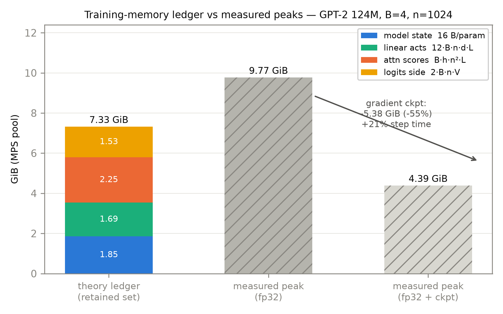
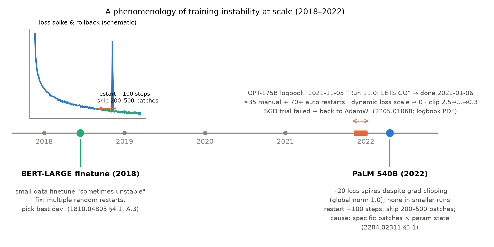

# 第 9 章 预训练工程账本：显存、算力与不稳定性

## 9.0 开篇：从全书到这里

上一章合上时，我们手里有两条定律、一条自家曲线，和一句悬着的话。Kaplan 与 Chinchilla 回答了「一笔预算买多少损失」，我们自己的五个小模型也把幂律形状长了出来（$\alpha=0.0413$，五个点、47 分钟）；但定律只回答「花多少」，章末那句话把工程问题留给了本章：**怎么花才装得下**——175B 的参数得先在显存（GPU memory）里活下来，它的算力账要能提前算清，它训练时的脾气要有人认得。这三件悬案，就是本章的三本账：显存账本（9.2）、算力账本（9.3），加上两件每个训练工程师都用过的应急工具——混合精度（mixed precision）三件套（9.4）与梯度检查点（gradient checkpointing，9.5）——最后是训练不稳定性的现象学（phenomenology，9.6）。

本章是规模化段（第 7-9 章）的最后一站，也是本册最后一个原理章——但它不空手：我们要把第 4 章造的 GPT-2 124M 拉回自己的机器上，用一个分钟级探针把显存账逐项对账（[`code/ch09/memory_probe.py`](code/ch09/memory_probe.py)）——理论账对实测峰值，一个数都不许含糊。到章末你会发现：训练显存为什么是「模型大小的 16 倍起步、激活另算」；为什么 fp16 训练必须随身带三件保险；为什么百亿参数以上的训练日志读起来像重症监护记录——以及为什么这一切只讲到「认得出病症」为止，药方登记在后册。

> **最小背景栏**：两样前置。①浮点格式：一个浮点数由符号位、指数位（exponent）、尾数位（mantissa）组成——**指数位决定动态范围**（dynamic range，最大最小可表示数差多少个数量级），**尾数位决定相对精度**（相邻可表示数差多近）。fp32 是 1+8+23 位；fp16 是 1+5+10 位（最大 65,504，最小正规数 $2^{-14}$，再往下到 $2^{-24}$ 只有次正规数，更小一律变零）；bf16 是 1+8+7 位——指数位与 fp32 同宽，动态范围不缩水。这些数字 9.4 节正式上岗。②优化器状态：Adam/AdamW 为每个参数维护一阶动量 $m$ 与二阶动量 $v$ 两个**与参数同形状**的状态张量（Book1 第 8 章训练配方已教，本册第 4-8 章一直在用）——它们也要住显存，而且是 9.2 账本的大头之一。

## 9.1 预训练首先是工程：三本账的由来

三本账不是本章的发明，它的第一笔欠条第 1 章就开好了。GloVe 的词向量是从共现统计里拟合的：60 亿词语料、40 万词表，共现矩阵光填出来单线程就要 85 分钟，300 维模型一次迭代 32 核 14 分钟【证据等级：官方论文 D14-1162 §4.2】。当时的欠账框问：词表与语料再涨两个数量级，这笔账怎么算得动？现在能回答了：涨的远不止两个数量级——GPT-3 的词表五万、语料三千亿 token，要养的参数从 GloVe 的两亿多（40 万词×300 维×两套向量）涨到一千七百五十亿，七百多倍；而账本也从「算得动算不动」长成了三本。导览 0.5 的第三条贯穿线索「一本账」（从 65M 到 124M 到 175B），正是本章要记满的那本。**装不装得下**（显存）：参数、梯度、优化器状态、激活要同时住在硬件里，超了就 OOM（out of memory，显存溢出）当场停摆。**花不花得起、跑多久**（算力）：$3.14\times10^{23}$ FLOPs 不是修辞，是排期与预算。**跑不跑得完**（稳定性）：训练会在半路「发疯」——损失突然尖起、发散、缩放系数崩零，而不稳定出现的概率与规模一起涨。三本账任何一本爆掉，损失都以「千卡×天」计，所以工程实践与我们本章的顺序一致：先手算账本，再按启动键。

还要先立一个全书沿用的小约定：账本数的是**字节与浮点运算**，是口径问题不是玄学问题——第 8 章四问口径的纪律，在本章具体化为「GB 按 $10^9$ 进位（沿用 ZeRO 论文口径）、GiB 按 $2^{30}$ 进位（沿用本机实测口径）」，两套并存处会显式标注。

## 9.2 显存账本：16 bytes/参数，与另一半

先算与批量无关的那半——**模型状态**（model state）。想象训练某一步的瞬间，显存里住着四类住户：参数、梯度、优化器状态、激活（activations，前向算出、反向要用的中间张量）。前三类的大小只跟参数量 $\Psi$ 有关，逐项记账就得到表 9.1 的两栏。

**表 9.1** 「16 bytes/参数」的两种口径（$\Psi$ 为参数个数；ZeRO 1910.02054 §3.1 逐字：$2\Psi+2\Psi+K\Psi$，$K=12$）

| 住户 | 口径 A：混合精度 + Adam | 口径 B：纯 fp32 + AdamW |
|---|---|---|
| 参数 | fp16，2 bytes | fp32，4 bytes |
| 梯度 | fp16，2 bytes | fp32，4 bytes |
| 主权重（master weights）副本 | fp32，4 bytes | ——（参数本身就是 fp32） |
| 一阶动量 $m$ | fp32，4 bytes | fp32，4 bytes |
| 二阶动量 $v$ | fp32，4 bytes | fp32，4 bytes |
| **合计** | **16 bytes/参数** | **16 bytes/参数** |

【证据等级：官方论文 1910.02054 §3.1（口径 A）；1710.03740（主权重副本动机）；1412.6980（Adam 状态定义，口径 B 据此推导）】

这张表藏着一个教科书级的巧合：**两条精度路线殊途同归，都恰好 16**。口径 A 用 fp16 算前向反向（快、省），省下的每个参数 4 个字节，被 fp32 主权重副本原样吃回去；口径 B 老老实实全 fp32，加法算下来同样是 16。写成公式：

$$
M_{\text{state}} \;\approx\; 16\,\Psi \ \text{bytes}
\tag{9.1}
$$

| 符号 | 含义 | 形状 / 口径 |
|---|---|---|
| $M_{\text{state}}$ | 模型状态显存 | 标量（bytes） |
| $\Psi$ | 参数个数 | 全参数口径（含嵌入） |
| $16$ | 每参数字节数 | 表 9.1 两口径同值 |

用人话说：**光是把「参数、梯度、Adam 的两个动量」养在显存里，每个参数就要花 16 个字节——训练显存的地板是参数量的 16 倍**。ZeRO 论文的锚点例：15 亿参数的 GPT-2，模型状态至少 24 GB——而论文自己形容为 "meager"（单薄得可怜）的 fp16 参数本身只有 3 GB【证据等级：官方论文 1910.02054 §3.1】。我们的 124M 手算：$16\times124{,}439{,}808=1{,}991{,}036{,}928\approx1.99$ GB，其中 $m+v$ 恰好占一半（$\approx$0.996 GB）——**优化器状态一个人就吃掉半个模型**。

但账的另一半——激活——才是「爆显存」的惯犯。前向的每个中间张量，反向传播都可能要用，autograd 于是把它们攥在手里不释放。逐运算数一数一个 GPT-2 Block 的前向要留下什么——按第 4 章已实现的块结构过一遍形状流转（fp16 记账，$s$=2 bytes/元素；$d/h$ 为头维）：

**一个 GPT-2 Block 的形状流转与反传保留集**（输入 $(B,n,d)$；「留什么」列=该步为反向而保留的张量）

| 步骤 | 运算 | 输入形状 | 输出形状 | 反传要留什么 |
|---|---|---|---|---|
| 1 | $\text{ln}_1$ | $(B,n,d)$ | $(B,n,d)$ | 输入 1 份 |
| 2 | QKV 合并投影 | $(B,n,d)$ | $(B,n,3d)$ | 输出拆成 $q,k,v$ 各 1 份 |
| 3 | 拆头 | 3×$(B,n,d)$ | 3×$(B,h,n,d/h)$ | 视图，不另计 |
| 4 | 分数 $qk^\top/\sqrt{d/h}$+掩码+softmax | $(B,h,n,d/h)$×2 | $(B,h,n,n)$ | **softmax 输出 1 份——$n^2$ 大项** |
| 5 | 注意力×$v$、并头、投影 | $(B,h,n,d/h)$ | $(B,n,d)$ | 投影输入 1 份 |
| 6 | 残差加 | $(B,n,d)$×2 | $(B,n,d)$ | 无需保留 |
| 7 | $\text{ln}_2$ | $(B,n,d)$ | $(B,n,d)$ | 输入 1 份 |
| 8 | FFN 升维 $4d$+GELU | $(B,n,d)$ | $(B,n,4d)$ | $(B,n,4d)$ 2 份（fc 输出与 GELU 输出） |
| 9 | FFN 降维+残差加 | $(B,n,4d)$ | $(B,n,d)$ | — |

逐项数下来线性形状共 11-15 份 $(B,n,d)$/层（实现细节决定几个边缘项的去留），记账规则取整为 **12 份**——这正是 ZeRO 脚注的口径 "the total activations is about $12\times$hidden$\times$batch$\times$seq$\times$layers"【证据等级：官方论文 1910.02054 §3 脚注】。加上第 4 步那个 $n\times n$ 方块，两条公式：

$$
M_{\text{act}}^{\text{lin}} \;\approx\; 12\,s\,B\,n\,d\,L \ \text{bytes}
\tag{9.2}
$$

$$
M_{\text{act}}^{\text{attn}} \;=\; s\,B\,h\,n^{2}\,L \ \text{bytes}
\tag{9.3}
$$

| 符号 | 含义 | 形状 |
|---|---|---|
| $B$ | 批内序列数 | 标量 |
| $n$ | 序列长 | 标量（GPT-2 为 1024） |
| $d$ | 隐藏维 | 标量（124M 为 768） |
| $h$ | 头数 | 标量（124M 为 12） |
| $L$ | 层数 | 标量（124M 为 12） |
| $s$ | 每元素字节数 | fp16=2 / fp32=4 |

用人话说：式 (9.2)——每个 token 穿过每层，平均留下 12 份隐藏向量那么大的「脚印」；式 (9.3)——注意力分数是每层每头一块 $n\times n$ 的方块，**随序列长平方膨胀**。Book1 立过的 $O(n^2)$ 复杂度警告（时间侧）在这里显存侧再次收租。把 124M 的数代进去（$B=8,n=1024,d=768,h=12,L=12$，fp16 记账）就得到表 9.2 的上半部。


**表 9.2** GPT-2 124M 训练显存总账（上：教学手算，$B=8$、fp16 记账、GB 口径；下：本机实测，$B=4$、fp32、GiB 口径）

| 项 | 算式 | 结果 | 备注 |
|---|---|---|---|
| 模型状态 | $16\times124{,}439{,}808$ | **1.99 GB** | 表 9.1；$m+v$ 占 0.996 GB |
| 线性激活 | 式 (9.2)：$12\times2\times8\times1024\times768\times12$ | 1.81 GB | 12 份 $(B,n,d)$/层 |
| 注意力分数 | 式 (9.3)：$2\times8\times12\times1024^2\times12$ | **2.42 GB** | $n^2$ 大项 |
| 激活小计 | — | **4.23 GB** | **≈ 模型状态的 2.1 倍** |
| 输出侧宽矩阵 | $2\times2\times8\times1024\times50{,}257$ | ≈1.65 GB | logits 与交叉熵中间量各一份 $(B,n,V)$ |
| 实测：同步剖面（稳态第 2-4 步） | 零梯度后 → 前向后 → 反向后 | 3.97 → **10.19-10.73** → 5.46 GiB | 分配器池口径 |
| 实测：峰值（6 步，每配置独立子进程） | fp32 / bf16 / fp32+检查点 | **9.77 / 11.34 / 4.39 GiB** | 0.808 / 0.473 / 0.975 s/step（bf16 1.71×、检查点 +20.6%）；bf16 峰值不降反升，见「开关效应」 |

【证据等级：上半=本书算术；下半=本书实验（MPS，2026-10，`log/book2-ch09/memory_probe.json`（定版副本 `memory_probe_final.json`）与 `step_profile.json`，种子 20261002；峰值行三配置各在独立子进程实跑，防分配器池跨配置残留）】

手算账的第一句结论：$B=8$ 时激活（4.23 GB）已是模型状态的 **2.1 倍**，其中注意力分数一项（2.42 GB）**单独超过全部模型状态**（1.99 GB）——再算上输出侧那张 $(B,n,50257)$ 的宽矩阵，**训练爆显存，多半爆在激活**：模型状态随参数量线性长，激活却随 $B\cdot n\cdot L$ 线性、随 $n$ 平方长。这张账还能**倒过来用**——这才是工程上的用法：给定显存预算 $M$，先扣掉地板 $16\Psi$，再扣输出侧两份 $(B,n,V)$，余下的除以「激活单价」（每 token 每层 $12sd$ 加注意力 $n^2$ 项的量级），就得到这台机器塞得下的 $B\cdot n$ 上限。第 10 章选冒烟批量、第 11 章排实验档位，走的都是这道减法；临时救急的手段则是减批量、减序列长——以及 9.5 节的检查点。

> **口径框：Apple 统一内存上「显存」怎么问、何时问**。本机（Apple Silicon，MPS）无独立显存，CPU/GPU 共享统一内存（unified memory）；全书对拍规范定为：上限看 `torch.mps.recommended_max_memory()`（本机 37.44 GiB），峰值靠后台轮询 `torch.mps.current_allocated_memory()`（torch 2.13 API 名）。但要把口径说透：这个读数是**分配器池**的当前分配量——含可复用缓存与瞬时工作区，是跨配置比较的诚实上界口径，却不等于「活张量」精确值。同一台机器同一个 124M 模型上，30 ms 轮询的早期探针报过 current 峰值 4.6 GiB / **driver** 峰值 13.4 GiB 的分裂读数，连检查点的峰值增益也量到过小得多的 −0.7 GiB（轮询时机不同）【证据等级：本书实验（`00-feasibility/01_probe_a` 复跑，2026-10）】——「问谁、何时问、warm-up 前后」都改变答案。本章实测统一采用「20 ms 轮询峰值 + 四时点同步剖面」双口径互证；数值对拍照旧只在 CPU fp32 报数。

理论账说完了，让机器来对账。探针 `memory_probe.py` 的核心只有三个开关——同一台 124M（第 4 章 `warmup_ablation.GPT` 工厂造，全参数 124,439,808 逐位复验），同一批数据，三个开关各开一次：

```python
# [`code/ch09/memory_probe.py`](code/ch09/memory_probe.py)（节选：理论账与三配置开关）
"theory": {  # 记账口径（保留集）：模型状态 + 激活两式 + 输出侧宽矩阵
    "params_total": psi, "params_non_emb": psi_ne,
    "state_gib": round(16 * psi / 1024**3, 3),                    # 16B/参数（两口径同 16）→ 1.854
    "act_linear_gib": round(12 * B * n * d * L * 4 / 1024**3, 3),  # ≈12 份 (B,n,d)/层（ZeRO 规则）
    "act_attn_gib": round(B * h * n * n * L * 4 / 1024**3, 3),     # 注意力分数 (B,h,n,n)/层
    "logits_gib": round(2 * B * n * V * 4 / 1024**3, 3),           # logits + log_softmax 两份 (B,n,V)
},
for cfg in ("fp32", "bf16", "ckpt_fp32"):   # 每配置独立子进程实跑（防 MPS 池跨配置残留——同进程连跑版曾因此失真）
    p = subprocess.run([sys.executable, __file__, "--single", cfg], capture_output=True, text=True, check=True)
    r = json.loads(next(l for l in p.stdout.splitlines() if l.startswith("RESULT "))[len("RESULT "):])
# 前向+反向+AdamW step × 6：fp32 0.808 s/step 峰值 9.77 GiB；bf16 0.473（1.71×）11.34；ckpt 0.975（+20.6%）4.39
```

读数分三层（表 9.2 下半）。第一层，**剖面**：稳态一步之内，池从 3.97 GiB（模型状态+缓存）被前向推到 10.19-10.73 GiB，反向结束又落回 5.46 GiB——一升一落的 6 GiB 出头，就是激活保留集加瞬时工作区在呼吸。第一步的剖面更直白：0.51（参数就位）→ 6.86（前向）→ 2.00（反向，梯度就位）→ 5.46（优化器状态分配）——注意 $m,v$ 是**第一次 step 才懒分配**的：16 bytes/参数的地板不是开机就在，而是第一个优化器步落成。第二层，**峰值对照**：fp32 实测 9.77 GiB，高于保留集记账的 7.33 GiB（1.854+1.688+2.250+1.534）——缺口约 2.4 GiB，来自反传瞬时梯度、算子工作区与池缓存；记账口径算的是「该保留什么」，峰值口径量的是「实际用到多高」，两者差着分配器的脾气（同步剖面的前向后读数 10.2-10.7 出自另一次运行——20 ms 轮询会漏掉更短的瞬时高点，这正是口径框「何时问都改变答案」的又一例）。第三层，**开关效应**：两个开关一正一反。检查点把激活保留集几乎清空，峰值从 9.77 砍到 4.39 GiB——对得上「模型状态 1.85 + 输出侧 1.53 + 段边界与重算工作区约 1.0」的预估，「爆显存爆在激活」的正片。bf16 却出乎直觉：记账上线性激活与注意力分数的字节确实砍半，实测峰值**不降反升约 1.6 GiB**（9.77→11.34；三次复跑方向一致，含每配置独立子进程的隔离版，排除了分配器残留伪象）。账面解释不神秘：autocast 路线上 fp32 权重原样在场之外，每步还要现场铸造 bf16 权重副本参与矩阵乘，LayerNorm/softmax/交叉熵又各自生成 fp32 升精度副本（9.4 节实测过的分工）——这些瞬时工作区都记在池峰值上。**「保留集字节」与「池峰值」是两本账：省前者不保证省后者**；bf16 在本机买到手的不是显存，是时间（0.81→0.47 s/step，1.71×）。图 9.1 把三层读数画成一张图。



图 9.1 显存构成：理论记账（保留集四件，fp32 口径 $B=4,n=1024$）vs 本机实测峰值（fp32 / fp32+梯度检查点）。检查点一开，峰值 −5.38 GiB（−55%）、步时 +21%——「爆显存爆在激活」在本机兑现【证据等级：本书实验（MPS，2026-10，`log/book2-ch09/memory_probe.json`）】

## 9.3 算力账本：6ND 换算盒

显存回答「装不装得下」，算力账回答「跑多久、花多少」。好消息是这台账只有一行——第 7 章 7.1 节已经把直觉立好了（每参数看每 token 前向 2 次、反向 4 次浮点运算），式 (7.1) $C\approx6ND$ 直接搬来用；本节把它装订成换算盒，并补上单位与两头的参照系。

盒子里只有两个换算。第一，FLOPs 之定义自明；第二，PF-day（petaflop/s-day，$10^{15}$ FLOP/s 跑满一天）：

$$
1\ \text{PF-day} \;=\; 10^{15}\ \text{FLOP/s}\times86{,}400\ \text{s} \;=\; 8.64\times10^{19}\ \text{FLOPs}
\tag{9.4}
$$

用人话说：PF-day 是「每秒一千万亿次运算的机器干满一天」的工作量单。手算复现一遍 GPT-3 锚点：$6\times174.6\times10^{9}\times300\times10^{9}\approx3.14\times10^{23}$ FLOPs $=3.64\times10^{3}$ PF-days——与官方附录 Table D.1 两位有效数字全对上【证据等级：官方论文 2005.14165 v4 附录 Table D.1；算术见第 7 章式 (7.1)】。$3.64\times10^{3}$ PF-days 是多大？给两个参照：一张 A100 的 fp16 张量算力标称 312 TFLOPS（【硬件标称=厂商自报】），满跑一天才 0.312 PF-day——GPT-3 相当于**一万一千六百张 A100 满载一天**【本书算术】；另一头是我们自己，本机有效算力约 6 TFLOP/s（第 11 章诚实条款的正式口径，满速一天 $6\times10^{12}\times86{,}400\approx0.006$ PF-day）——一张 A100 的标称算力约合本机有效算力的 52 倍，而 **GPT-3 的账单是本机的六十万倍：让这台 MacBook 连跑 $3.64\times10^3/0.006\approx1{,}660$ 年**【本书算术】。

换算盒的用途在第 11 章兑现：把自家训练点画进论文坐标系。先拿第 8 章的存货热身——族里最大的 20m 点 $6\times19{,}519{,}872\times39{,}993{,}344\approx4.7\times10^{15}$ FLOPs $\approx5.4\times10^{-5}$ PF-days，全族合计 $1.3\times10^{-4}$ PF-days【证据等级：本书实验（ch8，`log/book2-ch08/`）】；第 11 章计划的 124M（非嵌入 $N=85{,}056{,}000$）吃 100M tokens 是 $6\times8.5\times10^{7}\times10^{8}\approx5.1\times10^{16}$ FLOPs $\approx5.9\times10^{-4}$ PF-days。后者还能反着用：6ND 除以 wall-clock 就是**有效算力**——按探针外推 bf16 约 2.3 小时跑完，$5.1\times10^{16}/(2.3\times3600)\approx6.2$ TFLOP/s，与诚实条款的「本机 ≈6 TFLOPs」互相咬合【证据等级：本书算术（2.3 h 为可行性探针外推的计划值）】。$N$ 取哪个口径第 8 章已立规：6ND 一律非嵌入参数——但本节的 GPT-3 手算沿第 7 章原文用了全参数口径（174,600M），两口径并排时记得注脚。顺带登记一条引用纪律：GPT-2 论文**没有披露**训练算力，想给它记账只能 6ND 自估并标注「估算」——第 10 章给我们的 124M 排预算时照此办理。

## 9.4 混合精度三件套：fp16 的刻度尺

账算完，看第一个省钱的工具——以及它为什么必须带保险。动机 9.2 已经看见一半：bf16 一开，步时快 1.71 倍——至于省显存的那一半，9.2 刚上过口径课（保留集字节砍半，池峰值却不降反升）。省与快的原因是同一个：半精度把矩阵乘的数据搬运量砍半。但 fp16（不是 bf16）的保险问题要从它的**刻度尺**讲起。

把浮点格式想成一把尺子：指数位是尺子的**量程**（能覆盖多少个数量级），尾数位是**最小刻度**。fp16 只有 5 个指数位，量程极窄——最大 65,504，最小正规数 $2^{-14}\approx6\times10^{-5}$；而训练里的梯度恰恰是一群极小的数。《Mixed Precision Training》（Micikevicius 等，2017）给过一组教科书数字：fp16 中**任何小于 $2^{-24}$ 的数直接变零**；在一个真实负载（Mandarin 语音识别模型）的梯度直方图里，**约 5% 的梯度值指数小于 −24**——不用任何技巧、直接 fp16 训练，该模型相对精度损失 **80%**【证据等级：官方论文 1710.03740 摘要与 §3.1】。用人话说：尺子量程不够，一大把梯度被四舍五入成了零——**权重不是学错，是根本没收到学习信号**。下溢危险还因负载而异：AlexNet 类卷积网络的梯度量级健康，无需缩放——**「要不要保险」先看自家梯度的分布，这本身就是一笔要算的账**【证据等级：官方论文 1710.03740 §3.2】。这把尺子还有第二个坑在「更新」端：fp16 尾数 10 位，在 1.0 附近的相邻可表示数间隔约 $2^{-10}\approx9.8\times10^{-4}$（尾数最低位一个 ULP），比它更小的更新量若不足间隔之半（$\approx4.9\times10^{-4}$，即最大舍入误差），$w+\Delta w$ 会被舍回去——步子迈了等于没迈。拿小数字算一下更直观：若权重 $w=1.0$、这一步的更新量 $\Delta w=3\times10^{-5}$，不到半间隔的百分之一，则 $w+\Delta w$ 四舍五入又落回 1.0——**更新被刻度吞掉**。训练越往后梯度越小、更新越细，被吞的比例只会越大。

三件套就是对着这两个坑设计的（表 9.3）。


**表 9.3** 混合精度三件套（Micikevicius 1710.03740；数字锚均为原文）

| 件 | 做什么 | 对付哪个坑 | 数字锚 |
|---|---|---|---|
| fp32 主权重 | 前向反向用 fp16；每步更新累积在一份 fp32 副本上 | 更新被舍入吃掉 | 无主权重的 fp16 训练：相对精度损失 80%（同上负载） |
| 损失缩放（loss scaling） | 损失乘常数 $S$ 再反传，梯度整体抬高 $S$ 倍；反传一结束、梯度裁剪之前除回去 | 梯度下溢（underflow）变零 | $S$ 范围 8-32K；SSD 负载 8 即够、bigLSTM 要 128；约束 $S\times\max|g|<65{,}504$；除回去必须在裁剪**之前**——裁剪要作用在真实梯度尺度上 |
| fp32 累加 | 规约类运算（点积、求和）用 fp32 累加器 | 半精度累加大数组时误差堆积 | 权重显存 +50%，但训练整体显存「约减半」；吞吐 2-8×（Volta 实测 2-6×） |

【证据等级：官方论文 1710.03740 摘要、§2-§3（缩放常数与 65,504 逐字）】

三件合起来，fp16 训练才既快又不出事。这里有一个工程演化的细节值得点名：**v1 论文只描述了常数缩放**——$S$ 选一次用到底；但常数有个先天缺陷：训练前期与后期、不同 batch 之间梯度尺度会漂，$S$ 太小护不住小梯度、太大又撞 65,504 的溢出上限。「溢出则减半、稳定则倍增、溢出时跳过更新」的**动态损失缩放**（dynamic loss scaling）在 v1 里只是一句 future work【证据等级：官方论文 1710.03740 §3.2】。工程化的后继把它变成了默认配置——而这个「自动化」在百亿参数规模上会怎么翻车，9.6 节的 OPT 病历里有第一手记录。

最后把镜头转回本机。我们在第 8 章、本章探针里用的其实不是 fp16 而是 bf16（`torch.autocast`）：指数 8 位、与 fp32 同量程——**从格式上就不需要损失缩放**（量程够，梯度再小也落不到变零区），这正是它作为默认半精度格式的底气。autocast 的分工本书已实测过：矩阵乘走 bf16，LayerNorm/softmax/交叉熵自动升 fp32。速度账：可行性探针在 $B=8\times256$ 档两轮独立复测 1.71×/1.96×【证据等级：本书实验（`00-feasibility/01_probe_a`，2026-10）】，本章探针在 $B=4\times1024$ 长序列档测得 1.71×【证据等级：本书实验（`log/book2-ch09/`，共享机器对比口径）】——**本机 1.7-2.0×**，长序列档偏低（注意力算子占比更大），离论文时代的「2-8×」还有硬件代差，但白拿的速度已经够第 11 章把实验预算砍半。

## 9.5 梯度检查点：时间换空间的旋钮

9.2 的账说激活是爆显存的惯犯——现在问怎么砍。直觉只要一句话：**反向要用的激活，不必在前向时就全程供着**。前向时只记下每个 Block 的边界输入，块内中间量全部丢掉；反向走到哪块，就把那块**重新前向一遍**现算。这就是梯度检查点（Chen 等，2016，注意编号是 1604.06174 不是 1604.06130——后者是一篇粒子物理论文）：分 $k$ 段存边界，内存 $O(n/k)+O(k)$，$k=\sqrt n$ 时最优到 $O(\sqrt n)$，代价是每个 mini-batch **多一次前向**——论文的实测口径是 **+30% 运行时间**，还有个锚点例：一千层残差网络显存 48G 降到 7G【证据等级：官方论文 1604.06174 摘要】。`torch.utils.checkpoint` 即此思想的工具化，本章探针的检查点开关就是把每个 `Block` 的前向包进 `checkpoint`。ZeRO 论文的对照锚更贴我们的场景：1.5B GPT-2（$B=32,n=1$K）激活约 60 GB，开检查点后约 8 GB，重算代价约 33%【证据等级：官方论文 1910.02054 §3】。

本机实测是表 9.2 的最后一行与图 9.1 的右柱：峰值 9.77 → 4.39 GiB（**−5.38 GiB，−55%**），步时 0.808 → 0.975 s/step（**+20.6%**）【证据等级：本书实验（MPS，2026-10）】。两处「教科书预期 vs 实测」值得停下来讨论。时间端：+21% 好于论文的 +30% 与 ZeRO 口径的 ~33%——重算占比取决于「被重算的前向」占整步（含反向与优化器）的比重，124M 档的优化器步与输出侧宽矩阵摊薄了重算的份额；这也提醒我们：**这类百分比是口径的函数，引用时必须带模型与批量**。空间端：−5.38 GiB 比许多人预期的「只省激活的一小部分」大得多——因为在峰值时刻，激活保留集连同它们的瞬时梯度本就是池的大头（9.2 的剖面：前向一抬 6 GiB 出头）；反过来，检查点**救不了模型状态**：1.85 GiB 的 $16\Psi$ 地板纹丝不动（实测 4.39 GiB ≈ 状态 1.85 + 输出侧 1.53 + 段边界与重算工作区约 1.0）。顺带一说，检查点其实是一条**连续谱**而非单个开关：分段数 $k$ 是旋钮（$O(n/k)+O(k)$，$k=\sqrt n$ 最优），Chen 论文还给出了压到 $O(\log n)$ 内存的极端档——代价升至 $O(n\log n)$ 额外计算；`torch.utils.checkpoint` 里「每块一段」只是谱上常用的一点。还有一句要紧的边界：检查点不是免死金牌——ZeRO 的口径下，100B 级模型在 $B=32$ 时**即便开了检查点，激活仍约 60 GB**【证据等级：官方论文 1910.02054 §3】：$O(\sqrt n)$ 的压缩追不上绝对规模。所以本册口径内的工具箱是保守三件：减批量、减序列长、开检查点；至于把 $16\Psi$ 切到多卡上去分账的并行方案，是训练侧工程的下一站主题（Book4）。在 37.44 GiB 的本机上，124M 用不上这个旋钮——但「知道有这工具、知道它的价格」本身就是工程素养。

## 9.6 训练不稳定的现象学：三站实录

前两本账都算清了，第三本账最不可控：训练会发疯。损失平稳下降几万步后毫无征兆地尖起、发散；缩放系数一路崩零；有时重启就好了，有时怎么都不好。本节做**现象学**——把病症与病历如实记下——而不开药方；三站按时间钉在图 9.2 上，按「记录密度」递进。



图 9.2 训练不稳定性三站时间线（自绘；站点日期与数字分别锚定 1810.04805 v2 §4.1/A.3、2204.02311 §5.1、2205.01068 与逐日 logbook PDF；内嵌小图为 spike-回滚处置示意，示意级）

第一站，2018，前传。BERT-LARGE 在小数据集上微调「有时不稳定」（"sometimes unstable"），官方对策朴素得惊人：**同一 checkpoint 多次随机重启**（不同数据洗牌与分类头初始化），选 dev 最优【证据等级：官方论文 1810.04805 v2 §4.1、A.3】。注意两件事：这是**微调**侧的不稳定（样本只有三千多条的小任务），且处置是「重抽签」而非「找病因」。它的影子我们在自家机器上见过——第 3 章 bert-base 微调 MRPC，同种子四跑终点差 3.7 个点（80.1 到 83.8）；第 8 章的无 warmup 对照族在 7m 点被 warmup 200 步修复 0.55 nat——小模型上的方差，是大模型上 spikes 的远亲。

第二站，2022，归因句。PaLM 540B（6144 块 TPU v4、780B tokens、梯度裁剪 global norm 1.0 全程在场）训练中观察到**约 20 次 loss spike（损失尖峰）**——"despite the fact that gradient clipping was enabled"，且**更小的模型上从未出现**【证据等级：官方论文 2204.02311 §5.1】。它的账单按 6ND 手算：$6\times540\times10^{9}\times780\times10^{9}\approx2.5\times10^{24}$ FLOPs $\approx2.9\times10^{4}$ PF-days——GPT-3 的约八倍【本书算术，全参数口径】；批次日程也值得看一眼：批量 512（1M tokens）跑到 5 万步、加倍到 1024（2M）跑到 11.5 万步、再加倍到 2048（4M）到 25.5 万步收工，理由是小批量前期样本效率高、大批量后期矩阵乘吞吐高【证据等级：官方论文 2204.02311 §5】。在这样的体量上，处置是：从 spike 开始前约 100 步的 checkpoint 重启，并**跳过约 200-500 个数据批**；同一点位不再复发。最值钱的是归因句，值得原文级引用：团队从更早的 checkpoint 重放同一批数据**不能**复现 spike，所以 "we do not believe that the spikes were caused by 'bad data' per se"——结论是 "spikes only occur due to the **combination of specific data batches with a particular model parameter state**"【证据等级：官方论文 2204.02311 §5.1，直引】。用人话说：病不是数据的错，也不是状态的错，是**特定数据批与特定参数状态的相遇**——同一个批，早来三步晚来三步都没事。这也解释了为什么处置是「回退+绕行」：把相遇错开，而不是修复任何一方；也解释了为什么裁剪在场也没用——裁剪管的是梯度的「音量」，拦不住这次「相遇」本身。

第三站，2021-11 到 2022-01，全程实录。OPT-175B 的逐日 logbook（与论文 2205.01068 配套的独立 PDF）是大模型训练失败的第一手流水账：992 张 80GB A100（FSDP 全分片 + 张量并行，峰值利用率标称 147 TFLOP/s/卡），硬件故障造成**至少 35 次手动重启**、轮换上百台主机，另有估算 **70+ 次自动重启**【证据等级：官方论文 2205.01068 §2-§3】。账本侧一句话：180B tokens 的 6ND $\approx1.9\times10^{23}$ FLOPs $\approx2.2\times10^3$ PF-days【本书算术，全参数口径】——约 GPT-3 的六成；但真实的开销远不止 FLOPs：论文自报碳排理论值 75 吨 CO₂eq、实际约为两倍（重启与空转）——**账本不只是 FLOPs**【证据等级：官方论文 2205.01068，厂商自报口径】。病历侧，我们逐日核了原始 PDF【证据等级：官方 logbook PDF（metaseq 仓库 OPT175B_Logbook.pdf，2026-10 目验；文本存 `log/book2-ch09-opt-logbook.txt`）】：最终 run 于 **2021-11-05 启动**（logbook 原话 "Run 11.0: LETS GO"），**2022-01-06 15:46 ET 完成**（"done training"）——含首尾 63 个自然日。它的训练配置恰是 9.2/9.4 的实装口径：**fp16 权重 + fp32 Adam 状态 + 动态损失缩放**；病程与 9.4 的伏笔严丝合缝——Run 11.4 在约 3.9k 步爆炸、11.5 在 5139 步再爆，病历写着梯度范数尖峰、**损失缩放已低至 0.000122**、第 92 层注意力层归一化输入出现 $-\infty$；论文正文的归纳是：发散与「**动态缩放系数崩到 0**」相关、伴随末层激活范数尖峰；裁剪的降链在 logbook 里清晰可循（11.2 把 2.5 降到 1.5、11.5 再降到 1.0），论文口径最终**降到 0.3 才见稳定**；中途试换 SGD，优化立刻平台化，换回 AdamW。处方之外还有一句论文主旨值得记住：这类训练的隐性成本是「底层设施或训练过程本身失稳时所需的**人力开销**」。

三站合读，模式比个案值钱：①不稳定随规模浮现（BERT-LARGE 的微调、PaLM 只在 540B 出现的 spikes、OPT 的史诗级病程）；②裁剪在场也拦不住（PaLM norm 1.0 全程、OPT 1.0 都不够，压到 0.3 才缓和）；③处置一律是「回退与绕行」——重启、跳批、降学习率、换格式——而不是「修复」；④fp16 路线上，「缩放系数崩零」是大模型的特有指纹（OPT 是实锤）。到本章为止，我们把这组现象**只当作现象记下**：为什么这个规模会 spike、损失缩放为什么恰在此处崩零、有没有让大模型天然稳定的组件级方案——PaLM 论文自己也把 "more principled mitigation strategy" 列为未来工作【证据等级：官方论文 2204.02311 §5.1】。诊断在此止步，处方唯一归属 Book4 第 7 章（见章末欠账框）。

## 9.7 本章小结

开篇的三本悬账，现在都有了着落。显存账：训练显存 = 模型状态地板（式 (9.1)，两口径同 16 bytes/参数，124M 即 1.99 GB，优化器状态占一半）+ 激活（式 (9.2)(9.3)，随 $B\cdot n\cdot L$ 线性、$n$ 平方增长；$B=8$ 时 4.23 GB，是模型状态的 2.1 倍，注意力分数一项就超过全部模型状态）——本机对账逐项吻合，检查点一开 −5.38 GiB，把「爆显存爆在激活」钉在了实测上。算力账：6ND 换算盒（式 (9.4)）+ 三个参照系（GPT-3 = $3.64\times10^{3}$ PF-days ≈ 一万一千六百张 A100·天 ≈ 本机的六十万倍），自家点全部可以画进论文坐标系，第 11 章兑现。稳定性账：三站病历——BERT-LARGE 随机重启、PaLM 的「数据批×参数状态」归因句、OPT 的缩放崩零与 63 天病程——加上跨站四模式。工具箱两件：混合精度三件套（fp32 主权重、损失缩放、fp32 累加；本机 bf16 免缩放拿 1.7-2.0×）与梯度检查点（$O(\sqrt n)$ 内存换一次额外前向，本机 −55% 峰值 / +21% 步时）。

**带走的心智**：忘掉具体数字，请留下两件。第一件是一张图景：**训练显存是「16×地板 + 活的弹幕」——地板是模型状态，每参数 16 bytes 纹丝不动；弹幕是激活，随批量与序列长铺开、随 $n^2$ 膨胀，训练一停就散——所以爆显存先查弹幕，而省弹幕的旋钮（检查点）标价约三分之一步时**。第二件是一种判断力：**大模型的账算得出（6ND、16Ψ 都是三行乘法），病认得出（spike 不是坏数据、缩放崩零是 fp16 的指纹、处置是回退绕行）——但「算得出」与「不生病」之间隔着整个工程，那一段路在 Book4**。顺带把三个常数收进口袋：每参数 16 bytes、每参数每 token 6 次浮点、1 PF-day = $8.64\times10^{19}$ FLOPs——本书剩余章节的每一笔预算，都从它们出发。

镜头拉回全书：规模化段（第 7-9 章）到此走完——第 7 章看见 175B 与涌现，第 8 章拿到定律与自家曲线，本章把定律落到显存、算力与病历。三本账在手，「造一台 GPT-2 124M」的全部前置条件就绪：机器的形状（第 4 章差异清单）、目标函数（第 5 章）、训练循环的纪律（第 8 章实验、本章账本）都在手边。下一章开机：从零实现这台 124M，参数逐位对上官方的 124,439,808，在莎士比亚上先跑通第一口气。

> **【欠账】** 混合精度的三件套只是低精度长跑的第一棒：fp16 的梯度下溢、PaLM/OPT 的 spike 我们都只做了诊断——更低精度的训练配方与让大模型不 spike 的组件级稳定化方案（更聪明的归一化与裁剪组件），见 **Book4 第 7 章**。

## 9.8 动手验证（本章代码与实验清单）

- 探针（约 2 min，MPS；产物落 `log/book2-ch09/`）：`cd 工作区根目录 && source env.sh && python "[`code/ch09/memory_probe.py`](code/ch09/memory_probe.py)"`——应打印理论账（state 1.854 GiB 等）与三配置 0.808/0.473/0.975 s/step、峰值 9.77/11.34/4.39 GiB、检查点 +20.6% 与 −5.38 GiB。两个复现注记：①计时与峰值的**末位随机器状态浮动**（共享机器对比口径；若同时跑着第 10/11 章的训练任务，计时会成倍变慢——错峰复跑即可，本书留有一次并发复跑实录 `memory_probe_contended_rerun_0632.json`），方向与量级（检查点 ≪ fp32、bf16 峰值略高于 fp32）三次复跑稳定；②正式定版产物用 `--out-name` 另存（本章定版副本 `memory_probe_final.json`）——防覆写纪律，别让复查复跑冲掉正文引用的数字（批三教训）。
- 图表复现（秒级）：`python "[`code/ch09/make_figures.py`](code/ch09/make_figures.py)"`（图 9.1 读 `memory_probe.json`；图 9.2 为绘版式数据）
- 手算验收：任取一个模型 config（如第 4 章四档之一），不看书写出式 (9.1)-(9.3) 并算出 $B=8$ 的训练显存——先算 16Ψ，再算 12 份 $(B,n,d)$/层与 $n^2$ 项，最后加输出侧两份 $(B,n,V)$
- 三问验收：损失缩放为什么必须（5% 梯度落在 $2^{-24}$ 之下变零——尺子量程的哪一端出了问题）？检查点为什么救不了模型状态？PaLM 的 spike 归因句为什么排除了「坏数据」（重放不复现）？再快问三个常数：16、6、$8.64\times10^{19}$ 各自量的是什么？
- 变式实验（选做）：把 `memory_probe.py` 的 `bench(B=8)` 跑一遍（注意线性项与 $n^2$ 项随 $B$ 同步加倍，峰值显著上抬、仍在 37.44 GiB 上限内）；或把 `bench` 的 `steps` 提到 20 对比首步与稳态的峰值差（预热效应）
