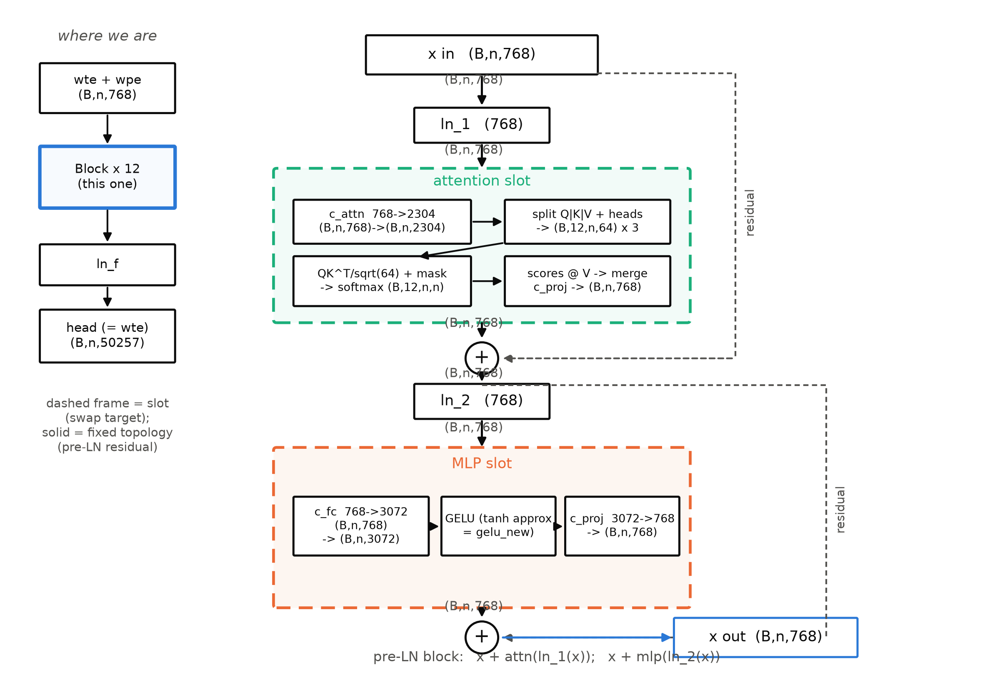
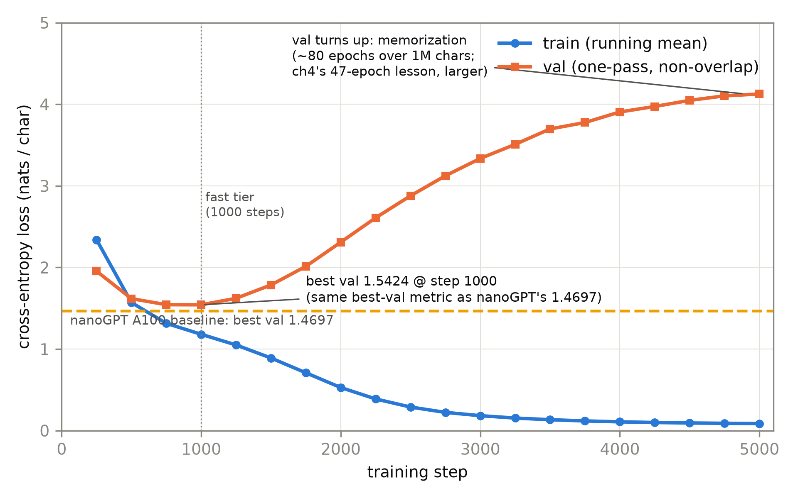
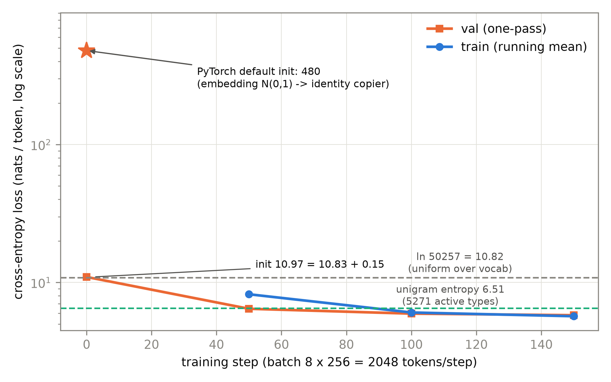

# 第 10 章 大项目 I：从零实现 GPT-2 124M

## 10.0 开篇：从全书到这里

上一章我们把预训练的「钱和脾气」都算清了：一个参数训练时要占 16 bytes、175B 的模型状态得多少显存、6ND 怎么把 token 预算换算成电费、混合精度三件套和梯度检查点各救什么命，最后还有 PaLM 的 loss spike 与 OPT Logbook 里那几十次重启教我们认的「大模型脾气」。三本账合上，章末的结语已经替本书点了名：「下一章开机：从零实现这台 124M，参数逐位对上官方的 124,439,808，在莎士比亚上先跑通第一口气」（第 9 章 9.7 节，原文直引）——就是本章。账本算完，手里还是空的：到目前为止，你真正从零造过、训过的机器，一本账上只有 Book1 那台 63.1M 的翻译机和第 4 章 10M 档的四格实验机。大项目 I 就是全书预告已久的**造机时刻**：把第 4 章动过的四刀落成一台正式的、参数逐位对上官方的 GPT-2 124M，配一个定版训练循环，在本机真的把它点着。

本章要回答一个工程师式的问题：**「我造的这台机器，凭什么让我相信它就是 GPT-2？」**答案不是「代码看起来像」，而是三条可以机器判定的验收——参数逐位等于官方 124,439,808；随机权重同 config 下与 HF 实现对拍 logits 一致；训练循环冒烟时 loss 从 $\ln(\text{词表})$ 附近健康下降（10.1 节立验收，10.2/10.5 节逐条兑现）。造的过程分三步走：先在 Shakespeare 上用 10.65M 的小模型把训练循环跑通（10.4 节），再让 124M 整机点火冒烟（10.5 节），最后把「从 Book1 翻译机到 GPT-2」的四刀在代码层面收拢成一张 diff（10.6 节）——单轨代码主线的第一次换装。章末你会拥有三份带得走的资产：`model.py`（三插槽 Block，下一册逐插槽改装的契约锚点，第 11 章对拍官方权重用的就是它）、`train.py`（定版训练循环——本章热身、冒烟与随机权重对拍全用它；第 11 章的实验产线如何同配方延伸它，见 11.0 的依赖链声明）、两条自己机器上跑出来的 loss 曲线。机器有了，下一章喂真数据、对官方权重、看真曲线。

> **最小背景栏**：本章只补三样。① GPT-2 的架构规格（12 层/768 维/12 头、ctx 1024、词表 50257、pre-LN+ln_f、绑定嵌入（tied embeddings）、$N(0,0.02)$ 初始化）——第 4 章四刀已逐一手术过，直接指回表 4.3；块内逐运算形状见第 4 章表 4.4，本章不重列。② 因果 LM 目标（用第 $t$ 位状态预测第 $t{+}1$ 个 token）——Book1 第 8 章已教；它与 T5 的 span corruption 是预训练范式在 decoder-only 与 encoder-decoder 两端的不同选择，见第 5 章表 5.1。③ 训练循环的谱系：Book1 第 9 章的循环 → 第 4/8 章参数化前身（`warmup_ablation.py`/`run_family.py`）→ 本章定版——依赖链声明见 10.3 节。

## 10.1 蓝图与验收先行：先立测试，再写代码

造一台 124M 的机器，最忌讳的是「照着教程敲完、跑通没报错、就当它对了」。第 2 章自写 BPE 时我们已经用过更硬的办法：先写下可复算的验收数字（Book1 的四个欠条数），再动手实现。这一章把同样的纪律放大：**三条验收先行**，每条都机器判定、每条都有数字。

**验收①（参数逐位）**：`sum(p.numel()) == 124,439,808`。官方口径怎么来的、论文 Table 2 为什么写 117M、OpenAI 后来怎么更正的——第 4 章 4.2 节考据框已闭环，此处直接引用结论：我们对账的对象是更正后的 checkpoint 实数 124,439,808【证据等级：官方代码仓库 openai/gpt-2 README 更正句】。这个断言进代码（`model.py` 自测段），每一次构造模型都自动核账。逐项账见表 10.1。

**验收②（结构对拍，parity check）**：与 HF `transformers` 5.18.0 的 `GPT2LMHeadModel` 在**随机权重、同 config** 下对拍 logits。两个实现喂同一组随机初始化的权重、同一批输入，若 logits 逐位一致，则前向数学等价——这是比「加载官方权重再对拍」（第 11 章的正题）更早可用的结构验收：不用下载任何权重就能做。对拍要过三道键映射的坎（Conv1D 权重转置、tied 头补绑、前缀剥除），恰好是第 11 章加载官方权重的「三高危点」预演。

**验收③（冒烟健康，smoke test）**：训练循环在 124M 整机上冒烟，loss 从随机初始化的理论值 $\ln 50257\approx 10.82$ 附近起步、有限、稳定下降。第 8 章的族实验已经把「初始 loss $\approx\ln(\text{词表})$」用作全族健康证明（sp-8k 词表下 9.04-9.08 对 $\ln 8192=9.01$），本章把它固化成循环内置的自检字段。这套姿势全书一以贯之：第 3 章 mini-GLUE 先立多数类基线再微调、第 8 章先定 eval 协议再跑族——本章只是把它推到「造一整台机器」的尺度。

三条验收背后是一份现成的**探针底座**。调研期的 `00-feasibility/` 七件探针（外加第 8 章开工时补的 OWT 子采样脚本）已替我们把坑踩全，本章按需取用、如实标注：

- 探针 (a) `01_probe_a_gpt2_124m.py`——124M 在本机的秒/步三口径（fp32/bf16/CPU）与内存峰值，并留下「默认初始化把初始 loss 冲到数百」的反面教材（10.5 节预算表的底数）；
- 探针 (b) `02_probe_b_shakespeare.py`——1000 步热身（warm-up run）先行跑通（val 1.606），10.4 节的对照基线之一；
- 探针 (c)/(d) BPE 管道与官方权重加载链路（第 2/11 章的底座）；探针 (e) 定下 6ND 口径与 eval 噪声底数（第 8 章已用）；探针 (f)/(g) 语料盘点与 mini-GLUE（第 3 章已用）。

本章代码与探针同种子（20261002），每个数字落 `log/book2-ch10/` 的 JSON 元数据（含设备/精度/eval 协议/初始 loss 自检），全部可复算。工程蓝图一句话：**`model.py` 造机器、`train.py` 定循环、`shakespeare.py` 存热身配置**——三件资产共约 500 行，第 11 章原样复用。

**表 10.1** GPT-2 124M 参数逐项账（验收①的对账单；手算=第 4 章表 4.6 同款算术，实测=`model.py` assert，CPU fp32，2026-10-03）

| 模块 | 算式 | 参数量 | 占比 |
|---|---|---|---|
| wte（输入=输出共享） | $50257\times 768$ | 38,597,376 | 31.0% |
| wpe（学习式位置查表） | $1024\times 768$ | 786,432 | 0.6% |
| 每块 attn | $\text{c\_attn }(768{\times}2304{+}2304) + \text{c\_proj }(768{\times}768{+}768)$ | 2,362,368 | — |
| 每块 mlp | $\text{c\_fc }(768{\times}3072{+}3072) + \text{c\_proj }(3072{\times}768{+}768)$ | 4,722,432 | — |
| 每块两 LN | $4\times 768$ | 3,072 | — |
| **12 × Block** | 每块 $7{,}087{,}872\times 12$ | 85,054,464 | 68.4% |
| ln_f | $2\times 768$ | 1,536 | 0.001% |
| **合计（=验收①断言）** | | **124,439,808** | 100% |

【证据等级：本书算术 + 本书实验（`model.py` 自测 assert 通过，CPU，2026-10-03）；与官方 checkpoint 逐位一致】

这张账单有两处值得停一秒。其一，非嵌入口径（6ND，扣 wte 与 wpe）恰为 $85{,}054{,}464+1{,}536=85{,}056{,}000$——第 8 章全族实验的 N 就是这个口径，机器造完，两章的账自动接上。其二，每块 7,087,872 与 BERT-BASE 每层**完全同值**：两边是同一副块骨架（QKV 三投影合计 2304 输出维等价于 c_attn、FFN 同 4×768、LN 同），124M 与 110M 的差 ≈15.0M 主项就是词表差 $(50257-30522)\times768\approx 15.16\text{M}$——两个物种的分化在嵌入生态与训练目标，不在块内（第 3 章的伏笔在数字上兑现）。三成参数躺在嵌入层，这个比例请记住：后世拿 embedding 开刀的种种做法（下一册见）都从这 31% 起笔。

## 10.2 模型实现：三插槽的 Block

整机在第 4 章图 4.1 已经见过：$(B,n)$ 的 token id 进来，`wte` 查词嵌入、`wpe` 查位置嵌入，相加成 $(B,n,768)$ 的残差流，穿过 12 个 Block，`ln_f` 收尾，绑定头（tied head）把 768 维投影回 50257 个 logits——$(B,n,50257)$。现在把镜头推近到 Block 内部，把它落成代码。

**三插槽的切法**是本册代码资产对下一册的正式契约。Block 只有两件事：两条残差支路，每条支路一个可换的「插槽」子层，入口各配一个 LayerNorm——

$$
\begin{aligned}
x &\leftarrow x + \mathrm{attn}\big(\mathrm{ln\_1}(x)\big)\\
x &\leftarrow x + \mathrm{mlp}\big(\mathrm{ln\_2}(x)\big)
\end{aligned}
\tag{10.1}
$$

用人话说：归一化在支路入口（pre-LN，第 4 章手术②），主干上只有干净的加法；注意力占第一条支路、前馈占第二条。所谓契约：**块的拓扑（pre-LN+残差+两插槽次序）本册定版不再动，插槽内部装什么（注意力变体、前馈变体、归一化变体）是下一册逐插槽改装的事**——就像主板定了插槽规格，换显卡不换主板。图 10.1 把这块机器连同每个张量的形状画全；块内逐运算的形状流转表第 4 章表 4.4 已列（`surgery.py` 末段同款打印），实现里每个关键步骤都带行内形状注释，此处不重列。



图 10.1 三插槽 Block 结构（自绘示意级；124M 口径 $C{=}768$、$h{=}12$、$d_k{=}64$；虚线框=插槽（改装位），实线=固定拓扑；左侧小图标明本 Block 在整机中的位置）

插槽一 attention 里有一个实现选择：**合并式 QKV 投影**。$W_Q,W_K,W_V$ 三个 $768\times768$ 不分立成三个 `nn.Linear`，而是一个 $768\to 2304$ 的 `c_attn` 一次算出，再沿最后一维切三段：

```python
# model.py :: CausalSelfAttention.forward
q, k, v = self.c_attn(x).split(C, dim=2)            # (B,n,768) -> (B,n,2304) -> 各 (B,n,768)
q = q.view(B, n, self.n_head, C // self.n_head).transpose(1, 2)   # (B,h,n,64)
att = (q @ k.transpose(-2, -1)) / math.sqrt(64)     # (B,h,n,64)·(B,h,64,n) -> (B,h,n,n)
att = att.masked_fill(self.mask[:, :, :n, :n] == 0, float("-inf"))  # 下三角因果掩码
y = (F.softmax(att, dim=-1) @ v).transpose(1, 2).contiguous().view(B, n, C)  # -> (B,n,768)
```

一次大 GEMM（general matrix multiply，通用矩阵乘）比三次小 GEMM 对 GPU 友好（第 9 章的 roofline 直觉：减少访存次数）；代价是切分顺序从此成为契约——`split(C, dim=2)` 切出的三段依次是 Q、K、V，官方实现就这么排布，顺序错了权重加载就张冠李戴。照官方命名（`c_attn`/`c_proj`/`c_fc`），第 11 章搬官方权重时只剩前缀与转置两件事。掩码用一个非持久化的下三角 buffer（`persistent=False`），不进 state_dict：HF v5 也已废弃持久化 mask buffer，两边口径一致。

组装整机的 `GPT2` 类把数据河立起来，一行一个形状：idx $(B,n)$ 进来，`wte(idx)` 查出 $(B,n,768)$、`wpe(arange(n))` 查出 $(n,768)$，广播相加回 $(B,n,768)$；穿过 12 个 Block，河宽不变；`ln_f` 收尾仍是 $(B,n,768)$；绑定头一乘——$(B,n,768)\cdot(768,50257)\to(B,n,50257)$；交叉熵前 reshape 成 $(B\cdot n,50257)$ 对 $(B\cdot n,)$ 的目标，吐一个标量。dropout 一处说明：官方 config 三处 pdrop=0.1（嵌入后/注意力权重上/残差出口），本模型保留这四条 dropout 线但默认取 0——nanoGPT 小语料口径（1M 字符重复采样几十遍，正则化反而欠拟合），要官方口径时 `GPT2Config(dropout=0.1)` 一开关即可，参数量与权重对拍不受影响（eval 模式下关闭）。还有一件小而要紧的事：整机由 `GPT2Config` 驱动而非散落的常数——验收②的前提就是「双方同一份 config」（12/768/12/1024/50257 五个数两边一字不差），而第 4 章表 4.2 的四档（124M/355M/774M/1.5B）在这套代码里只是 `n_layer/n_embd/n_head` 三个数字的变档。config 驱动不是代码洁癖，是「同一实现换档复用」的接口纪律——第 8 章的族工厂如此，下一册的改装也如此。

插槽二 MLP 是三行：$768\to 3072$（4 倍沿袭原典）、GELU、$3072\to 768$。GELU 用 tanh 近似版：

$$
\mathrm{GELU}(x) \;=\; 0.5\,x\Big(1+\tanh\big(\sqrt{2/\pi}\,(x+0.044715\,x^3)\big)\Big)
\tag{10.2}
$$

（逐元素作用于 $(B,n,3072)$；$x$=FFN 内层任一位置的激活值。用人话说：负值压向零但留一点小尾巴、正值近线性——GPT-1 起替换原典 ReLU 的那个「平滑版 ReLU」，第 4 章清单外小差异表里的一句话，本章把它落成代码。）

> **【考据框】gelu_new 还是 gelu？**GPT-2 论文只说用 GELU、未写用哪个近似（§2.3 无激活细节）；官方 config 与 OpenAI TF 代码用的是 tanh 近似，HF 里键名叫 `gelu_new`。BERT 用的是 erf 精确版（`hidden_act="gelu"`）。两个近似的数值差在 $10^{-3}$ 量级——自训无所谓，**对拍 logits 时是隐形开关**：第 11 章加载官方权重若误用 erf 版，allclose 会通不过。PyTorch 的 `F.gelu(x, approximate="tanh")` 与 `gelu_new` 同式。【证据等级：config/源码（transformers 5.18.0 `activation_function="gelu_new"`）】

位置与输出两处各有「一行代码」的份量：`self.wpe = nn.Embedding(1024, 768)` 把上下文硬上限钉死在查表行数（手术③，第 4 章 4.6 节的墙）；`self.head.weight = self.wte.weight` 一个 Python 引用赋值完成绑定（手术④）——输出投影与词嵌入共享同一块 $50257\times 768$ 存储，省下 38.6M 参数（总量的 31%）。

最后是本节的主菜：**初始化**。权重按 $N(0, 0.02)$ 采、偏置清零，且两条残差支路的流出端投影（`attn.c_proj`/`mlp.c_proj`）额外乘 $1/\sqrt{2\cdot n_{layer}}$——GPT-2 §2.3 原文的 $1/\sqrt N$ 口径（N=残差层数，12 层 × 每块 2 条支路=24），防残差流的方差随深度线性累积。为什么 0.02 这么要紧？算一笔账就知道。绑定头输出 $\mathrm{logit}_v=h\cdot w_v$：$h$ 过了 `ln_f`，每维方差约为 1，$\|h\|^2\approx 768$；若 $w_v$ 每维标准差为 $s$，则每个 logit 的方差 $\sigma^2\approx 768\,s^2$。初始时模型近于均匀分布，交叉熵期望近似为

$$
\mathbb{E}[L_0]\;\approx\;\ln V+\tfrac{1}{2}\sigma^2,\qquad \sigma^2\approx C\,s^2
\tag{10.3}
$$

（$V$=词表 50257，$C=768$，$s$=嵌入初始化标准差；用人话说：初始 loss = 均匀分布的熵 + logits 方差带来的超额。）代入 $s=0.02$：$\sigma^2\approx 0.31$，$\mathbb{E}[L_0]\approx 10.82+0.15=10.98$。实测——`model.py` 自测段，同种子随机 token 批，CPU fp32——**10.99**。理论与机器在千分位上咬合。

把 $s$ 换成 PyTorch 默认的 $N(0,1)$（`nn.Embedding` 的出厂默认），式 (10.3) 的账立刻失控：$\sigma^2\approx 768$、logit 标准差 $\approx\sqrt{768}=27.7$（实测 27.7-28.0，分毫不差）。实测初始 loss **480**——同型实验探针曾测 ≈399，同现象同量级（式 (10.3) 只在 $\sigma\ll 1$ 时是好的近似，此处它给出的 $\ln V+768/2\approx 395$ 只是量级路标；实测更高，机制见下）。逐位置检查 argmax 定位机制：**256/256 个位置的 top-1 恰是「当前输入自己的 token」**，被泄漏撑起的最大 logit 实测 316-486、随位置增长。$N(0,1)$ 的嵌入让输入 token 的嵌入沿残差流漏到输出端、与它自己内积出 $\sim\|w\|^2\approx 768$ 量级的巨 logit——模型出生时是一台「复读机」，它对自己的下一个 token 一无所知，loss 自然是数百。0.02 不是玄学调参，是把 logit 方差压回 $O(1)$ 的数学要求；这个自检（初始 loss $\approx\ln V$）从此写进我们每一次训练的元数据。

目标函数一行带过但要点名归宿：`F.cross_entropy(logits.reshape(-1, V), targets.reshape(-1))`，targets 是输入错位一格——因果 LM，decoder-only 范式这端的标配；另一端是 T5 的 span corruption（第 5 章），架构与目标配套选择；两条路的谱系见第 5 章，终局判决留待第 12 章收束。

验收①②在模型写成时当场兑现。①的输出就两行：`total = 124,439,808 / non-embedding = 85,056,000`，assert 通过（表 10.1）。②的做法：`GPT2LMHeadModel(GPT2Config())` 随机初始化（不下载任何权重），把它的 state_dict 按映射搬进手写模型——剥 `transformer.` 前缀、`h.` 改 `blocks.`、Conv1D 的 (in,out) 权重转置成 Linear 的 (out,in)（48 处：12 块×4 个投影）、tied 头由我们显式补绑（checkpoint 只存 wte 一份）——然后同输入对拍：

> **【实现对照框】验收②对拍实录**（CPU fp32，transformers 5.18.0，`train.py --parity-hf`，2026-10-03）：双方参数量同为 124,439,808；strict 加载无缺键多键；固定输入（种子 20261002 的随机 id 批 $(4,128)$）下 **max|Δlogits| = 0.0、argmax 一致率 1.0000、top-5 命中率 1.0000**（注意力取 eager 路径与手写同型；验收阈值 atol 1e-4，实际逐位相同）。权重逐位相同 + logits 逐位相同 ⇒ 前向数学等价。【证据等级：本书实验（CPU，2026-10-03）】

三高危点在随机权重上排练过一遍，第 11 章搬官方权重时只剩下「下载与对账」的新内容。

## 10.3 训练循环：把配方落成代码

机器有了，让它学起来还需要一个定版循环。先声明依赖链：Book1 第 9 章为翻译机写过训练循环，第 4 章停药实验与第 8 章族实验用过它的参数化改写（`warmup_ablation.py`→`run_family.py`），本章把它定版为 `train.py`——本章的热身、冒烟与随机权重对拍全在这套循环上跑。一句诚实预告：第 11 章的正式产线（124M 训练与 iso 网格）为与第 8 章族**严格同协议**（同 b32×s256、warmup 200、49 固定窗 eval），直接沿用 ch04 参数化工厂并延伸同一配方自备循环（`train_124m.py`/`iso_flop.py`，依赖链见 11.0 的声明）；两套实现同构，且同过 124,439,808/85,056,000 两条 assert。配方五件套，每件都有出处：

**AdamW，$\beta=(0.9,0.95)$，解耦权重衰减 0.1**。GPT-2 论文对优化器细节的披露很省（只给了 batch 512 等少量口径；学习率与优化器未随论文完整披露——我们不做无出处引用），本配方取 nanoGPT 社区口径作工具对拍。一个诚实脚注：nanoGPT 只对二维以上参数施权重衰减（偏置与 LN 不衰减），我们的定版循环为保持与第 4/8 章前身一致统一施加——在本册的短训尺度上差异可忽略，注释里写明。

**梯度裁剪 1.0**：全书从 Book1 用到今天的保险丝。

**余弦退火 + warmup 100 步**：峰值 $10^{-3}$（热身档）线性升上去，余弦降到 0.1 倍。热身用不用？第 4 章停药实验的判词照抄过来：pre-LN 不依赖 warmup（无 warmup 不瘫痪），但 100 步 warmup 有 0.4-0.7 nat 的收益、第 8 章无 warmup 族更出现 $L(N)$ 倒挂——**药不是必需品，是便宜的营养品**，定版循环默认带 100 步。

**bf16 autocast 可选**：第 9 章混合精度三件套的落地——bf16 的指数位与 fp32 同宽，没有 fp16 的梯度下溢问题，**免 loss scaling**；探针 (a) 的算子覆盖矩阵实测过 MPS 上 linear/matmul 走 bf16、LayerNorm/softmax/交叉熵自动升 fp32，加速 1.7-2.0×。数值对拍一律 CPU fp32 报数、bf16 只影响速度，全书口径不变。

五件套之外还有一个贯穿全书的档位设计：**fast 出趋势、full 出结论**。fast 档（热身 1000 步、冒烟 150 步）几分钟，回答「循环对不对、方向对不对」；full 档（热身 5000 步，以及第 11 章的 50M/100M token）回答「谷底有多深」。两档共用同一代码与种子，fast 的曲线永远是 full 的前段——你可以在通勤的十分钟里跑 fast，睡前再挂 full。

**eval 协议：一次通过、窗口不重叠**。这是第 4 章踩过的坑换来的：1M 字符的 Shakespeare 被 3000 步训练重复看了 47 遍，val 与 train 的关系被记忆化扭曲。定版 eval 把 val 段切成不重叠的 256-token 窗口、每个 token 恰好评一次、token 加权平均——确定性、可复算、无采样噪声。热身语料的 val 段只有约 11 万字符（≈3 万 token 级），远低于第 8 章定的 40 万 token 噪声门槛，所以 10.4 节的 val 数字只作趋势判读、不比千分位。

> **【借用框】nanoGPT（MIT，2022-12）**：本章热身配置与它的 shakespeare_char 档同口径（模型形制/数据/批量/日程全部对齐，见 10.4）；结构对照非照抄——我们的 Block 承第 4 章参数化实现而来、命名对齐 HF 以便第 11 章键映射，且 mask buffer 非持久化等处与它不同。工具与库不受知识冻结约束，只作工程口径对拍并标版本。

工程件最后一层是 CLI 与元数据：`train.py` 以 `--task` 注册任务档（char 热身/smoke124 冒烟），`--steps/--bf16/--seed/--out-name` 全部可覆盖；每次运行把种子、设备、精度、eval 协议、初始 loss 自检写进产物 JSON——第 8 章族实验立下的「运行元数据」纪律原样继承，第 11 章的正式训练只是往这个框架里换数据与档位。

## 10.4 热身：Shakespeare 上的 10.65M

上 124M 之前先热身，是工程纪律也是教学顺序：小模型一步零点几秒，循环的毛病几分钟内就能暴露。热身机与 nanoGPT shakespeare_char 档同口径：6 层/384 维/6 头、字符级词表 65、batch 64×block 256、非嵌入参数 10,647,552（10.65M，nanoGPT 同口径报数）。语料是 1.1MB 的 tiny shakespeare（公版莎剧子集），位置切分 90%/10% 为 train/val。实跑 full 档 5000 步（MPS fp32，种子 20261002，含 20 次一次通过 eval）：纯训练 0.356 秒/步、总 wall-clock 1798 秒 ≈ 30 分钟【证据等级：本书实验（MPS fp32，2026-10-03，`log/book2-ch10/shakespeare-full.json`；与批三数据下载共机，空闲机更快）】。fast 档 1000 步就是它的前段——同一日程（5000 步余弦）的前五分之一，约 6 分钟，曲线见图 10.2。

机器开跑前的自检先过关：初始 loss 实测 4.30，对 $\ln 65=4.17$ 多出 0.12 nat——正是式 (10.3) 的 $\sigma^2/2$ 项在 $C=384$ 档的量级（$C\,s^2/2\approx0.08$，含高阶项与六层残差的零头）。小模型的大版本同款健康证明。然后是曲线本身，它讲了一个完整的三幕故事：**急降**（train 从 4.30 起步、250 步压到 2.34，val 同步跟到 1.95）、**触底**（val 在第 1000 步附近达到最低 **1.5424**）、**背谱**（此后 train 一路俯冲到 0.087，val 却掉头爬升到 4.13 收场）。第三幕不是事故，是算出来的必然：5000 步 × 16,384 字符/步 ≈ 8200 万字符的采样量，对 100 万字符的训练集意味着**约 80 遍重复**——第 4 章停药实验「47 遍已记忆化」的教训在 10.65M 档变本加厉。10.65M 参数的记忆容量远超 1MB 文本，背下来比理解划算，val 的爬升就是「开始背谱」的信号。谷底的位置也值得看一眼：第 1000 步恰是语料被完整看了约 16 遍之处（$1000\times16{,}384/1.0\text{M}$）——记忆化大约在十几遍后开始主导，与第 4 章「47 遍已反转」同向同因；fast 档定在 1000 步不是拍脑袋，它正好落在谷底附近，六分钟拿到「趋势完整」的曲线。这也解释了社区口径为什么报 **best val** 而不是 final val：nanoGPT README 的 1.4697 是训练全程的谷值——小语料上人人都会过拟合，比的只是谷底深浅。



图 10.2 热身曲线（自产）：train（蓝）与 val（橙，一次通过协议）三幕——急降、第 1000 步触底 1.5424、背谱爬升【本书实验（MPS fp32，2026-10）】；黄色虚线=外部基线 nanoGPT A100 的 best val 1.4697【证据等级：官方仓库 README（MIT 仓库，A100/CPU 两档），第三方自报】——混排图双源分别标注

三口径对照把谷值放进坐标系。其一，调研探针 (b)（恒定 lr、无日程，其余同口径）1000 步 val 1.606——我们的定版循环（余弦+100 步 warmup）同期 1.5424，日程买来 0.06 nat。其二，nanoGPT A100 best val 1.4697：同模型、同数据、同 5000 步训练量、同 best-val 口径，我们差 0.07 nat——候选归因有三个，权重衰减施加范围（nanoGPT 只衰减二维以上参数，我们对全部参数统一施加——10.3 节诚实脚注的代价）、硬件数值口径（A100 对 MPS fp32）、eval 协议（它随机采样 200 批估计、我们一次通过，各自 ±0.02 的噪声）；不归结为单因，量级上算「同段位复现」。其三，nanoGPT 的 MacBook CPU 档约 1.88——同代码在弱硬件上**充分训练**后的水平，说明 1.4697 与 1.88 之间隔着的主要是算力时间而不是别的。给 1.54 一个直观读法：$e^{1.5424}\approx 4.7$，模型平均每个字符在 4.7 个候选里犹疑——从 65 选一的均匀分布（$\ln 65=4.17$）压到 1.54 nat，就是 10.65M 参数 30 分钟学到的全部。

热身至此收工：循环正确（曲线形状对）、配方可用（谷值与社区基线同段位）、纪律生效（背谱幕按预期现形）。剩下的短板只有一个——语料太小。这正是下一节冒烟与第 11 章正式训练的分界线：冒烟只要循环转，正式训练必须换「一次通过」量级的语料。

## 10.5 124M 冒烟：整机点火

热身验的是循环，冒烟验的是整机。语料用 tiny shakespeare 的**自训 sp-8k 编码**——第 8 章族实验同款配方的 sp-8k（sentencepiece BPE、vocab 8192、byte_fallback），分词器只在**前 10% 分片**上训练、与 LM 语料分离（第 8 章写进运行元数据的纪律），LM 段得 28.2 万 train/3.1 万 val token。要点：sp-8k 的 id 全部小于 8192，天然落在 $[0,50257)$ 内——**124M 的词表与参数 assert 原样保留，冒烟只验训练循环健康，不追指标**（真语料 OpenWebText 上的正式训练属第 11 章）。批配置 b8×s256（2048 token/步），bf16，150 步。

冒烟第一眼就看初始 loss：实测 **10.97**——式 (10.3) 的预言（$10.82+0.15$）在真语料上再次咬合。这个数是全章最便宜也最硬的健康检查：它同时验证了嵌入初始化（0.02）、绑定头（方差经过 $C\,s^2$ 的路径）、词表宽度（$\ln V$ 的 V）三件事。150 步走完，train 从 10.97 降到 5.69、val 一次通过 5.79（图 10.3）——有限、单调下降、无 NaN，验收③通过。下降为什么这么快、又下到哪里？我们顺手实算了语料的一元分布熵（`train.py` 把这笔账写进运行 JSON 的 `corpus_stats` 字段：28.2 万 train / 3.1 万 val token、训练段活跃 5271 种——8192 词表远没占满——词频熵 **6.51 nat**）【证据等级：本书实验（`log/book2-ch10/smoke124.json`，2026-10）】——150 步的 5.79 已经**穿过了这层地板**：机器不止背会了词频，256 窗内的局部搭配（空格后面跟字母、`th` 后面跟 `e`）已经开始兑现。往下一层层地板（长程搭配、句法、篇章）每敲碎一层降一点，敲到第几层取决于数据与算力——第 8 章的幂律正是这张「地板清单」的总账。冒烟曲线的陡峭，恰是循环健康的形状。

两个顺手捡到的观察。其一（复现性）：冒烟在本章写作窗口跑了两次（初跑与计时口径修正后的重跑），同种子同窗口下曲线逐点相同（train 8.2152/6.0600/5.6928）；批三为 `corpus_stats` 落盘的复跑漂到 8.2156/5.6927——末位 ±0.0005 的浮动来自 MPS bf16 算子的非确定性（第 11 章正式登记同款现象），数据流与采样本身完全由种子决定，CPU fp32 侧（对拍）则逐位确定。其二（词表的温度）：50257 行的 wte 只有前 8192 行收到梯度，其余 4.2 万行停在初始值——词表只被加热了一角。这不是缺陷而是口径：冒烟验循环不验能力，真实的 50257 词表分布（OpenWebText 配 GPT-2 分词器）属于第 11 章。



图 10.3 124M 冒烟（自产，MPS bf16，种子 20261002）：初始 loss 10.97 $=\ln 50257+0.15$（式 10.3 的预言），150 步降至 val 5.79；橙色星标=PyTorch 默认初始化的同型前向（CPU fp32，480——「复读机」起点，见正文）；灰色虚线=$\ln 50257=10.82$（均匀分布的熵）；青色虚线=该语料一元分布熵 6.51（活跃 token 5271 种，`smoke124.json` 的 `corpus_stats` 实算）——曲线在 150 步内已穿此地板【证据等级：本书实验（MPS/CPU，2026-10-03，`log/book2-ch10/smoke124_bf16.json`（曲线）与 `smoke124.json`（一元分布账））】

速度与内存是第 9 章账本的实测回响。模型状态按 16 bytes/参数口径：$124{,}439{,}808\times 16\,\text{B}\approx 1.99\,\text{GB}$（fp32 参数+梯度+AdamW 两矩）；本机 MPS 峰值实测 5.0-5.3 GiB（`current_allocated_memory` 轮询口径，含激活与 logits）——与第 9 章手算的量级对上，且离 37.4 GiB 上限很远。批型有两档可选：教学主线 b8×s256（2048 token/步），长窗档 b4×s1024（同 token 量、注意力开销更大，探针实测 fp32 0.793 s/步、峰值 5.4-5.6 GiB——Book1 的 $O(n^2)$ 在速度侧现身）。秒/步给两个口径：空闲机探针（异步计时）fp32 **0.335** / bf16 **0.171**；本章写作窗口实测（逐步同步计时、且与并行数据下载共机）bf16 0.440——读者复现时机时随机器负载浮动 1.5-2 倍是正常的，预算表按空闲探针口径计算（表 10.2）。

**表 10.2** 124M 训练预算外推（b8×s256=2048 token/步；秒/步=探针空闲机口径 0.335 fp32 / 0.171 bf16 / 1.63 CPU；直线外推、不含 eval 与存档）

| token 预算 | 训练步数 | MPS fp32 | MPS bf16 | CPU fp32 |
|---|---|---|---|---|
| 5M | 2,441 | 14 min | 7 min | 1.1 h |
| 20M | 9,766 | 55 min | 28 min | 4.4 h |
| 50M | 24,414 | 2.3 h | 1.2 h | 11.1 h |
| 100M | 48,828 | 4.5 h | 2.3 h | 22.2 h |

【证据等级：本书探针实测（`log/book2-feasibility/`，两轮独立复测）+ 本书算术外推；第 11 章 fast 档 50M bf16 ≈1.2 h 即本表第三行】

表 10.2 就是下一章的施工图：第 11 章的 fast 档（50M tokens bf16）在本表里是 1.2 小时，full 档（100M）2.3 小时——一条过夜曲线的预算，普通笔记本电脑付得起。而这一百 million token 与 GPT-2 原始训练的差距（论文未披露算力，量级差多个数量级），第 11 章的诚实条款会正面立规矩。

## 10.6 从已知改装：四刀的代码 diff

大项目的叙事主轴是「从已知改装」。第 4 章动刀时我们只有手术单，现在机器造成，四刀在代码里各留下一段可指认的 diff——这就是单轨主线的第一次换装：**同一台 Book1 翻译机，改四个地方，变成 GPT-2**。

**第一刀：拆塔**。Book1 的机器是 `EncoderDecoder`——src 进 encoder、tgt 进 decoder、中间 cross-attention 递钥匙。GPT-2 的机器从函数签名就知道少了什么：`GPT2.forward(idx)` 只有**一条**输入流，没有 `src`/`tgt` 之分。原典到 GPT-1 的折叠是以「只用 decoder 堆」完成的（第 4 章「用而不论」），代码里它长这样：decoder 的 self-attention 与 FFN 原样保留，cross-attention 那一格整个没有对应物。任务接口从「架构级条件化」换成自然语言 prompt——不在模型里，在数据里。

**第二刀：LN 挪位**。Book1 的块是 `x = ln(x + attn(x))`（LN 在残差**和**之后）；定版块是 `x = x + attn(ln_1(x))`。两行代码字符级的差别，背后是第 4 章停药实验的整场审判——LN 挪进支路入口，梯度高速路打通，warmup 从 2000 步的药变成 100 步的营养品。别忘了块的另一半：`ln_f` 在 12 个块之后收尾——pre-LN 拆走了出口的归一化，必须在整机末尾补一个，否则残差流的尺度无人管。

**第三刀：位置编码从公式到查表**。Book1 第 5 章的正弦公式在代码里是一个按需计算的函数；GPT-2 是 `nn.Embedding(1024, 768)`——1024 行参数，行号即位置。改动的代价直接写在形状里：查表输入越界即报错，上下文硬上限从「要多长有多长」变成 1024（`forward` 里那行 `assert n <= block_size` 就是这堵墙的代码形态）。

**第四刀：共享从三处到一处**。原典三处共享嵌入省 37.9M（Book1 第 7 章的账）；GPT-2 只剩一处且更彻底——`self.head.weight = self.wte.weight`，一行引用赋值，输入查表与输出投影是**同一块存储**。第 4 章算过解绑的代价是 38.6M（31%），第 11 章搬官方权重时还会再遇到它：checkpoint 里根本没有 `lm_head` 这个键。

四刀之外全是「不变」：MHA 的 $(B,h,n,d_k)$ 形状纪律、残差思想、FFN 的 4 倍内层、Adam 时代以来的训练配方骨架——从 2017 到 2019，架构演化的字典里新词其实很少。这台 12 层/768 维/12 头的机器随后被 GPT-3 原样继承（第 7 章表 7.1 的最小档 125M 就是它），又被下一册逐插槽改装——**插槽不换，机器常新**。

最后回答一个合理的不耐烦：HF 一行就能加载 GPT-2，为什么要亲手造一遍？工程的答案在本章已经兑现——正因为机器是我们造的，官方权重的三高危点（转置/绑定/前缀）我们是**预先排练**过的而不是踩坑后补学的，参数账能逐位对上、初始 loss 能从公式预言。教育的答案更长一点：调包给你一台黑盒，造机给你一张「哪里能改、改了代价几何」的地图——下一册的逐插槽改装、再下一册的推理引擎拆解，全都站在这张地图上。

顺带把单轨主线的位置说清：这是演化线（Book1 翻译机 → 本章 GPT-2 → 下一册的现代开源骨架，更远的选做路段见导览 0.5 的路线图）的第一次换装。四刀 diff 的意义在于它是**可对账的**——每一刀在第 4 章有原文依据、本章有代码落点、账本上有数字（解绑 38.6M、查表 1024 行、pre-LN 换来 warmup 自由）。往后每次换装，我们都沿用同一张表：动哪一格、为什么、代价几许。

## 10.7 本章小结

开篇的问题——凭什么相信我们造的机器就是 GPT-2——现在有三条机器判定的答案：参数逐位 124,439,808（表 10.1 的账在 assert 里固化）；随机权重对拍 HF 逐位相同（前向数学等价）；整机冒烟从 $\ln 50257$ 健康起步、150 步降到 5.79。围绕这三条验收，我们拿到了定版的 `model.py`（三插槽 Block、契约留给下一册，第 11 章对拍的正主）、定版的 `train.py`（本章热身/冒烟/对拍的循环底座；第 11 章产线同配方延伸，见 11.0 依赖链声明）、热身与冒烟两条真曲线，以及一张 5M-100M token 的预算表。

**带走的心智**：忘掉代码细节，请留下两件。第一件是**「验收先于实现」的造机姿势**——参数逐位、结构对拍、冒烟健康，三条都可机器判定、都先于代码写定；以后再造任何一台模型，先问「我怎么知道它对了」，而不是「它跑起来了没」。第二件是**初始 loss 的数学**：$\ln V+\tfrac12 C s^2$ 一行式子同时管着嵌入初始化、绑定头与词表宽度——看到几百的初始 loss 不要调参，先查初始化；看到 $\ln V$ 附近的三位数（9.04 对 $\ln 8192$、10.97 对 $\ln 50257$）就知道机器是干净的。这台机器从此是我们全书实验的「已知底座」。

镜头拉回全书：范式段教会我们为什么造 decoder-only，规模化段给了定律与账本，本章把两者拧成一台真能跑的机器。但机器上跑的还是 1MB 的莎翁——**喂真数据、对官方权重、看真曲线**，损失-算力图上把我们自己的点画进 Kaplan 与 Chinchilla 的坐标系，是大项目 II 的三件正事。

## 10.8 动手验证（本章代码与实验清单）

- 参数 assert + 初始化警示实验（CPU 秒级）：`source env.sh && python "[`code/ch10/model.py`](code/ch10/model.py)"`——应打印 124,439,808 / 85,056,000 与初始 loss 10.99 / 480
- 验收②结构对拍（CPU 约 1 min）：`python "[`code/ch10/train.py`](code/ch10/train.py)" --parity-hf`——应打印 max|Δlogits|=0.0、双一致率 1.0000
- Shakespeare 热身（MPS）：fast 档约 6 min：`python "[`code/ch10/shakespeare.py`](code/ch10/shakespeare.py)"`；full 档约 30 min（本窗口口径，与后台任务共机；空闲机更快）：`python "[`code/ch10/shakespeare.py`](code/ch10/shakespeare.py)" --steps 5000`
- 124M 冒烟（MPS bf16 约 1-2 min，首次跑会现场训练 sp-8k 分词器约 2 s）：`python "[`code/ch10/train.py`](code/ch10/train.py)" --task smoke124 --steps 150 --bf16`
- 图表复现（秒级）：`python "[`code/ch10/make_figures.py`](code/ch10/make_figures.py)"`（读 `log/book2-ch10/` 的 JSON）
- 验收点：能否不看书画出三插槽 Block 并说明哪部分是契约、哪部分是改装位；能否推导式 (10.3) 并解释 480 的复读机机制；表 10.2 的外推口径（2048 token/步、空闲机）换一台机器怎么重算
- 变式实验（选做）：把 `model.py` 的 `initializer_range` 改成 0.05/0.1 重跑 `model.py`，看初始 loss 沿式 (10.3) 移动；或把热身 `--steps` 减到 250 只跑 fast 前段，对照曲线形状

> **【欠账】** 本章无新增跨册钩（N1-N4 已在第 4/8 章埋设；Block 插槽契约见 10.2 节预告句）。一处口径声明：本章与全书的生成实现一律按**全量重算**口径（每生成一个 token 重跑整段前向，本册边界内「故意留笨」的一处）——省下的工程（KV 缓存的账本）自 **Book3 第 6 章**开立、Book6 第 3/6 章展开，本册只登记不实现（第 11 章 11.3 节按此口径引用）。章内衔接：官方权重对拍四步、OpenWebText 数据管道与损失-算力曲线 → **第 11 章**。
