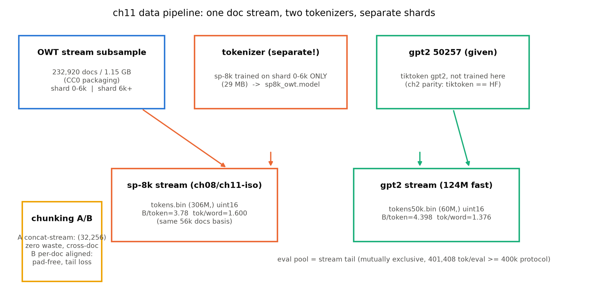
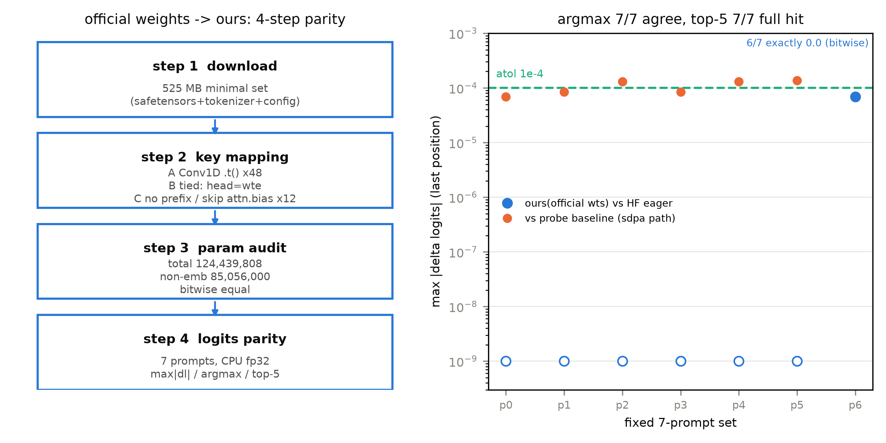
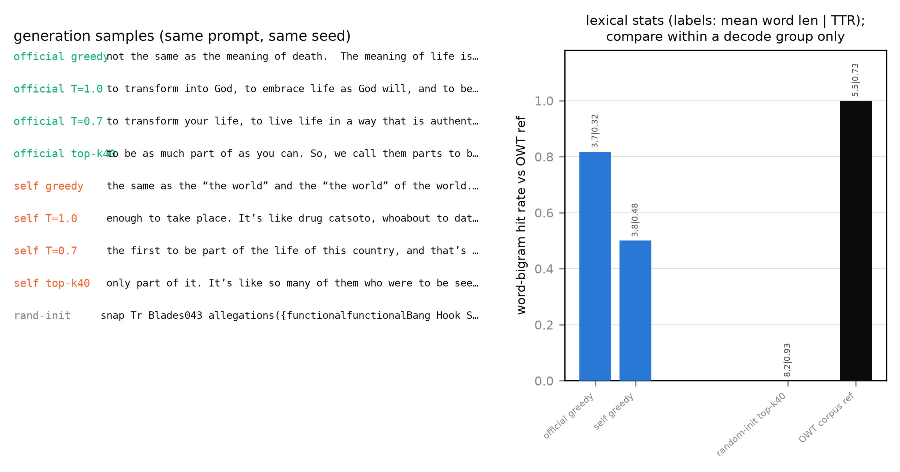
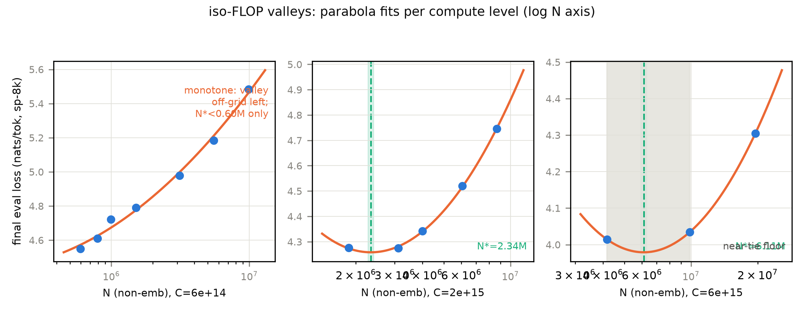
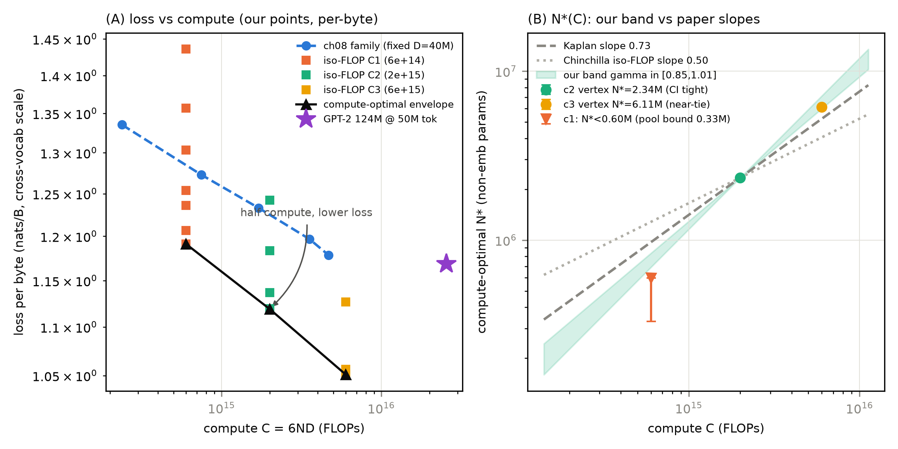

# 第 11 章 大项目 II：数据、权重与损失-算力曲线

## 11.0 开篇：从全书到这里

上一章我们把机器造出来了：三插槽 Block 的 124M，参数逐位对上官方 124,439,808，随机权重与 HF 实现逐位相同，冒烟曲线从 $\ln 50257$ 附近健康起步。但它至今吃的还是 1MB 的莎翁——第 10 章末尾的结语已经替本章点了名：「喂真数据、对官方权重、看真曲线，损失-算力图上把我们自己的点画进 Kaplan 与 Chinchilla 的坐标系，是大项目 II 的三件正事」。这三件事正好对应本章的三条产线：数据管道把 OpenWebText 的 1.15GB 真语料变成一次通过的训练流（11.1 节）；官方权重对拍用四步把「我们造的机器」与「OpenAI 训出的那台机器」接通（11.2 节）；然后机器点火，50M token 的 fast 档曲线加一张 15 点的 iso-FLOP 网格，让第 8 章纸面上的定律在自己机器上显形（11.4 节）。

与第 10 章的「凭什么相信机器是对的」对应，本章要回答的问题是：**「我造的这台机器喂真数据训出来的曲线，凭什么能和论文里的定律对话？」**对话需要双方说同一种语言——参数口径（6ND 非嵌入）、算力单位（FLOPs 与 PF-days）、损失口径（per-byte，跨词表的唯一合法标尺）、以及「谷底怎么报」的诚实纪律。第 8 章我们已经吃过口径的亏（日程倒挂差点写进正文），本章把这些纪律全部前置到实验设计里，最后在 11.6 节收拢成本册的「诚实条款」——它规定了一台 ≈6 TFLOPs 的笔记本电脑，「训成」一台 GPT-2 的标准是什么。

> **最小背景栏**：四处前置，均已教过。①第 8 章全部：幂律式 (8.1)/(8.5)、Chinchilla 三种方法中的 iso-FLOP 轮廓（8.3 节）、读曲线四问（8.6 节）——本章曲线是那章的兑现；②第 9 章 9.3 节换算盒（$C\approx 6ND$、PF-days）；③第 10 章的机器与预算：`model.py` 是 11.2 对拍官方权重的正主、表 10.2 兑现于 11.4、键映射三高危点已在 10.2 节预演——一句依赖链的诚实声明：11.4 的训练产线（`train_124m.py`/`iso_flop.py`，及 11.3 采样的自训侧）为与第 8 章族**严格同协议**（同 b32×s256、warmup 200、49 固定窗 eval），沿用 ch04 参数化 GPT 工厂并延伸 ch10 循环的配方自备循环，并不 import ch10 的 `train.py`；两套实现同构，且同过 124,439,808/85,056,000 两条 assert（「一厂五户」的代码史见 12.5 节图 12.2）；④token↔word 困惑度换算在本章 11.1 节内以换算盒自建。

## 11.1 数据管道：真语料的三道工序

机器要吃真数据，第一道工序是选语料。第 8 章族实验已经把选型做完：tiny shakespeare 只够热身（第 10 章 80 遍背谱的教训），正式训练需要「一次通过」量级——约 250M token。落点是 **OpenWebText 子采样 1.15GB**（232,920 篇 / 1,119.6MB，`00-feasibility/08_owt_subsample.py` 流式抓取）。选它有三层理由：许可是全部候选里最干净的（打包层 CC0，HF 卡片明载 cc0-1.0——原文版权各自保留，这里「干净」只指再分发权）；它是 WebText 的社区复刻，GPT-2 血统最正；量级恰好（全量 38GB 太重，1.15GB ≈307M token 覆盖第 8 章全族加本章全部实验还有余）。血统里有个口径值得钉死：WebText 原版 = 「Reddit 上 karma ≥ 3 的全部外链」【证据等级：官方论文 GPT-2 §2.1】；OpenWebText 的 karma 管道说法出自其 GitHub 项目自述，HF 卡片本身未载明 karma 细节——它是「管道与 URL 集的复刻」，不是逐字节同一数据【证据等级：第三方复刻（GitHub 自述），卡片核验 2026-10】。顺带一句 GPT-2 论文自己的记忆化检查：他们对 WebText 与各测试集做过 8-gram 重叠分析，重叠均值 3.2%【证据等级：官方论文 §4】——「模型是在背还是在学」的担忧从那个年代就有，我们的一次通过纪律（下文）是同一担忧的工程回应。

第二道工序是**分词器分片分离**。第 8 章冒烟档的教训（分词器与 LM 语料同源、28 万 token 跑 32 遍、拟合 $r^2$ 只有 0.43）换来一条写进运行元数据的纪律：sp-8k 分词器只在独立的 6000 篇 / 29MB 分片上训练，LM 主语料自第 6001 篇开始——两段互斥。本章第二套编码（官方口径的 50257 词表，tiktoken gpt2）不训练分词器、直接使用官方词表（第 2 章已对拍 tiktoken≡HF，B 级），同一文档流按原顺序重编码出 60M token 的 gpt2 流（训练实际消费首 50.0M，一次通过），流末尾留 600,000 token 作 eval 池，与训练段间隔约 9.4M token 互斥。eval 协议全书同款：固定种子 49 窗 × 8192 = 401,408 token、fp32 前向——这个数不是拍出来的，是第 8 章在本语料上实测逐 token 标准差 2.50 反推的（$\mathrm{se}=2.50/\sqrt{401{,}408}=0.0039<0.005$），iso 网格与 124M 曲线全部沿用【证据等级：本书实验（`log/book2-ch08/tok_std.json`）】。

第三道工序是**块化**：一篇篇文档怎么变成 $(B,n)=(32,256)$ 的训练窗？图 11.1 把三道工序画成一张管道图。块化有两种切法，教学点就藏在差异里。**法 A（GPT-2 拼接流，全书与官方同口径）**：文档间插入 EOS/EOT 后扁平拼接成一条长流，按 256 定长切窗——窗**可以跨文档边界**。**法 B（文档边界对齐）**：每篇独立切窗、末窗不足 256 丢弃。取前 2000 篇实测对比【证据等级：本书实验（`data.py step_chunking`，2026-10）】：法 A 得 9,940 窗、利用率 ≈100%（余料仅流末不足一窗的 42 token）、其中约 20%（1,986 窗）跨文档边界；法 B 得 8,949 窗、利用率 90.03%、丢弃尾料 253,738 token（平均每篇约 127 token）。法 A 的「跨边界」不是缺陷而是设计：拼接流里模型「看见」的边界就是 `…Wolf/Wired UK] Red Dwarf has been [EOS] 下一篇…` 这样的序列（实测首个交界的 id 序列 `[359, 4425, 7107, 7077, 1232, 2760, 7109, 2, 2603, …]`，`2` 即 EOS），EOT 既是分隔符也是教材——模型顺带学会「文档到此为止、换主题该断则断」。法 B 窗内纯单文档、无此学习压力，代价是每篇约 127 token 的平均尾料。官方预训练选 A，我们也选 A；B 留在这里作对照，是为了让你在「干净的数据格式」与「零浪费的吞吐」之间能算出这笔账。

图 11.1 ch11 数据管道（自绘）：一条 OWT 文档流、两套词表、分词器分片与 LM 语料分离；两条 uint16 编码流（sp-8k 306M token 供 ch08/ch11-iso 网格，gpt2-50257 60M token 供 124M fast）；换算系数为同一批 56,000 篇文档上的实测（表内数字【本书实验（2026-10）】）；块化两法与 eval 池协议见正文

最后一道小工序是**换算盒**。我们的损失是 nats/token，但社区几十年的语言模型传统报 word-level 困惑度（WikiText 系基准），两边对话需要一架桥。设总负对数似然为 $S$、token 数 $n_t$、词数 $n_w$，则

$$
\ln \mathrm{PPL}_{word} \;=\; \frac{S}{n_w} \;=\; \frac{n_t}{n_w}\cdot\ln \mathrm{PPL}_{token}
\tag{11.1}
$$

| 符号 | 含义 | 取值 / 口径 |
|---|---|---|
| $\mathrm{PPL}_{token}$ | token 级困惑度 $=e^{L}$ | 标量；$L$=nats/token |
| $\mathrm{PPL}_{word}$ | word 级困惑度（社区传统口径） | 标量 |
| $n_t/n_w$ | 每 word 的 token 数 | 随词表与语料浮动，**必须实测** |

用人话说：**每个词平均被切成 $n_t/n_w$ 个 token，token 级的「每次犹疑」连乘 $n_t/n_w$ 次，就是词级的犹疑**。这个系数不是常数，它在同一批文档（前 56,000 篇）上实测：gpt2 词表（50257）为 **1.376 token/word**（4.398 B/token），sp-8k（8192）为 **1.600 token/word**（3.782 B/token）【证据等级：本书实验（`data.py step_conversion`，2026-10）】——词表越大、单 token 承载越多、系数越小。同是「token PPL 100」，在两套词表下换算出的 word PPL 差 $100^{1.600}/100^{1.376}\approx 2.8$ 倍，跨词表比绝对 PPL 就是这么出的事故。着陆坐标取 WikiText-2（CC BY-SA，卡片文本 4.0 与 metadata 3.0+GFDL 双标不一致，保守起见只落 `log/` 不随书分发、引用时注明二者）：在本语料 valid 上 gpt2 的系数实测 1.156，我们顺手用 200 万训练词数了 word 级计数基线——unigram 困惑度 **1800.6**、计数插值 bigram **1304.1**（教学级实现：OOV 记 `<unk>` 回退、bigram 用 $\gamma=5$ 计数插值，非 SOTA；WikiText-2 只有 200 万训练词、valid 的 OOV 率 3.36%，计数模型在这个语料上先天贫血）【证据等级：本书实验（`data.py step_wikitext2`，2026-10）】。这两个数给 word 级坐标系立了两根界桩：只认词频的模型在千级，多看一个词的上下文能降三成——11.3 节我们自己的模型换算过来落在这根轴上的什么位置，届时回头看。

## 11.2 官方权重对拍四步：把「我们的机器」接到「他们的机器」上

数据就位，先办一件更要紧的事：把 OpenAI 训好的官方权重搬进我们手写的 `model.py`。第 10 章的验收②用**随机权重**证明了两个实现的前向数学等价，但那只说明「图纸相同」；图纸相同不等于「我们拥有官方训出来的那台机器」——只有当官方权重经过我们的键映射搬进手写模型后输出逐位复现，两条产线才算接通。全程四步，脚本 `official_gpt2.py`，全部 CPU fp32【证据等级：本书实验（`log/book2-ch11/official_parity.json`，2026-10）】。

**第一步：下载最小文件集。**HF 仓 `openai-community/gpt2` 全仓 26 个文件约 1.6GB——里面 TF/Flax/Rust/ONNX 四种重复权重格式，只取 PyTorch 必需集：`model.safetensors` 522.7MB + 分词器与配置 2.7MB，**合计 525.4MB**。两条下载实录值得入书：未鉴名下载实测出现过两次挂起（调研期 bert 262MB 处与 gpt2 辅助 blob 处各一次，重试即恢复，中断残留 `*.incomplete` 需清理）【证据等级：本书调研实测（2026-10-02）】；权重许可是 Modified MIT——商用完整，相对 MIT 仅三条生成内容附加条款（完整口径已在第 4 章 4.2 节 staged release 处钉死），随书提供加载脚本与对照数字没有障碍。

**第二步：键映射，三高危点的正片。**checkpoint 是 160 个键的 safetensors，进我们模型要过三道坎，第 10 章在随机权重上排练过，这次是带真权重的实操：**坎 A（Conv1D 转置）**——HF 的 Conv1D 权重是 (in,out) 排布（`addmm` 语义），`nn.Linear` 是 (out,in)（$xW^\top+b$ 语义），四处投影权重共 **48 处转置**（12 块 × c_attn/c_fc/c_proj(mlp)/c_proj(attn)）；其中 `attn.c_proj` 是 (768,768) 方阵，忘了转置**不报错、静默输出垃圾**——最阴的一处，验收只能靠 logits 对拍兜底。**坎 B（tied 缺键）**——checkpoint 只存 `wte` 一份，160 键里根本没有 `lm_head`，加载时须显式补绑 `head.weight = wte.weight`（第 4 章手术④的工程面）。**坎 C（无前缀）**——raw checkpoint 顶层键没有 `transformer.` 前缀（OpenAI TF 转换遗产），`h.{i}` 改名 `blocks.{i}`，另有 12 个 `h.{i}.attn.bias` 遗留 causal-mask buffer 要跳过（v5 已废弃持久化，我们的 mask 本就是 `persistent=False`）。160 − 12 = **148 键映射完成，`strict=True` 加载无缺键无多键**。

**第三步：参数逐项对账。**逐组清点 checkpoint 张量并与表 10.1 的手算账对上（表 11.1）。加载后逐键 `torch.equal` 全部为 True——权重搬运是拷贝，必须逐位相同。

**表 11.1** 官方权重对账与 logits 对拍（CPU fp32，transformers 5.18.0 / tiktoken 0.14.0，2026-10）【证据等级：本书实验（`official_gpt2.py`，`log/book2-ch11/official_parity.json`）】

| 项 | 数值 | 判定 |
|---|---|---|
| checkpoint 键数 → 映射后 | 160 → 148（跳过 12 个 attn.bias） | strict 加载通过 |
| Conv1D 转置 | 48 处（attn.c_proj 方阵在内） | 逐位 torch.equal ✓ |
| wte / wpe | 38,597,376 / 786,432 | 与表 10.1 逐位一致 |
| 12 × Block + ln_f | 85,054,464 + 1,536 | 同上 |
| 总参 / 非嵌入（6ND） | **124,439,808 / 85,056,000** | assert 通过 |
| max\|Δlogits\|（vs HF eager，7 prompt） | **0.0（6/7）**；6.9×10⁻⁵（p6） | 全部 ≪ atol 10⁻⁴ |
| argmax 一致率 / top-5 全命中率 | 7/7 / 7/7 | 通过 |
| max\|Δlogits\|（vs 探针基线，sdpa 路径） | 6.9×10⁻⁵ ~ 1.4×10⁻⁴ | 见正文口径注 |

**第四步：固定 7-prompt logits 对拍。**7 条 prompt 覆盖短事实 / 重复诱导 / 长段落 / 德语 / 代码 / 算术 / 单字符（token 长度 1~31），两侧同输入（$(1,n)$ 进、$(1,n,50257)$ 出、取末位 $(50257,)$）比 max|Δ|。结果比预期更硬：**六条 prompt 的 max|Δlogits| 严格为 0.0**，唯一非零的单字符 prompt 差 $6.9\times10^{-5}$（单 token 前向的浮点求和顺序差量级）；argmax 一致 7/7、top-5 全命中 7/7【证据等级：本书实验（CPU，2026-10）】。这里还藏着一个口径课：与探针基线（2026-10-02 存盘，走 transformers 默认 sdpa 注意力路径）的最大差是 $1.4\times10^{-4}$——**注意力实现路径（sdpa vs eager）的实测差比静态源码调研预估的「1e-6 量级」大两个数量级**，图 11.2 右侧把它们画在同一把对数尺上。教训归入第 7 章立的口径自觉清单：对拍数值前先对齐的不只是精度，还有算子的实现路径。

图 11.2 对拍四步流程与结果（自产）：左=四步流程（下载 525.4MB / 键映射三高危点 / 逐项对账 / 7-prompt 对拍）；右=逐 prompt max|Δlogits|（对数尺）——蓝色实心=手写加载官方权重 vs HF eager（6/7 严格为 0，画在 10⁻⁹ 地板），橙色=vs 探针基线（sdpa 路径，实测差 7×10⁻⁵~1.4×10⁻⁴，大于静态预估两个数量级）；青色虚线=验收阈值 atol 10⁻⁴【证据等级：本书实验（CPU fp32，2026-10）】

对拍过了，顺手做两条生成 sanity——它们是后面 11.3 节的预告，也是两则现成教例。教例一：`The capital of France is`，贪心续写是 **" the capital of the French Republic, and the capital of the French Republic is the capital of the French…"**——复读机式的循环；而 " Paris" 只以 p=0.032 排在 top-5 第 5 位（第 1 位是 " the"，p=0.085）。教例二：`2 + 2 = 4, 3 + 3 = 6, 4 + 4 =`，下一 token **" 8" 概率 0.361**（次位 " 7" p=0.198）——答对了？贪心再往下写：**" 8, 5 + 5 = 10, 6 + 6 = 12, 7 + 7 = 15,"**——$7+7=15$。模型续写的不是算术，是「数列的模式感」：前几行确实都成立，它学会的是 `n + n = 2n` 的表面规律加一点点计数，到 7 就露馅。两则教例合起来说明同一件事：**124M 的 GPT-2 是一台统计续写机，不是知识库，更不是计算器**——贪心解码把它的「局部最优」锁死成复读，这直接引出下一节的采样；而「模式伪装成能力」的口径课，第 7 章的指标整流器已经上过，这里给你看实物。

## 11.3 采样生成：让分布开口说话

贪心每步都取 argmax，为什么反而写出最差的文本？因为语言建模的本质是输出一个分布，argmax 只取分布的峰值——当模型对下文没有强信念时（峰值概率只有 0.03-0.08），峰值往往是最平庸的词（" the"），而「平庸 × 平庸」连乘就是复读。让分布开口说话要靠采样：**temperature** 把 logits 除以 $T$ 再 softmax——$T<1$ 放大差异（更保守）、$T>1$ 压平分布（更跳脱）、$T\to0$ 退化为贪心；**top-k** 先截断只留概率前 $k$ 个、再在截断集内重归一化采样——长尾里那些「一次都没该出现」的怪词被直接请出局。参数出处照纪律标注：k=40 是 GPT-2 自己的默认——论文附录图 5 题注与表 7-12 题注均写 "Top-k random sampling with $k = 40$"（摘要实验用 k=2 是特例）【证据等级：官方论文（GPT-2 PDF 附录题注）】；截断-重归一化方案出自 Fan 等【证据等级：官方论文 1805.04833】。本节只借方法不深讲——解码策略的系统拆解（为何截断、截多少、与搜索的关系）归推理册的经营。生成实现是全书「全量重算」口径：每生成一个 token 重跑整段前向（$ids\,(1,n)\to logits\,(1,n,V)$，取末位 $(V,)$，采样、拼接、再来），第 10 章已声明这是本册的边界。代价算给你看：40 token 的 top-k 续写在 CPU 上实测 1.2 s——每一步都把整段 prompt 白算一遍，生成长度的平方级浪费；这个「省下的工程」正是推理册要赚的第一笔大钱，本册先把笨办法的账摆在这里。

同一 prompt（`The meaning of life is`）、同一固定种子，四种解码各写 40 token，官方权重与自训模型（50M token fast 档，训练同配同种子复跑并保留权重；复跑终值 5.1428，与 11.4 节的 5.1390 差 0.004——同种子重跑的 MPS 非确定性量级，如实登记）并排，外加一台随机初始化的 124M 作「出厂状态」对照——样例收进图 11.3 左栏。肉眼先看三行代表：官方贪心写出 " not the same as the meaning of death.\n\nThe meaning of life is not the same as…"——**官方权重贪心也会复读**，只不过它的复读是整句整句的高档复读（型例比低到 0.32）；官方 T=1.0 采样立刻活过来，写出一小段神学色彩的论辩；自训 50M 的 T=1.0 样例是 " enough to take place. It's like drug catsoto, whoabout to date bymetal people…"——**词是真词、搭配半通半不通**；随机初始化则是 "snap Tr Blades043 allegations({functionalfunctionalBang…"——彻底的子词汤。肉眼之外用**词法统计**定量（诚实条款的验收口径：词长、空格率、型例比、对语料 bigram 的命中率），图 11.3 右栏。

图 11.3 采样对照（自产）：左=同一 prompt 四种解码 × {官方, 自训 50M} 的续写照录（含随机初始化对照，官方=青、自训=橙、随机=灰）；右=续写的词法统计——词级 bigram 对 OWT 参考集的命中率，柱上标注「平均词长|型例比」，按解码分组着色（同组内可比、跨组不可比，见正文）【证据等级：本书实验（CPU 采样/MPS bf16 训练，2026-10，`log/book2-ch11/sampling.json`）】

数字把肉眼结论钉死【证据等级：本书实验（CPU 采样，2026-10，`log/book2-ch11/sampling.json`）】。最能分档的是 bigram 命中率——续写里相邻词对能在 OWT 参考集（前 2,000 篇的词 bigram 全集）里找到的比例，贪心档排成干净的阶梯：**官方 0.818、自训 0.500、随机初始化 0.000**——50M token 的训练让「词与词怎么接」的命中率从零拉到一半，官方的充分训练再拉到八成。词的形态学同向：随机初始化的平均词长 8.21、空格率 0.105（未训练的分布很少采样出带前导空格的 token，字符都黏成一坨），自训 3.81/0.196、语料参照 5.48/0.151——自训模型的词长与空格节奏已经落进真语的区间。两个诚实的注脚。其一，每行续写只约 30 个 bigram，命中率的末位有 ±0.1 量级的单样本噪声——这些数字当「量级与排序」读，不当千分位读。其二，也是更有意思的一课：**解码参数对词法统计的影响不小于模型好坏**——官方 T=1.0 的命中率掉到 0.375（从完整分布采样会走进语料里没有的搭配），自训 T=0.7 却高达 0.821（锐化把采样压回高频搭配）——单看这两个数会得出「自训比官方好」的荒唐结论。词法统计对照必须**同解码配对**：图 11.3 右栏每种解码内部官方/自训/随机三列可比，解码之间不可比。顺带一个惊喜：自训模型的 top-k=40 样例（"…they wanted to know what was just the truth to the human world."）读起来竟相当顺——截断把欠训练模型的噪声尾巴剪掉了，看起来比它实际的能力更好；「看起来通顺」与「分布学得好」是两件事，这在读任何模型 demo 时都值得默念一遍。

采样对照还送了一份数字给 11.1 节的换算盒：自训模型在 WikiText-2 valid 上的 token 损失实测 **6.821 nats/token**（fp32、24 窗×256 token），乘上该语料的 gpt2 系数 1.156，word PPL $=e^{1.156\times6.821}\approx$ **2,660**【证据等级：本书实验（MPS fp32，2026-10）】。这个落点要带着两句诚实注脚读。其一，这是**跨语料**评测——Reddit 风的 OWT 上训练、维基文风的 WikiText-2 上考试，域差一口吃掉约 1.7 nat/token（OWT 上 5.14，这里 6.82），数值只作换算演示。其二，把它放回 11.1 节那两根界桩旁边：word 级 unigram 1,800、bigram 1,304（都在 WikiText-2 **本域**上数的频次）——**我们这台 124M 变压器，在别人的语料上输给了本域的计数模型**。参数多四个数量级、训练少六个数量级加域差，后两者赢了：绝对数字的比试从来不是「模型 vs 模型」，而是「模型×数据×训练量」的三元组对撞——这也是「不与官方比绝对 PPL」条款的又一层含义；而那道换算本身（式 (11.1)）随时可逆，任何 word 级数字除以实测系数就能回到 token 级，前提是你知道它在哪套词表、哪份语料上量的。

## 11.4 损失-算力曲线：ch8 的定律在本机显形

管道通了对拍过了，本节是全册的核心产出：**自家机器 + 自家数据 + 自家网格，把「花更多钱买多少智能」画成自己测出来的曲线**。数据分三层，一层比一层接近论文的坐标系。

**第一层：124M 的 50M token 真曲线。**第 10 章表 10.2 第三行的兑现：50257 官方词表重编码的 OWT 流、b32×s256（8,192 token/步）、warmup 200 + 余弦 $10^{-3}\to10^{-4}$、bf16 训练 / fp32 eval，6,104 步 = 50,003,968 token **一次通过零重复**。三组数字先过自检：初始 loss **10.9513**（$\ln 50257=10.8248+0.126$，式 (10.3) 的预言第三次咬合——冒烟档 10.97、热身档 4.30 之后）；eval 轨迹 13 个点从 6.4145 单调降到 **5.13903**，无回弹（train/eval 末差 0.022 nat，方向正常）；wall **78.9 min**（纯训练 0.726 s/步、11,283 token/s），MPS 峰值 3.5 GiB（3,625 MiB，allocator 轮询口径）≪ 37.4 GiB 上限【证据等级：本书实验（MPS bf16/fp32，2026-10，`log/book2-ch11/train124_fast.json`）】。有效算力按 6ND 口径：$6\times85{,}056{,}000\times50{,}003{,}968/\text{s}\approx$ **5.76 TFLOPs**——调研期「本机 ≈6 TFLOPs」的锚点在此兑现，这个数就是诚实条款的分母。曲线形状也验了幂律：整条轨迹拟合 $L=B\,D^{-\beta}$ 得 $\beta=0.0907$、$r^2=0.994$（E 自由拟合再次把不可约项压到 0——第 8 章「支撑域不足则地板不可辨识」的教学点在此复现）。但引用红线同 JSON 挂账：**这是单条余弦退火轨迹上的幂律，早期点在高学习率下、末点在退火末端，与 Kaplan/Chinchilla 固定学习率大网格的 $L(D)$ 不是同一对象**——只作「幂律形态在退火轨迹上仍成立」的描述，禁止当 scaling 指数与文献并列。换算示例留给读者一道口算：token PPL $=e^{5.139}\approx170.6$——每个 token 还在约 171 个候选里犹疑（第 10 章热身档「每字符 4.7 选」的同款读法），word PPL $=e^{1.376\times5.139}\approx1{,}178$（11.1 节换算盒的直接应用）。

**第二层：iso-FLOP 网格——Chinchilla §3.2 的缩小版。**单条曲线只回答「这台机器学得多快」，要回答「这笔钱该怎么花」需要网格。设计照抄第 8 章 8.3 节方法二：固定一档总算力 $C$，档内扫不同 $N$，数据量由 iso-FLOP 约束（式 (11.2)）决定

$$
D \;=\; \frac{C}{6N}
\tag{11.2}
$$

（$C$=FLOPs 名义值；$N$=非嵌入参数；$D$=该点训练 token 数。用人话说：**算力固定时，模型买大点、数据就得买少点——每个点都是同一笔钱的一种花法**）。三档 $C\in\{6\times10^{14},\,2\times10^{15},\,6\times10^{15}\}$（×3.33 递增），中间档加密到 5 点，共 15 点（全表见 表 11.2），全部 $N\le$19.5M、$D\le$239.5M ≤306M 训练池（一次通过纪律不破）。配方与全族统一：b32×s256、warmup 200（第 8 章倒挂教训的正式修正）、AdamW(0.9,0.95,wd 0.1)+clip 1.0、bf16/fp32、49 固定窗 eval——且 **eval 窗集与第 8 章逐位相同**，两章数字可以画进同一张图。一段实验实录也值得照实记下：初版网格按第 8 章 Kaplan 曲线的走势把各档谷底预设在了偏大的 N，C1 档实测整条单调降之后，连续四次自适应补小点（1.5M→1M→0.79M→0.60M）并把 C2/C3 整体下移——**谷底的位置是测出来的不是设计出来的**，最终 15 点超出设计书的 3×3=9，总机时 216 min【证据等级：本书实验（MPS bf16/fp32，2026-10，`log/book2-ch11/iso_flop.json`）】。

**表 11.2** iso-FLOP 网格 15 点全表（N=非嵌入参数实数；D=C/6N 取整后反报，名义 C 偏差 ≤0.04%；eval=终步 401,408 token fp32；末位分辨率 ±0.005）【证据等级：本书实验（2026-10，`iso_flop.json`）】

| 点 | (层数,维度,头数) | N 非嵌入 | D (token) | 步数 | eval 终值 |
|---|---|---|---|---|---|
| c1g | 3L×128×2 | 595,072 | 168,050,688 | 20,514 | **4.5498** |
| c1f | 4L×128×2 | 793,344 | 126,050,304 | 15,387 | 4.6096 |
| c1e | 5L×128×2 | 991,616 | 100,843,520 | 12,310 | 4.7216 |
| c1d | 6L×144×2 | 1,504,512 | 66,469,888 | 8,114 | 4.7904 |
| c1a | 7L×192×3 | 3,114,432 | 32,112,640 | 3,920 | 4.9790 |
| c1b | 7L×256×4 | 5,528,832 | 18,087,936 | 2,208 | 5.1833 |
| c1c | 8L×320×5 | 9,864,320 | 10,133,504 | 1,237 | 5.4844 |
| c2a | 6L×160×2 | 1,856,000 | 179,601,408 | 21,924 | **4.2757** |
| c2b | 7L×192×3 | 3,114,432 | 107,028,480 | 13,065 | **4.2750** |
| c2c | 9L×192×3 | 4,004,160 | 83,247,104 | 10,162 | 4.3425 |
| c2d | 10L×224×4 | 6,050,688 | 55,091,200 | 6,725 | 4.5207 |
| c2e | 11L×256×4 | 8,687,872 | 38,371,328 | 4,684 | 4.7457 |
| c3a | 8L×208×4 | 4,175,392 | 239,501,312 | 29,236 | **4.0141** |
| c3b | 8L×320×5 | 9,864,320 | 101,376,000 | 12,375 | 4.0343 |
| c3c | 11L×384×6 | 19,519,872 | 51,232,768 | 6,254 | 4.3044 |

三档三条曲线，三种形态（图 11.4），每种形态教一课。**C1 档整条单调降**——把 N 从 9.86M 一路缩到 0.60M，loss 一路降到底（4.5498 仍是最优），谷底滑出网格左沿。此时的抛物线顶点（外推给 116k）是**拟合伪影，严禁引用**：留一法敏感性检验显示顶点随剔除点在 0.3k-250k 间摆动——数量级级的摆动本身就是「外推失败」的诊断信号。该档只准报界：$N^*<595{,}072$（上界=实测最优），下界由一次通过池硬约束 $N\ge C/(6\times306\text{M})=327\text{k}$——真谷底在 $(0.33\text{M},\,0.60\text{M})$ 之间或更低。这是「读曲线先问支撑域」（8.6 节二问）的又一次现场执行。**C2 档是教科书级 U 形**：五点先降后升，谷底 $N^*=2.34\text{M}$，bootstrap 95% CI [2.27M, 2.40M] 收得极紧，留一法稳定（2.04-2.38M）——谷底被网格稳稳兜住，这是全网格最可靠的一个锚点。**C3 档是近平局**：c3a(4.18M)=4.0141 与 c3b(9.86M)=4.0343 只差 0.020 nat（约 5 倍 eval 标准误），抛物线顶点 6.11M 落在这段平底的区间内——「顶点在网格内」不等于「谷底被两侧兜住」，三点档的拟合 CI 几乎全部由假设的噪声驱动，图 11.4 把这段平底画成阴影：它的真实含义是「$C=6\times10^{15}$ 时最优 N 在 4-10M 之间的某处，再细分就是噪声的领地」。顺带一笔吞吐账：15 点的有效算力（6ND 口径）从 c1g 的 0.91 TFLOPs 爬到 c3c 的 5.26 TFLOPs——模型越小越被每步的固定启动开销拖累，与第 8 章族同形态；对照 11.4 节第一层 124M 的 5.76 TFLOPs，本机吞吐的天花板就在 6 TF 附近，这正是诚实条款的分母。

图 11.4 iso-FLOP 三档谷底拟合（自产，log N 横轴）：C1 单调降、谷在界外（只报 $N^*<0.60\text{M}$ 与池下界 0.33M）；C2 干净 U 形、$N^*=2.34\text{M}$ CI 紧（青色阴影带）；C3 近平局（灰色底纹=c3a-c3b 的 0.020 nat 平底，顶点位置中等可靠）【证据等级：本书实验（MPS bf16/fp32 eval，2026-10）】

**第三层：斜率与论文坐标系。**把三档的 $N^*$ 连起来问「算力涨十倍，最优模型该涨几倍」，就是 compute-optimal 斜率

$$
\gamma \;=\; \frac{d\log N^*}{d\log C}
\tag{11.3}
$$

（标量；用人话说：**双对数坐标里最优花钱路径的倾斜度——Kaplan 说 0.73（模型涨得快），Chinchilla 说 0.50（等比）**）。式 (11.3) 要拿 $N^*$ 当输入，而我们的三档里 C1 只能给界，于是按锚点可靠度报三种口径：全档 argmin（实测最优点的斜率，$N^*\le$argmin 故这是**斜率的下界**）=0.855；in-grid 顶点两档（最可靠锚点）=0.874；混合口径（低档取上界、高档取顶点，**斜率的上界**）=1.014。诚实写法是 band：

$$
\gamma \in [0.85,\ 1.01]
$$

（若 C1 真谷底滑到池下界 0.33M，上探 1.27。）与文献对照必须只作**同型对照**：我们的 $\gamma$ 高于 Kaplan 的 0.73、更高于 Chinchilla iso-FLOP 法的 0.49/0.51【证据等级：官方论文 2001.08361 v1 §6.1/Table 5；2203.15556 v1 §3.2/Table 2（引用复核清单警-4/警-2 已复核）】——但不能写成「复现」或「推翻」：本实验的 C 只跨 1 个数量级（三档 ×3.33）、模型 $\le$19.5M（微尺度）、语料与词表自成一系，且有两个如实挂账的混淆——各点总步数 ∝D（1,237-29,236 步），余弦日程各自退火到自身终点，形状跨点不严格一致（Chinchilla 的 iso-FLOP 同型局限）；也未逐点调学习率（Kaplan/Chinchilla 各档调过），小 N 点因日程更长或有系统性小优势、方向上把谷底往左推。在这个口径内，读数本身有明确的机制叙事：**微尺度下「数据富余、算力稀缺」，最优策略是算力优先买参数**——旁证是最优 token/param 比随算力骤降：C1 >282:1、C2 60.9:1、C3 26.8:1，从「疯狂喂数据」一路奔向 Chinchilla 大算力口径的 ~20:1（表 3 比值 20-21、外推约 24——按精确表述引用）。$\gamma$ 在更大算力会不会变平向 0.5 收敛？本实验动态范围不足以下结论，这正是「点态 band」而非「定律」的原因。顺带一个对照素材：in-grid 两档顶点损失的外推幂律 $L^*\propto C^{-0.062}$，与 Kaplan 大尺度的 $\alpha_C^{\min}\approx0.050$ 同数量级（口径不同，不比大小）。

网格里还埋着本章最强的一组叙事数字。第 8 章的 Kaplan 单曲线实验是「固定 D=40M 堆 N」，顶点 20m（N=19.5M）花算力 $4.68\times10^{15}$ 拿到 4.5013；本章 iso 网格的 c2a（N=1.86M、D=179.6M）花算力 $2.00\times10^{15}$——**不到一半——拿到 4.2757，低 0.23 nat**【证据等级：本书实验，同分词器同 eval 窗集，直接可比】。注意口径：这不是同算力对照（c2a 的 C 更小），写法是「不到一半的算力反而更好」。它把第 8 章 8.4 节的纸面审判变成了实测实锤：**在自家机器上，Chinchilla 式的花法赢了 Kaplan 式的花法**——同预算下「模型别太大、数据喂到够」的路线在微尺度同样成立。mini 版的判决，与 70B/1.4T 打穿 280B/300B 是同一个道理。

最后把全部自家点送进论文坐标系——第 9 章换算盒的兑现，图 11.5。纵轴用 per-byte 损失（$L_{tok}/(B/\text{token})$，跨词表的唯一合法标尺：sp-8k 除以 3.82、gpt2 除以 4.398），横轴 $C=6ND$ FLOPs。15 个网格点、第 8 章 5 点、124M 的 fast 点同图；右图把 $N^*(C)$ 的 band 与两条文献斜率并排。PF-days 换算：iso 网格 15 点合计 $3.7\times10^{-4}$ PF-days，加第 8 章族 $1.3\times10^{-4}$，自家全部网格合计 $5.0\times10^{-4}$；124M 一跑 $2.95\times10^{-4}$ PF-days——GPT-3（$3.64\times10^3$ PF-days）的约 $8\times10^{-8}$（GPT-3 约为它的 1200 万倍，与第 8 章族「两千九百万分之一」同型句式）。我们仍然住在论文坐标系的左下角，但**坐标是同一套**。

图 11.5 损失-算力曲线（自产，本册招牌图）。左图 per-byte 损失 vs 算力（log-log）：蓝色虚线=第 8 章 Kaplan 族（固定 D=40M，各点仅 N 变）【本书实验（MPS，2026-10）】；三色方块=iso-FLOP 三档（同 C 不同 N 的竖列）；黑色三角连线=各档谷点的 compute-optimal 包络；紫色星=124M@50M。右图 $N^*(C)$：青色带=本书 band $\gamma\in[0.85,1.01]$（c2/c3 顶点+CI，c1 只报界）；灰色虚线/点线=文献斜率（Kaplan 0.73、Chinchilla iso-FLOP 0.50——**仅斜率取自文献、截距平移至本实验 c2 锚点**【证据等级：官方论文 2001.08361 v1 Table 5 / 2203.15556 v1 §3.2】），两条线与本实验点均为【本书实验（MPS，2026-10）】——混排图双源标注，比较的是方向不是位置

星标那颗点还藏着一个「自证」：把 iso 网格自己的标尺外推到 124M 一跑的算力 $C=2.55\times10^{16}$，compute-optimal 应在 $N^*\approx21\text{-}26\text{M}$、$D^*\approx160\text{-}200\text{M}$（$D:N\approx6\text{-}10:1$）——而我们实际用的是 N=85.06M、D=50M：**官方 124M 架构在 50M token 预算下比最优大 3.2-4 倍、每参数只喂 0.6 个 token，严重欠数据**。两个旁证对上：其一，它的 per-byte 损失 1.1686 只比 20m 点（N=19.5M、D=40M）的 1.1784 低 0.8%——4.3 倍的参数只换来不到 1% 的改善，因为瓶颈根本不在参数；其二，这恰是 Chinchilla 判 GPT-3「significantly undertrained」的微缩重演（GPT-3 每参数 1.7 个 token 对处方 20-21，我们的 fast 档 0.6 对 6-10——同一病症，小两个数量级的剂量）。第 8 章章末那句「等比处方的第一个照方抓药者要到下一册」，在这里先领到了自家的体检报告。

## 11.5 ICL 探针：124M 档的上下文学习（选做）

第 7 章立 ICL 现象时留了个尾巴（7.2 节预告）：在我们自己手里的官方权重上，few-shot 到底表现如何？本节用本地前向做三个小探针（不调任何外部 API——冻结纪律），zero-shot 与 few-shot 并排，贪心解码，实录收进表 11.3。

**表 11.3** ICL 探针三任务实录（官方权重本地前向，贪心解码；p=末位 top-1 token 概率；续写=贪心再写 8 token）【证据等级：本书实验（CPU，2026-10，`log/book2-ch11/sampling.json`）】

| 任务 | zero-shot | few-shot | 判读 |
|---|---|---|---|
| 首都问答 | **" Rome"**（p=0.157） | **" Rome"**（p=0.443） | 两档都对；示范把置信度抬高近 3 倍 |
| 反义词 | " cold"（p=0.163）✓ | " big"（p=0.317）✗ | few-shot 反而复读题面 |
| 英译法 | " cheese"（p=0.120）✗ | " from"（p=0.023）△ | 抄到示范答案 fromage 的首 token，第二个 token 即断 |

三个任务把 few-shot 能力拆成了两层。**格式先验层是灵的**：首都任务里，三条示范把 Rome 的概率从 0.157 抬到 0.443，而 few-shot 续写不止答完就停——模型自发接出 "The capital of Spain is Madrid"，**自己换国家续填模板，新答案还是对的**（Madrid 藏在权重里，模板把它激活了出来）；反义词任务答错之后，8-token 续写也在往 "The opposite of cold…" 的模板上接。**内容映射层是哑的**：反义词的「大→小」这种需要推理的对应关系，示范喂了三条它仍复读题面（"The opposite of big is" → " big"）；翻译任务它只想抄最近一条示范里 cheese 的答案（" from" 是 fromage 的第一个 token，概率只有 0.023，下一个 token 就断了）。

合起来的读数很诚实，也和第 7 章的现象学对上了：**124M 档的 GPT-2，「示范教格式」已经灵了（置信度抬升、模板自发泛化），「示范教关系」还不行（反义与翻译的映射学不动）**。这不是我们探针设计得差：第 7 章表 7.1 的谱系里，GPT-2 124M 是 GPT-3 家族八个规格的爷爷辈，而 GPT-3 自己的 LAMBADA 86.4、TriviaQA 71.2 都要到十亿上百亿参数才长出来【证据等级：官方论文 2005.14165 v4 §3.1.2/§3.2（第 7 章 7.2 节已核）】。few-shot 能力随规模增长的曲线在 124M 处刚离开地板——我们在自己机器上摸到了这条曲线的地面端，也给第 7 章那句「few-shot 越大越快」补上了最小刻度上的一枚实测点。

## 11.6 训成标准：诚实条款

三条产线走完，可以给「大项目训成了吗」一个正式的回答。先把条款立起来（本册写作前置任务定稿，各项细节随后文逐句兑现）：

> **诚实条款（compute-limited 演示口径）**：本机（M5 Pro，MPS bf16）对 124M 模型的有效算力实测 ≈6 TFLOPs（6ND 口径）；训练 1 亿 token 需 ≈2.3 小时。GPT-2 原始训练的官方算力消耗未随论文公布（常见复述为多 GPU 数周量级，属二手转述、未核），与本机相差多个数量级。因此本项目的「训成」标准是**趋势与结构复现**而非绝对指标：损失-算力曲线呈幂律并可与第 8 章拟合衔接；官方权重对拍验证架构实现的正确性；随机初始化自训模型只要求 loss 曲线健康与生成文本具备词法统计特征，不与官方模型比绝对 PPL。

逐句用本章的实测兑现。**「≈6 TFLOPs」**：实测 5.76 TFLOPs（11.4 节）——它把「能训多大」的物理边界画死了：50M token 79 分钟，100M token 过夜，GPT-2 官方量级（未披露，二手转述为多 GPU 数周）差多个数量级，这不是「差一点」，是差一个世界。**「损失-算力曲线呈幂律并衔接 ch8」**：124M 轨迹 $\beta=0.0907$、$r^2=0.994$（退火轨迹口径的描述性引用），per-byte 1.1686 与 ch8 族 1.1784 在同一标尺上衔接；iso 网格的 U 形与斜率 band 把「衔接」从单点升级为结构。**「对拍验证正确性」**：表 11.1 全绿——参数逐位、148 键 strict、logits 6/7 严格为零。**「生成具备词法统计特征」**：图 11.3 的定量行——贪心档 bigram 命中率自训 0.50、随机初始化 0.00、官方 0.82，词长 3.81 / 8.21 / 3.68（语料参照 5.48）——自训模型的词法已落进真语区间、离官方的搭配功力还很远，恰好是「趋势与结构」的定义。**「不与官方比绝对 PPL」**：官方模型是在我们没见过的 WebText 全量上训出来的，语料不同、词表同源但分布不同，任何绝对值对比都是口径事故——要比，比 11.5 节那种「同 prompt 同解码」的定性对照，或比结构性的东西（初始 loss、幂律形状、U 形谷底）。

条款背后是一句更一般的话，也是本册从第 1 章贯穿到这里的口径自觉的收口：**复现有两个层次——复现「数字」需要同量级的资源，复现「结构与趋势」只需要一台笔记本电脑和诚实的实验设计**。大项目 II 交付的是第二层次，而第二层次恰恰是第一层次的预习：哪天你真的拿到千卡集群，iso-FLOP 网格怎么设计、谷底怎么报界、日程与学习率的混淆怎么挂账——这套纪律一分钱算力都不要，但它决定那笔大钱花得对不对。

## 11.7 本章小结

开篇的问题——自家机器的曲线凭什么与论文对话——答案分三份。数据管道交出一条一次通过的真语料流和一架 token↔word 换算盒（1.376/1.600 实测系数，WikiText-2 word 级界桩 1800/1300）；对拍四步把官方权重接进手写模型（148 键 strict、48 处转置、logits 6/7 逐位为零、argmax/top-5 全中）；曲线三层——124M 的 50M token 轨迹（5.14 nat/token、5.76 TFLOPs、幂律 $r^2=0.994$）、15 点 iso-FLOP 网格（C2 干净 U 形谷底 2.34M、C1 报界不报点）、斜率 band $\gamma\in[0.85,1.01]$ 与文献的同型对照（Kaplan 0.73 / Chinchilla 0.50）——外加两组叙事数字：c2a 用不到一半算力赢过第 8 章顶点 0.23 nat，官方 124M 架构在 50M 预算下偏离自家最优 3-4 倍。

**带走的心智**：忘掉具体数字，请留下两件。第一件是**「谷底三问」**：任何一条声称最优配比的曲线，先问谷底被网格兜住了吗（C2 兜住了、C1 没有）、报的是点还是界（我们报 $N^*<0.60\text{M}$ 不报 116k）、两个口径的包络在哪（$\gamma$ 的 band 就是三口径的诚实区间）——这套问法对论文里的曲线同样生效，Chinchilla 与 Kaplan 的分歧里一半就是这些问题的不同答案。第二件是**诚实条款的一般式**：「训成」的定义必须与资源匹配——资源差几个数量级时，把验收押在趋势与结构上（幂律形状、对拍通过、词法特征），而不是押在绝对数字上；这不是退而求其次，而是把「复现结构」当成一门独立的、可以做得非常严格的手艺。带着这两件，你以后读任何 scaling 论文、跑任何预算受限的实验，都有一个可执行的核对清单。

镜头拉回全书：机器造完（第 10 章）、数据喂过、曲线画完（本章），本册的四段旅程只剩最后一站——把范式三物种的账全部摊开，写 decoder-only 胜出的判决书（第 12 章）。到那时，本章这条自己测出来的曲线会成为判决书里的一号证物：定律不是论文的馈赠，是可以亲手重做的实验。

## 11.8 动手验证（本章代码与实验清单）

- 数据管道核账 + 两种块化 + 换算盒 + WikiText-2 基线（约 3 min，含 WT2 下载）：`source env.sh && python "[`code/ch11/data.py`](code/ch11/data.py)"`——应打印拼接流 20% 跨文档窗、法 B 利用率 90.03%、gpt2 1.376 / sp-8k 1.600 token/word
- 对拍四步（CPU 约 1 min，权重已缓存）：`python "[`code/ch11/official_gpt2.py`](code/ch11/official_gpt2.py)"`——应打印 148 键 strict、六项 assert 全真、max|Δ|=0.0（6/7）与两条 sanity 生成
- 采样对照 + ICL 探针（自训复跑 6104 步约 80 min MPS；已有 `self124m.pt` 时加 `--skip-train` 秒级出采样件）：`python "[`code/ch11/sample.py`](code/ch11/sample.py)"`
- 损失-算力曲线汇编与出图 11.4（谷底三联）/图 11.5（招牌曲线，秒级，读现成 JSON）：`python "[`code/ch11/scaling_curve.py`](code/ch11/scaling_curve.py)"`
- 复现 iso 网格（~3.6 h，断点续跑安全）：`python "[`code/ch11/iso_flop.py`](code/ch11/iso_flop.py)"`（先 `--smoke` 2 min 冒烟；`--analyze-only` 秒级重算拟合）
- 复现 124M fast（~1.3 h，首跑自动执行 50257 重编码 15 s）：`python "[`code/ch11/train_124m.py`](code/ch11/train_124m.py)"`
- 验收点：能否不看书画出对拍四步并说出三高危点各自的失败模式（转置方阵静默错 / tied 缺键 / 前缀剥除）；能否解释为什么 C1 档只准报界、γ 必须引 band；能否用换算盒把 5.14 nat/token 换算成 word PPL 并说出系数为什么要实测
- 变式实验（选做）：把 `sample.py --train-steps` 降到 1500 重训一个更欠训练的自训模型，看词法统计各指标如何随训练量向语料参照行靠拢；或把 `iso_flop.py` 的 C2 档网格左右各去掉一点重跑 `--analyze-only`，看谷底 CI 如何变宽——支撑域的体感

> **【欠账】** 本章 11.5 节在官方权重上摸到了 few-shot 的地面端——「无梯度更新却像学了一样」这个现象的能力侧（指令遵循、推理范式、test-time compute）见 **Book5 第 10 章**；它的长 prompt 在服务侧的经济学（前缀缓存）见 **Book6 第 6 章**（第 7 章 7.2/7.3 节立桩，此处收线）。
