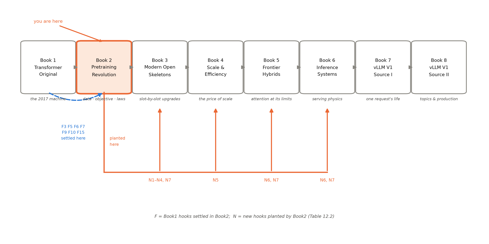
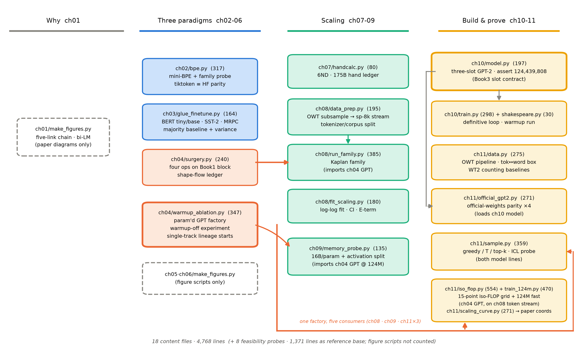

# 第 12 章 收束：decoder-only 的胜出与本册欠账

## 12.0 开篇：从全书到这里

上一章的结尾替本章点了名：「镜头拉回全书：机器造完（第 10 章）、数据喂过、曲线画完（本章），本册的四段旅程只剩最后一站——把范式三物种的账全部摊开，写 decoder-only 胜出的判决书（第 12 章）。到那时，本章这条自己测出来的曲线会成为判决书里的一号证物：定律不是论文的馈赠，是可以亲手重做的实验。」（第 11 章 11.7 节，直引）现在就到这一站。机器在手、曲线在册、三物种的证据链分藏在第 3-6 章——本章把它们全部摊上法庭。

这是全书的「总-下」，要回答三个问题。其一，**范式判决**：2018 到 2020 年间看不出胜负的三种范式（理解半塔、生成单塔、双塔回环），为什么到 2022 年，十亿参数以上的旗舰清一色是 decoder-only——GPT-3、Gopher 与 Chinchilla、PaLM、OPT，无一例外？判决必须带证据链与边界条件，否则它只是一句时髦话。其二，**两笔大账**：本册欠账总账的最后两笔——上下文长度与推理成本——为什么刻意「留而不还」，它们的正式去处在哪里。其三，**资产清点**：合上这本书，你实际带走了哪些代码、哪些判断力、哪些通往后续各册的钩子。第 12 章没有新实验、没有新机器，它是一册书的对账页——也是你出发去下一册前的装备清单。

> **最小背景栏**：本章没有新的前置知识，只调用已教内容——三种架构的掩码表与目标函数（第 3-5 章）、T5 的受控消融与 10% 桥税（第 5 章表 5.1 与 5.4 节）、GPT-3 的 few-shot 数字（第 7 章）、Scaling Laws 的口径纪律（第 8 章）、自家 iso-FLOP 网格（第 11 章表 11.2）。唯一首次登场的是终局判决的定量证据（Wang 等 2022，arXiv:2204.05832，2022-04——冻结点内），它的实验设计（架构三档×目标三档、算力对齐、T0 训练混合）在第 5 章 5.4 节已经预告过半，此处只补上最后几组数字。

## 12.1 范式判决书：decoder-only 为什么赢了

先看案卷。2019 年的观察者有充分理由相信双塔才是未来：T5 用原典双塔拿下 24 个任务中的 18 个 SOTA（第 5 章），受控对照里（共享参数档、参数-算力双对齐）显式交叉注意力值约 1 分；BERT 的微调生态统治理解侧。而 GPT-2 的 zero-shot 赌注看起来输了一半——摘要 ROUGE-1 只有 29.34、离专用系统差一个身位，1BW 上 42.16 对基线 21.8 仍输【证据等级：官方论文（GPT-2 PDF）§3，第 4 章已核】。三年后风向彻底倒转，判决书必须解释这个反转，而不是跳过它。

**呈堂证据是一张 2022 年的受控大对照**。BigScience 的 Wang 等人（作者名单里有 T5 的 Roberts 与 Raffel——写桥的人回头验自己的桥，第 5 章 5.4 节已介绍）把架构三档（因果解码器 causal decoder；非因果解码器 non-causal decoder，即前缀语言模型；编码器-解码器 encoder-decoder）与目标三档（全序列自回归 FLM；前缀 LM 目标 PLM；掩码重建 MLM，T5 式跨度损坏）组成六种组合，同数据（各 168B token 的 C4）、同算力训练，然后**分两种用法评测**：纯 zero-shot 直接考，和加一轮多任务指令微调（multitask finetuning, MTF——用的正是 T0 训练混合、13B token，第 5 章 5.5 节的多任务路线）之后再考【证据等级：官方论文 2204.05832 v1 §3.1-3.4】。设定一的判决干净利落：**纯 zero-shot 下因果解码器最强**——EAI-Eval 平均 44.2，高于非因果解码器的 43.5 与编码器-解码器的 39.9；T0-Eval 同向（42.4 对 41.8 与 41.7——编码器-解码器恰好压在随机基线上，是最刺眼的一行）【证据等级：官方论文 2204.05832 v1 §4.1 Table 3 与 §3.4（随机基线 32.9/41.7；论文内部两值并存——附录 D Table 5 底行与 Table 6 题注印 33.3，Table 3/8 印 32.9，本书取与所引数字同表的 32.9）】。设定二立刻给出边界：**加 13B token 的 MTF 之后排序反转，编码器-解码器+MLM 反超到 51.3/60.6，压过因果解码器的 50.4/51.4**【证据等级：官方论文 2204.05832 v1 附录 E.2 Table 8】。这份判决书必须原样带边界引用：**decoder-only 的胜出成立于「无监督预训练后不再动权重」的用法**；一旦允许指令微调，双塔+去噪目标反超——而且反转幅度在 T0-Eval（+9.2 分）远大于 EAI-Eval（+0.9 分），因为 T0 评测的任务族恰好在 MTF 训练混合里，谁微调过谁占便宜。判词里还有一处力度要如实标注：因果解码器对**非因果解码器**的优势其实不足 1 分（44.2 对 43.5、42.4 对 41.8）——真正拉开的是对编码器-解码器的 4.3 分（EAI-Eval）。所以这份证据精确说的是「带显式桥的双塔在 zero-shot 下最吃亏、纯因果解码器稳定占先」，而不是「因果掩码本身值几分」；把优势的来源（桥的税与参数翻倍）和优势的幅度分开读，是引用这份判决的第二个纪律。

为什么领域最终站到了设定一这边？把第 3-6 章的机制证据摆成一条链就清楚了。第一环是**接口**：BERT 每个任务一个头、GPT-1 每任务一套输入变换、T5 靠任务前缀加微调——三者里只有 decoder-only 的「给上文、续下文」把任务说明本身也折叠进了序列（第 4 章手术①），于是它天然长在 zero-shot/few-shot 这条用法上；GPT-3 把这条接口兑现成了 LAMBADA 86.4、TriviaQA 71.2 的 few-shot 成绩（第 7 章），第 11 章 11.5 节我们又在官方权重上亲手摸到它的地面端——124M 档「示范教格式」已经灵了。第二环是**训练效率**：自回归目标让序列里每个 token 都出力（FLM 约 100% token 参与损失），MLM 的损失只落在约 18% 的 token 上（输入侧腐蚀 15%、目标侧含哨兵平均 18%）【证据等级：官方论文 2204.05832 v1 §3.2】——同样 168B token 喂下去，decoder-only 的每一 bit 语料都变成了「接话」的训练信号。第三环是**经济学**：交叉注意力这座桥要收税——同算力下编码器-解码器必须堆 11.0B 参数对 decoder-only 的 4.8B（参数与内存翻倍），每序列推理还要多付约 10% 计算【证据等级：官方论文 2204.05832 v1 §3.1 与 Table 1】；第 4 章在 124M 档算过同一笔账的零头——拆桥省 ≈28.4M 接口税（4.4 节）。三环合起来，判决理由可以写成一句话：**胜出的是接口，不只是架构**——因果解码器的全序列「接话」接口在「预训练一次、免微调服务一切」的用法下同时占了接口、训练效率与账本三个便宜；领域选择了不微调的用法（因为微调每个任务都要钱、要数据、要部署一套权重），架构的胜负只是这个选择的下游。证据链五环汇总于表 12.1。

**表 12.1** 范式判决证据链（自排；各行为同一问题的不同侧面，读时先看设定再读数字）

| # | 证据（设定） | 关键数字 | 读法 | 证据等级 |
|---|---|---|---|---|
| 1 | T5 受控消融（2019，微调范式） | 共享参数双塔 82.81 > 前缀 LM 81.82 > 因果 LM 74.70（P/M 双对齐档） | 微调范式内，显式桥值约 1 分（82.81 是共享参数档；不共享的双塔基线为 83.28）——「双塔没死」的第 5 章结论原样成立 | 官方论文 1910.10683 v4 §3.2.2（第 5 章表 5.1 已引） |
| 2 | 架构×目标网格（2022，纯 zero-shot） | 因果解码器 44.2/42.4 最强；编码器-解码器 39.9，T0-Eval 41.7=随机基线 | 不动权重的用法下 decoder-only 胜出 | 官方论文 2204.05832 v1 §4.1 Table 3、附录 D Table 5 |
| 3 | 同网格加 MTF（2022，指令微调） | ED-MLM 51.3/60.6 反超 CD-FLM 50.4/51.4 | 判决的边界条件：允许微调则答案翻转 | 官方论文 2204.05832 v1 附录 E.2 Table 8 |
| 4 | 桥的账本（同算力对齐） | 4.8B 对 11.0B 参数；每序列 ≈10% 计算税；124M 档拆桥省 28.4M | 胜出方的经济学：无桥、无税、全序列出力 | 官方论文 2204.05832 v1 §3.1/Table 1；本书实验（第 4 章 4.4 节账本） |
| 5 | 接口的兑现（2020，few-shot） | LAMBADA 86.4、TriviaQA 71.2；本册 124M 档 ICL 探针「格式先验灵」 | 胜出的不是纸面接口，是被规模养活的接口 | 官方论文 2005.14165 v4 §3（第 7 章已核）；本书实验（第 11 章 11.5 节） |

第 11 章许诺的「一号证物」在这里呈堂。表 12.1 的第 4 行是判决的经济学，而本册自己的 iso-FLOP 网格恰好给「经济学裁决一切」上过一节实训课：同分词器同 eval 窗集下，iso-FLOP 谷点 c2a（N=1.86M、D=179.6M）用 $2.00\times10^{15}$ FLOPs 拿到 4.2757，好于第 8 章 Kaplan 族顶点 20m（N=19.5M、D=40M）花 $4.68\times10^{15}$ 才拿到的 4.5013——不到一半的算力反而更好【证据等级：本书实验（MPS bf16/fp32，2026-10，`log/book2-ch11/iso_flop.json`；口径：非同算力对照，见第 11 章 11.4 节）】。范式之争与 scaling 之争是同一堂课的两次开课：**答案都不在「哪个架构/哪个花法绝对更优」，而在「这笔钱、这种用法下哪个更优」**——第 8 章的口径纪律，原封不动地适用于范式判决。

边界条件不是判决的脚注，它自己也是一条产业线索。MTF 反转预告了编码器-解码器在指令微调生态里的长期生命力——做这组实验的 BigScience 阵营，其 T0 本身就是双塔底座，同期的 FLAN 走的也是「微调解锁任务」的路线（2022 年视角一句带过，机制归 Book5 的后训练链）；而同一篇论文的第五节还给了一条务实的折中：**一份底座、两种用途**——先训因果解码器+FLM，需要指令微调时再做一次非因果 MLM 适配（实验里收敛加速最高 9.1 倍），流水线 CD-FLM(168B)→ND-MLM(51B)→MTF 最终拿到 52.3/54.9，两头都不落【证据等级：官方论文 2204.05832 v1 §5、Table 8/Figure 7】。你看，连判决的赢家阵营自己都在保留改装的口子——「带边界的判决」在工程上的意思是：底座按胜出方造，但别把双塔的路拆死。

判决书收尾，把 F9 的谱系合龙。这条线从 Book1 埋到今天，五站首尾相衔：**2017 年双塔出厂**——交叉注意力作为三种注意力角色之一装在翻译机上（Book1 第 4 章）；**2018 年半塔×2**——BERT 留下编码塔（第一触点，第 3 章）、GPT-1 留下解码塔，两个半塔都没把桥带走；**2019 年折叠蓝图**——GPT-2 单塔「用而不论」地把任务折叠进序列（论文无删除宣言——第 4 章的措辞纪律），T5 则给出折叠的机械定义：前缀 LM=共享双塔、把交叉注意力换成全序列 full attention，只改一张掩码表（第 5 章 5.4 节）；**2020 年存续**——T5 用双塔拿冠军，受控对照证明桥还在挣饭吃，「折叠不是进化的必然方向」；**2022 年终局**——受控网格给出带边界的定量判决：zero-shot 范式下单塔胜出、桥有 10% 税，而指令微调范式里双塔复活。回头看，2019 年的折叠不是一次天才的删除，而是 2017-2022 年间同一道选择题（「桥还要不要」）被反复重答后的落定——答案由用法决定，用法由规模与成本决定。折叠思想的更远后世（检索与注意力本体的改造）已登记在 Book5 第 10 章，此处不展开。

## 12.2 四段旅程回望：每段带走的心智

判决落地，旅程可以倒带。导览 0.4 节把本册画成四段，现在每段收一句总账——它们与各章小结的表述同源，此处只留最粗的一层。

**第一段：范式为什么（第 1 章）。**五环论证链从「标注数据不够了」出发：静态词向量证明考题可以自造，ELMo 把表示升到词例级，ULMFiT 交付微调配方，GPT-1/BERT 焊上 Transformer 底座。带走的心智：**监督信号可以从语料里自造——把文本的一部分当考题、另一部分当答案；范式史的每一步都是被局限逼出来的，不是被灵感领出来的。**

**第二段：范式三物种（第 2-6 章）。**分词器把任意文本变成 id（第 2 章），三种「架构×目标」组合各自成物种：BERT 的双向掩码重建（第 3 章）、GPT 的因果预测（第 4 章）、T5 的双塔跨度损坏（第 5 章），RoBERTa 证明不动架构、只改配方的复跑能走多远（第 6 章）。带走的心智：**一张掩码表决定模型看哪个方向，一个损失函数决定它练什么能力——物种的分化在目标不在骨架；而胜负的读法全在口径：对齐的是参数还是算力、一次动了几个变量、配方吃没吃足。**

**第三段：规模化（第 7-9 章）。**GPT-3 把参数拧到 175B 并交出上下文学习这个范式级现象（第 7 章）；Scaling Laws 把「花更多钱买多少智能」写成幂律与等比处方的对垒（第 8 章）；工程账本把定律落到显存、算力与训练病历（第 9 章）。带走的心智：**指标是台整流器（读能力断言先问口径）、scaling 曲线是实验设计的函数不是大自然的裸照片（每张答案卡背面印着口径条款）、训练显存是 16 bytes/参数的地板加活的弹幕**——外加三个随身常数：每参数 16 bytes、每参数每 token 6 次浮点、1 PF-day $=8.64\times10^{19}$ FLOPs。

**第四段：造机与收束（第 10-12 章）。**验收先于实现——参数逐位 124,439,808、随机权重与 HF 逐位相同、冒烟从 $\ln 50257$ 健康起步（第 10 章）；喂真数据、对官方权重、把自家点画进论文坐标系，以诚实条款定义「训成」（第 11 章）；最后摊开判决与欠账（本章）。带走的心智：**「我怎么知道它对了」先于「它跑起来了没」；资源差几个数量级时，把验收押在趋势与结构上（幂律形状、对拍通过、谷底三问），这是复现的一门独立手艺。**

四段连起来正好回答导览的问题「把互联网灌进这台机器会发生什么」：先说清为什么非灌不可，再配齐灌法的三块拼图，然后把「灌多少」变成可计算的定律，最后亲手灌一次。导览 0.5 节还许诺过三条贯穿线索，此处一并收线：**代码线**从第 2 章的自写 BPE 长到第 11 章的曲线脚本，一台机器逐步长成（细账见 12.5 节图 12.2）；**伏笔线**七笔旧账全清、七笔新钩埋定（细账见 12.4 节表 12.2）；**一本账**从第 4 章的 124M 逐项账本、第 7 章的 175B 手算，记到第 9 章的 16 bytes/参数与 PF-days、第 11 章的 5.76 TFLOPs 本机分母——参数、算力、数据三栏在每一章都在进账。三条线在第四段收拢成同一个物件：一台你知道每一颗螺丝价钱、验过每一次改装的机器。四段的章末小结各自存了细账，迷路时按段回看即可。

## 12.3 两笔大账登记：上下文长度与推理成本

本册欠账总账（导览表 0.2）里，七笔 Book1 旧账（F3/F5/F6/F7/F9/F10/F15）已在前十一章逐一回收，本章只剩最后一笔 F10 要正式登记——以及它连带的另一笔账。这两笔的共性是：**它们不是「没讲到」，是「留了不还」**——解法在 2022 年之后才长成，属于推理时代，本册只负责把借据誊清楚。

**第一笔：上下文长度（F10）。**Book1 第 1 章的欠账句原文：「注意力的发明本来就是为了打破容量的墙；七年后墙换成了上下文长度，武器换成了外推与压缩，但战斗是同一场。」现在把「墙」的具体位置量出来。本册主线上下文长度是一条硬上限链：GPT-1 的 512、GPT-2 的 1024（§2.3 原文 "increase the context size from 512 to 1024"，第 4 章表 4.2 已核）、GPT-3 的 2048（"All models use a context window of $n_{ctx}=2048$ tokens"）【证据等级：官方论文 GPT-2 PDF §2.3；2005.14165 v4 §2.1，均直引】。上限为什么是「出厂设定」？因为学习式位置编码是一张 $1024\times768$ 的查表（第 4 章手术③）——查表行数在预训练时定死，加上训练窗本身只见过 1024 以内的序列，预训练结束的那一刻，这台机器能看多远就焊死了：训练时的窗口之外，模型一寸也看不见（Book1 第 11 章的判语）。而且实际的上限常常比铭牌更小：真正生效的是「查表行数」与「训练窗」的较小者——第 11 章我们自己的 124M fast 档就是现成例子，查表仍是 1024 行、训练窗却只有 256（b32×s256 口径），模型只「见过」前 256 个位置【证据等级：本书实验（MPS bf16，2026-10，`log/book2-ch11/train124_fast.json`；11.4 节 b32×s256 口径）】。铭牌写 1024，出厂状态是 256——读任何模型卡上的 $n_{ctx}$，都要多问一句「训练时实际用了多长的窗」。当时为什么不急？Kaplan 附录 D.5 给了时代注脚：损失随上下文中的位置同样按幂律下降，且原话是 "Even modestly sized models trained on $n_{ctx}=8$ can dominate our largest $n_{ctx}=1024$ models on very early tokens"（直译：连用 8 长上下文训练的小模型，都能在很靠前的 token 上打赢我们 1024 档的最大模型）——上下文的收益集中在局部窗口，长上下文对总损失是次要项【证据等级：官方论文 2001.08361 v1 附录 D.5，直引】。在「损失是唯一 KPI」的年代，这道墙不疼；要等模型开始被要求读文档、记对话、看代码库，它才重新成为 2014 年那堵墙。

墙的宽度还要按文字计价——第 2 章埋的钉子在此钉进预算表。token 计数是按词表的，不是按字的：GPT-2 词表下每个汉字约 2 个 token（`北京` 2 字 4 token、`北京清华大学` 6 字 12 token，第 2 章表 2.5 实测）【证据等级：本书实验（tiktoken，2026-10）】。于是同一扇窗两种容量：GPT-2 的 1024 token 约合 744 个英文词（每词 1.376 token，第 11 章换算盒实测），却只合约 512 个汉字；GPT-3 的 2048 约合 1024 个汉字——一篇千字新闻刚好把它填满。「上下文长度是预训练时代的出厂设定」在中文世界还有一层加倍的含义：同样的窗，装下的中文只有英文的一半。这笔账的偿还地址已在 Book1 登记表立档，此处按其口径点名：**工程主线在 Book3 第 7 章**（$2\text{k}\to32\text{k}$ 的外推工程线），**KV 的账本在 Book3 第 6 章开立**（推理侧每多看一个 token 要付什么钱，从那里开始算）；**1M 上下文的收束论在 Book5 第 8 章**（超长上下文的路线之争在第 4 章铺陈）；**缓存经济学与 KV 三线压缩在 Book6 第 6/3 章**。这就是 N7——F10 的接力棒，本册埋下的最后一笔新钩。

**第二笔：推理成本。**训练的钱花一次，推理的钱每个 token 花一次——这笔账的本体在推理册，但本册已经两次预习。第一次在 Book1 第 7 章：因果掩码让训练全并行，却把生成锁死为逐词元串行，每生成一个词元要把整段前缀重过一遍——全量重算的总前向开销约 $\sum_{t=1}^{T}t=\frac{T(T+1)}{2}$ 个词元位置，随生成长度**平方**涨；摊到每个词元、对理想单遍的冗余比 $\frac{T+1}{2}$ 随长度线性涨。第二次在第 11 章 11.3 节：我们全量重算口径的采样器生成 40 个 token 实测 1.2 秒（CPU）——每一步都把 prompt 白算一遍，生成长度的平方级浪费，当时我们说「这个省下的工程正是推理册要赚的第一笔大钱」【证据等级：本书实验（CPU，2026-10，第 11 章 11.3 节）】。两笔账其实是一体两面：上下文长度是「能看多少」的上限，重算是「看一次多少钱」的费率——预训练时代把两者都当常数（出厂设定的窗、全量重算的笨办法），推理时代把两者都变成设计变量。解法的名字与地址按最小披露点名：**缓存与分页的账本（KV 缓存的经济学）自 Book3 第 6 章开立、Book6 第 3/6 章展开；预填充与解码的两阶段拆分、以及「先猜后验」类解码加速，是 Book6 的正题**——机制一个字不提前讲，那是推理册的开场白。

## 12.4 下一册预告：插槽化时代

两笔大账登记完毕，伏笔台账可以总决算。表 12.2 是本册十四笔钩子的完整账目——甲栏七笔 Book1 旧账的回收状态、乙栏七笔新钩的去向，与导览表 0.2 首尾呼应：当时它们是「预告」，现在是「回执」。

**表 12.2** 本册伏笔总账（自排；F=Book1 留下本册回收，N=本册埋设交后册；回收/去向章号按丛书总览 v1.1 与 Book1 登记表 v1.1，后册若调整章序须回表改版）

| # | 钩子（一句话） | 本册处置 | 后续去向 |
|---|---|---|---|
| F3 | 并行化红利：可以规模化的资格 | 第 1 章开场回收；第 8/10-11 章三次兑现（定律定量化、亲手训 124M） | — |
| F7 | BPE 黑盒：借用了三次的工具 | 第 2 章全量回收（三幕，四数字逐个复算钉死） | — |
| F9 | 交叉注意力的折叠 | 第 3/4/5 章三触点 + 本章 12.1 节合龙（五站谱系+终局判决） | 余脉（检索与注意力本体）：Book5 第 10 章 |
| F5 | post-LN 训练不稳：warmup 的病根 | 第 4 章手术②解禁 + 停药实验 | 谱系之争：Book3 第 2 章（即 N1） |
| F6 | 位置编码外推：2017 年的半句承诺 | 第 4 章小回收（1024 位口径交代；Book1 外推实验不可并比） | 主线：Book3 第 4/7 章（即 N2）；Book5 第 8 章 |
| F15 | 权重共享：绑与解的小开关 | 第 4 章手术④回收（账本 31%、解绑 38.6M；BERT 侧回指第 3 章） | Book3 第 5 章（即 N3） |
| F10 | 固定容量→上下文长度 | 本章 12.3 节登记（硬上限链+预算表） | Book3 第 7 章等（即 N7，见 12.3 节点名） |
| N1 | 归一化零件自身的演化史（更简变体与 pre/post 之争） | 第 4 章末埋设 | Book3 第 2 章 |
| N2 | 学习式位置编码的 1024 位之墙（旋转式做法与外推工程） | 第 4 章末埋设 | Book3 第 4 章（原理）/第 7 章（工程） |
| N3 | 「绑与解」在下一代被反悔 | 第 4 章末埋设 | Book3 第 5 章 |
| N4 | 「更少参数、更多数据」的开源第一单 | 第 8 章末埋设 | Book3 第 1 章 |
| N5 | 低精度与训练稳定化的处方 | 第 9 章末埋设 | Book4 第 7 章 |
| N6 | few-shot 现象的能力侧与系统侧 | 第 11 章末埋设 | Book5 第 10 章；Book6 第 6 章 |
| N7 | 上下文长度主线（F10 的接力棒） | 本章 12.3 节埋设 | Book3 第 6/7 章；Book5 第 4/8 章；Book6 第 3/6 章 |

图 12.1 把这张表放上八册地图：你走过的第二站高亮在正中，左侧虚线是已结清的七笔 F 账，右侧的橙色总线是七笔 N 钩流向后册的去向——八册不是八本独立的书，是一张有借有还的账目网。

图 12.1 八册地图（自绘）：丛书八册的阅读路径，Book2《预训练革命》高亮（you are here）；蓝色虚线=Book1 留下的七笔 F 钩在本册结清，橙色总线=本册埋设的 N1-N7 流向 Book3-6（与表 12.2 逐行对应）；钩子章号口径同表 12.2

去下一册之前，把地图说透。你会发现 N1-N4 有一个共同的去处：《现代开源骨架》。这不是巧合——下一册的主角就是你造的这台 124M。第 10 章定版 `model.py` 时立过契约：Block 的拓扑（pre-LN+残差+两插槽次序）本册定版不再动，插槽内部装什么留给下一册逐个改装（10.2 节）。下一册的剧情因此完全在你已知的地图上展开：归一化插槽里的 LayerNorm 会被更简的变体换掉（N1）；入口的 1024 位查表会让位于既相对又可外推的旋转式做法（N2）；出口的绑定会被解开重算账（N3）；而整机选型的 why 来自 LLaMA——第一个照 Chinchilla 等比处方抓药的开源家族，「更少参数、更多数据」（N4，第 8 章章末那句「等比处方的第一个照方抓药者要到下一册」在此兑现）。用一句话说：**你已经会造 2019 年的机器了，下一册把它逐插槽升级到今天**——插槽不换，机器常新（第 10 章的结语，正是下一册的卷首语）。至于 N5 的处方（Book4）、N6 的能力侧（Book5）、两笔大账的偿还（Book3/5/6），都会在各自的地界上等你。

## 12.5 册末清点：代码资产与术语表

最后一节清点两份可带走的资产。

**第一份是代码**——图 12.2 是全书代码资产的总览。正文代码 18 件、合计 4,768 行（另有 8 件可行性探针共 1,371 行作参考底座、各章图脚本不计入）【证据等级：本书统计（`wc -l`，2026-10，批三复核含 ch07 `handcalc.py` 入账）】，按四段旅程排布。这张图里最重要的一条线是橙色的单轨依赖链：第 4 章 `warmup_ablation.py` 的参数化 GPT 工厂（停药实验的副产品）被第 8 章族训练、第 9 章显存探针、第 11 章 iso-FLOP 网格、124M 训练与采样对照的自训侧五处复用——一个工厂养大五个实验；另一条线是第 10 章 `model.py` 的三插槽定版，第 11 章对拍官方权重与随机初始化对照用的就是它。从 Book1 翻译机改装而来的演化在图上是闭环的：Book1 的块实现（第 4 章手术的底座）→ GPT-2 式工厂 → 定版三插槽 → 等待下一册的逐插槽改装。这不是十八个孤立的脚本，是一台机器逐步长成的代码史。

图 12.2 本册代码资产总览（自绘）：四列对应四段旅程（ch01 仅图脚本、ch05/06 同，灰虚线框）；橙色线=ch04 参数化 GPT 工厂的单轨依赖链（一厂五户：ch08/ch09/ch11×3——族训练、显存探针、iso 网格、124M 训练、采样自训侧），灰色肘线=ch10 定版模型对第 11 章对拍与随机初始化对照的供给，青色线=ch08 数据流；框内括号为实测行数（`wc -l`，2026-10）

**第二份是词汇**。汇总第 0-11 章全部术语首现处（按术语获得中英对照与定义处登记，「本书用语」为本册自创、无通行英译），沿 Book1 册末术语表格式列于下方，按首现章排序——它同时是全书索引的骨架。

| 术语 | 英文 | 首现 | 一句话定义 |
|---|---|---|---|
| 预训练 | pre-training | 导览 | 先在海量无标注文本上训练通用能力、再按任务定型的两阶段范式 |
| 微调 | fine-tuning | 导览 | 以预训练权重为初始化、在少量标注数据上继续训练 |
| 分词器 | tokenizer | 导览 | 把任意文本变成整数 id 序列（并可逆）的部件 |
| 掩码语言模型 | masked language model, MLM | 导览 | 遮住部分词例让模型还原的预训练目标（BERT） |
| 因果语言模型 | causal language model | 导览 | 只看过去、逐位预测下一词元的预训练目标（GPT） |
| 跨度损坏 | span corruption | 导览 | 连续遮掉一段再让模型重建的 T5 目标（平均段长 3） |
| 上下文学习 | in-context learning, ICL | 导览 | 不更新权重、把示范写进上下文就让模型照做的用法 |
| 零样本 / 少样本 | zero-shot / few-shot | 导览 | 推理时不给 / 给 K 条示范（权重全程冻结） |
| 规模定律 | scaling laws | 导览 | 损失随参数、数据、算力按幂律变化的定量关系 |
| 涌现 | emergence | 导览 | 小模型没有、大模型跨阈值才出现的能力现象（第 7 章定义与争鸣） |
| 范式三物种 | （本书用语） | 导览 | encoder-only / decoder-only / encoder-decoder 三种架构×目标组合 |
| 差异清单 | （本书用语） | 导览 | 两代机器逐项对照「动了哪、为什么、代价几许」的手术记录单 |
| 插槽 | slot | 导览 | Block 内可替换子层（注意力/前馈）的改装位 |
| 语言模型 | language model, LM | 第 1 章 | 对序列（或下一位词元）算概率的模型——预训练信号的免费来源 |
| 词向量 / 词嵌入 | word vectors / embeddings | 第 1 章 | 每词一张固定维向量的静态表示 |
| 跳字 / 连续词袋 | skip-gram / CBOW | 第 1 章 | word2vec 的两种预测方向（中心词↔上下文） |
| 负采样 | negative sampling | 第 1 章 | 随机抽负例把多分类降成二分类的提速手段 |
| 共现矩阵 | co-occurrence matrix | 第 1 章 | 全语料「词×上下文」计数表（GloVe 的原料） |
| 双向语言模型 | bidirectional LM, bi-LM | 第 1 章 | 前向+后向两个 LM 拼装的上下文表示（ELMo） |
| 自监督 | self-supervised | 第 1 章 | 从语料自身构造考题与答案的训练信号 |
| 灾难性遗忘 | catastrophic forgetting | 第 1 章 | 微调新任务时旧能力大幅退化的现象 |
| 分层学习率微调 | discriminative fine-tuning | 第 1 章 | 每层用不同学习率的微调（ULMFiT 配方件） |
| 渐解冻 | gradual unfreezing | 第 1 章 | 从输出层往输入层逐层解冻的微调（ULMFiT 配方件） |
| 特征法 | feature-based | 第 1 章 | 冻结预训练表示、只训下游头的用法（对照微调法） |
| 五环论证链 | （本书用语） | 第 1 章 | word2vec→GloVe→ELMo→ULMFiT→GPT-1/BERT 的前史递进链 |
| 词元 | token | 第 2 章 | 分词器输出的最小单位（子词/字符/字节） |
| 子词 | subword | 第 2 章 | 词与字符之间的中间切分单位 |
| BPE | byte-pair encoding | 第 2 章 | 字符起步、迭代合并最高频相邻对来生长词表的子词算法 |
| 压缩率 | compression rate | 第 2 章 | 平均每 piece 承载的文本量（口径 A/B/C 三种分子） |
| unk 率 | unk rate | 第 2 章 | 词表外 piece 的占比（必须声明 piece 级口径） |
| 基础符号集 | base symbol set | 第 2 章 | BPE 起步用的最小符号集合（字符或字节） |
| 字节级 BPE | byte-level BPE | 第 2 章 | 基础符号集取 256 字节的 BPE（unk 恒为零） |
| 预分词 | pre-tokenization | 第 2 章 | BPE 合并前先切片段的正则（GPT-2 的空格例外） |
| WordPiece | WordPiece | 第 2 章 | 按似然增益选合并的子词方案（BERT，`##` 记号） |
| SentencePiece | SentencePiece | 第 2 章 | 语言无关的分词工具箱（▁ 表空格） |
| 子词正则 | subword regularization | 第 2 章 | 训练时按 unigram 概率采样多种切分 |
| 碎片化税 | （本书用语） | 第 2 章 | 字节兜底在未见语料上每字多占 piece 的代价 |
| 下一句预测 | next sentence prediction, NSP | 第 3 章 | 判断句对是否相邻的 BERT 第二目标（第 6 章翻案） |
| 困惑度 | perplexity, PPL | 第 3 章 | 每词元犹疑度的指数化读法 $e^L$——跨词表必须换算后才能比 |
| 句对 | sentence pair | 第 3 章 | 两段文本拼进一个序列的 BERT 输入格式 |
| GLUE | GLUE | 第 3 章 | 八项自然语言理解任务的标准合集 |
| 多数类基线 | majority-class baseline | 第 3 章 | 永远猜训练集多数类的下限成绩 |
| GELU | Gaussian Error Linear Unit | 第 3 章 | 用高斯 CDF 近似门控的激活函数（`gelu_new`=tanh 近似版） |
| 任务条件化 | task conditioning | 第 4 章 | GPT-2 的 $p(\text{output}\mid\text{input},\text{task})$：任务说明写进上文 |
| 自然语言提示 | prompt | 第 4 章 | 用自然语言写成的任务说明或示例开头 |
| 前置归一化 | pre-LN | 第 4 章 | LN 挪进残差支路入口的布局（手术②，停药的前提） |
| 绑定嵌入 | tied embeddings | 第 4 章 | 输出投影复用输入嵌入矩阵（手术④，省 31%） |
| 接口税 | （本书用语） | 第 4 章 | 交叉注意力层的参数与计算开销（124M 档 ≈28.4M） |
| 停药实验 | （本书用语） | 第 4 章 | 撤掉 warmup 对照 post-LN/pre-LN 训练稳定性的实验 |
| 分阶段发布 | staged release | 第 4 章 | GPT-2 逐档放出权重的数据政策 |
| 冒烟测试 | smoke test | 第 4 章 | 短步数点火、验证训练循环健康的最小实验 |
| 文本到文本 | text-to-text | 第 5 章 | 一切任务压成「文本进、文本出」的统一接口 |
| 哨兵 | sentinel token | 第 5 章 | 标记被遮跨度边界的专用词元 |
| 前缀语言模型 | prefix language model | 第 5 章 | 前缀全可见、续写段因果的折中架构（折叠的机械蓝图） |
| 算力对齐 | FLOPs-matched | 第 5 章 | 消融时以计算量（而非参数量）对齐的公平口径 |
| C4 | Colossal Clean Crawled Corpus | 第 5 章 | Common Crawl 经十条规则清洗出的 745GB 语料 |
| 规模三花法 | （本书用语） | 第 5 章 | 4× 算力的三种花法：更大模型/更久训练/更多集成 |
| 复跑研究 | replication study | 第 6 章 | 架构冻结、只改配方重训一遍的对照研究（RoBERTa） |
| 动态掩码 | dynamic masking | 第 6 章 | 每次喂入时重新采样掩码模式（对照静态一次性生成） |
| 配方 | recipe | 第 6 章 | 数据、批量、步数、掩码方式等训练侧选择的总称 |
| 混合精度 | mixed precision | 第 6 章 | 低精度算、fp32 存的训练精度方案 |
| 指标整流器 | （本书用语） | 第 7 章 | 非线性/不连续指标把平滑进步剪成阶跃得分的机制图像 |
| 幂律 | power law | 第 8 章 | $y=Ax^{-\alpha}$ 的标度关系（log-log 图上的直线） |
| 非嵌入参数 | non-embedding parameters | 第 8 章 | 扣除嵌入与位置表的参数量（$6ND$ 的 $N$ 口径） |
| 算力最优 | compute-optimal | 第 8 章 | 给定总算力下损失最低的 $(N,D)$ 组合 |
| iso-FLOP 轮廓 | iso-FLOP contours | 第 8 章 | 同算力档内扫 $N$ 得到的 U 形损失曲线（三方法之二） |
| 等比处方 | （本书用语） | 第 8 章 | Chinchilla 的每参数 20-21 token 配比（表 3 比值） |
| 不可约项 | irreducible term, $E$ | 第 8 章 | 参数化拟合中数据熵的地板项（支撑域不足则不可辨识） |
| 临界批次 | critical batch size, $B_{crit}$ | 第 8 章 | 随损失下降而增大的最优批次规模律 |
| 显著欠训练 | significantly undertrained | 第 8 章 | Chinchilla 对每参数 token 数远低于处方者的判词 |
| 支撑域 | support | 第 8 章 | 拟合结论所依据的实测区间——读曲线先问它 |
| 一次通过 | single pass | 第 8 章 | 训练中每个 token 至多消费一次的纪律（防记忆化） |
| 模型状态 | model states | 第 9 章 | 参数+梯度+优化器状态的显存地板（每参数 16 bytes 两口径） |
| 激活 | activations | 第 9 章 | 前向中间量的显存占用（随 $B\cdot n\cdot L$ 线性、$n^2$ 膨胀） |
| 损失缩放 | loss scaling | 第 9 章 | 反向前放大损失防 fp16 梯度下溢（三件套之一） |
| 梯度检查点 | gradient checkpointing | 第 9 章 | 只存少量激活、反向时重算的省显存技术 |
| 损失尖峰 | loss spike | 第 9 章 | 训练中途损失突跳的不稳定现象（PaLM 20 次） |
| PF-days | PF-days | 第 9 章 | 一天 1 PFLOPs 的算力单位（$8.64\times10^{19}$ FLOPs） |
| 验收先于实现 | （本书用语） | 第 10 章 | 先写定机器可判定的验收标准、再写实现的造机姿势 |
| 对拍 | parity check | 第 10 章 | 同输入下两个实现的输出逐位比对的验证法 |
| 换算盒 | （本书用语） | 第 11 章 | token↔word 困惑度互折的实测系数工具 |
| 贪心解码 | greedy decoding | 第 11 章 | 每步取 argmax 的解码（复读机机制的来源） |
| top-k 采样 | top-k sampling | 第 11 章 | 截断到概率前 k 再重归一化采样（k=40 出处 GPT-2 附录） |
| 词法统计 | lexical statistics | 第 11 章 | 词长、空格率、型例比、bigram 命中率的文本指纹 |
| 型例比 | type-token ratio | 第 11 章 | 不重复词数与总词数之比（复读度指标） |
| 损失-算力曲线 | loss-compute curve | 第 11 章 | 把 eval 损失对 $6ND$ 算力画出的幂律曲线 |
| per-byte 损失 | per-byte loss | 第 11 章 | nats/token 除以每 token 字节数——跨词表唯一合法标尺 |
| 谷底三问 | （本书用语） | 第 11 章 | 兜住了吗、报点还是报界、包络在哪——读最优配比曲线的核对单 |
| 诚实条款 | （本书用语） | 第 11 章 | 资源受限时把「训成」定义为趋势与结构复现的验收标准 |

## 12.6 本章小结：合上这本书

开篇的三问，现在逐一交卷。范式判决：decoder-only 的胜出是一份**带边界条件的判决书**——证据链五环（微调范式内双塔最优的 T5 消融、纯 zero-shot 下因果解码器最强、MTF 后反转、桥的 10% 税与翻倍参数账、接口在 few-shot 上的兑现），边界条件一句话：胜出成立于「预训练后不再动权重」的用法，允许指令微调则答案翻转——所以胜出的是接口，不只是架构。两笔大账：上下文长度（512→1024→2048 的出厂设定链、Kaplan D.5 的时代注脚、每汉字约 2 token 的中文预算表）与推理成本（每 token 重算账：总量 $T(T{+}1)/2$ 随长度平方涨、冗余比 $(T{+}1)/2$ 线性涨），都已登记并指向偿还地址（Book3 第 6/7 章、Book5 第 4/8 章、Book6 第 3/6 章）。资产：18 件 4,768 行的单轨代码、一张十四笔钩子的总账、一份八十余条的术语表——以及一个你亲手造过、逐位验过、喂过真数据的 124M。

**带走的心智**（全书级）：如果整册书只允许你带走三件，请带这三件。第一件，**物种由「一张掩码表×一个损失函数」定义，胜负由用法与账本裁决**——看到任何「X 架构碾压 Y」的断言，先问设定（微调还是不微调）、口径（对齐了什么）、账本（谁更便宜）；本册用三种范式、一场 2022 年的受控终审和一次自家 iso-FLOP 网格，把这个问法操练了三遍。第二件，**三本账随身**——参数怎么数（非嵌入口径）、算力怎么算（$C\approx6ND$，每参数每 token 六次浮点）、数据怎么配（每参数 20-21 个 token 的等比处方）：从 124M 到 175B 再到任何未来的模型，预算都能三行手算，而「指数只在它的口径内是定律」的警惕与账本同在。第三件，**复现有两个层次**——复现数字需要同量级资源，复现结构与趋势只需要一台笔记本加诚实的实验设计；「训成」的定义必须与资源匹配，这是你在自己机器上把定律重做一遍之后挣来的判断力。

合上这本书，2022 年的定律停在 2022 年——但那台 124M 不停在 2019 年。它是按「可改装」造的：三插槽的 Block、config 驱动的整机、逐位对过账的参数表——下一册《现代开源骨架》就在你的机器上开工，把归一化、位置编码、绑定开关一个个拔下来换新，再顺着 LLaMA 的账本重排整机。你已经会造 2019 年的机器，也挣到了升级它的全部资格。带上三件心智、一张钩子地图和一台亲手造的机器——下一册见。

## 12.7 动手验证（本章图表与复述自测）

- 复现本章两张图（秒级，CPU）：`source env.sh && python "[`code/ch12/make_figures.py`](code/ch12/make_figures.py)"`——应打印两图保存路径；验收点：图 12.1 中 Book2 高亮、F 虚线自 Book1 汇入、橙色总线四支路与表 12.2 逐行对得上；图 12.2 中橙色单轨线从 ch04 工厂出发连到 ch08/ch09/ch11 的五个消费端（一厂五户）、各框行数与 `wc -l` 实测一致。
- 台账审计（十分钟，对照阅读）：把导览表 0.2 与本章表 12.2 并排逐行对读，核对每笔 F 钩的「本册处置」是否与对应章末欠账框/小结的实际表述一致、每笔 N 钩的埋设章与去向章是否闭合——这套「首尾对账」本身就是这套书的结构课。
- 复述自测（本章验收标准）：①能否不看书画出判决证据链五环并说出边界条件（哪种设定下 encoder-decoder 反超、为什么 T0-Eval 上反转幅度最大）；②能否复述两笔大账各自的一句话本体（出厂设定、每 token 重算）与至少三个偿还地址；③能否说清单轨代码线的「一厂五户」是哪五户、三插槽契约把什么定版、把什么留给下一册。
- 变式（选做）：用第 11 章的换算盒与第 2 章的钉子，算一份你常用文本的上下文预算——同一段中英文在 1024/2048 token 的窗里各占多少、GPT-2 与自训 8k 词表下各切多少 token；体会「上下文长度是按词表计价的」。
