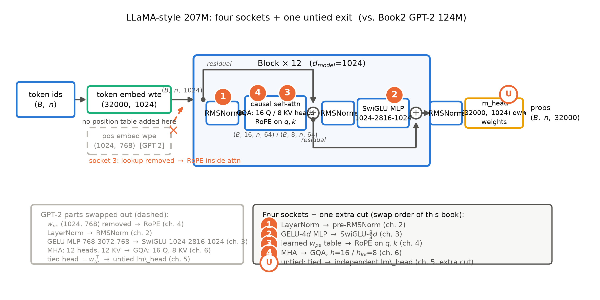

# 导览：把这台机器升级到今天

> 本章无代码、无数值引注——207M、48MiB、1.02M GPU 时这些硬数字都会在后续章节带证据等级重新登场，此处只当路标。带着一个问题读：**从 2019 年的 GPT-2 到今天的开源旗舰，机器到底换了什么？为什么非换不可？**后面十一章都是它的展开。

上一册收束时留了一句重话（Book2 第 12 章 12.4 节）：「你已经会造 2019 年的机器了，下一册把它逐插槽升级到今天」。现在就来兑现这句承诺。但先要问：「今天」从哪一天起算？本册把时钟拨到 2023 年 2 月 27 日——LLaMA1 发布。选这一天做起点，不是因为它发明了什么，恰恰因为**它什么都没发明**：拆开看，归一化是 2019 年的 RMSNorm，前馈是 2020 年的 SwiGLU，位置编码是 2021 年的旋转位置编码（RoPE）——三件零件没有一件是新的，但它们第一次被组装进一台公开权重的大模型，并且好用、可复制。从这一天起，「造模型」的形态变了：**从发明架构，到组装架构**。本册书名里的「现代开源骨架」，指的就是这套被 LLaMA 定型、此后各家只做插槽替换的默认骨架。

这也是「升级」的全部含义：不是重造一台机器，而是在你那台 GPT-2 124M 上换四次零件、再在出入口补一刀。机器的骨架——残差河、Block 拓扑、decoder-only 单塔——一寸不动，这是上一册造机器时就立下的契约（Book2 第 12 章原话：「Block 的拓扑（pre-LN+残差+两插槽次序）本册定版不再动，插槽内部装什么留给下一册逐个改装」）。在八册地图上，这是第三站：Book1 教你机器是什么，Book2 教你机器怎么被喂饱，本册教你机器怎么被一步步升级到今天。本册结束时你站在 2024 年 7 月——Llama 3 的时代，也是 0.6 节那条知识冻结线的位置。

> **最小背景栏**：本册只假设你完整读过 Book1（能徒手写出 2017 年 Transformer：多头注意力与三种角色、因果掩码、post-LN 与 FFN 数据流、正弦位置编码、参数账本——Book1 第 3-7 章）与 Book2（从零造出并训过 GPT-2 124M：四手术、分词器与词表、scaling laws、工程账本——Book2 第 2/4/8/9/10-11 章）。除此之外自包含：每个新组件都先教到「你能凭书稿画出它」再投入使用。

## 0.1 读完这本书，你会拥有什么

先说清目的地。合上这本书时，你会有三样东西：

**第一，一台你自己改装出来的 LLaMA 式 207M 机器，外加一份可重启的设计文档。**注意「改装」二字：底座就是你 Book2 定版的三插槽代码，第 2-6 章逐插槽动刀——归一化、前馈、位置编码、注意力四连，外加出入口解绑的一刀——第 10 章把四章造好的零件 import 进同一台整机，**改装史直接写在 import 语句里**；参数逐位对上 207,119,360 个，点得起火、训得动曲线。而全量长训本身，按本册开工时的一项作者决策不在本机执行（0.6 节详说）——所以随机器一起交付的还有一份达到「重启即可执行」标准的设计文档，凭它在任何一台高算力机器上都能把这件事重新点火。

**第二，四件组件的选型判断力。**RMSNorm、SwiGLU、RoPE、分组查询注意力（GQA，grouped-query attention）——每一件都走完同一条链：它解决什么现实问题、代价是什么、论文怎么验证、你自己在笔记本上跑消融看到什么。读完你应该能回答那个面试式的问题：下一台机器，这个插槽你装不装它？为什么？

**第三，一本 KV 显存账本。**推理时代的第一本账：KV cache（KV 缓存）每个 token 占多少字节、手算的数与实测的数逐字节对上、参数显存恒定而 KV 随上下文长度线性增长的剪刀差。这本账在第 6 章开立之后，「上下文长度」就从发布会上的营销数字，变成你随时能算清的工程量。

还有一样说不成「东西」的东西：心智。半年后你多半记不清 SwiGLU 的隐藏维该乘 $8/3$ 还是 $3/8$，但会留下几个甩不掉的画面——比如「换账本」：2017 年的实验说多头不能砍，2023 年的旗舰把 KV 头砍到八分之一，不是有人错了，是记账的场合从训练场换到了服务场。每章小结都会回答同一个问题：**如果只允许你记住一件事，是什么？**

## 0.2 卷间契约：从 Book2 出发

册与册之间立契约：上一册交出什么、本册新增什么、对已有架构改什么。表 0.1 是本册与 Book1/Book2 的完整契约——迷路时回来看一眼。

| 契约栏 | 明细 | 地址 |
|---|---|---|
| **已知基础**（两册已教，直接指回、不再重教） | 多头注意力与三种注意力角色 | Book1 第 3-4 章 |
| | 因果掩码、整机组装与参数账本 | Book1 第 7 章 |
| | post-LN 与 FFN 的数据流 | Book1 第 6 章 |
| | 正弦位置编码与外推承诺 | Book1 第 5 章 |
| | decoder-only 四手术（单塔/pre-LN/学习式 PE/绑定） | Book2 第 4 章 |
| | 分词器与词表（中文实测、中文预算表） | Book2 第 2/12 章 |
| | Scaling Laws 与等比处方 | Book2 第 8 章 |
| | 预训练工程账本 | Book2 第 9 章 |
| | GPT-2 124M 三插槽实现与训练 | Book2 第 10-11 章 |
| **本册新增** | RMSNorm：归一化零件的演化 | 第 2 章 |
| | SwiGLU：门控前馈与隐藏维的账 | 第 3 章 |
| | RoPE（旋转位置编码，rotary position embedding）深剖 | 第 4 章 |
| | 绑与解、词表三权衡、config 反推架构法 | 第 5 章 |
| | KV cache 账本与 MQA→GQA | 第 6 章 |
| | 外推工程链：PI/NTK/YaRN | 第 7 章 |
| | LLaMA1/2/3 组装与代际 | 第 8 章 |
| | 无论文模型怎么读（config 逆向） | 第 9 章 |
| **架构修改**（四连改装+附加一刀，逐一动刀） | 第一例：LayerNorm → pre-RMSNorm | 第 2 章 |
| | 第二例：GELU-4$d$ 前馈 → SwiGLU-$\frac{8}{3}d$ | 第 3 章 |
| | 第三例：$w_{pe}$ 位置查表 → RoPE | 第 4 章 |
| | 附加一刀：tied → untied（词表 50257→32000） | 第 5 章 |
| | 第四例：MHA → GQA（16 头共享 8 组 KV） | 第 6 章 |

表 0.1 卷间契约三栏（自排）

三栏各有一句话。已知基础一栏的含义是**本册不重教**：遇到多头注意力、因果掩码、BPE，直接指回两册的具体章节。新增一栏是本册正文主体——与 Book2 对照会很醒目：那一册的新增几乎全是「训练」，这一册几乎全是「架构」与「读架构」。修改一栏只有五刀，但动刀次序值得现在就说破：先换归一化与前馈这两个「拔了就换、形状进出不变」的局部零件，建立改装手感；再动位置编码——它要拆掉入口的查表、把位置信息改在注意力内部现做，牵动整条数据河；最后才动注意力，因为它与 KV 账本互锁，得先在第 6 章把账本立起来，换件才有依据。这个次序不是论文的章节顺序，是「构造的逻辑」：造这台机器，下一步最需要什么。

## 0.3 先看一眼我们要造的机器

出发前先看一眼目的地。图 0.1 是本册终态机器的整机粗图，用的是与 Book2 图 0.1 同一种「插座图」图式——上一册用它标记对 Book1 机器动的四刀，本册续篇：标记对 GPT-2 动的五刀。上一册造机器时就留了插槽，这一册逐个把零件换上。

图 0.1 本册终态机器（LLaMA 式 207M）整机粗图：一条 $(B,n,1024)$ 的恒宽数据河穿过 12 层 Block；橙色实心圆 1-4 为四插座（按本册动刀次序编号；插座③④同宿注意力框——同一格挨两刀），空心圆 U 为四连之外的附加一刀（untied 出入口）；底部虚影=从 GPT-2 124M 换下或拆除的零件。自绘示意级——LLaMA 三篇报告均无架构总图，结构依据官方代码与 LLaMA1 §2.2 三改原话；几何为本册 207M 定版档（$d$=1024、$L$=12、$h$=16、$h_{kv}$=8、$d_{ff}$=2816、$V$=32000），与 Book2 图 0.1 的四插座图式对照成篇；组件细节见第 2-6 章逐格拆开

沿数据河从左到右走一遍，把五处动刀的位置记熟——第 2-6 章的每一刀都会回到这张图前报到：

- **入口少了一张表**：token 查表 $w_{te}$（形状 $(32000,\,1024)$）之上，GPT-2 那张 1024 行的位置查表 $w_{pe}$ 整件拆除（图中虚影）——位置信息改在每层注意力的 Q 与 K 上现做，这就是插座③（第 4 章），全书数学最重的一章；
- **每层楼里换了两颗零件**：两颗归一化从 LayerNorm 换成更简的 RMSNorm（插座①，第 2 章）；前馈从 GELU 两矩阵换成 SwiGLU 三矩阵带门，升维从 $4d$ 改成 $\frac{8}{3}d$（插座②，第 3 章）；
- **注意力换了供血方式**：16 个查询头共享 8 组 KV 头（$h$=16、$h_{kv}$=8），不再是 16 头各养各的——这是插座④（第 6 章），也是 KV 账本开立后顺理成章的一刀；
- **出口换了主人**：输出层不再借用 $w_{te}$ 的转置，而是独立矩阵——untied（解绑；附加一刀，第 5 章）——同一刀里词表从 50257 换成 32000，绑与解这笔账要重算。

除这五处，其余零件——残差河、Block 拓扑、单塔 decoder-only——**原封不动**；宽度从 768 涨到 1024、层数仍是 12。所以本册的造机姿势与 Book2 一脉相承：不是重造，是改装。

## 0.4 旅程地图：四段

整册书是一条旅程，分四段。迷路的时候，回到这张地图：

| 段 | 章 | 我们在做什么 | 一句话 |
|---|---|---|---|
| 为什么 | 第 1 章 | GPT-3 不可得而配方可得：LLaMA 动机五段+算力账自算（N4 回收主场） | 开源为什么需要「更少参数、更多数据」 |
| 逐插槽改装 | 第 2-6 章 | RMSNorm → SwiGLU → RoPE → untied 插曲 → KV 账本与 GQA，每章一刀：病根→手术→消融验收 | 四刀换完，机器还是那台机器 |
| 工程与谱系 | 第 7-9 章 | 外推三代配方与四干预免重训实验 → 三代 LLaMA 组装法庭 → 无论文模型读法 | 换完零件的新问题：更长的上下文、代际对表、没论文的模型 |
| 整合与收束 | 第 10-11 章 | 四插槽 import 整机+冒烟+整合短训+设计文档 → 判决、钩子总算账、两本账移交 | 合上机盖，清点带走 |

注意这段路线的用意：先讲清**为什么**（第 1 章把「开源第一单」的账算明白），再**动刀**（第 2-6 章每章一个插槽，第 6 章顺手开立 KV 账本），然后处理**换件之后的新问题**（第 7 章问「窗能租多长」——本册第二招牌实验是同一个模型免重训、只改 RoPE 参数的四干预对照；第 8 章把前七章的单件证据合议成「为什么是这套组合」的判决；第 9 章教一门新手艺：论文缺席的模型怎么读），最后**整合与清点**（第 10 章四插槽齐装，第 11 章收束）。每章开头都有一节「从全书到这里」——地图上的定位点，迷路时读它。

## 0.5 三条贯穿线索

旅程里有三条线。盯住它们，十二章会从「十二章的文章」读成「一个故事」。

**一条代码线。**底座是 Book2 第 10 章定版的 model.py；本册第 2-6 章各交付一件插槽实现，每件都要过「与调研期组件库逐位一致」的 CPU 对拍；第 10 章的整机把第 2/3/4/6 四章的零件 import 到一起，机器的每一处来路都可追溯。依赖方向永远单向：后面的章只引用前面的章。因此旅程停在任何一站，你手里都是一台当下完整、能跑的机器——从 124M 的 GPT-2 一路换装到 207M 的 LLaMA 式，代码史与改装史是同一段历史。

**一条伏笔线。**前两册离场时留下一串欠账：本册接走十笔（F4/F6/F14/F15/F16 五笔 F 账与 N1/N2/N3/N4/N7 五笔 N 账），另有 F5/F10 两笔已在 Book2 结清、只余接力半句，N5/N6 两笔不在本册地界——表 0.2 十四行全量展示，防迷路；本册自己还要埋九笔新钩（B3-1~B3-9）。每笔都有显式地址，「后续会讲」这种无地址的许诺在这套书里不存在。

| # | 钩子（一句话） | 本册动作 | 状态 / 后续去向 |
|---|---|---|---|
| F4 | K 与 V 拆开各自缓存：推理时代的账 | 第 6 章四张欠条回放后正式开立 | 本册回收 |
| F6 | 位置编码外推的承诺 | 第 4 章重估原理+第 7 章工程全链 | 本册回收；收束论 → Book5 第 8 章 |
| F14 | FFN 的门控思想（GLU 里冒头） | 第 3 章六年线兑现 | 本册回收；FFN 下一刀 → Book4 第 2-5 章 |
| F15 | 权重共享：绑与解的小开关 | 第 5 章四拨事实链（与 N3 同址） | 本册回收 |
| F16 | 多头结构手术：缩 $d_k$ 伤质量的再解释 | 第 6 章「账本变了」三步论证 | 本册回收；工程视角 → Book4 第 6 章 |
| N1 | 归一化零件自身的演化 | 第 2 章谱系收口 | 本册回收 |
| N2 | 学习式位置编码的 1024 位之墙 | 第 4 章结构性解除+第 7 章硬墙→软墙 | 本册回收 |
| N3 | 「绑与解」在下一代被反悔 | 第 5 章（并入 F15） | 本册回收 |
| N4 | 「更少参数、更多数据」的开源第一单 | 第 1 章主场+第 8 章第二落点 | 本册回收 |
| N7 | 上下文长度主线（F10 接力棒） | 第 7 章主场+第 6 章账本联动 | 本册回收；收束论 → Book5；账 → Book6 |
| F5 | warmup 的病根与 pre-LN | Book2 第 4 章已收 | 接力半句在第 2 章（续 N1） |
| F10 | 上下文长度：出厂设定 | Book2 第 12 章已登记 | 接力棒=N7，第 6/7 章 |
| N5 | 低精度与训练稳定化的处方 | 无本册落点 | Book4 第 7 章 |
| N6 | few-shot 的能力侧与系统侧 | 无本册落点 | Book5 第 10 章；Book6 第 6 章 |
| B3（→Book4） | FFN 换「专家群」的路线与拒绝它的稳定性权衡；KV 的更低秩折叠；config 手艺的复用 | 第 3/6/8/9 章埋设 | Book4 |
| B3（→Book5） | 后训练链；外推与状态压缩的哲学分岔；头维「净土」 | 第 4/7/8 章埋设 | Book5 |
| B3（→Book6） | KV 账本的三股省法；大项目重启锚与消费线衔接 | 第 6/10 章埋设 | Book6 |

表 0.2 伏笔台账预览（自排；F=Book1 埋设、N=Book2 埋设、B3=本册将埋；B3 行用代称预告、机制见后续册——完整欠账框见各章末）

**一本账。**本册的账本从两本变三本：参数账从 Book1 开立、Book2 对到 124M 逐位，本册对到 207M 逐位，还要升级成「拿一份 config 反推任意模型」的通用手艺（第 5 章立方法、第 9 章演练）；KV 账第 6 章新开立，是上面说的那本显存账；预算账沿用 6ND 口径，第 1 章手算 LLaMA 的三笔算力账，第 10 章写进设计文档的重启预算表。外加一笔小账：token 账——Book2 留下的中文钉子（每汉字折几个 token）在词表换血的第 5 章重新对表。账本意识仍是丛书通用的货币。

## 0.6 这本书的纪律与约定

五条纪律，读之前说清楚。

**时间冻结在 2024-07（Llama 3 时代）。**本书只讲 Llama 3 及以前的知识。后世的概念——混合专家（MoE）、多头潜在注意力（MLA）、FP8 这类训练侧低精度、RLHF 与 DPO 这类后训练、FlashAttention 及一整套推理系统名词——是 Book4 及以后各册的主菜，在本册正文**一律不出现、不解释**，只允许在每章末尾的欠账框、少数章的展望预告句和表 0.2 的代称行里以「点名+去向」的方式露一面。唯一例外：2025 年的 Llama 4 在第 9 章以 config 逆向案例的身份出现——只读它的配置事实，不展开机制。代价与收益和前两册的冻结纪律相同：你看不到「最新版」，但你能看清**每个设计在它自己的时代为什么非如此不可**。这条纪律也顺手挡掉一类提问——「为什么不用更新的 X？」：凡 X 生在冻结点之后，一律「在欠账框里，带显式地址」。

**大项目暂缓声明。**第 10 章的 207M 全量长训不在本机执行——这是本册开工时的作者决策，理由会以本机实测数字自证（Chinchilla 配方在本机是「天」量级、旗舰口径是「年」量级）。本册交付四件：整合代码（参数逐位 assert）、分钟级冒烟、一次不超过半小时的整合短训、以及达到重启标准的设计文档。这是丛书诚实制度的一部分：不假装跑过没跑的东西，但要保证凭文档就能重启。

**四框一栏，各司其职。**借用框（工具当黑盒用，算法另拆）、实现对照框（HF transformers 等现代实现对照，非论文内容）、考据框（版本考古、引文勘误——本册调研期抓过四处论文 ID 的张冠李戴，成书过程会再抓几次）、欠账框（通往后续册的钩子）加每章开头的最小背景栏。框内是支线，主线永远在正文。

**每个数字都有出处等级。**官方论文、官方技术报告、config 逆向、第三方复测、社区配方、厂商自报——从严到宽随行标注；本书实验数字全部来自本机真实运行（一台 MacBook，MPS 与 CPU 口径），命令附在各章「动手验证」。本册的数字红线尤其密：网上流传的 LLaMA 代际数字里有不少以讹传讹，正文会逐个钉死。

**环境与先修。**先修只要 Book1 加 Book2；一台普通笔记本可复现全部实验，模块实验分 fast/full 两档（分钟级到半小时级），计时实验一律独占窗口。随书仓库零数据零权重：语料与权重一律运行时下载、缓存落本地 log 目录。

---

所以，回到开篇的问题：从 2019 年的 GPT-2 到今天的开源旗舰，机器到底换了什么？本册的答案分四步给出——先算清**为什么换**（第 1 章的账），再一件件**换给你看**（第 2-6 章的四刀加一刀），接着处理**换完之后的新局面**（第 7-9 章：更长的窗、三代的对表、没论文的模型），最后**合上机盖清点**（第 10-11 章）。每一刀都有自己的病根，但四刀共有一个时代背景：机器的主战场从「训练它」挪到了「用它」，账本换了，零件就得跟着换。

第一站从还一笔最年轻的欠账开始。Book2 第 8 章的章末欠账框写着：「Chinchilla 的等比处方改变了开源世界的造法：第一个照方抓药的开源家族（LLaMA 系）如何按『更少参数、更多数据』的精神选型——小参数配超比例的数据，其骨架改装正是下一册的主线。」——正是下一章的全部内容。GPT-3 不可得，但配方可得：这是开源史的一次翻转，账要从那里算起。

现在，深呼吸。时间拨到 2023 年 2 月——权重的大门推开了一条缝，而配方的全文，写在账本上。

---

*下一章：第 1 章 开源的最优配方：更少参数、更多数据——从 Chinchilla 的判词到 LLaMA 动机五段，手算那笔「约四分之一算力、多数任务胜 GPT-3」的账。*
