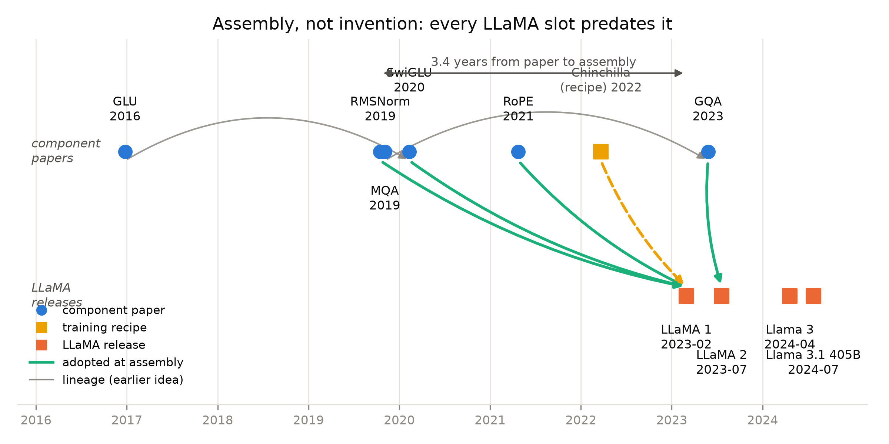

# 第 1 章 开源的最优配方：更少参数、更多数据

## 1.0 开篇：从全书到这里

导览章把整本书的地图摊开过：我们要把 Book2 里亲手造好的 GPT-2 三插槽底座，一格一格换成 LLaMA 式的现代零件，最终装出一台 207M 的整机；四格插座——归一化、激活、位置、注意力——也已经指给你看过。但动第一颗螺丝之前，还压着一个更根本的问题：**凭什么要换？**这些零件当年是凭什么被选进那台机器的？回答不了这个，后面的每一章都只是「照着别人的机器抄」，而不是「理解了别人的机器再造」。

这个「凭什么」不是我们自己冒出来的。上一册离场时，它被白纸黑字记在账上：

> **【欠账】** Chinchilla 的等比处方改变了开源世界的造法：第一个照方抓药的开源家族（LLaMA 系）如何按「更少参数、更多数据」的精神选型——小参数配超比例的数据，其骨架改装正是下一册的主线。→ **Book3 第 1 章**
> ——Book2 第 8 章章末欠账框

本章就是来兑现这笔欠账的。它是全书四段旅程的第一站——「为什么」，不碰一颗螺丝，只回答一个问题：**开源世界为什么需要「更少参数、更多数据」？**产出三件：一次动机的逐字精读（LLaMA 论文第一页的五段话）、一笔算力账（表 1.1，出自我们自己写下并实跑的 `handcalc.py`）、一张组件-组装双轴时间线（图 1.1）。到章末，你会拿到「更少参数、更多数据」的完整账本逻辑，还有一个新的世界观——造模型这件事，从「发明架构」变成了「组装架构」。

> **最小背景栏**：三样前置。① Chinchilla 等比律：给定算力，模型与数据应同速增长，处方约为每参数 20-21 个 token（所测范围，外推约 24）——Book2 第 8 章 8.3 节与表 8.1。② 6ND 口诀与 PF-day 换算：$C\approx6ND$、$1\ \text{PF-day}=8.64\times10^{19}$ FLOPs——Book2 第 7 章式 (7.1) 与第 9 章 9.3 节换算盒（式 (9.4)）。③ GPU 时（GPU-hour）：一张 GPU 满载运行一小时的工作量，本章首次使用——2048 张卡跑 21 天即 $2048\times21\times24\approx103$ 万 GPU 时。

## 1.1 欠账到期：Chinchilla 的判决与第一个照方抓药者

欠账要兑现，先把欠账的原文读清楚。上面方框里的句子拆开是三层：判决（Chinchilla 判了 GPT-3/Gopher 欠训练）、处方（等比）、悬念（第一个照方抓药的开源家族怎么造）。判决的细节都在 Book2 第 8 章，这里只回放与本章有关的骨架。

Kaplan 之后的这一代大模型有个共同姿势：模型一个比一个大，训练数据齐刷刷停在 300B tokens 附近。GPT-3 的实配是每参数 $300\text{B}/175\text{B}\approx1.7$ 个 token【证据等级：官方论文 2005.14165 v4；比值为本书算术】。Chinchilla 用三种独立方法交叉验证出等比处方：所测范围内每参数该配 20-21 个 token【证据等级：官方论文 2203.15556 v1 Table 3，经 Book2 第 8 章核对复用】——GPT-3 只及处方的 8%，于是有了那句判词 "current large language models are significantly undertrained"（当前大模型显著欠训练）。处方准不准，Chinchilla 本体用同预算对撞答过：70B 参数配 1.4T tokens，把四倍大于自己的 Gopher 全面打穿。

到这里，故事在闭源世界内部是自洽的：DeepMind 修正了处方，下一代旗舰照方抓药即可。但处方是公开的——它公开的那一刻，就对**所有**造模型的人生效了：包括一间没有万卡集群但读得到论文的实验室，也包括刚读完 Book2、手里有一台能跑实验的 MacBook 的你。欠账框问的正是这件事：开源世界拿到这张处方之后，第一个照方抓药的家族是怎么造出来的？

在伏笔台账上，这笔欠账编号 N4，本章就是它的回收主场——先在此登记，第 8 章末尾还有它的第二落点：推理预算哲学在 LLaMA 三代谱系里的一以贯之，届时回看。

要照方抓药，得先回答三个问题：药抓不抓得到（数据从哪来）、方子敢不敢改（选型怎么定）、药炉在谁手里（算力与骨架）。本章按这个顺序展开：先看 LLaMA 面对的局面（1.2 节），再看它在论文第一页给出的回答（1.3 节），最后把账算给自己看（1.4-1.5 节）。

## 1.2 GPT-3 不可得的三重含义：开源的真正含义是可复现性

上一节把判决书回放完毕，处方已经摆在桌上。但开源世界要照方抓药，立刻撞上的不是处方问题，而是药炉问题：当时唯一的旗舰参照系 GPT-3，对开源世界三重不可得。

第一重，**权重不开放**。OpenAI 在 GPT-2 时代是发布权重的（Book1 与 Book2 的实现线，正是踩着 GPT-2 的开源生态走出来的），到 GPT-3 转向了「只开放接口」——175B 的参数矩阵从不提供下载。这意味着你连「看一眼成品内部」都做不到：不能解剖、不能微调、更不能做受控实验。Book2 里我们反复做过的那种消融——把某个部件换掉看性能掉多少——对 GPT-3 一个都做不了。

第二重，**接口昂贵且不自由**。用 GPT-3 只能按 token 付费走它的服务：不能改架构、不能在自家语料上继续预训练、不能离线部署；费率与用量条款还随时可调。对研究者来说，比「贵」更伤的是「不自由」——科学要求可重复，接口不给你重复的条件。

第三重最隐蔽：**论文给了架构，给不了数据**。GPT-3 论文把网络结构、超参数、数据混合的大致权重都写了（Book2 第 7 章精读过），但训练语料本身不公开或说不清来历。LLaMA 论文后来点名的正是这一条："most existing models rely on data which is either not publicly available or undocumented (e.g. 'Books – 2TB' or 'Social media conversations')"【证据等级：官方论文 2302.13971 v1 §1 直引】。「Books – 2TB」只有一行名字：哪两 TB？怎么清洗的？没人知道。照表抓药，抓不到药本身。

把三重障碍放回决策树里看，出路其实只剩一条。路一是「用别人的」——三重障碍把这条路堵死。路二是「照论文复刻 GPT-3」——架构与超参都在纸上，似乎可行？但请用 1.1 节的判决书检查一下这张卷子：GPT-3 每参数 1.7 个 token，是被 Chinchilla 判了「显著欠训练」的答案；花一笔旗舰级的预算去复刻一个已被证明错误的选型，等于照抄一张不及格的卷子——何况它的数据（那 2TB 书）同样抓不到。路二也死。剩下的路三：**放弃复刻 GPT-3，按新处方用公开数据重新选型**——Chinchilla 给了选型的那一半，剩下数据与骨架两块要自己补。这正是 LLaMA 走的、也是本册要拆的路。

于是三重障碍推出一个比「权重不开放」更深一层的结论：**开源的真正含义是可复现性（reproducibility），不是可下载性**。权重可下载，只是让你拿到一台成品机器；配方齐全——公开的数据、写全的配置、能跑通的训练程序——才让任何人**原则上能把机器再造一遍**。反过来说，在权重不可得的世界里，「配方可得」就是全部的路：GPT-3 的权重永远拿不到，但「GPT-3 级能力」的配方是可以重建的。

> **【考据框】** LLaMA1 的发布与许可。论文（arXiv:2302.13971）v1 于 2023-02-27 挂上 arXiv，是唯一版本；社区通称的「2 月 24 日发布」指 Meta 博客日，本书未直接核到该博客原文——日期一律用 arXiv 锚【证据等级：arXiv 版本史；博客口径为社区通称】。另一处容易被忽略的事实：LLaMA1 的权重按「研究用途、非商用」的定制许可申请发放，严格说不是自由软件意义上的开源；但论文把数据来源、配比、超参与算力全部写透，社区随后真的复现出同构模型。所以「开源」在本书语境一律取「可复现性」这层含义——这个口径后面各章不再重复解释。【证据等级：官方仓库间接】

## 1.3 LLaMA 的动机五段：把偏离写在第一段

局面清楚了：自己造是唯一的路。而自己造的第一件事，是把选型想清楚。LLaMA 的论文（Touvron 等，Meta AI，2023）正文不长，但它的引言与摘要几乎每一句都值得逐字读。我们把动机五段按原文过一遍，每段后面用我们自己的话落地。

第一段，**站上判决书**。论文引言的第一层递进是：

> "However, recent work from Hoffmann et al. (2022) shows that, for a given compute budget, the best performances are not achieved by the largest models, but by smaller models trained on more data."
> 【证据等级：官方论文 2302.13971 v1 §1 直引】

一句话把 Book2 第 8 章的审判接了过来：同等算力，最优解不是最大的模型，而是小模型配更多数据。这不是 LLaMA 的发现，是它选定的起点——先把判决书立在门口，后面的选型才有依据。

第二段，**推理预算——训练账之外的第二本账**。紧接着，论文话锋一转：

> "However, this objective disregards the inference budget, which becomes critical when serving a language model at scale. In this context, given a target level of performance, the preferred model is not the fastest to train but the fastest at inference, and although it may be cheaper to train a large model to reach a certain level of performance, a smaller one trained longer will ultimately be cheaper at inference."
> 【证据等级：官方论文 2302.13971 v1 §1 直引】

用人话说：Chinchilla 优化的目标是「训练这一次花得最少」，但模型训完是要服役的——每次生成都要按 token 付算力，调用量越大，这本服役账越重。同样达成某个性能：大模型训练便宜、服役贵；小模型多喂 token，训练贵一点、服役便宜。**训练是一次性支出，服役是每天都收的账单**——所以给定性能，选服役快的那个模型。这段话是本章最重要的思想桥：它把「训练算力」与「服役算力」摆成了两本账。请把这个画面先存起来——第 6 章开立的 KV 显存账本（推理侧的第一场硬仗），就是从这句话长出来的。

第三段，**偏离声明——它没有照抄 Chinchilla**。这是五段里最见品格的一段：

> "For instance, although Hoffmann et al. (2022) recommends training a 10B model on 200B tokens, we find that the performance of a 7B model continues to improve even after 1T tokens."
>
> "The focus of this work is to train a series of language models that achieve the best possible performance at various inference budgets, by training on more tokens than what is typically used."
> 【证据等级：官方论文 2302.13971 v1 §1 直引】

注意方向：Chinchilla 说 10B 配 200B tokens（每参数 20 个）；LLaMA 的 7B 却吃 1T——每参数 149 个 token，超处方约七倍（这个比值的正式记号是下一节的式 (1.2)）。把四档全算出来更清楚（数字来自表 1.1 的自算列）：7B 档 $R=149$、13B 档 $R=77$、33B 档 $R=43$、65B 档 $R=21.5$。读懂数列的关键在两端：**65B 贴着 Chinchilla 处方（20-21），档位越小，越往 token 侧多走**。LLaMA 不是照抄等比配方，而是把 Chinchilla 当**底线**——大到 65B 就按处方来，小档为了服役预算刻意「超训」。理由第二段已经埋好：小模型服役便宜，多花的训练钱从服役端持续赚回。

还有一层证据结构值得分清：这段话里的 "we find"（我们发现）不是从定律外推的结论，而是他们真把 7B 训过 1T tokens 之后的一手观察——「小模型的损失在超训区间还没到头」。处方与发现是两个层次：Chinchilla 的 20-21 是拟合外推（Book2 第 8 章见过它的适用边界声明），LLaMA 的「还在涨」是实测数据。用外推反驳外推没有力量，用实测说话才有——这也是本丛书证据等级制度想让你养成的一等本能。

这里值得单独点破一层写作品格。LLaMA 把「我们偏离了主流配方」写在论文第一页：偏离多少（7B 对 10B、1T 对 200B）、为什么偏（推理预算），一次说清。它没有假装自己遵循 Chinchilla，也没有悄悄超训而不作解释。对比一下常见的反面写法——宣称「达到最优性能」而不交代口径——你就能明白为什么这篇短论文能推开一个时代的大门：**工程写作的诚实，就是把偏离和理由一起交出去**。这与我们在 Book2 里反复训练的「读文献先问口径」是同一枚硬币的两面：读的时候盯别人的口径，写的时候交出自己的口径。

第四段，**公开数据宣言**。

> "Unlike Chinchilla, PaLM, or GPT-3, we only use publicly available data, making our work compatible with open-sourcing, while most existing models rely on data which is either not publicly available or undocumented (e.g. 'Books – 2TB' or 'Social media conversations')."
>
> 摘要："We train our models on trillions of tokens, and show that it is possible to train state-of-the-art models using publicly available datasets exclusively, without resorting to proprietary and inaccessible datasets."
> 【证据等级：官方论文 2302.13971 v1 §1、Abstract 直引】

这是对 1.2 节第三重障碍的直接回答：全语料公开可得——CommonCrawl、C4、GitHub、Wikipedia、书籍、ArXiv、StackExchange 七个来源，分词后共约 1.4T tokens，配比与各源的处理管线论文写全（第 8 章逐格对表）【证据等级：官方论文 2302.13971 v1 §2.1 Table 1】。还有一个细节与我们在 Book2 第 8 章自己立过的实验纪律遥相呼应：除 Wikipedia 与书籍约跑两个 epoch，其余数据**每个 token 只用一次**——与五点族实验的「一次通过」是同一条铁律，只是 token 量级大了三万五千倍（1.4T 对 40M）。

第五段，**成绩单**。

> "In particular, LLaMA-13B outperforms GPT-3 (175B) on most benchmarks, and LLaMA-65B is competitive with the best models, Chinchilla-70B and PaLM-540B."
> 【证据等级：官方论文 2302.13971 v1 Abstract 直引】

结论章的版本更锋利："LLaMA-13B outperforms GPT-3 while being more than 10× smaller"【证据等级：官方论文 2302.13971 v1 §8 直引】。落到一个具体基准上看：MMLU 5-shot，LLaMA-13B 得 46.9，GPT-3 175B 得 43.9——参数是对方的约 1/13，这一项已经反超【证据等级：官方论文 2302.13971 v1 Table 9】。65B 档得 63.4，与 Chinchilla-70B 的 67.5 差 4 分，论文自己给了归因："A potential explanation is that we have used a limited amount of books and academic papers in our pre-training data … that sums up to only 177GB, while these models were trained on up to 2TB of books"【证据等级：官方论文 2302.13971 v1 §3.6 直引】——书喂少了（177GB 对 2TB），输在数据不在选型。注意这句诚实句与成绩单的关系：赢了说 most（多数基准，不是全部），输了给原因。这张成绩单还顺带兑现了「小参数可用性」：13B 的体量，一张数据中心加速卡的显存就能装载与继续训练——旗舰级能力第一次落进单个实验室的预算。

五段读完，动机的骨架其实只有一句话：**用公开的数据、按修改过的处方、造一群为服役而生的模型**。但「更少参数、更多数据」不能停在口号上——它是一笔账，下一节我们把它算给自己看。

## 1.4 三笔算力账：把「更少参数、更多数据」算给自己看

口号在上一节立住了，但本丛书的纪律是：数字要过自己的手。「LLaMA 用约四分之一算力打赢 GPT-3」这句话，现在自己算一遍。工具还是 Book2 第 9 章 9.3 节那只换算盒，账本只需两行公式。第一行是训练算力：

$$
C \;\approx\; 6\,N\,D \tag{1.1}
$$

| 符号 | 含义 | 形状 / 口径 |
|---|---|---|
| $C$ | 训练总浮点运算量 | 标量，单位 FLOPs |
| $N$ | 参数个数 | 标量；**本章口径 = 全参数**（口径声明见表 1.1 注①） |
| $D$ | 训练 token 总数 | 标量，单位 tokens |

用人话说：每个参数在每个训练 token 上要经历前向 2 次、反向 4 次浮点运算，「6」就是 2+4——这条直觉 Book2 第 7 章式 (7.1) 已立好，本章直接记账。第二行是本章的「处方量纲」：

$$
R \;=\; \frac{D}{N} \tag{1.2}
$$

用人话说：$R$ 是平均每个参数见过多少个 token——Chinchilla 的处方（20-21）、GPT-3 的病根（1.7）、LLaMA 的偏离（149/77/43/21.5），说的都是它。

两行公式、五档模型，[`code/ch01/handcalc.py`](code/ch01/handcalc.py) 一次算完（`row` 与 `triangle_65b` 两个函数；纯 CPU 算术、秒级、输出落 `log/book3-ch01/`）。实跑结果汇成表 1.1。

**表 1.1** GPT-3 与 LLaMA1 四档的算力账对照（$N$ 为论文全参数口径；6ND 与 PF-days 两列为本书算术）

| 模型 | $N$（全参数） | 训练 tokens $D$ | $R=D/N$ | $6ND$（FLOPs） | PF-days | GPU 时（A100-80GB） | 证据 |
|---|---|---|---|---|---|---|---|
| GPT-3 | 174.6B | 300B | 1.7 | $3.14\times10^{23}$ | $3.64\times10^{3}$ | —（未披露） | 2005.14165 v4 Table D.1；6ND 手算沿 Book2 第 9 章 |
| LLaMA-7B | 6.7B | 1.0T | 149 | $4.02\times10^{22}$ | 465 | 82,432 | N/D/GPU 时=2302.13971 v1 Table 2/15；$R$/6ND/PF-days=本书算术 |
| LLaMA-13B | 13.0B | 1.0T | 77 | $7.80\times10^{22}$ | 903 | 135,168 | 同上 |
| LLaMA-33B | 32.5B | 1.4T | 43 | $2.73\times10^{23}$ | 3,160 | 530,432 | 同上 |
| LLaMA-65B | 65.2B | 1.4T | 21.5 | $5.48\times10^{23}$ | 6,339 | 1,022,362 | 同上 |

注①（口径声明）：本章 $N$ 沿用论文对外口径的**全参数**。Book2 第 8 章曾为 scaling 曲线立规「6ND 一律非嵌入参数」（那是 Kaplan 的拟合口径），第 9 章的 GPT-3 手算则沿用论文全参数（174,600M）并加注脚——本章 LLaMA 账跟随后者（论文 Table 2 的参数即全参数），两口径并排，注脚在此。代价多大？untied 的两份嵌入 $2\times32000\times d$ 在 65B 档只占全参数的 0.8%、13B 档 2.5%、7B 档 3.9%【本书算术】，不改变任何结论的数量级。注②：$R$、6ND、PF-days 出自 `handcalc.py` 实跑（1 PF-day $=8.64\times10^{19}$ FLOPs，Book2 式 (9.4)）；论文口径 6.7/13.0/32.5/65.2B 即对外通称 7/13/33/65B。注③：GPT-3 未披露 GPU 时——为它记账只能 6ND 自估（Book2 第 9 章登记过的引用纪律）。

先看最关键的两行。**13B 档**的乘法在草稿纸上三十秒就能走完：$6\times13=78$，$10^{9}\times10^{12}=10^{21}$，所以 $6ND=78\times10^{21}=7.80\times10^{22}$ FLOPs；除以 $8.64\times10^{19}$ 得 903 PF-days。对 GPT-3 的 $3.14\times10^{23}$（$3.64\times10^{3}$ PF-days）之比是 0.248——**约四分之一**。也就是说，LLaMA-13B 用 GPT-3 四分之一的训练算力，在多数基准上胜过对手（1.3 节的成绩单）。「更少参数、更多数据」的账本形态就是这一行：参数砍到约 1/13（175B 对 13B），数据放三倍多（300B 对 1T），总账反而降到 1/4。顺手把自家的坐标也摆进去：Book2 第 8 章我们五个模型的训练全族合计约 $1.3\times10^{-4}$ PF-days——LLaMA-13B 这 903 PF-days 是它的约 700 万倍【证据等级：本书实验（Book2 ch8 实测账本 + 本章算术）】。同一套坐标系里差七个数量级，但坐标是同一套——这正是本丛书「缩小版复现」的立身之本。**65B 档**：$6\times65.2\times10^{9}\times1.4\times10^{12}=5.48\times10^{23}$ FLOPs，约为 GPT-3 的 1.74 倍——量级上到了与 Chinchilla-70B 同台的位置（后者 $6\times70\times10^{9}\times1.4\times10^{12}\approx5.9\times10^{23}$，本书算术）：参数同档、tokens 同量、预算同级，于是 63.4 对 67.5 的 4 分差距只能在数据上找原因（177GB 对 2TB 的书，1.3 节的诚实句）。

表里还有一列论文口径的 GPU 时，它给了我们做**三角互证**的机会——同一场训练，三本账各记一遍，能互相咬合的数字才可信。**第一本账，6ND**（上表自算列）：65B 档 $5.48\times10^{23}$ FLOPs。**第二本账，GPU 时**：论文 Table 15 记 65B 训练共 1,022,362 GPU 时【证据等级：官方论文 2302.13971 v1 Table 15】；§2.4 又说训练跑在 2048 张 A100-80GB 上："When training a 65B-parameter model, our code processes around 380 tokens/sec/GPU on 2048 A100 GPU with 80GB of RAM. This means that training over our dataset containing 1.4T tokens takes approximately 21 days."【证据等级：官方论文 2302.13971 v1 §2.4 直引】。除一下：$1{,}022{,}362\div2048\div24=20.8$ 天【本书算术】——与论文自述的「约 21 天」咬合。**第三本账，吞吐**：还是那句话里的 380 tokens/s/GPU，全程吃掉的 token 有 $2048\times380\times20.8\times86{,}400\approx1.40\times10^{12}$ 个——正好对上 1.4T 的数据集【本书算术】。

三本账还能拧成一把尺。把第一本账摊到第二本账的时间上：$5.48\times10^{23}\div(1{,}022{,}362\times3600\ \text{s})\approx148.8$ TFLOP/s，即每张 A100 的有效算力；从第三本账直接乘出来是 $380\times6\times65.2\times10^{9}\approx148.7$ TFLOP/s——两条独立路径相差不到 0.1%【本书算术】。对 A100-80GB 张量算力标称 312 TFLOPS（fp16/bf16 口径，【硬件标称=厂商自报】）的占比约 48%，落在大规模训练的合理利用率区间；又因为 6ND 不计注意力二次项与通信开销（Book2 第 8 章注过的 Kaplan 近似），真实利用率还要略高一点。三本账彼此独立、互相咬合——论文的数字是自洽的。这种「同一事实三条账」的核数习惯，比记住其中任何一个数字都值钱。

最后把训练之外的账也带一笔：论文 §6 自报全项目开发使用 2048 张 A100-80GB 约 5 个月，折约 2,638 MWh 电、1,015 tCO₂eq【证据等级：官方论文 2302.13971 v1 §6，厂商自报口径】——Book2 第 9 章 OPT 病历教过的道理在这里再次现身：真实的大模型开销，从来不止 FLOPs。

## 1.5 三改没有一件是 LLaMA 发明的：组装学开场

账算清了，选型定了，还剩最后一个问题：**小参数扛一万亿 token，靠什么不散架？**「更少参数、更多数据」对骨架的要求其实更苛刻：训得更久，数值要更稳；参数要省，部件要更抠效率；服役要便宜，位置与注意力的设计要为长文本与批量生成着想。这些要求分别落在哪些零件上，第 2-6 章会逐格回答；这里先看 LLaMA 论文自己怎么交代骨架——§2.2 一共三段话，逐字读：

> "**Pre-normalization [GPT3].** To improve the training stability, we normalize the input of each transformer sub-layer, instead of normalizing the output. We use the RMSNorm normalizing function, introduced by Zhang and Sennrich (2019)."
>
> "**SwiGLU activation function [PaLM].** We replace the ReLU non-linearity by the SwiGLU activation function, introduced by Shazeer (2020) to improve the performance. We use a dimension of 2/3·4d instead of 4d as in PaLM."
>
> "**Rotary Embeddings [GPTNeo].** We remove the absolute positional embeddings, and instead, add rotary positional embeddings (RoPE), introduced by Su et al. (2021), at each layer of the network."
> 【证据等级：官方论文 2302.13971 v1 §2.2 直引】

请特别注意这三段话的**引用结构**：每一处改动都在引用别人的论文——RMSNorm 是 Zhang 与 Sennrich 2019 年的，SwiGLU 是 Shazeer 2020 年的，RoPE 是 Su 等 2021 年的；连方括号里的 [GPT3]、[PaLM]、[GPTNeo] 都是「灵感来源」的记号——pre 归一化 GPT-3 用过，SwiGLU 这件零件 PaLM 先装进过旗舰，RoPE 由 GPT-Neo 系先行部署。**三改没有一件是 LLaMA 发明的。**它的贡献是把三件别人造好的零件，配上公开数据与修改过的配方，组装成一台证明「纯公开数据也能到旗舰级」的机器——并让这套组合从此成为开源世界的默认骨架。

把这件事画下来，就是图 1.1：横轴是时间，上轴是组件论文，下轴是 LLaMA 代际；青色连线是「被组装」，灰色弧线是「思想前史」。时间线上最扎眼的是那些**空档**：RMSNorm 从 2019 年 10 月发表到被 LLaMA1 组装，等了 3.4 年；SwiGLU 等了 3 年；最快的 RoPE 也等了将近 2 年。每个组件在论文宇宙里各自为战数年，LLaMA1 在 2023 年 2 月一次集齐。图上还有两条灰色前史弧线值得先记下：门控思想 2016 年就在 GLU 里冒头（第 3 章的前史），MQA 2019 年就已提出——它与 2023 年 5 月的 GQA 一起预告了第 6 章的注意力插槽；那条线连 LLaMA1 自己都没来得及用，是 LLaMA2 补上的。

图 1.1 组件-组装双轴时间线（自绘）：上轴蓝点=组件论文（v1 日期经 arXiv 版本史核）、黄方=Chinchilla 配方、下轴橙方=LLaMA 代际（arXiv/官方许可锚日期）；青色连线=被 LLaMA1/LLaMA2 组装，灰色弧线=思想前史（GLU→SwiGLU、MQA→GQA）——三改全部早于 LLaMA1 数年【证据等级：arXiv 版本史+官方许可（经本册核对）+ 本书自绘】

为什么组装来得这么晚？看看每篇组件论文各自的小舞台就明白了：RMSNorm 的论文主战场甚至是循环网络，Transformer 档只占一角（第 2 章的考据）；SwiGLU 在中型 Transformer 上扫出一格优势（第 3 章的 Table 1）；RoPE 在 RoFormer 上验证。它们各自证明的是「我不比原装差」，但没有人知道三件一起换、规模再放大几个数量级会不会出事——**零件级证据不等于整机级证据**，中间隔着一次押上全部预算的赌博。LLaMA 用 2048 张 A100 担下了这个风险，也一次结清了它的回报：组合一旦被证明成立，后来者改组件就不再是赌博，而是对着一台已证明的骨架做单变量替换（第 2-6 章我们的模块消融、LLaMA2 换 GQA 时的验证，用的都是这个姿势）。

这张图定义了本书要讲的**插槽化时代**。LLaMA 之后的开源世界，再没有人靠「发明一个全新架构」登场——各家做的是插槽（slot）替换：LLaMA2 把注意力插槽换成 GQA（第 6 章的主菜），Llama 3 骨架不动、只换词表与数据配方（第 8 章的代际总表）。从此读任何一台新模型，最有解读力的问题仍然是第 0 章图 0.1 里那四格插座：**它换了哪个插槽？**我们的改装流水线与本册路线图也就此铺开——

- 第 2 章拔第一格：归一化插槽，LayerNorm 换 RMSNorm（2019 年那颗零件的完整身世）；
- 第 3 章动前馈：激活插槽，GELU 前馈换 SwiGLU 门控前馈，顺带算清 2/3·4d 的参数账；
- 第 4 章动位置：位置编码插槽，1024 位查表墙换 RoPE 旋转（本册数学最重的一章）；
- 第 5 章插曲：出入口解绑与词表的账（untied 与 32k 词表——四连之外附加的一刀）；
- 第 6 章拔第四格：注意力插槽，MHA 换 GQA，KV 显存账本正式开立；
- 第 7-9 章工程与谱系：长上下文外推的三代配方、LLaMA 三代组装对表、「没有论文的模型怎么读」；
- 第 10-11 章：四插槽齐装成 207M 整机（改装史直接写在 import 语句里），收束成册末的判断力。

到第 10 章你会发现，那台机器的每个零件都有出处：一篇论文、一次消融、一笔我们亲手算过的账。

## 1.6 本章小结

开篇那笔跨册欠账，本章兑现了。我们回答的问题是：开源世界为什么需要「更少参数、更多数据」。答案是一条链：GPT-3 三重不可得（权重、接口、数据）使「自己造」成为唯一出路；「自己造」的选型由 Chinchilla 处方与推理预算共同给出——前者说同等算力该买小模型配更多数据，后者说给定性能该选服役便宜的模型，合起来就是「以处方为底线、往 token 侧多走」。LLaMA 把这个选型连同对偏离的诚实声明写在论文第一页；账本上，它兑现为 13B 档用 GPT-3 约 1/4 的训练算力在多数基准胜出（$7.80\times10^{22}$ 对 $3.14\times10^{23}$ FLOPs），65B 档以同量级预算与 Chinchilla-70B 同台。而 6ND、GPU 时、吞吐三本账的互相咬合，让这些数字真正过了我们自己的手。

**带走的心智**：忘掉数字，请留下两件。第一件是一张付款结构图：**「更少参数、更多数据」不是省钱的配方，是换付款方向的配方——训练是一次性支出，服役是按 token 收的长期账单；小模型多喂 token，多付的一次性成本从服役端持续赚回**。以后读到任何「小模型追平大模型」的新闻，先在脑中画出这两本账再下判断。第二件是一个世界观：**LLaMA 没有发明任何一件零件，它把三件别人的零件组装成了此后所有人的默认骨架——从它起，造模型从「发明架构」变成「组装架构」，读模型先问「换了哪个插槽」**。图 1.1 那条时间线，就是这个时代的开场照片。

镜头拉回全书：四段旅程的第一站（为什么）走完，选型与账本在手，接下来三站全是动手——逐插槽改装（第 2-6 章）、工程与谱系（第 7-9 章）、整合与收束（第 10-11 章）。改装流水线的第一格已经排在门口：**先把第一个插槽拔下来——从那颗最不起眼的归一化零件开始。**那里还压着上一册的另一笔欠账，下一章开庭。

## 1.7 动手验证（本章代码清单）

- 算力账三笔（秒级，产物落 `log/book3-ch01/`）：`cd 工作区根目录 && source env.sh && python [`code/ch01/handcalc.py`](code/ch01/handcalc.py)——应打印表 1.1 的全部自算列与 65B 三角互证（20.8 天、$1.40\times10^{12}$ tokens、148.8 与 148.7 TFLOP/s 两路咬合）；自定变式档位时务必加 `--out-name` 防覆写。
- 图 1.1 复现（秒级）：`python [`code/ch01/make_fig_1_1.py`](code/ch01/make_fig_1_1.py)
- 验收点：不看书画出式 (1.1)(1.2) 并说出口径（$N$ 全参数、PF-day 定义）；手算 13B×1T 的 6ND 并说出它与 GPT-3 的比值；复述 LLaMA 偏离声明的方向与理由；解释三本账为什么能互相咬合。
