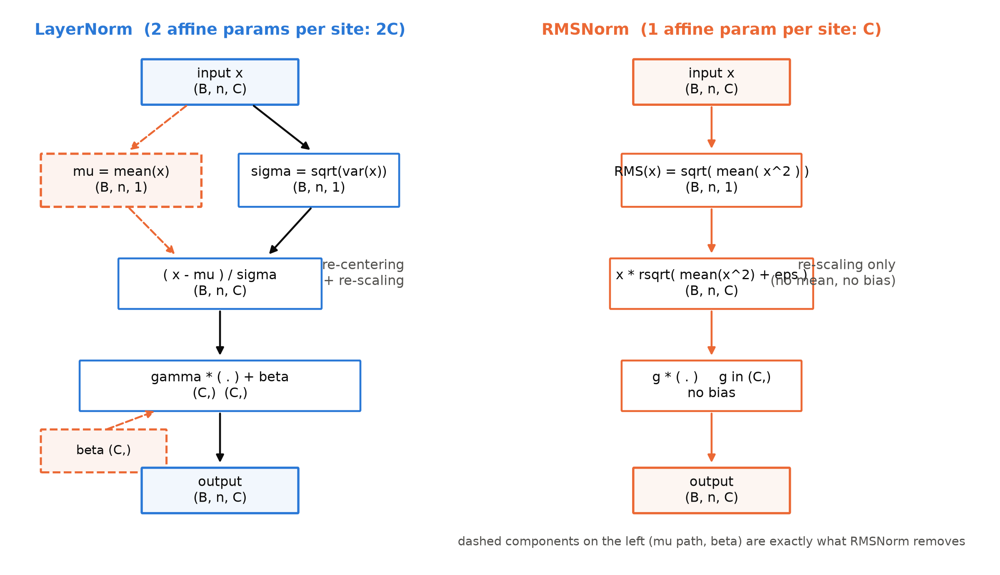
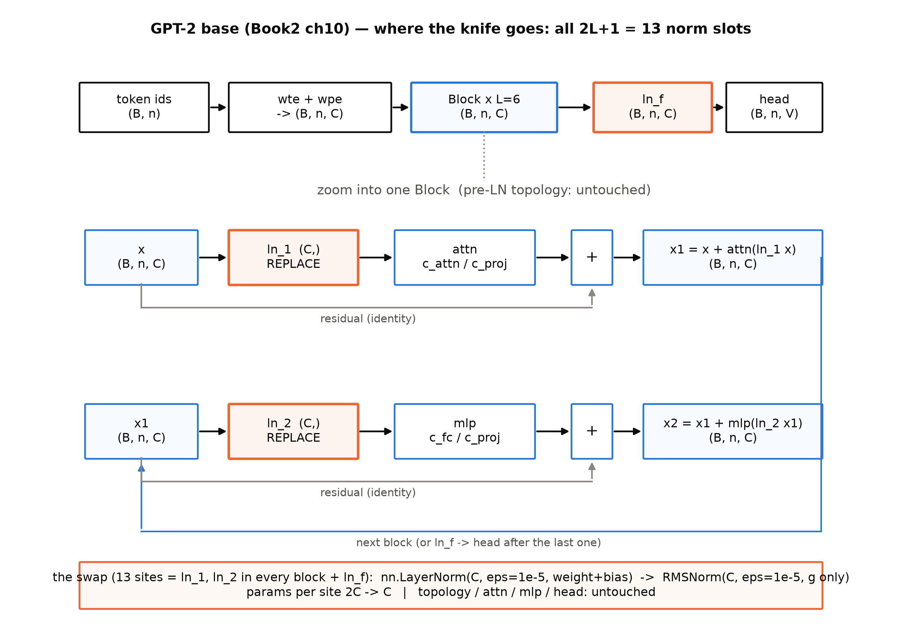
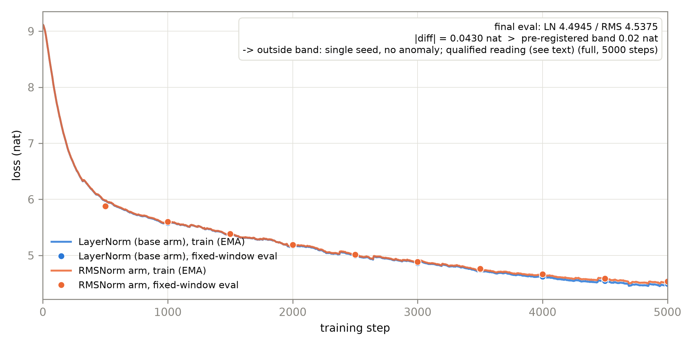

# 第 2 章 pre-RMSNorm：归一化零件的演化

## 2.0 开篇：从全书到这里

上一章我们把账算清了：LLaMA 的四件套没有一件是它自己发明的——2019 年的 RMSNorm、2020 年的 SwiGLU、2021 年的 RoPE，散落在三年的组件论文里，LLaMA 做的是照方抓药，把它们逐插槽装进一台 GPT-2 形状的机器。所以本册不重造机器，而是改装：从 Book2 第 10 章定版的三插槽底座出发，一刀一刀换零件，直到它成为 LLaMA 式骨架。第一刀动归一化——不因为它是最大的件，而因为 Book2 结账时在这件零件上留了一笔显式的旧账，也因为它是四件套里唯一一件「零件接口与内部接线都同构」的替换（后面三刀都会在插槽肚子里添新结构），适合当改装的第一课。

本章要回答三个问题：LayerNorm 这个 2016 年的零件到底在做哪几件事、哪几件是不可缺的？RMSNorm 把其中一半计算直接砍掉，凭什么敢？以及动手的部分——在我们的底座上把这刀落下去，怎么验收「换了没坏」。结束时，机器里全部 13 个归一化位都会换上 RMSNorm，Block 的接线一根不动；而新的问题会自然出现在 Block 里另外两个 2019 年的原装货上——注意力和前馈。

> **最小背景栏**
> - LayerNorm 的公式与「每站计量站」图像：Book1 第 6 章式 (6.3)——每个位置出口把 $C$ 维向量调成均值 0、方差 1，再过旋钮 $\gamma,\beta$；参数每处 $2C$。
> - post-LN 的病根与 pre-LN 手术：Book2 第 4 章 4.5 节停药实验（post-LN 停药冻结在 ≈3.3 nat 高原、与吃药差 2.93 nat；pre-LN 停药正常下降）——位置之争的实验收口。
> - 改装底座：Book2 第 10 章三插槽 Block，`x = x + attn(ln_1(x)); x = x + mlp(ln_2(x))`，外加出口 `ln_f`；模块实验语料沿用 Book2 第 8 章 `tokens.bin`（sp-8k，306M token 流）。
> - 本章新引入的概念只有 RMSNorm 本身，其余全部指回。

## 2.1 一笔七年的旧账

本册开张先还账。Book2 第 4 章章末欠账框原文：

> 「pre-LN 之后：LN 挪进残差解决了『停药』，但归一化零件本身没再动过——更简的归一化变体谱系与 pre/post 之争的考证……→ Book3 第 2 章。」

这笔账的来历本身就有三级：Book1 第 6 章讲 post-LN 数据流时埋下「pre/post 之争」的预告，Book2 第 4 章做挪位手术时把它转写成上面这句欠账，本章收尾。背后的实验你应当还有印象：post-LN 的机器一停 warmup 就瘫在高原上，把 LN 挪进残差分支（pre-LN）之后停药照样能训——Book2 用 2.93 nat 的自差坐实了「药治病症、手术治病根」【证据等级：本书实验（MPS，2026-10，Book2 ch4 停药实验）】。但当时的手术有一个隐含前提值得现在挑明：**动的是位置，不是零件**。同一个 LayerNorm，从残差求和之外挪到子层入口，公式一个字符没改。往前数，GPT-1、GPT-2、GPT-3 三代机器用的都是同一个 2016 年的零件【证据等级：官方论文 2005.14165 v4 §2.1——GPT-3「沿用 GPT-2 的模型与架构，含修改的初始化与 pre-normalization」】；往后数，LLaMA 换的才是零件本身。

于是问题可以这样问：pre/post 之争了结之后，归一化零件本身还能更简吗？要回答它，得先把 LayerNorm 拆开看它到底在做什么——哪些动作是在治病的，哪些只是顺手做的。

## 2.2 LayerNorm 在做的两件事

先把 Book1 的公式请回来，这次用改装工程的视角逐项清点。对残差流上的某个位置向量 $\mathbf{x}\in\mathbb{R}^C$（LayerNorm 家族的口径：归一化对象是「一层神经元上的加权和」，即该位置的全部 $C$ 维）：

$$
\operatorname{LN}(\mathbf{x})_i=\frac{x_i-\mu}{\sqrt{\sigma^2+\varepsilon}}\,\gamma_i+\beta_i,
\qquad
\mu=\frac{1}{C}\sum_{j=1}^{C}x_j,\quad
\sigma^2=\frac{1}{C}\sum_{j=1}^{C}(x_j-\mu)^2
\tag{2.1}
$$

用人话说：先把这格向量的中心搬回原点，再除以它的波动幅度，最后逐维乘增益、加偏置。它对整句张量的作用是 $(B,n,C)\to(B,n,C)$——形状全程不变，每个位置独立算出自己的一对 $(\mu,\sigma)$，全句共 $(B,n)$ 对。

拆开数，式 (2.1) 其实做了两件性质不同的事。第一件是**重中心化**（re-centering）：减 $\mu$，把向量的「位置」搬回原点，让输出对输入的整体平移不敏感——你平移输入，$\mu$ 跟着平移，减完之后纹丝不动。第二件是**重缩放**（re-scaling）：除 $\sigma$，把向量的「幅度」归一，让输出对输入的整体缩放不敏感——乘个常数，分子分母同除，输出也不动。$\gamma,\beta$ 只是两枚旋钮，各自归各自的事管不了。这两件「不变性」正是 LayerNorm 被认为能稳住训练的招牌本领。

那么，两件都必须吗？回头看病根本身：Book2 已经确认，训练不稳的敌人是**尺度**——激活与梯度的幅度失控，warmup 是给尺度的止痛药。均值漂移（这格向量整体往哪偏）并不直接制造梯度爆炸，它更像载荷的一部分而非病灶。一个思想实验能帮你看清重中心化买的是什么：设想残差流上叠着一个缓慢漂移的常数偏置，重中心化会把它在每一站擦掉。如果这个偏置是噪声，擦掉是保镖；可如果它携带信息——比如某种全局的「场」信号——擦掉就是丢载荷。中心化究竟是保镖还是清洁工，取决于均值里装的是噪声还是信号，而自 2016 年以来，这条收益从未被单独证明过。一个旁证是小数字例子：取 $\mathbf{a}=(1,2,3,6)$，算得 $\mu=3$、$\sigma^2=3.5$；把中心化这一步做掉之后 $\mathbf{a}-\mu=(-2,-1,0,3)$ 的波动还是 $3.5$——减均值改变的只是「参照系」，波动量本身与中心化无关。如果稳定性的收益主要来自尺度控制，那重中心化这门功课就有砍价的空间。图 2.1 把两件事画成了计算图：左半是 LN 的完整管线——统计量两路（$\mu$ 与 $\sigma$）、中心化、缩放、两枚旋钮；右半是下一节的主角。对着左图问「哪些框可以删」，答案就是右图。



图 2.1 LayerNorm（左）与 RMSNorm（右）计算图并排（自绘示意级；张量框标形状，橙色虚线部件 = RMSNorm 删掉的 $\mu$ 支路与偏置 $\beta$；两图输出形状同为 $(B,n,C)$）

## 2.3 RMSNorm：只做剩下的一半

先把动机的账摆正，再看公式。RMSNorm 论文的开场实验画了两条收敛曲线：GRU 机器翻译上，按训练步数计，LayerNorm 确实比无归一化基线收敛快（前一万步里基线 loss 才到 7.0 时，LN 已到 5.4）；但把横轴换成墙钟时间，LN 的位置缩水到 5.9——每步多付的归一化计算税，把收敛增益吃掉了一截【证据等级：官方论文 1910.07467 v1 §1 Figure 1】。这篇论文要造的就是「质量不掉的便宜归一化」：第一步先证明砍掉一半不伤质量，第二步才收速度红利。顺序不能倒——先证明等价、再谈便宜，是这类简化工作的标准姿势。

它的答案是：把重中心化整件删掉，只留重缩放，叫 RMSNorm（root mean square layer normalization，均方根层归一化）【证据等级：官方论文 1910.07467 v1 §4】：

$$
\operatorname{RMSNorm}(\mathbf{x})_i=\frac{x_i}{\mathrm{RMS}(\mathbf{x})}\,g_i,
\qquad
\mathrm{RMS}(\mathbf{x})=\sqrt{\frac{1}{C}\sum_{j=1}^{C}x_j^2+\varepsilon}
\tag{2.2}
$$

用人话说：不减中心，直接除以「这格向量整体有多大」，再逐维乘一枚增益。分母从「标准差」换成了「均方根」（root mean square，各分量平方平均再开方），统计量从两件（$\mu$、$\sigma$）省成一件；旋钮从两枚（$\gamma,\beta$）省成一枚（$g$）。论文名字里的 root mean square 就是这个分母。式 (2.2) 在论文里不带 $\varepsilon$，工程实现把它加进根号内防除零——这与 LayerNorm 的 $\varepsilon$ 位置相同，不影响下面的任何比较。

**符号表**（式 (2.1)/(2.2) 通用；形状列按模块档 $C=512$ 的实际张量记）：

| 符号 | 含义 | 张量形状 |
|---|---|---|
| $\mathbf{x}$（论文记 $\mathbf{a}$） | 某位置进入归一化的残差流向量 | $(B,n,C)$ 的每一行 $(C,)$；全句 $(B,n)$ 个 |
| $\mu,\ \sigma$ | 该向量的均值 / 标准差 | 各 $(B,n,1)$ |
| $\mathrm{RMS}(\cdot)$ | 均方根（二阶矩开方） | $(B,n,1)$ |
| $\gamma,\ \beta$ | LN 的逐维增益 / 偏置 | 各 $(C,)$ |
| $g$ | RMSNorm 的逐维增益 | $(C,)$ |
| $\varepsilon$ | 防除零小量（2.7 节专门讨论取值） | 标量 |
| $W$ | 讨论不变性时归一化上游的线性映射 | $(d_{\mathrm{out}},C)$ |

删掉中心化之后，两个式子的关系并没有变得含糊，它们被一条恒等式精确地钉在一起：

$$
\mathrm{RMS}^2(\mathbf{x})=\sigma^2(\mathbf{x})+\mu^2(\mathbf{x})
\tag{2.3}
$$

用人话说：总幅度的平方 = 波动 + 漂移——均方根量的是「总量」，标准差量的是「扣掉漂移后的波动」。还是那个小例子：$\mathbf{a}=(1,2,3,6)$，$\sigma^2=3.5$、$\mu^2=9$、$\mathrm{RMS}^2=12.5$，$3.5+9=12.5$，逐位吻合【证据等级：本书实验（CPU，2026-10，`rmsnorm.py` 探针 4，随机 $(2,5,8)$ 输入全部 $B\cdot n$ 格成立，最大偏差 $1.2\times10^{-7}$）】。这条恒等式给出两个直接推论：其一，$\mathrm{RMS}\geq\sigma$ 恒成立，RMSNorm 的分母永远不小于 LN 的分母，输出尺度略大——差异由 $g$ 吸收；其二，**当 $\mu=0$ 时两式严格相等**，论文原话是「当加权和的均值为零时，RMSNorm 与 LayerNorm 完全等同」（"When the mean of summed inputs is zero, RMSNorm is exactly equal to LayerNorm."）【证据等级：官方论文 1910.07467 v1 §4】。本机验证：构造零均值输入（每格减去自己的 $\mu$，LN 侧置 $\beta=0$、两式同 $\varepsilon$），两输出最大偏差 $2.4\times10^{-7}$，即浮点意义上的相等【证据等级：本书实验（CPU fp32，2026-10，`rmsnorm.py` 探针 3）】。

恒等式说明了「什么时候等」，还没回答「为什么敢砍」。论文的论证分三层，值得逐层过一遍，因为它示范了「删部件」类改动的标准论证法。

第一层是**假设**：LayerNorm 的成功常被归功于两条不变性，作者假设真正干活的是重缩放不变性，重中心化贡献有限——原文明确说这是 argue 与 hypothesize，不是证明【证据等级：官方论文 1910.07467 v1 §1】。第二层是**代数验证**重缩放这条路确实完好：由 $\mathrm{RMS}(\alpha\mathbf{x})=\alpha\,\mathrm{RMS}(\mathbf{x})$ 的线性性质（论文 §4.1 式 6-7），权重整体重参数化 $W'=\delta W$ 时

$$
\frac{W'\mathbf{x}}{\mathrm{RMS}(W'\mathbf{x})}=\frac{\delta W\mathbf{x}}{\delta\,\mathrm{RMS}(W\mathbf{x})}=\frac{W\mathbf{x}}{\mathrm{RMS}(W\mathbf{x})}
\tag{2.4}
$$

用人话说：权重整体放大 $\delta$ 倍，分子分母一起放大，输出纹丝不动。论文用一张不变性矩阵总结：RMSNorm 保留「权重矩阵重缩放 / 数据集重缩放 / 输入重缩放」三项不变性，放弃「权重向量重中心化 / 数据集重中心化」两项【证据等级：官方论文 1910.07467 v1 §4.1 Table 1】。本机的探针把「保留的」与「放弃的」各验了一边：输入整体加 $3$，LN 输出不变（偏差 $4.8\times10^{-7}$）而 RMSNorm 输出明显改变（最大差 $2.82$）——放弃的确实是平移不变性；输入整体乘 $2.5$，两者输出都不变（偏差 $\sim10^{-6}$）——留下的确实是缩放不变性【证据等级：本书实验（CPU fp32，2026-10，`rmsnorm.py` 探针 1/2）】。第三层是**几何图像**：RMSNorm 把每格向量压到半径 $\sqrt{C}$ 的球面附近（归一化后各维平均能量约为 $1$，故 $\lVert\mathbf{x}\rVert\approx\sqrt{C}$）。有趣的是，直接压到单位球的欧氏范数归一化（与 RMS 只差一个 $\sqrt{C}$ 因子）被论文实测「不 work」，作者猜想按 $\sqrt{C}$ 缩放球面、使各维保持常见数值范围才是关键——注意这是作者猜想，不是结论【证据等级：官方论文 1910.07467 v1 §4】。

砍掉一半统计量还附赠一个不显眼的礼物。论文对梯度做了分析：损失对权重的梯度中含一个依赖于 $W$ 的矩阵因子，在权重缩放 $\delta$ 倍时该因子缩放为 $1/\delta$——

$$
W'=\delta W\ \Rightarrow\ R'=R/\delta
\tag{2.5}
$$

用人话说：权重越长越大，有效梯度自动越小——归一化自带刹车，论文称之为隐式学习率适配器（implicit learning rate adaptor）【证据等级：官方论文 1910.07467 v1 §4.2 式 8-10】。这与 Book2 里「pre-LN 让训练不再依赖 warmup」是同一主题在函数侧的回声：一个从拓扑、一个从梯度，都在把「尺度失控」这条路堵上。最后是实证补强：RMSNorm 虽不管均值，训练后逐层激活的均值统计反而比基线稳定（全程 $-0.73$ 对基线 $-1.60$）；把初始化中心人为挪到 $0.2$，LayerNorm 训练明显失稳而 RMSNorm 相对稳【证据等级：官方论文 1910.07467 v1 §6.1 Table 5 与 Figure 4】——均值不必显式管，也稳了。

> **【考据框】论文原式带偏置，「无偏置」是 LLaMA 的选择。** RMSNorm 论文的一般形式是 $y=f\!\big(\mathrm{RMSNorm}(W\mathbf{x})\odot g+b\big)$——逐维偏置 $b$ 在论文原式（§4.1 式 5）里是存在的。把它删掉的是后来的实现侧：Meta 官方参考实现与 HF 的 `LlamaRMSNorm` 都只有一枚 `weight`，T5 的简化 LayerNorm 同样无 bias【证据等级：官方论文 1910.07467 v1 §4.1 式 5 + 源码】。所以严格说，LLaMA 的零件 = 「RMSNorm 去掉 bias」，写作与对拍时都不要把「无偏置」说成 RMSNorm 定义的必然组成。顺带一笔账：LN 每处两个参数张量（$\gamma,\beta$ 各 $(C,)$），RMSNorm 每处一个——本书模块档每处省 $512$ 个参数，全机 13 处共省 $6{,}656$ 个。

**形状流转表**（RMSNorm 前向，$(B,n,C)$ 全程不变维，逐运算列）：

| 步骤 | 运算 | 输入形状 | 输出形状 | 说明 |
|---|---|---|---|---|
| 1 | 上抛 fp32 | $(B,n,C)$ | $(B,n,C)$ | 统计量算在 fp32（官方纪律，见 2.5 节） |
| 2 | 平方、末维均值 | $(B,n,C)$ | $(B,n,1)$ | 均方 $\mathrm{RMS}^2$，无中心化 |
| 3 | 加 $\varepsilon$、rsqrt | $(B,n,1)$ | $(B,n,1)$ | 分母的倒数，一次算子 |
| 4 | 逐元素乘 | $(B,n,C)\times(B,n,1)$ | $(B,n,C)$ | 只重缩放 |
| 5 | 乘 $g$、回原 dtype | $(B,n,C)\times(C,)$ | $(B,n,C)$ | 唯一参数；无 bias |

对照 LN 的实现路径（减均值一次规约、方差又一次规约、逐元素减法、两枚旋钮），RMSNorm 省掉的是两次 $C$ 元规约与一次逐元素减法，再加一个参数张量——省下的都是访存型小算子。这在 2019 年的语境下值钱得很，值多少钱，2.6 节单独算账。两个补充注脚把边界画全：其一，论文还试过更激进的 pRMSNorm（只随机采 $6.25\%$ 的维度估计 RMS，理论更快），但 kernel 切片不友好、加速未稳定兑现，LLaMA 未采用，备案一句即可【证据等级：官方论文 1910.07467 v1 §5】；其二，论文自己的 CIFAR-10 实验里，LayerNorm 的泛化反而是全场最差（test err 10.49%，比无归一化基线的 8.96% 还差），RMSNorm 8.83%——「RMS≈LN」的等价在多数任务成立，但 LN 并非在哪儿都是优等生【证据等级：官方论文 1910.07467 v1 §6.4 Table 10】。

## 2.4 谱系：两根轴与一场没人点破的并发

零件讲完了，把它放回时间线（表 2.1），你会发现「归一化演化」其实是两根独立的轴：一根管**位置**（归一化放在残差求和之内还是之外），一根管**函数**（归一化的公式长什么样）。Book2 的停药实验走完了位置轴的前半程，本章的 RMSNorm 是函数轴的全程。两根轴的交汇点，就是本章标题那五个字母：pre-RMSNorm。

表 2.1 归一化谱系时间线（两轴：位置轴 = post→pre，函数轴 = LayerNorm→RMSNorm；各事件证据等级随行标注）

| 年份 | 事件 | 轴 | 出处与等级 |
|---|---|---|---|
| 2015 | BatchNorm，「内部协变量漂移」叙事源头 | 前史 | 官方论文（RMSNorm §2 综述转述） |
| 2016-07 | LayerNorm 诞生 | 函数轴起点 | 官方论文 1607.06450 v1 |
| 2017 | 原版 Transformer：post-LN + warmup 4000 | 位置轴起点 | Book1 第 6/8 章已核 |
| 2019-10 | **RMSNorm**：函数级简化 | 函数轴 | 官方论文 1910.07467 v1（NeurIPS 2019） |
| 2019-10 | **T5**：pre 排布 + 简化 LN（只缩放、无 bias） | 两轴各半步 | 官方论文 1910.10683 v4 §2 |
| 2019-12 | N&S：PRENORM+小初始化 ⇒ 免 warmup | 位置轴 | 官方论文 1910.05895 v2（Book2 已核） |
| 2020-02 | Xiong：pre/post 梯度分析 | 位置轴 | 官方论文 2002.04745 v2（Book2 已核） |
| 2020-07 | GPT-3：pre-**LayerNorm**（架构同 GPT-2） | 位置轴走完、函数轴未动 | 官方论文 2005.14165 v4 §2.1 |
| 2023-02 | **LLaMA：pre-RMSNorm** | 两轴合流 | 官方论文 2302.13971 v1 §2.2 |

表里有两处值得停下来细看。第一处是 2019 年 10 月那两行的**并发**：RMSNorm 与 T5 同月出现，T5 的简化 LayerNorm 在数学上就是无 bias 的 RMSNorm——它自己的原话是「我们使用 layer normalization 的简化版本，只重缩放激活、不加偏置」（"We use a simplified version of layer normalization where the activations are only rescaled and no additive bias is applied."），并且明确把它挪到了每个子组件的输入侧【证据等级：官方论文 1910.10683 v4 §2】。在谱系里 T5 的角色比「另一个发明者」更重要：它是简化 LN 的**量产中介**——这套归一化经 T5 的大规模训练得到过验证，为后来者提供了「敢用」的先例。HF 源码里两家的亲缘被白纸黑字写在 docstring 上：`T5LayerNorm` 自述「无 bias、不减均值……亦称 Root Mean Square Layer Normalization」，`LlamaRMSNorm` 的 docstring 第一句就是「equivalent to T5LayerNorm」【证据等级：源码 transformers 5.18.0，`modeling_t5.py` L50-66 / `modeling_llama.py` L53-58】。

> **【考据框】同期独立，互不引用。** T5 论文（1910.10683 v4，2019-10）的参考文献里没有 Zhang & Sennrich，RMSNorm 论文（1910.07467，v1 2019-10-16）成文时也无从引 T5——两文同月出现、互不知晓，是同一零件的两次独立发明【证据等级：官方论文（两文参考文献互查零命中，调研期核对，台账 C-22）】。这类并发在技术史上一再重演，它通常说明时机到了：前序工作（LN 的必要性、pre 排布的可行性）把问题推到了「就该有人来简化它」的位置。

第二处是 GPT-3 那一行：位置轴走完之后函数轴四年未动——直到 LLaMA 把两根轴一起收进最终格。它对此的自白干净利落，值得整句直引，因为它是「插槽分离」的完美标本：

> 「Pre-normalization [GPT3]. 为改善训练稳定性，我们对每个 transformer 子层的输入而非输出做归一化。我们使用 RMSNorm 归一化函数，由 Zhang 与 Sennrich (2019) 引入。」（"To improve the training stability, we normalize the input of each transformer sub-layer, instead of normalizing the output. We use the RMSNorm normalizing function, introduced by Zhang and Sennrich (2019)."）【证据等级：官方论文 2302.13971 v1 §2.2】

注意引文的引用结构：**排布归 [GPT3]，函数归 Zhang & Sennrich**——动哪一格、零件从哪买，一句话交代清楚，这正是本册方法论在论文层面的官方自白。

> **【考据框】理论链是后人补的谱系，LLaMA 自己没引。** 今天讲 pre-norm 的教材动辄引 Xiong et al.（2002.04745 v2）与 Nguyen & Salazar（1910.05895 v2）的梯度分析，但 LLaMA 论文的参考文献里**这两篇都不在**——全文只引了 GPT3 与 Zhang & Sennrich 2019（参考文献表逐条核对，两 ID 均零命中）【证据等级：官方论文 2302.13971 v1 参考文献表】。而且 LLaMA 虽用 pre-norm，训练配方里仍保留 **2000 步 warmup**（§2.3）——pre-norm 买的是「可以停药」的自由，不是「必须停药」的义务，大尺度配方为稳妥留了小剂量。这与 Book2 停药实验的结论严丝合缝：手术的直接收益是「不吃药也不死」，不是小规模最优点；在没人承诺过的尺度上，工程师选择继续吃药。读谱系时要分清「事后的理论解释」与「当时的决策依据」——后者常常朴素得多。

## 2.5 改装第一例：13 处换件，拓扑零改动

零件验明正身，谱系对好账，现在开工。这是本册四连改装的第一刀，也是全书第一次亲手把一篇 2019 年论文的零件装进我们自己的机器——按纪律，动刀之前先站到整机前，指认要动的是哪几格。图 2.2 把 Book2 第 10 章的底座与一个 Block 的内部并排画出：归一化在整机上共 $2L+1$ 处（每个 Block 的 `ln_1`、`ln_2`，加上出口 `ln_f`），模块档 $L=6$ 共 **13 处**；attn 插槽、mlp 插槽、块拓扑、读出头，全部不碰。选归一化当第一课还因为它的验收锚点最全：同形替换（对拍面最小）、参数账只有一枚旋钮、HF 有逐行同构的官方实现可对——刀口干净，改装的方法论才能立得住。



图 2.2 改装第一例的动刀位置（自绘示意级；上=底座整机链，下=Block 放大；橙色 REPLACE 框 = 13 处归一化位，蓝框不动；张量框标形状）

手术本身小得近乎失礼。教学重写件（[`code/ch02/rmsnorm.py`](code/ch02/rmsnorm.py)，类 `RMSNorm`）：

```python
class RMSNorm(nn.Module):
    """RMSNorm：只重缩放、不重中心化。输入 (B,n,C) -> 输出 (B,n,C)。"""

    def __init__(self, hidden_size, eps=1e-6):
        super().__init__()
        self.weight = nn.Parameter(torch.ones(hidden_size))   # (C,) 增益 g，初始全 1
        self.variance_epsilon = eps                           # rsqrt(mean(x^2)+eps)

    def forward(self, x):
        dtype = x.dtype                                   # 记住原 dtype
        x32 = x.float()                                   # (B,n,C) 上抛 fp32（统计量精度）
        ms = x32.pow(2).mean(-1, keepdim=True)            # (B,n,C)->(B,n,1) 均方 RMS^2
        x32 = x32 * torch.rsqrt(ms + self.variance_epsilon)   # (B,n,C)*(B,n,1)->(B,n,C)
        return self.weight * x32.to(dtype)                # (C,)*(B,n,C)->(B,n,C)，回原 dtype 乘 g
```

换装只动归一化对象本身（`ablation_norm.py` 的 `build_arm`，import 复用 Book2 底座、组件库正身 `llama_slots.RMSNorm`）：

```python
m = GPT2(GPT2Config(vocab_size=8192, n_positions=1024, n_layer=6, n_embd=512, n_head=8))
if arm == "rmsnorm":
    for blk in m.blocks:                        # 6×2 处块内归一化：pre 位置不变，只换零件
        blk.ln_1 = RMSNorm(N_EMBD, eps=1e-5)    # (16,512,512) -> (16,512,512)
        blk.ln_2 = RMSNorm(N_EMBD, eps=1e-5)
    m.ln_f = RMSNorm(N_EMBD, eps=1e-5)          # 末尾同步换装（共 13 处）
```

三笔账随之入册。参数账：每处从 $2C$（$\gamma+\beta$）降到 $C$（$g$），模块档 $13\times512=6{,}656$ 个，整机从 23,633,920 降到 23,627,264【证据等级：本书实验（CPU，2026-10，`ablation_norm.py` 参数账字段）】——占比不到万分之三，GPT-2 124M 档同理只省 19,200 个，这刀不是为了省钱。形状账：所有 13 处都是 $(B,n,C)\to(B,n,C)$ 的同形替换，残差流宽度全程不受影响，`x = x + attn(ln_1(x))` 的接线一根不改——**pre-RMSNorm 与我们已有的 pre-LN 在拓扑上逐行同构**，Meta 官方实现的 `TransformerBlock` 前向也是同样的两行残差【证据等级：源码（Meta llama 参考实现 `model.py` L383-410）】。第三笔是 $\varepsilon$ 的账：换装代码里显式写 `eps=1e-5` 而不依赖任何默认值（HF `LlamaConfig` 与手写件的默认都是 `1e-6`），这不是笔误——它对齐 LLaMA2/3 全系的取值，而这枚小旋钮有自己的代际故事，2.7 节专门讲。

> **【实现对照框】HF transformers 5.18.0 `LlamaRMSNorm`（modeling_llama.py L53-70）。** 官方实现的骨架与我们上面九行完全同构，三个工程点值得对照：①统计量强制在 fp32 计算（`hidden_states.to(torch.float32)` 后 `pow(2).mean`），结束后 `.to(input_dtype)` 回投再乘 `weight`——本机反例：bf16 直接算均方，与 fp32 上抛路径的最大相对偏差 $4.07\times10^{-3}$，`rsqrt` 会继续放大末位误差【证据等级：本书实验（CPU，2026-10，`rmsnorm.py` bf16 反例）】；②用 `torch.rsqrt` 而非 `1/sqrt`（数值等价、单算子）；③docstring 自述「equivalent to T5LayerNorm」。对拍结果：同一权重、同一输入 $(4,64,512)$，CPU fp32 下手写件与组件库正身、与 HF 官方件在 $\varepsilon=10^{-6}$ 与 $10^{-5}$ 两档下全部 `torch.equal` 逐位一致（max|Δ|=0）【证据等级：本书实验（CPU fp32，2026-10，`rmsnorm.py` 对拍节）】。另注：torch 2.13 已内置融合算子 `torch.nn.functional.rms_norm`——真要在工程里追性能可以用它，本章手写件为教学正身。

## 2.6 验收：砍掉一半，质量掉不掉

换完零件要验收。判据先于结果立好——这是 Book2 停药实验定下的制度（预注册：无论结果什么方向都照实报），本章延续。质量主判据：双臂末段固定窗 eval loss（401,408 token，fp32 前向，跨臂完全同集）之差 $|\Delta|\le 0.02$ nat 即「等价成立」。噪声带口径：eval 池逐 token loss 标准差实测 2.50（Book2 第 8 章底数），40 万 token 的采样标准误约 $0.004$，带宽取 $5\times$ 采样 se 以覆盖单种子优化路径方差；判据文字在 full 档启动之前落盘（预注册全文见随书仓库 `code/ch02/preregistered.md`，含负结果处置条款与执行记录）。速度是**副判据、单独报**，不与质量混算。

实验设计沿用 Book2 五件套：模块档 $d{=}512/L{=}6/h{=}8/V{=}8192$、$B{=}16\times T{=}512$、AdamW $(0.9,0.95)$ + wd 0.1 + clip 1.0 + 余弦退火 + warmup 100；同种子（20261002）先建 GPT-2 底座再换装，两臂的 attn/mlp/wte/wpe 初始权重逐位相同（两种 norm 的全 1/全 0 初始化不消耗随机数，底座构造的 RNG 抽样序列两臂完全一致；`RMSNorm.weight` 保持全 1，与 LN 的 $\gamma{=}1,\beta{=}0$ 起点对齐），训练数据按步号取完全相同的批——唯一变量就是那 13 个归一化零件。实验按两段式跑：fast 档（1000 步）先出数供写作，full 档（5000 步）在晚间独占窗口补结论，两档判据相同。

先跑论文做过而我们不必重做的一格：RMSNorm 论文在 Transformer 上先证明了「无归一化直接训不动」（BLEU 0，训练失败），归一化是必需品这一前提由论文锚定【证据等级：官方论文 1910.07467 v1 §6.1 Table 4 Baseline 行】；我们的问题只在「LN 换 RMSNorm」这一格。

结果按两段呈现（表 2.2 与图 2.3）。健康校验先行：两臂两档全程无发散，初始 loss 同为 9.115（9.1153 对 9.1152，fast/full 两档亦逐位复现），贴合 $\ln 8192\approx9.01$ 加初始化方差项的理论起点——换装没有破坏初始几何；曲线形态正常下降，tail300 与固定窗 eval 同向。fast 档（1000 步，lr 已完全退火）：两臂 eval loss 5.5216 对 5.5324，$|\Delta|=0.0108$ nat，落在预注册带宽内，两次中点评测差均为 $0.01$ 上下，两曲线缠在一起。full 档（5000 步，主判读）：两臂 eval loss $4.4945\pm0.0126$ 对 $4.5375\pm0.0126$，$|\Delta|=0.0430$ nat——**超出预注册带宽**。

超带就按预注册的处置条款走，这正是这套制度存在的原因。第一步查优化异常：两臂 `diverged=False`、曲线平滑下降、无病态形态——没有异常。第二步看差异长在哪：逐步差序列（RMSNorm 减 LayerNorm）为 $0.010, 0.024, -0.0005, 0.013, 0.015, 0.018, 0.018, 0.038, 0.042, 0.043$（每 500 步一评）——前 3500 步在零点附近搅动（甚至出现过 $-0.0005$），差异集中长在**退火后段**，与 fast 档（完全退火、带内）的形态合起来看，是典型的训练后期路径敏感效应。于是结论的写法被条款限定死：**单种子、23.6M 档、41M token 口径下，full 档 RMSNorm 臂高 0.043 nat（约 $1\%$ 相对），不作「RMSNorm 更差」的判定**【证据等级：本书实验（MPS，2026-10，`ablation_norm.py` full 档；独占晚间窗口顺序执行，稳态速度与 fast 档一致 ±0.4%）】。带宽校准本身也交了学费：$0.02$ 按 $5\times$ eval 采样 se 取，它覆盖得了「同一模型测两次」的评测噪声，覆盖不了「换零件后单种子优化路径分岔」的方差——这条教训写进后续各章的判据设计（ch4 起带宽另计路径方差；ch3 判据与本章同时预注册，仍用 ±0.02，其判读已带档位与种子限定）。等价主张的最强证据仍在论文的大预算档：Transformer-base、30 万步、BLEU 26.8 对 26.6，comparable 甚至略胜【证据等级：官方论文 1910.07467 v1 §6.1 Table 4】；第二种子复核登记为待办（MPS 独占窗口约 36 min，非本章结论 blocker），本章引用一律带档位与种子限定。

表 2.2 LN vs RMSNorm 消融数字（模块档 23.6M；fast=1000 步 / full=5000 步，full 为主判读档；同种子同批序；速度双口径并排——论文档与本机档语境不同，数字不可互挪）

| 口径 | 臂 | 参数 | tail300（train） | eval_final ± se（401,408 tok） | 稳态耗时 |
|---|---|---|---|---|---|
| 本机 full 档（MPS，bf16，主判读） | LayerNorm | 23,633,920 | 4.4689 | **4.4945 ± 0.0126** | 0.1915 s/step |
| 本机 full 档（MPS，bf16，主判读） | RMSNorm | 23,627,264 | 4.5157 | **4.5375 ± 0.0126** | 0.2194 s/step |
| 本机 fast 档（MPS，bf16；lr 已退火） | LayerNorm | 同上 | 5.5436 | 5.5216 ± 0.0115 | 0.1908 s/step |
| 本机 fast 档（MPS，bf16；lr 已退火） | RMSNorm | 同上 | 5.5540 | 5.5324 ± 0.0116 | 0.2194 s/step |
| 本机探针 B（MPS，fp32 全程，150 步） | LayerNorm → RMSNorm | 23.6M | — | — | 0.2890 → 0.3184 s/step |
| 论文 Transformer 档（V100，2019 TF 实现，post 位置原位替换） | LayerNorm → RMSNorm | base 档 | — | BLEU 26.6 → 26.8（test14） | 248 → 231 s/1k 步 |



图 2.3 LN vs RMSNorm 消融曲线（自产，full 档 5000 步：`log/book3-ch02/curve_*_full.csv` 与 `ablation_norm_full.json`；细线=train loss EMA，圆点=固定窗 eval；两臂前 3500 步缠绕、退火后段分开）【证据等级：本书实验（MPS，2026-10）】

速度这行账必须诚实到啰嗦的地步，因为它是最容易被转述走样的数字。论文的声明是「7%∼9% 加速」，出自 Transformer 档 Table 4（248→231 s/1k 步，$6.9\%$；含 pRMSNorm 变体则到 $9.3\%$）【证据等级：官方论文 1910.07467 v1 §6.1 Table 4】——那是 2019 年 TensorFlow 手写 kernel 的语境，LN 的减均值、求方差是散装访存型小算子，砍掉一半就是真金白银。而摘要里那个「7%∼64%」的大区间，64% 的一端是 RNN/GRU 档——循环网络每个时间步都要归一化一次，LN 开销占比高得多，**严禁把这个数字挪用到 Transformer 上**（本册写作红线）。再看本机：bf16 autocast 训练里 RMSNorm 臂反而**慢**——full 档稳态 0.2194 对 0.1915 s/step（丢前 20 步预热），耗时比 $1.15\times$（探针 B 的 fp32 全程口径同样慢，$1.10\times$）【证据等级：本书实验（MPS，2026-10，`ablation_norm.py` full/fast 两档稳态值与 `probe_b_module.json`；独占 MPS 窗口实测】。原因在实现层：本机的 `nn.LayerNorm` 走 PyTorch 融合 kernel，一次算完统计与归一化；我们的 RMSNorm 是手写多算子路径（pow→mean→rsqrt→乘，外加 fp32 上抛/回投），多出几次访存往返。两代语境各自的数字都真实：2019 年砍统计量确实省钱，2026 年在融合 kernel 与手写路径的对比下这刀省的是**参数与心智**而不是墙钟。「RMSNorm 更快」是一句带着出厂日期的话——这本身就是效率声明的时代语境教学点。

还有一条引用纪律要钉死：LLaMA 三篇论文（1/2/3）**都没有做过归一化消融**——LLaMA1 全文 grep "ablat" 零命中；LLaMA2 的消融段落全在上下文长度、GQA 与后训练侧；Llama 3 的三处在数据与后训练侧【证据等级：负结论，三论文 PDF 逐字 grep（引用复核清单 P-14 销项）】。所以「RMSNorm 更好」的证据链只有两截：组件论文的 comparable+更快（2019 语境），与我们本章的双档读数（2026 本机语境：fast 带内、full 超带带限定）——**不存在**「LLaMA 消融证明」这一说。组件证据引组件论文，这是本册引用纪律的样板。

## 2.7 $\varepsilon$ 代际：一枚没有标准答案的小旋钮

最后一小节留给那枚最容易在暗处咬人的小旋钮。$\varepsilon$ 的作用只是防除零，理论上越小越贴近「纯」归一化，但取值过小在低精度下会放大噪声——各家的选择是工程惯例而非理论推论。位置也要对齐：两侧的 $\varepsilon$ 都加在「方差/均方」上再开方（LN 是 $\sqrt{\sigma^2+\varepsilon}$，RMSNorm 是 $\sqrt{\mathrm{RMS}^2+\varepsilon}$），不是开完方再加——对拍时两侧的写法必须同构。逐 config 核出来的代际账：LLaMA1 的 7B/13B/33B 三档是 $10^{-6}$，65B 却是 $10^{-5}$（同一代内部就不一致）；Llama 2 与 Llama 3 全系统一 $10^{-5}$【证据等级：config 逆向（官方 params.json 社区转录 + HF 镜像 config 双源一致）】。三个容易踩的暗桩：其一，HF `LlamaConfig` 的**默认值是 $10^{-6}$**（`configuration_llama.py` L73），而真实 Llama 2/3 权重是 $10^{-5}$——对拍时不从 config 读、抄默认值，就会拿到一对数值上「都对不上」的实现【证据等级：源码 transformers 5.18.0】；其二，Meta 参考实现自己也不一致（`ModelArgs.norm_eps` 默认 $10^{-5}$，`RMSNorm` 类默认却是 $10^{-6}$，实际生效前者）【证据等级：源码（Meta llama 参考实现）】；其三，对照系里 `torch.nn.LayerNorm` 默认 $10^{-5}$、`T5LayerNorm` 默认 $10^{-6}$——GPT-2 底座换装时两侧 $\varepsilon$ 口径本来就可能不同。本书的处理写进纪律：$\varepsilon$ 一律从 config 读、对拍两档全测（2.5 节的对拍正是 $10^{-6}/10^{-5}$ 双档逐位一致）；本章消融取 $10^{-5}$，对齐 LLaMA2/3 出厂口径。代际从 $10^{-6}$ 收敛到 $10^{-5}$ 这件事本身不必过度解读——大模型隐状态范数大，$\varepsilon$ 相对更小即可，如实报数字。

## 2.8 本章小结

开篇的问题交卷了。归一化零件还能更简吗——能：LayerNorm 做的重中心化与重缩放两件事里，真正承担训练稳定性的是重缩放，RMSNorm 把另一半连计算带参数一起砍掉，靠「$\mathrm{RMS}^2=\sigma^2+\mu^2$ 的恒等关系 + 缩放不变性完好 + 隐式学习率自适应」三层论证兜底；质量账两边合读——论文的 Transformer-base 30 万步档判 comparable（BLEU 还略胜 0.2），我们的 fast 档带内、full 档单种子下差 0.043 nat（约 $1\%$，超带、按预注册条款带限定引用、不作优劣判定）。谱系上，这刀是函数轴的终点，与 Book2 走完的位置轴在 LLaMA 处合流成 pre-RMSNorm；改装上，13 处换件、拓扑零动、参数账干干净净，对拍与 HF 逐位一致——四连改装的第一例以「换了基本没坏、确实更简」结案。

**带走的心智**：读任何归一化层，先问它在管**尺度**还是**位置**——位置之争（post/pre）在拓扑上，是「药与手术」的故事；尺度之争（减不减均值）在函数上，是「必需品与顺手做」的故事，两根轴独立演化、最终在 LLaMA 合流。而判断一个零件能不能砍，RMSNorm 示范了标准姿势：先找出它真正的功能（缩放不变性），验证砍完后功能完好（式 2.4）、副作用有兜底（隐式学习率自适应、均值不治自稳），再用受控实验核对质量——并把「等价」当成带档位与种子限定的量来读（我们的 full 档超带 0.043 nat 就是这种读法的现场），不是信仰。这套「拆功能、验冗余、控变量」的手法，比 RMSNorm 本身更值钱，下一章砍前馈时原样再用。

把镜头拉回整机：四插槽换掉了第一个，Block 的接线图上 13 个橙框已经点亮，但 `ln_1` 后面的注意力、`ln_2` 后面的前馈还是 2019 年的原装货。下一刀动前馈——那个吃掉全机三分之二参数、升维-非线性-降维的三层结构，凭什么要再多一条「门」？吃饱参数的零件，也该轮到它上手术台了。

## 2.9 动手验证

- **性质探针与双对拍**（CPU 秒级；本章 2.3 节恒等式/不变性数字与 2.5 节对拍结论的来源）：
  ```bash
  cd 工作区根目录 && source env.sh && \
    python [`code/ch02/rmsnorm.py`](code/ch02/rmsnorm.py)
  ```
- **模块消融**（fast 档 1000 步双臂 ≈7 min，MPS 独占窗口；表 2.2 与图 2.3 数据源；full 档 `--steps 5000 --out-name full`，支持断点续跑）：
  ```bash
  cd 工作区根目录 && source env.sh && \
    python [`code/ch02/ablation_norm.py`](code/ch02/ablation_norm.py) --steps 1000 --out-name fast
  ```
- **复绘本章三图**（读 `log/book3-ch02/` 的 JSON 与曲线 CSV；正文图 2.3 为 full 档）：
  ```bash
  cd 工作区根目录 && source env.sh && \
    python [`code/ch02/make_figures.py`](code/ch02/make_figures.py) --tier full
  ```
