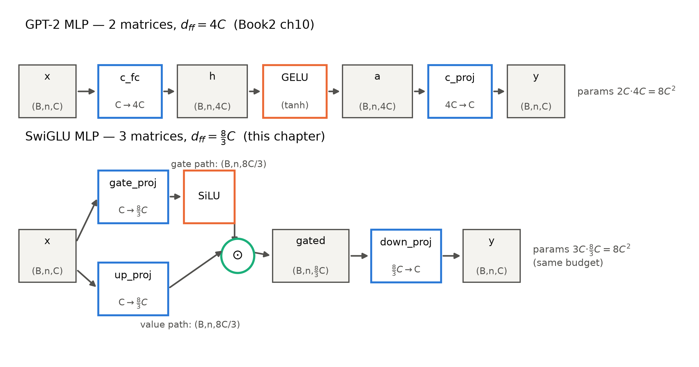
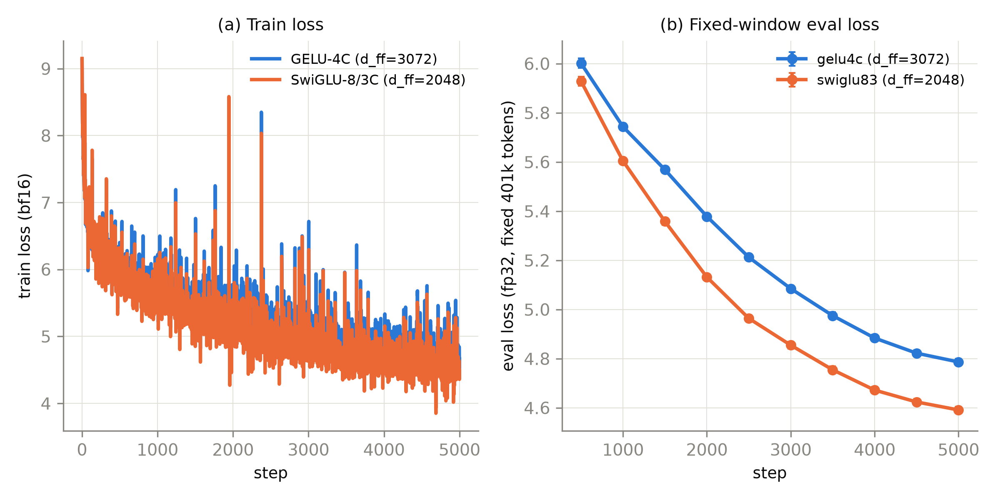
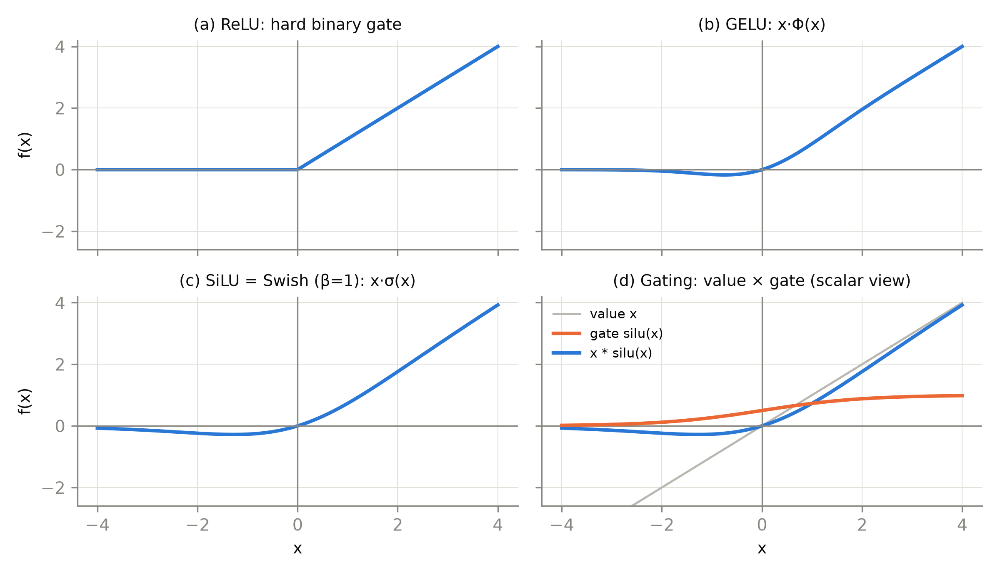

# 第 3 章 SwiGLU：前馈插槽的门控化

## 3.0 开篇：从全书到这里

上一章我们把 Block 的第一格插座换好了：归一化从 LayerNorm 换成 RMSNorm——砍掉重中心化、每处省下一半归一化参数，pre 位置一丝不动，机器照常运转（判读见第 2 章 2.6）。但站在整机（导览图 0.1 的四格插座）前再数一遍：Block 里还躺着两个 2019 年的原装部件——注意力和前馈。这一章动前馈：那个「升维、非线性、降维」的三层车间，凭什么要再多一条「门」？

具体要回答三个问题。其一，GPT-2 的 `c_fc→GELU→c_proj` 已经用了当时最讲究的激活，门控到底多给了什么——机制上的答案是什么？其二，门控前馈从两个矩阵变成三个矩阵，参数凭空多出一半？不——LLaMA 的 $d_{ff}$ 从 $4C$ 缩到 $\tfrac{8}{3}C$，这本「算平的账」是本章的主菜，也是「换组件=换账本」这门手艺的第一次完整演练。其三，在我们自己的 49.6M 小机器上、同样的参数预算下，这一刀换得值不值——一条自己跑出来的消融曲线作答。产出三样：一件换好的 FFN 插槽（[`code/ch03/swiglu.py`](code/ch03/swiglu.py) 的 `SwiGLUMLP`）、一本 $8C^2$ 参数账、一份两臂对照实验。

本章结束时，四格插座换完两格，单轨主线（Book2 的 GPT-2 底座逐格换装）进度过半。剩下最硬的一块骨头——位置信息——留给下一章。

> **最小背景栏**：本章默认你已读过 Book1 第 6 章（FFN 是逐位置独立的车间：$C\to 4C\to C$、4:1 扩展率、参数与计算的双重大户；以及「门控与残差是两条对照解法」的论断）与第 1 章 1.5 节（ConvS2S 在同一位置用门控线性单元 GLU 的公式）；Book2 第 4 章（GPT-1/2 差异清单里的 GELU，`gelu_new` tanh 近似）与第 10 章（`model.py` 三插槽 Block——`ln_1/attn/ln_2/mlp`，今天的手术台与被换零件都在那里）。3.6 节的实验协议直接沿用 Book2 第 8 章的五件套与固定窗 eval 噪声口径。符号约定：残差流宽度记 $C$（即各论文的 $d$ / $d_{model}$，LLaMA 源码的 `dim`），FFN 中间维记 $d_{ff}$（HF config 的 `intermediate_size`）。

## 3.1 一笔六年的旧账

动刀之前，先把 Book1 留下的那笔账原文取回来。第 6 章讲 FFN 车间时埋过一句：

> 「FFN 后续还会挨两刀——先换激活、再连整体结构一起换，门控思想在 GLU 里已经冒头——账记在 Book3 与 Book4，此处只留一个地址，不展开机制。」【证据等级：Book1 第 6 章成稿直引】

本章兑现第一刀。而「门控思想在 GLU 里已经冒头」这半句，背后是一条六年的长线：2016 年 12 月，FAIR 的 Dauphin 等人提出门控线性单元（Gated Linear Unit，GLU），用在做语言建模的**卷积**网络里，门控卷积在 Google Billion Word 上把同量级的 LSTM 比了下去【证据等级：官方论文 1612.08083 v3 §5】；2017 年 5 月，同期的 ConvS2S 把 GLU 装进机器翻译的卷积块——Book1 第 1 章那台翻译机的直接对手用的正是它。一个月后 Transformer 登场，FFN 却用了「裸 ReLU」：门控这条线被**搁置**了。为什么？Book1 第 6 章已经给过判断：门控与残差是同一对问题的两种解法——门控靠分支相乘压幅度，残差靠恒等相加让梯度直通；2017 年的 Transformer 选择了「残差 + 缩放点积」，把门控留在了卷积世界。这个选择在当时没有任何错，只是零件的命运要等账本变了才见分晓。

三年后的 2020 年 2 月，Google 的 Shazeer（2017 原典八作者之一、缩放点积注意力的提出者——见 Book1 第 1 章）把 GLU 家族整个搬回 Transformer 的 FFN，这就是本章的主角论文《GLU Variants Improve Transformer》；又两年，PaLM 在旗舰尺度量产 SwiGLU；2023 年 2 月，LLaMA 把它定成开源骨架的标配【证据等级：官方论文 2002.05202 v1 / 2204.02311 v4 / 2302.13971 v1】。LLaMA 的架构一节只有一句话交代这件事，值得逐字读：

> 「SwiGLU activation function [PaLM]. We replace the ReLU non-linearity by the SwiGLU activation function, introduced by Shazeer (2020) to improve the performance. We use a dimension of $\frac{2}{3}4d$ instead of $4d$ as in PaLM.」【证据等级：官方论文 2302.13971 v1 §2.2】

两件事都在这句里：换激活（SwiGLU），缩维度（$\frac{2}{3}\cdot 4d$）。还藏着一件**没**在句子里的事：LLaMA 三篇报告都没有归一化或激活的消融——LLaMA-2 的消融全部落在上下文长度、注意力分组与后训练侧，Llama-3 的三处在数据与后训练侧【证据等级：官方论文（三报告 grep 负结论，调研期销项 P-14）】。SwiGLU 的证据链在 Shazeer 2020 和后续采用者那里，不在 LLaMA 自家实验——这个证据分工先记住，3.3 节去验原始证据，3.6 节补我们自己的。

## 3.2 GLU：让数据自己决定门开多大

先建立画面，再谈公式。GPT-2 的 FFN 车间是一条流水线：货物（残差流送来的 $(B,n,C)$）升维到 $(B,n,4C)$，在传送带上被 GELU 逐件弯折，再降维回 $(B,n,C)$ 送回去。GLU 把车间改成**两条支路**：一条是货——$x$ 经投影 $W$ 得到的候选内容，不过任何激活；另一条是门卫——同一个 $x$ 经另一条投影 $V$，再过一个 sigmoid，输出压到 $(0,1)$ 之间的「开合度」。两条支路逐元素相乘：门开到 0.9，这个通道的货就放行九成；门关到 0.05，就只漏过 5%。写成式子：

$$
\mathrm{GLU}(x)\;=\;\sigma\!\left(xW\right)\ \odot\ xV
\tag{3.1}
$$

| 符号 | 含义 | 形状 |
|---|---|---|
| $x$ | 输入（残差流一段） | $(B,n,C)$ |
| $W$ | 门支路投影（原论文记号） | $(C,d_{ff})$ |
| $V$ | 值支路投影（保持线性） | $(C,d_{ff})$ |
| $\sigma$ | sigmoid，$\sigma(z)=1/(1+e^{-z})$ | 逐元素 |
| $\odot$ | 逐元素乘 | $(B,n,d_{ff})\odot(B,n,d_{ff})\to(B,n,d_{ff})$ |

用人话说：每个中间通道配一个自己的旋钮，旋钮拧多大不是人定的（不是 ReLU 的「正数全开」也不是 dropout 的「随机关」），而是数据经 $W$ **自己学出来的**。门值长什么样可以用手算感受：$\sigma(0)=0.5$（拿不准，半开），$\sigma(2)\approx 0.88$（强烈放行），$\sigma(-2)\approx 0.12$（强烈抑制），$\sigma(6)\approx 0.998$（几乎全开）——一个连续、可微、逐通道的阀门。再往车间里走一步，拿 $d_{ff}=3$ 的玩具档算一遍乘法：设某位置的值支路输出 $\boldsymbol{v}=(0.7,\,-1.5,\,3.0)$、门支路输出 $\boldsymbol{g}=(2,\,-2,\,0)$，则出门的货是 $\sigma(\boldsymbol{g})\odot\boldsymbol{v}\approx(0.62,\,-0.18,\,1.50)$——第一个通道的货放行近九成，第二个压到一成出头（负值连同符号一起缩），第三个恰好半价放行。门控的全部机制就是这一行逐元素乘法，剩下的只是把两个 $(B,n,d_{ff})$ 从 $(B,n,C)$ 学出来。（记号考据一句：Dauphin 原式把 sigmoid 挂在第二支路、卷积语境写作 $(X*W+b)\otimes\sigma(X*V+c)$，Shazeer 2020 挪到第一支路——两文互为镜像、功能等价；本章此后统一用 HF 命名：过激活的门支路叫 **gate**，线性支路叫 **up**。）

「多一个阀门」本身不难理解，真正的问题是：这比 GELU 好在哪？机制答案在**梯度**里。对 $x\odot\sigma(x)$ 型乘积求导（Dauphin §3 的原式，逐元素含义下）：

$$
\nabla\big[X\odot\sigma(X)\big]\;=\;\nabla X\odot\sigma(X)\;+\;X\odot\sigma'(X)\,\nabla X
\tag{3.2}
$$

用人话说：梯度沿两条路回流——第一条路只被门值 $\sigma(X)$ 加权，**不经过任何导数**：门开着（$\sigma\to 1$），梯度原样通过；第二条路才走 sigmoid 的导数 $\sigma'$（它最大只有 0.25，且越饱和越小）。Dauphin 的原话给这条路起了名字：「This can be thought of as a multiplicative skip connection which helps gradients flow through the layers」——**乘性跳连**【证据等级：官方论文 1612.08083 v3 §3】。对照物是 LSTM 式的 tanh 门控单元（GTU，$\tanh(X)\odot\sigma(X)$）：它的两条梯度路分别被 $\tanh'$ 与 $\sigma'$ 压缩，层一深照样衰减；也对照加性激活（ReLU/GELU 本身）：它们是把信息**本身**弯折，网络对「放行多少」没有独立的发言通道。乘性门把「变换什么」（值支路）与「放行多少」（门支路）解耦成两条各带参数的支路——这正是残差「恒等相加」的乘法版本：两者都在造梯度高速路，一个用 $+1$，一个用 $\times\sigma$。

从这个视角回看 ReLU，会看到一句漂亮的重新解读——Dauphin 写道，ReLU 单元可以看作门控单元的简化：$\mathrm{ReLU}(X)=X\odot\mathbb{1}[X>0]$，门「取决于输入的符号而激活」【证据等级：官方论文 1612.08083 v3 §5.2】。也就是说 ReLU 不是「没有门」，而是一枚**二值硬门**：只有全开、全关两档，开合由符号一刀切，且旋钮焊死、不可学习。于是激活的演进有了一个统一的坐标系：从硬门到软门，从无参数的门到有参数的门。GLU 在卷积侧的战绩证明了软门值钱：在参数量对齐的公平比较下（原话特意声明 "for fair comparison, we carefully cross-validate models with a comparable number of parameters"），GBW 十亿词库上 GLU 比 ReLU 好约 5 个困惑点，GCNN-13 达到 38.1、优于同设置 LSTM 的 39.8；更大的 GCNN-14B 用 8 张 GPU 训两周到 31.9，对照的大 LSTM 用 32 张 GPU 三周才到 30.6——四分之一的硬件换到同量级质量【证据等级：官方论文 1612.08083 v3 §5.2 与 Tables 2/3】。门控在 2016 年就证明了自己——缺的只是把它请回 Transformer 的那一步。

## 3.3 变体超市：GEGLU 与 SwiGLU 胜出

把 GLU 搬回 FFN 的那一步，Shazeer 2020 做得极像一个「超市上架」动作：既然门支路上的非线性可以是任何函数，那就把激活函数货架整个搬过来试一遍。门控单元族一步排开（记号承式 (3.1)，激活都挂在 $W$ 支路上）：

$$
\begin{aligned}
\mathrm{GLU}(x)&=\sigma(xW)\odot xV, &\quad \mathrm{Bilinear}(x)&=(xW)\odot(xV),\\
\mathrm{ReGLU}(x)&=\max(0,\,xW)\odot xV, &\quad \mathrm{GEGLU}(x)&=\mathrm{GELU}(xW)\odot xV,
\end{aligned}
\tag{3.3}
$$

货架的第五件是本章主角——门上挂 SiLU 的那一支，包装成完整 FFN：

$$
\mathrm{FFN}_{\mathrm{SwiGLU}}(x)\;=\;\Big(\mathrm{Swish}_{1}\big(xW_{\text{gate}}\big)\ \odot\ xW_{\text{up}}\Big)\,W_{\text{down}}
\tag{3.4}
$$

用人话说式 (3.4)：升维两次（gate 与 up 各一次，$(B,n,C)\to(B,n,d_{ff})$ 各一份），门支路过 Swish 后与 up 支路逐元素相乘，再降维回 $(B,n,C)$——三次投影、一次乘法，这就是「三矩阵 FFN」的全部。门上的非线性是

$$
\mathrm{Swish}_{\beta}(x)\;=\;x\,\sigma(\beta x),\qquad \beta=1\ \text{时即 SiLU（torch 的 F.silu）}.
\tag{3.5}
$$

用人话说：先算一个开门倾向 $\sigma(\beta x)$（$\beta$ 越大，门开得越果断），再把它当系数乘回 $x$ 自己——Swish 是「自己给自己当门」的函数，这正是 3.7 节「自门」一词的出处。三点考据与提醒跟着记下。其一，Swish 不是设计出来的而是**搜出来的**（Ramachandran et al. 2017 用搜索找激活函数，arXiv:1710.05941——「用算力换结构」时代的注脚），$\beta=1$ 的特例 SiLU 才是工程默认；它与 Book2 第 4 章 GPT 用的 GELU(tanh 近似) 长得很像（3.7 节的四景图里两者并排），都是「零点附近软过渡、负半轴留一点小尾巴」——区别在门控语境下它是**门函数**而不是对货物的弯折。其二，包装成 FFN 时**去掉了 bias**——Shazeer 注明「Following the T5 codebase, we use a version with no bias」，LLaMA 与 HF 沿用至今【证据等级：官方论文 2002.05202 v1 §2】。其三，一句诚实提醒：SiLU 并不严格落在 $(0,1)$——它正值区可以超过 1、负区有一个 $-0.28$ 的浅谷，所以 SwiGLU 的「门」是广义的调制旋钮，不是严格的阀门（3.7 节四景图的 (d) 栏里门曲线清晰越过 1）。

货架摆好了，成绩单是 Table 1：T5-base 骨架（$C=768$、12+12 层），$d_{ff}$ 从 3072 缩到 2048（参数预算对齐，账在 3.4 节细算），C4 去噪目标预训练——6.5 万步短跑（4 个种子报标准差）与 52.4 万步长跑两档：

**表 3.1** GLU 变体族预训练困惑度（heldout log-ppl，越低越好；重排自 Shazeer 2020 Table 1）

| FFN 变体 | 65,536 步（4 短跑 std） | 524,288 步 |
|---|---|---|
| FFN_ReLU（baseline） | 1.997 (0.005) | 1.677 |
| FFN_GELU | 1.983 (0.005) | 1.679 |
| FFN_Swish | 1.994 (0.003) | 1.683 |
| FFN_GLU | 1.982 (0.006) | 1.663 |
| FFN_Bilinear | 1.960 (0.005) | 1.648 |
| FFN_ReGLU | 1.953 (0.003) | 1.645 |
| FFN_GEGLU | **1.942** (0.004) | **1.633** |
| FFN_SwiGLU | 1.944 (0.010) | 1.636 |

【证据等级：官方论文 2002.05202 v1 §3.2 Table 1】

如实读这张表，有三层。第一层：**门控族整体压倒非门控族**——长跑列里三个非门控变体（1.677–1.683）全部输给五个门控变体（1.633–1.663），两族零重叠；门控族里最弱的一档恰是挂裸 sigmoid 的 FFN_GLU（1.663，即式 (3.1) 的原型），仍压过全部非门控，门控本身的价值清楚。第一层里还藏着一个更锋利的注脚：Bilinear——门上什么都不挂，纯 $(xW)\odot(xV)$ 裸乘法——长跑 1.648 照样压过全部非门控变体；Dauphin 那边也有同款观察（纯 bilinear 远好于线性网络，GLU 再好一截）【证据等级：官方论文 1612.08083 v3 §5.3】。连「没有门函数的门」都赢过了精心设计的激活，说明收益的大头来自**乘性结构**（两条支路的乘积交互），门函数的形状（sigmoid/GELU/SiLU）是地基上的再打磨——这为 3.2 节的梯度机制解释补了一层实证。第二层：**GEGLU 与 SwiGLU 并列最好**（1.633 与 1.636，差距 0.003 在短跑 std 量级内），论文原话也只是「The GEGLU and SwiGLU variants produce the best perplexities」——并不存在「SwiGLU 严格最优」的论文结论。第三层更要紧：**下游微调噪声大**。GLUE/SuperGLUE/SQuAD 上各变体互有胜负（论文原话承认「While the results are noisy, the new GLU-variants perform best on most of the tasks」；SuperGLUE 均分 SwiGLU 74.56 最高，GLUE 均分却是 ReGLU 84.67）【证据等级：官方论文 2002.05202 v1 §3.3 Tables 2-4】。工业界（PaLM、LLaMA 及其后几乎全体）最终选了 SwiGLU 而非数字上略好的 GEGLU——这个选择没有论文级判决背书，如实说：经验配方。论文作者对「为什么有效」的态度，则直接躺平在结尾一句话里：

> **【考据框】** Shazeer 2020 全文最后一句："We offer no explanation as to why these architectures seem to work; we attribute their success, as all else, to divine benevolence."（对这些架构为何有效，我们不提供解释；它们的成功，一如其他一切，归于神的恩典。）【证据等级：官方论文 2002.05202 v1 §4 逐字】——四页纸通篇没有机制论证，只有网格与数字。这不是作者的怠慢，而是这类「经验组件」的常态：先有证据、后有采用、解释欠奉。对本册的方法论寓意是：证据等级栏里「组件论文的表格」与「机制理解」要分开记账——我们讲了乘性跳连的梯度机制（3.2 节），但那是**候选解释**，不是论文给出的胜出理由。

## 3.4 2/3 隐藏维：把参数账算平

门控好用，但天下没有免费的第三矩阵。两矩阵 FFN 的参数是 $2\cdot C\cdot 4C$；门控后变三个投影，若 $d_{ff}$ 维持 $4C$，参数涨 50%——旗舰也许付得起，控制变量的科学付不起，LLaMA 的预算哲学也不肯付。Shazeer 的解法一句话：「All of these layers have three weight matrices, as opposed to two for the original FFN. To keep the number of parameters and the amount of computation constant, we reduce the number of hidden units $d_{ff}$ … by a factor of 2/3.」【证据等级：官方论文 2002.05202 v1 §2 逐字】。展开成手算：

$$
\underbrace{2\cdot C\cdot 4C}_{\text{两矩阵，}d_{ff}=4C}\;=\;\underbrace{3\cdot C\cdot \tfrac{8}{3}C}_{\text{三矩阵，}d_{ff}=\frac{8}{3}C}\;=\;8C^{2}
\tag{3.6}
$$

用人话说：矩阵从两个变三个，那把每个矩阵的宽度缩到原来的三分之二——三乘以三分之二等于二，参数与每 token 乘加数都精确回到 $8C^2$（Book1 第 6 章的账本二里 FFN 每位置 $8d^2$ 次乘加，正是这里的数）。拿本章实验档手算一遍：$C=768$，两矩阵 $d_{ff}=3072$，参数 $2\times 768\times 3072=4{,}718{,}592$；三矩阵 $d_{ff}=2048$，参数 $3\times 768\times 2048=4{,}718{,}592$——逐位相等，这就是 3.6 节实验选 768 宽的原因（$\tfrac{8}{3}\times 768=2048$ 整除，零误差）。但账要两边算：**参数与计算中性，激活内存不中性**。两矩阵的中间激活是 $(B,n,4C)$ 一份；三矩阵要同时持有 gate 与 up 两份 $(B,n,\tfrac{8}{3}C)$，合计 $\tfrac{16}{3}C\approx 5.33C$，比 $4C$ 多约三分之一——训练时显存与访存的代价，换结构时一并买单。

$\tfrac{8}{3}C$ 大多不是整数，落地要取整，LLaMA 的取整方式写在官方参考实现里，三行代码值得逐行读（Meta `llama/model.py`，`FeedForward.__init__`）：

```python
hidden_dim = int(2 * hidden_dim / 3)              # hidden_dim 初值 = 4*dim → 8C/3（向零取整）
if ffn_dim_multiplier is not None:                # Llama-2 70B 起为 1.3（见下）
    hidden_dim = int(ffn_dim_multiplier * hidden_dim)
hidden_dim = multiple_of * ((hidden_dim + multiple_of - 1) // multiple_of)  # 向上取整到 256 倍数
```

写成一个式子：

$$
d_{ff}\;=\;\Big\lceil \tfrac{8}{3}C\Big\rceil_{256}\;\triangleq\;256\cdot\Big\lceil \tfrac{8C/3}{256}\Big\rceil
\tag{3.7}
$$

用人话说：八分之三倍宽度算出来不是整数没关系，向上取到 256 的倍数为止（mult 档先乘 1.3 再取整）。`multiple_of=256` 的注释原文只有一句："make SwiGLU hidden layer size multiple of large power of 2"——$256=2^8$；为什么偏爱 2 的幂，注释没展开，工程通行理解是维度对齐对硬件与切分更友好，此为惯例而非论文结论，如实记。这个公式能不能真的复现各家 config？我们把 LLaMA1/2/3 七档全部复算一遍（[`code/ch03/swiglu.py`](code/ch03/swiglu.py) 的 `llama_d_ff`，运行输出逐档 OK）：

**表 3.2** d_ff 七档对账（复算公式 (3.7) vs config 实测）

| 模型 | $C$ | multiplier | multiple_of | 复算 $d_{ff}$ | config 实测 | $d_{ff}/C$ | 证据等级 |
|---|---|---|---|---|---|---|---|
| LLaMA-1 7B | 4096 | — | 256 | 11008 | 11008 | 2.69 | config 逆向（HF 镜像） |
| LLaMA-1 13B | 5120 | — | 256 | 13824 | 13824 | 2.70 | 同上 |
| LLaMA-1 33B | 6656 | — | 256 | 17920 | 17920 | 2.69 | 同上 |
| LLaMA-1 65B | 8192 | — | 256 | 22016 | 22016 | 2.69 | 同上 |
| Llama-2 70B | 8192 | 1.3 | 4096 | 28672 | 28672 | 3.50 | config 逆向（mult 为社区引述，见注） |
| Llama-3 8B | 4096 | 1.3 | 256 | 14336 | 14336 | 3.50 | 同上 |
| Llama-3 70B | 8192 | 1.3 | 4096 | 28672 | 28672 | 3.50 | 同上 |

【证据等级：复算=本书实验（CPU，2026-10，7/7 吻合）；config 值=config 逆向（HF 公开镜像）；Llama-2 70B 的 `multiple_of=4096` 与 `ffn_dim_multiplier=1.3` 为社区转述官方 params.json（datascience.SE 与 llama.cpp PR 双源一致），引用须注明】

七档全中，两件事实浮出来。第一，「$\tfrac{8}{3}$」是**配方不是法律**：四档 LLaMA-1 落在 2.69–2.70（取整的痕迹），TinyLlama 甚至是 2.75（5632/2048，config 逆向）；第二，Llama-2 70B 起 `ffn_dim_multiplier=1.3` 把比率抬到 3.5——量产代每一代都在自调这笔账，Shazeer 的「严格 $8C^2$」是对齐实验口径，工程上要的是「差不多这个量级、且是 2 的幂的倍数」。连我们自己的 207M（第 10 章）也要吃取整盈余：$C=1024\to\tfrac{8}{3}C=2730.67\to 2816=11\times 256$，每层 FFN 参数 $3\times 1024\times 2816=8{,}650{,}752$，比 $8C^2=8{,}388{,}608$ 多 **3.125%**——取整的账，改谁的 config 都要算。

最后看反例。PaLM 同样用 SwiGLU，但明说「The feed-forward size $d_{ff}$ is always $4\times d_{model}$」——不缩，宁付三矩阵多出来的 50% 参数与算力；它的修改列表还专门补了一句「Note that this does require three matrix multiplications in the MLP rather than two…」【证据等级：官方论文 2204.02311 v4 架构修改列表与模型规格】。把两种哲学放到 7B 档算一算更清楚：LLaMA-1 7B 每层 FFN 参数 $3\times 4096\times 11008\approx 135.3\text{M}$（32 层共约 4.33B）；若按 PaLM 式不缩，同样的三矩阵要 $3\times 4096\times 16384\approx 201.3\text{M}$——每层多 66M、全模型多约 2.11B，总量膨胀三成。同一个激活，两种预算哲学：LLaMA 的立场是「参数预算刚性，同预算内换更好的结构」（式 (3.6) 的恒等式就是它的尺）；PaLM 的立场是「旗舰不差钱，维度比例保持简单」（$4\times$ 的整数比在切分与实现上都省心，代价写进账本）。谁对？都对——**组件选择从来是账本决策**，先问你的预算约束是什么，再问组件值多少。这条判断力从本章带走，第 8 章组装法庭上还要用它。

## 3.5 改装第二例：MLP 插槽换装

账算平了，回装配线。手术对象仍是 Book2 第 10 章 `model.py` 的三插槽 Block：`x = x + attn(ln_1(x)); x = x + mlp(ln_2(x))`。上一章动了 `ln_1/ln_2`（和 `ln_f`），这一章只动 `mlp` 一格——注意力原封不动，等第 6 章。对 Book2 的 `MLP`（`c_fc: C→4C`、GELU(tanh)、`c_proj: 4C→C`，均带 bias）的 diff 一共三条：

1. **矩阵结构**：`c_fc/c_proj` 两矩阵 → `gate_proj/up_proj/down_proj` 三矩阵（$C\to d_{ff}$、$C\to d_{ff}$、$d_{ff}\to C$），全部无 bias——GPT-2 MLP 的 `c_fc/c_proj` bias 也一并拔掉（$C=768$ 档全模型少 23,040 个参数，-0.05%，随参数账如实报）；
2. **中间维**：$d_{ff}=4C\to\tfrac{8}{3}C$（3072→2048），参数与乘加恒等（式 (3.6)）；
3. **门上的非线性**：`gelu_new`（GELU tanh 近似，Book2 第 4 章的差异清单）→ `F.silu`（$\mathrm{Swish}_{\beta=1}$，式 (3.5)）——注意激活**只挂在 gate 支路**，up 支路保持线性，这是「门控」区别于「逐层激活」的结构性一句。

换装后的权路见图 3.1：上排是 GPT-2 的两矩阵流水线，下排是三矩阵门控权路——同一份输入 $(B,n,C)$ 分两路升维、SiLU 门控、逐元素乘、压回。逐运算的形状流转列为表 3.3（正文讲解与代码注释共用这份账）：



图 3.1 门控前馈权路：GPT-2 两矩阵 MLP 与 SwiGLU 三矩阵 MLP 对照（自绘示意级；每个张量框标注形状，$d_{ff}=4C$ 对 $d_{ff}=\tfrac{8}{3}C$，两路参数同为 $8C^2$）

**表 3.3** SwiGLU-MLP 形状流转表（$B$=批，$n$=序列长，$C$=残差流宽，$d_{ff}$=中间维）

| 步骤 | 运算 | 输入形状 | 输出形状 | 说明 |
|---|---|---|---|---|
| 1 | `gate_proj` | $(B,n,C)$ | $(B,n,d_{ff})$ | 门支路（过 SiLU 后作门控系数） |
| 2 | `up_proj` | $(B,n,C)$ | $(B,n,d_{ff})$ | 值支路：候选内容，保持线性 |
| 3 | SiLU（式 (3.5)） | $(B,n,d_{ff})$ | $(B,n,d_{ff})$ | 逐元素，$x\sigma(x)$ |
| 4 | $\odot$ 逐元素乘 | $(B,n,d_{ff})\times(B,n,d_{ff})$ | $(B,n,d_{ff})$ | 门控：值×门 |
| 5 | `down_proj` | $(B,n,d_{ff})$ | $(B,n,C)$ | 压回残差流宽度 |

正身代码是本章交付的 [`code/ch03/swiglu.py`](code/ch03/swiglu.py)（教学重写件），核心五行：

```python
# [`code/ch03/swiglu.py`](code/ch03/swiglu.py) 的 SwiGLUMLP.forward
def forward(self, x):
    gate = self.gate_proj(x)          # (B,n,C) -> (B,n,d_ff)：门支路原始输出
    up = self.up_proj(x)              # (B,n,C) -> (B,n,d_ff)：值支路（线性，被门调制）
    gated = F.silu(gate) * up         # (B,n,d_ff)：SiLU(gate) 作门控系数乘上值（式 (3.4)）
    return self.down_proj(gated)      # (B,n,d_ff) -> (B,n,C)
```

换装件按全书插槽 import 契约交付：类名 `SwiGLUMLP(cfg)`、参数键位与 HF 的 `LlamaMLP` 逐一同名（`gate_proj/up_proj/down_proj`，无 bias），`cfg` 只读 `hidden_size/intermediate_size` 两个字段。验收是两道 CPU fp32 对拍，实测都过：与调研期组件库正身 `00-feasibility/llama_slots.py` 的 `SwiGLU` 同权重前向 **max|Δ|=0.000e+00（逐位一致）**；与 HF transformers 5.18.0 的 `LlamaMLP` 同 config 同权重 `load_state_dict(strict=True)` 直搬，**max|Δ|=0.000e+00、argmax 一致率 1.0000**【证据等级：本书实验（CPU，2026-10）】。零差异不奇怪——两边本来就是同一个算式，对拍的目的是把「键位契约」钉死：往后第 10 章整机 import 这一件、以及任何 HF 权重搬入，都靠这三个键名不歪。

> **【实现对照框】** HF transformers 5.18.0 `modeling_llama.py` 的 `LlamaMLP`（L163-176）：`down_proj(act_fn(gate_proj(x)) * up_proj(x))` 一行即全部，与式 (3.4) 逐符号对应；`act_fn` 由 config 的 `hidden_act="silu"` 字符串经 `ACT2FN` 字典延迟实例化（`F.silu` 与 `nn.SiLU()` 数值等价）；bias 由 `mlp_bias` 字段控制、默认关。一个 config 逆向的命名考据：`hidden_act` 只命名**门上的非线性**，三矩阵门控结构本身硬编码在 `LlamaMLP` 类里——所以光读 config 说得出「用了 silu」，说不出「这是 SwiGLU」。字段读不出结构、结构长在实现里，这是第 5 章 config 反推法要正式处理的边界。

## 3.6 模块消融：同预算下的一刀

零件换上了，现在回答开篇第三问：值不值。实验设计的第一个教学点就在「怎么比」——**质量对照必须在参数对齐下才有意义**。若拿 GELU-4C（$d_{ff}=3072$）对 SwiGLU-4C（$d_{ff}=3072$）比，SwiGLU 赢了分不清是门控好还是参数多 50% 的功劳；若对 SwiGLU-$\tfrac{8}{3}C$ 比而不做参数核对，取整盈余又会混进来。所以主实验选 $C=768$ 的**零误差档**：$3\times 768\times 2048=2\times 768\times 3072=4{,}718{,}592$ 逐位相等（脚本 assert 锁死，盈余 0.0%）；另留一个 $C=512$ 的 sanity 档演示「反面教材」：$\lceil\tfrac{8}{3}\cdot 512\rceil_{256}=1536$，三矩阵参数反而**盈余 +12.5%**——参数不对齐时「谁赢」没有单变量意义，这正是主实验宁可用更宽的 768 档的原因。（探针期曾按 128 倍数规则取整到 1408，正式消融统一到官方 256 倍数规则——探针数字只作历史记录，不进正文。）

协议与第 2 章同款（判据预注册，全文见随书仓库 `code/ch03/preregistered.md`，与第 2 章判据同时落盘）：两臂从同一份 GPT-2 底座出发（同种子、同 RNG 序列，注意力/归一化/嵌入初始权重逐位相同），`gelu4c` 臂保留原装 MLP，`swiglu83` 臂只换 `mlp` 插槽；换装件重打 GPT-2 口径初始化（gate/up $\sim N(0,0.02)$、down 作残差流出端 $\sim N(0,0.02/\sqrt{2L})$，与被换的 `c_proj` 同待遇）——单变量才干净。顺带一笔初始化的家谱：给门控块配方差是老传统——ConvS2S 的 GLU 就配有专属初始化 $N(0,\sqrt{4/n_l})$，推导出发点正是「乘积会把方差乘起来」【证据等级：官方论文 1705.03122 v3 附录 A，Book1 已核资产】；我们的 down 缩放与它是同一家族的手艺。训练沿用 Book2 五件套（AdamW 0.9/0.95、wd 0.1、clip 1.0、余弦、warmup 100），两臂按步号取**完全相同的数据批**；eval 用固定 49 窗共 401,408 token、fp32 前向（Book2 第 8 章协议，批间 se≈0.012）。判据预注册里写明了**负结果预案**：论文的差距（Table 1 长跑列 1.677−1.636≈0.04 log-ppl）出现在 $C=768$、数十亿 token、≥6.5 万步的档位；本机 5000 步只有 41M token，小两个数量级——预期差距落在 ±0.02 nat 噪声带内，落进去了就如实写负结论，那本身就是「组件改进的效应量随规模显影」的教学点。

fast 档（1000 步，lr 日程按 1000 步收尾）先出的数已经打了预案的脸：两臂终评 **gelu4c 5.6795±0.0125 vs swiglu83 5.5428±0.0118**，差 **0.1366 nat**——远超 0.02 的噪声带，方向与论文一致（门控更低）；且差距随训练放大（500 步中途差 0.076 → 1000 步 0.137）【证据等级：本书实验（MPS bf16 训练/fp32 eval，2026-10）】。

full 档（5000 步、41M token，两臂同日程退火）把结论钉死：**gelu4c 终评 4.7866±0.0134，swiglu83 终评 4.5914±0.0134，差 0.1952 nat**——噪声带的近十倍，方向仍与论文一致；两臂初始 loss 9.13–9.15（≈$\ln 8192$ 加初始化方差项）、全程无发散、无断点续跑，训练健康无疑【证据等级：本书实验（MPS bf16 训练/fp32 eval，2026-10，独占 MPS 窗口）】。轨迹比终值更有信息量：差距从 500 步的 0.073 一路放大到 2500 步的峰值 0.249，随余弦退火收尾小幅收窄到 0.195——全程没有一刻落回带内。两臂的训练与固定窗 eval 曲线见图 3.2，右图两条误差棒带从头到尾清晰分离。



图 3.2 GELU-4C vs SwiGLU-8/3C 消融曲线（自产，full 5000 步，参数对齐档 $C=768$：每层 FFN 矩阵参数 $4{,}718{,}592$ 逐位相等；左=训练损失 bf16，右=固定窗 eval fp32，误差棒=49 批批间 se）【证据等级：本书实验（MPS，2026-10）】

但预案的纪律还要执行最后一步——把档位限定说满。0.195 这个数**不能**与论文的 0.04 并列成「复现」：本实验是 49.6M 参数、41M token、8k 词表的欠训练小档，论文是 768 宽、数十亿 token、52 万步的旗舰档，数据、词表、目标全不同。唯一可转移的结论是**方向**：同预算下门控前馈占优，且在本档位的相对收益比论文档位更大。至于「为什么小档的差距反而更大」，诚实的答案是我们不知道——一个候选解释是欠训练阶段门控的乘性梯度通路（3.2 节）先兑现了收益，但单种子证据不足以裁决机制，登记为悬案，留给更高算力的重启实验（第 10 章设计文档）。

速度与内存单列：full 稳态 0.3211 vs 0.3274 s/step（+2.0%，三矩阵多一次投影与一次逐元素乘的代价），两臂 wall-clock 28.4+29.0 min；MPS 峰值增量 1146→1535 MB——激活从 $4C$ 一份变 $\tfrac{8}{3}C$ 两份的空间账（3.4 节），在实测里原样显形【证据等级：本书实验（MPS，2026-10）】。单种子是本协议的边界（丛书规范：单种子+方差讨论替代多种子）：eval 的批间 se≈0.013 只覆盖采样噪声，不覆盖优化路径方差；0.195 nat 的差距是它的十五倍，方向翻转所需的方差量级不合理，但「差距的精确数值」应读作本种子本档位的实测，不是总体均值。

## 3.7 收拢：激活演进的两条正交轴

前馈车间动完了，把 ReLU→GELU→SwiGLU 这条演进线收拢一下——它其实不是一条线，是**两条正交的轴**。轴一是**平滑化**：从 ReLU 的硬折角到 GELU 的软过渡，「开门概率」从符号函数换成连续函数（$x\Phi(x)$），零点附近不再一刀切。轴二是**门控化**：门从「没有」（激活直接弯折货物）到「自门」（GELU-FFN：门由货物自身的形状决定，$\Phi(x)$ 是 $x$ 的函数）再到「他门」（SwiGLU：门由**另一条带参数的支路**算出，门有了自己的参数和意见）。两轴可以拆开评价：原始 GLU 有门控，但门是裸 sigmoid，既不平滑也没有形状先验；GELU 平滑，但门止步于「自门」；SwiGLU 站在两轴的交点上——平滑的门函数（SiLU）+ 独立的门支路（$W_{\text{gate}}$）。四幅函数景并排见图 3.3：ReLU 的硬折角、GELU 与 SiLU 几乎双胞胎的软曲线（区别只在小尾巴的形状）、以及右下角把「值×门」拆开看的门控乘积——灰线是货物本身，橙线是门，蓝线是出门的货。



图 3.3 激活函数四景（自产，$x\in[-4,4]$）：(a) ReLU 二值硬门；(b) GELU；(c) SiLU（$\mathrm{Swish}_{\beta=1}$）；(d) 门控的标量视角——货物 $x$、门 $\mathrm{silu}(x)$、出门的货 $x\cdot\mathrm{silu}(x)$

回到整机：四格插座换完两格——归一化（第 2 章）与前馈（本章），Block 里只剩注意力一格原装（第 6 章动它，且要先把位置的账算了）。每次换装我们都做了同一件事：同预算、单变量、对拍、消融——这套流程本身，正在变成你的手艺。

## 3.8 本章小结

开篇三问，逐一作答。**凭什么多一条门？**——GLU 把 FFN 的单流水线改成值×门两条支路：门开多大由数据自己学（式 (3.1)），梯度沿乘性跳连无损回流（式 (3.2)，对照 GTU 的双路压缩与 ReLU 的二值硬门）；Shazeer 的变体网格把整架激活搬进门里试遍，门控族整体胜出、GEGLU 与 SwiGLU 并列最好（表 3.1）。**参数账怎么算平？**——三矩阵缩 $\tfrac{8}{3}$：$3\cdot C\cdot\tfrac{8}{3}C=8C^2$，参数与乘加恒等、激活内存 +1/3（式 (3.6)）；落地再取整到 256 的倍数（式 (3.7)，表 3.2 七档复算全中），Llama-2 70B 起更乘 1.3 放大到 3.5 倍率——PaLM 不缩、LLaMA 缩，两种预算哲学都对，取决于账本约束。**小机器上值不值？**——参数逐位对齐、单变量换装、同批同日程：full 5000 步终评差 0.195 nat（swiglu83 更低，噪声带的近十倍；fast 1000 步即达 0.137），方向与论文一致、量级远大于论文档位——档位限定与悬案登记见 3.6 节；速度代价 +2.0%，激活内存 +1/3 的账在实测里显形。零件本体验收也过了：`SwiGLUMLP` 与 llama_slots 正身逐位一致、与 HF `LlamaMLP` 零差异。

**带走的心智**：把数字都还回去，留下三句话。**第一，FFN 的本质是「值×门」，不是「升维-弯折-降维」**——从 ReLU 的二值硬门到 SwiGLU 的带参软门，演进只是在把「门」做得越来越像样；往后你读任何前馈变体，先找它的门在哪、门由谁决定。**第二，换组件=换账本**——同预算换结构是 LLaMA 组件化的标准姿势，$8C^2$ 恒等式是那把尺，取整与 multiplier 是工程上的手调螺丝；看到任何新模型的 `intermediate_size`，先算它对 $C$ 的比率，你就知道它站在哪种预算哲学上。**第三，经验先于解释**——胜出组件可以没有机制论证（divine benevolence），证据等级栏里「表格」与「理解」分开记，这是读组件论文的卫生习惯。

到这里，机器的前一半已经现代化：归一化更简了，前馈会开门了。但位置信息还原封不动地背着两笔旧账——2017 年的正弦公式，和 Book2 那面 1024 行的查表墙（Book1 F6 与 Book2 N2 两笔欠账的主场）。下一章动最硬的一块骨头：把位置**转**进注意力里——2017 年的公式和 1024 行的查表，都要下岗。

> **【欠账】** Book1 第 6 章埋下的「FFN 后续还会挨两刀」的第二刀：本章只换了门控激活，FFN 的**整体结构**原样保留——把车间拆成「路由 + 多个专家群」、按 token 挑专家来用、参数不再每次全上这一刀，属于规模与效率的主线。→ Book4 第 2-5 章

## 3.9 动手验证

- **换装件与双对拍**（CPU 秒级，本章 3.5 节全部自测数字的来源）：
  ```bash
  cd 工作区根目录 && source env.sh && \
    python [`code/ch03/swiglu.py`](code/ch03/swiglu.py)
  ```
  预期产出：对拍① 与 llama_slots 正身 max|Δ|=0.000e+00；对拍② 与 HF `LlamaMLP` max|Δ|=0.000e+00、argmax 一致率 1.0000；参数账 $2\cdot768\cdot3072=3\cdot768\cdot2048=4{,}718{,}592$；表 3.2 七档复算 7/7 OK。
- **模块消融**（fast ≈12 min 两臂 / full ≈57 min 两臂，MPS，计时须独占窗口）：
  ```bash
  cd 工作区根目录 && source env.sh && \
    python [`code/ch03/ablation_ffn.py`](code/ch03/ablation_ffn.py) --steps 1000 --out-name fast
  python [`code/ch03/ablation_ffn.py`](code/ch03/ablation_ffn.py) --steps 5000 --out-name full
  # 产物：log/book3-ch03/ablation_ffn_{fast,full}.json + curve_{gelu4c,swiglu83}_{fast,full}.csv
  # 取整盈余 sanity 档（选做，不作显著性判读）：--cells sanity512
  ```
- **复画图 3.1-3.3**（秒级；图 3.2 需先有消融曲线）：
  ```bash
  cd 工作区根目录 && source env.sh && \
    python [`code/ch03/make_figures.py`](code/ch03/make_figures.py)
  ```
- **验收点**：能把式 (3.6) 的参数恒等式默写出来并手算任一 $C$ 档的取整盈余（如 $C=1024$ 的 +3.125%）；能不看书说出 gate 与 up 哪条支路过激活、为什么；能把 `SwiGLUMLP` 的三个键名与 HF `LlamaMLP` 对上，并解释 `hidden_act="silu"` 为什么读不出 SwiGLU。
