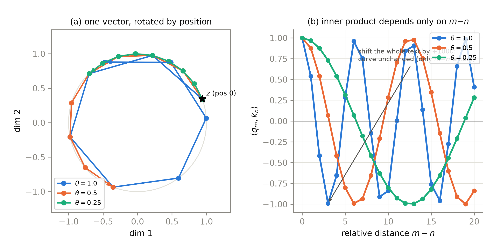
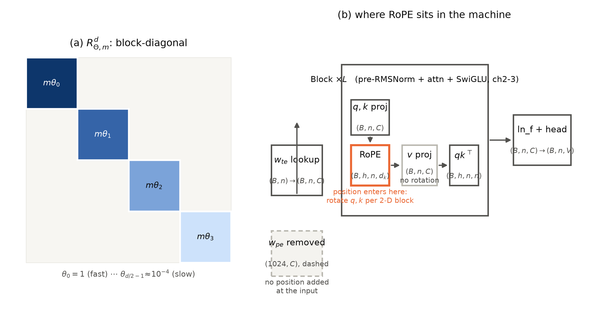
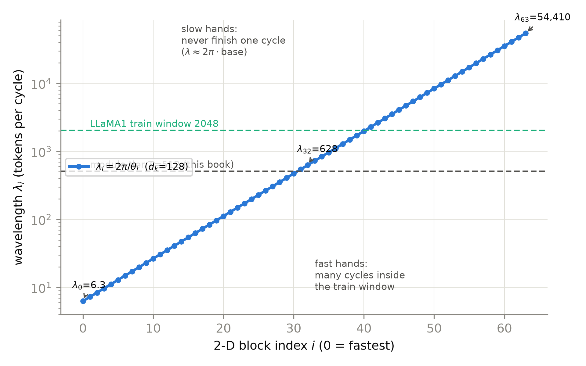
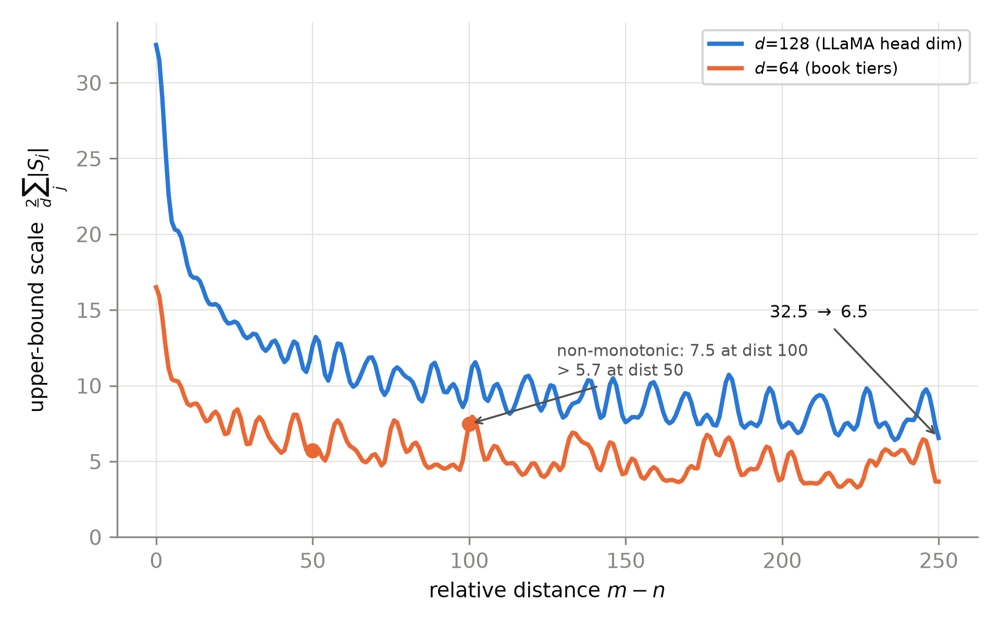
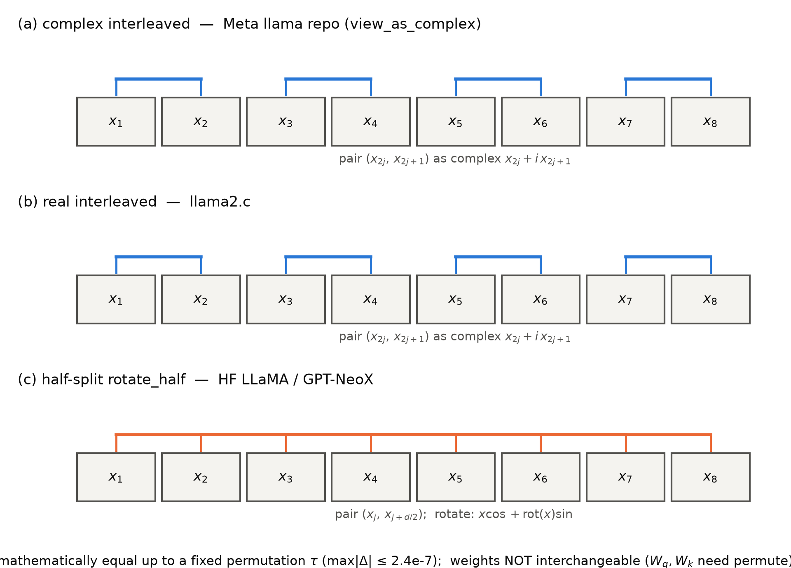
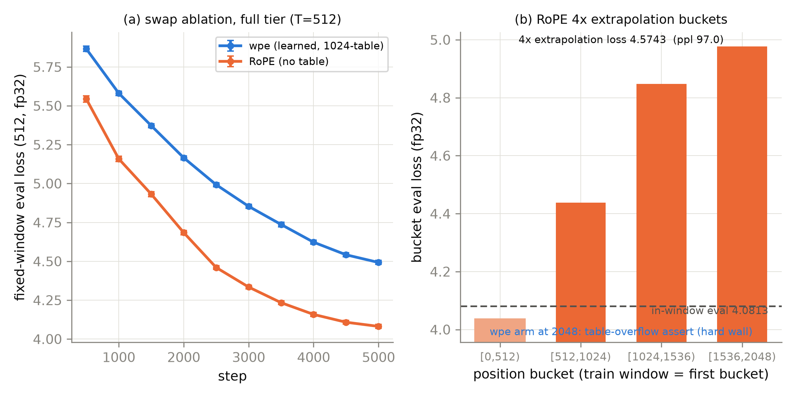

# 第 4 章 RoPE 深剖：把位置转进注意力里

## 4.0 开篇：从全书到这里

上一章我们把四格插座的第二格换好了：前馈从 GELU 两矩阵换成 SwiGLU 三矩阵，账算平、门装上、消融曲线作证（第 3 章 3.6 节）。但改装手册翻到第三格，手术难度陡然上升——归一化与前馈都是「形状进出不变、拔了就换」的局部零件，位置编码却牵动整条数据河：在 Book2 的 GPT-2 里，位置信息在**入口处**与词嵌入相加；拆掉入口那张查表，位置必须在**别处**重新注入，而别处只能是注意力内部。这一章动这一刀，也是本册数学上最重的一章。

要回答三个问题。其一，加性注入的病灶到底在哪——学习式查表、正弦公式、相对偏置的各家方案，共享的结构弱点是什么？其二，有没有一种注入方式让注意力分数**天生只依赖相对距离**——数学上怎么把它构造出来、工程上怎么高效落地？其三，换件值不值——在模块档小机器上拆掉查表换上旋转，同窗质量与 4 倍长度窗口两张考卷怎么答？产出三样：一件换好的位置插槽（[`code/ch04/rope.py`](code/ch04/rope.py)）、一张波长谱表（本章招牌道具，第 7 章的地图）、一份换件消融与外推退化的诚实答卷。

本章结束时，位置信息的两笔旧账——Book1 留下的外推承诺（F6）与 Book2 立此存照的 1024 位之墙（N2）——将还掉「原理重估」与「结构性解除」各一半；剩下的一半（外推的工程挣扎）属于第 7 章。

> **最小背景栏**：本章默认你读过 Book1 第 5 章（自注意力置换等变、正弦位置编码的公式与「256 根指针的仪表盘」心智、内积只依赖相对距离的那句 hypothesized），Book2 第 4 章手术③（GPT-2 的 `wpe` 学习式查表）与第 10 章 `model.py`（手术台，`wpe` 在 L133、前向相加在 L166）。数学工具只需高数的泰勒展开；复数与欧拉公式 4.3 节先补一堂最小课再用。符号：残差流宽 $C$、头维 $d_k$、位置下标沿用 RoPE 论文口径记 $m,n$。

## 4.1 两笔旧账：一个承诺与一面墙

动刀之前把账本原文取回来。Book1 讲正弦位置编码时，章末埋过一笔欠账：

> 「F6（位置编码外推）：『可能外推到更长序列』——2017 年这句话没有证据，只有直觉。本册第 9 章（图 9.3）与第 10 章将以实测兑现（训练长度的 1.5–2 倍上正弦 vs learned 并排）；该承诺的完整工程化后世谱系——旋转式位置编码（RoPE）对这一性质的直接继承，以及 $2\text{k}\!\to\!32\text{k}$ 长上下文战场上 PI/NTK/YaRN 的挣扎——是 Book3 第 7 章的主线剧。→ Book3 第 7 章（另 Book3 第 4 章深剖其原理）」【证据等级：Book1 第 5 章成稿直引（L187 欠账框）】

Book2 讲 GPT-2 四手术时又追加了半句：

> 「② 两张查表的墙与开关：位置查表把上下文钉死在 1024（Book1 F6 外推主线的接续——既相对又可外推的旋转式做法、以及超长上下文的工程挣扎在 Book3 第 4/7 章）……→ Book3 第 4、7 章（位置）与第 5 章（绑定）」【证据等级：Book2 第 4 章成稿直引（L244 欠账框②）】

两笔账合起来就是本章的考题：Book1 的实测已经给过一次答卷——训练长度 2 倍上，正弦 BLEU 9.03/6.62、学习式 8.92/7.73，同量级、不同崩法。**口径纪律先立**：那是 18 位查表的小翻译机实验，本册的对照是 1024 位查表的语言模型档，数字只作「同量级不同崩法」的叙事参照，不可并比。真正要还的账在结构层面：学习式的墙是**硬墙**——位置索引越过表长，连前向都算不下去；正弦/RoPE 没有查表，位置是连续函数，任意位置可算——墙从「结构上不可能」变成「经验上待检验」。本章先重估正弦遗产（4.2 节）、把旋转构造从二维推到高维（4.3-4.5 节）、落地实现与换件（4.6-4.8 节）、再用机器验证与消融把两张考卷答完（4.9 节）；「待检验」的工程挣扎（PI/NTK/YaRN）留在第 7 章。

## 4.2 加性的困境与正弦的意外之喜

先把「加性」这个词钉死。无论学习式还是正弦，2017 年以降的主流做法都是把位置向量**加进上下文表示**再进网络，RoPE 论文把这一族统一写成（其式 (3)）：

$$
f_{t}(x_i,\,i)\;:=\;W_t\,(x_i + p_i)
\tag{4.1}
$$

| 符号 | 含义 | 形状 |
|---|---|---|
| $x_i$ | 第 $i$ 个 token 的词嵌入 | $(C,)$ |
| $p_i$ | 位置 $i$ 的位置向量（学习式=查表行，正弦=公式值） | $(C,)$ |
| $W_t$ | 首层变换（注意力/前馈的投影） | $(d_{out},C)$ |
| $f_t$ | 带位置的变换输出 | $(d_{out},)$ |

用人话说：位置是**进门时发的一枚胸牌**，戴上之后就再也摘不下来，后面每一层每一头看到的都是「词内容+位置」的混合体。相对位置方案（Shaw 2018 的可训练相对嵌入加进 k、Transformer-XL 把内积展开式逐项动手术换成 $\tilde p_{m-n}$ 与无位置向量 $u,v$、T5 干脆把四项砍成一项内容项加一个分桶偏置 $b_{i,j}$、DeBERTa/TUPE 各自保留展开式的不同项）没有拆掉加性本身，只是把手术从入口挪进了 $q_m^\intercal k_n$ 的展开式里【证据等级：官方论文 2104.09864 v5 §2.3 式 (5)-(10) 综述】。RoPE 论文对这一族的判词一句到位："they are mostly built based on the idea of the decomposition of **adding position encoding to the context representations**"——共同的病灶是**先加进去、再指望内积把绝对量消掉**，手术繁琐且可解释性差。

那有没有不走加性的路？线索藏在正弦编码自己身上。苏剑林 2021 年 3 月的博客《Sinusoidal 位置编码追根溯源》给了一个漂亮的视角【证据等级：中文一手博客 kexue.fm/archives/8231，2021-03-08——先于论文 43 天，引用口径见本节末】：注意力里两个带位置 token 的交互 $f(\tilde x_m,\tilde x_n)$ 做二阶泰勒展开，跨 token 的交互项里唯一的「位置×位置」项是交叉项 $p_m^\intercal H\,p_n$（$H$ 是二阶展开的黑塞矩阵）。想让位置**只以相对形式**出现在交互里，就要求内积能写成距离的函数：

$$
\langle p_m,\,p_n\rangle \;=\; g(m-n)
\tag{4.2}
$$

用人话说：两个位置向量的内积只取决于「隔了多远」，不取决于「站在哪」。满足它的最自然解是什么？取 $d=2$、令 $p_m=(\cos m\theta,\ \sin m\theta)$，用高中三角恒等式 $\cos(A-B)=\cos A\cos B+\sin A\sin B$ 一展开：

$$
\langle p_m,\,p_n\rangle = \cos m\theta\cos n\theta + \sin m\theta\sin n\theta = \cos\big((m-n)\,\theta\big)
$$

绝对量 $m,n$ 消掉、只剩 $m-n$——而「每维一对 sin/cos、角频率等比铺开」的高维推广，恰好就是 2017 年的正弦位置编码。苏剑林的原话是：**「Sinusoidal位置编码是一种『想要成为相对位置编码的绝对位置编码』」**——它以加性绝对编码的身份出厂，骨子里却（在二阶近似下）自带相对性。RoPE 的全部动机一句话说完：**把这个藏在二阶展开里的意外之喜升级为设计目标本身**——不再「加进去再希望消掉」，而是直接构造「乘上去就只剩相对量」【证据等级：中文一手博客 8231（叙事与推导）；官方论文 2104.09864 v5 §2.2 末句承认与正弦直觉的相关性】。

> **【考据框】** RoPE 的想法先在博客出现、论文是一个月后的正式化：博客①（8130，2021-02-03）以「融合式」之名首次草绘；博客②（8231，2021-03-08）给泰勒视角；博客③（8265，2021-03-23）完整推导加中文实验；arXiv v1 上线 2021-04-20，晚于博客③ 28 天、晚于博客① 76 天。本册口径：数学与实验数字一律引论文 canonical（v5，2023-11-08），博客作中文一手叙事补充，两者冲突以论文为准。另：论文 §2.3 综述四变体对比时引文标注疑有错位（标 Radford 2018，实验实出自 Huang et al. 2020），本章不引用该对比结论。

## 4.3 二维旋转：直觉与证明

「乘上去就只剩相对量」的算子长什么样？先补最小的一堂复数课（已熟的读者半分钟扫过）：复数 $z=x+iy$ 就是平面上的点 $(x,y)$，写成**极坐标**是 $z=R\,e^{i\Theta}$——模长 $R$（离原点多远）乘辐角 $\Theta$（从实轴逆时针转过多大角）。欧拉公式 $e^{i\theta}=\cos\theta+i\sin\theta$ 说的是单位圆上转过 $\theta$ 角的那个点；于是**乘以 $e^{i\phi}$ 就是把整个向量绕原点转 $\phi$ 角**——模长不变、只改方向。这一句就是本章标题「把位置转进注意力里」的全部机械原理。

现在立宪。RoPE 论文的出发点不是「怎么转」，而是一份契约（其式 (11)）：

$$
\big\langle f_q(x_m,\,m),\ f_k(x_n,\,n)\big\rangle \;=\; g(x_m,\,x_n,\,m-n)
\tag{4.3}
$$

| 符号 | 含义 | 形状 |
|---|---|---|
| $x_m, x_n$ | 位置 $m,n$ 的输入向量 | $(C,)$ |
| $f_q(x_m,m)$ | 带位置生成的 query（待求） | $(2,)$（本节二维） |
| $f_k(x_n,n)$ | 带位置生成的 key（待求） | $(2,)$ |
| $g$ | 只许含词内容与 $m-n$ 的函数 | 标量 |
| $\langle\cdot,\cdot\rangle$ | 内积（复数口径取实部 $\mathrm{Re}[q\,k^{*}]$） | 标量 |

用人话说：先投票立宪——不管解长什么样，query 和 key 各自带位置生成，但**内积只许依赖词内容和相对距离**。这比式 (4.2) 更进一步：那时我们只约束位置向量之间的内积，现在约束的是整个打分函数。二维情形下论文 §3.4.1 给了完整证明（其式 (20)-(33)），四步走，每步一句人话。

**第一步，极坐标分解**（式 23）：把待求的 $f_q,f_k$ 写成模长乘辐角，$f_q(x_q,m)=R_q\,e^{i\Theta_q(x_q,m)}$，$f_k$ 同理。内积 $\mathrm{Re}[f_q f_k^{*}]$ 代入契约，模长与辐角**解耦**成两个独立方程（式 24）：模长方程 $R_q R_k = R_g$，辐角方程 $\Theta_k-\Theta_q=\Theta_g$——右边都只含 $m-n$。

**第二步，用 $m=n$ 钉死模长**（式 25-27）。令 $m=n$（同一个位置自己看自己），契约右边变成 $g(x_q,x_k,0)$；再用初始条件「位置 0 时的向量就是普通投影」$q=f_q(x_q,0)=W_q x_q$，得 $R_q(x_q,m)\,R_k(x_q,m)=\|q\|\,\|k\|$ 对一切 $m$ 成立，于是 $R_q\equiv\|q\|$、$R_k\equiv\|k\|$。用人话说：**位置只许动辐角，不许动模长**——内容（长短）保住，位置（方向）编码。「保内容、改相位」这六个字就是 RoPE 的心智。

**第三步，辐角解耦出等差数列**（式 26b-30）。辐角方程里 $\Theta_k(x_k,m)-\Theta_q(x_q,m)$ 与词内容无关，可设 $\Theta_f(x,m)=\phi(m)+\theta_f$；再取 $n=m+1$（式 29），得 $\phi(m+1)-\phi(m)=\text{常数}$——辐角增量与 $m$ 无关。于是 $\phi(m)=m\theta+\gamma$：**位置每前进一步，转固定的一格角**。$\theta$ 是转速，就是 4.2 节那个角频率。

**第四步，收尾**（式 31-33）。通解 $f_q=q\,e^{i(m\theta+\gamma)}$，取 $\gamma=0$（相位零点自由，取 0 最简）：

$$
\boxed{\;f_q(x_m,\,m) = (W_q x_m)\,e^{im\theta},\qquad f_k(x_n,\,n) = (W_k x_n)\,e^{in\theta}\;}
\tag{4.4}
$$

用人话说：query/key 的生成=先做普通线性投影、再乘一个只由位置决定的角——带位置的全部含义就这么多。

拿一个小数字例子把验证走通：$q=k=1$（模长 1、辐角 0 的复数）、$\theta=1$，则 $\langle f_q,f_k\rangle=\mathrm{Re}[e^{im}e^{-in}]=\cos(m-n)$。$m=5,n=2$ 得 $\cos 3\approx-0.99$；$m=1005,n=1002$ 依然 $\cos 3$——**整段文本平移一千步，内积纹丝不动**，绝对位置在共轭相乘 $e^{im\theta}\cdot e^{-in\theta}=e^{i(m-n)\theta}$ 中精确消掉。这就是二维情形「内积只依赖 $m-n$」的闭合验证，也是 4.9 节机器验证三件里的第一件。图 4.1 把这套机械图像画了出来：同一个向量按位置逐格旋转，转速由 $\theta$ 决定；单位向量的内积曲线只随 $m-n$ 摆动。



图 4.1 二维旋转直觉（自绘）：(a) 同一模长 1、初始辐角 0.35 的向量在位置 $m=0..8$ 的旋转轨迹，三档角速度 $\theta$ 对应三串疏密不同的脚印——位置=辐角、内容=模长；(b) 单位 query/key 的内积 $\cos((m-n)\theta)$ 只随相对距离摆动，整段平移 +1000 曲线不变（式 (4.3) 的图像版）

最后把复数乘法写回实坐标（论文式 (13)，二维）：

$$
f_{\{q,k\}}(x_m,m) \;=\; \begin{pmatrix}\cos m\theta & -\sin m\theta\\ \sin m\theta & \cos m\theta\end{pmatrix} W_{\{q,k\}}\, x_m
\tag{4.5}
$$

——这就是中学的**旋转矩阵**：先做普通线性投影 $W x$，再按位置 $m$ 转 $m\theta$ 角。「旋转位置编码（rotary position embedding）」的名字从此而来。

## 4.4 高维推广与波长谱：快慢指针

头维 $d_k$ 是 64 或 128，二维的解怎么升维？答案朴素得近乎偷懒：**把 $d_k$ 维切成 $d_k/2$ 个互不相干的二维子空间，每个子空间独立转、各配各的角速度**，然后靠内积的线性性把各块的贡献加起来（论文原话 "combine them in the merit of the linearity of the inner product"）：

$$
f_{\{q,k\}}(x_m,\,m) \;=\; R^d_{\Theta,m}\; W_{\{q,k\}}\, x_m,
\qquad
R^d_{\Theta,m}=\begin{pmatrix} R(m\theta_0) & & &\\ & R(m\theta_1) & &\\ & & \ddots &\\ & & & R(m\theta_{d/2-1})\end{pmatrix}
\tag{4.6}
$$

其中 $R(m\theta_i)$ 是式 (4.5) 那个 2×2 旋转块。$R^d_{\Theta,m}$ 是**块对角**正交矩阵（图 4.2a）：对角线上 $d_k/2$ 个旋转块，块外全是零。用人话说：64 维的头空间其实是 32 张独立的小平面，每张平面上有一根自己的表针，位置每走一步，32 根针各转各的格数。



图 4.2 块对角旋转与整机动刀位置（自绘示意级，标注张量形状）：(a) $R^d_{\Theta,m}$ 的块对角结构（示意 $d_k=8$ 四块；实际 $d_k=64$ 有 32 块），块色深浅=转速快慢；(b) 插座③在整机里的位置——入口的 $w_{pe}$ 查表拆除（虚影），位置改在每层每头的 Q/K 投影后现做，$v$ 不旋、$q k^\top$ 打分输出 $(B,h,n,n)$

各块的角速度沿用谁？论文 §3.3 一句 "Following Vaswani et al. [2017], we set"——**直接继承 2017 正弦编码的频率表**（记号口径：论文 §3.2.2 写 $\theta_i=10000^{-2(i-1)/d}$、$i$ 从 1 起，§3.3/§3.4.3 又写 0 起的 $10000^{-2i/d}$——同一集合、下标起点差 1；本册统一 0 起，HF 源码 `inv_freq = 1.0/(base**(arange(0,dim,2)/dim))` 同款，论文内部不一致记此备考）：

$$
\theta_i \;=\; 10000^{-2i/d},\qquad i=0,1,\dots,d/2-1
\tag{4.7}
$$

用人话说：第 $i$ 块的转速定成 10000 的 $-2i/d$ 次幂——从 1 一路指数递减到万分之一，快慢铺满四个数量级。

这就是「继承」的精确含义：正弦 PE 里第 $i$ 对维度的角频率 $1/10000^{2i/d}$，原封不动变成 RoPE 第 $i$ 块的转速。而 Book1 第 5 章你已经认识这张表——**256 根指针的仪表盘**。现在仪表盘换了装法：不再进门时读一次（加在词嵌入上），而是装进每层每头的 Q/K 里持续转动。每根表针转一圈需要的步数（波长）$\lambda_i = 2\pi/\theta_i$，把 $d_k=128$（LLaMA 头维）的谱摆出来——**表 4.1，本章第一件招牌道具，第 7 章要反复回看**：

**表 4.1** $d_k=128$ 档波长谱（$\theta=10000$；$\lambda_i=2\pi/\theta_i$=转一圈的位置步数）

| 块号 $i$ | $\theta_i$ | $\lambda_i$（步/圈） | 直觉 |
|---|---|---|---|
| 0 | 1.0 | **6.3** | 最快针：每步转 1 弧度，6 步一圈 |
| 1 | 0.866 | 7.3 | |
| 31 | 1.155e-2 | 544 | 中频 |
| 32 | 1.0e-2 | 628 | |
| 63 | 1.155e-4 | **54,410** | 最慢针：五万步一圈 |

【证据等级：本书实验（CPU fp32，2026-10，`ch04/rope.py` 波长谱段）】

快慢相差四个数量级。快针（$\lambda\approx 6$）在头几步就转了好几圈——**近处的相对位置靠它们分辨**；慢针（$\lambda\approx 5.4\text{k}$）在整段句子里只挪了一小格——**远处的相对位置只剩它们还在慢慢走**。最慢波长有个好记的近似：$\lambda_{\max}\approx 2\pi\times\text{base}$ 是块数趋于无穷的极限（base=10000 时约 63k）；实际档位略小——$d_k{=}128$ 为 54,410、$d_k{=}64$ 约 47k。关键推论马上就来：**训练窗（LLaMA1 的 2048、本册模块档的 512）远小于最慢波长——慢针在训练里从未转完一圈**。这句话现在只是一句观察，到第 7 章它会变成「外推为什么失败、NTK 系为什么拧 base」的机制核心。图 4.3 是这张谱的可视化：谱线穿过训练窗参考线的位置，就是「快慢指针」的分水岭。



图 4.3 波长谱（自产，$d_k=128$，对数纵轴）：横轴=块号（0 最快），两条参考线=训练窗（本册模块档 512 与 LLaMA1 的 2048）——谱线在参考线以上的块从未在训练窗内转完一圈；$\lambda_{\max}\approx 2\pi\cdot\text{base}$

高维下相对位置性质依然成立，且证明只用了两行正交性（论文式 (16)）：

$$
q_m^\intercal k_n \;=\; x_m^\intercal W_q^\intercal\; R^d_{\Theta,\,n-m}\; W_k\, x_n,
\qquad R^d_{\Theta,\,n-m}=(R^d_{\Theta,m})^\intercal R^d_{\Theta,n}
\tag{4.8}
$$

用人话说：正交矩阵的转置就是逆旋转，「先撤销 $m$ 转的、再施加 $n$ 转的」=「净转 $n-m$」——二维旋转的群结构逐块成立，拼起来就是高维版本。式 (4.8) 也顺手给出两条免费性质：$R$ 正交所以**保范数**（旋转不改向量长度，论文称之为位置编码过程的稳定性——4.9 节机器验证第二件）；且位置以**乘性**出现在 $W_q$ 与 $W_k$ 之间。论文 §3.2.2 末的对照句值得逐字读："In contrast to the **additive** nature of position embedding method adopted in the previous works … our approach is **multiplicative**"——加性 vs 乘性、入口端 vs 打分端、查表参数 vs 零参数，四轴对照收进表 4.2。

**表 4.2** 加性位置编码 vs RoPE（乘性旋转）四轴对照

| 轴 | 加性 PE（学习式/正弦/Shaw/T5…） | RoPE |
|---|---|---|
| 注入方式 | **加**：$x_i+p_i$ 进网络（式 (4.1)） | **乘**：$R^d_{\Theta,m} W x$（式 (4.6)） |
| 作用点 | 入口端（嵌入层一次、全层共享） | 打分端（每层每头 QK 上、softmax 之前） |
| 位置参数 | 学习式=查表 $L\times C$（硬上限 $L$）；正弦=零参数但加性 | **零位置参数**（$\theta_i$ 公式预生成，cos/sin 是缓存不是参数） |
| 位置语义 | 绝对；相对式靠展开式手术补救 | 内积天然只剩 $m-n$（式 (4.8)），绝对量在共轭相乘中消掉 |

形状账也该盘一次——RoPE 是极少数**不引入新形状、不引入新参数**的组件：q/k 投影后 $(B,h,n,d_k)$，cos/sin 表 $(1,n,d_k)$ 沿批与头维广播，旋转后 $(B,h,n,d_k)$ 原样；位置维度 $n$ 只作为旋转角进入，不再以「第 $i$ 个词多带的一个向量」出现。对照 Book2 的 `wpe` 前向（$(B,n,C)+(n,C)$ 广播相加，Book2 第 10 章 `model.py` L166 一句回放）：**位置从「进门发的胸牌」变成了「每层每头里转动的表针」**。

最后记一个旋钮：式 (4.7) 里的 10000 就是各家 config 里的 `rope_theta`（基底 base）。它把整张波长谱整体缩放——base 调大=所有表针放慢=最慢波长推得更远。LLaMA1/2 沿用 10000，CodeLlama 拉到 1e6 换 16k 上下文，Llama 3 拉到 5e5【证据等级：config 逆向（HF 镜像 config.json）】——base 从「继承的常数」变成「外推工程的第一旋钮」，这是第 7 章的入场券，此处只登记。

## 4.5 长程衰减的诚实读法

摘要里 RoPE 的第二条「宝贵性质」是 decaying inter-token dependency——远处的词交互变弱。这一条要读得比转述小心：论文里**没有**可调的「衰减函数及其参数」——衰减不是显式设计，而是式 (4.7) 继承 Vaswani 频率后**自动附带**的上界性质。论文 §3.3 原话："Following Vaswani et al. [2017], we set $\theta_i=10000^{-2i/d}$. One can prove that this setting provides a long-term decay property … which means the inner-product will decay when the relative position increase."【证据等级：官方论文 2104.09864 v5 §3.3 逐字】

证明在 §3.4.3（式 (35)-(37)），思路上是**分部求和**（Abel 变换）：把成对内积写成 $d_k/2$ 项复数和 $\sum_i h_i\,e^{i(m-n)\theta_i}$（$h_i$ 是第 $i$ 对维度的复数贡献），对相位部分做部分和 $S_j=\sum_{i<j}e^{i(m-n)\theta_i}$，得

$$
\Big|\sum_i h_i\,e^{i(m-n)\theta_i}\Big| \;\le\; \Big(\max_i |h_{i+1}-h_i|\Big)\sum_i |S_{i+1}|
\tag{4.9}
$$

用人话说：距离一大，各块的相位 $e^{i(m-n)\theta_i}$ 就像很多把转速不同的指针各自乱转——部分和 $|S_j|$ 因**相位抵消**而变小，于是内积的**上界**被距离压住。注意严谨措辞：这是「上界衰减」的论证，**不保证每个具体内积单调下降**——论文那句 inner-product "will" decay 的口径本来就松。本机复算把这条界限画成曲线（图 4.4，即论文 Figure 2 的复现）：$d=128$ 从 32.5（距离 0）降到 6.5（距离 250），$d=64$ 从 16.5 降到 3.7——但**非单调**：$d=64$ 在距离 100 处回勾到 7.47，高于距离 50 处的 5.73。「上界衰减 ≠ 单调衰减」，这句话写进判断力：远处依赖**总体**变弱，具体某两词未必。



图 4.4 长程衰减上界（自产，式 (4.9) 的数值化，$\frac{2}{d}\sum_j|S_j|$ 随距离）：$d=128$ 档 32.5→6.5、$d=64$ 档 16.5→3.7，衰减但非单调——$d=64$ 在距离 100 处回勾 7.47 > 距离 50 处 5.73【证据等级：本书实验（CPU fp64，2026-10）】

> **【考据框】** 论文 Figure 2（x 轴距离 0-250、y 轴 8-20）**未标注所用 $d$**；按公式复算，$d=128$ 的 14.5→7.2 段与原图吻合更好、且与博客③ 的 Mathematica 代码（$d=128$）一致——「推测 $d{=}128$」，正式引用以自算复现图（图 4.4）为准。另两条博客补充【证据等级：中文一手博客 8265】：(a)「能带来远程衰减性的不止这个选择，几乎任意的光滑单调函数都可以」——衰减不独属于 10000；(b) 苏剑林试过把 $\theta_i$ 作可训练参数初始化为该值，训练后几乎不动，于是固定——「无位置参数」这个设计有实验注脚（论文无此段，引用须标博客口径）。

## 4.6 只旋 Q 与 K、不旋 V

式 (4.3) 的契约只约束 $\langle f_q,f_k\rangle$——内积、也就是注意力**分数**；那 $v$ 呢？三层论证，一层比一层实在。

**形式层**：$v$ 只进入注意力的加权和 $o_m=\sum_n a_{m,n}v_n$（Book1 第 4 章的三种角色），权重 $a_{m,n}$ 已经携带了位置信息；$v$ 再带位置是重复记账。**谱系层**：这不是 RoPE 的发明——Transformer-XL 做展开式手术时就写明 "It is noteworthy that the position information in the value term is removed by setting $f_v(x_j):=W_v x_j$"【证据等级：官方论文 2104.09864 v5 §2.3 逐字】；此后 T5、DeBERTa、TUPE 全部只动 $q_m^\intercal k_n$。苏剑林的谱系综述注了一句：「似乎从这个工作开始，后面的相对位置编码都只加到 Attention 矩阵上去，而不加到 $v_j$ 上去了」【证据等级：中文一手博客 8130】。**工程层**（给第 6 章埋一句）：只旋 QK 意味着 **KV cache 里存的就是旋转后的 K**——增量解码时，第 $t$ 步只需把新 K、新 Q 按位置 $t$ 旋转，与缓存直接内积，相对位置自动正确。RoPE 与 KV cache 天生一对，这笔账第 6 章开账本时回来对。

落到代码就是一行签名的事：`apply_rope(q, k, cos, sin)` 只转 `q` 与 `k`，`v` 从函数参数里根本不出现。

> **【考据框】** 博客① 的「融合式」初稿里苏剑林写过「如果还需要显式的绝对位置信息，则可以同时在 $v$ 上施行这种位置编码」——这个历史选项至今活在 HF RoFormer 的 `rotary_value` 配置字段里（默认 `False`）【证据等级：config/源码 transformers 5.18.0 configuration_roformer.py】。论文正文从未启用过它。

## 4.7 实现考据三连：三种写法，一个数学

数学到这该落地了。论文 §3.4.2（其式 (34)）先泼一盆冷水："applying matrix multiplication directly as in Equation (16) is not computationally efficient"——块对角矩阵只是**叙述工具**，工程上永远用逐元素版：$d_k$ 维里每对维度 $(x^{(2i-1)},x^{(2i)})$ 的旋转拆成「乘 cos」加「换位乘 sin」：

$$
q' \;=\; q\odot\cos(m\theta)\;+\;\mathrm{rot}(q)\odot\sin(m\theta)
\tag{4.10}
$$

（$\odot$ 逐元素乘；$\mathrm{rot}$ 是把配对搭档换位并取负的固定置换——两半式下即 `rotate_half`）。用人话说：旋转矩阵的每行只有两个非零元，别做矩阵乘，直接「原位乘余弦、搭档乘正弦」两步逐元素运算完事。麻烦在于「配对搭档」怎么定义——社区里并存三种写法，数学等价、工程互不兼容，正好做一次实现考据。

**三连的每一连**。（a）**复数相邻配对**：第 $i$ 对取相邻两维 $(x_{2i},x_{2i+1})$ 视作复数 $x_{2i}+i\,x_{2i+1}$，乘 $e^{im\theta_i}$——PyTorch 的 `view_as_complex` 一行完成；**Meta 官方 llama 仓库的参考实现就是它**（`model.py` 以 `view_as_complex` 施转，P-11 取证直证）。（b）**实数相邻配对**：同样的对，不用复数、手写换位（llama2.c 的 C 教学实现即此写法）。（c）**两半式（half-split）**：第 $i$ 对取**前后两半**的对应位 $(x_i,x_{i+d_k/2})$，即式 (4.10) 配 `rotate_half`——**HF LLaMA 全家与 GPT-NeoX 一系**的约定（`modeling_llama.py`：`inv_freq` 构造 L108、`cat(freqs,freqs)` 对半复制 L123、`rotate_half` L130、施加 L138-160）。

**数学等价**：三种写法只差一个固定的维度置换 $\tau$——把两半式的搭档 $(j,\ d_k/2+j)$ 挪到相邻位 $(2j,\ 2j{+}1)$，两半式输出 = 相邻式(置换后输入) 再经 $\tau^{-1}$ 换回。本机对拍（$d\in\{8,64,128\}$ × 位置 $\{13,1234,9999\}$ 九格）max|Δ| 全部 $=2.38\times10^{-7}$，fp32 噪声级【证据等级：本书实验（CPU fp32，2026-10，`ch04/rope.py` 性质三）】。**实现不兼容**：配对不同，$W_q/W_k$ 的**列含义**就不同——同一套权重在两种约定下数值全错且**不抛异常**。Meta 原版（相邻配对）权重转 HF 格式（两半式）必须对 $W_q/W_k$ 的输出行做置换，旧版转换脚本（v4.31.0）里的 `permute` 只处理这两个矩阵、v4.48.0 起脚本整个移除【证据等级：外部取证 P-11（v4.31.0 convert 脚本 L114-115 行映射数值验证 + Meta repo `model.py` L156-157 `view_as_complex` 直证）】。排坑记录一条（本册调研真实踩过两次）：输出侧要用 $\tau^{-1}$（`argsort`），不是 $\tau$ 也不是恒等。三型对照收进表 4.3 与图 4.5。

**表 4.3** RoPE 实现三型对照（数学等价 ≤2.4e-7；权重互不通用）

| 型 | 配对方式 | 代表实现 | cos/sin 表 | 兼容性陷阱 |
|---|---|---|---|---|
| 复数相邻 | $(x_{2i},x_{2i+1})$ 成复数 | Meta llama repo（`view_as_complex`） | $e^{im\theta_i}$（$d_k/2$ 个） | 权重列序=相邻；转 HF 需 permute |
| 实数相邻 | 同上对，手写换位 | llama2.c | sin/cos 交错复制到 $d_k$ | 同上 |
| 两半式 | $(x_i,x_{i+d_k/2})$ | HF LLaMA / GPT-NeoX（`rotate_half`） | `cat(freqs,freqs)` 对半复制 | 本册正身；载 Meta 权重不 permute 则静默错 |

本册正身跟谁？跟 HF 两半式——对拍锚定 HF（与第 2、3 章的验收管道同构），`ch04/rope.py` 与组件库 `llama_slots.py` 同款。图 4.5 是三型的并排图解。



图 4.5 实现三型对照（自绘，$d_k=8$ 示意）：(a) 复数相邻配对；(b) 实数相邻配对；(c) 两半式 `rotate_half`（配对跨前后半）。三型数学等价（共轭置换，≤2.4e-7）、权重互不通用（$W_q/W_k$ 需 permute）

> **【实现对照框】** HF transformers 5.18.0 的 RoPE 细节四则（与 `ch04/rope.py` 逐条对上）：① `inv_freq` 以 `nn.Buffer(persistent=False)` 挂载——**不进 state_dict**，手写模型别把频率表注册成持久 buffer，否则多出 unexpected key；② cos/sin 的计算强制 fp32（`maybe_autocast(enabled=False)`），无视外部 bf16——大角度下三角函数的精度纪律；③ 旋转模块实例挂在 model 级（`model.rotary_emb`，L358），cos/sin 每前向算一次传入所有层——省去逐层重复算三角函数；④ 位置索引在 `LlamaModel.forward` 生成（`arange(n)+past_seen_tokens`）——有 KV cache 时自动带历史偏移，增量解码的第 $n$ 步 query 用位置「过去长度」而不是 0（第 6 章对拍的关键事实）。后世注记一句：现代检索系模型偏爱只旋头维前一段、留一段不旋的「净土」（partial RoPE，GPT-NeoX/Gemma 系 0.25 档），以及干脆不编码位置的研究（NoPE）——为什么旋得少反而好，账记在 Book5 第 8 章。

## 4.8 改装第三例：拆掉查表，把位置搬进注意力

回装配线。手术对象仍是 Book2 第 10 章 `model.py` 的三插槽底座，这次动的是**位置编码插槽**（导览图 0.1 的插座③，图 4.2b 已标好动刀位置）。diff 一共三条：

1. **入口删表**：`self.wpe = nn.Embedding(1024, C)`（L133）整件拆除，前向从 `wte(idx) + wpe(pos)`（L166）改为只查 `wte(idx)`——入口的 $(B,n,C)+(n,C)$ 广播相加消失，连带 L164 的越界 assert 一起退役。参数账：模块档删 $1024\times512=524{,}288$ 个（$-2.2\%$，23,633,920 → 23,109,632）；LLaMA1 7B 档的反事实账——若用 GPT-2 式查表得 $2048\times4096\approx8.4\text{M}$，RoPE 分文不花。
2. **每层每头现做旋转**：Q/K 投影后、打分前，`build_rope_cache(n, d_k, theta, device)` 现算 $(1,n,d_k)$ 的 cos/sin 表并广播施转（式 (4.10)）；`n` 是当前序列长，**无查表上限**。
3. **v 与因果掩码不动**：v 原样（4.6 节），掩码照旧。

换装后的形状流转列为表 4.4（正文与代码注释共用这份账）：

**表 4.4** 改装第三例形状流转表（$B$=批，$h$=头数，$n$=序列长，$C$=残差流宽，$d_k$=头维）

| 步骤 | 运算 | 输入形状 | 输出形状 | 说明 |
|---|---|---|---|---|
| 1 | `wte` 查表 | $(B,n)$ | $(B,n,C)$ | 入口只剩词嵌入（wpe 已删） |
| 2 | `q_proj`/`c_attn` 切 q | $(B,n,C)$ | $(B,h,n,d_k)$ | 每头一份 $d_k$ 维 |
| 3 | `build_rope_cache` | 标量 $n,d_k,\theta$ | $(1,n,d_k)\times2$ | cos/sin 表，fp32，零参数 |
| 4 | `apply_rope`（式 (4.10)） | $(B,h,n,d_k)$ + $(1,n,d_k)$ | $(B,h,n,d_k)$ | 只旋 q/k；形状不变 |
| 5 | $q k^\top$ 打分 | $(B,h,n,d_k)\times(B,h,n,d_k)$ | $(B,h,n,n)$ | 位置信息在此显形 |
| 6 | 掩码+softmax+加权 v | $(B,h,n,n)$, $(B,h,n,d_k)$ | $(B,h,n,d_k)$ | v 未旋 |

整机组装的口令在 4.9 节的实验脚本里：与第 2、3 章同款——同种子先建底座（RNG 消耗序列一致，共享件初始权重逐位相同），再对换装臂删 `wpe`、给六处注意力换 RoPE 前向（`types.MethodType` 换 `forward`，权重不动）。唯一变量=位置编码件，单变量才干净。

## 4.9 机器验证、换件消融与外推的诚实边界

理论说了这么多，按本书的规矩，三条性质要能在自己机器上跑出数字。`ch04/rope.py` 的自测三件（全部 CPU、秒级）：

**性质验证三件**。其一，平移不变（式 (4.3) 的机器验证）：随机 200 对 q/k，$d=64$，比较 $\langle R_m q, R_n k\rangle$ 与整体平移 $t=5000$ 后的值，fp64 下 max|Δ|$=1.47\times10^{-12}$——绝对位置精确消掉。fp32 对照同一试验 max|Δ|$=1.15\times10^{-3}$：大角度（位置 5100、$\theta_0=1$）下 fp32 角度舍入已是 $10^{-4}$ 弧度量级——这是角度精度问题、不是恒等性失效，也正是 HF 强制 fp32 算 cos/sin 的纪律由来。其二，保范数（式 (4.8) 正交性）：随机 $(2,4,9,64)$ 张量旋转前后范数相对偏差 max $=1.33\times10^{-7}$，fp32 舍入级。其三，共轭置换（4.7 节三型等价）：九格全过、max|Δ| $=2.38\times10^{-7}$。另有两道对拍：与组件库正身 `llama_slots` 的 cos/sin 表与施加结果 **max|Δ|=0（逐位一致）**——插槽 import 契约验收；与 HF `LlamaRotaryEmbedding` + `apply_rotary_pos_emb` 同 config 对拍 max|Δ|$=2.38\times10^{-7}$【证据等级：本书实验（CPU fp32/fp64，2026-10）】。

**换件消融：训 512、测 2048**。协议与第 2、3 章同族（判据预注册在先：方向锁死、不设量值，随书快照 `code/ch04/preregistered.md`——单种子路径方差批一已领教过）：统一模块档 $d{=}512/L{=}6/h{=}8/V{=}8192$、$B{=}16/T{=}512$，Book2 五件套配方，两臂按步号取同批；wpe 臂=底座原样（1024 行查表），rope 臂=改装第三例（删表+旋转）。参数差如实标注：rope 臂少 524,288（$-2.2\%$），两臂参数天然不对齐，判读同窗质量时带此限定。两档（fast 1000 步 / full 5000 步，同日程各自完全退火、不跨档比绝对值）的数字汇成表 4.5【证据等级：本书实验（MPS bf16 训练/fp32 eval，2026-10，独占窗口）】：

**表 4.5** 换件消融（wpe vs RoPE，训 512 测 2048；fast=1000 步 / full=5000 步两档）

| 臂 | 参数 | eval_final fast | eval_final full（同窗 512） | 4× 外推 2048（full） | 分桶（full） |
|---|---|---|---|---|---|
| wpe | 23,633,920 | 5.5279±0.0116 | 4.4923±0.0126 | **硬墙**（前向 assert + 裸查表 IndexError） | — |
| rope | 23,109,632 | 5.0927±0.0136 | **4.0813**±0.0121 | 4.5743（ppl 97.0） | 4.0357→4.4374→4.8475→4.9764 |

三个判读，全部按预注册方向在两档落地。**同窗不劣化，且幅度稳定**：full 终评 rope 臂低 0.411 nat（fast 档 0.435；差距随训练先放大到 2500 步的 0.532、随退火收窄回 0.411）——方向与幅度都远超单种子路径方差量级，两臂无发散、曲线健康。相对位置的归纳偏置在同预算下收敛显著更快，这与论文「收敛更快」的弱化版观察同向（BERT MLM 对照的 loss 曲线【证据等级：官方论文 2104.09864 v5 §4.2】）；但档位限定说满——单种子模块档，**不得**外推成「RoPE 恒优 0.4 nat」。**外推退化方向成立，且训练越充分越重**：full 档 4× 窗口退化 +0.493 nat（ppl 59.2→97.0），fast 档只 +0.101——弱模型对位置的利用浅、越窗代价也小（探针 G 600 步 8k 只 +0.09 nat 的先例同族）；训练越充分，模型对训练窗内位置分布的依赖越深，慢针转出未见过的大角度时代价越高。分桶单调上升 4.0357→4.9764（首桶与同窗 eval 4.0813 自洽——两套窗集），越界段逐桶变差、前两步跳幅最大（+0.40/+0.41/+0.13）。**硬墙具象化**：wpe 臂喂 2048，模型前向直接 assert「序列长 2048 超过 wpe 查表上限 1024」，CPU 裸查表再补一个 IndexError「index out of range in self」——N2 那面墙不是比喻，是两行报错。同一台机器，一边算得出（但变差），一边根本算不了——「硬墙→软墙」的全部含义就在这张表里。速度单列：rope 臂稳态 0.2206 vs 0.1914 s/step（+15.3%）——现算 cos/sin 与逐元素旋转的代价；HF 把 rotary 挂在 model 级、每前向算一次传所有层，省的正是这份重复（4.7 节实现对照框③）。图 4.6 把两臂曲线与分桶画在一起。



图 4.6 换件消融与 4× 外推（自产，full 5000 步档）：(a) 两臂固定窗 eval 曲线（误差棒=49 批批间 se）；(b) RoPE 臂 2048 窗的位置分桶——首桶=训练见过的段，越界段逐桶变差；wpe 臂在 2048 触发查表越界 assert（硬墙）

最后把论文的边界如实交代——这一段是本章与市面上「RoPE 解读」文最大的差别。**RoPE 论文 v1-v5 没有任何「训短测长」的外推实验，也没有衰减消融**（衰减只有定理与数值图）【证据等级：官方论文（五版本全文核对，负结论）】。摘要给的是 "the flexibility of sequence length"——序列长度的**灵活性**，不是「解决了外推」：Table 4 的多长度分阶段训练里，1536 是**训练过**的长度（两阶段共 22.5k 步）；Table 5 评 1024 时模型训过 1536——都在训练长度内，是「同一模型可多长度切换」的证据，不是外推证据。博客侧的口径更宽（博客③「从结果来看，RoPE 具有良好的外推性」——同一批证据、更满的措辞），传播链上「论文→博客→社区→教科书」层层加码的起点就在这半句，本册锚定论文措辞。顺手一条勘误：论文正文说对 WoBERT 提升 1.5%，按其 Table 5 实算是 1.69 个百分点（恰好 1.5 的是对自家 RoFormer-512 的差）——正文与表格对不齐时**以表格为准**。至于我们自己的 4× 实验，恰好是论文缺的那一格：RoPE 优雅降级而非崩死（对照 Book1「同量级不同崩法」），但退化仍在——**无查表只是拿到了入场券，转不完的慢针在更长窗口里怎么捣乱、怎么拧 base 补救，是下一章的主线剧**。

## 4.10 本章小结

开篇三问，逐一交卷。**加性的病灶**：位置以 $x_i+p_i$ 进门、全层共享，相对性要么靠展开式手术补救（Shaw/XL/T5 一族），要么听天由命——而正弦编码在二阶泰勒下本就「想成为相对位置编码」（式 (4.2)，博客② 的重推导），RoPE 把这份意外升级为设计目标。**构造**：立宪式 (4.3)（内积只许含 $m-n$）在二维推出「投影后按位置旋转」（式 (4.4)），四步证明的关键一刀是 $m{=}n$ 钉死模长——**位置只改辐角、不改模长**；高维=块对角旋转（式 (4.6)），频率直接继承 2017 正弦表（式 (4.7)），相对性由正交群结构免费奉送（式 (4.8)）；长程衰减是频率设置的自动上界、非单调（式 (4.9)、图 4.4）；v 不旋是契约的推论兼 Transformer-XL 以来的谱系共识。**落地与验收**：三型实现数学等价（共轭置换 ≤2.4e-7）权重互不通用（P-11 permute 取证）；改装第三例删 524,288 参数、位置搬进每层每头（表 4.4）；机器验证三件全过；换件消融同窗快 0.411 nat（full 档、单种子限定）、4× 外推退化 +0.493 nat 软墙（训练越充分越重）、wpe 硬墙两行报错立此存照。

**带走的心智**：细节都还回去，留三样。**其一，位置=角度、内容=模长**——加性编码把位置混进内容（进门发胸牌），RoPE 把位置做成相位（每层每头里转表针）；从此读任何位置编码方案，先问三件事：位置加在哪、动不动内容、距离信息藏在哪种运算里。**其二，波长谱=快慢指针**（表 4.1、图 4.3）——64/128 维头空间是几十张独立小平面，快针分辨近处、慢针丈量远处，训练窗远小于最慢波长；这张谱是下一章外推工程线的地图，三方法各自在谱的哪一段动刀，答案全在图上。**其三，「能算」不等于「外推好」**——无查表把墙从「结构上不可能」放宽为「经验上待检验」，而论文没做那次检验（v1-v5 无训短测长实验），我们的 4× 实验补上了这一格：优雅降级、退化仍在。读组件论文先读动词：flexibility 与 extrapolation 隔着一次实验——把摘要措辞当结论念，是转述链层层加码的起点。

回到整机：四格插座换完三格——归一化、前馈、位置，Block 里只剩注意力一格原装。但第 6 章动它之前要先立一本账（KV 显存），第 5 章则先把出入口的两张表清点掉。位置插槽换完的这台机器，入口的词表查表与出口的输出投影还挂着 2019 年的账——绑与解、32k 与 128k，下一章算清楚。

> **【欠账】** 外推的真正战场：本章只把硬墙换成软墙——4× 窗口 +0.49 nat 的退化、慢针越窗转出未见过的大角度、以及拧 base/插值/温度的三代补救配方（PI→NTK-aware→YaRN），是第 7 章的主线剧（同一台 2k 窗模型、免重训四干预对照）。→ 第 7 章

## 4.11 动手验证

- **换装件与双对拍、性质三件**（CPU 秒级，本章 4.7/4.9 节全部自测数字的来源）：
  ```bash
  cd 工作区根目录 && source env.sh && \
    python [`code/ch04/rope.py`](code/ch04/rope.py)
  ```
  预期产出：对拍① 与 llama_slots 正身 max|Δ|=0.000e+00（逐位）；对拍② 与 HF max|Δ|=2.384e-07；性质三件 1.47e-12（fp64）/1.33e-07/2.38e-07；波长谱五档（6.3→54,410 步/圈）。
- **换件消融与 4× 外推**（fast ≈7.5 min 两臂 / full ≈37 min 两臂，MPS，计时须独占窗口）：
  ```bash
  cd 工作区根目录 && source env.sh && \
    python [`code/ch04/ablation_pe.py`](code/ch04/ablation_pe.py) --steps 1000 --out-name fast
  python [`code/ch04/ablation_pe.py`](code/ch04/ablation_pe.py) --steps 5000 --out-name full
  # 产物：log/book3-ch04/ablation_pe_{fast,full}.json + curve_{wpe,rope}_{fast,full}.csv
  # 看点：arms.rope.extrap_2048.buckets（分桶）；arms.wpe.wall_2048（N2 硬墙两行报错原文）
  ```
- **复画图 4.1-4.6**（秒级；图 4.6 需先有消融产物，`--data auto` 优先 full）：
  ```bash
  cd 工作区根目录 && source env.sh && \
    python [`code/ch04/make_figures.py`](code/ch04/make_figures.py)
  ```
- **验收点**：能独立推出二维情形（式 (4.4) 四步）并说清 $m{=}n$ 那一步为什么钉死模长；能默画 $d_k{=}128$ 波长谱的两端（6.3 与 54,410）并指出训练窗内哪些针从未转完一圈；能说出三种实现的配对差异与权重不兼容的原因；能复述「论文没承诺外推」的红线与本章 4× 实验补的是哪一格。
