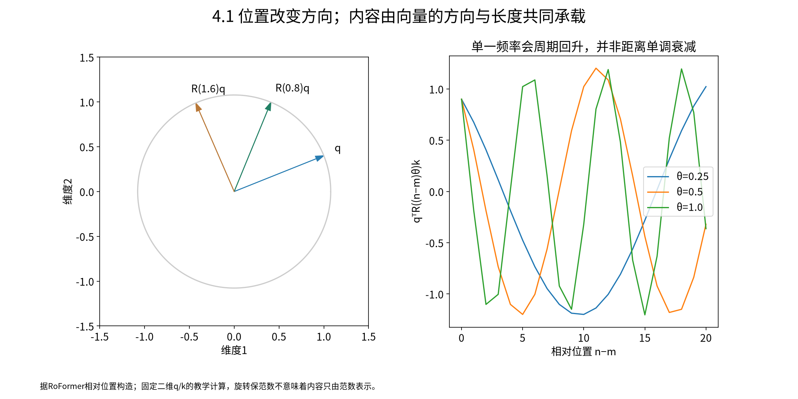
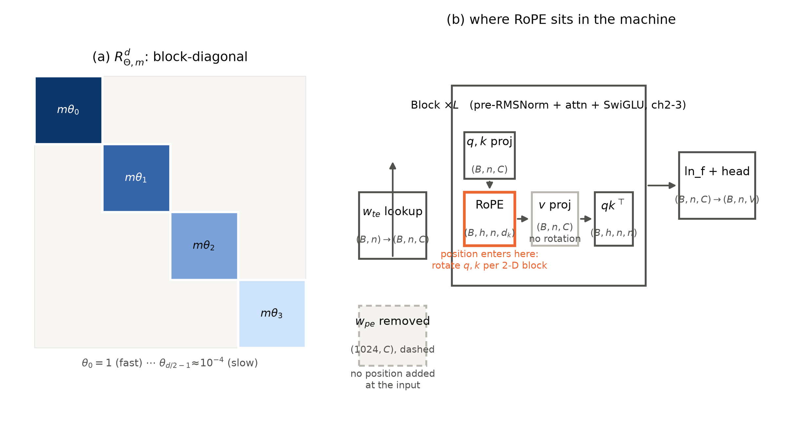
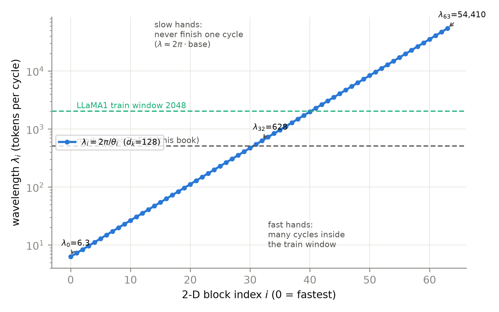
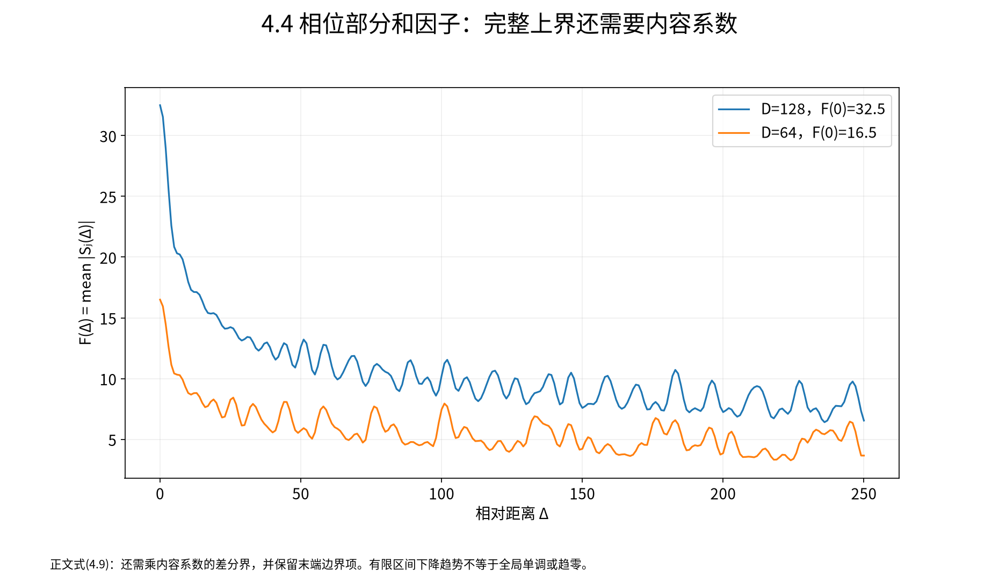
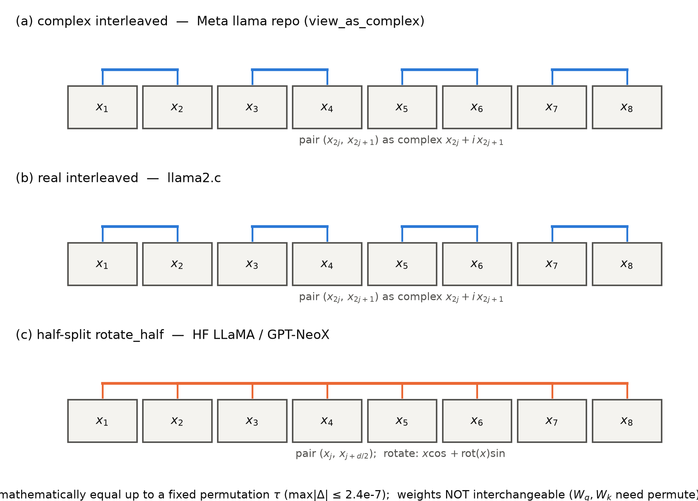
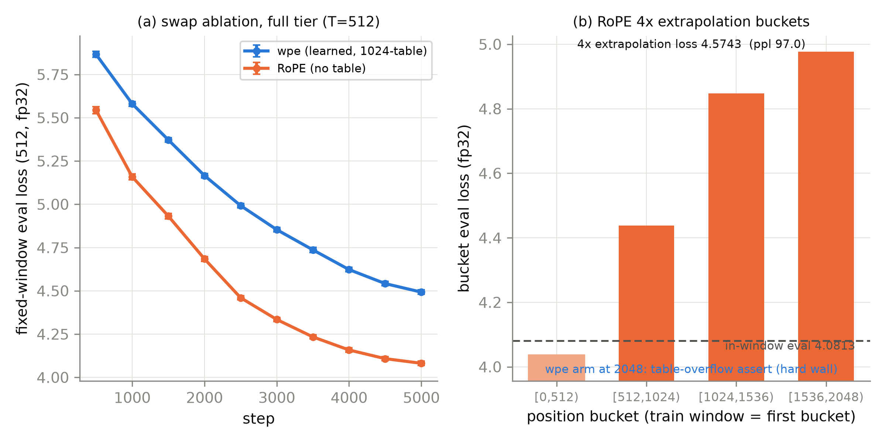

# 第 4 章 RoPE 深剖：把位置转进注意力里

## 4.0 开篇：从全书到这里

上一章我们把四格插座的第二格换好了：前馈从 GELU 两矩阵换成 SwiGLU 三矩阵，账算平、门装上、消融曲线作证（第 3 章 3.6 节）。但改装手册翻到第三格，改造难度陡然上升——归一化与前馈都是「形状进出不变、拔了就换」的局部零件，位置编码却牵动整条数据河：在 Book2 的 GPT-2 里，位置信息在**入口处**与词嵌入相加；拆掉入口那张查表，位置必须在**别处**重新注入，RoPE选择在注意力的Q/K投影之后注入位置；这是一种方案，并非唯一可能位置。这一章动这一刀，也是本册数学上最重的一章。

要回答三个问题。其一，不同的位置方案改变了哪部分计算——入口相加与打分偏置不能混为一类？其二，有没有一种注入方式让注意力分数**天生只依赖相对距离**——数学上怎么把它构造出来、工程上怎么高效落地？其三，换件值不值——在模块档小机器上拆掉查表换上旋转，同窗质量与 4 倍长度窗口两张考卷怎么答？产出三样：一件换好的位置插槽（code/ch04/rope.py）、一张波长谱表（本章核心工具，第 7 章的地图）、一份换件消融与外推退化的诚实答卷。

本章结束时，位置信息的两个问题——Book1 留下的外推承诺（F6）与 Book2 立此存照的 1024 位之墙（N2）——将还掉「原理重估」与「结构性解除」各一半；剩下的一半（外推的工程挣扎）属于第 7 章。

> **最小背景栏**：本章默认你读过 Book1相关章节（自注意力置换等变、正弦位置编码的公式与「256 根指针的仪表盘」心智、内积只依赖相对距离的那句 hypothesized），Book2 第 4 章改造③（GPT-2 的 `wpe` 学习式查表）与第 10 章 `model.py`（改造台，`wpe` 在 L133、前向相加在 L166）。数学工具只需高数的泰勒展开；复数与欧拉公式 4.3 节先补一堂最小课再用。符号：残差流宽 $C$、头维 $d_k$、位置下标沿用 RoPE 论文口径记 $m,n$。

## 4.1 两个问题：一个承诺与一面墙

前两册留下两个需要分开的判断。位置查表限制可直接查询的索引范围；超出表长若不扩表或改实现，前向就会报错。正弦或旋转公式可以计算更大的位置索引，却不保证模型在这些位置上仍有可靠能力。计算的可定义性与学得的泛化能力，是本章贯穿的区别。

旧小型翻译实验曾记录训练长度两倍时，正弦BLEU为9.03/6.62，学习式为8.92/7.73。它们属于特定历史设置；本章的语言模型、词表与长度不同，不能把分数拼成共同排名。我们保留这个例子，只提醒自己：有位置公式并不自动获得良好外推。

下面先说明相对位置打分想满足什么条件，再构造二维旋转、推广到多频率头空间，最后解释不同实现约定与实验。长窗口的频率调整留到第7章。

## 4.2 从位置向量的相对性质到注意力的设计要求

先把「加性」这个词钉死。无论学习式还是正弦，2017 年以降的主流做法都是把位置向量**加进上下文表示**再进网络，RoPE 论文把这一族统一写成（其式 (3)）：

$$
f_{t}(x_i,\,i)\;:=\;W_t\,(x_i + p_i)
\tag{4.1}
$$

| 符号 | 含义 | 形状 |
|---|---|---|
| $x_i$ | 第 $i$ 个 token 的词嵌入 | $(C,)$ |
| $p_i$ | 位置 $i$ 的位置向量（学习式=查表行，正弦=公式值） | $(C,)$ |
| $W_t$ | 首层变换（注意力/前馈的投影） | $(d_{out},C)$ |
| $f_t$ | 带位置的变换输出 | $(d_{out},)$ |

**入口相加使内容和位置共同影响后续投影；位置向量自身具有相对内积，并不足以让完整注意力分数只依赖相对距离。**这是我们需要补清的一步。设 $A=W_q^\top W_k\in\mathbb R^{C\times C}$，带位置的首层分数可以展开为

$$\begin{aligned}
(x_m+p_m)^\top A(x_n+p_n)
={}&x_m^\top Ax_n+x_m^\top Ap_n\\
&+p_m^\top Ax_n+p_m^\top Ap_n.
\end{aligned}\tag{4.11}$$

四项分别是内容—内容、内容—位置、位置—内容、位置—位置。就算最后一项具有某种相对性质，两项交叉项也没有自动消失。更进一步，正弦向量的普通内积与带任意矩阵 $A$ 的双线性形式也不同。

先看普通内积的性质。二维位置向量取 $p_m=(\cos m\theta,\sin m\theta)$，用余弦差公式得到

$$\langle p_m,p_n\rangle
=\cos m\theta\cos n\theta+\sin m\theta\sin n\theta
=\cos((m-n)\theta)=g(m-n).\tag{4.2}$$

它只依赖位置差，但若 $A=\operatorname{diag}(2,1)$，则同一位置的 $p_0^\top Ap_0=2$，而转到 $\pi/2$ 的位置后，同位置分数变为1。两次距离都为0，值却不同。因此一般的投影矩阵并不保持这条裸位置内积性质。

苏剑林的正弦编码博客还从交互函数的二阶展开讨论位置项 $p_m^\top Hp_n$。这个视角帮助寻找设计，但从一般Hessian $H$ 到普通内积需要额外假设，不能将它省略后当作完整注意力已具有相对性的证明。

相对位置方案也不都等于入口相加：Shaw把相对向量引入键或值的交互，Transformer-XL重新组织内容与位置项，T5直接在分数上加可学习的相对桶偏置。它们是不同的参数化选择，不能用“加性都必须消去绝对位置”统一否定。RoPE选择另一条路线：对Q和K施加具有组合结构的变换，让**显式位置变换对内积的影响**直接依赖位置差。下一节从这个目标构造旋转。

> **【考据框】** RoPE 的想法先在博客出现、论文是一个月后的正式化：博客①（8130，2021-02-03）以「融合式」之名首次草绘；博客②（8231，2021-03-08）给泰勒视角；博客③（8265，2021-03-23）完整推导加中文实验；arXiv v1 上线 2021-04-20，晚于博客③ 28 天、晚于博客① 76 天。本册口径：数学与实验数字一律引论文 canonical（v5，2023-11-08），博客作中文一手叙事补充，两者冲突以论文为准。另：论文 §2.3 综述四变体对比时引文标注疑有错位（标 Radford 2018，实验实出自 Huang et al. 2020），本章不引用该对比结论。

## 4.3 二维旋转：直觉与证明

**RoPE取一个保范数的构造：先投影得到Q/K，再按位置旋转；两边旋转的绝对角度在内积中合成相对角度。**保范数是这个构造提供的性质，不是相对位置要求唯一能推出的答案。下面先用实数矩阵证明，再用复数压缩记号。

令 $q=W_qx_m,k=W_kx_n\in\mathbb R^2$，暂把这两个未旋转向量固定。我们希望

$$\langle f_q(x_m,m),f_k(x_n,n)\rangle
=g(x_m,x_n,n-m).\tag{4.3}$$

这里 $x_m,x_n\in\mathbb R^C$ 是当前层的输入，$W_q,W_k\in\mathbb R^{2\times C}$。它们本身可能已包含前面层的上下文与位置信息；式(4.3)约束的是当前显式位置操作，不能因此说整个模型只保留一个距离标量。

### 先从旋转的两个基向量构造矩阵

平面标准基 $e_1=(1,0)^\top$ 逆时针转过 $\phi$ 后为 $(\cos\phi,\sin\phi)^\top$，$e_2=(0,1)^\top$ 转后为 $(-\sin\phi,\cos\phi)^\top$。把这两个结果作为列，得到

$$R(\phi)=\begin{pmatrix}\cos\phi&-\sin\phi\\
\sin\phi&\cos\phi\end{pmatrix}.\tag{4.5}$$

所以向量 $(a,b)^\top$ 的输出逐项为 $(a\cos\phi-b\sin\phi,\ a\sin\phi+b\cos\phi)^\top$。由 $\cos^2\phi+\sin^2\phi=1$，直接相乘可得 $R(\phi)^\top R(\phi)=I$，于是 $\|R(\phi)q\|^2=q^\top q$，旋转保留长度。

两个连续旋转的相乘也能逐项展开。例如左上项为 $\cos\alpha\cos\beta-\sin\alpha\sin\beta=\cos(\alpha+\beta)$，其余三项同理，因此 $R(\alpha)R(\beta)=R(\alpha+\beta)$；转置则是反向旋转 $R(\alpha)^\top=R(-\alpha)$。现在令第m个位置旋转 $m\theta$，就有

$$\begin{aligned}
\langle R(m\theta)q,R(n\theta)k\rangle
&=q^\top R(m\theta)^\top R(n\theta)k\\
&=q^\top R((n-m)\theta)k.
\end{aligned}\tag{4.12}$$

第一步是内积的矩阵写法，第二步分别使用转置与旋转组合公式。只要q、k不变，同时把m、n平移t，差值仍是n−m，打分不变。两边使用同一频率约定是这一步的前提。

### 再用复数看到同一个操作

把 $(a,b)$ 记为 $z=a+ib$。欧拉公式 $e^{i\phi}=\cos\phi+i\sin\phi$ 给出

$$(a+ib)e^{i\phi}
=(a\cos\phi-b\sin\phi)+i(a\sin\phi+b\cos\phi),$$

正好是刚才两个坐标。于是可简写为

$$f_q(x_m,m)=(W_qx_m)e^{im\theta},\qquad
f_k(x_n,n)=(W_kx_n)e^{in\theta}.\tag{4.4}$$

这里用复数表示二维输出，内积为 $\operatorname{Re}[f_q\overline{f_k}]$；复数乘积出现 $e^{i(m-n)\theta}$，与实数式中的n−m是同一约定下的两种写法。它并没有把“内容”缩成模长：q、k原来的方向也来自内容，位置只是额外增加角度。

例如q=k=(1,0)，θ=1，m=5、n=2时分数为cos3≈−0.99；同时平移到1005和1002仍为cos3。这是在固定q、k上的构造例，不是任意长序列上语义能力不变的实验。图4.1展示旋转与余弦分数。



图4.1 二维旋转。位置增加旋转角度，q/k原来的长度和方向都由内容决定；同一q/k下，打分只受位置差影响。

### 为什么不把这个构造称为唯一解

论文§3.4.1用极坐标写 $f_q=R_qe^{i\Theta_q}$、$f_k=R_ke^{i\Theta_k}$，并选择模长不随位置变化的一个简单解。仅从同位置的乘积 $R_q(m)R_k(m)$ 恒定，不能推得两个因子分别恒定。例如取

$$f_q(q,m)=e^{am}q,\qquad f_k(k,n)=e^{-an}k,$$

也有内积 $e^{a(m-n)}q^\top k$，同样只通过m−n依赖位置，但它不保范数。RoPE没有选择这种可能导致幅度变化的构造，而选择正交旋转；这样相对角度编码与长度保持同时成立。区分“提出要求”“选择一个有用解”“验证它的性质”，比把结果写成无条件唯一推导更利于理解设计。

## 4.4 高维推广与波长谱：快慢指针

头维 $d_k$ 是 64 或 128，二维的解怎么升维？答案朴素得近乎偷懒：**把 $d_k$ 维切成 $d_k/2$ 个互不相干的二维子空间，每个子空间独立转、各配各的角速度**，然后靠内积的线性性把各块的贡献加起来（论文原话 "combine them in the merit of the linearity of the inner product"）：

$$
f_{\{q,k\}}(x_m,\,m) \;=\; R^d_{\Theta,m}\; W_{\{q,k\}}\, x_m,
\qquad
R^d_{\Theta,m}=\begin{pmatrix} R(m\theta_0) & & &\\ & R(m\theta_1) & &\\ & & \ddots &\\ & & & R(m\theta_{d/2-1})\end{pmatrix}
\tag{4.6}
$$

其中 $R(m\theta_i)$ 是式 (4.5) 那个 2×2 旋转块。$R^d_{\Theta,m}$ 是**块对角**正交矩阵（图 4.2a）：对角线上 $d_k/2$ 个旋转块，块外全是零。这表示：64 维的头空间其实是 32 张独立的小平面，每张平面上有一根自己的表针，位置每走一步，32 根针各转各的格数。



图 4.2 块对角旋转与整机改动位置（自绘示意级，标注张量形状）：(a) $R^d_{\Theta,m}$ 的块对角结构（示意 $d_k=8$ 四块；实际 $d_k=64$ 有 32 块），块色深浅=转速快慢；(b) 插座③在整机里的位置——入口的 $w_{pe}$ 查表拆除（虚影），位置改在每层每头的 Q/K 投影后现做，$v$ 不旋、$q k^\top$ 打分输出 $(B,h,n,n)$

各块的角速度沿用谁？论文 §3.3 一句 "Following Vaswani et al. [2017], we set"——**直接继承 2017 正弦编码的频率表**（记号口径：论文 §3.2.2 写 $\theta_i=10000^{-2(i-1)/d}$、$i$ 从 1 起，§3.3/§3.4.3 又写 0 起的 $10000^{-2i/d}$——同一集合、下标起点差 1；本册统一 0 起，HF 源码 `inv_freq = 1.0/(base**(arange(0,dim,2)/dim))` 同款，论文内部不一致记此备考）：

$$
\theta_i \;=\; 10000^{-2i/d},\qquad i=0,1,\dots,d/2-1
\tag{4.7}
$$

这表示：第 $i$ 块的转速定成 10000 的 $-2i/d$ 次幂——从1逐步减小到略大于万分之一；末项仍取决于有限头维，快慢铺满四个数量级。

这就是「继承」的精确含义：正弦 PE 里第 $i$ 对维度的角频率 $1/10000^{2i/d}$，原封不动变成 RoPE 第 $i$ 块的转速。而 Book1相关章节你已经认识这张表——**256 根指针的仪表盘**。现在仪表盘换了装法：不再进门时读一次（加在词嵌入上），而是装进每层每头的 Q/K 里持续转动。每根表针转一圈需要的步数（波长）$\lambda_i = 2\pi/\theta_i$，把 $d_k=128$（LLaMA 头维）的谱摆出来——**表 4.1，本章第一件核心工具，第 7 章要反复回看**：

**表 4.1** $d_k=128$ 档波长谱（$\theta=10000$；$\lambda_i=2\pi/\theta_i$=转一圈的位置步数）

| 块号 $i$ | $\theta_i$ | $\lambda_i$（步/圈） | 直觉 |
|---|---|---|---|
| 0 | 1.0 | **6.3** | 最快针：每步转 1 弧度，6 步一圈 |
| 1 | 0.866 | 7.3 | |
| 31 | 1.155e-2 | 544 | 中频 |
| 32 | 1.0e-2 | 628 | |
| 63 | 1.155e-4 | **54,410** | 最慢针：五万步一圈 |

【证据等级：本书实验（CPU fp32，2026-10，`ch04/rope.py` 波长谱段）】

快慢相差四个数量级。快针（$\lambda\approx 6$）在头几步就转了好几圈——**近处的相对位置靠它们分辨**；慢针（$\lambda\approx54.4\text{k}$）在整段句子里只挪了一小格——慢频率在更长范围内变化较缓；高低频仍共同影响编码，不能把它们分成只管近处或只管远处的独立模块。最慢波长有个好记的近似：$\lambda_{\max}\approx 2\pi\times\text{base}$ 是块数趋于无穷的极限（base=10000 时约 63k）；实际档位略小——$d_k{=}128$ 为 54,410、$d_k{=}64$ 约 47k。关键推论马上就来：**训练窗（LLaMA1 的 2048、本册模块档的 512）远小于最慢波长——慢针在训练里从未转完一圈**。这句话现在只是一句观察，到第 7 章它会变成「外推为什么失败、NTK 系为什么拧 base」的机制核心。图 4.3 是这张谱的可视化：谱线穿过训练窗参考线的位置，就是「快慢指针」的分水岭。



图 4.3 波长谱（自产，$d_k=128$，对数纵轴）：横轴=块号（0 最快），两条参考线=训练窗（本册模块档 512 与 LLaMA1 的 2048）——谱线在参考线以上的块从未在训练窗内转完一圈；$\lambda_{\max}\approx 2\pi\cdot\text{base}$

高维下相对位置性质依然成立，且证明只用了两行正交性（论文式 (16)）：

$$
q_m^\intercal k_n \;=\; x_m^\intercal W_q^\intercal\; R^d_{\Theta,\,n-m}\; W_k\, x_n,
\qquad R^d_{\Theta,\,n-m}=(R^d_{\Theta,m})^\intercal R^d_{\Theta,n}
\tag{4.8}
$$

这表示：正交矩阵的转置就是逆旋转，「先撤销 $m$ 转的、再施加 $n$ 转的」=「净转 $n-m$」——二维旋转的群结构逐块成立，拼起来就是高维版本。式 (4.8) 也顺手给出两条免费性质：$R$ 正交所以**保范数**（旋转不改向量长度，论文称之为位置编码过程的稳定性——4.9 节机器验证第二件）；且位置以**乘性**出现在 $W_q$ 与 $W_k$ 之间。论文 §3.2.2 末的对照句值得逐字读："In contrast to the **additive** nature of position embedding method adopted in the previous works … our approach is **multiplicative**"——加性 vs 乘性、入口端 vs 打分端、查表参数 vs 零参数，四轴对照收进表 4.2。

**表 4.2** 加性位置编码 vs RoPE（乘性旋转）四轴对照

| 轴 | 入口相加的位置编码（学习式/正弦） | RoPE |
|---|---|---|
| 注入方式 | **加**：$x_i+p_i$ 进网络（式 (4.1)） | **乘**：$R^d_{\Theta,m} W x$（式 (4.6)） |
| 作用点 | 入口端（嵌入层一次、全层共享） | 打分端（每层每头 QK 上、softmax 之前） |
| 位置参数 | 学习式=查表 $L\times C$（硬上限 $L$）；正弦=零参数但加性 | **零位置参数**（$\theta_i$ 公式预生成，cos/sin 是缓存不是参数） |
| 位置语义 | 输入处显式绝对位置；其自身内积性质不保证完整分数相对不变 | 内积天然只剩 $m-n$（式 (4.8)），绝对量在共轭相乘中消掉 |

形状账也该盘一次——RoPE 是极少数**不引入新形状、不引入新参数**的组件：q/k 投影后 $(B,h,n,d_k)$，cos/sin 表 $(1,n,d_k)$ 沿批与头维广播，旋转后 $(B,h,n,d_k)$ 原样；位置维度 $n$ 只作为旋转角进入，不再以「第 $i$ 个词多带的一个向量」出现。对照 Book2 的 `wpe` 前向（$(B,n,C)+(n,C)$ 广播相加，Book2 第 10 章 `model.py` L166 一句回放）：**位置从「进门发的胸牌」变成了「每层每头里转动的表针」**。

最后记一个旋钮：式 (4.7) 里的 10000 就是各家 config 里的 `rope_theta`（基底 base）。它按频率索引非均匀改变波长：$\theta_i=\mathrm{base}^{-2i/d}$，base增大时i>0的转速降低，i=0仍为1；越靠后受影响越大，不能称为整谱同比缩放。LLaMA1/2 沿用 10000，CodeLlama 拉到 1e6 换 16k 上下文，Llama 3 拉到 5e5【证据等级：config 逆向（HF 镜像 config.json）】——base 从「继承的常数」变成「外推工程的第一旋钮」，这是第 7 章的入场券，此处只登记。

## 4.5 长程衰减的诚实读法

**多频率旋转在某些距离范围内可出现相位抵消，但不能推出每对词的注意力都随距离单调减小。**本节要解释论文上界实际约束了什么，尤其是被省略后容易造成错误的求和边界。

令头维为偶数d，$M=d/2$，把每一对维度记为复数 $q_i,k_i$，取 $h_i=q_i\overline{k_i}$。令 $\Delta=m-n$，则内积是复数和 $T=\sum_{i=0}^{M-1}h_i e^{i\Delta\theta_i}$ 的实部，故 $|\operatorname{Re}T|\le|T|$。这里h包含内容与投影后的幅度、相位，不只是位置常数。

定义相位部分和 $S_j=\sum_{i=0}^{j-1}e^{i\Delta\theta_i}$，$S_0=0$。由于 $e^{i\Delta\theta_i}=S_{i+1}-S_i$，先代入再错位相减：

$$\begin{aligned}
T&=\sum_{i=0}^{M-1}h_iS_{i+1}-\sum_{i=0}^{M-1}h_iS_i\\
 &=h_{M-1}S_M+\sum_{i=0}^{M-2}(h_i-h_{i+1})S_{i+1}.
\end{aligned}\tag{4.13}$$

第一组和的末项没有对应项抵消，所以必须留下 $h_{M-1}S_M$。若定义补充边界 $h_M=0$，便可把它并入统一式，再使用三角不等式：

$$|T|\le\sum_{i=0}^{M-1}|h_i-h_{i+1}|\,|S_{i+1}|
\le\left(\max_{0\le i<M}|h_i-h_{i+1}|\right)
\sum_{j=1}^{M}|S_j|.\tag{4.9}$$

边界条件很实在：若所有原h_i都为1，内部差全为0，但T通常不为0，贡献来自最后的 $h_{M-1}-h_M=1$。少掉这项，会把非零内积错误地界成0。

图4.4只画频率相关因子 $F(\Delta)=M^{-1}\sum_{j=1}^{M}|S_j|$，并不是任意q/k内积的完整上界。距离为0时每个相位都为1，$S_j=j$，故 $F(0)=(M+1)/2$：d=128时为32.5，d=64时为16.5，与旧数值图相符。距离到250时记录约6.5和3.7，但d=64在100处约7.47，又大于50处的5.73。它展示给定有限区间内的抵消趋势，并非单调定理。

更不能把这张有限区间图外推成无限距离必然趋零。只让一个二维块的q、k非零，就得到单个余弦项，会反复回升；有限频率组合也可能出现重新对齐。模型学到的内容系数与softmax还会继续改变最终权重。因此应将这段分析理解为频谱性质与一种上界工具，而不是“RoPE天然让所有远处依赖变弱”的保证。



图4.4 相位部分和因子（教学数值，完整上界还含内容系数，$\frac{2}{d}\sum_j|S_j|$ 随距离）：$d=128$ 档 32.5→6.5、$d=64$ 档 16.5→3.7，有限区间内总体下降但非单调——$d=64$ 在距离 100 处回勾 7.47 > 距离 50 处 5.73【证据等级：本书实验（CPU fp64，2026-10）】

> **【考据框】** 论文 Figure 2（x 轴距离 0-250、y 轴 8-20）**未标注所用 $d$**；按公式复算，$d=128$ 的 14.5→7.2 段与原图吻合更好、且与博客③ 的 Mathematica 代码（$d=128$）一致——「推测 $d{=}128$」，正式引用以自算复现图（图 4.4）为准。另两条博客补充【证据等级：中文一手博客 8265】：(a)「能带来远程衰减性的不止这个选择，几乎任意的光滑单调函数都可以」——衰减不独属于 10000；(b) 苏剑林试过把 $\theta_i$ 作可训练参数初始化为该值，训练后几乎不动，于是固定——「无位置参数」这个设计有实验注脚（论文无此段，引用须标博客口径）。

## 4.6 只旋 Q 与 K、不旋 V

**本册采用的RoPE实现只旋转Q/K，使位置先影响读取权重，值向量仍以其原坐标进入加权和。**这是一个明确的架构选择，不是从相对内积条件推出“V不许有位置”的逻辑禁令。

输出 $o_m=\sum_n a_{mn}v_n$ 中，权重已受旋转打分影响；若再将 $v_n$ 旋转成 $R_nv_n$，便得到另一个函数 $\sum_n a_{mn}R_nv_n$，并不一般等于前者。因此“再转V只是重复记账”并不准确。是否需要这个变体，应该由模型目标与实验决定。Transformer-XL及后续若干方案也把重点放在分数侧，提供了设计前例，不构成所有相对位置方案的统一规定。

对本册的增量生成，只要频率与位置规则固定，可以保存已经按自身绝对位置旋转过的K，新Q使用当前位置与其内积，结果满足式(4.8)。V也可直接保存。但如果之后改变了频率，旧缓存K不能自动兼容新Q；第7章讨论动态频率时还需检查这条一致性边界。

落到代码就是一行签名的事：`apply_rope(q, k, cos, sin)` 只转 `q` 与 `k`，`v` 从函数参数里根本不出现。

> **【考据框】** 博客① 的「融合式」初稿里苏剑林写过「如果还需要显式的绝对位置信息，则可以同时在 $v$ 上施行这种位置编码」——这个历史选项至今活在 HF RoFormer 的 `rotary_value` 配置字段里（默认 `False`）【证据等级：config/源码 transformers 5.18.0 configuration_roformer.py】。论文正文从未启用过它。

## 4.7 实现考据三连：三种写法，一个数学

数学到这该落地了。论文 §3.4.2（其式 (34)）先泼一盆冷水："applying matrix multiplication directly as in Equation (16) is not computationally efficient"——块对角矩阵只是**叙述工具**，工程上永远用逐元素版：$d_k$ 维里每对维度 $(x^{(2i-1)},x^{(2i)})$ 的旋转拆成「乘 cos」加「换位乘 sin」：

$$
q' \;=\; q\odot\cos(m\theta)\;+\;\mathrm{rot}(q)\odot\sin(m\theta)
\tag{4.10}
$$

（$\odot$ 逐元素乘；$\mathrm{rot}$ 是把配对搭档换位并取负的固定置换——两半式下即 `rotate_half`）。这表示：旋转矩阵的每行只有两个非零元，别做矩阵乘，直接「原位乘余弦、搭档乘正弦」两步逐元素运算完事。麻烦在于「配对搭档」怎么定义——社区里并存三种写法，数学等价、工程互不兼容，正好做一次实现考据。

**三连的每一连**。（a）**复数相邻配对**：第 $i$ 对取相邻两维 $(x_{2i},x_{2i+1})$ 视作复数 $x_{2i}+i\,x_{2i+1}$，乘 $e^{im\theta_i}$——PyTorch 的 `view_as_complex` 一行完成；**Meta 官方 llama 仓库的参考实现就是它**（`model.py` 以 `view_as_complex` 施转，P-11 取证直证）。（b）**实数相邻配对**：同样的对，不用复数、手写换位（llama2.c 的 C 教学实现即此写法）。（c）**两半式（half-split）**：第 $i$ 对取**前后两半**的对应位 $(x_i,x_{i+d_k/2})$，即式 (4.10) 配 `rotate_half`——**HF LLaMA 全家与 GPT-NeoX 一系**的约定（`modeling_llama.py`：`inv_freq` 构造 L108、`cat(freqs,freqs)` 对半复制 L123、`rotate_half` L130、施加 L138-160）。

**数学等价**：三种写法只差一个固定的维度置换 $\tau$——把两半式的搭档 $(j,\ d_k/2+j)$ 挪到相邻位 $(2j,\ 2j{+}1)$，两半式输出 = 相邻式(置换后输入) 再经 $\tau^{-1}$ 换回。本机对拍（$d\in\{8,64,128\}$ × 位置 $\{13,1234,9999\}$ 九格）max|Δ| 全部 $=2.38\times10^{-7}$，fp32 噪声级【证据等级：本书实验（CPU fp32，2026-10，`ch04/rope.py` 性质三）】。**实现不兼容**：配对不同，按 $W\in\mathbb R^{d_k\times C}$ 存储时，$W_q/W_k$ 的**输出行含义**就不同——同一套权重在两种约定下数值全错且**不抛异常**。Meta 原版（相邻配对）权重转 HF 格式（两半式）必须对 $W_q/W_k$ 的输出行做置换，旧版转换脚本（v4.31.0）里的 `permute` 只处理这两个矩阵、v4.48.0 起脚本整个移除【证据等级：外部取证 P-11（v4.31.0 convert 脚本 L114-115 行映射数值验证 + Meta repo `model.py` L156-157 `view_as_complex` 直证）】。排坑记录一条（本册调研真实踩过两次）：输出侧要用 $\tau^{-1}$（`argsort`），不是 $\tau$ 也不是恒等。三型对照收进表 4.3 与图 4.5。

**表 4.3** RoPE 实现三型对照（数学等价 ≤2.4e-7；权重互不通用）

| 型 | 配对方式 | 代表实现 | cos/sin 表 | 兼容性陷阱 |
|---|---|---|---|---|
| 复数相邻 | $(x_{2i},x_{2i+1})$ 成复数 | Meta llama repo（`view_as_complex`） | $e^{im\theta_i}$（$d_k/2$ 个） | 投影输出行序=相邻；转 HF 需 permute |
| 实数相邻 | 同上对，手写换位 | llama2.c | sin/cos 交错复制到 $d_k$ | 同上 |
| 两半式 | $(x_i,x_{i+d_k/2})$ | HF LLaMA / GPT-NeoX（`rotate_half`） | `cat(freqs,freqs)` 对半复制 | 本册对应实现；载 Meta 权重不 permute 则静默错 |

本册对应实现跟谁？跟 HF 两半式——对拍锚定 HF（与第 2、3 章的验收管道同构），`ch04/rope.py` 与组件库 `llama_slots.py` 同款。图 4.5 是三型的并排图解。



图 4.5 实现三型对照（自绘，$d_k=8$ 示意）：(a) 复数相邻配对；(b) 实数相邻配对；(c) 两半式 `rotate_half`（配对跨前后半）。三型数学等价（共轭置换，≤2.4e-7）、权重互不通用（$W_q/W_k$ 需 permute）

> **【实现对照框】** HF transformers 5.18.0 的 RoPE 细节四则（与 `ch04/rope.py` 逐条对上）：① `inv_freq` 以 `nn.Buffer(persistent=False)` 挂载——**不进 state_dict**，手写模型别把频率表注册成持久 buffer，否则多出 unexpected key；② cos/sin 的计算强制 fp32（`maybe_autocast(enabled=False)`），无视外部 bf16——大角度下三角函数的精度纪律；③ 旋转模块实例挂在 model 级（`model.rotary_emb`，L358），cos/sin 每前向算一次传入所有层——省去逐层重复算三角函数；④ 位置索引在 `LlamaModel.forward` 生成（`arange(n)+past_seen_tokens`）——有 KV cache 时自动带历史偏移，增量解码的第 $n$ 步 query 用位置「过去长度」而不是 0（第 6 章对拍的关键事实）。后世注记一句：现代检索系模型偏爱只旋头维前一段、留一段不旋的「净土」（partial RoPE，GPT-NeoX/Gemma 系 0.25 档），以及干脆不编码位置的研究（NoPE）——为什么旋得少反而好，账记在 Book5 第 8 章。

## 4.8 改装第三例：拆掉查表，把位置搬进注意力

回装配线。改造对象仍是 Book2 第 10 章 `model.py` 的三插槽底座，这次动的是**位置编码插槽**（导览图 0.1 的插座③，图 4.2b 已标好改动位置）。diff 一共三条：

1. **入口删表**：`self.wpe = nn.Embedding(1024, C)`（L133）整件拆除，前向从 `wte(idx) + wpe(pos)`（L166）改为只查 `wte(idx)`——入口的 $(B,n,C)+(n,C)$ 广播相加消失，连带 L164 的越界 assert 一起退役。参数账：模块档删 $1024\times512=524{,}288$ 个（$-2.2\%$，23,633,920 → 23,109,632）；LLaMA1 7B 档的反事实账——若用 GPT-2 式查表得 $2048\times4096\approx8.4\text{M}$，RoPE 分文不花。
2. **每层每头现做旋转**：Q/K 投影后、打分前，`build_rope_cache(n, d_k, theta, device)` 现算 $(1,n,d_k)$ 的 cos/sin表并广播施转；`n`是当前序列长，公式本身没有学习式表长，但实际内存、实现和数值精度仍限制可运行长度。
3. **v 与因果掩码不动**：v 原样（4.6 节），掩码照旧。

换装后的形状流转列为表 4.4（正文与代码注释共用这份账）：

**表 4.4** 改装第三例形状流转表（$B$=批，$h$=头数，$n$=序列长，$C$=残差流宽，$d_k$=头维）

| 步骤 | 运算 | 输入形状 | 输出形状 | 说明 |
|---|---|---|---|---|
| 1 | `wte` 查表 | $(B,n)$ | $(B,n,C)$ | 入口只剩词嵌入（wpe 已删） |
| 2 | `q_proj`/`c_attn` 切 q | $(B,n,C)$ | $(B,h,n,d_k)$ | 每头一份 $d_k$ 维 |
| 3 | `build_rope_cache` | 标量 $n,d_k,\theta$ | $(1,n,d_k)\times2$ | cos/sin 表，fp32，零参数 |
| 4 | `apply_rope`（式 (4.10)） | $(B,h,n,d_k)$ + $(1,n,d_k)$ | $(B,h,n,d_k)$ | 只旋 q/k；形状不变 |
| 5 | $q k^\top$ 打分 | $(B,h,n,d_k)\times(B,h,d_k,n)$ | $(B,h,n,n)$ | 位置信息在此显形 |
| 6 | 掩码+softmax+加权 v | $(B,h,n,n)$, $(B,h,n,d_k)$ | $(B,h,n,d_k)$ | v 未旋 |

整机组装的口令在 4.9 节的实验脚本里：与第 2、3 章同款——同种子先建底座（RNG 消耗序列一致，共享件初始权重逐位相同），再对换装臂删 `wpe`、给六处注意力换 RoPE 前向（`types.MethodType` 换 `forward`，权重不动）。唯一变量=位置编码件，单变量才干净。

## 4.9 机器验证、换件消融与外推的诚实边界

理论说了这么多，按本书的规矩，三条性质要能在自己机器上跑出数字。`ch04/rope.py` 的自测三件（全部 CPU、秒级）：

**性质验证三件**。其一，平移不变（式 (4.3) 的机器验证）：随机 200 对 q/k，$d=64$，比较 $\langle R_m q, R_n k\rangle$ 与整体平移 $t=5000$ 后的值，fp64 下 max|Δ|$=1.47\times10^{-12}$——绝对位置精确消掉。fp32 对照同一试验 max|Δ|$=1.15\times10^{-3}$：大角度（位置 5100、$\theta_0=1$）下 fp32 角度舍入已是 $10^{-4}$ 弧度量级——这是角度精度问题、不是恒等性失效，也正是 HF 强制 fp32 算 cos/sin 的纪律由来。其二，保范数（式 (4.8) 正交性）：随机 $(2,4,9,64)$ 张量旋转前后范数相对偏差 max $=1.33\times10^{-7}$，fp32 舍入级。其三，共轭置换（4.7 节三型等价）：九格全过、max|Δ| $=2.38\times10^{-7}$。另有两道对拍：与组件库对应实现 `llama_slots` 的 cos/sin 表与施加结果 **max|Δ|=0（逐位一致）**——插槽 import 契约验收；与 HF `LlamaRotaryEmbedding` + `apply_rotary_pos_emb` 同 config 对拍 max|Δ|$=2.38\times10^{-7}$【证据等级：本书实验（CPU fp32/fp64，2026-10）】。

**换件消融：训 512、测 2048**。协议与第 2、3 章同族（实验比较条件见本节）：统一模块档 $d{=}512/L{=}6/h{=}8/V{=}8192$、$B{=}16/T{=}512$，Book2 五件套配方，两臂按步号取同批；wpe 臂=底座原样（1024 行查表），rope 臂=改装第三例（删表+旋转）。参数差如实标注：rope 臂少 524,288（$-2.2\%$），两臂参数天然不对齐，判读同窗质量时带此限定。两档（fast 1000 步 / full 5000 步，同日程各自完全退火、不跨档比绝对值）的数字汇成表 4.5【证据等级：本书实验（MPS bf16 训练/fp32 eval，2026-10，独占窗口）】：

**表 4.5** 换件消融（wpe vs RoPE，训 512 测 2048；fast=1000 步 / full=5000 步两档）

| 臂 | 参数 | eval_final fast | eval_final full（同窗 512） | 4× 外推 2048（full） | 分桶（full） |
|---|---|---|---|---|---|
| wpe | 23,633,920 | 5.5279±0.0116 | 4.4923±0.0126 | **硬墙**（前向 assert + 裸查表 IndexError） | — |
| rope | 23,109,632 | 5.0927±0.0136 | **4.0813**±0.0121 | 4.5743（ppl 97.0） | 4.0357→4.4374→4.8475→4.9764 |


三个判读，全部按预注册方向在两档落地。**同窗不劣化，且幅度稳定**：full 终评 rope 臂低 0.411 nat（fast 档 0.435；差距随训练先放大到 2500 步的 0.532、随退火收窄回 0.411）——本种子中差距明显；未重复训练种子，不能据此量化路径方差，两臂无发散、曲线健康。这组配置在同训练步数下损失更低；参数数、位置注入方式和算子成本也同时变化，这与论文「收敛更快」的弱化版观察同向（BERT MLM 对照的 loss 曲线【证据等级：官方论文 2104.09864 v5 §4.2】）；但档位限定说满——单种子模块档，**不得**外推成「RoPE 恒优 0.4 nat」。**外推退化方向成立，且训练越充分越重**：full 档 4× 窗口退化 +0.493 nat（ppl 59.2→97.0），fast 档只 +0.101——弱模型对位置的利用浅、越窗代价也小（探针 G 600 步 8k 只 +0.09 nat 的先例同族）；不同训练时长下退化程度不同；对训练位置分布的依赖是可能解释，但仅凭这两档曲线不能单独确认慢频率是唯一原因。分桶单调上升 4.0357→4.9764（首桶与同窗 eval 4.0813 自洽——两套窗集），越界段逐桶变差、前两步跳幅最大（+0.40/+0.41/+0.13）。**硬墙具象化**：wpe 臂喂 2048，模型前向直接 assert「序列长 2048 超过 wpe 查表上限 1024」，CPU 裸查表再补一个 IndexError「index out of range in self」——N2 那面墙不是比喻，是两行报错。同一台机器，一边算得出（但变差），一边根本算不了——「硬墙→软墙」的全部含义就在这张表里。速度单列：rope 臂稳态 0.2206 vs 0.1914 s/step（+15.3%）；新增操作可能贡献于差异，具体比例需要单独计时；HF 把 rotary 挂在 model 级、每前向算一次传所有层，省的正是这份重复（4.7 节实现对照框③）。图 4.6 把两臂曲线与分桶画在一起。



图 4.6 换件消融与 4× 外推（自产，full 5000 步档）：(a) 两臂固定窗 eval 曲线（误差棒=49 批批间 se）；(b) RoPE 臂 2048 窗的位置分桶——首桶=训练见过的段，越界段逐桶变差；wpe 臂在 2048 触发查表越界 assert（硬墙）

最后把论文的边界如实交代——这一段是本章与市面上「RoPE 解读」文最大的差别。**RoPE 论文 v1-v5 没有任何「训短测长」的外推实验，也没有衰减消融**（衰减只有定理与数值图）【证据等级：官方论文（五版本全文核对，负结论）】。摘要给的是 "the flexibility of sequence length"——序列长度的**灵活性**，不是「解决了外推」：Table 4 的多长度分阶段训练里，1536 是**训练过**的长度（两阶段共 22.5k 步）；Table 5 评 1024 时模型训过 1536——都在训练长度内，是「同一模型可多长度切换」的证据，不是外推证据。博客侧的口径更宽（博客③「从结果来看，RoPE 具有良好的外推性」——同一批证据、更满的措辞），传播链上「论文→博客→社区→教科书」层层加码的起点就在这半句，本册锚定论文措辞。顺手一条勘误：论文正文说对 WoBERT 提升 1.5%，按其 Table 5 实算是 1.69 个百分点（恰好 1.5 的是对自家 RoFormer-512 的差）——正文与表格对不齐时**以表格为准**。至于我们自己的 4× 实验，恰好是论文缺的那一格：RoPE 优雅降级而非崩死（对照 Book1「同量级不同崩法」），但退化仍在——**无查表只是拿到了入场券，转不完的慢针在更长窗口里怎么捣乱、怎么拧 base 补救，是第7章的主线**。

## 4.10 本章小结

本章把位置改造分成了目标、构造与验证三层。入口位置向量自身的相对内积，并不自动传给完整注意力分数；RoPE选择对Q/K作正交旋转，利用转置与旋转组合关系，让显式位置操作只通过位置差影响内积。这个构造保持范数，但不是相对要求的唯一解；内容也不只存在于模长中。

高维实现按二维块分配不同频率，频谱决定不同位置尺度怎样进入分数。Abel变换保留边界项后给出一个有内容系数的上界；部分和图不能当作所有注意力随距离衰减的定理。代码中，相邻配对与两半式需要相应的投影输出行置换，固定权重不能随意混用约定。

历史模块实验保留了两类不同结果：训练窗内RoPE臂损失更低；扩大到四倍窗口后仍可运行，但损失退化。它们分别回答给定设置的训练表现与长度泛化问题，不把“能算”当作“外推可靠”。之后每次调整频率、缓存或窗口，都要重新检查这些条件。

回到整机：四格插座换完三格——归一化、前馈、位置，Block 里只剩注意力一格原装。但第 6 章动它之前要先立一本账（KV 显存），第 5 章则先把出入口的两张表清点掉。位置插槽换完的这台机器，入口的词表查表与出口的输出投影还挂着 2019 年的账——绑与解、32k 与 128k，下一章算清楚。

> **【欠账】** 外推的真正问题：本章只把硬墙换成软墙——4× 窗口 +0.49 nat 的退化、慢针越窗转出未见过的大角度、以及拧 base/插值/温度的三代补救配方（PI→NTK-aware→YaRN），是第 7 章的主线剧（同一台 2k 窗模型、免重训四干预对照）。→ 第 7 章

## 4.11 动手验证

- **换装件与双对拍、性质三件**（CPU 秒级，本章 4.7/4.9 节全部自测数字的来源）：
  ```bash
  cd 工作区根目录 && source env.sh && \
    python code/ch04/rope.py
  ```
  预期产出：对拍① 与 llama_slots 对应实现 max|Δ|=0.000e+00（逐位）；对拍② 与 HF max|Δ|=2.384e-07；性质三件 1.47e-12（fp64）/1.33e-07/2.38e-07；波长谱五档（6.3→54,410 步/圈）。
- **换件消融与 4× 外推**（fast ≈7.5 min 两臂 / full ≈37 min 两臂，MPS，计时须独占窗口）：
  ```bash
  cd 工作区根目录 && source env.sh && \
    python code/ch04/ablation_pe.py --steps 1000 --out-name fast
  python code/ch04/ablation_pe.py --steps 5000 --out-name full
  # 产物：log/book3-ch04/ablation_pe_{fast,full}.json + curve_{wpe,rope}_{fast,full}.csv
  # 看点：arms.rope.extrap_2048.buckets（分桶）；arms.wpe.wall_2048（N2 硬墙两行报错原文）
  ```
- **复画图 4.1-4.6**（秒级；图 4.6 需先有消融产物，`--data auto` 优先 full）：
  ```bash
  cd 工作区根目录 && source env.sh && \
  ```
- **验收点**：能从旋转矩阵推到相对内积，并举例说明相对性不强制保范数；能默画 $d_k{=}128$ 波长谱的两端（6.3 与 54,410）并指出训练窗内哪些针从未转完一圈；能说出三种实现的配对差异与权重不兼容的原因；能复述「论文没承诺外推」的红线与本章 4× 实验补的是哪一格。

主要来源：[RoFormer论文，v5](https://arxiv.org/abs/2104.09864v5)，§3.2—3.4。相对性、范数保持、频谱数值与模型外推能力分别论证。
