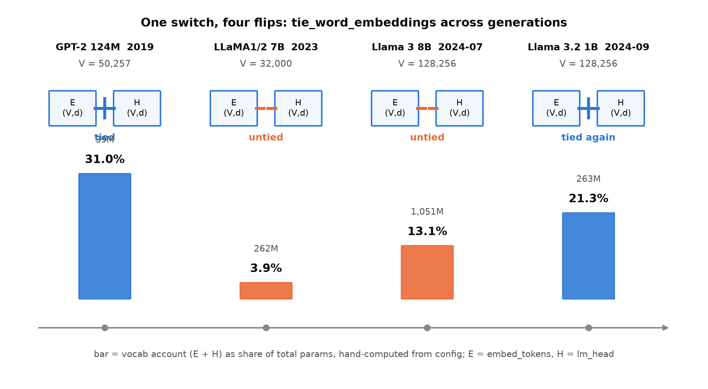
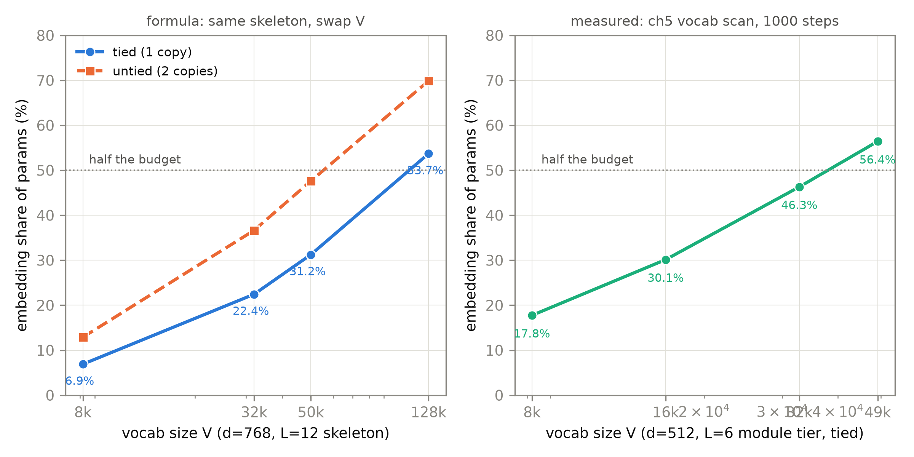
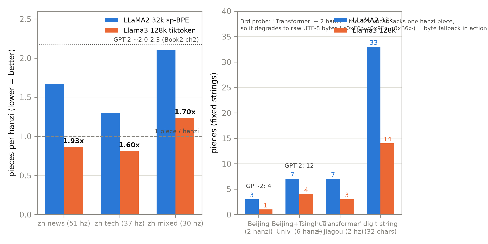
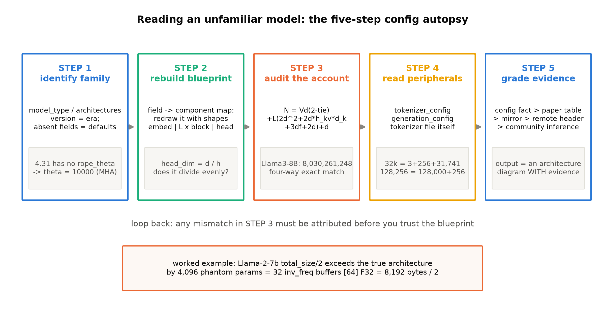

# 第 5 章 untied 与词表：出入口的账

## 5.0 开篇：从全书到这里

上一章我们把第三格插座换好了：位置信息从 1024 行查表变成转进注意力里的角度，机器照常运转，外推的软墙也亲手摸过了。四连改装（归一化、前馈、位置、注意力）至此完成三格，Block 里只剩注意力还是 2019 年的原装货。但动它之前，本章先绕到机器的**两端**——入口的词表与出口的读出头。这不是岔路。Book1 结账时，恰恰是在这里留了一笔旧账：

> 「**F15 · 权重共享（tied embeddings）**——三处共享省 37.9M（超过不共享版的三分之一），但共享也把『输入表示、输出分类、对侧语言』三件事钉进同一个几何。绑不绑、为什么绑、何时解开，这个小开关在 GPT-2 与 LLaMA 两代模型之间被拨来拨去，账在两册的差异清单里。」（Book1 第 7 章欠账框）

Book2 第 4 章做 GPT-2 手术④时付了半句：「输入输出绑定省 31% 的选择在下一代被反悔——解绑的账与理由」→ 本册第 5 章。两笔账同址，本章一并兑付。付完你会发现 Book1 那句「两代模型之间被拨来拨去」还说少了——这个开关到 2024 年为止被拨了**四次**，而且拨它的理由，三篇 LLaMA 论文一个字都没写。

所以本章要回答三个问题：**绑与解的开关，实际被拨成了什么样？**（5.1-5.2 的四拨事实链）**解绑的账在不同尺寸的机器上怎么变，在我们自己的 207M 上又是多大？**（5.3）**词表本身要多大？**（5.4-5.5 的三权衡与四臂扫描实验）沿途还会立起一件本册的方法论遗产——**config 反推架构法**（5.6）：论文不说的部分，config 会说。结束时出入口清账完毕，207M 的 config 里多出 65.5M 参数的两份嵌入——为什么明知是全机最大的一笔开销还要付，5.7 给出落刀与理由。

> **最小背景栏**
> - Book1 第 7 章的三处权重共享与参数账本（编码器嵌入、解码器嵌入、输出投影三表互绑，省 37.9M）；GPT-1 式 $P(u)=\mathrm{softmax}(h_n W_e^\top)$ 的公式层绑定。
> - Book2 第 4 章 4.7 节手术④：GPT-2 的 `logits = h·wte^T` 一表两用，绑定省 38.6M（占 124,439,808 的 31.0%），checkpoint 里根本没有 `lm_head` 键。
> - Book2 第 2 章分词器全家福：BPE 合并、byte-level 基础词表、表 2.5 的中文实测（GPT-2 词表下每汉字约 2 token）；第 12 章把这条钉子钉进上下文预算表。
> - Book2 第 10 章三插槽底座：`wte` 查表在入口、`head` 绑定 `wte` 在出口——本章动刀的两处。
> - 本章新概念只有 tied/untied 开关与 config 字段读法，其余全部指回。

## 5.1 一笔横跨两册的旧账

先把账本的来龙去脉理干净。Transformer 原典把三个嵌入矩阵绑成一处共享，是压参数的权宜；GPT-1/GPT-2 单塔之后，共享只剩两处——入口的 `wte` 与出口的 `head`，而 GPT-2 干脆让它们是**同一个 Python 对象**：`self.head.weight = self.wte.weight`，一表两用，参数计数器只数一份。Book2 第 4 章的账本上写着：绑定省 38,597,376 参数，占 124M 档的 31.0%——2019 年的显卡上，这是「再买小半台模型」的钱，绑定的选择毫不奇怪。

奇怪的是下一代。LLaMA 全系把这两处**解开**（untied，解绑）了：入口 `embed_tokens` 与出口 `lm_head` 是两个独立的 $(V,d)$ 矩阵，各自初始化、各自训练。同一个开关，GPT-2 拨在「绑」（tied，权重绑定），LLaMA 拨在「解」——这就是 Book2 章末那半句「在下一代被反悔」的所指。

要理解这次反悔，得先把「开关拨了什么」看清。设词表大小为 $V$、残差流宽度为 $d$，出入口的参数账只有一行：

$$
N_{\text{vocab}} = V \cdot d \cdot \left(2 - \mathbb{1}_{\text{tied}}\right)
\tag{5.1}
$$

符号表：$V$（词表大小，标量，即词表矩阵的行数）｜$d$（残差流宽度，标量，即每行多少维）｜$\mathbb{1}_{\text{tied}}$（绑定指示符，标量，绑定为 1、解绑为 0）｜$N_{\text{vocab}}$（出入口参数量，标量）。用人话说：出入口的账就是「一张 $(V,d)$ 的表值多少钱；如果没绑定，买两张」。GPT-2 是 $50257\times 768\times 1=38.6\mathrm{M}$，LLaMA-7B 是 $32000\times 4096\times 2=262\mathrm{M}$——开关本身没有任何结构变化，变的只是这一行乘的是 1 还是 2。**绑与解不是架构差异，是账本差异**；正因如此，它才配得上「小开关」这个名字，也才值得问：拨动它的依据是什么？

## 5.2 四拨事实链：同一个开关的当代史

把式 (5.1) 套进各代真实 config，得到一张时间线表【证据等级：config 逆向（各代 config 直读+公式复算，本书 `config_infer.py`，CPU，2026-10；Llama 3.2 为冻结点外 config 事实——仅 tie 级引用，双镜像一致）】：

表 5.1 tie 开关四拨账（词表账 = 嵌入 + 输出层参数；占比 = 词表账 / 参数总量）

| 世代（年份） | tie 开关 | $V$ | 词表账（参数） | 参数总量 | 占比 |
|---|---|---|---|---|---|
| GPT-2 124M（2019） | **绑** | 50,257 | 38,597,376（一份） | 124,439,808 | **31.0%** |
| LLaMA1/2 7B（2023） | **解** | 32,000 | 262,144,000（两份） | 6,738,415,616 | **3.89%** |
| Llama 3 8B（2024-07） | **解** | 128,256 | 1,050,673,152（两份） | 8,030,261,248 | **13.1%** |
| Llama 3.2 1B（2024-09） | **绑** | 128,256 | 262,668,288（一份） | 1,235,814,400 | **21.3%** |



图 5.1 tie 四拨时间线（自绘示意级）：E=embed_tokens、H=lm_head，链环接通=绑定（同一存储）、断开=解绑（两份独立）；条高为词表账占参数总量之比，数字源为本书 `config_infer.py` 的 config 复算【证据等级：config 逆向 + 本书复算，2026-10】

四拨连起来读（图 5.1 把开关状态与占比画在同一根时间轴上），是一出完整的账本剧。第一拨：GPT-2 绑——31% 的账，绑不起两份。第二拨：LLaMA1/2 全系解——同样一拨，在 7B 档只付 3.89%，到 65B/70B 档摊薄到 0.80%/0.76%，几乎白送；机身越大，词表账越是零头，解绑买一份独立容量的钱就越不心疼。第三拨最有信息量：Llama 3 把词表扩到 128k，两份嵌入 1,050,673,152 参数，占比从 3.89% **回升**到 13.1%——词表变大与解绑叠加，嵌入账不降反升，但 8B 机身仍然付得起、也仍然付了（到 405B 才又摊薄回 1.04%）。第四拨：Llama 3.2 回到 1B 小机身，面对同一张 128k 词表，一份嵌入已经占 21.3%，解绑要再付 21.2%——于是绑回去。Meta 自己把开关按尺寸来回拨了四次，这是「**绑与解是账本决策，不是教条**」的最强证据：没有一条普适的「应该绑」或「应该解」，只有「当前机身下这笔账占比多少」。

> **【考据框】三篇论文的沉默。** 你可能会想，这么重要的决策总该有论文论证吧。逐字核查的结论是：没有。LLaMA1（arXiv:2302.13971 v1）§2.2 只声明三处改动——pre-normalization、SwiGLU、rotary embeddings，全文 grep「tied/untied/tying」零命中；LLaMA2（arXiv:2307.09288 v2）同样零命中；Llama 3（arXiv:2407.21783 §3.2）明说架构「does not deviate significantly from Llama and Llama 2」，改动清单四条（GQA、文档掩码、RoPE 基频、新分词器），无一字论 tying。解绑是 LLaMA 从 PaLM 一系（untied）大模型做法继承的**未加论证的工程默认**——这恰好是「论文不说的部分要靠 config 才能看见」的最佳引子，5.6 节的方法论由此而来。

社区当然补过解释，常见的三条，引用时一律标二手推断。**规模账**——嵌入占比随尺寸骤降，解绑边际成本可忽略：这条不必停在二手，它就是表 5.1 的占比列数字，5.3 节升格为账本事实。**职责论**——输入嵌入是查表（要平滑的语义几何），输出层是 softmax 竞争分类器（要拉开类间距离），一张矩阵伺候两个主子是正则也是束缚；文献根据其实是反向的旧证据：Inan et al. 2016（arXiv:1611.01462）证明 tying 对小模型是有效正则，Press & Wolf 2017（arXiv:1608.05859）发现复用输出嵌入做输入反而提升 LSTM 语言模型——都是「绑定有收益」时代的结论，外推到 7B 属二手推断【证据等级：官方论文（LSTM/小模型时代）+ 二手推断（外推部分）】。**深度论**——decoder-only 深模型的残差流范数随深度增长，末层隐状态与输入嵌入尺度失配，直接转置当输出矩阵「几何上别扭」：纯社区推理，无官方背书【证据等级：二手推断】。第四条「解释」是行为本身：Llama 3.2 的回绑，行业用 config 投了票。

> **【考据框】教学复制品的第一处偏差。** Karpathy 的 llama2.c（MIT）号称 LLaMA 的教学复刻，它的 `model.py` 里赫然写着 `tok_embeddings.weight = output.weight`——**静默绑定**，而它复刻的对象 LLaMA1/2 官方 7B-65B 全系 untied【证据等级：config/源码（llama2.c model.py 直读；官方侧见表 5.1）】。这个偏差本身情有可原（llama2.c 训 15M 小机器，绑定正是小档的账本理性，恰与第四拨同逻辑），但它是**静默的**——没有任何一行注释告诉你这里偏离了被复刻对象。读教学代码时带着这根弦：复制品与原版的差异往往就藏在这些「作者觉得不值得说」的地方，而 config 与源码对拍能把它们逐一揪出来。

## 5.3 解绑的账：账本随尺寸翻页

事实链摆完了，现在把「解绑的账」算透——这一节的手算全部来自本书 `config_infer.py`（[`code/ch05/config_infer.py`](code/ch05/config_infer.py)），CPU 秒级可复跑【证据等级：本书复算（公式手算，锚点=config 逆向+官方论文表格），2026-10】。

先算 7B 档这一拨的价签。分子是式 (5.1)：$32000\times 4096\times 2 = 262{,}144{,}000$。分母是整机参数：按 5.6 节的公式 (5.2) 手算 LLaMA1-7B 全部结构得 $6{,}738{,}415{,}616$（与论文 Table 2 的 "6.7B"、HF 模型卡的 "6.74B" 精确对上）。相除：**3.89%**。把它与 GPT-2 档并排：124M 档拨一次开关要付 31.0%，7B 档拨一次只付 3.9%——**不是 LLaMA 更聪明，是账本翻页了**。顺着尺寸再往外推，占比一路骤降：13B 2.52% → 33B 1.31% → 65B 0.80% → 70B 0.76%。同一个开关，在 124M 上是生死抉择，在 70B 上是四舍五入的零头。

但账还有另一个自变量：词表。把骨架固定、只换词表，第一权的形态就显形了（图 5.2 左）。取一台 $d=768$、$L=12$、$f=2048$ 的 LLaMA 式玩具骨架（tied 口径），依次装入四张词表：sp-8k（Book2/3 自训）嵌入 6,291,456、占 91,245,312 总参的 **6.90%**；LLaMA 32k 占 **22.44%**；GPT-2 的 50,257 占 **31.24%**；Llama 3 的 128,256 占 **53.69%**——若解绑成两份，更是 **69.9%**【证据等级：本书复算（`config_infer.py` 固定骨架换词表账，CPU，2026-10）】。一句话：**128k 词表装进 768-d 玩具骨架，光嵌入就吃掉过半预算**——128k 是给 4k-d 以上机身配的轮子。Book2 当年给 scaling 族自训 sp-8k 词表，防的正是这一手（Book2 第 2 章末「小模型若背 50257 的词表，嵌入矩阵会把模型本体淹没」的预言，在这里有了精确数字）。

最后算我们自己的机器。207M 定版 config（$V=32000$ untied、$d=1024$）：词表账 $=32000\times 1024\times 2 = 65{,}536{,}000$，占总参 $207{,}119{,}360$ 的 **31.6%**——在本书所有经手的机器里，这笔账数它最大，比 GPT-2 的 31.0% 还高半分。这里藏着一个值得停下看一眼的巧合：GPT-2 是「绑一份、占 31%」，我们是「解两份、占 31.6%」——同样刺眼的占比，相反的选择。GPT-2 面对的 31% 是 2019 年「省下的钱能再买小半台模型」；我们面对的 31.6% 为什么仍要付？三个理由。其一，**对齐出厂口径**：本册的任务是把 GPT-2 底座改装成 LLaMA 式骨架，出口的几何也是骨架的一部分——LLaMA 出厂是 untied，我们的 207M 就该是 untied，第 10 章与 HF `LlamaForCausalLM` 的结构对拍也要求 `lm_head.weight` 作为独立键存在。其二，**F15 主线的完整体验**：你在自己的机器上亲手付这笔全机最大的账，GPT-2 当年为什么绑、LLaMA 为什么解、Llama 3.2 为什么又绑回去，就不再是书上的故事而是肌肉记忆。其三，**实验的干净**：模块实验（第 2-6 章）继续用 Book2 的 sp-8k 语料与 tied 底座，解绑只发生在第 10 章的整机——单一变量纪律不变。

## 5.4 词表要多大：三权衡

开关的账算完了，还剩开关背后那个更大的问题：$V$ 本身取多大？这要先看清 32k 和 128k 两张词表**里面装的是什么**。

LLaMA1/2 的 32k 是 sentencepiece BPE。论文原句一句话给全三条设计决策：「我们用 BPE 算法（Sennrich et al., 2015）分词，实现用 SentencePiece；**把所有数字拆成单个数位**；未知 UTF-8 字符**回退到字节**分解（字节回退，byte fallback）」【证据等级：官方论文 2302.13971 v1 §2.1（意译，三条决策逐条对应原文）】。本机直载官方 `tokenizer.model` 数它的构成【证据等级：本书实验（sentencepiece 0.2.2，CPU，2026-10；双镜像同 hash，引用复核台账 C-52 已销项）】：`GetPieceSize()=32000`，恰好等于 3 个特殊 token（`<unk>`=0、`<s>`=1、`</s>`=2）+ 256 个字节 token（`<0x00>`–`<0xFF>`，占 id 3–258）+ 31,741 个 BPE 合并 piece。两个读 config 才会撞见的细节：其一，**没有 `<pad>`**——`PieceToId('<pad>')` 返回 0，也就是 unk 的 id，而 config 里 `pad_token_id` 恰好也写 0，字段之间互相「打架」，读 config 要带脑子；其二，**`[INST]` 不是特殊 token**——Llama-2-Chat 的对话标记在 32k 词表里只是普通文本，切成多个 piece，官方 chat 格式全靠字符串拼接（出处为 Llama-2 model card【证据等级：官方技术报告（经镜像核对）】）。还有一个版本考据：**32000 这个数在 LLaMA1 论文里根本没写**（Table 2 只有参数/维度/头数/层数），白纸黑字首见于 LLaMA2 §2.2 的「The total vocabulary size is 32k tokens」【证据等级：官方论文 2307.09288 v2 §2.2】。

Llama 3 换了 128k 新词表，论文给的动机两支：「我们使用 128K 词表。词表组合了 tiktoken 的 100K token 与另外 28K 个 token 以更好支持非英语语言。对比 Llama 2 分词器，新分词器把英文样本的压缩率从**每 token 3.17 字符提升到 3.94**——同等训练算力能『读』更多文本。增加 28K 非英语 token 同时改善了压缩率与下游表现，且不影响英文分词」【证据等级：官方论文 2407.21783 §3.2（意译）】。config 里的实值是 128,256，分解开恰好是 **128,000 基础 + 256 个特殊位**（id 128000–128255），非保留位只有 5 个（`<|begin_of_text|>`、`<|end_of_text|>`、`<|start_header_id|>`、`<|end_header_id|>`、`<|eot_id|>`），其余 251 个全是 `<|reserved_special_token_N|>` 占位——预留位后启用是词表前瞻性的小案例【证据等级：本书实验（tokenizers 0.23.2 直读本地缓存实物）】。论文 Table 3 写 "128,000" 与 config 的 128,256 并不矛盾：前者数基础词表，后者含特殊位；**参数账一律以 config 为准**——5.6 节的 8,030,261,248 只有乘 128,256 才逐位对上，这正是「config 反推」优先级的第一课。

词表大小没有免费午餐，权衡有三。

**权衡一：嵌入参数占比**——5.3 节的固定骨架账已经算尽（图 5.2 左）：大机身摊得薄，小机身/大词表会被嵌入吃掉一半预算。

**权衡二：token 效率，尤其中文。** 这里回收 Book2 的中文钉子——双地址钉子：Book2 第 2 章表 2.5 埋设（GPT-2 词表下每汉字约 2 token，`北京` 2 字 4 token、`北京清华大学` 6 字 12 token）、第 12 章预算表收口（同样的窗装下的中文只有英文一半）。本册把谱系补成三档（图 5.3 左，固定文本实测）：GPT-2 的 50,257（字节级）约 2.0–2.3 片/汉字（Book2 口径指回）；LLaMA2 的 32k 在新闻体/技术语/中英混排三段文本上分别 **1.667 / 1.297 / 2.100** 片/汉字；Llama 3 的 128k 降到 **0.863 / 0.811 / 1.233**【证据等级：本书实验（CPU 固定文本，与 Book2 同源探针口径，2026-10）】。32k 对 128k 的比值在 1.60–1.93 之间——同一段中文，32k 词表要花将近两倍的 token。

极端例子三连（图 5.3 右）：`北京` GPT-2 4 片 / 32k 3 片（`▁`、`北`、`京`——空格标记 ▁ 自己占一片）/ 128k **1 片**（常用双字词直接进词表，低于 1.0 的「两字一 token」时代）；`北京清华大学` 12 / 7 / 4；最有教学味的是 ` Transformer架构`：32k 切 7 片，因为「架」不在 32k 的汉字 piece 里，走了 `<0xE6><0x9E><0xB6>` 三字节的 **byte fallback**——论文那句「未知字符回退到字节」的机制肉眼可见；128k 只要 3 片。数字串同案：LLaMA1 论文的「逐位拆数」决策让 `2024` 在 32k 下是 `▁`/`2`/`0`/`2`/`4` 五片，128k 的 BPE 学到了常用数字串 `202/4` 两片；32 字符的数字全串 33 片对 14 片，**2.36 倍**。英文侧本机自证：同一段论文摘要 4.17 → 4.81 字符/piece（+15.4%），与论文口径的 3.17 → 3.94（+24.3%）**同方向、不同幅度**——样本依赖的官方数字怎么读，这个对拍本身就是教学点。

**权衡三：有效上下文。** token 计数是按词表的，不是按字的——同一扇 ctx 窗口，能装的汉字量 = ctx ÷（pieces/汉字）。以新闻体口径：ctx 2048 在 32k 词表下装约 1,228 字、128k 下约 2,373 字（1.93 倍）；ctx 131,072 时是 78,627 对 151,879 字。**词表每省一个 piece，上下文就白赚一格——上下文长度是出厂设定，词表效率是折扣率**（这正是 Book2 第 12 章 N7 主线在词表侧的形状，长窗工程在第 7 章展开）。

三权衡合一句：**词表大小 = 用嵌入参数买上下文折扣率；机身越大折扣越便宜，机身越小越要精打细算。** Llama 3 用 8B 机身配 128k，是在权衡一与二之间选了效率（13.1% 的嵌入账换近两倍的中文容量与 +24% 的英文压缩）；Llama 3.2 的 1B 机身配同一张词表时被迫回绑，是在同一组权衡里把开关拨向另一头——四拨史与三权衡，本来就是同一本账的两种记法。

## 5.5 词表扫描：四臂实测

三权衡的账面前两笔有公式与固定文本背书，还有一笔没法纸面推：同一副骨架、同一份训练预算下，$V$ 的大小对质量与速度的**净效应**——嵌入行多了更难训、token 却更好猜，两股力量谁赢，只能实验说话。设计沿用第 2-4 章的模块档协议，判据照例**预注册**在先（判读规则先于数字落盘，随书快照 `code/ch05/preregistered.md`）：四臂 $V\in\{8192, 16384, 32768, 49152\}$（49152=192×256，256 倍数口径的 GPT-2 粗档），同一副 $d=512$/$L=6$/$h=8$ 的 tied GPT-2 底座只改 `vocab_size`；每臂的分词器在**独立分片**上各自训练（sp-BPE/字节回退同配方、只变 $V$，分词器语料与 LM 语料分离的 Book2 纪律沿用），各臂用自己的 token 流、同起点同预算——**四臂同 token 预算 = 同算力**，这是预注册的比较轴。

跨词表比质量，先要解决「尺」的问题：nats/token 跨臂**不可比**——$V$ 越大每个 token 覆盖的字节越多，损失天然越高。预注册的唯一可比口径是**每字节比特数**（bits per byte，bpb）：

$$
\mathrm{bpb} = \frac{\mathcal{L}}{\ln 2 \;\cdot\; \beta}
\tag{5.3}
$$

符号表：$\mathcal{L}$（每 token 平均损失，nat/token，标量——各臂固定 49 窗、共 401,408 token 的 fp32 eval）｜$\beta$（该臂分词器在同文本上的 bytes/token，标量）｜$\mathrm{bpb}$（每字节比特数，标量）。用人话说：把「每 token 的损失」除以「每 token 装的字节」再折成比特——不管你切多粗的 token，都折成「猜对一个字节要几毛钱」，四把不同的尺就换成了一把。

表 5.2 词表扫描四臂（1000 步/臂 fast 档——卷级大纲契约：本章实验单档；train bf16 autocast / eval fp32，种子 20261002，MPS 独占窗口顺序执行）【证据等级：本书实验（`vocab_scan.py`，2026-10）】

| 臂 | $V$ | 参数 | 嵌入占比 | bytes/token | nats/token（臂内） | **bpb** | s/step |
|---|---|---|---|---|---|---|---|
| v8192 | 8,192 | 23,633,920 | 17.75% | 3.809 | 5.5256 | **2.0930** | 0.190 |
| v16384 | 16,384 | 27,828,224 | 30.14% | 4.243 | 5.9134 | **2.0107** | 0.219 |
| v32768 | 32,768 | 36,216,832 | 46.32% | 4.547 | 6.1456 | **1.9500** | 0.281 |
| v49152 | 49,152 | 44,605,440 | 56.42% | 4.671 | 6.2148 | **1.9194** | 0.352 |



图 5.2 词表-嵌入占比（混排双源）：左 = $d=768$/$L=12$ 玩具骨架公式账（tied 单份与 untied 两份两条线，`config_infer.py` 复算）；右 = 本章 512 模块档四臂实测（tied，`vocab_scan_fast.json`）——两张图同一形状：**词表每大一档，嵌入就多吃一截预算，49k 时已过半**【证据等级：本书复算 + 本书实验，2026-10】

三列读数各讲一件事。**账的方向**（预注册的确定性方向，全中）：$V$ 每升一档，压缩率从 3.809 升到 4.671 bytes/token（+22.6%）、嵌入占比从 17.75% 升到 56.42%——5.4 节权衡一在本档实测里原样显形，49,152 的词表把过半参数花在查表上。**质量方向**：bpb 四臂单调改善，2.0930 → 2.0107 → 1.9500 → 1.9194（−8.3%）——预注册里这一条刻意**不设方向**（大 $V$ 的嵌入行训练不足与小 $V$ 的压缩损失两侧皆有先例，属开放问题），如今四臂全单调、幅度超 eval se 一个量级，按预注册条款如实升级为「本档观察」：同 token 预算下，更大词表的压缩收益兑现为字节归一质量——但须带足限定（1000 步短训、单种子、tied、英文语料），不是「词表越大越好」的结论句。**速度代价**：0.190 → 0.352 s/step（+85%）——softmax 与嵌入行的边际开销随 $V$ 一路涨，「预估 <10%」的直觉在本档被实测打脸，这笔代价面比想象陡。顺带一笔互洽：v8192 臂的 nats 5.5256 与第 2 章 base 臂（5.5216）、第 4 章 wpe 臂（5.5279）同协议族——同数据同种子同 49 窗，数字对得上，管道没有漂。



图 5.3 中英文压缩对拍（自产，固定文本）：左 = 三段中文文本的 pieces/汉字（32k 对 128k 比值 1.60–1.93，灰点线 = Book2 的 GPT-2 ≈2.0–2.3 口径）；右 = 具体字符串的 piece 数（`北京` 三代 4→3→1；数字全串 2.36 倍；第三组演示 byte fallback）【证据等级：本书实验（CPU 固定文本，2026-10）+ Book2 表 2.5 指回】

## 5.6 config 反推五步法：拿到没读过的模型先读 config

本章一路走来已经积累了太多「论文没说、config 才说」的例子：tying 的沉默、32000 的缺席、128,000 对 128,256 的口径差、pad 的错位。把它们收拢成一件可复用的工具——**config 反推架构法**。往后你遇到任何一台没读过、甚至没发论文的模型（第 9 章的 Llama 4 就是全程演练），第一件事不是找论文，是下载那份几 KB 的 `config.json`，走五步（图 5.4）。



图 5.4 config 反推五步流程（自绘示意级）：产出不是一张架构图，是一张**带证据等级**的架构图

**第一步，认家族。** 读 `model_type`（决定去读哪个 modeling 文件）、`architectures`（任务头类型：`LlamaForCausalLM` = 带 lm_head 的自回归）、`transformers_version`——版本即年代学（4.31 ≈ LLaMA2 时代、4.40 ≈ Llama 3），而**字段缺席也是信息**：LLaMA1/2 的 config 不写 `rope_theta`（=默认 10000）、不写 `num_key_value_heads`（=MHA）——老 config 的沉默要用默认值翻译。**第二步，重建图纸。** 按字段-部件映射表把架构在脑中重画一遍：

表 5.3 config 字段 → 结构部件映射（LLaMA 系；节选，完整表随 `config_infer.py` 打印）

| 字段 | LLaMA1-7B | Llama3-8B | → 结构部件 |
|---|---|---|---|
| `vocab_size` $V$ | 32000 | 128256 | `embed_tokens` 行数 = `lm_head` 行数（词表账） |
| `hidden_size` $d$ | 4096 | 4096 | 残差流宽度；$\div$ 头数 = head_dim（除不尽即 config 错） |
| `intermediate_size` $f$ | 11008 | 14336 | SwiGLU 三矩阵宽（名义 $\tfrac{8}{3}d$ 取整 256 倍数；后世另有 3.5$d$ 档） |
| `num_hidden_layers` $L$ | 32 | 32 | Block 重复数（参数账大头乘数） |
| `num_key_value_heads` $h_{kv}$ | （缺席）= $h$ | 8 | GQA 分组（第 6 章正菜；缺席即 MHA） |
| `rope_theta` | （缺席）10000 | 500000 | RoPE 基频（第 4/7 章供料） |
| `tie_word_embeddings` | false | false | 出入口绑/解（本章主角） |
| `rms_norm_eps` | 1e-06 | 1e-05 | RMSNorm 分母 $\varepsilon$（第 2 章 eps 考据） |

**第三步，算账对拍**——五步的脊柱。整机参数一行公式：

$$
N = Vd\left(2-\mathbb{1}_{\text{tied}}\right) + L\left(\underbrace{2d^2 + 2d\,h_{kv}\,d_k}_{\text{注意力}} + \underbrace{3df}_{\text{SwiGLU}} + 2d\right) + d
\tag{5.2}
$$

符号表：$d_k = d/h$（每头维，标量）｜$h_{kv}$（KV 头数，标量，MHA 时 $h_{kv} d_k = d$、注意力项退化为 $4d^2$）｜其余同式 (5.1)。用人话说：**总参 = 词表账 + 层数 × 每层账 + 收尾那枚 norm**——每层是「q/o 全宽、k/v 按 KV 组缩、SwiGLU 三矩阵、两枚 norm」。拿 Llama 3-8B 的 config 代入：$128256\times 4096\times 2 + 32\times(2\times 4096^2 + 2\times 4096\times 8\times 128 + 3\times 4096\times 14336 + 2\times 4096) + 4096 = 8{,}030{,}261{,}248$。然后对拍——这一档能对上**四方**：手算（式 5.2）、safetensors index 的 total_size÷2（本地缓存实物直读：16,060,522,496÷2）、远程逐张量 numel 求和（HTTP Range 只读各分片头部、不下载 16GB 权重）、以及 transformers meta 设备建模计数——四方**逐位一致**，全部 8,030,261,248【证据等级：本书复算 + config 逆向 + 第三方复测（远程 header，调研期读数），2026-10】。**第四步，读外围三件**：tokenizer_config（词表构成/add_bos 行为——5.4 节的 128,256 分解就在这里核）、generation_config（采样默认）、tokenizer 本体（32k 构成统计）。**第五步，证据分级**：config 实物 > 论文表格交叉锚定 > 镜像（meta-llama 是 gated 仓库，本书全部经社区镜像、值已对上论文）> 远程复测 > 社区推断——反推的产出不是「架构图」，是**带证据等级的架构图**。

> **【考据框】2,048 个浮点的悬案：对拍不一致时怎么办。** 五步法真正的功夫在「对不上」的时候。Llama-2-7b 的 index total_size÷2 = 6,738,419,712，比式 (5.2) 的架构真参 6,738,415,616 **多 4,096**。追下去：旧检查点比架构多 32 个张量——每层一个 `rotary_emb.inv_freq`、shape [64]、**F32**（4.31 时代转换脚本落盘的 RoPE 频率缓冲，现代实现已不持久化、按需重算）。逐字节对账：$6{,}738{,}415{,}616\times 2\,\mathrm{B}$（bf16 参数）$+\,32\times 64\times 4\,\mathrm{B}$（F32 缓冲）$= 13{,}476{,}839{,}424$ = index total_size，分毫不差；那 4,096 个「幻影参数」就是 8,192 字节缓冲被「÷2」快捷口径误读的产物【证据等级：本书复算 + 第三方复测（远程 Range 读 header，调研期读数；`config_infer.py` 内置该对账 assert）】。两个教训：一，「total_size÷2」这类快捷口径在 dtype 混装时会骗人；二，**不下载权重、只发几个 HTTP Range 请求就能把官方检查点逐张量审计一遍**——这门手艺第 9 章直接复用。至于 Llama-3-8B 为何无此悬案：4.40 时代转换，291 个张量干干净净——检查点卫生也有代际差异。

五步走完，一台没读过论文的模型就变成了一张每个字段都有出处的图纸。这套程序 + 式 (5.2) 的手算能力，是本章交付的方法论遗产——第 8 章的代际对表、第 9 章的 Llama 4 逆向、第 10 章的 207M 参数 assert，全部站在它上面。

## 5.7 附加一刀：untied 落进 207M

方法论收好，回到手术台。按本册的编号口径，改装四连是第 2/3/4/6 章的归一化、前馈、位置、注意力；本章这一刀是**四连之外的附加一刀**（图 0.1 里那个空心圆 U）——它不在 Block 里，在机器的两端。动刀前的例行问句：动的是整机哪一格？答：入口的 `wte` 不动，动的是出口——把 Book2 底座里那句绑定（`self.head.weight = self.wte.weight`，Book2 第 4 章实现对照框立过牌）拆掉，`head` 换成独立的 $(V,d)$ 参数。数据流全程只变最后一行的「用哪张表」（收进表 5.4）：

表 5.4 出入口形状流转表（207M，$B$=批、$n$=序列长、$V=32000$、$d=1024$）

| 步骤 | 运算 | 输入形状 | 输出形状 | 说明 |
|---|---|---|---|---|
| 入口查表 | $E[\mathrm{ids}]$ | $(B,n)$ + $E\in(V,d)$ | $(B,n,d)$ | 每位置取一行，无参数运算 |
| Block 栈 ×12 | 残差河流经 | $(B,n,d)$ | $(B,n,d)$ | 恒宽，四连改装的领地 |
| 末层 RMSNorm | $\tilde{x}\,g$ | $(B,n,d)$ + $g\in(d,)$ | $(B,n,d)$ | 出口前的最后一枚 |
| 出口投影（tied） | $h\cdot E^{\top}$ | $(B,n,d)\cdot(d,V)$ | $(B,n,V)$ | 复用入口表转置 |
| 出口投影（untied） | $h\cdot H^{\top}$ | $(B,n,d)\cdot(d,V)$ | $(B,n,V)$ | $H\in(V,d)$ 独立参数 |

一刀的代价与收益都写在账上。代价：参数 $+V\times d = 32{,}768{,}000$，词表账从一份 32.8M 变两份 65.5M，占全机 31.6%（5.3 节算过——全机最大的一笔）；checkpoint 从存一份变存两份。收益：出口几何独立（末层隐状态不必迁就输入嵌入的几何——职责论的账，此处至少不再互相绑架）；HF 键位对齐（untied 的 `lm_head.weight` 是独立键，第 10 章 `load_state_dict(strict=True)` 直搬的前提）；以及 F15 主线的完整闭环——你在自己的机器上拥有了「解绑的 LLaMA 式骨架」，四拨史的最后一拨逻辑（小机身回绑）也在你的选择清单里出现过、被你按出厂口径否决了。顺带一句预告：解绑还有一个初值侧的小红利——绑定头的初始 loss 里有自泄漏路径的修正项（Book2 式 (10.3) 的 $C s^2/2$ 项），untied 独立初始化下基本消失，初始 loss 更贴 $\ln V$——这笔账第 10 章冒烟时对表。

至此，207M 的 config 只剩最后一格没动过：注意力。

## 5.8 本章小结

开篇的三问，逐一交卷。**开关被拨成了什么样？**——四拨：GPT-2 绑（31.0%，绑不起两份）→ LLaMA1/2 全系解（7B 档 3.89%，解得起）→ Llama 3-8B 128k 词表下回升（13.1%，仍解）→ Llama 3.2-1B 回绑（21.3%，又绑不起）；三篇论文对 untying 全部沉默（逐字 grep 的负结论），社区三条解释只能标二手推断，llama2.c 的静默绑定是「教学复制品第一处偏差」的活标本。**解绑的账怎么变？**——式 (5.1) 一行乘 1 或乘 2：124M 档 31%、7B 档 3.9%、65B 档 0.8%，账本随尺寸翻页；我们的 207M 付 31.6%（65,536,000/207,119,360），全机最大、仍按出厂口径付。**词表要多大？**——三权衡（嵌入占比 / token 效率 / 有效上下文）一本账：中文三档谱系 GPT-2 ≈2 → 32k 1.3–2.1 → 128k 0.81–1.23 pieces/汉字（1.93 倍），`北京` 4→3→1；四臂扫描实测：同预算下 bpb 单调改善 −8.3%、嵌入占比冲到 56.4%、速度 +85%。方法论遗产：config 反推五步（认家族/重建图纸/算账对拍/读外围/分级），Llama 3-8B 四方逐位 8,030,261,248，Llama-2-7B 的 4,096 幻影参数逐字节归因到 2,048 个 F32 inv_freq 缓冲。

**带走的心智**：把数字都还回去，留下三句话。**其一，绑与解是账本决策，不是教条**——同一个开关 Meta 按尺寸拨了四次；看到任何模型的 tying 设置，先算式 (5.1) 占比再谈理由，而理由大概率论文里没有。**其二，词表大小 = 用嵌入参数买上下文折扣率**——机身越大折扣越便宜，机身越小越要精打细算；词表每省一个 piece，上下文就白赚一格。**其三，拿到没读过的模型，先读 config**——论文说优点，config 说事实；五步走完，你手里是一张每个字段都带证据等级的图纸，这张图纸第 9 章还要救急。

把镜头拉回全书：出入口清完，机器的参数账 207,119,360 逐位钉死，四连改装只剩注意力一格。但动它之前，得先开一本新账——推理的账：生成每一个 token 时，「记住前面说过什么」要付多少钱。这笔账在训练时不存在（教师强制让全部位置一次看全），在推理时却随长度线性涨——它是下一章的主角，也是注意力那最后一刀的真正动机。

## 5.9 动手验证

- **config 反推五步法**（CPU 秒级；表 5.1/表 5.3 与四方对拍、inv_freq 对账的全部数字来源）：
  ```bash
  cd 工作区根目录 && source env.sh && \
    python [`code/ch05/config_infer.py`](code/ch05/config_infer.py) --out-name run1
  ```
  预期产出：STEP1 五个家族的缓存实物直读（缺席字段翻译）；STEP3 十档手算全部 `==` 锚点（Llama3-8B 四方逐位 8,030,261,248；207M=207,119,360；GPT-2=124,439,808）、Llama2-7B 逐字节对账 assert 通过；STEP4 词表构成实测（32k = 3+256+31,741；128,256 = 128,000+256，非保留位仅 5 个）；表 5.1/表 5.3 数字与此同源；JSON 落 `log/book3-ch05/config_infer_run1.json`。
- **词表扫描四臂**（分词器训练+自切流分钟级；四臂各 1000 步 ≈18.5 min，MPS；表 5.2 数字来源）：
  ```bash
  cd 工作区根目录 && source env.sh && \
    python [`code/ch05/vocab_scan.py`](code/ch05/vocab_scan.py) --steps 1000 --out-name fast
  ```
  预期产出：四臂参数 assert（23,633,920+ΔV×512）；tradeoff_table 四列并读（嵌入占比/bytes-per-token/bpb/sec-per-step）；复跑自动复用已缓存分词器与 token 流。
- **四张图**（读上两个 JSON 重绘）：`python [`code/ch05/make_figures.py`](code/ch05/make_figures.py)。
- **验收点**：能默写式 (5.2) 并手算任一 LLaMA 档位的参数（拿 Llama 3-70B 的 config 核对 70,553,706,496）；能对一台新模型走完五步并说出每步的产出与证据等级；能解释 GPT-2 与 207M 同为 ~31% 占比为何选择相反；能把 bpb 公式写出来并说明它为什么是跨词表唯一可比的质量尺。
