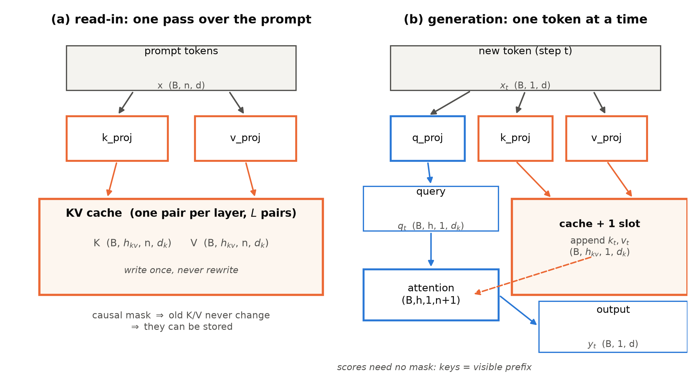
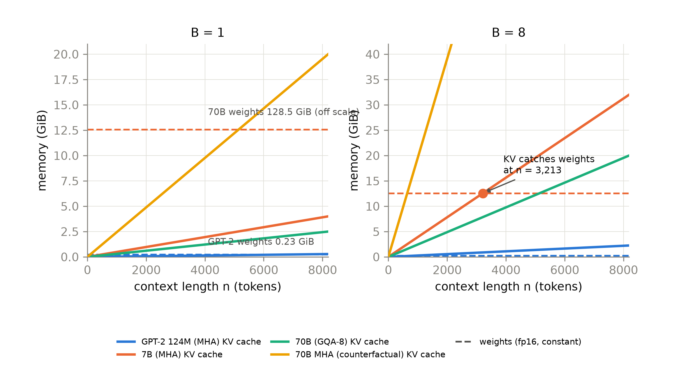
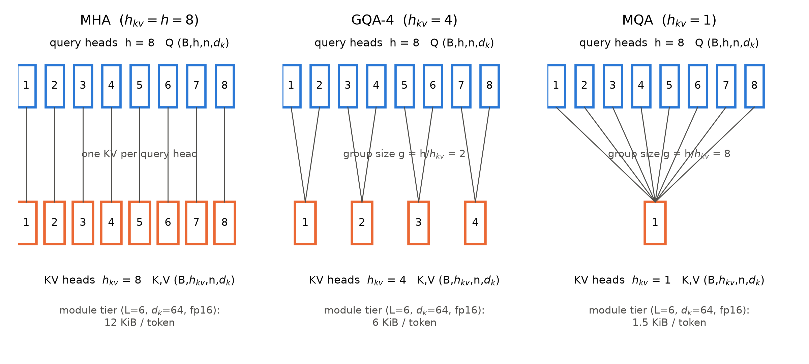
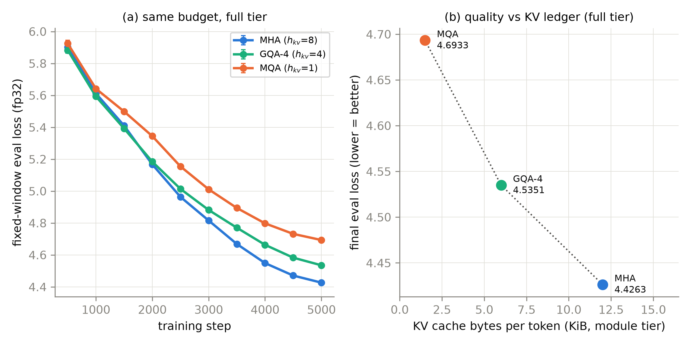

# 第 6 章 KV cache 正式登场：从 MQA 到 GQA

## 6.0 开篇：从全书到这里

上一章我们把出入口的账结清了：词嵌入与输出投影解绑，207M 的参数账逐位钉死在 207,119,360（三成付给两份嵌入，买出厂口径）；「拿到没读过的模型先读 config」的五步反推法也进了工具箱。至此 Book2 三插槽底座上的改装四连已经换了三格——归一化（第 2 章）、前馈（第 3 章）、位置编码（第 4 章）——外加出入口的附加一刀（第 5 章），Block 里只剩注意力一格还挂着 2019 年的原装多头注意力。而上一章结尾留了半句话：动这最后一刀之前，得先开一本新账——生成每一个 token 时，「记住前面说过什么」要付多少钱；这笔账训练时不存在（教师强制让全部位置一次看全），推理时却随长度线性涨。本章就来开它。

注意力这一刀与前几刀有个本质不同：换 RMSNorm、换 SwiGLU、换 RoPE，改的都是**训练时**的零件，验收标准是同预算下的质量；而注意力插槽的现代改装（共享 KV 头）的动机几乎全在**推理时**——不先把推理的账本立起来，这一刀为什么该动、动多深，就无从谈起。所以本章的路线是先账本后手术：先把两册书里反复挂号的那本「推理时代的账」正式开立，算到字节、对拍到实测；再读两篇论文——2019 年一刀砍到底的 MQA 与 2023 年砍到甜点的 GQA；然后动刀、消融、验收。本章也是全书叙事从「训练侧」转向「服务侧」的转折点：从这里往后，「每个 token 要付多少钱」开始和「训到多少分」同等重要。

本章结束时，注意力插槽换装完毕，四格插座全部现代化；同时一本随上下文长度线性增长的账会立在你面前——而上下文长度，正是下一章的主角。

> **最小背景栏**：本章只需要三件行李。①因果掩码：解码器自注意里位置 $i$ 看不见 $j>i$（Book1 第 7 章的禁区表）；②字节的账：fp16/bf16 每元素 2 字节，$1\,\text{KiB}=1024$ 字节、$1\,\text{MiB}=1024\,\text{KiB}$（二进制口径，全书统一）；③「算力」与「带宽」之别：乘加算得快慢是算力（FLOPs），把数据从显存搬进计算单元快慢是带宽——Book2 第 9 章的工程账本里见过它们，本章只需记住「搬运也要钱，而且常常比计算贵」。

## 6.1 四张欠条，今天兑付

开账之前，先把欠条翻出来数一数。这笔债两册书里一共挂了四次，每一次都写着同一个地址。

第一次在 Book1 第 4 章，讲交叉注意力时顺手埋的：K 是「地址」、V 是「内容」，2017 年的它们还同源同体——原文：

> 顺带一句，K 与 V 在 2017 年仍然同源同体（投影前是同一个张量），「地址」与「内容」被彻底拆开各自缓存，是推理时代才开立的账——见本章欠账框。

同章欠账框把话挑明：

> **K/V 的「读取」语义**——2017 年 K 与 V 同源同体，只是一次矩阵乘的两位配角；但「地址」与「内容」既然在公式里已经分成两半，推理时代就有人让它们分开存放、逐层复用，由此长出一本随序列长度线性增长的账。这本账怎么记、为什么决定显存与延迟的下限——→ Book3 第 6 章。

第二次在 Book1 第 7 章的参数账本里，算的是**重算**的浪费：自回归生成时每个新词元都把整段前缀重过一遍——「以 $T=9$ 为例逐 token 解码，累计前向位置数 $1+2+\dots+9=45$，是一次整段前向（9 个位置）的 **5 倍**；$T$ 个词元的生成累计 $\tfrac{T(T+1)}{2}$ 个位置的计算，冗余比随 $T$ 线性增长」；同章预告「这本账到 Book3 第 6 章正式开立（本册第 9 章解码时会先撞见它的影子）」。第三次，第 9 章真的撞见了，欠账框立此存照：

> **【欠账】推理时 K/V 的账（F4 预热）**——本章解码全程「每个新词元重算整段前缀」：1000 句 beam 解码约 25 秒里，大头是把同样的前缀算了一遍又一遍。哪些计算其实可以缓存不重算、这笔账在推理时代怎么反超参数账本成为显存主项——2017 年的 K 与 V 还同源同体，拆开存放是后话。→ Book3 第 6 章

第四次在 Book2 第 10 章，我们把「故意留笨」写成了明文口径：

> 本章与全书的生成实现一律按**全量重算**口径（每生成一个 token 重跑整段前向，本册边界内「故意留笨」的一处）——省下的工程（KV 缓存的账本）自 **Book3 第 6 章**开立、Book6 第 3/6 章展开，本册只登记不实现（第 11 章 11.3 节按此口径引用）。

四张欠条，两笔账：一笔**算力账**（重算了多少不该重算的），一笔**显存账**（缓存了什么、要付多大地方）。今天开立，先算第一笔。

## 6.2 增量生成：因果性送的礼物

直觉先行。因果掩码的含义 Book1 第 7 章已经拆透：解码器第 $t$ 步的输出，只依赖查询 $q_t$ 自己、以及 $j\le t$ 的那些 $K_j,V_j$——未来被 $-\infty$ 开除出局。现在追问一句：新 token 进来时，旧的 $K_j,V_j$ 会变吗？不会。$K_j=x_j W^K$ 只由第 $j$ 个位置自己的输入算出；RoPE 时代也一样——第 4 章讲清了旋转矩阵只看相对下标，每个位置的 K 在写入那一刻就把旋转算完，此后永不重算。**旧的 K/V 是冻结的**。冻结的东西就可以存起来——这本「键值缓存」（KV cache）就是两册欠账里的主角，缓存合法性的全部来由不过上面这两句。

那 Q 为什么不缓存？因为 $q_j$ 只影响第 $j$ 步自己的输出，输出一旦产出、交给下一层，这个查询就消费完毕再无用处——存它是纯浪费。于是一次自回归生成在工程上自然劈成两段（全书用自然语言称呼它们）：**一次读入**——整段 prompt 一把前向，K/V 从第一层到最后一层逐层算好、写进缓存；**逐 token 生成**——每步只对新 token 做三件事：三次投影（各一个位置）、取 RoPE 表里第 $t$ 行做旋转、拿 $q_t$ 对缓存里全部 $t+1$ 个键做一场注意力。图 6.1 把两段的数据流与全部张量形状画在一起：缓存的形状是每层一对 $(B,h_{kv},n,d_k)$——K 一份、V 一份，全模型 $2L$ 张；新 token 每步只往每对里追加一格 $(B,h_{kv},1,d_k)$。



图 6.1 KV cache 数据流与形状（自绘，示意级）：左=一次读入（整段 prompt 的 K/V 一次写好），右=逐 token 生成（每步 q_t 对全缓存做注意力、缓存只追加不改写）；两段共用同一本缓存，橙色=KV 通路、蓝色=查询与输出通路

有个细节值得停一拍：增量步的注意力**不需要因果掩码**。全量前向时掩码负责把 $j>t$ 的列置 $-\infty$；增量步里，缓存中的键恰好就是「可见前缀」——禁区根本不在打分表上，而在「还没进缓存」这件事里。Book1 第 7 章那句「掩码只裁决可见性」，在增量算法里显形为「可见性由缓存边界裁决」。

现在算第一笔账。全量重算口径下，生成 $T$ 个词元累计的前向位置数是

$$\sum_{t=1}^{T} t=\frac{T(T+1)}{2} \tag{6.1}$$

用人话说：越写到后面，每一步背的前缀越沉，浪费按平方涨。$T=9$ 时是 5 倍（Book1 的算例）；$T=1024$（GPT-2 满窗）时累计约 524,800 个位置，约等于把整段前向白算 **512 遍**【证据等级：本书复算】。带缓存的增量算法把每步压回 1 个新位置：同样的数学，换个记账方式就是两个数量级。这笔账在我们的机器上也有过现场——Book2 第 11 章 11.3 节实测「40 token 的 top-k 续写在 CPU 上 1.2 s，每一步都把整段 prompt 白算一遍，生成长度的平方级浪费」，当时说「这个省下的工程正是推理册要赚的第一笔大钱」；本章 `gqa.py` 的 `incremental_vs_full` 探针把同一件事重演了一遍：手写逐层缓存、逐 token 生成，与整段全量前向逐位对拍，$\max|\Delta|=1.2\times10^{-7}$（fp32 下 matmul 归约顺序的舍入差，无实质分歧），$n=64$ 时全量口径累计 2,080 个前向位置、增量口径 64 个【证据等级：本书实验（CPU fp32，2026-10）】。

到此第一笔账结清：缓存让生成的计算从平方降回线性。但立刻冒出新问题——这些存起来的 K/V 要占多大地方？新账本开立。

## 6.3 第一本账：把显存算到字节

每个 token、每一层，要为它存 K 与 V 各 $h_{kv}$ 个头、每头 $d_k$ 个数；fp16 下每个数 2 字节。于是每 token 的缓存字节数是

$$\text{KV bytes/token}=2\times L\times h_{kv}\times d_k\times b \tag{6.2}$$

用人话说：每生成一个 token，每层的每个 KV 头各记 $d_k$ 个数，K、V 各记一遍（式首的 2 就是这个「各一遍」）。式中四个量各管一件事，符号表如下（$b$ 是每个元素的字节数）：

| 符号 | 含义 | 张量形状/取值 |
|---|---|---|
| $B$ | 批内并发序列数 | 标量（服务侧杠杆） |
| $L$ | 层数 | 标量（结构杠杆） |
| $n$ | 上下文长度（已生成 token 数） | 标量（使用侧杠杆） |
| $h$ | 查询头数 | $Q\in(B,h,n,d_k)$ |
| $h_{kv}$ | KV 头数 | $K,V\in(B,h_{kv},n,d_k)$；MHA 时 $h_{kv}=h$ |
| $d_k$ | 每头维度 | 标量（2017 年定下的尺寸） |
| $b$ | 每元素字节 | fp16/bf16 为 2 |
| $g$ | 组内查询头数 $h/h_{kv}$ | GQA 用（6.5 节） |

注意这四个杠杆的性质：$L$ 与 $h_{kv}\cdot d_k$ 是**结构决定**的（图纸上的），$n$ 与 $B$ 是**使用决定**的（跑起来才有）。序列级账再乘 $n$、服务级再乘 $B$。账本纪律是「手算必须等于实测」——表 6.1 给出几档带几何标签的手算数，`kv_probe.py` 在 MPS 上逐 case 构造真实布局的 $(B,h_{kv},n,d_k)$ fp16 张量对（每层一对、共 $2L$ 个），实测分配差与手算**逐字节相等**（7/7 case 偏差 0.00%）【证据等级：本书实验（MPS，2026-10）】。

表 6.1 KV 账本手算表（fp16、B=1；几何标签随行，防两套几何混用）

| 模型（几何标签） | $h_{kv}$ | KV/token | n=1024 | n=2048 | n=4096 | n=8192 |
|---|---|---|---|---|---|---|
| GPT-2 124M（L=12, h=12, $d_k$=64, MHA） | 12 | 36 KiB | 36 MiB | 72 MiB | 144 MiB | 288 MiB |
| 207M cand1（L=12, h=16, $d_k$=64, GQA） | 8 | 24 KiB | 24 MiB | **48 MiB**✓ | 96 MiB | 192 MiB |
| ↳ 同几何反事实 MHA / MQA | 16 / 1 | 48 / 3 KiB | — | **96 / 6 MiB**✓ | — | — |
| 216M 三兄弟·MHA（L=16, h=16, $d_k$=64） | 16 | 64 KiB | — | **128 MiB**✓ | — | — |
| 216M 三兄弟·GQA-4（L=16） | 4 | 16 KiB | — | **32 MiB**✓ | — | — |
| 216M 三兄弟·MQA（L=16） | 1 | 4 KiB | — | **8 MiB**✓ | — | — |
| LLaMA1-6.7B（L=32, $d_k$=128, MHA） | 32 | 512 KiB | 0.5 GiB | 1 GiB | 2 GiB | 4 GiB |
| LLaMA2-70B（L=80, h=64, $d_k$=128, GQA-8） | 8 | 320 KiB | — | 0.625 GiB | 1.25 GiB | 2.5 GiB |
| ↳ 70B 反事实 MHA | 64 | 2.5 MiB | — | 2.5 GiB | **10 GiB** | 20 GiB |

（✓=kv_probe 实测逐字节吻合；加粗=正文引用的锚点数字。来源：GPT-2 与 LLaMA 档几何=官方论文 Table 2/1，207M 与三兄弟=本册 config 定版，全部字节数={本书复算}）

读这张表要有两眼。第一眼看**时代**：GPT-2 124M 满窗 KV 才 36 MiB，权重 0.23 GiB——KV 只占一成半，2019 年这不是一本大账（当年痛在重算的计算量）；到 7B 档 8k 窗就要 4 GiB、70B 档若不用 GQA 则 4k 窗就要 10 GiB，账本长成了硬约束。第二眼看**剪刀差**：权重是常数——装进显存就不再动；KV 是过原点的直线——斜率正是式 (6.2)。图 6.2 把两族线画在一起：7B 档（fp16 权重 12.55 GiB，按第 5 章式 (5.2) 的精确参数 6,738,415,616 计）在并发 $B=8$ 时，单条序列的平均 KV 只要 **3,213 个 token**就追平权重（$B=1$ 时 25,705）【证据等级：本书复算】；同一张图上，70B 反事实 MHA 的 KV 线在 $B=8$ 下约 640 个 token 就烧掉一部 7B 的身家（12.55 GiB），而真身 GQA-8 的直线斜率只有它的八分之一。服务一个模型，「常驻成本」与「随用量长的成本」从此要分开记账。



图 6.2 剪刀差（自绘）：实线=KV cache 随上下文线性增长（斜率=式 6.2），虚线=权重（常数）；左 B=1、右 B=8；橙点=7B 档 B=8 时 KV 追平权重的位置（n=3,213，按精确参数 6,738,415,616 复算）。70B 权重 128.5 GiB 超出量程

显存之外还有一笔**带宽**账，先记账头、6.4 节兑现。逐 token 生成时每步都要把整本缓存从显存搬进计算单元，却只做一点点乘加：7B 档 $n=4096$ 时每步全模型要搬 $2\times32\times32\times128\times4096\times2\,\text{B}=2\,\text{GiB}$，对应的计算只有约 $2\times$参数量 $\approx13$ GFLOPs 量级【证据等级：本书复算】——搬 2 GiB 的数据只为一丁点计算，这就是「每生成一个 token，把整本书架搬一遍」的账。记住了这个账头，下一节的主角登场时，你会认出它是冲谁来的。

## 6.4 省账本的第一刀：MQA

要对式 (6.2) 动刀，先看哪个变量砍得动。$d_k$？2017 年就告诉我们砍它伤质量（6.6 节细说）。$L$？砍层等于砍深度。$b$？每位数上的事先记账不展开。$n$ 和 $B$ 是用户给的，轮不到图纸管。剩下一个：**份数 $h_{kv}$**——而且它纯粹是「抄送份数」：32 个查询头各自配一套 K/V，用的是同一份 $x_j$、同样的 $d_k$，凭什么要 32 份？

2019 年 11 月，Shazeer 一个人把这一刀砍到底：**多查询注意力（Multi-Query Attention, MQA）**——$h$ 个查询头原封不动，K 与 V 各只留 **1 个头**，全部查询头共享【证据等级：官方论文 1911.02150v1 §3】。用本章的符号说就是 $h_{kv}=1$：式 (6.2) 的账直接除以 $h$，7B 档每 token 从 512 KiB 落到 16 KiB。形状上，$(B,h,n,d_k)\to(B,1,n,d_k)$——头维只剩一格、可直接挤掉，故也记作 $(B,n,d_k)$。注意每一头的 $d_k$ 一毫米没动——这句朴素的话是 6.6 节的钥匙。

刀砍了，质量掉多少？Shazeer 的实验设计本身就是教学范例：WMT14 英德翻译，6 层 encoder-decoder，基线与 MQA 版**全部对齐到 211M 参数**——省下的 KV 投影参数用加宽 FFN 补回（$d_{ff}$ 4096→5440），参数受控，差异才能干净归因于结构。结果见表 6.2 上半：对数困惑度 1.424→1.439，BLEU 26.7→26.5——掉了，但掉得很少；beam-4 测试集上反而 28.4→28.5 拿了全场最高（噪声级反超，如实记录、不作文章）。真正有冲击力的是**替代方案行**：同样把参数补齐，砍头数或缩每头维度（$h{=}1$、$h{=}2/d_k{=}64$、$h{=}4/d_k{=}32$、$h{=}8/d_k{=}16$）的四个方案，Billion-Word 语言建模上 PPL 29.9→31.2/31.1/31.0/30.9，全都掉 1.0 以上；共享 KV 只掉 30.2（+0.3）【证据等级：官方论文 1911.02150v1 Table 1/3，PDF 逐字核过】。省同样多的 KV，砍「份数」远比砍「每份大小」便宜。

表 6.2 MQA/GQA 论文数字重排（质量行为 MHA 基线 → 共享方案；速度为 MQA 论文 TPUv2 与 GQA 论文 TPUv4 各自口径，不可跨论文并比）

| 来源与设置 | 对比项 | 数字 | 读法 |
|---|---|---|---|
| MQA·WMT14（6 层，211M 对齐） | ln PPL (dev) | 1.424 → 1.439 | 税 +0.015 |
| 同上 | BLEU dev / test(beam4) | 26.7→26.5 / 28.4→28.5 | 后者噪声级反超 |
| MQA·Billion-Word（192M 对齐） | dev PPL | 29.9 → 30.2 | 税 +0.3 |
| 同上·替代方案四行 | dev PPL | 31.2 / 31.1 / 31.0 / 30.9 | 砍头缩维税 +1.0~1.3 |
| MQA·速度（TPUv2） | 解码器 µs/token | 46 → 3.8（≈12.1 倍） | 带宽瓶颈的直接兑现 |
| 同上 | 编码器 µs/token / 训练步 ms | 1.7→1.5 / 433→425 | 读入与训练几乎不动 |
| GQA·T5-XXL 五任务平均 | 平均分 | MHA 47.2 / GQA-8 47.1 / MQA 46.6 | GQA-8 与 MHA 差 0.1 |
| GQA·推理时（TPUv4，样本级） | $T_{infer}$ s/样本 | 1.51 → 0.28（GQA-8，≈5.4 倍）/ 0.24（MQA，≈6.3 倍） | 口径≠MQA 论文的逐 token 微基准 |
| GQA·uptraining | 转换/续训 | Mean > First > Random；α=0.05 | T5-XXL 约 600 TPUv3 芯片日 |

速度才是这篇论文的题眼：解码器每 token 摊销耗时 **46 µs → 3.8 µs，约 12.1 倍**（beam-4 解码也有 203→32 µs、约 6.3 倍）；而编码器几乎不动、训练步几乎不动。「哪快哪不快」恰好把病根指给你看——Shazeer 在 §1 写得直白：增量推理的速度「受限于重新装载那些编码注意力层状态的大型 keys 与 values 张量所需的内存带宽」（"limited by the memory bandwidth necessary to reload the large 'keys' and 'values' tensors"），而现代硬件上「计算能力可以比内存带宽高两个数量级」【证据等级：官方论文 §1/§2.3.1，原文直引】。逐 token 生成是搬运受限的：一次读入整段算 K/V 时数据被复用得足足的，带宽不疼；只有每步搬 2 GiB 只做 13 GFLOPs 的增量步疼（6.3 节的账头在此兑现）。论文的复杂度分析把这话写成了式子：增量 MHA 每步的访存/计算比为 $\Theta(n/d+1/b)$，MQA 把 $n/d$ 项砍掉 $h$ 倍【证据等级：官方论文 §2.4.1（节号经 PDF 目录复核）】。所以 12 倍来自省搬运，不来自省乘加——记住这个口径，6.8 节我们自己实测时会再撞见它。

这么好的东西，为什么 2019 年没人理？时间线说明一切【证据等级：官方论文/技术报告/config 逆向，逐条】：2019-11 论文发表，无修订、引用寥寥——当年模型小、窗短、学界不伺候推理；2022-04 **PaLM**（8B/62B/540B）全系采用，原话是 MQA「对模型质量与训练速度呈中性影响，却在自回归解码时显著节省成本」，前沿大厂第一次把它当默认件；2022-11 Google 服务侧的 Pope et al. 从推理经济学论证 MQA 配合模型切分可把上下文做长 32 倍；2023 年两记重锤——GQA 论文把它推广成分组、LLaMA2 在 34B/70B 上采用 GQA；2023-09 Mistral-7B 让 7B 档也用上 8 组；2024-07 Llama 3 全系 GQA-8，出厂默认化完成。**一篇 2019 年的论文，等它的时代等了三年**——等的就是 6.3 节那本账长成硬约束的过程。

## 6.5 不砍到底的智慧：GQA

MQA 留了两个尾巴。其一，$h_{kv}=1$ 砍得太狠，质量税在更大模型上会更疼——头数随规模涨（PaLM 540B 有 48 头、LLaMA2-70B 有 64 头），一刀切到 1，削减比例越来越凶。其二更工程：服务大模型要把层内计算切到多卡，**1 个 KV 头没法沿头切分**，只能每卡复制一份——等于白省（下文 LLaMA2 的服务侧定夺正是为此选了 8）。2023 年 5 月，Google 的 Ainslie 等人给出松紧可调的推广——**分组查询注意力（Grouped-Query Attention, GQA）**：「GQA 把查询头分成 $G$ 组，每组共享一个键头与一个值头」【证据等级：官方论文 2305.13245 §2.2，原文直引】。用本书符号：$h_{kv}=G$，组内 $g=h/h_{kv}$ 个查询头共用一组 K/V；边界处 $G=1$ 即 MQA、$G=h$ 即 MHA——MQA 与 MHA 是一根连续旋钮的两端，GQA 是旋钮本身。图 6.3 画出三档头分组；配对规则是**组内连号**：

$$\text{第 } i \text{ 个查询头（编号自 0 起）配第 } \left\lfloor i/g \right\rfloor \text{ 个 KV 头},\qquad g=\frac{h}{h_{kv}} \tag{6.3}$$

用人话说：查询头按相邻 $g$ 个一组切，第几组就看几个 KV 头——不是隔一个取一个。这个细节写错不会报错、只会静默掉分（HF 的头序正是连号共享，`repeat_kv` 组内相邻扩张）。



图 6.3 MHA/GQA-4/MQA 头分组示意（自绘，h=8）：上行=查询头（蓝，$(B,h,n,d_k)$），下行=KV 头（橙，$(B,h_{kv},n,d_k)$），连线=共享关系；底注=统一模块档（L=6、$d_k$=64、fp16）的 KV 每 token 字节

GQA 论文自己最硬的贡献是 **uptraining（检查点改造+短续训）**：已有的 MHA 大模型不必从头重训。两步——第一步改造检查点，把原 $h$ 组 KV 投影按组**平均池化（mean-pool）**成 $h_{kv}$ 组：

$$W^K\in(d,\,h\cdot d_k)\ \xrightarrow{\text{view}}\ (d,\,h_{kv},\,g,\,d_k)\ \xrightarrow{\text{mean over }g}\ (d,\,h_{kv}\cdot d_k) \tag{6.4}$$

（$W^V$ 同理；用人话说——把 $g$ 张索引卡叠印成一张，而不是撕掉 $g-1$ 张）。第二步按原配方原数据续训原始步数的 $\alpha$ 比例，主实验 $\alpha=0.05$（T5-XXL 约花 600 TPUv3 芯片日）。转换方式的消融给出直觉舒服的排序：**Mean > First（取第一头）> Random（重初始化）**——保留信息多者胜。续训比例的消融更有信息量：GQA 转换完**不续训就基本能用**，MQA 不续训明显塌；两者都在 5% 处增益显著、10% 后边际递减——「砍得越狠越依赖补课」，GQA 的甜点体质在这里已经显形【证据等级：官方论文 2305.13245 §2.1/§3.1，Fig 4/5】。

主结果收进表 6.2 下半的 GQA 行（T5-XXL 五任务平均）：MHA 47.2 分、GQA-8 47.1 分、MQA 46.6 分；推理时间 1.51 s → 0.28 s（≈5.4 倍）/0.24 s（≈6.3 倍）【证据等级：官方论文 Table 1；倍数=本书复算】。论文摘要的自我总结是「uptrained GQA 以接近 MQA 的速度取得接近 MHA 的质量」——慢 MQA 一点点，把质量税几乎抹平。组数从 1 加到 8 只添很少推理开销、再往上（16/32/64 直到 MHA）代价递增，「**8 是甜点**」的经验就来自这张扫描曲线【证据等级：官方论文 Fig 6】。另有两个边注值得带走：其一，GQA 论文把共享 KV 同时用在 decoder 自注意与交叉注意、却**不用于 encoder 自注意**——encoder 整段并行计算，数据搬得足足的，带宽不是瓶颈；「省搬运只对逐 token 生成有意义」这个判断，在两篇论文里各出现了一次。其二，附录 A 藏着一条训练侧的诚实记录：从头训的 MQA 在预训练中频繁 loss spike、长输入任务微调直接发散，uptrained 的 MQA 稳一些但方差大，uptrained 的 GQA 稳定——作者明说没深究根因。Book2 第 9 章那些 loss spike 的噩梦在这里有了新主角：**砍 KV 头也是训练稳定性的变量**，这为「GQA 比 MQA 温和」再添一票【证据等级：官方论文 2305.13245 附录 A】。

> **【考据框】「LLaMA2 只有 70B 用了 GQA」是讹传。**论文 Table 1 明列 **34B 与 70B 两档打 ✓**（7B/13B 打 ✗），表注原话 "Bigger models — 34B and 70B — use Grouped-Query Attention (GQA) for improved inference scalability"；34B 一档训而未发（脚注：来不及做足够的安全测试），江湖便只记住了 70B。而「LLaMA2 用了 GQA」这句话本身也是偷懒的说法——**7B 与 13B 至今是 MHA**（32 个 KV 头，config 逆向可证），Falcon-40B 也常被讹传为 MQA，实际 config 是 8 个 KV 头的分组共享。引用代际事实，一律回到 Table 1 与 config 双锚。

LLaMA2 的附录 A.2.1 是这场落地的完整案卷：动机句正是 6.3 节的账——「随着上下文窗或批大小增长，MHA 模型中 KV cache 尺寸相关的内存成本显著增长」；消融固定 **30B 规模、150B token**，三臂 MHA/MQA/GQA，**参数补齐协议**与 Shazeer 同思路（MQA 的 FFN ×1.33、GQA ×1.3）。Table 18 逐任务互有胜负——MMLU 三臂 28.0/26.5/26.9，HumanEval 7.9/7.3/7.9，GQA 的 BoolQ 反而最低——论文自己的读法是「GQA 与 MHA 基线大体相当、平均好于 MQA」，**不是全面碾压**【证据等级：官方技术报告 2307.09288 A.2.1/Table 18】。值得你我多看一眼的是它的实验哲学：单变量、同预算、参数补齐——与我们 6.8 节的等参数三臂同款思想，只是它用 FFN 放大补参数、我们用几何等参，第 8 章对照。服务侧的定夺同样写在那页：最大模型按单机 8×A100 部署，MQA 的 1 个 KV 头少于卡数没法沿头切、只能全卡复制（KV 账等于 GQA）；GQA-8 与 8 卡天然对齐。Figure 24 的吞吐-批曲线给出账本的可视化证词：**MHA 在 ctx=256 时 batch 1024 直接 OOM、ctx=2k 时 batch 128 就 OOM；MQA/GQA 一路跑到实验上限**【证据等级：官方技术报告 Fig 24 题注】。此后 Llama 3 全系 GQA-8（「8 个 key-value 头，以提升推理速度并缩减解码期 KV cache 尺寸」，Table 3 三档 KV 头均 8）【证据等级：官方技术报告 2407.21783 §3.2/Table 3】——从 70B（64 查询头/8 KV 头，$g=8$）到 405B（128/8，$g=16$），**查询头翻倍、KV 头不动**；全系 KV/token 只随层数缓涨（8B/70B/405B 按式 (6.2) 得 128/320/504 KiB）——Q 头数随规模涨、KV 账本被钉住，GQA「等比例省」在大谱系上就是这个样子【证据等级：本书复算（config 观察）】。

> **【实现对照框】HF transformers 5.18.0 的 GQA 落点**（`modeling_llama.py`）：`repeat_kv`（L179-188）三步 `[:, :, None]`→`expand`→`reshape` 把 $(B,h_{kv},n,d_k)$ 撑回 $(B,h,n,d_k)$，`n_rep==1` 直通——「GQA-$h$=MHA」的代码形态；组规模唯一真源是 `num_key_value_groups = num_attention_heads // num_key_value_heads`（L225）；`k_proj/v_proj` 的输出宽度就是 `num_key_value_heads * head_dim`（L234/237）——**KV 投影的省，可见于形状本身**。config 侧 `num_key_value_heads` 缺省回填 `num_attention_heads`：**默认 MHA，GQA 是显式声明才有的形态**，历史层积就写在默认值里。KV cache 的写入点在 L262（`past_key_values.update`）。一个本机实测的细节：`expand` 只给视图、`reshape` 落盘**真复制**（写穿透测试：改输出不动输入、两存储独立）——repeat 视图在算子内临时撑回 $h$ 份，**缓存里始终只有 $h_{kv}$ 份**。省的是常驻账本，不是瞬时工位。

## 6.6 灵魂收拢：不是 2017 错了，是账本变了

四节下来，一个反问已经憋在你喉咙里：Book1 第 3 章明明说过，**缩 $d_k$ 伤质量**——2017 年的 (B) 行消融里 $h{=}8$ 固定、$d_k$ 64→32→16，BLEU 单调变差；现在你告诉我把 KV 头从 32 砍到 8 甚至 1，每头 $d_k$ 不动、几乎不掉分？这两件事不矛盾吗？

不矛盾——它们是**两本账上的两个最优**。分三步说。第一步，训练时代的结论是真的，而且至今为真：打分维度与头数是表征容量，Book1 的 (B) 行与 MQA 论文的替代方案行是两头独立实验的互证——Billion-Word 上砍头缩维 PPL +1.0~1.3、共享 KV 只 +0.3，2017 年的判断在 2019 年的数据里原样重现。第二步，推理时代要省的**变量换了**：KV 账本是 $2Lh_{kv}d_kb$，2017 年的思路对这个式子动刀只有砍 $d_k$ 或砍 $h$——砍的都是表征容量；Shazeer 的洞察是**砍「份数」不砍「每份的大小」**：$d_k$ 原封、$h$ 原封，只把 $h_{kv}$ 从 $h$ 降到 $G$。查询侧的容量一毫米没动（每头照旧 $d_k$ 维打分、$h$ 个头照旧各干各的），动的只是「同一份键值抄送几份」——**训练时的账（表征容量）与推理时的账（搬运账单）就此解耦**。第三步，所以在「参数受控+同预算」的公平桌上，共享 KV 的质量损失（0.2 BLEU / 0.3 PPL / 平均 −0.1 分）远小于缩维（1+ BLEU / 1+ PPL）——**不是 2017 错了，是账本变了**。同一个小孔，训练时代往「够宽」拧、推理时代往「少份数」拧，两次拧法的合力，就是现代开源骨架里那格写着 GQA-8 的插座。

这个论断在我们自己机器上也有现场。可行性探针曾把模块档（$h{=}8$）一刀砍到 $h_{kv}{=}2$ 跑 150 步：loss 比 GPT-2 底座高 **0.28 nat**——粗砍档的质量税当场显形；而 6.8 节的正式消融里，KV 头从 8 砍到 4 再砍到 1，质量单调付税（+0.11、再 +0.16 nat）。砍得越狠、税越重，旋钮的位置感，两档实验都给了同一方向的读数【证据等级：本书实验（MPS，2026-10）】。

## 6.7 改装第四例：注意力插槽动刀

账立了、论文读了、灵魂收了，现在动刀。底座还是 Book2 第 10 章的三插槽 Block：注意力的原装是 GPT-2 式 **c_attn 合并投影**——一个 $(C,3C)$ 的矩阵把 Q/K/V 一次算完（Book1 第 3 章的多头入场券）。这一刀要把它拆开，而且拆成**两种宽度**：

- $W^Q\in(d,\,h\cdot d_k)$ 与 $W^O\in(h\cdot d_k,\,d)$：查询与输出**全宽**，一点不动；
- $W^K,W^V\in(d,\,h_{kv}\cdot d_k)$：KV 投影**窄**——207M 档 $d{=}1024$、$h{=}16$、$h_{kv}{=}8$、$d_k{=}64$ 下，q_proj 是 $(1024,1024)$、k_proj/v_proj 是 $(1024,512)$，每层注意力参数 $2d^2+2d\cdot h_{kv}d_k=3{,}145{,}728$（`gqa.py` 探针 6 手算=实测逐位）【证据等级：本书实验（CPU fp32，2026-10）】。

窄在这里、只在这里：**KV 的账本省在投影端，不在注意力计算端**。整条数据流的形状流转收进表 6.3：

表 6.3 GQA 插槽形状流转表（单层；$g=h/h_{kv}$，缓存形状随行标注）

| 步骤 | 运算 | 输入形状 | 输出形状 | 说明 |
|---|---|---|---|---|
| 1 | q_proj + view/transpose | $(B,n,d)$ | $(B,h,n,d_k)$ | 查询头全宽 |
| 2 | k_proj / v_proj + view/transpose | $(B,n,d)$ | $(B,h_{kv},n,d_k)$ | **存入缓存的就是它** |
| 3 | RoPE（第 4 章插槽） | 同上 | 形状不变 | 只旋 q/k；v 不转 |
| 4 | repeat_kv | $(B,h_{kv},n,d_k)$ | $(B,h,n,d_k)$ | 组内连号复制（式 6.3） |
| 5 | 打分×scaling | $(B,h,n,d_k)\!\cdot\!(B,h,d_k,n)$ | $(B,h,n,n)$ | 因果掩码作用于此 |
| 6 | softmax（fp32）+ 加权 | $(B,h,n,n)\!\cdot\!(B,h,n,d_k)$ | $(B,h,n,d_k)$ | 对拍五约定之一 |
| 7 | 拼头 + o_proj | $(B,h,n,d_k)$ | $(B,n,d)$ | 输出全宽回残差流 |

步骤 4 有两种等价写法。**repeat 视图**（上表）：把 $(B,h_{kv},n,d_k)$ 沿头维撑回 $(B,h,n,d_k)$，然后整段注意力代码一行不改地照跑——接口统一，HF eager 路径即此。**分组视图**：把查询重排成 $(B,h_{kv},g,n,d_k)$，与 $(B,h_{kv},1,n,d_k)$ 的 KV 广播计算——从头到尾**不复制**一份 KV。两种写法输出逐位一致（`gqa.py` 探针 3 实测 $\max|\Delta|=0$）；repeat 视图的复制发生在算子内的临时工位上（探针 4 的写穿透证据），缓存本体始终 $h_{kv}$ 份。教学件 [`code/ch06/gqa.py`](code/ch06/gqa.py) 的 `GroupedQueryAttention`（契约签名 `forward(x, cos, sin)`，cos/sin 由第 4 章的 `rope.py` 供给）用 repeat 视图落地，与组件库正身 `llama_slots.GroupedQueryAttention` 在 MHA/GQA/MQA 三档逐位一致（$\max|\Delta|=0$），手写 `repeat_kv` 与 HF `modeling_llama.repeat_kv` 在四个 $n_{rep}$ 档全部 `torch.equal`【证据等级：本书实验（CPU fp32，2026-10）】。想看 C 语言版的最朴素实现，llama2.c（MIT）的 `run.c` 是现成参照——一块启动时分配的静态数组、逐 token 写入第 $pos$ 格，与本节手写 cache 同构；Raschka 的 bonus 章有 M4 机器上的基准数字【证据等级：厂商自报】。

刀落下去，整机图景里的一格换了件：Block 四格插座——归一化、前馈、位置、注意力——至此**全部现代化**，加上第 5 章出入口的解绑，207M 档的图纸与 LLaMA 出厂口径只差组装（第 10 章的事）。但动刀之前悬着的问题还没验收：砍份数到底付多少质量税？下一节用受控实验回答。

## 6.8 组数扫描：省账本要付多少质量税

协议沿用第 2、3 章的家法（判据预注册先于运行，全文见随书仓库 `code/ch06/preregistered.md`）：统一模块档 $d{=}512$/$L{=}6$/$h{=}8$/$V{=}8192$、$B{=}16$/$T{=}512$（8192 token/步），Book2 五件套配方，同种子同数据批；三臂唯一变量是 KV 头分组——**mha8**（$h_{kv}{=}8$）/ **gqa4**（$h_{kv}{=}4$）/ **mqa1**（$h_{kv}{=}1$），对应 KV/token 12 KiB / 6 KiB / 1.5 KiB，严格 8:4:1。参数差如实标注：模块档**不做 FFN 补齐**（三臂 23,621,632 / 22,048,768 / 20,869,120，差量全在 k/v 投影宽度）——等参数补齐版正是表 6.1 里的 216M 三兄弟（$L{=}16$/V=8192 几何，三臂逐位同为 216,006,656），**只算账不训练**，作参照系；三臂数字汇成表 6.4。

表 6.4 组数扫描消融（统一模块档；eval=固定 49 窗 401,408 token、fp32；单种子；s/step 为 full 稳态）

| 臂 | $h_{kv}$ | 参数 | KV/token | tail300（fast/full） | eval_final（fast/full） | s/step |
|---|---|---|---|---|---|---|
| mha8 | 8 | 23,621,632 | 12 KiB | 5.5709 / 4.3929 | 5.5505±0.0117 / **4.4263±0.0120** | 0.1932 |
| gqa4 | 4 | 22,048,768 | 6 KiB | 5.5607 / 4.5116 | 5.5434±0.0120 / **4.5351±0.0127** | 0.2855 |
| mqa1 | 1 | 20,869,120 | 1.5 KiB | 5.6041 / 4.6653 | 5.5894±0.0116 / **4.6933±0.0131** | 0.2061 |

三臂的固定窗 eval 曲线与「质量-KV」反向读数并排见图 6.4：左图三条曲线的相对位置就是质量排序，右图把终评对着 KV 字节画——账本每便宜一档（横轴左移），纵轴单调上抬。



图 6.4 组数扫描消融（自产，统一模块档，full 5000 步，单种子）：左=固定窗 eval 曲线（误差棒=49 批批间 se）；右=终评对 KV 每 token 字节——质量降序与 KV 字节降序的反向关系【证据等级：本书实验（MPS，2026-10）】

full 档（5000 步、41M token、三臂同日程退火）把方向钉死，也把 fast 档的一层薄雾吹开了：**mha8 4.4263 < gqa4 4.5351 < mqa1 4.6933**——预注册的质量排序严格成立，KV 头从 8 砍到 4、再砍到 1，质量付 **0.109 与 0.158 nat**（批间带宽的 9 倍与 13 倍）；三臂全程无发散、训练与 eval 曲线单调健康【证据等级：本书实验（MPS bf16 训练/fp32 eval，2026-10，独占窗口）】。而 fast 档曾把 gqa4 与 mha8 的差距读进噪声带（−0.007 nat）——回看 full 的 eval 轨迹，这差距是随训练**长出来**的：1000 步 −0.019（gqa4 尚略优、仍在噪声带内），约 2000 步过零，2500 步 +0.050、3500 步后稳定在 +0.11 一线。fast 不是读错，是读早：欠训练档上「容量砍半」的税还没显影——与第 3 章门控前馈的教训同款（效应量随训练显影），档位限定必须写满。

判读按预注册走三条。**质量主判据**：排序 $mha8\le gqa4\le mqa1$ 成立且 full 档严格单调；fast 档的「GQA-4 近似无损」读数如实撤回，登记为欠训练档现象（1000 步内差距未显影）。**本章主判据——质量-KV 反向关系**：KV 字节 12→6→1.5 KiB 严格 8:4:1 下降，质量 4.426→4.535→4.693 单调上升——账本每省一档，质量付一档税，反向关系比 fast 档更干净。**速度副判据（单独报，不与质量混算）**：full 稳态 gqa4 反而慢 48%（0.2855 vs 0.1932 s/step）、mqa1 慢 7%（0.2061）——repeat_kv 物化展开的写穿透代价（6.7 节探针 4 的现场版）：**省的是显存与带宽，不是本机的 FLOPs**；与 MQA 论文解码加速 12 倍的口径（带宽语境、TPU）分开各说各话，勿并比。这恰好是 6.4 节那句「12 倍来自省搬运不来自省乘加」的本地注脚：我们的训练循环每步都做全量前向（数据搬得足足的），账本上的节省要等到逐 token 生成时才兑现——推理时代的收益，训练台上量不到。

这笔税的成分还要拆开看：模块档**不做参数补齐**，gqa4/mqa1 比 mha8 少 6.7%/11.6% 参数——税里既有「共享 KV」也有「参数变少」两份贡献，单变量是几何（KV 头分组），参数差量随行标注。补齐了参数的受控桌（LLaMA2 A.2.1 的 FFN ×1.3、30B/150B token）读到的才是「GQA 与 MHA 大体相当」；我们的 216M 等参数三兄弟正是那张桌子的只算账版（表 6.1）。两桌并读，207M 定版选 $h_{kv}{=}8$（16 个查询头、组内 2 头）而不是 4 或 1 的理由就齐了：小模型欠训练档上砍狠了真疼，「GQA-8 甜点」要靠规模与参数补齐来买。

档位限定照家法说满：单种子、fast=1000 步/full=5000 步、8192 词表欠训练小档；方向读数可转移，「差距的精确数值」是本种子本档位的实测。把三个时间尺度并排看——探针 150 步 $h_{kv}{=}2$ 粗砍档 +0.28 nat（6.6 节）、full 5000 步 $h_{kv}{=}4$ +0.109、$h_{kv}{=}1$ +0.267——税随砍幅与训练时长都单调涨，旋钮的位置感比任何单一数字都更有教学价值。

## 6.9 本章小结

开篇的四张欠条，逐一兑付：式 (6.1) 把 Book1 的 $T(T+1)/2$ 算术变成了增量算法与逐位对拍（因果性 ⇒ 旧 K/V 不变 ⇒ 可缓存、Q 不缓存）；式 (6.2) 把「随序列长度线性增长的账」算到了字节，`kv_probe` 七个 case 手算=实测、偏差 0.00%；剪刀差图上权重是常数、KV 是直线，7B 档并发 8 时 3,213 个 token 追平；MQA 与 GQA 两篇论文给出了动刀的完整理由与配比（12 倍解码加速的带宽原理、uptraining 配方、GQA-8 甜点、LLaMA2 双档与 Table 18 消融）；第四例改装把 c_attn 拆成两种宽度的四投影，对拍三重全绿；组数扫描在质量-KV 反向关系上收束——本档 KV 头从 8 砍到 4、再砍到 1，质量付 0.11 与 0.16 nat 的税，且税随训练显影（fast 档还藏在噪声带里）；甜点要靠规模与参数补齐来买，这正是 207M 定版选组内 2 头的理由。

**带走的心智**：细节全还回去之后，请留下三句话。**第一，推理时代的账本不在参数、在 KV——权重是常数，KV 是过原点的直线，斜率 $2Lh_{kv}d_kb$ 是每 token 的租金；看到任何一台推理中的模型，你要能条件反射地同时数这两本账。第二，省账本的正确刀法是砍「份数」不砍「每份的大小」——查询头一个不动、每头 $d_k$ 一毫米不动，只把同一份键值的抄送数从 $h$ 降到 $h_{kv}$；表征容量与搬运账单就此解耦，这是 GQA 全部便宜的总来源。第三，不是 2017 错了，是账本变了**——训练时代的最优（够宽）与推理时代的最优（少份数）不冲突，是两本账上的两个答案；读任何架构演化，先问它站在哪本账上。

放回全书旅程：Block 的四格插座至此全部换完，207M 的图纸与 LLaMA 出厂口径只差组装。而本章立起来的这本账，把一个变量推到了聚光灯下——**上下文长度 $n$ 正是 KV 账本的主变量**：把 2k 的窗拉到 8k，KV 直线斜率不变、账面直接翻四倍。可是先撞墙的还不是显存——是位置编码：第 4 章我们拆了 RoPE 的结构，却没回答「训练时只见过 2k 以内位置的模型，推理时喂 8k 会怎样」。下一章就撞这面墙，并学会三种「训练后租窗」的配方。

> **【欠账】** KV 这本账开立之后，省它的路子从此分三股——架构侧（把 $h_{kv}$ 再往小做只是第一刀）、精度侧（每位数上省）、淘汰侧（该忘的就别留），三股怎么拧、各值多少钱是 Book6 第 3/5 章的正题；而架构侧更深的一刀——把 $h_{kv}\cdot d_k$ 本身做更低秩的折叠——属于 Book4 第 6 章。本册把账立好，收账的留给他册。

## 6.10 动手验证

- **教学重写件与三重对拍**（CPU 秒级，6.2/6.7 节全部自测数字的来源）：
  ```bash
  cd 工作区根目录 && source env.sh && \
    python [`code/ch06/gqa.py`](code/ch06/gqa.py)
  ```
  预期产出：对拍① 与 llama_slots 正身三档（MHA/GQA-4/MQA）$\max|\Delta|=0$；对拍② 手写 repeat_kv 与 HF `modeling_llama.repeat_kv` 四个 $n_{rep}$ 档 `torch.equal=True`；对拍③ 分组视图与 repeat 视图 $\max|\Delta|=0$；写穿透（改 y 不动 x）；增量 vs 全量 $\max|\Delta|=1.2\times10^{-7}$（$n{=}64$ 时 2,080 对 64 个前向位置）；207M 档每层注意力参数 3,145,728（手算=实测）。
- **KV 账本 probe**（秒级，表 6.1 实测列的来源）：
  ```bash
  cd 工作区根目录 && source env.sh && \
    python [`code/ch06/kv_probe.py`](code/ch06/kv_probe.py) --out-name kv_probe
  ```
  预期产出：手算表（三模型×三方案×三窗长）+ 两套命名账（207M@2048=48 MiB，MHA 反事实 96/MQA 6；三兄弟 128/32/8 MiB，参数逐位 216,006,656）+ 实测 7/7 逐字节吻合（MPS；产物落 `log/book3-ch06/`）。
- **组数扫描消融**（fast ≈12 min 三臂 / full ≈58 min 三臂，MPS 独占窗口、单进程顺序执行）：
  ```bash
  cd 工作区根目录 && source env.sh && \
    python [`code/ch06/ablation_gqa.py`](code/ch06/ablation_gqa.py) --steps 1000 --out-name fast
  python [`code/ch06/ablation_gqa.py`](code/ch06/ablation_gqa.py) --steps 5000 --out-name full
  ```
  预期产出：`log/book3-ch06/ablation_gqa_{fast,full}.json` + `curve_{臂}_{档}.csv`；三臂参数 assert、KV 几何账随 JSON 输出。
- **复画图 6.1-6.4**（秒级；图 6.4 需先有消融产物，full 在则自动用 full）：
  ```bash
  cd 工作区根目录 && source env.sh && \
    python [`code/ch06/make_figures.py`](code/ch06/make_figures.py)
  ```
- **验收点**：能手算任一模型任一 $(n,B)$ 的 KV 显存并说出四个杠杆里哪两个是结构决定的；能解释 MQA 的 12 倍为什么来自带宽而本机训练台上量不到；能把「不是 2017 错了，是账本变了」的三步论证独立复述；能写出式 (6.3) 的连号配对并说出写错为什么静默。
