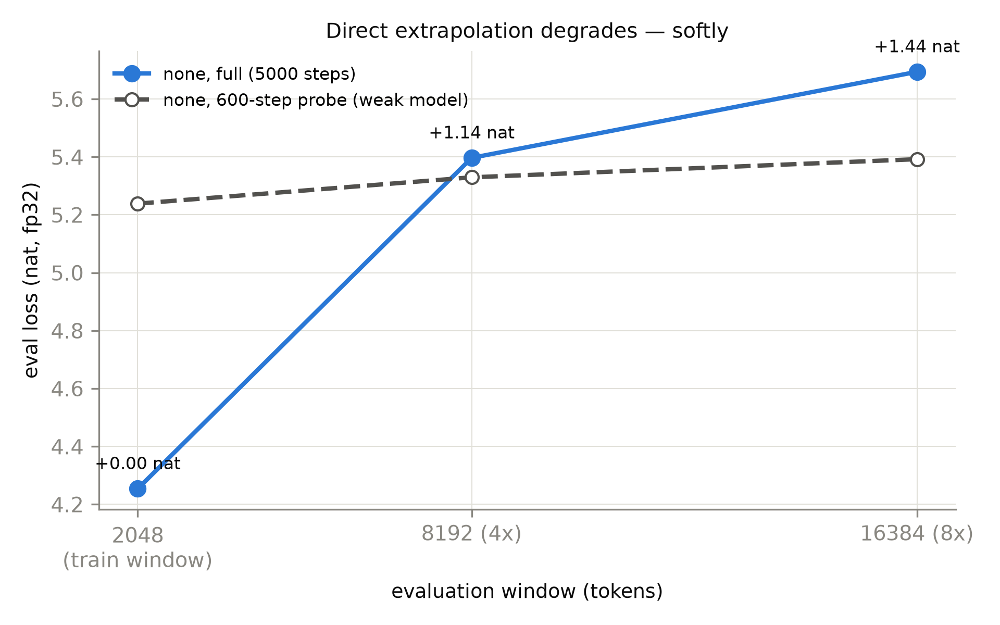
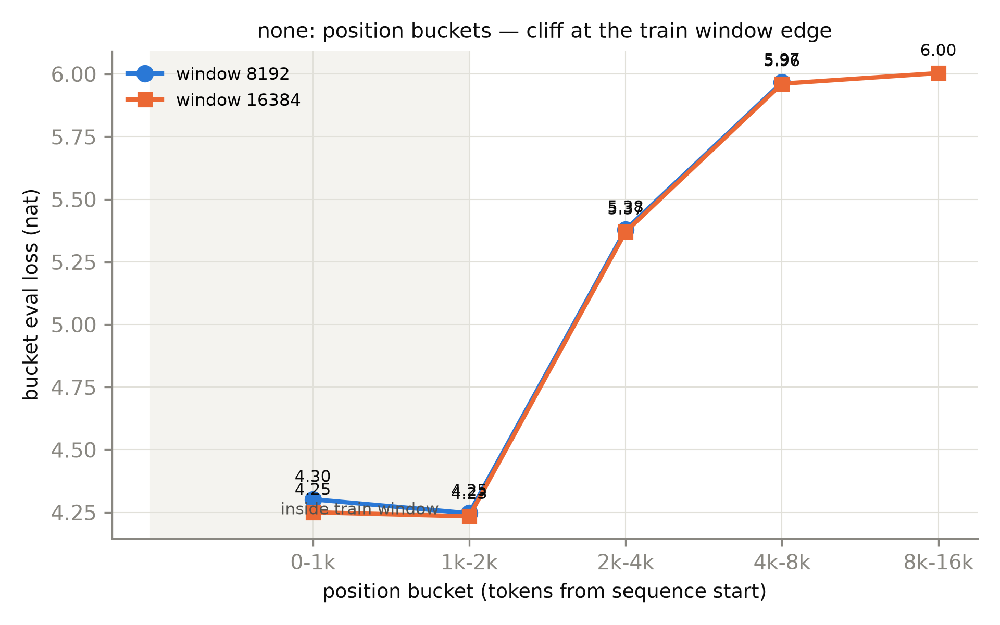
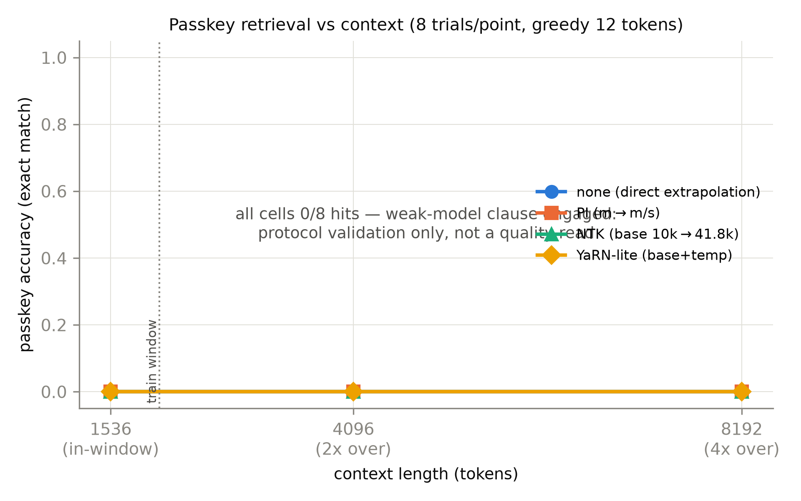
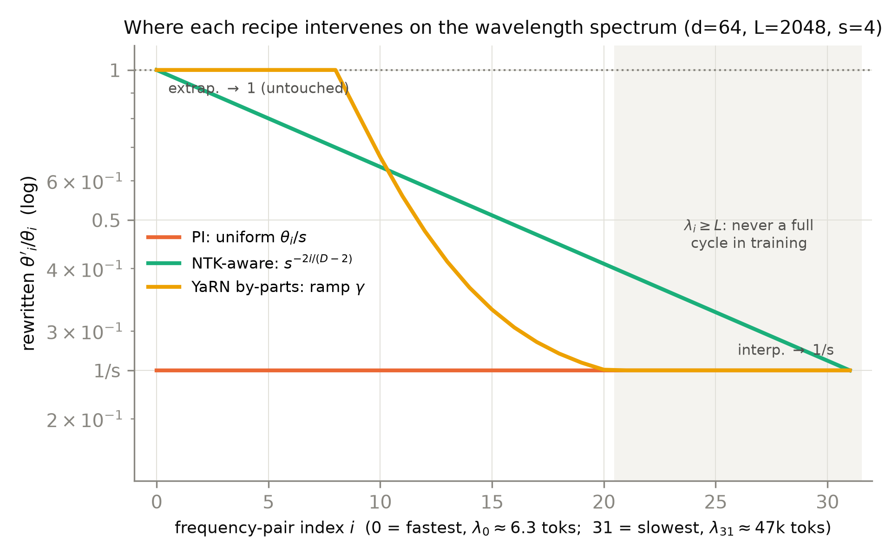
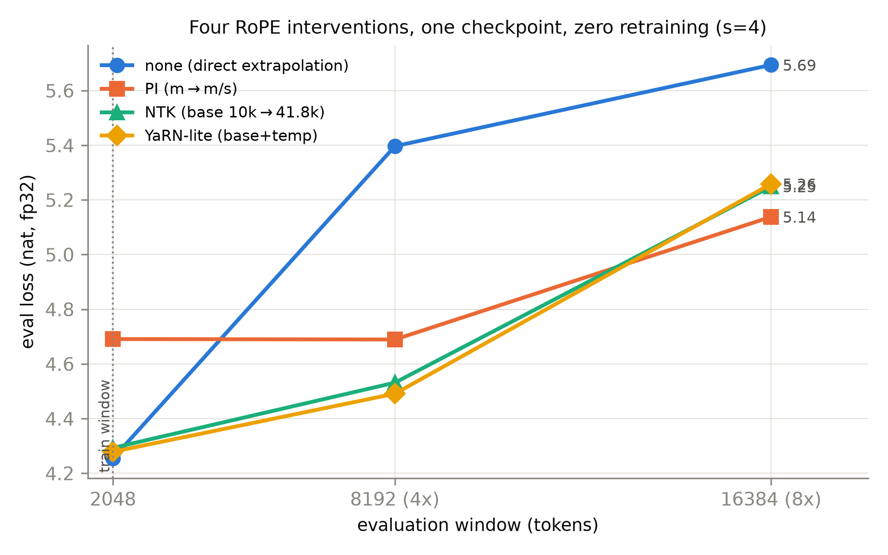

# 第 7 章 长上下文工程线：外推的三代配方

## 7.0 开篇：从全书到这里

上一章我们开立了 KV 账本：每多看一个 token，推理侧要付多少字节、哪些手术能把这个单价砍下来，账目已经清楚。但那本账回答的是「看得起吗」，还有一件事它管不着——**模型本身看得动吗**。一台用 2048 token 窗口训出来的模型，你把显存管够、把 8192 个 token 喂进去，它表现如何？第 4 章 4.9 节的换件实验预告过答案的方向：RoPE 臂训 512 测 2048，4× 越窗要付 0.49 nat、位置分桶单调变差——但那是 512 小窗上的一次预告。本章把问题放到正式战场上，并且不止诊断，还要治疗。

这一章在全书旅程第三段（工程与谱系）的起点，要回答的问题只有一个，但它是三笔旧账的合流：**训练已经结束、权重已经定死的一台模型，能不能事后把上下文窗「租」大？**产出三样：三代配方（PI→NTK-aware→YaRN）的机制心智——全落在第 4 章那张波长谱表上，三种配方不过是同一张谱的三种改写；本册第二招牌实验——同一个 2k 窗 checkpoint、免重训、只改 RoPE 参数的四干预对照；一本代际账——「出厂设定」与「训练后租窗」两条路在 2024 年如何汇流。本章结束时，四格插座全部换完，插座③的最后一笔遗产——外推——也清了账；下一章把三代 LLaMA 摆上装配线。

> **最小背景栏**：本章默认你已读过第 4 章（RoPE：每对维度一根「表针」，逆频率 $\theta_i=\text{base}^{-2i/d}$ 从 $1$ 指数递减到约 $10^{-4}$，波长谱表与快慢指针图像见该章图 4.3；旋转只作用于注意力内的 Q 与 K，$\cos/\sin$ 查表 $(1,n,d_k)$ 作用于 $(B,h,n,d_k)$）与第 6 章（KV 账本：每 token 字节 $=2Lh_{kv}d_k b$，上下文长度是主变量）。Book2 第 12 章 12.3 节的中文预算表（GPT-2 词表下每汉字约 2 token）在章末回扣；训练协议沿用 Book2 五件套（第 10 章）。符号约定：$L$=训练窗（本章 2048），$L'$=目标窗，$s=L'/L$ 为扩窗倍数，$b$=RoPE 底数（config 的 `rope_theta`），$D$=头维 $d_k$（本章 64），$\lambda_i$=第 $i$ 对维度的波长——本章 $L$/$b$ 与第 6 章公式同名不同义（那里是层数与每元素字节数），以各章符号表为准。

## 7.1 三笔旧账，一个主场

动刀之前，把三笔旧账的借据原文取回来。

第一笔最老。Book1 第 5 章逐字引过 2017 年原典选择正弦位置编码的理由：

> 「We chose the sinusoidal version because it may allow the model to extrapolate to sequence lengths longer than the ones encountered during training.」（我们选择正弦版本，因为它**或许**能让模型外推到训练时未见过的更长序列。）【证据等级：官方论文 Transformer v7 §3.5】

注意那个 may——这句「外推承诺」从头就是一个假设，原论文没有为它做过任何 train-short-test-long 实验。第 4 章也把 RoPE 论文的口径核死了：v1 到 v5 全版本无外推实验、无衰减消融，摘要里的「长度灵活性」不等于「解决外推」【证据等级：调研期逐版核对，本册负结论红线】。所以本章处理的不是「论文承诺的兑现」，而是「一句假设在六年后的工程下场」。

第二笔是那面墙。Book2 第 4 章的差异清单里，GPT-2 把位置编码换成了 1024 行查表，章末欠账句写着：「位置查表把上下文钉死在 1024（Book1 F6 外推主线的接续——既相对又可外推的旋转式做法、以及超长上下文的工程挣扎在 Book3 第 4/7 章）」【证据等级：Book2 第 4 章成稿直引】。第 4 章兑现了前一半：查表拆掉、位置改为在注意力内部现算，位置号 2048 送进去不会再 `IndexError`——**结构性解除**。但 4.9 节的实验同时露了底：结构上「可算」不等于「好用」，越窗位置的 loss 逐桶变差。硬墙拆了，墙还剩一个软的影子——这正是本章要收口的「硬墙→软墙」。

第三笔是接力棒。Book2 收束章登记上下文长度这笔大账时点名：「**工程主线在 Book3 第 7 章**（$2\text{k}\to32\text{k}$ 的外推工程线）……这就是 N7——F10 的接力棒，本册埋下的最后一笔新钩」【证据等级：Book2 第 12 章成稿直引】。同一节还算过中文世界的加倍账：同样的窗，装下的中文只有英文的一半。F6、N2、N7 三笔账在本章合流，共同的物主是第 4 章装进插座③的那个旋转位置编码。于是主问题可以问得很具体：一台 2k 窗训好的 RoPE 模型，权重一个字节不动，有什么办法让它体面地用 8k 窗？先看病历。

## 7.2 问题现场：给 2k 窗模型做一次 8k 体检

看病历，得先有病历——而这份病历要自己造。实验对象是专门为此训的一台 mini：组件库正身 `llama_slots.LLaMA`，$d=256$、4 层、4 头、$V=8192$、RoPE $\theta=10^4$，共 7,407,872 参数（脚本 assert 逐位锁死）——第 2-6 章的模块实验都在 512 token 窗上做，这台唯一的目的就是把**训练窗钉在 2048**。训练沿用五件套，B=8、T=2048，full 档 5000 步共 81.9M token；评测用互斥的 heldout 文件，三个窗长（2048/8192/16384）各评 393,216 token，fp32 前向。两个协议决定先于数字讲。其一，**判据预注册**：六条方向判据与负结果处置条款在 full 启动前落盘（随书快照 `code/ch07/preregistered.md`），头一条就是「断崖或渐进，按实测如实报」——600 步的探针先例只见过渐进（8k 仅 +0.09 nat），本节的底气必须来自 full 档。其二，**双口径**：ppl 之外必须配检索测试——YaRN 论文附录提醒过，「困惑度未必是模型能否注意到所有 token 的好指标」【证据等级：官方论文 2309.00071 附录 B.2】：把长文当「同类 token 均匀海」的模型也能拿到不难看的 ppl，而检索早已失效。所以本章的 passkey 协议是真实文本 filler 中段埋一个 5 位数字针、末尾提问、贪心解码 12 token 精确匹配，in-window（1536）与 out-window（4096/8192）双口径。

数字到位（full 档 5000 步，训练健康无发散，尾部 300 步 train loss 4.234）。同窗基线：2048 窗 eval loss **4.254**（ppl 70.4）。直接外推：8192 窗 **5.397**（ppl 220.7）——**+1.14 nat、困惑度翻 3.1 倍**；16384 窗 **5.694**（ppl 297.1），+1.44 nat【证据等级：本书实验（MPS bf16 训练/fp32 eval，2026-10，单种子）】。这就是软墙的正面照：不是报错，是质量塌方。更有信息量的是退化的**梯度**——三档训练充分度排成阶梯：600 步探针 +0.09 nat（渐进）、2000 步 fast +0.53、5000 步 full **+1.14**（图 7.1）——模型训得越充分，对训练窗的依赖越死，外推塌得越狠。预注册里「弱模型只见渐进」的既知口径在此显形为规律：**渐进与断崖不是两种病，是同一种病的两个病程**；文献里充分训练模型的断崖（被 PI 扩过的 7B 在 64k 外 ppl 爆过 $10^2$），我们的 5000 步档已开始长出它的形状。



图 7.1 直接外推的退化曲线（自产，full 5000 步 vs 600 步探针，none 干预，纵轴 eval loss、增量以各自同窗 loss 为基线；ppl 口径 70.4/220.7/297.1；393,216 token/点，fp32）【证据等级：本书实验（MPS，2026-10，单种子）】

位置分桶把「墙」的位置量了出来（图 7.2）：8192 窗内，训练窗内的三段平稳且**尾段最稳**（4.31→4.29→4.25）；一过 2048 立刻跳到 **5.38**（2k-4k 段），4k-8k 段继续恶化到 **5.97**；16384 窗再添一段 6.00。墙不在别处，就钉在训练窗的边界上——上一章 KV 账本问「付不付得起」，这里量出的是「模型自己知道窗在哪」。



图 7.2 none 干预的位置分桶（自产，full 档：8192 与 16384 两窗长的分桶 loss，桶边界按 2 的幂对齐；灰底=训练窗内——窗内平稳且尾段最稳，越窗即跳崖）

passkey 那一栏则给全章立了一个诚实坐标：四干预 × 三窗长 × 三深度 × 8 试验共 288 格，**全部零命中**——包括训练窗内的 1536 档（图 7.3）。预注册的弱模型条款如期生效：loss 4.25 的 7.4M 模型还没长出「找回五位数」的检索能力，全表按**协议验证档**报告，不作质量结论【证据等级：本书实验（2026-10，单种子）】。但这一栏并非空转：协议全部跑通——配对设计、KV cache 增量解码与全量重算的逐 token 自检（四干预全一致，第 6 章增量算法的第一次实战）；顺手给出 ppl 口径的反面注脚——同窗 ppl 70 的模型检索为零，**语言建模活着，检索还没出生**，YaRN 附录那句「困惑度未必是好指标」换了个方向显形。协议留给更强的 checkpoint 复用（第 10 章整合短训产物是现成候选）。



图 7.3 passkey 准确率 vs 上下文（自产，full 档：四干预 × {1536, 4096, 8192} × 三深度 × 8 试验全为零命中——弱模型条款生效，协议验证档；曲线保留是为展示协议矩阵本身，虚线=训练窗边界）

## 7.3 失败机制：波长谱上的三个诊断

病历拿到手，现在问病理。把第 4 章的波长谱表（图 4.3）铺开在桌上：$D$ 对维度就是 $D$ 根转速不同的表针，第 $i$ 对的逆频率 $\theta_i=b^{-2i/D}$，波长（转一整圈要多少个 token）$\lambda_i=2\pi/\theta_i$。拿本章实验的几何手算（$D=64$、$b=10^4$）：最快的第 0 对 $\lambda_0\approx 6.3$——六步一圈；最慢的第 31 对 $\lambda_{31}\approx 4.7\times10^4$——四万七千个 token 才转完一圈。**训练窗只有 2048**：快针在窗内转了几百圈，角度取值早就铺满；慢针——凡是 $\lambda_i\geq L$ 的维度（本例 $i\geq 21$，约三分之一的频率对）——**在整个训练里从未转完一圈**【证据等级：本书算术（与第 4 章 d=128 档谱表同法）】。三个诊断依次而来。

诊断一：**位置超出分布**。RoPE 对 Q、K 做的是「按位置旋转」，位置 $m$ 的旋转角是 $m\theta_i$。训练里模型见过的角度上界是 $L\theta_i$；推理时位置冲到 $4L$，慢针对应的旋转角进入了从未拟合过的区间。这不只是直觉——PI 论文给出了形式化的坏消息：RoPE 的注意力分数作为相对位置的函数由三角函数族构成，而「维度足够多时，三角函数族是通用函数逼近器」，于是在训练区间 $[0,L)$ 之外，这个函数的取值**没有任何界**，可能产生灾难性高的注意力分数【证据等级：官方论文 2306.15595 §2.2】。他们还算了一笔账：把位置插值回窗内的做法，其函数逼近界比直接外推小约 600 倍（"at least $2\times294.73\sim600\times$ smaller"）——外推在函数空间里比插值贵两个数量级以上，这个数字 7.4 节马上要用【证据等级：官方论文 2306.15595 §2.3 式 5-8 之后】。

诊断二：**注意力分布失去校准**。角度一越界，若干头的打分就漂了——该压低的远距分数被抬高、该聚焦的近距分数被抹平，7.2 节分桶里越窗段那种整齐的跳崖，就是分布集体失准在 loss 上的投影。这里要立一条表述纪律：中文社区爱说「注意力熵暴增」，但 PI 与 YaRN 正文都没有这样的机制句（YaRN 现行版只在温度拟合处顺带提及熵，v1 的一处动机句在 v2 起已删）【证据等级：调研期逐字核对，本册红线】——本书只用「分布失去校准」这种可守的措辞，证据就是自己的分桶数据。

诊断三：**长窗本身的账**。就算外推修好了，长窗也不是免费的：注意力打分矩阵是 $(B,h,n,n)$，序列长度的平方级——本册探针在同类小模型上实测，序列从 1024 涨到 8192，单步耗时涨 **25.4 倍**（纯注意力的 $n^2$ 理论是 64 倍，实测含线性项与内存池化效应）【证据等级：本书实验（MPS，2026-10，探针 D）】；KV 账本那边（第 6 章）则随长度线性涨——207M 档（$L{=}12$、$h_{kv}{=}8$、$d_k{=}64$）@2048 是 48MiB，@8192 就是 192MiB（表 6.1）。「看得动」要付两笔钱：本章治位置编码的精度账；算力与显存账的系统性疗法属于推理册领地，第 6 章末已登记欠账。

三个诊断合起来，正好给 N2 收口：查表式的墙是**硬墙**——第 1025 个位置根本没有向量可用，程序当场报错；RoPE 的墙是**软墙**——每个位置都算得出旋转角，模型照常前向，只是越窗的角度分布没见过，于是 ppl 渐爆、检索失效。硬墙只能换零件（第 4 章已换），软墙却是**可以修的**——修法就是接下来三节的三代配方。

## 7.4 第一代配方 PI：把新窗缩小了装进旧窗

2023 年 6 月，Meta 与 USC 的团队拿出第一个系统修法：位置插值（Positional Interpolation，PI）【证据等级：官方论文 2306.15595】。核心一行式子——把目标窗 $L'$ 的位置索引先线性压回训练窗 $L$ 内，再交给原来的 RoPE：

$$
f'(x,\,m)\;=\;f\!\left(x,\;\frac{mL}{L'}\right)\;=\;f\!\left(x,\;\frac{m}{s}\right)
\tag{7.1}
$$

| 符号 | 含义 | 形状/取值 |
|---|---|---|
| $f$ | 训练好的 RoPE 变换（对位置 $m/s$ 取 $\cos/\sin$ 行） | 查表 $(1,L',d_k)$，行值域落回 $[0,L)$ |
| $m$ | 目标窗内的位置号 | $m\in[0,L')$，缩放后 $m/s\in[0,L)$ |
| $s=L'/L$ | 扩窗倍数 | 本章实验 $s=4$（$2\text{k}\to8\text{k}$） |

用人话说：**新窗里的每个位置，都冒充训练窗里的一个旧位置**——8192 号位置按 2048 号的角度旋转。等价的频率视角更常用：位置乘 $1/s$ 就是全部逆频率除以 $s$（HF 的 `linear` 缩放正是直接 `inv_freq /= factor`）【证据等级：config/源码，transformers 5.18.0】。关键在方向：PI 不是把外推边界推远，而是**把新窗缩小步长装进旧窗**——论文原话说，任意两个 token 的最大相对距离「从 $L'$ 降回了 $L$」，所有相对位置重新落回训练分布内。这就兑现了 7.3 节诊断一里那笔 600 倍的账：插值把函数约束回模型拟合过的区间，直接外推则在无界区间上裸奔。

代价是**原窗的分辨率**：同样的 2048 个位置挤在原来四分之一的角度区间里，相邻 token 的角度差缩到 $1/s$，近邻的次序分辨变钝——论文的定性判断是「PI 迫使原窗内的位置编码居住在一个窄得多的区域」【证据等级：官方论文 2306.15595 §3.2】。这笔「同窗税」在 7.7 节的实验里有精确读数，先按下。

修法虽小，纯改推理参数的免微调版仍嫌粗糙——PI 直接套在 LLaMA-7B 上不微调，8192 窗的 ppl 是 16.10（微调 1000 步后回到 6.95）【证据等级：官方论文 2306.15595 Table 3】——所以 PI 论文的主张是**配一小段微调**：在 Pile 上「数万到数十万条样本」、约 **1000 步**（lr 2e-5/1e-5、warmup 20 步、8k 窗用 32 张 A100）就能把租来的窗住舒服【证据等级：官方论文 2306.15595 Abstract/§2.4/§3.1】。对照实验把「插值才租得动」钉死了：直接外推的对照组即使微调 **10000 步**，passkey 有效窗 $k_{\max}$ 只从 2048 推到 **2560**；PI 组 200 步就全线通过到满窗【证据等级：官方论文 2306.15595 §3.3 与 Table 4】。结果数字：LLaMA-7B 与 13B 扩到 32768（33B 到 16384、65B 只到 8192），PG19 困惑度 7B@32k 为 7.23/6.91/6.77（分别在 2048/8192/32768 窗评测）、13B@32k 为 6.54/6.28/6.09，proof-pile 上 7B@32k 为 2.82/2.39/2.48【证据等级：官方论文 2306.15595 Tables 1/2】。顺读一个细节：7B@32k 在 2048 窗评 7.23，反而高于它在 32768 窗的 6.77——租了长窗的模型在短窗上付着税，论文侧的同窗税痕迹（原模型同窗基线论文未单列，不作并列比较）。

「训练后租窗」的第一代就此成形：**不动预训练账本，用约千步微调+全维均匀压缩，把 2k 的窗租成 32k**。租约上的租金，是原窗分辨率。社区很快追问：这租金，能少付点吗？

## 7.5 第二代配方 NTK-aware：社区的三行代码与八字诀

第二代的出身与第一代不同：它**没有论文**。2023 年 6 月 29 日，网名 bloc97 的研究者在 Reddit 的 LocalLLaMA 版发帖，标题即结论——「NTK-Aware Scaled RoPE allows LLaMA models to have an extended (8k+) context size without any fine-tuning and minimal perplexity degradation」（NTK 感知缩放的 RoPE 让 LLaMA 免微调获得 8k+ 上下文，困惑度退化极小）【证据等级：社区配方（bloc97 帖 2023-06-29，经 YaRN 论文转述核对）——本册证据等级制度的又一档正式启用】。先声明纪律：NTK-aware 系全体（含动态 NTK）按**社区配方**等级引用，公式锚定在 YaRN 论文的转述上，帖作叙事源。

bloc97 的病根诊断与 7.4 的租金问题严丝合缝：PI 把**所有**频率均匀压到 $1/s$，而「对 RoPE 的傅里叶空间做简单的线性插值是很次优的，它让网络无法区分**非常靠近**的 token 的次序与位置」【证据等级：社区配方，bloc97 帖正文】——近邻分辨靠的正是快针，均匀压缩把最不该动的快针也压了。药方只有八个字：**高频外推、低频插值**。回看波长谱：快针在训练窗内转了几百圈、角度早已铺满，新位置对它不过是又一圈，天然可外推；慢针从没转完一圈、角度越窗即失准，必须压回去。

妙处在实现：要按维度区别对待，不必给每对维度写一个系数——**只改 base**：

$$
b'\;=\;b\cdot s^{D/(D-2)}
\tag{7.2}
$$

用人话说：把所有表针的转速统一调慢一档——转速指数式分布在各维间，调 base 自动做到「快针几乎无感、慢针显著放慢」。代数上看得干净：新旧逆频率之比是 $\theta'_i/\theta_i=s^{-2i/(D-2)}$，第 0 对（最快）恰好等于 1（一点不动），最慢对恰好 $\to 1/s$（全幅插值），中间平滑过渡。拿本章实验算：$s=4$、$D=64$，$b'=10^4\times4^{64/62}\approx 41{,}829$——最慢维的波长从约 4.7 万 token 拉长到约 18.8 万，8k 窗变回「没转完一圈」的慢针世界，正如 2k 窗在原 base 下的样子。帖子自述代码改动「只有 3 行」，等效于线性 scale=4 的扩窗取 $\alpha=8$（base 放大系数）时困惑度退化更小，4k 内无需微调【证据等级：社区配方】。

这个 $s^{D/(D-2)}$ 的指数是怎么来的？帖主只给了直觉（NTK 之名借自神经正切核（neural tangent kernel）与傅里叶特征文献），公式是社区后续补齐、由 YaRN 论文正式转述的（v2 式 14-16；现行 v3 把推导移入附录）【证据等级：官方论文 2309.00071 对社区配方的转述】。YaRN 同时记下了它的三条缺点：部分维度会被轻微推到界外（out-of-bound）；微调之后的效果反而不及 PI；名义扩窗倍数 $s$ 与真实有效扩窗并不严格相符【证据等级：官方论文 2309.00071 §3.1】——一条平滑但不可控的曲线，这为第三代埋下了伏笔。

静态版还有一处浪费：base 按目标窗的 $s$ 一次调足，而推理时的实际序列常常远短于目标——一段 3k 的问句也要付 8k 档的压缩税。动态 NTK 把「按需」再推一步：

$$
b' = b\cdot\Big(\frac{s\cdot \text{seq\_len}}{L_{\max}} - (s-1)\Big)^{D/(D-2)}
\tag{7.3}
$$

用人话说：序列还没超过训练窗时一个字不改，超了才按**当前实际长度**逐步加大 base——短序列不付精度税，长序列按需租窗。这个变体同样源自社区（HF 源码的 docstring 明写 credits to /u/bloc97 与 /u/emozilla），公式落点在 `modeling_rope_utils.py` 第 340 行【证据等级：config/源码，transformers 5.18.0】。

> **【实现对照框】** 这条社区配方被工程界收编得如此彻底，以至于它以 config 字段的形式活在每一台现代模型里。HF transformers 5.18.0 的 `modeling_rope_utils.py` 注册了一整族 `rope_type` 初始化函数：`linear`（PI 的式 7.1）、`dynamic`（式 7.3）、`yarn`（7.6 节三件套）、`llama3`（官方分段缩放）……一份 config.json 里的 `rope_scaling` 字段，就是三代配方的族谱。本章 7.7 节的实验自己实现这四干预（自实现+源码对拍双轨），但读任何现代模型时请先看这个字段——它告诉你这台机器的窗是「出厂原装」还是「租来的」。

## 7.6 第三代配方 YaRN：分段、温度与第一次 128k

2023 年 8 月底，Peng 等人把这条社区工程线收编成正式方法：YaRN（Yet another RoPE extensioN）【证据等级：官方论文 2309.00071】。它是一个三件套，逐件拆开。

**第一件：NTK-by-parts——把「哪些维插、哪些维不插」写成明文。** NTK-aware 的 $s^{D/(D-2)}$ 是一条平滑但不可控的曲线；by-parts 用波长阈值把谱**显式两段化**。三步走：先算每对维度的波长

$$
\lambda_i=\frac{2\pi}{\theta_i}=2\pi\,b^{2i/D}
\tag{7.4}
$$

（用人话说：第 $i$ 根表针转一整圈要多少个 token）；再算训练窗装得下几个波长，频段比 $r(i)=L/\lambda_i$；最后用斜坡函数 $\gamma$ 决定该维的政策——$r<\alpha$（波长比窗还长）则 $\gamma=0$、全幅插值，$r>\beta$（波长远短于窗）则 $\gamma=1$、原样保留，中间线性过渡，频率改写为

$$
\theta'_i=(1-\gamma)\,\frac{\theta_i}{s}+\gamma\,\theta_i
\tag{7.5}
$$

用人话说：**慢针除以 $s$、快针一个不动、中间地带按比例折中**。超参原文明给：$\alpha=1$、$\beta=32$（Llama 家族）【证据等级：官方论文 2309.00071 §3.2】。政策方向与 NTK-aware 一致，差别在可控——每根针的去向都有显式判据。谱系如实记：by-parts 本体也是社区版（kaiokendev 先发，YaRN 注明并收编），同人的 SuperHOT 博客还与 PI 论文互为并发工作【证据等级：官方论文 2309.00071 §3.1 与 2306.15595 并发声明】。

**第二件：注意力温度——修插值留下的「抹平」。** 把频率压回窗内，注意力打分的幅值结构也被压扁了：插值后的分布整体变平，信息密度下降。YaRN 的修法是在 softmax 前引入温度 $t$：

$$
\mathrm{softmax}\!\left(\frac{\mathbf{q}_m^{\top}\mathbf{k}_n}{t\sqrt{D}}\right),\qquad
\sqrt{1/t}\;=\;0.1\ln s+1
\tag{7.6}
$$

用人话说：打分整体除以一个**小于 1** 的温度再归一化——把被抹平的分布重新锐化，而 $t$ 不用调，只由扩窗倍数 $s$ 按对数式决定。这个式子的记号有一段勘误故事：早期中文转述常写成「$1/t=0.1\ln s+1$」，我们对 v1/v2/v3 三版 PDF 逐版终核，根号确实在（v2 式 22 / 现行 v3 式 15）——「1/t」的读法是 PDF 文本层把根号字形抽丢造成的伪影【证据等级：官方论文 2309.00071 三版 PDF 终核（前置任务 P-01），引用一律带版本号】。拟合来源也如实报：LLaMA1 四档免微调拟合而成，同样的 $t$ 对 Llama-2 也相当适用。实现上有个漂亮的技巧：不改注意力代码，把 $\cos/\sin$ 查表整体乘上 $\sqrt{1/t}$——Q、K 各乘一次，内积恰好放大 $1/t$ 倍，训练推理**零额外开销**，且与 HF 源码互证（`get_mscale(scale)=0.1·ln(scale)+1` 乘在 $\cos/\sin$ 上）【证据等级：官方论文 2309.00071 §3.3-3.4 + config/源码，transformers 5.18.0】。拿数字感受：$s=16\to t\approx0.613$（打分放大 1.63 倍）、$s=32\to t\approx0.551$（1.81 倍）；我们实验的 $s=4\to t\approx0.771$（1.30 倍）。

**第三件：渐进式窗扩展——付最少的微调账。** YaRN 的微调不走 PI 的 1000 步平路，而是爬梯子：Llama-2 从 4k 出发，$s=16$（目标 64k）只微调 **400 步**；再从该点 $s=32$ 补 **200 步**（仍用 64k 段训练）——**训练窗 64k、可用窗 128k**，训练窗只有目标窗的一半，这是名字里那个「extension」的底气【证据等级：官方论文 2309.00071 §4】。数据效率的总账：微调共用 **400M tokens**，比此前方法少 10 倍 token、少 2.5 倍步数，约相当于预训练数据的 0.1%【证据等级：官方论文 2309.00071 摘要与 Table 1】。

成绩单（proof-pile 困惑度，窗 8k→128k 五点）把三代配方的差距摆在一起：曾被 PI 扩到 32k 的 Together 7B，在 64k/96k/128k 上 ppl 爆到 $>10^2$/$>10^3$/$>10^4$（扩过的窗也会再爆）；手调 base 到 $10^6$ 的 Code Llama 7B 维持 2.55/2.54/2.71；YaRN $s{=}32$ 的 7B 是 2.45/2.36/**2.37**、13B 是 2.31/2.23/**2.24**——论文判定句：YaRN 是「第一种成功把 Llama-2 的有效上下文扩到 128k 的方法」；passkey 检索 99.4% 满窗通过。诚实代价照登：短任务 ARC-c 52.1、HellaSwag 78.4、MMLU 41.7、TruthfulQA 37.3（原版 Llama-2 为 53.1/77.8/43.8/39.0），论文自报 s=16 与 s=32 之间平均 **−0.49%**——把租来的窗再翻倍，短任务平均只付半个百分点【证据等级：官方论文 2309.00071 Tables 2/5/3；−0.49% 为厂商自报口径的平均】。

三代配方至此齐了。把它们放回同一张波长谱（图 7.4）：PI 是一条压平到 $1/s$ 的水平线——全维插值；NTK-aware 是一条从 1 平滑滑到 $1/s$ 的曲线——隐式分级；YaRN 是一条两段平、中间斜坡的折线——显式分级，再外加一个温度旋钮。**表 7.1** 立此存照。

**表 7.1** 外推三代配方对照（自排；公式与出处均带版本锚）

| | PI | NTK-aware（含动态 NTK） | YaRN |
|---|---|---|---|
| 干预动作 | 位置 $m\to m/s$（式 7.1，全维均匀 $1/s$） | base $\times s^{D/(D-2)}$（式 7.2；动态版按实际长度调，式 7.3） | by-parts 斜坡（式 7.4-7.5）+温度（式 7.6）+渐进扩窗 |
| 免微调可用 | 粗糙（7B@8k ppl 16.10，微调后 6.95） | 是（3 行代码，本机实验 7.7 节） | 是（lite 版，7.7 节） |
| 微调主张 | ~1000 步 | 无（微调后反不及 PI） | 400+200 步 / 400M tokens |
| 主要代价 | 原窗分辨率（同窗税） | 部分维越界、$s$ 名义值失真 | 短任务 −0.49%（s=16→32 档间平均） |
| 证据等级 | 官方论文 2306.15595 | 社区配方（bloc97 2023-06-29；经 YaRN v2 式 14-16 转述） | 官方论文 2309.00071（式号带版本） |



图 7.4 三代配方在波长谱上的干预点（自绘，示意级）：纵轴为改写后与改写前的逆频率比 $\theta'_i/\theta_i$（对数轴，$1/s$ 处即全幅插值、1 处即不动），横轴为频率对下标（本册实验几何 $D=64$、$L=2048$、$s=4$）；灰底为 $\lambda_i\geq L$ 的慢针区（训练窗内从未转完一圈的维度，$i\geq21$）；YaRN 的分段斜坡按 $\alpha=1$、$\beta=32$ 画出（本图为其论文全貌，7.7 节本机实验取其 base+温度两件的 lite 版）

## 7.7 四干预对照：同一个 checkpoint 上的租窗实验

病历与药方都齐了，现在做本章的主实验——本册第二招牌：**同一台 2k 窗 mini、同一个 checkpoint、免重训，只改 eval 侧的 RoPE 参数，四路对照**。设计要点三条。其一，干预只发生在 $\cos/\sin$ 查表的重建上——权重一个字节不动，「租窗」被实验地显形：机型还是那台机型（整机图 0.1 的插座③原地不动），变的只是位置编码的三个旋钮。其二，四路配方按 $s=4$ 统一配置：`none` 原样直接外推；`pi` 位置 $m\to m/4$（式 7.1）；`ntk` base $10^4\to41{,}829$（式 7.2）；`yarn_lite` 在 ntk 的 base 之上再把 $\cos/\sin$ 乘 $0.1\ln 4+1\approx1.1386$（式 7.6 的温度）——如实交代：YaRN 本体的 by-parts 斜坡（式 7.4-7.5）**不在**本实验里，免重训单参数对照取其两件的 lite 版，命名带 `_lite` 就是不冒充全貌。其三，判据照旧预注册：六条方向判据在 full 启动前落盘，容许并列、反向走处置条款。查表重建的形状流转见表 7.2——三代配方在这一层只是三个标量开关（`pos_scale`/`base`/`mscale`）：**外推工程的全部自由度，小到可以塞进一个函数签名**。

**表 7.2** 干预侧 RoPE 查表重建的形状流转（`extrapolate.py` 的 `rope_cache_variant`，四干预共用）

| 步骤 | 运算 | 输入形状 | 输出形状 | 说明 |
|---|---|---|---|---|
| 1 | 逆频率 | $(D/2,)$ | $(D/2,)$ | $\theta_i=b'^{-2i/D}$；NTK/YaRN-lite 换 $b'=41{,}829$ |
| 2 | 位置缩放 | $(n,)$ | $(n,)$ | $t=m\cdot$`pos_scale`；PI 在此 $m\to m/4$ |
| 3 | 外积 | $(n,)\times(D/2,)$ | $(n,D/2)$ | 角度表 $t\theta_i$ |
| 4 | 拼接+乘温度 | $(n,D/2)$ | $(1,n,D)$ | $\cos/\sin$ 各乘 `mscale`（YaRN-lite=1.1386） |
| 5 | 施旋 | $(B,h,n,D)\times(1,n,D)$ | $(B,h,n,D)$ | 只旋 Q/K（第 4 章 4.6 节的结论在此复用） |

主结果见**表 7.3** 与招牌图 7.5——同一组权重、四条命运。

**表 7.3** 四干预 × 三窗长 eval（full 5000 步 checkpoint，s=4，免重训；各窗长 393,216 token，fp32；格式 loss/ppl）

| 干预 | 2048（同窗） | 8192（4× 目标窗） | 16384（二次越界） |
|---|---|---|---|
| none | **4.254** / 70.4 | 5.397 / 220.7 | 5.694 / 297.1 |
| pi | 4.691 / 109.0 | 4.689 / 108.8 | **5.138** / 170.4 |
| ntk | 4.293 / 73.2 | 4.531 / 92.9 | 5.249 / 190.4 |
| yarn_lite | 4.279 / 72.1 | **4.491** / 89.2 | 5.259 / 192.2 |

【证据等级：本书实验（MPS bf16 训练/fp32 eval，2026-10，单种子；fast 2000 步档六条方向判据已全中，full 复核一致）】

按预注册六条逐一验收。①软墙成立：none@8k 比同窗差 +1.14 nat。②三干预全部救回：8k 档最差的 pi（4.689）也比 none 好 0.71 nat，最优的 yarn_lite 救回 **0.91 nat**（ppl 220.7→89.2）。③PI 同窗税成立：pi@2k 比 none@2k 差 **+0.44 nat**，且 **pi@8k（4.689）与 pi@2k（4.691）几乎分毫不差**——「把 8k 窗缩小装进 2k」的字面显形：租来的窗全程平稳，代价在原窗就先付掉。分桶更直白：pi 的 8k 分桶五段全在 4.68-4.74（桶间差 0.06），none 的桶间差是 1.72——**PI 用彻底的平坦换全程的抬升**。④8k 档排序 **yarn_lite（4.491）≤ ntk（4.531）≤ pi（4.689）≤ none（5.397）**，与预注册预期级一致；yarn_lite 对 ntk 的 0.04 nat 优势全部来自温度——两臂 base 相同，式 7.6 的独立贡献被干净分离。⑤16k 二次越界：四路相对各自的 8k 值全部再退化，none 仍最糟；但干预间排序**翻转**——pi（5.138）反超 ntk（5.249）与 yarn_lite（5.259，两者差 0.01 在噪声级）成为最优。如实报并解读：干预都是按 8k 设计的，16k 对谁都是越界——NTK 系的 base 为 8k 而调，慢针在 16k 再次出界；PI 的均匀压缩退化最缓，但全程背着同窗税。这个「租约要按窗重签」的现场，正是 YaRN 渐进扩展要制度化的东西。⑥分桶压缩成立：yarn_lite 的 8k 桶差 0.43（4.27→4.70），软墙被推到 4k 以外。



图 7.5 四干预对照（自产，full 档招牌图：同一 2k checkpoint、免重训、只改 RoPE 参数，s=4；竖虚线=训练窗边界；右端标注 16k 终值——注意 16k 档 pi 反超的翻转）【证据等级：本书实验（MPS，2026-10，单种子）】

passkey 双口径与档位限定收尾。passkey 全表维持 7.2 节的协议验证档（全零、弱模型条款），四干预在检索维度无可分别——ppl 与检索两列以「都不行」的方式并排，不违背双口径判读，只是把分辨率的下限诚实标出。档位限定说满：本实验是 7.4M 参数、82M token、8k 词表、单种子的机制对照，与论文档位（7B/13B、数千亿 token、loss 2-3 档）只共享**方向**，绝对值不可比；四条曲线的排序与形态是本机实测，不是三代配方的排行榜——排行榜要拿同预算微调档去做，那是第 10 章设计文档里的重启候选。

## 7.8 支线与代际账：两条路的汇流

三代配方讲完，先补一条支线。RoPE 面世四个月后的 2021 年 8 月，Press 等人的 ALiBi（Attention with Linear Biases）提出过**另一种主张**：位置信息不进嵌入、不进旋转，直接在注意力打分上按距离加线性偏置——近处不罚、远处按头专属的斜率罚。卖点直指本章主题：「在 1024 长度序列上训练的 13 亿参数模型，外推到 2048 直接可用，无需任何额外训练」【证据等级：官方论文 2108.12409 摘要】。它的论文还留下一格第三方佐证：WikiText-103 上 1024 训、约 $2\times$ 外推，正弦编码困惑度爆到 51.09、**RoPE 31.17**、ALiBi 自己 18.05【证据等级：官方论文 2108.12409 Table 3】——「RoPE 免微调外推确实会崩」的早期论文级记录，与我们 7.2 节的本机曲线互证。那 ALiBi 为什么没有成为主线？这里只有**谱系叙述、没有判决实验**：LLaMA 选了 RoPE，开源主干随之锁定；社区没有回头换编码，而是顺着 RoPE 的短板把工程线做了出来，ALiBi 的继承者止步于 MPT 谱系【证据等级：谱系叙事，非实验结论】。「换编码」与「修编码」的胜负是生态位的胜负，不是 benchmark 的胜负。

主线上，长上下文一直有**两条路**在并行。第一条是**出厂设定**：每代加窗都在预训练账本上花真金白银——LLaMA1 窗 2048（$\theta=10^4$）；LLaMA2 翻倍到 4096，并附一个消融交代这笔账：同架构同超参、只把窗从 2k 提到 4k、各训 150B tokens，长文任务 NarrativeQA 的 F1 从 **0.21 涨到 17.26**——2k 模型在平均 3.5k 输入的任务上近乎随机，「出厂设定 vs 任务需求」脱节的官方证词【证据等级：官方论文 2307.09288 附录 A.2.1 与 Table 16】；Llama 3 原生 8192，同时把底数提到 **500,000**（引 Xiong et al.：该值在 32,768 以内有效）【证据等级：官方论文 2407.21783 §3.2 与 Table 3】；Llama 3.1 再以**六阶段继续预训练**从 8K 到 128K，付约 **800B tokens**，判据是「短上下文性能完全恢复+该长度大海捞针全通过」【证据等级：官方论文 2407.21783 §3.4.2】。第二条路就是本章的**训练后租窗**：PI 付 1000 步，NTK-aware 零步，YaRN 付 400+200 步——窗不是训出来的，是改参数租出来的。

两条路在 2023-2024 年汇流了，交汇点是 NTK 系的核心动作——**加大 base**。租窗这边：bloc97 改 base，YaRN 按 base 分段；出厂这边：Code Llama 长上下文微调时把底数从 10,000 一次提到 **1,000,000**（原话：这一提升允许处理长得多的序列、并降低对短距注意力的偏置），配 16k 窗约 20B tokens 的继续训练（由步数与批量推导的口径）【证据等级：官方论文 2308.12950 §2.4/§2.6；YaRN 论文将此识别为 NTK-aware 思想的微调版落地——注意 Code Llama 原文并无 NTK 字样，这是本册红线】；Llama 3 把 $\theta$ 定为 $5\times10^5$；Llama 3.2-1B 进一步带 `llama3` 型 rope_scaling、factor 32【证据等级：config 逆向（冻结点外白名单级引用）】。租窗的手艺就此被收进出厂的 config——第 5 章「config 即图纸」再次兑现：你读到的每一个 `rope_scaling` 字段，背后都是本章某一代配方的落印。

最后给 N7 收口。上下文长度是 KV 账本的主变量（第 6 章），也是算力账的平方项（7.3 节的 25.4 倍锚）；本章补上第三面——**位置编码的精度账**：窗能租，租金是分辨率与温度的重新校准。这笔账在中文世界还要打折：Book2 第 12 章钉过的钉子——GPT-2 式词表下每汉字约 2 token——意味着租来的 8k 窗只装约 4k 汉字，32k 约 1.6 万，128k 约 6 万；词表换血能改善汇率（第 5 章：128k 词表中文效率近 2 倍），但「窗宽要按文字计价」不变【证据等级：本书实验（Book2 ch2 表 2.5/ch12 预算表，ch5 词表扫描）】。「能看多长」至此有了完整的答案；「看了记不记得住」是 passkey 那一栏的事——长度与检索，永远是两道独立的验收。

## 7.9 本章小结

开篇的问题——权重定死的模型能不能事后租窗——现在有了完整的答案。**先看病灶**：2k 窗模型直测 8k/16k，位置分桶在训练窗边缘整齐跳崖（7.2 节）；病理是波长谱上的慢针从未转完一圈、越窗角度超出训练分布、注意力分布失去校准（7.3 节）。**再开药方**：三代配方全是对同一张波长谱的改写——PI 全谱均匀压到 $1/s$（付千步微调与原窗分辨率），NTK-aware 只调 base 让快针不动慢针放慢（零微调、社区配方等级），YaRN 用 $\alpha{=}1/\beta{=}32$ 的显式斜坡加温度 $\sqrt{1/t}=0.1\ln s+1$，付 400+200 步爬梯子，第一次把 Llama-2 带到 128k（7.4-7.6 节）。**最后验药**：同一个 2k checkpoint、免重训、只改 RoPE 参数的四干预对照里，+1.14 nat 的软墙被三代配方分别压到 +0.44（PI，且同窗先付同额的税）、+0.28（NTK）、+0.24（YaRN-lite，温度独占 0.04），排序与预注册一致；16k 二次越界时全体再退化、排序翻转——租约要按窗重签（7.7 节）。章末的代际账把两条路——出厂设定（Llama 3.1 六阶段 800B tokens 换 128k）与训练后租窗——汇流在「加大 base」这一个动作上（7.8 节）。F6 的半句承诺、N2 的软墙、N7 的工程主线，三笔旧账就此清算。

**带走的心智**：把数字都还回去，留下两幅画面。**第一幅，波长谱上的一排表针**——快针管近邻、慢针管远方，训练窗的长度决定哪些针从未转完一圈；一切外推配方都是对这排针的不同调法：全按比例压慢（PI）、统一降转速让快针无感（NTK）、按快慢明文分工（YaRN）。往后读任何长上下文方法，先问它在动哪根针。**第二幅，「租窗」这门生意**——上下文不是只有出厂一条路：训练结束后，位置编码的参数（缩放、base、温度）是可以单独重签的租约，免微调或几百步就能换一扇更大的窗；但天下没有免费的窗——付的是原窗分辨率、短任务半个百分点、以及长窗自身的平方算力与线性 KV 账。会算这三笔租金，你才敢在「要不要长上下文」的问题上签字。

到这里，本册的改装车间正式歇业：四格插座全部换新，出口解绑，位置编码的旧账清完，租窗的手艺也进了工具箱。所有零件都验过货、账都算过平——下一步是去看别人怎么用同一套零件装出三代旗舰。下一章把 LLaMA1/2/3 摆上装配线：这套组件如何被组装、代际之间如何只靠数据翻代、又在哪里留下判断的余地。

> **【欠账】** 外推不是唯一的路：把远处的信息压进固定容量的状态，是另一条哲学。两条路怎么在 2026 年的旗舰里合流（外推与状态压缩的官方调和，config 事实见第 9 章），收束论在 Book5。→ Book5 第 8 章

## 7.10 动手验证

- **四干预外推核心**（fast ≈13 min / full ≈29 min，MPS，计时独占窗口；免重训 eval 另加 ≈2 min）：
  ```bash
  cd 工作区根目录 && source env.sh && \
    python [`code/ch07/extrapolate.py`](code/ch07/extrapolate.py) --steps 2000 --out-name fast
  python [`code/ch07/extrapolate.py`](code/ch07/extrapolate.py) --steps 5000 --out-name full
  # 产物：log/book3-ch07/extrapolate_{fast,full}.json（四干预×三窗长主表+分桶）
  #       + curve_train_{out}.csv + mini2k_{out}.pt（终态 ckpt，供 passkey.py）
  # 四干预公式核对（meta.interventions）：pi pos_scale=0.25；ntk base=41829.4；
  #   yarn_lite base=41829.4 + mscale=1.13863（=0.1·ln 4+1）
  ```
- **passkey 双口径**（fast ≈10 s / full ≈40 s；先跑 extrapolate 拿 ckpt）：
  ```bash
  cd 工作区根目录 && source env.sh && \
    python [`code/ch07/passkey.py`](code/ch07/passkey.py) --ckpt log/book3-ch07/mini2k_full.pt \
      --out-name full --trials 8 --depths 0.25,0.5,0.75
  # 产物：log/book3-ch07/passkey_full.json（self_check 自检 + 准确率矩阵）
  # 启动自检：缓存解码 vs 全量重算四干预逐 token 一致（KV cache 实现的守门）
  ```
- **判据预注册快照**：`code/ch07/preregistered.md`（fast 数字已知、full 启动前落盘的六条 ppl 方向判据+passkey 弱模型条款）。
- **复画图 7.1-7.5**（秒级-分钟级；实验图需先有对应档位 JSON）：
  ```bash
  cd 工作区根目录 && source env.sh && \
    python [`code/ch07/make_figures.py`](code/ch07/make_figures.py)            # 全部五张（默认 full 档）
  python [`code/ch07/make_figures.py`](code/ch07/make_figures.py) --only 4      # 只画机制示意（不依赖实验）
  ```
- **验收点**：能在波长谱上指出三代配方的干预点并说出各自的租金（式 7.1/7.2/7.5-7.6）；能解释「均匀插值伤近邻、加大 base 恰好绕开」；能把 PI 的同窗税与 YaRN-lite 的 8k 优势对回机制；能复述「RoPE 论文从未承诺外推」与「Code Llama 原文无 NTK 字样」两条红线为什么必须立。
