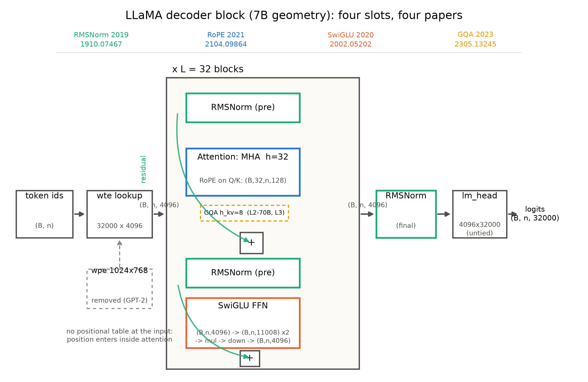
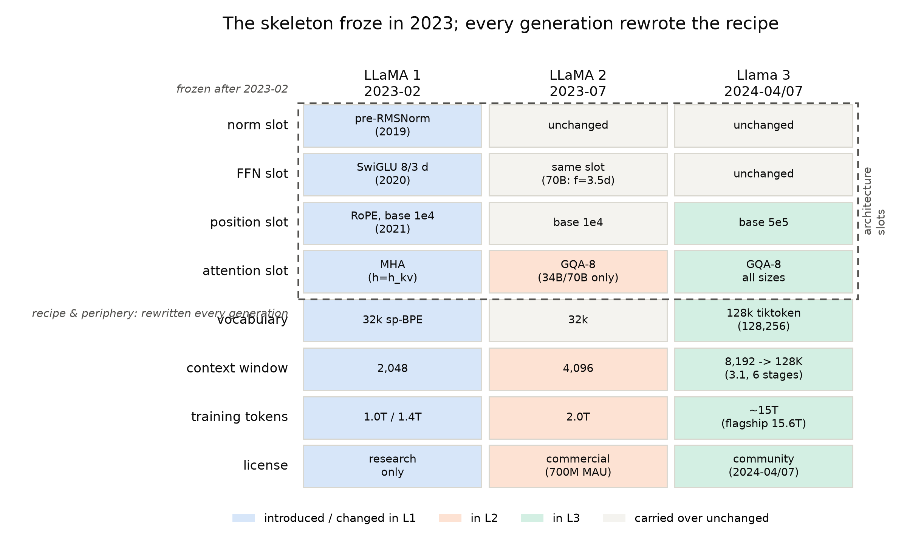
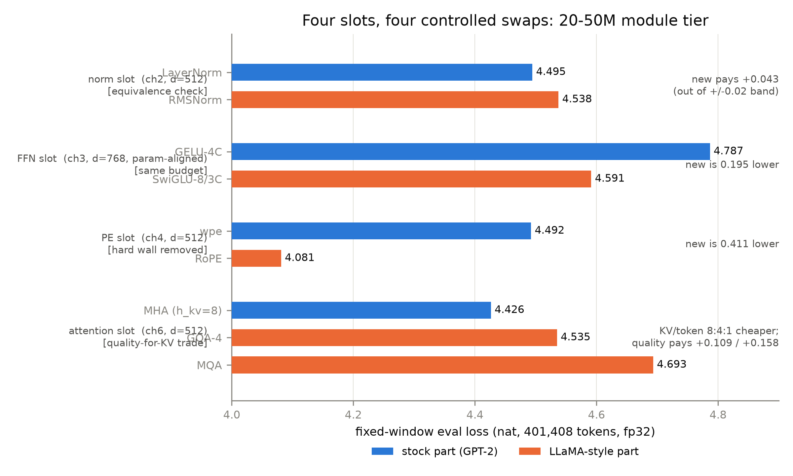

# 第 8 章 LLaMA1/2/3：组装与代际

## 8.0 开篇：从全书到这里

上一章清完外推的旧账，改装车间正式歇业——四格插座全部换新、出口解绑、租窗的手艺进了工具箱。章末的交接句写着：「下一章把 LLaMA1/2/3 摆上装配线：这套组件如何被组装、代际之间如何只靠数据翻代、又在哪里留下判断的余地。」【第 7 章成稿直引】现在零件验完货，装配线开动。

本章在旅程第三段（工程与谱系）的中站，要回答两个问题。第一个是回顾性的：**为什么是这套组合？**第 2-6 章一件一件换了四件零件，每件都有自己的病根与疗效，但「这四件为什么能同时装进一台机器、还恰好长成一个时代的默认骨架」——这个整机级的问题，只有把三代 LLaMA 摆在一起才能回答。第二个是前瞻性的：**代际靠什么翻新？**本章最想让你带走的事实提前剧透一句：2023 年 2 月骨架定型之后，三代翻代几乎没再动过架构——动的是数据、词表、上下文和配方。产出四件：一张整机图（图 8.1）、一张逐格标证据等级的代际总表（表 8.4）、一张插槽清单总表的初版（表 8.5，第 10 章定版），外加 N4 欠账的第二落点。章末还会看到：三代都有论文可查这件事本身，在 2025 年之后成了奢侈品——那是下一章的入口。

> **最小背景栏**：本章是全册数字引用最密的一章，但几乎不需要新前置——LLaMA1 的动机五段与算力三笔账在第 1 章（表 1.1 直接沿用），四件套的机制与消融在第 2-6 章，外推的代际账在第 7 章 7.8 节，参数公式在第 5 章式 (5.2)，GPT-2 训练配方在 Book2 第 10 章、scaling laws 在 Book2 第 8 章。凡引用只带证据等级与指回，不重教；本章无新公式、无新实验，动手验证一条指回第 5 章的 config 反推脚本。

## 8.1 组装法庭开庭：四件零件、四本诉状

前七章是单件取证：每一章审一件零件的病根、手术与疗效。现在合议庭开庭，把卷宗并排摊开。第 1 章 1.5 节逐字读过 LLaMA1 §2.2 的三改原话，当时看的是引用结构——三改没有一件是 LLaMA 发明的。重审这三段话，换一个问题：**每段话买到了什么？**

> "Pre-normalization [GPT3]. To improve the training stability, we normalize the input of each transformer sub-layer, instead of normalizing the output. We use the RMSNorm normalizing function"——归一化这刀买**稳**与**简**：pre 位置买训练稳定，RMSNorm 砍掉重中心化买零件更简（第 2 章）。
>
> "SwiGLU activation function [PaLM]. We replace the ReLU non-linearity by the SwiGLU activation function, introduced by Shazeer (2020) to improve the performance. We use a dimension of 2/3·4d instead of 4d"——前馈这刀买**性能**：同参数预算换门控三矩阵（第 3 章）。
>
> "Rotary Embeddings [GPTNeo]. We remove the absolute positional embeddings, and instead, add rotary positional embeddings (RoPE), introduced by Su et al. (2021), at each layer of the network."——位置这刀买**相对位置**：拆掉入口查表，把位置信息搬进每层注意力的 Q/K 旋转（第 4 章）。
> 【证据等级：官方论文 2302.13971 v1 §2.2 直引（第 1 章 1.5 节已全文引过，此处取关键分句）】

第四件来得晚：LLaMA2 把大档的注意力换成 8 组共享 KV 的 GQA（Ainslie et al. 2023），Llama 3 全系转正——这刀买**账本**：推理侧 KV 显存与带宽砍到 1/8（第 6 章）。四件零件、四本诉状，各诉各的约束：稳与简、同预算性能、相对位置、推理账本。

四本诉状互不交叉，这不是修辞，是结构事实——四件零件作用在数据河的不同河段：RMSNorm 动每个子层入口的 $(B,n,d)$；SwiGLU 动 Block 后半的 $(B,n,d)\to(B,n,\tfrac{8}{3}d)\to(B,n,d)$；RoPE 动注意力内部 Q 与 K 的 $(B,h,n,d_k)$；GQA 动 K/V 投影的宽度（$h$ 份变 $h_{kv}$ 份）。换掉任何一件，其余三件的输入输出契约一个字节不变。**互相独立、可单独更换——这就是「插槽化」的技术基础。**反过来想：如果两个组件都在解决同一个约束（比如都在省显存），同换就会互相干扰，单变量归因也无从谈起；第 2-6 章的模块消融之所以成立，正是站在这个正交性上。

但有一条必须如实记录：这场组装**没有自带法庭自辩**。LLaMA1 论文对三改零消融——既无归一化对照也无激活对照（本册调研期对三篇论文 grep 的负结论，红线登记在案）；四件套里唯一在 LLaMA 论文里享受受控消融待遇的是 GQA（LLaMA2 附录 A.2.1，8.3 节详表）。证据链断了一环：零件级证据不能自动升级为整机级证据——第 1 章 1.5 节说过，中间隔着一次押上 2048 张 A100 的赌博。断环谁来补？一半由历史补：三代旗舰与全行业的跟进，本身就是最大规模的整机验证；另一半由我们补：第 2-6 章在 20-50M 档重开单变量消融桌，8.6 节收拢成表。

至此可以正式给出全册反复使用却始终没下定义的那个词——**组装学（assembly）**：把不同年代、不同论文里各自验证过的零件装进同一台整机，押上预算证明组合成立；组合一旦成立即成默认骨架，后来者对它做单变量替换，而不是重新发明架构。图 8.1 就是这台默认骨架的整机图。要说明的是：LLaMA 三篇报告都没有画过架构总图——本图按官方代码与 §2.2 三改原话自绘重制（示意级），几何取 LLaMA1-7B 出厂档，每个张量框标形状。



图 8.1 LLaMA 整机架构（自绘重制，示意级——LLaMA 三篇报告均无架构总图，结构依据＝官方代码+LLaMA1 §2.2 三改原话+Table 2 与 config 几何；几何取 7B 档：$d{=}4096$、$L{=}32$、$h{=}32$、$d_k{=}128$、$d_{ff}{=}11008$、$V{=}32000$；顶部虚线标注四件套的论文出处，GQA 虚线框＝LLaMA2-34B/70B 与 Llama 3 起的替换件；入口虚影＝被拆除的 GPT-2 式位置查表）

沿数据河把整机粗走一遍，建立「粗但完整」的整体图景：token 序号 $(B,n)$ 先过 $w_{te}$ 查表变成 $(B,n,4096)$ 的残差流——注意入口处**没有**位置查表，GPT-2 那张 1024 行的 $w_{pe}$ 在这里是虚影；然后数据河流过 32 层 Block，每层两颗 pre-RMSNorm 各守一个子层的门口，注意力子层里 Q 与 K 现场旋转（GQA 时代只换 K/V 投影的份数），前馈子层升维到 11008 做门控再降回来；出最后一层后过终态 RMSNorm，由独立的 $lm\_head$（untied）投到 32000 个词表位上。四件套在这条河上的位置，就是 8.6 节插槽清单的行号——后文任何一次 config diff，都请回到这张图前对位。

## 8.2 LLaMA1 全档解剖：一张写透的配方单

LLaMA1 的可复现性（第 1 章 1.2 节的口径）立在哪里？立在那张把四档几何与超参全部写透的表上。Table 2 逐字转录如下（$d_{ff}$ 与参数两列为本册复算补齐——论文 Table 2 不含 $d_{ff}$，按第 3 章 $\lceil 8d/3\rceil_{256}$ 规则与第 5 章 config 反推对上，全部过 assert）。

**表 8.1** LLaMA1 四档 config（引 Table 2；$d_{ff}$/参数=本册复算，ch05 `config_infer.py` 同源）

| 档位（论文口径） | $d$ | $h$ | $L$ | $d_{ff}$ | lr | batch | tokens | 参数（复算） |
|---|---|---|---|---|---|---|---|---|
| 6.7B（通称 7B） | 4096 | 32 | 32 | 11008 | 3.0e-4 | 4M | 1.0T | 6,738,415,616 |
| 13.0B（13B） | 5120 | 40 | 40 | 13824 | 3.0e-4 | 4M | 1.0T | 13,015,864,320 |
| 32.5B（33B） | 6656 | 52 | 60 | 17920 | 1.5e-4 | 4M | 1.4T | 32,528,943,616 |
| 65.2B（65B） | 8192 | 64 | 80 | 22016 | 1.5e-4 | 4M | 1.4T | 65,285,660,672 |

【证据等级：官方论文 2302.13971 v1 Table 2；$d_{ff}$/参数列＝本书复算（第 5 章式 (5.2)，config_infer assert 同源）】注：论文口径 6.7/13.0/32.5/65.2B 与对外通称 7/13/33/65B 是双口径，引用时择一并注明；两小档 1.0T、两大档 1.4T，全系 4M token 批。

更耐看的是训练超参——与 Book2 第 10 章我们训 GPT-2 124M 的五件套并排成表 8.2：

**表 8.2** 训练配方对照（LLaMA1 §2.3 逐字 vs 本书 GPT-2 124M 五件套）

| 项 | LLaMA1（§2.3） | Book2 ch10（GPT-2 124M） | 一句话判读 |
|---|---|---|---|
| 优化器 | AdamW，$\beta_1{=}0.9,\beta_2{=}0.95$ | AdamW，$\beta_1{=}0.9,\beta_2{=}0.95$ | 完全同款 |
| weight decay | 0.1 | 0.1 | 同款 |
| 梯度裁剪 | 1.0 | 1.0 | 同款 |
| lr 日程 | cosine，终 lr＝峰值 10% | cosine 1e-3→1e-4（＝10%） | 同型 |
| warmup | 2000 步 | 100 步 | token 预算差 3-4 个量级的投影 |
| batch | 4M token | 8,192 token（16×512） | 差 512 倍 |
| 数据纪律 | 每 token 至多一遍（Wikipedia/书籍约两 epoch） | 一次通过，不重复 | 同一条铁律 |

【证据等级：官方论文 2302.13971 v1 §2.3 直引；Book2 第 10 章成稿】

七行里五行同款——LLaMA 配方就是社区标准 GPT 配方的直系后代，你在 Book2 里亲手跑过的那套超参，放大 512 倍批量就是旗舰配方；差异集中在 warmup 与 batch 两个量纲，那是 token 规模的工程后果，不是哲学分歧。数据侧的 Table 1 也如实转录为表 8.3（1T 运行与 1.4T 配比相同，表注原话）：

**表 8.3** LLaMA1 数据配比（引 Table 1）

| 来源 | 采样占比 | 1.4T 下 epoch | 磁盘 |
|---|---|---|---|
| CommonCrawl（CCNet 管线） | 67.0% | 1.10 | 3.3 TB |
| C4 | 15.0% | 1.06 | 783 GB |
| GitHub | 4.5% | 0.64 | 328 GB |
| Wikipedia | 4.5% | 2.45 | 83 GB |
| Books（Gutenberg+Books3） | 4.5% | 2.23 | 85 GB |
| ArXiv | 2.5% | 1.06 | 92 GB |
| StackExchange | 2.0% | 1.03 | 78 GB |

【证据等级：官方论文 2302.13971 v1 §2.1 Table 1】

七个来源全部公开可得——这是第 1 章「GPT-3 三重不可得」里数据一重的正面回答。但配比表只是结果，值得看的是**处理管线全写透了**：CCNet 行级去重加语言识别加 n-gram 质量过滤、GitHub 只取宽松许可项目并按文件精确去重、ArXiv 去 LaTeX 宏、StackExchange 取 28 大站按分数排序……「公开数据」从来不等于「拿来就用」，1.4T 是清洗后的存量【证据等级：官方论文 §2.1 各源处理要点】。词表侧的 SentencePiece BPE（数字逐位切分、未知字符回退到字节级）第 5 章已拆到字节（表 5.3 同源），此处不重复。

账与判决收口。算力账第 1 章算过，这里只立桩：65B 档 1,022,362 A100-80GB GPU 时、2048 卡约 21 天（$1{,}022{,}362\div2048\div24\approx20.8$ 天，6ND/GPU 时/吞吐三本账互证见第 1 章 1.4 节）【证据等级：官方论文 Table 15/§2.4＋本书算术】。性能锚取 MMLU 5-shot：65B 得 **63.4**，Chinchilla-70B 67.5，GPT-3 175B 43.9，自家 13B 46.9【证据等级：官方论文 Table 9】。两个数字两句话。其一，13B 已过 GPT-3——参数约 1/13、训练算力约 1/4（$7.80\times10^{22}$ 对 $3.14\times10^{23}$ FLOPs，表 1.1），「更少参数、更多数据」第一次在旗舰尺度兑现。其二，65B 对 Chinchilla 差 4 分，论文自己交了归因，诚实句直引："A potential explanation is that we have used a limited amount of books and academic papers in our pre-training data … that sums up to only 177GB, while these models were trained on up to 2TB of books."【证据等级：官方论文 §3.6 直引】——书喂少了（177GB 对 2TB），输在数据不在选型。这句诚实句与第一页的偏离声明首尾呼应：赢了说 most（多数基准，不是全部），输了给原因。这正是第 1 章说的「把偏离和理由一起交出去」的工程写作品格，在成绩单上的再现。

## 8.3 LLaMA2：四改换一档，GQA 上机

半年后的 LLaMA2，预训练侧只动了四件事，原话一句话说完："more robust data cleaning, updated our data mixes, trained on 40% more total tokens, doubled the context length, and used grouped-query attention (GQA) to improve inference scalability for our larger models"【证据等级：官方论文 2307.09288 v2 §1 直引】。逐项落回本册坐标：数据清洗与配比是配方侧的事；token 数 1.4T→**2.0T**——论文口径 2.0T，Llama 3 论文回述作 1.8T（疑为过滤后语料口径），本书一律用 2.0T 并加注【证据等级：官方论文 2307.09288 v2 §2.1＋2407.21783 §1 口径注】；上下文 2048→4096，这笔账的官方消融（NarrativeQA 的 F1 从 0.21 涨到 17.26——2k 模型在平均 3.5k 输入的任务上近乎随机）第 7 章 7.8 节已引；第四件是本册主角之一上机：GQA。

**GQA 的落点必须先钉死，因为它是中文资料的重灾区**：论文 Table 1 与附录 A.2.1 双锚——只有 **34B 与 70B** 两档用了 GQA，8 组 KV（config `num_key_value_heads=8`，64 个查询头每 8 个一组），**7B 与 13B 仍是 MHA**【证据等级：官方论文 2307.09288 v2 Table 1+A.2.1＋config 双锚】。34B 还有一段脚注身世：训完了、没发布——"We are delaying the release of the 34B model due to a lack of time to sufficiently red team."【证据等级：官方论文 §1 脚注直引】。

为什么大档才换 GQA、为什么选 GQA 不选 MQA？LLaMA2 给出了四件套里唯一一份官方消融（附录 A.2.1），而它的实验设计与我们的消融桌同型到可以并排讲课：**固定 30B 模型尺寸、各训 150B token、只变注意力结构**，MHA/MQA/GQA 三臂；为了不让参数变成混杂变量，MQA 臂把 FFN 维放大 ×1.33、GQA 臂 ×1.3 补齐预算【证据等级：官方论文 A.2.1 直引】。这正是第 6 章等参三兄弟（216M、几何配平、只算账）的同一种思想——**单变量＋同预算**；差别只在补齐机制：官方用 FFN 放大补、我们用几何（$L{=}16$、$V{=}8192$）配平（第 6 章 6.8 节已对照注明）。这个补齐思想甚至进了成品：70B 的 $d_{ff}=28672=3.5d$，比 $\lceil 8d/3\rceil$ 宽出三成（第 3 章 3.4 节的 multiplier 账，1.3 系数为社区引述口径）——省下的注意力预算转手买成了更宽的前馈，70B 的总参数（68.98B）反而比 L1-65B（65.29B）多【证据等级：config 逆向＋本书复算】。消融结果三行：MMLU 28.0/26.5/26.9，GSM8K 4.9/4.8/5.3，HumanEval 7.9/7.3/7.9——GQA 与 MHA 大体打平、MQA 平均微降【证据等级：官方论文 Table 18；150B token 短训口径，绝对值不可与成品模型并比】。于是判决句："based on the ablation results and ease of scaling inference, for the 34B and 70B Llama 2 models we chose to use GQA instead of MQA."【证据等级：官方论文 A.2.1 直引】

更硬的证词在推理侧。图 24 的吞吐实验（8×A100-80GB）：批量从 1 起翻倍直到显存溢出——**MHA 臂在上下文 256 时批量 1024 处直接内存耗尽、上下文 2k 时 128 处耗尽，而 MQA 与 GQA 臂在同一设定下跑通**【证据等级：官方论文 2307.09288 v2 Figure 24 及图注直引】。这就是第 6 章 KV 账本的官方现场：剪刀差图（图 6.2）里权重常数线与 KV 直线的交点，落到真实服役里就是 OOM 红线。省账本换来的批量吞吐上限，是「不是 2017 错了，是账本变了」最值钱的一次兑现。

其余账目快速结清。算力：70B 1,720,320 GPU 时，全家族（含未发布的 34B）累计 3.3M【证据等级：官方论文 Table 2】。性能：70B MMLU 68.9——比 L1-65B 涨约 5 分，对 GPT-3.5 的 70.0 差 1.1 分，代码差距仍大（HumanEval 29.9 对 48.1，论文自认 "there is a significant gap on coding benchmarks"）【证据等级：官方论文 §2.3/Tables 3-4】。许可：研究专用转为可商用（Llama 2 Community License，2023-07-18，附 7 亿月活分界条款）【证据等级：官方许可】——第 6 章的 llama2.c 对照线、以及此后整个开源生态的爆发，都踩在这扇门上。至于把预训练模型雕成对话助手（Llama 2-Chat：先监督微调、再五版迭代的反馈强化工艺），本册只到流程图一级——整套后训练工艺是 Book5 第 10 章的主菜，欠账框见章末。

## 8.4 Llama 3：架构不动，把其余一切推到极限

2024 年 7 月的 Llama 3 论文，开篇就把代际逻辑说穿了。点题句逐字："Llama 3 uses a standard, dense Transformer architecture (Vaswani et al., 2017). It does not deviate significantly from Llama and Llama 2 in terms of model architecture; our performance gains are primarily driven by improvements in data quality and diversity as well as by increased training scale."【证据等级：官方论文 2407.21783 v1 §3.2 直引】——架构不动，增益主要来自数据质量、多样性与训练规模。本节就把这句话的每个词兑现成数字。

先给「规模」记账，双口径如实并排：全系预训练语料约 **15T** 多语 token（对比句原文 "about 15T multilingual tokens, compared to 1.8T tokens for Llama 2"）；旗舰 405B 精数 **15.6T**，总预算 **3.8×10²⁵ FLOPs、约为最大 LLaMA2 的 50 倍**，硬件至多 16K 张 H100（700W、80GB HBM3）【证据等级：官方论文 §1/§3.3】。往后任何地方见「15T」都要知道它是全系约数、旗舰另有 15.6T 精数——两口径并存是引用纪律（只写一个数的见 8.5 考据框）。架构侧的改动则收在一行 config diff 里：词表 32k→**128k**（tiktoken 系 100k＋28k 非英文增补，config 实值 128,256；英文样本压缩率 3.17→3.94 字符/token——第 5 章的账）；上下文 4k→**8k 原生**；RoPE 底数 $\theta=10^4\to 5\times10^5$（引 Xiong et al.：该值在 32,768 以内有效——第 7 章 7.8 节「出厂设定」路线的落点）；GQA 从大档专属转正为**全系 8 个 KV 头**（8B/70B/405B 查询头 32/64/128，KV 头一律 8——第 6 章的「甜点」成了出厂默认）【证据等级：官方论文 §3.2＋Table 3＋config 双锚】。四件插槽一件没动，动的是插槽旁边的旋钮。

真正的方法论新货在**超参怎么定**。8.2 节见过 LLaMA1 的做法：沿社区配方微调；Llama 3 把这件事做成了实验科学——两段式 scaling law。原文两步：第一步，建立「算力最优模型在**下游任务**上的负对数似然」与训练 FLOPs 的相关；第二步，再把下游负对数似然与**任务准确率**关联——这一步特意用上 Llama 2 全家族这些「更旧、算力更高」的真模型来钉住曲线高端【证据等级：官方论文 §3.2.1 直引】。实验设定：6×10¹⁸ 到 10²² FLOPs、40M 到 16B 参数的小模型家族扫点（批量 25 万到 4M、峰值 lr 2e-4 到 4e-4），把定律外推到 3.8×10²⁵ FLOPs——结论：该训一个 **402B** 参数的模型，定档 405B【证据等级：官方论文 §3.2.1】。请注意这正是 Book2 第 8 章那门手艺的工业形态：我们用五个小模型外推等比处方给 GPT-2 124M 定配方；Meta 用几十个小模型做同样的事，外加两处升级——优化目标是**下游准确率**而不只是 loss，曲线高端用**上代旗舰实测**校准（小模型外推、大模型钉高端，两头夹住）。小模型实验定大模型超参，这门你在 Book2 做过的课程作业，在这里成了旗舰生产线。

数据侧是一段写不完的工序链（要点转述）：三重去重（URL 级、文档近重复、行级——一行在每 30M 文档桶出现超 6 次即删）；启发式过滤；**模型质量分类器**——用 Llama 2 按质量描述给网页打标、蒸馏出 DistilRoberta 再给全库打分，「用上一代给下一代洗数据」；代码与数学专用管线；176 种语言的多语言管线；语义级去重；连**数据混合比本身也由 scaling-law 实验决定**【证据等级：官方论文 §3.4.1/§4.3.1 要点】。预训练末段 40M token 线性退火到零（128k 窗）并对 checkpoint 做 Polyak 平均收尾【证据等级：官方论文 §3.4.3】。

长上下文这笔账第 7 章 7.8 节已从外推侧读过：六阶段继续预训练 8K→128K、付约 800B token、成功判据是「短上下文性能完全恢复＋该长度大海捞针全通过」。此处只补一句交汇判词：Llama 3 同时用了出厂加大 $\theta$（5×10⁵）与六阶段继续训练（租窗的制度化）——第 7 章说两条路在 2024 年汇流，这里就是汇流点本身。

还有一句引语必须原样留下，因为它是通往后续册的入口。论文 §1 谈管理复杂度："we opt for a standard dense Transformer model architecture (Vaswani et al., 2017) with minor adaptations, rather than for a mixture-of-experts model (Shazeer et al., 2017) to maximize training stability."【证据等级：官方论文 2407.21783 v1 §1 直引】——宁可要稠密骨架的小修小补，也不把前馈换成专家群去换参数规模，理由：训练稳定性。这个「拒绝」本身是一份证词：被拒绝的那条路线难在哪里、代价几何，正是 Book4 开卷要回答的问题（章末欠账框登记）。

时间线收尾，一段「论文晚于权重」的如实记录：2024-04-18 官方博客首发 8B/70B，同文预告最大模型仍在训（"Our largest models are over 400B parameters and, while these models are still training…"）【证据等级：官方博客】；2024-07-23 Llama 3.1 发布 405B（官方许可版本日期锚）【证据等级：官方许可】；07-31 论文 v1 上线 arXiv。成绩单：MMLU 5-shot，405B **87.3**（8B 69.4、70B 83.6），对 GPT-4o 89.1、GPT-4(0125) 85.1、Claude 3.5 Sonnet 89.9——开源旗舰正式进入第一梯队【证据等级：官方论文 Table 2（微调后版本）；评测为厂商自报口径】。

## 8.5 代际总表：逐格对表、逐格凭证

三代读完，合议庭合表。表 8.4 六行——训练 tokens、架构组件、词表、上下文、GQA、许可——每格带证据锚；图 8.2 把同一张表画成点亮图，上四行是骨架插槽，下四行是配方与外围。

**表 8.4** LLaMA 三代代际总表（逐格证据锚；档位列入表头）

| 维度 | LLaMA1（2023-02；7/13/33/65B，论文 6.7/13.0/32.5/65.2B） | LLaMA2（2023-07；7/13/70B，34B 训而未发） | Llama 3/3.1（2024-04 首发 8B/70B；07-23 增 405B） |
|---|---|---|---|
| 训练 tokens | 1.0T/1.0T/1.4T/1.4T {S1 Table 2} | 2.0T 全系 {S2 Table 1}（L3 论文回述 1.8T，过滤口径脚注） | 约 15T；旗舰 15.6T {S3 §1 双口径} |
| 架构组件 | pre-RMSNorm＋SwiGLU＋RoPE 三改定型 {S1 §2.2} | 同 L1；＋GQA（仅 34B/70B）{S2 Table 1＋A.2.1} | 同 L1；GQA 全系 {S3 §3.2} |
| 词表 | 32k SentencePiece（数字逐位、字节回退）{S1 §2.1＋config} | 32k（3.17 字符/token）{config＋S3 §3.2} | 128k tiktoken 系（实值 128,256；3.94 字符/token）{S3 §3.2＋config} |
| 上下文 | 2048 {config；S2 Table 1 追认 2k} | 4096 {S2 Table 1} | 8k 原生→3.1 扩 128k（六阶段＋800B）{S3 §3.4.2} |
| GQA | 无（全系 MHA）{S2 Table 1 反证} | 34B＋70B：8 组 KV {S2 A.2.1＋config} | 全系 8 KV 头 {S3 Table 3＋config} |
| 许可 | 研究专用、非商用 {官方口径} | 可商用（700M 月活条款）{官方许可 2023-07-18} | 社区许可（3.1 版 2024-07-23）{官方许可} |

注：{S1}=2302.13971 v1、{S2}=2307.09288 v2、{S3}=2407.21783 v1；config 锚＝HF 公开镜像双源（meta-llama 原仓 gated）。



图 8.2 代际组件点亮图（自绘）：上四行＝骨架插槽（虚线框），下四行＝配方与外围；彩色格＝该代引入或改动（填色随代际：蓝＝L1、橙＝L2、青＝L3），灰格＝沿用上代不变——L2/L3 两列的架构区大面积沿灰（仅注意力与位置旋钮亮过），数据/窗/许可每代全亮，即「2023-02 骨架冻结、翻代靠配方」的视觉判决；70B 的 $d_{ff}$ multiplier 为社区引述口径（第 3 章 3.4 节）

点亮图的判决一句话说尽：**L2 与 L3 两列里，架构区四行总共只亮过三格——L2 的注意力、L3 的注意力扩到全系与位置旋钮 $\theta$，其余全灰；而数据、窗与许可所在的配方行每代全亮**（词表在 L2 沿用、L3 才换血）。2023 年 2 月之后这台机器的骨架就冻结了——翻代靠数据（1.4T→2.0T→15T）、词表（32k→128k）、窗（2k→4k→8k→128k）与许可（研究→商用）。第 11 章收束章会把这个事实升格为「组件化时代的判决」，此处先立桩。

> **【考据框】代际表的三个高频讹传（反面教材，引用前先自查）**。其一，「LLaMA2 用了 GQA」不注档位——7B/13B 是 MHA，GQA 只落在 34B（训而未发）与 70B{Table 1＋A.2.1 双锚}。其二，「Llama 3 用 15T 训练」不注口径——15T 是全系约数、旗舰 15.6T 精数，两数并存{§1}。其三，33B→65B 在 GSM8k（maj1@256）上 35.6→50.9 的跳变常被转述为「涌现」——论文全无此说，且全文根本无 pass@8 指标（社区 grep 命中系 pass@80 的子串，本册调研期复核）。另附一处参数讹传：405B 的 `rope_theta` 网传 800,000，双镜像 config 核得 500,000{config 逆向}。

## 8.6 四件套逐件点亮：模块消融的收拢

8.1 节登记过那处断环：四件套只有 GQA 享受过 LLaMA 官方的受控消融。本册第 2-6 章在 20-50M 模块档上把这门课补齐了——同一张图纸：单变量换插槽、同预算或差量如实标注、判据预注册先于运行。图 8.3 与表 8.5 是四章消融的收拢，也是第 10 章插槽清单总表（表 10.3）的初版：我们 207M 整机图纸上的每一个插槽选择，背后都有这样一行证据。



图 8.3 四插槽换件消融收拢（自产＝第 2/3/4/6 章消融汇总；full 5000 步、单种子、MPS；固定窗 401,408 token fp32 eval；蓝＝GPT-2 原装件、橙＝LLaMA 式新件；四组各自同 config 单变量，**组间绝对值不可比**——ch3 为参数对齐档 $d{=}768$、其余为 $d{=}512$ 档；注意力组的橙条是「付税」方向，读法见正文）【证据等级：本书实验（MPS，2026-10，单种子 full 档）】

四组读数，每组一句判词。**归一化组**是等价性检验：LN 4.495 对 RMSNorm 4.538，差 +0.043 nat 超出预注册带宽、且差异集中在退火后段——单种子档上不作「更差」判定，等价主张的主证据仍是论文档（第 2 章 2.6 节的完整判读）；这刀买「简」不买「分」。**前馈组**：同参数预算下 GELU-4C 4.787 对 SwiGLU-8/3C 4.591，−0.195 nat，方向与 Shazeer 的 Table 1 一致；小档差距反而大于论文旗舰档，登记为悬案、带档位限定引用（第 3 章 3.6 节）。**位置组**：同窗 wpe 4.492 对 RoPE 4.081，−0.411 nat；更重要的读数在窗外——RoPE 臂 4× 越窗只付 +0.49 nat 的软墙，wpe 臂在 2048 处直接报错（硬墙拆除的完整证据链在第 4 章 4.9 节）。**注意力组**是四组里唯一「新件更差」的：$h_{kv}$ 从 8 砍到 4 再砍到 1，质量 4.426→4.535→4.693 单调付税 0.109/0.158 nat，换 KV 字节 8:4:1 递减——207M 定版选组内 2 头（$h{=}16$、$h_{kv}{=}8$）而不是砍到底，理由就写在这张税单上（第 6 章 6.8 节）。词表与出入口那把刀的质量尺不是 nat 是 bpb：四臂 2.093→1.919（−8.3%）、嵌入占比 17.8%→56.4%（第 5 章 5.5 节）——207M 档 untied 双份嵌入占参数 31.6%，为对齐 LLaMA 出厂口径仍选择解绑（第 5 章 5.7 节）。

**表 8.5** 插槽清单总表（初版；第 10 章表 10.3 定版）

| 插槽 | 旧件（GPT-2 底座） | 新件（LLaMA 式） | 动刀章 | 本机消融读数（full 档） | 文献锚 |
|---|---|---|---|---|---|
| 归一化 | pre-LayerNorm | pre-RMSNorm（无 bias、eps 1e-5） | 第 2 章 | 等价检验：+0.043 nat 超带（路径敏感，单种子限定）；买「简」 | 1910.07467 |
| 前馈激活 | GELU-4C 两矩阵 | SwiGLU 三矩阵 $\tfrac{8}{3}d$ | 第 3 章 | 同预算 −0.195 nat（方向同论文；小档差距更大＝悬案） | 2002.05202 |
| 位置编码 | $w_{pe}$ 查表（1024 墙） | RoPE（$\theta{=}10^4$，只旋 Q/K） | 第 4 章 | 同窗 −0.411 nat；4× 越窗软墙 +0.49；硬墙拆除 | 2104.09864 v5 |
| 注意力 | MHA（$h{=}h_{kv}$） | GQA（207M：$h{=}16$、$h_{kv}{=}8$） | 第 6 章 | 质量-KV 反向：8→4→1 付 0.109/0.158 nat，KV 8:4:1 | 2305.13245 |
| 出入口 | tied（50257） | untied＋词表 32000 | 第 5 章 | 词表四臂 bpb −8.3%；解绑占 31.6% 仍解（对齐出厂） | 论文沉默（负结论）＋config |

【证据等级：本机读数＝本书实验（MPS，2026-10，单种子 full 档）；文献锚＝各组件 canonical 论文】

把表 8.5 与 LLaMA2 附录 A.2.1 并排，可以说一句不过分的话：**这张桌子与官方消融桌同型**——单变量、同预算（或差量如实标注）、判据先行；差别只在规模（我们 20-50M 对官方 30B/150B token）与补齐机制（参数对齐/几何配平对 FFN 放大）。第 10 章整机落成时，每个 import 进来的零件背后都有这样一行证据——第 0 章许的愿「这台机器的每个零件都有出处」，在这里兑现了一半，剩下一半在装配现场。动手验证一条：表 8.1 与表 8.4 的参数账不必信书，第 5 章的 config 反推脚本变档复算即得（命令行在 8.9 节）。

## 8.7 「架构不动只堆数据」的判断力（N4 第二落点）

最后开庭审本章剩下的问题：Llama 3 把 8B 小档也喂到 15T，这是什么行为？算一笔 $R$ 账（$R=D/N$，第 1 章式 (1.2)，本书算术、$N$ 取 config 精确参数）：LLaMA1-65B 的 $R=21.5$，贴着 Chinchilla 处方；LLaMA2-70B $R\approx29$；Llama 3 的 405B $R\approx38$、70B $R\approx213$、**8B $R\approx1{,}870$——超处方约 90 倍**【证据等级：本书算术】。代际轨迹一望便知：旗舰一代比一代往 token 侧多走，小档走得最远。这不是失控，是**有意过训练（intentional over-training）**，而且有家谱——第 1 章逐字读过的 L1 偏离声明（7B 在 1T 之后仍在涨；为各档推理预算造最好的模型）就是它的第一代文本。Llama 3 把同一哲学写成白纸黑字："While our scaling laws suggest our flagship model is an approximately compute-optimal size for our training budget, we also train our smaller models for much longer than is compute-optimal. The resulting models perform better than compute-optimal models at the same inference budget."【证据等级：官方论文 2407.21783 v1 §1 直引】——旗舰按算力最优造，小档刻意超训；同一推理预算下，超训过的小模型胜过算力最优的模型。

第 1 章登记过这笔账的回收路径：「在伏笔台账上，这笔欠账编号 N4，本章就是它的回收主场——先在此登记，第 8 章末尾还有它的第二落点：推理预算哲学在 LLaMA 三代谱系里的一以贯之，届时回看」【第 1 章成稿直引】。现在回看完毕：训练侧多花钱（15T 对 8B 档处方量约 0.17T，约 90 倍），换服务侧每 token 便宜——小模型服役省的那本账，第 1 章 1.3 节的付款结构图画过（训练是一次性支出、服役是按 token 收的账单），三代 LLaMA 是这张图最大规模的执行。N4 至此清账。

还有一个易被忽略的细节要点破：405B 的「算力最优」用的已不是 Chinchilla 的尺子。旧尺子量 loss（处方 20-21 token/参数——按它算，405B 配 15.6T 仍约 1.8 倍超训）；新尺子量下游准确率（8.4 节两段式 scaling law 的第一步）——尺子换了，「最优」的定义就换了。但小档无论哪把尺都是刻意超训：**换尺子改变的是旗舰的定档，改变不了小模型超训的战略价值**。往后读到任何「×倍于 Chinchilla」的批评或辩护，先问三件事：拿哪把尺（loss 还是准确率）、说的是旗舰还是小档、算的是训练账还是服役账——这是本章能交给你的最锋利的一件判断力。而训练预算推到 3.8×10²⁵ FLOPs 之后，另一条战线——同等效果花更少的算力——就此成为下一册的主场。

## 8.8 本章小结

开篇两问，至此都有答案。「为什么是这套组合」——四件零件各买一本账（稳与简、同预算性能、相对位置、推理账本），作用于数据河的不同河段、互不干扰，这种正交性就是插槽化的技术基础；组装者自己没做消融（三改零消融是负结论红线），证据链由三代旗舰的历史与第 2-6 章的模块消融共同补齐。「代际靠什么翻新」——2023-02 骨架定型后三代未再动架构：LLaMA2 四改（数据、token 2.0T、窗 4k、GQA 上大档）加商用许可；Llama 3 一句「架构不动」，把数据（15T）、词表（128k）、窗（8k→128k）与旋钮（$\theta{=}5\times10^5$、GQA 全系）推到极限，超参由两段式 scaling law 定档 405B；MMLU 从 63.4（L1-65B）到 68.9（L2-70B）再到 87.3（L3-405B）的三级跳，没有一级是架构的功劳。N4 第二落点收口：小模型超训的推理预算哲学三代未变，旗舰的「算力最优」换了尺子、小档 90 倍的超训没换方向。

**带走的心智**：数字全部还回去，请留两件。**第一件，一张冻结的骨架图**——2023 年 2 月之后 LLaMA 的架构就没再变过；读任何 2023-2024 年的开源模型，先在脑中铺开图 8.1 那条数据河，然后只问「哪个插槽换了、哪个旋钮拧了」，架构新闻十有八九其实是配方新闻。**第二件，两把尺子一本账**——给模型定档有 loss 最优（Chinchilla）与下游准确率最优（Llama 3 两段式）两把尺，给「该训多少」还有训练账与服役账两本账；旗舰定档看尺子，小档超训看账本，听到任何「最优」与「过训练」的判词，先问尺与账，再决定信不信。

镜头拉回全书：工程与谱系段走到倒数第二站，装配线上三代旗舰都验完了货，我们自己的 207M 图纸连同每个插槽的证据也齐了。下一章处理一个此前从未出现的局面：论文缺席。三代都有论文可查——2025 年之后发布的模型不再有论文。没有论文的模型怎么读？下一章把这门手艺教给你。

> **【欠账】** 把预训练模型雕成对话助手的整套后训练工艺——Llama 2-Chat 的监督微调加五版 RLHF 迭代、Llama 3 的六轮 SFT＋DPO——本册只到流程图一级，机制与安全对齐细节全数后置。→ Book5 第 10 章
> **【欠账】** Llama 3 以训练稳定性为由拒绝了 MoE（把 FFN 换成专家群）：被拒绝的路线训练难在哪里、代价几何、又为何在 2025 年后重新成为主流——Book4 开卷的主角。→ Book4 第 3 章

## 8.9 动手验证

- **四代九档参数账复算**（CPU 秒级；本章与第 5 章共用底座，变档即得表 8.1/表 8.4 的参数口径）：
  ```bash
  cd 工作区根目录 && source env.sh && \
    python [`code/ch05/config_infer.py`](code/ch05/config_infer.py) --out-name run1
  ```
  预期产出：十一项手算 assert 全部 `==`（LLaMA 家族四代九档——L1 四档 6,738,415,616 / 13,015,864,320 / 32,528,943,616 / 65,285,660,672；L2 两档 7B 6,738,415,616（与 L1-7B 同数——GQA 之前两代 MHA 同构）、70B 68,976,648,192（$h_{kv}{=}8$）；L3-8B 8,030,261,248、405B 405,853,388,800；L3.2-1B 1,235,814,400（tied 回绑档——第 5 章四拨第四拨的 assert 实物）；另加本册 207M=207,119,360 与 GPT-2 底座档 124,439,808）——GQA 在注意力投影上省出的参数，在 70B 与 8B 两格直接可见；JSON 落 `log/book3-ch05/config_infer_run1.json`。
- **复画图 8.1-8.3**（秒级；图 8.3 依赖第 2/3/4/6 章消融 JSON，自动优先 full 档、缺则回退 fast）：
  ```bash
  cd 工作区根目录 && source env.sh && \
    python [`code/ch08/make_figures.py`](code/ch08/make_figures.py)
  ```
- **验收点**：不看书画出图 8.1 并标出四件套的论文出处与年份；代际总表任一格能给出证据锚；能说清 GQA 在 LLaMA2 落在哪两档、7B/13B 为什么没换；能把 8B 档 $R\approx1{,}870$ 的账手算出来，并复述「两把尺子一本账」的判读法。
