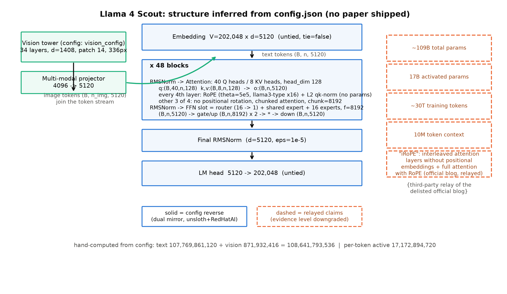

# 第 9 章 无论文模型怎么读：Llama 4 与线终局

## 9.0 开篇：从全书到这里

上一章的组装法庭把三代旗舰断完了案：四件套为何共同胜出、代际之间如何靠数据与词表翻代、每一格数字的证据锚在哪里——那张代际总表走到 Llama 3（2024-07）就停了。不是篇幅不够，而是再往前一格就无案可审：Llama 4（2025-04-05 发布）没有技术论文，唯一的官方文字是一篇博客，而且后来也下线了【证据等级：本书调研实况（官方渠道与 arXiv 检索，2026-10）】。上一章正是收在这个局面上——「三代都有论文可查——2025 年之后发布的模型不再有论文。没有论文的模型怎么读？」【第 8 章成稿直引】。本章全程回答它。

本章在全书旅程里的位置：工程与谱系段的最后一站。第 5 章立起的 config 反推五步法（认家族、重建图纸、算账对拍、读外围、证据分级），一直是在「有论文可交叉」的舒适区里用的；现在把它推进无交叉地带，拿 Llama 4 做全程演练。产出三件：一张**全图标注证据等级**的结构推断图（图 9.1）、一笔三方逐位一致的参数账（式 9.1，外加一本「活账」）、一张插槽视角的代际 diff 表（表 9.2）。同时处理一个时代事实——Llama 线的终局：官方渠道 2026 年撤场，而权重与 config 仍在（9.5 节）。走完本章，「读别人的机器」这门手艺齐备；最后一章回到我们自己的机器，把四插槽装完、给未来留一份设计文档。

> **最小背景栏**（已学指回，本章不重教）：① config 反推五步法与参数公式 $N = Vd(2-\mathbb{1}_{\text{tied}}) + L(2d^2 + 2d\,h_{kv}d_k + 3df + 2d) + d$（第 5 章式 (5.2)，含 Llama-3-8B 四方逐位对拍与 Llama-2-7B 的幻影参数考据）；② llama3 型 rope_scaling 的频率分段读法与波长谱表（第 7 章 7.8 节代际账：Llama 3.2-1B 带 llama3 型、factor 32）；③ NoPE 这个概念名（第 4 章实现对照框：不编码位置的研究）；④ GQA 的 $h$ 与 $h_{kv}$ 双头数记号（第 6 章）；⑤ safetensors index 的远程 Range 审计（第 5 章：不下载权重、只读各分片头部就能逐张量对账）。本章纪律（白名单⑥主场，全书最紧）：Llama 4 是 2025 冻结点外的对象，**只以 config 逆向案例的身份出现**——只述 config 事实、机制一律不展开，展开地界在欠账框里给显式地址。

## 9.1 为什么需要这门手艺：论文退场之后的读法

先把「读模型」这件事的输入盘点一遍。读 LLaMA1/2/3，我们的输入是论文加 config：论文 Table 2/3 给档位与超参、§2.2 式的改动清单给「动了哪几笔」、config 给实值——两源交叉，每个数字都有锚（第 8 章的全部对表都建立在这个双源结构上）。到 Llama 4，这个结构塌了一半：**没有技术论文**；官方博客是唯一成篇的官方文字，而它也已下线——本书调研期实地核过，Wayback 连完整快照都没有【证据等级：本书调研实况（2026-10）】。发布节奏在 2025 年之后普遍变了：先出权重与模型卡、性能数字进宣传页、技术细节或晚到或不来。Llama 4 不是孤例，只是离我们冻结点最近的样本；同门的 Behemoth 更进一步，至今停留在「预览、仍在训练」的转述状态【证据等级：第三方转述官方 blog（原页已下线）】。

论文退场了，但机器的**交付物**还在，而且一件不少。第一件，`config.json`：几 KB 的 JSON，权重能被加载的前提——它可以不说优点，但必须说真话，不然加载代码无从下手；这是厂商**不得不诚实**的地方。第二件，模型卡与官方文字残片：数字满篇但是厂商自报口径，且随时可能消失（Llama 4 的博客就是现成例子）。第三件，权重本体与 `model.safetensors.index.json`：索引文件只有 KB 到 MB 量级，用第 5 章的远程 Range 手法，不下载上百 GB 权重就能把官方检查点逐张量审计一遍。「读模型」的输入从「一篇论文」变成「config + 转述残片 + 可审计的权重索引」三件套——输入变了，读法也得升级成一套**程序**，而不是一次性的解读。

还有一层现实要先交代：meta-llama 官方仓库是 gated（匿名请求 401），本书一律不碰；我们经社区镜像读 config，并且遵守**双镜像交叉**纪律——同一份 config 从两家独立镜像（unsloth 与 RedHatAI）各取一份，核心字段逐项比对。镜像不是官方，但两份独立转换的结果在结构字段上一致，加上后面对参数账的逐位 assert，可信度是可以自己挣到的——这正是本章要演示的东西。对读者而言，这场迁移的含义很直白：前两册练的是「会读论文」，本章练的是「会读交付物」；前者会随着发布节奏贬值，后者不会。

## 9.2 双镜像 config 逆向：五步实战

三件套已经摆上工作台，现在按构造的逻辑走：先看整机长什么样（粗但完整），再逐字段落到部件，最后算账验收。

### 第一步与整机粗读

认家族三件套：`model_type = "llama4"`、`architectures = ["Llama4ForConditionalGeneration"]`、`transformers_version = 4.52.4`【证据等级：config 逆向（unsloth 镜像；RedHatAI 镜像核心字段逐项一致，本书实测）】。第二个值信息量最大：不再是 `LlamaForCausalLM`（纯文本），而是「条件生成整机」——config 里内嵌了一整份 `vision_config`，视觉不是外挂而是机身的一部分。`transformers_version` 延续第 5 章的年代学：4.51 正是 Llama 4 首发的 transformers 版本段，4.52 是修正段——两代镜像各占其一，后面还有戏。



图 9.1 Llama 4 Scout 结构推断图（自绘示意级；结构依据 = unsloth/RedHatAI 双镜像 config.json 逆向 + transformers 5.18.0 参考实现；**实线 = config 逆向，虚线 = 第三方转述官方 blog（原页已下线）**——证据等级直接画进图里；底部数字为本章手算，与 meta 建模、远程 index 三方逐位对平）【证据等级：config 逆向（双镜像交叉）+ 本书复算】

先粗读图 9.1 建立整机心智：这仍是那台 LLaMA 的直系后代——pre-RMSNorm、分组查询注意力、门控前馈、旋转位置编码，四插槽的族谱一眼可辨；但三处大不同。其一，左边多出一座视觉塔，图像经投影后以 token 形态汇入残差流（原生多模态）。其二，前馈插槽从「一份门控前馈」换成了「一份共享 + 十六份路由的专家群，每 token 取一份」。其三，位置编码不再层层都旋，而是 3:1 交错。现在把这三个「不同」逐字段钉死——每个字段到部件的映射就是第 5 章表 5.3 那张地图的 2025 版（表 9.1）。

表 9.1 Llama 4 Scout 的 config 字段全表（双镜像交叉；「→ 部件/读法」列即结构推断）

| config 字段（text_config） | 值（Scout） | → 部件/读法 | 等级 |
|---|---|---|---|
| `architectures` | Llama4ForConditionalGeneration | 原生多模态整机（内嵌 vision_config） | config 逆向 |
| `hidden_size` / `num_hidden_layers` | 5120 / 48 | 残差流宽 $d$ / Block 数 $L$ | config 逆向 |
| `num_attention_heads` / `num_key_value_heads` / `head_dim` | 40 / 8 / 128 | GQA 分组：$h \times d_k = 40\times128 = 5120 = d$ 恰好拼满 | config 逆向 |
| `num_local_experts` / `num_experts_per_tok` | 16 / 1 | 前馈插槽 → 专家群：16 份里每 token 取 1 份 | config 逆向 |
| `moe_layers` / `interleave_moe_layer_step` | 全 48 层 / step 1 | 专家层布局（Maverick 为奇数层、step 2，偶数层稠密） | config 逆向 |
| `intermediate_size` / `intermediate_size_mlp` | 8192 / 16384 | 专家宽 $f$ / 稠密层宽 $f_{\text{mlp}}$（Scout 的稠密宽闲置） | config 逆向 |
| （源码补读）shared expert | 宽同 $f=8192$ | 每 token 常开的一份共享前馈——config 无此字段，参考实现读出 | 官方参考源码 |
| `no_rope_layers` | [1,1,1,0]×12 | 36 层不旋 + 12 层旋（3:1 交错）；不旋层 = chunked_attention | config 逆向 |
| `attention_chunk_size` | 8192 | 不旋层的分块注意力窗（块内注意、块间不看） | config 逆向 |
| `rope_theta` / `rope_scaling` | 500,000 / llama3 型 factor 16（orig 8192） | $\theta$ 继承 Llama 3；分段缩放——快针不动、慢针压 $1/16$ | config 逆向 |
| `max_position_embeddings` | 10,485,760 | 声明上下文 10M（Maverick 为 1M） | config 逆向 |
| `vocab_size` / `tie_word_embeddings` | 202,048 / false | 出入口两份嵌入（untied 沿用 LLaMA 传统） | config 逆向 |
| `use_qk_norm` | true（Maverick 为 false） | 旋转层的 Q/K 过一道**无参数** L2 归一化（源码级） | config 逆向 + 参考源码 |
| `attn_temperature_tuning` / `floor_scale` / `attn_scale` | true / 8192 / 0.1 | 推理期注意力温度缩放的 config 事实——与第 7 章的温度配方同族旋钮，只登记不展开 | config 逆向 |
| `rms_norm_eps` / `attention_bias` | 1e-5 / false | pre-RMSNorm 与无偏置：第 2 章的遗产原样 | config 逆向 |
| `cache_implementation` | "hybrid" | 推理期缓存策略的字段登记（本册不展开） | config 逆向 |

### 重建图纸：三个「不同」逐一钉死

**前馈区**（整机里 Block 的 FFN 插槽，图 9.1 大框的下半部）。`num_local_experts = 16` 配 `num_experts_per_tok = 1`：十六份并列的门控前馈，每个 token 只点燃一份；专家宽 `intermediate_size = 8192`。逐运算标形（$d=5120$，$f=8192$，$E=16$）：路由器把残差向量打分成一列选择概率 $(B,n,d)\xrightarrow{\text{router}}(B,n,E)$，每 token 取最高的一份；被选中的专家走第 3 章的老路 $(B,n,d)\xrightarrow{W_g,W_u}(B,n,f)\times 2\xrightarrow{\;\operatorname{silu}(\cdot)\odot\;}(B,n,f)\xrightarrow{W_d}(B,n,d)$；另有一份**共享前馈**同形常开、人人过一遍，输出与被选专家相加仍是 $(B,n,d)$。共享份在 config 里没有对应字段——它是从参考实现里读出来的（transformers 5.18.0 的专家层类里挂着一份 `shared_expert`，宽度同 $f$）【证据等级：官方参考源码（transformers 5.18.0）】。这是「config→源码」的**双跳读法**：config 告诉你有十六份，源码补上第十七份——两跳都过了才能进参数账，9.3 节的 assert 会验证这一点。

**位置区**（attention 内部作用于 Q/K 的旋转，图 9.1 大框中部的两行小字）。`no_rope_layers = [1,1,1,0]` 重复十二遍：48 层里 36 层不旋（NoPE——第 4 章实现对照框点过名的研究方向，在这里成了正式的 config 字段）、每 4 层里的第 4 层旋 RoPE。与它联动的是 `layer_types`：不旋的层标记为 `chunked_attention`、配 `attention_chunk_size = 8192`，旋转的层标记为 `full_attention`。这一组合就是官方博客里那句话的 config 签名——「不带位置编码的交错注意力层，与带 RoPE 的全注意力层」【证据等级：第三方转述官方 blog（原页已下线）】；社区给这个组合起名 iRoPE【社区命名，经多源转述一致】。按本章纪律停在这里：**机制解释超出冻结点**——为什么 3:1、分块层如何支撑长程，本册不展开。第 7 章章末的欠账句已经预告了这个交叉口（「两条路怎么在 2026 年的旗舰里合流（外推与状态压缩的官方调和，config 事实见第 9 章）」——第 7 章欠账框原文）：现在 config 事实交货了，就是上面这几个字段；两条哲学的收束论仍在 Book5（地址不变，Book5 第 8 章）。

位置区还有两笔账要并排看。其一，$\theta = 5\times 10^5$ 原样继承 Llama 3；Scout 的 `rope_scaling` 是 llama3 型、factor 16、orig 8192——这正是第 7 章 7.8 节代际账里那条官方外推链（Llama 3.1 的 factor 8、Llama 3.2-1B 的 factor 32【证据等级：config 逆向，3.1 为冻结期内事实、3.2 为冻结点外白名单级引用】）的 2025 延续。用第 7 章的波长谱读它：以 8192 为切点，波长小于切点的快针不动、大于切点的慢针压到 $1/16$；Scout 的两个分段因子同为 1.0，把 llama3 型的分段斜坡退化成了单一切点（极限特例——transformers 5.18 加载时会对此告警，本书实测）。其二，`max_position_embeddings = 10,485,760`（$10\times 2^{20}$，即 10M；Maverick 为 $2^{20}$=1M），而旋转的覆盖半径是 $8192\times16 = 131{,}072$——声明上下文是旋转覆盖的 80 倍。这个 80 倍的缺口谁来顶？config 的回答就是上面那 36 层不旋的分块注意力。**字段并置就是全部**：缺口怎么顶住的，机制层的问题，与 iRoPE 同一个欠账地址。

**出入口区**。词表 202,048、`tie_word_embeddings = false`——第 5 章的账在这里直接套用：两份嵌入各 $202{,}048 \times 5120 = 1{,}034{,}485{,}760$。外围三件的 token id 锚点（第四步）也先记下：`bos = 200000`、`pad = 200018`、图像起止 `boi/eoi = 200080/200081`、`image_token = 200092`——特殊与多模态 token 集中在 200,000+ 区段，于是「基础词表约 20 万 + 预留约 2,048」是 config 逆向可得的最合理分解（tokenizer 文件未逐张量核，登记为悬案，9.6 节收账）。视觉塔顺带一笔：34 层、宽 1408、patch 14、336px 都是 config 事实；塔内的前馈还是**带偏置的两矩阵 FFN 加 LayerNorm**——文本侧在 2023 年淘汰的 2017 年配方，视觉侧还在用（「SigLIP 系」的谱系认定为社区口径【社区】）。连 `use_qk_norm` 这样的字段也要双跳才落地：config 只写 true，参考源码里它是旋转层 Q/K 上的一道 **L2 归一化、无可学参数**——零参数部件，参数账不受影响，但不明就里的读者会以为漏算了一块。

### 双镜像现场：空字段是被默认值接管的

双镜像交叉在本书实测里给出一堂计划外的课。核心字段（表 9.1 除注明外全部）两家逐项一致；但 RedHatAI 镜像（一个低比特量化变体，`transformers_version` 为 4.51.0.dev0——首发前的开发版转换）的 `no_rope_layers` 是**空表**。空表是不是意味着「全部层都旋」？不敢直接下结论——把它喂给 config 类走一遍：`Llama4TextConfig` 对空表有默认接管逻辑（每 4 层的第 4 层旋），生效值与 unsloth 镜像**完全一致**【证据等级：本书实验（transformers 5.18.0，2026-10）】。第 5 章的纪律说「字段缺席也是信息」；本章补上它的 2025 版：**空字段可能是默认值的接管点——缺席不等于无机制**，要过一遍 config 类的默认语义、最好再过一遍参考实现，才敢把「没写」读成「没有」。镜像分歧本身也是信息：转换年代不同（4.51.0.dev0 对 4.52.4），落盘习惯就不同——「检查点卫生的代际差异」在第 5 章见过（Llama-2 的幻影参数对 Llama-3 的干净检查点），这里又见了一面。本节全程的机器可读版是 [`code/ch09/config_reverse.py`](code/ch09/config_reverse.py)：双镜像下载与回落、结构推断表、三方 assert 与图 9.1 的绘制都在这一个文件里，9.8 节给复现命令。

## 9.3 参数账 assert：外行看参数量，内行看 config

结构推断是否可信，最后一关是算账——第 5 章式 (5.2) 的参数账公式在专家群与稠密层混排的世界里需要扩展，扩展本身只用已教过的零件：

$$N = Vd\,(2-\mathbb{1}_{\text{tied}}) \;+\; L\,\big(\underbrace{2d^2 + 2\,d\,h_{kv}d_k}_{\text{注意力}} + \underbrace{2d}_{\text{双 norm}}\big) \;+\; n_{\text{moe}}\big(\underbrace{dE}_{\text{router}} + \underbrace{3df\,(E+1)}_{\text{E 份路由 + 1 份共享}}\big) \;+\; (L-n_{\text{moe}})\,\underbrace{3df_{\text{mlp}}}_{\text{稠密层}} \;+\; d \tag{9.1}$$

符号表：

| 符号 | 含义 | 形状/本章取值 |
|---|---|---|
| $V$ / $d$ / $L$ | 词表大小 / 残差流宽 / 层数 | 标量；202,048 / 5120 / 48 |
| $h$ / $h_{kv}$ / $d_k$ | 查询头数 / KV 头数 / 每头维 | 标量；40 / 8 / 128（$h\,d_k = d$） |
| $E$ / $k$ | 路由专家份数 / 每 token 取用份数 | 标量；16 / 1（Maverick 128 / 1） |
| $f$ / $f_{\text{mlp}}$ | 专家宽 / 稠密层宽 | 标量；8192 / 16384 |
| $n_{\text{moe}}$ | 专家层层数 | 标量；Scout 48、Maverick 24 |
| $\mathbb{1}_{\text{tied}}$ | 绑定指示（1=共享一份嵌入） | 标量；本章 0 |

用人话说：**总账 = 出入口两份嵌入 + 层数×（注意力+双 norm）+ 专家层的前馈账 + 稠密层的前馈账 + 收尾 norm**——与式 (5.2) 相比只有前馈一项从「每层一份 $3df$」变成「按层型查表」，注意力、norm、出入口一个字没改。这就是插槽化的红利：换一个插槽，账本只动一行。

Scout（全 48 层专家）逐项手算：注意力每层 $2\times5120^2 + 2\times5120\times8\times128 = 62{,}914{,}560$；前馈每层 $5120\times16 + 3\times5120\times8192\times17 = 2{,}139{,}176{,}960$（router 81,920 + 十六份路由各 125,829,120 + 共享一份 125,829,120）；乘 48 层、加嵌入 $2\times1{,}034{,}485{,}760$、加收尾 5,120——**文本侧合计 107,769,861,120**；加视觉塔与投影 871,932,416（视觉塔是 `vision_config` 里一台 34 层的小机器，同法可算，本书以参考实现计数为准），**整机 108,641,793,536**【证据等级：本书复算（式 9.1 手算 + meta 建模，CPU，2026-10）】。然后对拍：transformers meta 设备建模（不下载权重、不占内存）给出 107,769,861,120 / 108,641,793,536；远程读 unsloth 仓的 `model.safetensors.index.json`（KB 到 MB 级索引，第 5 章 Range 手法的直接复用），`total_size ÷ 2 = 108,641,793,536`——**三方逐位一致**，且全 bf16 落盘、没有 Llama-2 时代那类 F32 缓冲混装【证据等级：本书实验 + config 逆向，2026-10】。Maverick 同法：24 层专家（$E=128$）+ 24 层稠密（$f_{\text{mlp}}=16384$），文本 400,711,848,960、整机 401,583,781,376，三方同样逐位对平。

三个对拍方凭什么算「独立」，值得说破。手算是我们自己的公式算术；meta 建模是参考实现按同一份 config 逐模块搭一遍、遍历它登记的每个权重张量；远程 index 是当年转换脚本落盘的实物清单。三条路分别经过**人的推导、参考实现的构造、检查点的字节**——殊途同归，才叫对平。任何一方独大都会骗人：只信手算会漏暗字段（共享份就差点漏掉），只信实现会把实现 bug 当成架构，只信 index 会踩 dtype 混装（Llama-2 那批 F32 频率缓冲的幻影参数，第 5 章考据框的现成教案）。

现在才轮到那个流传最广的数字：第三方转述说 Scout「总量约 109B」【证据等级：第三方转述官方 blog（原页已下线）】。我们的手算 108.6B 与它相安无事——但方向要说清楚：**是转述向 config 对齐，不是 config 向转述对齐**。转述只有两位有效数字，config 能拆到每一项；「109B」对了对账单才知道自己是 107,769,861,120 加视觉的舍入值。外行看参数量，内行看 config——参数量只是把十几个自由度压扁成的一个投影，config 才是图纸。

这台机器还有**第二本账**。总账数的是「仓库里躺了多少参数」，活账数的是「每个 token 实际点亮多少参数」：

$$N_{\text{act}} = n_{\text{moe}}\big(2d^2 + 2\,d\,h_{kv}d_k + 2d + dE + 3df\,(1+k)\big) + (L-n_{\text{moe}})\big(2d^2 + 2\,d\,h_{kv}d_k + 2d + 3df_{\text{mlp}}\big) + Vd\,(2-\mathbb{1}_{\text{tied}}) + d \tag{9.2}$$

用人话说：**活账 = 按层型只数被点到名的零件——专家层数注意力、双 norm、router、共享一份加被选 $k$ 份，稠密层数注意力、双 norm 加整份稠密前馈——再加出入口两份**。与式 (9.1) 同一条纪律：router 只长在专家层上，稠密层的活跃宽是 $f_{\text{mlp}}$——混排机型的账必须按层型分册记。Scout 代入（48 层全是专家层，退化为单册）：每层 $314{,}664{,}960$，乘 48 层加出入口，**17,172,894,720 ≈ 17.2B**【证据等级：本书复算】——第三方转述的「17B 激活参数」【证据等级：第三方转述官方 blog（原页已下线）】在这里被精确复现。更有意思的是 Maverick，它才是混排账的试金石：24 个专家层每层活跃 $315{,}238{,}400$、24 个稠密层每层活跃 $314{,}583{,}040$（稠密层没有 router 要扣掉 $dE=655{,}360$，但 $f_{\text{mlp}}=16384$ 恰为 $2f$，两型每层的活跃前馈同宽），合计 **17,184,691,200 ≈ 17.2B**——两台机器**活账几乎相同、总账差近四倍**（108.6B 对 401.6B；总账/活账之比 6.28 对 23.32，分子按文本侧总账计、视觉塔不入比）。回头看两个名字「17B-16E」与「17B-128E」：前半是活账、后半是专家份数——**命名本身就是一本账**，而这本书里唯一读得出这本账的地方是 config。

## 9.4 与上一代 diff：插槽表再演练

第 8 章的代际对表以「论文改动清单」为骨；没有论文的时代，diff 的骨换成了两份 config 的对表——插槽视角反而更顺手，因为 config 字段本来就近乎插槽清单的机器可读版。表 9.2 把 Llama 3（论文+config 双源已核）与 Llama 4（本章逆向）并排，每一行标明动的是哪个插槽。

表 9.2 Llama 3 → Llama 4：插槽视角的 diff（Llama 3 列证据=论文+config 双源【第 8 章已核】；Llama 4 列证据=config 逆向，注明者除外）

| 插槽/维度 | Llama 3（8B/405B） | Llama 4（Scout/Maverick） | 动没动 |
|---|---|---|---|
| 归一化 | pre-RMSNorm，eps 1e-5 | 同 | **未动** |
| 注意力分组 | GQA，全系 8 KV 头（$h$=32/128） | 40 头 / 8 KV / $d_k$ 128 | 分组未动（规模变） |
| 注意力新件 | — | 3:1 交错 + 分块 8192 + L2 归一化（Scout） | 添三件零/低参数件 |
| 前馈插槽 | 单份门控前馈（$f$=14336/53248） | 16/128 选 1 专家群 + 共享份（$f$=8192；Maverick 偶数层稠密 16384） | **大动** |
| 位置编码 | 全层 RoPE，$\theta$=5e5（3.1 加 llama3×8） | $\theta$=5e5 + 3:1 交错 + llama3×16（Scout） | 半动 |
| 出入口 | 128,256，untied | 202,048，untied | 动（量变） |
| 上下文声明 | 8k 原生 → 3.1 六阶段扩 128k | 10M / 1M | 大跳 |
| 多模态 | 纯文本（LlamaForCausalLM） | 原生（vision_config 内嵌） | 新增 |
| 训练 tokens | 15T / 旗舰 15.6T【官方论文 2407.21783 §1】 | ~30T（多模态）【第三方转述官方 blog（原页已下线）】 | —（等级对照行） |
| 技术论文 | 有（2407.21783，2024-07-31） | **无** | —（读法分水岭） |

逐行收拢。**一不动**：归一化插槽原封不动——第 2 章装的零件传了三代。**分组不动、添零头**：8 个 KV 头从 Llama 2 的 70B/34B 双档到 Llama 3 全系再到 Llama 4，一路没变（GQA-8 的「甜点档」判断，第 6 章 6.5 节——在代际尺度上持续兑现）；新增的交错、分块、L2 三件几乎不占参数（L2 无参数、交错与分块是「怎么算」不是「多少参数」）。**一大动**：前馈插槽换成专家群——单份专家宽 8192，比上一代 8B 档的 14336 还窄：前馈插槽的规模化走的是「份数」而不是「单份宽度」（config 事实；为什么这样选、训练难在哪，是下一册的开场主角，本册只登记 config 事实，欠账框见章末）。**一半动**：位置编码的 $\theta$ 不变，动的是「哪些层旋」与「旋多宽」——而且动的手法（llama3 型分段缩放）就是第 7 章教过的那套。**出入口再动**：词表 128k 到 202k，方向与第 5 章的三权衡一致（更大嵌入占比换 token 效率，多模态词表尤其需要位子）。

最后把第 6 章的 KV 账本拿来用一下——这是「无论文读法」的完整闭环：读到任何上下文声明，先算裸账。Scout 每 token 的 KV 字节 $= 2 \cdot L \cdot h_{kv} \cdot d_k \cdot b = 2\times48\times8\times128\times2\,\text{B} = 196{,}608\,\text{B} \approx 192\,\text{KiB}$（bf16）。一条 10M token 的序列，裸账 $192\,\text{KiB} \times 10{,}485{,}760 \approx 1.9\,\text{TiB}$——单条序列、裸口径。这笔账立刻让 `cache_implementation = "hybrid"` 这个字段有了重量：不登记缓存策略，10M 的声明在裸账下根本无法自洽。机制怎么 hybrid，本册不展开；但「声明要过账本」这个动作，是前八章练出来的、对任何 config 都适用的反射。

## 9.5 线终局：2026 年的收档

读法练完，补上时代的下半句——这条我们读了三章的模型线，后来怎么样了。五条事实，证据等级逐条明示：

- **Meta 转闭源**：Meta 的超级智能实验室转向自研闭源模型（媒体报道代号 Avocado，后以 Muse 系面世；无开放权重、无自托管），Meta AI 助手于 2026-04-08 切换至该模型【证据等级：第三方报道——厂商行为，无官方技术文档佐证】。
- **Llama API 关停**：托管端点 api.llama.com 于 **2026-07-06** 停止响应（Public Preview 退役）【证据等级：第三方复测（Spheron、Promptfoo 文档）；Meta 官方弃用文档现已 404】。
- **权重仍开放**：Scout/Maverick 权重在 Llama 4 Community License（2025-04-05 生效）下仍可下载与自托管，7 月 6 日的关停不改此事【证据等级：第三方复测】。
- **门户清场**：dev.meta.ai（llama.com/llama4 跳转的现址）首页只列 Muse 系模型，无任何 Llama 条目——Llama 线在 Meta 开发者门户的存在感清零【证据等级：实况观察（本书调研 2026-10-03 抓取）】。
- **仓库挂弃用告示**：GitHub 的 facebookresearch/llama 仓库已挂 deprecation 告示【证据等级：官方仓库】。

组件化开源骨架的时代故事就此有始有终：起点是 2023-02「只用公开数据」的宣言（第 1 章），终点是 2026 年官方渠道撤场、权重留给社区。按本章纪律，闭源转向背后的训练与产品细节不展开（后续册的地界）。

但「终局」要读准——**撤场的是渠道，不是机器**。config 与权重仍在许可证下可取；装机配方早已公开：pre-RMSNorm 是第 2 章教的、门控前馈是第 3 章、RoPE 与外推链是第 4 和第 7 章、GQA 与 KV 账本是第 6 章、参数账公式本章刚扩展过。Llama 线的收档反而给了这门手艺一个干净的验证实验：本章 9.2-9.3 的全部逆向，就是在官方渠道撤场**之后**、只凭镜像上的 config 与索引完成的——机器照读、账照样算平。厂商不再写论文、甚至不再维护服务，都不影响这台机器对会读它的人保持开放。「无论文读法」因此不是应急手段，而是长期能力：模型世界的一部分已经走进「只交付、不解释」的节奏，读 config 的手艺就是那个节奏下的生存装备。

## 9.6 方法论收束：五步、分级与悬案登记

把本章全程走一遍的程序收进工具箱，它是第 5 章五步法的 2025 版：**认家族**（model_type、architectures、transformers_version 年代学）→ **重建图纸**（字段-部件映射，整机图先行；config 读不出的字段用参考源码补第二跳）→ **算账对拍**（式 (9.1) 与式 (9.2) 手算 = meta 建模 = 远程 index，三方逐位；总账活账两本一起算）→ **读外围三件**（token id 锚点、tokenizer 构成、采样默认）→ **证据分级**（表 9.3）。与第 5 章相比有两处升级：对拍方从「论文表格」换成「参考实现 + 权重索引」（论文缺席后，参考源码升格为最接近一手的机制证据）；分级从「给数字标等级」升格为「整张图的实线虚线之分」。

表 9.3 证据等级阶梯（本章实例化；自上而下可信度递减）

| 等级 | 本章实例 | 能做什么 / 不能做什么 |
|---|---|---|
| config 逆向（双镜像交叉） | d=5120/48 层/8 KV/16 选 1/202,048/3:1 交错/10M | 可逐位 assert；但读不出「为什么」 |
| 官方参考源码（transformers 5.18.0） | 共享份的存在与宽度；L2 无参数；空表默认 3:1 | 补 config 之缺；注意「实现≠设计意图」 |
| 第三方转述官方 blog（原页已下线） | 17B 激活/10M 上下文/~30T tokens/iRoPE 原句 | 两位有效数字级；可对表不可进账本 |
| 厂商自报 | 实验聊天版本的竞技场分数、Behemoth 对比句 | 营销语境；只作存在性证据 |
| 社区 | 「iRoPE」命名、字段罗列文、视觉塔谱系认定 | 需交叉核对后才可引用 |

最后一步是**悬案登记**——config 读不出什么，要显式写下来而不是含糊带过：训练数据配比与 ~30T 的构成；后训练全部细节；训练动力学（loss 曲线）；为什么是 3:1 而不是别的比、为什么 16/128 份；10M 上下文的评估证据；tokenizer 文件的逐张量构成。这些字段在 config 里一概沉默，转述里语焉不详——登记、标注、交给地界正确的后续册，而不是猜。诚实边界画清楚，读出来的那部分才可信。

这套「config → 架构图 → 参数 assert → 证据分级 → 悬案登记」的程序，从下一册开始是日用工具：拆一切只交付不解释的旗舰，它是入场的手续（显式地址见章末欠账框）。

## 9.7 本章小结

开篇的问题——没有论文的模型怎么读——本章用 Llama 4 全程作答了。输入换成三件套（config、转述残片、可审计的权重索引），程序仍是第 5 章的五步，但每一关都升了压：认家族靠 architectures 认出原生多模态；重建图纸靠字段-部件映射加「config→源码」双跳，把共享份、无参数 L2 这些暗字段挖出来；算账把式 (5.2) 扩展成式 (9.1)，Scout 与 Maverick 双双做到手算 = meta 建模 = 远程 index 三方逐位一致，转述的 109B/17B 被精确复现为 108.6B 与 17.2B；diff 靠两份 config 对表完成插槽清点（一不动、一添零头、一大动、一半动、出入口量变）；分级与悬案登记把「知道什么/不知道什么」钉在纸面上。9.5 节顺带把时代下半句读完了：官方渠道 2026 撤场，权重与 config 仍在——这门手艺比任何一条产品线都长寿。

**带走的心智**：把数字都还回去，留下三句话。**其一，拿到任何模型先读 config——它是厂商不得不诚实的地方**：权重要能加载，config 就必须说真话；论文可以缺席、博客可以下线，这几 KB 的 JSON 不会。**其二，参数量是投影，config 是图纸；总账与活账是两本账**——「109B」对过账单才知道自己是 107,769,861,120 的舍入；「17B-16E」这个名字里前半是活账后半是份数，两本账分开算，规模与成本的判断才不会串台。**其三，证据等级不是脚注，是地图上的实线与虚线**——实线画到哪儿，结论就走到哪儿；虚线（转述、自报、社区）永远只能跟着走，不能领路。

读别人机器的手艺，到这里齐了。全书旅程只剩最后一程：回到我们自己的 207M——四插槽齐装成整机，参数逐位 assert，冒烟点火，再留下一份写给未来高算力机器的设计文档。下一章，把改装史装进 import 语句里收官。

> **【欠账】** Llama 4 把前馈插槽换成「16/128 选 1 的专家群 + 一份共享」——选法怎么工作、省在哪儿、训练难在哪，是下一册的开场主角；本册只登记 config 事实。→ Book4 第 2 章
> **【欠账】** 本章练成的「config → 架构图 → 参数 assert → 证据分级 → 悬案登记」程序，下一册拆旗舰（精拆与各家 config 速览）时是日用工具；读厂商自报数字的操作手册另见后续册。→ Book4 第 10 章 / Book5 第 11 章

## 9.8 动手验证

- **双镜像 config 逆向 + 三方参数 assert**（CPU 秒级；含 config 下载与远程 index 读取，网络阻断时自动回落调研期缓存镜像并在产物 JSON 标来源）：
  ```bash
  cd 工作区根目录 && source env.sh && \
    python [`code/ch09/config_reverse.py`](code/ch09/config_reverse.py) --model scout --out-name run1
  python [`code/ch09/config_reverse.py`](code/ch09/config_reverse.py) --model maverick --out-name run1 --no-figure
  # 产物：log/book3-ch09/config_reverse_{scout,maverick}_run1.json + 图 9.1
  #   （figures/fig-9-1-llama4-inferred-structure.png，scout 档绘制）
  # 验收行：STEP3 的 [assert] 手算 = meta 建模 逐位一致 ✓
  #   与 index 实物 三方逐位一致 ✓（107,769,861,120 + 871,932,416；400,711,848,960 + 871,932,416）
  ```
- **复算本书数字**：把式 (9.1)/(9.2) 的 Scout 各项手抄一遍对 STEP3 打印（注意力 62,914,560 / 专家层前馈 2,139,176,960 / 每层活账 314,664,960）；改 $E=128$、$n_{\text{moe}}=24$ 复算 Maverick——活账记得按层型分册（稠密层无 router、活跃宽取 $f_{\text{mlp}}$，两型每层分别 315,238,400 与 314,583,040，合计 17,184,691,200）。
- **验收点**：拿到一份陌生 config.json 能独立走完五步、画出带证据等级的结构图；能对 Llama 4 的位置区说清「config 说了什么（3:1 交错、分块 8192、分段缩放、10M 声明）／我们不知道什么（机制与评估）」；能解释为什么「空 no_rope_layers」不能读成「全部层都旋」；能把 10M 声明过一遍 192 KiB/token 的 KV 裸账。
