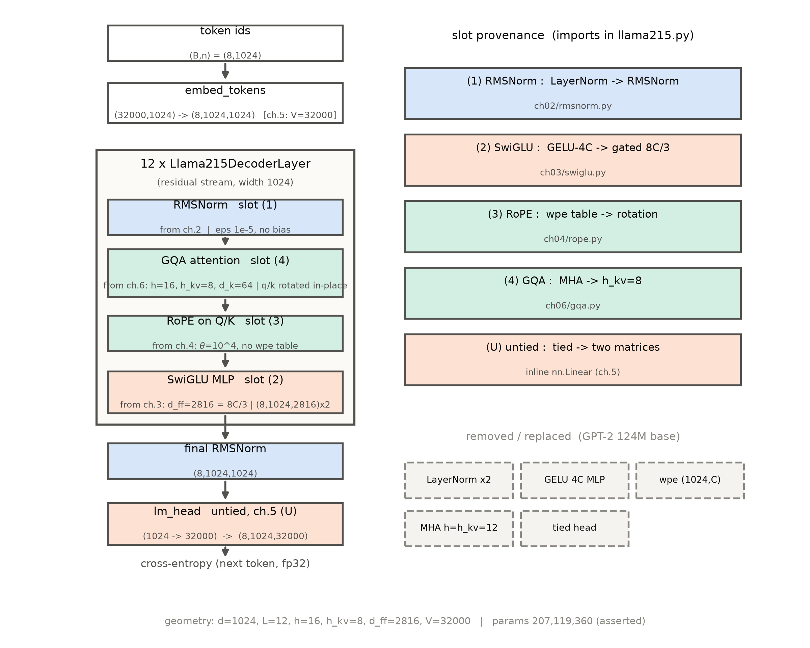
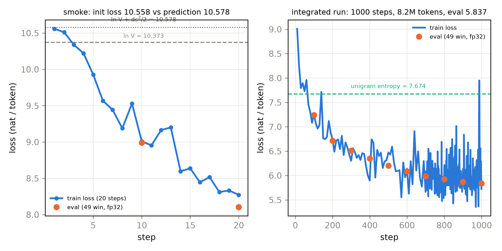

# 第 10 章 大项目：单轨整机整合（设计文档版）

## 10.0 开篇：从全书到这里

上一章学会了读别人的机器，章末的交接句把最后一段路指好了方向：「全书旅程只剩最后一程：回到我们自己的 207M——四插槽齐装成整机，参数逐位 assert，冒烟点火，再留下一份写给未来高算力机器的设计文档。下一章，把改装史装进 import 语句里收官。」【第 9 章成稿直引】现在就来做这件事：第 2 章的 RMSNorm、第 3 章的 SwiGLU、第 4 章的 RoPE、第 6 章的 GQA，四件各自验过货的零件，装回同一台 Book2 底座的骨架里。

但开造之前，必须先把一件事说透——导览里预告过的那项作者决策。第 0 章 0.6 节的原话是：「第 10 章的 207M 全量长训不在本机执行——这是本册开工时的作者决策，理由会以本机实测数字自证（Chinchilla 配方在本机是『天』量级、旗舰口径是『年』量级）」【第 0 章成稿直引】。现在数字可以自证了。调研期探针 C 在本机（MPS bf16、$B{=}8$、$T{=}1024$）实测 207M 整机训练 1.702 秒/步、每步 8,192 token【证据等级：本书实验（MPS，2026-10，探针 C）】，两笔外推账：按 Chinchilla 配方（约 21 token/参数）喂 4.3B token，需要 524,902 步 $\times$ 1.702 秒 $\approx$ **10.34 天连续运算**；按 Llama 3 的旗舰口径 15T token，需要 18.3 亿步 $\approx$ 36,066 天 $\approx$ **98.8 年**【证据等级：本书实验外推（sec/step $\propto$ 同 $B/T$ 固定，量级论证）】。秒/步的口径要交代一句：10.3 节整合短训在同一台机器上两窗复测为 1.21 与 1.93 秒/步（同机同代码的机器状态波动）——探针 C 的 1.702 落在区间内，预算表取它作外推是偏保守的居中值（按两窗外推 Chinchilla 档为 7.3-11.7 天），量级结论不变。前者是一台笔记本不间断跑十天半——风扇、休眠、内存碎片任何一样都会中断它；后者在物理上不成立。训练侧工程账本（Book2 第 9 章）的老结论在这里再次显形：预算不是「能不能跑」的问题，是「跑多久」的问题。

于是本章的形态不是「跑一场大训练」，而是回答三个问题：**本机交付什么、不交付什么、凭什么能重启**。交付四件——整合代码（参数逐位 assert）、分钟级冒烟、一次半小时以内的整合短训（管道验收，不是效果训练）、以及一份达到「重启即可执行」标准的设计文档；不交付一件——全量长训本身及其产物权重；而重启的凭据，全部写进 `DESIGN-215M.md`：架构与 config 逐字段依据、数据配方、预算表、验收标准、风险预案、重启 checklist。这是丛书诚实制度的延续：不假装跑过没跑的东西，但要保证凭文档就能重启。

> **最小背景栏**：本章不教新组件——四件套的机制与消融在第 2/3/4/6 章，出入口解绑的账在第 5 章，参数公式在第 5 章式 (5.2)，训练五件套（AdamW $0.9/0.95$+wd 0.1+clip 1.0+余弦+warmup）在 Book2 第 10 章，初始 loss 的数学（$\ln V$ 地板与方差超额）在 Book2 第 10 章式 (10.3)，HF 结构对拍链路在调研期探针 E（批一已验收）。本章只做组装与点火。

## 10.1 蓝图与验收先行

造机姿势沿用 Book2 第 10 章立下的那条：**验收先于实现**——代码还没写，判据先钉死（那是上一册末章留下的两件心智之一；另一件「初始 loss 的数学」本章 10.3 节还要再用一次，正好凑成一套完整回收）。207M 整机的验收四条，条条可机器判定：

**验收①（参数逐位）**：整机实例化后清点参数，与手算逐项账逐位相等，锁死在 $207{,}119{,}360$。手算账一行式就是第 5 章式 (5.2)（untied、GQA 档）：词表账 $32000\times 1024\times 2$ 加 12 层乘每层账（注意力 $2d^2+2d\,h_{kv}d_k$、SwiGLU $3df$、两枚 norm $2d$）加终态 norm $d$。任何一处插槽装错（比如 $k$ 投影误用全宽 $h$ 而不是 $h_{kv}$），这个数立刻不对——assert 本身就是设计正确性的证明。

**验收②（结构对拍）**：同 config 随机权重，我们的 `state_dict` 与 HF `LlamaForCausalLM`（transformers 5.18.0）`load_state_dict(strict=True)` 直搬互验，CPU fp32 同输入对拍 logits——max|Δlogits| 阈值 $10^{-4}$、argmax 与 top-5 一致率 100%、另设「未搬运对照组」证明差异显著。这条链路在调研期探针 E 的 mini 档（3.2M）跑通过，批一验收 max|Δlogits|$=1.0\times10^{-6}$【证据等级：本书实验（CPU fp32，探针 E）】；本章把它升到 207M 整机档再跑一遍。五处数值口径（RMSNorm 方差 fp32、softmax fp32、rotate_half 约定、repeat_kv、无 bias+eps+untied 从 config 读）已在第 2/4/6 章逐一钉过，组装时不再重议。

**验收③（冒烟健康）**：整机点火 20 步，初始 loss 落在 $\ln 32000=10.3735$ 的贴邻（精确预言见 10.3 节）、全程有限（无 NaN/Inf）、有限下降。这是 Book2 第 10 章固化下来的自检字段——机器出生时的体检。

**验收④（整合短训）**：1000 步 bf16（$B{=}8$、$T{=}1024$，共 8.2M token），四插槽协同无冲突的真凭据是 eval 曲线下降。必须写明的口径：这是**管道验收，不是效果训练**——8.2M token 距 Chinchilla 配方的 4.3B 差三个数量级，曲线只证明「机器在学」，不证明「学到了多好」。

四条之外还有一条**条件性验收**：真实权重对拍。为什么随机权重对拍（验收②）还不够？因为有些错误只在「承载训练产物」时显形——第 4 章的实现考据讲过，两半式与相邻配对两种 RoPE 约定数学等价、只差一个固定置换，随机权重下两边的 `state_dict` 键位同名、strict 搬运照样通过，数值也对；但把一套在另一种约定下训练过的真权重原样搬进来，置换错位立刻让输出面目全非。随机权重证明「数学等价」，真权重才证明「管道兼容」。选谁的真权重是合规问题：HF 官方 `meta-llama` 仓库是 gated（登录审批制），本丛书一律不碰；降级顺位的第一顺位 TinyLlama_v1.1（Apache-2.0，1.1B）在批三前置任务里已下载就位（4.4GB fp32、201 张量、sha256 与 repo 逐位一致）【证据等级：本书实验（HF 缓存实物直读，2026-10）】——条件成立，本章对拍。

蓝图就是这五条。它们共同回答一个问题：**凭什么相信组装出来的机器就是图纸上的那台？**——参数账证明几何，结构对拍证明数学，冒烟与短训证明动力学，实权重对拍证明这条组装线真的能承载一个训练过的同型大脑。下面开始装配。

## 10.2 整机实现：改装史在 import 语句里

本册第 0 章许过一句愿：「第 10 章把四章造好的零件 import 进同一台整机，改装史直接写在 import 语句里」。现在兑现——`llama215.py` 的 import 段，四行就是四刀：

```python
from rmsnorm import RMSNorm                     # 归一化插槽——第 2 章改装第一例
from swiglu import SwiGLUMLP                     # 前馈插槽——第 3 章改装第二例
from rope import apply_rope, build_rope_cache    # 位置插槽——第 4 章改装第三例
from gqa import GroupedQueryAttention            # 注意力插槽——第 6 章改装第四例
```

（[`code/ch10/llama215.py`](code/ch10/llama215.py)——`sys.path` 指向 `ch02/ch03/ch04/ch06` 与 `00-feasibility` 五个目录，后者供出 config 鸭子类型正身 `LLaMAConfig`；import 契约的类名与签名在大纲插槽契约表定版。）

这四行是本册单轨代码主线的物理形态：**四个插槽不是「照着重写」，是从四章的交付文件里原样搬来**。每件都经过两道验收——与调研期组件库 `llama_slots` 正身 CPU fp32 逐位一致、与 HF transformers 5.18.0 对应模块一致（第 2/3/4/6 章各自动手验证节的「对拍①②」）。第 5 章的附加一刀（untied）不需要 import：它就是整机出口处一行独立的 `nn.Linear(1024, 32000, bias=False)`。文件里剩下的代码只有「组装」：`Llama215DecoderLayer` 把两颗 RMSNorm 守在两个子层门口（拓扑仍是 Book2 三插槽 Block，一寸未动），`Llama215Backbone` 叠 12 层加终态 norm，`Llama215` 挂上 untied 的 `lm_head`——模型定义百余行，加参数逐项账自测，整机文件的大部分篇幅反而是两段对拍。改装史不在注释里，在依赖里：依赖方向永远单向（后面的章只引用前面的章），这台机器的每一处来路都可追溯。整机全貌与四个插槽的来路见图 10.1——第 0 章图 0.1 那张「插座图」上标着的四格加一刀，在这里全部落成实物。



图 10.1 207M 整机结构与插槽来源（自绘示意级，与图 0.1/图 8.1 同图式续篇）：数据河 $(8,1024)$ 恒宽穿过 12 层，四插槽框标注 import 来源（ch.2 RMSNorm / ch.3 SwiGLU / ch.4 RoPE / ch.6 GQA）与附加一刀（untied，ch.5 内联实现）；右栏=`llama215.py` 的 import 契约，底部虚影=从 GPT-2 底座换下或拆除的零件；几何为 207M 定版档（$d{=}1024$、$L{=}12$、$h{=}16$、$h_{kv}{=}8$、$d_{ff}{=}2816$、$V{=}32000$）

config 用调研期定版的 cand1：$d{=}1024$、$L{=}12$、$h{=}16$、$h_{kv}{=}8$、$d_{ff}{=}2816$、$V{=}32000$ untied、$\theta{=}10^4$、eps $10^{-5}$、无 bias、无 $w_{pe}$。逐字段依据都有前文：$d_{ff}=2816=\lceil 8d/3\rceil_{256}$ 是第 3 章的取整公式（$11\times256$）；$h_{kv}{=}8$ 是第 6 章组数扫描的甜点（16 个查询头组内 2 头，KV 账本 24 KiB/token，与 LLaMA2-34B/70B 及 Llama 3 系的 8 组同数——注意 LLaMA2-7B/13B 仍是 MHA）；untied 与 $V{=}32000$ 是第 5 章按出厂口径付的账（词表账 65.5M、占全机 31.6%）；eps $10^{-5}$ 是第 2 章 eps 代际考据的 LLaMA2/3 出厂口径（HF 默认 1e-6 是对拍时的隐形开关，一律从 config 读）；$\theta{=}10^4$ 是 LLaMA1/2 的出厂值（Llama 3 加大到 $5\times10^5$ 的出厂设定路线在第 7 章 7.8 节读过——我们的 8192 训练窗内 $10^4$ 够用）。完整逐字段依据表连同证据链收进设计文档 §3，重启时不必回读本书。

还要问一句：为什么用 import，而不是把四个类复制进一个文件？Karpathy 的 llama2.c 给了反面参照：教学复刻把全部组件压进单文件 `model.py`（约 350 行），好处是零依赖、一眼看全，代价是「这台机器从哪来」的改装史被抹平——读它你知道机器长什么样，不知道每件零件当年为什么被换上、换的时候付了什么账【证据等级：config/源码（llama2.c model.py 直读，MIT）】。本册的选择相反：组件留在动刀的那一章，整机只做 import——于是旅程停在任何一站，你手里都是一台当下完整、能跑的机器（第 0 章 0.5 节「一条代码线」的承诺），而 `git log` 式的来路信息存在依赖关系里。两种写法不是对错之分，是教学目标之分：llama2.c 教「机器是什么」，本册教「机器怎么变成今天这样」——只有后者需要把改装史留在 import 语句里。

组装完成，整机数据河一条（$B{=}8$、$T{=}1024$ 训练口径），形状流转表（表 10.1）如下——四件套各自内部的逐运算标形在第 2/3/4/6 章都走过，这里给整机主干：

表 10.1 207M 整机形状流转表（$B{=}8$、$n{=}1024$、$C{=}1024$、$V{=}32000$；自排，与 `llama215.py` 各步骤行内形状注释同源；单层内部详见各章形状流转表）

| 步骤 | 运算 | 输入形状 | 输出形状 | 说明 |
|---|---|---|---|---|
| 入口查表 | $E[\mathrm{ids}]$ | $(8,1024)$ + $E\in(32000,1024)$ | $(8,1024,1024)$ | 无位置查表——$w_{pe}$ 已拆除 |
| RoPE 表现算 | $t\cdot\theta_i$（$\theta_i$ 依式 (4.7)，头维 64 代入） | $t\in(1024,)$ | $(1,1024,64)\times2$ | cos/sin，每层共用（第 4 章） |
| 子层①门口 | RMSNorm | $(8,1024,1024)$ | $(8,1024,1024)$ | 插槽①（第 2 章） |
| 注意力 | GQA+RoPE | $(8,1024,1024)$ + cos/sin | $(8,1024,1024)$ | $q$$(8,16,1024,64)$、$k/v$$(8,8,1024,64)$→repeat $(8,16,1024,64)$（第 6 章） |
| 子层②门口 | RMSNorm | $(8,1024,1024)$ | $(8,1024,1024)$ | 插槽①（第 2 章） |
| 前馈 | SwiGLU | $(8,1024,1024)$ | $(8,1024,1024)$ | 中间量 $(8,1024,2816)\times2$→$\odot$（第 3 章） |
| 残差+循环 | ×12 层 | $(8,1024,1024)$ | $(8,1024,1024)$ | 恒宽残差河，Book2 拓扑 |
| 终态 norm | RMSNorm | $(8,1024,1024)$ | $(8,1024,1024)$ | 出口前最后一枚 |
| 出口投影 | $h\cdot H^{\top}$ | $(8,1024,1024)\cdot(1024,32000)$ | $(8,1024,32000)$ | untied 独立 $H$（第 5 章） |
| 损失 | 交叉熵 | $(8192,32000)$ fp32 | 标量 | 目标=下一 token |

参数逐项账（表 10.2）是验收①的对账单，也是「逐插槽改装」这套方法的最后清点——每一行对应一个插槽的决策：

表 10.2 207M 参数逐项账（手算=实测逐位；`llama215.py` 自测 assert 同源）

| 项 | 算式 | 参数量 | 插槽归属 |
|---|---|---|---|
| 注意力/层 | $2d^2+2d\,h_{kv}d_k=2\times1024^2+2\times1024\times512$ | 3,145,728 | 第 6 章（GQA 省在 $k/v$ 窄投影） |
| 前馈/层 | $3df=3\times1024\times2816$ | 8,650,752 | 第 3 章（三矩阵 $8d/3$） |
| 两枚 norm/层 | $2d$ | 2,048 | 第 2 章（只有 weight） |
| 每层小计 | | **11,798,528** | |
| ×12 层 | | 141,582,336 | |
| $w_{te}$ | $Vd=32000\times1024$ | 32,768,000 | |
| $lm\_head$（untied） | $Vd$ | 32,768,000 | 第 5 章（附加一刀） |
| 终态 norm | $d$ | 1,024 | 第 2 章 |
| **总计** | | **207,119,360** | assert 锁死 |

【证据等级：本书实验（CPU，2026-10，`llama215.py` 自测：手算=实测=207,119,360）】自测三秒跑完，逐位咬合。注意两笔对照账：位置编码一行是**零**（$w_{pe}$ 拆除后位置信息不占参数，只作为旋转角进入注意力——第 4 章的账）；词表账两行合计 65.5M、占全机 31.6%（第 5 章付的账，全机最大的一笔）。

> **【考据框】「215M 档」的名称从哪来。**全书一直叫这台机器「215M」，定版实测却是 207.1M——差额 7.9M。名称的由来：丛书规划阶段的总览大纲按「GPT-2 124M 放大到 200M 档」的粗估写下「LLaMA 式 215M」，调研期探针 C 以 205-225M 为目标带微调 $h_{kv}$ 与 $d_{ff}$ 得到三个候选，主选 cand1（$h_{kv}{=}8$、$d_{ff}{=}2816$）落在 207,119,360。「215M」从此成了档位名（规划文档与伏笔登记沿用），书内引用参数量一律用实数 207M/207,119,360——名字是历史，账是账。

## 10.3 冒烟与整合短训实测

机器装好了，点火。语料是批三前置任务重切的 sp-32k：`tokens32k.bin` 56,284,791 token（OWT 流首部 51,976 篇、doc 间 EOS、uint16 裸流）、独立尾切 eval 池 1.2M token，压缩率 4.5382 字节/token【证据等级：本书实验（CPU，2026-10，P-03 销项：七项参数带校验全过）】。这里有一个值得登记的口径决策：第 5 章词表扫描时训过一块 sp-32768（扫描臂的实验变量），本章**不用它、新训 sp-32000**——冒烟判据锚 $\ln 32000$，词表尺寸必须与 config 逐位一致，32768 与 32000 差的那 768 会让「贴不贴 $\ln V$」的判定失真；分词器配方仍是 Book2 sp-8k 出身那一套（sp-BPE、byte fallback、coverage 1.0），在独立分片（29MB/6000 篇，与 LM 语料互斥——Book2 第 8 章的分离纪律沿用）上训练，$V$ 恰为 32000、unk 率 0（byte fallback 兜底）。同一块语料上 32000 与 32768 两把分词器的压缩率 4.5382 对 4.5467 字节/token——词表小 2.3%、每 token 多装 0.2%，方向与幅度都自洽。

第一眼看初始 loss——冒烟判据按卷级大纲 v1.1 口径**只锚 $\ln 32000=10.3735$**，这里有一处必须讲清的考据。Book2 第 10 章式 (10.3) 给过绑定头的初始 loss 账：$\ln V+\tfrac12\sigma^2$，且方差 $\sigma^2\approx Cs^2$ 经过「嵌入即输出」的共享路径——目标 token 自己的嵌入沿残差流漏到输出端、与自己内积出偏高的 logit（「复读机」机制；$s{=}1$ 时它把初始 loss 冲到 480 的反面教材 Book2 演过）。我们的 207M 是 untied：出口 $H$ 独立初始化，与入口 $E$ 无关，自泄漏路径物理断开。实测把它拆成了干净的三笔：初始 loss **10.5584**，其中 $\ln V=10.3735$ 是地板（均匀分布的熵）；超额 $+0.185$ 是初始 logit 方差的贡献——末态 RMSNorm 把隐状态归一到每维 RMS 1（$\|h\|=\sqrt{d}=32$），出口行向量 $\sim N(0,0.02^2)$，logit 方差 $\sigma^2=d\,s^2=1024\times0.02^2=0.4096$（实测 0.4102）， iid 高斯 logits 的期望交叉熵 $\approx\ln V+\sigma^2/2=10.5783$；而泄漏项的实测值——目标位 logit 的均值 $E[z_t]=+0.022\approx 0$（抽样噪声内）——**untied 下确实归零**【证据等级：本书实验（MPS bf16，2026-10，`train215_smoke_s1.json` 的 `smoke_check` 字段）】。与 Book2 GPT-2 同协议对照一句：绑定头 10.97 $=\ln 50257+0.15$，我们 10.56 $=\ln 32000+0.19$——同式同形（超额都是 $\tfrac12 ds^2$，$d$ 从 768 涨到 1024），差别在 GPT-2 的方差路径含共享嵌入的自泄漏分量、我们的不含。判定：健康。



图 10.2 冒烟与整合短训（自产，MPS bf16、种子 20261002、独占窗口）：左=冒烟 20 步，初始 loss 10.5584 贴 $\ln 32000+\tfrac12 ds^2=10.578$ 预言（灰虚线=$\ln V$ 地板 10.373），20 步降至 8.27；右=整合短训 1000 步（8.2M token），train/eval 双曲线与一元分布熵地板 7.674（青虚线，30,552 活跃 token 实算）——eval 在前 100 步内穿板、终值 5.837（790 步处外层时限截断、700 步 ckpt 续跑，曲线无缝）【证据等级：本书实验（MPS，2026-10，`curve_smoke_s1.csv`/`curve_integrated_run1.csv`，续跑窗口自动合并）】

冒烟的 20 步走完（图 10.2 左）：train loss 10.5584 → 8.2723，eval（49 窗、401,408 token、fp32）8.1053，全程有限、单调下降——验收③通过。曲线的陡峭是循环健康的形状（Book2 第 10 章讲过：第一层「地板」是语料的一元分布熵，初始几步就是在敲碎它）。这笔账在 sp-32k 上重算一遍：整合短训将消费的流段（$[0,1001\times8192)$ 共 8,201,216 token）里活跃 30,552 种 token、词频熵 **7.674 nat**（eval 池同账 7.615）【证据等级：本书实验（CPU，2026-10，`train_215.py` 的 `corpus_stats` 同源算法实算，统计段=实耗流段）】——冒烟 20 步降到 8.11，还站在地板上方；整合短训的 eval 在第 100 步就报 7.24，**已穿板**：「背会词频」这层在前一百步内敲碎，之后降的每一分都是窗内局部搭配（空格后跟字母、`th` 后面跟 `e` 这一族）的功劳。

整合短训按验收④跑：1000 步 bf16、$B{=}8$、$T{=}1024$、五件套配方原样（AdamW $0.9/0.95$+wd 0.1、clip 1.0、余弦 1e-3→1e-4、warmup 100），顺序一次通过 8.2M token【证据等级：本书实验（MPS，2026-10，`train215_integrated_run1.json`）】。结果（图 10.2 右）：train loss 从 10.56 降至 **5.72**，eval 一路单调下降到 **5.84**（7.24 → 6.71 → 6.51 → 6.35 → 6.20 → 6.09 → 5.99 → 5.92 → 5.87 → 5.84，每百步一档）——比一元分布熵地板低 1.8 nat，8.2M token 里模型学到的远不止词频。四插槽协同无冲突的凭据就是这条曲线：RMSNorm 的 fp32 方差、RoPE 的两半式旋转、GQA 的 repeat 视图、SwiGLU 的门控乘法在同一台机器里跑了 1000 步，没有 NaN、没有发散、没有形状错位——第 8 章 8.1 节「四件零件作用于数据河的不同河段、互不干扰」的正交性论证，从纸面变成了运行记录。计时如实双报（计时纪律：独占 MPS 窗口、单进程单实验）：首个窗口 1.21 秒/步、训至 790 步被外层任务时限截断，自 700 步 checkpoint 续跑完成后段（续窗 1.93 秒/步——同机同代码的机器状态波动，取首窗 1.21 为独占口径；顺带一提，Book2 立下的「ckpt 断点续跑」纪律在这轮真实中断里第一次实战，200 步续跑无缝接上曲线）。再次写明口径：这是管道验收，不是效果训练——按 Chinchilla 配方这台机器要看 4.3B token 才算「喂饱」，我们给它看了 0.19%。

结构对拍两连发。**HF 结构对拍（207M 档）**：同 config 随机权重，`strict=True` 直搬 207,119,360 参数进 `LlamaForCausalLM`，CPU fp32 同输入对拍——max|Δlogits| $=6.9\times10^{-6}$、argmax 一致率 100%、top-5 一致率 100%、未搬运对照组 max|Δ| $=4.86$（证明搬运真的发生了）【证据等级：本书实验（CPU fp32，2026-10，`llama215_parity_run1.json`）】。验收②通过。**TinyLlama 实权重对拍（条件性验收）**：把 TinyLlama_v1.1 的 201 张量真权重 strict 搬进我们的类（同型不同档：$d{=}2048$、$L{=}22$、$h{=}32$、$h_{kv}{=}4$、$d_{ff}{=}5632$、$V{=}32000$ untied——与 207M 同值项是 $V$、eps 与 $\theta$，但 GQA 组比 8:1 对我们的 2:1、ctx 2048 对 8192，正文引用勿混），1,100,048,384 参数一次装满；同输入对拍 max|Δlogits| $=4.9\times10^{-5}$、argmax 一致率 100%；再用**我们的整机**贪心续写 "The capital of France is" → `".\nThe 2019-202"`——与 HF 侧逐 token 一致（v1.1 是 3T/3.9T 训练的中途 base 检查点，greedy 退化属正常，对拍只看数值不看文采）【证据等级：本书实验（CPU fp32，2026-10，`llama215_tinyllama_run1.json`）】。这一步的意义值得多说半句：它证明这条四插槽组装线承载的不只是随机权重——一个真实训练过的同型大脑能原样装进来跑。凭文档重启的人，也凭这条链路确认自己的复刻没有走样。

## 10.4 插槽清单总表：每个零件都有出处

第 8 章 8.6 节给过插槽清单的初版（表 8.5），当时说「第 10 章整机落成时，每个 import 进来的零件背后都有这样一行证据——第 0 章许的愿『这台机器的每个零件都有出处』，在这里兑现了一半，剩下一半在装配现场」。现在装配现场完工，定版如下：

表 10.3 插槽清单总表（定版；本机读数=第 2/3/4/6 章 full 档单变量消融，文献锚=canonical 论文）

| 插槽 | 旧件（GPT-2 底座） | 新件（本册 import） | 动刀章 | 本机消融证据（full 档） | 文献锚 |
|---|---|---|---|---|---|
| 归一化 | pre-LayerNorm | pre-RMSNorm（无 bias、eps 1e-5） | 第 2 章 | 等价检验 +0.043 nat 超带（单种子限定）；买「简」 | 1910.07467 |
| 前馈 | GELU-4C 两矩阵 | SwiGLU 三矩阵 $\tfrac83 C$ | 第 3 章 | 同预算 −0.195 nat（方向同论文 Table 1；小档差距更大=悬案） | 2002.05202 |
| 位置 | $w_{pe}$ 查表（1024 硬墙） | RoPE $\theta{=}10^4$ 只旋 Q/K | 第 4 章 | 同窗 −0.411 nat；4× 越窗软墙 +0.49 nat；硬墙拆除 | 2104.09864 v5 |
| 注意力 | MHA（$h{=}h_{kv}$） | GQA（$h{=}16$、$h_{kv}{=}8$） | 第 6 章 | 质量-KV 反向：8→4→1 付 0.109/0.158 nat，KV 字节 8:4:1 | 2305.13245 |
| 出入口 | tied（50257） | untied + 词表 32000 | 第 5 章 | 词表四臂 bpb −8.3%；解绑占 31.6% 仍解（对齐出厂）；初始泄漏归零 | 论文沉默（负结论）+config |

【证据等级：本机读数=本书实验（MPS，2026-10，单种子 full 档，判据预注册在各章 `preregistered.md`）；文献锚=各组件 canonical 论文（版本见卷级大纲锚点表）】

这张表是本册最想让你带走的一件「实物」——它之于这台 207M，就像 BOM 表（bill of materials，物料清单）之于一台装配好的设备：**每一行都是一个「为什么用它」的判决记录，判决依据一半来自论文、一半来自你自己在 20-50M 档跑过的受控消融**。读法有三层。逐行读，是五个单变量判决（等价买简、同预算买性能、相对位置、账本换质量税、对齐出厂）；整列读，「动刀章」一列就是本册的叙事主线（第 2/3/4/6 章四连加第 5 章附加一刀）；对照读，把它与 LLaMA2 附录 A.2.1 的官方消融桌并排——单变量、同预算（或差量如实标注）、判据先行，同一种思想在 30B/150B token 与 20-50M/千万 token 两个尺度上各跑了一遍。

还有一层读法值得点破：**这台机器不是任何一代 LLaMA 的缩小版**。把表 10.3 与第 8 章的代际总表（表 8.4）并排看：注意力插槽用 LLaMA2-34B/70B 与 Llama 3 全系的 GQA-8，词表与 RoPE 基频却停在 L1/2 的 32k 与 $10^4$，归一化与前馈是三代不动的定型件——逐字段按本册的尺度各自判决，而不是整体照抄某一代的 config。这正是第 8 章「组装学」定义在造机实践里的样子：默认骨架给的是**插槽菜单**，每一格填什么，由当前机身的账本（207M 的词表占比、KV 账、训练窗）逐项决定。第 11 章收束会回到这张表：它是「组件化时代」四个字的实物注脚。

## 10.5 设计文档：写给未来某台机器的重启手册

本章最重的交付不是代码，是 `ch10/DESIGN-215M.md`——一份设计文档兼重启手册。它的写作标准叫**重启即可执行**：一个没有读过本书的工程师拿到它，在任何一台高算力机器上能直接重启这个项目——所有决策（config 数字、数据配方、训练日程、验收判据）都自带依据与出处，不依赖本书上下文。这四个字对文档的约束是硬性的：每个 config 数字自带依据（§3 的字段表一行一证据，不许写「见本书第 N 章」式的内引）；每条命令可直接执行（自测、对拍、冒烟、短训、全量五级命令逐条可跑）；每笔预算带口径（6ND 的 $N$、MFU 的假设、秒/步的实测条件——换机器的人才能重算自己的账，文档末行还专门提醒「重启时请以自己机器的实测数字刷新预算表」）；每个验收判据机器可判定（assert 与阈值，不是「效果不错」）。教程的写法是「跟着做一遍」，工程文档的写法是「不跟着任何人也能做」——本册各章一直在练前一种，这一份把它升级成后一种。文档十一节：目标与范围、暂缓声明、架构与 config 逐字段依据、数据配方、训练配方、预算表、验收标准、风险与预案、重启 checklist、消费线衔接声明，外加末节参考与文献锚；暂缓声明按作者决策原文印在 §2 而不是删掉——后来者第一眼就知道这台机器「为什么现在没训」，诚实的文件形态就是把这句话留在纸上。

预算表（文档 §6）是「凭什么暂缓、凭什么能重启」的量化核心，本机档摘如表 10.4：

表 10.4 207M 训练预算外推表（6ND 口径；$N=207{,}119{,}360$，同 $B/T$ 固定）

| 档 | tokens | FLOPs（6ND） | 机器与口径 | wall-clock | 判读 |
|---|---|---|---|---|---|
| Chinchilla 配方 | 4.3B | $5.34\times10^{18}$ | 本机 MPS bf16（探针 C 实测 1.702 s/步；短训两窗复测 1.21-1.93，区间内取值——见 10.0 口径说明） | **10.34 天** | 暂缓（连续运行不可维护） |
| 旗舰口径 | 15T | $1.86\times10^{22}$ | 本机 MPS bf16 | **98.8 年** | 物理不成立 |
| Chinchilla 配方 | 4.3B | $5.34\times10^{18}$ | 1×A100-80GB @40% MFU | ≈11.9 小时 | 可重启档 |
| Chinchilla 配方 | 4.3B | $5.34\times10^{18}$ | 1×H100 @40% MFU | ≈3.8 小时 | 可重启档 |
| 旗舰口径 | 15T | $1.86\times10^{22}$ | 8×H100 @40% MFU | ≈68 天 | 重启后的完整口径 |
| 竞品对照 | —（README/章末自报） | — | llama2.c 110M：4×A100×24 h | — | {厂商自报} |
| 竞品对照 | —（章末自报） | — | happy-llm 215M：8×4090×46 h | — | {厂商自报} |

【证据等级：本机行=本书实验外推（探针 C 实测 sec/step，2026-10）；A100/H100 行=本书估算（峰值 bf16 312/989 TFLOPS×MFU 40% 假设——207M 小模型的实际 MFU 可能低于此值，估时偏乐观，量级可靠）；竞品行=厂商自报（llama2.c README/happy-llm 5.3，token 数与 MFU 均未披露，只作存在性参照）】

表上有一个值得点破的反差：**重启的门槛不是显存，是时间**。207M 的 AdamW 全套状态约 3.3GB，加上 $B{=}8$、$T{=}1024$ 的激活，单张 24GB 消费卡就装得下；卡住的是「天对小时」的时间账——一张 A100 把 Chinchilla 配方从本机的 10.34 天压到半天，旗舰口径 15T 才需要 8 张 H100 跑两个月。这也解释了竞品对照行的读法：llama2.c 与 happy-llm 用多卡天级预算训练百 M 档模型再发布权重，是「跑完+发权重」的交付形态；本册没有这笔预算，就把等价的知识装进文档——预算到位时，重启是照单执行而不是重新设计。

重启 checklist（文档 §9）把「凭何重启」压成可勾选的十步，摘要如表 10.5：

表 10.5 重启 checklist 摘要（完整版=DESIGN-215M.md §9）

| # | 步骤 | 验收 |
|---|---|---|
| 1 | 环境：torch≥2.x + 单卡 ≥24GB（A100/H100 更佳） | `python llama215.py` 自测通过 |
| 2 | 数据：`prep_sp32k.py` 重切（或换等量语料，重训分词器于独立分片） | 七项参数带校验全过 |
| 3 | 验收①：参数 assert | 207,119,360 逐位 |
| 4 | 验收②：`--parity` HF 结构对拍 | max\|Δlogits\|<$10^{-4}$ |
| 5 | 验收③：`--task smoke` | 初始 loss≈10.58、有限、下降 |
| 6 | 验收④：`--task integrated` | 1000 步 eval 下降 |
| 7 | 全量训练：按表 10.4 定档（建议 Chinchilla 4.3B 起步） | 曲线+ckpt 续跑 |
| 8 | eval 协议不变（49 窗 fp32），跨机可比 | — |
| 9 | 曲线入档：与本章 1000 步曲线（eval 终值 5.84）的接续关系 | — |
| 10 | 消费线登记：产物权重接 Book6 mini 引擎 | — |

暂缓声明按作者决策原文印在文档 §2：本大项目全量训练暂时略过，待获得高算力机器后可凭此文档直接重启设计与开发。文档 §10 是**消费线衔接声明**：Book6 mini 引擎的默认服务对象，登记为本册已训的同构小模型——第 6 章模块消融产物与本章整合短训 checkpoint（1000 步、eval 5.84，四插槽同构、可加载可生成），防 Book6 开工时断链。

## 10.6 消费线衔接与展望

单轨代码主线走到这里，位置可以钉死了：Book1 末造出翻译机（原版 Transformer，编码器解码器双塔），Book2 末造出 GPT-2 124M（单塔、三插槽底座），本册末造出 LLaMA 式 207M（四插槽全换、出入口解绑、参数逐位、对拍双绿、短训点火）——一条从 2017 到 2023 的改装史，全部在你自己的代码目录里，每一站都能跑。下一册在这台机器上动两刀：前馈插槽换成专家群（MoE）、注意力做更低秩的折叠（MLA）——刀口还是插槽，判断力还是这张表 10.3。

消费线这头，207M 的短训 checkpoint 已就位：它是 Book6 mini 引擎的默认服务对象——设计文档 §10 已把这纸登记写死（第 6 章模块消融产物作备选）。作为服役对象，这台机器的三笔账引擎侧直接要用：参数 207M（bf16 权重约 414 MB，任何消费级显卡装得下）；KV 账 24 KiB/token（第 6 章式 (6.2)：$2\times12\times8\times64\times2$ 字节），2048 窗单序列 48 MiB、并发 8 时 384 MiB——第 6 章算过的数，此处只换一个身份，从「造机器时的设计约束」变成「用机器时的工程输入」；还有一笔定性账：逐 token 生成时每个 token 只需碰一遍权重与 KV、浮点计算量却很小，「搬运大于计算」的雏形已经显形——Book6 开篇拿它当第一堂课的算例。生产线的原料与流水线的第一个工件，在这里交接。

## 10.7 本章小结

开篇三问，逐一交卷。**本机交付了什么**——整合代码（`llama215.py`：四插槽 import 组装、参数逐位 207,119,360、HF 结构对拍 max|Δlogits| $6.9\times10^{-6}$）、点火健康（初始 loss 10.5584 贴 $\ln V+\tfrac12 ds^2$ 预言、泄漏项实测归零）、整合短训（1000 步、8.2M token、eval 单调降至 5.84——四插槽协同无冲突的运行记录）、实权重对拍（TinyLlama 1.1B 真 strict 装机、贪心续写逐 token 一致），以及一份十一节的设计文档。**不交付什么**——全量长训及其权重，凭据是那笔时间账：Chinchilla 配方在本机 10.34 天、旗舰口径 98.8 年。**凭什么重启**——`DESIGN-215M.md` 达到「重启即可执行」标准：config 逐字段依据、数据配方带校验、预算表带口径、验收四条可机器判定、checklist 十步可勾选；一张 A100 半天，Chinchilla 配方就能在这条组装线上重新点火。

**带走的心智**：把数字都还回去，留两件。**第一件，「每个零件都有出处」的造机判断力**——从此你看任何一台开源模型，眼睛里是一张插槽清单：这个 norm 为什么是它、这个前馈付了什么账、这个位置编码拆掉了什么墙、这份 config 里每个字段替谁说话；没有出处的零件你要敢问，有出处的零件你要能引。**第二件，「验收先于实现、文档即机器」的工程姿势**——参数逐位、结构对拍、冒烟健康、短训验管道，四条判据先于代码钉死；而预算不够时不假装、不缩水、把全部决策写成一份外人能执行的重启手册——机器会过时，这份「把一台机器的设计连同依据完整交出去」的能力不会。

镜头拉回全书：机器装完了——但这一册真正要带走的不是这台 207M，而是「每个零件都有出处」的造机判断力。最后一章清点行囊：十笔旧账的对账单、九笔新钩的地图、两本账的移交，以及「组件化时代」这四个字的最终判决。

> **【欠账】** 207M 全量长训按作者决策暂缓——重启锚不在书页里，在 `ch10/DESIGN-215M.md`（重启即可执行标准）；Book6 mini 引擎的默认服务对象已登记为本册已训同构小模型（含本章整合短训 checkpoint），重启后的权重沿同一登记交接。→ Book6（mini 推理引擎贯穿式大项目）

## 10.8 动手验证

- **整机自测 + 两连对拍**（自测秒级；结构对拍 CPU 分钟级；TinyLlama 需本地 HF 缓存实物）：
  ```bash
  cd 工作区根目录 && source env.sh && \
    python code/ch10/llama215.py
  python code/ch10/llama215.py --parity --out-name run1
  python code/ch10/llama215.py --tinyllama --out-name run1
  # 预期：参数逐位 207,119,360；初始 loss 10.5597 对预言 10.5783（自测口径：随机 token、CPU fp32、窗 256——
  #   与 10.3 冒烟首步的 10.5584 是同一预言的两次独立测量，后者为 MPS bf16 训练窗口径）；
  #   结构对拍 max|Δlogits|=6.9e-06、argmax/top-5 一致率 100%、未搬运对照 4.86；
  #   TinyLlama 1,100,048,384 参数 strict 装机、max|Δlogits|=4.9e-05、
  #   贪心 "The capital of France is" -> ".\nThe 2019-202"
  ```
- **冒烟 + 整合短训**（MPS bf16 独占窗口；冒烟 ≈2 min、整合 1000 步训练段 ≈20 min+eval；语料缺失时先跑 `prep_sp32k.py`）：
  ```bash
  cd 工作区根目录 && source env.sh && \
    python code/ch10/train_215.py --task smoke --out-name s1
  python code/ch10/train_215.py --task integrated --out-name run1
  # 预期：初始 loss 10.5584（ln 32000+½ds²=10.578 的贴邻、E[z_t]≈0）；
  #   冒烟 20 步 8.27；整合 1000 步 train→5.72 / eval→5.84（一元分布熵地板 7.674，前 100 步已穿板）；
  #   产物：log/book3-ch10/train215_{smoke,integrated}_*.json + curve_*.csv + ckpt
  ```
- **两张图**：`python [`code/ch10/make_figures.py`](code/ch10/make_figures.py)（图 10.1 静态重绘；图 10.2 读上两个 curve CSV）。
- **验收点**：不看书画出 207M 整机结构并标出四插槽的动刀章与 import 来源；能手算表 10.2 的每一行并说明 untied 与 GQA 各改了哪一行；能解释初始 loss 判据为什么只锚 $\ln V$、泄漏项与方差项各占什么位置；能对一台 8×H100 估算 Chinchilla 配方的重启时长（表 10.4 的口径复算）；能说出设计文档的十一节结构与「重启即可执行」标准靠什么达成。
