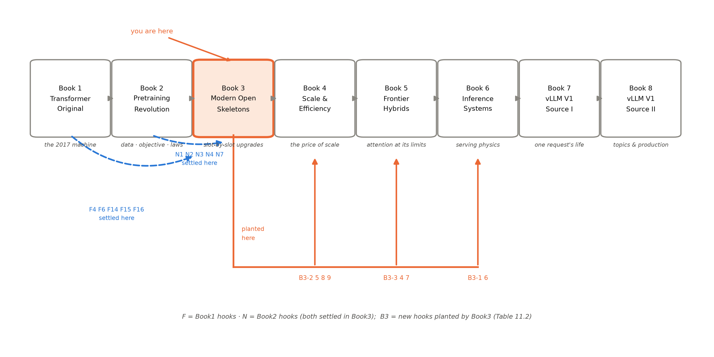
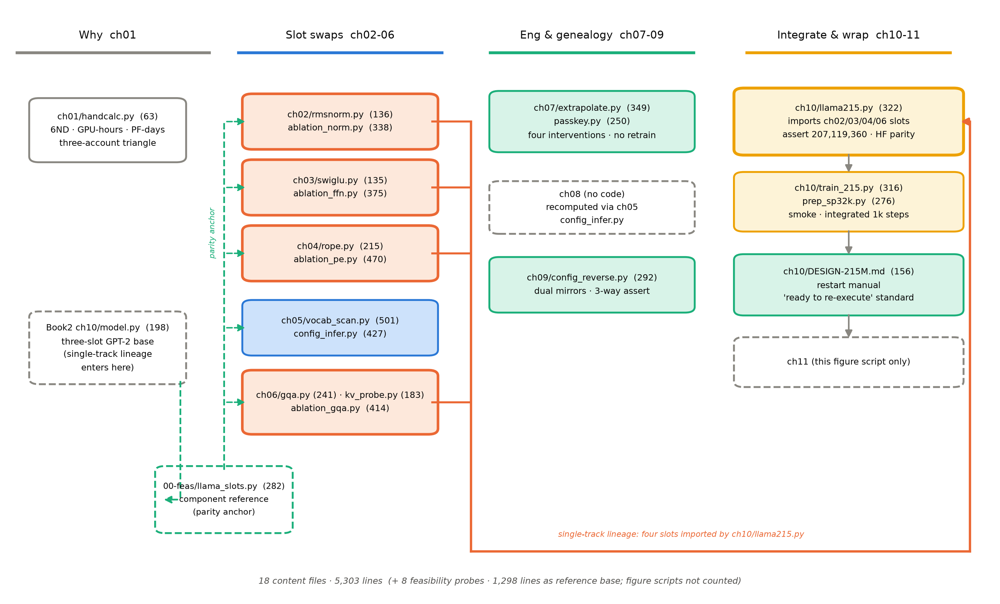

# 第 11 章 收束：组件化时代的判断力

## 11.0 开篇：从全书到这里

上一章合上了机盖。四插槽齐装的 207M 点过火（初始 loss 10.5584 贴 $\ln V+\tfrac12 ds^2\approx10.58$ 的预言——untied 判据锚 $\ln 32000$、泄漏项归零）、跑过整合短训（eval 单调降到 5.84）、装进过一个真实的 1.1B 大脑（TinyLlama 逐位对拍），章末的交接句替本章点好了名：「镜头拉回全书：机器装完了——但这一册真正要带走的不是这台 207M，而是『每个零件都有出处』的造机判断力。最后一章清点行囊：十笔旧账的对账单、九笔新钩的地图、两本账的移交，以及『组件化时代』这四个字的最终判决。」【第 10 章成稿直引】

本章是全书的「总-下」，没有新实验、没有新零件，要回答三个问题。其一，**判决**：导览开篇说「从这一天起，造模型的形态变了：从发明架构，到组装架构」——十二章读下来，这句话的证据链是否真的成立？成立到哪里、边界在哪里？其二，**对账**：本册接走的十笔旧账（F4/F6/F14/F15/F16 与 N1-N4/N7）是否笔笔有下落，自己埋下的九笔新钩（B3-1~B3-9）去向是否都有显式地址？其三，**移交**：本册立起的账本、练出的手艺、造出的机器，分别移交给下一册的谁。这是出发去 Book4 前的装备清点。

> **最小背景栏**：本章没有新的前置知识，全部调用已教内容——四插槽消融（第 2/3/4/6 章）、词表与 config 反推（第 5 章）、KV 账本（第 6 章）、外推工程链（第 7 章）、代际对表与组装法庭（第 8 章）、无论文读法（第 9 章）、整机整合与设计文档（第 10 章）。数字一律指回原处，不重新论证。

## 11.1 插槽化时代的判决

第 8 章的代际总表收尾时埋过一句：「第 11 章收束章会把这个事实升格为『组件化时代的判决』，此处先立桩。」【第 8 章成稿直引】现在开庭。要判的命题是导览立下的那个：LLaMA 之后，「造模型」从发明架构变成了组装架构——各家只做插槽替换。判词要立得住，得有三路证据。

**第一路，代际对表（第 8 章图 8.2 的点亮图）。**2023 年 2 月骨架定型之后，LLaMA2 与 Llama 3 两代翻新里，架构区的四行插槽总共只亮过三格——LLaMA2 把注意力插槽换上 GQA（且只在 34B/70B 两档），Llama 3 把 GQA 扩到全系、把位置旋钮 $\theta$ 拧到 $5\times10^5$；其余全灰。真正每代全亮的是配方行：数据 1.4T→2.0T→15T【证据等级：官方论文 2302.13971/2307.09288/2407.21783，双口径纪律见第 8 章】、词表 32k→128k、窗 2k→4k→8k→128k、许可研究→商用。「架构不动只堆数据」不是修辞，是点亮图上的视觉事实。

**第二路，config 逆向（第 9 章）。**到了没有论文的 Llama 4，动刀的刻度反而量得更准：归一化插槽三代未动（第 2 章的零件原样传下去）、KV 分组仍是 8 头（第 6 章的「甜点档」在代际尺度上持续兑现）、前馈插槽换成「16/128 选 1 的专家群」（config 事实，机制归 Book4）、位置插槽半动（3:1 交错加分段缩放——用的还是第 7 章教过的那套旋钮）【证据等级：config 逆向（双镜像交叉）】。请注意这条证据的方向：连「大动」也动在插槽格内——刀口从「重造整机」退到了「换哪一格、拧哪个旋钮」，这正是插槽化的定义本身。

**第三路，我们自己的 207M（第 10 章表 10.3）。**这台机器是时代的缩影：它不是任何一代 LLaMA 的缩小版，而是按插槽菜单逐格判决组装出来的——归一化取等价更简（本机消融 +0.043 nat 超带、单种子限定）、前馈取同预算性能（−0.195 nat，方向同论文）、位置取相对性（同窗 −0.411 nat，硬墙拆除）、注意力取账本（KV 字节 8:4:1 换质量税 0.109/0.158 nat）、出入口按出厂口径解绑（词表账占 31.6% 仍付）【证据等级：本书实验（MPS，2026-10，单种子 full 档，判据预注册）】。每一行背后是一篇组件论文加一次我们自己的受控消融——**「每个零件都有出处」在这台机器上不是口号，是六列的表格**。为便于合卷回看，表 11.1 把这张定版清单再印一次。

表 11.1 插槽清单总表（摘要版；定版与逐项读数见第 10 章表 10.3，此处不重复证据链）

| 插槽 | 旧件 → 新件 | 动刀章 | 一句话判词 |
|---|---|---|---|
| 归一化 | pre-LayerNorm → pre-RMSNorm（无 bias、eps 1e-5） | 第 2 章 | 等价买「简」 |
| 前馈 | GELU-4C 两矩阵 → SwiGLU 三矩阵 $\tfrac83 C$ | 第 3 章 | 同预算买性能 |
| 位置 | $w_{pe}$ 查表（1024 硬墙）→ RoPE 只旋 Q/K | 第 4 章 | 买相对位置，硬墙换软墙 |
| 注意力 | MHA → GQA（$h{=}16$、$h_{kv}{=}8$） | 第 6 章 | 付质量税买 KV 账本 |
| 出入口 | tied（50257）→ untied＋词表 32000 | 第 5 章 | 对齐出厂口径，31.6% 照付 |

三路证据合起来，判决可以落槌了，分三句。**第一句：插槽化有技术基础，不是懒惰。**第 8 章 8.1 节论证过四件套的正交性——它们作用于数据河的不同河段（$(B,n,d)$ 的门口、$(B,n,d)\to(B,n,\tfrac83 d)$ 的车间、$(B,h,n,d_k)$ 的打分端、KV 投影的宽度），换掉任何一件，其余三件的输入输出契约一个字节不变。互相独立才可单独更换，可单独更换才有插槽——这是「组装」在工程上成立的先决条件。**第二句：插槽化是范式的默认态，不是过渡态。**从 2023-02 到冻结线外的 2025，四格插槽绝大多数时间纹丝不动，翻代靠配方；即便动了刀（前馈换专家群、位置换交错），动的仍是插槽。往后你读到任何新模型的发布新闻，第一反应应当是第 0 章图 0.1 那张插座图：它换了哪个插槽？拧了哪个旋钮？——十有八九，答案会是「一个都没换，只换了数据」。**第三句：插槽化不豁免判断。**默认骨架给的是菜单不是圣旨——我们的 207M 在词表与 $\theta$ 上停在 L1/2 口径、在注意力上取 L2 大档的 GQA-8，逐字段按当前机身的账本判决（第 10 章 10.4 节）；同样，Llama 3.2-1B 把 tie 开关拨回去（第 5 章）。**组件化时代的判断力，就是把「它用了什么」还原成「它为什么用、付了什么账」的能力**——这张能力，是本册十二章真正反复操练的那一个动作。

## 11.2 四段旅程回望

判决落定，旅程倒带。导览 0.4 节把本册画成四段，现在每段收一句总账——与各章小结的「带走的心智」同源，此处只留最粗的一层，细账按段回看各章即可。

**第一段：为什么（第 1 章）。**GPT-3 三重不可得推出「配方可得」的开源构造逻辑；Chinchilla 处方与推理预算合成「更少参数、更多数据」；6ND、GPU 时、吞吐三本账互证。带走的心智：**「更少参数、更多数据」不是省钱的配方，是换付款方向的配方——训练是一次性支出，服役是按 token 收的长期账单**；而 LLaMA 没有发明任何一件零件，它把三件别人的零件组装成了此后所有人的默认骨架。

**第二段：逐插槽改装（第 2-6 章）。**每章一刀：病根→手术→消融验收，四刀加一刀把 GPT-2 底座换成 LLaMA 式骨架；中途开立了推理时代的第一本账。带走的心智：**每一刀买的都是一本账——归一化买简、前馈买同预算性能、位置买相对性、注意力买 KV 账本；而「换组件=换账本」的手艺（同预算、单变量、判据预注册、对拍）比任何单个零件都值钱**。其中最该留下的一句是第 6 章的灵魂：**不是 2017 错了，是账本变了**——训练侧与推理侧是两本账上的两个最优。

**第三段：工程与谱系（第 7-9 章）。**换完零件的新问题依次到场：窗能不能租（第 7 章四干预免重训对照：+1.14 nat 的软墙被三代配方分别压到 +0.44/+0.28/+0.24——最优是 YaRN-lite，温度独占 0.04 nat 的优势；租约要按窗重签）、这套组合为什么赢（第 8 章组装法庭）、没有论文的模型怎么读（第 9 章 config 逆向全程演练）。带走的心智：**一张波长谱表针——一切外推配方都是对这排针的不同调法；一张冻结的骨架图——架构新闻十有八九是配方新闻；一份几 KB 的 config——它是厂商不得不诚实的地方，是图纸不是宣传页**。

**第四段：整合与收束（第 10-11 章）。**四插槽 import 成整机、参数逐位 assert、冒烟点火、短训验管道、实权重装机，外加一份「重启即可执行」的设计文档。带走的心智：**每个零件都有出处、验收先于实现、预算不够时不假装——把一台机器的设计连同依据完整交出去，这份能力比机器本身长寿**。

四段连起来，正好回答导览开篇的问题「从 2019 年的 GPT-2 到今天的开源旗舰，机器到底换了什么」：换了四格插槽加一刀，骨架一寸未动；而每换一格，账本就重算一遍。导览 0.5 节许诺的三条贯穿线索在此收线——**代码线**从 Book2 底座长到 207M 整机与设计文档（细账见 11.5 节图 11.2）；**伏笔线**十笔旧账全清、九笔新钩埋定（细账见 11.3 节表 11.2）；**一本账**从参数账（124M 对到 207M 逐位，再升级成 config 反推的通用手艺）长成三本（加 KV 账与预算账）。

## 11.3 F/N 总决算与 B3 新钩地图

现在摊开对账页。导览表 0.2 预告过十四条钩子的全量台账，表 11.2 是它们的回执——十笔回收行逐条指回本册落地处，四笔状态行如实登记「不在本册地界」或「册外已清」。

表 11.2 F/N 伏笔总决算（十四行；F=Book1 埋设、N=Book2 埋设；回收/去向与各章成稿的实际埋设句逐条核对）

| # | 钩子（一句话） | 本册处置（落地处） | 后续去向 |
|---|---|---|---|
| F4 | K 与 V 拆开各自缓存：推理时代的账 | 第 6 章开篇四张欠条回放→增量算法+账本 probe 七 case 逐字节闭合 | 账的展开 → Book6 第 3/5 章（B3-1） |
| F6 | 位置编码外推的半句承诺（may） | 第 4 章原理重估（v1-v5 无外推实验红线立此存照）+第 7 章工程全链 | 收束论 → Book5 第 8 章（B3-3） |
| F14 | FFN 的门控思想（GLU 里冒头） | 第 3 章六年线兑现（2016 GLU→2023 定式） | FFN 下一刀 → Book4 第 2-5 章 |
| F15 | 权重共享：绑与解的小开关 | 第 5 章四拨事实链（31.0%→3.89%→13.1%→21.3%；三篇论文沉默的负结论） | —（本册清账） |
| F16 | 缩 $d_k$ 伤质量的再解释 | 第 6 章 6.6 节三步论证收口 | 工程视角 → Book4 第 6 章（B3-2 同址） |
| N1 | 归一化零件自身的演化 | 第 2 章谱系收口（位置轴×函数轴合流于 pre-RMSNorm） | — |
| N2 | 学习式位置编码的 1024 位之墙 | 第 4 章结构性解除（wpe 越界报错具象化）+第 7 章硬墙→软墙 | — |
| N3 | 「绑与解」在下一代被反悔 | 第 5 章（与 F15 同址合并回收） | — |
| N4 | 「更少参数、更多数据」的开源第一单 | 第 1 章主场（动机五段+三笔账）+第 8 章第二落点（8B 档 $R\approx1{,}870$ 超处方 90 倍） | — |
| N7 | 上下文长度主线（F10 接力棒） | 第 7 章主场（出厂设定与训练后租窗两条路在「加大 base」汇流）+第 6 章账本联动 | 1M 收束论 → Book5 第 8 章；账 → Book6 |
| F5 | warmup 的病根与 pre-LN | Book2 第 4 章已收；接力半句在第 2 章开篇（停药叙事续 N1） | —（已清） |
| F10 | 上下文长度：出厂设定 | Book2 第 12 章已登记；接力棒=N7，第 6/7 章接走 | —（已清） |
| N5 | 低精度与训练稳定化的处方 | 无本册落点（冻结线内不涉及） | Book4 第 7 章 |
| N6 | few-shot 的能力侧与系统侧 | 无本册落点 | Book5 第 10 章；Book6 第 6 章 |

旧账清完，看新账。本册埋下九笔 B3 钩，全部沿用登记表纪律——显式地址、最小披露、不硬造：**B3-1**（第 6 章末）KV 账本开立后的三股省法——架构侧、精度侧、淘汰侧，怎么拧、各值多少钱 → Book6 第 3/5 章；**B3-2**（同址）KV 的下一刀：把 $h_{kv}\cdot d_k$ 本身做更低秩的折叠，再砍一个数量级 → Book4 第 6 章；**B3-3**（第 7 章末）外推不是唯一的路——把远处信息压进固定容量状态的另一条哲学，两条路在 2026 旗舰里的合流（config 事实已在第 9 章交货）→ Book5 第 8 章；**B3-4**（第 8 章末）把预训练模型雕成对话助手的整套后训练链，本册只到流程图一级 → Book5 第 10 章；**B3-5**（第 9 章末）「config→架构图→参数 assert→证据分级→悬案登记」的程序，拆一切只交付不解释的旗舰时是日用工具 → Book4 第 10 章 / Book5 第 11 章；**B3-6**（第 10 章，文档锚）大项目重启锚与消费线衔接——重启手册在 `DESIGN-215M.md`，Book6 mini 引擎的默认服务对象已登记为本册已训同构小模型 → Book6 大项目；**B3-7**（第 4 章实现对照框）头维里留一段不旋的「净土」与干脆不编码位置的研究，为什么旋得少反而好 → Book5 第 8 章；**B3-8**（第 8 章末）Llama 3 以训练稳定性为由拒绝了专家群——被拒绝路线的训练难题 → Book4 第 3 章；**B3-9**（第 9 章末）Llama 4 把前馈换成专家群的 config 事实，本册只登记不展开 → Book4 第 2 章。

图 11.1 把这张双栏账放上八册地图：你走过的第三站高亮在正中，左侧两支蓝色虚线是 Book1 的五笔 F 账与 Book2 的五笔 N 账在本册汇清，右侧的橙色总线是九笔 B3 钩流向 Book4/5/6 的去向——八册不是八本独立的书，是一张有借有还的账目网，而本册是网上至今结汇最多的一站：接十笔、清十笔、再放九笔。

图 11.1 八册地图（自绘，沿用 Book1/Book2 图式）：丛书八册的阅读路径，Book3《现代开源骨架》高亮（you are here）；左侧两支蓝色虚线=Book1 的 F4/F6/F14/F15/F16 与 Book2 的 N1-N4/N7 在本册结清，橙色总线=本册埋设的 B3-1~B3-9 流向 Book4（B3-2/8/9）、Book5（B3-3/4/7）、Book6（B3-1/6），其中 B3-5 为双落点（Book4 第 10 章/Book5 第 11 章）——与表 11.2 逐行对应

## 11.4 两本账的移交与下一刀

清点完钩子，移交账本。本册立起三本账，其中参数账与预算账是 Book2 的续账，KV 账是本册新开——它们在下一册的去向，决定了 Book4 与 Book6 的开场。

**KV 账本移交 Book6。**第 6 章开立的这本账（每 token 字节 $2Lh_{kv}d_kb$、权重常数与 KV 直线的剪刀差、7B 档并发 8 时 3,213 个 token 追平权重的锚点）在本册只做了第一件事：把账立准、并用 GQA 砍了一刀单价。省它的完整经济学是 Book6 整册的经营对象：三股省法（B3-1）怎么拧、多条请求共处一份显存时缓存怎么摆放与回收（分页的账本）、以及「缓存经济学」作为服务侧的第一门课——机制一个字不在这里提前讲。移交的凭据也已备好：207M 短训 checkpoint 作为 Book6 mini 引擎的默认服务对象已在设计文档 §10 登记（B3-6），它的 KV 账 24 KiB/token、2048 窗单序列 48 MiB【证据等级：本书复算（第 6 章表 6.1 同源）】——从「造机器时的设计约束」到「用机器时的工程输入」，这本账换一个身份继续记。移交的入口也是实物级的：`DESIGN-215M.md` §10 的消费线衔接声明把服务对象写成了工程参数——参数 207M（bf16 权重约 414 MB）、KV 账 24 KiB/token，且 `state_dict` 键位与 HF 同名、strict 直搬即可加载。Book6 开工算容量账时不必回读本册正文，凭文档那一节就能把「引擎要伺候谁、显存要备多少」定下来——账本移交的完成态，是接账的人不必再回来问要账的人。顺带一句重启锚：207M 的全量长训按作者决策暂缓，重启不在书页里、在 `ch10/DESIGN-215M.md`——待高算力机器到位，凭文档直接重启（一张 A100 半天即可跑完 Chinchilla 配方档，第 10 章表 10.4）。

**参数-算力账移交 Book4。**6ND 口径的三笔账（第 1 章立）、config 反推的通用参数公式（第 5 章式 (5.2)，第 9 章扩展到专家群与稠密混排的式 (9.1)）、以及「总账与活账两本分开记」的读法——这些工具在 Book4 会天天用，因为 Book4 的入场题正是一本账的悖论：**效率悖论**——总参数涨上去、单 token 成本降下来，两件事如何同时成立。第 9 章已经给过预告性的数字：Llama 4 Scout 总账 108.6B、活账 17.2B，两本账差六倍【证据等级：本书复算（三方逐位对拍，第 9 章 9.3 节）】——「17B-16E」这个名字里，前半是活账、后半是份数。顺手再钉一枚跨册的钉子：Book2 收官时清点过 GPT-2 124M 的 124,439,808，本册收官用同一门手艺对 207M 逐位、再扩展到专家与稠密混排——公式从式 (5.2) 长到式 (9.1)/(9.2)，长出来的每一项（untied 的 $2-\mathbb{1}_{\text{tied}}$ 开关、GQA 的 $h_{kv}$ 缩项、专家层的按层型分册）都是三册改装史在账本上的投影；手艺没变，账本在长。把这笔账从 config 事实推进到机制与训练，是下一册的正题。

**下一刀在哪里。**第 10 章 10.6 节的展望句已经指过方向，这里原样重申：下一册在这台机器上动两刀——**前馈插槽换成专家群（MoE）、注意力做更低秩的折叠（MLA）**——刀口还是插槽，判断力还是表 11.1 那张清单。两刀都不凭空：前馈这刀，第 3 章兑现 F14 时就注明「FFN 还会挨第二刀」，第 8 章读到了 Llama 3 拒绝它的稳定性证词（B3-8），第 9 章登记了 Llama 4 落地它的 config 事实（B3-9）；注意力这刀，第 6 章立账时点过名——共享 KV 只是第一刀，把 $h_{kv}\cdot d_k$ 本身折叠掉是更深的一刀（B3-2）。你会带着完整的预备知识进场：读得懂路由器的账（式 (9.1) 已经算过 $dE$ 那一行）、算得清折叠后的 KV 字节（式 (6.2) 现成）、也记得 Llama 3 的警告——被拒绝的路线难在哪里，恰是开场要回答的问题。

## 11.5 册末清点：代码资产与术语表

最后清点两份可带走的资产。

**第一份是代码**——图 11.2 是全书代码资产的总览。正文代码 18 件、合计 5,303 行（另有 8 件可行性探针共 1,298 行作参考底座、各章图脚本与定稿组装脚本 `assemble_book3.py`〔231 行，组装基础设施〕不计入）【证据等级：本书统计（`wc -l`，2026-10）】，按四段旅程排布。这张图上最重要的两条线：橙色的是单轨主线的组装段——第 2/3/4/6 四章的插槽正件被 `ch10/llama215.py` 用四行 import 搬进整机，再交棒给设计文档，**改装史物理地写在 import 语句与依赖线里**；青色虚线是上游来路——Book2 第 10 章的 `model.py`（198 行，三插槽底座）进站后，调研期组件库正身 `llama_slots.py` 作为对拍锚立起，各章的教学重写件逐一与它逐位一致。黄色的一列是终点的四件交付：整机、训练脚本、语料重切、设计文档。从 Book1 翻译机到 Book2 GPT-2 再到本册 207M，一条从 2017 到 2023 的代码史全程可跑——旅程停在任何一站，你手里都是一台当下完整的机器。这份资产与上一节的账本是同一件事的两面：账本记「为什么这样造」，代码记「造出来的实物」，设计文档把两者钉在一起——§3 的每个字段依据都能在 `llama215.py` 的 import 段与参数账 assert 里找到对应行。这也是代码清点放在收束章正文、而不沉到附录的原因：它就是本册交付的机器本体。

图 11.2 本册代码资产总览（自绘）：四列对应导览 0.4 的四段旅程；橙色线=单轨主线的组装段（第 2/3/4/6 章插槽正件→`ch10/llama215.py` 整机→设计文档），青色虚线=上游来路（Book2 底座与 `00-feasibility/llama_slots.py` 组件库正身——各章教学重写件的对拍锚），橙框=被整机 import 的插槽正件、蓝框=出入口插曲（ch10 内联实现）、灰虚框=无代码或仅图脚本的章；框内括号为实测行数（`wc -l`，2026-10）

**第二份是词汇**。汇总第 0-10 章全部术语首现处（「本书用语」为本册自创、无通行英译），沿 Book1/Book2 册末术语表格式列于下方，按首现章排序——它同时是全书索引的骨架。用法提示一条：首现列按字串在成稿中的实际第一次出现登记，它可能与概念正式下定义的章不同（如「组装学」首现第 1 章节题、定义在第 8 章）——检索时以首现为入口、以定义处为准。

| 术语 | 英文 | 首现 | 一句话定义 |
|---|---|---|---|
| 插槽 | slot | 导览 | Block 内可整件替换的子层位（归一化/前馈/位置/注意力四格，加出入口） |
| 现代开源骨架 | modern open skeleton | 导览 | LLaMA 定型、此后各家只做插槽替换的默认 decoder-only 骨架 |
| 组装（对发明） | assembly vs. invention | 导览 | 把不同年代组件论文各自验证的零件装进同一整机的造机方式（「组装学」见下——第 1 章节题首现） |
| 改装四连+附加一刀 | （本书用语） | 导览 | 本册动刀次序：norm/FFN/PE/注意力四插槽+出入口解绑 |
| KV 缓存 | KV cache | 导览（第 6 章正菜） | 逐 token 生成时保存旧位置 K/V 的账本；每层一对 $(B,h_{kv},n,d_k)$ |
| 分组查询注意力 | grouped-query attention, GQA | 导览（第 6 章正菜） | $h$ 个查询头按组共享 $h_{kv}$ 组 KV 头的注意力形态 |
| KV 账本 | KV ledger | 导览（第 6 章开立） | 每 token 字节 $=2Lh_{kv}d_k b$；权重常数对 KV 直线的剪刀差 |
| 证据等级 | evidence grading | 导览 | 官方论文＞技术报告＞config 逆向＞第三方复测＞社区配方＞厂商自报的随行标注 |
| 重启即可执行 | （本书用语） | 导览（第 10 章实物落地） | 设计文档标准：不依赖本书上下文、所有决策自带依据与出处 |
| 可复现性 | reproducibility | 第 1 章 | 开源的真正含义：配方齐全使任何人原则上能再造机器（对比可下载性） |
| 推理预算 | inference budget | 第 1 章 | 服役侧按 token 收的账单——「训练一次性、服役每天收」的下半本账 |
| 处方比 $R=D/N$ | （本书用语） | 第 1 章 | 平均每参数见过的 token 数；Chinchilla 处方 20-21 |
| GPU 时 | GPU-hour | 第 1 章 | 一张 GPU 满载运行一小时的工作量（2048 卡×21 天≈103 万） |
| 组件-组装双轴时间线 | （本书用语） | 第 1 章 | 上轴组件论文、下轴组装代际的年谱（图 1.1） |
| 组装学 | assembly | 第 1 章（§1.5 节题） | 把各自验证过的零件装进同一整机、押预算证明组合成立的学问（第 8 章正式下定义） |
| 重中心化 | re-centering | 第 2 章 | LayerNorm 减均值的动作（输出对整体平移不敏感） |
| 重缩放 | re-scaling | 第 2 章 | LayerNorm 除波动的动作——RMSNorm 唯一保留的一件 |
| RMSNorm | root mean square layer normalization | 第 2 章 | 只重缩放的归一化：$x_i/\mathrm{RMS}(\mathbf{x})\cdot g$，$(B,n,C)$ 同形进出 |
| 均方根 | root mean square, RMS | 第 2 章 | 各分量平方平均再开方；恒等式 $\mathrm{RMS}^2=\sigma^2+\mu^2$ |
| 隐式学习率适配器 | implicit learning rate adaptor | 第 2 章 | 权重放大 $\delta$ 倍则梯度因子缩 $1/\delta$ 的自刹车性质 |
| 位置轴/函数轴 | （本书用语） | 第 2 章 | 归一化演化的两根独立轴：post→pre 与 LayerNorm→RMSNorm |
| 判据预注册 | preregistration | 第 2 章立制（预注册）、第 3 章成词 | 判读规则先于运行落盘、结果无论方向照实报的实验制度 |
| 门控线性单元 | gated linear unit, GLU | 第 3 章 | $\sigma(xW)\odot xV$ 的双支路结构，门由数据自己学 |
| 乘性跳连 | multiplicative skip connection | 第 3 章 | 门控的梯度通路：一条路只被门值加权、不过导数 |
| 二值硬门 | （本书用语） | 第 3 章 | ReLU 的重解读：$X\odot\mathbb{1}[X>0]$，开合由符号一刀切 |
| SwiGLU | SwiGLU | 第 3 章 | 门上挂 SiLU 的三矩阵门控前馈：$(B,n,C)\to(B,n,\tfrac83 C)^2\to\odot\to(B,n,C)$ |
| SiLU（Swish） | SiLU / Swish | 第 3 章 | $x\sigma(x)$（$\beta{=}1$ 档）——「自己给自己当门」的函数 |
| 参数中性账 | （本书用语） | 第 3 章 | $3\cdot C\cdot\tfrac83 C=8C^2$：三矩阵缩维后与两矩阵同参数同乘加 |
| multiple-of 取整 | multiple-of rounding | 第 3 章 | $d_{ff}=\lceil\tfrac83 C\rceil_{256}$（mult 档先乘 1.3） |
| 悬案登记 | open-questions registry | 第 3 章（第 9 章制度化为五步末步） | 结果超出当前档位解释力时显式登记、交给地界正确的后续章/册，不猜——第 9 章把它制度化为五步法的末步（config 读不出什么显式写下） |
| 加性/乘性位置编码 | additive / multiplicative PE | 第 4 章 | 位置以 $x_i+p_i$ 相加进表示，对以旋转矩阵乘进打分 |
| 旋转位置编码 | rotary position embedding, RoPE | 第 4 章 | Q/K 投影后按位置旋转；内积天然只剩相对距离 $m-n$ |
| 块对角旋转 | block-diagonal rotation | 第 4 章 | $R^d_{\Theta,m}$：$d_k/2$ 个二维旋转块拼成的正交矩阵 |
| 波长谱/快慢指针 | wavelength spectrum | 第 4 章 | 第 $i$ 对维度的波长 $\lambda_i=2\pi/\theta_i$——外推工程的地图 |
| 长程衰减上界 | long-term decay upper bound | 第 4 章 | Abel 变换给出的随距离衰减的上界（非单调） |
| 实现三型 | three implementation styles | 第 4 章 | 复数相邻/实数相邻/两半式（rotate_half）：数学等价、权重互不通用 |
| 硬墙/软墙 | hard wall / soft wall | 导览表 0.2 预告、第 4/7 章立义 | 查表越界当场报错，对无查表可算但越窗质量塌 |
| partial RoPE / NoPE | partial RoPE / NoPE | 第 4 章（概念名） | 头维留一段不旋/完全不编码位置的研究方向（→Book5） |
| 绑定/解绑 | tied / untied embeddings | 第 5 章 | 出口投影复用或独立于入口嵌入：$N_{\text{vocab}}=Vd(2-\mathbb{1}_{\text{tied}})$ |
| 四拨事实链 | （本书用语） | 第 5 章 | tie 开关的当代史：GPT-2 绑→LLaMA 解→3-8B 回升→3.2-1B 回绑 |
| 字节回退 | byte fallback | 第 5 章 | 未知 UTF-8 字符拆成字节 token 的兜底（256 个字节位） |
| 词表三权衡 | （本书用语） | 第 5 章 | 嵌入参数占比 / token 效率 / 有效上下文 |
| 每字节比特数 | bits per byte, bpb | 第 5 章 | $\mathcal{L}/(\ln 2\cdot\beta)$——跨词表唯一可比的质量尺 |
| config 反推架构法 | config reverse-engineering | 第 5 章 | 认家族→重建图纸→算账对拍→读外围→证据分级的五步程序 |
| 参数账公式 | parameter ledger formula | 第 5 章 | $N=Vd(2-\mathbb{1}_{\text{tied}})+L(2d^2+2dh_{kv}d_k+3df+2d)+d$（式 (5.2)） |
| 幻影参数 | （本书用语） | 第 5 章 | 检查点缓冲被「÷2」口径误读的多出项（Llama-2-7B 的 4,096） |
| 增量生成 | incremental decoding | 第 6 章 | 因果性⇒旧 K/V 冻结⇒每步只算新 token（平方降线性） |
| 一次读入/逐 token 生成 | （自然语言称呼） | 第 6 章 | prompt 整段一把前向对逐 token 追加生成——两段共用一本缓存 |
| 带宽（对算力） | memory bandwidth | 第 6 章 | 搬数据的钱——逐 token 生成受限于重装 KV 的带宽而非乘加 |
| 多查询注意力 | multi-query attention, MQA | 第 6 章 | $h_{kv}{=}1$：全部查询头共享一组 KV，账直接除以 $h$ |
| 组内连号配对 | contiguous grouping | 第 6 章 | 第 $i$ 个查询头配第 $\lfloor i/g\rfloor$ 个 KV 头（$g=h/h_{kv}$，写错静默） |
| uptraining | uptraining | 第 6 章 | 检查点 mean-pool 改造+原配方 $\alpha$ 比例续训（GQA 论文配方） |
| repeat_kv | repeat_kv | 第 6 章 | $(B,h_{kv},n,d_k)$ 撑回 $(B,h,n,d_k)$ 的组内复制（expand 视图、reshape 真复制） |
| 账本变了 | （本书用语，心智句） | 第 6 章 | 「不是 2017 错了，是账本变了」：训练侧与推理侧两本账上的两个最优 |
| 训练后租窗 | （本书用语） | 第 6 章末预告、第 7 章主场 | 权重不动、只改 RoPE 参数把上下文窗事后租大 |
| 位置插值 | positional interpolation, PI | 第 7 章 | 位置 $m\to m/s$：新窗缩小步长装进旧窗（全维均匀） |
| NTK-aware 缩放 | NTK-aware scaling | 第 7 章 | 只调 base：$b'=b\cdot s^{D/(D-2)}$，高频外推低频插值（社区配方等级） |
| YaRN | Yet another RoPE extensioN | 第 7 章 | by-parts 斜坡（$\alpha{=}1/\beta{=}32$）+温度 $\sqrt{1/t}=0.1\ln s+1$+渐进扩窗 |
| 注意力温度 | attention temperature | 第 7 章 | 打分除以 $t<1$ 再 softmax，把插值抹平的分布重新锐化 |
| 位置分桶 | position bucketing | 第 7 章 | 按位置段分别报 loss，把墙的位置量出来（钉在训练窗边界） |
| passkey 检索 | passkey retrieval | 第 7 章 | 长文埋针、末尾提问的检索协议（困惑度之外的第二口径） |
| 同窗税 | （本书用语） | 第 7 章 | 租窗配方在原窗内付的分辨率代价（PI 最重：先付后租） |
| 出厂设定/租窗 | factory setting / renting | 第 7 章 | 长上下文两条路：预训练花钱买，对训练后改参数租 |
| 正交性 | orthogonality | 第 8 章（组件义；第 4 章数学义另出——旋转矩阵的正交群性质） | 四件套作用于数据河不同河段互不干扰——插槽化的技术基础 |
| 插槽化时代 | （本书用语） | 第 1 章 §1.5 预告、第 8 章判决、第 11 章升格 | 2023-02 后开源世界靠插槽替换而非发明架构翻代的时代 |
| 两段式 scaling law | two-stage scaling law | 第 8 章 | 先关联下游负对数似然与 FLOPs、再关联任务准确率的定档法（402B→405B） |
| 有意过训练 | intentional over-training | 第 8 章 | 小档按服役预算刻意超处方喂 token（8B 档 $R\approx1{,}870$） |
| 插槽清单总表 | （本书用语，BOM） | 第 8 章（表 8.5 初版）/第 10 章（表 10.3 定版） | 插槽｜旧件｜新件｜动刀章｜消融证据｜文献锚的六列判决记录 |
| 双镜像交叉 | dual-mirror cross-check | 第 9 章 | 同一 config 从两家独立镜像各取一份逐项比对 |
| 双跳读法 | （本书用语） | 第 9 章 | config 读不出的字段过一遍参考源码补第二跳（如共享份、无参数 L2） |
| 总账/活账 | total / active parameters | 第 9 章 | 仓库里躺了多少对每 token 点亮多少（式 (9.1)/(9.2) 两本分开记） |
| 空字段默认接管 | （本书用语） | 第 9 章 | config 空表可能被类默认值接管——缺席不等于无机制 |
| 管道验收 | pipeline validation | 第 10 章 | 整合短训证明「机器在学」而非「学到了多好」（8.2M 对 4.3B token） |
| 一元分布熵地板 | unigram entropy floor | 第 10 章 | 语料词频熵（sp-32k 段 7.674 nat）——「背会词频」层的地板 |

## 11.6 本章小结：合上这本书

开篇的三问，逐一交卷。**判决**：插槽化时代成立，且证据是三路的——代际点亮图上 2023-02 后架构区大面积沿灰、翻代靠配方（第 8 章）；连没有论文的 Llama 4 动刀也动在插槽格内，由 config 逆向读出（第 9 章）；我们自己的 207M 按「每个零件都有出处」的标准逐格组装，是时代的缩影（第 10 章）。**对账**：十笔 F/N 旧账笔笔落地（表 11.2），九笔 B3 新钩全部带显式地址（B3-1~B3-9），有借有还、无地址的许诺一条没有。**移交**：KV 账本连同 24 KiB/token 的服务对象移交 Book6 整册经营；参数-算力账与「总账活账」的读法移交 Book4；下一刀两处——前馈插槽与注意力插槽——预备知识已经齐了。

**带走的心智**（全书级）：如果整册书只允许你带走三件，请带这三件。第一件，**读任何模型，先铺开那张四格插座图**——问它换了哪个插槽、拧了哪个旋钮、这份 config 里每个字段替谁说话；架构新闻十有八九是配方新闻，而几 KB 的 config 是厂商不得不诚实的地方。第二件，**两本账随身**——参数账能对任一 config 手算到底（式 (5.2)），KV 账能对任一 $(n,B)$ 算到字节（式 (6.2)）；训练侧与服务侧分开记账，而「不是 2017 错了，是账本变了」是这两本账教给你的最锋利一句。第三件，**组件选择是账本决策，等价主张要带限定**——同预算换结构是标准姿势（$8C^2$ 是尺、取整与 multiplier 是螺丝），「RMSNorm≈LayerNorm」在我们的 full 档超带 0.043 nat 时没有变成信仰而是变成了限定句——把「等价」当带档位与种子的量来读，是这套证据制度想让你养成的本能。

合上这本书，回到图 11.1 的八册地图看一眼：第三站走完了。你已经会组装 2024 年的骨架——但规模的故事才刚到中场：训练预算推到 $3.8\times10^{25}$ FLOPs 之后，「同等效果花更少的算力」成为另一条主战线，而它的两个主角恰好长在你熟悉的两个插槽上。Book4《规模与效率》从一道悖论开场——总参数涨上去、单 token 成本降下来，如何同时成立——答案的前半截你其实已经见过（第 9 章的 108.6B 与 17.2B），后半截（专家群怎么训、更低秩的折叠怎么折、低精度怎么上）在下一册等你。你已经会组装 2024 年的骨架了——下一册，把它推向规模的极限。

## 11.7 动手验证（本章图表与复述自测）

- 复现本章两张图（秒级，CPU）：`cd 工作区根目录 && source env.sh && python [`code/ch11/make_figures.py`](code/ch11/make_figures.py)——应打印两图保存路径；验收点：图 11.1 中 Book3 高亮、两支蓝色虚线自 Book1/Book2 汇入、橙色总线三支路与表 11.2 的 B3 去向逐行对得上；图 11.2 中橙色单轨线从 Book2 底座经 `llama_slots` 对拍锚连到四插槽、再汇入 `ch10/llama215.py` 与设计文档，各框行数与 `wc -l` 实测一致。
- 台账审计（十分钟，对照阅读）：把导览表 0.2 与本章表 11.2 并排逐行对读，核对每笔 F/N 钩的「本册处置」与对应章开篇回收句/章末欠账框的实际表述一致、九笔 B3 钩的埋设章与去向章闭合——这套「首尾对账」本身就是这套书的结构课。
- 复述自测（本章验收标准）：①能否不看书画出四格插座图并说出每格在本册的动刀章与判词；②能否复述「插槽化时代的判决」的三路证据与三句判词；③能否说出两本账各自移交给谁、下一刀动在哪两个插槽、凭哪些预备知识进场；④能否对一台陌生 config 走完五步反推并算出参数账——这是本册手艺的期末考。
