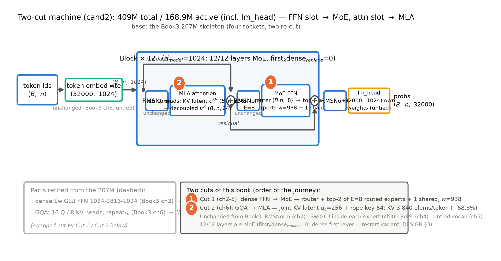

# 导览：在好骨架上动两刀

> 本章无实验、无数值引注——409M、3,840、−68.8% 这些硬数字都会在后续章节带证据等级重新登场，此处只当路标（图 0.1 复现命令见该图图注）。带着一个问题读：**同一副骨架、只动两个插槽，「容量」与「每个 token 的成本」怎么分开涨落？**后面十二章都是它的展开。

上一册收束时留了一句重话（Book3 第 11 章 11.4 节）：「下一册在这台机器上动两刀——**前馈插槽换成专家群（MoE）、注意力做更低秩的折叠（MLA）**——刀口还是插槽，判断力还是表 11.1 那张清单。」现在兑现这句承诺。资格也是上一册发的：你读得懂路由器的账（式 (9.1) 算过 $dE$ 那一行）、算得清 KV 的字节（式 (6.2) 现成）、也记得 Llama 3 的警告——被拒绝的路线难在哪里，恰是开场要回答的问题。本册把这三笔预备知识变成亲手走过的路：每刀从「解决什么问题」问起，经机构与难题，到真实旗舰上的长相，最后落回你的机器。

在八册地图上，这是第四站：Book1 教你机器是什么，Book2 教你机器怎么被喂饱，Book3 教你机器怎么被逐插槽升级到今天，本册教你机器怎么在「规模」与「效率」的两难里继续变大——不是把宽度层数再涨一截，而是让「装了多少知识」与「每个 token 付多少钱」变成两本分开记的账；两刀都是同一句时代判词的执行——主战场继续从「训练它」挪向「用它」，账本越分越细，零件就得跟着换。

> **最小背景栏**：本册只假设你完整读过 Book1-3——能徒手写出 2017 年 Transformer（注意力三角色、因果掩码、FFN 数据流——Book1 第 3-7 章）、从零造出并训过 GPT-2 124M（Book2 第 10-11 章）、并把它逐插槽改装成 LLaMA 式 207M（四插槽+untied+KV 账本+五步法+外推线——Book3 第 2-11 章）。除此之外自包含：混合专家（MoE，mixture of experts）与多头潜在注意力（MLA，multi-head latent attention）都会先教到「你能凭书稿画出它」再投入使用。

## 0.1 读完这本书，你会拥有什么

先说清目的地。合上这本书时，你会有三样东西，外加一样说不成「东西」的东西。

**第一，一台在 207M 骨架上动过两刀的 409M 两刀机，外加一份可重启的大项目设计文档。**注意「两刀」二字：底座就是你 Book3 定版的 207M 机器——残差河、Block 拓扑、RMSNorm、RoPE、untied 词表一寸不动；第 2-6 章把前馈插槽换成专家群、把注意力插槽换成 MLA，第 9 章把两件新零件 import 进同一台整机——**两刀改装史直接写在 import 语句里**：RMSNorm 与 RoPE 来自 Book3 的章节，MoE 与 MLA 来自本册的章节。参数逐位对上 409,115,648 个，点得起火、训得动曲线。而全量长训本身按作者决策不在本机执行（0.6 节详说）——随机器交付的还有一份「重启即可执行」的设计文档，凭它在高算力机器上直接点火。

**第二，MoE 与 MLA 的选型与成本判断力。**两件都是当代旗舰的标配——2025 年的旗舰几乎无一例外装着专家群与或深或浅的 KV 折叠。每一件都走完同一条链——解决什么问题、机构怎么搭、训练难在哪、代价与验证、你在笔记本上跑消融看到什么。读完你能回答面试式的问题：下一台机器，这两个插槽装不装、装哪种取值？

**第三，三本新账。**总参数/激活参数（active parameters）双口径账——「47B 参数、13B 激活」这类说法为何成立、引别人的 B 数前先判它的口径；KV 元素账——Book3 第 6 章 KV 账本的续本，记账对象从「头份数×头维」换成「箱子容量」；预算账——Chinchilla 做底数、本机实测秒数做外推，写进设计文档的重启预算表。三本账章章都要记，合上书后是你读旗舰发布新闻的解毒剂。

还有一样是心智。半年后公式细节多半忘了，画面会留下——「容量与通行费分开记」「KV 从砍份数到砍每份的大小」「均衡手段从损失函数搬进路由机制」。每章小结都会回答同一个问题：**如果只允许你记住一件事，是什么？**

## 0.2 卷间契约：从 Book3 出发

册与册之间立契约：上一册交出什么、本册新增什么、改什么。表 0.1 是本册与前三册的完整契约——迷路时回来看一眼。

| 契约栏 | 明细 | 地址 |
|---|---|---|
| **已知基础**（三册已教，直接指回、不再重教） | Transformer 原典：注意力三角色/因果掩码/FFN 数据流/参数账本 | Book1 第 3-7 章 |
| | GPT-2 底座与训练五件套 | Book2 第 10 章 |
| | 工程账本（认病：spike 与梯度尺度诊断） | Book2 第 9 章 |
| | Scaling Laws 与 Chinchilla 处方（第 9 章预算底数） | Book2 第 8 章 |
| | RMSNorm（不动件） | Book3 第 2 章 |
| | SwiGLU（不动件——它将住进每个专家内部） | Book3 第 3 章 |
| | RoPE 机制（第 6 章解耦论证的前提） | Book3 第 4 章 |
| | untied 与词表（激活参数单/双份口径的开关） | Book3 第 5 章 |
| | KV 账本与 GQA | Book3 第 6 章 |
| | 外推工程线 PI/NTK/YaRN | Book3 第 7 章 |
| | 组装学（插槽世界观） | Book3 第 8 章 |
| | config 逆向五步法 | Book3 第 9 章 |
| | 207M 整机与训练配方 | Book3 第 10 章 |
| **本册新增** | 效率悖论与三口径账本 | 第 1 章 |
| | MoE 全链：机构→难题→Mixtral→DeepSeekMoE | 第 2-5 章 |
| | MLA：KV 低秩压缩/解耦 RoPE/权重吸收 | 第 6 章 |
| | 训练侧低精度（FP8/MXFP4）与稳定化组件（QK-Norm/Muon 系） | 第 7 章 |
| | 多 token 预测（MTP，multi-token prediction） | 第 8 章 |
| | DSV2→V3 整机演进账+两刀整合（大项目） | 第 9 章 |
| | 旗舰拆解实战：gpt-oss 精拆+旗舰速览表 | 第 10 章 |
| | LatentMoE 支线 | 第 11 章 |
| **架构修改**（两刀，逐一动刀） | 第一刀：dense FFN（SwiGLU 1024-2816-1024）→ MoE（8 路由专家 top-2+1 共享，专家宽 938；12/12 层全 MoE——首层稠密留作重启变体，第 9 章设计文档 §3） | 第 2-5 章 |
| | 第二刀：GQA（16Q/8KV）→ MLA（KV 联合压缩 $d_c$=256+解耦位置键 64） | 第 6 章 |
| | 不动件：归一化与位置两格承 Book3（RoPE 机制不变，第二刀只改施加范围）；残差河与 Block 拓扑零改动 | — |

表 0.1 卷间契约三栏（自排）

三栏各有一句话。已知基础=**本册不重教**，遇到 GQA、RoPE、五步法直接指回；新增一栏是正文主体。修改一栏是三册以来最克制的一次：Book3 动了四格加一刀，本册只动两格——**归一化与位置两格原样承 Book3，前馈与注意力两格换件**——这也是旗舰的真实改法：第 4 章 Mixtral 的官方证词（与 Mistral 7B 同架构，唯一区别是每层由 8 个前馈块组成）、第 9 章 DeepSeek-V2/V3 的逐字段演进，动的正是这两格。两刀的先后照构造的逻辑：前馈机构独立、拔了就换，先动；注意力与 KV 账本互锁，续完账再动。

## 0.3 先看一眼我们要造的机器

出发前先看目的地。图 0.1 是本册终态机器的整机粗图，沿用 Book3 图 0.1 的「插座图」图式——上一册换好的四件里，本册再动两件：橙色实心圆 1、2 标出刀口。

图 0.1 本册终态机器（409M 两刀机）整机粗图：一条 $(B,n,1024)$ 的恒宽数据河穿过 12 层 Block；橙色实心圆 1/2 为两处刀口（1=前馈格→MoE，第 2-5 章；2=注意力格→MLA，第 6 章）；底部虚影=从 207M 换下的 dense FFN 与 GQA。自绘示意级——几何为本册两刀 config 定版主臂（$d$=1024、$L$=12、$h$=16、$V$=32000 untied；MoE=$E$=8/top-2/共享 1/专家宽 938，12/12 层全 MoE；MLA=$d_c$=256+解耦 64），与 Book3 图 0.1 的四插座图式对照成篇；组件细节见第 2/6 章逐格拆开。复现：`python [`code/ch00/make_fig0.py`](code/ch00/make_fig0.py)（秒级）

沿数据河走一遍，把两处刀口的位置记熟——第 2-6 章的每一刀都会回到这张图前报到：

- **前馈格换了供职方式（第一刀，图中央右侧）**。原来那颗 dense SwiGLU（1024-2816-1024）每层整装上阵，换成一个 MoE 块：路由器（router）对每个 token 的隐状态打分，形状 $(B\cdot n,\,8)$；top-2 从 8 个路由专家里选中 2 个、按门控权重加权合并；每个专家是宽 938 的 SwiGLU——SwiGLU 没有退役，它住进了每个专家内部；外加 1 个共享专家（shared expert）每 token 必算，12 层全部走 MoE（首层稠密机构定版不启用，留作重启变体）。一刀下去，总参数涨到 409M、每个 token 实际激活约 168.9M（含 lm_head 的本册口径）——「容量」与「通行费」第一次在你的机器上分开。
- **注意力格换了记账方式（第二刀，图中央左侧）**。16 个查询头共享 8 组 KV 的 GQA 退役，换成 MLA：K 与 V 不再各自物化，先一起压进一个 256 维的小箱子 $\boldsymbol{c}^{KV}$（形状 $(B,n,256)$）；位置信息拎在一条 64 维的共享键 $\boldsymbol{k}^R$（$(B,n,64)$）手上、不进箱子；每 token 的 KV 账从 GQA 的 12,288 个元素降到 3,840 个（−68.8%）。Book3 第 6 章砍的是「每 token 记几份」，这一刀砍的是「每份本身有多大」——账还是同一本，记账对象换了。

除两处刀口外，其余一切原封不动——两颗 RMSNorm、RoPE、untied 出入口、残差河与 Block 拓扑。造机姿势与 Book3 一脉相承：不是重造，还是改装——而且这次每刀背后都站着一代旗舰的实证。

## 0.4 旅程地图：四段

整册书是一条旅程，分四段。迷路时回到这张地图：

| 段 | 章 | 我们在做什么 | 一句话 |
|---|---|---|---|
| 为什么 | 第 1 章 | 效率悖论：三口径账本立式+年代样本自算对拍（F14 开场） | 参数涨、单 token 成本降，如何同时成立 |
| 换前馈（第一刀） | 第 2-5 章 | 机构（路由/top-k/容量）→难题（负载/不稳定/损失税）→Mixtral 实证→DeepSeekMoE 三连 | 把一个大车间拆成一群小专家加一名调度员 |
| 换注意力与补件（第二刀） | 第 6-8 章 | MLA 数学全链→训练侧低精度与稳定化处方→MTP | KV 装进小箱子；训练侧的处方笺与第二目标 |
| 拆机与整合 | 第 9-12 章 | DSV2→V3 演进账+两刀整合（大项目）→gpt-oss 精拆与旗舰速览→LatentMoE 支线→收束 | 拆旗舰=检验本册全部组件 |

注意这段路线的用意：**先补件、后拆机**。前八站把两刀的零件备齐——机构、难题与解法、低精度与稳定化、第二训练目标；最后四站才开拆真实旗舰。次序为什么必须这样？因为拆旗舰的每个组件都应能指回「我们在第 N 章亲手写过它的 mini 版」；拆机不是罗列字段，是逐件验货，没造过零件的人验货只能沦为抄参数。前八站内部同样是构造的逻辑：先懂机构（第 2 章）才见得到训练难题（第 3 章），难题的两代解法接续到场（第 4-5 章）；第二刀与 KV 账本互锁，放在第一刀之后（第 6 章）；低精度与 MTP 是训练侧补件（第 7-8 章）。每章开头的「从全书到这里」就是地图定位点。

## 0.5 三条贯穿线索

旅程里有三条线。盯住它们，十三章会从「十三章的文章」读成「一个故事」。

**一条代码线。**底座是 Book3 定版的组件库与 207M 整机；本册先立组件库正身（MoE 块与 MLA 的参考实现，已与 transformers 5.18.0 官方实现结构对拍），第 2/5/6 章各交付一件教学重写件——每件都过「与正身逐位一致」的 CPU 对拍；第 9 章的整机把 Book3 的 RMSNorm/RoPE 与本册的 MoE/MLA 一起 import 进来，每一处来路都可追溯。依赖永远单向，旅程停在任何一站，你手里都是一台当下完整、能跑的机器——从 207M 换装到 409M 两刀机，代码史与改装史是同一段历史。

**一条伏笔线。**前三册离场时留下一串欠账：本册接走十笔——F 账五笔（F2/F13/F14/F16/F18）、N 账一笔（N5）、B3 账四笔（B3-2/5/8/9），另有几笔不在本册地界——表 0.2 全量展示，防迷路。本册还要埋七笔新钩（B4-1~B4-7，其一为设计文档内置的文档锚），沿用登记表纪律：显式地址、最小披露、不硬造。

| # | 钩子（一句话） | 本册动作 | 状态 / 后续去向 |
|---|---|---|---|
| F2 | 自回归串行：因果掩码的另一面 | 第 8 章回收训练侧半句（MTP：训练目标转身成为推理资产） | 推理侧半句 → Book6 第 1/10 章（与 B4-4 合交货） |
| F13 | 文本之外的模态（Gemma3 出厂带视觉塔） | 第 10 章 Gemma3 行 config 事实边界注记（只计文本栈参数） | 视觉侧与能力扩展 → Book5 第 10 章 |
| F14 | FFN 的两刀：换激活、换专家 | 第 1 章开场+第 2-5 章全链（机构→难题→两代实证） | 本册回收 |
| F16 | 头数与 $d_k$ 的账本：推理时代翻转 | 第 6 章开篇「账本变了」第三段续写 | 本册回收（与 B3-2 同句） |
| F18 | 低精度：从 GNMT 定点 8-bit 到今天 | 第 7 章回收训练侧半句（两张处方笺） | 推理侧半句 → Book6 第 11 章／Book8 第 8 章 |
| N5 | 低精度与训练稳定化的处方 | 第 7 章主场（Book2 认病，本册开药） | 本册回收 |
| B3-2 | KV 的下一刀：$h_{kv}\cdot d_k$ 低秩折叠 | 第 6 章开篇（与 F16 同句，一次回收双钩） | 本册回收 |
| B3-5 | config 逆向五步法的复用 | 第 10 章主场（gpt-oss 精拆+旗舰速览表） | 读厂商自报数字手册 → Book5 第 11 章（保留地址） |
| B3-8 | Llama 3 拒绝专家群的稳定性权衡 | 第 3 章开场（拒绝引语=证词+本机负载现场） | 本册回收 |
| B3-9 | Llama 4 的 MoE 化 config 事实 | 第 2 章首次展开机制 | 本册回收 |
| N6 | few-shot 的能力侧与系统侧 | 无本册落点 | → Book5 第 10 章／Book6 第 6 章 |
| B3-1/3/4/6/7 | KV 三股省法／后训练链／外推哲学分岔／重启锚／头维「净土」 | 无本册落点（地址 Book3 已登记） | → Book5／Book6 |
| B4（→Book5） | 注意力手术（窄窗与汇聚元）；线性与稀疏算子（MLA 开箱后的换算子战线）；2026 旗舰（LatentMoE 的发扬） | 第 6/10/11 章埋设 | Book5 第 2/6/7 章起 |
| B4（→Book6/8） | 起草-验证（MTP 的推理侧身份）；推理侧量化（F18 下半程执行句） | 第 7/8 章埋设 | Book6 第 10/11 章；Book8 第 8 章 |
| B4（→Book7/8） | MLA 引擎后端（箱子的读取落地）；分布式专家并行（专家铺卡的工程） | 第 2/6 章埋设 | Book7 第 9 章；Book8 第 6 章 |

表 0.2 伏笔台账预览（自排；F=Book1 埋设、N=Book2 埋设、B3=Book3 埋设、B4=本册将埋；B4 行用代称预告、机制见后续册——完整欠账框见各章末；**B4-7 为第 9 章设计文档内置的重启锚，属文档锚非叙事钩，不入本表**）

**三本账。**本册的账本从 Book3 的三本换血成新三本：参数账升级为总参/激活参双口径（第 1 章立式，「引别人的 B 数之前先自己算一遍账」是它的纪律）；KV 账续写并换记账单位（第 6 章，从 $2Lh_{kv}d_k$ 到 $(d_c+d_h^R)L$ 的元素口径）；预算账以 Chinchilla 为底数写进设计文档（第 9 章）。外加一笔小账：路由账——每个 token 进了哪几个门、专家们忙闲如何，第 3-5 章反复记。

## 0.6 这本书的纪律与约定

五条纪律，读之前说清楚。

**时间冻结在旗舰世代 2025。**本书只讲 2025 及以前的知识——DeepSeek 谱系（V2/V3）、Mixtral、gpt-oss、K2 的训练侧组件。后世的概念——把注意力算子本身换掉的那一族手术（线性注意力、稀疏注意力）、RLHF 与 DPO 这类后训练、FlashAttention、continuous batching、投机解码及一整套推理系统名词——是 Book5 及以后各册的主菜，在本册正文**一律不出现、不解释**，只允许在七处白名单位置（纪律说明、章末欠账框、预告句、实现对照框、案例章豁免、否定语境等）以「点名+去向」的方式露一面。三条边界特别条款：滑动窗口注意力（SWA）与 attention sink 在本册只作为 gpt-oss 与 Gemma 的 config 事实出现（第 10 章账本算例），机制与收益的唯一归属是 Book5 第 2 章；MTP 是本册正菜，但它在推理侧「起草被验证」的机制与收益账归 Book6 第 10 章；FP8/MXFP4 只讲训练侧，推理侧量化归 Book6 与 Book8。冻结点外的 2026 旗舰（Kimi K3 等）只在第 11 章留一句谱系注记。代价与收益和前三册相同：看不到最新版，看得清每个设计为何非如此不可。

**大项目暂缓声明。**第 9 章大项目（两刀整机整合）的全量长训不在本机执行——本册开工时的作者决策（2026-10-04）：本机只跑模块级实验与半小时级短训，不跑以「天」计的长训。交付四件套：整合代码（参数逐位 assert）、分钟级冒烟、一次整合短训、「重启即可执行」的设计文档/重启手册（Book3 `DESIGN-215M.md` 先例）。这是诚实制度的一部分：不假装跑过没跑的东西，但凭文档就能直接重启。

**四框一栏，各司其职。**借用框（工具当黑盒用，算法另拆）、实现对照框（HF transformers 5.18.0 等现代实现对照，非论文内容）、考据框（版本考古、引文勘误——调研期已抓过三处 ID 张冠李戴与一串讹传数字）、欠账框（通往后续册的钩子，每章至多两条）加每章开头的最小背景栏。框内是支线，主线永远在正文。

**每个数字都有出处等级。**官方论文＞官方技术报告＞config 逆向＞第三方复测＞厂商自报，从严到宽随行标注；本书实验数字全部来自本机真实运行（数值对拍一律 CPU fp32，计时与内存走 MPS 口径），命令附在各章「动手验证」。本册数字红线更密：张冠李戴的论文 ID、查无实据的加速倍数、口径不明的 B 数，正文逐个钉死。

**环境与先修。**先修只要 Book1-3；一台普通笔记本（Apple Silicon）可复现全部实验：模块实验分钟级、整机短训半小时级，一律分 fast/full 两档，计时实验独占窗口。模块消融一律单种子+判据预注册（判据先行、结果无论方向都如实报告；MPS bf16 不保证逐位重现，复现口径统一「趋势判据+JSON 存档」）——先立判据再跑实验，就没人能事后挑好看的数字。随书仓库零数据零权重：语料与权重一律运行时下载、缓存落本地 log 目录；对拍真权重按许可与 48GB 内存选定，选型过程本身是一轮 config 逆向练习（第 4 章演示）。

所以，回到开篇的问题：同一副骨架、只动两个插槽，容量与成本怎么分开涨落？答案分四步给出——先把账立式（第 1 章的三口径账本），再动第一刀（第 2-5 章），补上第二刀与训练侧的件（第 6-8 章），最后拆旗舰与整合清点（第 9-12 章）。两刀各有一个「为什么非动不可」的时代病根，但共用一个背景：模型越大、用的成本越高，而「装知识」与「用知识」从本册起是两笔账。

第一站从还一笔最年轻的欠账开始。Book1 第 6 章埋下「FFN 后续还会挨两刀」，Book3 第 3 章兑现了第一刀（换门控激活）并注明第二刀属本册。为什么把一个大前馈拆成一群小专家，反而又省又好？这笔账要从 2017 年一篇比 Transformer 还早五个月的论文算起。

现在，深呼吸。刀已磨好——第一刀，从账本开始。

---

*下一章：第 1 章 效率悖论——三本账分开记——总参数涨、单 token 成本降如何同时成立；从那篇比 Transformer 早五个月的论文算起，三口径账本立式，四枚年代样本自算对拍。*
