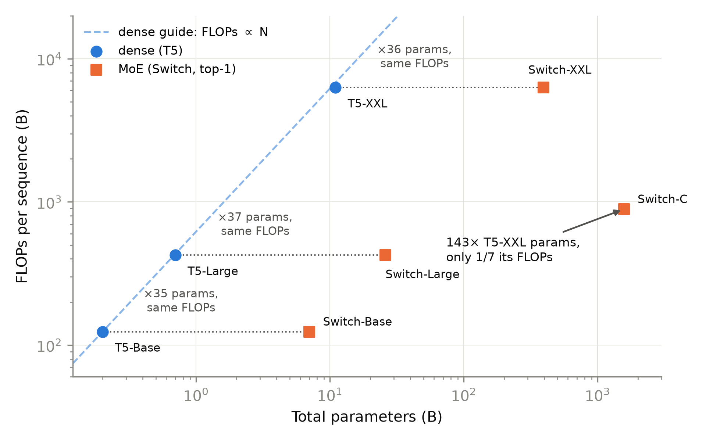

# 第 1 章 效率悖论——三本账分开记

## 1.0 开篇：从全书到这里

导览章合上时，旅程地图已经铺开：先补件、后拆机——第 2-5 章把前馈插槽换成专家群，第 6 章把注意力插槽做低秩折叠，第 7-8 章补训练侧的工程件，第 9-11 章才开拆旗舰整机；地图边角还挂着三条贯穿线索，其中一条叫「三本账」。但地图没有回答一件事：**凭什么敢这么改？**把一台好端端的稠密模型拆成「一堆专家、按 token 挑着用」，这个决定要有一本算得清的账撑腰——这一章就是那本账的立式现场。

本章要回答的问题只有一句话：**「总参数涨上去、单 token 成本降下来」这两件听上去矛盾的事，怎样才能同时成立？**这也是全书「为什么」一段里唯一的一章——后面十一章都在「怎么办」。我们把它拆成三步：先看三个年代样本如何把矛盾变成事实（1.1-1.2），再给「参数」与「成本」各立一本正式的账——总参数、激活参数、每 token FLOPs 三口径（1.3），然后亲手替四个年代的模型算账对拍（1.4），最后清点这笔买卖省什么、不省什么（1.5）。产出三样：一套三口径公式（式 (1.1)-(1.3)）、一张四样本参数账（表 1.3）、一份「省/不省」清单——它们是后面十一章里每次读到 MoE 模型都要掏出来用的工具。

本章结束时，「为什么动刀」有了算力层面的答案；「这台机器到底怎么搭」——路由器怎么打分、top-k 怎么选、装不下的 token 去哪儿——留给下一章。

> **最小背景栏**：本章默认你已读过 Book1 第 6 章的两本账（FFN 是参数与计算的双重大户；「参数多不等于算得慢，得看乘加次数」的计数口径）；Book2 第 8 章的训练算力账（口诀 $C\approx 6ND$——每参数每 token 六次运算，且该章的 $N$ **不含嵌入**，与本章参数账的「全含」口径不同，用前先对口径）；Book2 第 9 章的显存账（混合精度+Adam 下模型状态约 16 字节/参数）；Book3 第 5 章（untied 词表：输入 embedding 与输出 lm_head 是两份 $V\times d$ 矩阵）。双对数（log-log）坐标「等距=等倍数」的读图纪律见 Book2 第 8 章。符号约定沿用 Book3：残差流宽 $d$、层数 $L$、词表 $V$、查询头数 $h$、KV 头数 $h_{kv}$、头维 $d_k$。

## 1.1 一句埋了三册的话，到了兑现的时候

动刀之前，先把欠条原文取回来。Book1 讲 FFN 车间时埋过一句：

> 「FFN 后续还会挨两刀——先换激活、再连整体结构一起换，门控思想在 GLU 里已经冒头——账记在 Book3 与 Book4，此处只留一个地址，不展开机制。」【证据等级：Book1 第 6 章成稿直引】

Book3 兑现了第一刀：SwiGLU 换掉了激活，FFN 的三层车间结构原样保留。它的章末欠账框把第二刀的形状描述得很具体（原文照录）：

> **【欠账】** Book1 第 6 章埋下的「FFN 后续还会挨两刀」的第二刀：本章只换了门控激活，FFN 的**整体结构**原样保留——把车间拆成「路由 + 多个专家群」、按 token 挑专家来用、参数不再每次全上这一刀，属于规模与效率的主线。→ Book4 第 2-5 章
> 【证据等级：Book3 第 3 章成稿直引】

从现在起兑现第二刀——这句欠账的完整兑现要走上四章：第 2 章造机构（路由器、top-$k$ 与容量），第 3 章对付训练难题（负载与不稳定），第 4、5 章用 Mixtral 与 DeepSeekMoE 两代实证收口；本章先付它最前置的一笔：**这一刀在算力上为什么划算**。而「按 token 挑专家来用、参数不再每次全上」这句话里藏着一个需要先拆开的矛盾：从 Book2 的 scaling 账看，参数就是成本——$C\approx 6ND$，参数涨几倍、训练算力就涨几倍。**凭什么参数可以涨、成本可以不涨？**这个悖论不是修辞，它有一个 2017 年的预告片。

Transformer 原论文发布前近五个月，2017 年 1 月，Shazeer 等人发表《Outrageously Large Neural Networks: The Sparsely-Gated Mixture-of-Experts Layer》——稀疏门控混合专家层（Sparsely-Gated Mixture-of-Experts，MoE）比 Transformer 早出生，最初的宿主不是 Transformer 而是堆叠的 LSTM：MoE 层像夹心饼干一样插在两层 LSTM 之间【证据等级：官方论文 1701.06538 v1，2017-01-23 vs 1706.03762 v1，2017-06-12，两摘要页提交记录】。这篇论文在 100B 词的新闻语料上把专家数从 32 一路扫到 131,072，MoE 层最多做到 137B 参数——原文写得很清楚：「This corresponds to up to 137 billion parameters in the MoE layer」【证据等级：官方论文 1701.06538 v1 §5.2】——而摘要的总结是「greater than 1000x improvements in model capacity with only minor losses in computational efficiency」：**容量涨一千倍，计算效率只轻微受损**。更扎眼的是它跟当时最佳已发表模型的对照，把 Table 1 两行的账并排读（参数口径均为不含 embedding 与 softmax 层）：仓库 4,303M 对 151M（约 28 倍），每时间步前向乘加 8.9M 对 151M（约 1/17），困惑度反而更低（34.1 对 34.7）——原话是「Even the fastest of these models beats the best published result (when controlling for the number of training epochs), despite requiring only 6% of the computation.」【证据等级：官方论文 1701.06538 v1 §5.1 Table 1】

> **【考据框】**「6% 计算量打平最佳已发表」要对口径再引用：Table 1 的对手是**外部**的最佳已发表模型（Jozefowicz 2016），这是外部对照，不是等算力消融——「6%」是两家 ops/timestep 之比（8.9M/151M），训练设备与日程也完全不同（15h×16 K40 对 59h×32 K40）。论文自己做的**等算力**内部口径在别处：4096 专家模型比计算匹配的稠密基线困惑度低 24%（§5.1），65536 专家（68B 参数）低 39%（§5.2）。预告片很响，账要这么读才不冤枉它。

顺带把 Table 1 的训练时长也读满：同样 829M 词的语料、同样 10 个 epoch、同一代 K40，MoE 版花 $15\times16=240$ 卡时，最佳已发表花 $59\times32=1{,}888$ 卡时——**参数多 28 倍，训练成本反而只有对方的约 1/8，质量还更好**【证据等级：官方论文 1701.06538 v1 §5.1 Table 1，本书按卡时口径整理；非严格受控实验，量级可信】。参数与成本的绑定，在这张表上第一次被公开打破。

一千倍容量、二十分之一计算——这生意凭什么成立？机制拆开只有一句话，但它值一整节。

## 1.2 悖论的机制：容量住在参数里，成本住在激活里

先把 MoE 层的机器画出来。Book1 的 FFN 车间是「升维、弯折、降维」一条流水线，全体 token 排队走同一条线；MoE 层把它改成**并列的 $N_e$ 个小车间（专家，expert）加一名调度员（路由器，router）**。每个 token 进来，调度员先打分：残差流 $(B,n,d)$ 展平成 $(B\cdot n,\,d)$，与打分矩阵 $W_g$ 的转置相乘（$W_g\in\mathbb{R}^{N_e\times d}$，即一个 $d\to N_e$ 线性层的权重，checkpoint 里 `gate.weight` 存的正是这个形状）——$(B\cdot n,\,d)\cdot(d,\,N_e)\to(B\cdot n,\,N_e)$，每一行是这一个 token 对全部 $N_e$ 个专家的偏好分；取每行前 $k$ 名（top-$k$），得到门控权重 $(B\cdot n,\,k)$；token 只进被选中的 $k$ 个专家，输出按门控权重加权求和。没被选中的专家，**这一步完全不参与计算**——它们的参数躺在原地，一次乘法都不做。（路由的完整机构——打分函数怎么选、噪声加不加、装不下的 token 去哪儿——是第 2 章的主菜，这里只需要「每 token 只点亮少数专家」这一个事实。）

这就是**条件计算**（conditional computation）：参数在，算不算由输入决定。于是「参数」和「计算量」从同一个数裂成两个：**参数是容量仓库**——知识装在 $N_e$ 个专家的权重里，装多少跟每个 token 用多少无关；**激活是每 token 通行费**——一个 token 实际参与乘加的那部分参数（$k$ 个专家加注意力加输出头），才是它真正付的成本。稠密模型里仓库和通行费永远相等（每个参数每个 token 都要用），所以 Book2 的 scaling 账里「参数=成本」天经地义；MoE 把这道等号拆开，悖论就有了容身之处。

你可能会问：把 FFN 拆成 8 份、每 token 挑 2 份，如果每份跟原来的 FFN 一样宽，通行费反而从一份涨成两份——「拆」这个动作本身并不省钱。对，省钱不来自拆，来自拆开后获得的两个自由度：**每份可以做窄**（专家宽度 $w$ 独立设定），**挑的份数可以做少**（$k$ 可以小到 1）。Switch 系列取 $k{=}1$ 且专家形状与原 FFN 相同——每 token 的前馈计算量与稠密版一分不差，仓库却扩了上百倍，这就是图 1.1 里那三对「同 FLOPs」能配平的原因；Mixtral 取 $k{=}2$、每份宽度另定。通行费与仓库大小的**解耦自由度**，才是条件计算的本质——省不省、省多少，全看你怎么花这两个自由度，账要一单一单算。

两个年代样本给出定量版本。GShard（2020，MoE 第一次搬进 Transformer）在图 1 的说明里写得很直白：「Increasing the model size from 37.5B to 600B (16x), results in computation cost increase from 6 to 22 years (3.6x).」——模型从 37.5B 涨到 600B（16 倍），训练成本只从 6 涨到 22 TPU v3 核年（3.6 倍）【证据等级：官方论文 2006.16668 v1 §4 图 1】。这台 600B 模型用 2048 块 TPU v3 训了 4 天（合计 22.4 核年），翻译质量（BLEU 44.3）同时还是全家最好的；同数据、同 2048 核上训出来的稠密对照组 T(96L)（96 层、2.3B）花了约 235.5 核年、BLEU 只有 36.9——同硬件预算与数据下，稀疏路线成本与质量双赢【证据等级：官方论文 2006.16668 v1 §4.3-§4.5 Table 1/3】。按本册的引用纪律要补一句：这**不是**等 FLOPs 对照（T(96L) 只有 2.3B 参数），正确读法是「同设备预算下」，别把它转写成「等算力下完胜」。（考据一句：正文 Table 1 里 37.5B 那台记 37B，图 1 说明记 37.5B——论文内部的小不一致，本书裁定取 Table 1 的 37B 为准；上引是图注原文，逐字含 37.5B，引用时按此口径注明。）

Switch Transformers（2021）把这笔账做成了教科书表格：它有一组**每 token FLOPs 严格相等**的稠密/稀疏对照（Table 9，同一序列长度口径下的每序列前向 FLOPs）。把七台机器放到「总参数 × 每序列计算量」的双对数图上（图 1.1），悖论的形状一目了然：稠密 T5 三台全贴在对角参考线上——参数涨多少、计算涨多少，这是 Book2 scaling 的世界；三台同名的 Switch 全部水平右移——**计算量一分没涨，参数涨了一个数量级**（Switch-Base 对 T5-Base 是 35 倍参数、同 FLOPs，Switch-Large 37 倍、Switch-XXL 36 倍）；而极点 Switch-C 拥有 T5-XXL 的 143 倍参数（1571B 对 11B），每序列计算量只有它的 1/7（890B 对 6.3T FLOPs）【证据等级：官方论文 2101.03961 v3 §5.6 Table 9，本书整理】。



图 1.1 效率悖论散点：总参数 vs 每序列前向 FLOPs（双对数）。蓝色圆点=稠密 T5（贴在 FLOPs∝N 的对角线上），橙色方点=MoE 的 Switch 系列（同 FLOPs 水平右移）；Switch-C 以 143 倍于 T5-XXL 的参数只付其 1/7 的计算量。数据源：Switch Transformers Table 9（官方论文），本书绘制。

现在把直觉收拢成一句话：**MoE 用「参数可以很多、每 token 只激活一小块」把容量与成本拆进两本账。**用 Book2 的语言复述一遍这个悖论：scaling 律说损失随参数规模降、参数随预算涨，于是「变大」与「变贵」绑死；MoE 在「参数」与「每 token 计算量」之间撬开一道缝，让容量蹭着算力的地皮往上盖。不过有一件事这节没回答、也不能在这里回答：**买得起不等于买得好**——仓库大了，货真的更好吗？Shazeer 的等算力口径（低 24%/39%）说是，GShard/Switch 的质量-成本双赢曲线也说是，但机制上的完整证据（专家到底学到了什么、粗细怎么配、负载怎么摆平）在第 4、5 章才展开。眼下先把账立稳：「一小块」到底是多大、账怎么记才不被人糊弄——这是下一节的事，也是全书此后每次读 MoE 模型的基本功。

## 1.3 三本账立式：总参、激活参与每 token FLOPs

直觉有了画面，现在把它写成精确的公式。设一台 decoder-only 的 MoE 模型：$L$ 层，每层先是注意力（参数记作 $A$，GQA 矩形记法承 Book3 第 6 章），随后是 MoE 槽——$N_e$ 个路由专家加 $K_s$ 个共享专家，每个专家是一个宽 $w$ 的前馈车间（SwiGLU 三矩阵，矩阵数记 $n_{\mathrm{mat}}=3$；ReLU 时代的专家 $n_{\mathrm{mat}}=2$），外加一个 $d\times N_e$ 的路由门。词表 $V$、untied（Book3 第 5 章：出入口两份）。

**账本一，总参数**（total parameters）——仓库的货架总数：

$$
N \;=\; L\,\Big(\,A \;+\; \underbrace{(N_e + K_s)\, n_{\mathrm{mat}}\, d\, w}_{\text{专家群：全部货架}} \;+\; \underbrace{N_e\, d}_{\text{路由门}}\,\Big) \;+\; 2\,V d
\tag{1.1}
$$

用人话说：总参就是「每层的注意力+全部专家+一个小小的打分矩阵」乘层数，再加上出入口两份词表——**不管 token 用不用，全部计入**。（此式取「每层都是 MoE」的最简情形；实际模型常有首几层保持稠密的排布，算例里按 config 逐层处理即可，式子只会更不会少。记号界碑：式 (1.1)-(1.3) 语境里的 $N$ 专指总参数；自第 2 章起 $N$ 固定让位给展平 token 数 $B\cdot n$——后文形状 $(N,\,E)$ 里的 $N$ 是 token 数，不是参数量。）

**账本二，激活参数**（active parameters）——每 token 的通行费：

$$
N_{\mathrm{act}} \;=\; L\,\Big(\,A \;+\; (k + K_s)\, n_{\mathrm{mat}}\, d\, w \;+\; N_e\, d\,\Big) \;+\; V d
\tag{1.2}
$$

用人话说：把「全部货架」换成「每个 token 真正搬动的 $k$ 份路由专家+常驻的 $K_s$ 份共享专家」，注意力、路由门照付，词表只算出口的 lm_head 一份。为什么词表只算一份还有讲究：输出侧的 lm_head 是一次真刀真枪的 $(B\cdot n,\,d)\cdot(d,\,V)\to(B\cdot n,\,V)$ 大矩阵乘——每个 token 都要对着整个词表打分，必须付钱；输入侧的 embedding 只是按行号取一行向量（查表），一次乘法都没有。这里必须立一条本册口径：**「激活参数」=含 lm_head、不含输入 embedding lookup**；对外引用时**双份口径（再加 $Vd$）并列报数**。为什么较真到这个地步，本节末尾有一个跨厂商的活例子。

**账本三，每 token FLOPs**——通行费换算成算术：

$$
\text{FLOPs/token} \;\approx\; 2\,N_{\mathrm{act}}
\tag{1.3}
$$

用人话说：每个被点亮的参数干一次乘法加一次加法（Book1 第 6 章的乘加口径）；这是**前向**账。训练账在 Book2 第 8 章的口诀里已经埋好——$C\approx 6ND$ 的 6 = 前向 2 + 反向 4，把 $N$ 换成 $N_{\mathrm{act}}$ 就得到 MoE 的训练算力：$C\approx 6\,N_{\mathrm{act}}D$。两个口径都未计注意力的 scores/softmax 项（随序列长度平方长的那部分，Book1 第 6 章「账本二」处理过），长序列算例要另记。单位纪律顺带钉死：参数的单位是**权重元素个数**（不是字节——字节数还要乘精度宽度，1.5 节用得上），FLOPs 的口径是**乘加各计一**。

三本账的符号、形状与 config 字段对照收进表 1.1——它是本章之后全书的随身工具，第 4、9、10 章拆真模型时逐字段用它。

表 1.1 三口径账本符号表（式 (1.1)-(1.3) 的符号与形状；config 字段以 Mixtral 为例）

| 符号 | 含义 | 形状 / 取值 | config 字段（Mixtral 8x7B 例） |
|---|---|---|---|
| $L$ / $d$ / $V$ | 层数 / 残差流宽 / 词表大小 | 标量 | 32 / 4096 / 32000 |
| $A$ | 每层注意力参数 | $W_q,W_o\in\mathbb{R}^{d\times h d_k}$，$W_k,W_v\in\mathbb{R}^{d\times h_{kv} d_k}$ 元素总数 | $h{=}32,h_{kv}{=}8,d_k{=}128$ |
| $N_e$ | 每层路由专家份数（自第 2 章起全书统一记 $E$，与代码变量同名） | 标量 | num_local_experts=8 |
| $k$ | 每 token 选中的专家数 | 标量（top-$k$） | num_experts_per_tok=2 |
| $w$ | 单个专家的中间宽 | 标量 | intermediate_size=14336（每专家） |
| $K_s$ | 共享专家份数（每 token 常驻） | 标量 | 无此字段（=0） |
| $n_{\mathrm{mat}}$ | 每专家矩阵数 | 2（ReLU）/ 3（SwiGLU） | hidden_act=silu → 3 |
| $W_g$ | 路由门打分矩阵（$d\to N_e$ 线性层权重，打分乘其转置） | $(N_e,\,d)$ | gate 键 |
| — | router 打分 / top-$k$ 门控 | $(B\cdot n,\,N_e)$ / $(B\cdot n,\,k)$ | — |
| $N$ / $N_{\mathrm{act}}$ | 总参 / 激活参（$N$ 限账本语境；第 2 章起 $N$ 记展平 token 数 $B\cdot n$） | 标量（参数=权重元素数） | — |

三本账立好了，先在自家机器上验一遍再出门对账。取第 2 章会反复使用的那台 d=512 小机器（6 层、$V{=}8192$、GQA）：稠密版 $d_{ff}=1408$，MoE 版 $N_e{=}8$、$k{=}2$、$w{=}704$。按式 (1.1)/(1.2) 手算（[`code/ch01/account.py`](code/ch01/account.py) 的 `check_mini`，逐位对上探针 B 实机的参数量）：

- 总参：稠密 26,089,984，MoE 65,042,944——仓库扩到 2.49 倍；
- 激活参（单份）：稠密 21,895,680，MoE 不含路由门恰好也是 21,895,680——**逐位相同**，因为两个 704 宽的窄专家拼起来正好等于一个 1408 宽的宽车间：把 $(B\cdot n,\,d)$ 投到两个 $(B\cdot n,\,704)$ 再拼回，与一次投到 $(B\cdot n,\,1408)$ 的参数量分毫不差，$2\times 3\cdot 512\cdot 704 = 3\cdot 512\cdot 1408 = 2{,}162{,}688$；计入路由门（$8\times512=4{,}096$）则 MoE 多付 0.1%；
- 顺带一笔：等总参的稠密对照臂按 $d_{ff}=N_e\cdot w=5632$ 配，总参 65,018,368，与 MoE 恰差 24,576——正是路由门 $N_e\cdot d$ 的 6 层累计。

【证据等级：本书实验（CPU，2026-10；公式手算与实机参数量逐位对账）】这两个配臂口径——「每 token 计算量打平」（等激活）与「仓库大小打平」（等总参）——值得多看一眼，它们是本册一切 MoE 消融的两条公平线：只报等激活会被质问「你多花了 2.5 倍参数买来的优势吧」，只报等总参又会被质问「你每个 token 算得少，占的是计算的便宜」——两条线都摆出来，MoE 到底赚在哪一侧才说得清。第 5 章的四臂消融会逐字用这两条配臂公式，那里见分晓。

最后是这一节的节眼：**引别人的 B 数之前，先自己算一遍账。**「激活参数」这个词没有国际标准，而各家旗舰连「算不算输入 embedding」都不一致。表 1.2 是四个官方口径与本书复算的对照——同一个词，gpt-oss 与 DeepSeek 全系（V2-Lite/V3）数的是单份，Qwen3-30B-A3B 数的是双份；一个嵌入的差额是 0.2-0.9B，够把任何「A 比 B 省 10%」的断言翻面。

表 1.2 跨厂商「激活参数」口径审计（官方口径 vs 本书实算）

| 模型 | 官方激活口径 | 本书实算·单份 | 本书实算·双份 | 官方更像 |
|---|---|---|---|---|
| gpt-oss-20b | 3.6B | **3.608B** | 4.187B | 单份【证据等级：官方论文 2508.10925 v1 Table 1 精确吻合+本书复算】 |
| DeepSeek-V2-Lite | 2.4B | **2.451B** | 2.66B | 单份【证据等级：官方 model card（厂商自报，2.4B 为截位）+本书复算（config+分片头逐名，2026-10）】 |
| Qwen3-30B-A3B | 3.3B | 3.04B | **3.35B** | 双份【证据等级：官方 model card（厂商自报）+本书复算（config，2026-10）】 |
| DeepSeek-V3 | 37B（精确 36.6B） | **36.63B** | 37.55B | 单份【证据等级：官方 README_WEIGHTS 精确口径 36.6B（含 0.9B 输出头）+本书复算（P8 销项，分片头逐名对拍）；总参实算 671.03B=官方 671B——本书第一版总账曾漏 MLA 上投影、误判双份并错算 670.00B，第 9 章 9.2 节逐名对拍勘误，错账留作教学素材】 |

口径审计不是抬杠，是防止把「3.6B 对 3.3B」直接读成「gpt-oss 更省」——判完口径再比数，是本册的纪律。

## 1.4 四个年代的样本，四遍自己的账

上一节在小机器上验了公式，这一节带着同一套公式去算四个年代的真旗舰——从 2020 到 2025，每枚样本自己按公开字段算一遍，再跟官方口径对拍。这四遍手算全部在 [`code/ch01/account.py`](code/ch01/account.py) 里（`gshard`/`switch_c`/`mixtral`/`gptoss_20b` 四个函数，CPU 秒级，`--out-name` 防覆写），结果汇成表 1.3。

先拿 config 级的 Mixtral 把手算链完整走一遍，读者可以拿计算器跟着验。注意力每层：$A=2\cdot 4096\cdot(32\cdot128)+2\cdot 4096\cdot(8\cdot128)=33{,}554{,}432+8{,}388{,}608=41{,}943{,}040$（q/o 全宽、k/v 按 8 个 KV 头缩——GQA 记法承 Book3 第 6 章）。单个专家：$3\cdot 4096\cdot 14336=176{,}160{,}768$（SwiGLU 三矩阵）。MoE 槽：$8\times 176{,}160{,}768+8\times 4096=1{,}409{,}318{,}912$。代入式 (1.1)：$N=32\times(41{,}943{,}040+1{,}409{,}318{,}912+\text{归一化 }8{,}192)+2\times 32000\times 4096+4096=46{,}702{,}792{,}704$。代入式 (1.2)：$N_{\mathrm{act}}=32\times(41{,}943{,}040+2\times 176{,}160{,}768+32{,}768+8{,}192)+32000\times 4096+4096=12{,}748{,}853{,}248$，双份再加一个 $Vd=131{,}072{,}000$ 得 12,879,925,248。一条链算到底，没有一步需要估计或猜测——这就是 config 级披露的意义。

表 1.3 四样本参数账：自算 vs 官方（激活参为本册单份/双份口径并列）

| 样本（披露等级） | 本书自算 | 官方口径 | 判定 |
|---|---|---|---|
| GShard MoE(2048E,36L)，2020（论文级） | 专家账 $36{,}684\times 2\cdot 1024\cdot 8192=615.5$B；加注意力/嵌入估 $\sim$5B $\approx 620$B | 600B（摘要「beyond 600 billion」，取整）【证据等级：官方论文 2006.16668 v1 Table 1+附录 A.2】 | 差 +3.4%——论文无公开 config，取整与未披露细节并存，登记口径差【证据等级：本书复算（公式，2026-10）】 |
| Switch-C，2021（论文级） | 反解 MoE 槽位 $=1571\mathrm{B}/(2048\times 2\cdot 2080\cdot 6144)=30$；正算 $30\times 2048\times 2\cdot 2080\cdot 6144+$ 注意力/嵌入 $=1{,}571.0$B | 1571B【证据等级：官方论文 2101.03961 v3 Table 9】 | 咬合（$<0.1\%$）——但槽位数是**反解**的：enc-dec 骨架的逐层排布论文未给全账【证据等级：本书复算（公式，2026-10）】 |
| Mixtral 8x7B，2024（config 级） | 总参 **46,702,792,704**；激活单份 **12,748,853,248** / 双份 **12,879,925,248** | 论文 47B/13B（取整）；HF 模型卡 46.7B/12.9B（12.9≈双份口径）【证据等级：官方论文 2401.04088 v1 摘要；config 逆向】 | 逐位级吻合；专家占总参 96.6%（单专家 $3\cdot 4096\cdot 14336=176{,}160{,}768$）【证据等级：本书复算（config 公式，2026-10）】 |
| gpt-oss-20b，2025（config+权重审计级） | 总参 **20,914,757,184**（=HF API=分片头三方逐位）；激活单份 **3,608,307,264** / 双份 4,187,440,704 | Table 1：20.91B / Active 3.61B【证据等级：官方论文 2508.10925 v1 Table 1】 | 逐位吻合；官方激活=**单份**口径（表 1.2 的第一行就是这么发现的）【证据等级：本书复算（config 公式+权重索引审计，2026-10）】 |

四行读下来有一条清晰的弧线：**披露越全，账算得越平。**2020 年的 GShard 只在正文与附录里给了维度（$d{=}1024$、专家隐层 8192）与专家总数（36,684），连「600B」本身都是取整口径——没有 config 让你逐字段核对，自算对官方差 3.4%，只能如实登记差异、不硬凑（这类「论文级」账目的悬案登记，Book3 第 9 章立过制度）；2021 年的 Switch-C 靠官方总数反解出 30 个 MoE 槽位，正算能咬合到千分之一，但槽位数终究是**反解**的——编码器-解码器骨架的逐层排布论文没给全账；2024 年的 Mixtral 有 checkpoint config，每个字段都能喂进式 (1.1)，总参与激活参双双算到逐位；2025 年的 gpt-oss 连权重分片头部都可审计，手算、HF API、分片头三方逐位对平。顺带一提，这两次「config 级」复算正是 Book3 第 9 章 config 逆向五步法里「算账对拍」一步的日用——那套程序在第 4 章（Mixtral 实习）与第 10 章（gpt-oss 主场）还要各演一整章。

账算平了，三口径的分工也该收拢：gpt-oss-20b 的仓库（$N$）是 20.91B，每个 token 的通行费（$N_{\mathrm{act}}$，单份）只有 3.61B——仓库是通行费的 5.8 倍；Mixtral 是 46.7B 对 12.7B，3.7 倍；而且两台机器里专家都是绝对大头——Mixtral 专家占总参 96.6%，gpt-oss 的 MLP 家族（专家+偏置+路由门）占 19.12B/20.91B≈91.4%【证据等级：本书复算（config 公式，2026-10）】。换算成式 (1.3) 的算术，Mixtral 每个 token 约 $2\times 12.75\mathrm{B}\approx 25.5$ GFLOPs，gpt-oss 约 7.2 GFLOPs【证据等级：本书实验（CPU，2026-10）】。参数与计算，从此是两本各自独立的账——这也回答了为什么四枚样本里 2024 年之后的占一半：MoE 旗舰的「参数账」里几乎全是专家，读懂专家就读懂了整机的大头，这正是后面几章要一块块拆开的东西。

## 1.5 MoE 省什么、不省什么

三本账在手，现在可以诚实地清点这笔买卖了——它省的东西很值钱，不省的东西也很扎眼。

**省的：每 token 的计算量，只随激活参走。**前向 FLOPs $\approx 2N_{\mathrm{act}}$（式 (1.3)），训练总算力 $\approx 6N_{\mathrm{act}}D$——仓库扩到多大都不进这两条式子。这就是 1.2 节那三对「同 FLOPs」对照的算力侧读数：同 FLOPs 的 Switch 比 T5 多出 35 倍参数，等价于**同样的计算预算买了一个大得多的仓库**。

**不省的第一笔：显存照付全款。**权重必须全部驻在内存里才能被「挑」——bf16 下每参数 2 字节，Mixtral 的 46.70B 仓库要 93.4GB，一块消费级显卡连零头都装不下【证据等级：本书复算（config，2026-10）】。训练时更狠：Book2 第 9 章的显存账——混合精度+Adam 的模型状态约 16 字节/参数——**跟着总参 $N$ 走，不跟激活参走**。照这个口径，Mixtral 光模型状态就要 $46.7\mathrm{B}\times 16\approx 747$ GB 训练显存，与它「12.7B 激活」的宣传口径完全是两个世界：**通行费省的是算力，仓储费省不了内存**。MoE 的「大仓库」在训练的每一步都在交仓储费。这也解释了为什么 1.2 节 GShard 的参数涨了 16 倍、成本毕竟还涨了 3.6 倍、没能做到纹丝不动：通信、显存与调度的开销都在跟着仓库长，只是被「每 token 计算量不变」压成了次线性。

**不省的第二笔，甚至是新增的：路由与派发的开销。**调度员自己要干活：打分（$(B\cdot n,\,N_e)$ 的矩阵乘）、top-$k$ 选择，以及把 token 从「全体混在一起」的状态搬运到各自专家门口再搬回来（gather/scatter）。这笔账理论上是小头（路由门参数只占 $N_e d$），工程上却未必——我们在自己的三档机器上实测过，梯度汇成表 1.4：

表 1.4 本机三档派发开销梯度（朴素 Python 逐专家循环，MPS bf16 独占窗口；证据等级：本书实验）

| 档位（配臂口径随行标注） | dense | MoE | 慢几倍 |
|---|---|---|---|
| 26M 档（等激活：dense 26.1M vs MoE 总 65.0M/激活 26.1M） | 0.187 s/step | 0.434 s/step | 2.3× |
| 65M 档（等总参：dense 65.0M vs MoE 总 65.0M/激活 26.1M） | 0.282 s/step | 0.491 s/step | 1.74× |
| 207M 档（等总参：dense 207.1M vs 两刀机 207.1M/激活 101.5M（含 lm_head 口径，第 9 章表 9.2）；两刀机含 MLA，此档为混合口径、取梯度方向读） | 2.44 s/step | 3.514 s/step | 1.44× |

【证据等级：本书实验（MPS bf16，2026-10；探针 B/D/F 单进程实测）】两行等总参的读数值得盯一眼：**MoE 的激活参更少（要算的乘加更少），墙钟反而更慢**——1.74 倍与 1.44 倍。原因是我们的实现给每个专家单独发一次小矩阵乘：一次矩阵乘在 GPU 上是一次算子下发，下发有固定成本（启动、同步、数据搬运），稠密版一次大矩阵乘干完的活，MoE 版要发 8 次小矩阵乘再外加两趟 token 搬运（进专家门前 gather 一趟、出门 combine 一趟）——8 份小活的管理成本吃掉了理论收益，属于典型的 launch-bound（被启动开销卡住，而不是被算力卡住）。好消息是它随规模收敛（2.3×→1.74×→1.44×：模型越大、每次矩阵乘越大，固定成本占比越低），坏消息是教学档如实报慢。真实系统用「多机分片+融合算子」把这笔开销压回去——专家为什么天然可分片、怎么分，第 2 章末尾给一半答案，工程的那一半在后续册。

于是这笔买卖的完整条款是：**用「全款显存+路由通行税」，换「每 token 计算量不变的前提下，容量涨一个数量级」。**训练侧的三本账在这里闭环：容量住进 $N$，成本住进 $N_{\mathrm{act}}$，中间靠路由器搬运。至此可以把本章工具收成一张读论文的操作卡，见到任何一台新 MoE 旗舰，三步走：第一步判口径——官方「X B 激活」是单份还是双份嵌入（表 1.2 的教训）；第二步算比率——仓库/通行费 $N/N_{\mathrm{act}}$ 是几倍、折成式 (1.3) 每 token 多少 GFLOPs；第三步问对照——宣传里的「更好」是等激活口径还是等总参口径（本节的教训）。三步都是算术，一分钟做完，但能挡掉大部分似是而非的对比。至于服务侧（推理时这些权重怎么高效地被批量复用）是另一整本账——本册训练侧讲完，那本账在第六册整册展开。

## 1.6 本章小结

开篇的问题——总参数涨、单 token 成本降如何同时成立——现在有了完整的答案：条件计算把「容量」与「成本」拆进两本账，路由器决定每个 token 只点亮仓库里的一小块；三口径公式（总参 $N$ 式 (1.1)、激活参 $N_{\mathrm{act}}$ 式 (1.2)、每 token FLOPs $\approx 2N_{\mathrm{act}}$ 式 (1.3)）把直觉立成可算的账，四个年代的样本验证了它——披露越全账越平，从 GShard 的 ±3.4% 到 gpt-oss 的三方逐位；最后「省/不省」清单划定了这笔买卖的边界：省的是每 token 计算量，不省的是显存全款，新增的是路由开销。

**带走的心智**：**容量住在参数里，成本住在激活里——看到任何 MoE 模型，先分头记三本账：仓库多大（$N$）、每 token 搬多少（$N_{\mathrm{act}}$）、折多少算术（$\approx 2N_{\mathrm{act}}$）。**配套两条卫生习惯：其一，「激活参数」没有国际标准——引任何一家的 B 数之前先判单/双份嵌入口径，最好自己按 config 算一遍；其二，MoE 不是免费午餐，仓库折旧（显存）与调度税（路由派发）都是真金白银，等总参口径下它甚至可能更慢——读任何「MoE 更便宜」的断言，先问它省的是哪一本账。

把镜头拉回全书：导览承诺的两刀，第一刀（FFN→MoE）的「为什么」已经算清——同预算买更大仓库，这笔账撑得起动刀。这三口径账本也只是导览预告的账本家族里的第一本：第 6 章动第二刀时会开出 KV 元素账（注意力侧的「每 token 通行费」另一种记法），第 9 章组装两刀机时会开出预算账（每步多少秒、多少显存）——记账这门手艺，从本章起贯穿到卷末。但眼下的缺口很具体：「按 token 挑专家」这台机器本身还没造出来：调度员按什么规则打分、top-$k$ 的 $k$ 定为几、专家门口排不下怎么办、负载偏了谁管——机构问题一箩筐，下一章开造。

## 1.7 动手验证

- **四样本参数账复算**（CPU 秒级，表 1.3 全部数字的来源）：
  ```bash
  cd 工作区根目录 && source env.sh && \
    python [`code/ch01/account.py`](code/ch01/account.py) --out-name run1
  ```
  预期产出：mini 档逐位对账（dense 26,089,984 / MoE 65,042,944 / 激活参逐位相同）；GShard 615.5B 对官方 600B（+3.4% 口径差登记）；Switch-C 反解 30 槽、正算 1,571.0B；Mixtral 46,702,792,704 / 单份 12,748,853,248 / 双份 12,879,925,248；gpt-oss 20,914,757,184 / 3,608,307,264（脚本内 assert 官方 Table 1 逐位）。产物 JSON 落 `log/book4-ch01/account_run1.json`。
- **图 1.1 散点重绘**（秒级）：
  ```bash
  python [`code/ch01/make_figures.py`](code/ch01/make_figures.py)
  ```
  产出 `figures/fig-1-1-paradox-scatter.png`；数据点为 Switch Transformers Table 9 官方数字，内嵌于脚本。
