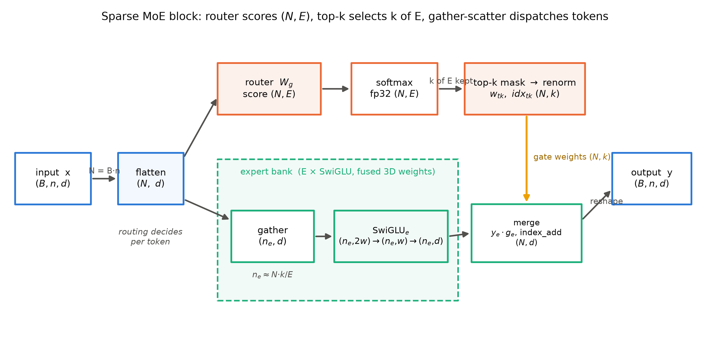
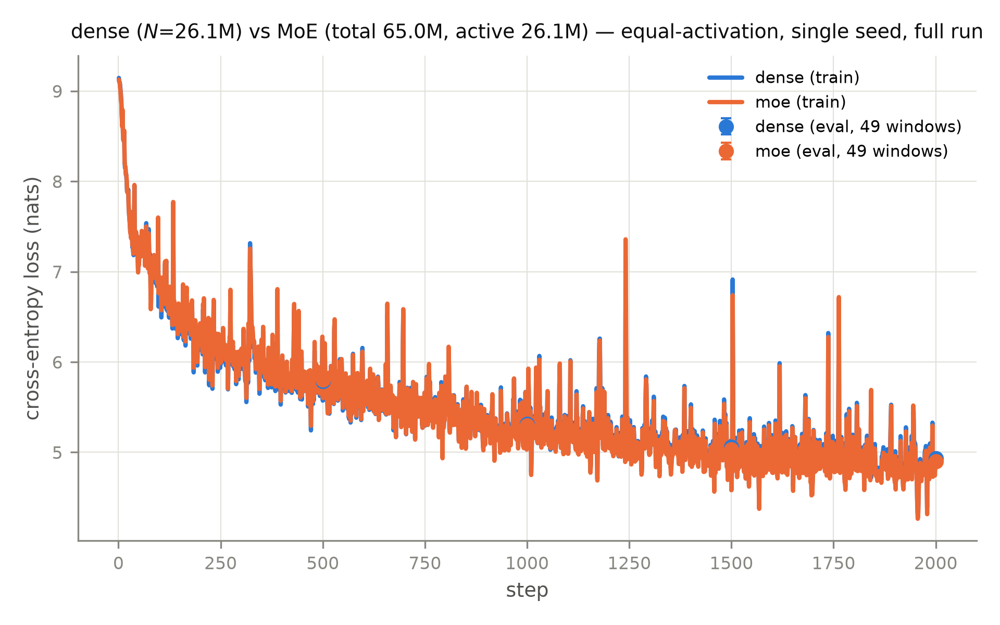

# 第 2 章 MoE 基本机构：路由器、top-k 与容量

## 2.0 开篇：从全书到这里

上一章我们把账算清了：效率悖论说的是总参数可以涨，只要每个 token 只激活其中一小块——容量与每 token 成本从此分成两本账记。但这半句话在我们的机器上还没有对应物：Book3 的 207M 骨架里，每个 Block 中那个升维、门控、降维的前馈层，每次都是整装上阵，每个 token 都为它的全部参数付全款。第 1 章末尾我们问：这个「只激活一小块」的机构到底怎么搭？本章就动它——把一个大 FFN 拆成一群小专家，再给每个 token 配一名调度员。

这一刀并不是我们的发明，而是 Book3 留下的一笔正式欠账。第 9 章拆 Llama 4 时我们登记过 config 事实就停住了，现在该把机构拆开了。本章要回答的问题有三个来源：一是那笔欠账的三连问（选法怎么工作、省在哪儿、训练难在哪——前两问本章兑现，第三问立刻爆雷、由下一章专治）；二是把机构落到代码：我们自己写一个 mini MoE 块，与组件库正身和 HF transformers 逐位对拍；三是拿到本机第一组 dense vs MoE 的对照读数，让「省什么、不省什么」从第 1 章的论文数字变成自己机器上的实测。

到本章结束时，你会拥有一张 MoE 块的形状流转表、一个能跑且对拍通过的 SparseMoE 实现、以及一份「等激活参数下 MoE 与 dense 谁更强」的本机证据。而新问题也会随之浮出水面：把选择权交给一个自己也要训练的路由器，训练时会出什么事——这正是第 3 章的开场。

> **最小背景栏**：本章只补三件前置。①专家内部就是 SwiGLU——门控升维、逐元素乘、降维，Book3 第 3 章已教，本章直接指回；②「FFN 是一个可整体替换的插槽」——Book3 第 8 章组装学的四插槽观（RMSNorm/SwiGLU/RoPE/GQA），本章动的是其中的前馈格；③总参/激活参双口径账本——本册第 1 章立的三口径账本（总参/激活参/每 token FLOPs），本章的每一笔参数账都按这套口径记。softmax 与 top-k 是 PyTorch 基础，不再重教。

## 2.1 三连问的第一问：Book3 的欠账到期了

先原样迎回那笔欠账。Book3 第 9 章章末欠账框写道：

> 「Llama 4 把前馈插槽换成『16/128 选 1 的专家群 + 一份共享』——选法怎么工作、省在哪儿、训练难在哪，是下一册的开场主角；本册只登记 config 事实。」

三连问里藏着本章的路线图。「选法怎么工作」是机构问题：那个「16/128 选 1」里的 1 是谁选的、按什么打分、被落选的其余 15/127 份在干什么——2.2 到 2.5 节把这套机构一次讲透；「省在哪儿」是账本问题：为什么选 1 份反而能更强——2.2 节立公式、2.7 节用本机实验兑现；「训练难在哪」本章只负责把雷挖出来：把选择权交给一个可训练的路由器，等于把「哪些参数得到训练」也交了出去——这个自增强回路的完整现场与处置是第 3 章的主菜。

动刀之前先定位整机坐标。Book3 的四插槽里，MoE 动的只有前馈格：RMSNorm、RoPE、GQA 注意力全部原样保留，残差河的宽度 $(B,n,d)$ 一寸不变——MoE 不是一台新机型，而是 FFN 插槽的替换件，装进去之后整机的输入输出接口完全不变。这个「只换一格」的判断不是我们的推测，第 4 章拆 Mixtral 时你会看到官方实证：它自述与 Mistral 7B 同构、注意力侧 GQA 8kv 与 Llama 2 70B 同款，唯一的结构改动就是 FFN 格换成 8 专家 MoE。

> **【考据框】MoE 比 Transformer 还早五个月**。稀疏门控 MoE 层的论文（Shazeer et al., *Outrageously Large Neural Networks: The Sparsely-Gated Mixture-of-Experts Layer*）v1 提交于 2017-01-23，而 *Attention Is All You Need* v1 是 2017-06-12【证据等级：官方论文，两文 arXiv 摘要页提交记录】——MoE 的第一个宿主是堆叠 LSTM，不是 Transformer；把它搬进 Transformer 的是 2020 年的 GShard。概念源头更早：Shazeer §1.3 自述 "Since its introduction more than two decades ago (Jacobs et al. 1991)"——1991 年的 *Adaptive Mixtures of Local Experts* 就有了「门控学习分治」的骨架【证据等级：官方论文 1701.06538 v1 §1.3】。

## 2.2 基本式与形状流转：token 维展平、打分、硬选择、派发

机构先看画面。把 Book3 里那个「一间大车间」式的 SwiGLU FFN，换成一个「仓库加调度员」：仓库里放着 $E$ 个窄一些的 SwiGLU（每个就叫一个专家，expert），调度员（路由器，router，Shazeer 原文叫门控网络 gating network）站在门口，看过每个 token 一眼，决定它进哪 $k$ 个车间；没被点到的车间，这个 token 一步都不踏进去。形式化只需要一行：

$$y=\sum_{i=1}^{E} g_i(x)\cdot E_i(x) \tag{2.1}$$

用人话说：每个 token 的输出，等于它选中的那几个专家的输出、按调度员给的门控权重加起来——落选的专家 $g_i(x)=0$，不但权重为零，连算都不用算，这就是省算力的来源。式中各量的形状如下表（记号全书统一：$B$ 批大小、$n$ 序列长、$d$ 残差流宽、$E$ 专家数、$k$ 每 token 激活专家数、$w$ 专家宽度、$N=B\cdot n$ 展平后的 token 总数。与第 1 章的桥接：$E$ 即该章的 $N_e$、打分矩阵 $W_g$ 即该章的路由门矩阵；该章式 (1.1)-(1.3) 里作总参数的 $N$ 属账本语境专用，自本章起 $N$ 一律指展平 token 数）。

| 符号 | 含义 | 形状 |
|---|---|---|
| $x$ | 进入 MoE 块的隐状态 | $(B,n,d)$ |
| $h$ | 展平后的 token 流 | $(N,d)$，$N=B\cdot n$ |
| $W_g$ | 路由器打分权重（承第 1 章路由门矩阵，Shazeer 记号） | $(E,d)$ |
| logits / 概率 | 逐 token 打分 / softmax 后概率 | $(N,E)$ |
| $g,\ \mathrm{idx}$ | top-k 门控权重 / 选中专家索引 | $(N,k)$ 各一 |
| $E_i(x)$ | 第 $i$ 个专家（窄 SwiGLU）的输出 | $(n_i,d)$，$n_i$ 为其实收 token 数 |
| $y$ | MoE 块输出（回残差河） | $(B,n,d)$ |

机制按四步走，每步都标形状（实例取 2.7 节本机模块档：$B=16$、$n=512$、$d=512$、$E=8$、$k=2$、$w=704$，故 $N=8192$）。

**第一步，展平。**路由的决策粒度是 token，不是序列，所以第一件事永远是 $(B,n,d)\to(N,d)$。这一步在代码里免费（一次 `reshape`），但它悄悄改变了之后所有下标的含义：gather/scatter 的索引全部生活在 $N$ 维上，算完必须 `view` 回 $(B,n,d)$。这里埋着 mini 实现里最经典的坑：批维展平忘记做或忘记还原，$B=1$ 时 $N=n$，形状巧合全对、程序照跑，$B>1$ 时输出形状仍对、内容却已错位——静默 bug。我们的教学件里有一条自检专门盯它：同一段 token 流按 $(1,64,d)$ 与 $(2,32,d)$ 两种批形喂进去，输出必须逐位相同（2.7 节实测正是 0）。

**第二步，打分。**路由器就是一个无偏置线性层加 softmax：$\mathrm{logits}=h\cdot W_g^{\top}$，形状 $(N,d)\cdot(d,E)\to(N,E)$——每一行是「这个 token 对 $E$ 个专家的偏好分」；softmax（fp32，数值口径对齐 HF）把它变成概率。整件事的计算量是 $N\cdot d\cdot E$ 次乘加，与一个 $d\toE$ 投影相当，几乎可以忽略。

**第三步，硬选择。**$\mathrm{topk}$ 在 $(N,E)$ 的最后一维上取前 $k$，得到门控权重与索引 $(N,k)$ 各一枚。选择是硬的：落选的 $E-k$ 个专家对这一行来说出局。写成掩码视角（Shazeer 的原始写法）：把落选位置的打分置 $-\infty$ 再 softmax，非 top 项概率自然为零。拿一个 token 走一遍全流程（$E=4$、$k=2$）：设它对四个专家的打分为 $(2.0,\ 0.5,\ 1.2,\ -0.3)$，softmax 得概率 $(0.564,\ 0.126,\ 0.253,\ 0.057)$；top-2 选中专家 1 与 3，权重 $0.564$ 与 $0.253$；重归一化 $0.564/0.817=0.69$、$0.253/0.817=0.31$。于是这个 token 的输出就是 $y\approx0.69\,E_1(x)+0.31\,E_3(x)$——专家 2、4 连同它们肩上的全部参数，对这个 token 一步都没参与。你可能会问：硬选择怎么反传梯度？先卖个关子，2.3 节专门回答——此刻只需记住一个口径事实：Mixtral 家族在 top-k 之后还要做一步**top-k 内重归一化**，即 $g\leftarrow g/\sum_j g_j$，让每 token 的 $k$ 个权重和为 1。「先 top-k 再 softmax」与「先 softmax 再 top-k 再重归一」是同一个数学的两种写法（softmax 只在 top-k 支撑集上非零，归一化即限制在支撑集上），论文写前者、HF 实现走后者，2.7 节的实现对照框会再碰它。

**第四步，派发与合并。**对每个专家 $e$，用布尔掩码从 $(N,d)$ 里**gather**（收集）出属于它的 token 子集 $(n_e,d)$（$n_e\approx N\cdot k/E$，均匀时约 2048），过它的窄 SwiGLU 得 $(n_e,d)$，乘上各自的门控权重，再 **scatter**（散射）回 $(N,d)$——同一个 token 的 $k$ 份结果 `index_add` 累加。最后 `view` 回 $(B,n,d)$，还给残差河。全流程整理成形状流转表（表 2.1）与数据流图（图 2.1）。

**表 2.1 MoE 块形状流转表**（实例 $B{=}16,n{=}512,d{=}512,E{=}8,k{=}2,w{=}704,N{=}8192$）

| 步骤 | 运算 | 输入形状 | 输出形状 | 说明 |
|---|---|---|---|---|
| 展平 | reshape | $(16,512,512)$ | $(8192,512)$ | $N=B\cdot n$；路由按 token 决策 |
| 打分 | $h\cdot W_g^{\top}$ | $(8192,512)\cdot(8,512)^{\top}$ | $(8192,8)$ | 逐 token 对 $E$ 专家的偏好分 |
| 概率 | softmax（fp32） | $(8192,8)$ | $(8192,8)$ | 全专家归一化 |
| 硬选择 | topk | $(8192,8)$ | $(8192,2)+(8192,2)$ | 权重 $g$ 与索引 $\mathrm{idx}$；落选者出局 |
| 重归一 | $g/\sum g$ | $(8192,2)$ | $(8192,2)$ | Mixtral 口径：$\sum_k g=1$ |
| gather | 掩码索引 | $(8192,512)$ | $(n_e,512)$ | $n_e\approx N\cdot k/E\approx2048$ |
| 专家前向 | 窄 SwiGLU | $(n_e,512)$ | $(n_e,512)$ | 融合线性 $\to(n_e,1408)$ → chunk 两枚 $(n_e,704)$ → 门控乘 → 降维 |
| 加权 scatter | $\times g_e$ + index_add | $(n_e,512)$ | $(8192,512)$ | 每 token 累加它的 $k$ 份 |
| 还原 | view | $(8192,512)$ | $(16,512,512)$ | 回残差河宽度 |



**图 2.1** MoE 块数据流与形状（自绘示意级）：上路（橙）为路由器三步——打分 $(N,E)$、softmax、top-k 掩码与重归一 $(N,k)$；下路（青）为专家库 gather → 窄 SwiGLU → 加权合并；黄线是门控权重的施加点。通用形状 $B,n,d\ /\ N=B\cdot n\ /\ E,k,w$ 已逐框标注。

「省在哪儿」此刻已经可以立式。按第 1 章的双口径账本记这一格插槽（先不计路由器，原因见下）：总参数是仓库的大小，$E\cdot 3dw$；每 token 激活参数是通行费，$k\cdot 3dw$。代入实例：dense 前馈每层 $3\times512\times1408=2{,}162{,}688$ 参；换成 8 个半宽专家（$w=704$）后，总参 $8\times1{,}081{,}344=8{,}650{,}752$（4.0 倍），而每 token 只激活 2 个专家、$2{,}162{,}688$ 参——**与 dense 分文不差**。这正是 2.7 节实验的「等激活口径」设计：两臂通行费锁死，比的是仓库更大是否白赚。再按第 1 章的第三本账折算 FLOPs——每 token 前向乘加约等于激活参数的两倍，两臂每 token 计算量相同、总参差 2.49 倍，恰是第 1 章「等算力、不等容量」样本的镜像：我们锁住算力、放开容量，看看多出来的仓库能换来什么。至于路由器自己，$E\cdot d=4096$ 参、每 token 都要过一遍，严格说属于激活参数——第 1 章式 (1.2) 的严格账把它计入（六层累计对单份激活参只值 0.1%，见该章手算），各家官方口径与 2.7 节脚本的 `params_active` 记账则一律不含它；本书报数时两口径并注，不静默切换。总参数涨了 4 倍、每 token 成本不变——第 1 章的效率悖论，在这张小表上第一次有了自己机器上的数字。

## 2.3 noisy top-k：2017 年的原版机构，与一个必须掰清的梯度问题

四步机构里最反直觉的是第三步：选择是离散的，离散操作没有梯度，路由器怎么学？2017 年的原版论文对这一步给出了两个相互咬合的设计，值得逐字看——因为后世把它们一件件拆掉的过程，正是 MoE 十年演化史的主线（第 5 章收口）。

Shazeer 的门控是**噪声 top-k 门控**（noisy top-k gating）：

$$G(x)=\mathrm{Softmax}(\mathrm{KeepTopK}(H(x),k)) \tag{2.2}$$

$$H(x)_i=(x W_g)_i+\mathrm{StandardNormal}()\cdot\mathrm{Softplus}\big((x W_{noise})_i\big) \tag{2.3}$$

$$\mathrm{KeepTopK}(v,k)_i=\begin{cases}v_i & v_i\in\text{top-}k\\[2pt] -\infty & \text{otherwise}\end{cases} \tag{2.4}$$

用人话说：打分时故意掺噪声（式 2.3，噪声幅度由第二枚可训练矩阵 $W_{noise}$ 经 Softplus 保证非负——噪声多大本身是学出来的），然后把非 top-$k$ 的位置置 $-\infty$ 再 softmax（式 2.2/2.4），落选者概率精确为零。这套设计里噪声不是瑕疵，是**双重职能**的机构件【证据等级：官方论文 1701.06538 v1 §2.1 与附录 A】：

其一，**探索**。打分带噪声，边界 token 的路由在训练中不断抖动，一个暂时落后的专家还有机会被重新发现——否则选择一旦固化，落选专家永远得不到训练，永远落选（这个正反馈回路的完整现场是第 3 章的开场雷）。其二，**可微的负载估计**。负载（每个专家实收多少 token）是离散计数，天生不可反传；有了噪声，「专家 $i$ 入选」从 0/1 的事实变成了概率事件——在噪声分布下重采一次样，打分还能留在 top-$k$ 内的概率是一个光滑的正态 CDF 值。负载从此有了能求导的代理，基于它才能构造负载均衡损失（公式留给第 3 章）。配套还有一个初始化技巧：$W_g$ 与 $W_{noise}$ 全零初始化，开局无信号、纯噪声，各专家负载近似相等，避免第一步就撞进不均衡的局部极小。

回到梯度问题。原文的答案出人意料地朴素——**直接反向传播**，逐字：「We train the gating network by simple back-propagation, along with the rest of the model. If we choose $k>1$, the gate values for the top $k$ experts have nonzero derivatives with respect to the weights of the gating network.」选择确实不可导（$-\infty$ 掩码把落选者的梯度切得干干净净），但被选中的 $k$ 个门控值是 softmax 的输出、乘在专家输出上（式 2.1），梯度就沿着 $g_i(x)\cdot E_i(x)$ 这条软路径流回 $W_g$ 与 $W_{noise}$。原文还专门把自己与另一条技术路线划清界限，逐字：「Our method differs here from (Bengio et al. 2015) who use boolean gates and a REINFORCE-style approach to train the gating network.」——**既不是直通估计（straight-through estimator），更不是 REINFORCE**，就是普通的链式法则，软的那半截（门控值）负责可导，硬的那半截（选谁）不需要可导。【证据等级：官方论文 1701.06538 v1 §2.1 "Training the Gating Network" 段】这句话要在脑子里钉牢，因为它是 2.5 节的伏笔：Shazeer 当年据此猜想 $k>1$ 是可训练的必要条件——只有第一名、没有第二名作参照，「胜差」从何谈起？这个猜想四年后被 Switch 用实验推翻。我们自己教学件的自测里有一条对应验证：对块输出求和反传，路由器权重的梯度非零（2.7 节实测通过）。

## 2.4 容量与溢出：当专家装不下的时候

机构里还有一处图 2.1 没画出来的物理约束。gather 进专家的 token 不是抽象的行，是要装进固定大小缓冲区的数据：在真实部署里每个专家的输入缓冲区按「预期平均流量」预分配，流量不均时就会有专家装不下。装不下的 token 怎么办？这就是**专家容量**（expert capacity）与**溢出**（overflow）要回答的问题。

GShard 的答案是一套记账式方案：总批 $N$ 个 token、每个至多派给 2 个专家、共 $E$ 个专家，则每专家容量按平均流量 $O(N/E)$ 配置；实现按**局部组分发**（local group dispatching）——批均分 $G$ 组、每组 $S=N/G$，每组每专家容量

$$\text{cap}=\frac{2N}{G\cdot E}=\frac{2S}{E} \tag{2.5}$$

用人话说：按「每组每专家分到的平均 token 数」修座位，一名运行计数器（running counter）实时记账，专家坐满即闭门。两个都坐满的 token 怎么办？GShard 原文交代得干脆，逐字：「When both experts selected by a token already exceed their capacity, the token is considered as an overflowed token, where $\mathcal{G}_{s,E}$ degenerates into a zero vector. Such tokens have their representation $x_s$ passed on to the next layer via residual connections.」【证据等级：官方论文 2006.16668 v1 §2.2】——门控归零、表示走残差直达下一层。这是个漂亮的工程直觉：MoE 块本来就住在残差河的支路上（Book3 的 Block 结构里，FFN 输出是加回主干的加法支路），「这一层的前馈对这个 token 闭门谢客」并不杀死信息，残差河还在流。本书愿意叫它**保险丝**：负载失控时损失的是这一层的一次精炼，而不是整个前向。

> **【考据框】「capacity factor」一词不在 GShard**。全文 grep「capacity factor」零次【证据等级：官方论文 2006.16668 v1 全文检索】。式 (2.5) 的容量其实隐含了系数 1.0：把它一般化写成 $\text{cap}=(N\cdot k/E)\cdot\mathrm{CF}$（$N\cdot k/E$ 正是均匀负载下每专家的期望 token 数），GShard 取的就是 $k=2$、$\mathrm{CF}=1$ 的组内版——这一步推广是本书自算标注，不是 GShard 原文。把 CF 提出来变成显式可调超参、并给它起名的，是 Switch Transformer 的式 (3)。

Switch 的显式参数化（原文式 3，top-1 口径）：

$$\text{expert capacity}=\frac{\text{tokens per batch}}{\text{number of experts}}\times\text{capacity factor} \tag{2.6}$$

**容量因子**（capacity factor，CF）从此成为一名正式超参。用人话说：容量因子是修座位时的冗余系数——CF=1 按平均流量修座，1.25 就是多备四分之一座；备得越多溢出越少，但空座浪费计算与内存。代入我们的实例手算一遍：$N=8192$、$E=8$、$k=2$，均匀负载每专家期望 $8192\times2/8=2048$；CF=1 座位 2048，CF=1.25 座位 2560。真正训练时负载从不均匀——不均匀到什么程度会烧保险丝，第 3 章的本机负载直方图会给出吓人的答案（预告：无干预时最忙与最闲专家的负载可差数百倍——本机实测 max/min 达 327.8——还会出现零负载的死专家；文献侧 Shazeer 报过最忙专家达均值的 17.8 倍）。

GShard 还为「省座位」发明过一个聪明的小机关，值得单独一看：**随机路由**（random routing）。top-2 里第二名若权重 $g_2$ 很小，它那份贡献 $g_2\,E_2(x)$ 本就近乎零——那就别搬它了：以与 $g_2$ 成正比的概率把 token 派给第二专家、否则干脆跳过，原文的动机句写得很直白：「if the weight for the 2nd expert is very small, we can simply ignore the 2nd expert to conserve the overall expert capacity」【证据等级：官方论文 2006.16668 v1 §2.2】。在期望意义上，小权重的专家被「按概率欠账」，座位省下来给真需要的地方——这是「按概率省算力」思路在 MoE 里的最早一例（细心的读者会查到正文写概率 $\propto g_2$、Algorithm 1 注释写 $\propto 2g_2$，系数差两倍——论文内部不一致，如实记录，以 Algorithm 1 为准：归一化后 $g_2\le 0.5$，乘 2 把概率拉满到 $[0,1]$）。

CF 该取多大？直觉似乎该取宽松，Switch 的实验结论相反：CF 1.0 与 1.25 全面优于 2.0，原文明确写道「Switch Transformers perform better at lower capacity factors (1.0, 1.25)」【证据等级：官方论文 2101.03961 v3 §2.2/Table 1/Fig 3】。同表还有一组头对头数字：128 专家、同算力同硬件（32 TPUv3）下，top-1 的 Switch-Base 达到固定质量阈值用时 62.8 小时，top-2 的 MoE-Base 要 80.1 小时——小容量反而更快，因为省下来的缓冲区与通信直接换成了吞吐。到这里，三篇早期论文的机构对照可以收进一张表（表 2.2），注意其中「辅助损失」一列每行都在变简单——这条线第 3 章展开。

**表 2.2 早期三篇的机制对照**（全部【证据等级：官方论文】，版本见引用锚）

| 维度 | Shazeer 2017 | GShard 2020 | Switch 2021 |
|---|---|---|---|
| 门控 | 噪声 top-k（式 2.2-2.4），$k=4$ | 无噪 softmax top-2 + 第二专家按 $g_2$ 概率随机派发 | 无噪 top-1 |
| 容量与溢出 | batchwise 截断（附录 F） | 组容量 $2N/(G\cdot E)$（隐含 CF=1），溢出走残差 | 显式 CF（式 2.6），CF 1.0-1.25 最优，溢出走残差 |
| 插入密度 | LSTM 层间夹层 | 每隔一层换一个 FFN（enc 与 dec 都是） | 每层都换（T5 栈） |
| 辅助损失 | 双损失：重要性 + 负载（CV² 形） | 单损失：$(c_e/S)\cdot m_e$ 因子式 | 单损失：$\alpha N\sum_i f_i P_i$，$\alpha=10^{-2}$ |

## 2.5 top-1 的反直觉：把 k 砍到 1，可微性为什么不塌

表 2.2 从左到右读，会发现每篇都在拆前一篇的机构件：GShard 拆掉噪声、把 $k$ 从 4 砍到 2，Switch 拆掉第二专家、砍到 1。前两步都好理解，最后一步撞在 2.3 节钉下的那句话上——Shazeer 的原版论证是「$k>1$ 才有非平凡的路由梯度」，因为门控值导数来自 top-$k$ 内的 softmax，$k=1$ 时 softmax 只剩一项、$g\equiv 1$，梯度似乎无从谈起。Switch 论文开头转述了这个猜想，逐字：「The authors intuited that learning to route would not work without the ability to compare at least two experts.」然后宣布反例，逐字：「Contrary to these ideas, we instead use a simplified strategy where we route to only a single expert. We show this simplification preserves model quality, reduces routing computation and performs better.」【证据等级：官方论文 2101.03961 v3 §2.1】

猜想错在哪？错在把「梯度来自比较」当成了前提。可微性的真正来源不是第二名，而是**打分本身**：softmax 是在全 $E$ 个专家上打的，冠军的概率 $p_{\mathrm{top1}}(x)$ 是全量 softmax 的一格、随 $W_g$ 光滑变化——冠军赢得多悬殊（第二名离得多近）依然编码在这个数里，乘在 $E_{\mathrm{top1}}(x)$ 上，梯度照通。Switch 原文一句收束：「the gate value $p_i(x)$ in Equation 2 permits differentiability of the router」。用比赛的语言说：不需要亚军上台领奖，冠军的「胜差」本身就已经携带了全部可学信息。回到 2.2 的掩码视角你会看到同一件事的另一个侧面——$k$ 砍到 1，式 (2.4) 的 KeepTopK 只是保留的位置从 $k$ 个变成 1 个，softmax 与乘法一寸未动。

那 top-1 赚到什么？Switch 给了三笔账【证据等级：官方论文 2101.03961 v3 §2.1】：其一，路由器计算减半（每 token 只需一个专家的派发）；其二，原文逐字「The batch size (expert capacity) of each expert can be at least halved」——每 token 占用座位从 2 个变 1 个，同一容量预算下能容纳双倍 token；其三，路由实现与通信同时简化。把第二笔账接到 2.6 节的分片视角会更清楚：每 token 的期望搬运次数从 2 降到 1，每台设备的 token 流量与缓冲直接减半——机构里的每个「少一次」到部署侧都是真金白银。三笔账都不含质量损失——2.4 节那组 62.8h 对 80.1h 的头对头就是总成绩。「少即是多」在 MoE 机构史上的这次胜利还有一个长尾：2025 年的 Llama 4 重新拾起「选 1」，2.8 节三学派对表时它还会回来。

## 2.6 为什么天然可分片：专家并行的机构学根据

第 1 章算过 MoE 省什么不省什么：通行费（激活参数）降了，仓库（总参数）照付全款——我们的小实验里 MoE 臂内存峰值增量是 dense 臂的 3 倍多。总参数装不进一台机器时怎么办？稠密模型的标准答案是**切参数**：把大矩阵沿某维劈到多台设备，每台算一片再拼起来。但这引出一个每 token 都要付的税：稠密层的每个参数都参与每个 token 的计算，切了参数，每个 token 的中间结果就得跨设备搬运对齐——通信量随切分程度上涨。

MoE 层的机构在这里给出了一个结构性便宜。注意专家之间的拓扑：它们互不通信——一个 token 的 MoE 输出只是它选中的 $\le k$ 个专家输出的加权和（式 2.1），专家 A 与专家 B 之间没有任何数据依赖。于是「把不同专家放到不同设备」不会引入任何跨设备的中间结果同步：路由器天然把 token 按去向分桶，每台设备只收「路由到自家专家」的 token、算完发回。通信从稠密切分的「全参数/全中间量同步」退化为「token 搬运」。GShard 把这个部署形态画在了它的 Fig 3(c) 里，原文逐字：「When scaling to multiple devices, the MoE layer is sharded across devices, while all other layers are replicated.」——MoE 层分片、其余层复制；它甚至把设备数与每层专家数绑死（每设备约一个专家），扩容等于加设备而不是加单机内存【证据等级：官方论文 2006.16668 v1 §4.3/Fig 3】。这个部署形态后来得名**专家并行**（expert parallelism，EP），而承担 token 搬运的集合通信原语（all-to-all）及其调度、设备级负载对策，属于推理引擎工程——机构学根据在这里止步，工程账留个地址：→ Book8 第 6 章。

还剩一个自然的追问：每台设备分到多少活？期望恰是 $N\cdot k/E$——2.4 节容量公式的分子。专家越多，每设备越闲、单设备内存越小，这正是 GShard 敢上 2048 专家的算术底气；但「期望均衡」四个字要泼一盆冷水——真实路由的负载可以崩到最忙与最闲差数百倍、甚至饿死零负载的死专家（第 3 章本机现场），而负载一崩，EP 的分片红利立刻被最忙设备吃光。机构与训练难题在这里完成交接。

## 2.7 mini MoE：实现、对拍与本机第一组读数

机构讲完，轮到把它写成代码并接受对拍。教学件在 [`code/ch02/moe.py`](code/ch02/moe.py)，三个类对应图 2.1 的三个部件：`MixtralTopKRouter`（打分 → softmax → top-k → 重归一）、`ExpertBank`（融合 3D 专家权重 + gather/scatter 派发）、`SparseMoE`（组装两者、管理展平与还原）。核心前向摘录如下（完整实现见文件，每步行内注形状）：

```python
# [`code/ch02/moe.py`](code/ch02/moe.py) —— SparseMoE.forward（摘录）
def forward(self, x, out_router_logits=False):
    shape = x.shape                                  # (B,n,d)
    h = x.reshape(-1, shape[-1])                     # (B,n,d) -> (N,d)，N=B·n：先展平！
    logits, topk_w, topk_idx = self.gate(h)          # (N,E) / (N,k) / (N,k)
    out, _counts = self.experts(h, topk_w, topk_idx) # (N,d)（各专家加权合并）
    out = out.view(*shape)                           # (N,d) -> (B,n,d) 还原残差河宽度
    ...
# ExpertBank.forward 的派发循环（摘录）：
    for e in range(self.n_expert):
        tok, slot = torch.nonzero(topk_idx == e, as_tuple=True)   # 选中 e 的 (token,槽位)
        if tok.numel() == 0:
            continue                                  # 本批无人问津的专家直接跳过
        xe = h[tok]                                   # gather：(N,d) -> (n_e,d)
        gate, up = F.linear(xe, self.gate_up_proj[e]).chunk(2, dim=-1)  # (n_e,2w)->(n_e,w)×2
        y = F.linear(F.silu(gate) * up, self.down_proj[e])   # (n_e,w) -> (n_e,d)
        out.index_add_(0, tok, y * topk_w[tok, slot].unsqueeze(1))    # scatter：加权写回 (N,d)
```

三件设计决定值得交代。其一，**键位对齐 HF 而非「怎么直观怎么写」**：专家权重存成两枚 3D 裸 Parameter `experts.gate_up_proj (E,2w,d)` / `experts.down_proj (E,d,w)`、路由器存 `gate.weight (E,d)`——这是 transformers 5.18.0 的 Mixtral 键位，state_dict 可与 `MixtralForCausalLM` strict 互搬，对拍链路因此才存在（见下方对照框）。其二，**整机不私搭**：对拍用的 mini 整机 `MiniMixtralLM` 里，RMSNorm、GQA、RoPE 全部 import 自 Book3 的 `llama_slots`（跨册双候选 bootstrap），唯一的新零件就是 mlp 插槽里的 `SparseMoE`——「第一刀不碰注意力」直接写在 import 语句里。其三，构造函数兼容 config 单参与关键字两形态（字段别名族 `n_expert|num_local_experts`、`top_k|num_experts_per_tok`——HF `attribute_map` 同款），这是组件库插槽契约的验收口径。

对拍三层，全部 CPU fp32、种子 20261002【证据等级：本书实验（CPU，2026-10）】：第一层，教学件对组件库正身 `moe_mla_slots.HFMixtralMoE` 同权重直搬前向，max$|\Delta|$=0.00e+00，逐位一致——两份代码写法不同、算的是同一件事；第二层，mini 整机（2,231,552 参）对 `MixtralForCausalLM` 同 config 随机权重 strict 直搬，max$|\Delta\mathrm{logits}|$=8.34e-07、argmax 一致率 100%（可行性探针 G 曾报 1.07e-06，复跑同量级——差异来自 HF 前向内部的归约顺序，属浮点噪声）；第三层，机构性质三条自检：批维展平不变性（$(1,64,d)$ 与 $(2,32,d)$ 同 token 流输出差 0）、路由可微（块输出反传后 `gate.weight.grad` 非零——2.3 节论证的落地）、负载守恒（$\sum_e n_e=N\cdot k=128$，随机权重下分布 [39, 28, 37, 24]，期望 32，近乎公平开局）。这最后一眼值得多看一秒：开局均匀是假象，路由器一旦开始学习，这组数字如何失衡，就是下一章的第一手现场。聚合对拍脚本 `00-feasibility/parity_all.py --hf` 也已把本件接入注册表，教学件↔正身↔HF 块级三方 max$|\Delta|$ 全部 0.00e+00。

> **【实现对照框】HF transformers 5.18.0 的 MixtralMoE 与两个键位陷阱**（{config/源码}，本机 5.18.0 实测；v4 时代教程在此全部失效）。`MixtralTopKRouter` 三要点：①softmax 打在**全 $E$ 个专家**上再取 top-k，不是先 top-k 再 softmax（数学等价、实现口径不同，见 2.2 节）；②top-k 权重重归一化到 $\sum=1$（Mixtral 论文口径；DeepSeek 家族不归一而乘 `routed_scaling_factor`——两族对照第 5 章展开）；③softmax 强制 fp32。专家库 `MixtralExperts` 用 one-hot 掩码 `(B·n,k)→(E+1,k,B·n)` 路由，只遍历被命中的专家——那个 $E{+}1$ 是给分组内核留的越界哨兵位，教学件用等价的布尔掩码 `idx==e` 免去这层包装。**陷阱一**：4.x 的 `experts.N.w1/w2/w3` ModuleList 键与 `block_sparse_moe.*` 目录名在 5.18.0 代码里已零命中；hub 旧 checkpoint 靠 `conversion_mapping.py` 在加载期自动重排（`MergeModulelist`+`Concatenate` 两行——把逐专家权重堆成 3D、gate/up 行拼接）。**陷阱二**：专家与路由器权重是**裸 Parameter**，state_dict 键没有 `.weight` 后缀；手写成 `nn.Linear` 会多出后缀、strict 加载直接报错——报错还算客气，键名恰好撞上时才是静默灾难。

机构通过了对拍，下一个问题是每一个 MoE 使用者都要先问的：在同等通行费下，换成专家群到底值不值？本机实验（[`ch02/ablation_moe.py`](code/ch02/ablation_moe.py)，协议承 Book2 五件套：AdamW、余弦日程、同数据同种子、顺序分块一次通过）把 2.2 节的等激活口径落成两臂：dense 臂 $d_{ff}=1408$，MoE 臂 $E=8$/$k=2$/$w=704$（$2\times704=1408$），**FFN 通行费两臂逐位相同（每层 $3dw=2{,}162{,}688$；脚本记账的激活参 26,089,984 为双份嵌入、不含路由门口径——折成第 1 章单份口径 dense 21,895,680 对 MoE 21,920,256，恰差路由门的 24,576），MoE 总参 65,042,944=2.49 倍**——单变量锁死在「FFN 插槽形态」上。数据侧的保障同样较真：两臂按步号从同一条 token 流取完全相同的批次，eval 用固定 49 窗（401,408 个 held-out token、fp32 评测）跨臂跨步同集——排除「数据不同造成的假差异」。判据预注册在先（fast 档两臂差 ≤0.03 nat 一律读作噪声内——本机同种子两次复跑的固有抖动就有 0.026 nat），质量读数与速度读数分开念。读数见表 2.3 与图 2.2。

**表 2.3 dense vs MoE 等激活消融（full 档 2000 步）**（模块档 d=512/L=6/V=8192，单种子 20261002；激活参列为脚本 `params_active` 口径——双份嵌入、不含路由门，与第 1 章单份口径的换算见 2.7 节正文；【证据等级：本书实验（MPS bf16 训练/fp32 评测，2026-10）】）

| 臂 | 总参 | 激活参 | eval loss@2000 | sec/step | 峰值内存增量 |
|---|---|---|---|---|---|
| dense（$d_{ff}{=}1408$） | 26,089,984 | 26,089,984 | 4.934 ± 0.013 | 0.354 | 654 MB |
| MoE（E8/top-2/w704） | 65,042,944 | 26,089,984 | **4.896 ± 0.013** | 0.714 | 2,254 MB |

质量方向的读数按预注册判据处理——以 eval@1500 与 @2000 两点差值方向为准：dense 5.059→4.934，MoE 5.029→4.896，两点 dense−MoE 均为正（+0.030 与 +0.038 nat），与探针 B 初读（MoE 反超 0.084 nat）**同向**。结论按预注册的口径写：等激活下 MoE 反超 dense，幅度 0.03-0.04 nat、恰在本机噪声带（0.026-0.03 nat）边缘——趋势级结论、单种子标注，不夸大。短档的两次读数曾互有出入（探针 B 档 200 步 MoE 反超 0.084 nat；本实验 fast 档 200 步 dense 反超 0.030 nat、噪声内），这正说明 26M 档的红利量级就在噪声带边缘，2000 步末段（学习率已退火的平台期）比短档更可比。速度方向没有歧义：MoE 臂 sec/step 是 dense 的 **2.0 倍**（0.714 对 0.354 s/step，持续吞吐口径、含热节流段；中位数口径 1.76 倍；探针 B 的 B=8 干净口径 2.3 倍）——多出来的是**派发开销**：路由、逐专家 gather/scatter 循环在朴素 Python 循环里逐层启动内核（launch-bound），第 1 章的开销梯度（26M 档 2.3×、65M 档 1.74×、207M 档 1.44×，【证据等级：本书实验（MPS，2026-10）】）显示它随规模收敛，但教学档必须如实报慢。「省什么不省什么」在第 1 章是论文数字，此刻全部落在本机：通行费持平、仓库 2.49 倍、内存 3.4 倍、墙钟 2.0 倍——MoE 用部署侧的全款换取训练/推理侧每个 token 的选择权。



**图 2.2** dense vs MoE 等激活基线（自产，`fig_ch02.py` 绘制，full 档 2000 步）：细线为训练损失曲线，圆点为 49 窗固定 eval 集。两臂 FFN 通行费逐位相同（激活参 26,089,984 为双份、不含路由门口径），单变量为 FFN 插槽形态；末段两点 eval 差 +0.030/+0.038 nat（MoE 更低，趋势级）。

## 2.8 同一机构的三种取值：三学派与 B3-9 收口

回到开篇的三连问，现在可以对账了。**选法怎么工作**：router 打分 $(N,E)$、softmax、top-k 硬选择、top-k 内重归一 $(N,k)$，gather-scatter 派发，容量记账、溢出走残差——2.2 到 2.6 节的全部机构，装进一句话就是「仓库加调度员加保险丝」。**省在哪儿**：每 token 只付 $k$ 份专家的通行费，仓库（总参）与显存照付全款；等激活口径下 26M 档已见趋势级红利。**训练难在哪**：选择权交给可训练的路由器，负载会自己崩——这个问题本章只负责挖出来，下一章拿着本机现场数据专治。

Llama 4 的「16/128 选 1」也终于可以放进谱系里读。把三台旗舰的 MoE 几何并排（表 2.4），你会发现它们用的**是同一套机构**——router 打分、top-k 选择、门控加权，没有一家发明新机构；差别全在取值：份数 $k$ 与单份宽度 $w$ 的二维设计空间里，各家站的位置不同。Llama 4（Scout 16 选 1、Maverick 128 选 1，外加一份共享专家）站在「少份宽选」：$k=1$、专家是整只 FFN 量级——2.5 节 top-1 论证的 2025 年回归。gpt-oss（20b 32 选 4、120b 128 选 4，专家宽 $=d$、无共享）站在「多份窄选」：每 token 混 4 份中等宽度的配方。DeepSeek-V3（256 选 8 + 1 共享）站在「细粒度加共享」：专家切到约 0.29$d$ 宽、每 token 混 8 份、再留一份常驻专家兜底公共知识。为什么要切细？先尝一口第 5 章的论证：16 选 2 只有 $\binom{16}{2}=120$ 种专家组合，64 选 8 有 $\binom{64}{8}\approx4.4\times10^9$ 种——切细让同一预算下可表达的知识组合爆炸式增长【证据等级：官方论文 2401.06066 v1 §3.1】。「细为什么好、共享为什么省」的完整论证是第 5 章的主菜，这里只登记几何。至于各家路由器打分用 softmax 还是 sigmoid、要不要给负载装免损失的阀门，同样是第 5 章的对照表——机构只有一套，取值与治理才是各家分歧所在。

**表 2.4 三学派的 MoE 几何**（Llama 4 行指回 Book3 第 9 章表 9.1 的完整 config 事实；三家完整账本在第 10 章速览表）

| 模型 | MoE 几何 | 学派 | 证据等级 |
|---|---|---|---|
| Llama 4 Scout / Maverick | 16 选 1 / 128 选 1 + 共享 1 | 少份宽选（top-1 回归） | 【证据等级：config 逆向（Book3 ch9 已核）】 |
| gpt-oss 20b / 120b | 32 选 4 / 128 选 4，专家宽 $=d$，无共享 | 多份窄选 | 【证据等级：config 逆向】 |
| DeepSeek-V3 | 256 选 8 + 共享 1，专家宽 $\approx0.29d$ | 细粒度 + 共享 | 【证据等级：config 逆向】 |

## 2.9 本章小结

开篇承诺兑现清点：B3-9 的前两问已答——选法是一套四步机构（展平、打分、硬选择、派发），省在激活参数账（每 token 只付 $k$ 份的钱），两者都落到了形状流转表、公式与本机代码上；容量与溢出补上了机构的物理边界（保险丝），top-1 一节拆掉了「可微性需要第二名」的直觉陷阱，专家并行一节给出了「专家互不通信所以天然可分片」的机构学根据；最后，mini MoE 通过三层对拍（正身逐位一致、HF 8.34e-07），等激活消融给了第一组本机读数——full 档 2000 步 MoE 4.896 对 dense 4.934（趋势级反超），代价是 2.0 倍的派发开销。

**带走的心智**：忘掉细节后，请留下两幅画。其一，**MoE 块 = 仓库 + 调度员 + 保险丝**——router 给每个 token 发 $k$ 张工牌，落选的专家一步不算（这是全部省算力的来源）；专家的座位按平均流量修（容量），坐不下的 token 走残差直达下一层（信息不死、只跳过一次精炼）。其二，**选择是硬的，门控是软的**——梯度不走「选谁」那条断路，走「选中者权重多大」那条软路；正因如此 $k$ 砍到 1 依然可训（Switch 的胜利），也正因如此，谁来训练调度员、调度员会不会把活派崩，成了 MoE 真正的难题。

从全书旅程看，第一刀的「机构学」到此完整：我们有了替换件的图纸、实物和对拍证书。但图纸和实物还不会自己训练——把这台机器点着之后，2.3 节埋的自增强回路立刻现形：被偏爱的专家训练得多、更强、更被偏爱，负载一路崩向赢者通吃。下一章拿着本机的负载直方图（无干预 200 步，最忙与最闲专家的负载可差数百倍——max/min 实测达 327.8——还会出现零负载的死专家）进入 MoE 的另一半：训练难题与为均衡付出的四代「损失税」。

> **【欠账】** 专家并行的机构学根据（专家互不通信、通信退化为 token 搬运）本章已讲，但 all-to-all 调度、设备级负载治理与推理引擎里的专家分发工程属系统侧。→ Book8 第 6 章

## 2.10 动手验证

```bash
cd 工作区根目录 && source env.sh

# ① 教学件三层对拍 + 机构性质自检（CPU fp32，秒级）
python [`code/ch02/moe.py`](code/ch02/moe.py#L97) --out-name run1
#   验收行：[① 教学件 vs 正身] max|Δhidden| = 0.00e+00（逐位一致）
#           [③ vs HF 5.18.0] strict 直搬通过 2,231,552 参 | max|Δlogits| = 8.34e-07
#   产物：log/book4-ch02/moe_parity_run1.json

# ② 聚合对拍（教学件注册表已含本件；批二/批三交付边界与终校固定动作）
python [`code/00-feasibility/parity_all.py`](code/00-feasibility/parity_all.py) --hf --out-name batch1_ch02
#   验收行：ch02/moe.py::SparseMoE  三列 max|Δ| 全部 0.00e+00  PASS

# ③ dense vs MoE 等激活消融（MPS；fast ≈3 min、full 晚间档）
python [`code/ch02/ablation_moe.py`](code/ch02/ablation_moe.py) --steps 200  --out-name fast
python [`code/ch02/ablation_moe.py`](code/ch02/ablation_moe.py) --steps 2000 --out-name full
#   产物：log/book4-ch02/ablation_moe_{fast,full}.json + curve_{dense,moe}_*.csv
#   （长训含 ckpt 断点续跑；重跑同命令自动续）

# ④ 本章两图（图 2.1 数据流 / 图 2.2 消融曲线；--src 自动 full 优先回落 fast）
python [`code/ch02/fig_ch02.py`](code/ch02/fig_ch02.py) --which all
```
