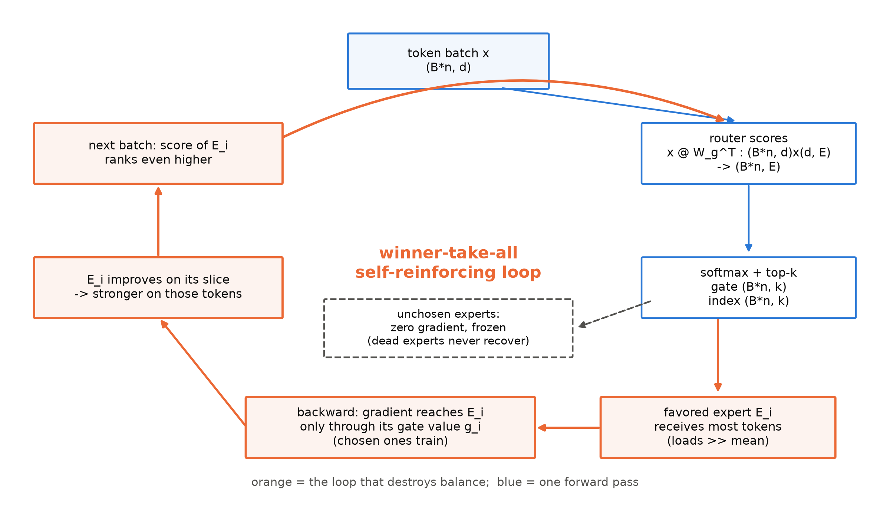
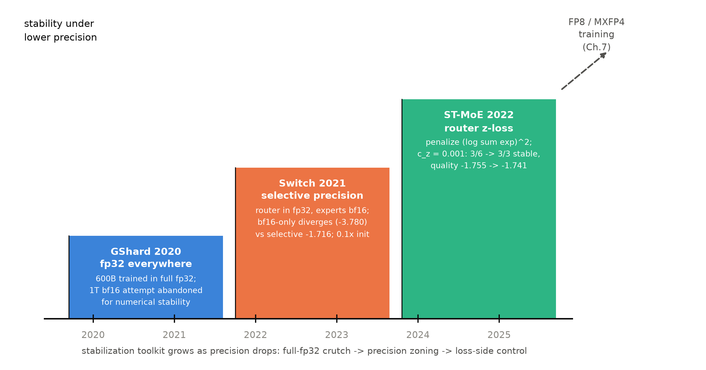
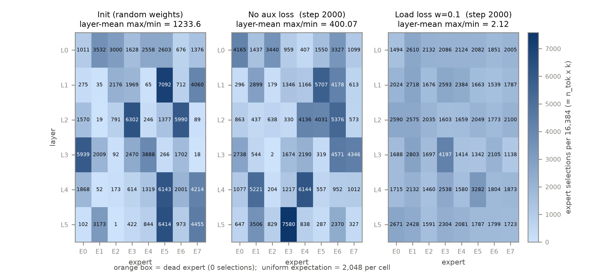

# 第 3 章 MoE 训练难题：负载、不稳定与辅助损失家族

## 3.0 开篇：从全书到这里

上一章我们把 MoE 的机构全部装好了：router 打分、top-k 门控、容量与溢出、专家天然可分片——四件机构在 mini 机器上跑通，B3-9 三问（「选法怎么工作、省在哪儿、训练难在哪」）的前两问交卷。但第三问一个字还没答。而且它不是随口一问：Book3 第 8 章留下过一份原话，Llama 3 论文在 §1 里亲口说出拒绝 MoE 的理由——本章就从这个拒绝开始，把被拒绝路线的难处逐件摆上台面。要回答的问题是：**把 FFN 换成专家群之后，训练会出什么事？出事了历代怎么治？治法的代价是什么？**我们将收获三件东西：负载崩塌的第一手机器现场（本机复现）、一部辅助损失家族四代演化史、以及一张「稳定性三级台阶」时间线；产出物是一份两臂干预实验（none vs 辅助损失）与三张表。章末会到达的位置：三批麻烦各有各的治法与代价，而其中「均衡的代价」将被立成一个正式问题——它的解法要等到第 5 章才兑现；下一章则先让第一台真实旗舰接受验货。

> **最小背景栏**
> - MoE 块数据流与形状流转：router 打分 $(B\cdot n,\,E)$、top-k 掩码、专家分发/合并——第 2 章 2.2 节与图 2.1，本章直接使用不再重画。
> - noisy top-k 与噪声的双重职能（探索 + 可微的负载估计）：第 2 章 2.3 节——本章 3.3 节第一代辅助损失的依赖。
> - 模块实验协议：Book2 五件套（AdamW + 余弦日程 + 固定 eval 窗），单种子 + 趋势判据 + 判据预注册——Book2 第 10 章立、Book3 第 2 章 2.6 节沿用的口径；语料 `tokens.bin`（sp-8k，306M token 流）。
> - 变异系数（coefficient of variation，CV）$=\mathrm{std}/\mathrm{mean}$：一个统计常识量，本章首次把它用作「负载不均」的度量。
> - 大模型训练的 loss spike 病历（PaLM、OPT logbook）：Book2 第 9 章 9.4 节已「认病」；本章看 MoE 时代特有的病灶与处方前史，完整处方笺在第 7 章。

## 3.1 一份拒绝的证词

Book3 第 8 章读过 Llama 3 的代际逻辑，有一句引语当时原样留下没动。论文 §1 谈管理复杂度："we opt for a standard dense Transformer model architecture (Vaswani et al., 2017) with minor adaptations, rather than for a mixture-of-experts model (Shazeer et al., 2017) to maximize training stability."【证据等级：官方论文 2407.21783 v1 §1 直引】——宁可要稠密骨架的小修小补，也不把前馈换成专家群，理由写得明明白白：训练稳定性。这个「拒绝」本身是一份证词：写下这句话的人比谁都清楚 MoE 意味着什么，他们权衡之后付不起或不想付这笔钱。当时的欠账也登记在案：

> 「Llama 3 以训练稳定性为由拒绝了 MoE（把 FFN 换成专家群）：被拒绝的路线训练难在哪里、代价几何、又为何在 2025 年后重新成为主流——Book4 开卷的主角。→ Book4 第 3 章」（Book3 第 8 章欠账框）

现在兑现。把上一章装好的机构真放进训练场，麻烦按出场顺序有三批。**第一批是负载**：路由是自由竞争，竞争会自发走向垄断——个别专家吃撑、多数专家饿死，参数装了一仓库却只用一个角落。**第二批是稳定**：MoE 的训练在低精度下比稠密模型娇气得多，Llama 3 拒绝信里写的那个词就指这里。**第三批是代价**：为治前两批病开出的「辅助损失」本身是一种税——它和语言建模目标抢梯度。三批麻烦、三节正文（3.2/3.4/3.6），中间 3.3 节把历代药方排成一部四代家族史，3.5 节在本机做干预实验验药。先看病：负载是怎么崩的。

## 3.2 赢者通吃：负载崩塌的现场

自由路由的病症，Shazeer 在 2017 年就描述过，而且用词是病理学的口吻，原文逐字：「We have observed that the gating network tends to converge to a state where it always produces large weights for the same few experts. This imbalance is self-reinforcing, as the favored experts are trained more rapidly and thus are selected even more by the gating network.」——我们观察到门控网络倾向于收敛到这样一种状态：它总是给同样的少数专家产生大权重；这种不均衡是自我强化的，因为受偏爱的专家训练得更快，从而被门控网络更多地选中【证据等级：官方论文 1701.06538 v1 §4 直引】。把这句话拆成机制图像，就是图 3.1 那个回路：router 稍微偏爱某专家 → 该专家收到更多 token → 反向传播时梯度只流经被选中的门（第 2 章 2.3 节的梯度通路），于是它被训练得更多、变得更强 → 下一个批次里它对各类 token 的打分相对更高 → 更被偏爱。回路每转一圈，偏爱就加深一层；而落选专家拿不到梯度，原地踏步——极端情形下某个专家计数归零，成了**死专家（dead expert）**：零梯度意味着永远没有翻身机会。赢者通吃（winner-take-all）说的就是这条橙色的环。



图 3.1 赢者通吃的自增强回路（自绘，示意级）。蓝色链是一次普通前向：token 批 $(B\cdot n, d)$ 经 router $W_g$ 得打分 $(B\cdot n,\,E)$，softmax 加 top-k 得门值与选择 $(B\cdot n,\,k)$；橙色链是回路的自增强部分——得宠专家经门值收走梯度、越练越强、打分相对越高。落选专家（虚线框）零梯度。

这个回路的发动机值得再拆一层，因为它不是玄学，就写在梯度的通路上。第 2 章讲过：门控值乘在专家输出上（$y=\sum_i g_i(x)\,E_i(x)$），router 的梯度从乘积流回——**选中一个强专家让 loss 降得多，这份「甜头」就以梯度的形式回哺 router：下次更多地选它**。也就是说自增强不是外部巧合，它就是语言建模损失自己训出来的方向：router 忠实地学习「谁能把 loss 压低」，而当前最强者恰恰是被喂得最多的那个。拿小数字走一遍：8 个专家、每 token 选 2 个，均匀份额是每专家 25% 的选择。第 100 步 router 因初始抽签把 30% 的选择派给 5 号——5 号每步吃到的梯度样本是均值的 1.2 倍，参数更新稍快，对各类 token 的打分整体抬高一点；打分抬高使它下一批接到 35%（1.4 倍）……每转一圈份额涨一点，几十步内斜率温和得几乎看不出，几百步后就是悬崖。

这个回路甚至不需要「训练」来点火：**抽签落定的那一刻，不均衡就已经在初始化里**。Shazeer 的配套技巧是把 $W_g$ 与 $W_{noise}$ 全零初始化——「初始时无信号、纯噪声，各专家负载近似相等」，免得开局就撞进不均衡的局部极小【证据等级：官方论文 1701.06538 v1 附录 A】。我们的 mini 机器没有做零初始化（router 权重按 std=0.02 随机初始化，本册组件正身口径），于是初始化的偏斜可以直接观测：训练开始前用一批固定的 8,192 个 held-out token 做路由探针（下文所有「负载快照」都用这同一批 token，跨臂跨步可比），第 0 层尚近均匀（max/min≈5.2，与探针 B 初始化口径的 ≈5.7 同向），但深层已经高度偏斜——第 1 层最忙专家一人承接 7,092/16,384 = 43% 的选择（均匀份额 12.5%），第 5 层出现计数为 1 的濒死格，六层的层均 max/min 达 1,233.6【证据等级：本书实验（CPU/MPS，2026-10，`ablation_balance.py` init 快照）】。（口径注记：本章探针喂 eval 集 held-out 8,192 token，与探针 B 的训练流口径不同，两表数字不对表、只对同向性。）

那训练是把它治好还是推得更崩？Shazeer 的消融给了文献答案：MoE-256 模型训 10 个 epoch，**不加任何均衡损失时，最忙专家的负载是均值的 17.80 倍**，困惑度 39.8；而任何包含至少一项均衡损失的组合都把质量拉回 35.6-35.7 且均衡良好（附录 A Table 6）【证据等级：官方论文 1701.06538 v1 附录 A Table 6】。教科书说的，我们的机器上也发生了——这就是本章的第一手现场。实验设计先把单变量钉死：两臂同一份 MoE 机器（$E=8$/top-2/专家宽 704，总参 65,042,944、激活参 26,089,984——沿用第 2 章脚本 `params_active` 口径：双份嵌入、不含路由门，折第 1 章单份口径为 21,920,256；与第 2 章 moe 臂逐位同配置）、同种子同数据同日程（Book2 五件套），唯一差异是 **none 臂不加任何均衡干预**——纯交叉熵训练，让自由竞争跑满；aux 臂的药方 3.3 节再开。none 臂的负载快照轨迹（fast 档 300 步）：层均 max/min 从 1,233.6 冲到第 100 步的峰值 6,384.5，死专家格最多时 5/48，300 步末仍有 1 格——负载没有自愈，垄断在加深【证据等级：本书实验（CPU/MPS，2026-10）】。另一口径的参照来自探针 B：训练流 8,192 token 探针下，200 步后第 0 层直方图 $[17, 1550, 5572, 509, 25, 3199, 1303, 4209]$——max/min = 327.8，第 5 层 2 个死专家【证据等级：本书实验（CPU/MPS，2026-10，探针 B run2）】。full 档（同种子、2000 步的再一次独立跑）补上后传与一份警示：层均 max/min 先落回 38-87 一带、看似温和，末段 500 步又漂回 400——第 3 层整层沦陷（专家 6 承接 4,571 次选择、专家 2 只剩 2 次），采样快照里没再出现计数 0 的死格【证据等级：本书实验（CPU/MPS，2026-10，full 档）】。同种子两次训练走出两种严重程度，原因至少有二：MPS 的非逐位确定性（前置实验记录在案的原子加噪声）让路由这种对初值敏感的动力系统分岔；且 fast 的峰值（约第 100 步）恰好落在 full 的采样缝里（full 每 500 步拍一张快照，早暂态被漏拍）。但把三次现场合起来看，交集才是病根：**纯 CE 训练从不把负载带回均匀**——full 全程 MaxVio 停在 0.08 以上（约 aux 臂末态的 3 倍），个别层随时再爆发垄断。崩塌的深度是随机的，「不均衡持续存在」是确定的。

还有一句诚实的观察必须先说：none 臂的 eval loss 此刻仍在正常下降（fast 档 300 步 6.156、full 档 2000 步 4.897，曲线全程健康）——崩塌是慢性病，不是猝死。它的害处要放远了看才显形：其一，**有效容量缩水**——名义激活参 26.1M（双份口径，即上句的 26,089,984），实际计算集中在少数专家身上，等于花八份钱雇人、活都派给两三个熟手；其二，第 2 章 2.6 节说过专家天然分片到不同设备，**慢设备拖全队**——垄断专家所在的设备成为瓶颈，MoE 的效率承诺直接作废；其三，死专家不可逆。Shazeer 那张表里 39.8 对 35.6 的四分困惑度差距，是十个 epoch 后显形的账单。慢，但确定在涨利息。

## 3.3 辅助损失家族四代：把均衡写进损失函数

病看完了，看药。历代 MoE 治负载失衡的药方惊人地一致：**在训练目标上加一项「均衡惩罚」，与语言建模损失一同反传**，把 router 往负载均衡（load balancing）的方向拉——这类附加项统称辅助损失（auxiliary loss）。四代药方可以排成一部家史，每一代解决上一代的一处别扭（表 3.1 是总账，本节按代展开）。

**第一代：Shazeer 双损失（2017）。**它同时压两个量。第一个是重要性（importance）：一个 batch 里各专家拿到的门控值总和 $\mathrm{Importance}(X)=\sum_{x\in X}G(x)$（形状 $(E,)$），惩罚它的不均：

$$L_{\mathrm{importance}}(X)=w_{\mathrm{importance}}\cdot \mathrm{CV}\big(\mathrm{Importance}(X)\big)^{2} \tag{3.1}$$

用人话说：逼着「所有专家的门控值总量」一样大。为什么惩罚取 CV 的平方这个形状？三个理由藏在式子里：CV 是「std 除以均值」，**无量纲**——损失量级不随专家数、batch 大小漂移；它在完全均匀处恰好取 0，是天然的最优点；平方保住光滑可导。后面三代不管形式怎么换，这三条设计约束一条没丢。但光压重要性不够，Shazeer 自己点破了漏洞：**「一个专家可能收到少数带大权重的例子，另一个收到很多带小权重的例子」**——重要性相等、条数悬殊，而分布式硬件上内存与时间吃的是**条数**不是权重。所以要压第二个量：负载（load），即每专家实际收到的 token 数。麻烦在于负载是数出来的离散量，选择之外全是 $-\infty$、计数是阶跃函数，不可导、没法反传。第一代的解法正是第 2 章 2.3 节埋下的那半句：噪声不只用于探索，它还是**可微的负载估计器**。给打分叠上可学习的噪声后，「专家 $i$ 的加噪打分仍能留在 top-k」成了一个概率事件：

$$P(x,i)=\Phi\!\left(\frac{(x\cdot W_{g})_{i}-\mathrm{kth\_excluding}(H(x),k,i)}{\mathrm{Softplus}\big((x\cdot W_{\mathrm{noise}})_{i}\big)}\right),\qquad \mathrm{Load}(X)_{i}=\sum_{x\in X}P(x,i) \tag{3.2}$$

用人话说：在噪声分布下重抽一次签，专家 $i$ 还能留在 top-k 里的概率——概率大，说明它「稳稳地」吃着这批 token；$\Phi$ 是标准正态 CDF，把硬计数磨成了光滑曲面。负载损失与式 (3.1) 同形：$L_{\mathrm{load}}=w_{\mathrm{load}}\cdot \mathrm{CV}(\mathrm{Load})^{2}$，CV 是变异系数（std/mean，均匀分布处取 0）。LM 实验权重 $w_{\mathrm{importance}}=w_{\mathrm{load}}=0.1$【证据等级：官方论文 1701.06538 v1 §4/附录 A/C】。消融读法见 3.2 节那张 Table 6：无损失 17.8 倍失衡、PPL 39.8；0.1/0.1 拉回 1.14 倍、PPL 35.6——「损失是必要的，但不必猛加」（1.0/1.0 也只有 35.7）。

**符号表**（式 (3.1)-(3.3)/(3.6) 按本书记号通用；$E$=专家数（本章实验 8），$k$=每 token 激活专家数（2），$B\cdot n$=展平 token 数。式 (3.4)/(3.5) 逐字转录 Switch/ST-MoE 原文，沿用彼处记号——原文的 $N$=专家数（即本书 $E$）、$T$/$B$=批内 token 数（即本书 $B\cdot n$），见各式后注）

| 符号 | 含义 | 形状/取值 |
|---|---|---|
| $G(x)$ | token $x$ 的门控向量（softmax 后） | $(E,)$ |
| $W_g$ / $W_{\mathrm{noise}}$ | 打分 / 噪声幅度投影 | $(E, d)$ |
| $\mathrm{Importance}(X)$ | batch 内各专家门控值总和 | $(E,)$ |
| $P(x,i)$ | 噪声下专家 $i$ 保住 top-k 的概率 | 标量 |
| $\mathrm{Load}(X)$ | 负载（计数或其平滑代理） | $(E,)$ |
| $\mathrm{CV}(\cdot)$ | 变异系数 std/mean | 标量 |
| $c_e$ / $f_i$ | 实收计数 / 实派比例（不可导通道） | 标量 |
| $m_e$ / $P_i$ | 门控均值 / 概率均值（可导通道） | 标量 |
| $w$ / $\alpha$ / $c_z$ | 各代损失系数 | 标量 |

**第二代：GShard 单损失（2020）。**GShard 把噪声从门控里拆掉了（第 2 章的演化线），式 (3.2) 的 $\Phi$ 通道随之作废——没有噪声，就没有「重抽一次签」这回事。它的替代品是一个漂亮的因子式拆分：

$$\ell_{\mathrm{aux}}=\frac{1}{E}\sum_{e=1}^{E}\frac{c_{e}}{S}\cdot m_{e},\qquad m_{e}=\frac{1}{S}\sum_{s=1}^{S}g_{s,e} \tag{3.3}$$

其中 $c_e$ 是专家 $e$ 实收的 token 数（不可导计数），$m_e$ 是门控值均值（可导），$S$ 为组内 token 数（GShard 把大批均分成 $G$ 个 local group 逐组计算，容量机制也住在组内——第 2 章 2.4 节）。用人话说：**不可导的「份数」乘上可导的「胃口」**——梯度只从 $m_e$ 一条道流回 router，但乘积在「份数大、胃口也大」时最大，罚到的正是又吃得多又门值高的专家；均衡的最小值仍在均匀分布处取得（此时 $c_e/S=m_e=1/E$，$\ell_{\mathrm{aux}}=1/E^2$）。设计动机论文写得直白，原文逐字：「we want to minimize mean square of $c_e/S$. But because $c_e$ is derived from top-2 operation and is not differentiable, we use the mean gates per expert $m_e$ as a differentiable approximation and replace $(c_e/S)^2$ with $m_e(c_e/S)$」——想把 $(c_e/S)^2$ 压到最小，但 $c_e$ 来自 top-2 操作、不可导，于是用 $m_e$ 作可导近似【证据等级：官方论文 2006.16668 v1 §2.2/Algorithm 1 直引】。两项损失并成一项、带噪估计退成无噪 softmax；总损失 $\mathcal{L}=\ell_{\mathrm{nll}}+k\cdot\ell_{\mathrm{aux}}$ 里的乘子 $k$ 论文未给数值（诚实登记：全文与附录均无）。

**第三代：Switch 负载损失（2021）。**形式与式 (3.3) 同构，可导通道与不可导通道的分工写成显式两项：

$$L_{\mathrm{aux}}=\alpha\cdot N\cdot\sum_{i=1}^{N}f_{i}\cdot P_{i},\qquad f_{i}=\frac{1}{T}\sum_{x\in\mathcal{B}}\mathbb{1}\{\arg\max p(x)=i\},\quad P_{i}=\frac{1}{T}\sum_{x\in\mathcal{B}}p_{i}(x) \tag{3.4}$$

$f_i$ 是专家 $i$ 被实派的 token 比例（不可导），$P_i$ 是 router 概率均值（可导）；均匀路由下 $f_i=P_i=1/N$、损失最小。（记号承 Switch 原文：本式的 $N$=专家数、$T$=批内 token 数，即本章符号表的 $E$ 与 $B\cdot n$——本式为逐字转录，不改动原文记法。）用人话说：**实接的份数乘上想接的胃口**——又忙又馋的专家挨罚，梯度沿「胃口」一条道流回 router。多乘的那个 $N$ 是量级归一：均匀时 $\sum_i f_iP_i=1/N$，乘 $N$ 后损失量级不随专家数漂移——Shazeer 靠 CV 的无量纲性解决的问题，这里用显式乘子解决，约束同一条。系数经 $10^{-1}$ 到 $10^{-5}$ 十进制扫描定为 $\alpha=10^{-2}$，判据原文是 "balanced load quickly without interfering with training loss"——快速均衡而不干扰训练损失【证据等级：官方论文 2101.03961 v3 §2.2 直引】。这项损失与第 2 章的容量机制是配套的：容量按「均匀负载」预留（每专家 $(N\cdot k/E)\cdot\mathrm{CF}$ 个位置——第 2 章 2.4 节的一般式），$f_i$ 均匀则溢出率低、走残差直通的 token 少——均衡损失压的正是容量假设成立的前提。Switch 自己认领了这条简化线：「Switch 简化了 Shazeer et al. 2017 的原始设计——后者有分开的负载均衡与重要性加权两个损失」。

**第四代：DeepSeek-V2 三级损失（2024）。**到多机工程时代，「均衡」一个词拆成了三层对象：专家级（别让个别专家饿死）、设备级（别让个别机器成为瓶颈）、通信级（别让个别链路挤爆）。DSV2 相应配了三级辅助损失，系数 0.003/0.05/0.02，外加容量因子 1.0 的 token dropping（保护约 10% 序列免被丢）【证据等级：官方技术报告 2405.04434 v5 §3.1.2】。第四代的看点不在公式（专家级仍是 $f\cdot P$ 形），而在**剂量学**：三个系数差着一个数量级——设备级罚得最重（0.05），因为多机时代最贵的资源是同步等待。

四代连读，一条叙事线自己浮出来：均衡手段的中心从「估计技巧」（怎么把离散计数磨光）一路迁往「工程对象」（均衡谁、罚多重）——损失越配越精细，但**始终是在损失函数里付费**。这笔费用是什么、何时开始疼，3.6 节立账；先看第二件麻烦。

**表 3.1** 辅助损失家族四代对照（公式全部带版本锚；$E$/$N$=专家数，$S$/$T$=批内 token 数）

| 代际 | 均衡损失式 | 可导通道 | 不可导通道 | 系数（实配） | 出处 |
|---|---|---|---|---|---|
| Shazeer 2017 | $w\cdot\mathrm{CV}(\cdot)^2$（importance + load 双项） | 门控值；噪声下 $\Phi$ 概率 | 无（全用可导代理） | 0.1/0.1（LM） | 1701.06538 v1 §4/附录 A |
| GShard 2020 | $\frac{1}{E}\sum_e \frac{c_e}{S} m_e$ | $m_e$（门控均值） | $c_e$（实收计数） | $k$ 未披露 | 2006.16668 v1 §2.2 |
| Switch 2021 | $\alpha N\sum_i f_i P_i$ | $P_i$（概率均值） | $f_i$（实派比例） | $\alpha=10^{-2}$ | 2101.03961 v3 §2.2 |
| DSV2 2024 | 专家/设备/通信三级（专家级仍 $f\cdot P$ 形） | 各级概率项 | 各级频率项 | 0.003/0.05/0.02 | 2405.04434 v5 §3.1.2 |

## 3.4 训练不稳定与 z-loss：三级台阶

回到 Llama 3 拒绝信里的那个词：训练稳定性。MoE 在这件事上确实前科累累，而且前科集中在**低精度**上。三级台阶（图 3.2）按年代走。



图 3.2 稳定性三级台阶时间线（自绘，示意级；数字见正文证据锚）。台阶越往后，可用的数值精度越低、稳定化工具越精细——低精度化与稳定化是同一条线，虚线尽头是第 7 章的训练侧 FP8。

**第一级：GShard 全程 fp32 硬扛（2020）。**600B 模型是训出来的，但代价写在原文里，逐字：「we use float32 for both model weights and activations in order to ensure training stability」——我们对模型权重和激活都用 float32，以确保训练稳定；他们确实试过 1T 参数档的 bfloat16 激活，结果原文记作「several trainability issues with numerical stability, hence did not include the results for the sake of reproducibility」——遇到若干数值稳定性方面的可训练性问题，为可复现性起见不收录其结果【证据等级：官方论文 2006.16668 v1 §4.3 直引】。这一级的处方简单粗暴：全 fp32，用算力和内存换太平。

**第二级：Switch 精度分区（2021）。**全 fp32 太贵，Switch 的思路是把精度当分区资源：**selective precision（选择性精度）**——只在 router 函数体内把输入 cast 到 float32，算完的选择与组合张量转回 bf16，fp32 不进 all-to-all 通信。用人话说：哪里离散哪里精——做「选择」的那几行算术用高精度养着，搬数据和算专家照旧省钱。效果有数：bf16 直训直接发散（Table 2 记作 −3.780 [diverged]），全 fp32 −1.718，selective −1.716 且吞吐 1390 ex/s（比 fp32 的 1160 快、几乎追平 bf16）【证据等级：官方论文 2101.03961 v3 §2.4 Table 2】。配套第二件是**缩小初始化**：截断正态的系数 $s$ 除以 10，3.5k 步 3 种子均值±标准差从 $-3.60\pm0.68$ 收成 $-2.72\pm0.01$——均值与方差同时改善【证据等级：官方论文 2101.03961 v3 §2.4 Table 3】。为什么 router 值得独享 fp32？直觉不难建立：路由器是「小数值撬动大分配」的部件——两个专家的 logits 只差末位一点点，top-k 的选择就整个翻转，而选择决定梯度流向谁；低精度的舍入误差在这个放大器里会被放大成「训练错了对象」。这个直觉在今天的实现里仍是默认动作：HF 的 DeepseekV2 路由器至今强制在 fp32 里做线性打分【证据等级：源码 transformers 5.18.0 `modeling_deepseek_v2.py`】，第 5 章实现对照时还会遇到它。

**第三级：ST-MoE 的 z-loss（2022）。**精度分区之外，ST-MoE 从损失侧补了第三件工具：router z-loss，惩罚 router logits 的绝对量级：

$$L_{z}(x)=\frac{1}{B}\sum_{i=1}^{B}\Big(\log\sum_{j=1}^{N}e^{x_{j}^{(i)}}\Big)^{2},\qquad L_{\mathrm{tot}}=L_{\mathrm{CE}}+c_{B}L_{B}+c_{z}L_{z} \tag{3.5}$$

用人话说：把「打分行那一行的总量级」（log-sum-exp）的平方当罚金——logits 整体越大，exp 与 softmax 里的舍入误差被放大得越凶，这项损失逼着 router 把打分压在温和的量级上。$x\in\mathbb{R}^{B\times N}$ 是进 router 的 logits（记号承 ST-MoE 原文：此处 $B$=批内 token 数、$N$=专家数，即本册的 $B\cdot n$ 与 $E$），$c_z=0.001$（超参扫描后的最佳值）。效果：baseline 6 次里 3 次不稳（−1.755±0.02）；换 z-loss 后 3/3 稳定且质量 −1.741±0.02——不降反微升【证据等级：官方论文 2202.08906 v2 §2.2/Table 4】。同一张表里还有一行反面教材值得顺带念走：把 Adafactor 的 update clip 砍到 0.1 也能 3/3 稳定，但质量崩到 −4.206±0.17——**靠「不更新」换来的稳定不是稳定，是瘫痪**；稳定化工具的及格线是「稳住且不伤质量」，z-loss 是当时唯一过线的一个。这里还藏着本章的考据正菜：

> **【考据框】z-loss 首现于 ST-MoE，不在 Switch。**四篇全文逐字检索「z-loss」：Shazeer 2017 = 0 次，GShard = 0 次，Switch = 0 次，ST-MoE = 25 次【证据等级：官方论文四篇全文 grep，调研期本地缓存核验】。Switch 的稳定工具是 selective precision + 缩小初始化，与 z-loss 无关。更早的源头在代码库而非论文：ST-MoE 自述这是「Mesh-TensorFlow 代码库里用于最终 softmax logits 的 z-loss 的改编」（Shazeer et al. 2018）——概念（final-logits z-loss）先于 router 版存在，把它搬到 router 上并写成论文的是 ST-MoE。它的脚注还提到给 attention logits 加 z-loss 同样有效——这条线第 7 章还会遇到一次。

三级台阶读完，回头读图 3.2 那条虚线：从 fp32 硬扛，到精度分区，再到损失侧控制——**每降一档精度，就多一件稳定化工具**。低精度化与稳定化不是两条线，是同一条线的两级台阶；训练侧 FP8（第 7 章）是台阶的下一层，处方也会更成体系（缩放粒度、保 BF16 的组件清单）。还有一条反直觉的尾巴值得带走：不稳定与**每序列计算量**相关，不与总参数量正相关——1.6T 参数的 Switch-C「完全没有训练不稳定」，反而是 FLOPs 高一个量级的 395B Switch-XXL「有时不稳」【证据等级：官方论文 2101.03961 v3 §2.4/Table 9 讨论】。参数多不等于难训；每个 token 算得越满，数值上越接近边缘。

## 3.5 均衡度量与干预实验：本机两臂对拍

药方有了，现在在本机验药。要比较「均衡与否」，先把尺子造出来——度量先行，否则「更均衡了」只是形容词。三把尺子都以硬计数（真路由，非概率）为原料：对每层统计各专家收到的选择数 $\mathrm{count}_i$（探针 8,192 token × top-2 = 每层 16,384 次选择），归一化为占比 $f_i=\mathrm{count}_i/(n_{\mathrm{tok}}\cdot k)$，均匀期望 $1/E$。

- **层均 max/min**：每层取最忙与最闲专家的计数比（死格下限取 1 防 $\infty$），再对层取均值——「最忙是最闲的几倍」，直白、对死专家敏感；
- **层均 CV**：每层 $\mathrm{std}/\mathrm{mean}$ 再对层取均值——与式 (3.1)/(3.2) 同族，尺子与损失对齐；
- **MaxVio（最大违例，maximum violation）**：$\mathrm{MaxVio}=\max_i |f_i-1/E|$（跨层聚合后取最大，记 global 口径）——noaux 论文用的正是这把尺【证据等级：官方论文 2408.15664 v1】，第 5 章还要用它对拍，此处先立起来。

用人话说：max/min 量「贫富差距的倍数」，CV 量「整体离散度」，MaxVio 量「离理想均匀最远的那一格差多少」。拿真实数字感受一下刻度：$E=8$ 时均匀期望 $f_i=0.125$；我们 init 快照的 MaxVio_global=0.118，意味着跨层聚合后有一格占比约 0.24 或 0.007——最忙格吞了将近两倍的「公平份额」；none 臂崩塌后单层最忙格 $f\approx0.46$-$0.48$（fast/full 两档全部快照一致，见 `log/book4-ch03/ablation_balance_{fast,full}.json`），fast 档最闲格直接归零（full 档末态没有死格、最深饥饿格计数只剩 2——表 3.3 末行）。第三把尺对部署最 relevant：一格严重超载就足以拖垮一台设备。三把尺都读自同一批 held-out 探针 token 而非训练批——均衡性要看「换一批没见过的 token 还均不均」，否则量到的可能只是对训练批的记性。

实验设计与判据都**预注册**（判据文本写于任何 full 档数字落地之前，已随销项记录存档定版）：两臂单变量，none 臂即 3.2 节的崩塌现场；aux 臂加的正是第一代药方的 load 损失，$w=0.1$（Shazeer LM 档口径）：

$$L = L_{\mathrm{CE}} + 0.1\cdot \frac{1}{L_{\mathrm{layers}}}\sum_{l} \mathrm{CV}\big(\mathrm{Load}^{(l)}\big)^{2},\qquad \mathrm{Load}^{(l)}_i=\sum_{x}\mathrm{softmax}(x W_g^{(l)})_i \tag{3.6}$$

用人话说：六层各算一遍「负载摊得匀不匀」（CV² 越小越匀），层均值乘 0.1 计入总损失。判据三条：①aux 臂末态层均 max/min 相对 none 臂**数量级下降**（阈值：差 10 倍以上）；②aux 臂 MaxVio_global $<0.05$ 且死专家格 $=0$；③质量不劣于带宽：$|\mathrm{eval}_{\mathrm{aux}}-\mathrm{eval}_{\mathrm{none}}|\le 0.05$ nat。一条诚实条款必须先念：Shazeer 正身的 Load 用式 (3.2) 的 $\Phi$ 概率代理，那依赖噪声门；我们的门是确定性 softmax top-k（第 2 章教学件口径），$\Phi$ 通道不存在，故**损失环节**改用 softmax 概率质量 $\sum_x P(x,i)$ 作可导代理（方向与计数一致、可反传），**度量环节**一律用硬计数——损失用概率、度量用计数，两者分开念。梯度经 router logits 的前向钩子流回 $W_g$，不改正身组件一行。这条链路的形状流转见表 3.2。

**表 3.2** load 损失的形状流转（训练批 $B=16, T=512$，$N=B\cdot T=8{,}192$，$E=8$，$L_{\mathrm{layers}}=6$）

| 步骤 | 运算 | 输入形状 | 输出形状 | 说明 |
|---|---|---|---|---|
| 1 | router 线性 | $(N,d){\times}(d,E)$ | $(N,E)$ | $d=512$；钩子截取 logits |
| 2 | softmax | $(N,E)$ | $(N,E)$ | 概率质量，$\sum_i P=1$ 每 token |
| 3 | 列求和 | $(N,E)$ | $(E,)$ | $\mathrm{Load}_i$；$\sum_i \mathrm{Load}_i=N$ |
| 4 | CV | $(E,)$ | 标量 | $\mathrm{std}/\mathrm{mean}$（总体 std） |
| 5 | 平方、层均值、乘 $w$ | 6 个标量 | 标量 | 式 (3.6) 的 $L_{\mathrm{load}}$ |
| 度量侧 | softmax+top-k+计数 | $(N,E)$ | $(N,k)\to(E,)$ | 硬计数，喂三把尺子 |

结果汇总于表 3.3（fast 300 步与 full 2000 步双档，同种子 20261002、两次独立跑——MPS 非逐位确定，两档是同种子下的两条轨迹而非同一条的前后段，这一口径下面马上要用到；噪声口径：同种子同数据重跑的 eval 差可达 0.026 nat，臂间差 ≤0.03 nat 一律读作噪声内）：

**表 3.3** none vs aux 干预读数（探针=held-out 8,192 token；【证据等级：本书实验（CPU/MPS，2026-10，`ablation_balance.py`）】）

| 度量 | none（fast 300 步） | aux（fast 300 步） | none（full 2000 步） | aux（full 2000 步） |
|---|---|---|---|---|
| 层均 max/min（init→final） | 1,233.6 → 2,217.2（峰 6,384.5@100） | 1,233.6 → **1.89** | 1,233.6 → 400.1（L3 单层 2,285.5） | 1,233.6 → **2.13** |
| 层均 CV（init→final） | 0.962 → 0.911 | 0.962 → **0.208** | 0.962 → 0.916 | 0.962 → **0.240** |
| MaxVio_global（init→final） | 0.118 → 0.103 | 0.118 → **0.015** | 0.118 → 0.086 | 0.118 → **0.031** |
| 死专家格（/48，final） | 1（峰 5@100） | **0** | 0（最深饥饿格计数 2） | **0** |
| eval_final（nat，±se） | 6.1561 ± 0.021 | **6.1142 ± 0.020** | 4.8966 ± 0.013 | **4.8535 ± 0.013** |
| aux 损失（首 10 → 末 10 均值） | — | 0.0048 → 0.0006 | — | 0.0048 → 0.0008 |
| sec/step（稳态） | 1.183 | 0.892 | 0.713 | 0.614 |



图 3.3 负载前后对照（自产，本机现场招牌图；full 档）。六层×八专家的选择计数热图：左=训练前（随机初始化，两臂同种子同快照），中=none 臂末态，右=aux 臂末态；每格标注该专家收到的选择数（均匀期望 2,048）；橙框=死专家（计数 0，本 full 档末态快照恰未出现——最深饥饿格即中图第 3 层的计数 2；死格现场见 fast 档同图：`make_figures.py --tier fast`）。

fast 档三条判据逐条对着念：①1.89 对 2,217.2，差三个数量级——**通过**；②MaxVio 0.015 < 0.05、死专家 0——**通过**；③eval 差 0.042 nat ≤ 0.05 带宽——**通过**（aux 反而更低，但按噪声纪律只读作「不劣」）。full 档逐条对着念：①2.13 对 400.1，比值 188×（fast 档 1,173×），两档都远超 10× 阈值——**通过**；②MaxVio 0.031 < 0.05、死专家格 0——**通过**；③$|\Delta\mathrm{eval}|$ = 0.043 ≤ 0.05——**通过**，且 aux 更低的方向与 fast 一致（0.042），按噪声纪律两档都只读作「不劣」。过程比终值更有教学味：aux 臂的层均 max/min 轨迹是 1,233.6 → 1,049.7@100 → 2.42@200 → 1.89@300——**干预在开局 100-200 步之间把赢者通吃按了下去**；none 臂则一路带着死专家漂向更深的垄断（6,384 → 3,311 → 2,217，峰谷波动正是「垄断-洗牌-再垄断」的拉锯）。full 档把跑程拉长 6.7 倍再验一遍：aux 从第 500 步起就钉在 1.8-2.1（MaxVio 0.010@500 → 0.031 稳态），none 在 38-87 徘徊后在末段又漂回 400——干预不只是把崩塌按下去，是把均衡**钉住**了整个跑程。图 3.3 把这个对照画成 6×8 格的负载现场：左图训练前深层已偏斜（3.2 节的初始化抽签），中图 none 臂末态=第 3 层整行沦陷（专家 6 吃下 4,571 次选择、专家 2 只剩 2 次），右图 aux 臂是干预后接近均匀的浅色平原。另两笔小账：aux 损失自身从 0.0048 衰到 0.0006/0.0008（两档同形）——惩罚项随均衡达成而自我了断，这正是辅助损失「应缴税额」的直观形态。计时则要如实登记一笔反常：预注册预期钩子与损失项开销 <10%，实测两档都是 aux 臂更快（fast 0.89 对 1.18——none 复跑窗口与后台下载重叠、热节流污染；full 干净链 0.614 对 0.713——污染解释不了）。逐专家 Python 循环的 wall-clock 还受路由桶形与机内热状态影响（垄断臂的最大桶更大），跨臂计时在这种教学实现口径下不可作效应解读，钩子开销淹没其间；正式登记为「未能按预期测出」，不作判据。

顺带一笔证据格局的定位：单机两臂只是教学级样本量，论文级的同类证据基线在开源侧——OLMoE（NeurIPS 2024）用 16 组单变量受控消融（原文 "we vary only one hyperparameter for each experiment"，附录另有 4 组）把路由与均衡相关超参扫了一遍，是本章这条「均衡手段有效但要付税」叙事迄今最厚的公开实验底账【证据等级：官方论文 2409.02060 §4】；本书的增量不在样本量，在于把文献结论搬到你自己的机器上亲手复现一遍。最后一句交棒：aux 臂这台「E8/top-2/无共享 + load 损失」的机器**原封不动兼任第 5 章四臂消融的①号基线臂**——那里的②③④臂（细粒度、细粒度换 noaux、等激活 dense）都从它出发做单变量替换，产物已存档待用。

## 3.6 损失税：均衡的代价

三条判据全过，药是有效的。但「有效」不等于「免费」——辅助损失是加在训练目标上的额外项，它有自己的梯度，而这个梯度与语言建模目标的梯度**不天然同向**。直觉图像：语言目标想让 router 学「按内容分工」（某类 token 该去找最擅长的专家），均衡损失想让 router「把票摊开」（谁都不能太多）——两个方向对同一个 $W_g$ 拉扯。再拆细一层（这是我们的机制解读，不是论文原话）：均衡梯度的方向只由「谁多谁少」决定——多收的专家压分、少收的抬分，**与内容完全无关**；而语言目标要 router 追踪的恰恰是内容。两个信号叠加在同一个打分矩阵上，权重一大，内容信号就被摊票信号淹没。noaux 论文把这笔账写成了引文级的指控，摘要逐字：「a large auxiliary loss will introduce non-negligible interference gradients into training and thus impair the model performance」，引言逐字：「it also introduces undesired gradients that conflict with the language modeling objective」——过大的辅助损失会向训练引入不可忽略的干扰梯度（interference gradients），从而损害模型性能；这些梯度与语言建模目标相冲突【证据等级：官方论文 2408.15664 v1 摘要/引言直引】。干扰不是纯理论：Shazeer 那张 Table 6 里 1.0/1.0 的重税档并不比 0.1/0.1 更好（35.7 对 35.6）——税缴多了，质量不涨反平。

那为什么我们两档的 aux 臂 eval 都不劣反优（−0.042/−0.043 nat，均在噪声带内）？因为税的显形需要条件。式 (3.6) 的 aux 项量级 ~5×10⁻³，比交叉熵（fast 档约 7 nat）小三个数量级，26M 模型几千步的训练里这点拉扯伤不到主线；文献里可测的质量损失出现在 1B 模型 100B token 的长程（noaux 论文的对照实验，数字留给第 5 章）。一句话立账：**辅助损失买均衡，货币是梯度——小档短训买得起，大档长训开始心疼**。能不能不付这笔税、又拿到均衡？这个问题 2024 年有了肯定的答案，而且答案不在损失函数里，在路由机制里——第 5 章的 noaux 免损失路由正是它的兑现，此处按下不表。

## 3.7 本章小结

开篇那份拒绝证词，现在可以逐条批注了。Llama 3 说「以训练稳定性为由拒绝了 MoE」——我们把被拒绝路线的难处拆成了三件事并逐一验明：**负载崩塌**是自增强回路（图 3.1），初始化抽签点火、训练推波助澜，Shazeer 的 17.8 倍与本章本机的 6,384 峰值/死专家是同一病症的两代病历；**训练不稳定**在低精度上集中发作，三级台阶从 fp32 硬扛走到 z-loss，每降一档精度多一件工具；**均衡的代价**是四代辅助损失共同支付的梯度税。本机两臂实验按预注册判据 fast/full 双档六项全过：0.1 权重的 load 损失把层均 max/min 压低 188×（fast 档 1,173×）、死专家清零、eval 两档均不劣于带宽。

**带走的心智**：**负载均衡是 MoE 的第一税**——读任何一份 MoE 配置或论文，看到辅助损失系数（0.1、10⁻²、0.003/0.05/0.02），应该条件反射地读出「这是为均衡支付的税率」，而四代家史的走向（估计技巧→工程对象）提示真正的出路不在把税率调得更精，而在换一种付费方式——这笔判断力第 5 章兑付。第二个心智是那张三级台阶图：**低精度化与稳定化是同一条线**，「敢用多低的精度」从来由「稳定化工具箱有多满」决定——第 7 章 FP8 训练处方是这条线的下一层台阶，到时回看本章只是它的前传。

镜头拉回整机：第一刀的机构（第 2 章）与难题（本章）都齐了——我们知道专家群怎么搭、会生什么病、药方四代怎么演化。但至今所有证据都来自论文与本机的 mini 机器，还没有一台真实旗舰接受过验货。下一章迎第一台：Mixtral 8x7B，全开源旗舰 MoE 的组装术实证——config 反推法第一次独立实习，顺便看看路由器在真模型里到底把 token 派给了谁。

## 3.8 动手验证

- **均衡干预两臂**（fast 档 300 步 ≈2×5 min、full 档 2000 步 ≈2×30 min，MPS 独占窗口；表 3.3 与图 3.3 数据源；断点续跑，重跑同命令自动续）：
  ```bash
  cd 工作区根目录 && source env.sh && \
    python "[`code/ch03/ablation_balance.py`](code/ch03/ablation_balance.py)" --steps 300 --out-name fast
  ```
  full 档（2000 步晚间档）：同命令换 `--steps 2000 --out-name full`。
- **复绘本章三图**（图 3.3 读 `log/book4-ch03/routing_{none,aux}_{tier}.csv`；`--tier auto` 在 full JSON 完整跑毕时自动取 full）：
  ```bash
  cd 工作区根目录 && source env.sh && \
    python "[`code/ch03/make_figures.py`](code/ch03/make_figures.py)" --tier full
  ```
- **探针 B 负载现场参照**（3.2 节引用的 200 步崩塌直方图与死专家，原始产物）：
  ```bash
  cd 工作区根目录 && ls log/book4-feasibility/probeB_moe_run2.json
  ```
