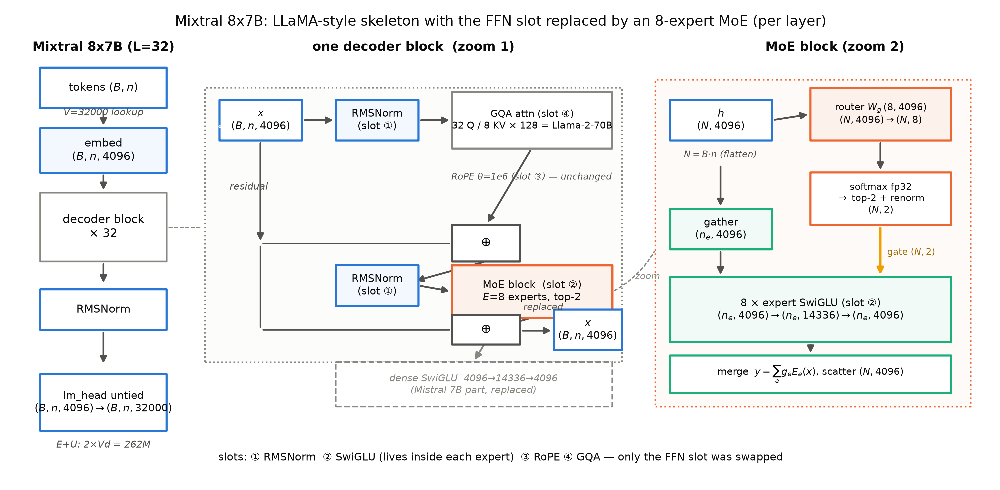
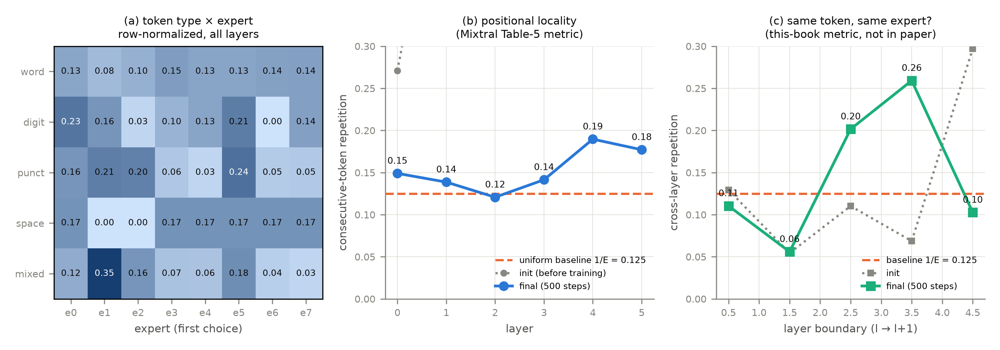

# 第 4 章 Mixtral：开源 MoE 组装术的实证

## 4.0 开篇：从全书到这里

上一章合上时镜头交到了这里：「下一章迎第一台：Mixtral 8x7B，全开源旗舰 MoE 的组装术实证——config 反推法第一次独立实习，顺便看看路由器在真模型里到底把 token 派给了谁。」【第 3 章成稿直引】现在兑现。清点手里的行装：第 2 章把 MoE 的四件机构（router 打分、top-k 硬选择、容量保险丝、gather-scatter 派发）装进了 mini 机器并与 transformers 逐位对拍；第 3 章在同一台机器上验明了负载崩塌的现场与四代药方。但到此为止，证据只有两个来源——别人的论文与自己 26M 的小机器，还没有一台真实旗舰接受过验货。

Mixtral 8x7B 正是理想的第一台，它一身三职。其一，第一台权重与架构全开放（Apache-2.0）的旗舰 MoE——「开源旗舰 MoE」这个物种从它开始。其二，组装学（assembly，Book3 第 8 章立的「把各处验证过的零件装进同一台整机」之学）的官方证词：论文自述与 Mistral 7B 同架构、唯一的结构差异是把每层前馈换成 8 个专家块——「插槽世界观」在这里拿到旗舰级的实证。其三，config 反推五步法的实习场：论文正文只有约 9 页，无架构总图、无训练配方，checkpoint 的 config.json 是唯一够硬的数字源——Book3 第 9 章教了五步法、第 1 章 1.4 节用过其中的「算账对拍」一步，本章第一次独立走完全程，第 10 章还会在没有架构论文的 gpt-oss 上把它升格为主场。

本章是全册「拆解章型」的首演，拆机章有拆机的规矩：先看整机、再拆局部、最后回到整体；而「验货」二字有具体含义——旗舰身上的每个组件都要能指回「我们在第 N 章亲手写过它的 mini 版」：MoE 块指回第 2 章的图 2.1 与对拍证书，负载与均衡指回第 3 章的两臂实验；指不回去的部分，才是本章真正的新知识。图 4.1 就是整机图（Mixtral 论文没有画过架构总图，本图按 checkpoint config 与论文 §2 的结构自述自绘重制）。沿数据河粗走一遍：token 序号 $(B,n)$ 过 32000 行的 embedding 表查成残差流 $(B,n,4096)$；穿过 32 层 decoder block，每层先是注意力子层——32 个查询头共享 8 组 KV 的 GQA，与 Llama 2 70B 同款——再是前馈子层，只是这里住的不再是那只 4096-14336-4096 的 dense SwiGLU，而是一个 8 专家的 MoE 块：展平成 $(N,4096)$（$N=B\cdot n$），router $W_g\in\mathbb{R}^{8\times4096}$ 打分得 $(N,8)$，softmax 后取 top-2 重归一成 $(N,2)$ 的门控，两个被选中的窄车间各算一遍 SwiGLU、加权合并写回残差河；出第 32 层后过终态 RMSNorm，由独立的 lm_head 投到词表。四件套（RMSNorm/SwiGLU/RoPE/GQA）一件没换位置——SwiGLU 没有退役，它住进了每个专家内部；动过的只有 FFN 插槽的供职方式。这张图请先留在脑中，本章每一节都会回到它面前对位。



图 4.1 Mixtral 8x7B 整机结构（自绘重制，示意级——Mixtral 论文无架构总图，结构依据＝checkpoint config（2026-10-04 直读复核）+ 论文 §2 结构自述；几何 $d{=}4096$、$L{=}32$、$h{=}32$、$h_{kv}{=}8$、$d_k{=}128$、$w{=}14336$、$V{=}32000$、$E{=}8$、$k{=}2$）。左=整机，中=单层 Block 放大（灰框=注意力侧原样不动；橙框=FFN 插槽换 MoE；底部虚影=被替换的 dense SwiGLU），右=MoE 块再放大（router 打分 $(N,8)$、top-2 重归一 $(N,2)$、gather-scatter 全标形状）。复现：`python [`code/ch04/fig_ch04.py`](code/ch04/fig_ch04.py) --which machine`

> **最小背景栏**：本章只补一件前置——Mixtral 是谁、8x7B 怎么读，其余全部指回。MoE 块的数据流与形状流转＝第 2 章图 2.1 与表 2.1（router 打分 $(N,E)$、top-k 掩码、派发合并）；负载均衡与辅助损失＝第 3 章（4.6 节的训练臂直接复用其协议）；config 逆向五步法（认家族→重建图纸→算账对拍→读外围→证据分级）＝Book3 第 9 章，其原型在 Book3 第 5 章；组装学四插槽与代际表＝Book3 第 8 章表 8.4/8.5；三口径参数账＝第 1 章式 (1.1)-(1.3) 与表 1.2 的口径纪律；GQA 的 8 KV 头账本＝Book3 第 6 章。

## 4.1 config 反推实习：五步法第一次独立使用

拆机从哪儿下手？论文只有 9 页，先别急着读它——先把 checkpoint 的 config.json 摊开。这步棋的依据是一个更硬的事实排序：论文数字是取整口径、HF 模型卡是一位小数、config 字段是结构事实的原始记录，**数字一律以 checkpoint config 为准**。五步法第一步，认家族：`model_type=mixtral`、`architectures=MixtralForCausalLM`、`transformers_version=4.36.0.dev0`——第三件是年代学证据，把 config 的写入时间钉在 2023-12/2024-01（与权重发布同期）；第二步，重建图纸，逐字段映射到结构部件，这就是表 4.1 与图 4.1 的来源；第三步算账对拍，4.2 节整节交代；第四步读外围（词表、上下文、特殊字段）；第五步证据分级，把每个字段的等级标进表里——config 逆向≠全知，等级列就是它能「读到什么、读不到什么」的诚实边界。

**表 4.1** Mixtral 8x7B config 字段全表（字段→值→部件→等级；raw config.json 2026-10-04 curl 直读复核，与调研期 papers/02 §1.2 逐字段一致——P6 销项口径）

| 字段 | 值 | 映射部件 | 等级 |
|---|---|---|---|
| hidden_size | 4096 | 残差流宽 $d$ | config 逆向 |
| num_hidden_layers | 32 | 层数 $L$（每层全换 MoE，无首层稠密排布） | config 逆向 |
| num_attention_heads / num_key_value_heads | 32 / 8 | GQA $4{:}1$（与 Llama 2 70B 同款） | config 逆向 |
| head_dim | **缺席** | 有效头维按 $d/h$ 派生 $=128$（$32{\times}128=4096=d$ 自洽） | config 逆向（派生） |
| intermediate_size | 14336 | **每专家** SwiGLU 宽 $w$（全宽专家，未切细） | config 逆向 |
| vocab_size | 32000 | 词表 $V$（Llama 1/2 同款 32k SentencePiece BPE） | config 逆向 |
| num_local_experts / num_experts_per_tok | 8 / 2 | $E{=}8$、$k{=}2$（top-2 无共享） | config 逆向 |
| max_position_embeddings | 32768 | RoPE 缓存上限＝原生 32k 上下文 | config 逆向 |
| rope_theta | 1000000.0 | RoPE 底数 $\theta{=}10^6$（长窗出厂档） | config 逆向 |
| sliding_window | null | 无滑动窗字段——32k 全稠密注意力（config 事实；机制的展开属后续册） | config 逆向 |
| hidden_act / rms_norm_eps | silu / 1e-5 | SwiGLU＋RMSNorm（四插槽的两格） | config 逆向 |
| router_aux_loss_coef | 0.02 | 辅助损失系数——**社区转换默认，非论文值**（4.4 节） | 社区配方 |
| tie_word_embeddings | false | untied：出入口两份 $V{\times}d$（Book3 第 5 章） | config 逆向 |
| 训练语料 / 超参 / 负载均衡损失 | **零披露** | ——（论文沉默；4.4 节「配方没开」） | 负结论 |

表里有两处值得停下的地方，它们正是这次实习的新收获。**一处是 head_dim 的缺席**：raw config 里根本没有这个字段，128 是按 $d/h$ 派生出来的有效值。这不只是 trivia——它是 config 逆向的一个坑：字段缺席不等于「模型没有头维」，也不等于「随便填」，而是要按家族的派生规则补（$32\times128=4096=d$ 恰好自洽，补得放心）；对比第 10 章的 gpt-oss（head_dim 显式写进 config 且 $h\cdot d_k>d$ 的罕见几何），「字段在不在」本身就是一条家族指纹。**另一处是两处默认类差异**：拿 checkpoint 实值对 transformers 5.18.0 `MixtralConfig()` 默认类逐字段比对，`max_position_embeddings` 是 32768 对 131072、`router_aux_loss_coef` 是 0.02 对 0.001——默认类是「这个家族的典型几何」，不是「这台机器的实值」，引用时抄错边就是把别人的默认当成了 Mixtral 的配置。这个比对在 [`ch04/mixtral_infer.py`](code/ch04/mixtral_infer.py) 里是一条自动检查（实测恰好命中这两处，脚本判定 PASS）。顺带一提 5.x 的一个读法换代：`rope_theta` 这类字段构造 config 时会被折进 `rope_parameters` 对象，直接属性访问会抛 `AttributeError`——Book3 的整机脚本早有双候选读法的先例，本册沿用。

> **【考据框】head_dim 缺席的复核链。**调研期两路口径曾不一致（一路记「未核」、一路已取实值），批一前置任务 P6 用 curl 直读 hub raw config.json 逐字段复核销项——`head_dim` 字段不存在是这次复核的连带新发现，2026-10-04 本书写作期再次直读确认。同源连带：HF 模型卡的 46.7B/12.9B 正是 config 反推的精确数取一位小数（4.2 节）。config 逆向的纪律因此多一条：**复核要落到 raw 文件，转录笔记与二手页面都不作数**。

第四步读外围，三件快账：词表 32000 与 Llama 1/2 同款（SentencePiece BPE，Book3 第 5 章已拆到字节——Mixtral 连词表都没换，这是「骨架不动」的又一格）；上下文 32k 是**原生**的，论文摘要逐字 "Trained with a 32k-token context"——不是外推租来的窗，与 Book3 第 7 章的外推工程线对照，Mixtral 走的是「出厂长窗」（$\theta=10^6$ 配 32k）；`sliding_window=null` 则是对自家 Mistral 7B 的例外——那台 7B 用了滑动窗字段，Mixtral 反而全稠密。第五步的等级列已经写进表 4.1：config 字段几乎全是一级（config 逆向），唯独 `router_aux_loss_coef=0.02` 必须标「社区配方」——这个数是权重转换进 HF 生态时的社区默认，论文对此沉默，它凭什么不能当论文数字用，4.4 节专门开庭。

## 4.2 参数账两口径：47B/13B 的精确底数

图纸重建完，第三步算账。公式一个都不用新立——第 1 章式 (1.1)/(1.2) 就是为此刻备的，把表 4.1 的字段逐个喂进去，全部整数精确算（Python int 无浮点误差，[`ch04/mixtral_infer.py`](code/ch04/mixtral_infer.py) 逐项 assert）【证据等级：本书复算（config 公式，2026-10，与 ch01/account.py 同源）】。注意力每层 $A=4096{\times}4096+2{\times}4096{\times}1024+4096{\times}4096=41{,}943{,}040$（q/o 全宽、k/v 按 8 个 KV 头缩——GQA 记法承 Book3 第 6 章）；单个专家 $3{\cdot}d{\cdot}w=3{\times}4096{\times}14336=176{,}160{,}768$（SwiGLU 三矩阵）；MoE 槽每层 $8\times176{,}160{,}768+4096\times8=1{,}409{,}318{,}912$（专家群＋router $W_g$）；32 层再加 untied 出入口两份 $2Vd=262{,}144{,}000$ 与终态 norm，总参 $46{,}702{,}792{,}704$。激活参按本册口径（含 lm_head、不含输入 embedding lookup）$=32\times(41{,}943{,}040+2\times176{,}160{,}768+32{,}768+8{,}192)+Vd+d=12{,}748{,}853{,}248$，双份再加 $Vd=131{,}072{,}000$ 得 $12{,}879{,}925{,}248$。

**表 4.2** 参数账两口径：自算 vs 官方（激活参口径见第 1 章 §1.3；MoE 计入路由门 $E d$，其量级见首行注）

| 项 | 自算（逐位） | 官方口径 | 判读 |
|---|---|---|---|
| 总参 | **46,702,792,704** | 论文 47B【官方论文 2401.04088 v1 摘要】；HF 卡 46.7B【config 逆向】 | 取整口径：46.703→47、46.7 都对 |
| 激活参·单份 | **12,748,853,248** | 论文 13B（摘要取整） | 12.75→13；路由门 $32\times32{,}768$ 占其 0.008%——计不计入两位小数内无感 |
| 激活参·双份 | **12,879,925,248** | HF 卡 12.9B | 12.88→12.9，一位小数吻合 |
| 单专家 | 176,160,768（≈176.16M） | —— | 与 Mistral 7B 的 FFN 同宽（4.3 节） |
| MoE 专家占总参 | **96.56%** | —— | 读懂专家=读懂整机的大头（承第 1 章） |

这笔账的第一教学点是「口径差=取整」：论文的 47B/13B、模型卡的 46.7B/12.9B、我们的 46,702,792,704 不是三套数字，是一套数字的三种修约——论文取整到整 B、卡片取一位小数、config 反推逐位。引用时写精确数、注明修约来源，三方便不打架（第 1 章表 1.3 的「披露越全账越平」在此又下一城：Mixtral 是 config 级披露，账能算到个位数）。

第二教学点藏在名字里。8x7B 这个名字容易读成「8 台 7B」——乘出来 56B，与 46.7B 对不上。对不上就对了，因为加法分解才是真相：**Mixtral ＝ 一台 Mistral-7B 几何的稠密机（7,241,732,096 参）＋ 7 份 FFN 复件（$7\times32\times176{,}160{,}768=39{,}460{,}012{,}032$）＋ 路由门（$32\times4096\times8=1{,}048{,}576$）**，三项相加逐位等于总参（脚本内置 assert）。名字把「8 份复制的只是 FFN 插槽、注意力与出入口只装一份」这个组装学事实藏在了乘号后面——骨架是共享的，专家是插上去的。第 2 章「MoE 不是新机型、是 FFN 插槽的替换件」的命题，在这行加法里有了逐位的算术形态。

## 4.3 组装学证据：四插槽清点，注意力零改动

账算平了，回到图 4.1 验「组装学」的正题。Mixtral 论文摘要把同构性说得毫不含糊，逐字："Mixtral has the same architecture as Mistral 7B, with the difference that each layer is composed of 8 feedforward blocks"——与 Mistral 7B 同架构，差别只是每层由 8 个前馈块组成【证据等级：官方论文 2401.04088 v1 摘要直引】。§2 补充说明它沿用 Mistral 7B 论文描述的全部修改，例外仅两处：32k 稠密上下文（4.1 节已读）与 FFN 换 MoE。逐插槽对齐 Book3 第 8 章的清单：

- **① RMSNorm**：pre 结构、eps 1e-5，与 LLaMA 系逐字同款——不动；
- **② SwiGLU**：结构不动，**搬家**——从「每层一只宽 14336 的车间」搬进「每层 8 只宽 14336 的专家」，门控三矩阵原样（论文 §2.1 自述专家函数 $E_i(x)$ 用 "the same SwiGLU architecture"）；
- **③ RoPE**：$\theta=10^6$、全头维旋转——机制不动，底数取长窗档；
- **④ GQA**：32 查询头共享 8 组 KV——与 Llama 2 70B 同一款（Book3 第 6 章的甜点配置），**注意力侧零改动**。

这份清单的分量要用源码压一遍才踏实。transformers 5.18.0 里 `MixtralDecoderLayer` 与 Llama 的 decoder layer 逐成员同构——两枚 RMSNorm、self_attn、post_attention_layernorm、mlp，唯一的替换就是 `mlp` 从稠密 SwiGLU 换成 `MixtralSparseMoeBlock`【证据等级：源码 transformers 5.18.0 `modeling_mixtral.py`】；键位层面更直白：hub checkpoint 里注意力四投影的键名 `self_attn.{q,k,v,o}_proj.weight` 与 Book3 整机完全同名，MoE 的键挂在 `block_sparse_moe.*` 目录下——**MoE 化不动注意力键**（第 9 章拆 DSV2 时这张键位对照表还要扩展）。所以「Mixtral 只是换 FFN 插槽」不是我们的读后感，是论文、config、源码、键位四层证据的同向陈述——第 2 章插槽观的第一次旗舰级闭环。

两个「插槽取值」的细节还值得各停一眼，因为它们都在跟代际对话。其一是 GQA 的档位：Book3 第 8 章表 8.4 记得很清楚，Llama 2 只有 34B（训而未发）与 70B 两档用 GQA，7B/13B 仍是 MHA——而 Mixtral 这台「13B 激活」量级的机器已经用上与 70B 同款的 8 KV 头。插槽化的含义正在这里：零件一旦进清单，晚辈取用不再看身量、只看账本——8 KV 是 KV 通行费的甜点（Book3 第 6 章），Mixtral 长上下文的野心让它提前把这件甜点装到了 13B 激活的小档上。其二是插入密度：第 2 章表 2.2 排过谱系——GShard 每隔一层换一个 FFN、Switch 每层都换；Mixtral 站 Switch 一侧（每层全换），且**没有**首几层保持稠密的排布字段。这个「首层稠密」的小机关要到 DeepSeek 系才出现（DSV2 首层、DSV3 前三层，理由与负载收敛有关）——届时回头看，Mixtral 的排布是最朴素的一种，谱系表上它只是起点而非终态。

回整体收拢一眼：四插槽三件原样、一件换供职方式，残差河宽度 $(B,n,4096)$ 一寸不变，MoE 块的输出仍是 $(B,n,4096)$——对外接口与稠密机完全相同。这也是「组装术」的真正含义：Mixtral 没有发明任何新机构（router+top-2 是 Shazeer 2017 的、SwiGLU/RoPE/GQA 是 LLaMA 谱系的），它做的是把第 2 章那套现成机构装进一只被验证过的骨架——论文自己都把路由公式原样写在 §2.1：$y=\sum_{i=0}^{n-1}\mathrm{Softmax}(\mathrm{Top2}(x\cdot W_g))_i\cdot\mathrm{SwiGLU}_i(x)$（与第 2 章式 (2.1) 同一机构），并与 GShard 划清界限，逐字："This formulation is similar to the GShard architecture, with the exceptions that we replace all FFN sub-blocks by MoE layers while GShard replaces every other block, and that GShard uses a more elaborate gating strategy for the second expert assigned to each token"——例外恰是两处：插入密度（Mixtral 每层全换、GShard 每隔一层，正是上文谱系行的对照项）与第二专家的门控（GShard 为第二专家配了更精巧的选择策略，Mixtral 不做这种处理）【证据等级：官方论文 2401.04088 v1 §2.1 直引】。机构是旧的，装法是新的：全宽专家、每层都换、注意力零改动。

## 4.4 论文数字与诚实条款：成绩单怎么读

机构验完，看成绩单。Table 2 对 Llama 2 70B，表题逐字："outperforms or matches Llama 2 70B performance on almost all popular benchmarks **while using 5x fewer active parameters during inference**"——多数基准持平或反超，推理激活参数少 5 倍【证据等级：官方论文 2401.04088 v1 Table 2】。挑四格看：MMLU 70.6 对 69.9，HumanEval 40.2 对 29.3，MATH 28.4 对 13.8，GSM8K 74.4 对 69.6（8-shot maj@8 口径）。这个「5x」的底数顺手就能补上：Llama 2 70B 是稠密机、激活参＝总参，按 4.2 节同一套 config 公式算 Llama 2 70B 得 68.98B（Book3 第 8 章的账），对 12.88B（双份）≈5.35。Table 3 再对闭源的 GPT-3.5：MMLU 70.6 对 70.0，MBPP pass@1 60.7 对 52.2，GSM-8K 5-shot 58.4 对 57.1，MT-Bench（Instruct 版）8.30 对 8.32——开源模型第一次在这个档位上追平闭源前沿【证据等级：官方论文 2401.04088 v1 Table 3】。（GPT-3.5 参数未公开，体量倍数不引。）同一篇论文两张表都叫 GSM8K、数字却是 74.4 对 58.4——不是矛盾，是 harness 不同：Table 2 用 8-shot maj@8、Table 3 用 5-shot，评测设置写在 §3 的项目符号里。引用时表号与 shot 数必须同带，这是「同名指标不同口径」在单篇论文内部的现场版。

比成绩单更值钱的是 §3 那段诚实条款，它把第 1 章「省什么、不省什么」的清单官方化了一遍。论文先立正面账：激活参数 "directly proportional to the inference compute cost"——推理算力随 13B 走；紧接着自己报了两笔开销：其一，"the SMoEs layer introduces additional overhead due to the routing mechanism"——路由机制引入额外开销（正是第 1 章 1.5 节的「调度税」与第 2 章本机实测 2.0 倍派发开销的论文版）；其二，"The memory costs for serving Mixtral are proportional to its sparse parameter count, 47B"——服务显存随稀疏参数 47B 走，「不过仍小于 Llama 2 70B」。速度则按 batch 分两段说（§1 的 "faster inference speed at low batch-sizes, and higher throughput at large batch-sizes"），措辞克制——但这两段恰好各赢在一本账上，用第 1 章的三口径能读出所以然：小批量时瓶颈是每 token 计算量（随 13B 激活参走，对 70B 是 5 倍优势）；大批量时瓶颈移向权重显存与带宽（随 47B 总参走，对 70B 仍占优）——**batch 从小到大，赢的账本从「通行费」换到「仓库」**，这就是为什么两段论要分开说。有一条红线必须立此存照：**论文里没有「以 13B 稠密模型的速度运行」这类句子**——全文检索无此表述；显存那句只说「小于 70B」，速度两段论不含与稠密 13B 的直接对比。转述 Mixtral 时把速度账说满，是引用纪律。

最后开庭审那个 0.02。Mixtral 论文（正文约 9 页）**通篇不提**训练语料、训练超参与负载均衡损失——第 3 章那部四代家史在它这儿一个字都没对上，唯一沾边的是 §5 一句部署期的提醒："it is essential to distribute the workload evenly across the GPUs"（负载必须均匀摊到各 GPU——这是 EP 部署侧的话，不是训练配方）。而 HF config 里白纸黑字的 `router_aux_loss_coef=0.02`，是权重转换进 HF 生态时的社区默认值【证据等级：社区配方】。两件事拼起来的教学点是：**开源=权重＋架构开了、配方没开**。想复现 Mixtral 的人拿着 HF 默认 0.02 去训，付的税率是社区的、不是 Mistral 的——第 3 章说过辅助损失是「为均衡付的税」，现在连税率是多少都无从对证。这不是 Mixtral 一家的毛病（闭源配方的厂商更多），但它是「开源」这个词最诚实的读法：拿到的是一台装好的机器和它的图纸（config），不是造它的工艺。工艺级开源的反面教材下章就到——DeepSeekMoE 连消融表格都全数公开。

> **【实现对照框】** HF transformers 5.18.0 的 aux 管道：`output_router_logits=True` 时顶层 forward 自动算 Switch 式负载损失 $\mathcal{L}_{aux}=E\sum_e f_e P_e$ 并执行 `loss += router_aux_loss_coef * aux_loss`（5.18.0 改为逐层累积、末尾归一的 $O(n\cdot E)$ 内存实现）【证据等级：源码 transformers 5.18.0 `modeling_mixtral.py#load_balancing_loss_func`】。也就是说：社区默认 0.02 不是死字段，谁用 HF 默认配置微调谁就真金白银地付了这笔税——「config 里躺着的系数」与「训练时生效的系数」之间，隔着一条默认值开关。

## 4.5 路由分析三结论：路由器到底把 token 派给了谁

成绩单背后有个所有人都想问的问题：8 个专家到底怎么分工的？论文 §5 做了路由分析（routing analysis），三条结论各带证据强度，值得逐字读——因为它们是全章最容易被转述走样的部分。

**结论一：没有主题分工（domain specialization，按内容领域给专家分科）。**论文在三个领域语料（ArXiv、PubMed、PhilPapers）上统计专家分布，逐字："Surprisingly, we do not observe obvious patterns in the assignment of experts based on the topic."——出乎意料地，没有观察到基于主题的专家指派模式，三域的分布 "very similar"【证据等级：官方论文 2401.04088 v1 §5 直引】。注意句子的强度：这是**直接观测的否定**，不是「还没找到」的推托。

**结论二：句法对齐（syntax alignment），但语气是推测级。**Figure 8 研究标点、缩进这类 token 的专家选择，表题的措辞是 "appears to be more aligned with the syntax rather than the domain"——**看起来**更对齐句法而非领域；正文接 "This suggests that the router does exhibit some structured syntactic behavior"——**这提示** router 确有某种结构化的句法行为，且初始层与最终层尤其明显【证据等级：官方论文 2401.04088 v1 §5/Fig 8 直引】。appears、suggests——论文自己把这条标成推测级，转述时不能升格成定论。

**结论三：位置局部性（positional locality）。**Table 5 统计「连续两个 token 的第一选择（first choice，top-2 的第一槽）专家是否相同」：第 0 层表印 13.6%-14.9%（八个域的区间），论文表注给出随机指派下的基线 12.5%——恰是 8 选 2 下第一选择的均匀概率 $1/8$，层 0 贴着基线（12.5% 不是异常，是基线，表印值还略高于它）；第 15 层升到 23.6%-28.4%、第 31 层 19.7%-26.3%——深两层显著高于基线【证据等级：官方论文 2401.04088 v1 §5 Table 5】。论文还自己给出部署含义：这种局部性在专家并行下可能让个别专家过载（over-subscription），但也可以被缓存利用——"can be leveraged for caching"。

三条合起来是一幅很反直觉的图景：专家不是「数学专家/医学专家」，内容轴上近乎均匀；真正的结构长在两个更浅的轴上——什么样的 token（句法）与相邻的 token（位置）。防过度转述清单三条红线：①「专家按领域分工」——论文明确否定，讹传；②「路由完全随机」——错，句法结构存在；③「12.5% 是异常」——它是随机基线，深层高于它才是现象。这些结论的可信度也要放回证据格局里称：它是一台模型、三个域、一套探针的观测，不是跨模型定律——所以下一节把它搬回本机。

> **【考据框】「专家按领域分工」的讹传史。**把 MoE 专家讲成「一个管数学、一个管代码、一个管医学」是中文与英文社区共有的流行想象，Mixtral 的官方观测恰好相反：三域分布 very similar、结构在句法与位置。讹传的源头不难猜——「专家」这个比喻本身就在暗示分工，而第 5 章 DeepSeekMoE 的「共享专家隔离公共知识」会给出更准确的分工图景：分的是「公共/专用」，不是「数学/医学」。读到任何「专家特化于某领域」的断言，先问一句：哪台模型、哪层、什么观测？

## 4.6 替身与自家版：把三结论搬回本机

想在自己机器上看路由，先过一道选型关。Mixtral 真权重 bf16 要 93.4GB（第 1 章 1.5 节的账），48GB 统一内存直接出局——本册替身（stand-in）清单里排除它，正为此。候选是两台更小的开源 MoE，而**选型过程本身就是五步法的浓缩再演**——导览 0.6 节许过一句「对拍真权重按许可与 48GB 内存选定，选型过程本身是一轮 config 逆向练习（第 4 章演示）」，兑现处就在这里。第一位替身 OLMoE-1B-7B-0924（AI2，Apache-2.0）：①认家族读 config——$d{=}2048$、$L{=}16$、$E{=}64$、top-8、每专家宽 1024，路由 softmax 但 `norm_topk_prob=false`（top-8 后不重归一）——与 Mixtral 同属 softmax 族（Mixtral 重归一、它不归一，族内小差异要登记）；②算账——总参 6.92B、激活 1.18B（本册口径），对官方通称 ~7B/~1B 逐位可核；③内存两口径——bf16 权重 13.8GB，本机可载；④保真度声明——**OLMoE 是 MHA（$n_{kv}=16=n_h$）而非 GQA**，细粒度 64 选 8 也与 Mixtral 的粗粒度 8 选 2 不同科，把它的路由观察外推到 Mixtral 要先声明这两条差异【证据等级：config 逆向，2026-10 直读 hub config】。第二位 Qwen3-30B-A3B 条件性备选：bf16 61.07GB 超内存，4bit 约 17GB 勉强可载（社区量化路径，本版未启用）；它的账（30.53B 总参、3.35B 双份复算对官方 30.5B/3.3B；单份复算 3.04B 与官方的双份数不可并排配对）正是第 1 章表 1.2 审计过的双份口径样本——**替身选型的每一步都在复用本册已立的工具**。

如实登记预取状态：OLMoE 权重 13.84GB 预取与 V2-Lite 下载共用带宽，本章写作时点落地约 8.5/13.84GB（config 与 tokenizer 已齐、权重分片未全）——真权重路由统计是条件性任务，不阻塞；本版以 config 级选型演示收官，三结论的复现交给自家版。

自家版的机器就是第 3 章那台 mini MoE：$E{=}8$/top-2/专家宽 704——**与 Mixtral 同几何**（8 选 2、无共享、每层全换），单专家半宽是等激活配臂的代价（第 2 章），如实声明。它的结构对拍证书也是现成的：第 2 章的 mini Mixtral（Book3 组件装 FFN 插槽）对 HF `MixtralForCausalLM` 同 config 随机权重 strict 直搬，max$|\Delta\mathrm{logits}|$=8.34e-07、argmax 一致率 100%（可行性探针 G 同口径 1.07e-06；本批复验仍 PASS）——「组装术」在本机代码层的对应物：整机里唯一的新零件就是 mlp 插槽里那只 MoE 块。训练臂沿用 ch3 aux 臂协议（load-loss $w{=}0.1$、Book2 五件套、500 步 fast 档、单种子 20261002）——ch3 的快照 ckpt 按破坏性覆写零容忍纪律臂完成即删，故同种子同协议重训（模型构造同种子，初始权重与 ch3 逐位相同）：真实旗舰必带某种均衡，路由统计要在「健康」的 router 上做——末态各层 max/min 落在 1.2-1.9，均衡达标。探针用 held-out 16,384 个 token（eval.bin 首段），训练前后各拍一张快照——「训出来的结构」与「初始化自带的几何」必须分开记账。三件指标的定义式如下（$L{=}6$ 层、首选项＝top-2 的第一槽）：

$$r_l \;=\; \frac{1}{B\,(T-1)}\sum_{b=1}^{B}\sum_{t=1}^{T-1}\mathbb{1}\big[z^{(l)}_{b,t+1}=z^{(l)}_{b,t}\big] \tag{4.1}$$

用人话说：第 $l$ 层里，一个 token 与它右边相邻 token 的第一选择专家相同的频率——全随机时等于 $1/E{=}12.5\%$（$z^{(l)}_{b,t}\in\{0,\dots,7\}$ 是位置 $(b,t)$ 在第 $l$ 层的首选项专家号，形状 $(L,B,T)$；这正是 Mixtral Table 5 的口径）。层与层之间是否共用编号，另设一问：

$$c_l \;=\; \frac{1}{B\,T}\sum_{b=1}^{B}\sum_{t=1}^{T}\mathbb{1}\big[z^{(l+1)}_{b,t}=z^{(l)}_{b,t}\big] \tag{4.2}$$

用人话说：同一个 token 在相邻两层的第一选择是否落在同一个专家上——本书自设口径（Mixtral 论文未报），预期贴着 $1/8$：每层专家群各是一套独立参数，专家编号没有跨层共享的语义，量它就是为了验证这一点。第三件是分工矩阵：我们的语料是 OWT 子采样，没有 ArXiv/PubMed 式的域标签——Mixtral 的域轴无法照搬，改用 **token 类型轴**（用 sp-8k 词表把每个位置分成词/数字/标点/空白/混合五类），与论文 Fig 8 的句法轴同族而更细。这个改动是诚实声明的一部分：域级「无分工」我们没测，测的是类型级。

**符号表**（式 (4.1)/(4.2)）

| 符号 | 含义 | 形状/取值 |
|---|---|---|
| $z^{(l)}_{b,t}$ | 位置 $(b,t)$ 在第 $l$ 层的首选项专家号 | $(L,B,T)=(6,8,2048)$，取值 $\{0,\dots,7\}$ |
| $r_l$ | 第 $l$ 层连续 token 重复率 | 标量，基线 $1/E=0.125$ |
| $c_l$ | 层 $l{\to}l{+}1$ 的层间重复率 | 标量，基线 $1/E=0.125$ |
| 探针批 | held-out token（eval.bin 首段） | $(8,2048)=16{,}384$ 个 |

读数全画在图 4.2 里【证据等级：本书实验（MPS bf16 训练/CPU fp32 统计，2026-10，`route_analysis.py`，单种子）】。**矩阵一（分工）**：主力类「词」（85,788 次首选、占全部首选计数的 87%）的行分布几乎贴着均匀线——八格 0.084 到 0.146，对 $1/8$ 的最大偏离 0.041；而「标点」（11,118 次首选）明显偏斜——专家 1/2/5 合吃 65.3%、专家 3/4/6/7 只剩 18.4%（最大偏离 0.115），「数字」（834 次首选）也偏向专家 0（0.230 对均匀 0.125）。翻成 Mixtral 的语言：内容主体无分工、结构出现在句法敏感的类——第 4.5 节结论一与结论二的**雏形，在 26M/500 步的小机器上已经显影**。样本量要随行念清（首选计数＝位置数×6 层，总 98,304）：词与标点两类是六位数与五位数量级，读数可判；数字类 834 次，只作方向参考；混合 372 次、空白 192 次，不作判读——**小类的偏离值先除以样本量再信**，这是读一切分布对比的卫生习惯（第 1 章口径审计的统计版）。**矩阵二（位置）**：训练后的重复率逐层为 $[0.149,\ 0.139,\ 0.121,\ 0.141,\ 0.190,\ 0.177]$——浅四层贴着 0.125 基线，第 4/5 层高出基线四到五成（0.190/0.177 对 0.125）。形状与 Mixtral 的「层 0 近随机、层 15/31 显著更高」同构（层序同向、幅度更小：0.190 对 0.284——26M 模型 500 步对 47B 模型，量级差三个数量级，趋势级对照）。**矩阵三（层间，本书口径）**：五条层边界 $[0.110,\ 0.056,\ 0.202,\ 0.259,\ 0.103]$——均值 0.146 贴基线，无跨层强耦合，「每层各一套专家」的零假设成立；但逐对看有起伏（3→4 边界 0.259、1→2 边界 0.056），相邻层的 router 面对的是逐渐演变的同一份残差流，选择相关不奇怪——登记为现象，不作结论。

还有一笔只有自家版才付得起的账：**训练前的快照**。init 的重复率逐层 $[0.271,\ 0.571,\ 0.525,\ 0.705,\ 0.803,\ 0.856]$——比训练后高得多，深层尤其夸张。这批「局部性」不是学出来的，是几何赠品：初始残差流被上下文主导，相邻 token 的表征本来就相似，随便一个固定 router 都会连续复选；训练（外加均衡损失）把这份伪局部性压回基线附近，只留深层一段超基线的残项——Mixtral 量到的深层重复率（层 15 的 23.6%-28.4%），应当理解为**训练后仍存活的真局部性**，而不是 router 的全部倾向。这层分辨论文做不做都无所谓（它只有训好的模型），但复现实验做得起，也值得做——「先量 init 再量 final」从此进本书的实验纪律。



图 4.2 自家版路由统计三图（自产，`fig_ch04.py` 绘制；训练臂＝ch3 aux 臂同款 E8/top-2，500 步，单种子 20261002；探针＝held-out 16,384 token，CPU fp32 统计）。(a) token 类型×专家的首选项分布（行归一化，全层累计；词行近均匀、标点行偏斜——结论一/二的雏形）；(b) 逐层连续 token 首选项重复率（Mixtral Table 5 口径；虚线＝随机基线 1/8；灰点线＝训练前、蓝线＝训练后——init 的高重复率是表征相似性的几何赠品）；(c) 层间重复率（本书补充口径，论文未报；贴基线波动＝每层专家编号独立）。数据：`log/book4-ch04/route_analysis_run1.json`。

## 4.7 本章小结

开篇的三问逐条交卷。**机构在旗舰上长什么样**——四插槽三件原样一件换件，注意力侧（GQA 8 KV，与 Llama 2 70B 同款）零改动，「MoE 只是换 FFN 插槽」拿到论文、config、源码、键位四层证据；46.7B 的加法分解（7.24B 骨架＋7 份 FFN 复件＋路由门）把这句话算到了逐位。**账怎么算**——五步法第一次独立走完：字段全表（含 head_dim 缺席与两处默认类差异的坑）、参数账两口径逐位（46,702,792,704/12,748,853,248 单份），论文 47B/13B 与卡片 46.7B/12.9B 都是它的修约。**路由器把 token 派给了谁**——论文三结论（无主题分工、句法对齐推测级、位置局部性）逐字读过、红线立住；自家版在 26M 档复现出前两条的雏形（词类近均匀、标点类偏斜、深层重复率超基线五成），并补了论文没有的两笔账：层间编号独立（本书口径）与 init 快照（局部性的几何成分）。

**带走的心智**：**其一，旗舰的架构新闻多半是插槽新闻。**Mixtral 与 Mistral 7B 的全部架构差异是一行 config（`num_local_experts=8`），读任何新旗舰先铺开四插槽清单问「哪格换了件、哪个旋钮拧了」——Book3 第 8 章那幅冻结骨架图的判断力，在 MoE 世代继续生效。其二，**开源的边界要诚实读**：权重与架构开了、配方没开——0.02 是社区的税率不是 Mistral 的，训练语料与均衡损失全文零披露；而 checkpoint config 比论文更硬（论文取整、默认类有偏、raw 文件才算数）——「数字以 checkpoint config 为准」从纪律变成手感。第三个附赠的判断力来自 4.7：路由的「结构」要减去几何赠品再看——先量 init 再量 final，是读一切路由分析报告的解毒剂。

镜头拉回全书：第一刀的「机构—难题—实证」三部曲，到本章补齐了最后一环——但 Mixtral 这台实证机同时也把第一刀的局限摆上了台面：8 个全宽专家、每个都是「全才」，每个 token 拿到的是两份完整配方的混合。第 2 章 2.8 节的三学派表已经预告过另一条路：把专家切细、再留一个常驻的公共底座——16 选 2 只有 120 种组合，64 选 8 有约 44 亿种。全才为什么是浪费、切细为什么更好、均衡的损失税怎么彻底免掉，下一章的 DeepSeekMoE 三连创新逐件开庭。

## 4.8 动手验证

```bash
cd 工作区根目录 && source env.sh

# ① config 反推实习：五步法全程（表 4.1/表 4.2 数据源；CPU 秒级）
python [`code/ch04/mixtral_infer.py`](code/ch04/mixtral_infer.py) --out-name run1
#   验收行：[判定] PASS（6 项参数 assert 逐位 + 恰好 2 处默认类差异 + head_dim 缺席检出）
#   产物：log/book4-ch04/mixtral_infer_run1.json

# ② 自家版路由统计：训练 500 步 + 三件指标（MPS ≈7 min；--no-train 复用模型档只重跑统计）
python [`code/ch04/route_analysis.py`](code/ch04/route_analysis.py) --steps 500 --out-name run1
python [`code/ch04/route_analysis.py`](code/ch04/route_analysis.py) --steps 500 --out-name run1 --no-train
#   产物：log/book4-ch04/route_analysis_run1.json + route_model_run1.pt（不入库）

# ③ mini Mixtral 结构对拍证书复验（CPU 秒级；第 2 章教学件，本批复验仍 PASS）
python [`code/ch02/moe.py`](code/ch02/moe.py) --out-name batch2chk
#   验收行：[③ vs HF 5.18.0] max|Δlogits| = 8.34e-07 | argmax 一致率 = 1.0000

# ④ 本章两图（图 4.1 整机 / 图 4.2 路由统计三图——后者读 ② 的 JSON）
python [`code/ch04/fig_ch04.py`](code/ch04/fig_ch04.py) --which all
```

验收点：能对 Mixtral config 独立走完五步法并说出两处默认类差异与 head_dim 的处理；能把 46.7B 分解成「骨架＋FFN 复件＋路由门」；能复述路由三结论并给每条标证据强度；能解释 init 快照为什么必须拍。
