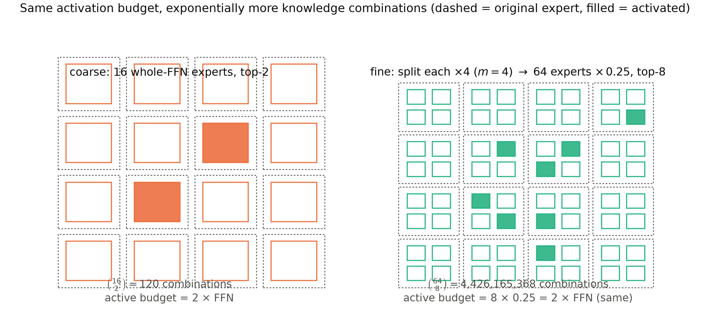
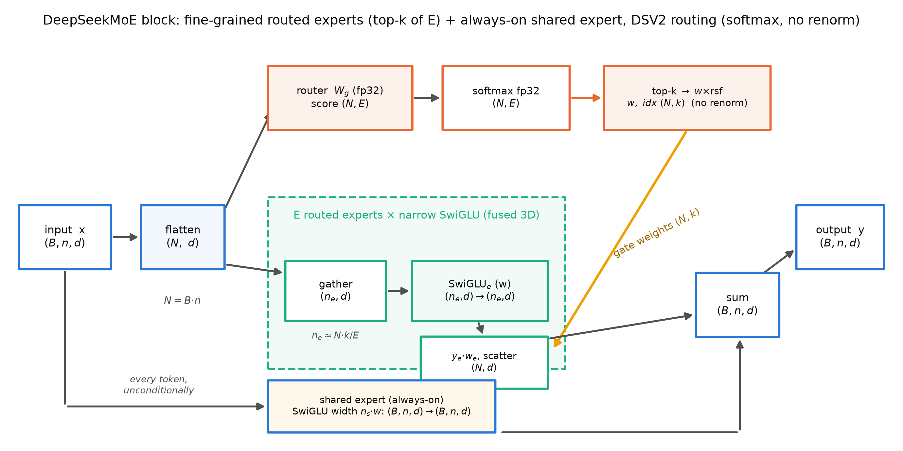
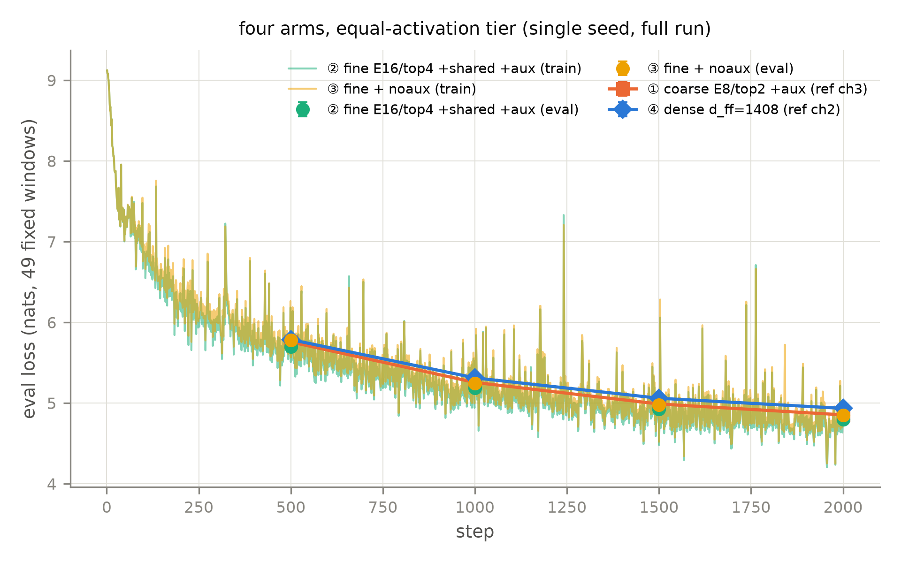

# 第 5 章 DeepSeekMoE：细粒度、共享专家与免损失的均衡

## 5.0 开篇：从全书到这里

上一章我们给第一台全开源旗舰 MoE 验了货。Mixtral 8x7B 证明了「MoE 只是换 FFN 插槽」——注意力、归一化、位置件与 Mistral 7B 逐槽相同，唯一的结构改动是前馈格换成 8 个专家；它的路由分析还给了三条反直觉的结论（专家并无主题分工、句法对齐只是推测级、位置局部性倒是很实）。验货也验出了两处留白，正好是本章的出发点：其一，Mixtral 的专家是 8 个**整 FFN 的粗粒度全才**，每 token 从 8 选 2——这个几何还有多少压榨空间？其二，它的训练配方零披露——负载均衡用的什么手段、辅助损失系数多大，论文一个字没说。而第 3 章我们已经把这笔账算清了：均衡是要付费的，货币是梯度。本章把两处留白一起做完全：**DeepSeekMoE 的三连创新——细粒度专家分割、共享专家隔离、noaux 免辅助损失均衡**，前两件改几何（知识怎么装），第三件改治理（均衡怎么做）。我们要回答的问题相应有三个：切细为什么好？共享为什么省？均衡能不能不付梯度税？产出物是两件：一个与 HF transformers 逐位对拍的 DeepSeekMoE 教学件（第 9 章两刀机的 FFN 插槽就从这里 import），和一组四臂消融——第 3 章埋下的「损失税」问题在本章闭环。章末到达的位置：第一刀的完成形态——FFN 插槽的替换件从机构（第 2 章）、到难题（第 3 章）、到两代实证（第 4-5 章）全部齐装；下一章动第二刀，注意力与 KV 账本。

> **最小背景栏**
> - MoE 块四步机构与形状流转（展平/打分/硬选择/派发；router 打分 $(N,E)$、top-k 掩码 $(N,k)$）：第 2 章图 2.1 与表 2.1，本章直接使用不再重画基础版。
> - 负载崩塌的自增强回路、辅助损失四代家族与三把均衡尺（max/min、CV、MaxVio）：第 3 章式 (3.1)-(3.6)——本章 5.5 节是式 (3.6) 那笔「税」的解药，5.7 节的度量沿用第 3 章 3.5 节同一把尺。
> - Mixtral 的粗粒度几何（E=8/top-2/每专家 $d_{ff}$=14336 整 FFN、无共享）与训练配方零披露：第 4 章表 4.1 与 4.4 节。
> - 二项式系数 $\binom{n}{k}$（$n$ 选 $k$ 的组合数）：高中组合计数，本章只用它的「数有多大」。
> - 模块实验协议：Book2 五件套（AdamW/余弦日程/固定 eval 窗/单种子+判据预注册），语料 `tokens.bin`（sp-8k，$V$=8192）——第 2/3 章沿用至今的口径。

## 5.1 粗粒度的天花板：每个专家都是全才

验完 Mixtral 再回头看它的几何，会发现一个此前没有理由去问的问题。8 个专家、每 token 选 2 个——组合数 $\binom{8}{2}=28$。也就是说，这台 46.7B 参数的机器，每个 token 的「前馈配方」只有 28 种。配方空间小的直接后果是**每个专家都得是全才**：任何一个专家都可能被任何类型的 token 选中，于是它必须把句法、常识、领域知识各备一份——第 4 章路由分析那三条结论（无主题分工）在机构上正是这句话的镜像：专家没有分工，因为它们个个都被迫全能。

这里需要先把「知识组合」的图像立起来，它是本章前两节的地基。MoE 的核心假设是：一个 token 需要的前馈处理，可以被看作**若干份知识的组合**——第 2 章的基本式 $y=\sum_i g_i(x)\,E_i(x)$（式 (2.1)）里，每个专家是一份知识，top-k 选中的集合是一种组合，门控权重是组合的配比。在这个假设下，MoE 模型能「表达」多少种不同的知识组合，上界就是组合数 $\binom{E}{k}$——仓库再大，配方只有 28 种，装进去的多样性也兑现不出来。Mixtral 的路由器学不出主题分工（第 4 章），未必是路由器无能，也可能是 28 种配方根本不够它表达「按知识分工」。

2024 年 1 月，DeepSeekMoE 论文对这个问题给了系统的回答，三件创新按出场顺序是：**细粒度专家分割**（fine-grained expert segmentation，把专家切小、选多份——扩配方空间）、**共享专家隔离**（把公共知识抽出来装一份——去冗余）、以及由后续 DSV2/V3 补全的 **device-limited routing 与 noaux 免损失均衡**（细粒度带来的新账单与新的治理方式）。三件不是并列的招数，而是一条构造链：切细先扩空间，切细后公共知识的冗余显形（所以隔离），切细后每 token 进更多门、均衡压力更大（所以治理必须升级）。本章按这条链走：5.2-5.3 讲几何两件，5.4 讲细粒度的通信账，5.5 讲治理的终态，5.6 把三代打分与配置活字段收进一张表并对拍落地，5.7 用四臂消融在本机验货。

## 5.2 细粒度专家分割：同一预算，组合数暴涨七个数量级

切细的做法一句话就能说完：把每个专家切成 $m$ 份小的，激活份数同比例放大。论文的记法是 $N$ 个标准专家、每个等分 $m$ 份得 $mN$ 个小专家、每 token 激活 $mK$ 个（$K$ 为标准激活数）——换算到本书的符号契约（专家数记 $E$、激活数记 $k$）：$E=mN$、$k=mK$，小专家宽度 $w=d_{ff}/m$。参数上这是「仓库的重新切分」而不是扩建：总参与激活参的公式（第 2 章 2.2 节的 $E\cdot 3dw$ 与 $k\cdot 3dw$）里 $E\cdot w$ 与 $k\cdot w$ 的乘积都不变，变的是颗粒度。

说服力来自论文自己的组合数论证，逐字：【证据等级：官方论文 2401.06066 v1 §3.1】16 个标准专家的 top-2 路由 "can yield $\binom{16}{2}=120$ possible combinations"，切细后（每个分 4 份、64 选 8）"can yield $\binom{64}{8}=4{,}426{,}165{,}368$ potential combinations"——同一激活预算（两侧都激活 2 个标准 FFN 等价量：$2\times1$ 对 $8\times\frac14$），可表达的知识组合从 $1.2\times10^2$ 涨到 $4.4\times10^9$，七个数量级。论文的断言是这 "enhances the potential for achieving more accurate and targeted knowledge acquisition"（提升更精确、更有针对性的知识获取潜力）。用人话说：**钱（激活参数）没多花，菜单（可选配方）多了三千六百多万倍**——知识可以被切得更专，token 的需求可以由多份「窄而深」的知识拼出来，而不是由两个「宽而浅」的全才包办。图 5.1 把这个论证画成两幅格子：同样的虚线框（原专家）、同样的预算，右图把每格切四份、任选八格点亮。



图 5.1 细粒度 vs 粗粒度的组合空间（自绘示意级，论证式取自 2401.06066 v1 §3.1）。左：16 个整 FFN 专家、top-2，$\binom{16}{2}=120$ 种组合；右：每个原专家（虚线框）切 4 份（$m{=}4$）得 64 个 $0.25\times$ 小专家、top-8，$\binom{64}{8}=4{,}426{,}165{,}368$ 种组合；两侧激活预算同为 2 个标准 FFN 等价（填充格=被激活的专家）。复现：`python [`code/ch05/fig_ch05.py`](code/ch05/fig_ch05.py) --which comb`。

证据侧论文给的对照很硬，而且对照对象值得专门点名：**粗粒度基线是 GShard，不是 Mixtral**——两文只差三天，DeepSeekMoE 论文全文没有 Mixtral 对照【证据等级：官方论文 2401.06066 v1（负结论，全文核）】。2B 档的结论句逐字："DeepSeekMoE achieves comparable performance with a GShard model containing **1.5× expert parameters and computation**"——论文把对照 GShard 加料到 1.5 倍专家参数与计算（2.83B 专家参数、5.8T FLOPs），而 DeepSeekMoE 2B 只有 1.89B 专家参数、0.24B 激活、4.3T FLOPs：对方多花约一半专家参数、多三成半计算，仍被追平；论文还补一句 "nearly approaches the performance of a dense model with 16× FFN parameters"【证据等级：官方论文 2401.06066 v1 表 2】。Mixtral 与 DeepSeekMoE 的对照没有论文级版本，本册 5.7 节的四臂消融会自己搭一个（①臂就是 Mixtral 式几何）。顺带一笔谱系考据：Shazeer/GShard/Switch/Mixtral 四代全是整 FFN 粗专家——**细粒度分割在这条主线上的首现就是 DeepSeekMoE**（更早的细粒度探索在 Jacobs 1991 一系的文献里另有脉络，不在本书主线）。

切细不是免费的，账单有两张，都要先记下、后面各有一节兑现。第一张是**派发开销**：每 token 进 $mK$ 道门而不是 $K$ 道，路由与 gather-scatter 的次数翻倍——第 2 章已实测朴素实现的派发开销（等激活下 MoE 是 dense 墙钟的 2 倍），$E$ 变大后会不会更糟？5.7 节用 E16 档单独实测。第二张是**通信**：专家天然分片到不同设备（第 2 章 2.6 节），每 token 的 8 个小专家可能散布在 8 台机器上，all-to-all 的通信范围随激活份数涨——这张账单是 5.4 节 device-limited routing 的直接动机。

## 5.3 共享专家隔离：公共知识只装一份

切细之后，一个原先被粗粒度掩盖的问题显形了。论文的动机论证是一个三连推，逐字：分派给不同专家的 token 可能需要一些**公共知识**（common knowledge），于是「多个专家可能**收敛于获取相同的知识**（converge in acquiring shared knowledge）」，各自把公共知识存进自己的参数，**造成冗余**（resulting redundancy in expert parameters）——隔离出共享专家后，其余路由专家间的参数冗余将被缓解【证据等级：官方论文 2401.06066 v1 §3.2】。用人话说：64 个小专家每个都得自带一份「怎么处理普通句子」的手艺，等于同一本入门手册抄了 64 遍。机制图像与第 3 章的赢者通吃正好互补：那是「分工不均」（有的专家吃撑、有的饿死），这是「分工不清」（大家都在重复学入门课）。

解法是给 MoE 块加一个**不走路由的常驻车间**：共享专家（shared expert）。形式化只需在式 (2.1) 上加一项：

$$y=\sum_{i\in\mathrm{TopK}} g_i(x)\cdot E_i(x)\;+\;\mathrm{Shared}(x) \tag{5.1}$$

用人话说：路由专家的加权求和照旧，再无条件加上共享专家的输出——它不展平、不打分、不进 top-k，每个 token 必算，像残差河上的一条固定支流。**符号表**（本章符号契约；$E$ 承批一契约，论文记法首次并注）：

| 符号 | 含义 | 形状/取值 |
|---|---|---|
| $x$ / $h$ | 进入 MoE 块的隐状态 / 展平 token 流 | $(B,n,d)$ / $(N,d)$，$N=B\cdot n$ |
| $E_i(x)$ | 第 $i$ 个路由专家（窄 SwiGLU，宽 $w=d_{ff}/m$） | $(n_i,d)\to(n_i,d)$ |
| $g_i(x)$ | top-k 门控权重（DSV2 口径不归一、$\times$ 缩放因子） | $(N,k)$ |
| $\mathrm{Shared}(x)$ | 共享专家=一个宽 $n_s\cdot w$ 的 SwiGLU，每 token 必算 | $(B,n,d)\to(B,n,d)$ |
| $E$ / $k$ / $n_s$ | 路由专家数 / 激活数 / 共享专家数（论文记 $mN$/$mK{-}K_s$/$K_s$） | 本章实验 16/4/1；16B 档 64/6/2 |
| $W_g$ | router 打分矩阵 | $(E,d)$，打分 $(N,E)$ |

这笔账三个口径都要记清楚，因为它最容易被含糊掉：共享专家**算总参**（权重在仓库里）、**算激活参**（每 token 必算——式 (5.1) 的 $\mathrm{Shared}(x)$ 项无一日休假，等激活配臂公式里 $n_s\cdot w$ 计入通行费分子，5.7 节的配臂公式因此是 $d_{ff}=k\cdot w+n_s\cdot w$）、**不占组合空间**（它没有「选不选」的自由度）。图 5.2 是完整的机构图：上路是第 2 章的四步机构换成 DSV2 路由口径（softmax 打分、top-k 后**不重归一化**、乘 routed scaling factor——与 Mixtral 的第一个实现差异，5.6 节展开），下路是常驻的共享专家，两条支路在出口求和。



图 5.2 DeepSeekMoE 块：细粒度路由专家 + 常驻共享专家（自绘示意级，形状逐框标注）。上路（橙=路由、青=专家库）即第 2 章图 2.1 的机构换 DSV2 打分口径；下路（蓝）共享专家吃未展平的原输入 $(B,n,d)$、每 token 无条件激活（HF `DeepseekV2Moe` 的 `residuals` 路径同构）；黄线=门控权重施加点。复现：`python [`code/ch05/fig_ch05.py`](code/ch05/fig_ch05.py) --which diagram`。

论文用三档配置把「切细加共享」从 2B 做到 145B（表 5.1），几何上有一条不变量：**每 token 激活量恒约等于 2 个标准 FFN**（2B 档 $1+7$ 个 $0.25\times$、16B 档 $2+6$、145B 档切得更细 $4+12$ 个 $0.125\times$，乘出来都是 2）。「切得越细、共享占比越高」的走向清晰可见：145B 档 $m=8$、共享 4 份，占每 token 激活预算的四分之一（共享 4 份对全部 16 份激活；若只看路由侧，则已是路由 12 份的三分之一）。

**表 5.1** DeepSeekMoE 三档配置（全部【证据等级：官方论文 2401.06066 v1】；激活量列=每 token 的标准 FFN 等价数）

| 档 | 层数/宽度 | 路由专家 | 共享 | 每 token 激活 | 数据 | 备注 |
|---|---|---|---|---|---|---|
| 2B | 9 层 / $d$=1280 | 63 个 × $0.25\,d_{ff}$ | 1 | 1+7（=2.0） | 100B token，BPE 8K | 对照 GShard 2B/稠密 2B（表 1/2） |
| 16B | 28 层 / $d$=2048 | 64 个 × $0.25\,d_{ff}$ | 2 | 2+6（=2.0） | 2T token，BPE 100K | **首层 FFN 保持稠密**（§5.1.2） |
| 145B | 62 层 / $d$=4096 | 128 个 × $0.125\,d_{ff}$ | 4 | 4+12（=2.0） | 245B token（13,000 步） | 预实验档 |

三档里藏着一个后来成为全行业默认的小决定：16B 档的**第一层前馈不换 MoE、保持稠密**。论文给的理由直白——第一层的负载均衡收敛得慢【证据等级：官方论文 2401.06066 v1 §5.1.2】。浅层表征还停留在表层统计（第 4 章看过 Mixtral 第 0 层路由近随机），在到处是公共模式的地方强行稀疏路由，均衡与质量两头不讨好；不如让第一层安心当稠密集装箱。这个决定在 config 里活成了字段 `first_k_dense_replace`（DSV2-Lite 实值 1【证据等级：官方 config】），我们第 9 章的两刀机也照此配置——它是 5.6 节「配置活字段」名单的第一位。顺带一笔印证：量产的 DSV2-Lite（模型卡口径 15.7B 总参【证据等级：厂商自报】）MoE 部分正是 64 路由 top-6 加 2 共享、专家宽 1408、首层稠密【证据等级：官方 config】——表 5.1 中栏的直系后代，也是第 6 章 MLA 对拍的真机。

三档的成绩单收一句就够本章用了：16B 档以 **39.6% 的计算量**（74.4T 对 187.9T FLOPs/4K token）在多数基准上胜过 LLaMA2 7B——HumanEval 14.6→26.8、MBPP 21.8→39.2、CHID 37.9→89.4，MMLU 45.8→45.0 持平【证据等级：官方论文 2401.06066 v1 表 4】。（勘误口径锁死：这句的对照对象是 **LLaMA2 7B**，「约 40% 计算量追平 GPT-4 级 16B」是 DSV3 摘要的说法，两个数字两个对象，不可混引。）145B 档再进一步：28.5% 计算量比肩 DeepSeek 67B 稠密，砍一半激活（Half-Activated 变体）仍以 18.2% 打平【证据等级：官方论文 2401.06066 v1 §7】。

## 5.4 device-limited routing：细粒度的通信账单

5.2 节记下的第二张账单在这里兑现。专家天然可分片（第 2 章 2.6 节：专家互不通信，路由退化为 token 搬运），但搬运有单价：细粒度把每 token 的激活专家从 2 个变成 6-8 个之后，这些专家在 EP（专家并行）部署下可能散布在多达 8 台设备上——一个 token 的前馈要「寄 8 封信」，每封信都是一次跨设备往返。通信频率正比于目标专家覆盖的设备数，细粒度直接抬高了它。

DeepSeek 的解法叫**设备受限路由**（device-limited routing），机制一句话：先选设备、再选专家。逐字：【证据等级：官方技术报告 2405.04434 v5 §2.2.2】"for each token, we first select **M devices** that have experts with the highest affinity scores in them. Then, we perform top-K selection among experts on these M devices"——每个 token 先选出「内部专家亲和力总分最高」的 $M$ 台设备，再只在其中的专家里做 top-K；动机原文是 "**to bound MoE-related communication costs**"（给 MoE 相关通信成本封顶）。用人话说：信最多寄往 $M$ 个地址，宁可专家选得次优一点，也不让一个 token 的邮件遍历全机房。效果的论文判据同样逐字可引：$M\ge3$ 时「device-limited routing can achieve a good performance roughly aligned with the unrestricted top-K routing」——限到 3 台设备，质量与不限基本对齐；DSV2 实配 $M=3$【证据等级：官方技术报告 2405.04434 v5 §3.1.2】。

这里必须立一块勘误级的界碑，因为两件名字很像的东西常被混为一谈：**device-limited routing 不在 DeepSeekMoE 论文里，它出自 DSV2 §2.2.2**。DeepSeekMoE 论文 §3.3 有的是**设备级辅助损失** $L_{\mathrm{DevBal}}=\alpha_2\sum_i f'_iP'_i$（把路由专家均分 $D$ 组部署，惩罚组间不均——第 3 章 3.3 节第四代家族的成员），动机句是 "load imbalance can exacerbate computation bottlenecks"【证据等级：官方论文 2401.06066 v1 §3.3】。一件是**损失**（软约束、付梯度税），一件是**路由规则**（硬约束、零梯度）——恰好又是「均衡手段从损失函数搬进路由机制」的一次预演，5.5 节的正菜把这个搬法做到极致。工程谱系上，设备受限路由在 HF config 里的形态是 `topk_method="group_limited_greedy"` 加 `n_group`/`topk_group`（组是设备组的 config 代理：先选组、再组内 top-k；DSV2-Lite 配 1/1 即不启用，全量 236B 配 8/3——V3 的 8/4 属 noaux_tc 一代的值，两代勿串、见第 9 章表 9.1）【证据等级：config 逆向】——形状流转是打分 $(N,E)$ 按组重排为 $(N,\,n_{\mathrm{group}},\,E/n_{\mathrm{group}})$、组代表 $(N,n_{\mathrm{group}})$、组掩码回 $(N,E)$ 再 top-k。本机没有多设备，这张账单只能引论文关闭；all-to-all 的调度与设备级治理是工程侧正菜，第 2 章章末欠账框已给地址（→ Book8 第 6 章），此处不重复展开。

## 5.5 noaux：把均衡从损失函数搬进路由机制

现在回到第 3 章立起的那笔账。辅助损失买均衡、货币是梯度：3.6 节直引过 noaux 论文的两句判词——过大的辅助损失会 "introduce non-negligible interference gradients into training"、引入 "undesired gradients that conflict with the language modeling objective"【证据等级：官方论文 2408.15664 v1 摘要/引言】。它还有第三句把困局说尽：现有 MoE 方法 "always need to consider the **trade-off between load balance and model performance**"——均衡与质量永远在讨价还价【证据等级：官方论文 2408.15664 v1 引言】。DSV3 报告的复述更克制：辅助损失太大会损害模型性能【证据等级：官方技术报告 2412.19437 v2 §2.1.2】。本机 26M 档的 aux 臂 eval 不劣反优（第 3 章表 3.3）——3.6 节已解释过这是税未到疼点：显形需要 1B 模型 100B token 量级的长程。能不能既拿到均衡、又不往损失函数里塞任何东西？2024 年 8 月的方法论文给出了肯定答案，DSV3 在 671B/14.8T 上把它变成默认配置——这就是**免辅助损失负载均衡**，路由规则层面的免辅助损失路由（auxiliary-loss-free load balancing / routing，下文简称 noaux，与 HF 配置字段 `topk_method="noaux_tc"` 同源）。

直觉先于公式。辅助损失的问题不在「要均衡」而在**它用梯度去均衡**——均衡信号混进语言建模的梯度流，两个目标抢同一个 $W_g$。换一个不碰梯度的执行器：给每个专家配一个**偏置阀门** $b_i$，它不参与前向计算、不进损失、没有梯度，只是每个训练步结束后按负载表微调一格：欠载的专家阀门开大一点（更容易被选），过载的关小一点。形式化就一行：

$$b_i \leftarrow b_i + u\cdot\mathrm{sign}(e_i),\qquad e_i=\bar c_i - c_i \tag{5.2}$$

用人话说：每步看一眼上一步的「欠账单」——$c_i$ 是专家 $i$ 实收的 token 数，$\bar c_i$ 是理想均值（batch 总选择数除以 $E$），欠载 $e_i>0$ 则 $b_i$ 抬一格 $u$，过载则压一格。这就是方法论文 Algorithm 1 的逐字内容（每个 batch 更新一次、无滑动平均、只用上一 batch 计数；$u=0.001$ 为扫描最佳——0.0001 收敛过慢、0.01 后期 $b$ 值波动）【证据等级：官方论文 2408.15664 v1 Alg 1/§4】。控制论的读者会认出这是 **Bang-Bang 控制**：不管误差大小、只看符号、固定步长——负载是输出，$b_i$ 是控制量，构成负反馈回路。DSV3 的落地把它改成每步监控整 batch、$\gamma$（即式 (5.2) 的 $u$）取 0.001，前 14.3T token 用满、最后 500B 衰减到 0 收尾【证据等级：官方技术报告 2412.19437 v2 §2.1.2/§4.2】。

机制的全部精髓在下一句，两文一致、逐字：**偏置只用于路由选择，不进门值**。DSV3 式 (16) 把门值写成 $g'_i=s_i$（当 $s_i+b_i$ 入选 top-K，否则为 0）并注明 "the bias term is only used for routing"；方法论文原句是 $b_i$ "is only used to adjust the routing strategy by influencing the top-K selection"，"not added to the $g_{i,t}$ that weights the output"【证据等级：官方技术报告 2412.19437 v2 式 (16)；官方论文 2408.15664 v1】。用人话说：**阀门改派单，不改工钱**——选谁由 $s_i+b_i$ 决定，进门干活的权重仍按原始打分 $s_i$ 算。这一刀切下去才有「免损失」：门值不带 $b_i$，语言建模的梯度通路与无偏置时完全一致，均衡动作发生在梯度世界之外。对照第 3 章式 (3.6)：那边的均衡信号要经损失项混进 $\partial L/\partial W_g$，这边 $b_i$ 根本不在计算图里——税基被整个拆掉了。

负反馈之外还有一道保险。$b_i$ 是全局量（按整 batch 统计），管不住「单条序列内的极端失衡」——某条长序列把 8 个选择全塞给一个专家，全局统计可能毫无察觉。DSV3 为此保留了一个**极小**的序列级均衡损失（sequence-wise，下称 SeqBal）：$L_{\mathrm{Bal}}=\alpha\sum_{i=1}^{N_r} f_iP_i$（$f_i$ 为专家 $i$ 在序列内被选频率、$P_i$ 为亲和力均值——DSV3 式 (17)-(20)），系数 $\alpha=10^{-4}$，论文自述取 "extremely small value"，动机逐字 "to prevent extreme imbalance within any single sequence"【证据等级：官方技术报告 2412.19437 v2 §2.1.2/式 (17)-(20)/§4.2】。（表述勘误：常被转述成「序列级/解码器级**双互补损失**」——不准确。DSV3 的互补损失只有 SeqBal 一个；「batch/解码器级」的均衡由 $b_i$ 的步更新本身承担，那是路由规则不是损失项；V3 也没有设备级互补损失——那是 V2 时代 $\alpha_2=0.05$ 的 $L_{\mathrm{DevBal}}$。）所以终态的准确画像是一个两级系统：**$b_i$ 管全局（免梯度），SeqBal 管序列内（税率压到万分之一）**——相比 V2 三级损失 0.003/0.05/0.02 加 token dropping 的整套老药方，V3 把 aux loss 与 token dropping 全部砍掉。

效果是不是免费午餐？证据有独立的两源，表 5.2 合并给出。方法论文侧：1B 模型/100B token，免损失 ppl **9.50** 对 aux-loss 基线 9.56，MaxVio_global **0.04** 对 **0.72**——均衡质量提升约一个数量级、性能同时微升；3B/200B 同向（7.92 对 7.97、0.04 对 0.52）【证据等级：官方论文 2408.15664 v1 §3-4】。DSV3 侧的内部消融（表 5）在同一架构同数据上仅换均衡策略：20 个对比格免损失侧 17 胜 1 平 2 负，且**规模越大红利越大**——小 MoE（15.7B/2.4B 激活）Pile BPB 0.727→0.724，大 MoE（228.7B/20.9B 激活）0.656→0.652、HumanEval 40.2→46.3、GSM8K 70.7→74.5【证据等级：官方技术报告 2412.19437 v2 §4.5.2 表 5】。DSV3 还补做了一个定位实验（§4.5.3）：1B 模型上序列级 aux 2.258、batch 级 aux 2.253、免损失 2.253——免损失优势的主体，来自把均衡粒度从逐序列放宽到逐 batch（3B 档 2.085/2.080/2.080 同构）【证据等级：官方技术报告 2412.19437 v2 §4.5.3】。本机 26M 档的验证留给 5.7 节的③臂。

**表 5.2** noaux vs aux-loss：论文双源+本机读数（本机行为 5.7 节③②臂，单种子趋势级）

| 来源 | 规模/日程 | 指标 | aux-loss | noaux | 出处 |
|---|---|---|---|---|---|
| 方法论文 | 1B / 100B token | ppl / MaxVio_global | 9.56 / 0.72 | **9.50 / 0.04** | 2408.15664 v1 §3-4 |
| 方法论文 | 3B / 200B token | ppl / MaxVio_global | 7.97 / 0.52 | **7.92 / 0.04** | 同上 |
| DSV3 消融 | 小 MoE 15.7B（2.4B 激活）/1.33T | Pile BPB | 0.727 | **0.724** | 2412.19437 v2 §4.5.2 表 5 |
| DSV3 消融 | 大 MoE 228.7B（20.9B 激活）/578B | HumanEval / GSM8K | 40.2 / 70.7 | **46.3 / 74.5** | 同上 |
| 本书实验 | 26M 模块档 / 2000 步 | eval nat / MaxVio_global | 4.797 / 0.0138 | 4.847 / **0.0112** | 5.7 节表 5.3 |

## 5.6 打分代际与配置活字段：从论文到 config 到 HF 落地

三件创新讲完，还剩一类知识没人系统整理：**这些机制在两代旗舰的 config 里活成了哪些字段、值怎么变**。config 是第 9-10 章拆机的主战场，此处先把 MoE 侧的活字段清点成表，并顺手完成本章组件的落地对拍。

第一件活字段是**打分函数**（scoring function）。DSV2 的打分是 softmax 型：$s_{i,t}=\mathrm{Softmax}_i(u_t^{\top}e_i)$（式 (22)，$u_t$ 为 token 表征、$e_i$ 为专家质心——乘性打分）【证据等级：官方技术报告 2405.04434 v5 式 (22)】；DSV3 换成 sigmoid（式 (15)），并对 top-k 选中集**重归一化**后乘 routed scaling factor 2.5（`norm_topk_prob=True`）【证据等级：官方技术报告 2412.19437 v2 式 (15)/§2.1.2】。换打分的动机两文都没有明说，本书的解读（标注为解读、非论文主张）：softmax 的分数是**竞争性的**——全体和恒为 1，一个专家涨分必有人跌分，给这种相对分加固定步长 $u$ 的偏置，力度会随打分分布的温度漂移；sigmoid 的分数是**逐专家独立的绝对分**，$b_i$ 与 $s_i$ 同量纲、可直接比较，Bang-Bang 阀门的每一步都有了固定含义。归一化后乘 2.5 则是把路由支路的输出量级拉回与共享支路相称。HF config 的 `scoring_func` 字段（V2 默认 `"softmax"`、V3 checkpoint 配 `"sigmoid"`）是这条代际的 config 铁证【证据等级：config 逆向】。

第二件是 **top-k 后的权重处理**，三族三样，极易混：Mixtral 在 top-k 内重归一化（和为 1，第 2 章 2.7 节实现对照框）；DSV2 **不归一化**、直接乘 `routed_scaling_factor`（Lite 配 1.0）；DSV3 归一化再乘 2.5【证据等级：config 逆向+源码 transformers 5.18.0】。第三件是前面已出场的 `first_k_dense_replace`（V2=1、V3=3——首层稠密从「一层」加码到「三层」；为什么是 3，报告未给论证，工程取舍如实标注；四代排布谱系 GShard 每隔一层→Switch 每层→V2 首层→V3 三层的完整账在第 9 章）。第四件是组选择 `n_group`/`topk_group`（5.4 节；V3 的组代表从 V2 的组内最大值改成组内 top-2 求和——都是「组的代表分」的取法）。

这些字段真正落地到代码里，藏着两个足以让权重白加载的陷阱，值得开一个对照框：

> **【实现对照框】HF transformers 5.18.0 的 noaux 落地与两个陷阱**（{config/源码}，本机实测）。①`e_score_correction_bias` 是 **Buffer 不是 Parameter**（`DeepseekV3TopkRouter` 内 `nn.Buffer(torch.zeros(E))`）：state_dict 里有它的键、优化器却不训练它——手写件必须 `register_buffer` 才能对上键位；写成 `nn.Parameter` 语义就错了（优化器会去训练一个不该有梯度的阀门）。②DSV2 类只实现 `greedy`/`group_limited_greedy` 两条路（无 else 分支）；DSV3 checkpoint config 里的 `topk_method="noaux_tc"`、`scoring_func="sigmoid"` 是**遗留字段**——`@strict` 容忍遗留字段、构造 config 不报错（本机实测：kwargs 直接构造成功），但首次前向就在 router 里抛 `UnboundLocalError`（本机实测：cannot access local variable 'topk_weights'）——响亮崩溃，只是报错位置离病因两丈远（构造不报、加载不报、前向才炸）。「被当 softmax 处理」的静默错路由路径在 5.18.0 里实际到不了；结论不变：必须 V3 权重用 V3 类。③noaux 的三段语义在 V3 router 里是显式的：`scores_for_choice = scores + bias`（选择段）、`topk_weights = scores.gather(1, topk_indices)`（权重段用**原始分**）——「bias 只进门值外」直接写在两行代码上。

本章的教学件 [`code/ch05/deepseek_moe.py`](code/ch05/deepseek_moe.py#L101) 把上述全部口径写成了一个类 `DeepSeekMoE`（DSV2 键位：`gate.weight`+`experts` 融合 3D+`shared_experts` 三投影；专家件直接 import 第 2 章的 `ExpertBank`——「SwiGLU 住进专家内部」的又一次复用；noaux 档多一枚 `e_score_correction_bias` Buffer，`step_bias()` 实现式 (5.2)）。验收三层，全部 CPU fp32、种子 20261002【证据等级：本书实验（CPU，2026-10）】：第一层，同权重对拍组件库正身 `HFDeepseekMoE`，max$|\Delta|$=0.00e+00 逐位一致；第二层，对 HF `DeepseekV2Moe` 块级 strict 直搬（123,136 参），max$|\Delta|$=0.00e+00；第三层正是**打分→选择→权重三段对拍**——教学件与 HF `DeepseekV3TopkRouter`（sigmoid+偏置+组选择）逐段比对，$n_{\mathrm{group}}$=1（隔离组选择、只验 noaux 本体）与 $n_{\mathrm{group}}$=2（过组选择路径）双档，logits/权重/索引三段 max$|\Delta|$ 全部 0.00e+00。另有三条机制自检：给偏置一个扰动，56 个 token 换了选择、而选择未变的 token 门值**逐位不动**（bias 不进门值的本机版证词）；喂一个 $[6,1,0,1]$ 的偏斜计数，过载专家的 $b$ 降、欠载的升（负反馈方向）；块内参数账双口径手算逐位对上。聚合对拍 `00-feasibility/parity_all.py --hf` 已把本件接入注册表，三列对拍全部 0.00e+00。这台件就是第 9 章两刀机的 FFN 插槽——届时它将带着 DSV2 键位与共享专家，被 import 进 207M 骨架。

## 5.7 消融实验：四臂对拍，第 3 章的损失税在此清算

机构、动机、落地都齐了，最后在自己的机器上验货。实验设计沿用第 2-3 章的模块档（$d$=512/$L$=6/$V$=8192，语料 sp-8k token 流，Book2 五件套，单种子 20261002、判据预注册在先——判据文本写于任何 full 档数字落地之前，已随销项记录存档定版）。四臂按大纲钉死，两臂复用批一产物、两臂实跑：

- **① 粗粒度**：E8/top-2/无共享+aux——就是第 3 章的 aux 臂原封不动（E=8/$k$=2/$w$=704，Mixtral 式几何，总参 65,042,944），复用其 full 产物；
- **② 细粒度**：E16/top-4/共享 1+aux——实跑新臂。配臂公式承探针 D：**等激活** $d_{ff}=k\cdot w+n_s\cdot w$，代入 $w=\lfloor 1408/(4{+}1)\rfloor=281$，每 token 激活 $5\times281=1405\approx$ dense 1408；
- **③ = ② 换 noaux**：同几何同种子同日程，唯一差异是均衡手段——去掉式 (3.6) 的 load 损失，换式 (5.2) 的偏置步更新（$u$=0.001/步；消融件的偏置加在 softmax 概率上、门值在选中集内归一——与②臂同一归一化口径，保证②→③的单变量是均衡手段本身；打分代际不在变量里；mini 档不做 $\gamma$ 衰减，如实登记）。noaux 门的 bias 与②臂的 router **共享同一个 weight 对象**，两臂初始权重逐位相同（init 快照 max/min 1036.99、MaxVio 0.05874、首步 loss 9.1244，两臂三数完全一致）；
- **④ 等激活 dense**：$d_{ff}$=1408，复用第 2 章 dense 臂 full 产物。

两个口径的配臂公式都要交代（探针 D 定版）：等激活 `dense d_ff = k×w+n_s×w`（公平比每 token 通行费），等总参 `dense d_ff = E×w`（堵「总参红利」的质疑）——探针 D 三臂读数 6.2181（MoE）/6.2251（等总参 dense）/6.3032（等激活 dense，300 步口径）【证据等级：本书实验（探针 D）】。本章②臂对④臂用等激活口径（dense 4.93375 复用批一 full）。参数账先 assert 再训练：②③总参 **57,187,840**（手算=实测逐位）、激活参 26,062,336——比 dense 臂的 26,089,984 差 27,648，即每层 FFN 宽取整缺口（$5\times281=1405$ 对 1408）的 0.11%，如实登记不硬凑（口径注记：模块档脚本的激活参为双份嵌入、不含路由门口径，第 2 章 2.7 节的换算沿用）。有一笔顺带的诚实账：细粒度臂总参反而比①臂**小** 12%（每层 FFN 总宽 $(16{+}1)\times281$ 对 $8\times704$）——②胜①若成立，绝不是靠仓库更大赢的，这正好排除了一个反向质疑。

**表 5.3** 四臂消融读数（full 档 2000 步，eval=49 固定窗 401,408 token，探针=held-out 8,192 token 硬计数；①④引用批一产物；【证据等级：本书实验（MPS bf16 训练/fp32 评测，2026-10）】）

| 臂 | 总参 | 激活参 | eval@2000（±se） | MaxVio_global | 层均 max/min | 死专家格 | sec/step |
|---|---|---|---|---|---|---|---|
| ① 粗 E8/top2/无共享+aux（引用） | 65,042,944 | 26,089,984 | 4.854 ± 0.013 | 0.031 | 2.13 | 0 | 0.614 |
| ② 细 E16/top4+共享1+aux | 57,187,840 | 26,062,336 | **4.797 ± 0.013** | 0.0138 | 2.23 | 0 | 0.677 |
| ③ =② 换 noaux | 57,187,840 | 26,062,336 | 4.847 ± 0.013 | **0.0112** | 2.69 | 0 | 0.709 |
| ④ 等激活 dense（引用） | 26,089,984 | 26,089,984 | 4.934 ± 0.013 | —（无路由） | — | — | 0.354 |



图 5.3 四臂消融曲线（自产，`fig_ch05.py` 绘制，full 档 2000 步）：②③为实跑臂（细线=训练损失、圆点=49 窗 eval），①④为引用臂（方块/菱形=eval 点，批一 full 产物）。末态排序 ② 4.797 < ③ 4.847 < ① 4.854 < ④ 4.934。复现：`python [`code/ch05/fig_ch05.py`](code/ch05/fig_ch05.py) --which curve`。

判据逐条对着念（预注册三条：③的 MaxVio 显著低于或不劣于②；②③的 eval 差落在 0.05 nat 带宽内；②−①的方向 ≤0）。**第一条过**：noaux 的 MaxVio 0.0112 对 aux 的 0.0138——相当偏优；死专家两臂全程为 0，max/min 2.69 对 2.23 同档。方向与论文侧（0.04 对 0.72）一致但幅度天差——本档 aux 本来就压得很低（第 3 章 E8 档 full 末态 0.031；fast 300 步曾读到 0.015，full 末段回升至 0.031——第 3 章已登记此漂移），26M 档两手段都「够用」，②③间差异在毫厘，如实念。**第二条压线过**：$|4.797-4.847|=0.0497\le0.05$——noaux 微劣 0.0497 nat，恰在带宽内、超出 0.03 的同种子噪声线。按预注册口径如实写：**机制式均衡在本档以不到 0.05 nat 的质量差，换掉了整个损失项**（免干扰梯度、损失函数里只剩交叉熵）；不写成「noaux 反优」——论文侧的反优（表 5.2）是 1B/100B token 量级的红利，本档 26M 模型、1600 多万 token 不同量级，单种子趋势级。**第三条过且超带**：②−①=−0.056 nat，方向符合且超出噪声带——细粒度+共享在等激活口径（且总参更小）下小优，与探针 D 方向参照（MoE−dense=−0.085）同向。附带的等激活差一并登记：②−④=−0.136 nat，与第 2 章 E8 口径的 moe−dense=−0.038 并排读——从粗到细每一步都在同向加深（单种子）。四臂总排序 ② 4.797 < ③ 4.847 < ① 4.854 < ④ 4.934：noaux 细粒度臂不劣于 aux 粗粒度臂，几何改良与治理改良叠得出红利。组合数账本章自己的一份：$\binom{16}{4}=1820$ 对 $\binom{8}{2}=28$——5.2 节的论证在 65 倍（而非三千六百多万倍）的尺度上也工作。

noaux 臂的过程比终值更有教学味，fast 档 300 步的轨迹把负反馈控制器画了个正着：第 100 步负载**仍然崩**（层均 max/min 5846、15 个死格——此刻 $|b_i|$ 才 0.05 上下，追不上 softmax 概率的差距），第 200 步死格清零，第 300 步 max/min 7.67、MaxVio 0.0121。mini 档的叙事因此不是「noaux 不崩」，而是「**崩了能被机制慢慢抬回来**」——见效时间正比 $1/u$（$u$=0.001 时约两百步）。第 0 层的偏置画像也是教科书式的：多数专家 +0.09，此前的赢家 −0.246——阀门确实在掐最强、扶最弱。full 档还有一笔如实登记的漂移：2000 步后第 0 层全体 $b_i$ 集体上移到 +0.14~+0.175（$\sum_i\mathrm{sign}(e_i)$ 常年为正：一个赢家过载、多数微欠载，Bang-Bang 更新于是整体上漂）——均匀分量不改 top-k 的相对序，起作用的只有 $b_i$ 之间的**差**，HF 落地的 Buffer 同此性质。

这条机制线还有一段必须如实交代的事故。③臂首版实现把 $e_i$ 的方向弄反了（取成「实收比例−理想值」）：配合「分数加偏置」的选择规则，反向偏置构成**正反馈**——欠载专家的阀门被一路压负、越死越压。该版跑出的现场触目惊心：96 个专家格里 72 个死格贯穿全程、max/min 钉死 8192。交叉核对才发现方向错了，金证是方法论文 Algorithm 1 的逐字定义（$e_i=\bar c_i-c_i$，过载降、欠载升）加上 HF 的加号选择（`scores + bias`）——两者拼合才构成负反馈；DSV3 报告那句英文 "difference between the mean fraction and the ideal fraction" 的差值方向是有歧义的，落码前必须回方法论文。修正后重跑， buggy 轨迹以 `fine_noaux_signflip` 留档作 signflip 反向对照【证据等级：本书实验（事故留档，`log/book4-ch05/`）】。这个事故本身就是 5.5 节的教学素材：**偏置的方向就是机制的全部**——同一行代码、差一个负号，从负反馈控制器变成垄断加速器。

最后是 5.2 节记下的第一张账单：**派发开销随 $E$ 怎么走**。E16 档 sec/step 单独实测（大纲预登记的实验产物）：dense 0.354（④臂，第 2 章 dense full 稳态读数）→ E8/top-2 0.714（第 2 章 dense-vs-MoE full 臂同窗读数；同几何的①臂在第 3 章 aux 臂 run 里为 0.614——同几何跨 run 差 16%，超出热态带，如实登记）→ **E16/top-4 0.677**（②臂）s/step（稳态口径，中位 0.539；③臂 0.709 同档，偏置更新开销 5% 以内）——$E$ 翻倍，耗时**不涨反平**（比值 0.677/0.714≈0.95，基线钉在第 2 章 0.714 那条腿上，只读方向不读数）。预注册预期「随 $E$ 增长」在本口径下**不成立**，负结论如实记：本比较里 $E$ 加倍的同时 $k$ 加倍、$w$ 缩半，每 token 激活 FFN 宽恒定（1408≈1405），逐专家循环的耗时由**总激活体量**（$N\cdot k\cdot w$，近似恒定）主导、不由专家个数主导；真正的台阶是 dense→MoE 的约 1.9 倍（与第 1 章表 1.4 的开销梯度 2.3×→1.74×→1.44× 同一条收敛线，基线口径随行标注；跨 run 热态差异 ±10%，0.95 读作同档持平、不读作「E16 更快」）。给第 1 章对表时的前提一句话：**等激活体量下 $E$ 不加价；加价的是稀疏化本身（约 2 倍），以及本机测不了的 EP 通信**（5.4 节，→ Book8）。

## 5.8 本章小结

开篇的三个问题现在都有了自己的答案。**切细为什么好**：同一激活预算下，知识组合的空间从 $\binom{16}{2}=120$ 涨到 $\binom{64}{8}=4.4\times10^9$——菜单大了三千六百多万倍，钱没多花；论文侧打平了专家参数多一半的 GShard 加料版，本机②臂以更小的总参小优①臂 0.056 nat。**共享为什么省**：公共知识从「64 份抄写」变「1 份常驻」，动机三连（公共知识→收敛冗余→隔离缓解）在本机四臂里与细粒度捆在一起兑现。**均衡能不能不付梯度税**：能——把均衡从损失项搬进路由规则，偏置只改派单、不进门值、不进计算图；论文侧 MaxVio 一个数量级的改善兼质量微升，本机侧以 <0.05 nat 的带宽内代价换掉了整个损失项，负反馈的轨迹（崩了→两百步抬回）在 fast 档看得清清楚楚。加上 device-limited routing 把通信封顶、打分函数换代表、首层稠密从 1 到 3——DeepSeekMoE 三连连同它的 config 活字段，就是第一刀的完成形态。

**带走的心智**：如果这章只能留下一件事，留这句——**均衡手段在从损失函数搬进路由机制，最后搬进架构本身**。噪声（2017，打分时扰动）→辅助损失四代（2017-2024，在损失里付费）→偏置阀门（2024.8 起，零梯度的路由规则）→切细与共享（2024.1 起，用几何直接减少「需要均衡的量」）。读任何一份 MoE 配置时的条件反射应该升级：看到辅助损失系数读出「税率」（第 3 章），看到 `e_score_correction_bias` 读出「阀门」，看到 `n_shared_experts>0` 与小 `moe_intermediate_size` 读出「公共知识已抽走、专家已切细」。第二个心智是一笔账的直觉：**细粒度的代价不在参数在派发与通信**——参数上切细是免费的重新分割，账单开在 token 要进更多道门（本机实测等激活体量下 $E$ 不加价，通信侧本机不可测、论文用先选 $M$ 设备封顶）。

镜头拉回全书：第一刀至此收工。FFN 插槽的替换件从机构（第 2 章的四步流程与容量保险丝）、到病症与药方（第 3 章的赢者通吃与损失家族）、到两代旗舰实证（第 4-5 章）全部到齐，`deepseek_moe.py` 这台 DSV2 键位件已在第 9 章两刀机的 import 清单上就座。但两刀只动了一刀——注意力插槽里还是 Book3 的 GQA，KV 账本仍是 $2Lh_{kv}d_k$ 的老记法。下一章动第二刀：把 K 和 V 一起压进一个小箱子，位置信息拎在手上——MLA，本册数学最重的一章。

## 5.9 动手验证

```bash
cd 工作区根目录 && source env.sh

# ① 教学件三方对拍 + noaux 机制自检（CPU fp32，秒级）
python [`code/ch05/deepseek_moe.py`](code/ch05/deepseek_moe.py) --out-name run1
#   验收行：[① 教学件 vs 正身] max|Δhidden| = 0.00e+00（逐位一致）
#           [② vs HF 5.18.0 DeepseekV2Moe] strict 直搬通过 123,136 参 | max|Δhidden| = 0.00e+00
#           [③ noaux 三段对拍 n_group=1/2] 三段 max|Δ| 全部 0.00e+00
#   产物：log/book4-ch05/deepseek_moe_parity_run1.json

# ② 聚合对拍（教学件注册表已含本件；批二/批三交付边界与终校固定动作）
python [`code/00-feasibility/parity_all.py`](code/00-feasibility/parity_all.py) --hf --out-name batch2_ch05
#   验收行：ch05/deepseek_moe.py::DeepSeekMoE  三列 max|Δ| 全部 0.00e+00  PASS

# ③ 四臂消融（②③实跑、①④引用核对；fast 300 步 ≈9 min / full 2000 步 ≈45 min，MPS 独占窗口）
python [`code/ch05/ablation_granularity.py`](code/ch05/ablation_granularity.py) --steps 300  --out-name fast
python [`code/ch05/ablation_granularity.py`](code/ch05/ablation_granularity.py) --steps 2000 --out-name full
#   产物：log/book4-ch05/ablation_granularity_{fast,full}.json + curve/routing CSV
#   （长训含 ckpt 断点续跑，重跑同命令自动续；正文表 5.3/图 5.3 数据源）

# ④ 本章三图（图 5.1 组合空间 / 图 5.2 机构图 / 图 5.3 消融曲线；--src 自动 full 优先回落 fast）
python [`code/ch05/fig_ch05.py`](code/ch05/fig_ch05.py) --which all
```
