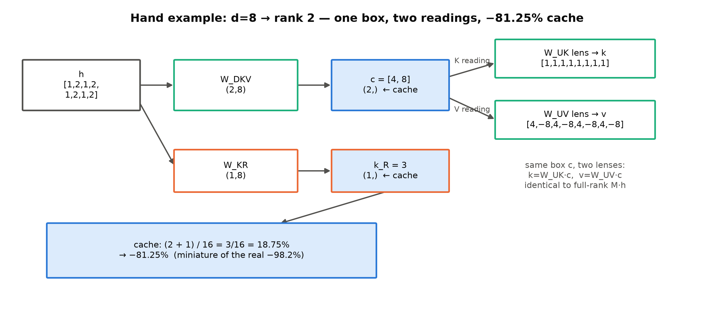
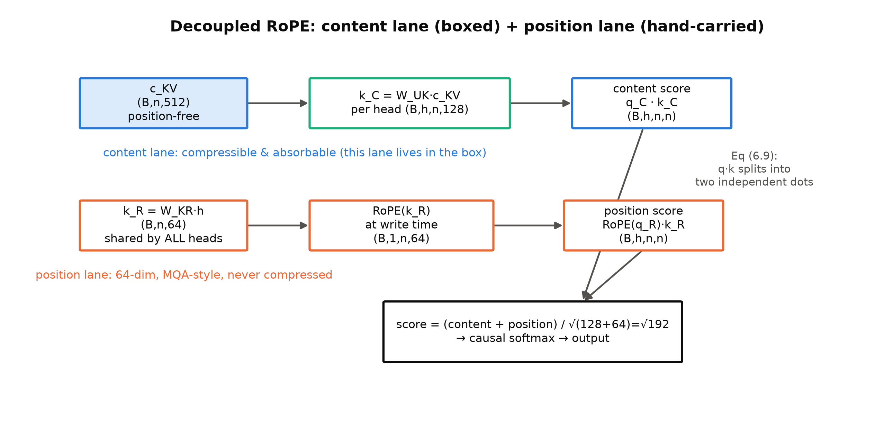
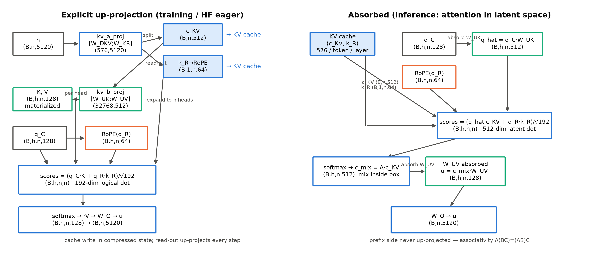
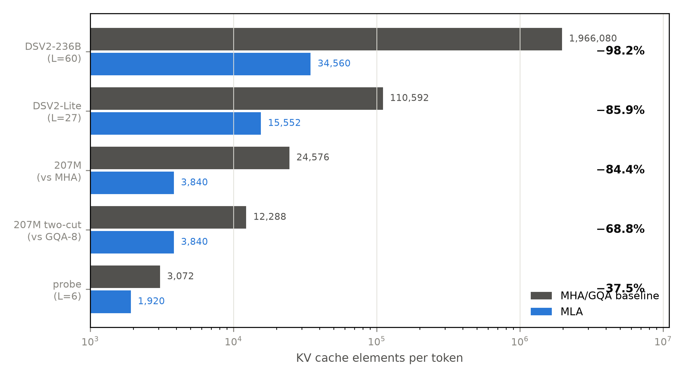

# 第 6 章 MLA：把 KV 装进小箱子

## 6.0 开篇：从全书到这里

第一刀至此齐活：前馈插槽换成了专家群——机构（第 2 章）、病症与药方（第 3 章）、组装术实证（第 4 章）、细粒度加共享加免损失均衡的完成态（第 5 章）一路走完，我们的机器上已经跑过四臂消融。本册要动的格子只剩一个：Block 里那个注意力格。它现在装的是 Book3 定版的 GQA（16 个查询头、8 组 KV），而 Book3 收束时我们对它留了一句重话——账本立好了，更深的一刀还没砍。本章兑现那笔欠账，也是本册数学最重的一章：低秩压缩、解耦位置编码、权重吸收，一步一形状地走完。

要回答的问题一句话就能说清：**KV 账本上剩下的那个乘积 $h_{kv}\cdot d_k$，怎么在不伤质量的前提下把它本身做小？**产出三样：一个能跑且对拍全绿的 MLA 教学件（[`ch06/mla.py`](code/ch06/mla.py)，双路径实现）、一本续写的 KV 元素账（表 6.2，含一条「三种报价」的红线）、一份「吸收等价性」的本机数值证据。本章结束时，两刀机的注意力格有了新零件，第 9 章的整机整合只差 import；而新问题也随之显形——KV 装进小箱子之后，训练侧的燃料与稳定化工具箱要跟着换（第 7 章的 QK-Norm 一节会直接用到本章的记号）。

> **最小背景栏**：只补三件前置。①KV 账本与 GQA/MQA 的族谱——Book3 第 6 章（该章式 (6.2) 的每 token 字节账、MQA 砍份数、GQA 组内共享、质量-KV 反向关系），本章是它的直系续篇；②RoPE 的相对位置性质——Book3 第 4 章（旋转只活在 $\boldsymbol{q}^\top\boldsymbol{k}$ 内积处、$(R_tq)^\top(R_sk)=q^\top R_{s-t}k$，式 (4.8) 两行正交性证明），这是 6.5 节解耦论证的前提①；③低秩分解——本章 6.2 节现场教（不假设你见过），教到「能凭手算例画出它」为止。RMSNorm（Book3 第 2 章）与残差河恒宽的插槽观（Book3 第 8 章）直接指回。

## 6.1 同一本账的第三刀：Book3 的欠账到期

先原样迎回那笔欠账。Book3 第 6 章章末欠账框写道：

> 「架构侧更深的一刀——把 $h_{kv}\cdot d_k$ 本身做更低秩的折叠——属于 Book4 第 6 章。本册把账立好，收账的留给他册。」

把这句话放回 Book3 的账本里读。那章的式 (6.2) 说每 token 的 KV 字节 $=2\cdot L\cdot h_{kv}\cdot d_k\cdot b$：MQA 把 $h_{kv}$ 砍到 1、GQA 砍到 $n_h/g$，**下刀位置始终是「份数」这个因子**；份数砍到底（MQA）质量付税（Book3 实测 0.267 nat，DSV2 附录 D.1 的 7B 档同样判 GQA/MQA 不及 MHA【证据等级：官方论文 2405.04434 v5 App D.1】），账本里剩下的就是每份的内容量 $h_{kv}\cdot d_k$（版本锚定：本章证据标注中的「官方论文」均指 DSV2，arXiv:2405.04434 v5；论文式号与节号承该版）——它乘着层数与头份数，是 2017 年就警告过「砍它伤质量」的那一项。这笔欠账在 Book1 还有更早的一笔登记——第 3 章章末欠账框写明「→ Book3 第 6 章（推理显存账本）；**Book4 第 6 章（工程视角）**」，本章正是后半句的地址。而 Book3 第 6 章带走的心智第三句，此刻到期：「**不是 2017 错了，是账本变了**——训练时代的最优（够宽）与推理时代的最优（少份数）不冲突，是两本账上的两个答案；读任何架构演化，先问它站在哪本账上。」**续写第三句**：GQA/MQA 砍的是「每 token 记几份」，MLA 砍的是「每份本身有多大」——但不是 2017 年那种直接缩 $d_k$，而是把 $h_{kv}\cdot d_k$ 这个乘积整体折叠进一个低秩潜空间：表征容量留在头维上不动，缓存容量压进箱子。账还是同一本（Book3 式 (6.2) 的直系推广，6.7 节立式），只是记账对象从「头份数×头维」换成了「箱子容量」。

整机坐标先钉住。MLA（Multi-head Latent Attention，多头潜在注意力）动的是 Book3 四插槽里的**注意力格**：GQA 的 q/k/v/o 四投影退役，换成五件投影；残差河宽度 $(B,n,d)$ 一寸不变，插槽接口照旧是 $(B,n,d)\to(B,n,d)$——第 9 章把它 import 进两刀机时你会看到，改动全部发生在格子内部。粗粒度的整机心智一句话先行（细节 6.3-6.6 逐件拆）：**每 token 每层只把一个 512 维的小箱子 $\boldsymbol{c}^{KV}$ 和一条 64 维的共享位置键 $\boldsymbol{k}^R$ 写进缓存——前者装内容、可折叠可吸收，后者拎位置、小到不需要压缩；读缓存时要么拆箱物化 K/V，要么把上投影吸收进查询与输出、直接在箱子语里做注意力。**「箱子」与「拎在手上」这两个图像，本章会反复用到。

## 6.2 低秩直觉与手算例：一个箱子、两副镜头

折叠的数学名字是**低秩分解**（low-rank factorization）。设一个线性映射 $M\in\mathbb{R}^{8\times 8}$——满打满算 64 个数；若它的秩是 2，就存在 $A\in\mathbb{R}^{8\times 2}$、$B\in\mathbb{R}^{2\times 8}$ 使

$$M = A\,B \tag{6.1}$$

用人话说：一个「8 进 8 出」的映射，如果只在 2 个方向上真正起作用，就能拆成「先压到 2 维、再撑回 8 维」两步——中间的 2 就是瓶颈。数据流上 $k=Mh=A(Bh)$：8 维的 $h$ 先过 $B$ 压成 2 维的 $c=Bh$（论文称**潜向量**，latent vector），再过 $A$ 还原 8 维。若 $M$ 精确低秩，$c$ 无损；近似低秩，损失就是被瓶颈扔掉的那部分成分。这步数学与 LoRA（Hu et al.，2106.09685）同宗——都赌一个大矩阵近似低秩；差别在赌的对象：LoRA 压的是**微调增量** $\Delta W=BA$（省训练参数），MLA 压的是 **KV 通路**（省推理缓存）。【考据框见下】这个桥是本书自建的——DSV2 全文不引 LoRA，两代的 §2 也没有任何 "Inspired by" 句【证据等级：官方论文 2405.04434 v5 全文核】，二手材料里「MLA 受 LoRA 启发」不是论文表述。

数字要小到能手算，画面才立得住。取 $d=8$、瓶颈 $r=2$：设 $\boldsymbol{h}=[1,2,1,2,1,2,1,2]$，下投影与两副「拆箱镜」取（矩阵见 [`ch06/kv_probe_mla.py`](code/ch06/kv_probe_mla.py) Part 0，数字全是手算友好的 0/±1/2 的幂）：

$$\boldsymbol{c}=W^{DKV}\boldsymbol{h}=[4,\,8],\qquad \boldsymbol{k}=W^{UK}\boldsymbol{c}=[1,1,1,1,1,1,1,1],\qquad \boldsymbol{v}=W^{UV}\boldsymbol{c}=[4,-8,4,-8,4,-8,4,-8]$$

三个读数请各看一眼。其一，**箱子只装两个数**：$[4,8]$ 外加位置通道的 $k^R=W^{KR}\boldsymbol{h}=3$ 一个数——缓存账 $(2+1)/16=3/16$，**省 81.25%**；真机的 $576/32768$（省 98.2%）正是它的放大版。其二，**K 和 V 是同一个 $\boldsymbol{c}$ 的两种读法**（图 6.1）：$W^{UK}$ 这副镜头读出「全 1」，$W^{UV}$ 那副读出「4/−8 交替」，货源同一份、镜头各不同。其三，本例 $M_K=W^{UK}W^{DKV}$ 精确秩 2，所以 $\boldsymbol{k}=M_K\boldsymbol{h}$ 逐位成立（`kv_probe_mla.py` 断言通过）——满秩真值与分解式在此完全等价；真实模型里 $M$ 不是精确低秩，折叠就是近似，「精度换体积」的账单由 6.8 节的消融埋单。换个输入再手算一遍可以确认箱子装的是「$\boldsymbol{h}$ 的摘要」而非某个固定值：取 $\boldsymbol{h}'=[1,1,1,1,1,1,1,1]$，则 $\boldsymbol{c}'=[4,4]$、两副镜头分别读出 $[1,0.5,1,0.5,\dots]$ 与 $[4,-4,4,-4,\dots]$、$k^{R\prime}=2$——输入变、箱子跟着变，读法不变。

> **【考据框】「MLA 受 LoRA 启发」的讹传从哪来。**两件事共享「低秩假设」这个数学骨架，社区转述就把因果补上了。但 DSV2 的参考文献里没有 LoRA（§2.1 引用的只有 Vaswani/Shazeer/Ainslie/Su），DSV3 同样不引【证据等级：官方论文，两轮独立抓取交叉确认】。正确的关系是平行的两支：LoRA 用低秩参数化**微调增量**（2021），MLA 用低秩参数化 **KV 投影本身**并把激活与缓存留在瓶颈处（2024）——同宗不同支，教学上互为最好的参照物。

那 K 和 V 为什么能**共用一个**箱子？结构上它们本就同源：MHA 里 $\boldsymbol{k}=W^K\boldsymbol{h}$、$\boldsymbol{v}=W^V\boldsymbol{h}$，都是同一个 $\boldsymbol{h}_t$ 的线性函数，承载的信息大量重叠；若两副投影都近似低秩、且瓶颈子空间兼容，就可以共享同一个下投影 $W^{DKV}$、各自只留不同的上投影。注意这是**设计假设**不是定理——DSV2 没有给出「KV 投影内在低秩」的谱分析证明，它直接用结果说话（App D.2 的 MoE 消融里 MLA 反超 MHA，6.8 节引）。书里把前者讲成赌注、后者讲成验收，恰好是一套完整的论证闭环。



**图 6.1** d=8→r=2 手算例（自绘示意级；数值与 `kv_probe_mla.py` Part 0 断言一致）：$\boldsymbol{h}$ 经 $W^{DKV}$ 装进 2 维箱子 $\boldsymbol{c}=[4,8]$（外加位置键 $k^R{=}3$）；$W^{UK}$/$W^{UV}$ 两副镜头从同一个箱子分别读出 K 与 V；缓存 $(2+1)/16$ → −81.25%，真机 −98.2% 的微缩版。

## 6.3 KV 联合压缩：一个箱子怎么装下 K 和 V

直觉有了，现在按论文的式子把机构立起来。DSV2 §2.1.2 的第一句话就是定义：「The core of MLA is the low-rank joint compression for keys and values to reduce KV cache」【证据等级：官方论文 2405.04434 v5 §2.1.2 首句】。三个式子（编号承论文 Eq 9-11）：

$$\boldsymbol{c}_t^{KV}=W^{DKV}\boldsymbol{h}_t \tag{6.2}$$

$$\boldsymbol{k}_t^{C}=W^{UK}\boldsymbol{c}_t^{KV},\qquad \boldsymbol{v}_t^{C}=W^{UV}\boldsymbol{c}_t^{KV} \tag{6.3}$$

用人话说：(6.2) 把每个 token 的残差流压进 $d_c$ 维箱子（下投影，down-projection）；(6.3) 从箱子出发，用两副不同的上投影（up-projection）分别还原出该 token 对全部头供给的 K 与 V。「联合」（joint）二字落在共用上：**K 与 V 共用同一个 $\boldsymbol{c}^{KV}$**——若各自各压一个箱子要存 $2d_c$ 个元素，联合后只存 $d_c$，这一步直接省一半缓存，正是 6.2 节「同源两读法」的形式化。记号从论文正字、全章锁死（与 config 字段对照如下；社区材料常把 $d_c'$ 误当 RoPE 维——那是查询压缩维，见 6.4 节）：

| 论文符号 | 含义 | DSV2-236B 值 | 形状/注 | config 字段 |
|---|---|---|---|---|
| $d$ | 残差流宽 | 5120 | 输入 $(B,n,d)$ | `hidden_size` |
| $n_h$ | 头数 | 128 | 每头独立 $q$ | `num_attention_heads` |
| $d_h$ | 每头内容维 | 128 | 无位置段（nope） | `qk_nope_head_dim` |
| $d_h^R$ | 解耦 RoPE 维 | 64 | 共享位置键宽 | `qk_rope_head_dim` |
| $d_c$ | **KV 压缩维（箱子容量）** | 512 | $\boldsymbol{c}^{KV}\in\mathbb{R}^{d_c}$ | `kv_lora_rank` |
| $d_c'$ | 查询压缩维 | 1536 | 只省训练激活 | `q_lora_rank` |
| $W^{DKV}$ | KV 下投影 | — | $(d_c,d)$ | `kv_a_proj_with_mqa` 前段 |
| $W^{UK},W^{UV}$ | K/V 上投影 | — | $(n_hd_h,d_c)$ / $(n_hd_v,d_c)$ | `kv_b_proj` 行块拼接 |
| $d_v$ | 每头输出维 | 128 | 可与 $d_h$ 不同 | `v_head_dim` |

逐形状走一遍（V2-236B 实维，$(B,n,\cdot)$ 记批×序列）：压缩 $\boldsymbol{h}\,W^{DKV\top}$ 是 $(B,n,5120)\cdot(5120,512)\to(B,n,512)$；K 上投影 $(B,n,512)\cdot(512,16384)\to(B,n,16384)$ 再切头成 $(B,128,n,128)$；V 同型（$16384=128\cdot128$）。把 (6.2)(6.3) 串起来看一个代数事实：

$$\boldsymbol{k}_t^{C}=W^{UK}\big(W^{DKV}\boldsymbol{h}_t\big)=\big(W^{UK}W^{DKV}\big)\boldsymbol{h}_t \tag{6.4}$$

用人话说：MLA 的 K 投影等价于一个**秩至多 $d_c=512$** 的整映射——MHA 的 $W^K$ 是 $16384\times5120$ 的满秩候选（秩上限 5120），MLA 把它因式化成 $16384\times512$ 乘 $512\times5120$。所以「折叠」与 2017 年的「砍 $d_k$」本质不同：砍维是把每头的 128 维直接削短（容量真没了），折叠是把整条通路限秩（$h$ 仍先见过全部 5120 维、每头仍输出完整 128 维，只是两步乘积的秩被 512 卡住）。省的也不是权重——账面上 MLA 的注意力参数反而略省（DSV2 维度每层 149,227,520 对同宽 GQA-8 的 178,257,920，省 16.3%【证据等级：本书复算，`kv_probe_mla.py` Part 3】；小几何下会反贵，见 6.7 节注）——**省的是缓存与激活**：缓存里从「K 一份 16384 + V 一份 16384」变成「$\boldsymbol{c}$ 一份 512」。论文自己的缓存声明（可直引）：「During inference, MLA only needs to cache $\boldsymbol{c}_t^{KV}$, so its KV cache has only $d_c\,l$ elements, significantly reducing the KV cache like MQA」【证据等级：官方论文 §2.1.2】（口径注：此句行文略去 $\boldsymbol{k}^R$ 那条车道，$d_c\,l$ 只计箱子；正式口径以 Table 1 的 $(d_c+d_h^R)\,l$ 为准，即表 6.2 的 576/层——较真的读者按引文原式算会少 64×60 一项，论文的行文与表账各记各的）。

还有一位住在箱子上的隐藏配角：**RMSNorm**。本章的式 (6.2)-(6.3)（论文 Eq 9-11）里没有它，但 §3.1.2 交代「additional RMSNorm layers after the compressed latent vectors」【证据等级：官方论文 §3.1.2；DSV3 §4.2 同款重申】——潜向量 $\boldsymbol{c}^{KV}$ 过完下投影要先归一化再进缓存与上投影。HF 落地为 `kv_a_layernorm`，且只作用 $\boldsymbol{c}$ 段、不碰 $\boldsymbol{k}^R$ 段（这是「解耦」的一部分，6.5 节见）。这是「论文公式是机理图、不是接线图」的又一例——公式告诉你压缩在哪，接线图里还住着让训练稳住的配角。

## 6.4 查询压缩可选件：只省训练激活、不省缓存

箱子装的是 KV；查询侧论文也给了同型的低秩两步（Eq 12-13）：

$$\boldsymbol{c}_t^{Q}=W^{DQ}\boldsymbol{h}_t,\qquad \boldsymbol{q}_t^{C}=W^{UQ}\boldsymbol{c}_t^{Q} \tag{6.5}$$

形状：$(B,n,5120)\to(B,n,1536)\to(B,n,n_h\cdot192)$。用人话说：查询也先压到 $d_c'=1536$ 维再撑回每头 192 维（128 内容 + 64 位置，6.5 节见）。动机论文自己说得很收敛，逐字：「Note that the low-rank compression on queries is merely to reduce the activation memory during training, which cannot reduce the KV cache during inference」【证据等级：官方论文 §2.1.2】——查询不进缓存（Book3 第 6 章的老结论：Q 每步现算、只有 K/V 值得存），压它省的是**训练时的激活内存**，与推理缓存无关。所以这是一件「可选件」，且 DeepSeek 自己就给了三档取值【证据等级：官方 config】：DSV2-236B 与 DSV3 都是 1536；**DSV2-Lite 取 null——没有查询压缩**，论文 App B 原句「slightly different from DeepSeek-V2, it does not compress the queries」。null 档是一次天然的消融：查询压缩可开可关，质量读数见 6.8。HF 代码把它写成构造分叉：`q_lora_rank is None` 时退回单个 `q_proj`（$\,d\to n_h\cdot192$ 整投），非空才组装 `q_a_proj→q_a_layernorm→q_b_proj` 三件套【证据等级：本机源码 5.18.0 `modeling_deepseek_v2.py` L320-335】——我们的教学件 `MultiHeadLatentAttention` 同款两分支，对拍两臂都过（6.8 节）。

记号纪律在此立牌：$d_c$=512 是 KV 箱子、$d_c'$=1536 是查询压缩、$d_h^R$=64 是 RoPE 维——三个数三个名字，论文正字全程照用。本册批一的探针脚本注释里曾把 RoPE 维误记作 $d_c'$（探针 C 的旧注释），语义错位已在调研期锁死【证据等级：papers/03 §2.0 勘误记录】；读者在外部材料里见到「$d_c'$=64」的写法，可以条件反射地判定它把记号用串了。

## 6.5 解耦 RoPE：三步死局与双车道

机构至此还缺一块：位置。Book3 第 4 章教过 RoPE 住在哪——旋转作用在 Q 与 K 上、相对位置性质只在 $\boldsymbol{q}^\top\boldsymbol{k}$ 内积处兑现（式 (4.8)：$(R_t\boldsymbol{q})^\top(R_s\boldsymbol{k})=\boldsymbol{q}^\top R_{s-t}\boldsymbol{k}$），而且 KV cache 里存的就是**旋转后的 K**（写入时用绝对位置转一次、此后永远复用）。现在把这件老零件装进新机构，会撞上一个本册最精妙的死局。

**三步死局**——想「把带 RoPE 的 K 压进箱子」，只有三种做法，每种都不成立。做法一：缓存**旋转后**的 $\mathrm{RoPE}(\boldsymbol{k}^C)$。那每头要存整份 128 维（旋转混叠了维度，无法再压），缓存回胀到 MHA 尺寸——压缩白做。做法二：缓存 $\boldsymbol{c}$、读出时上投影再旋转。那么每生成一个新 token，要对**全部前缀**重算 $\boldsymbol{k}^C=W^{UK}\boldsymbol{c}$ 再旋转——计算量随前缀线性回胀，论文说的「recompute the keys for all the prefix tokens」正是此路【证据等级：官方论文 §2.1.3】。做法三：想用 6.6 节的吸收术绕过——但吸收要求 $W^{UK}$ 紧贴 $\boldsymbol{c}$（$\mathrm{score}=\boldsymbol{q}^{\top}W^{UK}\boldsymbol{c}$，把 $W^{UK}$ 挪进查询侧）；RoPE 一旦插在 $W^{UK}$ 之后，中间横着一个**随位置 $s$ 变化的旋转矩阵**——$\boldsymbol{q}^\top R_s W^{UK}\boldsymbol{c}$ 里 $R_sW^{UK}\neq W^{UK}R_{s'}$，要吸收就得对每个位置吸收一个不同的矩阵，吸收失效。论文的判词一句话：「matrix multiplication does not obey a commutative law」【证据等级：官方论文 §2.1.3 逐字】。**根源：RoPE 与低秩压缩不可交换——位置效应穿不过瓶颈。**「不可交换」不必停在口号上，拿最小例子在手背上验一遍：取 90° 旋转 $R=\begin{pmatrix}0&-1\\1&0\end{pmatrix}$ 与「只留第一维」的压缩 $W=\begin{pmatrix}1&0\\0&0\end{pmatrix}$，对任意向量 $\boldsymbol{v}=(a,b)$：先转再压得 $(R\boldsymbol{v})$ 的第一维 $=-b$，先压再转得 $R(W\boldsymbol{v})=(0,a)$、第一维 $=0$——一个交出 $-b$、一个交出 $0$，两条流水线**永远给不出同一个数**。旋转会混叠全部坐标，而瓶颈只放行少数几个方向，谁先谁后结果就不同；放进我们的手算例：旋转混叠 8 维全部坐标，箱子里却只有 2 个数——转完的 K 不再是任何 2 维箱子的线性读数。

出口是分车道（图 6.2）：**位置不进箱子、拎在手上**。单独开一条共享通道（编号承论文 Eq 14-17）：

$$[\,\boldsymbol{q}_{t,1}^{R};\dots;\boldsymbol{q}_{t,n_h}^{R}\,]=\boldsymbol{q}_t^{R}=\mathrm{RoPE}\big(W^{QR}\boldsymbol{c}_t^{Q}\big) \tag{6.6}$$

$$\boldsymbol{k}_t^{R}=\mathrm{RoPE}\big(W^{KR}\boldsymbol{h}_t\big) \tag{6.7}$$

$$\boldsymbol{q}_{t,i}=[\,\boldsymbol{q}_{t,i}^{C};\,\boldsymbol{q}_{t,i}^{R}\,],\qquad \boldsymbol{k}_{t,i}=[\,\boldsymbol{k}_{t,i}^{C};\,\boldsymbol{k}_t^{R}\,] \tag{6.8}$$

用人话说：每个头的钥匙分两截——前 128 维「内容截」$\boldsymbol{k}^C$ 从箱子里拆（不旋转，与位置无关）；后 64 维「位置截」$\boldsymbol{k}^R$ 不进箱子，写入缓存前就用自己的绝对位置**转好定型**。看形状里最关键的不对称：$W^{QR}\in\mathbb{R}^{d_h^Rn_h\times d_c'}$ **逐头各一份**（每头自己的 64 维位置查询），而 $W^{KR}\in\mathbb{R}^{d_h^R\times d}$ **全头共享一份**——没有 $n_h$ 因子。所以位置通道天然是「MQA 式」的：一条 $(B,n,64)$ 的 $\boldsymbol{k}^R$ 供 128 个头共用（HF 代码里 `k_pe` 以 $(B,1,n,64)$ 单头形状进缓存、`expand` 广播到各头，注释明言 "does not affect the underlying storage"——纯广播不复制【证据等级：本机源码 L368/L398】；对照 Book3 第 6 章 `repeat_kv` 的 reshape 真复制，是现成的实现对照素材）。它小到不需要压缩，也就不必穿过瓶颈——死局的每一支都被绕开：箱子只装与位置无关的内容（写一次、任意将来可复用），位置信息写前定型（新 token 只旋转自己那一行，前缀一概不动）。

拼接之后，打分公式里两个细节必须钉死。其一，拼接内积自动分解（论文 App C Eq 45）：

$$\bar{\boldsymbol{q}}_{t,i}^{\top}\bar{\boldsymbol{k}}_{s,i}=\boldsymbol{q}_{t,i}^{C\top}\boldsymbol{k}_{s,i}^{C}+\mathrm{RoPE}\big(\boldsymbol{q}_{t,i}^{R}\big)^{\top}\mathrm{RoPE}\big(\boldsymbol{k}_s^{R}\big) \tag{6.9}$$

用人话说：打分 = 内容积 + 位置积，两条车道各自内积再相加——「对暗号」在 $\boldsymbol{q}^{R\top}\boldsymbol{k}^R$ 处自然涌现相对位置。其二，完整注意力式（Eq 18）的**缩放因子**：

$$\boldsymbol{o}_{t,i}=\sum_{j=1}^{t}\mathrm{Softmax}_j\Big(\frac{\boldsymbol{q}_{t,i}^{\top}\boldsymbol{k}_{j,i}}{\sqrt{d_h+d_h^R}}\Big)\boldsymbol{v}_{j,i}^{C} \tag{6.10}$$

用人话说：注意力权重还是那套 softmax 内积——只是每把钥匙加长到 192 维（128 内容 + 64 位置），分母的尺子跟着换。分母是 $\sqrt{128+64}=\sqrt{192}$——**不是** $\sqrt{128}$（忘了位置截）、更**不是** $\sqrt{512}$（把箱子容量当头维）：逻辑头维是拼接后的 192。这是 MLA 实现里最经典的静默错点之一，HF 代码 `self.scaling = self.qk_head_dim ** (-0.5)` 与论文一致【证据等级：本机源码 L355】；更反直觉的是它在**吸收形态下依然按 192 算**——物理乘法发生在 512 维潜空间，但数学上等价于 192 维逻辑内积，尺度不变（6.6 节对拍会证）。最后一句边栏收束本节：DSV2 的上下文外推（YaRN）**只施加在 $\boldsymbol{k}^R$ 上**——论文原句「YaRN was specifically applied to the decoupled shared key $\boldsymbol{k}_t^R$ as it is responsible for carrying RoPE」【证据等级：官方论文 §3.1.4】。整条外推工程线（Book3 第 7 章已教）只活在 64 维小车道上——解耦设计的红利随手可得。



**图 6.2** 解耦 RoPE 的双车道（自绘示意级）：内容车道走箱子（可压缩、可吸收）；位置车道 64 维全头共享、写入时旋转定型（式 (6.9) 的两条内积车道；缩放 $\sqrt{192}$ 在汇合处）。

## 6.6 权重吸收：矩阵结合律的免费午餐

缓存已经只剩 $\boldsymbol{c}^{KV}$（512）与 $\boldsymbol{k}^R$（64），但显式形态（式 (6.3) 物化 K/V 再注意力）在解码期有个浪费：每个解码步都要把**全部前缀**的 $\boldsymbol{c}$ 上投影回 $\boldsymbol{k}^C/\boldsymbol{v}^C$——前缀越长，读一遍箱子的开销越大。论文 App C 的解法直引：「Fortunately, due to the associative law of matrix multiplication, we can absorb $W^{UK}$ into $W^{UQ}$, and $W^{UV}$ into $W^O$. Therefore, we do not need to compute keys and values out for each query」【证据等级：官方论文 App C】。推导全录很短，两侧各一行。

**K 侧：上投影吸进查询。**单头 $i$、查询位置 $t$ 对全部前缀的内容分数，由式 (6.9) 前半：

$$s^C_{t,:}=\boldsymbol{q}_{t,i}^{C\top}\big(\boldsymbol{c}_{1:n}^{KV}W_i^{UK\top}\big)=\big(W_i^{UK\top}\boldsymbol{q}_{t,i}^{C}\big)^{\top}\boldsymbol{c}_{1:n}^{KV}=\hat{\boldsymbol{q}}_{t,i}^{C\top}\,\boldsymbol{c}_{1:n}^{KV} \tag{6.11}$$

用人话说：与其给每个前缀 token 拆箱造 K 再比，不如给**查询**换算到「箱子坐标系」——每头把自己的 128 维问题翻译成一个 512 维的箱子语查询 $\hat{\boldsymbol{q}}^C=W_i^{UK\top}\boldsymbol{q}^C$，直接对着 512 维的 $\boldsymbol{c}$ 点积。代价每步只付一次（每头一次 $128\times512$ 乘法），前缀侧零加工。位置车道不变（64 维直接对缓存）。

**V 侧：上投影吸到输出。**注意力加权与上投影交换次序：

$$\boldsymbol{o}_{t,i}=\sum_j\alpha_{tj}\big(W_i^{UV}\boldsymbol{c}_j^{KV}\big)=W_i^{UV}\underbrace{\sum_j\alpha_{tj}\boldsymbol{c}_j^{KV}}_{\hat{\boldsymbol{c}}_t\,\in\,\mathbb{R}^{d_c}} \tag{6.12}$$

用人话说：先在箱子空间做注意力加权平均（混出 512 维的 $\hat{\boldsymbol{c}}_t$）、再上投影出本头 128 维输出——「先搅匀、再分杯」，而不是「每杯先分好、再搅匀」。缓存里的 $\boldsymbol{c}$ 从头到尾没被展开过。两式的等价性来源就是**矩阵结合律** $A(BC)=(AB)C$——没有任何近似，这是本节标题「免费午餐」的含义。

「免费」值多少钱，算一笔解码账就有体感（V2 维度、批 1、前缀长 $n$，每层每步的乘加数【证据等级：本书复算】）。显式形态对每个前缀 token 都要拆箱：$n_h\,(d_h+d_v)\,d_c=128\times256\times512\approx1{,}678$ 万次乘加每 token——前缀 4096 时仅此一项每层约 687 亿次；吸收形态把这笔搬到查询侧一次性付清（$n_hd_hd_c+n_hd_vd_c\approx1{,}678$ 万，**不乘 $n$**），前缀侧每 token 只剩内容内积、位置内积与箱内混合 $n_h(d_c+d_h^R+d_c)=128\times1{,}088\approx13.9$ 万次——**每前缀 token 的读箱开销降约 120 倍**，且随前缀增长不再扩大。这就是论文说 naive formula 会阻碍推理效率的定量含义：拆箱是把整箱货搬出店再挑，吸收是拿着箱子直接对暗号。

双形态各给一套形状流转（表 6.1，图 6.3）：**形态一（显式上投影）**是训练与 HF eager 的样子——K/V 各自物化、注意力在 192 维逻辑头维上算；**形态二（吸收后）**是推理的样子——只缓存 $\boldsymbol{c}+\boldsymbol{k}^R$ 共 576 元素，注意力在 512 维潜空间算，$\sqrt{192}$ 缩放不变。两套形状里同一份权重（$W^{UK}$ 在形态一是「拆箱镜」、在形态二被吸进 $\hat{\boldsymbol{q}}$）——这正是 [`ch06/mla.py`](code/ch06/mla.py) 里 `path='explicit'|'absorbed'` 双路径所实现的同一件事。

**表 6.1** MLA 双形态形状流转表（V2-236B 实维；形态二为解码单步 $b_q{=}1$）

| # | 形态一：显式上投影（训练/HF eager） | 形状 | # | 形态二：吸收后（推理） | 形状 |
|---|---|---|---|---|---|
| 1 | 层输入 $\boldsymbol{h}$ | $(B,n,5120)$ | 1 | 缓存读取 | $\boldsymbol{c}^{KV}$ $(B,1,n,512)$ + $\boldsymbol{k}^R$ $(B,1,n,64)$ |
| 2 | 压缩 $\boldsymbol{c}^{KV}=\boldsymbol{h}W^{DKV\top}$（+LN） | $(B,n,512)$〔缓存①〕 | 2 | 查询翻译 $\hat{\boldsymbol{q}}^C_i=\boldsymbol{q}^C_iW_i^{UK}$ | $(B,h,1,128){\cdot}(128,512)\to(B,h,1,512)$ |
| 3 | 位置键 $\boldsymbol{k}^R=W^{KR}\boldsymbol{h}$ 后旋转 | $(B,1,n,64)$〔缓存②〕 | 3 | 位置车道 $\mathrm{RoPE}(\boldsymbol{q}^R)\cdot\boldsymbol{k}^R$（广播） | $(B,h,1,64){\times}(B,1,n,64)\to(B,h,1,n)$ |
| 4 | 查询 $\boldsymbol{c}^Q$ 低秩两步（+LN） | $(B,n,1536)$ | 4 | 内容车道 $\hat{\boldsymbol{q}}^C_i\,\boldsymbol{c}^{KV\top}$ | $(B,h,1,512){\cdot}(512,n)\to(B,h,1,n)$ |
| 5 | 查询切截 $\boldsymbol{q}^C$ / 旋转后 $\boldsymbol{q}^R$ | $(B,h,n,128)$ / $(B,h,n,64)$ | 5 | 分数 $(3+4)/\sqrt{192}$ + softmax | $(B,h,1,n)$ |
| 6 | K/V 上投影切头 | 各 $(B,h,n,128)$ | 6 | 箱内混合 $\hat{\boldsymbol{c}}=\alpha\,\boldsymbol{c}^{KV}$ | $(B,h,1,n){\cdot}(n,512)\to(B,h,1,512)$ |
| 7 | 拼接 $\bar{\boldsymbol{q}},\bar{\boldsymbol{k}}$（64 维广播） | $(B,h,n,192)$ | 7 | 出箱 $\boldsymbol{u}_i=\hat{\boldsymbol{c}}\,W_i^{UV\top}$ | $(B,h,1,512){\cdot}(512,128)\to(B,h,1,128)$ |
| 8 | 分数 $\bar{\boldsymbol{q}}\bar{\boldsymbol{k}}^\top/\sqrt{192}$ | $(B,h,n,n)$ | 8 | 拼头 $W^O$ | $(B,1,5120)$ |
| 9 | softmax 加权 $\boldsymbol{v}^C$ → 拼头 $W^O$ | $(B,n,5120)$ | | | |



**图 6.3** MLA 数据流双形态（自绘示意级，全部张量框标形状、进缓存的量浅蓝高亮）：左＝显式上投影（缓存写在压缩态、读出时逐步解压物化 K/V——HF eager 路径）；右＝吸收后（$W^{UK}$ 吸进查询侧、$W^{UV}$ 吸到输出侧，注意力直接在 $(B,h,\cdot,512)$ 潜空间算，前缀侧零加工）。两形态权重同一份，等价性＝矩阵结合律。

吸收形态还送来一个漂亮的谱系观察：MLA 的缓存读法是「**共享箱子、各配镜头**」——128 个头面对同一个 $(n,512)$ 的 $\boldsymbol{c}$，每头经自己的 $W_i^{UK\top}/W_i^{UV}$ 读出**不同的线性函数**；而 GQA 组内 $g$ 个头拿到的是同一份 K/V 的**复制品**（Book3 `repeat_kv` 把 $(B,h_{kv},n,d_k)$ 撑回 $(B,h,n,d_k)$，组内连号共享）。换句话说，MLA 像「2.25 组的 GQA」（6.7 节复算这个数）却给了每头独立的读法——共享的是货源，不共享的是镜头；MQA 则是全头同一份且无镜头。这一格差异正是「MLA 缓存小而质量反超」的结构性解释，也是它与 GQA/MQA 真正分家的地方。

> **【实现对照框】HF transformers 5.18.0 的 DeepseekV2Attention：eager 路径没有吸收。**`modeling_deepseek_v2.py` 的 `expand_kv`（L357-374）每步把缓存里的 $\boldsymbol{c}^{KV}$ 经 `kv_b_proj` 解压成逐头 K/V 再算标准注意力——这正是表 6.1 的形态一；吸收路径的数学（式 (6.11)/(6.12)）在 transformers 原生实现里**不存在**，它属于 serving 栈（vLLM 的 MLA 后端——机制精读归 Book7 第 9 章，此处只留工程口径一句）。三处源码细节值得行号锚定：①缓存写在压缩态——代码注释原话「Cache read / write is performed while the latent KV is still compressed」（L402-404），`past_key_values.update` 收的是 $(B,1,\cdot,512)$ 的 $\boldsymbol{c}$ 与 $(B,1,\cdot,64)$ 的 $\boldsymbol{k}^{pe}$，与 GQA 的 $(B,h_{kv},n,d_k)$ 是完全不同的账本；②`kv_b_proj` 一枚矩阵同时扛 $W^{UK}$ 与 $W^{UV}$（按头行块拼接、L367 显式 split），`kv_a_proj_with_mqa` 一枚扛 $W^{DKV}$ 与 $W^{KR}$（L337-347）；③两枚潜向量 RMSNorm 的 eps 走类默认 1e-6、不随 config（`DeepseekV2RMSNorm` 不读 `rms_norm_eps`）——手写件若照抄 config eps，对拍会差出噪声级数值（探针 G 踩坑实录）。另：DSV2 的 RoPE 是复数约定（相邻维成对）、Llama 系是 rotate_half（两半配对），跨实现对拍必须同约定——本册教学件 `rope_style` 参数两约定都实现，默认复数（对齐 HF）。

入门直觉层的图解（如《图解 DeepSeek 技术》3.3.1 节）适合建立第一印象；中文技术文里把吸收讲出真推导的，目前也多停留在单篇博客层（n1n.ai 2026-09 的一篇为代表，其对照基线口径前后不一）——双形态并排实现、数值对拍与跨册账本续写，是本节试图多走完的几步。

## 6.7 KV 账本三代同表：三种报价与一条红线

零件齐了，回到开篇那本账。DSV2 Table 1 把三代注意力与 MLA 摆进同一张表（单位＝**元素数**，与存储精度无关——表注原话先立纪律）【证据等级：官方论文 §2.1.4 Table 1 逐字】：

**表 6.2** KV 账本三代同表（上＝Table 1 逐字；中＝config 实算每 token 元素与 bf16 字节；下＝三口径红线行）

| 机制 | KV 缓存/token（元素） | 能力（Table 1 原文） |
|---|---|---|
| MHA | $2n_hd_h\,l$ | Strong |
| GQA | $2n_gd_h\,l$ | Moderate |
| MQA | $2d_h\,l$ | Weak |
| MLA | $(d_c+d_h^R)\,l\approx\frac{9}{2}d_h\,l$ | **Stronger** |

| 机型（config 实算） | 每层元素 | 层数 | 元素/token | bf16 字节 |
|---|---|---|---|---|
| DeepSeek 67B（GQA-8） | 2,048 | 95 | 194,560 | 380.0 KiB |
| DSV2-236B（MLA） | 576 | 60 | 34,560 | 67.5 KiB |
| DSV2 同构 MHA 反事实（$n_h{=}128$） | 32,768 | 60 | 1,966,080 | 3840 KiB |
| DSV2-Lite（MLA，$n_h{=}16$） | 576 | 27 | 15,552 | 30.4 KiB |
| DSV3-671B（MLA） | 576 | 61 | 35,136 | 68.6 KiB |

| 口径 | 数值 | 分子/分母 | 证据 |
|---|---|---|---|
| 架构口径（同构 MHA 反事实，**本章主数字**） | **−98.24%** | $1-576/32768$ | 本书复算 |
| 部署口径（摘要「−93.3%」） | −93.3%（复算 93.34%） | $1-\frac{576\times60\times6}{2048\times95\times16}$ | 官方论文摘要+本书复算 |
| 跨机 bf16（vs DeepSeek 67B） | −82.24% | $1-34{,}560/194{,}560$ | 本书复算 |

【证据等级：上=官方论文 Table 1；中/下=本书复算（config 公式自算，`kv_probe_mla.py` Part 2/3 逐位 assert）】

Table 1 的表注是全章最值得逐字钉住的一句金句：「For DeepSeek-V2, $d_c$ is set to $4d_h$ and $d_h^R$ is set to $d_h/2$. So, its KV cache is equal to GQA with only 2.25 groups, but its performance is stronger than MHA」【证据等级：官方论文 Table 1 表注】。复算：每层 576 元素 $=2\times128\times2.25$，等效组数 $576/(2\cdot128)=2.25$ ✓——**缓存账单像「2.25 组的 GQA」，能力却（论文称）强于 MHA**，这句是「压缩-质量」权衡叙事的官方锚点。

三行口径行是本章的红线，也是读二手材料最常见的错数源。**架构口径 −98.24%**：把头数（128）、头维（128）、层数（60）全部钉死、只换注意力机制——这台现实中不存在的「同构 MHA 反事实」（counterfactual）就是对照组，读数是 MLA 这一刀的净效应，可控变量最干净，本册拿它当主数字。**部署口径 −93.3%**：DSV2 摘要原句「reduces the KV cache by 93.3%」【证据等级：官方论文 摘要】，但论文没给算式；能复现它的唯一口径是**部署态对比**——V2 侧是「MLA + 每个缓存元素压进平均 6 bit」（§3.2.3 原文「perform KV cache quantization … into 6 bits on average」）对 67B 侧的 bf16 GQA-8，复算：

$$1-\frac{576\times60\times 6}{2048\times95\times16}=1-\frac{207{,}360}{3{,}112{,}960}=\mathbf{93.34\%} \tag{6.13}$$

用人话说：分子是 V2 侧每 token 的缓存比特数（576 元素×60 层×6 bit），分母是 67B 侧（2,048×95×16 bit）——逐位吻合论文的 93.3%【证据等级：本书复算（逆向工程口径，论文未自述）】，即 −93.3% = **压缩 × 层数差（60 对 95）× 缓存精度（6 对 16 bit）三个因素的复合**，引用时必须带「部署口径」限定（缓存精度工程的机制与账本归 Book6，此处只作口径拆解）。**跨机 bf16 −82.24%**：两台机器都按 bf16 记账、机制与层数一起换——混入了「V2 层数更少」的便宜。同一个「MLA 省多少」，三种报价各答各的问题：这一刀本身值多少（−98.24%）、两套部署差多少（−93.3%）、两台机器差多少（−82.24%）。

与 Book3 式 (6.2) 的续写还有一个**因子语义**变化要交代：MHA/GQA/MQA 每层 $2h_{kv}d_k$ 里的 2 是「K、V 各记一遍」；MLA 每层 $(d_c+d_h^R)$ **没有 K/V 因子**（K、V 共用 $\boldsymbol{c}$）。bf16 下 MLA 全模型写成 $60\times576\times2=69{,}120$ B 时，那个 2 是**字节数**不是「K/V 各一遍」——若按旧语义读，账本直接多算一倍。单位纪律一并锁死：本表全按元素数记（Table 1 口径），字节只在标注处出现。

参数账的注脚补在这里（账本三线齐赢的钩子）：DSV2 维度下 MLA 每层 149,227,520 参对同宽 GQA-8 的 178,257,920——参数不升反降 16.3%，同时缓存每层 −71.9%（576 对 2,048）、质量（论文称）反超。但「参数也省」**有尺度条件**：省的钱在上投影（$d_c\cdot n_h(d_h+d_v)$ 对 $2d\,n_hd_h$），要在 $n_hd_h\gg d_c$ 时才占便宜——DSV2 档 $n_hd_h/d_c=16384/512=32$，账面大赢；本册 207M 档若照搬重 MLA 几何（$d_c{=}512$、$d_h{=}d_v{=}128$，比值掉到 4），注意力槽每层 6,881,280 参、比 GQA 的 3,145,728 **反贵 +3,735,552**【证据等级：本书复算（探针 F 手算=实测 assert 逐位）】。两刀机定版因此取「轻 MLA」（$d_c{=}256$、头维减半，槽参数 2,686,976 反而略省）——第 9 章 config 定档的尺度诚实，账根在此。

## 6.8 质量证据与本机对拍

「低秩假设是赌注，赌注由消融埋单」——现在看赌局结果（表 6.3）。

**表 6.3** MLA/GQA/MQA 质量证据表（论文侧两臂+张力行；基准格值见引文）

| 证据源 | 设置 | 读数 |
|---|---|---|
| DSV2 App D.1【官方论文】 | 7B 稠密、1.33T token、三臂 | 「MHA demonstrates significant advantages over GQA and MQA」——小档上 GQA/MQA 都不及 MHA |
| Llama2 A.2.1【官方技术报告 2307.09288】（Book3 第 6 章已引） | 30B、150B token、参数补齐协议 | 「GQA 与 MHA 大体相当」 |
| DSV2 App D.2 小 MoE【官方论文 Table 9】 | 16B 级 MoE、1.33T | MLA 7/8 格更优（BBH 37.9→39.0、MMLU 48.7→50.0；**C-Eval 51.6 对 50.9 一格 MLA 反低 0.7，照录**）；KV 15.6K 对 110.6K = **14%** |
| DSV2 App D.2 大 MoE【官方论文 Table 9】 | 250B 级 MoE、420B | MLA 全格更优（BBH 46.6→50.7、MMLU 57.5→59.0）；KV 34.6K 对 860.2K = **4%** |

两行论文证据合起来读才完整。D.1 与 Llama2 A.2.1 的表面张力（「GQA≈MHA」对「MHA 显著优」）由规模与档位解释：7B/1.33T 的小稠密档上砍份数的税显形，30B/150B 加参数补齐就把税买平了（Book3 第 6 章的「甜点要靠规模买」同一结论）。而 D.2 在 MoE 上给出 MLA 的正账：小 MoE 的 KV 比例 14.1%（表印 15.6K/110.6K）——**与 V2-Lite 官方几何的复算 $15{,}552/110{,}592=14.06\%$ 精确吻合**【证据等级：本书复算对官方表印值】，大 MoE 4.02%；激活参同档 MLA 侧还更省（2.5B→2.4B、25.0B→21.5B）。「缓存砍到 1/7~1/25、质量反超、参数更省」三线齐赢，就是 MLA 进驻两代旗舰全部理由的实证面。反例格也照录（C-Eval 一格）：「反超」是 7/8 格的主结论，不是全格碾压——诚实条款与第 4 章 Mixtral 路由三结论同款。

本机对拍五层，全部 CPU fp32、种子 20261002【证据等级：本书实验（CPU，2026-10）】。第一层，教学件 `ch06/mla.py::MultiHeadLatentAttention` 对组件库正身 `MLAAttention` 同权重直搬，`q_lora_rank=64` 与 `=null` 两变体、显式与吸收两路径全部 **max|Δ|=0.00e+00**——两份代码写法不同、算的是同一件事。第二层，双路径互拍（probe 档几何 $d{=}512/h{=}8/d_c{=}256$）：显式对吸收，整机输出 max|Δ|=2.24e-07（多窗长 16/256/1024 复验均 <2.4e-07，探针 C 同几何 2.83e-07 同量级），**注意力权重级 max|Δ|=5.96e-08**、更小几何（调研期 `mla_math_check.py`，$d{=}64/n_h{=}4$）低至 9.3e-11——分数相等的口径下权重相等，残差是 fp32 结合序噪声，正身吸收路径对拍逐位为 0。第三层，HF 整机对拍：SlotLLaMA 注意力插槽换成本件、其余用正身件，对 `DeepseekV2ForCausalLM` 小 config 随机权重 **strict 直搬**，$q_lora{=}64$ 与 $q_lora{=}null$ 两臂 max|Δlogits| 均 **9.54e-07**、argmax 一致率 100%——探针 G 路径复跑，同量级数字二次出现；null 臂正是 V2-Lite 式整机的结构证书。第四层，聚合对拍 `parity_all.py`：本件两个变体注册入表，教学件↔正身 0.00e+00 PASS。第五层，KV 字节账 [`ch06/kv_probe_mla.py`](code/ch06/kv_probe_mla.py)：7 个 case 构造真实布局的 bf16 缓存张量（GQA 的 $(1,L,n,h_{kv},d_k)\times2$ 对 MLA 的 $(1,L,n,d_c)+(1,L,n,d_h^R)$），实测字节=公式**逐位 7/7**；多几何节省一并落表（图 6.4）：probe 档 −37.5%、207M 两刀档 −68.8%、其 MHA 反事实 −84.4%、V2-Lite 官方几何 −85.9%、DSV2-236B −98.2%——我们自己的两刀机（KV/token 3,840 对 GQA 基线 12,288）站在这个阶梯的中段，第 9 章整合时回来对数。



**图 6.4** KV 账本多几何节省（自产，`kv_probe_mla.py` 数据、`fig_ch06.py` 绘制；横轴对数）：五种几何下 MHA/GQA 基线对 MLA 的每 token 元素对比与节省百分比——从模块档 −37.5% 到 DSV2 −98.2%，节省幅度随 $n_hd_h/d_c$ 比值单调走阔。

V2-Lite 真权重对拍按预登记走**条件性**：其 config.json 已随预取落地本地缓存，字段一手核验通过（$n_h{=}16$、`q_lora_rank=null`、$d_c{=}512$、$d_h^R{=}64$、$L{=}27$、64 选 6 加 2 共享、首层稠密）【证据等级：官方 config（本地缓存）】；31.4 GiB 权重分片在写作窗口内未下载完毕，`mla.py` 第⑤臂如实记录降级——null 分支的整机结构对拍（第三层）已足够支撑正文，权重落地后重跑同命令即可补上逐层 `kv_b_proj` 折叠形状账本（safe_open 惰性读，峰值单张量数百 MB）。

## 6.9 V3 延续与定位收束

MLA 的生命跨过了两代旗舰。DSV3 §2.1.1 把同一套公式重述一遍——核心句逐字同型（「The core of MLA is the low-rank joint compression for attention keys and values to reduce Key-Value (KV) cache during inference」），缓存声明逐字（「only the blue-boxed vectors (i.e., $\boldsymbol{c}_t^{KV}$ and $\boldsymbol{k}_t^R$) need to be cached during generation」）【证据等级：官方技术报告 2412.19437 v2 §2.1.1】；config 逐字段核对，MLA 自己的六个几何字段两代**逐项同值**（$d_c{=}512$、$d_c'{=}1536$、$d_h{=}d_v{=}128$、$d_h^R{=}64$、128 头——变的只有残差流宽、层数、MoE、词表与训练侧工程件）。V3 还给了显式继承声明：「For other minor details not explicitly mentioned, DeepSeek-V3 adheres to the settings of DeepSeek-V2」——§2 唯一点名的例外是 MoE 侧的路由，与 MLA 无关。所以 6.7 的账两代通用：V3 每层同样 576 元素，61 层 35,136 元素/token，对同构 MHA 反事实同样 −98.24%。

延续之外还有一件「没有发生的事」要钉死（否定语境、一句即止）：**DSV3 全文没有对 MLA 做任何算子级的后续改动**——无 wkv、无索引化一类的换算子路线出现在该报告任何位置【证据等级：官方论文 2412.19437 v2 定向检索，负结论】；社区流传的「V3 换了注意力算子」类说法，指的是更晚的谱系分支（V3.2 之后），超出本册冻结点（→ Book5）。

最后给 MLA 在注意力谱系里钉坐标。它与 MQA/GQA 同族——都在缩 KV 账本，但下刀位置不同（前者砍每份内容量，后两者砍份数）；它**不改注意力的算法本体**——开箱之后仍是那场 $O(n^2)$ 的精确 softmax 内积，一个内积都不少。「MLA 是压缩 KV、不是替换注意力」这句话要带走：想把 $O(n^2)$ 本身换掉的线性与稀疏算子一族，是与 MLA 并行的另一条战线（其 2025 年后的谱系归 Book5）；缓存侧每位数上的精度工程则与 MLA 正交可叠——部署口径的 −93.3% 里就叠着 6 bit 那一层（机制归 Book6）。还有一条向后的线：Kimi K2 在 15.5T token 的训练里给 MLA 配稳定化组件时写道，QK-Norm「is not applicable to multi-head latent attention (MLA), because its Key matrices are not fully materialized during inference」【证据等级：官方技术报告 2507.20534 v2 §2.1】——6.6 节「K 不物化」的架构选择，反过来约束了第 7 章稳定化工具箱的选药。两章在此互锁：本章决定了下一章哪些药方用得上。


## 6.10 本章小结

开篇的欠账逐笔清点：式 (6.2)-(6.3) 把 $h_{kv}\cdot d_k$ 的折叠立成机构（联合压缩、K/V 同源两读法、RMSNorm 住箱）；式 (6.6)-(6.9) 解开位置死局（三步论证堵死「带 RoPE 的 K 进箱子」的每条路，位置拎在 64 维共享车道上，$\sqrt{192}$ 防错点钉牢）；式 (6.11)-(6.12) 用结合律把上投影吸进查询与输出，双形态两套形状流转、等价性本机对拍到 5.96e-08（注意力权重级）；账本续写成表 6.2——三代同表、三种报价（−98.24%/−93.3% 部署口径/−82.24%）与「2.25 组 GQA」金句复算；质量证据表 6.3 收下 14%/4% 两档 KV 比（Lite 几何复算 14.06% 吻合）与一格反例；V3 零改动延续、负结论钉死。教学件三层对拍全绿，V2-Lite 的 config 一手核验、权重臂条件性降级如实记录。

**带走的心智**：忘掉公式后，请留下三幅画。**其一，箱子**：每 token 每层入库的只有 512 维的 $\boldsymbol{c}^{KV}$ 加 64 维的 $\boldsymbol{k}^R$——K 和 V 是同一箱子的两副读法，「折叠」与「砍维」的区别在于容量损失由秩控制而不是直接削短。**其二，位置不进箱子、拎在手上**：能进箱子的必须与位置无关（写一次、永远复用），位置信息在写入时旋转定型——旋转与压缩不可交换，这是解耦 RoPE 全部设计的根源。**其三，同一笔节省有三种报价**：架构口径（这一刀本身值 −98.24%）、部署口径（两套系统差 −93.3%，复合了层数与精度）、跨机口径（−82.24%）——读任何一篇讲 MLA 省多少的文章，先问它报的是哪种价，再自己按 config 算一遍。

镜头拉回全书：两刀机的零件至此备齐——前馈格是第 5 章的 DeepSeekMoE，注意力格是本章的 MLA，RMSNorm 与 RoPE 还是 Book3 的老件。第 9 章把它们写进同一份 import 清单、组装 409M 两刀机并验收。但在拆旗舰之前还有两件训练侧的补件要备：更低精度的燃料（FP8/MXFP4）与不 spike 的组件——第 7 章开课，7.7 节就会回来借本章的「K 不物化」。

> **【欠账】** MLA 把 KV 装进了小箱子，但开箱后的注意力仍是那场 $O(n^2)$ 的精确内积——把注意力算子本身换掉的线性与稀疏算子一族（及其 2025 后的谱系、Gated MLA 等变体）是另一条战线，→ Book5 第 2/6 章；箱子在推理引擎里的落地读取（吸收形态的后端实现）是工程正菜，→ Book7 第 9 章。

## 6.11 动手验证

```bash
cd 工作区根目录 && source env.sh

# ① 教学件五层对拍（CPU fp32，秒级；6.8 节全部自测数字的来源）
python [`code/ch06/mla.py`](code/ch06/mla.py) --out-name run1
#   验收行：[① vs 正身 …q_lora=64/null] 显式/吸收 max|Δ| = 0.00e+00（两变体）
#           [② 双路径 …] 输出 max|Δ| ≈ 2.2e-07 | 注意力权重 max|Δ| ≈ 6.0e-08（多窗长 16/256/1024）
#           [④ vs HF 5.18.0 q_lora=64/null] strict 直搬通过 | max|Δlogits| = 9.54e-07
#           [⑤ V2-Lite config] 本地缓存核验通过（q_lora_rank=null、n_h=16）
#   产物：log/book4-ch06/mla_parity_run1.json（V2-Lite 权重分片落地后重跑同命令补逐层形状账本）

# ② KV 账本 probe（CPU 秒级；表 6.2 全部数字与三口径算术的来源）
python [`code/ch06/kv_probe_mla.py`](code/ch06/kv_probe_mla.py) --out-name run1
#   验收行：[Part1 判定] 7/7 case 手算=实测逐位一致
#           [Part3 三口径] 架构 98.24% / 跨机 82.24% / 部署 93.34%（金句 2.25 组复算）
#   产物：log/book4-ch06/kv_probe_mla_run1.json

# ③ 聚合对拍（教学件↔正身注册表互拍；批二/批三交付边界与终校固定动作）
python [`code/00-feasibility/parity_all.py`](code/00-feasibility/parity_all.py) --out-name batch2_ch06
#   验收行：ch06/mla.py::MultiHeadLatentAttention[q_lora=64|q_lora=null]  0.00e+00  PASS

# ④ 本章四图（图 6.1 手算例 / 图 6.2 双车道 / 图 6.3 双形态 / 图 6.4 多几何）
python [`code/ch06/fig_ch06.py`](code/ch06/fig_ch06.py) --which all

# ⑤ 调研期数学自证参照（更小几何的注意力权重级 9.3e-11 读数出处）
cat log/book4-feasibility/mla_math_check.txt
```
