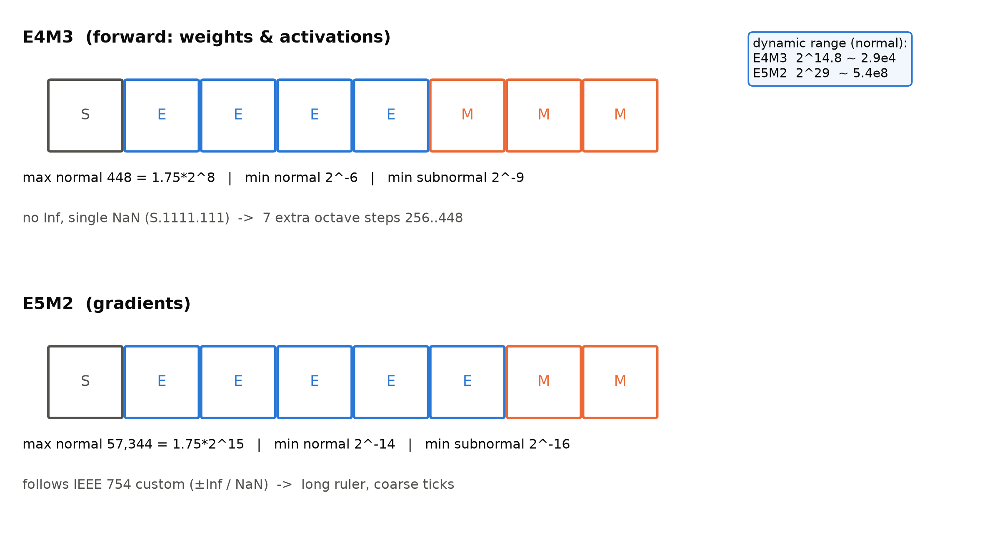
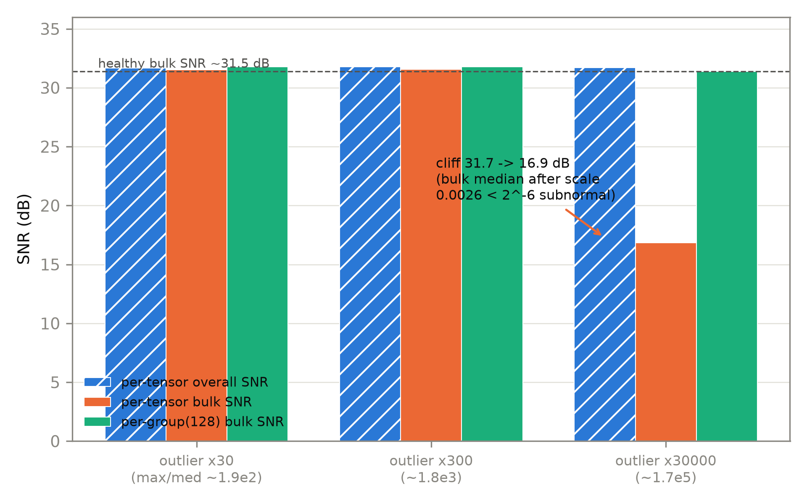
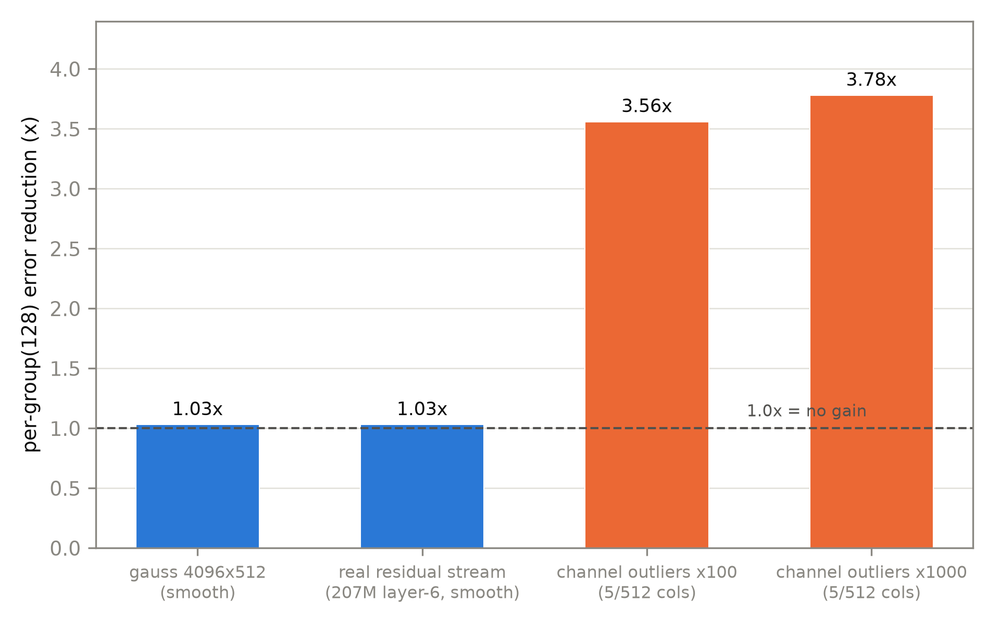
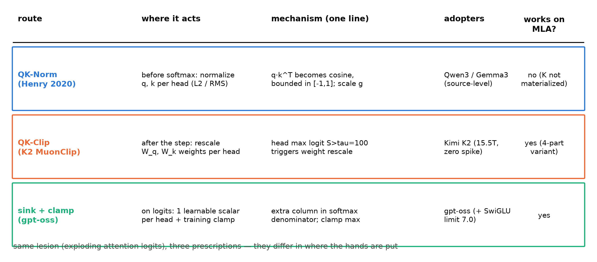

# 第 7 章 训练侧工程：低精度处方与不 spike 的组件

## 7.0 开篇：从全书到这里

上一章我们把第二刀装完了：KV 装进小箱子，注意力插槽换成 MLA，整机两刀的「件」从此齐备。但回看这一路——第 2 章装专家群、第 3 章治负载病、第 5 章免掉均衡税、第 6 章折叠 KV——所有机器烧的都是同一种「标准燃料」：bf16。第 3 章那张三级台阶图其实早已预告：从 GShard 全 fp32 硬扛，到 Switch 精度分区，再到 ST-MoE 的 z-loss，**每敢降一档精度，就得多带一件稳定化工具**——台阶的下一层，正是本章要造的东西。本章在旅程地图的「补件」段（ch6-8）：给训练侧补最后两类工程件。要回答的问题是：**更低的精度（FP8、乃至 4.25 bits 的 MXFP4）凭什么敢进训练循环？大模型不 spike 的组件级药方长什么样？**产出三样：一张 FP8 格式账（表 7.1）、一张 DSV3 的 FP8 全栈清单（表 7.2）、一张三路线稳定化对照表（表 7.3），外加一份本机模拟实验（`fp8_sim.py`，CPU 秒级）。本章结束时的位置：训练侧的「格式—缩放—稳定化」三件事全部见过实物，下一章只剩训练目标侧最后一件（MTP）；再往后，就是带着全部组件去拆旗舰整机了。

> **最小背景栏**
> - fp16 刻度尺（1/5/10 位、最大 65,504、梯度下溢 $2^{-24}$）与混合精度三件套：Book2 第 9 章 9.4 节已立，本章只回指不重教；浮点的「符号/指数/尾数」三元组同出彼处。
> - 三站病历（BERT-LARGE 随机重启、PaLM 540B 约 20 次 spike 与「数据批×参数状态」归因句、OPT-175B 的 63 天 logbook 与缩放崩零）：Book2 第 9 章 9.6 节——本章是它们的回诊台。
> - z-loss 与「低精度化与稳定化是同一条线」的三级台阶：本册第 3 章 3.4 节。
> - MoE 的 router 打分与 gating（门控）：第 2 章 2.2 节；RMSNorm：Book3 第 2 章。
> - MLA 的四路记号 $q^C/k^C/q^R/k^R$ 与「推理时 K/V 不物化」（权重吸收后只缓存 $c^{KV}+k^R$）：第 6 章 6.6 节——7.7 节的桥。
> - 本章全部低精度实验为 **CPU fp32 模拟口径**（本机无原生 FP8/FP4 计算），声明随每个数字走。

## 7.1 两张处方笺：Book2 病历的回诊

两张欠账单先后到期的这一天到了。第一张埋得很深，深到 2016 年：Book1 第 8 章读四代训练配方时发现，GNMT 用 8-bit 定点量化换吞吐（定点权重加 16-bit 累加器，仅损 0.0072 log-ppl——不是常被误传的 fp16），Transformer 论文一概不碰；章末留了一句原话：「低精度从训练侧一路传到推理侧（→ Book4 第 7 章、Book6 第 11 章）」（Book1 第 8 章）。第二张就在上一册：Book2 第 9 章把三站病历只做了**诊断**，章末欠账句原样直引——「更低精度的训练配方与让大模型不 spike 的组件级稳定化方案（更聪明的归一化与裁剪组件），见 **Book4 第 7 章**」。认病在彼，开药在此。

先把病历簿合上，一句话回放：BERT-LARGE 靠随机重启蒙混、PaLM 把病根写成「特定数据批与特定参数状态的相遇」、OPT 的动态损失缩放一路崩到 0.000122——三站合读的四条模式（不稳定随规模浮现、裁剪在场也拦不住、处置一律回退绕行、缩放崩零是 fp16 指纹），Book2 第 9 章 9.6 节已逐条记下。另有一笔软账要在此改道：Book2 同章还预告过「把 $16\Psi$ 切到多卡上去分账的并行方案，是训练侧工程的下一站主题（Book4）」——按丛书最终分工，多卡切分账已移驻系统侧讲（→ Book6 第 12 章/Book8 第 6 章），本章不碰，读者莫在此扑空。

本章付两张处方笺。**处方一：更低精度**。fp16 三件套只是第一棒，往下还有两级——FP8（7.2 格式课、7.3 缩放粒度、7.4 DSV3 全栈）与 MXFP4（7.5）。**处方二：不 spike 的组件**。归一化与裁剪不再只是损失函数里的正则（第 3 章 z-loss 的路数），而是长进架构与优化器里的部件——QK-Norm（7.6）与 Muon 系（7.7）。7.8 把三条稳定化路线摆上一张桌，并用本机模拟验处方一的机制。两张笺在章末会合成一句话：低精度化与稳定化，本就是同一条线。

## 7.2 FP8 格式课：8 个 bit 怎么花

处方一从格式本身开始。Book2 的刻度尺上，fp16 把 16 位花成 1/5/10——指数 5 位换量程、尾数 10 位换刻度。现在预算砍半，只剩 8 个 bit，怎么花？答案不是砍半尾数了事，而是**重排版比**：E4M3 花成 1/4/3，E5M2 花成 1/5/2。同一根跷跷板，两种压法：E4M3 留 3 位尾数（每个八度内 8 个格点），量程缩到 448；E5M2 留 5 位指数，量程拉到 57,344，但每个八度只剩 4 个格点。用人话说：**E4M3 是刻度细但尺子短，E5M2 是尺子长但刻度粗**（图 7.1、表 7.1）。



图 7.1 E4M3/E5M2 位布局与动态范围（自绘，示意级；数字锚定官方论文 2209.05433 v2 Table 1/§2）。E4M3 的特殊值取舍：不表示无穷、仅保留一个 NaN 编码，换来 256-448 段的 7 档量程。

**表 7.1** FP8 两种格式参数对照【证据等级：官方论文 2209.05433 v2 Table 1+§2】

| 属性 | E4M3 | E5M2 |
|---|---|---|
| 位分配（符号/指数/尾数） | 1 / 4 / 3 | 1 / 5 / 2 |
| 指数偏置 | 7 | 15 |
| 每八度格点数 | $2^3=8$ | $2^2=4$ |
| 最大正规数 | $1.75\times 2^8=448$ | $1.75\times 2^{15}=57{,}344$ |
| 最小正规数 | $2^{-6}$ | $2^{-14}$ |
| 最小次正规数 | $2^{-9}$ | $2^{-16}$ |
| 特殊值 | **不表示 Inf、仅一个 NaN**（S.1111.111）——多换 7 档量程 | 遵循 IEEE 754 惯例（±Inf/NaN） |
| 论文推荐用途 | 前向（权重与激活） | 梯度 |

这些数字全部从一条公式里长出来。8 位浮点的值是

$$v=(-1)^{S}\times 1.M\times 2^{\,E-\mathrm{bias}},\qquad \text{bias}=2^{\,\text{指数位}-1}-1 \tag{7.1}$$

用人话说：指数位减去偏置就是二进制小数点的位置，尾数是小数点后面的有效数字——E4M3 的偏置 7 把窗口摆在 $2^{-6}$ 到 $2^{8}$，E5M2 的偏置 15 摆到 $2^{-14}$ 到 $2^{15}$。还有一段公式管不到的地界：指数全零时隐含前导从 $1.M$ 变成 $0.M$，进入**次正规数（subnormal）**区——E4M3 里只剩 $2^{-9}$ 到 $2^{-6}$ 之间 7 个等距格点，再小就归零。这段「贫民区」本章后面要用它解释一次断崖，先记住坐标。

E4M3 那行「无 Inf、仅一个 NaN」值得停半拍：这是三家芯片厂（NVIDIA/Arm/Intel）联合定义时刻意做的取舍——训练前向的饱和可以由缩放因子管（下节），编码里留 Inf 的比特档位不如拿来多换 7 档量程（把最顶上一个八度从 224 抬到 448，多出 256 到 448 段的 7 个格点）；梯度的世界长尾更野、溢出更常见，E5M2 便老老实实保留 IEEE 惯例。**前向与梯度各有分工**——权重与激活的幅值大体可控、要的是刻度；梯度的动态范围天生大几个数量级（大几步、多数近零的长尾），要的是量程。这是 2022 年原论文的配伍，也是后来一切混合格式方案的起点。

拿一个数走一遍编码，格距就有手感了。12.5 在 E4M3 里是 $1.5625\times 2^{3}$：尾数 3 位只能取 $1.000,1.125,\dots,1.750$ 八档，$1.5625$ 夹在 $1.500$ 与 $1.625$ 之间——12.5 只能存成 12 或 13，最好情形也差 0.5；同一个数在 E5M2 里尾数只剩 2 位，八度内只有四档，格距立刻翻倍。再看次正规区：E4M3 里 0.003 落在 $2^{-9}$ 与 $2^{-6}$ 之间的贫民区，格点是 $k\cdot 2^{-9}$ 共 7 个——0.003 会被拽到最近的格点 0.0039，差出三成；再小到 $2^{-10}$（最小格点 0.00195 的一半）以下，才直接归零。8 位浮点不是「fp16 砍半精度」，是在位数预算里重排了量程与刻度的配比——这句话值得念两遍，因为下一节整节都在讲它的代价。

格式好不好，本机先验一遍：对同一张 $(4096,512)$ 高斯矩阵做量化-反量化往返（`fp8_sim.py`，CPU fp32 模拟、种子 20261002，含次正规建模），E4M3 相对 L2 误差 **2.649%**、E5M2 **5.256%**——几乎整整 2 倍：尾数少 1 位，格点数减半，误差翻倍【证据等级：本书实验】。更有教学味的是第三个读数：把同一矩阵整体乘 0.011、0.088、0.88 再量化，误差三次都是 2.649%——**浮点格式尺度自相似**。量化噪声随幅度等比缩小，格距不是绝对的而是相对的；这正是浮点量化与整型量化的本质差异（整型的格点钉死在绝对坐标上，小数值永远落在格点附近），也是 FP8 敢「裸用 per-tensor」一阵子的底气。但底气有用完的时候——什么时候用完，就是下一节全部的内容。

**符号表**（本章各式通用；$B\cdot n$=展平 token 数、$d$=残差流宽、$d_h$=头维、$h$=头数——承全册记号）

| 符号 | 含义 | 形状/取值 |
|---|---|---|
| $S,E,M$ | 浮点编码的符号/指数/尾数 | 式 (7.1)；E4M3 各 1/4/3 位、E5M2 各 1/5/2 位 |
| $\mathrm{bias}$ | 指数偏置 | E4M3=7、E5M2=15 |
| $s$ | 缩放因子（组内 $\max|x|/$ 格式上限） | 标量（per-tensor）或 $(B\cdot n,\,d/128,\,1)$（1×128 tile） |
| bulk SNR | 非离群主体子集的信噪比 | 标量 dB（$\S$7.3 主指标） |
| $g$ | QK-Norm 可学温度 | 标量；$g_0=\log_2(L^2-L)$，$L$=97.5 分位序列长 |
| $\hat Q,\hat K$ | 逐头归一化后的查询/键 | $(B,h,n,d_h)$，归一化沿末维 |
| $W_q^h,W_k^h$ | 第 $h$ 头 Q/K 投影权重（逐头切片） | $(d,d_h)$ 级 |
| $S^h_{\max}$ | 第 $h$ 头 batch 内最大 logit | 标量；式 (7.4) |
| $\gamma_h,\ \tau$ | 裁剪系数/触发阈值 | $\gamma_h=\min(1,\tau/S^h_{\max})$；$\tau=100$ |
| $q^C,k^C,q^R,k^R$ | MLA 四路（承第 6 章记号） | $q^C,k^C,q^R$：$(B,h,n,\cdot)$ 逐头；$k^R$：$(B,n,d_h^R)$ 全头共享 |
| $N_C$ | FP8 GEMM 分段累加长度 | 128（表 7.2） |

## 7.3 缩放粒度：per-tensor 的边界与分组的救法

格式定了，还剩一个自由度：**缩放因子**。浮点的相对精度只在正规数区内成立，于是标准做法是把张量整体乘一个 $s$，让最大幅值贴着格式上限（$s=\max|x|/448$）。全张量共用一个 $s$，就是 per-tensor 缩放——2022 年原论文的原始配方。它够用到什么时候？算一笔账：E4M3 正规数动态范围 $=448/2^{-6}=28{,}672=2^{14.8}\approx 2.9\times 10^{4}$。只要「离群值与本体幅值之比」离这个数还远，per-tensor 就够用；一旦逼近，灾难的机制是：**离群值把 $s$ 撑大，全张量的主体被压进次正规数区**——$2^{-9}$ 到 $2^{-6}$ 之间只剩 7 个稀疏格点，主体的精度断崖式跌落。

这不是思想实验，本机可以完整复现（`fp8_sim.py` 实验②，$(4,512,1024)$ 张量、撒 0.05%-0.1% 的离群点）：离群 ×30（max/中位数 ≈187）与 ×300（≈1,800）时，per-tensor 的主体信噪比（bulk SNR，只统计非离群元素）稳在 31.5-31.6 dB；离群拉到 ×30000（≈$1.7\times 10^5$，越过 $2^{14.8}$ 的边界）时，主体元素的中位数缩后只剩 0.0026——落进次正规区，**bulk SNR 从 31.6 dB 断崖跌到 16.9 dB**；而 per-group(128)（最后一维每 128 个元素一组、每组自算 $s$）稳在 31.4 dB，纹丝不动【证据等级：本书实验（CPU fp32 模拟口径；本机不可复现原生低精度计算，下同）】。图 7.2 里还有一条刺眼的对照线：**全体 SNR 在断崖发生时仍然是 31.7 dB**——离群点自己能量巨大且被完美量化，把总误差稀释了。聚合指标会撒谎，这正是必须盯「主体子集」指标的方法论理由，后面 DSV3 的附录 B.2 会用一次真机版教训替这条方法论背书。



图 7.2 bulk SNR 断崖与分组挽救（自产，`fp8_sim.py` 实验②，CPU fp32 模拟，种子 20261002）。离群强度 ×30000 越过 E4M3 正规数动态范围 $2^{14.8}$：per-tensor 的主体 SNR 从 ~31.5 dB 跌到 16.9 dB，全体 SNR 却仍在 31.7 dB「装没事」；per-group(128) 稳在 31.4 dB。

分组的机制值得拆开看。DSV3 的做法（下节正身）是：激活按 **1×128 tile**（每 token 每 128 个通道一组，张量 $(B\cdot n,d)$ 切成 $(B\cdot n,\,d/128,\,128)$，每组一个 $s$）、权重按 **128×128 block**（权重 $W\in(d,d_{\mathrm{ff}})$ 沿两个维度各切 128）。为什么这样救得了离群？因为**离群元素从此自己定自己那组的 scale**：它落在哪组，哪组的 $s$ 就贴着它，它稳稳落在正规数区顶部近乎精确地被表示（本机模拟里离群通道自身误差仅 ~0.7%），而别的组不受牵连；主体所在组的 $s$ 由主体自己的幅值决定，照样落在正规数区。离群被「隔离处置」了。两种粒度的差别也不是随意的：权重的离群是**通道相关**的（同一行/列的权重幅值有固定的胖瘦），切成 128×128 的方块正好圈住；激活的离群常常**跟着 token 走**（某几个 token 的整行偏大），所以必须沿 token 维切到 1、只沿通道方向组 128——这个不对称不是美学，是 DSV3 附录 B.2 用一次发散换来的教训（下节表尾）。

但分组不是免费午餐，更不是普遍真理——它的收益是**有条件的**。本机同一份模拟的实验③把两种分布摆在一起：平滑分布（高斯矩阵、以及探针 A 采的 207M 第 6 层真实残差流，std 0.975）上，分组相对 per-tensor 的误差只降 **1.03×**——几乎白忙；带通道离群的合成激活（512 通道中 5 个 ×100/×1000）上，误差降 **3.56×/3.78×**【证据等级：本书实验；调研期探针在另一随机布点下测得 2.6×/2.7×——倍数随布点漂移，「离群才有收益」的方向不变】。用人话说：**分组缩放救的是「离群结构」，不是「一切分布」**——残差流本身足够干净时，FP 的尺度自相似已经把活干完了（图 7.3）。所以正确的读法不是「分组更精细所以更好」，而是「激活里到底有没有离群、离群长什么样」决定处方。



图 7.3 分组收益的条件性（自产，`fp8_sim.py` 实验③）。平滑分布（蓝）分组几乎无益；通道离群分布（橙）收益 3.6-3.8×——per-group(128) 的价值由分布里的离群结构决定。

历史顺着这条机制走成三级台阶。第一级，2022 年原论文：per-tensor 配方，验证到 175B 参数级【证据等级：官方论文 2209.05433 v2】。第二级，2023 年 FP8-LM（2310.18313 v2）：把 FP8 的使用**下放**到梯度乃至优化器状态的三个层级（自动混合精度框架，开源 MS-AMP），摘要自报 GPT-175B 档实存内存省 39%、比 BF16 基线快 75%【证据等级：官方论文，厂商自报口径】。第三级，2024-12 的 DSV3：把缩放粒度从「每张量」下细到「每 tile/每 block」，并把整套纪律写成框架——下一节逐件清点。

## 7.4 DSV3 的 FP8 全栈：一张表读 §3.3

细粒度分组在 DSV3 手里长成的不是单点技巧，而是一整套工程纪律——671B 总参、14.8T tokens 的训练全程 FP8，是这门手艺迄今最大规模的一次公开验收【证据等级：官方技术报告 2412.19437 v2 §3.3】。全套清单装在表 7.2 里，正文只讲三件事：哪里用 FP8、哪里**不许**用、累加怎么兜底。

**表 7.2** DSV3 FP8 训练框架全清单（canonical = 2412.19437 v2 §3.3 + 附录 B；逐字核对于 HTML 全文）

| 件 | 处方 | 出处 |
|---|---|---|
| 三个 GEMM | Linear 的 Fprop（前向）/Dgrad（输入梯度）/Wgrad（权重梯度）全部 FP8；输入 FP8、输出 BF16/FP32——「理论 2×」是全文唯一的速度口径 | §3.3.1 |
| **保 BF16 五组件** | embedding、output head、**MoE gating**、normalization、**attention**（原文明列五件，常见转述漏掉 attention） | §3.3.1 |
| 激活量化粒度 | 1×128 tile（每 token 每 128 通道一组） | §3.3.2 |
| 权重量化粒度 | 128×128 block（128 输入 × 128 输出通道） | §3.3.2 |
| 缩放因子选取 | **在线逐组 max-scaling**：现算现用，不用 Transformer Engine 式「延迟缩放」（拿历史最大值推断当前）——scale 更准、框架更简 | §3.3.2 |
| 元素格式 | **全张量 E4M3**（放弃前人「前向 E4M3+梯度 E5M2」的混合配伍——可行性归因于细粒度分组补回了动态范围） | §3.3.2 |
| GEMM 累加 | H800 Tensor Core 的 FP8 累加只保得住约 14 位；K=4096 时最大相对误差近 2%——对策：每 **$N_C=128$** 个元素把部分和 promote 到 CUDA Core 的 FP32 寄存器全精度累加（组 scale 同步乘回，双 warpgroup 交错掩开销） | §3.3.2 |
| 优化器状态 | AdamW 一二阶矩用 BF16 跟踪；master 权重与梯度 FP32 | §3.3.3 |
| 激活存储 | 激活 FP8 缓存；两处特例：attention 后 Linear 输入用自定义 E5M6 格式（scale 取 2 的幂，免二次量化误差）、SwiGLU 输入缓存+反向重算输出 | §3.3.3 |
| MoE 通信 | dispatch 前 FP8 量化（与 FP8 Fprop 兼容）、combine 保 BF16 | §3.3.3 |
| 质量对照 | 附录 B.1：16B MoE 训 1.33T tokens + 230B MoE 训 ~0.9T tokens 双规模，FP8 vs BF16 训练曲线**相对误差 <0.25%**——「训练随机性的可接受范围内」；注意证据是 loss 曲线级，无 benchmark、无速度对照 | 附录 B.1 |
| 反例 | 附录 B.2：把**激活梯度**改用 128×128 block 量化（与权重同法），16B MoE 在 ~300B tokens 处**发散**——激活梯度在 token 间高度不均衡，离群是 token 相关的，只有逐 token 分组（1×128）隔离得住 | 附录 B.2 |

三件事的第一件，FP8 用在哪：**只用在矩阵乘上**。一个 Linear 层从头到尾要算三次 GEMM——前向的 Fprop $y=xW$：$(B\cdot n,d)\times(d,d_{\mathrm{ff}})\to(B\cdot n,d_{\mathrm{ff}})$；反向的 Dgrad $\partial L/\partial x=\partial L/\partial y\cdot W^{\top}$：$(B\cdot n,d_{\mathrm{ff}})\times(d_{\mathrm{ff}},d)\to(B\cdot n,d)$；反向的 Wgrad $\partial L/\partial W=x^{\top}\cdot\partial L/\partial y$：$(d,B\cdot n)\times(B\cdot n,d_{\mathrm{ff}})\to(d,d_{\mathrm{ff}})$——三次全是 FLOPs 大头，全部 FP8。权重侧的 128×128 block 沿的正是 $W$ 的 $(d,d_{\mathrm{ff}})$ 两个维度切；激活侧的 1×128 沿 token 维切到 1，两次反向的形状对得上。第二件，哪些组件**保 BF16 不许动**——五件套的名单本身就是一份「哪里的小数值撬动大分配」的复习提纲：embedding 与 output head 的词表宽矩阵（一行一个词，行的独立性经不起粗刻度扰动）、normalization 的统计量（第 3 章讲过的「小数值撬动大分配」的另一处——均值方差本身就要精细）、以及我们在第 2 章就见识过的 router——两个专家的 logits 只差末位一点，top-k 的选择就整个翻转（第 3 章 selective precision 的同一直觉，DSV3 的 gating 稳定件还包括第 5 章的 sigmoid 打分）；attention 榜上有名则因为 softmax 的 $\exp$ 是天生的放大器。低精度化的纪律感恰恰在这里：**砍精度是局部手术，不是全局开关**。第三件，累加兜底：8 位乘完的积不能在 14 位的累加器里攒几千个数——每 128 个就把部分和升到 FP32 再继续攒。乘可以糙，加必须精。

表尾两行是这门手艺的诚实条款：正面，双规模对照的 <0.25%——注意它证明的是「训练曲线几乎无差」，任务级质量与吞吐并无公开对照【证据等级：官方技术报告 2412.19437 v2 附录 B.1，负结论见调研复核】；反面，附录 B.2 的发散反例替 7.3 节的方法论点了名——粒度不是越细越好那么简单，**方向也不能错**：权重的离群是通道相关的，block 分组够用；激活梯度的离群是 token 相关的，必须逐 token 切。同一台 16B 机器，把激活梯度从 1×128 改成 128×128，训到 300B tokens 就发散——缩放粒度的设计读的是**离群的形状**。这套软件先行的手艺还顺手给芯片厂下了张订单（报告 §3.5.2 的硬件建议：更高精度的 Tensor Core 累加、tile/block 量化的原生支持、在线量化、转置 GEMM）——其中「tile/block 原生支持」正对应下一节。

顺手交代一条红线：网上流传的「DSV3 FP8 训练加速 1.07×」在报告全文里并不存在（两处「1.07」都是参考文献编号的片段）——速度口径只有表 7.2 第一行那句 GEMM「理论 2×」，端到端加速从未被报告【证据等级：官方技术报告全文检索，负结论】。DSV3 还替下一节留了一句桥：他们自述这套细粒度策略「与 microscaling 格式的思想高度一致」，并点名下一代硬件将原生支持——MXFP4 的故事从这句桥开始。

## 7.5 MXFP4：块内共享指数与 gpt-oss 的用法

FP8 的台阶往下还有一级：4 位浮点。单独的 FP4（E2M1，可表示 $\pm\{0,0.5,1,1.5,2,3,4,6\}$）动态范围只有 $6/0.5=12$ 倍，裸用必然灾难；让它活下来的是 OCP MX 规范（2023-09，微软牵头的芯片联盟 + 官方规范）定下的**块内共享指数**：把张量按最后维切成 **32 元素一块**，块内元素用 E2M1，全块共享一个 **8 位纯指数 scale（E8M0，无尾数，即 2 的幂）**【证据等级：官方论文 2310.10537 v3 + OCP MX v1.0 规范】。存储账一目了然：

$$\text{MXFP4}:\quad 32\times 4\ \text{bit（元素）}+8\ \text{bit（共享 scale）}\ \Rightarrow\ 4+\frac{8}{32}=4.25\ \text{bit/参数} \tag{7.2}$$

用人话说：每 32 个数雇一个 8 位的「包工头」定数量级，工人只记 4 位的粗刻度。scale 特意选成**纯指数**（E8M0，只能取 2 的幂）不是省事：2 的幂施加缩放等于给指数位做加减，硬件上不需要乘法器——块缩放要在一个周期内做完 32 次，这个选择让它便宜到可以塞进数据通路。DSV3 给自定义 E5M6 配「scale 取 2 的整数次幂」是同一个理由（表 7.2）。MXFP4 与 DSV3 的 1×128/128×128 结构同型——组内共享缩放——只是组更小（32）、元素更窄（E2M1）：**缩放粒度又下细了一级**，这正是 7.3 节那条主旋律的延续。

第一个把 MXFP4 用成产品事实的是 gpt-oss。官方口径值得逐字引：模型卡论文写「We **post-trained** the models with **quantization of the MoE weights to MXFP4** format, where weights are quantized to 4.25 bits per parameter. The MoE weights are responsible for 90+% of the total parameter count」，并注明所有评测都在同样量化态下进行【证据等级：官方论文（模型卡）2508.10925 §2.1 + HF 模型卡】。三个事实从这句话和 config 里立起来：其一，**只压 MoE 专家投影权重**，embedding、attention、router、norm、输出头全部 BF16——又一个「局部手术」的样本，与表 7.2 五组件名单互为镜像；其二，MoE 占总参 90+%，压对了地方一台 120B 模型就装进单张 80GB 卡、20B 只要 16GB 内存；其三，这条 4.25 bits 不是厂商口头数——第 10 章会从分片头逐字节把它自证出来（每 32 个值一个 scale 字节的存储布局，账目与式 (7.2) 逐位对平）。

> **【考据框】「gpt-oss 用 QAT 从头训练」是二手转述。**官方四份材料（模型卡论文、HF README、GitHub、博客）通篇没有 "QAT/quantization-aware training" 字样；「QAT from scratch」出自第三方工程博客。官方原句只覆盖「后训练阶段带量化 + 发布即原生 MXFP4 + 评测在量化态跑」，预训练循环里到底怎么带量化，官方没说——引用时照原句，不越界推断。

本机给 MXFP4 也留了读数（`fp8_sim.py` 实验④：32 元素块、共享 2 的幂 scale、块内 E2M1 格点的往返模拟）：同一张高斯矩阵，E4M3 误差 2.6%，MXFP4 是 **11.5%**——4.25 bits 的价格标签明晃晃比 FP8 贵四倍多；对照「per-tensor E2M1（无块 scale）」在带离群的张量上误差 16.0%，块共享指数把它压回 11.5%【证据等级：本书实验（CPU fp32 模拟）】。这正是它不出现在 DSV3 式训练循环里的原因：gpt-oss 的 MXFP4 是**发布与部署侧的存储格式**（激活照旧 BF16），不是训练算术的格式。谱系至此收拢成一句话：fp16 三件套（2017）→ bf16 免缩放（TPU 世代）→ FP8 per-tensor（2022）→ FP8 细粒度分组（FP8-LM 三级下放、DSV3 全栈）→ MX 块共享指数（2023 规范、gpt-oss 2025 首个大规模原生开源权重）——每一步都在回答同一个问题：位数更少时，scale 离数据更近一步。

## 7.6 组件级稳定化一：QK-Norm——把点积变余弦

处方二开方之前，先解剖病灶。Book2 三站病历的共同病灶，在 Wortsman 等人的小规模代理研究里被拆成了两类：**注意力 logits 的持续增长**与**输出 logits 的发散**【证据等级：官方论文 2309.14322 v2 摘要】。前者正是本章的主角：注意力分数 $\mathrm{score}_{ij}=q_i\cdot k_j/\sqrt{d_h}$，而 $q\cdot k$ 是两个无界向量的内积——训练中 $W_q$、$W_k$ 的范数一旦长大，logits 跟着长大，softmax 拥挤成 one-hot，梯度在饱和区里消失或爆炸。第 3 章的读者对此应有既视感：router 的 softmax 量级失控我们用 z-loss 治过（式 (3.5)），同一味药 ST-MoE 的脚注里就说过对 attention logits 也有效。但 z-loss 是**损失侧**的正则；组件级的问题要问：能不能让 $q\cdot k$ 天生有界？

能，而且办法朴素得惊人——归一化。Henry 等 2020 年的 Query-Key Normalization：对 Q 和 K 沿**头维**做 L2 归一化（$\hat{Q}=Q/\|Q\|$，$Q\in(B,h,n,d_h)$ 归一化作用在最后一维 $d_h$ 上），再进注意力：

$$\mathrm{Attn}(X)=\mathrm{softmax}\big(g\cdot\hat{Q}\hat{K}^{\top}\big)V,\qquad \hat{q}\cdot\hat{k}\in[-1,1] \tag{7.3}$$

用人话说：先把每根查询/键向量都压成单位长度，点积自动变成余弦相似度——天然有界 $[-1,1]$，softmax 永远有得饱和不出去；原来除 $\sqrt{d_h}$ 的温度，换成可学习的标量 $g$（初始化 $g_0=\log_2(L^2-L)$，$L$ 取 97.5 分位序列长——让初始注意力的熵落在合理区间）【证据等级：官方论文 2010.04245 v1 Eq 2 及附录】。动机原文写得直白："make the softmax function less prone to arbitrary saturation"——让 softmax 不那么容易被推着任意饱和。它管的位置是**进 softmax 之前**——这与后面两路线的分野；在机器里的位置则要交代一句顺序：Qwen3/Gemma3 的实现都是先投影、归一化、再进 RoPE（源码序，norm 住在投影与旋转之间）——位置信息不受归一化影响，旋转作用在单位向量上照常携带相对位置（RoPE 机制=Book3 第 4 章）。

一条勘误级事实必须钉死：

> **【考据框】Henry et al. 没有主张「免 warm-up」。**论文原话是「我们最好的结果用了 8,000 步线性 warmup」，且明说 warmup 的作用待研究。二手材料里流传的「QK-Norm 免除 warm-up」不能安在这篇论文头上。同链另一处 ID 勘误：ViT-22B 的「QK-LayerNorm」正身是 2302.05442（2309.16580 是一篇无关的代数几何论文——检索层引入的错误 ID，已核 K2 参考文献本身不带 arXiv 号）。

采用链是本节真正的故事：Henry 2020（L2 版，Findings of EMNLP）沉寂两年后，先被 ViT-22B 捡起（2302.05442，视觉大模型上对抗 logits 增长），再被 Wortsman 的小规模代理研究推荐为「大规模不稳定的廉价解药」（2309.14322——与 Book2 病历直接接轨的那篇），然后在 Chameleon（2405.09818 v2 §2.3）成为旗舰标配——原文写 "QK-Norm directly controls the norm growth of input to the softmax by applying layer norm to the query and key vectors within the attention"（对注意力内的查询/键向量施加 layer norm，直接控制 softmax 输入的范数增长），且证据硬：去掉 QK-Norm 的 Chameleon-7B 在约 20% 个训练 epoch 处发散、34B 亦然（"QK-norm is essential in both cases"）【证据等级：官方论文 2405.09818 v2 §2.3/Figure 8 直引】。到 2025 年，Qwen3 与 Gemma3 把它焊进了源码：

> **【实现对照框】** transformers 5.18.0 里 Qwen3 的 `q_norm/k_norm = Qwen3RMSNorm(head_dim)`（`modeling_qwen3.py` L237-238，注释原文「unlike olmo, only on the head dim!」）；Gemma3 同构（`modeling_gemma3.py` L338-339）。两个要点：现代实现是 **RMSNorm 变体而非 Henry 的 L2**；且两家的 config 都**没有开关字段**——QK-Norm 藏在建模源码里，config 逆向读不到它，要看代码（第 10 章方法论「config→源码双跳」的又一现场）。

反例同框记下：gpt-oss **不用** QK-Norm（官方参考实现与 transformers 双源一致、无 q_norm/k_norm）【证据等级：源码 transformers 5.18.0 + 官方实现，负结论】。它走的是第三条路——7.8 节三路线对表时再见。

## 7.7 组件级稳定化二：Muon 系——优化器也是稳定性变量

QK-Norm 管住了前向的 logits，但 2025 年的实践把另一个不稳定源推上台面：**优化器**。故事的主角 Muon 来路特殊——它不是论文，是社区配方：Keller Jordan 等 2024 年的技术博客加开源实现（`github.com/KellerJordan/Muon`；K2 报告的参考文献即如此著录，**无 arXiv 正身，引用引 URL**），靠 modded-nanogpt 训练竞速出名。机制一句话就能讲完（数学细节止于此，完整定义见 K2 技术报告 Algorithm 1）：SGD 动量之后，对**矩阵形状参数**的动量做 Newton-Schulz 迭代近似正交化——把更新压成近正交矩阵。用人话说：**正交矩阵的各奇异方向等幅前进**（谱是平的），而 Adam 的逐元素更新谱偏斜（少数大奇异值主导）——Muon 的世界观是「参数是矩阵，就该按矩阵的整体谱结构更新」；embedding、输出头、逐元素参数仍归 AdamW 管。

社区配方要上大模型，缺两件规规矩矩的工程件——Moonlight（Muon is Scalable for LLM Training，2502.16982）补齐了：给 Muon 加**权重衰减**、按 $\sqrt{\max(n,m)}\cdot 0.2$ 调整每参数更新尺度（实现注释原话「Match Adam RMS」——与 AdamW 的更新幅度对齐）。补齐之后，scaling-law 实验给出 compute-optimal 设定下相对 AdamW 约 **2× 计算效率**的自报读数（Moonlight：3B/16B MoE、5.7T tokens）【证据等级：官方论文 2502.16982 v1 摘要，厂商自报口径】。但规模化撞上了新病：**Muon 会放大注意力 logits**。K2 技术报告（canonical 锚 v2；冻结资格按 v1 2025-07 判定——v1 在冻结期内，v2 只是 minor updates，非冻结点外新材料）写得很直白：在 9B 激活/53B 总参的中间规模上，原版 Muon 训练的 max logits 迅速超过 1000，spike 接踵而至——"an issue that occurs more frequently with Muon but less with AdamW"（这个问题在 Muon 下更常发生、AdamW 下较少）【证据等级：官方技术报告 2507.20534 v2 §2.1/Figure 2 直引】。

两个既有药方为什么不够？K2 的原句正好一条联动第 6 章、一条联动上一节。logit softcap 的问题：它 "directly clips the attention logits, but the dot products between queries and keys can still grow excessively before capping is applied"（直接截断 logits，但截断生效之前点积已经可以涨过头）；QK-Norm 的问题更根本——原句逐字：**"QK-Norm is not applicable to multi-head latent attention (MLA), because its Key matrices are not fully materialized during inference"**。用人话说：第 6 章 6.6 节的权重吸收之后，推理时缓存里只有压缩向量 $c^{KV}$ 与共享解耦键 $k^R$，**K 矩阵根本不被物化出来**——没有 K 可归一化。这是「ch6 的架构选择反过来约束 ch7 稳定化工具箱」的现成标本：装了 MLA 的机器，QK-Norm 这味药从结构上就抓不到病灶。

于是 K2 配了新药 **QK-Clip**，思路与 QK-Norm 相反——不在前向动手，在**权重上事后裁剪**。定义每头最大 logit（$Q^h,K^h\in(B,h,n,d_h)$，逐头统计）：

$$S^{h}_{\max}=\frac{1}{\sqrt{d}}\max_{X\in\mathcal{B}}\max_{i,j}\,Q_i^hK_j^{h\top},\qquad \gamma_h=\min\!\big(1,\ \tau/S^{h}_{\max}\big) \tag{7.4}$$

（记号承 K2 原文：$d$=头维，即本章的 $d_h$；$X\in\mathcal{B}$ 指当前 batch。）用人话说：盯着每个头的最大 logit，一旦超过阈值 $\tau=100$，就把该头的 Q/K 投影权重按 $\gamma_h$ 重缩放（朴素版 $W_q^h\leftarrow\gamma^\alpha W_q^h$、$W_k^h\leftarrow\gamma^{1-\alpha}W_k^h$，$\alpha$ 通常 0.5，实用版逐头）——logit 只当**信号**用，报告明确「不改动当前步的前向/反向计算」，梯度照旧流，权重在优化器步之外多挨一刀。MLA 机器上的适配四件套恰好是第 6 章四路记号的解剖图：头特定的内容向量 $q^C$、$k^C$ 各乘 $\sqrt{\gamma_h}$，头特定的 RoPE 查询 $q^R$ 乘 $\gamma_h$，**共享**的解耦键 $k^R$ 不动——共享件一旦按某个头缩放就会殃及全体头，所以宁可少缩一半（$\sqrt{\gamma_h}$ 两次相乘恰为 $\gamma_h$）。

疗效与剂量学都交代得干净：K2 全程 15.5T tokens **零 loss spike**（摘要原话 "zero loss spike"）；logits 先被压在 100 附近，约 30% 训练进度后自然衰减、无需再动 $\tau$；附录 D 用激进阈值 $\tau=30$ 做双跑，loss 曲线无可观差异——不伤质量；前 70,000 步里只有 **12.7%** 的头触发过至少一次，之后全部头自熄——**最小干预原则**的实证【证据等级：官方技术报告 2507.20534 v2 §2.1/摘要/附录 D/Figure 2-3】。整套配方的其余参数也都公开（MuonClip + WSD 日程，15.5T tokens：前 10T 恒定学习率 2e-4、后 5.5T 余弦降到 2e-5，weight decay 0.1 全程，全局 batch 67M tokens）【证据等级：官方技术报告 2507.20534 v2 §2.5】。为什么偏偏 Muon 更容易爆 logits？附录 E 给了理论侧的一句：注意力是 $W_qW_k^\top$ 的双线性形式，谱范数**平方**放大——正交化更新「各方向等幅前进」的好处，到 QK 乘积这里恰好变成平方级的风险。证据格局还欠一句诚实条款：MuonClip 目前没有 K2 之外的独立公开大规模复现（Muon 本体倒有独立的复现与讨论；QK-Clip 只有社区实现与教程级代码——有码无证），15.5T 零 spike 是单一来源的自报口径，各实验室在 2025-2026 年走的稳定化路线也不尽相同（多为冻结点外资料，本书不引）——把它当「一家旗舰的完整处方」读，不当「行业共识」读。再钉一条勘误：

> **【考据框】MuonClip 没有 Vim、也没有 ρ。**K2 v2 全文没有「Vim/variance-reduced momentum」，也没有「按 update 与权重谱范数之比 ρ 裁剪」的参数——机制就是式 (7.4) 的 $\tau$ 触发重缩放，谱范数只出现在附录 E 的*解释*里。二手转述常见此类走样，以报告 §2.1 逐字为准。另：本章涉及的两篇 Moonshot 报告（Moonlight、K2）插图均为 CC BY-NC-ND，本章机制图全部自绘。

## 7.8 同一病灶三种药：对照收束与本机模拟

三条稳定化路线现在可以摆上同一张桌（表 7.3、图 7.4）。它们治的是同一个病灶——attention logits 失控——开的刀口却各在一处：QK-Norm 在**进 softmax 前**改架构（归一化 Q/K）；QK-Clip 在**每步之后**改权重（超阈值重缩放）；gpt-oss 的 sink+clamp 在 **logits 本身**下手——每头一个可学标量拼进 softmax 分母、训练时对最大值截断，配套把专家 SwiGLU 限幅（gate 上限 7.0、up 双向 ±7.0——论文脚注自认「unconventional」）；此处只记处方事实一句，机制与收益的展开地界在 Book5 第 2 章【证据等级：官方实现 + transformers 5.18.0 + 2508.10925 §2.2 脚注】。

**表 7.3** 三路线稳定化对照——「同一病灶三种药」（MLA 记号承第 6 章）

| 维度 | QK-Norm | QK-Clip | sink+clamp（+SwiGLU 限幅） |
|---|---|---|---|
| 下手位置 | 进 softmax 前：逐头归一化 Q/K | 每步之后：重缩放 Q/K 投影权重 | logits 本身：每头 1 可学标量 + 训练截断 |
| 机制一句话 | 点积变余弦，有界 $[-1,1]$（式 (7.3)） | 头最大 logit 超 $\tau$=100 触发权重重缩放（式 (7.4)），不动当步计算图 | softmax 分母多一列吸收质量；上限截断 |
| 与优化器的关系 | 无关（架构件） | 与 Muon 绑定（MuonClip=Muon+QK-Clip） | 无关 |
| 采用者 | Qwen3/Gemma3（源码级）、Chameleon | Kimi K2（15.5T 零 spike） | gpt-oss（gate 7.0/up ±7.0） |
| MLA 适配 | **不适用**（K 不物化） | 四件套适配（$q^C,k^C$ 各 $\sqrt{\gamma_h}$、$q^R$ 得 $\gamma_h$、共享 $k^R$ 不动） | 与注意力形式无关 |
| 机制与收益深讲 | 本章 7.6 | 本章 7.7 | → Book5 第 2 章 |



图 7.4 三路线稳定化对照（自绘，示意级；处方与采用者锚定表 7.3 各行证据源）。

对照表里最值得带走的不是某一格，而是**「MLA 适配」那一列成了 2025 年的分水岭**：稳定化组件不再是可任意叠加的独立商品，它们与架构选择互相约束——选了 MLA（第 6 章的 KV 小箱子），就天然放弃了 QK-Norm 这味药，得换 QK-Clip。架构、数值格式、优化器、稳定化组件，是同一台机器上互相咬合的四个面。

本机模拟也在这一节收拢。三发现回放：其一，**bulk 断崖**（图 7.2）——离群越过 E4M3 正规数动态范围 $2^{14.8}$，per-tensor 的主体 SNR 从 ~31.5 跌到 16.9 dB，per-group(128) 稳住——DSV3 细粒度分组的机制在本机复现；其二，**分组收益的条件性**（图 7.3）——平滑分布 1.03×，通道离群 3.6-3.8×，缩放粒度的处方读的是离群的形状（DSV3 附录 B.2 的 token 相关离群反例是同一课的真机版）；其三，**FP 尺度自相似**（7.2 节）——量化噪声随幅度等比缩小，这是 FP8 与整型量化的本质分野，也是 per-tensor 能撑那么久的原因。全部读数为 CPU fp32 模拟口径（本机不可复现原生低精度计算），速度类结论一概不做。

收束回到开篇的两张处方笺：它们本是一张。「低精度化与稳定化是同一条线」在第 3 章是三级台阶的观察（fp32 硬扛→精度分区→z-loss），在本章长成了机制级的互锁：**敢用多低的精度，由稳定化工具箱决定；工具箱里有什么药，又受架构（MLA 挤掉 QK-Norm）与优化器（Muon 放大 logits）的约束**。DSV3 的 FP8 全栈是这条线在 2024 年的完全体——格式（全 E4M3）×缩放（细粒度+在线）×累加（FP32 分段）×兜底（五组件保 BF16）×验证（双规模 <0.25%）——单点技术没有一样是新的（格式 2022 年就有），新的是整条栈的成熟与大规模验收的勇气。

> **【欠账】** 训练侧这一棒到此交棒：推理侧的量化（GPTQ/AWQ/KV 量化、FP8/MXFP4 部署矩阵）→ **Book6 第 11 章 / Book8 第 8 章**（Book1 F18 登记的下半程在此执行）。低精度训练的下一站（K3 的 MXFP4 QAT 路线）→ **Book5 第 7 章**。

## 7.9 本章小结

开篇领下的两张处方笺，现在都开完了。处方一（更低精度）：8 个 bit 的两种花法（E4M3 刻度细尺子短、E5M2 尺子长刻度粗、E4M3 用 NaN 换 7 档量程）→ per-tensor 的边界在正规数动态范围 $2^{14.8}$（本机 bulk SNR 31.6→16.9 dB 断崖）→ 分组把 scale 搬到离数据一步之遥（1×128/128×128，离群自定组 scale；收益只在离群分布上兑现）→ DSV3 把全套纪律写成框架（三 GEMM、五组件保 BF16、FP32 分段累加、<0.25% 双规模验收）→ MXFP4 把缩放粒度下细到 32 元素块（4.25 bits，gpt-oss 发布侧实物）。处方二（不 spike 的组件）：QK-Norm 把点积变余弦（Henry 2020→ViT-22B→Chameleon→Qwen3/Gemma3 源码级；未主张免 warm-up），Muon 系把优化器拉进稳定化版图（正交化更新放大 logits → QK-Clip 阈值触发权重重缩放 → 15.5T 零 spike、12.7% 头触发自熄）。三路线对表收束，「同一病灶三种药」。

**带走的心智**：如果细节都还回去，请留下两条。**第一条，低精度化的主旋律是「缩放因子一路搬家」——从张量（per-tensor）搬到 tile/block（1×128/128×128）再搬到 32 元素块（MXFP4），每一次搬家都是把 scale 搬到离数据更近的地方，让离群只污染自己那一小组；看到任何低精度方案，先问它的 scale 住在哪、离群长什么样。**第二条，架构、格式、优化器、稳定化组件是互相咬合的一台机器——MLA 挤掉 QK-Norm、Muon 请出 QK-Clip、gpt-oss 拒绝 QK-Norm 改用 clamp：没有万能组件，只有与整机配套的处方；读到任何「稳定化技巧」，先问它装在什么架构、什么优化器上。

镜头拉回整机：两刀齐备（FFN→MoE、GQA→MLA）、训练侧的燃料规格与防 spike 件也配齐了——但训练目标本身还是老样子：每个位置只 harvest 一个监督信号。下一章补最后一件：多 token 预测（MTP），让模型一次多想几步棋——它训练时是目标，推理时会变成资产，那根线到 Book6 才见分晓。

## 7.10 动手验证

- **FP8/MXFP4 模拟四实验**（秒级，CPU fp32；表 7.1 验证读数与图 7.2/图 7.3 数据源，产物 `log/book4-ch07/fp8_sim_run1.json`）：
  ```bash
  cd 工作区根目录 && source env.sh && \
    python "[`code/ch07/fp8_sim.py`](code/ch07/fp8_sim.py)" --out-name run1
  ```
- **复绘本章四图**（图 7.2/图 7.3 读上一步 JSON；图 7.1/图 7.4 为自绘示意）：
  ```bash
  cd 工作区根目录 && source env.sh && \
    python "[`code/ch07/make_figures.py`](code/ch07/make_figures.py)" --json run1
  ```
- **真实残差流输入**：`fp8_sim.py` 自动读取探针 A 采样 `log/book4-feasibility/act_sample.npz`（207M 第 6 层残差流）；缺失时退化为高斯合成并在输出中如实标注。
