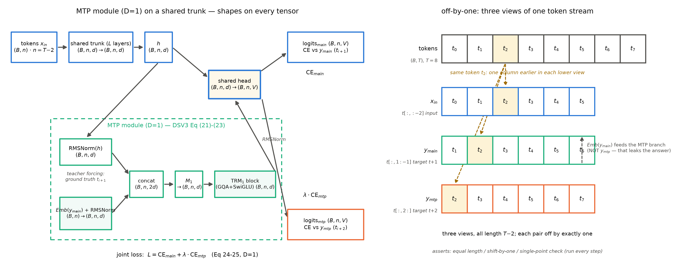
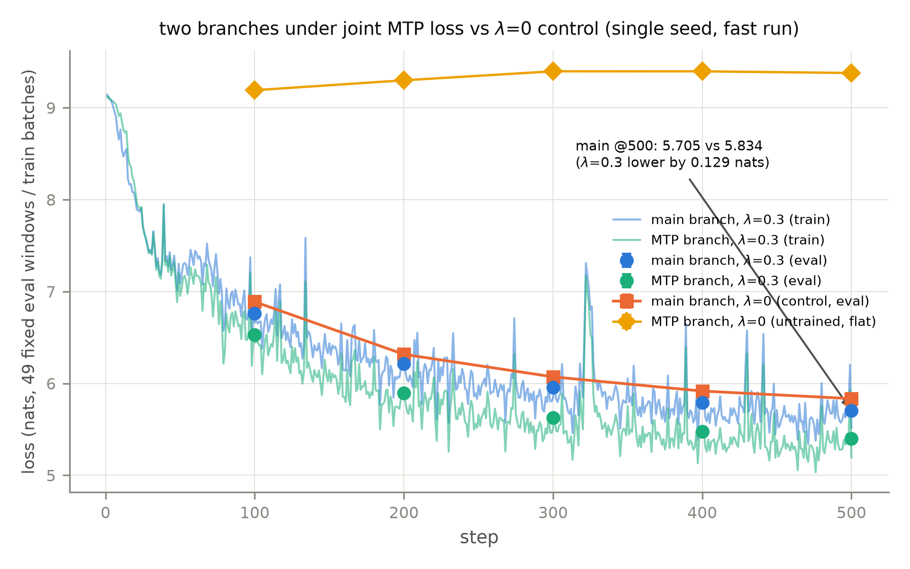

# 第 8 章 MTP：让模型多想一步棋

## 8.0 开篇：从全书到这里

第 7 章合上时镜头交到了这里：「但训练目标本身还是老样子：每个位置只 harvest 一个监督信号。下一章补最后一件：多 token 预测（MTP），让模型一次多想几步棋——它训练时是目标，推理时会变成资产，那根线到 Book6 才见分晓。」【第 7 章成稿直引】现在兑现。清点行装：补件段走过两站——第 6 章把 KV 装进小箱子（MLA），第 7 章配齐低精度燃料与防 spike 件——两刀齐备、件件对拍全绿；但训练循环里那行交叉熵从 Book2 写到现在没动过：模型读完一段上下文，只在「下一个 token」上接受一次考试。本章动的是**训练目标本身**：多 token 预测（multi-token prediction，MTP；中文亦称多词元预测）——让每个位置同时预测 $t{+}2$ 乃至更远的 token，逼着表征多想一步棋。

要回答的问题有三个：把「多想几步」写进损失函数，结构上怎么落地（两代方案：Meta 的并行头与 DeepSeek 的串行模块）？它对小模型和大模型一视同仁吗（一个反直觉的规模现象）？训练期挂上的东西，推理时怎么处置（「训练目标转身成为推理资产」的定位）？产出两样：一张两代方案的对照账（表 8.4），和一台亲手造的 mini MTP 机——26M 主干背上挂一个 DSV3 式 D=1 模块，冒烟五判据加 500 步双臂对照，全部数字本机实跑。本章结束时的位置：补件段（ch6-8）收官，下一章开拆旗舰整机并把全部零件装进两刀机。

> **最小背景栏**
> - 交叉熵损失与教师强制（teacher forcing）：训练时全位置并行出预测、真值整段喂入——Book1 第 7 章已立（教师强制正是「训练可并行」的机关），第 8.1 节只回指不重教；初始 loss $\approx\ln V+d\sigma^2/2$ 的自检传统——Book2 第 10 章/Book3 第 10 章冒烟判据。
> - 训练五件套与模块档几何（$d$=512/$L$=6/$h$=8/$h_{kv}$=4/$V$=8192，语料 sp-8k token 流，单种子 20261002+判据预注册）：第 2/3/5 章沿用至今的口径，本章实验同款。
> - RMSNorm/GQA/SwiGLU/RoPE 四件插槽：Book3 第 2-4 章；模块档正身 `moe_mla_slots.py`（第 2 章起 import 复用）。
> - DSV3 的 MoE 与训练侧两件（noaux/FP8）：第 5 章与第 7 章——本章的 MTP 是同一台整机的第三件新货。

## 8.1 每次前向只收一份学费：单 token 目标的浪费

先把这笔账摆上台面。标准语言建模目标是每个位置预测 $t{+}1$：教师强制让全部位置并行出预测，一次前向把整段上下文都算完了——可监督只摘一颗果子，每个位置恰好一个交叉熵位。浪费有两层读法。第一层是**监督密度**：一次前向的算力是固定成本，语料里每个 token 只贡献一份「学费」，教材明明写满了「看到 $x_1\cdots x_t$ 之后哪些未来词是可能的」，我们只考了最浅的一道题。第二层更深，也更有味道：只预测 $t{+}1$ 时，位置 $t$ 的表征只需好到能选出下一个 token——局部匹配就够了；强迫它同时给出 $t{+}2$，「下一步棋之后的那步」必须已经在表征里。预测得越远，表征被迫携带的规划越深——这就是章名「多想一步棋」的本义。

这笔账 Book1 早就登记在册。清算三大欠账时，第二笔（F2，自回归串行）的还址清单里训练侧那半句写的是：「Book4 第 8 章则从训练侧出手（MTP：多词元预测的训练目标，转身成为推理资产）」【Book1 第 11 章成稿直引】；表 11.2 的 F2 行把回收地址登记为「Book6 第 1/10 章；Book4 第 8 章」——钩子是「自回归串行：因果掩码的另一面」。本章兑现训练侧半句：串行生成这笔账，训练侧的还法是让模型在训练时就学会「一步看多子」。至于推理侧半句——MTP 在推理时的另一重身份——本章只定位不展开，交货地址在章末欠账框（F2 的另一半在那里合单）。

路线图：8.2 讲第一性论文（Gloeckle 2024，多 token 目标的正身）；8.3 讲它最重要的经验发现——规模反转（小模型更差、规模上去反超）；8.4 讲工业模块化（DSV3 的 MTP 模块，深度维串行）；8.5 给推理资产定位；8.6 上本机实验。

## 8.2 Gloeckle：n 个头与一条共享主干

把「多想几步」写成损失函数，最直接的形态来自 Meta（FAIR）2024 年 4 月的论文《Better & Faster Large Language Models via Multi-token Prediction》（arXiv:2404.19737，仅此一版）【证据等级：官方论文】。训练目标一行写尽：

$$L_n = -\sum_t \log P\left(x_{t+n:t+1}\,\middle|\,x_{t:1}\right) \tag{8.1}$$

**符号表**：

| 符号 | 含义 | 形状/取值 |
|---|---|---|
| $x_{t:1}=(x_1,\dots,x_t)$ | 位置 $t$ 的全部上文 | 序列前缀 |
| $x_{t+n:t+1}=(x_{t+1},\dots,x_{t+n})$ | 从 $t{+}1$ 起的未来 $n$ 个 token | $n$ 个词元 |
| $P(\cdot\mid x_{t:1})$ | 由下述结构参数化的联合预测 | $\mathbb{R}^{V^n}$（经分解实现） |
| $n$ | 预测深度（每个位置同时押 $n$ 个未来 token） | 主训练取 4；8-byte 字节级取 8 |

用人话说：每个位置不再只押 $t{+}1$ 一个词，而是把 $t{+}1$ 到 $t{+}n$ 的 $n$ 道题一起押——同一份上下文，$n$ 倍的考试量。

结构怎么撑起这个目标？摘要一句说尽（逐字）："at each position in the training corpus, we ask the model to predict the following $n$ tokens using $n$ independent output heads, operating on top of a shared model trunk."【证据等级：官方论文 2404.19737 v1 摘要，直引】——$n$ 个**独立输出头**（output head）坐在一条**共享主干**（shared trunk）上：主干 $f_s$ 产出位置 $t$ 的潜表征，第 $i$ 个头 $f_{h_i}$ 从同一张桌面上抄题，专答 $t{+}i$；默认实现里每个头是**一层 Transformer 层**，词表投影 $f_u$（unembedding）全体共享。头与头互不可见——这是**头维的并行**（此话先记下，8.4 节要拿它当对照面）。形式化即 $P(x_{t+i}\mid x_{t:1})=\mathrm{softmax}\left(f_u\left(f_{h_i}\left(f_s(x_{t:1})\right)\right)\right)$，附录 B 测过线性头、因果/反因果头链等变体，均不如这个默认形态【证据等级：官方论文 2404.19737 v1 §2/附录 B】。

这份论文有一处方法论亮点值得单独圈出——**等参数对齐规则**。多 token 模型比基线多了 $n-1$ 个头层，参数天然更多；若直接对照，赢了也说不清是目标好还是参数多。论文的处置逐字是："when we add $n-1$ layers in future prediction heads, we remove $n-1$ layers from the shared model trunk"【证据等级：官方论文 2404.19737 v1 §2，直引】——加 $n{-}1$ 个头层、同时从主干删 $n{-}1$ 层，总参数严格相等，架构对照表见其 Table S14。这正是本册第 2/5 章配臂公式的论文级同款功夫（等激活/等总参双口径），而且取的是最严的一档。读任何「加了个新部件所以变好」的结论时，先问一句：参数对齐了吗？

实现侧还有一笔显存账。$n$ 个头各自输出整段序列的 logits（每位置 $V$ 维，词表大时一格就是十万级），朴素实现要 $n$ 份同时驻留显存。论文的技巧逐字："we sequentially compute the forward and backward pass of each independent output head $f_i$, accumulating gradients at the trunk … reduced the peak GPU memory utilization from $O(nV+d)$ to $O(V+d)$, at no expense in runtime"【证据等级：官方论文 2404.19737 v1 §2，直引】。用人话说：头不必同时住在显存里——逐头做前向加反向、梯度先记在主干账上，峰值从 $n$ 份降到 1 份，墙钟零代价（其 Table S5 验证）。（术语警示：这里的 sequentially 是**训练实现**里「逐头算梯度」的串行，与 8.4 节 DSV3「深度维串行」是两码事——同名不同义，写作圈已有人混淆，本书三处「并行/串行」在 8.4 节各归其位。）

深度 $n$ 取多少？7B 模型、200B 代码 token 的主训练扫描下来 $n{=}4$ 最优：MBPP pass@1 33.8 对基线 30.0、HumanEval pass@1 24.0 对 22.8【证据等级：官方论文 2404.19737 v1 表 1】。这一节的结构、对齐与显存技巧构成 MTP 的「第一性版本」；但它最出名的贡献既不是结构也不是这些数字，而是一个反直觉的现象——下一节。

> **【考据框】** MTP 的谱系与一个常见误认。推理侧「一次猜几个词」的前身是 Stern et al. 2018 的 blockwise parallel decoding（Google）——只改推理、训练目标不动；Gloeckle 2024 把同样的前瞻性第一次系统性地写进**训练目标**（论文自引 Stern 作推理侧实现件）；DSV3（2024-12）把它模块化成旗舰标配件；2025 年旗舰（如 Nemotron 3）继续携带 MTP 层【证据等级：官方论文 2404.19737 v1 §2；官方技术报告 2512.20856 v1 §2.3】。误认是反过来把 Stern 当成 MTP 训练目标的先声——它不是：训练目标没变的东西，不属于这条线的起点。

## 8.3 规模反转：小模型更差，规模上去反超

多 token 目标对模型是好事吗？直觉说「多一份监督总没坏处」。数据说：看规模。Figure 3 的图注一句定调（逐字）："Multi-token prediction models are worse than the baseline for small model sizes, but outperform the baseline at scale."【证据等级：官方论文 2404.19737 v1 图 3 图注，直引】——小模型更差、规模上去反超。附录 E 的 Table S7 把交叉点钉得很实（MBPP pass@1，等参数口径，$n{=}1$ 基线对 $n{=}4$）：

**表 8.1** 六档规模阶梯（全部【证据等级：官方论文 2404.19737 v1 附录 E 表 S7】；代码语料 ≥91B token 起档）

| 规模 | 0.3B | 0.6B | 1.3B | 3B | 6.7B | 13B |
|---|---|---|---|---|---|---|
| $n{=}1$（基线） | 1.8 | 4.7 | 6.8 | 11.1 | 23.9 | 26.0 |
| $n{=}4$ | **1.0** | **3.0** | **7.4** | **12.7** | **26.0** | **30.5** |

0.3B 档掉一半，0.6B 档仍在跌，1.3B 档翻正——**交叉点在 0.6B→1.3B 之间**，此后一路放大。摘要口径同向（逐字）："The method is increasingly useful for larger model sizes, and keeps its appeal when training for multiple epochs."（方法对更大模型越来越有用，多 epoch 训练仍保持吸引力）【证据等级：官方论文 2404.19737 v1 摘要，直引】。论文还把这个现象当作「历史悬案」的答案（逐字）："We believe this usefulness only at scale to be a likely reason why multi-token prediction has so far been largely overlooked as a promising training loss for large language model training."【证据等级：官方论文 2404.19737 v1 §3.1，直引】——正因为在小模型上试过的人只看到变差，这个训练目标才被冷落多年。

此处必须立一块写作红线：坊间流传「4B 以上才显优势」——**原文没有这句话**（对全文检索 4B/4 billion/above 4 仅命中无关表述；调研底单 papers/05 §1.2 已核）【证据等级：官方论文（负结论，全文核）】。交叉点以表 8.1 为准，引用一律写「0.6B→1.3B 之间」。数字讹传的传播力总比勘误强，本册把它钉死在这里。

为什么会有反转？论文给的是现象与统计，机制级解释不在其证据内；本书的教学假说（标注为解读、非论文主张）是**表征预算的争抢与宽裕**：$n$ 个头从同一份主干表征里各自读题，小模型的表征预算紧张，$n$ 道题互相争抢容量，连主任务都被拖累；规模上去后预算宽裕，$n{-}1$ 份额外监督从争抢变成免费的信号增密——同一次前向，学费从一份变 $n$ 份。8.6 节本机 26M 档会再撞上这条曲线的下端，届时回来对照。

大档的成绩单收三行就够本章用了：13B 模型 HumanEval 多解（multiple-solutions 口径）**+12%**、MBPP 多解 **+17%**【证据等级：官方论文 2404.19737 v1 摘要】；代码任务平均多解约 **+15%**【证据等级：官方论文 2404.19737 v1 §1】；字节级 8-byte 预测（7B、314B bytes≈116B token）MBPP pass@1 **+67%**——全论文最大的单项数字【证据等级：官方论文 2404.19737 v1 §3.3】。推理侧的收益数字（加速类）本章一律不挂——那是另一本账，唯一落点在章末欠账框。

## 8.4 DSV3 的 MTP 模块：深度维串行，保完整因果链

第一性方案八个月内就被工业旗舰收编，但收编的不是原样——DeepSeek 在 V3 上把 MTP 重新设计成**可插拔的模块**（MTP Modules，报告 v2 §2.2）【证据等级：官方技术报告 2412.19437 v2 §2.2】。先在整机上定位：DSV3 是第 9 章要拆的那台 61 层 MoE 旗舰，三件新货里 noaux（第 5 章）与 FP8（第 7 章）都已验过，MTP 是第三件——挂在 $L$ 层主干**之后**，config 字段 `num_nextn_predict_layers=1`；训练时它在网，推理时可整体拆除（8.5 节）。第 $k$ 个模块（共 $D$ 个）由四件组成，原文逐字："The $k$-th MTP module consists of a shared embedding layer Emb(·), a shared output head OutHead(·), a Transformer block TRM_k(·), and a projection matrix $M_k \in \mathbb{R}^{d \times 2d}$."【证据等级：官方技术报告 2412.19437 v2 §2.2，直引】——共享词嵌入、共享输出头、一个 Transformer 块、一枚拼接投影。数据流两步（报告式 (21)-(23)，本册编号承之；$k{=}1$ 即 DSV3 实配的 D=1）：

$$h_i^{\prime k} = M_k\left[\,\mathrm{RMSNorm}\left(h_i^{k-1}\right)\;;\;\mathrm{RMSNorm}\left(\mathrm{Emb}\left(t_{i+k}\right)\right)\,\right] \tag{8.2}$$

$$h_{1:T-k}^{k} = \mathrm{TRM}_k\left(h_{1:T-k}^{\prime k}\right),\qquad P_{i+k+1}^{k} = \mathrm{OutHead}\left(h_i^{k}\right) \tag{8.3}$$

用人话说：把「上一深度在位置 $i$ 的总结」和「刚被预测的那个 token 的嵌入」各归一化后拼起来，过一个小 Transformer 块，读出再远一步的词——$k{=}1$ 时模块吃主模型表征 $h_i^0$ 与真值 $t_{i+1}$ 的嵌入（教师强制），吐出 $t_{i+2}$ 的分布。式 (8.3) 的下标切片值得盯一眼：$h^{\prime k}$ 取整段 $1{:}T{-}k$ 同算——**位置维全并行**，教师强制的老红利一点没丢。两步运算的形状流转逐行列在表 8.2。

**表 8.2** MTP 模块形状流转表（$D{=}1$，$n{=}T{-}2$ 为有效位置数；DSV3 档 $d{=}7168$/$V{=}129,280$ 换数字即得，mini 档见 8.6 节）

| 步骤 | 运算 | 输入形状 | 输出形状 | 说明 |
|---|---|---|---|---|
| 主干前向 | $L$ 层 + 终态 norm | $(B,n,d)$ | $(B,n,d)$ | $h^{0}$，主支路 logits 同源 |
| 真值嵌入 | $\mathrm{Emb}(t_{i+1})$ | $(B,n)$ | $(B,n,d)$ | 教师强制：共享词嵌入 |
| 归一拼接 | $[\,\mathrm{RMSNorm}(h);\mathrm{RMSNorm}(e)\,]$ | $(B,n,d)\times2$ | $(B,n,2d)$ | 式 (8.2) 方括号 |
| 投影 | $M_k\in\mathbb{R}^{d\times2d}$ | $(B,n,2d)$ | $(B,n,d)$ | 两路信息合流 |
| TRM 块 | 同主模型插槽的一层 | $(B,n,d)$ | $(B,n,d)$ | 式 (8.3) 左，位置维并行；DSV3 同构层=MLA+MoE，mini 档=GQA+SwiGLU |
| 共享头 | $\mathrm{OutHead}$ | $(B,n,d)$ | $(B,n,V)$ | 式 (8.3) 右，目标 $t_{i+2}$ |

现在到了本章最容易被转述搞错的一处，报告自己立了界碑（逐字）："Different from Gloeckle et al. (2024), which parallelly predicts D additional tokens using independent output heads, we sequentially predict additional tokens and keep the complete causal chain at each prediction depth."【证据等级：官方技术报告 2412.19437 v2 §2.2，直引】——与 Gloeckle 的并行独立头不同，我们**串行**预测附加 token、在每个预测深度保住完整因果链。串行发生在**深度维**：第 $k$ 个模块的输入 $h_i^{k-1}$ 是第 $k{-}1$ 个模块的输出——预测第 2 个附加 token 的模块，看得见第 1 个附加 token 是怎么被预测出来的（加上教师强制喂入的全部真值前缀）。三处「并行/串行」各归其位：**Gloeckle 并行在头维**（$n$ 个独立头同读主干输出、互不可见）；**DSV3 串行在深度维、并行在位置维**（式 (8.3) 整段切片同算）；**Gloeckle 显存技巧的 sequentially 在训练实现维**（逐头算梯度省显存，8.2 节）。常见转述把 DSV3 说成「并行预测 D 个附加词元」——与原文划界句正好相反。报告还补了第二块界碑：保因果链的原则与 EAGLE（Li et al., 2024）同源，但目的相反——EAGLE 生来为推理加速服务，DSV3 的 MTP 为改进训练服务【证据等级：官方技术报告 2412.19437 v2 §2.2，转述】。

训练目标是主损失加一条加权支路（报告式 (24)-(25)）：$\mathcal{L}=\mathcal{L}_{\mathrm{CE}}^{main}+\mathcal{L}_{\mathrm{MTP}}$，其中 $\mathcal{L}_{\mathrm{MTP}}=\frac{\lambda}{D}\sum_{k=1}^{D}\mathcal{L}_{\mathrm{MTP}}^k$（各深度交叉熵平均后乘权重 $\lambda$）。用人话说：主任务照旧，多想的那几步按折扣价计入总账。两个超参的取值报告给得很干脆（逐字）："The MTP loss weight $\lambda$ is set to 0.3 for the first 10T tokens, and to 0.1 for the remaining 4.8T tokens."——前 10T token 用 $\lambda{=}0.3$、后 4.8T 降到 0.1（与 14.8T 总量自洽）；"The multi-token prediction depth D is set to 1"——每个 token 除精确的下一个外，只多预测一个附加 token【证据等级：官方技术报告 2412.19437 v2 §4.2，直引】。**D=1 报告未给论证**——没有「为什么不是 2/3」的消融；按深度串行的结构与训练开销随 $D$ 线性涨、收益未证来看是合理的工程取舍，但这是本书推断，如实标注。8.6 节本机件同样取 D=1、$\lambda{=}0.3$ 起步（照抄前段，冒烟不做调度）。

效果证据是一张干净的消融表——两个基线架构与训练数据完全不变、只追加一个深度的 MTP 模块，且**推理时拆掉**（口径声明逐字）："during inference, we directly discard the MTP module, so the inference costs of the compared models are exactly the same."【证据等级：官方技术报告 2412.19437 v2 §4.5.1，直引】——性能增益与推理成本解耦，这是与 Gloeckle 的第二层差异（那边头层是等参数挪进主干的，动的是主干本身；这边模块是外加的、可整体拆除）。

**表 8.3** DSV3 MTP 消融（Small=15.7B 总参/2.4B 激活/1.33T token，Large=228.7B/20.9B/540B；【证据等级：官方技术报告 2412.19437 v2 §4.5.1 表 4，厂商自报】）

| 基准 | Small：基线 → +MTP | Large：基线 → +MTP |
|---|---|---|
| Pile-test（BPB，越低越好） | 0.729 → 0.729 | 0.658 → 0.657 |
| MMLU 5-shot | 50.0 → 53.3 | 67.5 → 66.6（略降） |
| BBH 3-shot | 39.0 → 41.4 | 70.0 → 70.7 |
| HumanEval 0-shot | 20.7 → **26.8**（+6.1） | 44.5 → **53.7**（+9.2） |
| MBPP 3-shot | 35.8 → 36.8 | 61.6 → 62.2 |
| GSM8K 8-shot | 25.4 → **31.4**（+6.0） | 72.3 → 74.0 |
| MATH 4-shot | 10.7 → 12.6 | 38.6 → 39.8 |

读法一句话：**增益集中于生成式任务**——代码与数学（HumanEval/GSM8K/MATH）涨得最凶，困惑度类持平，MMLU 一格还略降。「MTP 不是全面补品，是生成专补」与 Gloeckle「generative 基准上尤其显著」互证：两代工作、两个数量级的规模（7B 对 228.7B）、同一定性结论【证据等级：官方论文 2404.19737 v1 §3】。

工程侧还有一笔「共享」的账，官方仓库给出了分账原文（逐字）："The total size of DeepSeek-V3 models on HuggingFace is 685B, which includes 671B of the Main Model weights and 14B of the Multi-Token Prediction (MTP) Module weights."【证据等级：官方仓库 README，直引】——685=671+14。本书分片头逐张量复算：MTP 模块唯一参数 **11.61B**（官方细账 11.5B unique 吻合；含实体化的嵌入/输出头拷贝则 13.46B），结构上就是一枚与主模型隐藏层同构的完整 MoE 层（`model.layers.61`，含 256 路由专家）加 $M_1$ 投影（$7168\times14336$=102,760,448）与两枚 RMSNorm【证据等级：config 逆向（分片头审计，163 片逐名 0 差）】。模块占主模型的 1.7%——「MTP 很便宜」在旗舰口径下也成立。报告 §3.2.3 还交代了部署细节：最浅层与最深层放同一流水线并行 rank，共享件得以物理共享参数与梯度【证据等级：官方技术报告 2412.19437 v2 §3.2.3】。

两代方案到此可以合账对表——表 8.4 把 8.2 与 8.4 的全部对照收进一格一格：

**表 8.4** Gloeckle vs DSV3 的 MTP 对照

| 维度 | Gloeckle（Meta，2024-04） | DSV3（2024-12） |
|---|---|---|
| 预测结构 | $n$ 个独立头**并行**，同读主干输出 | $D$ 个模块**串行**，模块 $k$ 读 $k{-}1$ 的输出 |
| 头/模块构成 | 每头 1 层 Transformer 层 + 共享 unembedding | 共享 Emb + 共享 OutHead + $M_k(d{\times}2d)$ + 1 个 TRM 块 |
| 因果链 | 头间互不可见（截断在头维） | 深度维保完整因果链 |
| 参数对齐 | 加 $n{-}1$ 头层、删 $n{-}1$ 主干层（等参数） | 外加模块（训练在网、推理可拆） |
| 损失加权 | 全头直加（无加权方案） | $\frac{\lambda}{D}\sum_k$，$\lambda$ 0.3→0.1 |
| 实践取值 | $n{=}4$（7B/200B token） | $D{=}1$（671B/14.8T token，无论证如实标注） |
| 增益画像 | 代码任务多解 +12%/+17%（13B） | 生成式任务集中（HumanEval +6.1/+9.2） |

> **【实现对照框】** transformers 5.18.0 里 MTP 的「有字段、无模块」：DSV3 的 config 定义了 `num_mtp_layers: int = 1`（attribute_map 映射自 checkpoint 字段 `num_nextn_predict_layers`），但 modeling 全文**没有 MTP 模块类**（grep 核实），`generate(use_mtp=...)` 仅 docstring 提及——训练侧 MTP 结构不在 transformers 原生实现里，官方权重把它作为 `model.layers.61` 发布【证据等级：config/源码（本机实测）】。serving 栈（本丛书第 7-8 册的主角 vLLM）已有同型实现件——那半段归 Book7。本册 `mtp.py` 与其结构同型、两处差异如实登记：拼接序取论文式 (8.2) 的 $[h;\mathrm{Emb}]$（vLLM 实现为 $[\mathrm{Emb};h]$）；共享取「主干对象本体进出两支路」的最小版（`MTPSlotLLaMA.forward` 里 embedding 与 lm_head 同一对象）。

## 8.5 训练目标转身成为推理资产

结构讲完，回到那个贯穿本章的定位：训练期挂上的东西，推理时怎么处置？报告的定位句前半逐字："Our MTP strategy mainly aims to improve the performance of the main model, so during inference, we can directly discard the MTP modules and the main model can function independently and normally."【证据等级：官方技术报告 2412.19437 v2 §2.2，直引】——MTP 策略主要旨在提升主模型性能，推理时可以直接拆掉模块，主模型独立、正常工作。这句话把两段生命周期拆干净了：**训练期**，模块在网、支路损失把「多想一步」的梯度灌进主干（表 8.3 的增益全数沉淀在主模型身上）；**推理期**，模块整个卸下，机器回到一台普通旗舰——或者，把模块挂回去改作他用、进一步压生成时延（定位句的后半段）。那后半段的数字与机制，本册一个都不挂——它是第六册第 10 章的正菜，本章欠账框是唯一登记处。

「训练目标转身成为推理资产」因此是两段式的故事：Gloeckle 是第一段（训练为主、推理收益作附带），DSV3 把第二段写成工程选项（可拆、也可改作他用——拆与用的取舍都留给了部署侧）。工程意义值得咀嚼一遍：大多数训练件（归一化、路由、优化器）训练完就熔进权重里，摸不到了；MTP 模块是罕见的**训练结束后仍以独立实体存在**的部件——这决定了它天然有两种退役方式。谱系再补一笔：到 2025 年，MTP 已是旗舰标配件（Nemotron 3 系列亦携带 MTP 层，置于网络末端）【证据等级：官方技术报告 2512.20856 v1 §2.3】——从 2024 年 4 月的论文到 2025 年的标配，这条线只用了一年半。

## 8.6 mini MTP：26M 主干挂一个 D=1 模块

最后在自己的机器上验货。设计原则与第 2/3/5 章同款：不私搭模型，主干就是那台模块档 dense（$d{=}512$/$L{=}6$/$h{=}8$/$h_{kv}{=}4$/$V{=}8192$，探针 B 验过的 26,089,984——第 2-5 章四臂消融的 dense 臂同几何同语料），背上严格照抄式 (8.2)-(8.3) 的 MTP 模块（D=1）：共享主干 embedding 与 lm_head（零新增，共享写在调用点、可审计）、两枚入模 RMSNorm、$M_1$ 投影（$2d{\to}d$）、一个与主干同型的 TRM 块、出口 RMSNorm（[`ch08/mtp.py`](code/ch08/mtp.py) 的 `MTPModule`）。参数账先算后跑：新增 = $3\times512$（norm）+ $2d^2$=524,288（投影）+ 2,950,144（TRM 层）= **3,475,968**，总参 **29,565,952**——主干 26.1M、模块 3.5M、+13.3%，「MTP 很便宜」的量化体感（对照 DSV3 的 1.7%：模块占主干的比重随层数摊薄——本档 $L{=}6$，一枚同型层加投影就占 13.3%；DSV3 有 61 层，同构层只占 1.7%）。联合损失 $\mathcal{L}=\mathrm{CE}_{main}+0.3\cdot\mathrm{CE}_{mtp}$（`joint_loss`，λ=0 时联合恒等主支路）。对照臂设计成单变量：λ=0.3 主臂与 λ=0.0 对照臂**同种子、同日程、同数据、同代码路径**——唯一差异是支路损失进不进总账；λ=0 臂的 MTP 模块照旧前向与记录（梯度权重为零），所以两臂背着同一台整机，读数是「加监督不加参数账」的净效应。

动手前必须先教本档最常见的静默 bug——**off-by-one**（差一位的切片错位）。三个视图切片是全部机关：$x_{in}=t_{[:,:-2]}$（主干输入）、$y_{main}=t_{[:,1:-1]}$（主支路目标，$t{+}1$）、$y_{mtp}=t_{[:,2:]}$（MTP 支路目标，$t{+}2$），各长 $T{-}2$、互相恰错一位；支路的输入嵌入是 $y_{main}$——教师强制喂的是**真值 $t{+}1$**，不是支路自己要预测的 $t{+}2$（图 8.1 右半的三视图）。错了会怎样？三种死法各有面目：切片不等长（拿 $t_{[:,1:]}$ 当主目标）会在静默截断后照跑；**答案泄漏**（把 $y_{mtp}$ 喂进支路嵌入）会把支路任务变成恒等映射——loss 异常低、看起来「学得特别好」；最阴的是只差一位的视图混用——梯度照降、曲线正常、任务已经不是设计的那道题。防线三道，全部内置（`three_views`/`assert_off_by_one`）：等长与错位断言每步训练前跑一遍（$O(T)$ 廉价）、功能核验用探针 embedding 记录支路实际喂入逐位比对 $y_{main}$、初始 loss 判据兜底（答案泄漏会让初始 loss 远低于 $\ln V$——冒烟判据②因此不只是仪式）。



图 8.1 MTP 模块结构与 off-by-one 三视图（自绘示意级）。左：DSV3 式 D=1 模块数据流，每个张量框标形状（$(B,n,d)$ 级；共享件=黄底：主干 embedding/输出头两支路共用同一对象，$M_1$ 投影 $2d{\to}d$、TRM 块同型插槽层）；右：同一 token 流的三个视图（$T{=}8$ 为例）——三行等长 $T{-}2$、同一 token 每往下一行左移一列（黄格追踪 $t_2$）；支路嵌入吃 $y_{main}$（真值 $t_{i+1}$）而非 $y_{mtp}$。复现：`python [`code/ch08/fig_ch08.py`](code/ch08/fig_ch08.py) --which diagram`。

冒烟五判据全部通过（表 8.5；CPU fp32 秒级，产物 `log/book4-ch08/mtp_smoke_run1.json`）：

**表 8.5** 冒烟五判据（判据预注册在先——notes/07 §B.3.3，写于任何 fast 数字落地之前）

| # | 判据 | 期望 | 实测 |
|---|---|---|---|
| ① | 参数账两级 assert | 26,089,984 + 3,475,968 = 29,565,952 | 逐位相等（共享件只计一次） |
| ② | 初始 loss | $\ln V$=9.0109；主支路期望 $\ln V+d\sigma^2/2$≈9.113 | 主 **9.1154** / MTP 支路 9.1090（带 [8.6, 9.6]） |
| ③ | off-by-one 三视图 | 等长 $T{-}2$ / 恰错一位 / 喂入=$y_{main}$ | 结构断言 + 功能核验双 PASS |
| ④ | λ 恒等式 | λ=0：$\mathcal{L}\equiv\mathrm{CE}_{main}$ 逐位 | PASS |
| ⑤ | 反向一步 | 有限、无 NaN、梯度回流主干 | 联合 11.8481 有限；70 个参数张量梯度全有限；主干梯度范数 3.85 |

②里藏着一个值得停一秒的咬合：主支路初始 9.1154 对期望 9.113，千分位吻合（Book2/Book3 冒烟传统的延续）；MTP 支路初始也在 $\ln V$ 量级——共享头压在随机 TRM 输出上，同样近均匀。**如果这里读出远低于 9.01 的数，先别高兴，八成是答案泄漏**。

fast 档 500 步双臂落地（表 8.6；MPS bf16 训练/fp32 评测，0.44 s/step——dense 0.354 的 1.24 倍，MTP 模块的墙钟代价；eval 与第 2/3/5 章完全同集 49 窗，单种子趋势级）：

**表 8.6** λ 双臂读数（500 步；【证据等级：本书实验（2026-10，M5 Pro/48GB）】）

| 臂 | eval_main@500 | eval_mtp@500 | 读数 |
|---|---|---|---|
| λ=0.3（主臂） | **5.7054 ± 0.020** | **5.4000 ± 0.020** | 双支路同降（train 首/末 10 步：main 8.94→5.69、mtp 9.04→5.38） |
| λ=0.0（对照） | 5.8342 ± 0.021 | 9.3776（全程 9.2-9.4 平走） | 不训的支路不降——wiring 对照 |



图 8.2 双支路 loss 曲线（自产，`fig_ch08.py` 读 `log/book4-ch08/mtp_fast.json` 与曲线 CSV）：λ=0.3 臂主/MTP 双支路（细线=train、圆点=49 窗 eval）；λ=0 臂主支路（方块）与不训的 MTP 支路（菱形，平走）。末态标注：挂 MTP 的主支路 5.705 对对照 5.834。复现：`python [`code/ch08/fig_ch08.py`](code/ch08/fig_ch08.py) --which curve`。

三个读数对着预注册判据逐条念。**第一，「拖累主支路 >0.05 nat 才排障」——未触发，且方向反了**：$\mathrm{eval}_{main}(\lambda{=}0.3)-\mathrm{eval}_{main}(\lambda{=}0)$ = **−0.129 nat**，挂 MTP 训练的主支路反而更低，超出同种子噪声带（约 0.03）四倍。按纪律如实记录：这落在预注册结果集**之外的好侧**——预期分支是持平/略差（8.3 节规模反转的曲线下端自洽素材），实测小优；单种子趋势级，不作强断言。口径差异也要摆明：Gloeckle 的交叉点结论是等参数并行头、代码任务、多解口径；本实验是 DSV3 串行模块、通用文本、单解交叉熵——两件事不硬套，数字并排、解释权留给读者。若要一个机制候选（标注为解读）：支路的交叉熵梯度经共享主干回流，每 token 监督位从 1 变 2——8.1 节「学费增密」的最小现场版。

**第二，预注册预期「MTP 支路 loss 恒高于主支路」被数据推翻**。eval 五个边界 MTP 支路全部**更低**（图 8.2 上侧两条曲线：6.53/5.89/5.63/5.48/5.40 对 6.76/6.21/5.95/5.79/5.71），train 也只有 22/500 步例外（集中在最初几十步）。「预测 $t{+}2$ 天然更难」的直觉错在哪？错在忘了串行式的机关：**支路输入里躺着真值 $t{+}1$ 的嵌入**（教师强制 oracle）——$P(t{+}2\mid\text{真值 }t{+}1)$ 含着 bigram 级的信号，支路的题面比主支路**更完整**，不是更难。这个结构性事实本身就是 8.4 节「串行保因果链」的代价面：信息更多，所以单看支路 loss 读不出「前瞻更难」。「恒更高」的直觉属于 Gloeckle 的并行独立头形态——那边每个头只看主干表征、没有 oracle 输入。预注册判据写错预期不是损失：预期错也被干净地抓住了，这正是判据先行的价值。

**第三，λ=0 臂的支路 9.2-9.4 平走微升**——主干在变、模块不训，eval 数字随主干漂移但绝不下降：「不训就不降」的反面对照，顺手证伪了「支路低是天生便宜」的另一种误读（同一台模块，只换 λ，loss 曲线换了命）。

## 8.7 本章小结

开篇的问题现在都有答案了。**多想几步怎么写进训练目标**：Gloeckle 用 $n$ 个独立头坐一条共享主干（式 (8.1)），DSV3 把它改造成可插拔模块——共享嵌入与输出头、一枚 $2d{\to}d$ 投影、一个 TRM 块，深度维串行保完整因果链（式 (8.2)-(8.3)），λ 加权挂进总损失。**对小模型和大模型一样吗**：不一样——0.6B→1.3B 之间有交叉点，小模型更差、规模上去反超（表 8.1），坊间「4B 以上」是讹传；增益画像两代一致：生成式任务专补（表 8.3）。**推理时怎么处置**：模块整体可拆、主模型独立工作——增益与推理成本解耦；「转身成为推理资产」的后半段，登记在欠账框、交货在第六册。本机 26M 档的读数把三条线索各验了一环：冒烟五判据全过（初始 9.1154 对期望 9.113 的千分位咬合）、off-by-one 三视图断言与功能核验把最阴的静默 bug 关在门外、λ 双臂给出「不拖累反优 0.129 nat」与「oracle 输入让支路 loss 反低」两个如实记录的单种子事实。

**带走的心智**：如果细节都还回去，请留下两条。**第一条，MTP 的第一身份是训练目标，不是加速件——同一个部件有两段生命周期：训练期它是「多想一步棋」的监督增密（每位置监督位 1 变 2），推理期它是一件可以整体拆下的外挂（主模型独立工作、增益已经兑现）。看到 MTP 就直奔推理收益，是把番外当成了正片。**第二条，多目标训练的第一陷阱是 off-by-one：三个视图必须等长、互相恰错一位、支路嵌入吃的是真值 $t{+}1$（教师强制 oracle——这也解释了串行式的支路任务并非天然更难）；等长断言、功能核验、初始 loss≈$\ln V$ 三道防线，缺一道都可能带着静默 bug 训完全程。

镜头拉回全书：补件段（ch6-8）至此收官——两刀（MoE、MLA）、训练侧的燃料与稳定化件（FP8/MXFP4、QK-Norm/Muon 系）、训练目标件（MTP）全部齐装，每件都在本机验过货。下一章开拆旗舰整机：DSV2→DSV3 的逐字段演进账，然后把我们手里的全部零件装进那台 409M 两刀机——「先补件、后拆机」的承诺，兑现的时候到了。

> **【欠账】** MTP 模块在推理侧的另一重身份——作为投机解码的 draft（起草-验证-回滚）：DSV3 报告称第二个预测 token 的接受率 85%–90%、端到端解码提速 1.8× TPS【证据等级：官方技术报告 2412.19437 v2 §5.4.3，厂商自报】；同一定位的旁证——Gloeckle 7B 自投机加速 3.0×（3 建议平均收 2.5，代码）【证据等级：官方论文 2404.19737 v1 §3.2，厂商自报】、Nemotron 3 前两个预测 token 接受率约 97%【证据等级：官方技术报告 2512.20856 v1 §2.3，厂商自报】。机制与收益账 → **Book6 第 10 章**；F2（Book1 表 11.2 登记的推理侧半句）同址交货：**F2 的欠账在 Book6 第 10 章交货**。

## 8.8 动手验证

```bash
cd 工作区根目录 && source env.sh

# ① 冒烟五判据（CPU fp32，秒级——表 8.5 数据源）
python [`code/ch08/smoke_mtp.py`](code/ch08/smoke_mtp.py) --out-name run1
#   验收行：[① 参数账] … 总 29,565,952（+13.3%…）
#           [② 初始 loss] ln V = 9.0109 | 主支路 9.1154（期望 ≈9.113）| MTP 支路 9.1090
#           [③ 三视图]/[③' 教师强制]/[④ λ 恒等式]/[⑤ 反向] 全 PASS
#   产物：log/book4-ch08/mtp_smoke_run1.json

# ② fast 双臂（λ=0.3/0.0 各 500 步，MPS 独占窗口 ≈8.3 min——表 8.6/图 8.2 数据源；
#    断点续跑：中断后重跑同命令自动续）
python [`code/ch08/mtp.py`](code/ch08/mtp.py) --steps 500 --out-name fast --lambdas 0.3,0.0
#   产物：log/book4-ch08/mtp_fast.json + curve_lam{30,00}_fast.csv

# ③ 本章两图（图 8.1 模块+三视图示意 / 图 8.2 双支路曲线）
python [`code/ch08/fig_ch08.py`](code/ch08/fig_ch08.py) --which all
```
