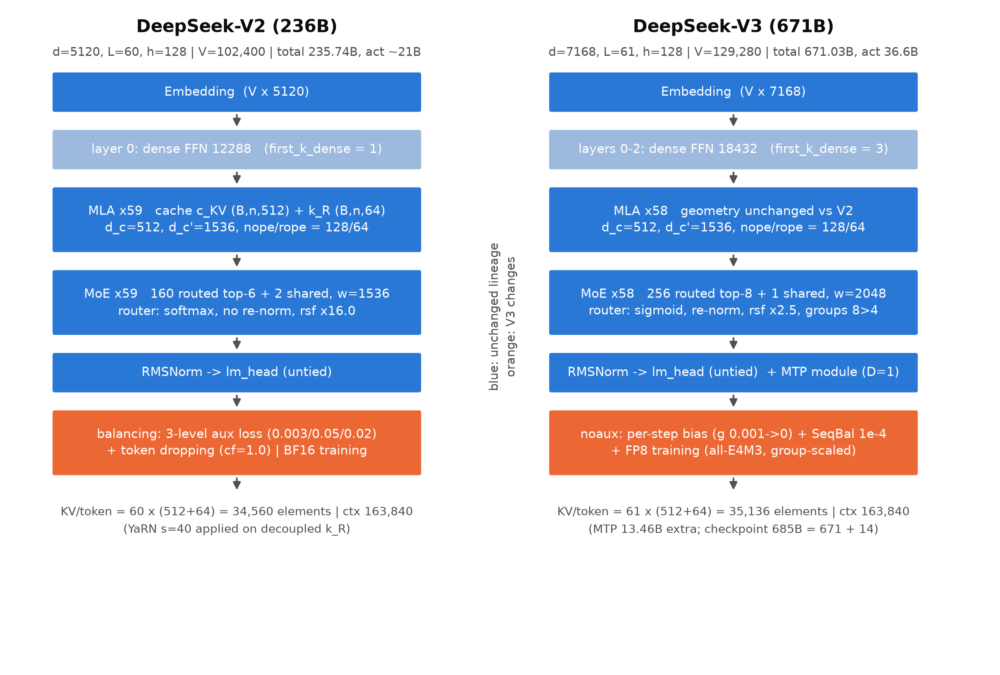
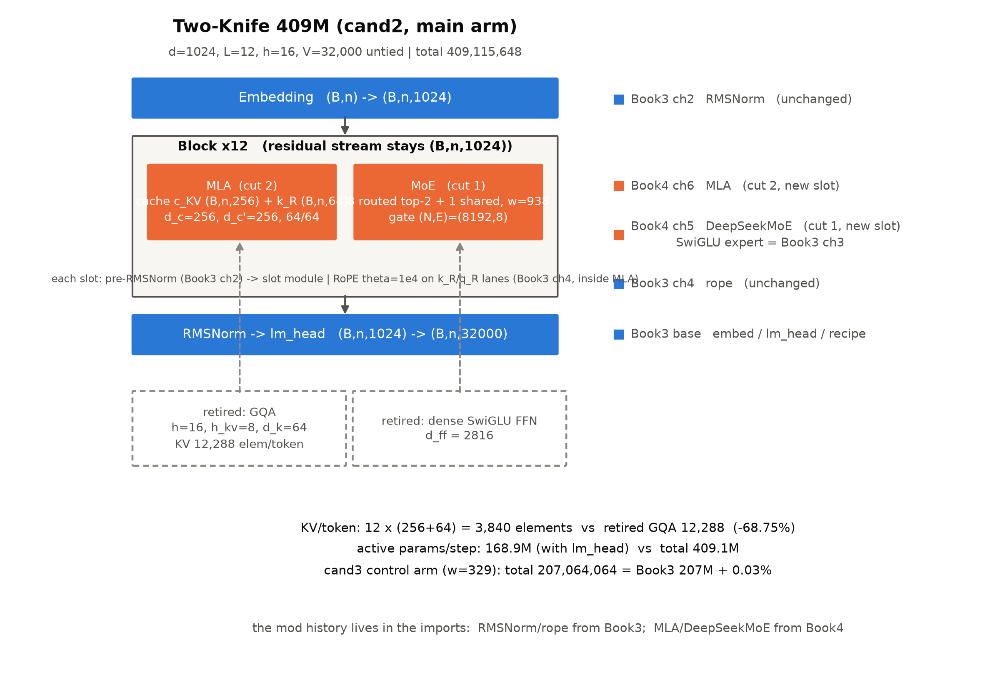
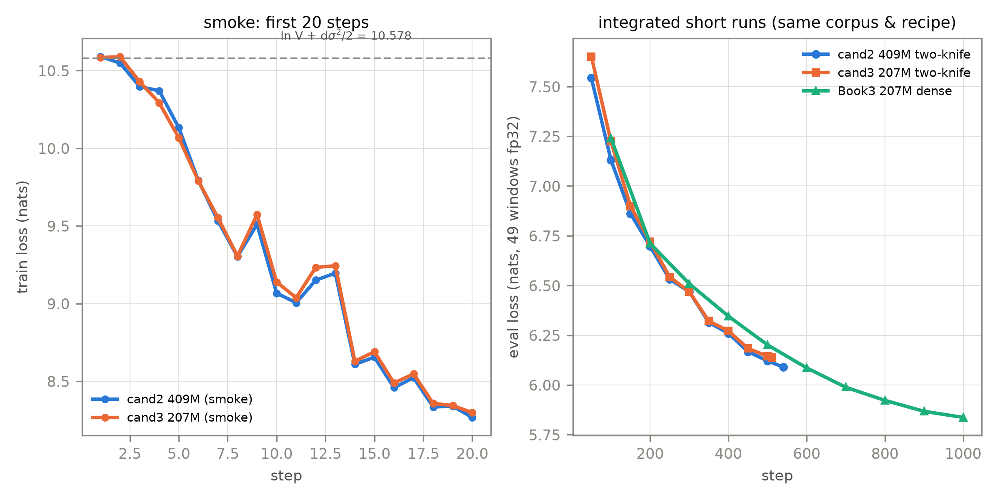

# 第 9 章 DSV2→DSV3 整机拆解与两刀整合（大项目·设计文档版）

## 9.0 开篇：拆机的资格

上一章的收尾句正是本章的开场白（原文照录）：

> 下一章开拆旗舰整机：DSV2→DSV3 的逐字段演进账，然后把我们手里的全部零件装进那台 409M 两刀机——「先补件、后拆机」的承诺，兑现的时候到了。

现在进门。这一章与前八章的关系要先用一句话说清：**前面每一章都在攒「拆机的资格」**。第 2 章拆过路由器与容量、第 3 章付过均衡的税、第 5 章验过细粒度与共享专家、第 6 章推过权重吸收、第 7 章配过 FP8 处方、第 8 章装过 MTP 模块——所以本章拆 DSV2/DSV3 时，每个字段背后都是一件我们亲手写过、训过、对拍过的零件。没有这些前置，拆旗舰就只是罗列 config 字段；有了它们，拆机变成**逐件验货**。

本章回答三个问题。其一，两台真旗舰整机各自怎么长成——DSV2 的五件套、DSV3 的三新件，以及从 V2 到 V3 **每个字段为什么改**（竞品书罗列「有什么」，我们讲「为什么改」）。其二，我们自己的两刀机怎么组装、怎么验收——把 Book3 的 207M 骨架动两刀（FFN→MoE、GQA→MLA），四件套交付：整机代码、冒烟、整合短训、设计文档。其三，全量长训暂缓之后，我们拿什么当凭据、凭据的边界在哪里——这本身是一次方法论练习：把「没法做完的事」做成「别人可以直接重启的事」。这一形态是作者决策（2026-10-04）定的：本册大项目不追训练时长，追的是**设计与验收的完整性**——对一个教学项目而言，「能被陌生机器复现」比「在本机多跑几个 epoch」值钱得多，因为前者考的是理解，后者考的只是电费。本章结束时，单轨代码主线的本册段收官、409M 两刀机连同重启手册交割，下一章把五步法带上 gpt-oss 的「无论文」主场。

> **最小背景栏**（已学指回，本章不重教）：① config 逆向五步法与参数公式（认家族→重建图纸→算账对拍→读外围→证据分级，Book3 第 5 章式 (5.2) 起步、第 9 章升级为式 (9.1)/(9.2) 与三方逐位对拍）；② DeepSeekMoE 三件（细粒度/共享/noaux，第 5 章式 (5.1)-(5.2)）与三级辅助损失谱系（第 3 章表 3.1）；③ MLA 全套记号 $d_c$/$d_c'$/$d_h^R$ 与 KV 元素账（第 6 章式 (6.2)-(6.3)/(6.9)/(6.11)，表 6.2 三口径红线）；④ FP8 训练侧全栈（第 7 章 7.4 节表 7.2 五组件保 BF16）；⑤ MTP 模块结构与 $\lambda$ 调度（第 8 章式 (8.2)-(8.3)）；⑥ Book3 的 207M 四插槽整机与训练五件套（Book3 第 10 章、`DESIGN-215M.md` 先例）。

## 9.1 DSV2 整机：五件套与第一本逐位账

拆机先看整机。图 9.1 左半是 DSV2-236B 的整机粗图：一条 $(B,n,5120)$ 的恒宽残差河流过 60 层，每层仍是 Book3 那副三插槽 Block 的骨架——pre-RMSNorm → 注意力格、pre-RMSNorm → 前馈格——但两个格子里装的都是本册的新件。逐件清点，一共五件套：

**第一件，MLA。** 128 头、$d_c{=}512$、$d_c'{=}1536$、$d_h{=}d_v{=}128$、$d_h^R{=}64$——第 6 章逐投影拆过的那台（式 (6.2)-(6.6)），每 token 每层只把 $(B,n,512)$ 的潜向量 $\boldsymbol{c}^{KV}$ 与 $(B,n,64)$ 的共享位置键 $\boldsymbol{k}^R$ 写进缓存。**第二件，细粒度 MoE。** 160 个路由专家 top-6 加 2 个共享，每专家宽 1536——恰为标准前馈 12,288 的 $1/8$（$m{=}8$ 细粒度切分；每 token 激活 $(6{+}2)\times1536=12{,}288$，**等激活配比是出厂内建的**：激活 FFN 宽与首层稠密严丝合缝）。第 5 章的组合数论证（式 (5.1) 的 $\binom{E}{k}$）在此取值 $\binom{160}{6}\approx2.1\times10^{10}$。**第三件，设备受限路由**（device-limited routing）：先选 $M{=}3$ 台设备再在其中 top-K，动机是限制多机专家并行的通信开销，$M\geq 3$ 时性能与无限制 top-K 大致对齐【证据等级：官方技术报告 2405.04434 v5 §2.2.2】——第 5 章 5.4 节教过的机构，在 config 里活成 `topk_method="group_limited_greedy"` 与组参数 $8/3$（8 组先选 3 组）。**第四件，三级辅助损失**：专家级 $\alpha_1{=}0.003$、设备级 $\alpha_2{=}0.05$、通信级 $\alpha_3{=}0.02$【证据等级：官方技术报告 2405.04434 v5 §3.1.2】——第 3 章表 3.1 谱系的旗舰落点；一个 config 侧的诚实注记：checkpoint 的 config 只曝 `aux_loss_alpha=0.001` 一枚，与论文三级系数并不同名同值——config 读不出论文的全部配方，这条缝隙本身就是「论文与 config 双源」的理由。**第五件，token dropping**：容量因子 1.0、约 10% 的序列受保护【证据等级：官方技术报告 2405.04434 v5 §2.2】——溢出 token 走残差直通的保险丝（第 2 章 2.4 节）。

五件套装进一台机器，数据流走一遍（形状主干，$B\times n$ 个 token）：查表 $(B,n)\to(B,n,5120)$ 进入残差河；每层先过 MLA——下投影把整层 K/V 装进 $(B,n,512)$ 的箱子、位置键单独拎一条 $(B,n,64)$，注意力在 192 维逻辑头维里做，出口投影回到河宽；再过 MoE——router 对展平的 $N=B\cdot n$ 个 token 打分 $(N,160)$，top-6 掩码后按门控权重把 6 份窄专家与 1 份加宽共享专家（$2\times1536$）合并回 $(B,n,5120)$；60 层之后终态 RMSNorm、untied 出口 $(B,n,5120)\to(B,n,102400)$。训练侧的总量：**8.1T token**；与 DeepSeek 67B 的对照账（厂商自报口径）：更强性能的同时省 42.5% 训练成本、KV 缓存 −93.3%——后一个数是部署口径的复合（MLA 压缩×层数差 60 对 95×KV 6bit 量化，三种报价的完整红线表在第 6 章表 6.2，此处只点名不重复）【证据等级：官方论文 2405.04434 v5 摘要/§3.2.3】。

整机看完粗图就该走五步法了。这是它的**第二次整机使用**——第 4 章在 Mixtral 上独立实习过一次（教→实习），本章在 DSV2/V3 上做整机互证，第 10 章才到 gpt-oss 的主场：四环「教（Book3 第 9 章）→实习（第 4 章）→整机互证（本章）→主场（第 10 章）」至此闭合。认家族一步从简（`model_type="deepseek_v2"`，两代家族同姓），直接进算账对拍：官方直发的 config 快照逐字段读入（含 `q_lora_rank=1536`、`first_k_dense_replace=1`、`routed_scaling_factor=16.0`、`norm_topk_prob=False`、`max_position_embeddings=163840` 等【证据等级：config 逆向，deepseek-ai/DeepSeek-V2 官方直发】），按 config 公式整数精确算账，再与权重分片头（55 片、逐张量）对拍——**总参 235,741,434,880 = 235.74B，与官方「236B」逐位成立**【证据等级：本书复算（config 公式=分片头逐名 0 差，2026-10）】。分解着看更有教学味：MLA $\times$ 60 层共 8,953,651,200（每层 149,227,520，即第 6 章 6.7 节算过的每层账）、MoE $\times$ 59 层共 225,549,844,480、首层稠密前馈 188,743,680、出入口两份嵌入 1,048,576,000、层内双 norm $\times$ 60 加终态 norm 共 619,520（121 枚 $\times$ 5,120——零头也入账，五项加总恰为 235,741,434,880）——**专家群占全机 96%**，与 Mixtral 的 96.6% 同一量级：MoE 旗舰的参数大头永远在专家仓库里。激活参双口径：双嵌 21.38B / 单嵌（含 lm_head）20.85B——官方报 21B，两个口径都进位到 21，不可分辨，登记为两可【证据等级：本书复算】。

读外围时撞上口径题，顺手立规矩：摘要说「128K 上下文」，config 写 `max_position_embeddings=163840`——这不是取整，是**两个官方语义**：163,840 = 论文 YaRN 的 target 160K（「the target maximum context length to 160K」），摘要的 128K 是评估保证口径（「respond well for a context length of 128K」，长针检索全绿至 128K）【证据等级：官方技术报告 2405.04434 v5 §3.1.4 逐字】。本书引用 config 实值 163,840、脚注登记两个口径。另外，DSV2 的 KV 账在表 6.2 已算过：每 token $60\times(512+64)=34{,}560$ 元素——同构 MHA 反事实的 1.98%。

五步法这一环的收获值得单独记账，因为它与 Book3 的 Llama 4 案例正好互补。Llama 4 是「无论文、只有 config」的极端——config 是最硬的证据，空字段要过一遍 config 类的默认语义才敢读成「没有」；DSV2/V3 是「有论文、有 config」的正常态——这一次缝隙反过来了：config 只曝 `aux_loss_alpha=0.001` 一枚，论文的三级系数（0.003/0.05/0.02）在 config 里对不上号。两案合读，五步法的「证据分级」一步从口号变成两条操作律：**无论文时，config 的默认值接管点是危险区；有论文时，config 与论文的命名缝隙是危险区**——两头都要「逐字段核对、不假设任何一边是全集」。这也是把五步法放在 DSV2/V3 上整机互证的理由：它教的不是这两台机器，而是「下一个新旗舰出现时你该怎么做」。



图 9.1 DSV2 与 DSV3 整机结构对照（自绘示意级，报告结构依据 DSV2 §2.2-§2.3/DSV3 §2.1-§2.2 与两家官方 config 逐字段核对；蓝=两代共有骨架、橙=V3 改动件；完整字段账见表 9.1）。

## 9.2 DSV3 整机：三新件与一次账本纠错

图 9.1 右半是 DSV3。看图先看「没动的」：MLA 的几何一字未动（V3 §2.1.1 重述同一套公式，并显式声明「未提及的细节一律沿用 V2」【证据等级：官方技术报告 2412.19437 v2 §2/§2.1.1】）；改动集中在三件新东西上，每件都是本册已拆零件的整机升格——这也是本章拆机的便利所在：旗舰的新东西，我们的工具箱里都有对应的螺丝刀。

**其一，noaux 从方法变配置。** 第 5 章 5.5 节那枚「只改派单、不改门值」的偏置阀门，在 V3 长成整套路由配置：打分函数 softmax 换 sigmoid（DSV3 报告式 (15)；第 5 章 5.6 节已拆）、top-8 选中集内归一再乘 `routed_scaling_factor=2.5`、组选择升为 $8/4$、偏置逐训练步更新（$\gamma{=}0.001$，前 14.3T 后归零）、外加一个 $\alpha{=}10^{-4}$ 的序列级互补损失 SeqBal【证据等级：官方技术报告 2412.19437 v2 §2.1.2/§4.2】。第 3 章的三级辅助损失与 token dropping 在这一代**整体退役**——「均衡手段从损失函数搬进路由机制」的谱系句（第 5 章带走的心智）在旗舰配置表上落了地。**其二，FP8 训练全栈。** 第 7 章 7.4 节拆过的那套——三个 GEMM 全 FP8、五组件保 BF16、激活 $1\times128$ 与权重 $128\times128$ 分组、在线逐组 max-scaling、每 $N_C{=}128$ 个元素 FP32 分段累加——在 671B/14.8T token 上完成首次超大规模验证，官方对照实验里 FP8 与 BF16 的训练曲线相对误差 $<0.25\%$【证据等级：官方技术报告 2412.19437 v2 §3.3/附录 B.1】。**其三，MTP 模块。** 第 8 章拆过的结构（共享嵌入与输出头、$M_k\in\mathbb{R}^{d\times 2d}$ 投影、一个 TRM 块、深度 $D{=}1$）在 V3 成为出厂配置，损失权重 $\lambda$ 前 10T 取 0.3、后 4.8T 降到 0.1【证据等级：官方技术报告 2412.19437 v2 §2.2/§4.2】——推理侧的另一半身份已在第 8 章欠账框登记，此处不重复。模块的参数账顺带算清（下面 671.03B 的对平要用）：一枚 $2d\to d$ 投影 $102{,}760{,}448$ 参、一对 enorm/hnorm、一个与主模型隐藏层同构的 MoE 层；「共享」嵌入与输出头在 checkpoint 里**实体化成两份拷贝**（各 926,679,040）——逻辑上共享、物理上各存一份，这是「共享」在存储层的真实含义，记账时两份都要数【证据等级：本书复算（分片头逐名，2026-10）】。

注意力槽的代际对比另有一笔小账：V3 每层 MLA 187,107,328 对 V2 的 149,227,520——**同一套几何、仿射放大而非按比例**：五项投影里吃 $d$ 的三项（查询低秩入口 $q_a$、KV 下投影 $kv_a$、输出投影 $o$，合计 94.7M）随 $d$ 从 5120 涨到 7168 放大 $\times1.4$，上投影 $kv_b$（$d_c h(d_h{+}d_v)$，不含 $d$）与查询压缩出口 $q_b$（$r_q h(d_h{+}d_h^R)$）原样不动（固定 54.5M）——$94.7\mathrm{M}\times1.4+54.5\mathrm{M}=187.1\mathrm{M}$，恰不按比例涨；上投影不吃 $d$ 这件事，正是第 6 章「上投影是省参数关键」的代际佐证。这台机器把「冻结的内核」量化成了参数账：全部注意力层占全机参数的比例，V2 是 3.8%（$60\times149.2$M 对 235.7B）、V3 降到 1.7%（$61\times187.1$M 对 671.0B）——越大的 MoE 旗舰，注意力越像一枚「必要的小配件」，参数的大头永远在专家仓库。

参数账这里出了一堂计划外的课，值得完整讲。本书调研期自算 DSV3 总参，第一版得 **670.00B**，与官方 671B 差 0.15%——一个不大不小、让人睡不着觉的缝。批三前置核查把它追死了：官方仓库自带的分账文档写明「The total size of DeepSeek-V3 models on HuggingFace is 685B, which includes 671B of the Main Model weights and 14B of the Multi-Token Prediction (MTP) Module weights.」【证据等级：官方 model card README 逐字】——官方 671B 只计主模型、不含 MTP，预设的「MTP 混入」解释不成立；逐名对拍（163 片分片头逐张量对 config 逐层展开的期望清单，0 差）之后，真因落在**我们自己的公式漏了 MLA 的上投影 `kv_b_proj`**（$W^{UK}/W^{UV}$，每层 16,777,216 参）外加两枚潜向量 RMSNorm 与 noaux 偏置 Buffer——61 层合计恰好 1.02B，补上后 670.00+1.02=671.03。修正后全链逐位对平：**主模型 671,026,404,352 = 671.03B = 官方 671B；MTP 模块 13.46B（唯一参数 11.61B，官方报 11.5B unique 为略舍）；全 checkpoint 684.53B = 官方「685=671+14」自洽**——671.03+13.46=684.49 之外，checkpoint 还收着 FP8 块缩放张量 `weight_scale_inv` 41.5M 等 F32 小件（0.04B 的零头有分片头底账，不悬空）【证据等级：本书复算（分片头逐名对拍，2026-10）】。这笔错账的教学价值比对的账本身高：错在「每层账对、总账漏项」——第 6 章的每层 MLA 账 149,227,520 从来是对的，错的是总账式子把它抄漏了一块。**自算账本漏一个上投影就错 1B；公式对拍只在同构公式间有效，与 checkpoint 逐名对拍才是兜底**——第 1 章立的「引别人的 B 数之前先自己算一遍账」在这里补上了后半句：算完还要对得名。激活参口径顺带改判：单嵌（含 lm_head）36.63B 与官方精确口径 36.6B（含 0.9B 输出头）精确吻合——**DSV3 活账=单份口径**，与 DSV2-Lite、gpt-oss 同族，第 1 章表 1.2 的跨厂商口径表据此修正【证据等级：官方 README_WEIGHTS + 本书复算】。训练开销只引一个数：**2.788M H800 GPU 小时**【证据等级：官方技术报告 2412.19437 v2 摘要】（美元成本不出自报告，不引）。


## 9.3 逐字段演进账：竞品罗列「有什么」，我们讲「为什么改」

把两代 config 并排放，逐行问「什么从上代改成这样、为什么」，得到表 9.1——这是本章的第一份主交付。做法上是纯机械活：两份官方直发快照逐字段对齐，命名有代沟的先归族（`n_routed_experts` 两代同名，`topk_method` 的取值换了语义——值变与语义变要分开标），config 读不出的（如 FP8 训练框架、MTP 的 $\lambda$）回论文补——diff 的原料是 config，解释权在论文与前面各章已验的机制。先读骨架行：$d$ 从 5120 到 7168、层数 60 到 61、词表 102,400 到 129,280、总参 235.74B 到 671.03B——教科书式的下一代扩容。但真正有信息量的是**改动集中在哪**：MoE 侧（专家 160→256、激活 6→8、共享 2→1、专家宽 1536→2048、首层稠密 1→3 层）、路由侧（打分 softmax→sigmoid、不归一→归一乘 2.5、组选择 8/3→8/4、greedy 家族→noaux）、训练侧（BF16→FP8、无 MTP→MTP $D{=}1$）——而 **MLA 的六个几何字段一个都没动**。代际升级的形状因此清晰可读：DeepSeek 把「架构内核」冻结、把「训练侧工程」激进换代。这个读法还能倒过来用：看到任何新旗舰，先问哪些字段真的动了、动的在哪一侧——这是拆机者的一阶判断力。

表 9.1 DSV2→DSV3 逐字段演进账（两列均 config 逆向·官方直发快照，2026-10-04；「为什么改」一列：论文有据处引论文，标〔解读〕处为本书解读、非论文主张）

| 字段 | DSV2-236B | DSV3-671B | 为什么改 |
|---|---|---|---|
| `hidden_size` $d$ / 层数 $L$ | 5120 / 60 | 7168 / 61 | 下一代扩容（+40% 宽）；主模型 61 层之外另有一枚 MTP 模块的 TRM 块（checkpoint 编号 layers.61，不计入 671B——9.2 节分账）〔解读：层数几乎不动而宽度大加，是「宽优先」的当代口味〕 |
| 词表 $V$ / untied | 102,400 | 129,280 | 多语与代码语料扩容；出入口两份照旧 |
| `n_routed_experts` $E$ / `top_k` | 160 / 6 | 256 / 8 | 细粒度再进一步——组合数 $\binom{256}{8}\approx 4.1\times10^{14}$ 对 $\binom{160}{6}\approx 2.1\times10^{10}$（第 5 章组合数论证的续算）；每 token 激活 $(8{+}1)\times2048=18{,}432$，仍与首层稠密宽咬合 |
| 共享专家数 | 2 | 1 | 总参涨了、共享反减——路由专家基数变大后，公共知识覆盖交回路由侧〔解读〕 |
| 专家宽 $w$ / 首层稠密 | 1536（1/8 前馈）/ 1 层 | 2048（1/9 前馈）/ 3 层 | 首层稠密从一层加码到三层；报告未给论证，工程取舍如实标注（首层负载与梯度最不稳，稠密层是缓冲垫〔解读〕） |
| `scoring_func` | softmax | sigmoid | sigmoid 分数逐专家独立，与 bias 同量纲可直接比较——softmax 的竞争性分数加固定步长偏置，力度随温度漂移（第 5 章 5.6 节解读，两文均未自述动机） |
| top-k 权重处理 | 不归一，$\times$ rsf 16.0 | 选中集内归一，$\times$ rsf 2.5 | rsf 从 16.0 回落到 2.5：sigmoid+归一后量级已拉回，不再需要大倍率缩放〔解读〕 |
| `topk_method` / 组选择 | group_limited_greedy，$8/3$ | noaux_tc，$8/4$ | 设备受限选择的 config 形态升档；noaux 偏置接管均衡 |
| 均衡手段 | 三级 aux（0.003/0.05/0.02）+ token dropping（cf=1.0） | 偏置逐更新（$\gamma$ 0.001→0）+ SeqBal $\alpha{=}10^{-4}$，token dropping 退役 | 第 3 章「损失税」的正面清算：免损失路由 17 胜 1 平 2 负的内部消融（表 5.2）+ 干扰梯度论证 |
| MLA 几何（$d_c/d_c'/d_h/d_h^R/d_v$/头数） | 512/1536/128/64/128/128 | **逐项同值** | 架构内核冻结——MLA 的账三线齐赢（第 6 章），没有改动动机就没有改动 |
| 上下文 | 163,840（YaRN target 160K） | 163,840 | 两代同值；YaRN 只施加在解耦键 $k^R$（第 6 章边栏）；mscale 细节 0.707→1.0 属实现口径微调 |
| 训练低精度 | BF16 | FP8 全栈（§3.3） | 第 7 章正菜；速度口径只有 GEMM 理论 $2\times$（报告无端到端加速实测数——红线） |
| 训练目标 | 下一 token | $+$ MTP $D{=}1$，$\lambda$ 0.3→0.1 | 第 8 章正菜：监督增密与推理资产的双重身份 |
| 总参 / 激活（单嵌） | 235.74B / 20.85B | 671.03B / 36.63B | 总参 2.85×、激活仅 1.75×——第 1 章效率悖论在代际升级上的重现 |

表 9.1 里有一行值得单独抽出来讲透：**首层稠密的四代谱系**。GShard 每隔一层插一个 MoE（「replacing every other feed-forward layer」），Switch 激进到每层全换，DSV2 退回首 1 层稠密、DSV3 加码到首 3 层【证据等级：官方论文 2006.16668 v1 §2.1；2101.03961 v3；config 逆向两代】。这条线画出来是一个「插入密度」的钟形：从隔层到每层再到「几乎每层、只留头部稠密」。为什么开头最难训成纯 MoE？第 3 章的本机现场给过微观证据：负载崩塌在**第 0 层最凶**——26M 档训 200 步，第 0 层的专家直方图是 $[17, 1550, 5572, 509, 25, 3199, 1303, 4209]$（max/min = 327.8），死专家也先出现在浅层。机制不难想象：首层输入是还没被残差河「煮熟」的原始嵌入，token 分布最不均匀、router 最容易在早期锁定错误的专家组合；稠密垫层等于说「头几层别选了，全算」。垫多厚（1 层还是 3 层）四代没有人给过完整论证，是试出来的经验值——如实标注。顺带一提，DeepSeekMoE 论文给 16B 档首层稠密给出的理由是「该层的负载均衡收敛慢」，与我们本机看到的「第 0 层最凶」互为印证【证据等级：官方论文 2401.06066 v1 §5.1.2】。

打分与归一化两族的换代也值得各给一句机制。**打分 softmax→sigmoid**：第 5 章 5.6 节的解读在此再进半步——softmax 的分数是「全体分一块饼」（和恒为 1），sigmoid 是「每人独立打分」（互不知情）；noaux 的偏置要按固定步长 $\gamma$ 逐专家加减，只有落在「独立打分」的量纲上，步长的含义才不随饼的大小漂移——打分函数的换代与均衡机制的换代是**配套的**，不是两次独立尝试。**归一化与 rsf 16.0→2.5**：V2 的 softmax 不归一、直接乘 16.0——softmax 分数天然小于 1，top-6 加起来的门值远小于 1，需要大倍率把路由支路的输出量级拉回与共享支路（常驻、无量级损失）相称；V3 改 sigmoid 加选中集内归一后（归一化的和为 1），量级缺口小得多，2.5 就够。两个数都从 config 里读得出，但「为什么是这个数」的账要两边一起算——config 数字从来不是孤立的超参，是机制的补丁【证据等级：config 逆向 + 本书解读】。至于 DSV3 的 benchmark 成绩单，本书从简让位：技能分数既不进我们的账本、也不参与任何架构论证，拆机拆的是结构与配方，不是宣传页。

## 9.4 我们的两刀机：cand2 主臂与写在 import 里的改装史

验完货，回到自己的机器。底座不动：Book3 的 207M 骨架（$d{=}1024$、$L{=}12$、$h{=}16$、$V{=}32000$ untied、RoPE $\theta{=}10000$、无 bias）。动两刀：前馈格 dense SwiGLU→MoE、注意力格 GQA→MLA。三个候选的定版见表 9.2——等激活的「每层激活 FFN 宽与前代持平」与等总参的「总参与 Book3 207M 持平」两条配臂口径，第 2 章 2.8 节与第 5 章 5.7 节已立，这里作整机级的最后一次使用。

表 9.2 两刀 config 定版（探针 F 手算=模型实测 assert 逐位，锁定值；激活参口径=含 lm_head、不含输入 embedding lookup、含路由门）

| 候选 | 专家宽 $w$ | MLA 几何 | 总参 | 激活参 | KV/token | 定位 |
|---|---|---|---|---|---|---|
| cand1 等激活·重 MLA | 938 | $d_c{=}512$/$d_c'{=}512$/$d_h{=}d_v{=}128$ | 459,453,440 | 219.2M | 6,912（−43.75%） | 参数账教学点，不设训练档 |
| **cand2 等激活·轻 MLA（主臂）** | 938 | $d_c{=}256$/$d_c'{=}256$/$d_h{=}d_v{=}64$ | **409,115,648** | 168.9M | **3,840（−68.75%）** | 409M 两刀机 |
| cand3 等总参·轻 MLA | 329 | 同 cand2 | **207,064,064** | 101.5M | 3,840（−68.75%） | 与 Book3 207M 差 55,296=0.027%——同预算两刀 vs 稠密 |
| 对照：Book3 207M dense | —（$d_{ff}{=}2816$） | GQA $h_{kv}{=}8$ | 207,119,360 | 207.1M | 12,288 | 消费线默认服务对象 |

cand1 留下的教学点，第 6 章铺过、此处收口：MLA「参数也省」是有尺度条件的——省的钱在上投影（$d_c\cdot h(d_h{+}d_v)$ 对 $2d\,h\,d_h$），要 $h\cdot d_h\gg d_c$ 才占便宜。DSV2 档 $h d_h/d_c=32$，每层省 16%；照搬到 207M 档（cand1，比值掉到 4），注意力槽 6,881,280 对 GQA 槽的 3,145,728，**反贵 +3,735,552/层**【证据等级：本书复算（探针 F assert 逐位）】。旗舰经验不能整队搬进教室——轻 MLA（$d_c{=}256$、头维减半）才让注意力槽略省。cand3 的等参对照臂则是给「同预算下两刀是否值」留的公平读数：总参与 Book3 207M 只差 0.027%，同语料、同配方、同种子短训，两刀与稠密站在同一条起跑线上。

整机长什么样，图 9.2 已画。


图 9.2 409M 两刀机（cand2 主臂）结构与插槽来源（自绘示意级；四插槽标注供货章——蓝=Book3 不动件、橙=本册两刀；底部虚影=从 207M 骨架退役的 dense FFN 与 GQA；复现：`python [`code/ch09/fig_ch09.py`](code/ch09/fig_ch09.py)）。

而它的代码形态，最诚实的呈现是那段 import——**两刀改装史写在 import 语句里**（Book3 第 10 章手法的延续）：

```python
# llama409.py —— 五件 import 即改装史（供货方=各章教学件，键位/签名承正身）
RMSNorm, SwiGLUMLP, rope_mod = bootstrap()      # Book3 ch02 归一化（不动件）/ ch03 稠密件 / ch04 位置（不动件）
from deepseek_moe import DeepSeekMoE             # 本册 ch05：第一刀（E=8/top-2/共享 1，DSV2 键位）
from mla import MultiHeadLatentAttention         # 本册 ch06：第二刀（d_c=256+解耦 64，双路径）
```

正文引用：[`code/ch09/llama409.py`](code/ch09/llama409.py#L185)::TwoKnifeLM`。归一化与位置两格还是 Book3 的老件；前馈与注意力两格换成前几章验过货的新件；GQA 件退役进图 9.2 底部的虚影。给退役件写一句悼词是值得的：GQA 在 Book3 第 6 章教会我们的是「KV 账本」这门手艺——每 token 记几份、每份多大、质量付多少税；这门手艺没有随件退役，MLA 的箱子账（第 6 章）与两刀机的 3,840 元素/token（式 (9.2)）都是它的续篇。**插槽会换，账本方法长存**——这正是四插槽观的深层用处：它把架构差异翻译成了可比较的账。

层循环处理首层稠密机构（`first_k_dense_replace` 字段，DSV2 同款）：cand2/cand3 定版取 0（12/12 层 MoE），与探针 F 锁定的参数账逐位一致；把它置 1 会把首层前馈换回稠密、总参降到 391,824,384——大纲行文里的「首层稠密」与锁定账的出入如实登记在设计文档 §3，作为重启时的可选项而非默认值【本书设计决策】。这不是小事账：如果定版悄悄改 1，总参变了、cand3 与 Book3 207M 的等参对照就散了、正文三处引用的 409M 也要跟着改——**锁定数的意义正在于它锁住的不只是数字，还有以它为锚的整条叙事**。

账本随机器交付。整机的参数通式（cand2 代入即 409,115,648）：

$$N_{\text{two-knife}} = 2Vd + d + L\Big[\underbrace{d\,r_q + r_q h(d_h{+}d_h^R) + d(d_c{+}d_h^R) + d_c h(d_h{+}d_v) + h d_v d}_{\text{MLA 投影/层}} + \underbrace{2d + d_c + r_q}_{\text{三枚 RMSNorm}} + \underbrace{Ed + 3dw(E{+}n_s)}_{\text{MoE：路由门+专家+共享}}\Big] \tag{9.1}$$

用人话说：出入口两份嵌入加终态 norm，加上每层「MLA 五投影、三枚 norm、路由门、八份专家加一份共享」——每一项都能在 `llama409.py::hand_account` 里找到同名行，assert 双向逐位。KV 账沿用第 6 章的元素口径：

$$\text{KV/token} = L\,(d_c + d_h^R) = 12\times(256+64) = 3{,}840 \ \text{元素}\quad\text{vs 退役 GQA } 2Lh_{kv}d_k = 12{,}288\ (-68.75\%) \tag{9.2}$$

配臂的定宽公式一并编号存档：

$$w_{\text{等激活}} = \Big\lfloor \frac{d_{ff}}{k + n_s} \Big\rfloor = \Big\lfloor \frac{2816}{3} \Big\rfloor = 938,\qquad 3d\,d_{ff} = 3d\,(E{+}n_s)w + Ed \Rightarrow w_{\text{等总参}} = 329 \tag{9.3}$$

**符号表**（式 (9.1)-(9.3)）：

| 符号 | 含义 | 形状/取值（cand2） |
|---|---|---|
| $d$ / $L$ / $h$ | 残差流宽 / 层数 / 查询头数 | 1024 / 12 / 16 |
| $V$ | 词表（untied 两份） | 32000 |
| $d_c$ / $d_c'$ | KV 压缩维 / 查询压缩维（论文正字） | 256 / 256 |
| $d_h$ / $d_h^R$ / $d_v$ | 每头内容维 / 解耦 RoPE 维 / 每头输出维 | 64 / 64 / 64 |
| $E$ / $k$ / $n_s$ / $w$ | 路由专家数 / 激活专家数 / 共享专家数 / 专家宽 | 8 / 2 / 1 / 938（cand3: 329） |
| $W_g$ | 路由打分矩阵（转置乘法） | $(E,d)$=(8,1024) |
| $N$ | 展平 token 数（$B\cdot n$） | 8192 |

一次前向的形状主干（$B{=}8$、$n{=}1024$）：查表 $(8,1024)\to(8,1024,1024)$；每层 MLA 内 $\boldsymbol{c}^{KV}$ 走 $(8,1024,1024)\xrightarrow{\text{下投影}}(8,1024,256)$、$\boldsymbol{k}^R$ 走 $(8,1024,64)$，注意力在 128 维逻辑头维里做；每层 MoE 内 router 打分 $(N,E)=(8192,8)\to$ top-2 掩码 $(8192,2)\to$ 加权合并回 $(8,1024,1024)$；出口 $(8,1024,1024)\to(8,1024,32000)$。逐运算的形状注记在 `llama409.py` 行内注释里与正文一一对应。

把式 (9.1) 在 cand2 上逐项走一遍，账就有了手感。MLA 槽每层 2,686,976：查询侧低秩两步 $1024\times256+256\times16\times128=786{,}432$，KV 下投影 $1024\times320=327{,}680$，上投影 $256\times16\times128=524{,}288$，输出投影 $16\times64\times1024=1{,}048{,}576$——注意输出投影才是大头，上投影其次；对照退役的 GQA 槽 3,145,728（$2d^2+2d\,h_{kv}d_k$），轻 MLA 槽反而**省 458,752/层**。MoE 槽每层 25,942,016：路由门 $8\times1024=8{,}192$、8 份路由专家各 $3\times1024\times938=2{,}881{,}536$、共享专家一份同宽——**路由门只占槽参数的 0.03%**，第 1 章立「激活参含路由门」口径时说过它是小账但要入账，这里就是那笔小账的实物。每层合计 28,631,552，12 层 343,578,624，加出入口 65,537,024，总账 409,115,648——assert 三方（手算=实测=探针 F）逐位咬合时的那种踏实，是账本式写作独有的。

墙钟的账也要交代，因为它不站在参数账一边。探针 F 的实测：cand2 3.007 s/step、cand3 3.514，对照 Book3 207M 稠密的 2.44——**cand3 与同总参的稠密比，墙钟慢 1.44×**。慢的不是数学，是派发：朴素 Python 逐专家循环每层启动 8 次小内核（launch-bound），专家越窄（cand3 的 $w{=}329$）每次内核越「不划算」，这个开销比例就越大——第 1 章的开销梯度（26M 档 2.3×→65M 档 1.74×→207M 档 1.44×）到这里收口：**MoE 省的是激活参与 FLOPs（通行费），不省 wall-clock（调度费）**；把调度费压下去的是第 2 章 2.6 节预告的专家并行与内核融合，那是工程侧的另一册故事。

## 9.5 整合验收四件套：assert、冒烟、短训、对拍

机器造好，验收四关，全部先跑代码后写正文。

**第一关，参数逐项账。** `python llama409.py` 自测：cand2 总参 409,115,648、cand3 207,064,064、cand1 459,453,440——手算=实测=探针 F 锁定数，三臂逐位【证据等级：本书实验（CPU，2026-10）】。激活参三口径随行打印：cand2 non-embedding 136,109,056 / 含 lm_head（本册口径）168,877,056 / 双份嵌入 201,645,056（三级同为含路由门的修正版账本）；脚本随行另报探针 F 历史口径 201,546,752（不含路由门——与上一级的差额恰为 12 层 $\times$ 8,192=98,304），供与探针 JSON 对照，门这笔小账进出都入册。为什么要较这个真？因为这台机器的激活参三口径各有消费方：总参定显存与存储、含 lm_head 口径定每 token 计算量（预算表 6ND 里的 $D$ 取它）、双份口径用来对齐别家的新闻稿数字——一台机器三本账，谁读哪本，交货时就写清。

**第二关，冒烟。** 判据的来历先说一句，因为它不是拍脑袋：随机初始化下，出口 logit 的方差是 $d\sigma^2$（末态 RMSNorm 后每维 RMS 归一、lm_head 行按 $N(0,\sigma^2)$ 初始化），于是初始 loss 的解析预言是 $\ln V+d\sigma^2/2=10.3735+0.2048=10.578$——**一个不用训练就能算出来的数**（Book2 式 (10.3) 的纪律：untied 下无自泄漏路径）。实测：cand2 初始 loss 10.5910、cand3 10.5843，千分位咬合；20 步降至 8.27/8.30，全程有限【证据等级：本书实验（2026-10）】。这个判据的效力在于它同时查三件事：初始化没被框架默认覆盖（否则 loss 会冲到数百）、前向数值没病（方差项对得上）、两刀没有破坏出口几何——MoE 的路由与 MLA 的箱子都不直接碰 lm_head，预言原样成立，正是「插槽改装、残差河不动」的数值版证词。

**第三关，整合短训。** 预注册判据：两刀协同无 NaN、eval 曲线下降；口径=管道验收非效果训练（token 量距 Chinchilla 档差三个数量级）。窗口规划本身是工程课：探针 F 的实测 3.007 s/step 意味着 30 分钟窗能跑 598 步，但预算**永远要给复测漂移留余量**——本机同配置的秒/步在不同时段差过 ±12%（探针 A 复测 Book3 基线 1.702→1.907 就是前车之鉴），于是主臂按 0.9 档取 **540 步**（≈27 分钟，预留 12% 余量）；万一仍超窗，ckpt 断点续跑补齐、判据不降——「降档」降的是步数规划，不是验收标准。cand3 对照臂 512 步（窗口紧张时可降 300 步留痕）。计时双口径如实登记：两窗机器均带后台权重预取下载与并行写作负载，但方向相反——cand2 窗稳态 4.318 s/step（比探针 F 独窗基线 3.007 慢 44%），cand3 窗 2.751（比 3.514 **快** 22%）；同机不同时段漂移可达 ±40%，这正是 540 步降档线按最坏窗留余量的理由。损失曲线与计时无关，判据不受影响【证据等级：本书实验（MPS，共享机器双口径，2026-10）】。读数：cand2 eval 自 7.5428（第 50 步）一路降至 **6.0898**（第 540 步，4.4M token）、cand3 降至 **6.1389**（512 步，4.2M token），全程无 NaN——**两刀协同无冲突的机器凭据**到手。cand3 的等参读数再对照 Book3 207M 稠密在同一语料、同一配方、同一种子下的短训曲线（Book3 第 1000 步 eval 5.837；第 500 步 6.202）：cand3 第 512 步 6.139 对稠密第 500 步 6.202，**同步数窗口两刀机读数还略低 0.06 nat**——单种子趋势级读数，按第 2 章 2.7 节的纪律不作效应结论，只登记「同预算下两刀机在短训窗口内与稠密同量级、不劣」。曲线见图 9.3。

**第四关，对拍。** 结构对拍走探针 G 已验路径的整机复跑：`llama409.py --parity` 两臂 vs HF `DeepseekV2ForCausalLM` 同 config 随机权重 strict 直搬——mini 臂（首层稠密混排演练）max|Δlogits|=9.537e-07（探针 G 同量级复现）；**cand2 全机 409M 臂 max|Δlogits|=7.629e-06**、argmax 一致率 100%——本书迄今最大的一次 strict 直搬，两刀机的结构证书【证据等级：本书实验（CPU fp32，2026-10）】。聚合对拍 `parity_all.py` 终跑：ch02/ch05/ch06 教学件 vs 正身 vs HF 三层互拍全 PASS——MLA 双路径 1.12e-08、两族教学件对正身 0.00e+00 逐位、HF 块级 0.00e+00（产物 `log/book4-feasibility/parity_all_batch3.json`）。V2-Lite 真权重条件性核验按预登记推进：交付时权重未完整落地（9.5/31.4 GiB，快照零分片），降级不阻塞——随机权重结构对拍已足够支撑正文，权重落地后 `--v2lite` 可补逐层形状账本。

> **【实现对照框】HF transformers 5.18.0 的 MoE 专家分发与 16 字节对齐**（{config/源码}，本机实测）。5.x 把融合专家的 forward 交给 `config._experts_implementation` 分发，torch 2.13 上默认落到 grouped_mm 内核——它要求权重步长 16 字节对齐（fp32 下即各维是 4 的倍数）。官方旗舰档（1536/2048/1408）天然满足；本册教学档的奇数专家宽（cand2 的 938、cand3 的 329）会在前向崩出 `strides should be multiple of 16 bytes`——而且**strict 搬运已经通过**（键位与形状证书先拿到），崩在计算内核离病因两丈远。处置：对拍切 `_experts_implementation="eager"`（逐专家循环，与本书教学件同构、语义等价）。教训与第 5 章的 noaux 遗留字段同款：**config 构造通过≠前向通过**，教学 config 走 HF 对拍要多备一手内核约束的检查。



图 9.3 冒烟与整合短训（自产）：左=双臂前 20 步 train loss（虚线=预言 $\ln V+d\sigma^2/2=10.578$）；右=eval 曲线（49 窗 fp32 同协议）——cand2 540 步、cand3 512 步、Book3 207M 稠密 1000 步（同语料同配方同种子，跨章可比）；复现：`python [`code/ch09/fig_ch09.py`](code/ch09/fig_ch09.py)。

## 9.6 设计文档导览与暂缓声明

四件套的最后一件是设计文档 `DESIGN-409M.md`——它不是正文的附录，而是**重启手册**：标准是「没有本书上下文的工程师凭这一份文件可以直接重启设计与开发」。这个标准落到实处是三条写作纪律：每个 config 字段自带依据与出处（不是「照抄定版」而是「为什么是这个值」）、每条验收判据可机器判定（assert 数字、loss 阈值、对拍上限都写成能跑的命令）、每个风险配预案（不是免责声明，是「出这个症状、走这条路」的决策树）。形态沿用 Book3 `DESIGN-215M.md` 的十一节先例：§1 目标与依赖清单（五件 import 的物理落点、跨册双候选 bootstrap——只拷 `ch09/` 三个文件到空目录会 ImportError，依赖的物理落点必须照单核对）；§2 暂缓声明（作者决策原文，必印）与量化论证；§3 config 逐字段依据+双口径参数账（含首层稠密出入登记与反事实账）；§4 数据（tokens32k 七件套校验）；§5 配方五件套；§6 预算表；§7 验收四判据；§8 风险与预案（含 MoE 负载崩塌的升级件——aux 钩子与 noaux 件都已备好，全量长训时单变量对照）；§9 重启 checklist 十步；§10 消费线衔接声明；§11 参考锚。checklist 摘要见表 9.4。

> **暂缓声明（作者决策原文）**：本大项目全量训练暂时略过，待获得高算力机器后可凭此文档直接重启设计与开发。（2026-10-04）

暂缓不是弃训，是把「训不动」算清楚，并把「将来怎么训」写成可执行的文件。这一决策的合理性在于交付物的边界划得干净：整合短训已给出「两刀协同无冲突」的机器凭据（第三关），全量训练缺的只是时间与算力——而时间与算力恰好是**文档可以封装、机器不能凭空变出**的两种东西。量化论证（表 9.3）：cand2 的 Chinchilla 配方 ≈20 token/参数 $\approx$ 8.2B token，折 999,012 步；本机 MPS bf16 实测 3.007 s/步，外推 **34.8 天连续运算**——超出单机可维护性；换 1×A100-80GB（按 40% MFU 估算）≈18.5 小时，1×H100 ≈5.8 小时，8×H100 ≈44 分钟——**门槛是时间不是显存**（AdamW 全套状态 ≈6.5 GiB + 激活，单张 24GB 消费卡即可重启）。预算表的两行「旗舰口径 15T」顺带把尺度感拉满：那要 8×H100 五十来天——旗舰的「训练 token 预算」本身就是一台机器的资格线，也解释了为什么本册的旗舰拆机都停在 config 与账本层：我们自己那台 409M 的 Chinchilla 档尚且 35 天，14.8T token 的 V3 用 2.788M H800 小时训完，这个数字从此不再是新闻稿里的一个整数，而是能换算进自己预算表的量纲。

表 9.3 预算外推（6ND 口径，D=激活参含 lm_head；GPU 行按 40% MFU 假设，量级可靠、偏乐观）

| 档 | tokens | 本机 MPS bf16 | 1×A100-80G | 1×H100 | 8×H100 |
|---|---|---|---|---|---|
| cand2 Chinchilla（8.2B） | 8.2B | 34.8 天 | ≈18.5 h | ≈5.8 h | ≈44 min |
| cand3 Chinchilla（4.1B） | 4.1B | 20.6 天 | ≈5.6 h | ≈1.8 h | ≈13 min |
| 旗舰口径（参照） | 15T | —（物理不成立） | — | — | ≈55.6 天 |

表 9.4 重启 checklist 摘要（完整十步见 `DESIGN-409M.md` §9）

| 步 | 动作 | 判据 |
|---|---|---|
| 1-2 | 备齐五件 import 落点与语料三件套 | `llama409.py` 自测过；七件套校验全过 |
| 3-4 | 参数 assert / HF 结构对拍 | 409,115,648 与 207,064,064；max|Δ|<1e-4 |
| 5-6 | 冒烟双臂 / 整合短训双臂 | 初始 loss≈10.578、无 NaN、eval 下降 |
| 7 | 决策点：均衡件（aux 钩子或 noaux 件） | 单变量对照、预注册判据 |
| 8-10 | 全量训练（≥8.2B token 重切语料）/ 曲线入档 / 消费线登记 | 训至 token 预算、eval 收敛、接续短训曲线 |

## 9.7 展望与消费线衔接

单轨代码主线本册段就此收官：Book1 的 Transformer 原典 → Book2 的 GPT-2 → Book3 的 207M 四插槽 → 本册的两刀机——一条 import 链串起四册的全部零件。往后的分岔也登记清楚：Book5 的 3:1 混合改装是选做支线（注意力手术的另一片战场），本册两刀机不参与。

消费线衔接按作者决策显式登记，防断链：**Book6 mini 推理引擎的默认服务对象仍是 Book3 终态稠密+GQA 小模型**（207M、KV 账 24 KiB/token——引擎侧容量规划以它为准）；两刀机在消费线上的身份是**账本算例与选做扩展**——Book6 第 2-3 章的显存/算力账本用两刀机算 MoE 激活参数账与 MLA latent KV 账（3,840 元素/token），mini 引擎接入两刀机属选做大作业（MLA 吸收形态的引擎落地是 Book7 MLA 后端的领地，本册只登记缓存布局的接口事实）。这条「默认不换」的登记不是保守，是课程设计的诚实：推理引擎的第一课应该建在读者亲手训过、KV 账亲手算过的那台机器上；两刀机的 latent 缓存与路由给引擎带来的是新问题（缓存布局变了、每层激活参数不再是常数），把新问题放在第二遍讲，比一开始就混在一起更符合构造的逻辑。设计文档 §10 已把这条交接写进重启手册——机器可以暂缓，账不能断。

下一章是五步法的主场演出：拆一台「无论文、只有 config 与参考实现」的旗舰（gpt-oss），并配上十机型的速览表。本章练成的「逐字段问为什么」与「逐名对拍兜底」，在那里全是日用工具。

> **【欠账】** B4-7（文档锚，非叙事钩）：两刀机的全量训练重启手册与预算账——一切细节见 `code/ch09/DESIGN-409M.md`（重启即可执行标准）。

## 9.8 本章小结

开篇的三个问题都有了交割。两台旗舰怎么长成：DSV2 的五件套（MLA/细粒度 MoE/设备受限路由/三级辅助损失/token dropping）与 DSV3 的三新件（noaux 全配置化、FP8 全栈、MTP 出厂化），逐字段演进账（表 9.1）给出每一行「为什么改」——改动几乎全在训练侧工程，MLA 几何一字未动；首层稠密的四代谱系与本机第 0 层崩塌现场互证，打分换代与均衡换代配套成对。我们的两刀机怎么组装：cand2 主臂逐字段依据定版（表 9.2），五件 import 承载全部改装史（式 (9.1)-(9.3) 与符号表随机器交付），cand1 的「参数不省反贵」把旗舰经验的尺度条件钉在账上。凭据与边界：assert 双臂逐位、冒烟千分位咬合、短训双臂无 NaN 且 eval 下降、HF 对拍含 409M 全机 strict 直搬——全量长训凭设计文档暂缓，四件套交割，重启 checklist 十步在案。

**带走的心智**：如果细节都还回去，请留下两条。**第一条，代际升级的形状是「冻结的内核与激进的外围」——拆任何新旗舰，先做一遍 V2→V3 式的逐字段 diff：架构几何动没动、动的是训练侧（均衡/精度/目标）还是结构本身；本册两代样本给出的先验是，真正改架构的代际远少于改配方的代际，先问「哪些字段真的动了」能挡掉一半的跟风改装。**第二条，自算的账必须有对拍兜底——DSV3 那笔 670.00B 的缝，追出来是自家总账式漏了一个每层 16.8M 的上投影：每层账对、总账漏项，公式对拍永远发现不了同构性的盲区，与 checkpoint 逐名对拍才是保险丝；这条纪律从第 1 章的「先自己算」升级为「算完对得名」。

镜头拉回全书：本册的主线任务——在好骨架上动两刀——到此完成。剩下的两章是余晖与收束：第 10 章把五步法带上 gpt-oss 的主场，第 11 章看一条 MoE 支线，第 12 章合账收尾。带走的机器、账本与判断力，会在 Book6 的推理系统里再开一册的新篇。

## 9.9 动手验证

```bash
cd 工作区根目录 && source env.sh

# ① 参数逐项账自测（CPU 秒级）——三臂 assert + 初始 loss 预言 + 首层稠密机构演练
python [`code/ch09/llama409.py`](code/ch09/llama409.py) --out-name run1
#   验收行：[cand2] 总参 409,115,648（手算=实测=探针 F 锁定数，逐位）
#           [cand3] 总参 207,064,064 | [等参对账] 差 -55,296 = 0.027%
#   产物：log/book4-ch09/llama409_selftest_run1.json

# ② HF 结构对拍（CPU fp32，分钟级）——mini 臂（探针 G 路径）+ cand2 全机 409M strict 直搬
python [`code/ch09/llama409.py`](code/ch09/llama409.py) --parity --out-name run1

# ③ 冒烟与整合短训（MPS bf16；独占窗口，双臂顺序执行，ckpt 续跑）
python [`code/ch09/train_409.py`](code/ch09/train_409.py) --task smoke --arm cand2 --out-name s2
python [`code/ch09/train_409.py`](code/ch09/train_409.py) --task integrated --arm cand2 --out-name run1   # 540 步
python [`code/ch09/train_409.py`](code/ch09/train_409.py) --task integrated --arm cand3 --out-name run1   # 512 步

# ④ 聚合对拍终跑（ch02/ch05/ch06 教学件 vs 正身 vs HF）与 V2-Lite 条件性核验
python [`code/00-feasibility/parity_all.py`](code/00-feasibility/parity_all.py) --hf --out-name batch3
python [`code/ch09/llama409.py`](code/ch09/llama409.py) --v2lite --out-name run1

# ⑤ 三图复绘
python [`code/ch09/fig_ch09.py`](code/ch09/fig_ch09.py)
```
