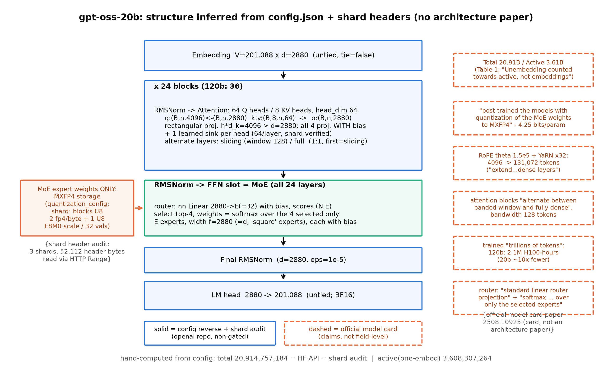
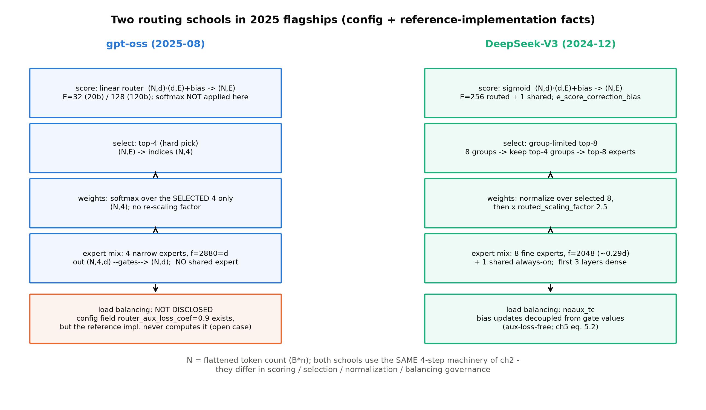

# 第 10 章 旗舰整机拆解：gpt-oss 精拆与速览表

## 10.0 开篇：从全书到这里

上一章合上时镜头交到了这里：「镜头拉回全书：本册的主线任务——在好骨架上动两刀——到此完成。剩下的两章是余晖与收束：第 10 章把五步法带上 gpt-oss 的主场，第 11 章看一条 MoE 支线，第 12 章合账收尾。带走的机器、账本与判断力，会在 Book6 的推理系统里再开一册的新篇。」【第 9 章成稿直引】两刀装完、账本交割，但拆机这门手艺还差最后一关没有单独验过：前两章拆的都是「友好」的旗舰——DeepSeek 谱系有逐节的技术报告可交叉，我们自己又亲手造过同构的 mini 版。如果一台旗舰连架构论文都没有，只交出几 KB 的 config 和一堆权重分片，这门手艺还成立吗？

本章拿 gpt-oss（OpenAI，2025-08 发布的 20b/120b 两档开源模型）作答。它要兑现 Book3 立下的一笔旧账，也是本册方法论的主场：**config 逆向五步法在一台「无架构论文」旗舰上的完整演出**。产出四样：一张全图标注证据等级的结构推断图（图 10.1）与 config 全表（表 10.1）、一笔三方逐位对平的参数账（式 (10.1) 与表 10.2）外加一次跨厂商的活账口径裁决（10.4 节）、一份从分片头字节里自证出来的 MXFP4 存储账与 KV 元素账、一张十机型旗舰速览表（表 10.3）加七条悬案登记（表 10.4）。走完本章，「拆旗舰=检验本册全部组件」的闭环合拢；再往后两章是支线与收束，没有新机器要拆了。

> **最小背景栏**：本章只补一件前置——gpt-oss 是谁（OpenAI 2025-08 开源的 reasoning 模型两档，Apache-2.0，权重原生 MXFP4），其余全部指回。config 逆向五步法（认家族→重建图纸→算账对拍→读外围→证据分级+悬案登记）＝Book3 第 9 章，其参数公式原型＝Book3 第 5 章式 (5.2)、MoE 扩展＝式 (9.1)/(9.2)；safetensors 分片头的 HTTP Range 审计（不下权重、只读头部）＝Book3 第 5 章；三口径账本与「引 B 数先判口径」＝第 1 章式 (1.1)-(1.3) 与表 1.2；三学派 MoE 几何＝第 2 章表 2.4；noaux 偏置更新＝第 5 章式 (5.2)；MXFP4 的 4.25 bits 格式账＝第 7 章式 (7.2) 与 7.5 节；KV 元素账本＝Book3 第 6 章与第 6 章表 6.2；GQA 的 $h$/$h_{kv}$ 双头数记号＝Book3 第 6 章。

## 10.1 欠账到期：无架构论文的旗舰，第二次拆

Book3 第 9 章的章末欠账框里写着这句：「本章练成的『config → 架构图 → 参数 assert → 证据分级 → 悬案登记』程序，下一册拆旗舰（精拆与各家 config 速览）时是日用工具；读厂商自报数字的操作手册另见后续册。→ Book4 第 10 章 / Book5 第 11 章」【Book3 ch09 章末欠账框原文直引】。本章兑现前半句；后半句的地址（Book5 第 11 章）在 10.7 节保留。这笔账的来路值得先复述一遍：五步法在 Book3 第 9 章是「教」（Llama 4 全程演练），在本册第 4 章是「实习」（Mixtral config 反推），第 9 章是「整机互证」（DSV2/V3——有技术报告交叉的拆机），本章是第四环「主场」——证据条件最苛刻的一次：**无架构论文**。

先交代证据格局，这是无论文拆解的第一课。arXiv 2508.10925 常被称作「gpt-oss 论文」，但它是一篇**模型卡论文**（model card paper，v1，2025-08-08，约 149 位作者）：架构内容只有 §2.2 一节一页量级，不展开路由设计、训练配方与消融【证据等级：官方论文（模型卡性质）+ 本书检索实况】。但与 Llama 4 那次「官方博客下线、仓库 gated、只能靠双镜像」的困境相比，gpt-oss 的证据格局好一档，三件套凑齐两件半：其一，config 官方直发、非 gated——openai 组织仓库匿名可读，单源即官方，无需镜像纪律（Book3 的双镜像程序是 gated 逼出来的，不是目的本身；程序跟着证据格局走，该降档时就降档）；其二，**官方参考实现开源**（github.com/openai/gpt-oss 的 `gpt_oss/torch/model.py`，另有 Metal/Triton 后端），机制层证据从「第三方逆向」升格为「厂商一手源码」，transformers 5.18.0 的 `modeling_gpt_oss.py` 是第二个独立实现；其三，权重分片头可审计——两个 safetensors 分片的头部逐张量可读（Book3 第 5 章的 Range 手法），MXFP4 的存储结构能直接从字节里读出来。唯一缺席的，还是那篇解释「为什么」的论文。本章的任务，就是把「知道什么」钉到实线能到的最远处，把「不知道什么」登记成表。

## 10.2 认家族与重建图纸：config 全表与结构推断

五步法第一步，认家族。`model_type = "gpt_oss"`、`architectures = ["GptOssForCausalLM"]`、`transformers_version = "4.55.0.dev0"`——第三件是年代学证据（Book3 第 5 章的手法）：首发转换于 4.55 开发版，把 config 的写入时间钉在 2025-08，与权重发布同期【证据等级：config 逆向】。第二步，重建图纸。20b 与 120b 两份 config 并列摊开、逐字段比对，机器给出的答案是：**全字段 diff 只有三项——`num_hidden_layers`（24 对 36）、`num_local_experts`（32 对 128）、`layer_types` 的列表长度**；残差流宽 $d=2880$、注意力全套、词表 201,088、RoPE 配置，两档完全相同【证据等级：config 逆向，本书脚本实跑】。这台机器的扩容哲学与 Llama 4 一脉：**加容量只加专家份数，不动宽度**——120b 就是把每层的 32 个专家换成 128 个、再多盖 12 层，其余零件原样复用。

表 10.1 gpt-oss config 字段全表（20b/120b 并列；「→ 部件/读法」列即结构推断；等级未注明者均为【证据等级：config 逆向】）

| config 字段 | 20b | 120b | → 部件/读法 | 等级补注 |
|---|---|---|---|---|
| `hidden_size` | 2880 | 2880 | 残差流宽 $d$（两档同宽） | |
| `num_hidden_layers` | 24 | 36 | Block 数 $L$ | 论文 §2.2 同值【官方论文】 |
| `num_local_experts` | 32 | 128 | 专家份数 $E$ | 论文 "128 for gpt-oss-120b and 32 for gpt-oss-20b"【官方论文】 |
| `num_experts_per_tok`（与 `experts_per_token` 同值 4——OpenAI 原名与 HF 名并存的转换痕迹） | 4 | 4 | 每 token 点燃 $k$ 份 | 论文 "top-4"；html 版渲染损伤为 "top-44"，以 config 为准 |
| `intermediate_size` | 2880 | 2880 | 专家宽 $f$（$=d$，方阵专家）；无 moe 前缀字段，dense/MoE 共用此值 | |
| `num_attention_heads` / `num_key_value_heads` / `head_dim` | 64 / 8 / 64 | 同 | GQA 8 组；$h\cdot d_k=4096>d=2880$：矩形投影 | |
| `attention_bias` | true | true | 四个注意力投影全带偏置（分片头证实 o_proj.bias 也在） | 权重审计佐证 |
| `layer_types` | 24 项 | 36 项 | sliding/full 逐层**1:1 交错**，首层 sliding | 原实现 `layer_idx % 2 == 0 → sliding`【官方参考源码】 |
| `sliding_window` | 128 | 128 | 滑窗带宽 128 token（极窄；只作 config 事实） | 论文 "the bandwidth is 128 tokens" |
| `rope_theta` / `rope_scaling` | 150000 / yarn factor 32（4096→131072，无 attention_scaling 字段） | 同 | YaRN 32× 外推；缩放常数住实现里（见下文） | |
| `max_position_embeddings` | 131072 | 同 | 声明上下文 128k | 论文 "131,072 tokens using YaRN" |
| `swiglu_limit` | 7.0 | 同 | SwiGLU 限幅常数（config 字段与实现硬编码冗余并置） | 【官方参考源码】 |
| `router_aux_loss_coef` / `output_router_logits` | 0.9 / false | 同 | 负载均衡系数存在但实现从不计算（悬案②） | |
| `quantization_config` | mxfp4；不转换＝self_attn/router/embed/lm_head | 同 | 只有 MoE 专家权重是 MXFP4，其余全 BF16 | 分片头逐张量证实（10.5 节） |
| `vocab_size` / `tie_word_embeddings` | 201088 / false | 同 | o200k_harmony 词表，untied 出入口两份 | 论文 §2.3 "201,088 tokens" |
| `rms_norm_eps` / eos/pad | 1e-5 / 200002 / 199999 | 同 | pre-RMSNorm；harmony 特殊 token 区段锚点 | |
| （config 无字段）`self_attn.sinks` | 每头 1 可学标量，24×64 枚 BF16 | 36×64 | 权重审计+源码双跳才读得到 | 【权重审计+官方参考源码】 |
| （config 无字段）QK-Norm | **无** | 无 | 双实现注意力通路均无 q/k 归一化（负结论，见 10.7 考据框） | 【官方参考源码×2】 |

图 10.1 把这张表画成结构推断图——主列画 config 与分片头能证明的（实线），右列画官方模型卡论文的口径（虚线），证据等级直接画进图里。



图 10.1 gpt-oss-20b 结构推断图（自绘示意级；实线＝config 逆向+分片头审计，虚线＝官方模型卡论文 2508.10925 的口径标注；底部数字为本章手算，与 HF API、分片头三方逐位对平）【证据等级：config 逆向 + 权重索引审计 + 官方论文（模型卡），2026-10】

先粗读图 10.1 建立整机心智，把数据流走一遍：token 序列 $(B,n)$ 查表得嵌入 $(B,n,2880)$，进 24 个 Block——每个 Block 是 pre-RMSNorm 接注意力、再 pre-RMSNorm 接 MoE 前馈的残差结构——出残差流过终枚 norm，最后 lm_head 把 $(B,n,2880)$ 打成 $(B,n,201{,}088)$ 的词表分布。这仍是一台四插槽的 LLaMA 式后代（Book3 第 8 章的组装学视角）：归一化与位置两格原样（pre-RMSNorm、RoPE），注意力格是 GQA 加新零件（sink、交错窗口），前馈格在**全部** 24 层上换成了 MoE——注意这个「全部」：无首层稠密，与 DSV2-Lite 的 `first_k_dense_replace=1`、DSV3 的 3 都不同，gpt-oss 连第一层都直接上专家群【证据等级：config 逆向】。然后把四个「值得停下」的字段逐个钉死。

**其一，矩形注意力（rectangular projection）。** $h\cdot d_k = 64\times64 = 4096 > d = 2880$：q 投影从 2880 **升维**投出 4096、o 再降回——注意力工作在比残差流更宽的空间里。逐运算标形：$(B,n,2880)\xrightarrow{W^Q}(B,64,n,64)$、$k/v$ 各 $(B,8,n,64)$、$W^O$ 把 $(B,64,n,64)$ 收回 $(B,n,2880)$。头维 $d_k$ 在 config 里是独立字段、彻底与 $d$ 解耦——Book3 第 6 章立 $h$/$h_{kv}$/$d_k$ 双头数记号时预留的自由度，在旗舰上被用足（Qwen3-32B 的 $64\times128=8192>5120$、Gemma2 9B 的 $16\times256=4096>3584$ 同款；后文的参数账会看到，注意力项必须按 $h\cdot d_k$ 写、不能按 $d^2$ 写，否则第一个错的就是最大的一项）。**其二，`attention_bias=true`。** 四个投影全部带偏置——LLaMA 谱系自 2023 起 `attention_bias=false`，Qwen3、DSV2-Lite、Gemma2 的 config 里也都是 false，gpt-oss 把 2017 年原典的这件旧零件装了回来，是 2025 年旗舰里的罕见回归【证据等级：config 逆向（六机型横读）+分片头证实 $W^O$ 偏置存在】。**其三，`layer_types` 1:1 交错。** 24 层 sliding/full 逐层交替、首层 sliding、滑窗带宽 128——论文的原话是「Following GPT-3, attention blocks alternate between banded window and fully dense patterns, where the bandwidth is 128 tokens」【官方论文 §2.2 直引】。按本册纪律停在这里：窗口机制的推理语义与收益是 Book5 第 2 章的地界，本节只登记字段事实（这句「Following GPT-3」倒是免费的考据收获——交错窗口的血统可以追到 GPT-3）。**其四，RoPE 与 YaRN。** $\theta=1.5\times10^5$ 配 yarn factor 32，从 4096 拉到 131072；论文写明外推施加于稠密层（「extend the context length of dense layers to 131,072 tokens using YaRN」——滑窗层本来只看 128 个位置，无需外推）。有个值得登记的细节：config 的 `rope_scaling` 里**没有**缩放常数字段，它住在实现里——OpenAI 原实现叫 concentration，硬编码 $0.1\ln 32+1\approx1.3466$ 直接乘在 cos/sin 上；transformers 5.18.0 的 yarn 初始化在 `attention_factor` 缺省时按同一公式 `get_mscale(factor)=0.1·ln(factor)+1` 推断【证据等级：官方参考源码双源一致；config 无此字段——「缩放常数住实现里」】。这个数你是认识的：它就是 Book3 第 7 章式 (7.6) 的温度 $\sqrt{1/t}=0.1\ln s+1$，$s=32$ 时打分整体放大约 $1.3466^2\approx1.81$ 倍——第 3 册教的波长谱读法，在这里读出的是同一张图。

还有两个字段级指纹顺带收进工具箱：`num_experts_per_tok` 与顶层 `experts_per_token` 双名并存（OpenAI 原名与 HF 名的转换痕迹——读 config 时认一个即可，但要知道另一个存在）；`intermediate_size` 没有 moe 前缀版本（Mixtral/Qwen3 都是 `moe_intermediate_size` 单列），dense 与 MoE 共用一个值——因为这台机器没有 dense FFN 层。以及一件 config 读不出、要靠「config→源码→权重」三跳才落袋的事实：每层还有一个 `self_attn.sinks` 张量（$[64]$，每头一枚可学标量）。论文给了一句定位：「Each attention head has a learned bias in the denominator of the softmax, similar to off-by-one attention and attention sinks, which enables the attention mechanism to pay no attention to any tokens」【官方论文 §2.2 直引】。处方级地说一句：它是 gpt-oss 稳定化路线（sink+clamp）的 sink 腿，第 7 章表 7.3 已点名；机制与收益唯一归属 Book5 第 2 章，本章只把它当参数账里的 64 枚 BF16 记下。

图纸立起，五步法里最容易被跳过的「读外围」一步也不能省——外围三件（token id 锚点、tokenizer 构成、采样默认）里，第一件 config 里就有：`eos_token_id=200002`、`pad_token_id=199999`。这两个数不是随便挑的：它们锚定了 o200k_harmony 词表的**特殊 token 区段**——harmony 格式与通道类 token 集中在 199,999 往后的编号上，词表总量 201,088 按「扩展 o200k」的原句拆开，正是约 20 万的 o200k 底盘加约 1,088 个 harmony 扩展位【证据等级：config 逆向 + 官方论文 §2.3（区段构成未逐张量审计，拆法为推断级）】。第二件（tokenizer 逐张量审计）与第三件（采样默认）本章未做，如实登记进悬案⑦——外围读多深，本身就是按需取舍的一步，但「没读」要写在纸面上。

## 10.3 三方逐位参数账：算到逐位才算拆过

第三步，算账对拍。先说清「三方」各是谁、各盲在哪：**手算**走我们自己的公式（错在公式理解就现形）、**HF API** 是 Hub 元数据的参数统计（错在权重要现形）、**分片头审计**直接数 checkpoint 里的张量元素（最接近实物、但看不见语义）——三方互相独立、互为对拍，缺哪一方，某一类错就没人兜底；10.4 节 DSV3 那笔 1.02B 的教训，正是「只有公式、没有逐名实物」时的盲区。gpt-oss 的参数公式在 Book3 式 (9.1) 的骨架上只改三处小件——注意力加偏置与 sink、专家加偏置、q/o 按矩形写——每一件都有字段或分片头背书：

$$N \;=\; \underbrace{2Vd}_{\text{untied 出入口}} \;+\; L\Big[\underbrace{2\,d\,d_k\,(h{+}h_{kv})}_{q/k/v/o\ \text{权重}}+\underbrace{(h{+}2h_{kv})\,d_k+d}_{\text{四投影偏置}}+\underbrace{h}_{\text{sink}}+\underbrace{dE+E}_{\text{router}}+\underbrace{E\,(3df+2f+d)}_{\text{专家：三权重+偏置}}+\underbrace{2d}_{\text{双 norm}}\Big]+\underbrace{d}_{\text{收尾}} \tag{10.1}$$

用人话说：总账 = 出入口两份词表账 + 层数 × 每层账（注意力四投影连偏置带 sink、路由门连偏置、$E$ 个连偏置的方阵专家、两枚 norm）+ 收尾那枚 norm——与式 (9.1) 相比多出的每一件，都不是拍脑袋，是字段读出来的。

式 (10.1) 的符号表（形状列＝权重矩阵形状；$N,k$ 等运行量见 10.6 节形状流转）

| 符号 | 含义 | 形状/取值（20b） |
|---|---|---|
| $d$ / $L$ / $V$ | 残差流宽 / 层数 / 词表 | 2880 / 24 / 201,088 |
| $h$ / $h_{kv}$ / $d_k$ | 查询头数 / KV 头数 / 头维 | 64 / 8 / 64（$h d_k=4096\neq d$，矩形） |
| $E$ / $k$ / $f$ | 专家份数 / 每 token 选中数 / 专家宽 | 32 / 4 / 2880（$=d$） |
| $W^Q,W^O$ | 查询/输出投影 | $\mathbb{R}^{4096\times2880}$ / $\mathbb{R}^{2880\times4096}$ |
| $W^K,W^V$ | 键/值投影（按 KV 组） | 各 $\mathbb{R}^{512\times2880}$ |
| $W_g$ | router 打分矩阵（含偏置 $b\in\mathbb{R}^{E}$） | $\mathbb{R}^{32\times2880}$ |
| 专家三投影 | gate/up/down（各含偏置） | $\mathbb{R}^{2880\times2880}$×3，偏置 $2880+2880+2880$ |
| sink | 每头一枚可学标量 | $[64]$（BF16） |

拿 20b 手算一遍，读者可以拿计算器跟：注意力每层 $2\times2880\times4096+2\times2880\times512=26{,}542{,}080$，偏置 $4{,}096+512+512+2{,}880=8{,}000$，sink 64；router $2880\times32+32=92{,}192$；专家 $32\times(3\times2880^2+2\times2880+2880)=796{,}538{,}880$；双 norm $5{,}760$——每层合计 $823{,}186{,}976$。代入式 (10.1)：$2\times579{,}133{,}440+24\times823{,}186{,}976+2{,}880=20{,}914{,}757{,}184$。一条链算到底，没有一步需要估计【证据等级：本书复算（config 公式手算，CPU，2026-10）】。然后对拍，这一次是**三方**：手算、HF API 的 safetensors 参数统计、分片头逐张量审计（Range 手法，只下载 KB 级索引与头部）——三方给出同一个数 $20{,}914{,}757{,}184$，且与官方模型卡论文 Table 1 的「Total 20.91B」逐位对平【证据等级：本书复算 + HF API + 权重索引审计 vs 官方论文 2508.10925 v1 Table 1】。120b 同法：把 $L$ 换 36、$E$ 换 128，每层 $3{,}213{,}080{,}192$，总账 $116{,}829{,}156{,}672=116.83$B，与 Table 1 逐位——config 里那三项 diff 就是两档之间的一切。

表 10.2 参数账家族分解（三方逐位；家族划分照官方 Table 1 的口径）

| 家族 | gpt-oss-20b | gpt-oss-120b | 官方 Table 1 |
|---|---|---|---|
| MLP（专家权重+偏置+router） | 19,119,145,728 = 19.12B | 114,714,874,368 = 114.71B | 19.12B / 114.71B ✓ |
| Attention（权重+偏置+sink） | 637,203,456 = 0.64B | 955,805,184 = 0.96B | 0.64B / 0.96B ✓ |
| Embed+Unembed | 1,158,266,880 = 1.16B | 同左 | 1.16B ✓ |
| 双 norm+收尾（官方入舍入） | 141,120 / 210,240 | | — |
| **总参** | **20,914,757,184** | **116,829,156,672** | 20.91B / 116.83B ✓ |

家族分解的读法与第 1 章 Mixtral 一致（表 10.2）：MoE 家族占 19.12/20.91 = **91.4%**——读懂专家群就读懂了整机的大头，这正是官方那句「MoE weights are responsible for 90+% of the total parameter count」的实算版（官方口径保守）。而 120b 对 20b 的加法几乎全部落在 MLP 家族：每层的注意力与出入口零件一个字节没变，增量全在层数——MLP 家族 $+95.6$B（专家份数与层数），注意力家族随多出的 12 层涨 $+0.32$B、norm 零头 $+69{,}120$，合计 $+95.9$B 中 MLP 占 99.7%。「算到逐位才算拆过」——这是五步法算账一步的验收线，也是本册账本式写作第一次在三方（而非手算 vs 论文两方）之间对平。

## 10.4 活账口径：官方「3.6B」数的是哪一本账

总账之外是活账。按本册口径（第 1 章式 (1.2)：含 lm_head、不含输入 embedding lookup）：

$$N_{\mathrm{act}} \;=\; Vd+L\Big[2\,dd_k(h{+}h_{kv})+(h{+}2h_{kv})d_k+d+h+dE+E+k\,(3df+2f+d)+2d\Big]+d \tag{10.2}$$

用人话说：每层只数被点到名的零件——注意力全家、router、$k$ 个被选中的专家、双 norm——出入口只计出口那份对全词表打分的大矩阵。代入 20b：每层 $126{,}215{,}456$（注意力 26,550,144 + 4 个专家 99,567,360 + router 92,192 + norm 5,760），$\times24$ 层 + 出口头一份 $579{,}133{,}440$ = **3,608,307,264**。官方 Table 1 的「Active 3.61B」与之精确吻合——而且这一次不用猜：Table 1 的表注自己写了口径，「**Unembedding parameters are counted towards active, but not embeddings**」【官方论文 2508.10925 v1 Table 1 caption 直引】——输出头计入、输入嵌入不计，正是本册的单份口径。120b 同法 5,132,849,472 = 5.13B ✓。两档的仓库/通行费之比分别是 5.8× 与 22.8×——同一个家族，专家份数把这两本账拉开的幅度完全不同。

这笔账真正教人的一课在跨厂商。gpt-oss 不是孤例，第 1 章 1.3 节立过规矩「引别人的 B 数之前，先自己算一遍账」，旗舰现场到此收口——四家并读：gpt-oss 两档官方 3.6B/5.1B，单份实算 3.608B/5.133B 精确吻合（双份 4.19B/5.71B 无人认领）；DeepSeek-V2-Lite 官方 2.4B，单份实算 2.451B 吻合（双份 2.66B）；DSV3 官方 37B、README_WEIGHTS 的精确口径 36.6B（含 0.9B 输出头），单份实算 36.626B 精确吻合（双份 37.55B）；Qwen3-30B-A3B 官方 3.3B，反而是**双份**实算 3.353B 吻合（单份 3.04B 对不上）【证据等级：官方 model card/README_WEIGHTS + 本书复算（config 实算，2026-10）】。一句话：**DeepSeek 全系与 OpenAI 数单份，Qwen 数双份**——一个嵌入的差额 0.2-0.9B，够把任何「A 比 B 省 10%」的断言翻面。

这四笔里还藏着一个应当如实交代的故事。本册第 1 章的表 1.2 曾按当时的实算把 DSV3 判为双份——总账实算 670.00B 对官方 671B 差 0.15% 没对平，只好登记待查。第 9 章拆机做分片头逐名对账时真相大白：**是本书自己的公式漏了 MLA 的 `kv_b_proj` 上投影**（$W^{UK}/W^{UV}$，每层 16.8M、61 层合计 1.02B），补上后总账 671,026,404,352 = 671B 逐位成立，激活单份 36.63B 与官方精确口径 36.6B 精确吻合，DSV3 改判单份【证据等级：本书复算（P8 销项，分片头逐名 diff 0 差）】。漏一个上投影，账就错 1B（0.15%）——「自算必须与分片头逐名对拍兜底」从此是本册账本的铁律，这个教训本身，比任何一张口径表都值得带走。

## 10.5 MXFP4 存储解剖与 KV 账：从字节里读出 4.25 bits

参数账之外还有一本**存储账**。第 7 章式 (7.2) 给过 MXFP4 的格式账：32 个元素一组、块内 E2M1（可表示 $\pm\{0,0.5,\dots,6\}$）、组共享一枚 8 位 E8M0 纯指数 scale，$4+8/32=4.25$ bit/参数——并预告「第 10 章会从分片头逐字节把它自证出来」。现在兑现。分片头里每份专家投影拆成三件张量，以 layer 0 为例【证据等级：权重索引审计（Range 实读，2026-10）】：`experts.gate_up_proj_blocks` 形状 $[32, 5760, 90, 16]$、dtype U8——每字节装 2 个 fp4（低 4 位与高 4 位各一个），每行 2880 个值分成 90 组、每组 16 字节；`gate_up_proj_scales` $[32, 5760, 90]$——每 32 个值一枚 U8 scale（存 $x+127$、真值 $2^{x-127}$）；`down_proj` 两件同构。全模型累计：块 9,555,148,800 字节 + scale 597,196,800 字节，全部 U8；BF16 侧（embedding、注意力全套、router、专家偏置、sink、norm）合计 1,804,459,584 参数。三笔账连乘就出结论：

$$\frac{(9{,}555{,}148{,}800+597{,}196{,}800)\times 8\ \text{bit}}{19{,}110{,}297{,}600\ \text{个 fp4 参数}} = 4.25\ \text{bit/参数}$$

与论文「weights are quantized to 4.25 bits per parameter」逐位对平【证据等级：官方论文 §2.1 + 本书算术】。检查点体积自证：$1{,}804{,}459{,}584\times2\text{B}+10{,}152{,}345{,}600\times1\text{B}=13{,}761{,}264{,}768$ B $=12.8$ GiB，与 Table 1 的「Checkpoint Size 12.8GiB」吻合（120b 同法 60.8GiB）。这里有个引用时容易踩的口径坑：HF API 报的「U8 19,110,297,600」按**逻辑参数**计数（每块字节算 2 个 fp4 值、scale 不计），而字节数要按物理 U8 总数 10.15GB 算——两套口径并存，引用时先分清自己要的是参数数还是字节数【本书审计注记】。官方口径本身则一句钉死：「We post-trained the models with quantization of the MoE weights to MXFP4 format」且评测也在同样量化态下进行——后训练阶段带量化、发布即原生 MXFP4；训练侧机制与格式课归第 7 章，推理侧部署归 Book6/8（第 7 章欠账框已给地址，不重复展开）。

字节既然能读，就能解。本章脚本 [`code/ch10/gptoss_reverse.py`](code/ch10/gptoss_reverse.py) 的 `--real-weights` 档（条件性）把 layer 0 的专家字节取出来、用自实现解包（LUT 查表 × $2^{x-127}$）对照 transformers 5.18.0 的官方反量化路径，再跑一枚单专家真前向（top-4 门控、限幅 SwiGLU）。它的交付状态照第 9 章对 V2-Lite 的同款纪律如实登记：写作期 gpt-oss-20b 快照预取仍在进行（1.5/13.76GB，notes/08 §6），真权重演示按降级路径交付——快照未落地时脚本自动降级并打印原因，分片头/HF API 审计资产已齐、不阻塞；快照落地后补跑并以其 JSON 产物定数，读数不预写。边界口径先立好：整机反量化约 41.8GB bf16，超 48GB 统一内存的实用预算，演示本来就停在专家粒度（约 2GB、分钟级）——边界标注，不硬上。

最后一笔是 KV 账，Book3 第 6 章的公式直接续用：每 token KV $=2Lh_{kv}d_k = 2\times24\times8\times64 = 24{,}576$ 个元素，bf16 下 48 KiB（120b：36,864 元素 = 72 KiB）【证据等级：config 实算】。用第 6 章表 6.2 的谱系读这个数会更清楚：KV 账本的三个历史压缩站——MQA 砍每 token 记几份（$h_{kv}\to1$）、GQA 折中份数、MLA 砍每份本身多大（箱子 $d_c$）——gpt-oss 站在 GQA 站上，但取了极小的一档：$h_{kv}\cdot d_k = 8\times64 = 512$，只有残差流宽的 18%。放进同代横读正好见高低：gpt-oss 48 KiB、DSV3 的 MLA（61 层 × 576 元素）68.6 KiB、Qwen3-32B 的 GQA-8（$h_{kv}d_k=1024$、131,072 元素）256 KiB——同是 GQA-8，gpt-oss 用不到四成的层数（24 对 64）配一半的每层 KV 面（512 对 1,024），账面只有 Qwen3-32B 的 19%；单位纪律照表 6.2，一律元素数、字节另注。至于 1:1 交错里那一半滑窗层：窗口 128 是否把它们的 KV 需求「封顶」，是推理期 KV 记账的问题（地界 Book6），窗口机制本身的收益是 Book5 第 2 章的地界——本节只把主账本 $2Lh_{kv}d_k$ 记下，不断言任何一方的收益。

## 10.6 路由与悬案：两学派对照与「config 读不出什么」

整机图立起来了，剩最后一个部件细看——路由器，它也是本册前五章的会师处。官方论文对它的全部披露是两句话：「a standard **linear router projection** which maps residual activations to scores for each expert」与「we select the **top-4** experts for each token given by the router, and weight the output of each expert by the **softmax of the router projection over only the selected experts**」【官方论文 §2.2 直引】。OpenAI 参考实现与 transformers 5.18.0 双源一致地兑现它：`nn.Linear(d, E)` 含常规偏置（偏置同路受梯度）→ `topk(k=4)` → 对选中的 4 个分数做 softmax。形状流转一遍：展平 $(B,n,d)\to(N,d)$（$N=B\cdot n$），router 打分 $(N,d)\xrightarrow{W_g^\top}(N,E)$，top-4 硬选择得索引与分数 $(N,4)$，softmax 只在 4 个选中者内部归一——门控权重 $(N,4)$ 加权合并被选专家输出 $(N,4,d)\to(N,d)$。第 2 章图 2.1 的四步机构，一件不少；差别全在取值与治理。

与它对表的最自然对象是 DSV3——同一年发布的另一台 MoE 旗舰，路由器走了两条路（图 10.2，DSV3 侧 config 实值见第 5 章 5.6 节）。逐维读：**打分**，gpt-oss 是线性层带常规偏置，DSV3 是 `scoring_func: sigmoid`；**选法**，gpt-oss 直接 top-4，DSV3 先按 8 组选 4 组、组内再 top-8；**归一**，gpt-oss 只在 4 个选中者内部 softmax，DSV3 选中归一（`norm_topk_prob`）后再乘 `routed_scaling_factor 2.5`；**均衡治理**，DSV3 用 `noaux_tc` 把负载均衡整个搬进路由机制——偏置只改路由选择、不进门值（第 5 章式 (5.2) 与本机对拍证词），辅助损失税全免，gpt-oss 则什么都没披露；**几何**，gpt-oss 是 32/128 选 4、方阵专家、无共享、全层 MoE，DSV3 是 256 选 8 加 1 共享、$f\approx0.29d$、首 3 层稠密。



图 10.2 两学派路由对照（自绘，config 与参考实现事实；左＝gpt-oss，右＝DSV3；$(N,\cdot)$ 为展平 token 维形状标注）【证据等级：config 逆向 + 官方参考源码，2026-10】

OpenAI 这一派的「朴素」值得多看一眼：线性打分加 top-k 内 softmax，与第 2 章 2.3 节 noisy top-k 原版相比连噪声都拆掉了——第 3 章读过的「MoE 简化史」（噪声→无噪、损失→机制）在它身上又走了一步，只是均衡这一步怎么迈的，**论文没说**。论文与 README 均只字未提负载均衡、辅助损失或 z-loss【负结论，本书检索实况 2026-10】；config 里那个 `router_aux_loss_coef: 0.9` 字段存在、`output_router_logits` 却是 false，参考实现里没有任何 aux loss 代码路径——系数 0.9 也大得离谱（第 3 章四代谱系里最大不过 $10^{-2}$ 量级），更像是内部训练器的遗留字段。登记悬案，不下结论。

这就是五步法第五步的正式演出：**悬案登记**。config 读不出什么，就如实列出——「登记、标注、交给地界正确的后续册，而不是猜」（Book3 第 9 章立的制度）。七条里先看最重的两条：训练 token 数论文只有「trillions of tokens」一句定性（对照 DSV3 的 14.8T 精数，OpenAI 不给）；训练超参（优化器/学习率/批量/调度）一概未披露，只给基建账——120b 耗时 2.1M H100-hours、20b 约少 10 倍【官方论文 §2.4 直引】。这两条恰是「模型卡论文≠架构论文」的直接后果：Llama 4 连模型卡论文都没有、gpt-oss 有一篇但不解释设计——无论文世界的两级证据格局，悬案登记册就是它们的刻度。完整七条（另含设计零解释、后训练 RL 只有一句、131k 与 sink/窗口无消融、tokenizer 未审计）收进表 10.4，与本章收官的速览表一起在 10.7 节交卷。

## 10.7 十机型速览表：旗舰世代的横读

五步法在 gpt-oss 上走完了。最后把镜头拉远——本册拆过、对拍过、指回过的旗舰世代机型全部 config 实算，汇成一张速览表（speed-view table，表 10.3）。它就是 Book3 那笔欠账里「各家 config 速览」的兑现件：

表 10.3 旗舰世代 config 速览（十机型＋本章主角 gpt-oss 两档；除注明外全部为本书从 config 实算/实读，2026-10；「训练低精度」列引官方口径另标）

| 模型（发布） | 总参 | 激活参（口径） | MoE 几何 | 注意力 | 上下文 | 训练低精度 | 证据等级 |
|---|---|---|---|---|---|---|---|
| Llama 3 8B（2024-04） | 8,030,261,248 | =总参（dense） | — | GQA 32:8，$d_k$ 128 | 8k | BF16 | Book3 ch5 四方逐位指回 |
| Llama 3 70B | 70,553,706,496 | dense | — | GQA 64:8 | 同上 | BF16 | 同上（本表复算） |
| Llama 4 Scout / Maverick（2025-04） | 107.77B / 400.71B（文本侧；整机 108.6B/401.6B 含 0.87B 视觉塔） | 17.17B / 17.18B（双份） | 16 选 1 / 128 选 1 + 共享 1 | GQA 40:8；3:1 NoPE/chunked 交错（仅 config 事实） | 10M / 1M（声明） | BF16 | Book3 ch9 三方逐位指回 |
| Gemma 2 9B（2024-06） | 9,241,705,984（text，tied） | dense | — | GQA 16:8，$d_k$ 256 矩形；**无 QK-Norm**（分片头审计）；softcap 50/30；三明治四 norm | 8k | BF16 | config 逆向（unsloth 单镜像+分片头——**降档标注**） |
| Gemma 3 27B（2025-03） | 27,009,711,360（text） | dense | — | GQA 32:16；QK-Norm 有（分片头 `q_norm/k_norm` (128,) 权重级）；**5:1 交错**、局部窗 1024、双 RoPE 1e4/1e6 | 128k | BF16 | config 逆向（unsloth+RedHatAI **双镜像逐字段一致**） |
| Qwen3-32B（2025-04） | 32,762,106,880 | dense | — | GQA 64:8，$h d_k$ 8192>5120 矩形；QK-Norm 有（源码级） | 40,960 | BF16 | config 逆向（官方直发） |
| Qwen3-30B-A3B | 30,531,913,728 | **3.353B（双份）** | 128 选 8，无共享，专家宽 768 | GQA 32:4 矩形；QK-Norm 有；norm_topk_prob | 32,768/131,072 YaRN | BF16 | config 逆向+官方 model card |
| DeepSeek-V2-Lite（2024-05） | 15,706,484,224 | **2.451B（单份）** | 64 选 6 + 2 共享，专家宽 1408，首 1 层 dense | **MLA**（kv_lora 512+rope 64，Lite 不压 q）；KV 15,552 元素 | 32k/163,840 | BF16 | config 逆向+分片头逐名对拍（P8 正身） |
| DeepSeek-V3（2024-12） | 671,026,404,352 | **36.626B（单份）** | 256 选 8 + 1 共享，首 3 层 dense；sigmoid+noaux | **MLA**（q 1536/kv 512/rope 64）；KV 35,136 元素（−98.24%） | 128k（config 163,840） | **FP8**（e4m3+块 128×128） | config 逆向+README_WEIGHTS 分账对拍 |
| **gpt-oss-20b（2025-08）** | **20,914,757,184** | **3.608B（单份）** | 32 选 4，$f{=}d$，无共享，全 24 层 MoE | GQA 64:8 矩形；sink；1:1 窗 128；**无 QK-Norm** | 131,072（YaRN 32×4096） | **MXFP4**（仅 MoE 权重） | config 逆向+参考实现+权重审计+模型卡论文 |
| gpt-oss-120b | 116,829,156,672 | 5.133B（单份） | 128 选 4，36L | 同上 | 同上 | 同上 | 同上 |

表注三行。其一，**Gemma3 行只计文本栈**：它出厂带视觉塔（config 的 `vision_config` 字段，一台 27 层 SigLIP 小机器）——整机参数比文本栈多约 0.4B，本表不并入；视觉侧与能力扩展是 Book5 第 10 章的地界，这里只留 config 事实边界注记。其二，Gemma2 行维持降档标注（官方 gated、单镜像+分片头）；Gemma3 行经第二镜像（RedHatAI 量化镜像，张量名保真）交叉后升档双镜像。其三，速览表的十机型计数不含 gpt-oss 两行——它们是本章主角，已在 10.2-10.5 拆到逐位。这张表还有一个第 1 章教过的读法值得再演一遍：把总参除以激活参，dense 行恒为 1，MoE 行散在 5.8×（gpt-oss-20b）、6.3×（Scout）、6.4×（V2-Lite）、9.1×（Qwen3-30B）、18.3×（DSV3）、22.8×（gpt-oss-120b）、23.3×（Maverick）——「仓库/通行费」之比没有任何收敛迹象，各家在这两本账之间各自选点，这本身就是三学派故事的数字面。

横读三笔。**第一笔，MoE 几何三学派**（第 2 章表 2.4 的旗舰全景）：Llama 4「少份宽选」（16/128 选 1 加共享）、gpt-oss「多份窄选」（32/128 选 4、$f=d$、无共享）、DeepSeek/Qwen「细粒度」（256/128 选 8、$f\approx0.29d\sim0.375d$）——同一套四步机构，$k\times w$ 二维设计空间的三个落点；速览表里 dense 一侧还站着 Llama 3、Gemma、Qwen3-32B 一排——稀疏不是唯一的答案，是被探索得最深的一格。**第二笔，注意力三家三样**：MLA（DeepSeek 独苗，KV 再压一个量级）、GQA+矩形+sink/窗口（gpt-oss，48 KiB 的小 KV 面）、GQA+QK-Norm（Qwen3/Gemma3）——Book3 第 6 章的 KV 账本从未离开主叙事，48/68.6/256 KiB 同框并读。**第三笔，训练低精度两落点**：DSV3 的 FP8（训练侧全栈）与 gpt-oss 的 MXFP4（后训练量化、发布即原生）——第 7 章的两条主线各自有旗舰案例锚。

速览表之外，本章的第二本登记册一并交卷——10.6 节预告的悬案七条：

表 10.4 gpt-oss 悬案登记七条（证据等级以最高可得为准；均为「config/论文读不出」的诚实边界）

| # | 悬案 | 已知边界 |
|---|---|---|
| ① | 训练 token 无确数 | 论文只有「trillions of tokens」的定性表述【官方论文 §2.4 原文即模糊】——对照 DSV3 的 14.8T 精数，OpenAI 不给 |
| ② | `router_aux_loss_coef 0.9` 是否用过 | 参考实现无 aux 代码路径、论文不提；疑为内部训练器遗留【悬案】 |
| ③ | 设计零解释 | 为什么 32/128 份、为什么 top-4、为什么窗 128、为什么 1:1——论文零解释【检索负结论】 |
| ④ | 训练超参全缺 | 优化器/学习率/批量/调度一概未披露；只给基建账：120b 耗时 2.1M H100-hours、20b 约少 10 倍【官方论文 §2.4】 |
| ⑤ | 后训练强化学习细节 | 只有「与 o3 相似的思维链 RL」一句加 harmony 格式说明【官方论文 §2.5，转述级】 |
| ⑥ | 131k 长程与 sink/窗口的因果贡献 | 无消融【负结论】 |
| ⑦ | tokenizer 构成未审计 | o200k_harmony 的词表分区（201,088 的内部构成）外围三件之第三件，本章未做 |

> **【考据框】社区传抄清单的两处勘误。**其一，「gpt-oss 有 QK-Norm」不成立：OpenAI 原实现与 transformers 5.18.0 的注意力通路均为 qkv→RoPE→attention，无任何 q/k 归一化；分片头里也没有 q_norm/k_norm 张量——三源一致（负结论）。它的组件级稳定处方是 sink+clamp 加 SwiGLU 限幅（第 7 章表 7.3 的第三腿）。QK-Norm 在 2025 旗舰上的正主是 Qwen3 与 Gemma3（均为源码级、无 config 开关，「config→源码双跳」的第二个现成案例）。其二，「滑窗 3:1 交错」张冠李戴：3:1（NoPE/chunked）是 Llama 4 的，Gemma3 是 5:1，gpt-oss 是 1:1——三家勿串；另注意 2508.10925 的 html 版有数字渲染损伤（「top-44」「6464 query heads」类重复字符 artifact），引该论文数字一律以 config/实算为准。社区传抄的架构要点清单，两处在 config 面前站不住——「config 是厂商不得不诚实的地方」（Book3 第 9 章带走的心智），在这里第二次兑现。

速览表收官，「拆旗舰=检验本册全部组件」的闭环可以正式点账：MoE 机构与几何（第 2 章四步机构、第 3 章负载难题、第 5 章细粒度与共享——表 10.3 三学派每一格都能指回）；MLA 认得（第 6 章——DSV3 行整行是它的整机版）；路由两学派认得（第 2/3/5 章）；MXFP4 从字节里读得懂（第 7 章格式课）；YaRN 配置读得出波长谱（Book3 第 7 章）；矩形注意力算得清账（Book3 第 6 章记号）；组装学闭环（Book3 第 8 章四插槽——每台机器都是一张已填的插槽表）。至于那几件 config 只肯给半张图纸的东西——窄窗、sink、交错模式的机制与收益——它们的展开地界在 Book5 第 2 章；而 Book3 那笔欠账的另一半「读厂商自报数字的操作手册」，地址仍在 Book5 第 11 章，原表保留。

> **【欠账】** 1:1 交错窗 128 与 attention sink 在 config 面上只是两行字段——机制与收益的展开地界（为什么窗口这么窄也不塌、sink 存的是什么）在 **Book5 第 2 章**。→ Book5 第 2 章

## 10.8 本章小结

开篇的问题——无架构论文的旗舰怎么拆——本章用 gpt-oss 全程作答了。程序仍是 Book3 第 9 章的五步，但每一关的装备都换成本册组件：认家族与重建图纸认出 LLaMA 式四插槽的 2025 版（矩形注意力、偏置回归、1:1 交错、sink、方阵专家）；算账把式 (9.1) 扩展出式 (10.1)，手算、HF API、分片头三方逐位对平 $20{,}914{,}757{,}184$ 与 $116{,}829{,}156{,}672$，家族分解与官方 Table 1 逐项吻合；活账一步裁决了官方「3.6B/5.1B」的单份口径（Table 1 表注自证），顺带把跨厂商口径裁成一课；存储一步从分片头字节里自证了 4.25 bits 与 12.8 GiB；第五步登记七条悬案，「config 读不出什么」钉在纸面上；最后十机型速览表收官，三笔横读把三本账（参数、KV、精度）在旗舰世代各就各位。

**带走的心智**：把数字都还回去，留下两句话。**其一，无架构论文的旗舰，证据不是没有、是换了地方——config、参考实现、权重分片头三层实物比转述可靠，五步法的作用是把每条结论钉到「实物能证明的最远处」，其余如实登记为悬案**；能对出三方逐位的人，才有资格说「拆过」这台机器。**其二，账本口径比账本数字先到——总账/活账两本、单份/双份两口径、逻辑参数/物理字节两套计数，每一对都可能差出一个量级可观的零头（DSV3 的 1.02B 教训）**；引任何厂商的 B 数之前，先问它数的是哪一本。

镜头拉回全书：两刀已装、训练侧组件已齐、旗舰已拆——本册的「怎么办」到此全部交付。但第 5 章之后 MoE 的演化还有一条支线没走：专家本身住得太大了，能不能把整个车间搬进紧凑作坊？下一章用 LatentMoE 收掉这条支线，然后全书收束、三本账移交。

## 10.9 动手验证

- **五步法完整演出**（CPU 秒-分钟级；表 10.1-10.4 与式 (10.1)/(10.2) 全部数字的来源）：
  ```bash
  cd 工作区根目录 && source env.sh && \
    python "[`code/ch10/gptoss_reverse.py`](code/ch10/gptoss_reverse.py)" --out-name run1
  ```
  预期产出：STEP1 三件套与 20b/120b 全字段 diff（仅 3 项）；STEP3 两档 assert 逐位（20,914,757,184 / 116,829,156,672，家族分解全对）+ HF API 对拍 + 分片头审计（U8 物理 10,152,345,600 / 逻辑 19,110,297,600 两口径并报）；STEP4 跨厂商口径审计（DSV3 单份 36,625,603,584 等）；STEP5 `4.25 bits/param` 自证与 12.8GiB 体积账、KV 24,576/36,864 元素；STEP6 速览表生成器（Llama3-8B 锚=Book3 8,030,261,248、Qwen3-32B=32,762,106,880、Gemma3 双镜像交叉=True）；产物 JSON 落 `log/book4-ch10/gptoss_reverse_run1.json`。`--no-net` 为离线档（跳过在线对拍、用调研期登记数并如实标注）。
- **两图复绘**：
  ```bash
  python "[`code/ch10/gptoss_reverse.py`](code/ch10/gptoss_reverse.py)" --out-name run1 --no-net --figure all
  ```
  产出 `figures/fig-10-1-gptoss-inferred-structure.png` 与 `fig-10-2-routing-two-schools.png`。
- **条件性真权重演示**（`--real-weights`；需 gpt-oss-20b 本地快照 ≈13.76GB，走 env.sh 缓存；写作期预取仍在进行——状态见 notes/08 §6，快照未落地时脚本自动降级打印原因、不阻塞）：
  ```bash
  python "[`code/ch10/gptoss_reverse.py`](code/ch10/gptoss_reverse.py)" --out-name rw --real-weights --figure none
  ```
  落地后交付：layer 0 专家字节 → 自实现解包 vs transformers 5.18.0 反量化 max|Δ|（bf16 对拍）+ 单专家真前向（top-4 门控、限幅 SwiGLU），分钟级、约 2GB 内存，读数以其 JSON 产物为准——整机反量化 ≈41.8GB bf16 超 48GB 统一内存预算，专家粒度即边界（如实标注）。
- 验收点：拿到一份陌生旗舰 config 能独立走完五步、给每个字段标证据等级；能说出 gpt-oss 与 DSV3 路由的两学派差异和 0.9 悬案；能把「3.6B 激活」判成单份口径并复算到 3,608,307,264；能复述两处勘误（无 QK-Norm、1:1 非 3:1）。
