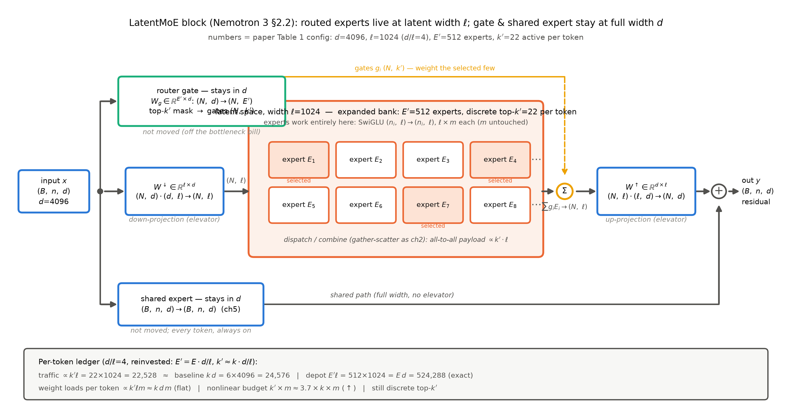
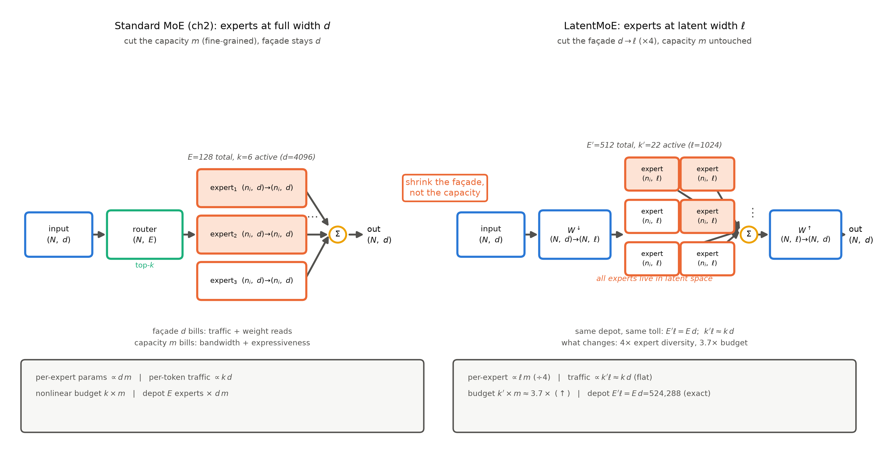

# 第 11 章 LatentMoE 支线：把专家搬进更小的空间

## 11.0 开篇：从全书到这里

上一章合上时镜头交到了这里：「镜头拉回全书：两刀已装、训练侧组件已齐、旗舰已拆——本册的『怎么办』到此全部交付。但第 5 章之后 MoE 的演化还有一条支线没走：专家本身住得太大了，能不能把整个车间搬进紧凑作坊？下一章用 LatentMoE 收掉这条支线，然后全书收束、三本账移交。」【第 10 章成稿直引】

按旅程地图，这是「拆机与整合」一段的尾声站，也是本册最后一站新知识——而且是一站**支线**：它不在两刀的主航道上（第 9 章的两刀机不装它），单独开一章，是因为 MoE 的演化故事到这里缺一块拼图。第 5 章把「选谁」的机构做到了 2024 年的完成态：细粒度、共享专家、免损失均衡。但有一件事从第 2 章到第 10 章一直没动过：**每个被选中的专家，本身住在一间全宽 $d$ 的大车间里**。本章要回答的问题是：专家本身住得太大了——能不能把整个车间搬进紧凑作坊，还让模型更好？2025 年 12 月的 NVIDIA Nemotron 3 论文给出了第一个系统回答（LatentMoE，机构首现于其 §2.2）。产出三样：一张 LatentMoE 块的数据流图（含全部形状流转）、一本 $d/\ell$ 账本——通信、读取、仓库三线持平、产能线白赚，算例全部手算进正文（本章按大纲无代码交付物）、一张旗舰级对照表（同 token、同超参、同预算，五项聚合全胜）。到本章结束，本册的新知识全部交付；下一章收束全书，清点十钩与三本账的去向。

> **最小背景栏**：本章只补一件前置（两种部署档位的瓶颈画像，11.1 节随引文即补），其余全部指回。MoE 块四步机构与形状流转（展平、打分 $(N,E)$、top-$k$ 硬选择、gather-scatter 派发）＝第 2 章图 2.1 与式 (2.1)——本章块内机构是它的直系变体，只改专家的工作维；细粒度分割的组合数论证、「参数上切细是免费的重新分割」与共享专家＝第 5 章 5.2/5.3 节式 (5.1)；all-to-all 通信账单（每 token 寄 $k$ 封信、载荷随激活份数与表征宽增长）＝第 2 章 2.6 节与第 5 章 5.4 节；总参/激活参双口径与「引官方数先判口径」＝第 1 章式 (1.1)-(1.3)；把 $(B,n,d)$ 用一部下投影矩阵压进低维箱子再干活的直觉＝第 6 章式 (6.2) 的 $W^{DKV}$（箱子 $d_c$）——本章是同一手在 FFN 插槽上的重演。

## 11.1 专家住得太大了：两档瓶颈与一根产能线

先把「住得大」量出来。从 GShard 到 DSV3，无论粗粒度（Mixtral：8 个整 FFN 专家，中间宽 14336）还是细粒度（DSV3：256 个专家、中间宽 2048），专家的**工作维**始终钉在全模型宽 $d$ 上：每个专家吃 $(n_i,d)$、吐 $(n_i,d)$，与残差河同宽。细粒度革命切的是车间内部（中间维 $m$ 切小、多雇几家），车间的门面从来没人动过。动门面之前得先问：谁在按门面收费？

要答这道题，得先补一幅部署图景——MoE 上线服务时有两种跑法，瓶颈完全不同。第 1 章 1.5 节说过「显存照付全款」：全部 $E$ 个专家的权重都得装进显存。装下之后呢？**时延档**（latency-focused，一次只处理几十到几百个 token，追求最快响应）：每个 token 只点名 $k$ 个专家，但被点名的权重必须从显存搬进计算单元——batch 小的时候，一份权重搬进来只服务极少数 token，搬运的字节数远超乘加能吃下的算力，瓶颈是**内存带宽**。**吞吐档**（throughput-focused，一次几千个 token 同跑）：同一份权重被几千个 token 摊薄着用，读取不再是问题，新瓶颈浮上来——token 和各自选中的专家常住在不同设备上（第 2 章 2.6 节：专家天然分片），每一步都要把 token 表征寄出去、算完再收回来，瓶颈是 **all-to-all 通信**。

Nemotron 3 论文把这两本账写成三行原文，值得逐字看【证据等级：官方技术报告 2512.20856 v1 §2.2】。时延档一行："MoE computation is memory-bandwidth-bound: reading expert weights from memory dominates the cost and far exceeds the actual computation time. Each expert matrix has size $d\times m$, … so reducing memory bandwidth costs requires decreasing either $d$ or $m$"（读专家权重的时间压过计算本身；每个专家矩阵是 $d\times m$，要省带宽只能缩 $d$ 或缩 $m$）。吞吐档一行："The communication volume scales linearly with the number of top-$K$ active experts $K$ and the hidden dimension $d$, but is independent of the expert FFN intermediate dimension $m$"（通信量随激活份数 $K$ 与隐维 $d$ 线性涨，与 $m$ 无关——正是第 5 章 5.4 节那张账单的精确版）。还有第三行管质量：FFN 的表达力 "primarily controlled by the effective nonlinear budget, which is roughly proportional to $K\times m$"——有效非线性预算大致正比于 $K\times m$。

三行并起来是一张价目表，逐维念一遍。**门面 $d$**：通信按它计费、读取按它计费、表达力不数它——唯一「只上账、不上功」的维度，一边倒地该缩。**产能 $m$**：读取按它计费、表达力按它数它——缩它省钱但伤质量，两头为难。**激活份数 $k$ 与专家数 $E$**：通信与读取都按 $k$ 计费，而多样性与非线性预算都要靠它们长——花钱，但买的是货。于是策略自己浮出来：**缩 $d$，用省出的余量去付 $k$ 与 $E$ 的涨价**。第 5 章的细粒度革命动的是 $m$（车间切浅、多雇几家，用组合数把产能的损失换成多样性）；LatentMoE 动的是 $d$（车间搬窄、多开分店，产能 $m$ 一根手指不动）。而缩 $d$ 有个前提——token 得先被压进窄维再进车间。这一手我们恰好在第 6 章练过：MLA 把 KV 装箱，靠的是一部下投影电梯 $W^{DKV}\in\mathbb{R}^{d_c\times d}$（式 (6.2)）。把同款电梯装到 FFN 插槽门口，就是本章的全部故事。

> **【考据框】LatentMoE 首现考证**。机构首现＝NVIDIA Nemotron 3 论文 §2.2，节题原文 "LatentMoE: Hardware-Aware Expert Design for Improved Accuracy per Byte"（arXiv:2512.20856 v1，2025-12-24 提交——冻结窗口内）；「accuracy per byte」＝每字节权重的准确率，直指时延档「读权重的带宽」这个目标函数。arXiv 署名为机构作者 NVIDIA（部分二手引文题作 Blakeman et al.——引用格式以 arXiv 页面署名为准）。论文未披露配套 Super/Ultra 机型的参数量（发布计划在论文之后），本章只用其表 1 的消融口径。

## 11.2 LatentMoE 机构：投下去、扩开来、投回来

瓶颈账说清了「为什么是 $d$」，现在看机构。原文一句话讲完，逐字："Each token embedding is first projected from the original hidden dimension $d$ into a latent representation of smaller dimension $\ell < d$, routed to an expanded set of experts that operate entirely in this latent space, and then projected back to the original hidden dimension $d$."【证据等级：官方技术报告 2512.20856 v1 §2.2】每个 token 先从全宽 $d$ 投进更窄的潜维 $\ell$，被路由到一群**扩大了的**专家里——这群专家完全住在潜空间里干活——算完再投回全宽 $d$。写成公式（第 2 章式 (2.1) 与第 5 章式 (5.1) 的直系推广，本书记法）：

$$y \;=\; W^{\uparrow}\Big(\sum_{i\in\mathrm{TopK}_{k'}} g_i(x)\cdot E_i\big(W^{\downarrow}x\big)\Big)\;+\;\mathrm{Shared}(x) \tag{11.1}$$

用人话说：门口装一部下投影电梯 $W^{\downarrow}$，把 token 从全宽 $d$ 压到潜宽 $\ell$；专家们在 $\ell$ 宽的楼层里干活；出口再由上投影电梯 $W^{\uparrow}$ 送回全宽；共享专家不搬家。「选专家、按门控加权」这套第 2 章的机构一个字没改，改的只是专家的办公地址。形状逐框流转（$N=B\cdot n$ 展平 token 数；数值取表 11.1 右列 $d$=4096、$\ell$=1024、$E'$=512、$k'$=22）：

| 符号 | 含义 | 形状 |
|---|---|---|
| $x$ | 进入 MoE 块的隐状态 | $(B,n,d)$，$d$=4096 |
| $W^{\downarrow}$ / $W^{\uparrow}$ | 下投影 / 上投影（两部电梯，形状承第 6 章 $(d_c,d)$ 记法） | $(\ell,d)$ / $(d,\ell)$ |
| $W_g$ | 路由器打分矩阵（**不搬家**，全宽打分） | $(E',d)$，$E'$=512 |
| 打分 → 门控 | 逐 token 打分 → top-$k'$ 掩码与门控 | $(N,d)\to(N,E')\to(N,k')$ |
| $h=W^{\downarrow}x$ | 潜表征（展平后过电梯） | $(N,d)\cdot(d,\ell)\to(N,\ell)$ |
| $E_i$ | 潜宽专家（SwiGLU，中间宽 $m$） | $(n_i,\ell)\to(n_i,\ell)$ |
| $\sum g_iE_i$ | 选中专家加权合并（gather-scatter 照第 2 章） | $(N,\ell)$ |
| $W^{\uparrow}(\cdot)$ | 上投影回全宽 | $(N,\ell)\cdot(\ell,d)\to(N,d)$ |
| $\mathrm{Shared}$ | 共享专家（全宽、不展平、不路由，承式 (5.1)） | $(B,n,d)\to(B,n,d)$ |

（记号换算：论文把专家数记 $N\to N'$、激活数记 $K\to K'$；本册契约 $N$ 是展平 token 数、激活数记 $k$——本章一律写 $E\to E'$、$k\to k'$，引用时按此对表。）拿单个 token 沿图 11.1 从左到右走一遍：全宽表征 $(1,d)$ 先过电梯 $W^{\downarrow}$ 压成 $(1,\ell)$；路由门在**原表征**上打分（$W_g$ 吃 $(N,d)$ 吐 $(N,E')$，top-$k'$ 掩码 $(N,k')$），点名 22 个专家；这枚 $(1,\ell)$ 被寄往 22 个专家、各自算一遍 SwiGLU（每个 $(1,\ell)\to(1,\ell)$，中间过 $(1,m)$）；门控加权并成 $(1,\ell)$，再过电梯 $W^{\uparrow}$ 回到 $(1,d)$，与共享专家的全宽输出相加写回残差河。一条 $(B,n,4096)$ 的河，路由门与共享专家留在河边，路由支路乘电梯下楼、在 $\ell$ 宽的楼层里过一群专家、再乘电梯回河。

图 11.1 LatentMoE 块数据流（自绘示意级；机构依据＝Nemotron 3 §2.2 原文及其 Figure 3b 的描述【官方技术报告 2512.20856 v1】，全部张量框标形状，数值取表 11.1 右列）。路由门与共享专家留全宽——「不在瓶颈账单上的人不搬家」；黄虚线＝门控权重施加点；潜空间区（浅底）内 $E'$=512 个专家、每 token 离散选中 $k'$=22 个。复现：`python [`code/ch11/fig_ch11.py`](code/ch11/fig_ch11.py) --which dataflow`。

谁搬家、谁不搬家，论文划了一条干净的线，同样逐字："all non-routed computations, including the MoE routing gate (gating network), shared expert computation, and non-expert layers, remain in the original hidden dimension $d$, since they do not significantly contribute to the targeted bottlenecks"——所有非路由计算（路由门、共享专家、非专家层）留在全宽 $d$，因为它们不在瓶颈账单上【证据等级：官方技术报告 2512.20856 v1 §2.2】。门留全宽的道理在读账单：打分要看 token 的全貌，$W_g\in\mathbb{R}^{512\times4096}$ 打出 $(N,512)$ 再取 $(N,22)$；共享专家的身份没变——还是第 5 章那个「公共知识常驻车间」，只是此刻多了一层意味：整栋楼里它是唯一不用挤电梯的前馈支路。

这里必须当场拆掉一个错觉。「latent（潜在）」这个词容易让人望文生义出这样一幅画面：token 不再「选」专家，而是对全部 512 个专家做凸组合式的连续加权插值，专家成了一片可调色的连续空间——**不是的**。若是那样，式 (11.1) 里就不该有 $\mathrm{TopK}_{k'}$ 这个下标集，求和应跑遍全体、权重也无须经过 top-$k'$ 掩码；原文写的却是 "routed to an expanded set of experts"——路由仍是第 2 章那套硬选择：打分、top-$k'$、进或不进，门内权重照旧由门控给出。更有说服力的是方向：连续插值的想象意味着「软化选择」，而 LatentMoE 不但没有把激活数变小，反而把它**放大**了（6→22）——每 token 点名更多专家，但每一个都仍是二值门里的「选中少数」，其余 490 个连一次乘法都不参与。正确画面一句话：**专家住进了低维空间，但仍是选中的少数**——不是把专家变成可插值的颜料，而是把作坊变窄、多开分店。

电梯装好了，现在把 $d/\ell$ 的账手算一遍——本章没有代码，这笔账就是动手验证。取表 11.1 的两个真实配置：基线 Standard（$d$=4096、$E$=128、$k$=6），LatentMoE（$\ell$=1024、$E'$=512、$k'$=22），$d/\ell$=4。扩群配方论文给了式子：$E'=E\cdot d/\ell$、$k'=k\cdot d/\ell$——128×4=512 个专家、每 token 6×4=24 份激活；实配 512 与 22（22 比配方的 24 略保守，如实登记，不硬凑成恰好）。两条恒等式是全部账目的骨架：

$$E'\,\ell \;=\; E\,d, \qquad k'\,\ell \;\approx\; k\,d \tag{11.2}$$

用人话说：扩大后的「专家数×工作维」与原配**逐位相等**（仓库容量不变），「激活数×工作维」也与原配基本持平（每 token 通行费不变）——变的只是切分方式。逐线验算（每 token、每 MoE 层）：**通信线**（吞吐档），all-to-all 载荷正比于「激活份数×表征宽」——同样扩到四倍专家群，全宽方案是 24×4096=98,304 个元素，比基线 6×4096=24,576 涨四倍；潜宽方案 22×1024=22,528，不涨反微降 8%。**读取线**（时延档），每 token 要读的专家权重正比于「激活份数×单专家参数」——单专家从 $3dm$ 薄到 $3\ell m$（÷4），激活份数 6→22，两端相乘又落在持平偏降。**仓库线**（总参），$E'\ell$=512×1024=524,288=128×4096=$Ed$，逐位相等——第 5 章给细粒度分割下的判词原样适用：参数上这是免费的重新分割，不是扩建。**产能线**（白赚的），非线性预算 $k\times m$ 从 $6m$ 到 $22m$，×3.7——$m$ 一根手指没动。论文自己的总结句逐字可引："The reduction in dimensionality offsets the increase in expert count and active experts, which enables higher model quality at similar computational and communication budget."【证据等级：官方技术报告 2512.20856 v1 §2.2】省不是目的——**省出来的钱当场换成更多样的专家与更厚的非线性预算，账面不变，货物变好**。另有两笔零钱按本册记账纪律记上：电梯是新增常驻通行费（$2\ell d$=2×1024×4096≈8.4M 参数/层，相对 8B 激活参约千分之一）；门不搬家但长胖了（$(E'd-Ed)$≈1.6M/层，同量级）——两笔都记、都不改结论。图 11.2 把这笔账画成与经典 MoE 的并排对照：同一笔预算、两种切法。

图 11.2 经典 MoE（左，第 2 章机构）与 LatentMoE（右）的 diff 对照（自绘示意级，形状逐框标注）。同一条不等式 $E'\ell=Ed$、$k'\ell\approx kd$ 撑住仓库与通行费两本账；差异全在「切哪个维度」——左图切产能 $m$（细粒度），右图切门面 $d\to\ell$（LatentMoE），产能不动、非线性预算 ×3.7。复现：`python [`code/ch11/fig_ch11.py`](code/ch11/fig_ch11.py) --which diff`。

## 11.3 收益账与消融：同预算，五聚合全胜

机构与账都立了，最后一问只有账本能回答：压到四分之一宽的空间里路由加计算，质量付不付税？Nemotron 3 的表 1 是一张教科书级的对照（表 11.1 重排）：两台模型同架构家族、同 1T token、同超参，激活与总参双双对齐——单变量只剩几何。

**表 11.1** 同预算对照：Standard MoE vs LatentMoE（Nemotron 3 表 1 重排；两模型均训 1T token、超参相同【证据等级：官方技术报告 2512.20856 v1 §2.2 表 1（厂商自报）】；Δ 列为本书整理）

| | Standard MoE | LatentMoE | Δ |
|---|---|---|---|
| 激活 / 总参 | 8.09B / 72.6B | 8.02B / 72.8B | ≈持平 |
| 工作维 | $d$=4096（全宽） | $\ell$=1024（潜宽，$d/\ell$=4） | 门面 ÷4 |
| 专家数 / 每 token 激活 | 128 / 6 | 512 / 22 | ×4 / ×3.7 |
| MMLU-Pro | 48.30 | **52.87** | +4.57 |
| MMLU | 70.10 | **72.11** | +2.01 |
| Code | 51.95 | **55.14** | +3.19 |
| Math | 78.32 | **80.19** | +1.87 |
| Commonsense Understanding | 81.73 | **82.10** | +0.37 |

（聚合口径，论文原文：Code＝HumanEval/HumanEval+/MBPP/MBPP+ 平均；Math＝GSM8K CoT 与 MATH-500 平均；Commonsense Understanding＝RACE/ARC-Challenge/HellaSwag/Winogrande 平均。）

五项聚合全胜，而且涨幅最大的恰是最难的综合基准 MMLU-Pro（+4.57），最温和的是常识理解（+0.37）。潜空间路由**没付质量税，还赚了**。这个结果的机制读法顺着 11.2 的账目走：$d\to\ell$ 的线性投影理论上是有损的（第 6 章 6.2 节手算例的直觉——箱子是摘要不是原件），但再投资换来的专家多样性（$\binom{128}{6}$ 对 $\binom{512}{22}$）与非线性预算（×3.7）盖过了信息损失。涨幅的分布也有一个讲得通的解释（本书解读、非论文主张）：常识题靠公共知识就能答，共享专家原样保留，涨无可涨；跨领域的难题最吃「更多更专的知识组合」——恰是这次再投资买回来的东西。这也是本册第三次遇到「同账不同切」的对照：第 2 章等激活下 dense 对 MoE、第 5 章等激活下粗粒度对细粒度、本章等通信下全宽对潜宽——MoE 的进步史有一半是「同一笔预算换个切法」的对照史，而切法的好坏，从来只有消融说了算。我们在 26M 档给四臂消融立配臂公式、判据预注册，为的就是在自家机器上做同一种判断；NVIDIA 这张表是同一门手艺的旗舰级版本——两边的公平都来自「预算先对齐、变量只留一个」。

读数要过三道诚实条款。其一，厂商自报：NVIDIA 评 NVIDIA 的架构，评测集自选、聚合口径自定义（表下注释里那套平均法就是自家定义），方向可信、逐格精度留余量。其二，单一对照、无重复：旗舰级消融没有种子方差可言（本册 26M 档尚且要判据预注册），+4.57 的量级不在噪声讨论范围内，+0.37 那一格则别过度解读。其三，配置未全披露：层数、头数、$m$ 值、路由打分函数与均衡配方论文都没给——第 4 章 Mixtral「配方沉默」的又一例；好在核心几何（$d$、$\ell$、$E'$、$k'$）给全了，11.2 节的三线账可以完整复算，这已是 config 逆向意义上的「可验货」。

## 11.4 谱系定位与 K3 注记：支线，不是主干

质量关也过了，最后回答定位问题：LatentMoE 在 MoE 的演化谱系上站在哪里？把第 2-5 章走过的代际铺开——Shazeer 的噪声打分（第 2 章 2.3 节）、GShard 的容量与随机派单（第 2 章 2.4 节）、Switch 的 top-1（第 2 章 2.5 节）、DeepSeekMoE 的切细与共享（第 5 章）、DSV3 的免损失阀门（第 5 章 5.5 节）——主线上每一代都在回答同一组问题：均衡怎么治、专家切多细、共享几份；把这些回答连成线，就是第 5 章末尾那句「均衡手段在从损失函数搬进路由机制，最后搬进架构本身」（第 12 章会把它收束成全册的判断）。LatentMoE 问的是一个此前没人问的问题：**专家的工作空间本身多大**。它不动路由算法（打分、top-$k$、门控照旧）、不动均衡手段（第 5 章的 noaux 阀门照装）、不动共享专家（照留全宽），动的只有空间本身——所以它不在这条主干的任何一站上，而是从「架构本身还能改什么」那个方向新开的一个**正交岔口**：DSV3（256 选 8，全宽细粒度）与 LatentMoE（512 选 22，潜宽）是同一道题的两份解——都要多样性与均衡，一个切产能、一个切门面，两把刀落在不同的轴上。第 10 章拆过与速览过的 2025 年旗舰，主流仍是全宽（DSV3、gpt-oss、Qwen3-30B-A3B 全部），LatentMoE 是新开的岔口，走不走、怎么走，留给后面的世代。

这条岔口上还有两处与已学线索的呼应，值得点破。其一，与 MLA 同母题：第 6 章为**缓存**压 KV——箱子装的是状态，写一次、读多次；本章为**计算与通信**压 token——箱子装的是流水线，每个 token 现场进出。「用一部下投影把工作间搬进低维」在注意力与前馈两个插槽上各干各的活，是 2024-2025 年同一个设计母题的两面。其二，与 device-limited routing 同账单：第 5 章 5.4 节那张「每 token 寄 $k$ 封信」的 all-to-all 账单有两味药——DeepSeek 限地址（先选 $M$ 台设备，宁可次优、不让邮件遍历全机房），NVIDIA 缩包裹（把表征本身压窄四倍）；一个管「寄给谁」，一个管「包裹多大」，正交互补。

岔口的下一段路标只登记一句：这条支线在 2026 年长成了量产形态——Stable LatentMoE 把路由专家空间扩到 **896 个路由专家选 16**（2.8T 总参/104B 激活），在如此极端的稀疏度下靠三件稳定化处方立住：聚合后 RMSNorm、SiTU-GLU 限幅、Quantile Balancing（处方点名到此为止，机制不展开）【证据等级：官方技术报告（Kimi K3 技术报告）】。至此把开篇的比喻补完整，也是本章希望你带走的那幅画：**全宽共享专家是留在大车间里的通用流水线（宽 $d$，什么 token 都接）；路由专家群搬进紧凑作坊（宽 $\ell$，薄四倍）；作坊便宜，于是多开四倍分店、每 token 多点约四倍人手；运输车队按包裹宽度计费、料仓按作坊面积计费，两头同步缩小，正好把扩张的账付平；产能预算反而涨了。**

## 11.5 本章小结

开篇问「专家住得太大了怎么办」，答案分三步。第一步查账：两种部署档位的瓶颈证明门面 $d$ 是唯一「一边倒该缩」的维度——通信与读取按它计费，表达力不数它；产能 $m$ 与激活份数 $k$ 都是两头为难。第二步搬家：LatentMoE 用一对投影电梯（$W^{\downarrow}$、$W^{\uparrow}$）把路由专家搬进 $\ell$ 宽潜空间，路由门、共享专家与非专家层留全宽；路由仍是离散 top-$k'$，只是字典从 128 扩到 512。第三步再投资：$d/\ell$ 的折扣当场花掉——式 (11.2) 两条恒等式钉住仓库与通行费，通信、读取、仓库、激活四项全部持平（通信 22,528 对 24,576、仓库 524,288 逐位相等、激活 8.02B 对 8.09B），换来专家多样性 ×4、非线性预算 ×3.7；表 11.1 的五聚合全胜说明这笔同账不同切的买卖没付质量税、还赚了。

**带走的心智**：读任何 MoE 几何，先把专家矩阵拆成「门面 × 产能」（$d\times m$）——**门面按通信与读取计费，产能按表达力计费：细粒度切产能，LatentMoE 切门面；看到 ℓ 先想起「作坊变窄、多开分店」，而不是「专家可插值」——专家住进了低维空间，但仍是离散选中的少数。**再带一句账感：LatentMoE 的账面上什么都没省——省出来的当场花掉，换来同预算下更好的货；「省」是手段，accuracy per byte（每字节权重的准确率）才是目标。

镜头拉回全书：本册十三站到此全部走完——两把刀（第 2-6 章）、四件训练侧补件（第 7-8 章）、两台旗舰拆解（第 9-10 章）、一条支线（本章）。下一章收束：MoE 的历史是一部简化史，均衡手段一路从损失函数搬进路由机制、再搬进架构本身——共享与 latent 正是这条线的最后两站；把话说圆，清点十钩与三本账的去向，然后交棒。

> **【欠账】** Stable LatentMoE 的三件稳定化处方（聚合后 RMSNorm／SiTU-GLU 限幅／Quantile Balancing）各自怎么工作、为什么在「896 选 16」的极端稀疏下缺一不可——那才是它的正菜，→ **Book5 第 7 章**。
